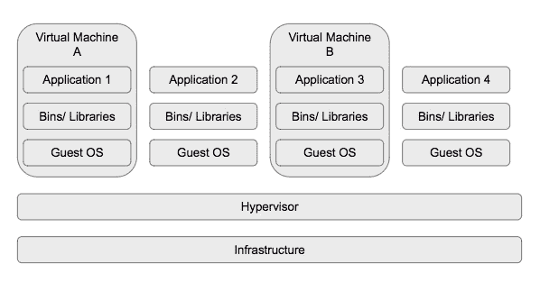
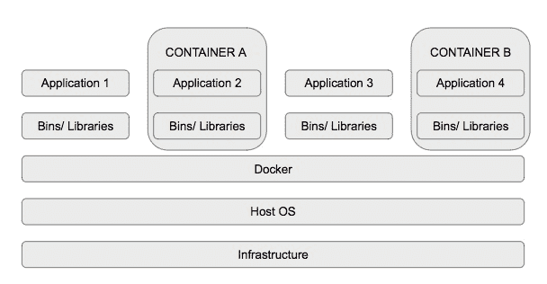
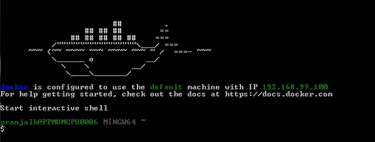
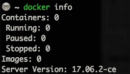
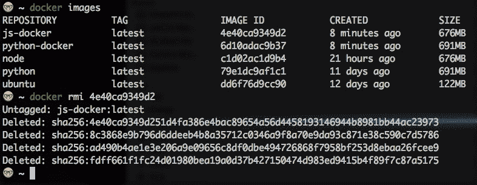
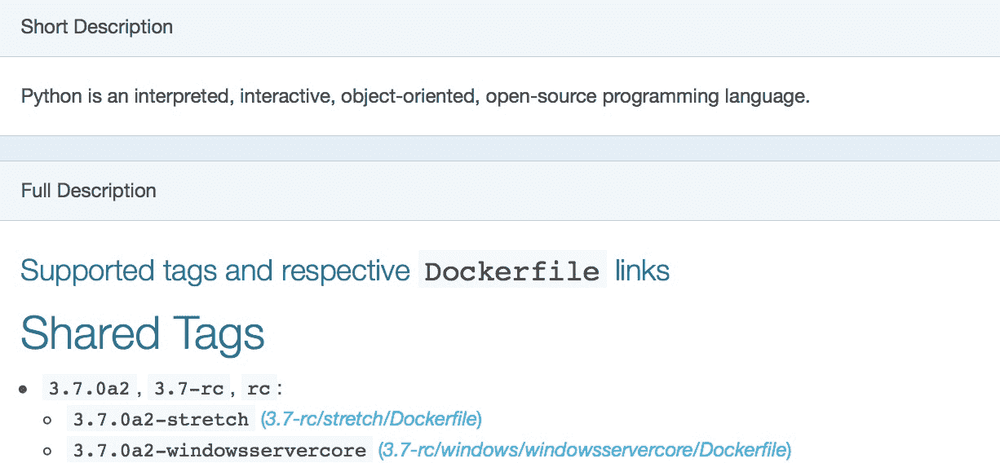

# 一、映像和容器

本课将讲述关于容器化的基本概念，作为我们稍后构建的映像和容器的基础。我们还将了解 Docker 如何以及为什么参与 DevOps 生态系统。在开始之前，我们将了解虚拟化与 Docker 中的容器化有何不同。

# 课程目标

本课结束时，您将能够:

*   描述 Docker 如何改进 DevOps 工作流
*   解释 Dockerfile 语法
*   构建映像
*   设置容器和映像
*   设置本地动态环境
*   在 Docker 容器中运行应用
*   获得 Docker 如何通过 Docker Hub 管理映像的基本概述
*   部署坞站映像到坞站中心

# 虚拟化与容器化

此框图概述了典型的虚拟机设置:



在虚拟机中，物理硬件是抽象的，因此我们有许多服务器运行在一台服务器上。虚拟机管理程序有助于做到这一点。

虚拟机有时确实需要时间启动，并且容量昂贵(它们的大小可以是千兆字节)，尽管它们相对于容器的最大优势是能够运行不同的 Linux 发行版，例如 CentOS，而不仅仅是 Ubuntu:



在容器化中，只有应用层(代码和依赖项打包的地方)被抽象出来，使得可以让许多容器在同一个操作系统内核上运行，但在不同的用户空间上运行。

容器占用空间少，启动快。这使得开发更加容易，因为您可以动态删除和启动容器，而不用考虑您有多少服务器或开发人员工作空间。

让我们从快速概述 Docker 如何在 DevOps 工作流和 Docker 环境中发挥作用开始这一课。

# Docker如何改进开发工作流程

DevOps 是一种心态，一种文化，一种思维方式。最终目标是尽可能改进和自动化流程。用外行人的话来说，DevOps 要求一个人以最懒惰的角度思考，这使得大多数(如果不是全部的话)过程尽可能自动化。

Docker 是一个开源容器化平台，它改善了开发生命周期的运输过程。请注意，它既不是现有平台的替代品，也不是组织想要的替代品。

Docker 像 Puppet 一样抽象了配置管理的复杂性。有了这种设置，shell 脚本就变得没有必要了。Docker 还可以用于小型或大型部署，从 hello world 应用到成熟的生产服务器。

作为不同级别的开发人员，无论是初学者还是专家，您可能都使用过 Docker，但您甚至没有意识到这一点。如果您已经设置了一个连续的集成管道来在线运行您的测试，大多数服务器使用 Docker 来构建和运行您的测试。

Docker 因其敏捷性在技术社区获得了大量支持，因此，许多组织都在为其服务运行容器。此类组织包括以下组织:

*   持续集成和持续交付平台，如 Circle CI、Travis CI 和 Codeship
*   诸如**亚马逊网络服务****【AWS】**和**谷歌云平台****【GCP】**等云平台允许开发者在容器外运行应用
*   思科和阿里巴巴集团也在容器中运行他们的一些服务

Docker 在 DevOps 工作流程中的地位包括但不限于以下方面:

### 注

开发工作流中 Docker 用例的例子。

统一需求是指使用单个配置文件。Docker 将需求抽象并限制在一个 Dockerfile 文件中。

操作系统的抽象意味着人们不需要担心构建操作系统，因为存在预构建的映像。

Velocity 必须定义一个 Dockerfile 并构建容器来进行测试，或者使用一个已经构建的映像而不编写 Dockerfile。Docker 允许开发团队通过 shell 脚本避免在陡峭的学习曲线上投资，因为“自动化工具 X”太复杂了。

## 回顾Docker环境

我们更早地了解了容器化的基本原理。请允许我强调 Docker 为我们带来的替代工作流程。

正常情况下，我们有两部分工作的应用:项目代码库和配置脚本。代码库是应用代码。它由版本控制管理，托管在 GitHub 和其他平台中。

配置脚本可以是在主机上运行的简单外壳脚本，主机可以是从 Windows 工作站到云中完全专用的服务器的任何位置。

使用 Docker 不会干扰项目代码库，但会在供应方面进行创新，提高工作流和交付速度。这是 Docker 如何实现这一点的示例设置:


文件取代了供应脚本的位置。两者相结合(项目代码和 Dockerfile)就形成了 **Docker 映像。**Docker 映像可以作为应用运行。这个来源于 Docker 映像的运行中的应用被称为 **Docker 容器。**

Docker 容器允许我们在计算机上的全新环境中运行应用，这是完全一次性的。这是什么意思？

这意味着我们能够在计算机上声明和运行 Linux 或任何其他操作系统，然后在其中运行我们的应用。这也强调了我们可以根据需要多次构建和运行容器，而不会干扰计算机的配置。

借此，我给大家带来了四个关键词:**形象****容器****建造****奔跑**。接下来，我们将了解 Docker CLI 的本质。

# 基本Docker终端命令

打开命令提示符，检查 Docker 是否安装在您的工作站中。在您的终端上输入命令`docker`应显示以下内容:



这是 Docker 的可用子命令列表。要了解每个子命令的作用，请在终端上输入`docker-subcommand –help`:


运行`docker info`并注意以下事项:

*   容器
*   形象
*   服务器版本



此命令显示系统范围的信息。服务器版本号有时很重要，尤其是当新版本引入不向后兼容的东西时。Docker 的社区版有稳定的边缘版本。

我们现在来看几个常用的命令。

该命令在 **Docker中心**搜索映像:

```
docker search <term> (for example, docker search ubuntu)
```

Docker Hub 是默认的 Docker 注册表。Docker 注册表保存命名的 Docker 映像。Docker Hub 基本上就是“Docker 映像的 GitHub”。早些时候，我们看到运行一个 Ubuntu 容器而不构建一个；这是 Ubuntu 映像存储和版本控制的地方:


“有私人的 Docker 注册中心，重要的是你现在要意识到这一点。”？Docker中心在 hub.docker.com。一些图片在[store.docker.com](http://store.docker.com)托管，但 Docker Store 包含官方图片。然而，它主要关注 Docker 映像应用商店的商业方面，并提供工作流供使用。

寄存器页面如下所示:


登录页面如下所示:


从的结果可以看出用户是如何通过星星的数量来给图片打分的。你也可以判断映像是否是官方的。这意味着映像由注册表升级，在本例中是 Docker Hub。建议新的 Docker 用户使用官方映像，因为它们有很好的文档，安全，促进最佳实践，并且是为大多数用例设计的。一旦你确定了一个映像，你就需要在本地拥有它。

### 注

确保您能够从 Docker Hub 中搜索至少一个映像。映像种类从操作系统到库，如 Ubuntu、Node.js 和 Apache。

此命令允许您从 Docker Hub 搜索:

```
docker search <term>

```

比如`docker search ubuntu`。

此命令将映像从注册表中提取到您的本地计算机:

```
docker pull

```

比如`docker pull ubuntu`。

该命令一运行，您就会注意到它使用的是默认标签:`latest`。在 Docker Hub 中，您可以看到标签列表。对于**乌班图**，它们在此列出:[https://hub.docker.com/r/library/ubuntu/](https://hub.docker.com/r/library/ubuntu/)加上它们各自的Docker文件:


从 https://hub.docker.com/r/library/ubuntu/下载 Docker Hub 上的 Ubuntu 映像配置文件。

## 活动 1 —利用Docker拉动命令

让你熟悉`docke`或`pull`命令。

本活动的目标是通过运行列出的命令，以及在探索过程中通过操纵构建的容器寻求其他命令的帮助，来深入了解`docker-pull` CLI。

1.  Docker 启动并运行了吗？在终端或命令行应用上键入`docker`。
2.  该命令用于从 Docker Hub `.`

    ```
    docker pull

    ```

    中拉出映像

映像种类从操作系统到库，如 Ubuntu、Node.js 和 Apache。此命令允许您从 Docker Hub 中提取映像:

比如`docker pull ubuntu`。

该命令列出了我们在本地拥有的 Docker 映像:

*   `docker images`

当我们运行该命令时，如果我们已经从 Docker Hub 中提取了映像，我们将能够看到映像列表:


它们是根据存储库、标签、映像标识、创建日期和大小列出的。存储库只是映像名称，除非它来自不同的注册表。在这种情况下，你会有一个没有`http://`和**顶级域名(TLD)** 的网址，比如来自 Heroku 注册表的`>registry.heroku.com/<image-name>`。

该命令将检查名为`hello-world`的映像是否存在于本地:

```
docker run <image>

```

例如`docker run hello-world`:


如果映像不是本地的，默认情况下，它将从默认注册表 Docker Hub 中取出，并作为容器运行。

该命令列出了正在运行的容器:

```
docker ps
```

如果没有任何运行的容器，您应该有一个空白屏幕，标题为:


## 活动 2 —分析Docker命令行界面

通过在终端上键入`docker`，确保 Docker CLI 正在运行。

已经要求您演示到目前为止涵盖的命令。

让你熟悉 Docker 命令行界面。本活动的目标是通过运行列出的命令，以及在探索过程中通过操纵构建的容器寻求其他命令的帮助，来深入了解`docker-compose` CLI。目标是命令行界面足够灵活，能够在现实场景中使用它，例如运行自动化脚本。

1.  Docker 启动并运行了吗？在终端或命令行应用上键入`docker`。
2.  Search for the official Apache image using the CLI, using `docker search apache:`

    

3.  尝试使用`docker pull apache.`拉取映像
4.  使用`docker images.`确认映像在本地的可用性
5.  额外奖励:使用`docker run apache.`将映像作为容器运行
6.  奖励:停止容器使用`docker stop <container ID>.`
7.  奖励:使用`docker rm <contai` `ner ID>.`删除容器和映像

# dock file 语法

每个Docker的形象都是从一个Docker档案开始的。要创建应用或脚本的映像，只需创建一个名为 **Dockerfile** 的文件。

### 注

它没有扩展名，以大写字母 d 开头。

Dockerfile 是一个简单的文本文档，其中编写了作为容器模板的所有命令。Dockerfile 总是以基本映像开始。它包含创建应用或运行脚本的步骤。

在我们构建之前，让我们快速看一下编写 Dockerfiles 的一些最佳实践。

一些最佳实践包括但不限于以下内容:

*   **关注点分离**:确保每个 Dockerfile 尽可能集中在一个目标上。这将使它更容易在多个应用中重用。
*   **避免不必要的安装**:这样可以降低复杂度，让映像和容器足够紧凑。
*   **重用已经构建的映像**:Docker Hub 上有几个已经构建和版本化的映像；因此，与其实现已经存在的映像，不如通过导入来重用。
*   **层数有限**:最少的层数可以让一个人拥有紧凑或者更小的体型。内存是构建映像和容器时要考虑的一个关键因素，因为这也会影响映像的消费者或客户端。

我们将简单地从 Python 和 JavaScript 脚本开始。这些语言的选择是基于它们的受欢迎程度和易于演示。

## 为 Python 和 JavaScript 示例编写 Dockerfiles

### 注

不需要关于所选语言的经验，因为它们旨在动态地展示任何语言如何采用容器化。

### 蟒蛇

在我们开始之前，创建一个新的目录或文件夹；让我们把它作为我们的工作空间。

打开目录运行`docker search python`。我们来挑选官方形象:`python`。官方映像在**官方**栏中有**【确定】** 的值:


去[hub.docker.com](http://hub.docker.com)或者[store.docker.com](http://store.docker.com)搜索 python 得到正确的标签或者至少知道最新标签的 Python 映像是什么版本。我们将在*主题 D* 中更多地讨论标签。

映像标签应该是具有类似于`3.x.x`或`3.x.x-rc.`的语法的数字

创建一个名为`run.py`的文件，输入第一行如下:

```
print("Hello Docker - PY")
```

在同一文件夹级别创建一个新文件并命名为 **Dockerfile。**

### 注

我们没有文件扩展名。

在**文件**中增加以下内容:

```
FROM python
ADD . .
RUN ls
CMD python run.py
```

如前所述， **FROM** 命令指定了基础映像。

该命令也可以用于**继承**的观点。这意味着，如果包中已经存在映像，则不必在 Dockerfile 中包含额外的包安装。

**ADD** 命令将指定的源文件复制到映像文件系统中的目标位置。这意味着脚本的内容将被复制到指定的目录。

在这种情况下因为`run.py`和 Dockerfile 在同一个级别上，所以`run.py`被复制到我们正在构建的基础映像文件系统的工作目录中。

在构建映像时执行**运行**命令。`ls`在这里运行只是为了让我们看到映像文件系统的内容。

当基于我们将使用这个 Dockerfile 创建的映像运行容器时，使用 **CMD** 命令。这意味着在 Dockerfile 执行结束时，我们打算运行一个容器。

### JavaScript

退出上一个目录，新建一个目录。这个将演示一个节点应用。

在脚本中添加以下行并保存:

```
console.log("Hello Docker - JS")
```

运行`docker search node` -我们来挑选官方图片:`node`

记住官方形象在**官方**栏中有**【确定】**的值:


注意，node 是基于谷歌高性能、开源 JavaScript 引擎 V8 的 JavaScript 运行时。

前往[hub.docker.com](http://hub.docker.com)搜索节点获取正确的标签或者至少知道最新标签的节点映像是什么版本。

创建一个新的**文件**并添加以下内容:

这应该与脚本在同一文件级别。

```
FROM node
ADD . .
RUN ls
CMD node run.js

```

我们现在就讨论这些。

## 活动 3 —构建文档文件

通过在终端上键入`docker`，确保 Docker CLI 正在运行。

让你熟悉 Dockerfile 语法。本活动的目标是帮助理解和练习使用第三方映像和容器。这有助于更好地了解容器化对协作的影响。这通过构建已经存在的特性或资源来加快产品交付速度。

你被要求写一个简单的 Dockerfile 打印`hello-world`。

1.  Docker 启动并运行了吗？在终端或命令行应用上键入`docker`。
2.  创建一个新目录并创建一个新的 Dockerfile。
3.  编写一个包含以下步骤的 Dockerfile】

# 建筑映像

在我们开始构建映像之前，让我们先了解一下上下文。映像是一个独立的包，可以运行应用或分配的服务。映像是通过 Dockerfiles 构建的，docker files 是定义如何构建映像的模板。

容器被定义为运行时实例或映像版本。请注意，这将在您的计算机或主机上作为一个完全隔离的环境运行，这使得它对于测试等任务是一次性的和可行的。

准备好 Dockerfile 后，让我们进入 Python Dockerfile 目录并构建映像。

## Docker建造

构建映像的命令如下:

```
docker build -t <image-name> <relative location of the Dockerfile>
```

`-t`代表标签。`<image-name>`可以包括具体的标签，比如最新的。建议您这样做:始终标记映像。

**Dockerfile**的相对位置在这里将是一个`dot (.)`表示 docker file 与代码的其余部分在同一层；也就是说，它处于项目的根级别。否则，您将输入 Dockerfile 所在的目录。

例如，如果它在 Docker 文件夹中，你会有`docker build -t <image-name> docker`，或者如果它在高于根目录的文件夹中，你会有两个点。高两级是用三个点代替一个点。

### 注

终端上的输出，并与 Dockerfiles 上写的步骤进行比较。您可能希望有两个或多个 Dockerfile 来配置不同的情况，例如，一个 docker file 用于构建生产就绪的应用，另一个用于测试。不管你有什么理由，Docker 都有解决办法。

默认的 Dockerfile 是，是的，Dockerfile。按照最佳实践，任何额外的一个被命名为`Dockerfile.<name>`，比如说`Dockerfile.dev`。

要使用默认文件之外的 Dockerfile 构建映像，请运行以下命令:`docker build -f Dockerfile.<name> -t <image-name> <relative location of the Dockerfile>`

### 注

如果您使用对 Dockerfile 的更改来重建映像，而不指定不同的标签，将会构建一个新映像，并且之前的映像被命名为`<none>.`

`docker`构建命令有几个选项，您可以通过运行`docker build --help`自行查看。用诸如“最新”这样的名称标记映像也用于版本控制。我们将在*话题 F* 中对此进行更多讨论。

要构建映像，请在 Python 工作区中运行以下命令:

```
>$ docker build -t python-docker .

```

### 注

尾随点是这里语法的一个重要部分:


### 注

尾随点是这里语法的一个重要部分:


打开 JavaScript 目录，构建如下 JavaScript 映像:

```
>$ docker build -t js-docker .

```

运行命令将根据**文件**中的四行命令概述四个步骤。

运行`docker images`列出了你已经创建的两个映像和你之前提取的任何其他映像。

## 移除Docker映像

`docker rmi <image-id>`命令用于删除映像。让我提醒你，运行`docker images`命令可以找到映像标识。

要删除未标记的映像(假定不相关)，bash 脚本的知识会派上用场。使用以下命令:

```
docker rmi $(docker images | grep "^<none>" | awk "{print $3}")
```

这只是在`docker images`命令的行中搜索带有<none>的映像，并返回第三列中的映像标识:</none>



## 活动 4 —利用Docker映像

通过在终端上键入`docker`，确保 Docker CLI 正在运行。

让你熟悉用映像运行容器。

您被要求从活动 C 中编写的文档文件中构建一个映像。停止正在运行的容器，删除映像，并使用不同的名称重建它。

1.  Docker 启动并运行了吗？在终端或命令行应用上键入`docker` 。
2.  打开 JavaScript 示例目录。
3.  运行`docker build -t <choose a name>`(观察步骤并记录结果)。
4.  运行`docker run <the-name-you-chose>.`
5.  运行`docker stop <container ID>.`
6.  运行`docker rmi <add the image ID here>.`
7.  运行`docker build -t <choose new name>.`
8.  运行`docker ps`(注意结果；旧映像不应该存在)。

# 从映像运行容器

还记得我们提到的容器是由映像构建的吗？命令`docker run <image>`基于该映像创建一个容器。可以说容器是映像的运行实例。另一个提醒是，该映像可以是本地的，也可以在注册表中。

继续运行已经创建的映像`docker run python-docker`和`docker run js-docker:`


你注意到了什么？容器将输出传送到终端的相应线路。请注意，Dockerfile 中以 CMD 开头的命令是这样运行的:

```
docker build -t python-docker:test .  and docker build -t js-docker:test .
```

然后，运行以下命令:

```
python-docker:test and docker run js-docker:test
```

### 注

您将在终端上看不到任何输出。

这并不是因为我们没有一个命令`CMD`在容器一打开就运行。对于由 **Python** 和 **Node** 构建的两个映像，都有一个从基础映像继承的`CMD`。

### 注

创建的映像总是从基础映像继承。

我们运行的两个容器包含运行一次并退出的脚本。检查`docker ps`的结果，您将没有列出之前运行的两个容器中的任何内容。但是，运行`docker ps -a`会显示容器及其退出状态。

有一个命令列显示构建容器的映像的 CMD。

运行容器时，可以按如下方式指定名称:

`docker run --name <container-name> <image-name>`(例如`docker run --name py-docker-container python-docker`):


我们之前概述过，您只想要相关的 Docker 映像，而不是`<none>`标记的 Docker 映像。

作为对于容器，需要注意的是一张图片可以有多个容器。`docker rm <container-id>`是移除容器的命令。这适用于退出的容器(那些没有运行的容器)。

### 注

对于仍在运行的容器，您必须:

移除容器前，请停止容器(`docker stop <container-id>)`

用力移除容器(`docker rm <container-id> -f`)

如果运行`docker ps`、则不会列出任何容器，但如果我们运行`docker ps -a`，您会注意到容器已列出，它们的命令列将显示继承的 CMD 命令:`python3`和`node`:


## 蟒蛇

Python 映像的 Dockerfile 中的 CMD 为`python3`。这意味着`python3`命令在容器中运行，容器退出。

### 注

考虑到这一点，人们无需在自己的机器上安装 Python 就可以运行 Python。

尝试运行这个:`docker run -it python-docker:test`(用我们上次创建的映像)。

我们进入容器中的一个交互式 bash 外壳。`-it`指示 Docker 容器创建这个 shell。外壳运行`python3`，这是 Python 基础映像中的 CMD:


在命令`docker run -it python-docker:test python3 run.py, python3 run.py`中就像在容器内的终端中一样运行。注意`run.py`在容器内，所以运行。运行`docker run -it python python3 run.py`将表明缺少`run.py`脚本:


同样的也适用于 JavaScript，说明这个概念是全面适用的。

`docker run -it js-docker:test`(我们上次创建的映像)将有一个外壳运行节点(节点基础映像中的 CMD):


`docker run -it js-docker:test node run.js`将输出`Hello Docker - JS:`


这证明了 Docker 映像中的继承因素。

现在，用最后一行的 **CMD 命令**将 Dockerfiles 返回到它们的原始状态。

# 版本化映像和 Docker 集线器

还记得在*话题 D* 中谈到的版本化映像吗？我们通过添加最新的和使用一些数字对我们的映像，如`3.x.x`或`3.x.x-rc.`

在本主题中，我们将通过使用标签进行版本控制，并了解官方映像在过去是如何进行版本控制的，从而学习最佳实践。

这里使用的命令如下:

```
docker build -t <image-name>:<tag> <relative location of the Dockerfile>
```

比方说，我们知道 Python 有几个版本:Python 3.6、3.5 等等。Node.js 还有几个。如果您查看 Docker Hub 上的官方 Node.js 页面，您会在列表顶部看到以下内容:

9.1.0、9.1、9、最新(9.1/Dockerfile)(截至 2017 年 11 月):



这个版本化系统叫做 semver:语义版本化。该版本号以增量方式具有格式 MAJOR、MINOR、PATCH:

**主要**:对于向后不兼容的变更

**MINOR** :当你有向后兼容的变化时

**补丁**:当你修复向后兼容的 bug 时

您会注意到标签，如`rc`和其他附加到映像的预发布和构建元数据。

当建立你的形象，特别是发布给公众或你的团队时，使用 semver 是最好的做法。

也就是说，我主张你永远这样做，并把它作为个人的口头禅:永远是关键。它将消除使用映像时的模糊和混乱。

# 部署坞站映像到坞站中心

每次我们运行时，创建的映像在本地都是可用的。通常，Dockerfile 与代码库一起托管；因此，在新机器上，需要使用`docker build`来创建 Docker 映像。

借助 Docker Hub，任何开发人员都有机会将 Docker 映像托管到运行 Docker 的任何机器中。这有两个作用:

*   消除了重复的运行任务`docker build`
*   添加了一种共享应用的额外方式，与共享应用代码库链接和详细说明设置过程的**自述文件**相比，该方式更易于设置

`docker login`是通过命令行界面连接到**Docker中心**的命令。您需要在 hub.docker.com 有一个帐户，并通过终端输入用户名和密码。

`docker push <docker-hub-username/image-name[:tag]>`是将映像发送到注册表的命令，Docker Hub:


在[hub.docker.com](http://hub.docker.com)上对你的映像进行简单的搜索，就会得到你的 Docker 映像的输出。

在一台新机器上，一个简单的`docker pull <docker-hub-username/your-image-name>` 命令将在本地生成一份你的映像。

# 总结

在本课中，我们完成了以下工作:

*   回顾了 DevOps 工作流和 Docker 的一些用例
*   浏览 Dockerfile 语法
*   对应用和运行容器的构建映像有了深入的了解
*   构建了许多映像，对它们进行版本控制，并将其推送到 Docker Hub