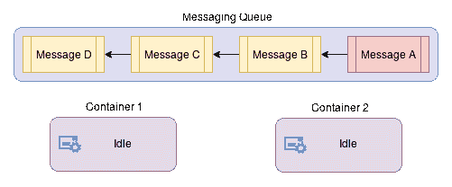
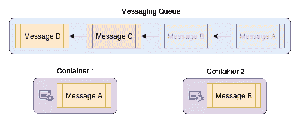
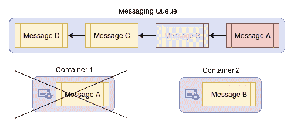
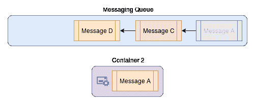

# 六、高级部署主题

我们花了大量时间讨论容器通信和安全性，但是在本章中，我们将通过介绍以下内容来进一步了解部署:

*   高级调试技术。
*   实现队列消息传递。
*   进行安全检查。
*   容器深度安全。

我们还将研究一些其他工具和技术，帮助您更好地管理部署。

# 高级调试

在野外调试容器的能力是一个非常重要的主题，我们之前已经介绍了一些在这里可能有用的更基本的技术。但是有些情况下`docker ps`和`docker exec`是不够的，所以在这一节中，我们将研究一些你可以添加到工具箱中的工具，它们可以帮助解决这些棘手的问题。

# 附加到容器的进程空间

有时候，容器运行的是极简主义的发行版，比如 Alpine Linux([https://www.alpinelinux.org/](https://www.alpinelinux.org/))，而有问题的容器有一个你想调试的进程，但也缺少调试所需的最基本的工具。默认情况下，Docker 将所有容器隔离在各自的进程名称空间中，因此我们当前的调试工作流(我们之前通过直接附加到该容器并试图找出非常有限的工具的错误)在这里不会有太大帮助。

幸运的是，Docker 完全能够将两个容器的进程名称空间与`docker run --pid "container:<name_or_id>"`标志连接起来，这样我们就可以将调试工具容器直接附加到受影响的容器上:

```
$ # Start an NGINX container
$ docker run -d --rm nginx
650a1baedb0c274cf91c086a9e697b630b2b60d3c3f94231c43984bed1073349

$ # What can we see from a new/separate container?
$ docker run --rm \
 ubuntu \
 ps -ef 
UID        PID  PPID  C STIME TTY          TIME CMD
root         1     0  0 16:37 ?        00:00:00 ps -ef

$ # Now let us try the same thing but attach to the NGINX's PID space
$ docker run --rm \
 --pid "container:650a1bae" \
 ubuntu \
 ps -ef 
UID      PID  PPID  C STIME TTY    TIME CMD
root       1     0  0 16:37 ?      00:00:00 nginx: master process nginx -g daemon off;
systemd+   7     1  0 16:37 ?      00:00:00 nginx: worker process
root       8     0  0 16:37 ?      00:00:00 ps -ef
```

如您所见，我们只需将一个调试容器附加到同一个 PID 命名空间中，并以这种方式调试任何行为异常的进程，并且可以从调试工具的安装中保持原始容器的原始状态！使用这种技术，原始容器可以保持较小，因为工具可以单独运输，并且容器在整个调试过程中保持运行，因此您的任务不会被重新安排。也就是说，每当您使用此方法调试不同的容器时，请注意不要终止其中的进程或线程，因为它们很可能会级联并终止整个容器，从而停止您的调查。

有趣的是，如果您有一个不在您的发行版上运行的工具，并且有一个 Docker 容器(或者，如果您想使用一个容器来管理主机的进程)，这个`pid`标志也可以与`--pid host`一起调用来共享主机的进程名称空间:

```
$ # Sanity check
$ docker run --rm \
 ubuntu \
 ps -ef 
UID        PID  PPID  C STIME TTY          TIME CMD
root         1     0  0 16:44 ?        00:00:00 ps -ef

$ # Now we try to attach to host's process namespace
$ docker run --rm \
 --pid host \
 ubuntu \
 ps -ef 
UID        PID  PPID  C STIME TTY          TIME CMD
root         1     0  0 15:44 ?        00:00:02 /sbin/init splash
root         2     0  0 15:44 ?        00:00:00 [kthreadd]
root         4     2  0 15:44 ?        00:00:00 [kworker/0:0H]
<snip>
root      5504  5485  3 16:44 ?        00:00:00 ps -ef
```

这个标志的功能可以为运行和调试应用提供多大的能力应该是显而易见的，所以不要犹豫使用它。

Warning! Sharing the host's process namespace with the container is a big security hole as a malicious container can easily commandeer or DoS the host by manipulating processes, especially if the container's user is running as a root. Due to this, exercise extreme caution when utilizing `--pid host` and ensure that you use this flag only on containers you trust completely.

# 调试 Docker 守护程序

如果这些技术到目前为止都没有帮助到你，你可以尝试运行 Docker 容器，并检查守护程序 API 正在使用`docker system events`做什么，它跟踪几乎所有在其 API 端点上触发的动作。您可以将它用于审核和调试，但是一般来说，后者是它的主要目的，正如您在下面的示例中看到的那样。

在第一个终端上，运行以下命令并保持其运行，以便我们可以看到可以收集的信息:

```
$ docker system events
```

在另一个终端上，我们将运行一个新的容器:

```
$ docker run -it \
 --rm \
 ubuntu /bin/bash 
$ root@563ad88c26c3:/# exit
exit
```

完成容器的启动和停止后，第一个终端中的`events`命令应该会输出类似如下的内容:

```
$ docker system events
2017-09-27T10:54:58.943347229-07:00 container create 563ad88c26c3ae7c9f34dfe05c77376397b0f79ece3e233c0ce5e7ae1f01004f (image=ubuntu, name=thirsty_mccarthy)
2017-09-27T10:54:58.943965010-07:00 container attach 563ad88c26c3ae7c9f34dfe05c77376397b0f79ece3e233c0ce5e7ae1f01004f (image=ubuntu, name=thirsty_mccarthy)
2017-09-27T10:54:58.998179393-07:00 network connect 1e1fd43bd0845a13695ea02d77af2493a449dd9ee50f2f1372f589dc4968410e (container=563ad88c26c3ae7c9f34dfe05c77376397b0f79ece3e233c0ce5e7ae1f01004f, name=bridge, type=bridge)
2017-09-27T10:54:59.236311822-07:00 container start 563ad88c26c3ae7c9f34dfe05c77376397b0f79ece3e233c0ce5e7ae1f01004f (image=ubuntu, name=thirsty_mccarthy)
2017-09-27T10:54:59.237416694-07:00 container resize 563ad88c26c3ae7c9f34dfe05c77376397b0f79ece3e233c0ce5e7ae1f01004f (height=57, image=ubuntu, name=thirsty_mccarthy, width=176)
2017-09-27T10:55:05.992143308-07:00 container die 563ad88c26c3ae7c9f34dfe05c77376397b0f79ece3e233c0ce5e7ae1f01004f (exitCode=0, image=ubuntu, name=thirsty_mccarthy)
2017-09-27T10:55:06.172682910-07:00 network disconnect 1e1fd43bd0845a13695ea02d77af2493a449dd9ee50f2f1372f589dc4968410e (container=563ad88c26c3ae7c9f34dfe05c77376397b0f79ece3e233c0ce5e7ae1f01004f, name=bridge, type=bridge)
2017-09-27T10:55:06.295496139-07:00 container destroy 563ad88c26c3ae7c9f34dfe05c77376397b0f79ece3e233c0ce5e7ae1f01004f (image=ubuntu, name=thirsty_mccarthy)
```

它的使用是相当合适的，但是这种类型的跟踪，以及我们到目前为止讨论过的其他技巧和诀窍，应该为您提供工具来解决基于 Docker 的集群上的几乎任何类型的问题。抛开已经提到的一切，以我个人的经验，也有过几次需要`gdb`的时候，也有过几次问题变成上游 bug 的时候。正因为如此，准备好在扩大规模时弄脏你的手，因为新问题的可能性也会增加。

# 高级网络

网络是 Docker 集群最重要的事情之一，它需要在集群上保持运行和平稳运行，以便整个系统以任何容量运行。考虑到这一点，我们理所当然应该讨论一些我们还没有讨论过的主题，这些主题在大部分实际部署中都很重要，无论大小。很有可能您会在自己的部署中遇到至少一个这样的用例，所以我建议您通读一遍，但是您的里程可能会有所不同。

# 静态主机配置

在某些特定的配置中，您的网络上可能有一台主机需要映射或重新映射到试图到达该主机的容器的特定 IP 地址。这允许命名服务器的灵活配置，并且对于网络上没有好的网络 DNS 服务器的静态主机来说，可以是真正的救命稻草。

要将这样的主机映射添加到容器中，您可以使用`docker run --add-host`运行容器，并使用此标志，在`/etc/hosts`中添加一个与您的输入匹配的条目，以便您可以正确地将您的请求路由到它:

```
$ # Show what the default /etc/hosts has
$ docker run --rm \
 -it \
 ubuntu \
 /bin/cat /etc/hosts 
127.0.0.1    localhost
::1    localhost ip6-localhost ip6-loopback
fe00::0    ip6-localnet
ff00::0    ip6-mcastprefix
ff02::1    ip6-allnodes
ff02::2    ip6-allrouters
172.17.0.2    3c46adb8a875

$ # We now will add our fake server1 host mapping
$ docker run --rm \
 -it \
 --add-host "server1:123.45.67.89" \
 ubuntu \
 /bin/cat /etc/hosts 
127.0.0.1    localhost
::1    localhost ip6-localhost ip6-loopback
fe00::0    ip6-localnet
ff00::0    ip6-mcastprefix
ff02::1    ip6-allnodes
ff02::2    ip6-allrouters
123.45.67.89    server1
172.17.0.2    dd4d7c6ef7b8

$ # What does the container see when we have an additional host?
$ docker run --rm \
 -it \
 --add-host "server1:123.45.67.89" \
 ubuntu /bin/bash 
root@0ade7f3e8a80:/# getent hosts server1
123.45.67.89    server1

root@0ade7f3e8a80:/# exit
exit
```

如上所述，当您有一个非容器化的服务，而您不想将 IP 硬编码到容器中，并且也无法从互联网 DNS 服务器解析时，这可能非常有用。

# DNS 配置

说到域名系统，我们可能应该谈谈 Docker 域名系统的处理。默认情况下，Docker Engine 使用来自主机的 DNS 设置，但是在一些高级部署设置中，其中正在部署群集的网络位于已经构建的网络中，有时可能需要为引擎或容器配置自定义 DNS 设置或 DNS 搜索前缀(也称为域名)。在这种情况下，您可以通过将`dns`和/或`dns-search`参数添加到`/etc/docker/daemon.json`并重新启动守护程序来轻松覆盖 Docker 引擎的默认 DNS 设置。这两个参数都允许多个值，并且非常简单明了:

```
{
...
        "dns": ["1.2.3.4", "5.6.7.8", ...],
        "dns-search": ["domain.com", ...],
...
}
```

In all networking setups that I have ever worked on, I have not seen a situation where overriding DNS server IPs or DNS search prefixes is a better option to deploying your own DHCP server within the network and setting the appropriate options for the DNS server(s) (`option 6`) and domain name (`option 15`), which the machine will pick up when initializing the network interface. If you would like to find out more about these DHCP flags, I would highly recommend that you visit [https://en.wikipedia.org/wiki/Dynamic_Host_Configuration_Protocol#DHCP_options](https://en.wikipedia.org/wiki/Dynamic_Host_Configuration_Protocol#DHCP_options) and read up on them before using the parameters we mentioned previously. Caution! In some cases where the engine host's DNS servers are pointed to `localhost` ranges, as they are in most `systemd-resolve` and `dnsmasq` setups, the container cannot access the host's `localhost` address and is thus replaced with Google's DNS servers (`8.8.8.8` and `8.8.4.4`) by default for all containers running on that instance. If you would like to retain the host's DNS setting within the container, you must ensure that the DNS resolver in the configuration is not one on the `localhost` IP range and is accessible by container networks. You can find more information about this at [https://docs.docker.com/engine/userguide/networking/default_network/configure-dns/](https://docs.docker.com/engine/userguide/networking/default_network/configure-dns/).

如果您对引擎范围内的配置不感兴趣，并且只试图覆盖单个容器的 DNS 设置，您可以通过在`docker run`命令中添加`--dns`和`--dns-search`选项来执行相同的操作，这会替换相关容器中的默认`/etc/resolv.conf`设置:

```
$ # Since my default DNS is pointed to localhost, the default should be Google's DNS servers
$ docker run --rm \
 -it \
 ubuntu \
 /bin/cat /etc/resolv.conf 
# Dynamic resolv.conf(5) file for glibc resolver(3) generated by resolvconf(8)
#     DO NOT EDIT THIS FILE BY HAND -- YOUR CHANGES WILL BE OVERWRITTEN
# 127.0.0.53 is the systemd-resolved stub resolver.
# run "systemd-resolve --status" to see details about the actual nameservers.
nameserver 8.8.8.8
nameserver 8.8.4.4

$ # Now we will specify a custom DNS and DNS search prefix and see what the same file looks like
$ docker run --rm \
 -it \
 --dns 4.4.4.2 \
 --dns-search "domain.com" \
 ubuntu \
 /bin/cat /etc/resolv.conf 
search domain.com
nameserver 4.4.4.2
```

如您所见，容器中的设置已经更改，以匹配我们的参数。在我们的例子中，任何域名解析都将流向`4.4.4.2`服务器，任何不合格的主机名都将首先被解析为`<host>.domain.com`。

# 覆盖网络

我们只是在[第 4 章](4.html)、*扩展容器、*中简单地提到了这一点，但是为了让我们的容器与 Swarm 服务发现一起工作，我们不得不创建这种类型的网络，尽管我们并没有花太多时间解释它是什么。在 Docker Swarm 的上下文中，一台机器上的容器无法到达另一台机器上的容器，因为它们的网络在穿过网络时会直接路由到下一跳，而桥接网络会阻止每个容器到达同一节点上的邻居。为了在这种多主机设置中无缝地将所有容器连接在一起，您可以创建一个覆盖网络，该网络跨越集群中的任何 Swarm 节点。可悲的是，这种类型的网络只在 Docker Swarm 集群中可用，所以一般来说，它在编排工具上的可移植性有限，但是您可以使用`docker network create -d overlay network_name`创建一个。由于我们已经在[第 4 章](4.html)、*扩展容器*中介绍了一个使用这种类型网络的部署示例，因此您可以在那里查看它的运行情况。

Caution! Overlay networks do not communicate data securely by default with other nodes, so using the `--opt encrypted` flag when creating one is highly encouraged where network transport cannot be trusted fully. Using this option will incur some processing cost and will require you to allow port `50` communication within your cluster, but in most cases, it should be worth it turning it on.

# Docker 内置网络映射

在前面的章节中，我们主要使用具有默认网络设置的容器，在大多数情况下，这些容器使用`bridge`网络，因为这是默认设置，但是这不是唯一可以用于容器的网络类型。以下是可用网络连接的列表，几乎所有连接都可以通过`docker run --network`参数进行设置:

*   `bridge`:如前几章所述，这种类型的网络在主机上创建一个独立的虚拟接口，用于与容器进行通信，容器可以与主机和互联网进行通信。通常，在这种类型的网络中，容器间的通信是被阻止的。
*   `none`:禁用容器的所有网络通信。这对于只包含工具而不需要网络通信的容器非常有用。
*   `host`:使用主机的网络栈，不创建任何虚拟接口。
*   `<network_name_or_id>`:连接到命名网络。当您创建网络并希望将多个容器放在同一个网络分组中时，此标志非常有用。例如，这对于将多个聊天容器(如 Elasticsearch)连接到它们自己的独立网络中非常有用。
*   `<container_name_or_id>`:这允许您连接到指定容器的网络栈。就像`--pid`标志一样，这对于调试运行的容器非常有用，而无需直接附加到它们，尽管网络可能需要根据所使用的网络驱动程序使用`--attachable`标志来创建。

Warning! Using the `host` networking switch gives the container full access to local system services and as such is a liability when used in any context other than testing. Use extreme caution when this flag is used, but luckily, there are only very few cases (if any) where there will be a legitimate use for this mode.

# Docker 通信端口

除非您正在运行 Docker Swarm，否则您可能永远不需要担心 Docker 使用什么端口进行通信，但是如果您在现场遇到此类配置或者您希望在集群中进行此类部署，这是一个相对较好的参考点。列表很短，但是每个端口对于大多数 Swarm 集群的运行都非常重要:

```
2377 TCP - Used for Swarm node communication
4789 UDP - Container ingress network
7946 TCP/UDP - Container network discovery
50 IP - Used for secure communication of overlay networks if you use "--opt encrypted" when creating the overlay network
```

# 高可用性管道

以前，我们大部分时间都在处理集群中节点之间基于套接字的通信，这通常对大多数人来说是有意义的，并且几乎在每种编程语言中都有围绕它构建的工具。因此，它是人们将传统基础设施转换为容器时通常会使用的第一个工具，但是对于处理纯数据处理的大型和超大型应用来说，由于超出处理管道剩余部分的特定阶段的容量而导致的背压，它根本无法正常工作。

如果您将每个集群服务想象成一组连续的转换步骤，那么基于套接字的系统将经历类似以下步骤的循环:

*   打开监听插座。
*   永远循环执行以下操作:
    *   等待上一阶段套接字上的数据。
    *   处理这些数据。
    *   将处理后的数据发送到下一级的套接字。

但是，如果下一阶段已经达到最大容量，最后一步会发生什么？大多数基于套接字的系统要么抛出一个异常，使该特定数据的处理流水线完全失败，要么阻止执行继续进行，并不断重试将数据发送到下一阶段，直到成功为止。因为我们不希望处理管道失败，因为结果不是错误，也不希望让我们的工作人员等待下一个阶段解除阻塞，所以我们需要能够以有序结构保存阶段输入的东西，以便前一个阶段可以继续处理它自己的一组新输入。

# 容器消息传递

对于我们刚刚讨论的场景，其中单个处理阶段的背压导致级联回流停止，消息队列(通常也称为发布/订阅消息系统)在这里为我们提供所需的精确解决方案。消息队列通常将数据作为消息存储在**先进先出**、**先进先出** ( **先进先出**)队列结构中，并通过允许发送方将所需输入添加到特定阶段的队列(“入队”)和允许工作方(侦听器)触发该队列中的新消息来工作。当工作人员处理消息时，队列对其他工作人员隐藏消息，当工作人员完成并成功时，消息将从队列中永久删除。通过以异步方式对结果进行操作，我们可以允许发送者继续处理他们自己的任务，并完全模块化数据处理管道。

要查看正在运行的队列，假设我们有两个正在运行的容器，并且在很短的时间内，消息 **A** 、 **B** 、 **C** 和 **D** 作为来自某个假想处理步骤的输入相继到达(红色表示队列顶部):



在内部，队列跟踪它们的顺序，最初，两个容器队列侦听器都没有注意到消息，但是很快，它们得到通知，有新的工作要做，因此它们按照接收消息的顺序获得消息。消息队列(取决于具体的实现)将这些消息标记为其他侦听器不可用，并为工作进程设置完成超时。在本例中**消息 A** 和**消息 B** 已由可用的工人标记为待处理:



在这个过程中，让我们假设**容器** 1 发生了灾难性的故障，它刚刚死亡。**消息 A** 队列上的超时没有完成就过期了，因此队列将它放回顶部，并使它再次可供监听器使用，同时我们的另一个容器继续工作:



随着**消息 B** 成功完成，**容器 2** 通知队列任务完成，队列将其从列表中完全删除。这样一来，容器现在接受最上面的消息，它原来是未完成的**消息 A** ，并且过程像以前一样继续:



虽然这个集群阶段一直在处理故障和过载，但是将所有这些消息放入队列的前一个阶段一直在处理它的专用工作负载。我们目前的阶段也没有丢失任何数据，尽管我们的处理能力有一半在随机时间点被强制移除。

工人的新伪代码循环现在有点像这样:

*   在队列中注册为侦听器。
*   循环永远执行以下操作:
    *   等待队列中的消息。
    *   处理队列中的数据。
    *   将处理后的数据发送到下一个队列。

有了这个新系统，如果流水线中有任何类型的处理变慢，那些过载阶段的队列将开始变大，但是如果早期阶段变慢，队列将缩小，直到它们变空。只要最大队列大小可以处理消息量，过载的阶段可以处理平均需求，您就可以确定管道中的所有数据最终都会被处理，您的扩展阶段触发器就像注意到不是由 bug 引起的更大的队列一样简单。这不仅有助于减少管道阶段扩展的差异，而且如果集群中的部分发生故障，这也有助于保留数据，因为队列会在故障期间增长，然后随着基础架构恢复到完全工作状态而清空，所有这些都不会丢失数据。

如果这种好处还不够积极的话，考虑一下现在可以保证数据已经被处理了，因为队列保存着数据，所以如果一个工作人员死了，队列会(正如我们之前看到的)将消息放回队列中，以便有可能被另一个工作人员处理，这与基于套接字的处理不同，后者在这种情况下会无声地死去。处理密度的增加、容错能力的提高以及对突发数据的更好处理使得队列对容器开发人员极具吸引力。如果您的所有通信也是通过队列完成的，那么这些工作人员可能甚至不需要服务发现，只需要告诉他们队列管理器在哪里，因为队列正在为您执行发现工作。

不出所料，大多数队列都是以开发成本为代价的，这就是为什么它们没有像人们预期的那样被广泛使用。在大多数情况下，您不仅需要将自定义队列客户端库添加到您的工作代码中，而且在许多类型的部署中，您还需要一个进程或某个守护进程，它将是处理消息的主要队列仲裁器。事实上，我可能会说，单独选择消息传递系统本身就是一项研究任务，但是如果您正在寻找快速答案，通常 Apache Kafka([https://kafka.apache.org/](https://kafka.apache.org/))、Rabbtmq([https://www.rabbitmq.com/](https://www.rabbitmq.com/))和 Redis 支持的自定义实现([https://redis.io/](https://redis.io/))似乎在内部消息传递队列从最大部署到最小部署的集群环境中更受欢迎。

As with all things we have been covering so far, most cloud providers offer some type of service for this (AWS SQS, Google Cloud Pub/Sub, Azure Queue Storage, and so on) so that you don't have to build it yourself. If you are OK with spending a little bit more money, you can utilize these and not worry about hosting the daemon process yourself. Historically, messaging queues have been hard to maintain and manage properly in house, so I would venture to say that many, if not most, cloud systems use these services instead of deploying their own.

# 实现我们自己的消息队列

抛开理论不谈，让我们看看如何构建自己的小队列发布者和侦听器。对于这里的例子，我们将使用一个基于 Redis 的更简单的消息传递系统，叫做`bull`([https://www.npmjs.com/package/bull](https://www.npmjs.com/package/bull))。首先，我们将编写运行整个系统的代码，为了让事情变得简单，我们将对消费者和生产者使用相同的映像。

在新目录中，创建以下内容:

As a reminder, this code is also in the GitHub repository and you can view it or clone it from [https://github.com/sgnn7/deploying_with_docker/tree/master/chapter_6/redis_queue](https://github.com/sgnn7/deploying_with_docker/tree/master/chapter_6/redis_queue) if you do not want to type the full text.

# package.json

这个文件几乎只是我们旧示例的副本，增加了`bull`包并更改了名称:

```
{
  "name": "queue-worker",
  "version": "0.0.1",
  "scripts": {
    "start": "node index.js"
  },
  "dependencies": {
    "bull": "^3.2.0"
  }
}
```

# index.js

`index.js`是一个单文件应用，要么每 1.5 秒向队列发送一个时间戳，要么根据调用参数从队列中读取。队列位置由`QUEUE_HOST`环境变量定义:

```
'use strict'

const Queue = require('bull');

const veryImportantThingsQueue = new Queue('very_important_things',
                                           { redis: { port: 6379,
                                                      host: process.env.QUEUE_HOST }});

// Prints any message data received
class Receiver {
    constructor () {
        console.info('Registering listener...');
        veryImportantThingsQueue.process(job => {
            console.info('Got a message from the queue with data:', job.data);
            return Promise.resolve({});
        });
    }
}

// Sends the date every 1.5 seconds
class Sender {
    constructor () {
        function sendMessage() {
            const messageValue = new Date();
            console.info('Sending a message...', messageValue);
            veryImportantThingsQueue.add({ 'key': messageValue });
        }

        setInterval(sendMessage, 1500);
    }
}

// Sanity check
if (process.argv.length < 2) {
    throw new Error(`Usage: ${process.argv.slice(2).join(' ')} <sender | receiver>`);
}

// Start either receiver or sender depending of CLI arg
console.info('Starting...');
if (process.argv[2] === 'sender') {
    new Sender();
} else if (process.argv[2] === 'receiver') {
    new Receiver();
} else {
    throw new Error(`Usage: ${process.argv.slice(0, 2).join(' ')} <sender | receiver>`);
}
```

# Dockerfile

这里没有什么特别的:这个文件几乎是我们旧的 Node.js 应用的精简版本:

```
FROM node:8

# Make sure we are fully up to date
RUN apt-get update -q && \
 apt-get dist-upgrade -y && \
 apt-get clean && \
 apt-get autoclean

# Container port that should get exposed
EXPOSE 8000

ENV SRV_PATH /usr/local/share/queue_handler

# Make our directory
RUN mkdir -p $SRV_PATH && \
 chown node:node $SRV_PATH

WORKDIR $SRV_PATH

USER node

COPY . $SRV_PATH/

RUN npm install

CMD ["npm", "start"]
```

我们现在将构建映像:

```
$ docker build -t queue-worker .
Sending build context to Docker daemon  7.168kB
<snip>
 ---> 08e33a32ba60
Removing intermediate container e17c836c5a33
Successfully built 08e33a32ba60
Successfully tagged queue-worker:latest
```

随着映像构建的完成，我们现在可以写出我们的栈定义文件:`swarm_application.yml`。我们几乎是在一个网络上创建队列服务器、队列侦听器和队列发送器，并确保它们可以在这里找到彼此:

```
version: "3"
services:
 queue-sender:
 image: queue-worker
 command: ["npm", "start", "sender"]
 networks:
 - queue_network
 deploy:
 replicas: 1
 depends_on:
 - redis-server
 environment:
 - QUEUE_HOST=redis-server

 queue-receiver:
 image: queue-worker
 command: ["npm", "start", "receiver"]
 networks:
 - queue_network
 deploy:
 replicas: 1
 depends_on:
 - redis-server
 environment:
 - QUEUE_HOST=redis-server

 redis-server:
 image: redis
 networks:
 - queue_network
 deploy:
 replicas: 1
 networks:
 - queue_network
 ports:
 - 6379:6379

networks:
 queue_network:
```

构建好映像和栈定义后，我们可以启动队列集群，看看它是否工作:

```
$ # We need a Swarm first
$ docker swarm init
Swarm initialized: current node (c0tq34hm6u3ypam9cjr1vkefe) is now a manager.
<snip>

$ # Now we deploy our stack and name it "queue_stack"
$ docker stack deploy \
               -c swarm_application.yml \
               queue_stack
Creating service queue_stack_queue-sender
Creating service queue_stack_queue-receiver
Creating service queue_stack_redis-server

$ # At this point, we should be seeing some traffic...
$ docker service logs queue_stack_queue-receiver
<snip>
queue_stack_queue-receiver.1.ozk2uxqnbfqz@machine    | Starting...
queue_stack_queue-receiver.1.ozk2uxqnbfqz@machine    | Registering listener...
queue_stack_queue-receiver.1.ozk2uxqnbfqz@machine    | Got a message from the queue with data: { key: '2017-10-02T08:24:21.391Z' }
queue_stack_queue-receiver.1.ozk2uxqnbfqz@machine    | Got a message from the queue with data: { key: '2017-10-02T08:24:22.898Z' }
<snip>

$ # Yay! It's working!

$ # Let's clean things up to finish up
$ docker stack rm queue_stack
Removing service queue_stack_queue-receiver
Removing service queue_stack_queue-sender
Removing service queue_stack_redis-server
Removing network queue_stack_redis-server
Removing network queue_stack_queue_network
Removing network queue_stack_service_network

$ docker swarm leave --force
Node left the swarm.
```

此时，我们可以添加任意数量的发送方和侦听器(在合理范围内)，我们的系统将以非常异步的方式正常工作，增加两端的吞吐量。不过，提醒一下，如果你决定走这条路线，强烈建议使用另一种队列类型(卡夫卡、SQS 等等)，但基本原则基本相同。

# 高级安全性

在前面的章节中，我们已经讨论了一些安全问题，但是对于一些似乎经常被忽略的问题，我们需要比文本中间的小信息框更深入地讨论它们，看看为什么它们在使用不当时会是如此大的问题。虽然实现我们在各种警告和信息框中指出的所有内容似乎需要做很多工作，但从长远来看，您向潜在入侵者提供的攻击面越小，您就越好。也就是说，除非你正在为一个政府机构部署这个系统，否则我预计会有一些妥协，但我敦促你强烈权衡每一个的利弊，否则你就有可能在午夜接到关于入侵的可怕电话。

Ironically, hardened systems usually take so much time to develop and deploy that they are often obsolete or provide marginal business value by the time they are in production environments, and due to their carefully assembled pieces, they are rarely (if ever) updated with a newer functionality, have patches applied to them quickly, or code improvements done on the source so it is a truly a double-edged sword. There is *never* a perfect solution, only a range of things you are comfortable with to some degree of dealing with. Historically, I have mostly seen horrible execution on either extremes of the fence so my advice here is that you look for a blend of the two if possible.

# 将 Docker 插座安装到容器中

这是开发人员在部署容器化解决方案时完全忽略的最严重的安全漏洞。对于与容器管理相关的各种事情，互联网上的建议通常倾向于将 Docker 套接字(`/var/run/docker.sock`)绑定安装到容器中，但很少提到的是，当您这样做时，实际上是让主机的根级访问这样的容器。由于 Docker 的套接字实际上只是一个 API 端点，Docker 守护程序作为根运行，因此容器可以简单地通过启动其他容器并在其上装载主机的系统文件夹，然后在这些容器上执行任意命令来逃避其包含。

For more information on using the Docker socket as a RESTful endpoint, you can take a look at the source code or explore a bit through the documentation for Docker Engine API at [https://docs.docker.com/engine/api/v1.31/](https://docs.docker.com/engine/api/v1.31/). The only thing you will generally need to do to use it through a tool such as `curl` is to add `--unix-socket <socket_path>` and, optionally `-H "Content-Type: application/json"` for `POST` requests. Docker has been making strides at turning its service into a userspace one from a root-level one, but so far, this feature has not materialized in any practical manner. While personally I have reservations about this happening anytime soon, keep an eye out for this feature as at some point it may actually get released and become a usable feature which would be a huge step forward for container security.

有了如何误用 Docker 套接字的理论，现在我们将打破我们的容器，尽管我们将停止实际做任何损害系统的事情:

```
$ Start a "benign" container with the Docker socket mounted and run Bash
$ docker run --rm \
 -it \
 -v /var/run/docker.sock:/var/run/docker.sock \
 ubuntu /bin/bash 

root@686212135a17:/# # Sanity check - make sure that the socket is there
root@686212135a17:/# ls -la /var/run/docker.sock
srw-rw---- 1 root 136 0 Sep 20 05:03 /var/run/docker.sock

root@686212135a17:/# # Install curl but almost any other HTTP client will work
root@686212135a17:/# # Even a base Python can do this but curl is fine for brevity
root@686212135a17:/# apt-get update && apt-get install -y curl
<snip>
done

root@686212135a17:/# # Create a container through the socket and bind-mount root to it
root@686212135a17:/# # with a "malicious" touch command to run
root@686212135a17:/# curl -s \
 --unix-socket /var/run/docker.sock \
 -H "Content-Type: application/json" \
 -d '{"Image": "ubuntu", "Cmd": ["touch", "/mnt/security_breach"], "Mounts": [{"Type": "bind", "Source": "/", "Target":"/mnt", "RW": true}]}' \
 -X POST \
 http:/v1.29/containers/create 
{"Id":"894c4838931767462173678aacc51c3bb98f4dffe15eaf167782513305c72558","Warnings":null}

root@686212135a17:/# # Start our escaped container
root@686212135a17:/# curl --unix-socket /var/run/docker.sock \
 -X POST \
 http:/v1.29/containers/894c4838/start

root@686212135a17:/# # Exit out of our "benign" container back to host
root@686212135a17:/# exit
exit

$ # Let's see what happened on our host
$ ls -la / | grep breach
-rw-r--r--   1 root root       0 Sep 20 23:14 security_breach 
$ # Oops!
```

现在应该很明显，良性容器只需几个命令行界面命令就能让主机扎根。虽然其中一些是基于作为根运行的容器进程，但是如果 Docker 组 ID 与容器中的非特权组冲突，也可能会发生同样的情况，但是抛开挑剔不谈，只要说在没有完全理解含义的情况下安装 Docker 套接字可能会导致非常痛苦的违规就足够了。考虑到这一点，这种技术有(尽管很少)合法的用途，所以在这里使用你最好的判断。

# 主机安全扫描

作为提高部署安全性的努力的一部分，Docker 发布了一个工具，该工具可以帮助运行名为 **Docker 安全工作台**的 Docker 引擎的主机轻松识别最常见的安全问题。该工具将扫描并验证您的配置中的大量可能的弱点，并将它们呈现在一个非常易于阅读的列表中。您可以像下载 Docker Hub 上的其他常规容器一样下载并运行此映像:

Warning! This security scan requires many permissions (`--net host`, `--pid host`, Docker socket mounting, and so on) that we have covered as generally really bad ideas to run on a host since they present a pretty large attack vector for malicious actors but on the other hand, the scan needs those permissions to check the settings you have. As such, I would highly recommend running this type of security scan on a clone of the host machine that you are trying to test in a network-isolated environment in order to prevent compromises of your infrastructure if the scanning image is maliciously modified.

```
$ docker run --rm \
 -it \
 --net host \
 --pid host \
 --cap-add audit_control \
 -e DOCKER_CONTENT_TRUST=$DOCKER_CONTENT_TRUST \
 -v /var/lib:/var/lib \
 -v /var/run/docker.sock:/var/run/docker.sock \
 -v /usr/lib/systemd:/usr/lib/systemd \
 -v /etc:/etc \
 docker/docker-bench-security
# ------------------------------------------------------------------------------
# Docker Bench for Security v1.3.3
#
# Docker, Inc. (c) 2015-
#
# Checks for dozens of common best-practices around deploying Docker containers in production.
# Inspired by the CIS Docker Community Edition Benchmark v1.1.0.
# ------------------------------------------------------------------------------

Initializing Mon Oct  2 00:03:29 CDT 2017

[INFO] 1 - Host Configuration
[WARN] 1.1  - Ensure a separate partition for containers has been created
[NOTE] 1.2  - Ensure the container host has been Hardened
date: invalid date '17-10-1 -1 month'
sh: out of range
sh: out of range
[PASS] 1.3  - Ensure Docker is up to date
[INFO]      * Using 17.09.0 which is current
[INFO]      * Check with your operating system vendor for support and security maintenance for Docker
[INFO] 1.4  - Ensure only trusted users are allowed to control Docker daemon
[INFO]      * docker:x:999
[WARN] 1.5  - Ensure auditing is configured for the Docker daemon
[WARN] 1.6  - Ensure auditing is configured for Docker files and directories - /var/lib/docker
[WARN] 1.7  - Ensure auditing is configured for Docker files and directories - /etc/docker
[INFO] 1.8  - Ensure auditing is configured for Docker files and directories - docker.service
<snip>
[PASS] 2.10 - Ensure base device size is not changed until needed
[WARN] 2.11 - Ensure that authorization for Docker client commands is enabled
[WARN] 2.12 - Ensure centralized and remote logging is configured
[WARN] 2.13 - Ensure operations on legacy registry (v1) are Disabled
[WARN] 2.14 - Ensure live restore is Enabled
[WARN] 2.15 - Ensure Userland Proxy is Disabled
<snip>
[PASS] 7.9  - Ensure CA certificates are rotated as appropriate (Swarm mode not enabled)
[PASS] 7.10 - Ensure management plane traffic has been separated from data plane traffic (Swarm mode not enabled)
```

这个列表很长，所以大部分输出行都被删除了，但是你应该对这个工具的功能和使用方法有一个很好的了解。请注意，这并不是该领域唯一的产品(例如，来自 https://github.com/coreos/clair 的 CoreOS 公司的克莱尔)，因此尽可能多地使用这些产品，以了解您在基础架构方面的弱点。

# 只读容器

在我们前面跨越大部分章节的例子的开发中，我们并没有真正关注容器在运行时是否改变了文件系统的状态。对于测试和开发系统来说，这不是一个问题，但是在生产中，为了防止来自内部和外部的恶意运行时利用，进一步锁定是非常重要的。为此，有一个`docker run --read-only`标志，它(不出所料)将容器的根文件系统安装为只读。通过这样做，我们可以确保所有未装载卷的数据都像构建映像时一样原始，从而确保一致性并保护您的群集。如果以这种方式运行容器，您可能需要注意的唯一一点是，在执行过程中，容器极有可能需要在`/run`、`/tmp`和`/var/tmp`等位置临时存储文件的位置，因此这些挂载应该作为`tmpfs`卷额外挂载:

```
$ # Start a regular container
$ docker run -it \
 --rm \
 ubuntu /bin/bash 
root@79042a966943:/# # Write something to /bin
root@79042a966943:/# echo "just_a_test" > /bin/test

root@79042a966943:/# # Check if it's there
root@79042a966943:/# ls -la /bin | grep test
-rw-r--r-- 1 root root      12 Sep 27 17:43 test

root@79042a966943:/# exit
exit

$ # Now try a read-only container
$ docker run -it \
 --rm \
 --tmpfs /run \
 --tmpfs /tmp \
 --tmpfs /var/tmp \
 --read-only \
 ubuntu /bin/bash 
root@5b4574a46c09:/# # Try to write to /bin
root@5b4574a46c09:/# echo "just_a_test" > /bin/test
bash: /bin/test: Read-only file system

root@5b4574a46c09:/# # Works as expected! What about /tmp?
root@5b4574a46c09:/# echo "just_a_test" > /tmp/test
root@5b4574a46c09:/# ls /tmp
test

root@5b4574a46c09:/# exit
exit
```

如果您不希望您的容器改变文件系统上的任何内容，并且由于容器通常不需要写入路径，如`/usr`，强烈建议在生产中使用此标志，因此如果可能的话，将其自由地应用于您的所有静态服务。

# 基本系统(包)更新

我们之前谈过一点，但是似乎在大多数在线文档和博客中，包更新在 Docker 容器的范围内被严重忽略了。虽然这两个阵营都有支持者，但重要的是要记住，不能保证从 Docker Hub 等地方获得的标记映像是用最新的更新构建的，即使有，标记映像也可能是前一段时间构建的，因此不包含最新的安全补丁。

诚然，在 Docker 容器中，主机的内核用于运行容器的上下文，但容器中任何支持库的安全漏洞都可能(通常也会)导致漏洞，这些漏洞通常会级联到主机和整个网络中。由于这个事实，我个人对将要部署到生产中的容器的建议是，如果可能的话，您应该始终确保容器是用最新的库构建的。手动升级一些基本映像上的包确实存在风险，尽管风险很小，但这是由升级时发生的库不兼容引起的，但一般来说，这是一个值得冒的风险。

在大多数情况下，为了进行这种升级，就像我们前面在大多数 Docker 示例中介绍的那样，您非常需要在`Dockerfile`中调用特定于映像的基本操作系统分布的系统升级行。对于我们的默认部署操作系统(Ubuntu LTS)，这个操作是通过`apt-get update`和`apt-get dist-upgrade`完成的:

```
...
RUN apt-get update && apt-get -y dist-upgrade
...
```

Caution! Do not forget that by default, `docker build` will cache all individual layers that have unchanged `Dockerfile` directives, so this command will work as expected the first time, but its layer will be pulled from the cache any subsequent time it is used if none of the lines preceding it have changed due to the fact that this line will stay the same regardless of packages changing upstream. If you want to ensure that you get the latest updates, you will have to break the cache either by changing a line above `apt-get` in your `Dockerfile` or by adding `--no-cache` to your `docker build` command. Also, note that using `--no-cache`, all layers will be regenerated, possibly causing a prolonged build cycle and/or registry disk use.

# 特权模式对上限增加和上限降低

您可能希望在容器中执行的一些高级操作，例如 **Docker-in-Docker (DinD)** 、NTP、安装环回设备以及许多其他操作，将需要比默认情况下授予容器根用户的权限更高的权限。因此，需要允许额外的特权来使容器无问题地运行，因此对于该用例，Docker 有一个非常简单但极其广泛的特权模式，它将完整的主机功能添加到容器中。要使用该模式，只需在`docker run`命令后添加`--privileged`:

**Docker-in-Docker** (commonly known as **DinD**) is a special configuration of a container that allows you to run the Docker Engine within the container that is already running on a Docker Engine but without sharing the Docker socket, which allows (if precautions are taken) a more secure and robust way to build containers within your infrastructure that is already containerized. The prevalence of this configuration is somewhat rare but is very powerful when used as part of a **Continuous Integration** (**CI**) and **Continuous Delivery** (**CD**) setup.

```
$ # Run an NTP daemon without the extra privileges and see what happens
$ docker run -it \
 --rm \
 cguenther/ntpd 
ntpd: can't set priority: Permission denied
reset adjtime failed: Operation not permitted
creating new /var/db/ntpd.drift
adjtimex failed: Operation not permitted
adjtimex adjusted frequency by 0.000000ppm
ntp engine ready
reply from 38.229.71.1: offset -2.312472 delay 0.023870, next query 8s
settimeofday: Operation not permitted
reply from 198.206.133.14: offset -2.312562 delay 0.032579, next query 8s
reply from 96.244.96.19: offset -2.302669 delay 0.035253, next query 9s
reply from 66.228.42.59: offset -2.302408 delay 0.035170, next query 7s
^C

$ And now with our new privileged mode
$ docker run -it \
 --rm \
 --privileged \
 cguenther/ntpd 
creating new /var/db/ntpd.drift
adjtimex adjusted frequency by 0.000000ppm
ntp engine ready
^C
```

如您所见，添加此标志会从输出中删除所有错误，因为我们现在可以更改系统时间。

解释了这种模式的功能后，我们现在可以讨论为什么理想情况下，如果可能的话，永远不要使用特权模式。默认情况下，特权模式实际上允许完全访问大多数主机系统，并且在大多数情况下不够精细，因此在您发现您的容器需要额外的特权后，您应该使用`--cap-add`来选择性地添加它们。这些标志是标准的 Linux 功能标识符，您可以在[http://man7.org/linux/man-pages/man7/capabilities.7.html](http://man7.org/linux/man-pages/man7/capabilities.7.html)等地方找到，并允许微调到您想要的访问级别。如果我们现在将之前的 NTP 守护程序示例转换为这种新样式，它应该看起来更像这样:

```
$ # Sanity check
$ docker run -it \
 --rm \
 cguenther/ntpd 
ntpd: can't set priority: Permission denied
<snip>
settimeofday: Operation not permitted
<snip>
^C

$ # Now with the added SYS_TIME capability
$ docker run -it \
 --rm \
 --cap-add SYS_TIME \
 cguenther/ntpd 
ntpd: can't set priority: Permission denied
creating new /var/db/ntpd.drift
adjtimex adjusted frequency by 0.000000ppm
ntp engine ready
reply from 204.9.54.119: offset 15.805277 delay 0.023080, next query 5s
set local clock to Mon Oct  2 06:05:47 UTC 2017 (offset 15.805277s)
reply from 38.229.71.1: offset 0.005709 delay 31.617842, next query 9s
^C
```

如果您注意到，由于另一个缺失的功能，我们仍然有一个可见的错误，但是`settimeofday`错误已经消失，这是我们需要修复的最重要的问题，以便该容器运行。

有趣的是，如果我们想提高安全性，我们还可以从容器中删除不与`--cap-drop`一起使用的功能。对于这个标志，还有一个特殊的关键字`ALL`，可以用来删除所有可用的特权。如果我们使用这个来完全锁定我们的 NTP 容器，但让一切正常工作，让我们看看会是什么样子:

```
docker run -it \
 --rm \
 --cap-drop ALL \
 --cap-add SYS_TIME \
 --cap-add SYS_CHROOT \
 --cap-add SETUID \
 --cap-add SETGID \
 --cap-add SYS_NICE \
 cguenther/ntpd 
creating new /var/db/ntpd.drift
adjtimex adjusted frequency by 0.000000ppm
ntp engine ready
reply from 216.229.0.49: offset 14.738336 delay 1.993620, next query 8s
set local clock to Mon Oct  2 06:16:09 UTC 2017 (offset 14.738336s)
reply from 216.6.2.70: offset 0.523095 delay 30.422572, next query 6s
^C
```

在这里，我们首先删除了所有功能，然后重新添加了运行容器所需的几个功能，正如您所看到的，事情进展顺利。在您自己的部署中，我强烈建议，如果您有多余的开发能力或者是面向安全的，请花一些时间以这种方式锁定您正在运行的容器，因为它们将更加安全，并且您将更加确信容器正在以最小特权的原则运行。

The **Principle of Least Privilege** is a concept in computer security where you allow only the minimal privileges needed to run a component to the user or a service. This principle is very much a staple of high-security implementations but is often not found elsewhere due to the assumed overhead of managing the access even though it is a great way to increase the security and stability of your systems. If you would like to find out more about this concept, you should definitely make your way to [https://en.wikipedia.org/wiki/Principle_of_least_privilege](https://en.wikipedia.org/wiki/Principle_of_least_privilege) and check it out.

# 摘要

在本章中，我们学习了部署健壮集群所需的许多高级工具和技术，例如:

*   管理容器问题的附加调试选项。
*   深入探讨 Docker 的高级网络主题。
*   实现我们自己的队列消息传递。
*   各种安全强化提示和技巧。

所有这些主题与之前的资料结合在一起，应该涵盖大多数集群的所有部署需求。但是在下一章中，我们将看到当主机、服务和任务的数量达到通常不期望的水平，并且我们开始看到集群崩溃时，我们需要担心什么问题，以及我们可以做些什么来缓解这些问题。