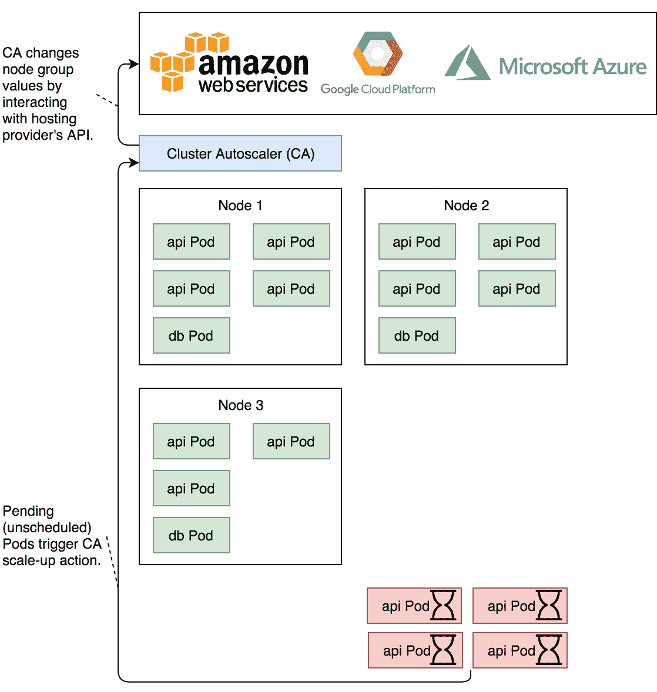
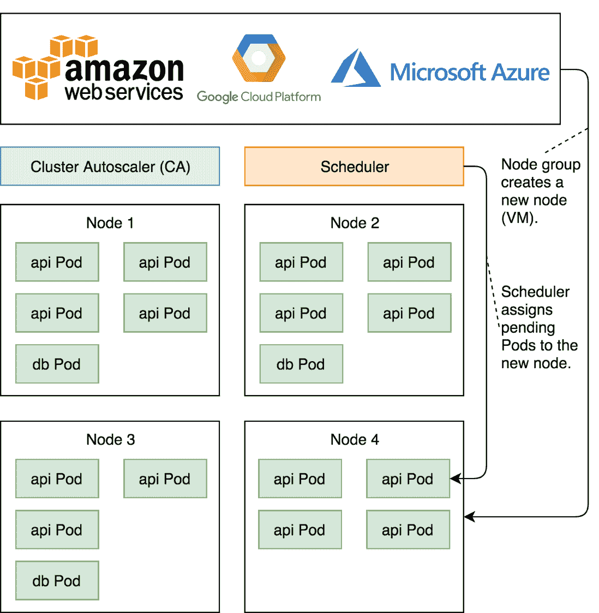
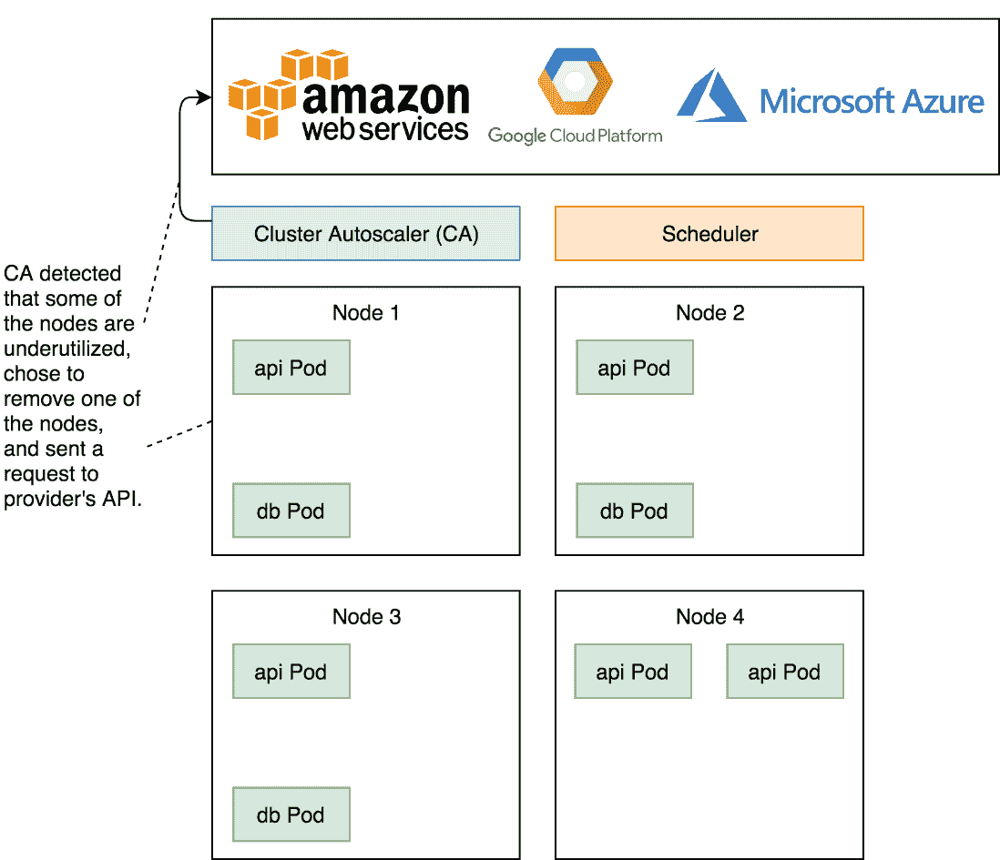

# 库本内特集群的自动缩放节点

May I say that I have not thoroughly enjoyed serving with humans? I find their illogic and foolish emotions a constant irritant.

- *史巴克*

**horizontalpodoautoscaler**(**HPA**)的使用是构建弹性、容错和高可用性系统的最关键方面之一。但是，如果没有具有可用资源的节点，这是没有用的。当 Kubernetes 因为没有足够的可用内存或中央处理器而无法调度新的 Pods 时，新的 Pods 将是不可调度的，并且处于挂起状态。如果我们不增加集群的容量，挂起的 Pods 可能会无限期地保持这种状态。为了让事情变得更复杂，Kubernetes 可能会开始移除其他 Pods，为那些处于挂起状态的 Pods 腾出空间。正如您可能已经猜到的那样，这可能会导致比我们的应用程序没有足够的副本来满足需求的问题更糟糕的问题。

Kubernetes 通过 Cluster Autoscaler 解决了节点伸缩的问题。

Cluster Autoscaler has a single purpose to adjust the size of the cluster by adding or removing worker nodes. It adds new nodes when Pods cannot be scheduled due to insufficient resources. Similarly, it eliminates nodes when they are underutilized for a period of time and when Pods running on one such node can be rescheduled somewhere else.

集群自动缩放器背后的逻辑很容易理解。我们还没有看到它是否也容易使用。

让我们创建一个集群(除非您已经有一个集群)，并为自动缩放做准备。

# 创建集群

我们将继续使用来自`vfarcic/k8s-specs`([https://github.com/vfarcic/k8s-specs](https://github.com/vfarcic/k8s-specs))存储库的定义。为了安全起见，我们先拉最新版本。

All the commands from this chapter are available in the `02-ca.sh` ([https://gist.github.com/vfarcic/a6b2a5132aad6ca05b8ff5033c61a88f](https://gist.github.com/vfarcic/a6b2a5132aad6ca05b8ff5033c61a88f)) Gist.

```
 1  cd k8s-specs
 2
 3  git pull
```

接下来，我们需要一个集群。请使用下面的 Gists 作为创建新集群或验证您已经满足所有要求的灵感。

A note to AKS users
At the time of this writing (October 2018), Cluster Autoscaler does not (always) work in **Azure Kubernetes Service** (**AKS**). Please jump to *Setting up Cluster Autoscaler in AKS* section for more info and the link to instructions how to set it up.

*   `gke-scale.sh` : **GKE** 带 3 个 n1-standard-1 工作节点，带 **tiller** ，带`--enable-autoscaling`参数([https://gist . github . com/vfarcic/9c 777487 F7 ebee 6c 09027 d3a 1 df 8663 c](https://gist.github.com/vfarcic/9c777487f7ebee6c09027d3a1df8663c))。
*   `eks-ca.sh` : **EKS** 带 3 个 T2 .小工人节点，带**分蘖**，带**度量服务器**([https://gist . github . com/vfarcic/3d fc71 DC 687 de 3 ed 98 E8 f 804 D7 abbob](https://gist.github.com/vfarcic/3dfc71dc687de3ed98e8f804d7abba0b))。
*   `aks-scale.sh` : **带有 3 个 Standard_B2s 工作节点的 AKS** 和带有**分蘖**([https://gist . github . com/vfarcic/f1b 05d 33 cc 8 a 98 e 4c eab 3d 3770 C2 feb](https://gist.github.com/vfarcic/f1b05d33cc8a98e4ceab3d3770c2fe0b))。

检查 Gists 时，您会注意到一些事情。首先，Docker for Desktop 和 minikube 不在那里。两者都是无法扩展的单节点集群。我们需要在可以按需添加和删除节点的地方运行集群。我们将不得不使用云供应商之一(例如，AWS、Azure、GCP)。这并不意味着我们不能扩展内部集群。

我们可以，但这取决于我们使用的供应商。有些人确实有解决办法，而有些人没有。为了简单起见，我们将坚持三大之一。请在**谷歌 Kuberentes 引擎** ( **GKE** )、亚马逊**Kubernetes 弹性集装箱服务**(**EKS**)或 **Azure Kubernetes 服务** ( **AKS** )之间进行选择。如果你不确定选择哪一个，我建议选择 GKE，因为它是最稳定和功能最丰富的托管 Kubernetes 集群。

您还会注意到，GKE 和 AKS Gists 与上一章相同，而 EKS 发生了变化。正如您已经知道的，前者已经有了度量服务器。EKS 没有，所以我复制了我们以前使用的 Gist，并添加了安装 Metrics Server 的说明。我们可能在本章中不需要它，但我们将在以后大量使用它，我希望您能习惯一直使用它。

如果您更喜欢在本地运行这些示例，您可能会对本章中我们将不使用本地集群的消息感到震惊。不要绝望。成本将保持在最低水平(总共可能只有几美元)，下一章我们将回到本地集群(除非您选择留在云中)。

现在我们在 GKE、EKS 或 AKS 有了一个集群，我们的下一步是启用集群自动扩展。

# 设置集群自动缩放

在开始使用集群自动缩放器之前，我们可能需要安装它。我说我们*可能*，而不是说我们*必须*，因为一些库本内特风味确实带有集群自动色卡，而其他的没有。我们将逐一介绍“三大”管理的 Kubernetes 集群。你可以选择探索这三个，或者跳到你更喜欢的一个。作为一种学习体验，我相信在所有三个提供商中体验运行 Kubernetes 是有益的。然而，这可能不是你的观点，你可能更喜欢只使用一个。选择权在你。

# 在 GKE 设置集群自动缩放器

这将是有史以来最短的部分。如果在创建集群时指定了`--enable-autoscaling`参数，那么在 GKE 就没什么可做的了。它已经带有预先配置好的集群自动缩放器。

# 在 EKS 设置集群自动缩放器

与 GKE 不同，EKS 没有集群自动缩放器。我们必须自己配置。我们需要向工作节点专用的自动缩放组添加一些标签，为我们正在使用的角色添加额外的权限，并安装集群自动缩放器。

我们走吧。

我们将向工作节点专用的自动缩放组添加一些标签。要做到这一点，我们需要发现该组的名称。由于我们使用 **eksctl** 创建了集群，因此名称遵循一种模式，我们可以使用该模式来过滤结果。另一方面，如果您在没有 eksctl 的情况下创建了 EKS 集群，那么逻辑应该仍然与下面的逻辑相同，尽管命令可能略有不同。

首先，我们将检索 AWS 自动缩放组的列表，并用`jq`过滤结果，以便只返回匹配组的名称。

```
 1  export NAME=devops25
 2
 3  ASG_NAME=$(aws autoscaling \
 4      describe-auto-scaling-groups \
 5      | jq -r ".AutoScalingGroups[] \
 6      | select(.AutoScalingGroupName \
 7      | startswith(\"eksctl-$NAME-nodegroup\")) \
 8      .AutoScalingGroupName")
 9
10 echo $ASG_NAME
```

后一个命令的输出应该类似于下面的命令。

```
eksctl-devops25-nodegroup-0-NodeGroup-1KWSL5SEH9L1Y
```

我们将集群的名称存储在环境变量`NAME`中。接下来，我们检索所有组的列表，并用`jq`过滤输出，以便只返回那些名称以`eksctl-$NAME-nodegroup`开头的组。最后，同一个`jq`命令检索了`AutoScalingGroupName`字段，并将其存储在环境变量`ASG_NAME`中。最后一个命令输出组名，以便我们可以(直观地)确认它看起来是正确的。

接下来，我们将向组中添加一些标签。Kubernetes 集群自动缩放器将与具有`k8s.io/cluster-autoscaler/enabled`和`kubernetes.io/cluster/[NAME_OF_THE_CLUSTER]`标签的集群一起工作。所以，我们所要做的就是添加这些标签，让 Kubernetes 知道使用哪个组。

```
 1  aws autoscaling \
 2      create-or-update-tags \
 3      --tags \
 4      ResourceId=$ASG_NAME,ResourceType=auto-scaling-group,Key=k8s.io/
    clusterautoscaler/enabled,Value=true,PropagateAtLaunch=true \
 5      ResourceId=$ASG_NAME,ResourceType=auto-scaling-
    group,Key=kubernetes.io/cluster/$NAME,Value=true,PropagateAtLaunch=true
```

我们在 AWS 中要做的最后一项更改是向通过 eksctl 创建的角色添加一些额外的权限。就像自动缩放组一样，我们不知道角色的名称，但是我们知道用来创建它的模式。因此，在向角色添加新策略之前，我们将检索角色的名称。

```
 1  IAM_ROLE=$(aws iam list-roles \
 2      | jq -r ".Roles[] \
 3      | select(.RoleName \
 4      | startswith(\"eksctl-$NAME-nodegroup-0-NodeInstanceRole\")) \
 5      .RoleName")
 6  
 7  echo $IAM_ROLE
```

后一个命令的输出应该类似于下面的命令。

```
eksctl-devops25-nodegroup-0-NodeInstanceRole-UU6CKXYESUES
```

我们列出了所有的角色，并使用`jq`过滤输出，以便只返回名称以`eksctl-$NAME-nodegroup-0-NodeInstanceRole`开头的角色。过滤角色后，我们检索`RoleName`并将其存储在环境变量`IAM_ROLE`中。

接下来，我们需要描述新策略的 JSON。我已经准备了一个，让我们快速看一下。

```
 1  cat scaling/eks-autoscaling-policy.json
```

输出如下。

```
{
  "Version": "2012-10-17",
  "Statement": [
    {
      "Effect": "Allow",
      "Action": [
        "autoscaling:DescribeAutoScalingGroups",
        "autoscaling:DescribeAutoScalingInstances",
        "autoscaling:DescribeLaunchConfigurations",
        "autoscaling:DescribeTags",
        "autoscaling:SetDesiredCapacity",
        "autoscaling:TerminateInstanceInAutoScalingGroup"
      ],
      "Resource": "*"
    }
  ]
}
```

如果你熟悉 AWS(我希望你熟悉)，那么这个政策应该很简单。它允许一些与`autoscaling`相关的附加动作。

最后，我们可以`put`把新政策交给角色。

```
 1  aws iam put-role-policy \
 2      --role-name $IAM_ROLE \
 3      --policy-name $NAME-AutoScaling \
 4      --policy-document file://scaling/eks-autoscaling-policy.json
```

现在，我们向自动缩放组添加了所需的标签，并创建了允许 Kubernetes 与该组交互的附加权限，我们可以安装集群自动缩放掌舵图。

```
 1  helm install stable/cluster-autoscaler \
 2      --name aws-cluster-autoscaler \
 3      --namespace kube-system \
 4      --set autoDiscovery.clusterName=$NAME \
 5      --set awsRegion=$AWS_DEFAULT_REGION \
 6      --set sslCertPath=/etc/kubernetes/pki/ca.crt \
 7      --set rbac.create=true
 8
9  kubectl -n kube-system \
10      rollout status \
11      deployment aws-cluster-autoscaler
```

部署推出后，自动缩放器应该可以完全运行。

# 在 AKS 中设置集群自动缩放器

在撰写本文时(2018 年 10 月)，Cluster Autoscaler 不在 AKS 工作。至少，不总是。目前还在测试阶段，暂时还不能推荐。希望它将很快全面投入运行并保持稳定。当这种情况发生时，我将使用特定于 AKS 的说明更新这一章。如果您觉得有冒险精神或者您致力于 Azure，请按照 Azure Kubernetes 服务(AKS) -预览([https://docs . Microsoft . com/en-in/Azure/AKS/Cluster-Autoscaler](https://docs.microsoft.com/en-in/azure/aks/cluster-autoscaler))文章中的说明进行操作。如果它有效，你应该能够遵循本章的其余部分。

# 扩大集群规模

目标是扩展我们集群的节点，以满足我们 Pods 的需求。我们不仅希望在需要额外容量时增加工作节点的数量，还希望在未充分利用时将其删除。现在，我们将专注于前者，然后探索后者。

让我们先来看看集群中有多少节点。

```
 1  kubectl get nodes
```

来自 GKE 的输出如下。

```
NAME             STATUS ROLES  AGE   VERSION
gke-devops25-... Ready  <none> 5m27s v1.9.7-gke.6
gke-devops25-... Ready  <none> 5m28s v1.9.7-gke.6
gke-devops25-... Ready  <none> 5m24s v1.9.7-gke.6
```

在您的情况下，节点的数量可能不同。那不重要。重要的是记住你现在有多少，因为这个数字很快就会改变。

在推出`go-demo-5`应用程序之前，让我们先看看它的定义。

```
 1  cat scaling/go-demo-5-many.yml
```

输出限于相关部分，如下所示。

```
apiVersion: apps/v1
kind: Deployment
metadata:
  name: api
  namespace: go-demo-5
spec:
  ...
  template:
    ...
    spec:
      containers:
      - name: api
        ...
        resources:
          limits:
            memory: 1Gi
            cpu: 0.1
          requests:
            memory: 500Mi
            cpu: 0.01
...
apiVersion: autoscaling/v2beta1
kind: HorizontalPodAutoscaler
metadata:
  name: api
  namespace: go-demo-5
spec:
  scaleTargetRef:
    apiVersion: apps/v1
    kind: Deployment
    name: api
  minReplicas: 15
  maxReplicas: 30
  ...
```

在这种情况下，我们即将应用的定义中唯一重要的部分是与`api`部署相关联的 HPA。其最小副本数为`15`。假设每个`api`容器请求 500 兆内存，假设它是使用其中一个 Gists 创建的，那么 15 个副本(7.5 千兆内存)应该超过我们的集群所能承受的。否则，您可能需要增加副本的最小数量。

让我们应用这个定义，看看住房公积金。

```
 1  kubectl apply \
 2      -f scaling/go-demo-5-many.yml \
 3      --record
 4
 5  kubectl -n go-demo-5 get hpa
```

后一个命令的输出如下。

```
NAME   REFERENCE        TARGETS                        MINPODS   MAXPODS   REPLICAS   AGE
api    Deployment/api   <unknown>/80%, <unknown>/80%   15        30        1          38s
db     StatefulSet/db   <unknown>/80%, <unknown>/80%   3         5         1          40s
```

目标是否还是`unknown`不重要。他们很快就会被计算出来，但是我们现在不关心他们。重要的是`api` HPA 将至少将部署扩展到`15`副本。

接下来，我们需要等待几秒钟，然后才能查看`go-demo-5`名称空间中的 Pods。

```
 1  kubectl -n go-demo-5 get pods
```

输出如下。

```
NAME    READY STATUS            RESTARTS AGE
api-... 0/1   ContainerCreating 0        2s
api-... 0/1   Pending           0        2s
api-... 0/1   Pending           0        2s
api-... 0/1   ContainerCreating 0        2s
api-... 0/1   ContainerCreating 0        2s
api-... 0/1   ContainerCreating 1        32s
api-... 0/1   Pending           0        2s
api-... 0/1   ContainerCreating 0        2s
api-... 0/1   ContainerCreating 0        2s
api-... 0/1   ContainerCreating 0        2s
api-... 0/1   ContainerCreating 0        2s
api-... 0/1   ContainerCreating 0        2s
api-... 0/1   Pending           0        2s
api-... 0/1   ContainerCreating 0        2s
api-... 0/1   ContainerCreating 0        2s
db-0    2/2   Running           0        34s
db-1    0/2   ContainerCreating 0        34s
```

我们可以看到一些`api`吊舱正在被创建，而其他的正在等待。Pod 进入挂起状态的原因有很多。

在我们的例子中，没有足够的可用资源来托管所有的 Pods。


Figure 2-1: Unschedulable (pending) Pods waiting for the cluster capacity to increase

让我们看看集群自动缩放器是否对我们的容量不足有所帮助。我们将探索包含集群自动缩放器状态的配置映射。

```
 1  kubectl -n kube-system get cm \
 2      cluster-autoscaler-status \
 3      -o yaml
```

输出太大，无法完整呈现，因此我们将重点关注重要的部分。

```
apiVersion: v1
data:
  status: |+
    Cluster-autoscaler status at 2018-10-03 ...
    Cluster-wide:
      ...
      ScaleUp: InProgress (ready=3 registered=3)
    ... 
    NodeGroups:
      Name:    ...gke-devops25-default-pool-ce277413-grp
      ...
      ScaleUp: InProgress (ready=1 cloudProviderTarget=2)
               ...
```

状态分为两部分；`Cluster-wide`和`NodeGroups`。集群范围状态的`ScaleUp`部分显示缩放为`InProgress`。此刻，这里有`3`准备好的节点。

如果我们向下移动到`NodeGroups`，我们会注意到每个承载我们的节点的组都有一个。在 AWS 中，这些组映射到自动缩放组，在 Google 中映射到实例组，在 Azure 中映射到自动缩放。配置中的一个`NodeGroups`有`ScaleUp`部分`InProgress`。在该组中，`1`节点是`ready`。`cloudProviderTarget`值应该设置为高于`ready`节点数量的数字，我们可以得出结论，集群自动缩放器已经增加了该组中所需的节点数量。

Depending on the provider, you might see three groups (GKE) or one (EKS) node group. That depends on how each provider organizes its node groups internally.

现在我们知道集群自动缩放器正在扩展节点，我们可能会探究是什么触发了该操作。

让我们描述`api`吊舱并检索它们的事件。由于我们只需要那些与`cluster-autoscaler`相关的，我们将使用`grep`来限制输出。

```
 1  kubectl -n go-demo-5 \
 2      describe pods \
 3      -l app=api \
 4      | grep cluster-autoscaler
```

关于 GKE 的输出如下。

```
  Normal TriggeredScaleUp 85s cluster-autoscaler pod triggered scale-up: [{... 1->2 (max: 3)}]
  Normal TriggeredScaleUp 86s cluster-autoscaler pod triggered scale-up: [{... 1->2 (max: 3)}]
  Normal TriggeredScaleUp 87s cluster-autoscaler pod triggered scale-up: [{... 1->2 (max: 3)}]
  Normal TriggeredScaleUp 88s cluster-autoscaler pod triggered scale-up: [{... 1->2 (max: 3)}]
```

我们可以看到几个 Pods 触发了`scale-up`事件。这些是处于待定状态的吊舱。这并不意味着每个触发器都会创建一个新节点。集群自动缩放器足够智能，知道它不应该为每个触发器创建新节点，但在这种情况下，一两个节点(取决于缺少的容量)就足够了。如果这被证明是错误的，它将在一段时间后再次扩大规模。

让我们检索组成集群的节点，看看是否有任何变化。

```
 1  kubectl get nodes
```

输出如下。

```
NAME                                     STATUS     ROLES    AGE     VERSION
gke-devops25-default-pool-7d4b99ad-...   Ready      <none>   2m45s   v1.9.7-gke.6
gke-devops25-default-pool-cb207043-...   Ready      <none>   2m45s   v1.9.7-gke.6
gke-devops25-default-pool-ce277413-...   NotReady   <none>   12s     v1.9.7-gke.6
gke-devops25-default-pool-ce277413-...   Ready      <none>   2m48s   v1.9.7-gke.6
```

我们可以看到一个新的工作节点被添加到集群中。它还没有准备好，所以我们需要等一会儿，直到它完全投入使用。

请注意，新节点的数量取决于承载所有 Pods 所需的容量。您可能会看到一个、两个或更多新节点。



Figure 2-2: The Cluster Autoscaler process of scaling up nodes

现在，让我们看看我们的豆荚发生了什么。请记住，上次我们检查它们时，有相当多的处于待定状态。

```
 1  kubectl -n go-demo-5 get pods
```

输出如下。

```
NAME    READY STATUS  RESTARTS AGE
api-... 1/1   Running 1        75s
api-... 1/1   Running 0        75s
api-... 1/1   Running 0        75s
api-... 1/1   Running 1        75s
api-... 1/1   Running 1        75s
api-... 1/1   Running 3        105s
api-... 1/1   Running 0        75s
api-... 1/1   Running 0        75s
api-... 1/1   Running 1        75s
api-... 1/1   Running 1        75s
api-... 1/1   Running 0        75s
api-... 1/1   Running 1        75s
api-... 1/1   Running 0        75s
api-... 1/1   Running 1        75s
api-... 1/1   Running 0        75s
db-0    2/2   Running 0        107s
db-1    2/2   Running 0        67s
db-2    2/2   Running 0        28s
```

群集自动缩放器增加了节点组中所需的节点数量(例如，AWS 中的自动缩放组)，从而创建了一个新节点。一旦调度程序注意到集群容量的增加，它就将挂起的 Pods 调度到新节点。几分钟之内，我们的集群扩展了，所有扩展的 Pods 都在运行。



Figure 2-3: Creation of the new node through node groups and rescheduling of the pending Pods

那么，集群自动缩放器使用什么规则来决定何时扩展节点？

# 管理节点纵向扩展的规则

集群自动缩放器通过库贝应用编程接口上的手表监控吊舱。它每 10 秒检查是否有任何不可切割的 Pods(可通过`--scan-interval`标志配置)。在这种情况下，当 Kubernetes 调度程序找不到可以容纳它的节点时，Pod 是不可聚合的。例如，Pod 可以请求比任何工作节点上可用的内存都多的内存。

Cluster Autoscaler assumes that the cluster is running on top of some kind of node groups. As an example, in the case of AWS, those groups are **Autoscaling Groups** (**ASGs**). When there is a need for additional nodes, Cluster Autoscaler creating a new node by increasing the size of a node group.

集群自动缩放器假设请求的节点将在 15 分钟内出现(可通过`--max-node-provision-time`标志配置)。如果该期限到期，并且没有注册新节点，则如果 Pods 仍处于挂起状态，它将尝试扩展不同的组。它还将在 15 分钟后移除未注册的节点(可通过`--unregistered-node-removal-time`标志配置)。

接下来，我们将探讨如何缩小集群。

# 缩小集群

扩展集群以满足需求是至关重要的，因为它允许我们托管完成(某些)服务级别协议所需的所有副本。当需求下降且我们的节点未得到充分利用时，我们应该缩减规模。考虑到我们的用户不会遇到由于集群中有太多硬件而导致的问题，这并不是必需的。尽管如此，如果我们要减少开支，我们就不应该有未充分利用的节点。未使用的节点会导致金钱浪费。这在所有情况下都是正确的，尤其是在运行在云中并且只为我们使用的资源付费的情况下。即使在我们已经购买了硬件的本地，也必须缩减和释放资源，以便其他集群可以使用它们。

我们将通过应用一个新的定义来模拟需求的减少，该定义将重新定义 HPAs 阈值为`2`(最小值)和`5`(最大值)。

```
 1  kubectl apply \
 2      -f scaling/go-demo-5.yml \
 3      --record
 4
 5  kubectl -n go-demo-5 get hpa
```

后一个命令的输出如下。

```
NAME REFERENCE      TARGETS          MINPODS MAXPODS REPLICAS AGE
api  Deployment/api 0%/80%, 0%/80%   2       5       15       2m56s
db   StatefulSet/db 56%/80%, 10%/80% 3       5       3        2m57s
```

我们可以看到`api` HPA 的最小值和最大值变为`2`和`5`。目前复制品的数量仍然是`15`，但是很快就会下降到`5`。HPA 已经更改了部署的副本，所以让我们等到它推出后再看看 Pods。

```
 1  kubectl -n go-demo-5 rollout status \
 2      deployment api
 3
 4  kubectl -n go-demo-5 get pods
```

后一个命令的输出如下。

```
NAME    READY STATUS  RESTARTS AGE
api-... 1/1   Running 0        104s
api-... 1/1   Running 0        104s
api-... 1/1   Running 0        104s
api-... 1/1   Running 0        94s
api-... 1/1   Running 0        104s
db-0    2/2   Running 0        4m37s
db-1    2/2   Running 0        3m57s
db-2    2/2   Running 0        3m18s
```

让我们看看`nodes`发生了什么。

```
 1  kubectl get nodes
```

输出显示，我们仍然有四个节点(或者在我们缩小部署之前您的节点数)。

鉴于我们还没有达到仅三个节点的期望状态，我们可能想再看一下`cluster-autoscaler-status`配置图。

```
 1  kubectl -n kube-system \
 2      get configmap \
 3      cluster-autoscaler-status \
 4      -o yaml
```

输出限于相关部分，如下所示。

```
apiVersion: v1
data:
  status: |+
    Cluster-autoscaler status at 2018-10-03 ...
    Cluster-wide:
      Health: Healthy (ready=4 ...)
      ...
      ScaleDown: CandidatesPresent (candidates=1)
                 ...
    NodeGroups:
      Name:      ...gke-devops25-default-pool-f4c233dd-grp
      ...
      ScaleDown: CandidatesPresent (candidates=1)
                 LastProbeTime:      2018-10-03 23:06:...
                 LastTransitionTime: 2018-10-03 23:05:...
      ...
```

如果您的输出不包含`ScaleDown: CandidatesPresent`，您可能需要等待一段时间，然后重复前面的命令。

如果我们关注集群范围状态的`Health`部分，所有四个节点仍然准备就绪。

从状态的集群范围来看，我们可以看到`ScaleDown`有一个候选项(在你的情况下可能更多)。如果我们移动到`NodeGroups`，我们可以观察到其中一个在`ScaleDown`部分将`CandidatesPresent`设置为`1`(或者在放大之前的初始值)。

换句话说，其中一个节点是要移除的候选节点。如果保持十分钟，节点将首先被排空，以允许在其内部运行的 Pods 优雅地关闭。之后，它将通过缩放组的操作被物理移除。



Figure 2-4: Cluster Autoscaler processes of scaling-down

我们应该等十分钟再继续，所以这是一个喝咖啡(或茶)的绝佳机会。

既然已经过了足够的时间，我们再来看看`cluster-autoscaler-status`配置图。

```
 1  kubectl -n kube-system \
 2      get configmap \
 3      cluster-autoscaler-status \
 4      -o yaml
```

输出限于相关部分，如下所示。

```
apiVersion: v1
data:
  status: |+
    Cluster-autoscaler status at 2018-10-03 23:16:24...
    Cluster-wide:
      Health:    Healthy (ready=3 ... registered=4 ...)
                 ...
      ScaleDown: NoCandidates (candidates=0)
                 ...
    NodeGroups:
      Name:      ...gke-devops25-default-pool-f4c233dd-grp
      Health:    Healthy (ready=1 ... registered=2 ...)
                 ...
      ScaleDown: NoCandidates (candidates=0)
                 ...
```

从集群范围的部分，我们可以看到现在有`3`个准备好的节点，但是还有`4`(或者更多)个注册。这意味着其中一个节点被抽干，但仍未被破坏。同样，其中一个节点组显示存在`1`就绪节点，即使`2`已注册(您的号码可能会有所不同)。

从 Kubernetes 的角度来看，我们回到了三个操作工人节点，尽管第四个节点仍然存在。

现在，我们需要再等一会儿，然后检索节点并确认只有三个可用。

```
 1  kubectl get nodes
```

来自 GKE 的输出如下。

```
NAME    STATUS ROLES  AGE VERSION
gke-... Ready  <none> 36m v1.9.7-gke.6
gke-... Ready  <none> 36m v1.9.7-gke.6
gke-... Ready  <none> 36m v1.9.7-gke.6
```

我们可以看到该节点被移除，并且我们已经从过去的经验中知道，Kube Scheduler 将该节点中的 Pods 移动到了那些仍在运行的 Pods 中。现在，您已经体验到了节点的缩减，我们将探索控制该过程的规则。

# 管理节点缩减的规则

集群自动缩放器每 10 秒迭代一次(可通过`--scan-interval`标志配置)。如果不满足向上扩展的条件，它会检查是否有不需要的节点。

当满足以下所有条件时，它将认为某个节点符合删除条件。

*   一个节点上运行的所有 Pods 的 CPU 和内存请求的总和小于该节点可分配资源的 50%(可通过`--scale-down-utilization-threshold`标志配置)。
*   节点上运行的所有 Pods 都可以移动到其他节点。例外情况是那些在所有节点上运行的，比如通过 DaemonSets 创建的节点。

当满足以下条件之一时，Pod 是否不适合重新调度到不同的节点。

*   具有关联规则或反关联规则的 Pod，将它绑定到特定节点。
*   使用本地存储的 Pod。
*   直接创建的 Pod，而不是通过部署、状态集、作业或复制集等控制器创建的 Pod。

所有这些规则可以归结为一个简单的规则。如果节点包含无法安全逐出的 Pod，则它不符合移除条件。

接下来，我们应该谈谈集群扩展边界。

# 我们可以过度扩展还是缩小到零节点？

如果我们让 Cluster Autoscaler 在没有定义任何阈值的情况下发挥它的“魔力”，我们的集群或我们的钱包可能会有风险。

例如，我们可能会错误配置高性能计算，最终将部署或状态集扩展到大量副本。因此，群集自动缩放器可能会向群集添加太多节点。因此，我们最终可能会为数百个节点付费，尽管我们需要的要少得多。幸运的是，AWS、Azure 和 GCP 限制了我们可以拥有的节点数量，因此我们无法扩展到无穷大。然而，我们不应该允许集群自动缩放器超过某些限制。

同样，集群自动缩放器存在缩减到太少节点的危险。拥有零节点几乎是不可能的，因为这将意味着我们在集群中没有 Pods。尽管如此，我们应该保持健康的最小节点数，即使这意味着有时未得到充分利用。

合理的最小节点数是三个。这样，我们在区域的每个区域(数据中心)都有一个工作节点。正如您已经知道的，Kubernetes 需要三个带主节点的区域来维持仲裁。在某些情况下，尤其是在本地，我们可能只有一个低延迟的地理位置相同的数据中心。在这种情况下，一个区域(数据中心)总比没有好。但是，对于云提供商来说，三个区域是推荐的分布，每个区域至少有一个工作节点是有意义的。如果我们使用块存储，情况尤其如此。

就其本质而言，块存储(例如，AWS 中的 EBS、GCP 的持久磁盘和 Azure 中的块 Blob)不能从一个区域移动到另一个区域。这意味着我们必须在每个区域中有一个工作节点，以便(很可能)在存储所在的同一区域中始终有一个位置。当然，我们可能不会使用块存储，在这种情况下，这种说法是没有根据的。

工作节点的最大数量怎么样？这在不同的用例中是不同的。你不必永远坚持同一个最大值。它会随着时间而改变。

根据经验，我建议节点的实际数量最多增加一倍。然而，不要把这条规则当回事。这确实取决于集群的大小。如果只有三个工作节点，则最大大小可能是九个(大三倍)。另一方面，如果您有数百甚至数千个节点，那么将该数量加倍为最大值是没有意义的。那就太多了。只需确保最大节点数反映了潜在的需求增长。

在任何情况下，我相信您都会知道工作节点的最小和最大数量。如果你犯了错误，你可以以后改正。更重要的是如何定义这些阈值。

幸运的是，在 EKS、GKE 和 AKS 设置最小值和最大值很容易。对于 EKS，如果您使用`eksctl`来创建集群，我们所要做的就是向`eksctl create cluster`命令添加`--nodes-min`和`--nodes-max`参数。GKE 在`--min-nodes`和`gcloud container clusters create`命令的`--max-nodes`参数上遵循类似的逻辑。如果两者中的一个是你的偏好，如果你遵循 Gists，你已经使用了这些参数。即使您忘记指定它们，您仍然可以修改自动缩放组(AWS)或实例组(GCP)，因为这是实际应用限制的地方。

Azure 采用了一种稍微不同的方法。我们在`cluster-autoscaler`部署中直接定义了它的限制，只要应用一个新的定义就可以改变它们。

# 集群自动缩放器在 GKE、EKS 和阿克苏进行了比较

集群自动缩放器是不同托管 Kubernetes 产品之间差异的一个主要例子。我们将使用它来比较三个主要的 Kubernetes 即服务提供商。

I'll limit the comparison between the vendors only to the topics related to Cluster Autoscaling.

对于那些可以使用谷歌托管集群的人来说，GKE 是一个显而易见的地方。它是最成熟、功能最丰富的平台。他们比任何人都更早地启动了谷歌 Kubernetes 引擎。当我们将他们的领先优势与他们是 Kubernetes 的主要贡献者并因此拥有最多经验的事实相结合时，他们的产品远远超过其他产品就不足为奇了。

使用 GKE 时，所有东西都被烘焙到集群中。这包括集群自动缩放器。我们不必执行任何额外的命令。它只是开箱即用。只要我们在创建集群时指定`--enable-autoscaling`参数，我们的集群就可以在不需要我们参与的情况下上下扩展。除此之外，GKE 比其他提供商更快地引入新节点并将其加入集群。如果需要扩展群集，一分钟内就会添加新节点。

还有很多其他原因我会推荐 GKE，但这不是现在的主题。尽管如此，集群自动缩放本身就应该证明 GKE 是其他人试图遵循的解决方案。

亚马逊为库本内斯( **EKS** )提供的**弹性集装箱服务**位于中间的某个地方。集群自动缩放可以工作，但它不能被烘焙。就好像亚马逊不认为扩展集群很重要，而把它作为一个可选的附加组件。

EKS 的安装太复杂了(与 GKE 和 AKS 相比)，但多亏了韦弗工厂的员工 eksctl([https://eksctl.io/](https://eksctl.io/))，我们或多或少解决了这个问题。尽管如此，eksctl 还有很多地方需要改进。例如，我们不能用它来升级我们的集群。

我在自动缩放的上下文中提到 eksctl 的原因在于集群自动缩放器的设置。

我不能说在 EKS 设置集群自动缩放器很难。不是的。然而，事情并没有想象的那么简单。我们必须标记自动缩放组，赋予角色额外的权限，并安装集群自动缩放器。那不多。然而，这些步骤比它们应该的要复杂得多。我们可以和 GKE 相比。谷歌明白自动缩放 Kuberentes 集群是必须的，它提供了一个单一的参数(如果你喜欢用户界面，也可以选择复选框)。另一方面，AWS 认为自动缩放不够重要，不足以让我们变得简单。除了 EKS 不必要的设置之外，事实是 AWS 最近才添加了扩展所需的内部组件。度量服务器只能从 2018 年 9 月开始使用。

我怀疑 AWS 没有兴趣让 EKS 变得伟大，他们把改进留给了法盖特。如果是这样的话(我们很快就会发现)，我会将其描述为“偷偷摸摸的生意”Kubernetes 拥有扩展 Pod 和节点所需的所有工具，它们被设计为可扩展的。选择不将集群自动缩放器作为其托管 Kubernetes 服务的一个组成部分是一个很大的不利因素。

关于 AKS 我能说什么？我钦佩微软在 Azure 中所做的改进以及他们对 Kubernetes 的贡献。他们确实认识到需要一个管理良好的 Kubernetes 产品。然而，集群自动缩放器仍处于测试阶段。有时它起作用，但更多时候它不起作用。即使它真的正常工作，它也很慢。等待新节点加入集群是一种耐心的锻炼。

在 AKS 中安装集群自动缩放器所需的步骤有点可笑。我们需要定义大量的参数，这些参数应该已经在集群中可用。它应该知道集群的名称、资源组等等。然而，事实并非如此。至少，在撰写本文时(2018 年 10 月)，情况就是如此。我希望随着时间的推移，流程和体验都会得到改善。就目前而言，从自动缩放的角度来看，AKS 处于包装的尾部。

你可能会说设置的复杂性并不重要。你是对的。重要的是集群自动缩放的可靠性以及向集群添加新节点的速度。尽管如此，情况还是一样。GKE 在可靠性和速度方面领先。EKS 紧随其后，而 AKS 则落后。

# 现在怎么办？

关于集群自动缩放器没什么好说的了。

我们已经探索了自动缩放 Pods 和节点的基本方法。很快，我们将深入更复杂的主题，探索那些没有被“烘焙”成库本内特星团的事物。我们将超越核心项目，引入一些新的工具和流程。

如果您不打算立即进入下一章，并且您的群集是一次性的(例如，不在裸机上)，这时您应该销毁您的群集。否则，请删除`go-demo-5`命名空间，以删除我们在本章中创建的资源。

```
 1  kubectl delete ns go-demo-5
```

在你离开之前，你可能要复习一下本章的要点。

*   群集自动缩放器的唯一目的是通过添加或删除工作节点来调整群集的大小。当 Pods 由于资源不足而无法调度时，它会添加新节点。同样，当节点在一段时间内未得到充分利用，并且在一个这样的节点上运行的 Pods 可以在其他地方重新调度时，它会消除节点。
*   集群自动缩放器假设集群运行在某种节点组之上。例如，在 AWS 的情况下，这些组是自动缩放组。当需要额外的节点时，集群自动缩放器通过增加节点组的大小来创建新节点。
*   当在一个节点上运行的所有 Pods 的 CPU 和内存请求的总和小于该节点的可分配资源的 50%时，并且当在该节点上运行的所有 Pods 可以被移动到其他节点时(DamonSets 是例外)，集群将被缩小。