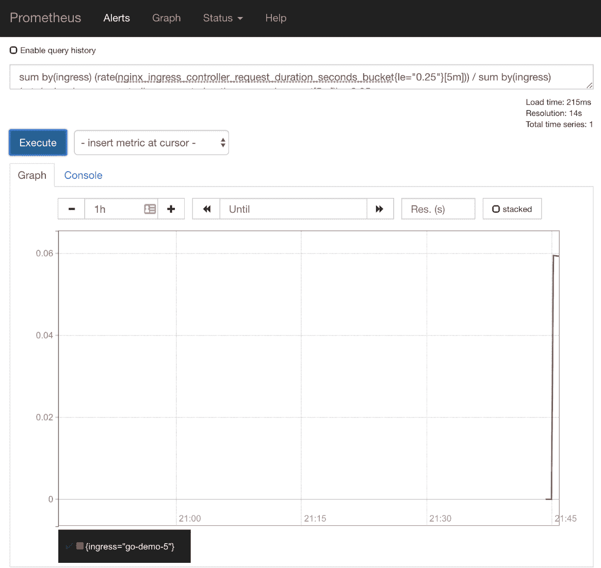
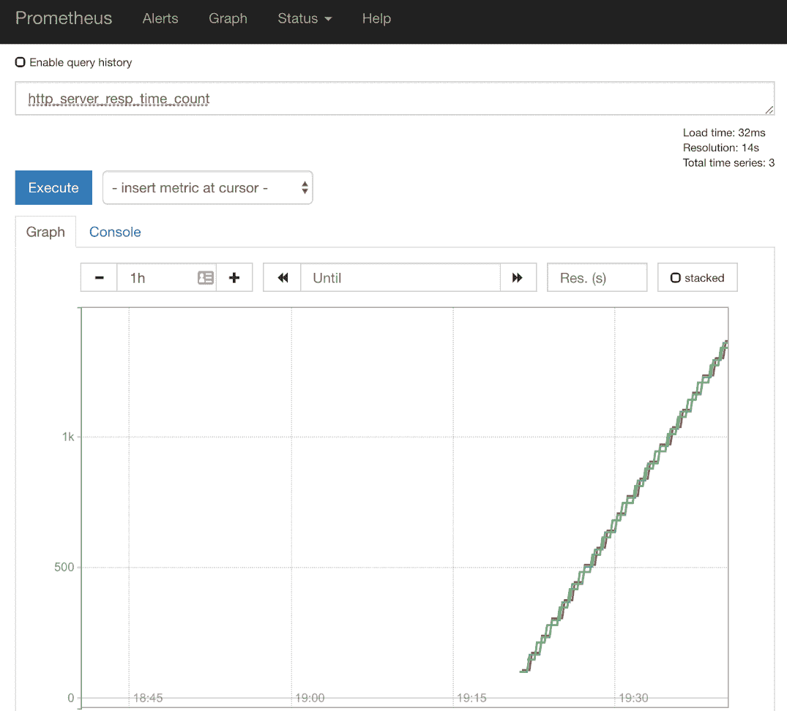
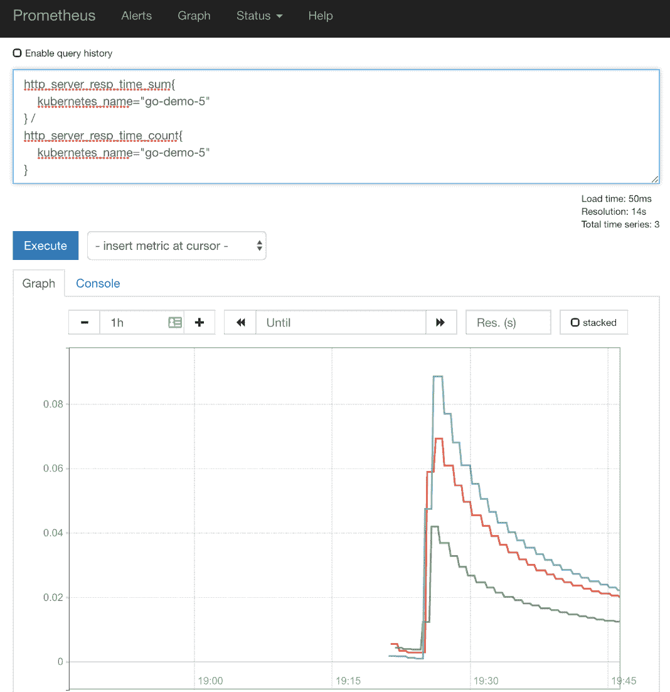
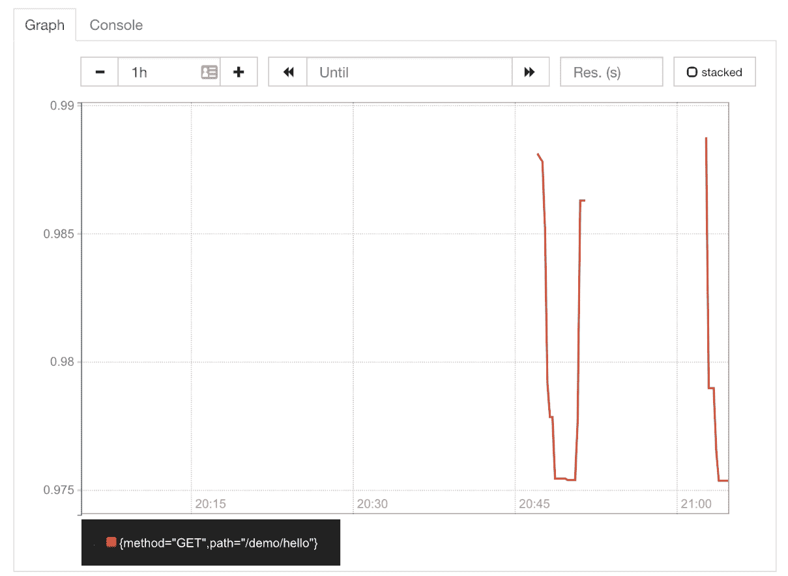

# 四、调试通过指标和警报发现的问题

When you eliminate the impossible, whatever remains, however improbable, must be the truth.

- *史巴克*

到目前为止，我们探索了如何收集指标，以及如何创建警报，以便在出现问题时通知我们。我们还学习了如何查询指标，并在试图找到问题原因时挖掘我们可能需要的信息。我们将对此进行扩展，并尝试调试一个模拟问题。

仅仅说一个应用不能正常工作是不够的。我们应该更加精确。我们的目标是不仅能够查明哪个应用出现故障，而且能够查明哪个部分是罪魁祸首。我们应该能够责备特定的函数、方法、请求路径等等。我们在检测应用的哪个部分导致问题时越精确，我们就越快找到问题的原因。因此，通过新版本(修补程序)、扩展或我们可以使用的任何其他方式来修复问题应该会更容易、更快。

我们走吧。在我们模拟一个需要解决的问题之前，我们需要一个集群(除非您已经有一个集群)。

# 创建集群

`vfarcic/k8s-specs`([)https://github.com/vfarcic/k8s-specs](https://github.com/vfarcic/k8s-specs))存储库将继续作为我们的 Kubernetes 定义的来源，我们将在示例中使用它。我们将通过获取最新版本来确保它是最新的。

All the commands from this chapter are available in the `04-instrument.sh` ([https://gist.github.com/vfarcic/851b37be06bb7652e55529fcb28d2c16](https://gist.github.com/vfarcic/851b37be06bb7652e55529fcb28d2c16)) Gist. Just as in the previous chapter, it contains not only the commands but also Prometheus' expressions. They are all commented (with `#`). If you're planning to copy and paste the expressions from the Gist, please exclude the comments. Each expression has `# Prometheus expression` comment on top to help you identify it.

```
 1  cd k8s-specs
 2
 3  git pull
```

考虑到我们已经学会了如何安装一个完全运行的普罗米修斯和它的图表中的其他工具，并且我们将继续使用它们，我把它移到了 Gists。以下是我们在上一章中使用的副本，增加了环境变量`PROM_ADDR`和`AM_ADDR`，以及安装**普罗米修斯图表**的步骤。请创建一个满足(或超过)以下指南中指定要求的集群，除非您已经有一个满足这些要求的集群。

*   `gke-instrument.sh` : **具有 3 个 n1-standard-1 工作节点的 GKE** 、 **nginx Ingress** 、 **tiller** 、 **Prometheus** 图表以及环境变量 **LB_IP** 、 **PROM_ADDR** 和**AM _ ADDR**([https://gist.github.com/675f4b3ee2c55ee718cf132e71e04c6e](https://gist.github.com/675f4b3ee2c55ee718cf132e71e04c6e))。
*   `eks-instrument.sh` : **具有 3 个 T2 .小型工作节点的 EKS** 、 **nginx Ingress** 、 **tiller** 、 **Metrics Server** 、 **Prometheus** 图表以及环境变量 **LB_IP** 、 **PROM_ADDR** 和**AM _ ADDR**([https://gist.github.com/70a14c8f15c7ffa533ea7feb75341545](https://gist.github.com/70a14c8f15c7ffa533ea7feb75341545))。
*   `aks-instrument.sh` : **带有 3 个 Standard_B2s 工作节点的 AKS** 、 **nginx Ingress** 和 **tiller** 、 **Prometheus** 图表，以及环境变量 **LB_IP** 、 **PROM_ADDR** 和**AM _ ADDR**([https://gist.github.com/65a0d5834c9e20ebf1b99225fba0d339](https://gist.github.com/65a0d5834c9e20ebf1b99225fba0d339))。
*   `docker-instrument.sh` : **Docker for Desktop** 带有 **2 个 CPU**、 **3 GB RAM** 、 **nginx Ingress** 、 **tiller** 、**度量服务器**、 **Prometheus** 图表以及环境变量 **LB_IP** 、 **PROM_ADDR** 和**AM _ ADDR**([https://gist.github.com/1dddcae847e97219ab75f936d93451c2](https://gist.github.com/1dddcae847e97219ab75f936d93451c2)
*   `minikube-instrument.sh` : **minikube** 带 **2 个 CPU**、 **3 GB RAM** 、**入口、存储提供程序**、**默认存储类**和**指标服务器**插件已启用、**分蘖**、**普罗米修斯**图表和环境变量 **LB_IP** 、 **PROM_ADDR 【T20**

现在我们准备好面对第一个可能需要调试的模拟问题。

# 面对灾难

让我们探索一个灾难场景。坦率地说，这不会是一场真正的灾难，但它需要我们找到解决问题的方法。

我们将从安装已经熟悉的`go-demo-5`应用开始。

```
 1  GD5_ADDR=go-demo-5.$LB_IP.nip.io
 2
 3  helm install \
 4      https://github.com/vfarcic/go-demo-5/releases/download/
    0.0.1/go-demo-5-0.0.1.tgz \
 5      --name go-demo-5 \
 6      --namespace go-demo-5 \
 7      --set ingress.host=$GD5_ADDR
 8
 9  kubectl -n go-demo-5 \
10      rollout status \
11      deployment go-demo-5
```

我们用地址声明`GD5_ADDR`，通过该地址我们将能够访问应用。当我们安装`go-demo-5`图表时，我们使用它作为`ingress.host`变量。为了安全起见，我们一直等到应用推出，从部署的角度来看，剩下的就是通过发送一个 HTTP 请求来确认它正在运行。

```
 1  curl http://$GD5_ADDR/demo/hello
```

输出是开发者最喜欢的消息`hello, world!`。

接下来，我们将通过发送 20 个持续时间长达 10 秒的慢速请求来模拟一个问题。这将是我们对一个可能需要解决的问题的模拟。

```
 1  for i in {1..20}; do
 2      DELAY=$[ $RANDOM % 10000 ]
 3      curl "http://$GD5_ADDR/demo/hello?delay=$DELAY"
 4  done
```

由于我们已经有了普罗米修斯的警报，我们应该会在 Slack 上收到通知，指出应用太慢。然而，许多读者可能使用相同的渠道进行这些练习，可能不清楚信息是否来自我们。相反，我们将打开普罗米修斯的警报屏幕来确认有问题。在“真实”设置中，您不会检查普罗米修斯警报，而是等待 Slack 上的通知，或者您选择的任何其他通知工具。

```
 1  open "http://$PROM_ADDR/alerts"
```

过了一会儿(别忘了刷新屏幕)，应该会触发`AppTooSlow`警报，让我们知道我们的一个应用速度很慢，我们应该做点什么来补救这个问题。

不折不扣的承诺，每一章都会有不同 Kubernetes 风格的输出和截图，这次轮到 minikube 了。


Figure 4-1: One of Prometheus' alerts in the firing state

我们将假设我们不是有意生成缓慢的请求，因此我们将尝试找出问题所在。哪个应用太慢了？我们可以向团队传递哪些有用的信息，以便他们能够尽快解决问题？

第一个逻辑调试步骤是执行与警报使用的表达式相同的表达式。请展开`AppTooSlow`提醒，点击表达式的链接。您将被重定向到已经预先填充了表达式的图形屏幕。点击执行按钮，切换到*图形*选项卡。

从图中我们可以看到，慢速请求的数量激增。触发警报是因为不到 95%的响应在 0.25 秒的时间段内。从我的图表(下面的截图)来看，0%的响应在 0.25 秒的时间段内，换句话说，所有的响应都比这慢。过了一会儿，这种情况有所改善，快速请求的比例上升到了 6%。

总之，我们有一种情况，太多的请求得到的响应很慢，我们应该解决这个问题。主要问题是如何找出这种缓慢的原因？



Figure 4-2: The graph with the percentage of requests with fast responses

执行不同的表达式怎么样。例如，我们可以输出该`ingress`(应用)的请求持续时间比率。

请键入下面的表达式，然后按“执行”按钮。

```
 1  sum(rate(
 2      nginx_ingress_controller_request_duration_seconds_sum{
 3          ingress="go-demo-5"
 4      }[5m]
 5  )) /
 6  sum(rate(
 7      nginx_ingress_controller_request_duration_seconds_count{
 8          ingress="go-demo-5"
 9      }[5m]
10  ))
```

该图向我们显示了请求持续时间的历史，但它并没有让我们更接近于揭示问题的原因，或者更准确地说，是应用中缓慢的部分。我们可以尝试使用其他指标，但它们或多或少都是通用的，可能不会让我们有所收获。我们需要更详细的特定于应用的指标。我们需要来自`go-demo-5`应用内部的数据。

# 使用工具提供更详细的指标

我们不应该只说`go-demo-5`应用慢。这将不会为我们快速检查代码以寻找这种缓慢的确切原因提供足够的信息。我们应该能够做得更好，并推断出应用的哪个部分有问题。我们能找出一条反应缓慢的特定路径吗？是所有方法都一样慢，还是问题仅限于一个？我们知道哪个函数产生慢度吗？在这种情况下，我们应该能够回答许多类似的问题。但是我们不能，以目前的标准。它们太通用了，通常只能告诉我们某个特定的 Kubernetes 资源行为不端。我们收集的指标过于宽泛，无法回答特定于应用的问题。

到目前为止，我们探索的指标是出口商和工具的结合。出口商负责获取现有的指标，并将其转换为对普罗米修斯友好的格式。一个例子是节点导出器([https://github.com/prometheus/node_exporter](https://github.com/prometheus/node_exporter))，它采用“标准”的 Linux 度量标准，并将它们转换成普罗米修斯的时间序列格式。另一个例子是 Kube-state-metrics([https://github.com/kubernetes/kube-state-metrics](https://github.com/kubernetes/kube-state-metrics))，它监听 Kube API 服务器并生成带有资源状态的度量。

Instrumented metrics are baked into applications. They are an integral part of the code of our apps, and they are usually exposed through the `/metrics` endpoint.

向应用添加指标的最简单方法是通过普罗米修斯客户端库。在撰写本文时，正式提供了 Go([https://github.com/prometheus/client_golang](https://github.com/prometheus/client_golang))、Java 和 Scala([https://github.com/prometheus/client_java](https://github.com/prometheus/client_java))、Python([https://github.com/prometheus/client_python](https://github.com/prometheus/client_python))和 Ruby([https://github.com/prometheus/client_ruby](https://github.com/prometheus/client_ruby))库。

除此之外，社区还支持 Bash([https://github.com/aecolley/client_bash](https://github.com/aecolley/client_bash))、c++([https://github.com/jupp0r/prometheus-cpp](https://github.com/jupp0r/prometheus-cpp))、Common Lisp([https://github.com/deadtrickster/prometheus.cl](https://github.com/deadtrickster/prometheus.cl))、酏剂([https://github.com/deadtrickster/prometheus.ex](https://github.com/deadtrickster/prometheus.ex))、二郎([https://github.com/deadtrickster/prometheus.erl](https://github.com/deadtrickster/prometheus.erl))、哈斯克尔([https://github.com/fimad/prometheus-haskell](https://github.com/fimad/prometheus-haskell))、Lua for Nginx([https://github.com/knyar/nginx-lua-prometheus](https://github.com/knyar/nginx-lua-prometheus))、Lua for Tarantool([https://github.com/tarantool/prometheus](https://github.com/tarantool/prometheus))。NET/c#([https://github.com/andrasm/prometheus-net](https://github.com/andrasm/prometheus-net))、node . js([https://github.com/siimon/prom-client](https://github.com/siimon/prom-client))、Perl([https://metacpan.org/pod/Net::Prometheus](https://metacpan.org/pod/Net::Prometheus))、PHP([https://github.com/Jimdo/prometheus_client_php](https://github.com/Jimdo/prometheus_client_php))和 Rust([https://github.com/pingcap/rust-prometheus](https://github.com/pingcap/rust-prometheus))。即使您使用不同的语言进行编码，也可以通过以基于文本的展示格式([https://Prometheus . io/docs/instrumenting/exposure _ formats/](https://prometheus.io/docs/instrumenting/exposition_formats/))输出结果，轻松提供对 Prometheus 友好的指标。

收集度量的开销应该可以忽略不计，而且由于普罗米修斯定期提取它们，输出它们也应该有很小的占用空间。即使您选择不使用普罗米修斯，或者切换到其他东西，格式也正在成为标准，您的下一个度量收集器工具可能会期待相同的数据。

总而言之，没有借口不将度量标准烘焙到您的应用中，正如您将很快看到的，它们提供了我们无法从外部获得的宝贵信息。

让我们看一下`go-demo-5`中的一个仪表化度量的例子。

```
 1  open "https://github.com/vfarcic/go-demo-5/blob/master/main.go"
```

The application is written in Go. Don't worry if that's not your language of choice. We'll just take a quick look at a few examples as a way to understand the logic behind instrumentation, not the exact implementation.

第一个有趣的部分如下。

```
 1  ...
 2  var (
 3    histogram = prometheus.NewHistogramVec(prometheus.HistogramOpts{
 4      Subsystem: "http_server",
 5      Name:      "resp_time",
 6      Help:      "Request response time",
 7    }, []string{
 8      "service",
 9      "code",
10      "method",
11      "path",
12    })
13  )
14  ...
```

我们定义了一个包含普罗米修斯直方图向量的变量，它有几个选项。`Sybsystem`和`Name`构成基本度量`http_server_resp_time`。由于是直方图，最终的度量将通过添加`_bucket`、`_sum`和`_count`后缀来创建。

Please consult *histogram* ([https://prometheus.io/docs/concepts/metric_types/#histogram](https://prometheus.io/docs/concepts/metric_types/#histogram)) documentation for more info about that Prometheus' metric type.

最后一部分是一个字符串数组(`[]string`)，它定义了我们想要添加到度量中的所有标签。在我们的例子中，这些标签是`service`、`code`、`method`和`path`。标签可以是我们需要的任何东西，只要它们提供了我们在查询这些指标时可能需要的足够信息。

下一个兴趣点是`recordMetrics`功能。

```
 1  ...
 2  func recordMetrics(start time.Time, req *http.Request, code int) {
 3    duration := time.Since(start)
 4    histogram.With(
 5      prometheus.Labels{
 6        "service": serviceName,
 7        "code":    fmt.Sprintf("%d", code),
 8        "method":  req.Method,
 9        "path":    req.URL.Path,
10      },
11    ).Observe(duration.Seconds())
12  }
13  ...
```

我将它创建为一个助手函数，可以从代码中的不同位置调用。它接受`start`时间、`Request`和返回`code`作为参数。该函数本身通过用`start`时间减去当前`time`来计算`duration`。`duration`用于`Observe`功能中，并提供公制的值。还有一些标签可以帮助我们在以后微调我们的表达方式。

最后，我们来看一个调用`recordMetrics`的例子。

```
 1  ...
 2  func HelloServer(w http.ResponseWriter, req *http.Request) {
 3    start := time.Now()
 4    defer func() { recordMetrics(start, req, http.StatusOK) }()
 5    ...
 6  }
 7  ...
```

`HelloServer`功能是返回您已经多次看到的`hello, world!`响应的功能。该功能的细节并不重要。在这种情况下，唯一重要的部分是台词`defer func() { recordMetrics(start, req, http.StatusOK) }()`。在 Go 中，`defer`允许我们在函数的末尾执行它所驻留的东西。在我们的例子中，那就是调用`recordMetrics`函数来记录请求的持续时间。换句话说，在执行离开`HelloServer`功能之前，它将通过调用`recordMetrics`功能来记录持续时间。

我不会深入讨论包含插装的代码，因为这将假设您对 go 背后的复杂性感兴趣，并且我试图保持这本书的语言不可知。我会让你查阅你最喜欢的语言的文档和例子。相反，我们将看看`go-demo-5`仪表化的度量标准在起作用。

```
 1  kubectl -n metrics \
 2      run -it test \
 3      --image=appropriate/curl \
 4      --restart=Never \
 5      --rm \
 6      -- go-demo-5.go-demo-5:8080/metrics
```

我们基于`appropriate/curl`映像创建了一个 Pod，并使用地址`go-demo-5.go-demo-5:8080/metrics`通过服务发送了一个请求。第一个`go-demo-5`是服务的名称，第二个是它所在的名称空间。结果，我们得到了该应用中所有可用的测量指标的输出。我们不一一介绍，只介绍`http_server_resp_time`直方图创建的那些。

输出的相关部分如下。

```
...
# HELP http_server_resp_time Request response time
# TYPE http_server_resp_time histogram
http_server_resp_time_bucket{code="200",method="GET",path="/demo/hello",service="go-demo",le="0.005"} 931
http_server_resp_time_bucket{code="200",method="GET",path="/demo/hello",service="go-demo",le="0.01"} 931
http_server_resp_time_bucket{code="200",method="GET",path="/demo/hello",service="go-demo",le="0.025"} 931
http_server_resp_time_bucket{code="200",method="GET",path="/demo/hello",service="go-demo",le="0.05"} 931
http_server_resp_time_bucket{code="200",method="GET",path="/demo/hello",service="go-demo",le="0.1"} 934
http_server_resp_time_bucket{code="200",method="GET",path="/demo/hello",service="go-demo",le="0.25"} 935
http_server_resp_time_bucket{code="200",method="GET",path="/demo/hello",service="go-demo",le="0.5"} 935
http_server_resp_time_bucket{code="200",method="GET",path="/demo/hello",service="go-demo",le="1"} 936
http_server_resp_time_bucket{code="200",method="GET",path="/demo/hello",service="go-demo",le="2.5"} 936
http_server_resp_time_bucket{code="200",method="GET",path="/demo/hello",service="go-demo",le="5"} 937
http_server_resp_time_bucket{code="200",method="GET",path="/demo/hello",service="go-demo",le="10"} 942
http_server_resp_time_bucket{code="200",method="GET",path="/demo/hello",service="go-demo",le="+Inf"} 942
http_server_resp_time_sum{code="200",method="GET",path="/demo/hello",service="go-demo"} 38.87928942600006
http_server_resp_time_count{code="200",method="GET",path="/demo/hello",service="go-demo"} 942
...
```

我们可以看到，我们在应用代码中使用的 Go 库从`http_server_resp_time`直方图中创建了相当多的指标。十二个桶中的每一个都有一个(T1)，一个是持续时间的总和(T2)，一个是计数(T3)。如果我们提出具有不同标签的请求，我们会有更多。目前，这 14 个指标都来自于用 HTTP 代码`200`响应的请求，使用`GET`方法，发送到`/demo/hello`路径，并且来自于`go-demo`服务(应用)。如果我们用不同的方法(例如，`POST`)或不同的路径创建请求，度量的数量将会增加。类似地，如果我们在其他应用中实现相同的仪表化指标(但是使用不同的`service`标签)，我们将拥有具有相同关键字(`http_server_resp_time`)的指标，这些指标将提供对多个应用的洞察。这就提出了一个问题，即我们是否应该在所有应用中统一指标名称。

我更喜欢在所有应用中使用具有相同名称的相同类型的测量指标。比如所有收集响应时间的都可以称为`http_server_resp_time`。这简化了普罗米修斯中的数据查询。不是从每个单独的应用中学习仪表化度量，而是从一个应用中学习这些度量来提供关于所有应用的知识。另一方面，我赞成让每个团队完全控制他们的应用。这包括决定实现哪些指标，以及如何调用它们。

总而言之，这取决于团队的结构和职责。如果一个团队完全负责他们的应用，并且他们调试特定于他们的应用的问题，那么就没有内在的需求来标准化检测度量的名称。另一方面，如果监控是集中的，并且其他团队可能希望得到该领域专家的帮助，那么创建命名约定是必须的。否则，我们很容易得到成千上万个不同名称和类型的指标，即使它们中的大多数都提供了相同的信息。

对于本章的其余部分，我将假设我们确实同意在所有应用中使用`http_server_resp_time`直方图，如果适用的话。

现在，让我们看看如何告诉普罗米修斯，它应该从`go-demo-5`应用中提取指标。如果我们能告诉普罗米修斯从所有装有度量工具的应用中提取数据，那就更好了。实际上，现在当我考虑它的时候，我们还没有讨论普罗米修斯是如何在前一章找到节点导出器和库贝状态度量的。所以，让我们简单地回顾一下这个发现过程。

一个很好的起点是普罗米修斯的目标屏幕。

```
 1  open "http://$PROM_ADDR/targets"
```

最有趣的一组目标是`kubernetes-service-endpoints`。如果我们仔细看一下标签，我们会发现每个标签都有`kubernetes_name`，其中三个目标设定为`go-demo-5`。普罗米修斯不知何故发现我们有三个应用的副本，并且可以通过端口`8080`获得指标。如果我们看得更远，我们会注意到`prometheus-node-exporter`也在那里，集群中的每个节点都有一个。

`prometheus-kube-state-metrics`也是如此。那群人中可能还有其他人。


Figure 4-3: kubernetes-service-endpoints Prometheus' targets

普罗米修斯通过 Kubernetes 服务发现了所有目标。它从每个服务中提取端口，并假设数据可通过`/metrics`端点获得。因此，我们在集群中的每一个可以通过 Kubernetes 服务访问的应用都被自动添加到普罗米修斯目标的`kubernetes-service-endpoints`组中。我们没有必要篡改普罗米修斯的配置来增加 T2。它刚刚被发现。很整洁，不是吗？

In some cases, some of the metrics will not be accessible, and that target will be marked as red. As an example, `kube-dns` in minikube is not reachable from Prometheus. That's common, and it's not a reason to be alarmed, just as long as that's not one of the metric sources we do need.

接下来，我们将快速查看一些我们可以使用来自`go-demo-5`的工具化度量来编写的表达式。

```
 1  open "http://$PROM_ADDR/graph"
```

请输入下面的表达式，按下执行按钮，切换到*图形*选项卡。

```
 1  http_server_resp_time_count
```

我们可以看到三行对应`go-demo-5`的三个副本。这不足为奇，因为这些都是从应用的每个副本的检测度量中提取的。因为这些指标是只能增加的计数器，所以图表的线条在不断上升。



Figure 4-4: The graph with the http_server_resp_time_count counter

那不是很有用。如果我们对请求计数的速率感兴趣，我们会将前面的表达式封装在`rate()`函数中。我们稍后再做。现在，我们将编写最简单的表达式，给出每个请求的平均响应时间。

请键入下面的表达式，然后按“执行”按钮。

```
 1  http_server_resp_time_sum{
 2      kubernetes_name="go-demo-5"
 3  } /
 4  http_server_resp_time_count{
 5      kubernetes_name="go-demo-5"
 6  }
```

这个表达本身应该很容易理解。我们将所有请求的总和除以计数。由于我们已经发现问题在`go-demo-5`应用内部的某个地方，所以我们使用了`kubernetes_name`标签来限制结果。尽管这是目前在我们的集群中运行的唯一一个具有该度量的应用，但是当我们将检测扩展到其他应用时，习惯于在稍后的某个日期可能会有其他应用这一事实是一个好主意。

我们可以看到，平均请求持续时间增加了一段时间，但一段时间后又下降到接近初始值。这一峰值与我们不久前发送的 20 个慢速请求不谋而合。在我的例子中(截图如下)，峰值接近 0.1 秒的平均响应时间，但不久后下降到 0.02 秒左右。



Figure 4-5: The graph with the cumulative average response time

请注意，我们刚刚执行的表达式存在严重缺陷。它显示累计平均响应时间，而不是显示`rate`。但是，你已经知道了。这只是仪表化度量的一种尝试，而不是它的“真实”用法(即将到来)。

你可能会注意到，即使是峰值也很低。这肯定低于我们通过`curl`仅发送 20 个慢速请求的预期。原因在于，提出这些请求的不仅仅是我们。`readinessProbe`和`livenessProbe`也在发送请求，速度非常快。与前一章中我们只测量通过入口的请求不同，这次我们捕获了进入应用的所有请求，包括健康检查。

现在我们已经看到了一些在我们的`go-demo-5`应用中生成的`http_server_resp_time`度量的例子，我们可以使用这些知识来尝试调试导致我们使用仪器的模拟问题。

# 使用内部指标调试潜在问题

我们将再次发送响应缓慢的请求，这样我们就可以回到本章开始的地方。

```
 1  for i in {1..20}; do
 2      DELAY=$[ $RANDOM % 10000 ]
 3      curl "http://$GD5_ADDR/demo/hello?delay=$DELAY"
 4  done
 5
 6  open "http://$PROM_ADDR/alerts"
```

我们发送了二十个请求，这些请求将导致随机持续时间(最多十秒)的响应。进一步，我们打开了普罗米修斯的警报屏幕。

过一会儿`AppTooSlow`警报应该会响起(记得刷新屏幕)，我们有一个(模拟的)问题需要解决。在我们开始惊慌失措和仓促行事之前，我们会努力找到问题的原因。

请点击`AppTooSlow`提醒的表述。

我们被重定向到带有来自警报的预填充表达式的图形屏幕。请随意点击表达式按钮，即使它不会提供任何额外的信息，除了应用很快，然后由于某种莫名其妙的原因变慢的事实。

您将无法从该表达式中收集更多细节。您不会知道它是否在所有方法上都很慢，是否只有一个特定的路径响应很慢，也不会知道任何其他特定于应用的细节。简单来说，`nginx_ingress_controller_request_duration_seconds`这个指标太泛了。它很好地通知了我们应用的响应时间增加了，但是它没有提供关于问题原因的足够信息。为此，我们将切换到普罗米修斯直接从`go-demo-5`复制品中检索的`http_server_resp_time`度量。

请键入下面的表达式，然后按“执行”按钮。

```
 1  sum(rate(
 2      http_server_resp_time_bucket{
 3          le="0.1",
 4          kubernetes_name="go-demo-5"
 5      }[5m]
 6  )) /
 7  sum(rate(
 8      http_server_resp_time_count{
 9          kubernetes_name="go-demo-5"
10      }[5m]
11  ))
```

切换到*图形*选项卡，如果你还没有到那里。

该表达式与我们之前使用`nginx_ingress_controller_request_duration_seconds_sum`度量时编写的查询非常相似。我们将 0.1 秒时段内的请求速率除以所有请求的速率。

在我的例子中(下面的截图)，我们可以看到快速响应的百分比下降了两倍。这与我们之前发送的模拟慢速请求相吻合。


Figure 4-6: The graph with the percentage of fast requests measured with instrumented metrics

到目前为止，与`nginx_ingress_controller_request_duration_seconds_sum`相比，使用仪表化指标`http_server_resp_time_count`并没有带来任何明显的好处。如果这就是全部，我们可以得出结论，增加仪器的努力是一种浪费。然而，我们还没有在表达式中包含标签。

假设我们想按`method`和`path`对请求进行分组。这可以让我们更好地了解缓慢是全球性的，还是仅限于特定类型的请求。如果是后者，我们将知道问题出在哪里，并有望迅速找到罪魁祸首。

请键入下面的表达式，然后按“执行”按钮。

```
 1  sum(rate(
 2      http_server_resp_time_bucket{
 3          le="0.1",
 4          kubernetes_name="go-demo-5"
 5      }[5m]
 6  ))
 7  by (method, path) /
 8  sum(rate(
 9      http_server_resp_time_count{
10          kubernetes_name="go-demo-5"
11      }[5m]
12  ))
13  by (method, path)
```

那个表情和之前那个几乎一样。唯一不同的是增加了`by (method, path)`语句。结果，我们得到了一定比例的快速响应，按`method`和`path`分组。

输出并不代表“真实”的世界用例。通常，我们会看到许多不同的行，每一行对应于所请求的方法和路径。但是，因为我们只使用 HTTP GET 向`/demo/hello`发出请求，所以我们的图有点无聊。你必须想象还有很多其他的台词。

通过研究该图，我们发现除了一条线(我们仍在想象许多)之外，所有的线都接近 100%的快速响应。下降幅度最大的是`/demo/hello`路径和`GET`方法。然而，如果这真的是一个真实的场景，我们可能会有太多的线在图中，我们可能无法轻松区分它们。我们的表达可以受益于一个额外的门槛。

请键入下面的表达式，然后按“执行”按钮。

```
 1  sum(rate(
 2      http_server_resp_time_bucket{
 3          le="0.1",
 4          kubernetes_name="go-demo-5"
 5      }[5m]
 6  ))
 7  by (method, path) /
 8  sum(rate(
 9      http_server_resp_time_count{
10          kubernetes_name="go-demo-5"
11      }[5m]
12  ))
13  by (method, path) < 0.99
```

唯一增加的是`< 0.99`阈值。因此，我们的图表排除了所有的结果(所有的路径和方法)，但低于 99%(0.99)的结果除外。我们消除了所有噪音，只关注超过 1%的请求速度较慢(或者只有不到 99%的请求速度较快)的情况。结果现在很清楚了。问题出在处理路径`/demo/hello`上`GET`请求的函数上。通过图表下方的标签我们知道。



Figure 4-7: The graph with the percentage of fast requests measured with instrumented metrics limited to results below ninety-nine percent

现在我们知道了(几乎)问题的确切位置，剩下的就是修复问题，将更改推送到我们的 Git 存储库中，并等待我们的持续部署过程用新版本升级软件。

在相对较短的时间内，我们设法发现(调试)了问题，或者更准确地说，将问题缩小到代码的特定部分。

或者，也许我们发现问题不在代码中，而是我们的应用需要扩展。在这两种情况下，如果没有仪表化的度量，我们只会知道应用很慢，这可能意味着应用的任何部分都有问题。工具给了我们更详细的度量标准，我们过去更精确，减少了我们发现问题并采取相应行动所需的时间。

通常，我们会有许多其他的测量指标，我们的“调试”过程会更加复杂。我们会执行其他表达式，并挖掘不同的指标。然而，重点是我们应该将通用指标与直接来自应用的更详细的指标结合起来。前者通常用于检测问题，而后者在寻找问题原因时非常有用。这两种类型的度量在监控、警报和调试我们的集群和应用中都有它们的位置。通过仪表化度量，我们有了更多特定于应用的细节。这使我们能够缩小问题的位置和原因。我们对问题的确切原因越有信心，我们就越有能力做出反应。

# 现在怎么办？

我不认为我们需要许多其他的仪表化度量的例子。它们和我们通过出口商收集的没有任何不同。我会让你自己开始测试你的应用。从小处着手，看看哪些行之有效，改进和扩展。

又一章结束了。摧毁你的集群，重新开始下一个集群，或者保留它。如果选择后者，请执行以下命令删除`go-demo-5`应用。

```
 1  helm delete go-demo-5 --purge
 2
 3  kubectl delete ns go-demo-5
```

在你离开之前，记住下面的要点。它总结了仪器仪表。

*   仪表化的度量被烘焙到应用中。它们是我们应用代码不可分割的一部分，通常通过`/metrics`端点公开。