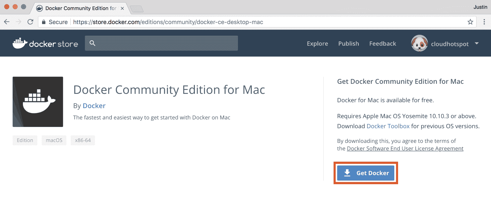
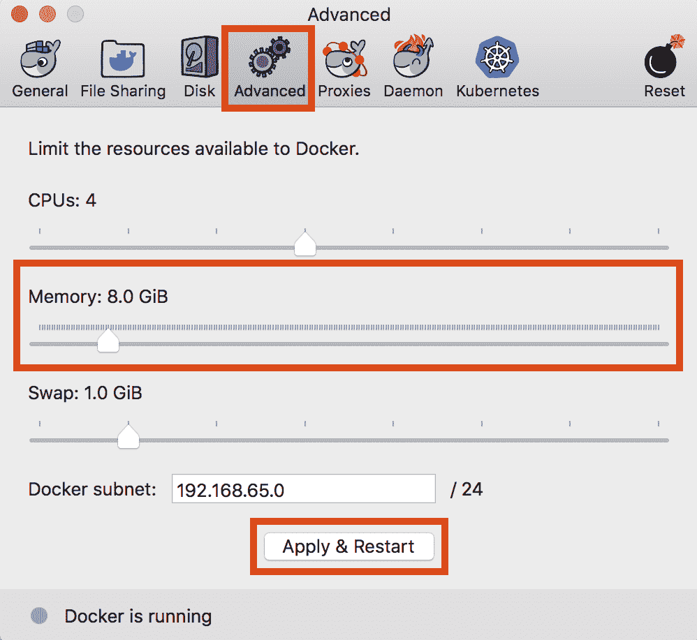
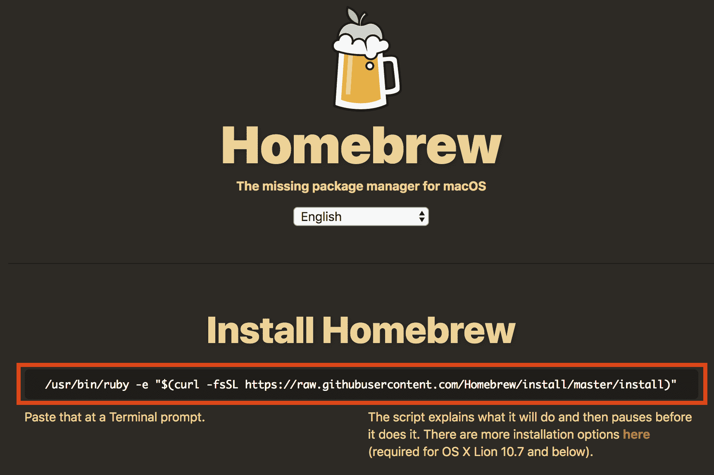
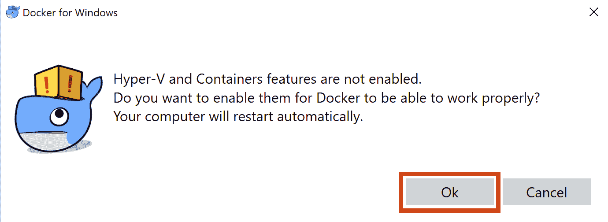
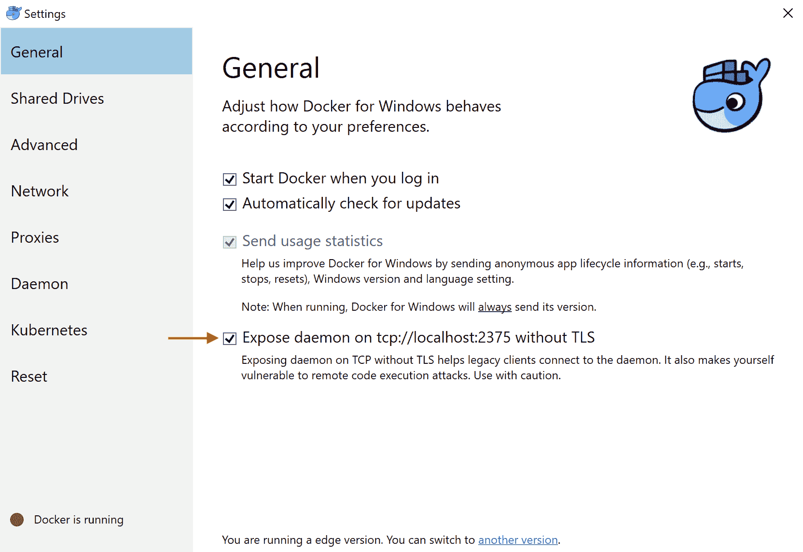
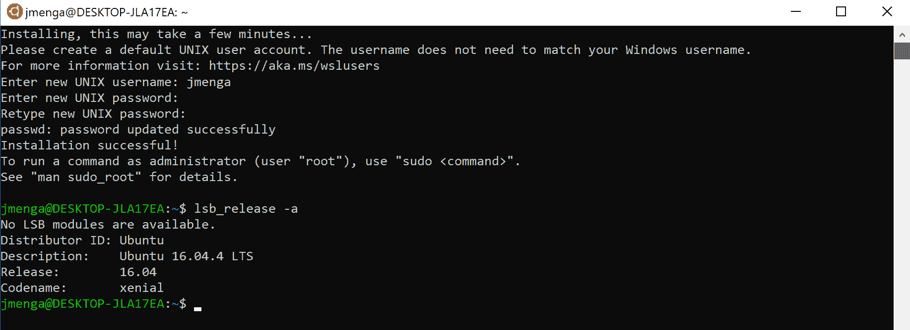
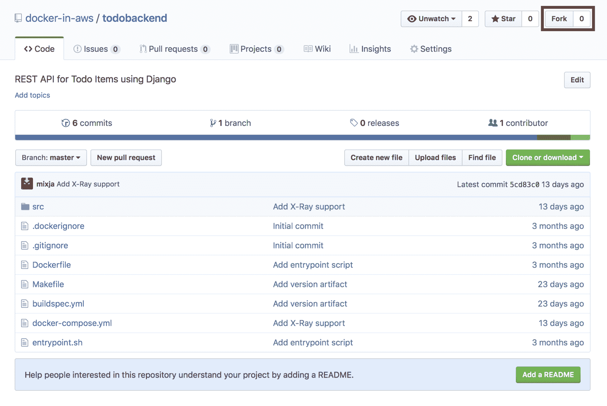

# 集装箱和码头工人基础

Docker 和亚马逊网络服务是目前最热门和最流行的两种技术。Docker 是目前地球上最受欢迎的容器平台，而亚马逊网络服务是排名第一的公共云提供商。大大小小的组织都在大规模采用容器，公共云不再是初创企业的游乐场，大型企业和组织纷纷迁移到云。好消息是，这本书将为您提供实用、真实的见解和知识，告诉您如何同时使用 Docker 和 AWS 来帮助您比以往任何时候都更快、更高效地测试、构建、发布和部署您的应用。

在本章中，我们将简要讨论 Docker 的历史，为什么 Docker 如此具有革命性，以及 Docker 的高级架构。我们将描述支持在 AWS 中运行 Docker 的各种服务，并讨论为什么您可能会根据组织的需求选择一种服务。

然后，我们将重点关注使用 Docker 启动和运行您的本地环境，并安装运行本书示例应用所需的各种软件先决条件。示例应用是一个用 Python 编写的简单 web 应用，它将数据存储在 MySQL 数据库中，本书将使用示例应用来帮助您解决现实世界中的挑战，例如测试、构建和发布 Docker 映像，以及在 AWS 上的各种容器管理平台中部署和运行 Docker 应用。在将示例应用打包为 Docker 映像之前，您需要了解应用的外部依赖关系以及测试、构建、部署和运行应用所需的关键任务，并且您将学习如何安装应用依赖关系、运行单元测试、在本地启动应用，以及编排关键的操作任务，例如建立示例应用运行所需的初始数据库模式和表。

本章将涵盖以下主题:

*   集装箱和码头工人介绍
*   为什么容器是革命性的
*   Docker 架构
*   AWS 中的码头工人
*   设置本地 Docker 环境
*   安装示例应用

# 技术要求

下面列出了完成本章的技术要求:

*   满足软件和硬件列表中定义的最低规格的计算机环境

以下 GitHub URL 包含本章使用的代码示例:[https://GitHub . com/docker-in-AWS/docker-in-AWS/tree/master/ch1](https://github.com/docker-in-aws/docker-in-aws/tree/master/ch1)[。](https://github.com/docker-in-aws/docker-in-aws/tree/master/ch3)

查看以下视频，了解《行动守则》:
[http://bit.ly/2PEKlVQ](http://bit.ly/2PEKlVQ)

# 集装箱和码头工人介绍

最近，容器已经成为技术世界的通用语言，很难想象仅仅在几年前，只有一小部分技术社区听说过容器。

要追溯容器的起源，你需要回溯到 1979 年，当时 Unix V7 引入了 chroot 系统调用。chroot 系统调用提供了将正在运行的进程的根目录更改到文件系统中不同位置的能力，并且是第一个提供某种形式的进程隔离的机制。chroot 于 1982 年被添加到伯克利软件发行版(BSD)中(这是现代 macOS 操作系统的祖先)，在容器化和隔离方面，多年来没有发生太多的事情，直到 2000 年发布了一个名为 FreeBSD Jails 的功能，它提供了名为“jalls”的独立环境，每个环境都可以被分配自己的 IP 地址，并在网络上独立通信。

后来，在 2004 年，Solaris 推出了 Solaris 容器的第一个公共测试版(最终被称为 Solaris Zones)，它通过创建区域来提供系统资源分离。我记得这是我在 2007 年使用的一项技术，用于帮助克服缺少昂贵的 Sun SPARC 物理基础架构的问题，并在一台 SPARC 服务器上运行多个版本的应用。

在 2000 年代中期，向容器进军的过程中取得了更多的进展，2005 年发布了 Open Virtuozzo(开放 VZ)，它修补了 Linux 内核，以提供操作系统级别的虚拟化和隔离。2006 年，谷歌推出了一个名为进程容器(最终更名为控制组或 cgroups)的功能，该功能能够限制一组进程的 CPU、内存、网络和磁盘使用。2008 年，一个名为 Linux 命名空间的特性，提供了将不同类型的资源相互隔离的能力，与 cgroups 结合创建了 Linux 容器(LXC)，形成了我们今天所知的现代容器的最初基础。

2010 年，随着云计算开始普及，出现了一批平台即服务(PaaS)初创企业，它们为 Java Tomcat 或 Ruby on Rails 等特定应用框架提供了完全托管的运行时环境。一家名为 dotCloud 的初创公司与众不同，它是第一家“多语种”的 PaaS 提供商，这意味着你可以使用他们的服务运行任何你想要的应用环境。支撑这一点的技术是 Linux Containers，dotCloud 增加了一些或专有的特性，为他们的客户提供了一个完全受管理的容器平台。到了 2013 年，PaaS 市场已经很好地真正进入了 Gartner 炒作周期([https://en.wikipedia.org/wiki/Hype_cycle](https://en.wikipedia.org/wiki/Hype_cycle))的幻灭低谷，dotCloud 也处于金融崩溃的边缘。该公司的联合创始人之一所罗门·海克斯(Solomon Hykes)向董事会提出了一个想法，即开源他们的集装箱管理技术，认为这有巨大的潜力。董事会不同意，然而所罗门和他的技术团队不顾一切地进行，其余的，正如他们所说，都是历史。

在 2013 年向世界宣布 Docker 是一个新的开源容器管理平台后，Docker 迅速崛起，成为开源世界和供应商社区的宠儿，很可能是历史上发展最快的技术之一。截至 2014 年底，在 Docker 1.0 发布期间，已有超过 1 亿个 Docker 容器被下载——快进到 2018 年 3 月，这个数字为 *37* *亿*次下载。2017 年底，财富 100 强企业的集装箱使用率为 71%，这表明 Docker 和集装箱已被初创企业和企业普遍接受。今天，如果您正在构建基于微服务架构的现代分布式应用，那么您的技术堆栈很可能将由 Docker 和容器来支撑。

# 为什么容器是革命性的

集装箱短暂而成功的历史不言而喻，这就引出了一个问题，*为什么集装箱这么受欢迎*？下面提供了这个问题的一些更重要的答案:

*   **轻量级**:容器经常被比作虚拟机，在这种情况下，容器比虚拟机要轻量得多。一个容器可以在几秒钟内为您的应用启动一个隔离且安全的运行时环境，而典型的虚拟机启动只需要几分钟。容器映像也比虚拟机映像小得多。
*   **速度**:容器速度很快——它们可以在几秒钟内下载并启动，几分钟内您就可以测试、构建和发布您的 Docker 映像，以便立即下载。这使得组织能够更快地创新，这在当今竞争日益激烈的环境中至关重要。
*   **便携** : Docker 让您在本地机器、数据中心和公共云中运行应用变得前所未有的容易。因为 Docker 包是您的应用的完整运行时环境，包含操作系统依赖项和第三方包，所以您的容器主机不需要任何特定于每个应用的特殊预先设置或配置—所有这些特定的依赖项和要求都包含在 Docker 映像中，并给出类似“但它在我的机器上工作了！”过去的遗迹。
*   **安全性**:关于容器的安全性有很多争论，但在我看来，如果实施正确，容器实际上比非容器的替代方法提供了更大的安全性。主要原因是容器很好地表达了安全上下文——在容器级别应用安全控件通常代表了这些控件的正确上下文级别。这些安全控制很多都是“默认”提供的——例如，名称空间本质上是一种安全机制，因为它们提供了隔离。一个更显而易见的例子是，它们可以在每个容器的基础上应用 SELinux 或 AppArmor 配置文件，使得根据每个容器的特定安全需求定义不同的配置文件变得非常容易。

*   **自动化**:组织正在采用软件交付实践，例如连续交付，其中自动化是基本要求。Docker 原生支持自动化–在其核心，Dockerfile 是一种自动化规范，允许 Docker 客户端自动构建您的容器，而 Docker Compose 等其他 Docker 工具允许您表达连接的多容器环境，您可以在几秒钟内自动创建和拆除这些环境。

# Docker 架构

正如本书前言中所讨论的，我假设你至少对 Docker 有一个基本的工作知识。如果你是 Docker 的新手，那么我建议你通过阅读[https://docs.docker.com/engine/docker-overview/](https://docs.docker.com/engine/docker-overview/)的 Docker 概述，以及浏览[https://docs.docker.com/get-started/](https://docs.docker.com/get-started/)的 Docker 教程来补充本章的学习内容。

Docker 体系结构包括以下几个核心组件:

*   **Docker 引擎**:这为运行您的容器工作负载提供了几个服务器代码组件，包括一个用于与 Docker 客户端通信的 API 服务器，以及提供 Docker 核心运行时的 Docker 守护进程。守护程序负责容器和其他资源的整个生命周期，并且还附带内置的集群支持，允许您构建集群或集群的 Docker Engines。
*   **Docker 客户端**:这提供了一个用于构建 Docker 映像、运行 Docker 容器以及管理 Docker 卷和 Docker 网络等其他资源的客户端。Docker 客户端是您在使用 Docker 时将使用的主要工具，并与 Docker 引擎和 Docker 注册表组件交互。
*   **Docker 注册表**:负责为你的应用存储和分发 Docker 镜像。Docker 支持公共和私有注册中心，通过 Docker 注册中心打包和分发应用的能力是 Docker 成功的主要原因之一。在本书中，您将从 Docker Hub 下载第三方映像，并将自己的应用映像存储在名为**弹性容器注册中心** ( **ECR** )的私有 AWS 注册服务中。

*   **Docker Swarm**:Swarm 是 Docker 引擎的集合，它们形成了一个自我管理和自我修复的集群，允许您横向扩展容器工作负载，并在 Docker 引擎出现故障时提供弹性。Docker Swarm 集群包括许多构成集群控制平面的主节点，以及许多实际运行容器工作负载的工作节点。

当您使用前面的组件时，您将与 Docker 体系结构中的许多不同类型的对象进行交互:

*   **Images** :一个映像是使用 Dockerfile 构建的，Dockerfile 中包含了许多关于如何为容器构建运行时环境的说明。执行这些构建指令中的每一个的结果被存储为一组层，并作为可下载和可安装的映像分发，并且 Docker Engine 读取每一层中的指令，以基于给定的映像为所有容器构建运行时环境。
*   **容器**:容器是 Docker 映像的运行时表现。在幕后，一个容器由一组 Linux 命名空间、控制组和存储组成，它们共同创建了一个独立的运行时环境，您可以在其中运行给定的应用进程。
*   **卷**:默认情况下，容器的底层存储机制基于联合文件系统，这允许从 Docker 映像中的各个层构建虚拟文件系统。这种方法非常有效，因为您可以共享层，并从这些共享层构建多个容器，但是这确实会影响性能，并且不支持持久性。Docker 卷提供了对专用可插拔存储介质的访问，您的容器可以将其用于 IO 密集型应用和持久化数据。
*   **网络**:默认情况下，Docker 容器各自在自己的网络命名空间中运行，这提供了容器之间的隔离。但是，它们仍然必须提供与其他容器和外部世界的网络连接。Docker 支持各种支持容器间连接的网络插件，甚至可以扩展到 Docker Swarm 集群。
*   **服务**:服务提供了一种抽象，允许您通过旋转服务的多个容器或副本来扩展应用，这些容器或副本可以在 Docker Swarm 集群中的多个 Docker 引擎之间进行负载平衡。

# 在 AWS 中运行 Docker

除了 Docker 之外，我们在本书中瞄准的另一个主要技术平台是 AWS。

AWS 是世界领先的公共云提供商，因此提供了多种方式来运行您的 Docker 应用:

*   **弹性容器服务(ECS)**:2014 年，AWS 推出了 ECS，这是第一个支持 Docker 的专用公有云产品。ECS 提供了一种混合的托管服务，其中 ECS 负责编排和部署您的容器应用(如容器管理平台的控制平面)，而您负责提供您的容器将实际运行的 Docker Engines(称为 ECS 容器实例)。ECS 是免费使用的(您只需为运行您的容器的 ECS 容器实例付费)，并且消除了管理容器编排和确保您的应用始终正常运行的许多复杂性。但是，这确实需要您管理运行 ECS 容器实例的 EC2 基础架构。ECS 被认为是亚马逊的旗舰 Docker 服务，因此将是我们在本书中重点介绍的主要服务。
*   **Fargate** : Fargate 于 2017 年末推出，提供了一个完全托管的容器平台，可以同时为您管理 ECS 控制平面和 ECS 容器实例。使用 Fargate，您的容器应用被部署到共享的 ECS 容器实例基础架构上，而您不知道 AWS 管理哪个基础架构，这使您可以专注于构建、测试和部署您的容器应用，而不必担心任何底层基础架构。Fargate 是一个相当新的服务，在撰写本书时，它的区域可用性有限，并且有一些限制，这意味着它不适合所有用例。我们将在第 14 章*中介绍法盖特服务和 ECS 服务发现。*

*   **Elastic Kubernetes 服务(EKS)** : EKS 于 2018 年 6 月上线，支持流行的开源 Kubernetes 容器管理平台。EKS 与 ECS 的相似之处在于，它是一种混合托管服务，其中亚马逊提供完全托管的 Kubernetes 主节点(Kubernetes 控制平面)，您以 EC2 自动缩放组的形式提供 Kubernetes 工作节点，运行您的容器工作负载。与 ECS 不同，EKS 不是免费的，在撰写本书时，每小时的成本为 0.20 美元，外加与您的工作节点相关的任何 EC2 基础架构成本。鉴于 Kubernetes 作为云/基础设施不可知的容器管理平台的日益流行，以及它的开源社区，EKS 肯定会变得非常受欢迎，我们将在[第 17 章](17.html)、*弹性 Kubernetes 服务*中介绍 Kubernetes 和 EKS。
*   **Elastic Beanstalk(EBS)**:Elastic Beanstalk 是 AWS 提供的一个流行的平台即服务(PaaS)产品，它提供了一个完整且完全托管的环境，目标是不同类型的流行编程语言和应用框架，如 Java、Python、Ruby 和 Node.js. Elastic Beanstalk 还支持 Docker 应用，允许您支持以自己选择的编程语言编写的各种应用。您将在第 15 章*弹性豆茎*中学习如何部署多容器 Docker 应用。

*   **AWS 中的 Docker Swarm**:Docker Swarm 是 Docker 内置的原生容器管理和集群平台，利用原生 Docker 和 Docker Compose 工具链来管理和部署您的容器应用。在撰写本书时，AWS 没有为 Docker Swarm 提供托管产品，但是 Docker 提供了一个 cloud information 模板(cloud information 是一个免费的基础架构，作为 AWS 提供的代码自动化和管理服务)，允许您在 AWS 中快速部署 Docker Swarm 集群，该集群与本机 AWS 产品集成，包括弹性负载平衡(ELB)和弹性块存储(EBS)服务。我们将在“T2”一章中介绍所有这些以及更多内容。

*   **CodeBuild** : AWS CodeBuild 是一个完全托管的构建服务，它通过提供一个基于容器的构建代理来支持连续交付用例，您可以使用该代理来测试、构建和部署您的应用，而不必管理任何传统上与连续交付系统相关的基础架构。CodeBuild 使用 Docker 作为其容器平台，按需旋转构建代理，您将在*连续交付 ECS 应用*一章中与其他连续交付工具(如 CodePipeline)一起被介绍给 CodeBuild。
*   **批处理** : AWS 批处理提供了基于 ECS 的全托管服务，允许您运行基于容器的批处理工作负载，而无需担心管理或维护任何支持基础架构。我们不会在本书中介绍 AWS 批处理，但是您可以在[https://aws.amazon.com/batch/](https://aws.amazon.com/batch/)了解更多关于这项服务的信息。

在 AWS 上运行 Docker 应用有如此多的选项，因此能够根据组织的需求或特定用例选择正确的解决方案非常重要。

如果您是一个中小型组织，希望通过 AWS 上的 Docker 快速启动并运行，并且不想管理任何支持基础架构，那么 Fargate 或 Elastic Beanstalk 是您可能更喜欢的选项。Fargate 支持与关键 AWS 服务的本机集成，并且是一个构造块组件，它不决定您如何构建、部署或操作应用。在撰写本书时，Fargate 并非在所有地区都可用，与其他解决方案相比成本相对较高，并且存在一些限制，例如无法支持持久存储。弹性豆茎为管理您的 Docker 应用提供了全面的端到端解决方案，提供了各种开箱即用的集成，并包括管理应用整个生命周期的操作工具。Elastic Beanstalk 确实要求您购买一个非常固执己见的框架和方法来构建、部署和运行您的应用，并且很难定制来满足您的需求。

如果您是一个较大的组织，对安全性和法规遵从性有特定的要求，或者只是希望对运行容器工作负载的基础架构有更大的灵活性和控制力，那么您应该考虑 ECS、EKS 和 Docker Swarm。ECS 是 AWS 首选的原生旗舰容器管理平台，因此拥有庞大的客户群，多年来一直在大规模运行容器。正如您将在本书中了解到的，ECS 与 CloudFormation 集成在一起，它允许您使用“基础架构即代码”方法定义所有集群、应用服务和容器定义，该方法可以与其他 AWS 资源相结合，使您能够通过单击按钮来部署完整、复杂的环境。也就是说，ECS 的主要批评是，它是 AWS 特有的专有解决方案，这意味着您不能在其他云环境中使用它，也不能在自己的基础架构上运行它。越来越多的大型组织正在寻求基础架构和云不可知的云管理平台，如果这些是您的目标，这是您应该考虑 EKS 或多克思群的地方。Kubernetes 已经席卷了容器编排领域，现在是最大和最受欢迎的开源项目之一。AWS 现在以 EKS 的形式提供托管的 Kubernetes 服务，这使得在 AWS 中启动和运行 Kubernetes 变得非常容易，并利用与云信息、弹性负载平衡(ELB)和弹性块存储(EBS)服务的核心集成。Docker Swarm 是 Kubernetes 的竞争对手，尽管它似乎已经输给了 Kubernetes，但它确实具有与 Docker 集成的本机开箱即用功能的优势，使用熟悉的 Docker 工具非常容易启动和运行。Docker 目前确实发布了云信息模板，并支持与 AWS 服务的关键集成，这使得在 AWS 中启动和运行非常容易。然而，考虑到 Docker Inc .是一家商业实体，并且 Kubernetes 日益增长的受欢迎程度和主导地位可能会迫使 Docker Inc .在未来只专注于其付费 Docker 企业版和其他商业产品，因此人们对这种解决方案的寿命表示担忧。

正如您所看到的，在选择适合您的解决方案时，有许多考虑因素，这本书的伟大之处在于，您将学习如何使用这些方法中的每一种来在 AWS 中部署和运行您的 Docker 应用。无论您认为哪种解决方案现在听起来更适合您，我都鼓励您通读并完成本书的所有章节，因为您将从一种特定解决方案中学到的许多内容都可以应用于其他解决方案，并且您将能够更好地根据您期望的结果定制和构建全面的容器管理解决方案。

# 设置本地 Docker 环境

随着介绍的结束，是时候开始设置一个本地 Docker 环境了，您将使用该环境来测试、构建和部署本书中使用的示例应用的 Docker 映像。目前，我们将重点关注 Docker 的启动和运行，但是请注意，稍后我们还将使用您的本地环境与本书中讨论的各种容器管理平台进行交互，并使用 AWS 控制台、AWS 命令行界面和 AWS CloudFormation 服务来管理您的所有 AWS 资源。

尽管这本书的标题是《亚马逊网络服务上的 Docker》，但需要注意的是，Docker 容器有两种风格:

*   Linux 容器
*   Windows 容器

这本书专门关注 Linux 容器，它被设计为在安装了 Docker Engine 的基于 Linux 的内核上运行。当您想要使用本地环境在本地构建、测试和运行 Linux 容器时，这意味着您必须能够访问本地基于 Linux 的 Docker Engine。如果你在一个基于 Linux 的系统上运行，比如 Ubuntu，你可以在你的操作系统中安装一个 Docker Engine。但是，如果您使用的是 Windows 或 macOS，则需要设置运行 Docker Engine 的本地虚拟机，并为您的操作系统安装 Docker 客户端。

幸运的是，Docker 有很好的打包和工具，可以使这个过程在 Windows 和 macOS 环境下变得非常简单，我们现在将讨论如何为 macOS、Windows 10 和 Linux 设置一个本地 Docker 环境，以及将在本书中使用的其他工具，如 Docker Compose 和 GNU Make。对于 Windows 10 环境，我还将介绍如何设置 Windows 10 Linux 子系统来与您的本地 Docker 安装进行交互，这将为您提供一个环境，您可以在其中运行本书中使用的其他基于 Linux 的工具。

在我们继续之前，还需要注意的是，从许可的角度来看，Docker 目前有两个不同的版本，您可以在[https://docs.docker.com/install/overview/](https://docs.docker.com/install/overview/)了解更多信息:

*   社区版
*   企业版

我们将专门与免费社区版合作，其中包括核心的 Docker 引擎。Docker CE 适用于我们将在本书中介绍的所有技术和服务，包括弹性容器服务(ECS)、Fargate、Docker Swarm、Elastic Kubernetes 服务(EKS)和 Elastic Beanstalk。

除了 Docker，我们还需要一些其他工具来帮助自动化一些构建、测试和部署任务，我们将在本书中执行这些任务:

*   **Docker Compose** :这允许您在本地和 Docker Swarm 集群上协调和运行多容器环境
*   **Git** :这是从 GitHub 分叉和克隆示例应用以及为您将在本书中创建的各种应用和环境创建您自己的 Git 存储库所必需的
*   **GNU Make 3.82 或更高版本**:这提供了任务自动化，允许你运行简单的命令(例如，`make test`)来执行给定的任务
*   **jq** :解析 JSON 的命令行工具
*   **curl** :命令行 HTTP 客户端
*   **树**:命令行客户端，用于在 shell 中显示文件夹结构
*   **Python 解释器**:这是 Docker Compose 和我们将在后面章节安装的 AWS 命令行界面(CLI)工具所必需的
*   **pip** :一个 Python 包管理器，用于安装诸如 AWS CLI 之类的 Python 应用

Some of the tools used in this book are representative only, meaning that you can replace them with alternatives if you desire.  For example, you could replace GNU Make with another tool to provide task automation.

另一个你需要的重要工具是一个像样的文本编辑器——Visual Studio Code([https://code.visualstudio.com/](https://code.visualstudio.com/))和 supreme Text([https://www.sublimetext.com/](https://www.sublimetext.com/))是很好的选择，在 Windows、macOS 和 Linux 上都有。

现在，让我们讨论如何为以下操作系统安装和配置您的本地 Docker 环境:

*   苹果电脑
*   Windows 10
*   Linux 操作系统

# 设置 macOS 环境

如果你正在运行 macOS，让 Docker 启动并运行的最快方法是为 Mac 安装 Docker，你可以在[https://docs.docker.com/docker-for-mac/install/](https://docs.docker.com/docker-for-mac/install/)阅读更多相关内容，并从[https://store . Docker . com/editions/community/Docker-ce-desktop-Mac](https://store.docker.com/editions/community/docker-ce-desktop-mac)下载。在引擎盖下，Docker for Mac 利用了本机 macOS 虚拟机管理程序框架，创建了一个 Linux 虚拟机来运行 Docker Engine，并在您的本地 macOS 环境中安装了 Docker 客户端。

您首先需要创建一个免费的 Docker Hub 帐户才能继续，完成注册并登录后，单击**获取 Docker** 按钮下载最新版本的 Docker:



Downloading Docker for Mac

下载完成后，打开下载文件，将 Docker 图标拖到“应用”文件夹，然后运行 Docker:


Installing Docker

继续执行 Docker 安装向导，完成后，您应该会在 macOS 工具栏上看到 Docker 图标:


Docker icon on macOS toolbar

如果点击此图标并选择**首选项**，将显示一个 Docker 首选项对话框，允许您配置各种 Docker 设置。您可能希望立即更改的一个设置是分配给 Docker Engine 的内存，在我的示例中，我已经从默认值 2 GB 增加到 8 GB:



Increasing memory

此时，您应该能够启动终端并运行`docker info`命令:

```
> docker info
Containers: 0
 Running: 0
 Paused: 0
 Stopped: 0
Images: 0
Server Version: 18.06.0-ce
Storage Driver: overlay2
 Backing Filesystem: extfs
 Supports d_type: true
 Native Overlay Diff: true
...
...
```

您也可以使用`docker run`命令启动一个新的容器:

```
> docker run -it alpine echo "Hello World"
Unable to find image 'alpine:latest' locally
latest: Pulling from library/alpine
ff3a5c916c92: Pull complete
Digest: sha256:e1871801d30885a610511c867de0d6baca7ed4e6a2573d506bbec7fd3b03873f
Status: Downloaded newer image for alpine:latest
Hello World
> docker ps -a
CONTAINER ID      IMAGE   COMMAND              CREATED       STATUS                 
a251bd2c53dd      alpine  "echo 'Hello World'" 3 seconds ago Exited (0) 2 seconds ago 
> docker rm a251bd2c53dd
a251bd2c53dd
```

在前面的例子中，您必须运行`alpine`映像，它基于轻量级的 Alpine Linux 发行版，并运行`echo "Hello World"`命令。`-it`标志指定您需要在交互式终端环境中运行容器，这允许您查看标准输出并通过控制台与容器交互。

一旦容器退出，您可以使用`docker ps`命令显示正在运行的容器，并附加`-a`标志以显示正在运行和停止的容器。最后，您可以使用`docker rm`命令移除停止的容器。

# 安装其他工具

正如本节前面所讨论的，我们还需要许多其他工具来帮助自动化许多构建、测试和部署任务。在 macOS 上，已经包含了其中一些工具，概述如下:

*   **Docker 编写**:这已经包含在你为 Mac 安装 Docker 的时候了。
*   **Git** :当你安装了自制程序包管理器(我们会很快讨论自制程序)的时候，XCode 命令行实用程序就安装好了，其中包括 Git。如果您使用另一个包管理器，您可能需要使用包管理器安装 Git。

*   **GNU Make 3.82 或更高版本** : macOS 包含 Make 3.81，不太符合 3.82 版本的要求，因此需要使用第三方包管理器比如 Homebrew 来安装 GNU Make。
*   **卷曲**:这是 macOS 默认包含的，因此不需要安装。
*   **jq 和** **树**:这些默认不包含在 macOS 中，因此需要通过第三方包管理器比如 Homebrew 进行安装。
*   **Python 解释器** : macOS 包含一个 Python 的系统安装，可以用来运行 Python 应用，不过我建议不要安装系统 Python，而是使用自制软件包管理器([https://docs.brew.sh/Homebrew-and-Python](https://docs.brew.sh/Homebrew-and-Python))安装 Python。
*   **PIP**:Python 的系统安装不包括流行的 PIP Python 包管理器，因此如果使用系统 Python 解释器，必须单独安装。如果您选择使用自制程序安装 Python，这将包括画中画。

在 macOS 上安装上述工具最简单的方法是首先安装一个名为 Homebrew 的第三方包管理器。只需浏览[https://brew.sh/](https://brew.sh/)的家酿主页，即可安装家酿:



Installing Homebrew

只需复制并粘贴突出显示的命令到您的终端提示，这将自动安装自制软件包管理器。完成后，您将能够使用`brew`命令安装前面列出的每个实用程序:

```
> brew install make --with-default-names
==> Downloading https://ftp.gnu.org/gnu/make/make-4.2.1.tar.bz2
Already downloaded: /Users/jmenga/Library/Caches/Homebrew/make-4.2.1.tar.bz2
==> ./configure --prefix=/usr/local/Cellar/make/4.2.1_1
==> make install
/usr/local/Cellar/make/4.2.1_1: 13 files, 959.5KB, built in 29 seconds
> brew install jq tree ==> Downloading https://homebrew.bintray.com/bottles/jq-1.5_3.high_sierra.bottle.tar.gz
Already downloaded: /Users/jmenga/Library/Caches/Homebrew/jq-1.5_3.high_sierra.bottle.tar.gz
==> Downloading https://homebrew.bintray.com/bottles/tree-1.7.0.high_sierra.bottle.1.tar.gz
Already downloaded: /Users/jmenga/Library/Caches/Homebrew/tree-1.7.0.high_sierra.bottle.1.tar.gz
==> Pouring jq-1.5_3.high_sierra.bottle.tar.gz
/usr/local/Cellar/jq/1.5_3: 19 files, 946.6KB
==> Pouring tree-1.7.0.high_sierra.bottle.1.tar.gz
/usr/local/Cellar/tree/1.7.0: 8 files, 114.3KB

```

您必须首先使用`--with-default-names`标志安装 GNU Make，这将替换 macOS 上安装的 Make 的系统版本。如果你愿意省略这个标志，那么 GNU 版本的 make 将通过`gmake`命令可用，现有系统版本的 make 不会受到影响。

最后，要使用自制程序安装 Python，可以运行`brew install python`命令，该命令将安装 Python 3，并且还将安装 PIP 包管理器。请注意，当您使用`brew`安装 Python 3 时，通过`python3`命令访问 Python 解释器，而通过`pip3`命令而不是`pip`命令访问画中画包管理器:

```
> brew install python
==> Installing dependencies for python: gdbm, openssl, readline, sqlite, xz
...
...
==> Caveats
Python has been installed as
  /usr/local/bin/python3

Unversioned symlinks `python`, `python-config`, `pip` etc. pointing to
`python3`, `python3-config`, `pip3` etc., respectively, have been installed into
  /usr/local/opt/python/libexec/bin

If you need Homebrew's Python 2.7 run
  brew install python@2

Pip, setuptools, and wheel have been installed. To update them run
  pip3 install --upgrade pip setuptools wheel

You can install Python packages with
  pip3 install <package>
They will install into the site-package directory
  /usr/local/lib/python3.7/site-packages

See: https://docs.brew.sh/Homebrew-and-Python
==> Summary
/usr/local/Cellar/python/3.7.0: 4,788 files, 102.2MB
```

在 macOS 上，如果您使用已经通过 brew 或另一个包管理器安装的 Python，您还应该将站点模块`USER_BASE/bin`文件夹添加到您的本地路径，因为 PIP 将在这里安装您使用`--user`标志安装的任何应用或库(AWS CLI 就是这样一个应用的示例，您将在本书后面以这种方式安装):

```
> python3 -m site --user-base
/Users/jmenga/Library/Python/3.7
> echo 'export PATH=/Users/jmenga/Library/Python/3.7/bin:$PATH' >> ~/.bash_profile > source ~/.bash_profile 
```

Ensure that you use single quotes in the preceding example, which ensures the reference to `$PATH` is not expanded in your shell session and is instead written as a literal value to the `.bash_profile` file.

在前面的示例中，您使用`--user-base`标志调用站点模块，该标志告诉您用户二进制文件将安装在哪里。然后，您可以将该路径的`bin`子文件夹添加到您的`PATH`变量中，并将其附加到主目录中的`.bash_profile`文件中，每当您生成一个新的 shell 时都会执行该文件，从而确保您将始终能够执行已经安装了`--user`标志的 Python 应用。请注意，您可以使用`source`命令立即处理`.bash_profile`文件，而无需注销并重新登录。

# 设置 Windows 10 环境

就像对于 macOS 一样，如果你正在运行 Windows 10，最快让 Docker 启动并运行的方法就是安装 Docker for Windows，你可以在[https://docs.docker.com/docker-for-windows/](https://docs.docker.com/docker-for-windows/)阅读更多相关内容，也可以从[https://store . Docker . com/editions/community/Docker-ce-desktop-Windows](https://store.docker.com/editions/community/docker-ce-desktop-windows)下载。在幕后，Docker for Windows 利用了名为 Hyper-V 的本机 Windows 虚拟机管理程序，创建了一个虚拟机来运行 Docker Engine，并为 Windows 安装了 Docker 客户端。

您首先需要创建一个免费的 Docker Hub 帐户才能继续，一旦您完成注册并登录，单击**获取 Docker** 按钮下载最新版本的 Windows Docker。

完成下载后，开始安装并确保未选择“使用 Windows 容器”选项:


Using Linux containers

安装将继续，系统将要求您注销 Windows 以完成安装。重新登录到 Windows 后，系统将提示您启用 Windows Hyper-V 和容器功能:



Enabling Hyper-V

您的计算机现在将启用所需的 Windows 功能并重新启动。重新登录后，打开 Windows 应用的 Docker，并确保选择了**在 tcp://localhost:2375 上公开守护程序而不显示 TLS** 选项:



Enabling legacy client access to Docker

必须启用此设置，以便允许 Linux 的 Windows 子系统访问 Docker 引擎。

# 为 Linux 安装视窗子系统

现在您已经安装了适用于 Windows 的 Docker，接下来您需要安装适用于 Linux 的 Windows 子系统，该子系统提供了一个 Linux 环境，您可以在其中安装 Docker 客户端、Docker Compose 以及我们将在本书中使用的其他工具。

If you are using Windows, then throughout this book I am assuming that you are using the Windows subsystem for Linux as your shell environment.

要为 Linux 启用 Windows 子系统，您需要以管理员身份运行 PowerShell(右键单击 PowerShell 程序并选择**以管理员身份运行**)，然后运行以下命令:

```
PS > Enable-WindowsOptionalFeature -Online -FeatureName Microsoft-Windows-Subsystem-Linux 
```

启用此功能后，系统会提示您重新启动机器。一旦你的机器重新启动，你就需要安装一个 Linux 发行版。您可以在文章[https://docs.microsoft.com/en-us/windows/wsl/install-win10](https://docs.microsoft.com/en-us/windows/wsl/install-win10)中找到各种发行版的链接–参见[中的步骤 1 安装您选择的 Linux 发行版](https://docs.microsoft.com/en-us/windows/wsl/install-win10#install-your-linux-distribution-of-choice)。

例如，Ubuntu 的链接是[https://www.microsoft.com/p/ubuntu/9nblggh4msv6](https://www.microsoft.com/p/ubuntu/9nblggh4msv6)，如果您点击**获取应用**，您将被指引到本地机器上的微软商店应用，您可以免费下载该应用:


Ubuntu distribution for Windows

下载完成后，点击**启动**按钮，运行 Ubuntu 安装程序，将 Ubuntu 安装到 Linux 的 Windows 子系统上。系统会提示您输入用户名和密码，假设您正在使用 Ubuntu 发行版，您可以运行`lsb_release -a`命令来显示已安装的 Ubuntu 的特定版本:



Installing the Ubuntu distribution for Windows The information that has been provided is for recent versions of Windows 10.  For older versions of Windows 10, you may need to follow the instructions at [https://docs.microsoft.com/en-us/windows/wsl/install-win10#for-anniversary-update-and-creators-update-install-using-lxrun](https://docs.microsoft.com/en-us/windows/wsl/install-win10#for-anniversary-update-and-creators-update-install-using-lxrun).

请注意，Windows 文件系统是在`/mnt/c`下安装到 Windows 的 Linux 子系统中的(其中`c`对应于 Windows C: drive)，因此，为了使用安装在 Windows 上的文本编辑器来修改您可以在 Linux 子系统中访问的文件，您可能需要将您的主目录更改为`/mnt/c/Users/<user name>`下的 Windows 主文件夹，如下所示:

```
> exec sudo usermod -d /mnt/c/Users/jmenga jmenga
[sudo] password for jmenga:
```

请注意，在输入前面的命令后，Linux 子系统将立即退出。如果你再次打开 Linux 子系统(点击**开始**按钮并输入 **Ubuntu** ，你的主目录现在应该是你的 Windows 主目录:

```
> pwd
/mnt/c/Users/jmenga
> echo $HOME
/mnt/c/Users/jmenga
```

# 在 Linux 的视窗子系统中安装 Docker

现在您已经安装了用于 Linux 的 Windows 子系统，您需要在您的发行版中安装 Docker 客户端、Docker Compose 和其他支持工具。在本节中，我将假设您使用的是 Ubuntu Xenial (16.04)发行版。

要安装坞站，请按照 https://docs . docker . com/install/Linux/docker-ce/Ubuntu/# install-docker-ce 上的说明安装坞站:

```
> sudo apt-get update Get:1 http://security.ubuntu.com/ubuntu xenial-security InRelease [107 kB]
Hit:2 http://archive.ubuntu.com/ubuntu xenial InRelease
Get:3 http://archive.ubuntu.com/ubuntu xenial-updates InRelease [109 kB]
...
...
> sudo apt-get install \
 apt-transport-https \
 ca-certificates \
 curl \
 software-properties-common
...
...
> curl -fsSL https://download.docker.com/linux/ubuntu/gpg | sudo apt-key add - OK> sudo add-apt-repository \
 "deb [arch=amd64] https://download.docker.com/linux/ubuntu \
 $(lsb_release -cs) stable" > sudo apt-get update
...
...
> sudo apt-get install docker-ce
...
...
> docker --version
Docker version 18.06.0-ce, build 0ffa825
> docker info
Cannot connect to the Docker daemon at unix:///var/run/docker.sock. Is the docker daemon running?
```

在前面的示例中，您必须按照各种说明将 Docker CE 存储库添加到 Ubuntu 中。安装完成后，必须执行`docker --version`命令检查安装的版本，然后执行`docker info`命令连接 Docker Engine。请注意，这将失败，因为 Linux 的 Windows 子系统是一个用户空间组件，不包括运行 Docker Engine 所需的必要内核组件。

The Windows subsystem for Linux is not a virtual machine technology and instead relies on kernel emulation features provided by the Windows kernel that makes the underlying Windows kernel appear like a Linux kernel.  This kernel emulation mode of operation does not support the various system calls that support containers, and hence cannot run the Docker Engine.  

要使 Linux 的 Windows 子系统能够连接到 Windows Docker 安装的 Docker 引擎，您需要将`DOCKER_HOST`环境变量设置为`localhost:2375`，这将配置 Docker 客户端连接到 TCP 端口`2375`，而不是尝试连接到默认的`/var/run/docker.sock`套接字文件:

```
> export DOCKER_HOST=localhost:2375
> docker info
Containers: 0
 Running: 0
 Paused: 0
 Stopped: 0
Images: 0
Server Version: 18.06.0-ce
Storage Driver: overlay2
 Backing Filesystem: extfs
 Supports d_type: true
 Native Overlay Diff: true
...
...
> echo "export DOCKER_HOST=localhost:2375" >> ~/.bash_profile
```

因为您在早期安装 Docker 和 Windows 时启用了【tcp://localhost:2375 上的 T2】 Expose 守护程序而没有 TLS 选项，以向 Linux 的 Windows 子系统公开本地端口，Docker 客户端现在可以与 Docker 引擎通信，该引擎运行在 Docker 为 Windows 安装的独立 Hyper-V 虚拟机中。您还可以将`export DOCKER_HOST`命令添加到用户主目录中的`.bash_profile`文件中，每次生成新 shell 时都会执行该命令。这确保了您的 Docker 客户端将始终尝试连接到正确的 Docker 引擎。

# 在 Linux 的 Windows 子系统中安装其他工具

此时，您需要在适用于 Linux 的 Windows 子系统中安装以下支持工具，我们将在本书中使用这些工具:

*   计算机编程语言
*   pip 包管理器
*   复合坞站
*   饭桶
*   GNU 制造
*   japan quarterly 日本季刊
*   构建要素和 Python 开发库(构建示例应用的依赖项所需)

您只需要遵循正常的 Linux 发行程序来安装上述每个组件。用于 Linux 发行版的 Ubuntu 16.04 Windows 子系统已经包含 Python 3，因此您可以运行以下命令来安装 pip 包管理器，并且还可以设置您的环境来定位 Python 包，您可以使用`--user`标志将其作为用户包安装:

```
> curl -O https://bootstrap.pypa.io/get-pip.py > python3 get-pip.py --user
Collecting pip
...
...
Installing collected packages: pip, setuptools, wheel
Successfully installed pip-10.0.1 setuptools-39.2.0 wheel-0.31.1
> rm get-pip.py
> python3 -m site --user-base /mnt/c/Users/jmenga/.local > echo 'export PATH=/mnt/c/Users/jmenga/.local/bin:$PATH' >> ~/.bash_profile
> source ~/.bash_profile 
```

现在，您可以使用`pip install docker-compose --user`命令安装 Docker Compose:

```
> pip install docker-compose --user
Collecting docker-compose
...
...
Successfully installed cached-property-1.4.3 docker-3.4.1 docker-compose-1.22.0 docker-pycreds-0.3.0 dockerpty-0.4.1 docopt-0.6.2 jsonschema-2.6.0 texttable-0.9.1 websocket-client-0.48.0
> docker-compose --version
docker-compose version 1.22.0, build f46880f
```

最后，您可以使用`apt-get install`命令安装 Git、GNU Make、jq、tree、build essentials 和 Python3 开发库:

```
> sudo apt-get install git make jq tree build-essential python3-dev
Reading package lists... Done
Building dependency tree
...
...
Setting up jq (1.5+dfsg-1) ...
Setting up make (4.1-6) ...
Processing triggers for libc-bin (2.23-0ubuntu10) ...
> git --version
git version 2.7.4
> make --version
GNU Make 4.1
Built for x86_64-pc-linux-gnu
Copyright (C) 1988-2014 Free Software Foundation, Inc.
License GPLv3+: GNU GPL version 3 or later <http://gnu.org/licenses/gpl.html>
This is free software: you are free to change and redistribute it.
There is NO WARRANTY, to the extent permitted by law.
> jq --version
jq-1.5-1-a5b5cbe
```

# 设置一个 Linux 环境

Linux 上本机支持 Docker，这意味着您可以在本地操作系统中安装和运行 Docker Engine，而无需设置虚拟机。Docker 正式支持以下 Linux 发行版([https://docs.docker.com/install/](https://docs.docker.com/install/))用于安装和运行 Docker CE:

*   CentOS:参见 https://docs . docker . com/install/Linux/docker-ce/centos/
*   Debian:参见[https://docs . docker . com/install/Linux/docker-ce/debian/](https://docs.docker.com/install/linux/docker-ce/debian/)
*   Fedora:见 https://docs . docker . com/install/Linux/docker-ce/fedora/
*   Ubuntu:参见[https://docs . docker . com/install/Linux/docker-ce/Ubuntu/](https://docs.docker.com/install/linux/docker-ce/ubuntu/)

安装 Docker 后，您可以安装完成本书所需的各种工具，如下所示:

*   **Docker 作曲**:参见[https://docs.docker.com/compose/install/](https://docs.docker.com/compose/install/)的 Linux 标签。或者，当您需要 Python 安装 AWS CLI 工具时，您可以使用`pip` Python 包管理器通过运行`pip install docker-compose`来安装 Docker Compose，如前面针对 Mac 和 Windows 所演示的那样。
*   **Python** 、 **pip** 、 **Git** 、 **GNU Make、** **jq、tree、build essentials 和 Python3 开发库**:使用你的 Linux 发行版的包管理器(例如`yum`或`apt`)来安装这些工具。使用 Ubuntu Xenial 时，请参见前面的示例来演示这一点。

# 安装示例应用

现在，您已经设置了本地环境来支持 Docker 和完成本书所需的各种工具，是时候安装本课程的示例应用了。

示例应用是一个简单的 Todo 项目网络服务，名为**Todo back and**，它提供了一个 REST API，允许您创建、读取、更新和删除 Todo 项目(例如，*洗车*或*遛狗*)。这个应用是基于 Django 的 Python 应用，Django 是创建 web 应用的流行框架。你可以在[https://www.djangoproject.com/](https://www.djangoproject.com/)了解更多。如果您不熟悉 Python，请不要担心——示例应用已经为您创建了，当您通读本书时，您需要做的就是构建和测试应用，将应用打包并发布为 Docker 映像，然后使用本书中讨论的各种容器管理平台部署您的应用。

# 使用示例应用

要安装示例应用，您需要从 GitHub 分叉*应用(我们将很快讨论这意味着什么)，这需要您有一个活动的 GitHub 帐户。如果你已经有了 GitHub 账号，可以跳过这一步，但是如果你没有账号，可以在[https://github.com](https://github.com)注册一个免费账号:*

 *

Signing up for GitHub

一旦您有了一个活跃的 GitHub 帐户，您就可以访问位于[https://github.com/docker-in-aws/todobackend](https://github.com/docker-in-aws/todobackend)的示例应用存储库。与其克隆存储库，更好的方法是*分叉存储库*，这意味着将在您自己的 GitHub 帐户中创建一个新的存储库，该帐户链接到原始的`todobackend`存储库(因此术语*分叉*)。分叉是开源社区中的一种流行模式，它允许您对分叉的存储库进行自己独立的更改。这对本书特别有用，因为您将对`todobackend`存储库进行自己的更改，添加本地 Docker 工作流以构建、测试和发布作为 Docker 映像的示例应用，并在阅读本书的过程中进行其他更改。

要分叉存储库，请单击右上角的分叉按钮:



Forking the todobackend repository

点击分叉按钮几秒钟后，应该会创建一个名为`<your-github-username>/todobackend`的新存储库。此时，您现在可以通过单击克隆或下载按钮来克隆存储库的分叉。如果您刚刚设置了一个新帐户，请选择“使用 HTTPS 克隆”选项，并复制显示的网址:


Getting the Git URL for the todobackend repository

打开一个新的终端，运行`git clone <repository-url>`命令，其中`<repository-url>`是你在前面例子中复制的网址，然后进入新创建的`todobackend`文件夹:

```
> git clone https://github.com/<your-username>/todobackend.git
Cloning into 'todobackend'...
remote: Counting objects: 231, done.
remote: Total 231 (delta 0), reused 0 (delta 0), pack-reused 231
Receiving objects: 100% (231/231), 31.75 KiB | 184.00 KiB/s, done.
Resolving deltas: 100% (89/89), done.
> cd todobackend todobackend> 
```

在您完成本章的过程中，我鼓励您提交您经常进行的任何更改，以及清楚地标识您所做更改的描述性消息。

The sample repository includes a branch called `final`, which represents the final state of the repository after completing all chapters in this took.  You can use this as a reference point if you run into any issues by running the command `git checkout final`.  You can switch back to the master branch by running `git checkout master`.

如果您不熟悉 Git，您可以参考许多在线教程中的任何一个(例如，[https://www.atlassian.com/git/tutorials](https://www.atlassian.com/git/tutorials))，但是一般来说，在提交变更时，您需要执行以下命令:

```
> git pull
Already up to date.
> git diff
diff --git a/Dockerfile b/Dockerfile
index e56b47f..4a73ce3 100644
--- a/Dockerfile
+++ b/Dockerfile
-COPY --from=build /build /build
-COPY --from=build /app /app
-WORKDIR /app
+# Create app user
+RUN addgroup -g 1000 app && \
+ adduser -u 1000 -G app -D app

+# Copy and install application source and pre-built dependencies
> git status
On branch master
Your branch is up to date with 'origin/master'.

Changes not staged for commit:
  (use "git add <file>..." to update what will be committed)
  (use "git checkout -- <file>..." to discard changes in working directory)

  modified: src/todobackend/settings.py
  modified: src/todobackend/wsgi.py

Untracked files:
  (use "git add <file>..." to include in what will be committed)

  docker-compose.yml
  src/acceptance.bats
> git add -A > git commit -a -m "Some commit message"
> git push -u origin master
> git push
```

您应该经常通过运行`git pull`命令来检查您是否拥有最新版本的存储库，因为这可以避免混乱的自动合并和推送失败，尤其是当您与其他可能在您的项目上合作的人一起工作时。接下来，您可以使用`git diff`命令在内容级别显示您对现有文件所做的任何更改，而`git status`命令在文件级别显示对现有文件的更改，并标识您可能添加到存储库中的任何新文件。`git add -A`命令将所有新文件添加到存储库中，`git commit -a -m "<message>"`命令用指定的消息提交所有更改(包括您用`git add -A`添加的任何文件)。最后，您可以使用`git push`命令推送您的更改–第一次推送时，您必须使用`git push -u origin <branch>`命令指定原点的远程分支–之后您可以使用较短的`git push`变体推送您的更改。

A common mistake is to forget to add new files to your Git repository, which may not be apparent until you clone the repository to a different machine.  Always ensure that you run the `git status` command to identify any new files that are not currently being tracked before committing your changes.

# 在本地运行示例应用

既然已经在本地下载了示例应用的源代码，现在就可以在本地构建和运行该应用了。当您将应用打包到 Docker 映像中时，您需要详细了解如何构建和运行应用，因此在本地运行应用是能够为应用构建容器的第一步。

# 安装应用依赖项

要运行应用，您需要首先安装应用所需的所有依赖项。示例应用在`src`文件夹中包含一个名为`requirements.txt`的文件，其中列出了运行应用必须安装的所有必需 Python 包:

```
Django==2.0
django-cors-headers==2.1.0
djangorestframework==3.7.3
mysql-connector-python==8.0.11
pytz==2017.3
uwsgi==2.0.17
```

要安装这些需求，请确保您已经更改到`src`文件夹，并配置画中画包管理器使用`-r`标志读取需求文件。请注意，日常开发的最佳实践是在虚拟环境中安装您的应用依赖项(参见[https://packaging . python . org/guides/installing-use-pip-and-virtualenv/](https://packaging.python.org/guides/installing-using-pip-and-virtualenv/))但是，鉴于我们安装应用主要是为了演示，因此我不会在此采用这种方法:

```
todobackend> cd src
src> pip3 install -r requirements.txt --user
Collecting Django==2.0 (from -r requirements.txt (line 1))
...
...
Successfully installed Django-2.0 django-cors-headers-2.1.0 djangorestframework-3.7.3 mysql-connector-python-8.0.11 pytz-2017.3 uwsgi-2.0.17
```

Over time, the specific versions of each dependency may change to ensure that the sample application continues to work as expected.

# 运行数据库迁移

安装应用依赖项后，您可以运行`python3 manage.py`命令来执行各种 Django 管理功能，例如运行测试、生成静态 web 内容、运行数据库迁移以及运行 web 应用的本地实例。

在本地开发环境中，您首先需要运行数据库迁移，这意味着您的本地数据库将按照应用的配置使用适当的数据库模式进行初始化。默认情况下，Django 使用 Python 附带的轻量级 *SQLite* 数据库，该数据库适用于开发目的，无需设置即可启动和运行。因此，您只需运行`python3 manage.py migrate`命令，该命令将自动为您运行应用中配置的所有数据库迁移:

```
src> python3 manage.py migrate
Operations to perform:
  Apply all migrations: admin, auth, contenttypes, sessions, todo
Running migrations:
  Applying contenttypes.0001_initial... OK
  Applying auth.0001_initial... OK
  Applying admin.0001_initial... OK
  Applying admin.0002_logentry_remove_auto_add... OK
  Applying contenttypes.0002_remove_content_type_name... OK
  Applying auth.0002_alter_permission_name_max_length... OK
  Applying auth.0003_alter_user_email_max_length... OK
  Applying auth.0004_alter_user_username_opts... OK
  Applying auth.0005_alter_user_last_login_null... OK
  Applying auth.0006_require_contenttypes_0002... OK
  Applying auth.0007_alter_validators_add_error_messages... OK
  Applying auth.0008_alter_user_username_max_length... OK
  Applying auth.0009_alter_user_last_name_max_length... OK
  Applying sessions.0001_initial... OK
  Applying todo.0001_initial... OK
```

当您运行 Django 迁移时，Django 将自动检测现有模式是否存在，如果不存在，则创建一个新模式(在前面的示例中就是这种情况)。如果您再次运行迁移，请注意 Django 检测到一个最新的模式已经存在，因此没有应用任何东西:

```
src> python3 manage.py migrate
Operations to perform:
  Apply all migrations: admin, auth, contenttypes, sessions, todo
Running migrations:
  No migrations to apply.
```

# 运行本地开发 web 服务器

现在本地 SQLite 数据库已经就绪，您可以通过执行`python3 manage.py runserver`命令来运行您的应用，该命令在端口 8000 上启动本地开发 web 服务器:

```
src> python3 manage.py runserver
Performing system checks...

System check identified no issues (0 silenced).
July 02, 2018 - 07:23:49
Django version 2.0, using settings 'todobackend.settings'
Starting development server at http://127.0.0.1:8000/
Quit the server with CONTROL-C.
```

如果打开浏览器到`http://localhost:8000/`，应该会看到一个标题为 **Django REST 框架**的网页:


The todobackend application

这个页面是应用的根，您可以看到当您使用浏览器时，Django REST 框架为导航 API 提供了一个图形界面。如果您使用`curl`命令而不是浏览器，请注意，Django 检测到一个简单的 HTTP 客户端，并且只返回一个 JSON 响应:

```
src> curl localhost:8000
{"todos":"http://localhost:8000/todos"}
```

如果您点击 todos 项目(`http://localhost:8000/todos`)的超媒体链接，您将看到一个 Todo 项目列表，该列表当前为空:


Todo Item List

请注意，您可以使用网络界面创建一个带有标题和顺序的新待办事项，一旦您单击开机自检按钮，该界面将填充待办事项列表:


Creating a Todo Item

当然，您也可以使用命令行和`curl`命令创建新的待办事项，列出所有待办事项，并更新待办事项:

```
> curl -X POST -H "Content-Type: application/json" localhost:8000/todos \
 -d '{"title": "Wash the car", "order": 2}'
{"url":"http://localhost:8000/todos/2","title":"Wash the car","completed":false,"order":2}

> curl -s localhost:8000/todos | jq
[
 {
 "url": "http://localhost:8000/todos/1",
 "title": "Walk the dog",
 "completed": false,
 "order": 1
 },
 {
 "url": "http://localhost:8000/todos/2",
 "title": "Wash the car",
 "completed": false,
 "order": 2
 }
]

> curl -X PATCH -H "Content-Type: application/json" localhost:8000/todos/2 \
 -d '{"completed": true}' {"url":"http://localhost:8000/todos/2","title":"Wash the car","completed":true,"order":1}
```

在前面的例子中，您首先使用`HTTP POST`方法创建一个新的 Todo 项目，然后验证 Todos 列表现在包含两个 Todo 项目，将`curl`命令的输出传送到您之前安装的`jq`实用程序，以格式化返回的项目。最后，使用`HTTP PATCH`方法对 Todo 项进行部分更新，将该项标记为已完成。

您创建和修改的所有 Todo 项都将保存在应用数据库中，在本例中，应用数据库是一个运行在您的开发机器上的 SQLite 数据库。

# 在本地测试示例应用

现在，您已经了解了示例应用，让我们看看如何在本地运行测试来验证应用是否按预期运行。todobackend 应用包括一小组位于`src/todo/tests.py`文件中的 Todo 项目测试。理解这些测试是如何编写的超出了本书的范围，但是知道如何运行这些测试对于能够测试、构建并最终将应用打包到 Docker 映像中至关重要。

测试应用时，有特定于应用测试的附加依赖项是非常常见的，如果您要构建在生产环境中运行的应用，则不需要这些依赖项。这个示例应用在名为`src/requirements_test.txt`的文件中定义了测试依赖关系，该文件导入了`src/requirements.txt`中的所有核心应用依赖关系，并添加了附加的特定于测试的依赖关系:

```
-r requirements.txt
colorama==0.3.9
coverage==4.4.2
django-nose==1.4.5
nose==1.3.7
pinocchio==0.4.2
```

要安装这些需求，您需要运行画中画包管理器，参考`requirements_test.txt`文件:

```
src> pip3 install -r requirements_test.txt --user
Requirement already satisfied: Django==2.0 in /usr/local/lib/python3.7/site-packages (from -r requirements.txt (line 1)) (2.0)
Requirement already satisfied: django-cors-headers==2.1.0 in /usr/local/lib/python3.7/site-packages (from -r requirements.txt (line 2)) (2.1.0)
...
...
Installing collected packages: django-coverage, nose, django-nose, pinocchio
Successfully installed django-nose-1.4.5 pinocchio-0.4.2
```

现在，您可以通过运行`python3 manage.py test`命令，传入`--settings`标志来运行示例应用的测试，该标志允许您指定自定义设置配置。在示例应用中，在`src/todobackend/settings_test.py`文件中定义了附加的测试设置，扩展了`src/todobackend/settings.py`中包含的默认设置，增加了测试增强功能，例如规格样式格式和代码覆盖率统计:

```
src> python3 manage.py test --settings todobackend.settings_test
Creating test database for alias 'default'...

Ensure we can create a new todo item
- item has correct title
- item was created
- received 201 created status code
- received location header hyperlink

Ensure we can delete all todo items
- all items were deleted
- received 204 no content status code

Ensure we can delete a todo item
- received 204 no content status code
- the item was deleted

Ensure we can update an existing todo item using PATCH
- item was updated
- received 200 ok status code

Ensure we can update an existing todo item using PUT
- item was updated
- received 200 created status code

----------------------------------------------------------------------
XML: /Users/jmenga/todobackend/src/unittests.xml
Name                              Stmts   Miss  Cover
-----------------------------------------------------
todo/__init__.py                      0      0   100%
todo/admin.py                         1      1     0%
todo/migrations/0001_initial.py       5      0   100%
todo/migrations/__init__.py           0      0   100%
todo/models.py                        6      6     0%
todo/serializers.py                   7      0   100%
todo/urls.py                          6      0   100%
todo/views.py                        17      0   100%
-----------------------------------------------------
TOTAL                                42      7    83%
----------------------------------------------------------------------
Ran 12 tests in 0.281s

OK

Destroying test database for alias 'default'...
```

请注意，Django 测试运行程序扫描存储库中的各个文件夹进行测试，创建一个测试数据库，然后运行每个测试。所有测试完成后，测试运行程序会自动销毁测试数据库，因此您不必执行任何手动设置或清理任务。

# 摘要

在本章中，您了解了 Docker 和容器，并了解了容器的历史以及 Docker 是如何发展成为测试、构建、部署和运行容器工作负载的最流行解决方案之一的。您了解了 Docker 的基本体系结构，包括 Docker 客户端、Docker 引擎和 Docker 注册表，我们还介绍了使用 Docker 时将使用的各种类型的对象和资源，其中包括 Docker 映像、卷、网络、服务，当然还有 Docker 容器。

我们还讨论了在 AWS 中运行 Docker 应用的各种选项，包括弹性容器服务、Fargate、弹性 Kubernetes 服务、弹性豆茎，以及运行自己的 Docker 平台，如 Docker Swarm。

然后，您在本地环境中安装了 Docker，这在 Linux 上是本机支持的，并且在 macOS 和 Windows 平台上需要一个虚拟机。Mac 的 Docker 和 Windows 的 Docker 会自动为您安装和配置虚拟机，让 Docker 在这些平台上的启动和运行比以往任何时候都更容易。您还学习了如何将面向 Linux 的 Windows 子系统与面向 Windows 的 Docker 集成，这将允许您支持我们将在本书中使用的基于*nix 的工具。

最后，您设置了一个 GitHub 帐户，将示例应用存储库分叉到您的帐户，并将存储库克隆到您的本地环境。然后，您学习了如何安装示例应用依赖项，如何运行本地开发服务器，如何运行数据库迁移以确保应用数据库模式和表就位，以及如何运行单元测试以确保应用按预期运行。在您能够测试、构建和发布作为 Docker 映像的应用之前，了解所有这些任务非常重要，这将是下一章的重点，您将创建一个完整的本地 Docker 工作流，以自动化为应用创建生产就绪的 Docker 映像的过程。

# 问题

1.  对/错:Docker 客户端使用命名管道与 Docker 引擎通信。
2.  对/错:Docker 引擎在 macOS 上本地运行。
3.  对/错:Docker 映像发布到 Docker 商店进行下载。
4.  您为 Linux 安装了 Windows 子系统，并安装了 Docker 客户端。您的 Docker 客户端无法与您的 Docker 进行 Windows 安装通信。你如何解决这个问题？
5.  对/错:卷、网络、容器、映像和服务都是可以使用 Docker 处理的实体。
6.  您可以通过运行`pip install docker-compose --user`命令标志来安装 docker-compose，但是在尝试运行程序时，您会收到一条消息，说明 **docker-compose:未找到**。你如何解决这个问题？

# 进一步阅读

有关本章所涵盖主题的更多信息，您可以查看以下链接:

*   码头工人概述:[https://docs.docker.com/engine/docker-overview/](https://docs.docker.com/engine/docker-overview/)
*   码头工人入门:[https://docs.docker.com/get-started/](https://docs.docker.com/get-started/)
*   Mac 安装说明坞站:https://docs . docker . com/docker-for-MAC/install/
*   Windows 安装说明摘要:https://docs.docker.com/docker-for-windows/install/
*   Ubuntu 安装说明坞站:https://docs . docker . com/install/Linux/docker-ce/Ubuntu/
*   Debian 安装说明的坞站:https://docs . docker . com/install/Linux/docker-ce/debian/
*   百位安装说明的坞站:https://docs . docker . com/install/Linux/docker-ce/centos/
*   Fedora 安装说明的坞站:https://docs . docker . com/install/Linux/docker-ce/fedora/
*   Linux 的 Windows 子系统安装说明:[https://docs.microsoft.com/en-us/windows/wsl/install-win10](https://docs.microsoft.com/en-us/windows/wsl/install-win10)
*   苹果电脑自制包装经理:[https://brew.sh/](https://brew.sh/)
*   PIP 包管理器用户安装:[https://pip.pypa.io/en/stable/user_guide/#user-installs](https://pip.pypa.io/en/stable/user_guide/#user-installs)
*   转到用户手册:[https://git-SCM . com/docs/user 手册. html](https://git-scm.com/docs/user-manual.html)
*   GitHub 指南:https://guide . github . com/
*   分叉 GitHub 存储库:[https://guides.github.com/activities/forking/](https://guides.github.com/activities/forking/)
*   姜戈网络框架:[https://www.djangoproject.com/](https://www.djangoproject.com/)
*   姜戈 REST 框架:[http://www.django-rest-framework.org/](http://www.django-rest-framework.org/)*