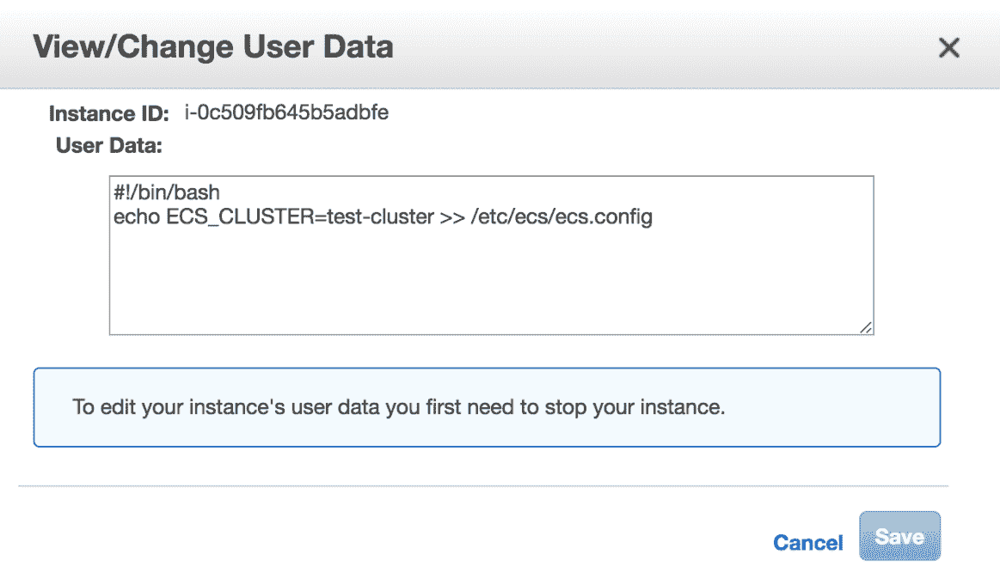
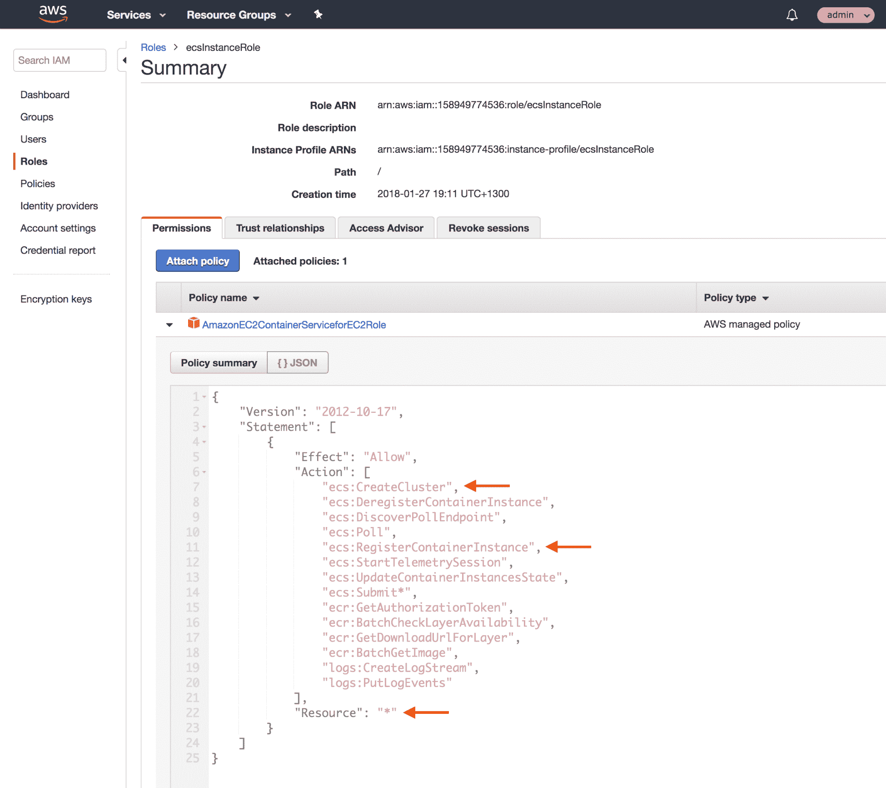
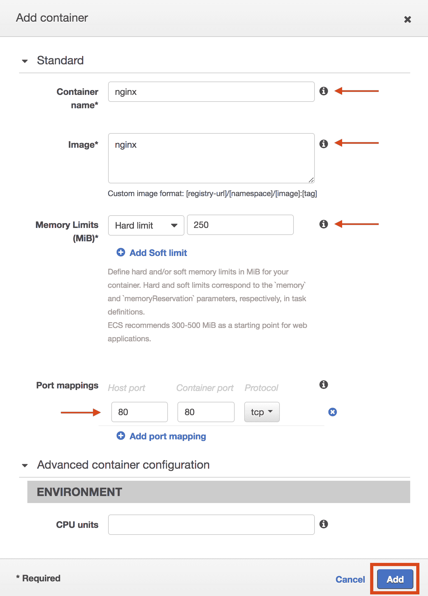
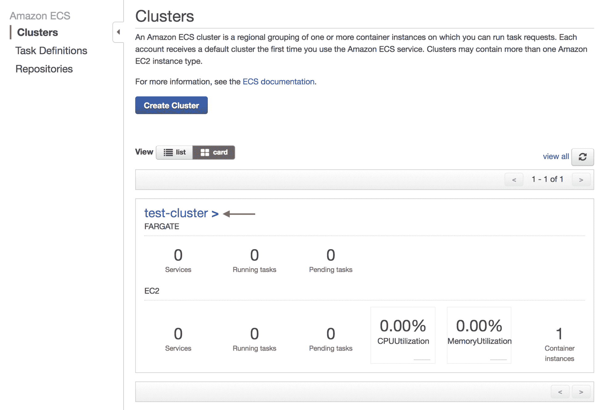
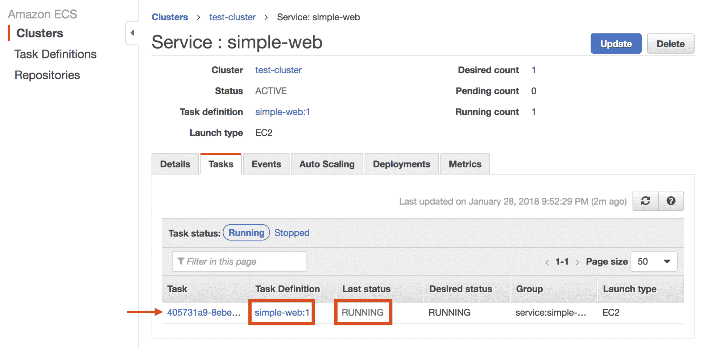
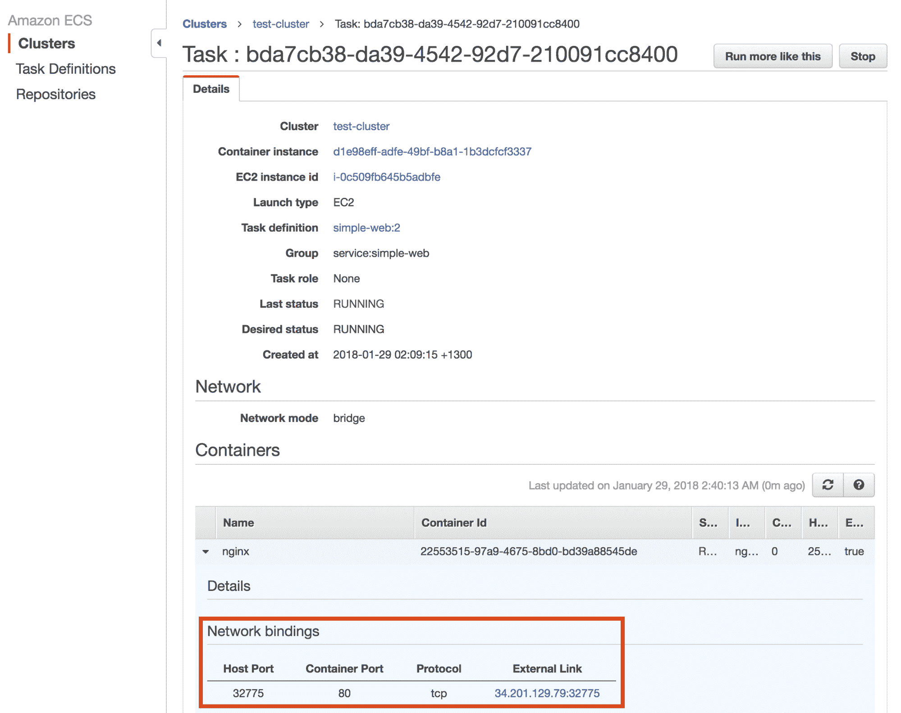
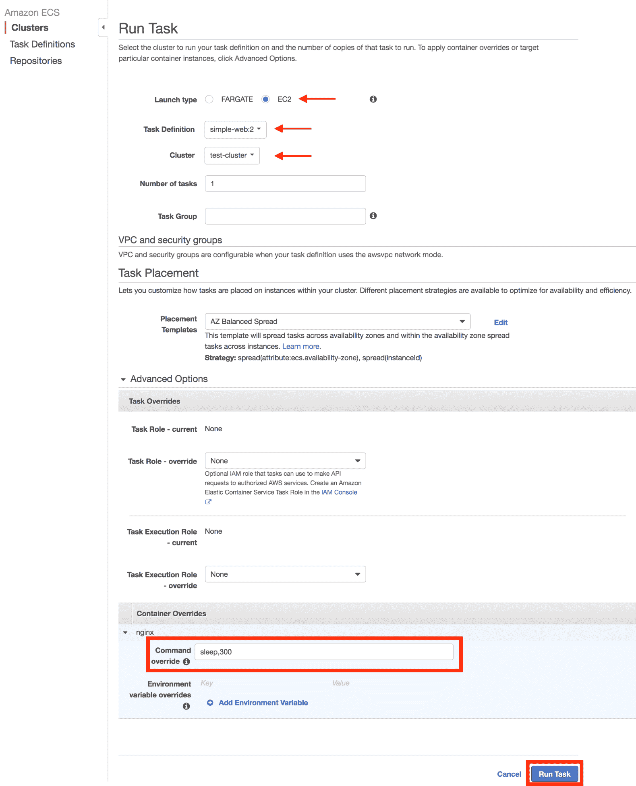
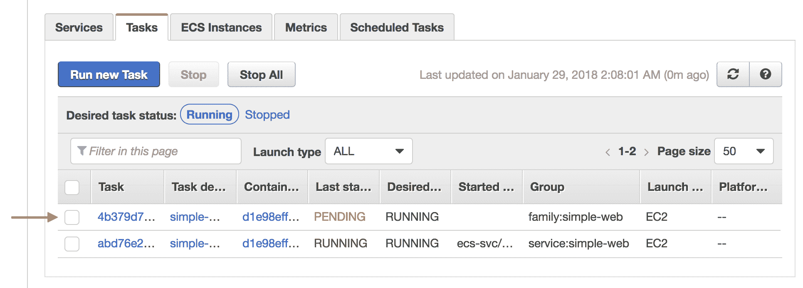

# 四、ECS 简介

**弹性容器服务** ( **ECS** )是一种流行的 AWS 管理的服务，为您的应用提供容器编排，并与各种 AWS 服务和工具集成。

在本章中，您将学习 ECS 的关键概念；如何构建 ECS，了解 ECS 的各种组件，包括**弹性容器注册表** ( **ECR** )、ECS 集群、ECS 容器实例、ECS 任务定义、ECS 任务和 ECS 服务。本章的主要重点是使用 AWS 控制台创建您的第一个 ECS 集群，定义 ECS 任务定义，并配置 ECS 服务以将您的第一个容器应用部署到 ECS。您将进一步了解 ECS 集群是如何由 ECS 容器实例形成的，并在引擎盖下检查一个 ECS 容器实例，以进一步了解 ECS 如何连接到您的基础架构，以及容器是如何部署和管理的。最后，将向您介绍 ECS 命令行界面(CLI)，这是一个有用的工具，用于快速建立 ECS 集群、任务定义和服务，使用流行的 Docker Compose 格式来定义您的容器和服务。

将涵盖以下主题:

*   ECS 体系结构
*   创建 ECS 集群
*   了解 ECS 容器实例
*   创建 ECS 任务定义
*   创建 ECS 服务
*   部署 ECS 服务
*   运行 ECS 任务
*   使用电子控制系统命令行界面

# 技术要求

以下是完成本章的技术要求:

*   Docker 引擎 18.06 或更高版本
*   Docker写作 1.22 或更高
*   japan quarterly 日本季刊
*   对 AWS 帐户的管理员访问权限
*   根据第 3 章中的说明，配置本地 AWS 配置文件
*   示例应用的 Docker 工作流，如第 2 章中所配置的(参见[https://github . com/Docker-in-AWS/Docker-in-AWS/tree/master/CH2](https://github.com/docker-in-aws/docker-in-aws/tree/master/ch2))。

以下 GitHub URL 包含本章使用的代码示例:[https://GitHub . com/docker-in-AWS/docker-in-AWS/tree/master/CH4](https://github.com/docker-in-aws/docker-in-aws/tree/master/ch4)[。](https://github.com/docker-in-aws/docker-in-aws/tree/master/ch4)

查看以下视频，了解《行动守则》:
[http://bit.ly/2MTG1n3](http://bit.ly/2MTG1n3)

# ECS 体系结构

ECS 是一个由 AWS 管理的服务，它为您提供了核心构建块，以构建您希望如何在 AWS 中部署和操作容器应用。

Prior to December 2017, the Elastic Container Service was known as the EC2 Container Service.

ECS 允许您:

*   在私有存储库中构建和发布您的 Docker 映像
*   创建描述运行应用所需的容器映像、配置和资源的定义
*   使用您自己的 EC2 基础架构或 AWS 管理的基础架构启动和运行您的容器
*   管理和监控您的容器
*   协调容器应用的新版本或修订版的滚动部署

为了提供这些功能，ECS 包括如下图所示和下表所述的许多组件:

| 成分 | 描述 |
| 弹性容器登记处 | 提供安全的私有 Docker 映像存储库，您可以在其中发布和提取 Docker 映像。我们将在[第 5 章](05.html)*中使用ECR来深入研究ECR。* |
| 电子控制系统集群 | 运行容器应用的 ECS 容器实例的集合。 |
| ECS 容器实例 | 一个运行 Docker Engine 和 ECS 代理的 EC2 实例，它与 AWS ECS 服务通信，并允许 ECS 管理您的容器应用的生命周期。每个 ECS 容器实例都加入到一个 ECS 集群中。 |
| ECS 代理 | 以 Docker 容器的形式运行并与 AWS ECS 服务通信的软件组件。代理负责代表 ECS 管理 Docker 引擎，从注册表中提取 Docker 映像，启动和停止 ECS 任务，以及向 ECS 发布指标。 |
| ECS 任务定义 | 定义组成应用的一个或多个容器和相关资源。每个容器定义都包括指定容器映像、应该为容器分配多少 CPU 和内存、运行时环境变量以及更多配置选项的信息。 |
| 电子控制系统任务 | ECS 任务是 ECS 任务定义的运行时表现形式，代表在给定 ECS 集群上运行的任务定义中定义的容器。ECS 任务可以作为短期、临时任务运行，也可以作为长期任务运行，这构成了 ECS 服务的构建模块。 |
| ECS 服务 | 一个 ECS 服务定义了在给定的 ECS 集群上运行的长寿命 ECS 任务的零个或多个实例，并表示您通常认为的应用或微服务实例。ECS 服务定义了 ECS 任务定义，以 ECS 集群为目标，还包括所需的计数，该计数定义了根据 ECS 任务定义有多少实例或 ECS 任务与服务相关联。您的 ECS 服务可以与 AWS 弹性负载平衡服务集成，该服务允许您为 ECS 服务提供高可用性、负载平衡的服务端点，并且还支持应用新版本的滚动部署。 |
| AWS ECS | 管理 ECS 体系结构中的所有组件。提供管理 ECS 代理的服务端点，与其他 AWS 服务集成，并允许客户管理他们的 ECR 存储库、ECS 任务定义和 ECS 集群。 |

随着本章的深入，请参考下图，直观了解各种 ECS 组件之间的相互关系。


ECS architecture

# 创建 ECS 集群

为了帮助您了解 ECS 的基础知识，我们现在将使用 AWS 控制台逐步完成一系列配置任务。

我们将首先创建一个 ECS 集群，它是将运行您的容器应用的 ECS 容器实例的集合，并且通常与 EC2 自动缩放组密切相关，如下图所示。

可以使用以下步骤来创建 ECS 集群:

All AWS console configuration examples in this chapter are based on you having logged in to the AWS console and assumed an appropriate administrative role, as described in the earlier Chapter 3, *Getting Started with AWS**.* At the time of writing this chapter, the tasks described in this section are specific to the us-east-1 (North Virginia) region so before proceeding, ensure you have selected this region in the AWS console.

1.  从 AWS 主控制台，在计算部分选择**服务** | **弹性容器服务**。
2.  如果您以前没有在您的 AWS 帐户和地区使用或配置过 ECS，您将看到一个欢迎屏幕，您可以通过单击**开始**按钮来调用入门配置向导。
3.  在撰写本文时，入门向导仅允许您使用 Fargate 部署类型入门。我们将在后面的章节中了解法盖特，所以滚动到屏幕底部并点击**取消**。
4.  您将返回到 ECS 控制台，我们现在可以通过单击**创建集群**按钮开始创建 ECS 集群。
5.  在**选择集群模板**屏幕上，选择 **EC2 Linux +网络**模板，该模板将通过基于特殊的 ECS 优化的亚马逊机器映像(AMI)启动 EC2 实例来设置网络资源和支持 Docker for Linux 的 EC2 自动缩放组，稍后我们将详细了解这一点。完成后，点击**下一步**继续。

6.  在**配置集群**屏幕上，配置**测试集群**的集群名称，确保 **EC2 实例类型**设置为 **t2.micro** 符合自由层访问的条件，并将**密钥对**设置为您在前面章节中创建的 EC2 密钥对。请注意，将创建一个新的 VPC 和子网，以及一个允许从互联网(`0.0.0.0/0`)进行入站网络访问(TCP 端口`80`)的安全组。完成后，点击**创建**开始创建集群:


Configuring the ECS cluster

7.  此时，将显示启动状态屏幕，并将创建支持您的 ECS 集群所需的大量资源。集群创建完成后，点击**查看集群**按钮继续。

现在，您将进入刚刚创建的`test-cluster`的详细信息屏幕。祝贺您—您已经成功部署了第一个 ECS 群集！

集群详细信息屏幕为您提供了有关您的 ECS 集群的配置和操作数据，例如，如果您单击 **ECS 实例**选项卡，您将看到集群中每个 ECS 容器实例的列表:


ECS cluster details

您可以看到向导创建了一个容器实例，该实例从部署到显示的可用性区域的 EC2 实例运行。注意:您还可以看到有关 ECS 容器实例的其他信息，例如 ECS 代理版本和状态、运行任务、CPU/内存使用情况以及 Docker Engine 的版本。

对于一个 ECS 集群来说，没有什么比这更重要的了——它本质上是一个 ECS 容器实例的集合，而 ECS 容器实例又是运行 Docker Engine 的 EC2 实例，以及为运行您的容器提供 CPU、内存和网络资源的 ECS 代理。

# 了解 ECS 容器实例

使用 AWS 控制台提供的向导创建 ECS 集群非常容易，但是很明显，为了启动和运行 ECS 集群，许多事情都在幕后进行。对所创建的所有资源的全面讨论不在本章的介绍范围之内，但是在这个阶段，将重点放在 ECS 容器实例上并更详细地检查它们是有用的，因为它们共同构成了 ECS 集群的核心。

# 加入 ECS 集群

当 ECS 创建集群向导启动实例并创建我们的 ECS 集群时，您可能想知道 ECS 容器实例是如何加入 ECS 集群的。这个问题的答案非常简单，只需在新创建的集群中点击 ECS 容器实例的 EC2 实例 ID 链接，就可以很容易理解。

此链接将带您进入 EC2 仪表板，其中 EC2 实例与选定的容器实例相关联，如下图所示。请注意，在我们讨论 ECS 容器实例时，我强调了一些我将回头参考的元素:


EC2 Instance details

如果右键单击实例并选择**实例设置** | **查看/更改用户数据**(参见上一个屏幕截图)，您将看到实例的用户数据，这是一个在实例创建时运行的脚本，可用于帮助初始化您的 EC2 实例:



EC2 Instance User Data Script for Joining an ECS Cluster

由入门向导配置的用户数据脚本显示在前面的截图中，如您所见，这是一个非常简单的 bash 脚本，它将`ECS_CLUSTER=test-cluster`文本写入名为`/etc/ecs/ecs.config`的文件中。在本例中，回想一下`test-cluster`是您为 ECS 集群配置的名称，因此引用的 ECS 代理配置文件中的这一行配置只是告诉运行在 ECS 容器实例上的代理尝试向名为`test-cluster`的 ECS 集群注册。

The `/etc/ecs/ecs.config` file includes many other configuration options, which we will examine in further detail in [Chapter 6](06.html), *Building Custom ECS Container Instances**.*

# 授予加入 ECS 集群的访问权限

在前面的截图中，请注意，连接到 ECS 集群不需要任何凭据，您可以认为 ECS 只是允许任何 EC2 实例加入 ECS 集群，但这当然不太安全。

EC2 实例包括一个名为 IAM 实例配置文件的功能，它将 IAM 角色附加到 EC2 实例，定义实例可以执行的各种 AWS 服务操作。在您的 EC2 实例的 EC2 仪表板中，您可以看到名为**ecinstancerole**的角色已分配给您的实例，如果您单击该角色，您将进入 IAM 仪表板，显示该角色的**摘要**页面。

在**权限**选项卡中，您可以看到一个名为`AmazonEC2ContainerServiceforEC2Role`的 AWS 管理的策略附加到该角色，如果您展开该策略，您可以看到与该策略相关联的各种 IAM 权限，如下图所示:



EC2 Instance Role IAM Policy

请注意，该策略允许`ecs:RegisterContainerInstance`操作，这是 ECS 容器实例加入 ECS 集群所需的 ECS 权限，并且该策略还授予`ecs:CreateCluster`权限，这意味着试图注册到当前不存在的 ECS 集群的 ECS 容器实例将自动创建新集群。

还有一点需要注意的是，该策略适用于`"Resource": "*"`属性指定的所有资源，这意味着任何被分配了该策略角色的 EC2 实例都将能够加入您的帐户和区域中的任何 ECS 集群。同样，这可能看起来不太安全，但请记住，这是一个旨在简化为您的 ECS 容器实例授予必要权限的策略，在后面的章节中，我们将讨论如何创建您自己的自定义 IAM 角色和策略来限制给定 ECS 容器实例可以加入哪些 ECS 集群。

# 管理 ECS 容器实例

一般来说，ECS 容器实例应该是自我管理的，几乎不需要直接管理，但是有时您需要对 ECS 容器实例进行故障排除，因此了解如何连接到 ECS 容器实例以及了解在 ECS 容器实例的保护下发生了什么是非常有用的。

# 连接到 ECS 容器实例

ECS 容器实例是常规的 Linux 主机，因此如您所料，连接到实例仅仅意味着能够建立到实例的安全外壳(SSH)会话:

1.  如果您在 EC2 仪表板中导航回实例，我们首先需要配置连接到实例的安全组，以允许入站 SSH 访问。您可以通过点击安全组、选择入站选项卡并点击**编辑按钮**来修改安全组的入站规则。
2.  在**编辑入站规则**对话框中，点击**添加规则**按钮，添加一个新规则，设置如下:
    *   协议:TCP
    *   端口范围:22
    *   来源:我的 IP


Add a Security Group Rule for SSH Access

3.  单击**保存**后，您将启用从您的公共 IP 地址到 ECS 容器实例的入站 SSH 访问。如果您在浏览器中单击“上一步”返回到您的 EC2 实例，您现在可以将公共 IP 地址和 SSH 复制到您的实例。

下面的示例演示了如何建立到实例的 SSH 连接，使用`-i`标志来引用与实例关联的 EC2 密钥对的私钥。您还需要使用`ec2-user`用户名登录，这是亚马逊 Linux 中包含的默认非根用户:

```
> ssh -i ~/.ssh/admin.pem ec2-user@34.201.120.79
The authenticity of host '34.201.120.79 (34.201.120.79)' can't be established.
ECDSA key fingerprint is SHA256:c/MniTAq931tJj8bCVtRUP9gixM/ZXZSqDuMENqpod0.
Are you sure you want to continue connecting (yes/no)? yes
Warning: Permanently added '34.201.120.79' (ECDSA) to the list of known hosts.

   __| __| __|
   _| ( \__ \ Amazon ECS-Optimized Amazon Linux AMI 2017.09.g
 ____|\___|____/

For documentation visit, http://aws.amazon.com/documentation/ecs
5 package(s) needed for security, out of 7 available
Run "sudo yum update" to apply all updates.
```

首先要注意的是，登录横幅指示该实例基于亚马逊 ECS 优化的亚马逊 Linux AMI，这是创建 ECS 容器实例时使用的默认和推荐的亚马逊机器映像(AMI)。AWS 维护这个 AMI，并使用推荐用于 ECS 的 Docker 和 ECS 代理版本定期更新它，因此这是迄今为止最简单的用于您的 ECS 容器实例的平台，我强烈建议使用这个 AMI 作为您的 ECS 容器实例的基础。

你可以在这里了解这个 AMI 的更多信息:[https://docs . AWS . Amazon . com/Amazon ECS/latest/developer guide/ECS-optimized _ AMI . html](https://docs.aws.amazon.com/AmazonECS/latest/developerguide/ecs-optimized_AMI.html)。它包括 ECS 支持的每个区域的当前 AMI 映像标识列表。

In [Chapter 6](06.html), *Building Custom ECS Container Instances* you will learn how to customize and enhance the Amazon ECS-Optimized Amazon Linux AMI.

# 检查本地Docker环境

如您所料，您的 ECS 容器实例将运行一个活动的 Docker Engine，您可以通过运行`docker info`命令来收集相关信息:

```
> docker info
Containers: 1
 Running: 1
 Paused: 0
 Stopped: 0
Images: 2
Server Version: 17.09.1-ce
Storage Driver: devicemapper
 Pool Name: docker-docker--pool
 Pool Blocksize: 524.3kB
 Base Device Size: 10.74GB
 Backing Filesystem: ext4
...
...
```

在这里，您可以看到该实例正在运行 Docker 版本 17.09.1-ce，使用设备映射器存储驱动程序，并且当前有一个容器正在运行。

现在让我们通过执行`docker container ps`命令来看看正在运行的容器:

```
> docker ps
CONTAINER ID   IMAGE                            COMMAND    CREATED          STATUS          NAMES
a1b1a89b5e9e   amazon/amazon-ecs-agent:latest   "/agent"   36 minutes ago   Up 36 minutes   ecs-agent
```

您可以看到，ECS 代理实际上是作为一个名为`ecs-agent`的容器运行的，它应该总是在您的 ECS 容器实例上运行，以便您的 ECS 容器实例由 ECS 管理。

# 检查 ECS 代理

如前所示，ECS 代理作为 Docker 容器运行，我们可以使用`docker container inspect`命令收集一些关于这个容器如何工作的见解。在前面的示例中，我们引用了 ECS 代理容器的名称，然后使用 Go 模板表达式和`--format`标志来过滤命令输出，显示从 ECS 代理容器到 ECS 容器实例主机的各种绑定装载或卷映射。

In many of the command examples, I am piping output to the `jq` utility, which is a useful utility used for parsing JSON output at the command line. `jq` is not included by default in the Amazon Linux AMI, so you will need to install `jq` by running the `sudo yum install jq` command.

```
> docker container inspect ecs-agent --format '{{json .HostConfig.Binds}}' | jq
[
  "/var/run:/var/run",
  "/var/log/ecs:/log",
  "/var/lib/ecs/data:/data",
  "/etc/ecs:/etc/ecs",
  "/var/cache/ecs:/var/cache/ecs",
  "/cgroup:/sys/fs/cgroup",
  "/proc:/host/proc:ro",
  "/var/lib/ecs/dhclient:/var/lib/dhclient",
  "/lib64:/lib64:ro",
  "/sbin:/sbin:ro"
]
```

Running the docker container inspect command

注意`/var/run`文件夹从主机映射到代理，代理提供对位于`/var/run/docker.sock`的 Docker Engine 套接字的访问，允许 ECS 代理管理 Docker Engine。您还可以看到，ECS 代理日志将被写入 Docker Engine 主机文件系统上的`/var/log/ecs`。

# 正在验证 ECS 代理

ECS 代理包括一个本地网络服务器，可用于检查当前的 ECS 代理状态。

以下示例演示了如何使用`curl`命令检查 ECS 代理:

```
> curl -s localhost:51678 | jq
{
  "AvailableCommands": [
    "/v1/metadata",
    "/v1/tasks",
    "/license"
  ]
}
> curl -s localhost:51678/v1/metadata | jq
{
  "Cluster": "test-cluster",
  "ContainerInstanceArn": "arn:aws:ecs:us-east-1:385605022855:container-instance/f67cbfbd-1497-47c0-b56c-a910c923ba70",
  "Version": "Amazon ECS Agent - v1.16.2 (998c9b5)"
}
```

Introspecting the ECS Agent

请注意，ECS 代理监听端口 51678，并提供三个您可以查询的端点:

*   `/v1/metadata`:描述容器实例加入的集群、容器实例**亚马逊资源名称** ( **ARN** )以及 ECS 代理版本
*   `/v1/tasks`:返回当前正在运行的任务列表。目前我们还没有向集群部署任何 ECS 服务或任务，因此这个列表是空的
*   `/license`:提供申请 ECS 代理软件的各种软件许可证

`/v1/metadata`端点特别有用，因为您可以使用该端点来确定 ECS 代理是否已成功加入给定的 ECS 集群。稍后，我们将在[第 6 章](06.html)、*构建自定义 ECS* *容器实例*中使用它来执行实例创建的运行状况检查，以确保我们的实例已成功加入正确的 ECS 集群。

# ECS 容器实例日志

每个 ECS 容器实例都包含有助于对实例进行故障排除的日志文件。

您将使用的主要日志包括以下内容:

*   Docker引擎日志:位于`/var/log/docker`
*   ECS 代理日志:位于`/var/log/ecs`

请注意，有两种类型的 ECS 代理日志:

*   初始化日志:位于`/var/log/ecs/ecs-init.log`，这些日志提供与`ecs-init`服务相关的输出，该服务是一个确保 ECS 代理在容器实例启动时运行的新贵服务。
*   代理日志:位于`/var/log/ecs/ecs-agent.log.*`，这些日志提供与 ECS 代理操作相关的输出。这些日志是您将针对任何 ECS 代理相关问题检查的最常见日志。

# 创建 ECS 任务定义

现在，您已经设置了您的 ECS 集群并了解了 ECS 容器实例如何向集群注册，现在是时候配置 ECS 任务定义了，它定义了您想要为应用部署的容器的配置。ECS 任务定义可以定义一个或多个容器，以及容器可能需要读取或写入的其他元素，如卷。

为了简单起见，我们将创建一个非常基本的任务定义，运行官方的 Nginx Docker 映像，该映像在[https://hub.docker.com/_/nginx/](https://hub.docker.com/_/nginx/)发布。Nginx 是一个流行的网络服务器，默认情况下，它将提供一个欢迎使用 Nginx 的页面，目前这足以代表一个简单的网络应用。

现在，让我们通过执行以下步骤为简单的 web 应用创建一个 ECS 任务定义:

1.  导航至**服务** | **弹性容器服务**处的 ECS 控制台。您可以通过从左侧菜单中选择**任务定义**并单击**创建新任务定义**按钮来创建新任务定义。
2.  在**选择启动类型兼容性**屏幕中，选择 **EC2 启动类型**，它将根据您拥有和管理的基础架构配置要在 ECS 集群上启动的任务定义。
3.  在**配置任务和容器定义**画面中，配置**简单网页**的**任务定义名称**，然后向下滚动点击**添加容器**添加新的容器定义。
4.  在**添加容器**画面中，配置以下设置，完成后点击**添加按钮**创建容器定义。该容器定义将把 ECS 容器主机上的端口 80 映射到容器中的端口`80`，允许从外部世界访问 Nginx web 服务器:
    *   **容器名称** : nginx
    *   **影像**:engine
    *   **内存限制** : `250`兆字节硬限制
    *   **端口映射**:主机端口`80`，容器端口`80`，协议 tcp:



Creating a Container Definition

5.  单击**配置任务和容器定义**页面底部的**创建**按钮，完成任务定义的创建。

# 创建 ECS 服务

我们已经创建了一个 ECS 集群，并配置了一个 ECS 任务定义，其中包括一个运行 Nginx 的单个容器，该容器具有适当的端口映射配置，以向外部世界公开 Nginx web 服务器。

我们现在需要定义一个 ECS 服务，该服务将配置 ECS 以将我们的 ECS 任务定义的一个或多个实例部署到我们的 ECS 集群。ECS 服务将给定的 ECS 任务定义部署到给定的 ECS 集群，允许您配置希望运行多少引用的 ECS 任务定义的实例(ECS 任务)，并控制更高级的功能，如负载平衡器集成和应用的滚动更新。

要创建新的 ECS 服务，请完成以下步骤:

1.  在 ECS 控制台中，从左侧选择集群，然后单击您在本章前面创建的**测试集群**:



Selecting an ECS Cluster to Create an ECS Service

2.  在集群详细信息页面，选择**服务**选项卡，点击**创建**创建新服务。
3.  在配置服务屏幕上，配置以下设置，完成后点击**下一步** **步骤**按钮。请注意，我们引用了本章前面创建的任务定义和 ECS 集群:
    *   **发射类型** : EC2
    *   **任务定义**:简单-网页:1
    *   **集群**:测试集群
    *   **服务名称**:简单网页
    *   **任务数** : 1
4.  ECS 服务配置设置的其余部分是可选的。继续点击**下一步**直到您到达**查看**屏幕，在此您可以查看您的设置并点击**创建服务**以完成 ECS 服务的创建。
5.  现在将出现**启动状态**屏幕，一旦创建了您的服务，点击**查看服务**按钮。
6.  现在，您的新 ECS 服务将出现“服务详细信息”屏幕，您将看到一个处于 RUNNING 状态的 ECS 任务，这意味着与简单 web ECS 任务定义相关联的 Nginx 容器已成功启动:



Completing Creation of a New ECS Service

在这一阶段，您现在应该能够浏览到新部署的 Nginx web 服务器，您可以通过浏览到之前作为 ECS 集群的一部分创建的 ECS 容器实例的公共 IP 地址来验证这一点。如果一切按预期进行，应该会出现默认的**欢迎来到 nginx** 页面，如下图截图所示:


Browsing to the Nginx Web Server

# 部署 ECS 服务

现在您已经成功创建了一个 ECS 服务，让我们来看看 ECS 如何管理容器应用的新部署。重要的是要理解 ECS 任务定义是不可变的——也就是说，一旦创建了任务定义，您就不能修改它，相反，您需要要么创建一个全新的任务定义，要么创建当前任务定义的*修订版*，您可以将其视为给定任务定义的新版本。

ECS 将 ECS 任务定义的逻辑名称定义为*族*，ECS 任务定义的给定修订版以*族* : *修订版—* 的形式表示，例如，`my-task-definition:3`指的是 *my-task-definition* 族的修订版 3。

这意味着为了部署容器应用的新版本，您需要执行几个步骤:

1.  使用为新版本应用更改的配置设置，创建新版本的 ECS 任务定义。这通常只是与您为应用构建的 Docker 映像相关联的映像标签，但是任何配置更改，例如分配的内存或 CPU 资源的更改，都将导致创建 ECS 任务定义的新版本。
2.  更新您的 ECS 服务以使用 ECS 任务定义的新版本。每当您以这种方式更新 ECS 服务时，ECS 将自动执行应用的滚动更新，尝试根据新的 ECS 任务定义版本，用新的容器优雅地替换构成 ECS 服务的每个运行容器。

为了演示这种行为，现在让我们修改您在本章前面创建的 ECS 任务定义，并通过执行以下步骤更新 ECS 服务:

1.  在 ECS 控制台中，从左侧选择**任务定义**，并点击您之前创建的**简单网络**任务定义。
2.  请注意，任务定义当前只有一个版本，版本号位于任务定义名称后面的冒号后面。例如**简单网络:1** 指的是简单网络任务定义的修订版 1。选择当前任务定义版本，然后点击**新建版本**在现有任务定义版本的基础上新建一个版本。
3.  显示**创建任务定义的新版本**屏幕，与您之前配置的**创建新任务定义**屏幕非常相似。向下滚动至**容器定义**部分，点击 Nginx 容器修改 Nginx 容器定义。

4.  我们将对任务定义进行的更改是将端口映射从端口 80 的当前静态主机映射修改为主机上的动态端口映射。这可以通过将主机端口设置留空来实现，在这种情况下，Docker 引擎将从底层 ECS 容器实例上的临时端口范围中分配一个动态端口。对于我们正在使用的亚马逊 Linux AMI，这个端口范围在`32768`和`60999`之间。动态端口映射的好处是，我们可以在同一台主机上运行我们的容器的多个实例——如果静态端口映射到位，则只能启动一个容器，因为后续的容器将尝试绑定到已经在使用的端口`80`。完成配置更改后，点击**更新**按钮继续。
5.  点击**新建任务定义**界面下方的【创建】按钮，完成新建任务定义。

To obtain the ephemeral port range used by Docker, you can inspect the contents of the `/proc/sys/net/ipv4/ip_local_port_range` file. If this file is not available on your operating system, Docker will use the port range of `49153` through `65535`.

此时，已经根据您的 ECS 任务定义创建了一个新版本(版本 2)。现在，您需要通过完成以下步骤来更新您的 ECS 服务，以使用新的任务定义修订版:

1.  在 ECS 控制台中，从左侧选择**集群**，并选择您的测试集群。在服务选项卡上，选择您的 ECS 服务旁边的复选框，然后单击**更新**按钮。

2.  在“配置服务”屏幕上的“任务定义”下拉列表中，您应该能够选择刚刚创建的任务定义的新版本(简单网络:2)。一旦完成，继续点击**下一步**按钮，直到您到达审查屏幕，此时您可以点击**更新服务**按钮来完成您的配置更改:


Modifying ECS Service Task Definition

3.  与您之前创建 ECS 服务时看到的类似，将显示“启动状态”屏幕。如果您点击**查看服务**按钮，您将进入 ECS 服务详细信息屏幕，如果您选择部署选项卡，您将看到正在部署的任务定义的新版本:


ECS Service Deployment

请注意，有两个部署—活动部署显示了现有的 ECS 服务部署，并指示当前有一个正在运行的容器。PRIMARY 部署显示了基于新版本的新 ECS 服务部署，并指示所需的计数为 1，但请注意运行计数尚未达到 1。

如果定期刷新部署状态，则可以在部署新任务定义修订时观察各种状态更改:

The deployment changes will be performed reasonably quickly, so if you don't see any of these changes, you can always update the ECS service to use the first revision of the ECS task definition to force a new deployment.

1.  PRIMARY 部署应该指示挂起计数为 1，这意味着容器的新版本即将启动。


New Deployment Pending Transition

2.  PRIMARY 部署接下来将转换为运行计数 1，这意味着容器的新版本将与现有容器一起运行:


New Deployment Running Transition

3.  此时，现有容器现在可以停止，因此您应该会看到活动部署运行计数降至零:


Old Deployment Stopping Transition

4.  活动部署从“部署”选项卡中消失，滚动部署完成:


Rolling Deployment Completion

至此，我们已经成功执行了一个 ECS 服务的滚动更新，值得指出的是，新的动态端口映射配置意味着您的 Nginx web 服务器不再监听端口 80 与外部世界的连接，而是监听由 ECS 容器实例动态选择的端口。

您可以通过尝试浏览到您的 Nginx 网络服务器公共 IP 地址来验证这一点，这将导致连接失败，因为网络服务器在端口 80 上不再运行。如果您选择了**简单网络** ECS 服务的**任务**选项卡，您可以单击该任务来了解我们的网络服务器正在监听哪个端口。

展开如下所示的 Nginx 容器后，您可以看到，在这种情况下，ECS 容器实例主机上的端口`32775`映射到 Nginx 容器上的端口`80`，您将无法从互联网访问该端口，因为分配给 ECS 容器实例的安全组仅允许端口`80`上的入站访问。

For dynamic port mapping to be useful, you need to associate your ECS services with an application load balancer, which will automatically detect the dynamic port mapping of each ECS service instance and load balance incoming requests to a static port defined on the load balancer to each ECS service instance. You will learn more about this in later chapters.



ECS Service Dynamic Port Mapping

# 正在运行 ECS 任务

我们已经看到了如何将长期运行的应用部署为 ECS 服务，但是如何使用 ECS 运行临时任务或短期容器呢？答案当然是创建一个 ECS 任务，该任务通常用于运行临时任务，例如运行部署脚本、执行数据库迁移，或者执行计划的批处理。

尽管 ECS 服务本质上是长时间运行的 ECS 任务，但 ECS 确实将您自己创建的 ECS 任务与 ECS 服务区别开来，如下表所述:

| 场景/特征 | ECS 服务行为 | ECS 任务行为 |
| 容器停止或失败 | ECS 将始终尝试保持给定 ECS 服务的所需计数，并且如果由于容器停止或失败导致活动计数低于所需计数，将尝试重新启动容器。 | ECS 任务是一次性执行，要么成功，要么失败。ECS 永远不会尝试重新运行失败的 ECS 任务。 |
| 任务定义配置 | 对于给定的 ECS 服务，您不能覆盖任何 ECS 任务定义配置。 | ECS 任务允许您覆盖环境变量和命令行设置，允许您为各种不同类型的 ECS 任务利用单个 ECS 任务定义。 |
| 负载平衡器集成 | ECS 服务的特点是与 AWS 弹性负载平衡服务完全集成。 | ECS 任务不提供与任何负载平衡服务的集成。 |

ECS Services vs ECS Tasks

现在让我们看看如何使用 AWS 控制台运行 ECS 任务。您将创建一个非常简单的 ECS 任务，该任务从 ECS 任务定义中定义的 Nginx 映像运行`sleep 300`命令。

这将导致任务在执行前休眠五分钟，模拟短暂的临时任务:

1.  在 ECS 控制台中，选择左侧的**集群**，点击您的名为**测试集群**的集群。

2.  选择**任务**选项卡，点击**运行新任务**按钮，创建新的 ECS 任务:


Running an ECS Task

3.  在**运行任务**界面，首先选择 **EC2** 作为**启动类型**，确保**任务定义**和**集群**设置配置正确。如果展开**高级选项**部分，请注意您可以为 **nginx** 容器指定容器覆盖。请注意，要配置命令覆盖，您必须以逗号分隔的格式提供您想要运行的命令以及任何参数，例如，要执行`sleep 300`命令，您必须配置**睡眠，300** 的命令覆盖。配置完成后，点击**运行任务**执行新的 ECS 任务:



Configuring an ECS Task

此时，您将返回到 ECS 集群的任务选项卡，您将看到一个状态为**待定**的新任务:



ECS Task in a Pending State

新任务应该很快过渡到 **RUNNING** 的状态，如果我们让任务运行，它最终会在五分钟后退出。

现在让我们借此机会观察 ECS 任务停止时的行为。如果选择所有任务，点击**停止**按钮，系统会提示您确认是否要停止每个任务。确认要停止每项任务后，**任务**窗格应立即显示无活动任务，点击几次刷新按钮后，应看到单个任务重新启动。该任务由 ECS 自动启动，以保持简单 web 服务的期望计数为 1。

# 使用电子控制系统命令行界面

在这一章中，我们只专注于使用 AWS 控制台来开始使用 ECS。由 AWS 编写和维护的另一个工具称为 ECS CLI，它允许您创建 ECS 集群并从命令行部署 ECS 任务和服务。

ECS 命令行界面与 AWS 命令行界面在许多方面都有所不同，但主要区别包括:

*   ECS 命令行界面专注于与 ECS 交互，仅支持与为 ECS 提供支持资源的其他 AWS 服务交互，如 AWS 云信息和 EC2 服务。
*   ECS CLI 操作比 AWS CLI 操作更粗粒度。例如，ECS CLI 将协调创建一个 ECS 集群及其所有支持资源，很像您在本章前面使用的 ECS 集群向导的行为，而 AWS CLI 专注于执行单个特定任务的更细粒度的操作。
*   ECS 命令行界面是用 Golang 编写的，而 AWS 命令行界面是用 Python 编写的。这确实引入了一些行为差异，例如，ECS CLI 不支持在启用 MFA(多因素认证)的情况下使用 AWS 配置文件，这意味着您需要使用不强制 MFA 的 AWS 凭据和角色。

ECS CLI 的一个特别有用的特性是它支持 Docker Compose 文件的版本 1 和版本 2，这意味着您可以使用 Docker Compose 来提供多容器环境的一般描述。ECS CLI 还允许您使用基于 YAML 的配置文件来定义您的基础架构，因此可以将其视为一个简单而实用的基础架构即代码工具。

一般来说，ECS 命令行界面对于快速建立沙盒/开发环境进行快速原型开发或测试非常有用。为了部署您的正式非生产和生产环境，您应该使用工具和服务，如 Ansible、AWS 云信息或 Terraform，它们为您运行生产级环境所需的所有 AWS 资源提供了更广泛的支持。

The ECS CLI includes complete documentation, which you can find at [https://docs.aws.amazon.com/AmazonECS/latest/developerguide/ECS_CLI.html](https://docs.aws.amazon.com/AmazonECS/latest/developerguide/ECS_CLI.html). You can also view the ECS CLI source code and raise issues at [https://github.com/aws/amazon-ecs-cli](https://github.com/aws/amazon-ecs-cli).

# 删除测试集群

此时，您应该按照 ECS 控制面板中的以下步骤删除您在本章中创建的测试集群:

1.  从集群中选择测试集群
2.  选择并更新简单网络 ECS 服务，使其期望计数为 0
3.  等待简单网络 ECS 任务计数降至 0
4.  选择测试群集，然后单击删除群集按钮

# 摘要

在本章中，您已经了解了 ECS 体系结构，并了解了构成 ECS 的核心组件。您了解了 ECS 集群是如何成为 ECS 容器实例的集合的，这些实例在 EC2 自动缩放组实例上运行 Docker Engine。AWS 为您提供了预构建的 ECS 优化的 AMI，使其非常容易使用 ECS 快速启动和运行。每个 ECS 容器实例都包括一个 ECS 代理，它作为系统容器运行并与 ECS 通信，提供启动、停止和部署容器所需的管理和控制平面。

接下来，您创建了一个 ECS 任务定义，它定义了一个或多个容器和卷定义的集合，包括容器映像、环境变量和 CPU/内存资源分配等信息。有了 ECS 集群和 ECS 任务定义，您就可以创建和配置 ECS 服务，引用 ECS 任务定义来定义 ECS 服务的容器配置，并将 ECS 服务的一个或多个实例定位到您的 ECS 集群。

ECS 支持对容器应用的更新进行滚动部署，您只需创建 ECS 任务定义的新版本，然后将该定义与 ECS 服务相关联，就可以成功部署新的应用更改。

最后，您学习了如何使用 ECS 命令行界面来简化 ECS 集群和服务的创建，使用 Docker Compose 作为定义任务定义和 ECS 服务的通用机制。

在下一章中，您将详细了解弹性容器注册(ECR)服务，在这里您将学习如何创建自己的私有 ECR 存储库，并将您的 Docker 映像发布到这些存储库中。

# 问题

1.  说出使用 ECS 运行长时间运行的 Docker 容器所需的三个 ECS 组件
2.  对/错:ECS 代理作为新贵服务运行
3.  使用 ECS 命令行界面时，您使用什么配置文件格式来定义基础架构？
4.  对/错:您可以将两个带有静态端口映射的 ECS 任务实例部署到单个实例 ECS 集群
5.  对/错:ECS 命令行界面被认为是将 Docker 环境部署到生产环境的最佳工具
6.  当使用 ECS 运行每晚运行 15 分钟的批处理作业时，您会配置什么？
7.  真/假:ECS 任务定义是可变的，可以修改
8.  对/错:您可以通过运行`curl localhost:51678`命令来检查给定 Docker 引擎上代理的当前状态

# 进一步的信息

有关本章所涵盖主题的更多信息，您可以查看以下链接:

*   ECS 开发者指南:[https://docs . AWS . Amazon . com/Amazon ECS/latest/Developer Guide/welcome . html](https://docs.aws.amazon.com/AmazonECS/latest/developerguide/Welcome.html)
*   Amazon ECS-优化 AMI:[https://docs . AWS . Amazon . com/Amazon ECS/latest/developer guide/ECS-优化 _AMI.html](https://docs.aws.amazon.com/AmazonECS/latest/developerguide/ecs-optimized_AMI.html)
*   ECS 容器实例所需的权限:[https://docs . AWS . Amazon . com/Amazon ECS/latest/developer guide/instance _ IAM _ role . html](https://docs.aws.amazon.com/AmazonECS/latest/developerguide/instance_IAM_role.html)
*   ECS 代理文档:[https://docs . AWS . Amazon . com/Amazon ECS/latest/developer guide/ECS _ agent . html](https://docs.aws.amazon.com/AmazonECS/latest/developerguide/ECS_agent.html)
*   使用 ECS 命令行界面:[https://docs . AWS . Amazon . com/Amazon ECS/latest/developer guide/ECS _ CLI . html](https://docs.aws.amazon.com/AmazonECS/latest/developerguide/ECS_CLI.html)
*   ECS 代理 GitHub 资料档案库:https://github . com/AWS/Amazon-ECS 代理
*   ECS init GitHub 资料档案库:https://github . com/AWS/Amazon-ECS-init
*   ECS CLI GitHub 存储库:https://github . com/AWS/Amazon-ECS-CLI