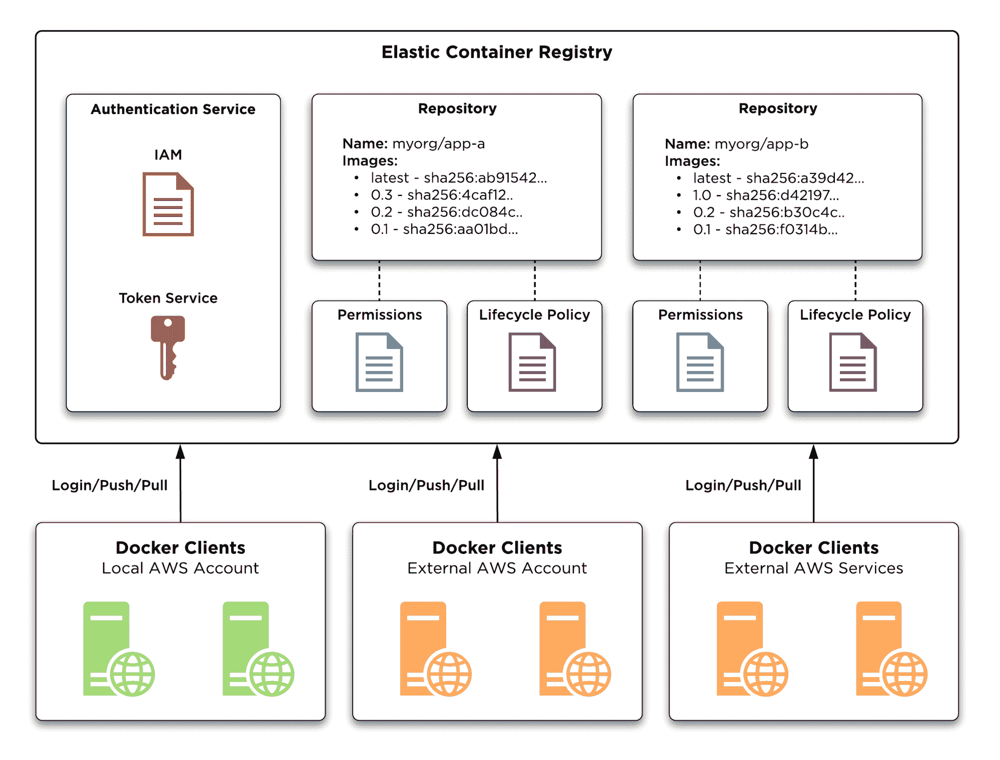
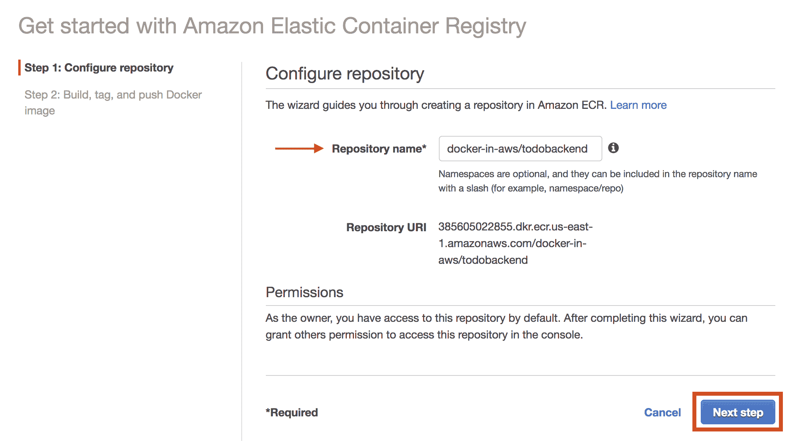
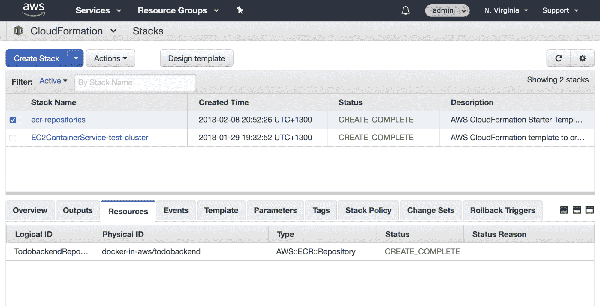
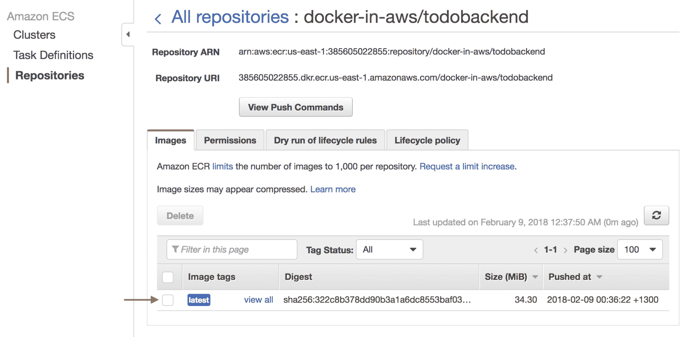
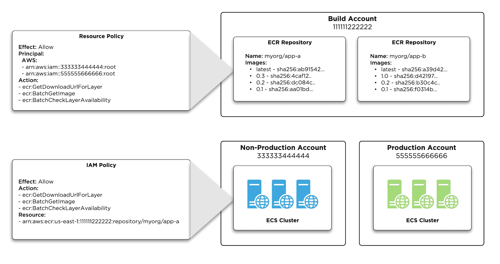
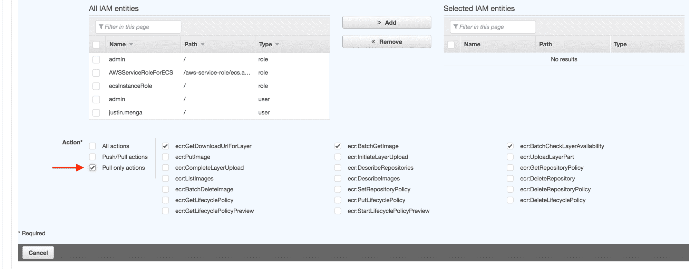
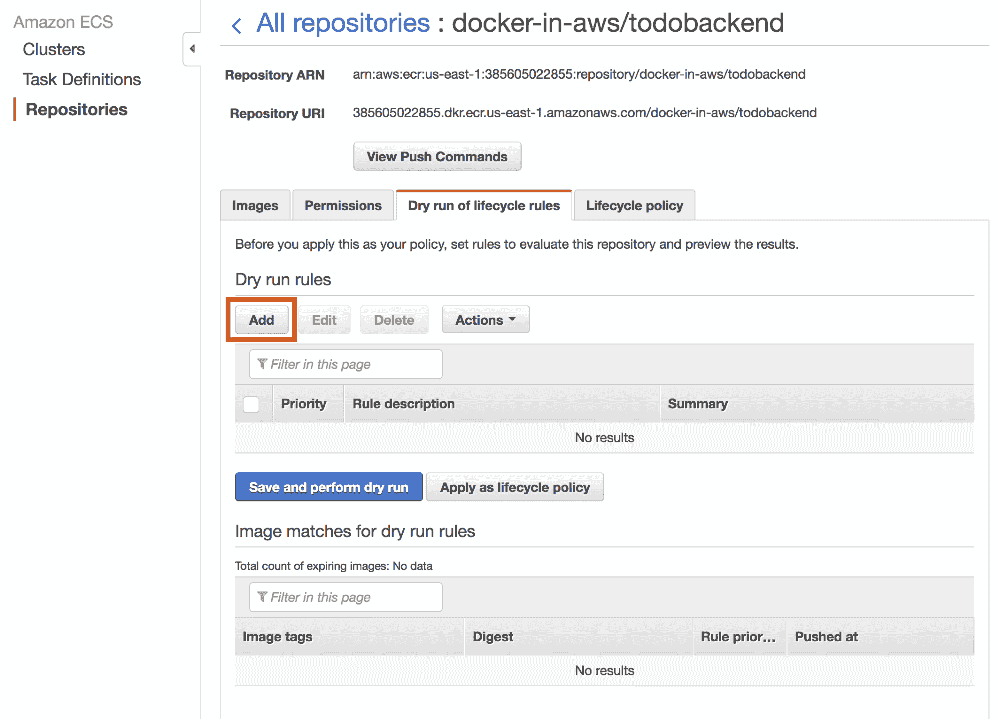
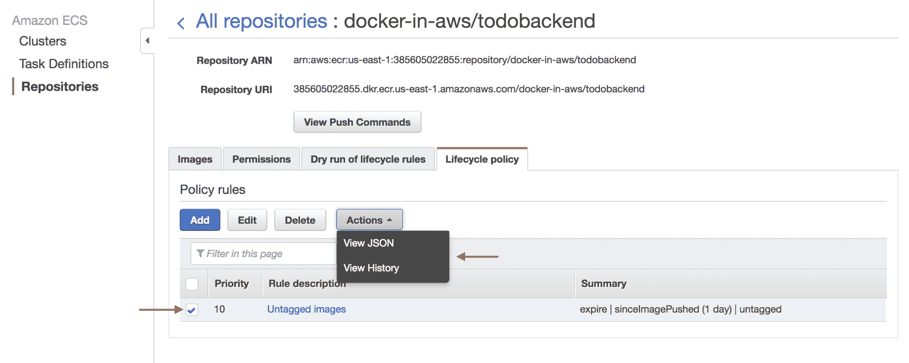

# 五、使用ECR发布Docker映像

Docker 注册中心是 Docker 和容器生态系统的一个重要组成部分，它提供了一个通用的机制来公开和私下发布和分发您的容器应用。

ECR 提供了一个完全管理的私有 Docker 注册中心，其特点是与前一章中介绍的 ECS 组件和其他 AWS 服务紧密集成。ECR 是高度可扩展的、安全的，并且提供了与用于构建和发布 Docker 映像的本机 Docker 客户端集成的工具。

在本章中，您将学习如何使用各种机制，包括 AWS 控制台、AWS 命令行界面和云信息，创建 ECR 存储库来存储您的 Docker 映像。一旦您建立了第一个ECR存储库，您将学习如何使用ECR进行身份验证，提取存储在存储库中的 Docker 映像，并使用 Docker 客户端构建和发布 Docker 映像到ECR。为了结束本章，您将学习如何处理使用和管理ECR的更高级场景，包括配置跨帐户访问以允许在其他 AWS 帐户中运行的 Docker 客户端访问您的ECR存储库，以及配置生命周期策略，以确保孤立的 Docker 映像得到定期清理，从而减少管理工作和成本。

将涵盖以下主题:

*   理解 ECR
*   创建ECR存储库
*   登录 ECR
*   将 Docker 映像发布到 ECR
*   从ECR中提取 Docker 映像
*   配置生命周期策略

# 技术要求

下面列出了完成本章的技术要求:

*   Docker 18.06 或更高
*   Docker写作 1.22 或更高
*   GNU Make 3.82 或更高版本
*   japan quarterly 日本季刊
*   AWS CLI 1.15.71 或更高版本
*   对 AWS 帐户的管理员访问权限
*   根据第 3 章中的说明配置本地 AWS 配置文件
*   第 2 章中配置的示例应用的 Docker 工作流(参见[https://github . com/Docker-in-AWS/Docker-in-AWS/tree/master/CH2](https://github.com/docker-in-aws/docker-in-aws/tree/master/ch2))。

此 GitHub URL 包含本章使用的代码示例:[https://GitHub . com/docker-in-AWS/docker-in-AWS/tree/master/ch5](https://github.com/docker-in-aws/docker-in-aws/tree/master/ch5)。

查看以下视频，了解《行动守则》:
[http://bit.ly/2PKMLSP](http://bit.ly/2PKMLSP)

# 理解 ECR

在我们开始创建和配置 ECR 存储库之前，简要介绍 ECR 的核心概念非常重要。

ECR 是由 AWS 提供的完全管理的私有 Docker 注册中心，提供与 ECS 和其他 AWS 服务的紧密集成。ECR 由许多组件组成，如下图所示:



ECR architecture

电子逆向拍卖的核心组成部分包括:

*   **存储库**:存储库存储给定 Docker 映像的所有版本的映像。每个存储库都配置有一个名称和 URI，这对于您的 AWS 帐户和地区是唯一的。
*   **权限**:每个存储库都包含允许您授予各种 ECR 操作访问权限的权限，例如推送或拉取 Docker 映像。
*   **生命周期策略**:每个存储库都可以配置一个可选的生命周期策略，该策略可以用于清理被较新版本取代的孤立 Docker 映像，或者删除您可能不再使用的较旧 Docker 映像。
*   **身份验证服务** : ECR 包括一个身份验证服务，该服务包括一个令牌服务，可用于验证您的 IAM 凭据，以换取与 Docker 客户端身份验证过程兼容的临时身份验证令牌。

考虑 ECR 的消费者也很重要。如上图所示，这些包括:

*   **与您的存储库在同一本地 AWS 帐户中的 Docker 客户端**:这通常包括运行在 ECS 集群中的 ECS 容器实例。
*   **与您的存储库不同的 AWS 帐户中的 Docker 客户端**:这是大型组织的常见场景，并且通常还包括远程帐户中运行在 ECS 集群中的 ECS 容器实例。
*   **AWS 服务使用的 Docker 客户端**:一些 AWS 服务可以利用自己在 ECR 中发布的 Docker 镜像，比如 AWS CodeBuild 服务。

At the time of writing this book, ECR is only offered as a private registry - meaning if you want to publish public your Docker images publicly, then ECR is not the correct solution for you, at least in terms of publishing your public Docker images.

# 创建ECR存储库

现在您已经对 ECR 有了一个基本的概述，让我们开始创建您的第一个 ECR 存储库。回想一下在前面的章节中，您被介绍到了本书的示例**到**应用，并且您在您的本地环境中构建了一个 Docker 映像。为了能够基于此映像在您的 ECS 集群上运行容器，您需要将此映像发布到您的 ECS 容器实例可以访问的 Docker 注册表中，ECR 是这方面的完美解决方案。

要为**到**应用创建 ECR 存储库，我们将重点关注创建和配置存储库的三种流行方法:

*   使用 AWS 控制台创建ECR存储库
*   使用 AWS 命令行界面创建ECR存储库
*   使用 AWS 云信息创建ECR存储库

# 使用 AWS 控制台创建ECR存储库

通过执行以下步骤，可以使用 AWS 控制台创建 ECR 存储库:

1.  从 AWS 主控制台，在计算部分选择**服务** | **弹性容器服务**，从左侧菜单选择**存储库**，然后单击开始按钮。
2.  系统将提示您为存储库配置名称。标准惯例是以`<organization>/<application>`格式命名您的存储库，这将产生一个完全合格的`<registry>/<organization>/<application>`存储库 URI。在下面的例子中，我称存储库为`docker-in-aws/todobackend`，但是你可以随意命名你的映像。完成后，单击下一步继续:



Configuring a Repository name

3.  现在将创建您的ECR存储库，并提供如何登录ECR和发布您的 Docker 映像的说明。

# 使用 AWS 命令行界面创建ECR存储库

通过运行`aws ecr create-repository`命令，可以使用 AWS 命令行界面创建 ECR 存储库，但是，假设您已经通过 AWS 控制台创建了存储库，让我们看看如何检查 ECR 存储库是否已经存在，以及如何使用 AWS 命令行界面删除存储库。

要查看您的 AWS 帐户和本地区域中的 ECR 存储库列表，您可以使用`aws ecr list-repositories`命令，而要删除 ECR 存储库，您可以使用`aws ecr delete-repository`命令，如下所示:

```
> aws ecr list-repositories
{
    "repositories": [
        {
            "repositoryArn": "arn:aws:ecr:us-east-1:385605022855:repository/docker-in-aws/todobackend",
            "registryId": "385605022855",
            "repositoryName": "docker-in-aws/todobackend",
            "repositoryUri": "385605022855.dkr.ecr.us-east-1.amazonaws.com/docker-in-aws/todobackend",
            "createdAt": 1517692382.0
        }
    ]
}
> aws ecr delete-repository --repository-name docker-in-aws/todobackend
{
    "repository": {
        "repositoryArn": "arn:aws:ecr:us-east-1:385605022855:repository/docker-in-aws/todobackend",
        "registryId": "385605022855",
        "repositoryName": "docker-in-aws/todobackend",
        "repositoryUri": "385605022855.dkr.ecr.us-east-1.amazonaws.com/docker-in-aws/todobackend",
        "createdAt": 1517692382.0
    }
}
```

Describing and deleting an ECR Repository using the AWS CLI

现在，您已经删除了之前使用 AWS 控制台创建的存储库，您可以重新创建它，如下所示:

```
> aws ecr create-repository --repository-name docker-in-aws/todobackend
{
    "repository": {
        "repositoryArn": "arn:aws:ecr:us-east-1:385605022855:repository/docker-in-aws/todobackend",
        "registryId": "385605022855",
        "repositoryName": "docker-in-aws/todobackend",
        "repositoryUri": "385605022855.dkr.ecr.us-east-1.amazonaws.com/docker-in-aws/todobackend",
        "createdAt": 1517693074.0
    }
}
```

Creating an ECR Repository using the AWS CLI

# 使用 AWS 云信息创建ECR存储库

AWS CloudFormation 支持通过`AWS::ECR::Repository`资源类型创建 ECR 存储库，在编写本文时，这允许您管理 ECR 资源策略和生命周期策略，我们将在本章稍后介绍。

作为一般的经验法则，鉴于 ECR 存储库作为 Docker 映像分发机制的关键性质，我通常建议您的帐户和区域的各种 ECR 存储库定义在一个单独的共享 CloudFormation 堆栈中，该堆栈专门用于 ECR 存储库的创建和管理。

根据这一建议，在以后的章节中，让我们创建一个名为 **todobackend-aws** 的存储库，您可以使用它来存储您将在本书中创建和管理的各种基础架构配置。我将让您在 GitHub 上创建相应的存储库，之后您可以将 GitHub 存储库配置为远程存储库:

```
> mkdir todobackend-aws
> touch todobackend-aws/ecr.yml > cd todobackend-aws
> git init Initialized empty Git repository in /Users/jmenga/Source/docker-in-aws/todobackend-aws/.git/
> git remote add origin https://github.com/jmenga/todobackend-aws.git
> tree .
.
└── ecr.yml
```

您现在可以配置一个名为`ecr.yml`的云信息模板文件，该文件为`todobackend` Docker 映像定义了一个 ECR 存储库:

```
AWSTemplateFormatVersion: "2010-09-09"

Description: ECR Repositories

Resources:
  TodobackendRepository:
    Type: AWS::ECR::Repository
    Properties:
      RepositoryName: docker-in-aws/todobackend
```

Defining an ECR Repository using the AWS CloudFormation

正如您在前面的示例中看到的，使用 CloudFormation 定义 ECR 存储库非常简单，只需要定义`RepositoryName`属性，正如您可能期望的那样，该属性定义了存储库的名称。

假设您已经删除了当前的 todobackend ECR 存储库，如前所述，您现在可以使用`aws cloudformation deploy`命令使用 CloudFormation 创建 todo back and 存储库:

```
> aws cloudformation deploy --template-file ecr.yml --stack-name ecr-repositories
Waiting for changeset to be created..
Waiting for stack create/update to complete
Successfully created/updated stack - ecr-repositories
```

Creating an ECR Repository using the AWS CloudFormation

堆栈部署成功后，您可以在云信息控制台中查看堆栈，如下图所示:



ECR Repository CloudFormation stack

如果您现在导航回 ECS 控制台，并从左侧菜单中选择**资源**，您应该会看到一个名为`docker-in-aws/todobackend`的 ECR 存储库，如您的云信息堆栈中所定义的。如果您单击存储库，您将进入存储库详细信息页面，该页面为您提供存储库 URI、存储库中发布的映像列表、ECR 权限和生命周期策略设置。

# 登录 ECR

一旦您为 Docker 映像创建了存储库，下一步就是构建您的映像并将其发布到 ECR。在您可以这样做之前，您必须向 ECR 进行身份验证，因为在撰写本文时，ECR 是不支持公共访问的私有服务。

登录 ECR 的说明和命令显示为 ECR 存储库向导的一部分，但是您可以通过选择适当的存储库并单击**查看推送命令**按钮随时查看这些说明，该按钮将显示登录、构建和向存储库发布 Docker 映像所需的各种命令。

显示的第一个命令是`aws ecr get-login`命令，该命令将生成一个`docker login`表达式，该表达式包含对登录 for 12 小时有效的临时身份验证令牌(注意，为了节省空间，命令输出已被截断):

```
> aws ecr get-login --no-include-email
docker login -u AWS -p eyJwYXl2ovSUVQUkJkbGJ5cjQ1YXJkcnNLV29ubVV6TTIxNTk3N1RYNklKdllvanZ1SFJaeUNBYk84NTJ2V2RaVzJUYlk9Iiw
idmVyc2lvbiI6IjIiLCJ0eXBlIjoiREFUQV9LRVkiLCJleHBpcmF0aW9uIjoxNTE4MTIyNTI5fQ== https://385605022855.dkr.ecr.us-east-1.amazonaws.com
```

Generating login commands for ECR

Docker 版本 17.06 及更高版本需要`--no-include-email`标志，因为`-e` Docker CLI 电子邮件标志在此版本中已被弃用。

虽然您可以复制并粘贴前面示例中生成的命令输出，但更快的方法是通过将命令用`$(...)`括起来，使用 bash 命令替换来自动执行`aws ecr get-login`命令的输出:

```
> $(aws ecr get-login --no-include-email)
Login Succeeded
```

Logging into ECR

# 将 Docker 映像发布到 ECR

在前面的章节中，您学习了如何在本地构建和标记 Docker 映像，并以 todobackend 示例应用为例。

现在，您可以扩展此工作流，将 Docker 映像发布到 ECR，这需要您执行以下任务:

*   确保您已登录ECR
*   用您的ECR存储库的 URI 来构建和标记您的 Docker 映像
*   将您的 Docker 形象推广到 ECR

# 使用 Docker 命令行界面发布 Docker 映像

您已经看到了如何登录 ECR，构建和标记 Docker 映像与本地用例非常相似，只是在标记映像时需要指定 ECR 存储库的 URI。

以下示例演示如何构建`todobackend`映像，用新 ECR 存储库的 URI 标记映像(用于存储库的实际 URI)，并使用`docker images`命令验证映像名称:

```
> cd ../todobackend
> docker build -t 385605022855.dkr.ecr.us-east-1.amazonaws.com/docker-in-aws/todobackend .
Sending build context to Docker daemon 129.5kB
Step 1/25 : FROM alpine AS build
 ---> 3fd9065eaf02
Step 2/25 : LABEL application=todobackend
 ---> Using cache
 ---> f955808a07fd
...
...
...
Step 25/25 : USER app
 ---> Running in 4cf3fcab97c9
Removing intermediate container 4cf3fcab97c9
---> 2b2d8d17367c
Successfully built 2b2d8d17367c
Successfully tagged 385605022855.dkr.ecr.us-east-1.amazonaws.com/docker-in-aws/todobackend:latest
> docker images
REPOSITORY                                                             TAG    IMAGE ID     SIZE 
385605022855.dkr.ecr.us-east-1.amazonaws.com/docker-in-aws/todobackend latest 2b2d8d17367c 99.4MB
```

Tagging an Image for ECR

一旦你建立并标记了你的映像，你就可以把你的映像推送到 ECR。

Note that to publish an image to ECR, you require various ECR permissions. Because you are using the admin role in your account, you automatically have all the required permissions. We will discuss ECR permissions in more detail later on in this chapter.

因为您已经登录了 ECR，所以这就像使用`docker push`命令并引用 Docker 映像的名称一样简单:

```
> docker push 385605022855.dkr.ecr.us-east-1.amazonaws.com/docker-in-aws/todobackend
The push refers to repository [385605022855.dkr.ecr.us-east-1.amazonaws.com/docker-in-aws/todobackend]
1cdf73b07ed7: Pushed
0dfffc4aa16e: Pushed
baaced0ec8f8: Pushed
e3b27097ac3f: Pushed
3a29354c4bcc: Pushed
a031167f960b: Pushed
cd7100a72410: Pushed
latest: digest: sha256:322c8b378dd90b3a1a6dc8553baf03b4eb13ebafcc926d9d87c010f08e0339fa size: 1787
```

Pushing an image to ECR

如果您现在导航到 ECS 控制台中的 todobackend 存储库，您应该会看到您新发布的映像出现了默认的`latest`标签，如下图所示。请注意，当您将映像的构建大小(在我的示例中为 99 MB)与存储在 ECR 中的映像大小(在我的示例中为 34 MB)进行比较时，您可以看到 ECR 以压缩格式存储映像，这降低了存储成本。

In terms of charges for using ECR, AWS charges for both data storage and data transfer out (that is, pulling a Docker image). See [https://aws.amazon.com/ecr/pricing/](https://aws.amazon.com/ecr/pricing/) for more details.



Viewing ECR images

# 使用复合坞站发布坞站映像

在前面的章节中，您学习了如何使用 Docker Compose 来帮助简化测试和构建 Docker 映像所需的 CLI 命令数量。目前，Docker Compose 只是在本地构建 Docker 映像，但是当然，您现在希望能够发布您的 Docker 映像并利用您的 Docker Compose 工作流。

Docker Compose 包含一个名为`image`的服务配置属性，它通常用于指定您想要运行的容器的映像:

```
version: '2.4'

services:
  web:
    image: nginx
```

Example Docker Compose file

虽然这是 Docker Compose 非常常见的使用模式，但是如果您同时组合了`build`和`image`属性，就存在另一种配置和一组行为，如下所示，对于 todobackend 存储库中的`docker-compose.yml`文件:

```
version: '2.4'

volumes:
  public:
    driver: local

services:
  test:
    build:
      context: .
      dockerfile: Dockerfile
      target: test
  release:
 image: 385605022855.dkr.ecr.us-east-1.amazonaws.com/docker-in-aws/todobackend:latest
    build:
      context: .
      dockerfile: Dockerfile
    environment:
      DJANGO_SETTINGS_MODULE: todobackend.settings_release
      MYSQL_HOST: db
      MYSQL_USER: todo
      MYSQL_PASSWORD: password
  app:
    image: 385605022855.dkr.ecr.us-east-1.amazonaws.com/docker-in-aws/todobackend:${APP_VERSION}
    extends:
  ...
  ...
```

Todobackend Docker Compose file

在前面的示例中，`image`和`build`属性都是为`release`和`app`服务指定的。当这两个属性一起使用时，Docker 仍然会从引用的 Dockerfile 构建映像，但是会用为`image`属性指定的值来标记映像。

You can apply multiple tags by creating new services that simply extend your release image and define a image property that includes the additional tag.

请注意，对于`app`服务，我们引用了环境变量`APP_VERSION`，该变量旨在用当前应用版本来标记映像，该版本是在 todobackend 存储库的根目录下的 Makefile 中定义的:

```
.PHONY: test release clean version

export APP_VERSION ?= $(shell git rev-parse --short HEAD)

version:
  @ echo '{"Version": "$(APP_VERSION)"}'
```

Replace the repository URI in the preceding examples with the appropriate URI generated for your own AWS account.

要演示组合`image`和`build`属性时的标记行为，首先删除您在本章前面创建的 Docker 映像，如下所示:

```
> docker rmi 385605022855.dkr.ecr.us-east-1.amazonaws.com/docker-in-aws/todobackend
Untagged: 385605022855.dkr.ecr.us-east-1.amazonaws.com/docker-in-aws/todobackend:latest
Untagged: 385605022855.dkr.ecr.us-east-1.amazonaws.com/docker-in-aws/todobackend@sha256:322c8b378dd90b3a1a6dc8553baf03b4eb13ebafcc926d9d87c010f08e0339fa
Deleted: sha256:2b2d8d17367c32993b0aa68f407e89bf4a3496a1da9aeb7c00a8e49f89bf5134
Deleted: sha256:523126379df325e1bcdccdf633aa10bc45e43bdb5ce4412aec282e98dbe076fb
Deleted: sha256:54521ab8917e466fbf9e12a5e15ac5e8715da5332f3655e8cc51f5ad3987a034
Deleted: sha256:03d95618180182e7ae08c16b4687a7d191f3f56d909b868db9e889f0653add46
Deleted: sha256:eb56d3747a17d5b7d738c879412e39ac2739403bbf992267385f86fce2f5ed0d
Deleted: sha256:9908bfa1f773905e0540d70e65d6a0991fa1f89a5729fa83e92c2a8b45f7bd29
Deleted: sha256:d9268f192cb01d0e05a1f78ad6c41bc702b11559d547c0865b4293908d99a311
Deleted: sha256:c6e4f60120cdf713253b24bba97a0c2a80d41a0126eb18f4ea5269034dbdc7e1
Deleted: sha256:0b780adf8501c8a0dbf33f49425385506885f9e8d4295f9bc63c3f895faed6d1
```

Deleting a Docker image

如果您现在运行`docker-compose build release`命令，一旦该命令完成，Docker Compose 将构建一个新的映像，该映像标记有您的 ECR 存储库 URI:

```
> docker-compose build release WARNING: The APP_VERSION variable is not set. Defaulting to a blank string.
Building release
Step 1/25 : FROM alpine AS build
 ---> 3fd9065eaf02
Step 2/25 : LABEL application=todobackend
 ---> Using cache
 ---> f955808a07fd
...
...
Step 25/25 : USER app
 ---> Using cache
 ---> f507b981227f

Successfully built f507b981227f
Successfully tagged 385605022855.dkr.ecr.us-east-1.amazonaws.com/docker-in-aws/todobackend:latest
> docker images
REPOSITORY                                                               TAG                 IMAGE ID            CREATED             SIZE
385605022855.dkr.ecr.us-east-1.amazonaws.com/docker-in-aws/todobackend   latest              f507b981227f        4 days ago          99.4MB
```

Building a tagged image using Docker Compose

正确构建和标记映像后，您现在可以执行`docker-compose push`命令，该命令可用于推送 Docker Compose 文件中定义的服务，该文件包含`build`和`image`属性:

```
> docker-compose push release
Pushing release (385605022855.dkr.ecr.us-east-1.amazonaws.com/docker-in-aws/todobackend:latest)...
The push refers to repository [385605022855.dkr.ecr.us-east-1.amazonaws.com/docker-in-aws/todobackend]
9ae8d6169643: Layer already exists
cdbc5d8be7d1: Pushed
08a1fb32c580: Layer already exists
2e3946df4029: Pushed
3a29354c4bcc: Layer already exists
a031167f960b: Layer already exists
cd7100a72410: Layer already exists
latest: digest: sha256:a1b029d347a2fabd3f58d177dcbbcd88066dc54ccdc15adad46c12ceac450378 size: 1787
```

Publishing images using Docker Compose

在前面的示例中，与名为`release`的服务相关联的映像被推送，假设这是您使用 Docker 映像 URI 配置的服务。

# 自动化发布工作流

在前面的章节中，您学习了如何使用 Docker、Docker Compose 和 Make 的组合来自动测试和构建 todobackend 应用的 Docker 映像。

现在，您可以增强此工作流以执行以下附加操作:

*   登录和注销ECR
*   发布到 ECR

为了实现这一点，您将在 todobackend 存储库的 Makefile 中创建新任务。

# 自动登录和注销

下面的示例演示了添加几个名为`login`和`logout`的新任务，它们将使用 Docker 客户端执行这些操作:

```
.PHONY: test release clean version login logout

export APP_VERSION ?= $(shell git rev-parse --short HEAD)

version:
  @ echo '{"Version": "$(APP_VERSION)"}'

login:
 $$(aws ecr get-login --no-include-email)

logout:
 docker logout https://385605022855.dkr.ecr.us-east-1.amazonaws.com test:
    docker-compose build --pull release
    docker-compose build
    docker-compose run test

release:
    docker-compose up --abort-on-container-exit migrate
    docker-compose run app python3 manage.py collectstatic --no-input
    docker-compose up --abort-on-container-exit acceptance
    @ echo App running at http://$$(docker-compose port app 8000 | sed s/0.0.0.0/localhost/g)

clean:
    docker-compose down -v
    docker images -q -f dangling=true -f label=application=todobackend | xargs -I ARGS docker rmi -f ARGS
```

Logging in and logging out of ECR

注意`login`任务使用双美元符号($$)，这是 Make 使用单美元符号定义 Make 变量所必需的。当您指定双美元符号时，Make 会将单美元符号传递给 shell，在这种情况下，这将确保 bash 命令替换得以执行。

当使用`logout`任务注销时，请注意您需要指定 Docker 注册表，否则 Docker 客户端将采用默认的公共 Docker Hub 注册表。

有了这些任务，您现在可以使用`make logout`和`make login`命令轻松注销和登录 ECR:

```
> make logout docker logout https://385605022855.dkr.ecr.us-east-1.amazonaws.com
Removing login credentials for 385605022855.dkr.ecr.us-east-1.amazonaws.com
 > make login
$(aws ecr get-login --no-include-email)
WARNING! Using --password via the CLI is insecure. Use --password-stdin.
Login Succeeded
```

Running make logout and make login

# 自动发布 Docker 映像

要自动化发布工作流，您可以向 Makefile 添加一个名为`publish`的新任务，它只需为标记的`release`和`app`服务调用`docker-compose push`命令:

```
.PHONY: test release clean login logout publish

export APP_VERSION ?= $(shell git rev-parse --short HEAD)

version:
  @ echo '{"Version": "$(APP_VERSION)"}'

...
...

release:
    docker-compose up --abort-on-container-exit migrate
    docker-compose run app python3 manage.py collectstatic --no-input
    docker-compose up --abort-on-container-exit acceptance
    @ echo App running at http://$$(docker-compose port app 8000 | sed s/0.0.0.0/localhost/g)

publish:
 docker-compose push release app
clean:
    docker-compose down -v
    docker images -q -f dangling=true -f label=application=todobackend | xargs -I ARGS docker rmi -f ARGS
```

Automating publishing to ECR

有了这个配置，您的 Docker 映像现在将被标记提交散列和最新标记，然后您可以通过简单地运行`make publish`命令将其发布到 ECR。

现在让我们提交您的更改，并运行完整的 Make 工作流来测试、构建和发布您的 Docker 映像，如下例所示。请注意，标记有`97e4abf`提交散列的映像被发布到 ECR:

```
> git commit -a -m "Add publish tasks"
[master 97e4abf] Add publish tasks
 2 files changed, 12 insertions(+), 1 deletion(-)

> make login
$(aws ecr get-login --no-include-email)
Login Succeeded

> make test && make release
docker-compose build --pull release
Building release
...
...
todobackend_db_1 is up-to-date
Creating todobackend_app_1 ... done
App running at http://localhost:32774
$ make publish
docker-compose push release app
Pushing release (385605022855.dkr.ecr.us-east-1.amazonaws.com/docker-in-aws/todobackend:latest)...
The push refers to repository [385605022855.dkr.ecr.us-east-1.amazonaws.com/docker-in-aws/todobackend]
53ca7006d9e4: Layer already exists
ca208f4ebc53: Layer already exists
1702a4329d94: Layer already exists
e2aca0d7f367: Layer already exists
c3e0af9081a5: Layer already exists
20ae2e176794: Layer already exists
cd7100a72410: Layer already exists
latest: digest: sha256:d64e1771440208bde0cabe454f213d682a6ad31e38f14f9ad792fabc51008888 size: 1787
Pushing app (385605022855.dkr.ecr.us-east-1.amazonaws.com/docker-in-aws/todobackend:97e4abf)...
The push refers to repository [385605022855.dkr.ecr.us-east-1.amazonaws.com/docker-in-aws/todobackend]
53ca7006d9e4: Layer already exists
ca208f4ebc53: Layer already exists
1702a4329d94: Layer already exists
e2aca0d7f367: Layer already exists
c3e0af9081a5: Layer already exists
20ae2e176794: Layer already exists
cd7100a72410: Layer already exists
97e4abf: digest: sha256:d64e1771440208bde0cabe454f213d682a6ad31e38f14f9ad792fabc51008888 size: 1787

> make clean
docker-compose down -v
Stopping todobackend_app_1 ... done
Stopping todobackend_db_1 ... done
...
...

> make logout
docker logout https://385605022855.dkr.ecr.us-east-1.amazonaws.com
Removing login credentials for 385605022855.dkr.ecr.us-east-1.amazonaws.com

```

Running the updated Make workflow

# 从ECR中提取 Docker 映像

现在，您已经学习了如何将 Docker 映像发布到 ECR，让我们关注在各种场景下运行的 Docker 客户端如何从 ECR 中提取您的 Docker 映像。回想一下本章开头对 ECR 的介绍，客户端访问 ECR 存在多种场景，现在我们将在 ECS 容器实例作为您的 Docker 客户端的上下文中重点介绍这些场景:

*   ECS 容器实例运行在与您的 ECR 存储库相同的帐户中
*   ECS 容器实例在 ECR 存储库中的不同帐户中运行
*   需要访问您的 ECR 存储库的 AWS 服务

# ECS 容器实例从同一帐户访问 ECR

当您的 ECS 容器实例在与 ECR 存储库相同的帐户中运行时，建议启用在 ECS 容器实例内部运行的 ECS 代理从 ECR 中提取 Docker 映像的方法是使用与应用于作为 ECS 容器实例运行的 EC2 实例的 IAM 实例角色相关联的 IAM 策略。您已经在上一章中看到了这种方法，其中 AWS 提供的 ECS 集群向导将一个名为`AmazonEC2ContainerServiceforEC2Role`的托管策略附加到集群中 ECS 容器实例的 IAM 实例角色，并注意到该策略中包含以下 ECR 权限:

```
{
  "Version": "2012-10-17",
  "Statement": [
    {
      "Effect": "Allow",
      "Action": [
        "ecs:CreateCluster",
        "ecs:DeregisterContainerInstance",
        "ecs:DiscoverPollEndpoint",
        "ecs:Poll",
        "ecs:RegisterContainerInstance",
        "ecs:StartTelemetrySession",
        "ecs:Submit*",
        "ecr:GetAuthorizationToken",
 "ecr:BatchCheckLayerAvailability",
 "ecr:GetDownloadUrlForLayer",
 "ecr:BatchGetImage",
        "logs:CreateLogStream",
        "logs:PutLogEvents"
      ],
      "Resource": "*"
    }
  ]
}
```

AmazonEC2ContainerServiceforEC2Role policy

在前面的示例中，您可以看到授予了四个 ECR 权限，这四个权限共同允许 ECS 代理登录 ECR 并拉取 Docker 映像:

*   `ecr:GetAuthorizationToken`:允许检索有效期为 12 小时的身份验证令牌，该令牌可用于使用 Docker CLI 登录 ECR。
*   `ecr:BatchCheckLayerAvailability`:检查给定存储库中多个映像层的可用性。
*   `ecr:GetDownloadUrlForLayer`:检索 Docker 映像中给定图层的预签名 S3 下载网址。
*   `ecr:BatchGetImage`:重试给定存储库中 Docker 映像的详细信息。

这些权限足以登录 ECR 并拉取映像，但请注意，前面示例中的`Resource`属性允许访问您帐户中的所有存储库。

根据组织的安全要求，对所有存储库的这种广泛访问可能是可接受的，也可能是不可接受的-如果不是，那么您需要创建自定义 IAM 策略来限制对特定存储库的访问，如下所示:

```
{
  "Version": "2012-10-17",
  "Statement": [
    {
      "Effect": "Allow",
      "Action": "ecr:GetAuthorizationToken",
      "Resource": "*"
    },
    {
      "Effect": "Allow",
      "Action": [
        "ecr:BatchCheckLayerAvailability",
        "ecr:GetDownloadUrlForLayer",
        "ecr:BatchGetImage"
      ],
      "Resource": [
        "arn:aws:ecr:us-east-1:385605022855:repository/docker-in-aws/todobackend"
      ]
    }
  ]
}
```

Granting ECR login and pull permissions to specific repositories

在前面的示例中，请注意`ecr:GetAuthorizationToken`权限的范围仍然是所有资源，因为您没有登录到特定的 ECR 存储库，而是登录到给定区域中您的帐户的 ECR 注册表。然而，提取 Docker 映像所需的其他权限可以应用于单个存储库，您可以看到这些权限只允许用于您的 ECR 存储库的 ARN。

请注意，如果您还想在前面的示例中授予对 ECR 存储库的推送访问权限，则需要额外的 ECR 权限:

```
{
  "Version": "2012-10-17",
  "Statement": [
    {
      "Effect": "Allow",
      "Action": "ecr:GetAuthorizationToken",
      "Resource": "*"
    },
    {
      "Effect": "Allow",
      "Action": [
        "ecr:BatchCheckLayerAvailability",
        "ecr:GetDownloadUrlForLayer",
        "ecr:BatchGetImage",
        "ecr:PutImage",         
        "ecr:InitiateLayerUpload",         
        "ecr:UploadLayerPart",         
        "ecr:CompleteLayerUpload"
      ],
      "Resource": [
        "arn:aws:ecr:us-east-1:385605022855:repository/docker-in-aws/todobackend"
      ]
    }
  ]
}
```

Granting ECR push permissions to specific repositories

# ECS 容器实例从不同的帐户访问 ECR

在较大的组织中，资源和用户被拆分到多个帐户是非常常见的，一种常见的模式是拥有一个中央构建帐户，应用工件(如 Docker 映像)集中存储在该帐户中。

下图说明了这种情况，其中您可能有几个运行 ECS 容器实例的帐户需要提取存储在中央存储库中的 Docker 映像:



Multiple accounts requiring access to central ECR repositories

当您需要授予其他帐户访问您的 ECR 存储库的权限时，需要执行两项配置任务:

1.  在托管存储库的帐户中配置 ECR *资源策略*，这允许您定义策略的范围并将其应用到单个 ECR 存储库(这是*资源*)并定义*谁可以访问存储库(例如，AWS 帐户)以及*他们可以执行哪些*操作(例如，登录、推送和/或拉取映像)。这种定义*谁*可以访问给定存储库的能力允许通过资源策略启用和控制跨帐户访问。例如，在上图中，存储库被配置为允许从帐户`333333444444`和`555555666666`访问。*

 *2.  远程帐户中的管理员需要以 IAM 策略的形式分配权限，以便从您的 ECR 存储库中提取映像。这是一种委托访问的形式，只要通过 IAM 策略明确授予访问权限，托管 ECR 存储库的帐户就信任来自远程帐户的访问。例如，在上图中，ECS 容器实例分配了一个 IAM 策略，允许它们访问帐户`111111222222`中的 myorg/app-a 存储库。

# 使用 AWS 控制台配置 ECR 资源策略

您可以通过 ECS 控制台配置 ECR 资源策略，方法是打开相应的 ECR 存储库，选择**权限**选项卡，然后单击**添加**添加一组新的权限:


Configuring ECR resource policies

在上图中，请注意，您可以通过主体设置将 AWS 帐户标识配置为主体，然后通过选择**仅拉操作**选项轻松允许拉访问。通过这种配置，您可能允许与远程帐户相关联的任何实体从该存储库中提取 Docker 映像。



Configuring ECR resource policies

请注意，如果您试图保存上图和上图中显示的配置，您将收到一个错误，因为我使用了无效的帐户。假设您确实使用了有效的帐户标识并保存了策略，将为配置生成以下策略文档:

```
{
    "Version": "2008-10-17",
    "Statement": [
        {
            "Sid": "RemoteAccountAccess",
            "Effect": "Allow",
            "Principal": {
                "AWS": "arn:aws:iam::*<remote-account-id>*:root"
            },
            "Action": [
                "ecr:GetDownloadUrlForLayer",
                "ecr:BatchGetImage",
                "ecr:BatchCheckLayerAvailability"
            ]
        }
    ]
}
```

Example ECR repository policy document

# 使用 AWS 命令行界面配置 ECR 资源策略

您可以使用`aws ecr set-repository-policy`命令通过 AWS 命令行界面配置 ECR 资源策略，如下所示:

```
> aws ecr set-repository-policy --repository-name docker-in-aws/todobackend --policy-text '{
    "Version": "2008-10-17",
    "Statement": [
        {
            "Sid": "RemoteAccountAccess",
            "Effect": "Allow",
            "Principal": {
                "AWS": "arn:aws:iam::*<remote-account-id>*:root"
            },
            "Action": [
                "ecr:GetDownloadUrlForLayer",
                "ecr:BatchGetImage",
                "ecr:BatchCheckLayerAvailability"
            ]
        }
    ]
}'
```

Configuring ECR resource Policies via the AWS CLI

如上例所示，您必须使用`--repository-name`标志指定存储库名称，并使用`--policy-text`标志将存储库策略配置为 JSON 格式的文档。

# 使用 AWS 云信息配置 ECR 资源策略

当使用 AWS CloudFormation 定义您的 ECR 存储库时，您可以配置您在前面的示例中创建的`AWS::ECR::Repository`资源的`RepositoryPolicyText`属性来定义 ECR 资源策略:

```
AWSTemplateFormatVersion: "2010-09-09"

Description: ECR Repositories

Resources:
  TodobackendRepository:
    Type: AWS::ECR::Repository
    Properties:
      RepositoryName: docker-in-aws/todobackend
      RepositoryPolicyText:
 Version: "2008-10-17"
 Statement:
 - Sid: RemoteAccountAccess
 Effect: Allow
 Principal:
 AWS: arn:aws:iam::*<remote-account-id>*:root
 Action:
 - ecr:GetDownloadUrlForLayer
 - ecr:BatchGetImage
 - ecr:BatchCheckLayerAvailability
```

Configuring ECR resource policies using AWS CloudFormation

前面示例中的策略文本以 YAML 格式表达了您在前面示例中配置的 JSON 策略，您可以通过运行`aws cloudformation deploy`命令将更改部署到您的堆栈中。

# 在远程帐户中配置 IAM 策略

通过控制台、命令行界面或云信息配置好 ECR 资源策略后，您可以继续在 ECR 资源策略中指定的远程帐户中创建 IAM 策略。这些策略的配置方式与您在帐户中配置本地访问 IAM 策略的方式完全相同，如果需要，您可以参考远程 ECR 存储库的 ARN，如果您只希望授予对此存储库的访问权限。

# 自动气象站服务对电子记录的访问

我们将讨论的最后一个场景是 AWS 服务访问您的 ECR 映像的能力。这方面的一个例子是 AWS CodeBuild 服务，它使用基于容器的构建代理执行自动化的连续集成任务。CodeBuild 允许您定义自己的自定义构建代理，通常的做法是在 ECR 中发布这些构建代理的映像。这意味着 AWS CodeBuild 服务现在需要访问 ECR，您可以使用 ECR 资源策略来实现这一点。

以下示例扩展了前面的示例，将 AWS 代码构建服务添加到资源策略中:

```
AWSTemplateFormatVersion: "2010-09-09"

Description: ECR Repositories

Resources:
  TodobackendRepository:
    Type: AWS::ECR::Repository
    Properties:
      RepositoryName: docker-in-aws/todobackend
      RepositoryPolicyText:
        Version: "2008-10-17"
        Statement:
          - Sid: RemoteAccountAccess
            Effect: Allow
            Principal:
              AWS: arn:aws:iam::*<remote-account-id>*:root              Service: codebuild.amazonaws.com
            Action:
              - ecr:GetDownloadUrlForLayer
              - ecr:BatchGetImage
              - ecr:BatchCheckLayerAvailability
```

Configuring AWS service access to ECR repositories

在前面的示例中，请注意，您可以使用`Principal`属性中的`Service`属性来标识该策略语句将应用到的 AWS 服务。在后面的章节中，当您创建自己的发布到 ECR 的自定义代码构建映像时，您将看到一个这样的例子。

# 配置生命周期策略

如果您已经完成了本章的学习，那么您将已经多次将 todobackend 映像发布到您的 ECR 存储库中，并且很有可能已经在您的 ECR 存储库中创建了所谓的*孤立映像*。在前面的章节中，我们讨论了正在本地 Docker Engine 中创建的孤立映像，并将这些映像定义为其标签已被较新的映像取代的映像，从而有效地将较旧的映像保留为未命名的映像，因此是“孤立的”

如果您浏览到您的 ECR 存储库并选择 ECS 控制台中的“映像”选项卡，您可能会注意到有一些映像不再有标签，这是因为您推送了几个带有`latest`标签的映像，这些映像已经取代了现在孤立的映像:


Orphaned ECR images

在上图中，请注意，您在 ECR 中的存储使用量现在增加了两倍，即使您只有一个当前的`latest`映像，这意味着您可能还需要支付三倍的存储成本。当然，您可以自己手动删除这些映像，但是这很容易出错，并且往往会成为一项被遗忘和忽视的任务。

值得庆幸的是，ECR 支持一个名为*生命周期策略*的功能，它允许您定义一组包含在策略中的规则，用于管理 Docker 映像的生命周期。生命周期策略的一个标准用例是定期删除孤立映像，您应该始终将其应用于您创建的每个存储库，所以现在让我们看看如何创建和应用这样的策略。

# 使用 AWS 控制台配置生命周期策略

配置生命周期策略时，由于这些策略实际上可能会删除您的 Docker 映像，因此最好始终使用 AWS 控制台对策略进行初始测试，因为 ECS 控制台包含一项功能，允许您模拟如果应用生命周期策略会发生什么。

要使用 AWS 控制台配置生命周期策略，请在 ECR 存储库中选择生命周期规则的**模拟运行**选项卡，然后单击**添加**按钮创建新的模拟运行规则。这允许您测试生命周期策略规则，而无需实际删除 ECR 存储库中的任何映像。一旦您确信您的规则运行安全且符合预期，您就可以将它们转换为将应用于您的存储库的实际生命周期策略:



ECR dry run rules

现在，您可以在添加规则屏幕中使用以下参数定义规则:

*   **规则优先级**:决定一个策略中定义多个规则时的规则评估顺序。
*   **规则描述**:人类可读的规则描述。
*   **映像状态**:定义规则适用于哪种类型的映像。请注意，您只能有一个规则来指定**未标记的**映像。
*   **匹配标准**:定义何时应用规则的标准。例如，您可以将标准配置为匹配自上次推送至 ECR 存储库后超过七天的未标记映像。
*   **规则动作**:定义应该对符合规则的映像执行的动作。写的时候只支持**过期**动作，会删除匹配的图片。

点击保存按钮后，新规则将被添加到**生命周期规则的模拟运行**标签中。如果您现在单击**保存并执行试运行**按钮，将显示符合您的规则标准的任何映像，其中应包括之前显示的孤立映像。

现在，根据您是否有未标记的映像，以及它们与上次推送至存储库的映像相比有多旧，您可能会看到也可能不会看到与您的试运行规则相匹配的映像。不管实际结果如何，这里的关键是确保匹配的映像都是您所期望的，并且您对试运行规则不会意外删除期望发布和可用的有效映像感到满意。

如果您对试运行规则满意，您可以接下来单击**应用为生命周期策略**按钮，该按钮将首先显示确认新规则的对话框，一旦应用，如果您导航到**生命周期策略**选项卡，您应该会看到您的生命周期策略:



ECR lifecycle policies

要确认您的生命周期策略正在运行，您可以单击任何策略规则，并从**操作**下拉列表中选择**查看历史记录**，该下拉列表将显示 ECR 已执行的与策略规则相关的任何操作。

# 使用 AWS 命令行界面配置生命周期策略

AWS 命令行界面支持类似于通过 AWS 控制台配置 ECR 生命周期策略的工作流，如下所述:

*   `aws ecr start-lifecycle-policy-preview --repository-name <*name*> --lifecycle-policy-text <*json*>`:针对存储库开始生命周期策略的试运行
*   `aws ecr get-lifecycle-policy-preview --repository-name <*name*>`:获取试运行状态
*   `aws ecr put-lifecycle-policy --repository-name <*name*> --lifecycle-policy-text <*json*>`:将生命周期策略应用于存储库
*   `aws ecr get-lifecycle-policy --repository-name <*name*>`:显示应用于存储库的当前生命周期策略
*   `aws ecr delete-lifecycle-policy --repository-name <*name*>`:删除应用于存储库的当前生命周期策略

当使用命令行界面时，您需要以 JSON 格式指定生命周期策略，您可以通过单击前面屏幕截图中的查看 JSON 操作来查看一个示例。

# 使用 AWS 云信息配置生命周期策略

当使用 AWS 云信息来定义您的 ECR 存储库时，您可以配置您之前创建的`AWS::ECR::Repository`资源的`LifecyclePolicy`属性来定义 ECR 生命周期策略:

```
AWSTemplateFormatVersion: "2010-09-09"

Description: ECR Repositories

Resources:
  TodobackendRepository:
    Type: AWS::ECR::Repository
    Properties:
      RepositoryName: docker-in-aws/todobackend
      LifecyclePolicy:
 LifecyclePolicyText: |
 {
 "rules": [
 {
 "rulePriority": 10,
 "description": "Untagged images",
 "selection": {
 "tagStatus": "untagged",
 "countType": "sinceImagePushed",
 "countUnit": "days",
 "countNumber": 7
 },
 "action": {
```

```
 "type": "expire"
 }
 }
 ]
 }
```

Configuring ECR lifecycle policies using AWS CloudFormation

前面示例中的策略文本将您在前面示例中配置的 JSON 策略表示为 JSON 字符串-注意管道(`|` ) YAML 运算符的使用，它允许您输入多行文本以提高可读性。

有了这个配置，您可以通过运行`aws cloudformation deploy`命令将更改应用到您的堆栈。

# 摘要

在本章中，您学习了如何创建和管理 ECR 存储库，您可以使用这些存储库来安全地、秘密地存储您的 Docker 映像。在创建了第一个 ECR 存储库之后，您学习了如何使用 AWS CLI 和 Docker 客户端向 ECR 进行身份验证，然后成功地将您的 Docker 映像标记并发布到 ECR。

发布 Docker 映像后，您了解了 Docker 客户端可能需要访问您的存储库的各种场景，其中包括从与您的 ECR 存储库相同的帐户访问 ECS 容器实例，从与您的 ECR 存储库不同的帐户访问 ECS 容器实例(即跨帐户访问)，最后授予对诸如 CodeBuild 之类的 AWS 服务的访问权限。您创建了 ECR 资源策略，这在配置跨帐户访问和授予对 AWS 服务的访问权限时是必需的，并且您了解到，尽管在将远程帐户定义为受信任的中央帐户中创建了 ECR 资源策略，但您仍然需要在每个远程帐户中创建 IAM 策略，明确授予对您的中央帐户存储库的访问权限。

最后，您创建了 ECR 生命周期策略规则，允许您自动定期删除未标记(孤立)的 Docker 映像，这有助于降低您的存储成本。在下一章中，您将学习如何使用一个流行的开源工具 Packer 来构建和发布您自己的定制 ECS 容器实例 Amazon Machine Images (AMIs)。

# 问题

1.  您执行什么命令来获取 ECR 的身份验证令牌？
2.  对/错:ECR 允许您公开发布和分发 Docker 映像
3.  如果您注意到您的存储库中有许多未标记的映像，您应该配置哪个 ECR 功能？
4.  对/错:ECR 以压缩格式存储 Docker 映像
5.  对/错:配置从同一帐户中的 ECS 容器实例对 ECR 的访问需要 ECR 资源策略
6.  对/错:配置远程帐户中 ECS 容器实例对 ECR 的访问需要 ECR 资源策略
7.  对/错:配置从 AWS 代码构建对 ECR 的访问需要 ECR 资源策略
8.  对/错:在同一帐户中配置从 ECS 容器实例对 ECR 的访问需要 IAM 策略
9.  对/错:在远程帐户中配置从 ECS 容器实例对 ECR 的访问需要 IAM 策略

# 进一步阅读

有关本章所涵盖主题的更多信息，您可以查看以下链接:

*   ECR 用户指南:[https://docs . AWS . Amazon . com/Amazon ECR/latest/user guide/what-is-ECR . html](https://docs.aws.amazon.com/AmazonECR/latest/userguide/what-is-ecr.html)
*   ECR 存储库云信息资源:[https://docs . AWS . Amazon . com/AWS cloud information/latest/user guide/AWS-resource-ECR-repository . html](https://docs.aws.amazon.com/AWSCloudFormation/latest/UserGuide/aws-resource-ecr-repository.html)
*   基于身份与基于资源的策略:[https://docs . AWS . Amazon . com/IAM/latest/user guide/access _ policies _ identity-vs-resource . html](https://docs.aws.amazon.com/IAM/latest/UserGuide/access_policies_identity-vs-resource.html)
*   ECR 存储库的资源级权限:[https://docs . AWS . Amazon . com/Amazon ECR/latest/user guide/ECR-supported-iam-actions-resources . html](https://docs.aws.amazon.com/AmazonECR/latest/userguide/ecr-supported-iam-actions-resources.html)
*   ECR 的生命周期策略:[https://docs . AWS . Amazon . com/Amazon ECR/latest/user guide/lifecyclepolicies . html](https://docs.aws.amazon.com/AmazonECR/latest/userguide/LifecyclePolicies.html)
*   AWS ECR CLI 参考:[https://docs . AWS . Amazon . com/CLI/latest/reference/ECR/index . html # CLI-AWS-ECR](https://docs.aws.amazon.com/cli/latest/reference/ecr/index.html#cli-aws-ecr)*