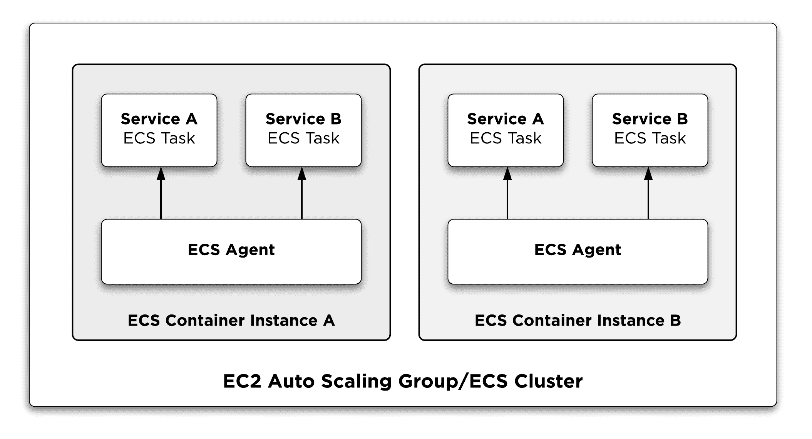
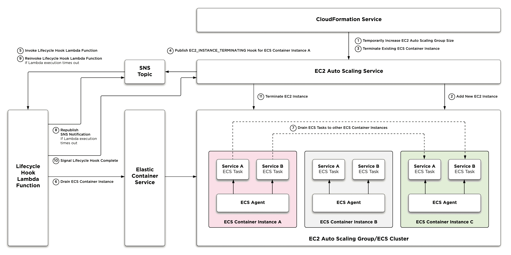
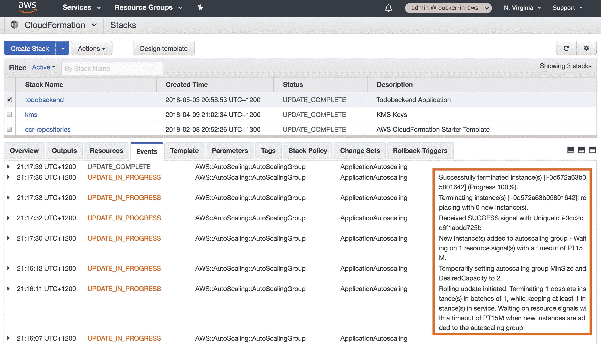
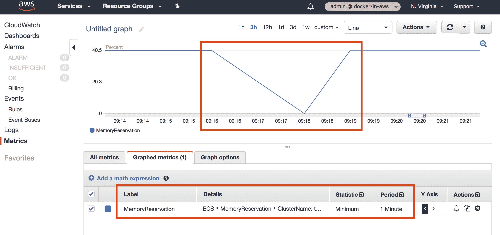
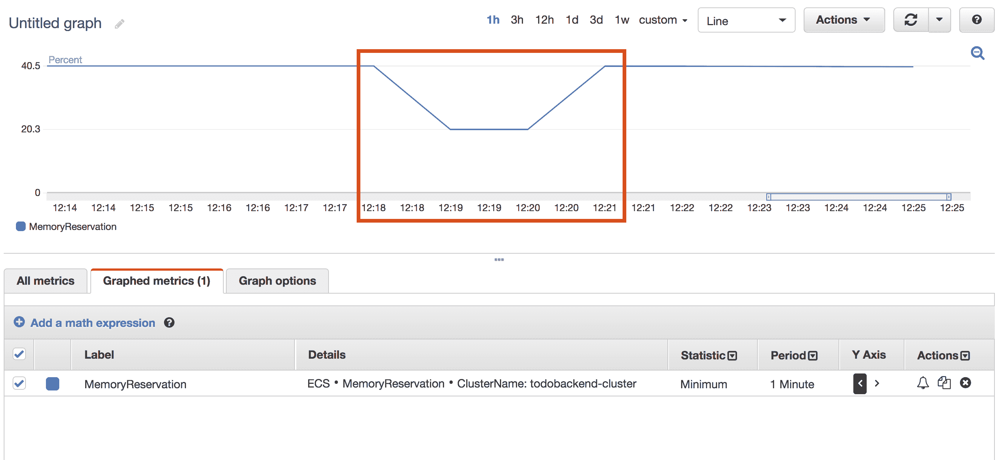
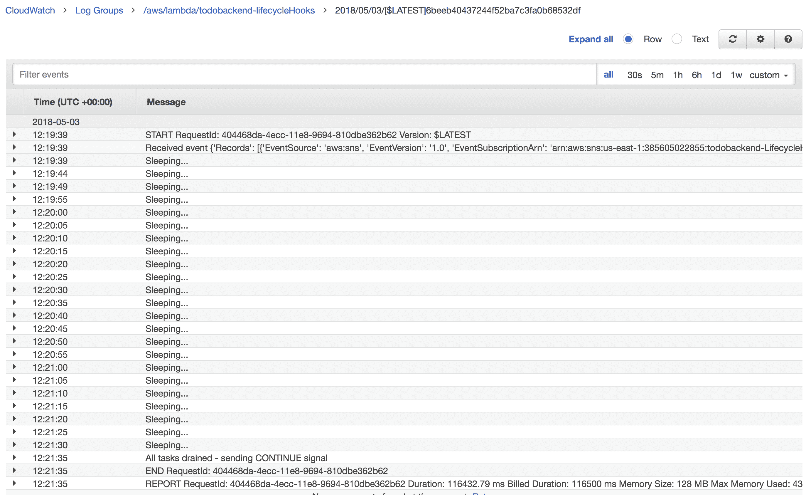

# 管理电子商务基础设施生命周期

与操作 ECS 基础设施相关的一个基本的持续活动是管理 ECS 容器实例的生命周期的需求。在任何生产级场景中，您都需要修补您的 ECS 容器实例，并确保 ECS 容器实例的核心组件(如 Docker Engine 和 ECS 代理)经常更新，以确保您能够访问最新的功能以及安全性和性能增强。在一个不可改变的基础设施世界中，您的 ECS 容器实例被认为是“牛”，标准的方法是您通过滚动新的亚马逊机器映像(AMIs)来销毁和替换您的 ECS 容器实例，而不是采取修补*宠物*并长时间保留您的 ECS 容器实例的传统方法。另一个需要管理生命周期的常见用例与自动扩展有关，例如，如果您在一段时间的大量需求之后扩展您的 ECS 集群，您需要能够从集群中删除 ECS 容器实例。

让一个 ECS 容器实例停止服务听起来可能是一项非常简单的任务，但是考虑一下如果您的实例上有正在运行的容器会发生什么。如果立即停止实例的服务，连接到在这些容器上运行的应用的用户将会中断，这可能会导致数据丢失，至少会导致用户不高兴。需要一种机制，使您的 ECS 容器实例能够正常退出服务，保持当前用户连接，直到它们可以关闭而不会对最终用户产生任何影响，然后在您可以确定实例完全退出服务后，实际终止实例。

在本章中，您将学习如何通过利用两个关键的 AWS 特性来实现这样的功能——EC2 自动扩展生命周期挂钩和 ECS 容器实例清空。EC2 自动扩展生命周期挂钩让您了解与正在启动或停止服务的 EC2 实例相关的挂起生命周期事件，并在发出生命周期事件可以继续的信号之前，为您提供执行任何适当的初始化或清理操作的机会。这是您可以利用 ECS 容器实例清空的地方，它将受影响的 ECS 容器实例上的 ECS 任务标记为清空或停止服务，并通过在集群中的其他 ECS 容器实例上启动新的替换 ECS 任务，然后清空与受影响的 ECS 任务的连接，直到任务可以停止并且 ECS 容器实例被清空，来优雅地使任务停止服务。

将涵盖以下主题:

*   了解 ECS 基础架构生命周期管理
*   构建新的 ECS 容器实例 AMI
*   配置 EC2 自动缩放滚动更新
*   创建 EC2 自动扩展生命周期挂钩
*   创建一个 Lambda 函数来使用生命周期挂钩
*   部署和测试自动扩展生命周期挂钩

# 技术要求

下面列出了完成本章的技术要求:

*   对 AWS 帐户的管理员访问权限
*   根据第 3 章中的说明配置本地 AWS 配置文件
*   AWS CLI 版本 1.15.71 或更高版本
*   本章从第 9 章(而不是第 10 章)继续，因此它要求您已经成功地完成了第 9 章中定义的所有配置任务，并确保您已经将**重新设置到主分支的数据库中(这应该基于第 9 章的完成)**

以下 GitHub URL 包含本章使用的代码示例-[https://GitHub . com/docker-in-AWS/docker-in-AWS/tree/master/ch11](https://github.com/docker-in-aws/docker-in-aws/tree/master/ch11)[。](https://github.com/docker-in-aws/docker-in-aws/tree/master/ch4)

查看以下视频，了解《行动守则》:
[http://bit.ly/2BT7DVh](http://bit.ly/2BT7DVh)

# 了解 ECS 生命周期管理

如本章介绍中所述，ECS 生命周期管理是指在不影响终端用户的情况下停止现有 ECS 容器实例服务的过程，终端用户可能连接到您的受影响实例上运行的应用。

这要求您利用 AWS 提供的两个关键功能:

*   EC2 自动扩展生命周期挂钩
*   ECS 容器实例排放

# EC2 自动扩展生命周期挂钩

EC2 自动扩展生命周期挂钩允许您接收挂起的生命周期事件的通知，并在事件发生之前执行一些操作。目前，您可以收到以下生命周期挂钩事件的通知:

*   `EC2_INSTANCE_LAUNCHING`:即将启动 EC2 实例时引发
*   `EC2_INSTANCE_TERMINATING`:当 EC2 实例即将终止时引发

一般来说，您不需要担心`EC2_INSTANCE_LAUNCHING`事件，但是任何运行生产级 ECS 集群的人都应该对`EC2_INSTANCE_TERMINATING`事件感兴趣，因为一个即将被终止的实例可能正在运行具有活动最终用户连接的容器。一旦您订阅了生命周期挂钩事件，EC2 自动缩放服务将等待您发出生命周期操作可以继续的信号。这为您提供了一种机制，允许您在发生`EC2_INSTANCE_TERMINATING`事件时执行优雅的拆除操作，这是您可以利用 ECS 容器实例清空的地方。

# ECS 容器实例排放

ECS 容器实例清空是一项功能，允许您优雅地*清空*正在运行的 ECS 任务的 ECS 容器实例，最终结果是您的 ECS 容器实例没有正在运行的 ECS 任务或容器，这意味着在不影响您的容器应用的情况下终止实例是安全的。ECS 容器实例排空首先将您的 ECS 容器实例标记为正在排空状态，这将导致该实例上运行的所有 ECS 任务正常关闭，并在集群中的其他容器实例上启动。此排出活动使用您已经在 ECS 服务中看到的标准*滚动*行为，例如，如果您有一个与集成了应用负载平衡器的 ECS 服务相关联的 ECS 任务，ECS 将首先尝试在另一个 ECS 容器实例上注册一个新的 ECS 任务，作为应用负载平衡器目标组中的新目标，然后将与正在被排出的 ECS 容器实例相关联的目标置于连接排出状态。

请注意，重要的是您的 ECS 群集有足够的资源和 ECS 容器实例来迁移每个受影响的 ECS 任务，考虑到您还在减少一个实例的 ECS 群集容量，这可能会很有挑战性。这意味着，例如，如果您正在执行群集中 ECS 容器实例的计划替换(例如，您正在更新到一个新的 AMI)，那么您需要临时向群集中添加额外的容量，以便以滚动方式交换实例，而不会降低整个群集的容量。如果您使用云信息来部署您的 EC2 自动扩展组，一个非常有用的功能是能够指定更新策略，这些策略可以在滚动更新期间临时向您的自动扩展组添加额外的容量，您将了解如何利用此功能来确保在执行滚动更新时始终保持 ECS 群集容量。

# ECS 生命周期管理解决方案

现在您已经对 ECS 生命周期管理有了一些了解，让我们讨论一下您将在本章中实现的解决方案，它将利用 EC2 生命周期挂钩来触发 ECS 容器实例清空，并在可以安全终止 ECS 容器实例时向 EC2 自动扩展服务发出信号。

下图说明了一个简单的 EC2 自动扩展组和一个 ECS 集群，其中有两个 ECS 容器实例正在运行，支持 ECS **服务 A** 和 ECS **服务 B** ，这两个服务都有两个 ECS 任务或 ECS 服务实例正在运行:



In Service EC2 Auto Scaling Group/ECS Cluster

让我们假设您现在想要用新的亚马逊机器映像更新您的 EC2 自动缩放组中的 ECS 容器实例，这需要终止和替换每个实例。下图说明了我们的生命周期挂钩解决方案将如何处理这一需求，并确保自动扩展组中的每个实例都能以不中断连接到每个 ECS 服务所服务的应用的最终用户的方式进行替换:



Performing Rolling Updates on an In-Service EC2 Auto Scaling Group/ECS Cluster

在上图中，发生了以下步骤:

1.  为 EC2 自动缩放组配置了云信息滚动更新，这将导致云信息服务临时增加 EC2 自动缩放组的大小。
2.  EC2 自动缩放组向自动缩放组添加了一个新的 EC2 实例(ECS 容器实例 C)，以响应云信息带来的组大小增加。

3.  一旦新的 EC2 实例启动并向云信息服务发出成功信号，云信息服务就指示 EC2 自动扩展服务终止 ECS 容器实例 A，因为给定的 ECS 容器实例 C 现在已加入 EC2 自动扩展组和 ECS 集群。
4.  在终止实例之前，EC2 自动扩展服务会触发一个生命周期挂钩事件，将此事件发布到一个已配置的简单通知服务(SNS)主题。SNS 是一种发布/订阅风格的通知服务，可以用于各种用例，在我们的解决方案中，我们将为 SNS 主题订阅一个 Lambda 函数。
5.  一个 Lambda 函数由 SNS 主题调用，以响应发布到该主题的生命周期挂钩事件。
6.  Lambda 函数指示 ECS 排出即将被终止的 ECS 容器实例。然后，该函数在 ECS 容器实例上轮询正在运行的任务计数，直到任务计数为零，才认为排出过程完成。
7.  ECS 将 ECS 容器实例 A 上运行的当前任务排出到具有备用容量的其他容器实例。在上图中，由于 ECS 容器实例 C 最近被添加到集群中，因此在 ECS 容器实例 A 上运行的 ECS 任务可以被排到容器实例 C 中。请注意，如果容器实例 C 没有被添加到集群中，集群中的容量将不足以排出容器实例 A，因此确保您的集群有足够的容量来处理这些类型的事件非常重要。
8.  在许多情况下，ECS 容器实例清空的时间可能比 Lambda 的当前五分钟执行超时限制要长。在这个场景中，您可以简单地将生命周期挂钩事件通知重新发布到 SNS 主题，这将自动重新调用 Lambda 函数。
9.  Lambda 函数再次指示 ECS 排出容器实例 A(已经在进行中)，并继续轮询正在运行的任务计数，直到正在运行的任务计数为零。

10.  假设容器实例完成了排放，并且正在运行的任务计数减少到零，则 Lambda 函数向 EC2 自动缩放服务发出信号，表明生命周期挂钩已经完成。
11.  既然生命周期挂钩已经完成，EC2 自动扩展服务将终止 ECS 容器实例。

此时，CloudFormation 在第 1 步中启动的滚动更新已完成 50%，因为旧的 ECS 容器实例 A 已被 ECS 容器实例 c 替换。上图中描述的过程再次重复，新的 ECS 容器实例被引入集群，ECS 容器实例 B 被标记为终止。一旦 ECS 容器实例 B 的清空完成，自动扩展组/集群中的所有实例都已被替换，滚动更新完成。

# 构建新的 ECS 容器实例 AMI

为了测试我们的生命周期管理解决方案，我们需要一种机制来强制终止您的 ECS 容器实例。虽然您可以简单地调整自动缩放组的期望计数(这实际上是自动缩放组缩小时的常见情况)，但发生这种情况的另一种常见情况是，您需要通过引入新构建的亚马逊机器映像(AMI)来更新 ECS 容器实例，该映像包含最新的操作系统和安全补丁以及最新版本的 Docker Engine 和 ECS 代理。至少，如果您正在使用类似于您在第 6 章中所学的方法构建一个定制的 ECS 容器实例 AMI，那么每次亚马逊发布新版本的基本 ECS 优化 AMI 时，您都应该重新构建您的 AMI，并且通常的做法是每周或每月更新您的 AMI。

要模拟将新的 AMI 引入到您的 ECS 集群中，您可以简单地执行您在第 6 章中执行的相同步骤，这将输出一个新的 AMI，然后您可以将其用作堆栈的输入，并强制您的 ECS 集群升级其每个 ECS 容器实例。

以下示例演示了从**打包器-ecs** 存储库的根目录运行`make build`命令，该命令将为新创建和发布的映像输出一个新的 AMI 标识。请务必记下此急性心肌梗死识别号，因为您将在本章稍后要求:

```
> export AWS_PROFILE=docker-in-aws
> make build
packer build packer.json
amazon-ebs output will be in this color.

==> amazon-ebs: Prevalidating AMI Name: docker-in-aws-ecs 1518934269
...
...
Build 'amazon-ebs' finished.

==> Builds finished. The artifacts of successful builds are:
--> amazon-ebs: AMIs were created:
us-east-1: ami-77893508
```

Running a Packer build

# 配置 EC2 自动缩放滚动更新

当您使用云信息来创建和管理您的 EC2 自动扩展组时，一个有用的功能是管理滚动更新的能力。滚动更新是指将新 EC2 实例中的*滚动到您的自动缩放组中的能力，以受控的方式确保您的更新过程可以在不造成中断的情况下完成。在第 8 章中，当您通过云信息创建 EC2 自动扩展组时，您学习了云信息如何支持创建策略，这可以帮助您确保 EC2 自动扩展中的所有实例都已成功初始化。CloudFormation 还支持更新策略，正如您在前面的图表中看到的，它可以帮助您管理和控制如何管理对 EC2 自动伸缩组的更新。*

如果打开 todobackend-aws 存储库并浏览到位于`stack.yml`文件中的 CloudFormation 模板，则可以向`ApplicationAutoscaling`资源添加更新策略，如下例所示:

```
...
...
Resources:
  ...
  ...
  ApplicationAutoscaling:
    Type: AWS::AutoScaling::AutoScalingGroup
    CreationPolicy:
      ResourceSignal:
        Count: !Ref ApplicationDesiredCount
        Timeout: PT15M
    UpdatePolicy:
 AutoScalingRollingUpdate:
 MinInstancesInService: !Ref ApplicationDesiredCount
 MinSuccessfulInstancesPercent: 100
 WaitOnResourceSignals: "true"
 PauseTime: PT15M
  ...
  ...
```

Configuring a CloudFormation Auto Scaling Group Update Policy

在前面的示例中，`UpdatePolicy`设置应用于`ApplicationAutoscaling`资源，每当需要替换自动缩放组中的实例时，该资源将云信息配置为根据以下`AutoScalingRollingUpdate`配置参数编排滚动更新(*更新后的*):

*   `MinInstancesInService`:滚动更新期间必须服务的最小实例数。这里的标准方法是指定自动缩放组的期望计数，这意味着自动缩放将随着新实例的添加而临时增加大小，以保持所需实例的最小数量。
*   `MinSuccessfulInstancesPercent`:要使滚动更新成功，必须成功部署的新实例的最小百分比。如果未达到该百分比，CloudFormation 将回滚堆栈更改。

*   `WaitOnResourceSignals`:设置为 true 时，指定 CloudFormation 在认为实例成功部署之前，等待来自每个实例的 SUCCESS 信号。这要求您的 EC2 实例具有在第 6 章中安装并在第 7 章中配置的`cfn-bootstrap`脚本，以便在实例初始化完成后向云信息发出信号。
*   `PauseTime`:配置`WaitOnResourceSignals`时，指定等待每个实例发出成功信号的最长时间。该值以 ISO8601 格式表示，在下面的示例中被配置为最多等待 15 分钟。

然后，使用`aws cloudformation deploy`命令部署您的更改，如下例所示，您的自动缩放组现在将应用更新策略:

```
> export AWS_PROFILE=docker-in-aws
> aws cloudformation deploy --template-file stack.yml \
 --stack-name todobackend --parameter-overrides $(cat dev.cfg) \
 --capabilities CAPABILITY_NAMED_IAM
Enter MFA code for arn:aws:iam::385605022855:mfa/justin.menga:

Waiting for changeset to be created..
Waiting for stack create/update to complete
Successfully created/updated stack - todobackend
  ...
  ...
```

Configuring a CloudFormation Auto Scaling Group Update Policy

此时，您现在可以更新堆栈，以使用您在第一个示例中创建的新 AMI。这要求您首先更新 todobackend-aws 存储库根目录下的`dev.cfg`文件:

```
ApplicationDesiredCount=1
ApplicationImageId=ami-77893508
ApplicationImageTag=5fdbe62
ApplicationSubnets=subnet-a5d3ecee,subnet-324e246f
VpcId=vpc-f8233a80
```

Updating the ECS AMI

然后，使用相同的`aws cloudformation deploy`命令部署变更。

在部署运行时，如果您打开 AWS 控制台，浏览到 cloudinformation 仪表板，并选择 todobackend 堆栈**事件**选项卡，您应该能够看到 cloudinformation 如何执行滚动更新:



CloudFormation Rolling Updates

在前面的截图中，您可以看到 CloudFormation 首先临时增加了自动缩放组的大小，因为它需要始终保持至少一个实例在运行。一旦新实例向云信息发出成功信号，自动缩放组中的旧实例将终止，滚动更新完成。

此时，您可能会感到非常高兴——只需对您的云信息配置进行一点小小的更改，您就能够向堆栈中添加滚动更新。但是有一个问题，当旧的 EC2 实例被终止时，它立即被终止*。这实际上会导致服务中断，如果您导航到 CloudWatch 控制台，选择度量，在所有度量选项卡中选择 ECS **|** 集群名称，然后选择名为 todoback-cluster 的集群的 MemoryReservation 度量，您就可以看到这一指示。*

 *以下屏幕截图显示了单击图表度量选项卡并将统计列更改为最小值并将周期更改为 1 分钟后的屏幕:



ECS Memory Reservation

如果您回顾一下前面截图中的时间线，您可以看到在 21:17:33，旧的 ECS 容器实例被终止，在前面的截图中，您可以看到集群的内存预留在 21:18 (09:18)相应地下降到 0%。这表明在这个时间点，没有实际的容器在运行，给定保留的集群内存百分比为 0，说明在旧实例被突然终止后，当 ECS 试图恢复 todobackend 服务到新的 ECS 容器实例时，出现了一个小的中断，尽管是短暂的。

Because the minimum CloudWatch metrics resolution is 1 minute, it is possible that you may not observe the dip to 0% in the previous figure if ECS is able to recover the ECS service within a minute, but rest assured there is an outage to your application.

显然这并不理想，正如我们之前讨论的，我们现在需要引入 EC2 自动扩展生命周期挂钩来解决这种情况。

# 创建 EC2 自动扩展生命周期挂钩

为了解决 EC2 实例终止影响我们的 ECS 服务的问题，我们现在需要创建一个 EC2 自动扩展生命周期挂钩，它将通知我们一个 EC2 实例即将终止。回到第一个图表，这需要几个资源:

*   实际的生命周期挂钩
*   一个生命周期挂钩角色，授予 EC2 自动缩放组向 SNS 主题发布生命周期挂钩通知的权限
*   可以发布和订阅生命周期挂钩的社交网站主题

以下示例演示了如何创建生命周期挂钩、生命周期挂钩角色和社交网络主题:

```
...
...
Resources:
  ...
  ...
 LifecycleHook:
 Type: AWS::AutoScaling::LifecycleHook
 Properties:
 RoleARN: !Sub ${LifecycleHookRole.Arn}
 AutoScalingGroupName: !Ref ApplicationAutoscaling
 DefaultResult: CONTINUE
 HeartbeatTimeout: 900
 LifecycleTransition: autoscaling:EC2_INSTANCE_TERMINATING
 NotificationTargetARN: !Ref LifecycleHookTopic
 LifecycleHookRole:
 Type: AWS::IAM::Role
 Properties:
 AssumeRolePolicyDocument:
 Version: "2012-10-17"
 Statement:
 - Action:
 - sts:AssumeRole
 Effect: Allow
 Principal:
 Service: autoscaling.amazonaws.com
 Policies:
- PolicyName: LifecycleHookPermissions
 PolicyDocument:
 Version: "2012-10-17"
 Statement:
 - Sid: PublishNotifications
 Action: 
 - sns:Publish
 Effect: Allow
 Resource: !Ref LifecycleHookTopic
 LifecycleHookTopic:
 Type: AWS::SNS::Topic
 Properties: {}
  LifecycleHookSubscription:
    Type: AWS::SNS::Subscription
    Properties:
      Endpoint: !Sub ${LifecycleHookFunction.Arn}
      Protocol: lambda
      TopicArn: !Ref LifecycleHookTopic    ...
    ...

```

Creating Life Cycle Hook Resources in CloudFormation

在前面的示例中，`LifecycleHook`资源创建了一个新的钩子，该钩子使用`AutoScalingGroupName`属性链接到`ApplicationAutoscaling`资源，并由即将终止的自动缩放组中的 EC2 实例触发，如为`LifecycleTransition`属性配置的值`autoscaling:EC2_INSTANCE_TERMINATING`所指定的。挂钩被配置为向名为`LifecycleHookTopic`的新 SNS 主题资源发送通知，链接的`LifecycleHookRole` IAM 角色授予`autoscaling.amazonaws.com`服务(在角色的`AssumeRolePolicyDocument`部分中指定)向该主题发布生命周期挂钩事件的权限。`DefaultResult`属性指定了在达到`HeartbeatTimeout`周期且没有收到挂钩响应的情况下应该创建的默认结果，在本例中是发送`CONTINUE`消息，指示自动缩放服务继续处理可能注册的任何其他生命周期挂钩。`DefaultResult`属性的另一个选项是发送`ABANDON`消息，该消息仍然指示自动缩放服务继续实例终止，但放弃处理可能配置的任何其他生命周期挂钩。

最终的`LifecycleHookSubscription`资源创建了对`LifecycleHookTopic` SNS 主题资源的订阅，订阅了一个名为`LifecycleHookFunction`的 Lambda 函数资源，我们将很快创建这个资源，这意味着只要有消息发布到 SNS 主题，这个函数就会被调用。

# 创建一个 Lambda 函数来使用生命周期挂钩

随着各种生命周期挂钩资源的到位，难题的最后一块是创建一个 Lambda 函数和相关的资源，这些资源将订阅您在上一节中定义的生命周期挂钩 SNS 主题，并最终在发出生命周期挂钩操作可以继续的信号之前执行 ECS 容器实例清空。

让我们首先关注 Lambda 函数本身及其需要执行的相关源代码:

```
...
...
Resources: LifecycleHookFunction:
    Type: AWS::Lambda::Function
    DependsOn:
      - LifecycleHookFunctionLogGroup
    Properties:
      Role: !Sub ${LifecycleFunctionRole.Arn}
      FunctionName: !Sub ${AWS::StackName}-lifecycleHooks
      Description: !Sub ${AWS::StackName} Autoscaling Lifecycle Hook
      Environment:
        Variables:
          ECS_CLUSTER: !Ref ApplicationCluster
      Code:
        ZipFile: |
          import os, time
          import json
          import boto3
          cluster = os.environ['ECS_CLUSTER']
          # AWS clients
          ecs = boto3.client('ecs')
          sns = boto3.client('sns')
          autoscaling = boto3.client('autoscaling')

          def handler(event, context):
            print("Received event %s" % event)
            for r in event.get('Records'):
              # Parse SNS message
              message = json.loads(r['Sns']['Message'])
              transition, hook = message['LifecycleTransition'], message['LifecycleHookName']
              group, ec2_instance = message['AutoScalingGroupName'], message['EC2InstanceId']
              if transition != 'autoscaling:EC2_INSTANCE_TERMINATING':
                print("Ignoring lifecycle transition %s" % transition)
                return
              try:
                # Get ECS container instance ARN
                ecs_instance_arns = ecs.list_container_instances(
                  cluster=cluster
                )['containerInstanceArns']
                ecs_instances = ecs.describe_container_instances(
                  cluster=cluster,
                  containerInstances=ecs_instance_arns
                )['containerInstances']
                # Find ECS container instance with same EC2 instance ID in lifecycle hook message
                ecs_instance_arn = next((
                  instance['containerInstanceArn'] for instance in ecs_instances
                  if instance['ec2InstanceId'] == ec2_instance
                ), None)
                if ecs_instance_arn is None:
                  raise ValueError('Could not locate ECS instance')
                # Drain instance
                ecs.update_container_instances_state(
                  cluster=cluster,
                  containerInstances=[ecs_instance_arn],
                  status='DRAINING'
                )
                # Check task count on instance every 5 seconds
                count = 1
                while count > 0 and context.get_remaining_time_in_millis() > 10000:
                  status = ecs.describe_container_instances(
                    cluster=cluster,
                    containerInstances=[ecs_instance_arn],
                  )['containerInstances'][0]
                  count = status['runningTasksCount']
                  print("Sleeping...")
                  time.sleep(5)
                if count == 0:
                  print("All tasks drained - sending CONTINUE signal")
                  autoscaling.complete_lifecycle_action(
                    LifecycleHookName=hook,
                    AutoScalingGroupName=group,
                    InstanceId=ec2_instance,
                    LifecycleActionResult='CONTINUE'
                  )
                else:
                  print("Function timed out - republishing SNS message")
                  sns.publish(TopicArn=r['Sns']['TopicArn'], Message=r['Sns']['Message'])
              except Exception as e:
                print("A failure occurred with exception %s" % e)
                autoscaling.complete_lifecycle_action(
                  LifecycleHookName=hook,
                  AutoScalingGroupName=group,
                  InstanceId=ec2_instance,
                  LifecycleActionResult='ABANDON'
                )
      Runtime: python3.6
      MemorySize: 128
      Timeout: 300
      Handler: index.handler
  LifecycleHookFunctionLogGroup:
    Type: AWS::Logs::LogGroup
    DeletionPolicy: Delete
    Properties:
      LogGroupName: !Sub /aws/lambda/${AWS::StackName}-lifecycleHooks
      RetentionInDays: 7    ...
    ...

```

Creating a Lambda Function to Process Life Cycle Hooks

Lambda 函数比我们到目前为止讨论的稍微复杂一点，但是它仍然是一个相对简单的函数，如果您有 Python 的经验，应该很容易理解。

该函数首先定义所需的库，并查找名为`ECS_CLUSTER`的环境变量，该变量是必需的，以便该函数知道生命周期挂钩与哪个 ECS 集群相关，并且该环境变量值通过 Lambda 函数资源上的`Environment`属性传入。

接下来，该函数声明三个 AWS 客户端:

*   `ecs`:与 ECS 通信，内省 ECS 容器实例信息，根据生命周期钩子中收到的 EC2 实例 ID，排出正确的实例。
*   `autoscaling`:当生命周期挂钩可以继续时，向 EC2 自动缩放服务发出信号。
*   `sns`:如果 Lambda 函数即将达到最大的五分钟执行超时，并且 ECS 容器实例尚未排空，则重新发布生命周期挂钩事件。这将再次调用 Lambda 函数，直到 ECS 容器实例完全耗尽。

`handler`方法定义了 Lambda 函数的入口点，首先从接收到的 SNS 消息中提取出一些捕获信息的变量，包括生命周期钩子事件类型(`transition`变量)、钩子名称(`hook`变量)、自动缩放组名称(`group`变量)和 EC2 实例 ID ( `ec2_instance`变量)。然后立即进行检查，以验证生命周期挂钩事件类型是否与 EC2 实例终止事件相关，如果事件类型(在转换变量中捕获)不等于值`autoscaling:EC2_INSTANCE_TERMINATING`，则函数立即返回，有效地忽略该事件。

假设事件确实与终止的 EC2 实例相关，处理程序接下来通过`ecs`客户端查询 ECS 服务，首先描述配置集群中的所有实例，然后尝试定位与从生命周期挂钩事件中捕获的 EC2 实例标识匹配的 ECS 容器实例。如果找不到该实例，则引发`ValueError`异常，该异常将被 catch 语句捕获，导致记录错误，并且函数完成生命周期挂钩，结果为`ABANDON`。如果找到该实例，处理程序通过调用`ecs`客户端上的`update_container_instances_state()`方法来排出该实例，该方法将该实例的状态设置为`DRAINING`，这意味着 ECS 将不再向该实例调度任何新任务，并尝试将现有任务迁移到集群中的其他实例。此时，处理程序需要等待实例上运行的所有当前 ECS 任务被清空，这可以通过每五秒钟在`while`循环中轮询 ECS 任务计数直到任务计数减少到零来实现。您可以尝试无限期地这样做，但是 Lambda 在编写时有最长五分钟的执行时间限制，因此`while`循环使用`context.get_remaining_time_in_millis()`方法来检查是否即将达到 Lambda 执行超时。

The `context` object is an object that is passed by the Lambda runtime environment to your handler method and includes information about the Lambda environment including memory, CPU, and remaining execution time. 

如果任务计数减少到零，您可以安全地终止 ECS 容器实例，自动缩放客户端完成生命周期挂钩，结果为`CONTINUE`，这意味着 EC2 自动缩放服务将继续处理任何其他注册的挂钩并终止实例。如果在函数即将退出之前，任务计数没有减少到零，那么函数只需重新发布原始的生命周期挂钩通知，这将再次从头重新调用函数。因为函数中的所有操作都是幂等的，也就是说，更新一个已经在引流到引流状态的 ECS 容器实例的状态会导致相同的引流状态，所以这种方法是安全的，也是克服 Lambda 的执行超时限制的一种非常简单和优雅的方法。

# 为生命周期挂钩 Lambda 函数配置权限

Lambda 函数现在已经就位，最后的配置任务是为 Lambda 函数执行的各种 API 调用和操作添加所需的权限:

```
...
...
Resources: LifecycleHookPermission:
    Type: AWS::Lambda::Permission
    Properties:
      Action: lambda:InvokeFunction
      FunctionName: !Ref LifecycleHookFunction
      Principal: sns.amazonaws.com
      SourceArn: !Ref LifecycleHookTopic
  LifecycleFunctionRole:
    Type: AWS::IAM::Role
    Properties:
      AssumeRolePolicyDocument:
        Version: "2012-10-17"
        Statement:
          - Action:
              - sts:AssumeRole
            Effect: Allow
            Principal:
              Service: lambda.amazonaws.com
      Policies:
        - PolicyName: LifecycleHookPermissions
          PolicyDocument:
            Version: "2012-10-17"
            Statement:
              - Sid: ListContainerInstances
                Effect: Allow
                Action:
                  - ecs:ListContainerInstances
                Resource: !Sub ${ApplicationCluster.Arn}
              - Sid: ManageContainerInstances
                Effect: Allow
                Action:
                  - ecs:DescribeContainerInstances
                  - ecs:UpdateContainerInstancesState
                Resource: "*"
                Condition:
                  ArnEquals:
                    ecs:cluster: !Sub ${ApplicationCluster.Arn}
              - Sid: Publish
                Effect: Allow
                Action:
                  - sns:Publish
                Resource: !Ref LifecycleHookTopic
              - Sid: CompleteLifecycleAction
                Effect: Allow
                Action:
                  - autoscaling:CompleteLifecycleAction
                Resource: !Sub arn:aws:autoscaling:${AWS::Region}:${AWS::AccountId}:autoScalingGroup:*:autoScalingGroupName/${ApplicationAutoscaling}
              - Sid: ManageLambdaLogs
                Effect: Allow
                Action:
                - logs:CreateLogStream
                - logs:PutLogEvents
                Resource: !Sub ${LifecycleHookFunctionLogGroup.Arn}    LifecycleHookFunction:
      Type: AWS::Lambda::Function
    ...
    ...

```

Configuring Permissions for a Life Cycle Hook Lambda Function

在前面的示例中，需要类型为`AWS::Lambda::Permission`的名为`LifecycleHookPermission`的资源，该资源授予 SNS 服务(如`Principal`属性所引用)调用 Lambda 函数(如`LambdaFunction`属性所引用)的权限，以便将通知发布到 SNS 主题(如`SourceArn`属性所引用)。每当您需要授予另一个 AWS 服务代表您调用 Lambda 函数的能力时，通常都需要这种配置权限的方法，尽管该规则也有例外(例如 cloud information 自定义资源用例，其中 cloud information 隐式拥有这样的权限)。

您还可以为名为`LambdaFunctionRole`的 Lambda 函数创建一个 IAM 角色，该角色授予该函数执行它需要执行的各种任务和操作的能力，包括:

*   列出、描述和更新应用群集中的 ECS 容器实例
*   如果 Lambda 函数即将超时，则将生命周期挂钩事件重新发布到 SNS
*   一旦 ECS 容器实例耗尽，就完成生命周期操作
*   将日志写入 CloudWatch 日志

# 部署和测试自动扩展生命周期挂钩

现在，您可以使用本章前面演示的`aws cloudformation deploy`命令来部署您完整的自动缩放生命周期挂钩解决方案。

部署完成后，为了测试生命周期管理是否按预期运行，您可以执行一个简单的更改来强制替换您的 ECS 群集中的当前 ECS 容器实例，即恢复您在本章前面所做的 AMI 更改:

```
ApplicationDesiredCount=1
ApplicationImageId=ami-ec957491
ApplicationImageTag=5fdbe62
ApplicationSubnets=subnet-a5d3ecee,subnet-324e246f
VpcId=vpc-f8233a80
```

Reverting the ECS AMI

一旦您现在部署了此更改，再次使用`aws cloudformation deploy`命令，如前面的示例所示，接下来切换到云信息控制台，当终止现有 EC2 实例的事件引发时，快速导航到 ECS 仪表板并选择您的 ECS 集群。在“容器实例”选项卡上，您应该会看到您的一个 ECS 容器实例的状态正在排出，如下图所示，一旦所有任务都从该实例中排出，生命周期挂钩功能将向 EC2 自动扩展服务发出信号，以继续终止该实例:


ECS Container Instance Draining

如果在 ECS 容器实例被清空和终止期间，您重复前面截图中采取的步骤来查看集群内存预留，您应该会看到一个类似于示例中的图表:



Cluster Memory Reservation during ECS Container Instance Draining

在前面的截图中，请注意，在滚动更新期间，集群内存预留不会在任何时候降至 0%。在滚动升级过程中，由于集群中有两个实例，内存利用率百分比确实会发生变化，但是我们能够耗尽 ECS 容器实例，这确保了在集群上运行的应用的服务不会中断。

作为最后一项检查，您还可以导航到生命周期挂钩功能的 CloudWatch 日志组，如下图所示:



Life Cycle Hooks Function Logs

在前面的截图中，您可以看到，在容器实例清空时，函数会定期休眠，在这种情况下，大约两分钟后，所有任务都会清空，函数会向自动缩放服务发送一个`CONTINUE`信号。

# 摘要

在本章中，您创建了一个解决方案，用于管理您的 ECS 容器实例的生命周期，并确保在您需要终止和替换 ECS 集群中的 ECS 容器实例时，运行在您的 ECS 集群上的应用和服务不会受到影响。

您学习了如何为您的 EC2 自动扩展组配置滚动更新，通过利用云信息更新策略，您可以控制如何以滚动方式将新实例添加到您的自动扩展组中。您看到此功能在自动扩展和 EC2 实例级别运行良好，但是您发现集群中现有 ECS 容器实例的突然终止会导致应用中断。

为了解决这个问题，您创建了一个为`EC2_INSTANCE_TERMINATING`事件注册的 EC2 生命周期钩子，并将这个钩子配置为向 SNS 主题发布通知，这又会触发一个 Lambda 函数。此函数负责定位与即将终止的 EC2 实例相关联的 ECS 容器实例，清空容器实例，然后等待，直到 ECS 任务计数达到 0，表明实例上的所有 ECS 任务都已终止并被替换。如果 ECS 容器实例花费的时间超过了 Lambda 函数的最长五分钟执行时间，您了解到您可以简单地重新发布包含生命周期挂钩信息的 SNS 事件，这又会触发函数的新调用，并且该过程可以无限期地继续，直到实例上的 ECS 任务计数达到 0。

在下一章中，您将了解如何动态管理 ECS 集群的容量，这对支持应用的自动扩展要求至关重要。这包括不断向您的 ECS 集群添加和删除 ECS 容器实例，因此您可以看到本章中介绍的 ECS 容器实例生命周期机制对于确保您的应用不受任何自动扩展操作的影响至关重要。

# 问题

1.  对/错:当您终止一个 ECS 容器实例时，该实例将自动将正在运行的 ECS 任务排到群集中的另一个实例。
2.  您可以收到哪些类型的 EC2 自动扩展生命周期挂钩？
3.  一旦处理完 EC2 自动缩放生命周期挂钩，您可以发送什么类型的响应？
4.  对/错:EC2 自动缩放生命周期钩子可以将事件发布到 AWS 驱动程序。
5.  您创建了一个 Lambda 函数，该函数处理一个生命周期钩子并排出您的 ECS 容器实例。您已经注意到，有时这需要大约 4-5 分钟，但通常需要 15 分钟。您能做些什么来解决这个问题？

6.  您可以配置什么云信息功能来启用自动缩放组的滚动更新？
7.  您希望执行滚动更新，并确保在更新过程中始终至少有当前所需的服务实例数。你将如何实现这一点？
8.  当使用 CloudFormation 将 Lambda 函数订阅到 SNS 主题时，需要创建什么类型的资源来确保 SNS 服务具有调用该函数的适当权限？

# 进一步阅读

有关本章所涵盖主题的更多信息，您可以查看以下链接:

*   CloudFormation UpdatePolicy 属性:[https://docs . AWS . Amazon . com/AWS cloud information/latest/user guide/AWS-attribute-UpdatePolicy . html](https://docs.aws.amazon.com/AWSCloudFormation/latest/UserGuide/aws-attribute-updatepolicy.html)
*   Amazon EC2 自动缩放生命周期挂钩:[https://docs . AWS . Amazon . com/autoscaling/EC2/user guide/life cycle-hooks . html](https://docs.aws.amazon.com/autoscaling/ec2/userguide/lifecycle-hooks.html)
*   CloudFormation 生命周期挂钩资源参考:[https://docs . AWS . Amazon . com/AWS cloud information/latest/user guide/AWS-resource-as-life cyclehook . html](https://docs.aws.amazon.com/AWSCloudFormation/latest/UserGuide/aws-resource-as-lifecyclehook.html)
*   CloudFormation SNS 主题资源参考:[https://docs . AWS . Amazon . com/AWS cloud information/latest/user guide/AWS-properties-SNS-topic . html](https://docs.aws.amazon.com/AWSCloudFormation/latest/UserGuide/aws-properties-sns-topic.html)
*   CloudFormation SNS 订阅资源参考:[https://docs . AWS . Amazon . com/AWS cloud information/latest/user guide/AWS-resource-SNS-subscription . html](https://docs.aws.amazon.com/AWSCloudFormation/latest/UserGuide/aws-resource-sns-subscription.html)
*   CloudFormation Lambda 权限资源参考:[https://docs . AWS . Amazon . com/AWS cloud information/latest/user guide/AWS-resource-Lambda-permission . html](https://docs.aws.amazon.com/AWSCloudFormation/latest/UserGuide/aws-resource-lambda-permission.html)
*   CloudFormation ECS 任务定义资源参考:[https://docs . AWS . Amazon . com/AWS cloud information/latest/user guide/AWS-resource-ECS-task definition . html](https://docs.aws.amazon.com/AWSCloudFormation/latest/UserGuide/aws-resource-ecs-taskdefinition.html)
*   CloudFormation ECS 服务资源参考:[https://docs . AWS . Amazon . com/AWS cloud information/latest/user guide/AWS-resource-ECS-service . html](https://docs.aws.amazon.com/AWSCloudFormation/latest/UserGuide/aws-resource-ecs-service.html)
*   CloudFormation Lambda 函数资源参考:[https://docs . AWS . Amazon . com/AWS cloud information/latest/user guide/AWS-resource-Lambda-function . html](https://docs.aws.amazon.com/AWSCloudFormation/latest/UserGuide/aws-resource-lambda-function.html)
*   CloudFormation Lambda 函数代码:[https://docs . AWS . Amazon . com/AWS cloud information/latest/user guide/AWS-properties-Lambda-function-code . html](https://docs.aws.amazon.com/AWSCloudFormation/latest/UserGuide/aws-properties-lambda-function-code.html)
*   CloudFormation 自定义资源文档:[https://docs . AWS . Amazon . com/AWS cloud information/latest/user guide/template-custom-resources . html](https://docs.aws.amazon.com/AWSCloudFormation/latest/UserGuide/template-custom-resources.html)
*   CloudFormation 自定义资源参考:[https://docs . AWS . Amazon . com/AWS cloud information/latest/user guide/crpg-ref . html](https://docs.aws.amazon.com/AWSCloudFormation/latest/UserGuide/crpg-ref.html)*