# 十三、持续交付ECS应用

**持续交付**是为发布软件创建一个可重复且可靠的流程的实践，这样您就可以以更低的成本和风险频繁地按需将新功能部署到生产中。采用连续交付有许多好处，今天，越来越多的组织正在采用它，以更快地将功能推向市场，提高客户满意度，并降低软件交付成本。

实现连续交付需要软件交付端到端生命周期的高度自动化。到目前为止，在本课程中，您已经使用了许多支持自动化和持续交付的技术。例如，Docker 固有地带来高度自动化，并促进可重复和一致的构建过程，所有这些都是持续交付的关键组成部分。`todobackend`存储库中的 make 工作流更进一步，为 Docker 映像自动执行完整的测试、构建和发布工作流。在本课程中，我们还广泛使用了 CloudFormation，它为我们提供了以完全自动化的方式创建、更新和销毁完整 AWS 环境的能力，并允许我们以可靠和一致的方式轻松部署新功能(以新 Docker 映像的形式)。持续交付将所有这些特性和功能结合在一起，为软件变更的交付创建了一个端到端的过程，从开发和提交源代码到回归测试和部署到生产。为了实现这种级别的端到端编排和自动化，我们需要采用为此目的而设计的新工具，AWS 提供了许多协同工作来实现这一点的服务，包括 AWS 代码管道、代码构建和云信息。

在本章中，您将学习如何实现端到端连续交付管道(使用代码管道、代码构建和云信息)，该管道将持续测试、构建和发布 Docker 映像，然后将您新构建的 Docker 映像持续部署到非生产环境中。该管道还将通过自动创建变更集来支持生产环境中的受控发布，这些变更集在将新变更部署到生产环境之前必须经过审查和批准。

本章将涵盖以下主题:

*   介绍代码管道和代码构建
*   创建自定义代码构建容器
*   向应用存储库添加代码构建支持
*   使用代码管道创建连续集成管道
*   使用代码管道创建持续部署管道
*   持续将您的应用交付到生产环境中

# 技术要求

下面列出了完成本章的技术要求:

*   对 AWS 帐户的管理员访问权限。
*   根据第 3 章中的说明配置的本地 AWS 配置文件。
*   AWS 命令行界面版本 1.15.71 或更高版本
*   本章继续第 12 章，因此它要求您已成功完成第 12 章中定义的所有配置任务。
*   本章要求您将`todobackend`和`todobackend-aws`存储库发布到您拥有管理权限的 GitHub 帐户。

以下 GitHub URL 包含本章使用的代码示例:[https://GitHub . com/docker-in-AWS/docker-in-AWS/tree/master/ch13](https://github.com/docker-in-aws/docker-in-aws/tree/master/ch13)

查看以下视频，了解《行动守则》:
[http://bit.ly/2BVGMYI](http://bit.ly/2BVGMYI)

# 介绍代码管道和代码构建

**CodePipeline** 和 **CodeBuild** 是 AWS 开发人员工具组合中的两项服务，与我们在本书中广泛使用的 CloudFormation 服务一起，为创建完整和全面的持续交付解决方案提供了构建模块，从而为您的应用从开发到生产铺平了道路。

CodePipeline 允许您创建复杂的管道来获取应用的源代码、构建、测试和发布应用工件，然后将应用部署到非生产和生产环境中。这些管道的顶层构建块是阶段，必须始终从包含管道的一个或多个源材料的源阶段开始，例如应用的源代码存储库。然后，每个阶段都可以由一个或多个动作组成，这些动作会产生一个工件，稍后可以在您的管道中使用，或者实现期望的结果，例如部署到环境中。您可以按顺序或并行定义动作，这允许您编排几乎任何您想要的场景；例如，我使用 CodePipeline 以一种高度可控的方式编排了完整、复杂、多应用环境的部署，这种方式易于可视化和管理。

每个 CodePipeline 管道都必须定义至少两个阶段，我们最初会看到一个这样的例子，当我们创建一个连续的集成管道时，包括一个源阶段(从源代码存储库中收集应用源代码)和一个构建阶段(从源阶段收集的应用源中测试、构建和发布应用工件)。

这里需要理解的一个重要概念是工件的概念。代码管道中的许多动作消耗输入工件并产生输出工件，一个动作消耗前一个动作的输出的能力是代码管道如何工作的本质。

例如，下图说明了我们将创建的初始连续集成管道:

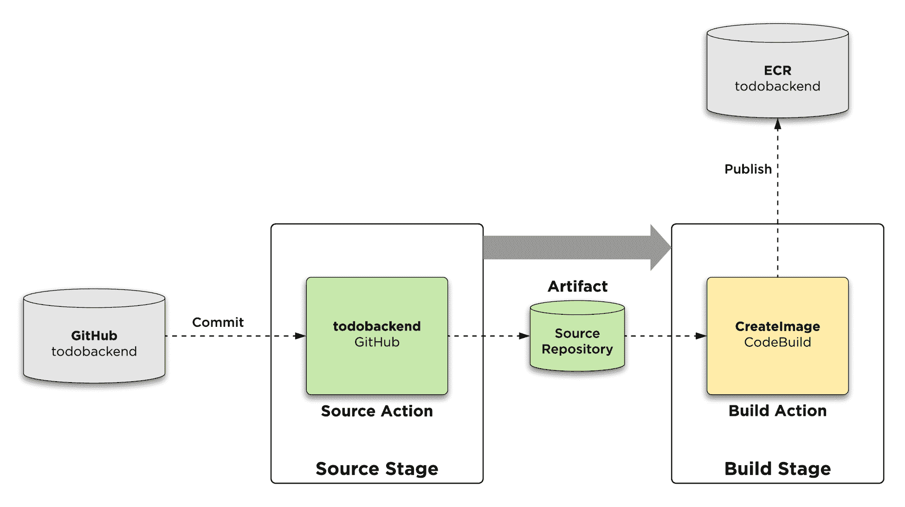

Continuous integration pipeline

在上图中，**源阶段**包括一个链接到 todobackend 和 GitHub 存储库的单个**源操作**。每当将更改提交到您的 GitHub 存储库中时，此操作将下载最新的源代码，并将生成一个输出工件，该工件将压缩您的源代码，并使其可用于随后的构建阶段。**构建阶段**有一个单独的**构建动作**，它将您的源动作输出工件作为输入，然后测试、构建和发布 Docker 映像。上图中的**构建操作**由 AWS CodeBuild 服务执行，该服务是一个完全托管的构建服务，提供基于容器的构建代理，用于按需运行构建作业。代码管道确保向代码构建构建作业提供一个包含应用源代码的输入工件，这允许代码构建运行您的本地测试、构建和发布工作流。

到目前为止，我们已经讨论了代码管道中源代码和构建阶段的概念；您将在管道中使用的另一个常见阶段是部署阶段，在这个阶段，您将应用工件部署到目标环境中。下图说明了如何扩展上图中所示的管道来持续部署应用:

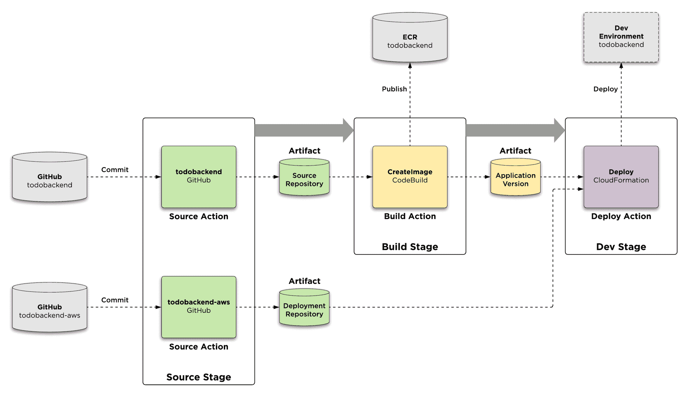

Continuous deployment pipeline

在上图中，增加了一个新的阶段(称为**开发阶段**)；它利用 CodePipeline 与 CloudFormation 的集成，将您的应用部署到非生产环境中，我们称之为开发(dev)。因为我们使用 cloud information 进行部署，所以我们需要提供一个 cloud information 栈来进行部署，这是通过在源阶段添加 todobackend 存储库作为另一个源操作来实现的。**部署动作**还需要另一个输入工件，它定义了要部署的 Docker 映像的标签，并且在构建阶段作为 CodeBuild 构建动作的输出工件(称为`ApplicationVersion`)提供。如果现在这没有太大意义，不要担心；我们将在本章中介绍所有的细节并设置这些管道，但重要的是至少要理解阶段、动作的概念，以及工件如何在它们之间传递以实现您想要的结果。

最后，CodePipeline 可以支持部署到多个环境中，本章的最后一节将扩展我们的管道，以在生产环境中执行受控发布，如下图所示:


Continuous delivery pipeline

在上图中，一个新的阶段(称为**生产阶段**)被添加到管道中，只有当您的应用已经成功部署到您的开发环境中时，该阶段才能被执行。与开发阶段的持续部署方法不同，开发阶段会立即部署到您的开发环境中，生产阶段首先创建一个云信息变更集，该变更集标识作为部署的一部分将进行的所有变更，然后触发手动批准操作，该操作要求有人审查变更集并批准或拒绝变更。假设变更被批准，那么生产阶段将把变更部署到生产环境中，并且这些动作集合将共同提供对生产(或其他受控)环境中受控释放的支持。

现在，您已经对代码管道有了一个高层次的概述，让我们从创建我们在第一个图表中讨论的连续集成管道开始。在我们可以构建这个管道之前，我们需要构建一个定制的构建容器，以满足 todobackend 存储库中定义的 Docker 工作流的要求，我们还需要添加对 CodeBuild 的支持，之后我们就可以在 CodePipeline 中创建我们的管道了。

# 创建自定义代码构建容器

AWS CodeBuild 提供了一个构建服务，它使用容器构建代理来执行您的构建。CodeBuild 提供了许多针对特定应用语言和/或平台的 AWS 精选映像，例如 [Python、Java、PHP 和更多](https://docs.aws.amazon.com/codebuild/latest/userguide/build-env-ref-available.html)。CodeBuild 确实提供了一个为构建 Docker 映像而设计的映像；但是，这个映像有些有限，因为它不包括像 AWS CLI、GNU make 和 Docker Compose 这样的工具，而我们构建 todobackend 应用需要所有这些工具。

虽然您可以运行预构建步骤，在代码构建中安装额外的工具，但是这种方法会降低构建的速度，因为额外工具的安装会发生在每个构建中。CodeBuild 确实支持使用您自己的自定义映像，这允许您预打包应用构建所需的所有工具。

对于我们的用例，代码构建构建环境必须包括以下内容:

*   如果构建支持多容器环境来运行集成和验收测试，那么可以访问 Docker 守护程序
*   复合Docker
*   GNU 制造
*   AWS CLI

您可能想知道如何满足第一个要求，因为您的代码构建运行时环境位于一个独立的容器中，无法直接访问运行它的底层基础架构。Docker 确实支持 Docker ( **DinD** )中的 **Docker 概念，其中 Docker 守护程序在 Docker 容器内部运行，允许您使用 Docker Compose 等工具安装可以构建 Docker 映像和编排多容器环境的 Docker 客户端。**

Docker 在 Docker 中的实践[有些争议](http://jpetazzo.github.io/2015/09/03/do-not-use-docker-in-docker-for-ci/)，是使用 Docker 更像虚拟机而不是容器的一个例子。然而，为了运行构建，这种方法是完全可以接受的。

# 定义自定义代码构建容器

首先，我们需要构建我们的定制代码构建映像，我们将在一个名为`Dockerfile.codebuild`的 Dockerfile 中定义它，该文件位于 todobackend-aws 存储库中。

以下示例显示了 Dockerfile:

```
FROM docker:dind

RUN apk add --no-cache bash make python3 && \
    pip3 install --no-cache-dir docker-compose awscli
```

因为 Docker 在 Docker 映像中发布了一个 Docker，所以我们可以简单地根据这个映像进行定制；我们免费提供 Docker 中的 Docker 功能。DinD 映像基于 Alpine Linux，并且已经包含所需的 Docker 守护程序和 Docker 客户端。接下来，我们将添加构建所需的特定工具。这包括 bash shell、GNU make 和 Python 3 运行时，这是安装 Docker Compose 和 AWS CLI 所必需的。

现在，您可以使用`docker build`命令在本地构建该映像，如下所示:

```
> docker build -t codebuild -f Dockerfile.codebuild .
Sending build context to Docker daemon 405.5kB
Step 1/2 : FROM docker:dind
dind: Pulling from library/docker
ff3a5c916c92: Already exists
1a649ea86bca: Pull complete
ce35f4d5f86a: Pull complete
d0600fe571bc: Pull complete
e16e21051182: Pull complete
a3ea1dbce899: Pull complete
133d8f8629ec: Pull complete
71a0f0a757e5: Pull complete
0e081d1eb121: Pull complete
5a14be8d6d21: Pull complete
Digest: sha256:2ca0d4ee63d8911cd72aa84ff2694d68882778a1c1f34b5a36b3f761290ee751
Status: Downloaded newer image for docker:dind
 ---> 1f44348b3ad5
Step 2/2 : RUN apk add --no-cache bash make python3 && pip3 install --no-cache-dir docker-compose awscli
 ---> Running in d69027d58057
...
...
Successfully built 25079965c64c
Successfully tagged codebuild:latest
```

上例中的命令创建名为`codebuild`的新建 Docker 映像。目前这还可以，但是我们需要将这个代码构建发布到**弹性容器注册中心** ( **ECR** ，这样它就可以用于代码构建了。

# 为自定义代码构建容器创建存储库

现在，您已经构建了一个自定义的代码构建映像，您需要将映像发布到代码构建可以从中提取映像的位置。如果您正在使用 ECR，您通常会将此映像发布到 ECR 中的存储库中，这就是我们将采取的方法。

首先，您需要在`todobackend-aws`文件夹的根目录下向`ecr.yml`文件添加一个新的存储库，该文件夹是您在本章前面创建的:

```
AWSTemplateFormatVersion: "2010-09-09"

Description: ECR Resources

Resources:
  CodebuildRepository:
 Type: AWS::ECR::Repository
 Properties:
RepositoryName: docker-in-aws/codebuild
 RepositoryPolicyText:
 Version: '2008-10-17'
 Statement:
 - Sid: CodeBuildAccess
 Effect: Allow
 Principal:
 Service: codebuild.amazonaws.com
 Action:
 - ecr:GetDownloadUrlForLayer
 - ecr:BatchGetImage
 - ecr:BatchCheckLayerAvailability
  TodobackendRepository:
    Type: AWS::ECR::Repository
  ...
  ...
```

在前面的示例中，您创建了一个名为`docker-in-aws/codebuild`的新存储库，这将产生一个名为`<account-id>.dkr.ecr.<region>.amazonaws.com/docker-in-aws/codebuild`的完全限定存储库(例如，`385605022855.dkr.ecr.us-east-1.amazonaws.com/docker-in-aws/codebuild`)。请注意，您必须授予对代码构建服务的拉取访问权限，因为代码构建需要拉取映像作为其构建容器运行。

现在，您可以通过使用`aws cloudformation deploy`命令将更改部署到 ecr 栈中，您可能还记得在“使用 ECR 发布 Docker 映像”一章中，该命令被部署到名为 ECR 存储库的栈中:

```
> export AWS_PROFILE=docker-in-aws
> aws cloudformation deploy --template-file ecr.yml --stack-name ecr-repositories
Enter MFA code for arn:aws:iam::385605022855:mfa/justin.menga:

Waiting for changeset to be created..
Waiting for stack create/update to complete
Successfully created/updated stack - ecr-repositories
```

部署完成后，您需要使用新 ECR 存储库的完全限定名重新标记之前创建的映像，之后您可以登录 ECR 并发布映像:

```
> docker tag codebuild 385605022855.dkr.ecr.us-east-1.amazonaws.com/docker-in-aws/codebuild
> eval $(aws ecr get-login --no-include-email)
WARNING! Using --password via the CLI is insecure. Use --password-stdin.
Login Succeeded
> docker push 385605022855.dkr.ecr.us-east-1.amazonaws.com/docker-in-aws/codebuild
The push refers to repository [385605022855.dkr.ecr.us-east-1.amazonaws.com/docker-in-aws/codebuild]
770fb042ae3b: Pushed
0cdc6e0d843b: Pushed
395fced17f47: Pushed
3abf4e550e49: Pushed
0a6dfdbcc220: Pushed
27760475e1ac: Pushed
5270ef39cae0: Pushed
2c88066e123c: Pushed
b09386d6aa0f: Pushed
1ed7a5e2d1b3: Pushed
cd7100a72410: Pushed
latest: digest:
sha256:858becbf8c64b24e778e6997868f587b9056c1d1617e8d7aa495a3170761cf8b size: 2618
```

# 向应用存储库添加代码构建支持

无论何时创建代码构建项目，都必须定义代码构建应该如何测试和构建应用源代码，然后发布应用工件和/或 Docker 映像。代码构建在构建规范中定义了这些任务，该规范提供了代码构建代理在运行构建时应该执行的构建指令。

代码构建允许您以多种方式提供构建规范:

*   **自定义**:代码构建寻找在项目的源存储库中定义的文件。默认情况下，这是一个名为`buildspec.yml`的文件；但是，您也可以在构建规范所在的位置配置自定义文件。
*   **预配置**:当您创建一个代码构建项目时，您可以定义一个构建规范作为项目设置的一部分。
*   **按需**:如果使用 AWS CLI 或 SDK 启动代码构建构建作业，则可以覆盖预配置或自定义的构建规范

一般来说，我建议使用自定义方法，因为它允许存储库所有者(通常是您的开发人员)独立于 CodeBuild 来配置和维护规范；这是我们将采取的方法。

以下示例演示了在名为`buildspec.yml`的文件中将构建规范添加到 todobackend 存储库中:

```
version: 0.2

phases:
  pre_build:
    commands:
      - nohup /usr/local/bin/dockerd --host=unix:///var/run/docker.sock --storage-driver=overlay&
      - timeout -t 15 sh -c "until docker info; do echo .; sleep 1; done"
      - export BUILD_ID=$(echo $CODEBUILD_BUILD_ID | sed 's/^[^:]*://g')
      - export APP_VERSION=$CODEBUILD_RESOLVED_SOURCE_VERSION.$BUILD_ID
      - make login
  build:
    commands:
      - make test
      - make release
      - make publish
  post_build:
    commands:
      - make clean
      - make logout
```

构建规范从指定每个构建规范中必须包含的版本开始，截至本书撰写之时，最新版本为`0.2`。接下来，您定义了阶段序列，这是必需的，定义了代码构建将在构建的各个阶段运行的命令。在前面的示例中，您定义了三个阶段:

*   `pre_build`:代码构建将在构建之前运行的命令。在这里，您可以运行命令，例如登录到 ECR，或者成功运行构建所需的任何其他命令。
*   `build`:这些命令运行您的构建步骤。
*   `post_build`:代码构建将在您构建后运行的命令。这些通常涉及清理任务，如注销ECR和删除临时文件。

您可以在[https://docs . AWS . Amazon . com/CodeBuild/latest/user guide/build-spec-ref . html](https://docs.aws.amazon.com/codebuild/latest/userguide/build-spec-ref.html)上找到更多关于 code build 构建规范的信息。

在`pre_build`阶段，您执行以下操作:

*   前两个命令用于启动自定义代码构建映像中的 Docker 守护程序；`nohup`命令启动 Docker 守护程序作为后台任务，而`timeout`命令用于确保 Docker 守护程序已成功启动，然后再尝试继续。

*   导出一个`BUILD_ID`环境变量，用于将构建信息添加到将为您的构建生成的应用版本中。该`BUILD_ID`值将被添加到附加到构建阶段构建的 Docker 映像的应用版本标签中，因此，它只能包含与 Docker 的标签格式兼容的字符。代码构建作业标识通过`CODEBUILD_BUILD_ID`环境变量暴露给构建代理，其格式为`<project-name>:<job-id>`，其中`<job-id>`是 UUID 值。Docker 标记不支持代码构建作业标识中的冒号；因此，您可以使用`sed`表达式去除作业标识的`<project-name>`:部分，只留下将包含在 Docker 标签中的作业标识值。
*   导出`APP_VERSION`环境变量，该变量在 Makefile 中用于定义在构建的 Docker 映像上标记的应用版本。当您将代码构建与代码管道一起使用时，重要的是要理解呈现给代码构建的源工件实际上是位于 S3 桶中的压缩版本，代码管道是在从您的源代码存储库中克隆源代码后创建的。CodePipeline 不包含任何 Git 元数据；因此，todobackend Makefile - `export APP_VERSION ?= $(shell git rev-parse --short HEAD`中的`APP_VERSION`指令将失败，因为 Git 客户端将没有任何可用的 Git 元数据。幸运的是，GNU Make 中的`?=`语法意味着使用前面提到的环境变量的值，如果它已经在环境中定义了的话。因此，我们可以在代码构建环境中导出`APP_VERSION`，Make 将只使用配置的值，而不是运行 Git 命令。在前面的示例中，您从名为`CODEBUILD_RESOLVED_SOURCE_VERSION`的变量构建了`APP_VERSION`，该变量是源存储库的完整提交哈希，由 CodePipeline 设置。您还可以追加在前面的命令中计算的`BUILD_ID`变量，这允许您将特定的 Docker 映像构建跟踪到代码构建构建作业。
*   使用源存储库中包含的`make login`命令登录 ECR。

一旦`pre_build`阶段完成，构建阶段就很简单了，只需执行我们在本书中手动执行的各种构建步骤。最后一个`post_build`阶段运行`make clean`任务来拆除 Docker Compose 环境，然后通过运行`make logout`命令删除任何本地 ECR 凭证。

需要注意的一点是`post_build`阶段始终运行，即使构建阶段失败。这意味着您应该只为将要运行的操作保留`post_build`任务，而不管构建是通过还是失败。例如，您可能想将`make publish`任务作为`post_build`步骤运行；但是，如果您这样做了，并且前一个构建阶段失败了，考虑到它被定义为一个`post_build`步骤，CodeBuild 仍然会尝试运行 make publish 任务。将 make publish 任务作为构建阶段的最终操作可确保如果 make test 或 make release 失败，构建阶段将立即退出并出现错误，绕过 make publish 操作并继续执行`post_build`步骤中的清理任务。

您可以在[https://docs . AWS . Amazon . com/CodeBuild/latest/user guide/view-build-details . html # view-build-details-phases](https://docs.aws.amazon.com/codebuild/latest/userguide/view-build-details.html#view-build-details-phases)上找到关于所有 code build 阶段的更多信息，以及它们是否在成功/失败时执行。

您需要执行的最后一步是将您的更改提交并推送到您的 Git 存储库，以便在您配置代码管道和代码构建时，新创建的`buildspec.yml`文件可用:

```
> git add -A
> git commit -a -m "Add build specification"
[master ab7ac16] Add build specification
 1 file changed, 19 insertions(+)
 create mode 100644 buildspec.yml
> git push
Counting objects: 3, done.
Delta compression using up to 8 threads.
Compressing objects: 100% (3/3), done.
Writing objects: 100% (3/3), 584 bytes | 584.00 KiB/s, done.
Total 3 (delta 1), reused 0 (delta 0)
remote: Resolving deltas: 100% (1/1), completed with 1 local object.
To github.com:docker-in-aws/todobackend.git
   5fdbe62..ab7ac16 master -> master
```

# 使用代码管道创建连续集成管道

现在您已经建立了支持代码构建的先决条件，您可以创建一个持续集成的代码管道管道，该管道将使用代码构建来测试、构建和发布您的 Docker 映像。持续集成侧重于持续地将应用源代码变更合并到您的主分支中，并通过创建一个构建并对其运行自动化测试来验证变更。

根据本章的第一个图表，当您为持续集成配置一个代码管道管道时，这通常涉及两个阶段:

*   **源阶段**:下载源应用库，并使其可用于后续阶段。对于我们的用例，您将把 CodePipeline 连接到 GitHub 存储库的主分支，随后对该存储库的提交将自动触发新的管道执行。
*   **构建阶段**:运行在源应用存储库中定义的构建、测试和发布工作流。对于我们的用例，我们将使用 CodeBuild 来运行这个阶段，它将执行您在本章前面创建的源存储库`buildspec.yml`文件中定义的构建任务。

# 使用 AWS 控制台创建代码管道管道

首先，从 AWS 控制台选择**服务**，然后选择**代码管道**。如果这是您第一次使用代码管道，您将看到一个介绍页面，您可以单击“开始”按钮启动代码管道向导。

首先要求您输入管道的名称，单击“下一步”后，系统会提示您设置源提供程序，该程序定义将在管道中使用的源存储库或文件的提供程序:


从下拉菜单中选择 GitHub 后，单击“连接到 GitHub”按钮，该按钮会将您重定向到 GitHub，系统会提示您登录并授予您对 GitHub 帐户的代码管道访问权限:


单击授权 aws-codesuite 按钮后，您将被重定向回 CodePipeline 向导，您可以选择 todobackend 存储库和主分支:

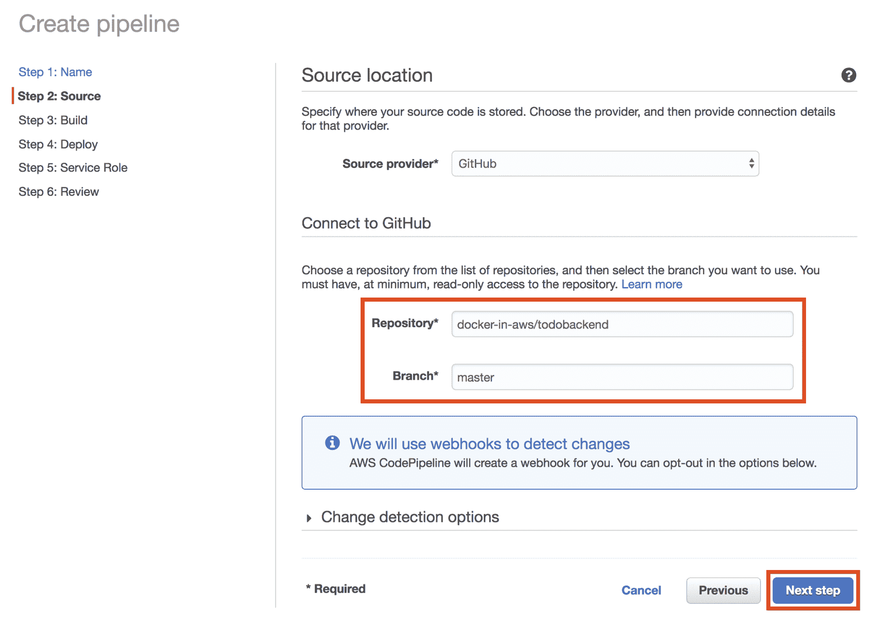

如果您单击“下一步”，将要求您选择一个构建提供程序，该程序定义将在您的源存储库中执行构建操作的构建服务的提供程序:

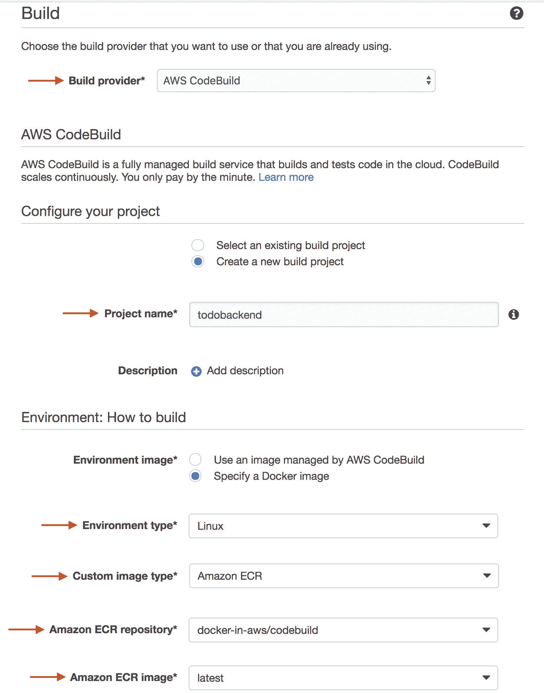

选择 AWS 代码构建并选择创建新的构建项目选项后，您需要配置构建项目，如下所示:

*   环境映像:对于环境映像，选择指定一个 Docker 映像选项，然后将环境类型设置为 Linux，自定义映像类型设置为 Amazon ECR 然后，选择您在本章前面发布的`docker-in-aws/codebuild repository/latest`映像。
*   高级:确保设置了特权标志，如下图所示。每当您在 Docker 映像中运行 Docker 时，这都是必需的:

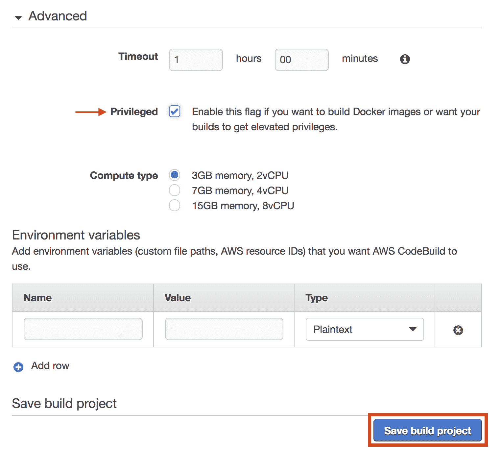

完成生成项目配置后，请确保在单击“下一步”继续之前单击“保存生成项目”。

在下一阶段，您将被要求定义部署阶段。此时，我们只想执行测试、构建和发布 Docker 应用的持续集成任务，因此选择“不部署”选项并单击“下一步”继续:

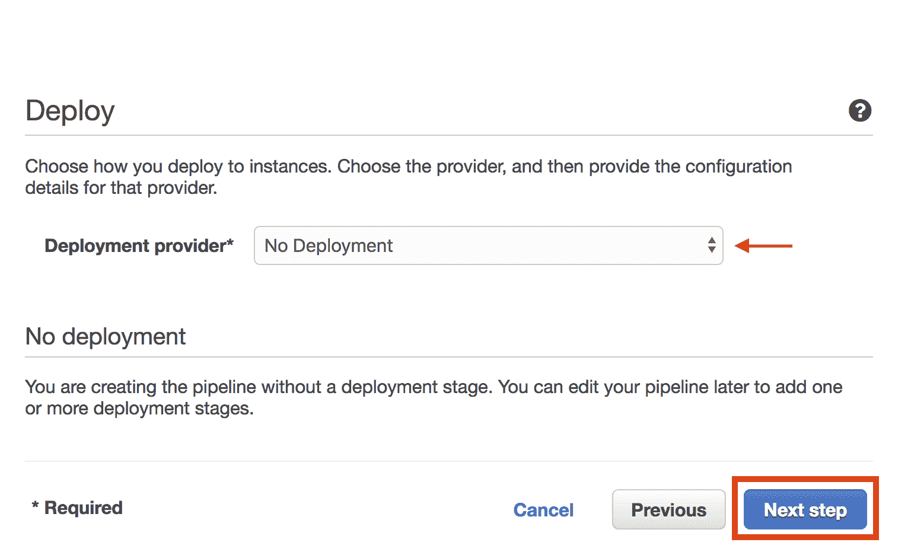

最后一步是配置一个 IAM 角色，代码管道可以承担这个角色来执行管道中的各种构建和部署任务。单击创建角色按钮，这将打开一个新窗口，要求您为代码管道创建一个具有适当权限的新 IAM 角色:

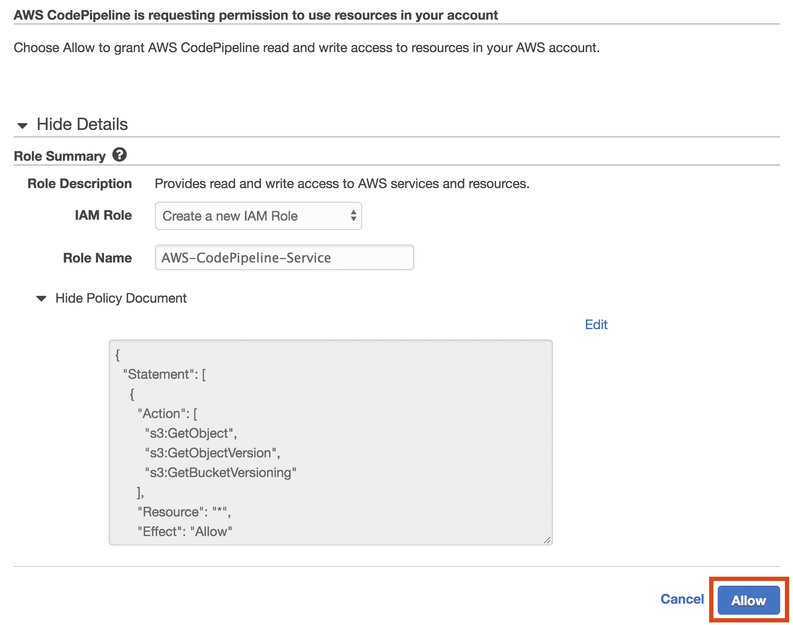

查看策略文档后，单击允许，这将在代码管道向导中选择新角色。最后，单击下一步，查看管道配置，然后单击创建管道以创建新管道。

此时，您的管道将被创建，您将进入管道的管道配置视图。每当您第一次创建管道时，代码管道将自动触发管道的第一次执行，几分钟后，您应该会注意到管道的构建阶段已经失败:

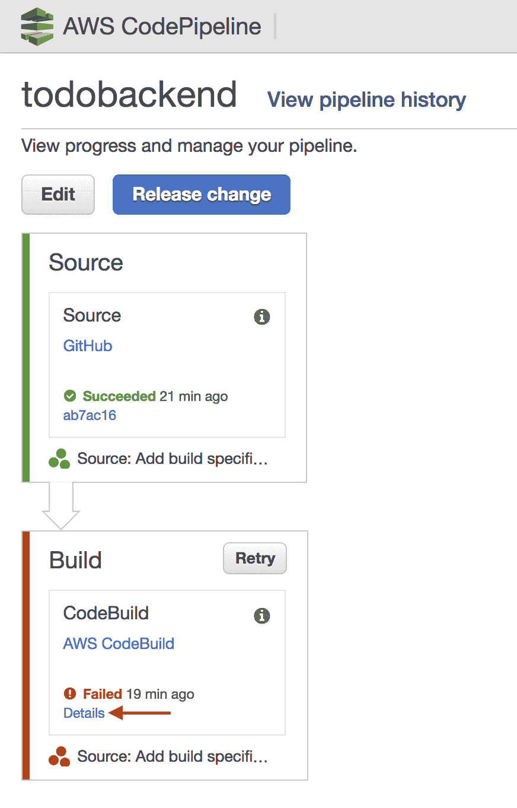

要了解有关构建失败原因的更多信息，请单击“详细信息”链接，该链接将弹出有关失败的更多详细信息，还将包含一个指向发生失败的代码构建作业的链接。如果您单击此链接并向下滚动，您可以看到故障发生在`pre_build`阶段，并且在构建日志中，该问题与 IAM 权限问题相关:


问题是在代码管道向导期间自动创建的 IAM 角色不包括登录 ECR 的权限。

要解决此问题，请打开 IAM 控制台，从左侧菜单中选择角色，并找到向导创建的`code-build-todobackend-service-role`。在权限选项卡中，单击附加策略，找到`AmazonEC2ContainerRegistryPowerUser`管理的策略，然后单击附加策略按钮。超级用户角色授予登录、拉取和推送权限，因为我们将发布到 ECR 作为构建工作流的一部分，所以需要这种级别的访问权限。完成配置后，该角色的“权限”选项卡应该与下面屏幕截图中显示的一样:

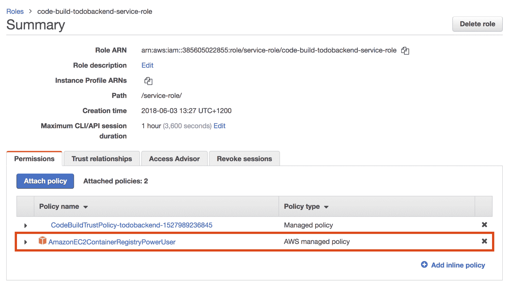

既然您已经解决了权限问题，请导航回您的管道的代码管道详细信息视图，在构建阶段单击“重试”按钮，并确认重试失败的构建。这一次，几分钟后，构建应该会成功完成，您可以使用`aws ecr list-images`命令来验证新的映像已经发布到 ECR:

```
> aws ecr list-images --repository-name docker-in-aws/todobackend \
 --query imageIds[].imageTag --output table
-----------------------------------------------------------------------------------
| ListImages                                                                      |
+---------------------------------------------------------------------------------+
| 5fdbe62                                                                         |
| latest                                                                          |
| ab7ac1649e8ef4d30178c7f68899628086155f1d.10f5ef52-e3ff-455b-8ffb-8b760b7b9c55   |
+---------------------------------------------------------------------------------+
```

请注意，最后发布的映像格式为`<long commit hash>`。`<uuid>`，其中`<uuid>`为 CodeBuild 作业 ID，确认 CodeBuild 已成功向 ECR 发布新映像。

# 使用代码管道创建连续交付管道

此时，您有了一个连续的集成管道，每当在主分支上将提交推送到您的源存储库时，它将自动为您的应用发布新的 Docker 映像。在某些时候，您可能希望将 Docker 映像部署到一个环境中(可能是一个临时环境，在那里您可能会运行一些端到端测试来验证您的应用是否按预期工作)，然后部署到一个为您的最终用户服务的生产环境中。虽然您可以通过更新 todobackend 栈的`ApplicationImageTag`输入来手动部署这些更改，但理想情况下，您希望能够将这些更改连续自动部署到至少一个环境中，这为开发人员、测试人员和产品经理提供了即时访问，从而允许来自应用开发中涉及的关键利益相关者的快速反馈。

这个概念被称为持续部署。换句话说，每当您持续集成和构建测试过的软件工件时，您就持续部署这些工件。持续部署现在非常普遍，尤其是在非生产环境中部署时。远不常见的是从生产一直到生产的持续部署。为了实现这一点，您必须有高度自动化的部署后测试，并且，至少在我的经验中，这对于大多数组织来说仍然很难实现。一种更常见的方法是所谓的连续交付，您可以认为这是一种一旦确定您的版本已经准备好投入生产，就自动部署到生产的能力。

连续交付允许常见的场景，其中您需要执行生产中的受控发布，而不是一有发布就持续部署到生产中。这比一直持续部署到生产环境更容易实现，因为它允许在您选择部署到生产环境之前对您的非生产环境进行手动测试。

现在您已经了解了什么是连续交付，让我们扩展我们的管道来支持连续交付。

CodePipeline includes support for ECS as a deployment target, where you can deploy new images published by your continuous integration pipeline to a target ECS cluster and ECS service. In this chapter, I will be using CloudFormation to deploy application changes; however, you can read more about the ECS deployment mechanism at [https://docs.aws.amazon.com/AmazonECS/latest/developerguide/ecs-cd-pipeline.html](https://docs.aws.amazon.com/AmazonECS/latest/developerguide/ecs-cd-pipeline.html).

第一个阶段是将代码更改的持续部署配置到非生产环境中，要求您执行以下配置操作，这些操作将在后面详细讨论:

*   在您的源存储库中发布版本信息
*   将代码管道支持添加到您的部署存储库中
*   将您的部署存储库添加到代码管道
*   为您的构建操作添加一个输出工件
*   为云信息部署创建一个 IAM 角色
*   向管道添加部署阶段

# 在源存储库中发布版本信息

我们管道的一个关键要求是能够将新构建的 Docker 映像部署到我们的 AWS 环境中。目前，CodePipeline 还没有真正意识到发布的 Docker 映像标签。我们知道标签是在代码构建环境中配置的，但是代码管道对此并不了解。

为了使用在代码构建构建阶段生成的 Docker 映像标记，您需要生成一个输出工件，该工件首先由代码构建收集，然后在代码管道中可供未来的部署阶段使用。

要做到这一点，您必须首先定义代码构建应该收集的工件，这可以通过向 todobackend 存储库中的`buildspec.yml`构建规范添加一个`artifacts`参数来实现:

```
version: 0.2

phases:
  pre_build:
    commands:
      - nohup /usr/local/bin/dockerd --host=unix:///var/run/docker.sock --storage-driver=overlay&
      - timeout -t 15 sh -c "until docker info; do echo .; sleep 1; done"
      - export BUILD_ID=$(echo $CODEBUILD_BUILD_ID | sed 's/^[^:]*://g')
      - export APP_VERSION=$CODEBUILD_RESOLVED_SOURCE_VERSION.$BUILD_ID
      - make login
  build:
    commands:
      - make test
      - make release
      - make publish
      - make version > version.json
  post_build:
    commands:
      - make clean
      - make logout

artifacts:
 files:
 - version.json
```

在前面的例子中，`artifacts`参数配置代码构建在`version.json`位置寻找工件。请注意，您还向构建阶段添加了一个额外的命令，该命令将`make version`命令的输出写入`version.json`文件，CodeBuild 希望在该文件中找到一个工件。

此时，请确保将您的更改提交并推送到 todobackend 存储库，以便将来的构建可以使用这些更改。

# 向部署存储库添加代码管道支持

当您使用代码管道使用云信息部署您的环境时，您需要确保您可以提供一个配置文件，其中包括输入栈参数、栈标签和栈策略配置。该文件必须以 JSON 格式实现，如[https://docs . AWS . Amazon . com/AWS cloudinformation/latest/user guide/continuous-delivery-codepipeline-cfn-artifacts . html # w2ab 1c 13 c 15 c 15](https://docs.aws.amazon.com/AWSCloudFormation/latest/UserGuide/continuous-delivery-codepipeline-cfn-artifacts.html#w2ab2c13c15c15)中所定义，因此我们需要修改`todobackend-aws`存储库中输入参数文件的格式，该存储库当前为`<parameter>=<value>`格式，位于名为`dev.cfg`的文件中。根据引用的文档，所有的输入参数需要驻留在一个名为`Parameters`的键下的 JSON 文件中，您可以在一个名为`dev.json`的新文件中定义该键，该文件位于`todobackend-aws`存储库的根目录下:

```
{ 
  "Parameters": {
    "ApplicationDesiredCount": "1",
    "ApplicationImageId": "ami-ec957491",
    "ApplicationImageTag": "latest",
    "ApplicationSubnets": "subnet-a5d3ecee,subnet-324e246f",
    "VpcId": "vpc-f8233a80"
  }
}
```

在上例中，请注意我已经将`ApplicationImageTag`值更新为`latest`。这是因为我们的管道实际上会从管道的构建阶段动态获取`ApplicationImageTag`输入的值，而`latest`值是一个更安全的默认值，如果您想要从命令行手动部署栈。

此时`dev.cfg`文件是多余的，可以从你的库中删除；但是，请注意，您需要从命令行手动修改运行部署的方式，因为`aws cloudformation deploy`命令期望以`<parameter>=<value>`格式提供输入参数。

解决这个问题的一种方法是使用`jq`实用程序将新的`dev.json`配置文件转换为所需的`<parameter>=<value>`格式:

```
> aws cloudformation deploy --template-file stack.yml --stack-name todobackend \
    --parameter-overrides $(cat dev.json | jq -r '.Parameters|to_entries[]|.key+"="+.value') \
    --capabilities CAPABILITY_NAMED_IAM
```

这个命令现在已经很丰富了，所以，为了简化这个命令的运行，您可以向`todobackend-aws`存储库添加一个简单的 Makefile:

```
.PHONY: deploy

deploy/%:
  aws cloudformation deploy --template-file stack.yml --stack-name todobackend-$* \
    --parameter-overrides $$(cat $*.json | jq -r '.Parameters|to_entries[]|.key+"="+.value') \
    --capabilities CAPABILITY_NAMED_IAM
```

在前面的示例中，每当您执行`make deploy`命令时，任务名称中的`%`字符都会捕获一个通配符文本值。例如，如果您运行 make `deploy` / `dev`，则`%`字符将捕获`dev`，如果您运行 make `deploy` / `prod`，则捕获的值将为`prod`。然后，您可以通过使用`$*`变量来引用捕获的值，您可以看到我们已经在栈名称(`todobackend-$*`，使用前面的示例，它将扩展到`todobackend-dev`和`todobackend-prod`)中，以及在 cat`dev.json`或`prod.json`文件的命令中进行了替换。请注意，因为我们已经在本书中命名了我们的栈`todobackend`，所以这个命令对我们来说不太适用，但是如果您将您的栈重命名为`todobackend-dev`，这个命令将使手动部署到给定的环境变得更加容易。

在继续之前，您需要添加新的`dev.json`文件，提交并将您的更改推送到源 Git 存储库，因为我们很快会将`todobackend-aws`存储库添加为您的 CodePipeline 管道中的另一个源。

# 为云信息部署创建 IAM 角色

当您使用代码管道来部署您的云信息栈时，代码管道要求您指定一个将由云信息服务承担的 IAM 角色来部署您的栈。cloud information 支持指定 cloud information 服务将承担的 IAM 角色的能力，这是一项强大的功能，允许更高级的配置场景，例如从中央构建帐户进行跨帐户部署。该角色必须将 CloudFormation 服务指定为可以承担该角色的受信任实体；因此，您通常不能使用为人工访问创建的管理角色，例如您在本书中一直使用的管理角色。

要创建所需的角色，请导航到 IAM 控制台，从左侧菜单中选择角色，然后单击创建角色按钮。在选择服务部分，选择云信息，然后单击下一步:权限继续。在“附加权限策略”屏幕上，您可以创建或选择具有创建栈中的资源所需的各种权限的适当策略。为了简单起见，我将只选择管理员访问策略。但是，在现实场景中，您应该创建或选择一个策略，该策略只授予创建云信息栈所需的特定权限。点击下一步:审核按钮后，指定`cloudformation-deploy`的角色名称，点击创建角色按钮创建新角色:


# 向代码管道添加部署存储库

现在，您已经为 CodePipeline 准备好了适当的栈配置文件和 IAM 部署角色，您可以开始修改您的管道，以支持向您的目标 AWS 环境连续交付应用更改。您需要执行的第一个修改是将 todo back and-AWS 存储库作为另一个源操作添加到您的管道的源阶段。为此，请导航到管道的详细信息视图，然后单击“编辑”按钮。

在“编辑”屏幕中，您可以单击源阶段右上角的铅笔图标，这将更改视图，并允许您添加新的源操作，可以是在 todobackend 存储库的当前操作之前、之后，也可以是在同一级别:

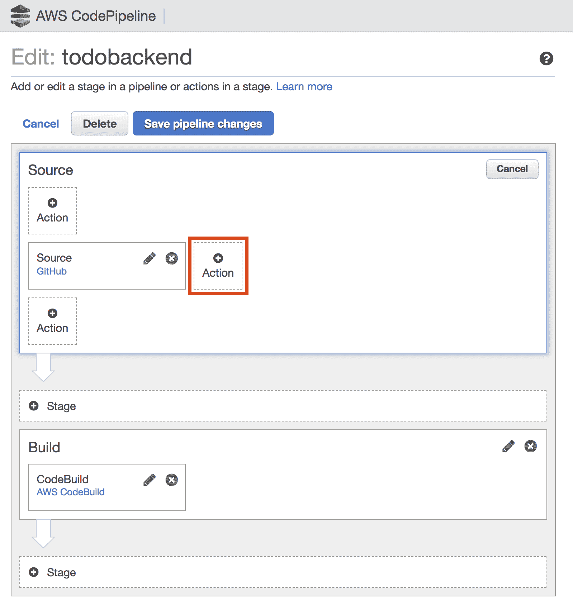

Editing a pipeline

对于我们的场景，我们可以并行下载部署存储库源代码；因此，在与另一个源存储库相同的级别添加一个新的操作，这将打开一个添加操作对话框。为“动作”类别选择“源”，配置一个`DeploymentRepository`或类似的动作名称，并在选择 GitHub 作为“源”提供者并点击“连接到 GitHub”按钮后，在`docker-in-aws/todobackend-aws`存储库中选择主分支:


Adding a deployment repository

接下来，滚动到页面底部，为这个源操作的输出工件配置一个名称。代码管道将使部署存储库中的基础架构模板和配置对管道中的其他阶段可用，您可以通过配置的输出工件名称来引用这些模板和配置:


Configuring an output artifact name

在前面的截图中，您还将输出工件名称配置为`DeploymentRepository`(与源动作名称相同)，这很有帮助，因为管道详细信息视图只显示阶段和动作名称，而不显示工件名称。

# 向构建阶段添加输出工件

在添加 DeploymentRepository 操作后，编辑管道屏幕应该如下图所示:


Edit pipeline screen

您需要执行的下一个管道配置任务是在构建阶段修改代码构建构建操作，这是在您创建管道时由代码管道向导为您创建的。

您可以通过单击代码构建操作框右上角的铅笔图标来实现这一点，如前面的屏幕截图所示，这将打开编辑操作对话框:


Editing build action

在前面的截图中，请注意代码管道向导已经配置了一个输入和输出工件:

*   输入工件:CodePipeline 向导将此命名为`MyApp`，它指的是与您在创建管道时引用的源存储库相关联的输出工件(在本例中，这是 GitHub todobackend 存储库)。如果您想要重命名这个工件，您必须确保在拥有的操作上重命名输出工件名称(在这种情况下，是源阶段中的源操作)，然后更新任何使用工件作为输入的操作。
*   输出工件:默认情况下，代码管道向导将此命名为`MyAppBuild`，然后可以在管道的后续阶段引用它。输出工件由`buildspec.yml`文件中的工件属性决定，对于我们的用例，这个工件不是应用构建；相反，它只是一个捕获版本元数据的版本工件(`version.json`)，所以我们将这个工件重命名为`ApplicationVersion`。

# 向管道添加部署阶段

单击上一个屏幕截图中的“更新”按钮后，您可以通过单击构建阶段下面的“添加阶段”框来添加新阶段。对于阶段名称，输入名称`Dev`，这将表示部署到名为 Dev 的环境中，然后单击添加操作框添加新操作:


Adding a deploy action

因为这是一个部署阶段，所以请从“操作”类别下拉菜单中选择“部署”，配置“部署”的操作名称，并选择 AWS 云信息作为部署提供程序:


Configuring a CloudFormation deploy action

这将公开许多与云信息部署相关的配置参数，如前面的截图所示:

*   操作模式:选择创建或更新栈选项，如果栈不存在，将创建新栈，或者更新现有栈。
*   栈名称:引用您在前面章节中已经部署的现有 todobackend 栈。
*   模板:指应该部署的云信息模板文件。这以格式`InputArtifactName::TemplateFileName`表示，在我们的例子中是`DeploymentRepository::stack.yml`，假设我们为`DeploymentRepository`源操作配置了一个输出工件名称`DeploymentRepository`，并且我们的栈位于文件`stack.yml`中，位于存储库的根。
*   模板配置:指用于提供栈参数、标签和栈策略的配置文件。这需要引用您之前在`todobackend-aws`部署存储库中创建的新`dev.json`文件；它以与模板参数相同的格式配置，值为`DeploymentRepository::dev.json`。

配置完上一个屏幕截图中显示的属性后，进一步向下滚动并展开高级部分，如下一个屏幕截图所示:

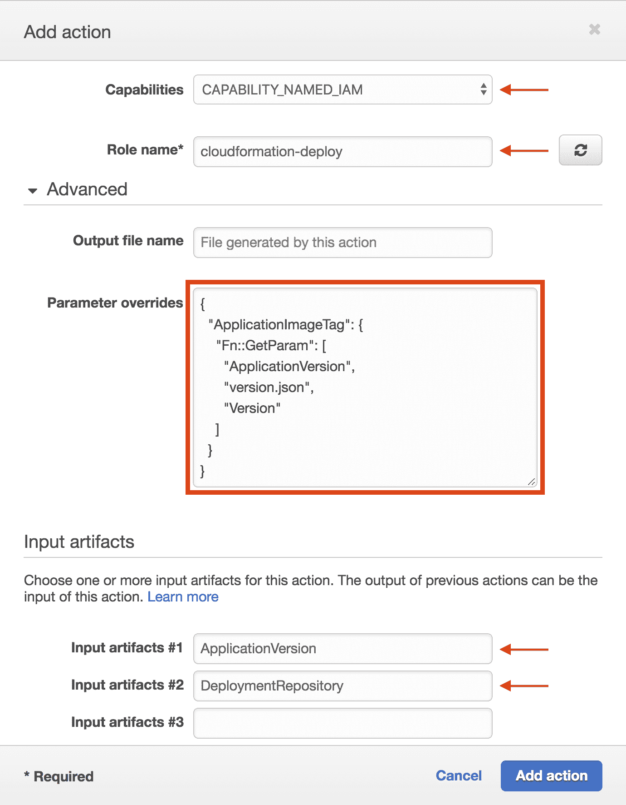

Configuring additional CloudFormation deploy action properties

以下描述了您需要配置的每个附加参数:

*   功能:这授予云信息部署操作代表您创建 IAM 资源的权限，并且在意义上与您传递给`aws cloudformation deploy`命令的`--capabilities`标志相同。
*   角色名称:这指定了云信息部署操作用来部署云信息栈的 IAM 角色。参考您之前创建的`cloudformation-deploy`角色。
*   参数覆盖:此参数允许您覆盖通常由模板配置文件(`dev.json`)提供的输入参数值，或云信息模板中的默认值。对于我们的用例，我们需要覆盖`ApplicationImageTag`参数，因为这需要反映作为构建阶段的一部分创建的映像标签。代码管道支持两种类型的参数覆盖(参见[使用参数覆盖函数](https://docs.aws.amazon.com/AWSCloudFormation/latest/UserGuide/continuous-delivery-codepipeline-parameter-override-functions.html)，对于我们的用例，我们使用`Fn::GetParam`覆盖，它可以用来从管道输出的工件中的 JSON 文件中提取属性值。回想一下，我们在本章前面向 todobackend 存储库添加了一个`make version`任务，该任务输出作为工件收集的文件`version.json`，作为代码构建构建规范的一部分。我们更新了构建动作，将这个工件称为`ApplicationVersion`。在前面的截图中，提供给`Fn::GetParam`调用的输入列表首先引用工件(`ApplicationVersion`)，工件中 JSON 文件的路径(`version.json`)，最后引用 JSON 文件中保存参数覆盖值的键(`Version`)。
*   输入工件:这必须指定您在部署配置中引用的任何输入工件。这里，我们添加`DeploymentRepository`(用于模板和模板配置参数)和`ApplicationVersion`(用于参数覆盖配置)。

完成后，单击添加操作按钮，然后您可以单击保存管道更改来完成管道的配置。此时，您可以通过单击 Release change 按钮来测试您的新部署操作是否有效，这将手动触发管道的新执行；在几分钟之内，您的管道应该成功地构建、测试和发布一个新的映像，作为构建阶段的一部分，然后通过开发阶段成功地将您的更改部署到 todobackend 栈:

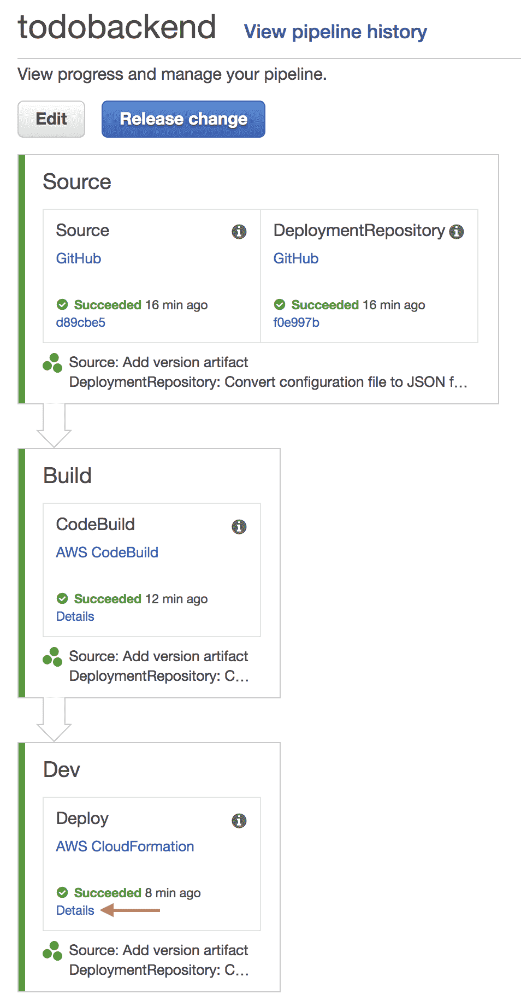

Successful CloudFormation deployment via CodePipeline

在前面的截图中，您可以在部署期间或之后单击详细信息链接，该链接会将您带到云信息控制台，并向您显示正在进行或已完成部署的详细信息。如果您展开参数选项卡，您应该会看到 ApplicationImageTag 正在引用一个格式为`<long commit hash>`的标签。`<codebuild job id>`，确认我们的管道实际上已经部署了构建阶段构建的 Docker 映像:


Confirming an overridden input parameter

# 使用代码管道持续交付到生产

现在我们正在非生产环境中持续部署，我们持续交付旅程的最后一步是能够以可控的方式将应用版本部署到生产环境中。CodePipeline 通过利用 CloudFormation 的一个有用特性(称为变更集)来支持这种能力。更改集描述了将应用于给定云信息栈的各种配置更改，这些更改基于可能已应用于您的栈模板文件和/或输入参数的任何更改。对于新的应用版本，您通常只更改定义新应用工件版本的输入参数。例如，我们管道的开发阶段覆盖了`ApplicationImageTag`输入参数。在某些场景中，您可以对云信息栈和输入参数进行更广泛的更改。例如，您可能需要为您的容器添加新的环境变量，或者您可能向栈添加新的基础架构组件或支持服务。这些更改通常会提交到您的部署存储库中，并且，鉴于我们的部署存储库是我们管道中的一个来源，对您的部署存储库的任何更改都将被捕获为更改。

CloudFormation 变更集为您提供了一个机会来检查将要应用到目标环境的任何变更，如果变更集被认为是安全的，那么您可以从该变更集中启动部署。CodePipeline 支持生成 CloudFormation 变更集作为部署操作，然后可以与单独的手动批准操作相结合，这允许适当的人员审查变更集，并随后批准或拒绝变更。如果变更获得批准，您就可以从变更集中触发部署，从而提供一种有效的方法，向生产环境或需要某种形式的变更控制的任何类型的环境提供受控的发布。

现在，让我们扩展我们的管道，以支持将应用版本受控部署到新的生产环境中，这需要您执行以下配置更改:

*   将新的环境配置文件添加到您的部署存储库中
*   向管道添加创建变更集操作
*   向管道添加手动批准操作
*   向管道添加部署更改集操作
*   部署到生产中

# 向部署存储库中添加新的环境配置文件

因为我们正在创建一个新的生产环境，所以我们需要向部署存储库添加一个环境配置文件，其中将包括特定于您的生产环境的输入参数。如前面的例子所示，它演示了在`todobackend-aws`存储库的根目录下添加一个名为`prod.json`的新文件:

```
{ 
  "Parameters": {
    "ApplicationDesiredCount": "1",
    "ApplicationImageId": "ami-ec957491",
    "ApplicationImageTag": "latest",
    "ApplicationSubnets": "subnet-a5d3ecee,subnet-324e246f",
    "VpcId": "vpc-f8233a80"
  }
}
```

可以看到配置文件的格式和我们之前修改的`dev.json`文件是一样的。当然，在现实场景中，您会期望配置文件有所不同。例如，我们使用相同的应用子网和 VPC 标识；您通常会有一个单独的 VPC，甚至是一个单独的生产帐户，但是为了简单起见，我们将把我们的生产环境部署到与我们的开发环境相同的 VPC 和子网中。

您还需要对我们的云信息栈文件进行一些小的更改，因为如果您试图在同一个 AWS 帐户中创建新的栈，有一些硬编码的名称会导致冲突:

```
...
...
Resources:
  ...
  ...
  ApplicationCluster:
    Type: AWS::ECS::Cluster
    Properties:
      # ClusterName: todobackend-cluster
      ClusterName: !Sub: ${AWS::StackName}-cluster
  ...
  ...
  MigrateTaskDefinition:
    Type: AWS::ECS::TaskDefinition
    Properties:
      # Family: todobackend-migrate
      Family: !Sub ${AWS::StackName}-migrate
      ...
      ...
  ApplicationTaskDefinition:
    Type: AWS::ECS::TaskDefinition
    Properties:
      # Family: todobackend
      Family: !Ref AWS::StackName
  ...
  ...
```

在前面的示例中，我对以前的配置进行了注释，然后突出显示了所需的新配置。在所有情况下，我们用对栈名的引用替换对 todobackend 的硬编码引用。考虑到 CloudFormation 栈名称在给定的 AWS 帐户和区域内必须是唯一的，这确保了修改后的资源将具有唯一的名称，该名称不会与同一帐户和区域中的其他栈冲突。

为了简单起见，生产环境的云信息栈将使用我们在*管理机密*一章中创建的相同机密。在现实场景中，您将为每个环境维护单独的机密。

有了新的配置文件和模板更改后，在继续下一部分之前，请确保您已经提交并将更改推送到 GitHub:

```
> git add -A
> git commit -a -m "Add prod environment support"
[master a42af8d] Add prod environment support
 2 files changed, 12 insertions(+), 3 deletions(-)
 create mode 100644 prod.json
> git push
...
...
```

# 向管道添加创建变更集操作

我们现在准备向我们的管道添加一个新阶段，将我们的应用部署到生产中。我们将创建这个阶段的第一个动作，创建一个云信息变更集。

在管道的管道详细信息视图中，单击“编辑”按钮，在开发阶段之后添加名为“生产”的新阶段，然后向新阶段添加操作:

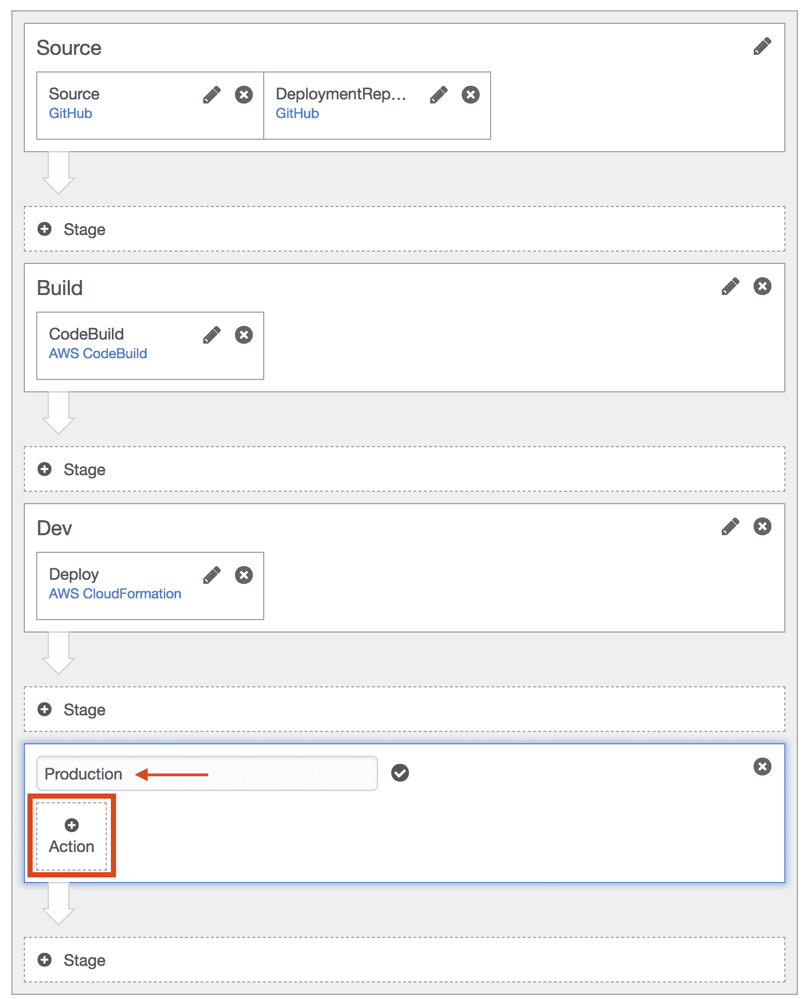

Adding a production stage to the pipeline

在“添加操作”对话框中，您需要创建一个类似于为开发阶段创建的部署操作的操作，但有一些变化:


Adding a create change set action to the pipeline

如果您将开发阶段的部署操作配置与前面屏幕截图中显示的新的创建更改集操作配置进行比较，除了以下主要区别之外，配置非常相似:

*   动作模式:你将其配置为`create`或`replace`一个变更集，这将只是创建一个新的变更集，而不是部署栈。
*   栈名:因为这个动作与我们的生产环境有关，所以需要配置一个新的栈名，我们称之为`todobackend-prod`。
*   变更集名称:这定义了变更集的名称。我通常只是将其命名为与栈名称相同，因为该操作将在每次执行时创建或替换变更集。
*   模板配置:在这里，您需要引用在前面示例中添加到`todobackend-aws`存储库中的新`prod.json`文件，因为它保存了特定于您的生产环境的输入参数。该文件通过从`todobackend-aws`存储库中创建的`DeploymentRepository`工件提供。

接下来，您需要向下滚动，展开高级部分，使用`Fn::GetParam`语法配置参数覆盖属性，最后，将`ApplicationVersion`和`DeploymentRepository`工件配置为输入工件。这与您之前执行的`dev` / `deploy`动作的配置相同。

# 向管道添加手动批准操作

完成变更集操作的配置后，您需要添加一个位于变更集操作之后的新操作:


Adding an approval action to the pipeline

在“添加操作”对话框中，为“操作”类别选择“批准”，然后配置“批准操作集”的操作名称。选择手动审批的审批类型后，请注意，您可以向手动审批请求添加社交网站主题 ARN 和其他信息。然后，这可以用于向审批者发送电子邮件，或者触发 lambda 函数来执行一些自定义操作，例如将消息发布到像 Slack 这样的消息传递工具中。

# 向管道添加部署更改集操作

一旦批准了 ApproveChangeSet 操作，您需要创建的最后一个操作是部署在变更集中创建的变更集:


Adding an execute change set action to the pipeline

在前面的截图中，我们选择了执行变更集的操作模式，然后在变更集操作中配置了栈名称和变更集名称，它们必须与您之前配置的值相同。

# 部署到生产

在点击前面截图中的添加操作后，新生产阶段的管道配置应该如下所示:

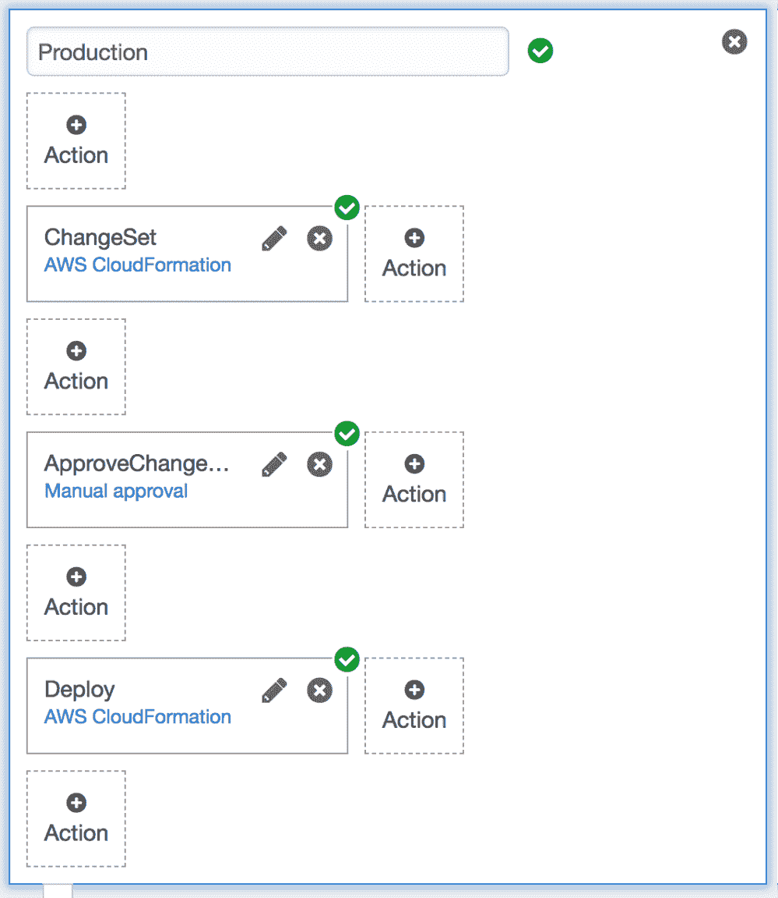

Adding a create change set action to the pipeline

此时，您可以通过单击“保存管道更改”按钮来保存管道更改，并通过单击“释放更改”按钮来测试新的管道阶段，这将强制执行新的管道。管道成功执行构建和开发阶段后，将首次调用生产阶段，由变更集操作创建 CloudFormation 变更集，之后将触发批准操作:


Adding a create change set action to the pipeline

管道现在将等待批准，在这里，批准者通常会通过单击变更集操作的详细信息链接来查看以前创建的变更集:

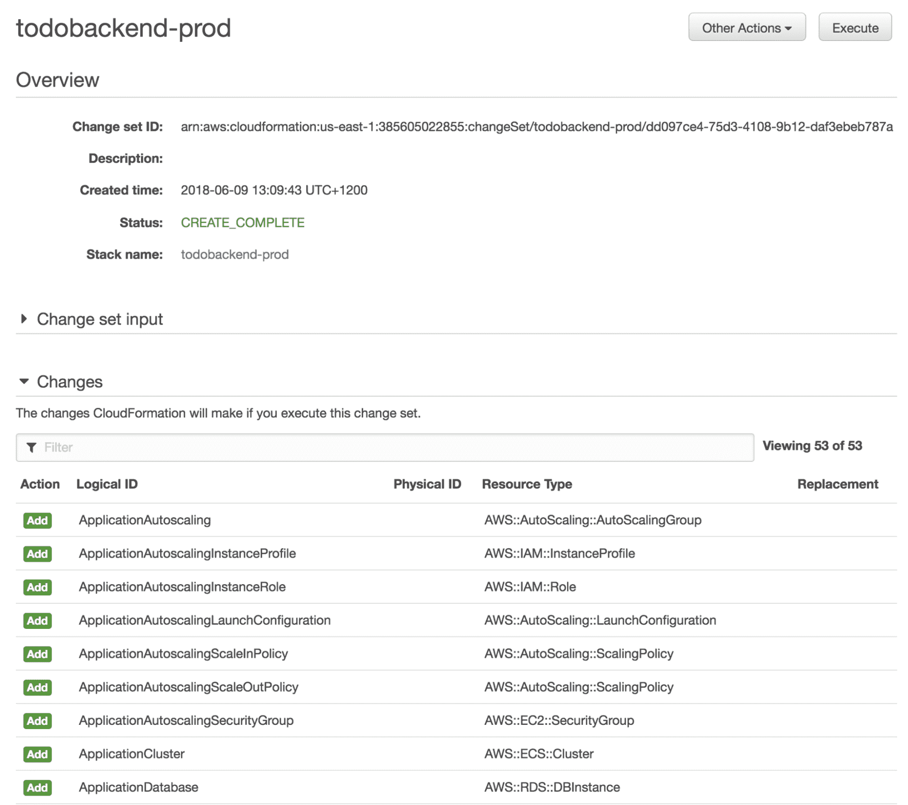

CloudFormation change set

正如您在前面的截图中所看到的，变更集指示将创建栈中的所有资源，假设生产环境当前不存在。考虑到栈将会到位，后续的部署应该几乎没有变化，典型的变化是部署一个新的 Docker 映像。

查看变更集并返回到代码管道详细信息视图后，您现在可以通过单击“查看”按钮来批准(或拒绝)变更集。这将显示“批准或拒绝修订”对话框，您可以在其中添加注释并批准或拒绝更改:


Approving or rejecting a manual approval action

如果您单击“批准”，管道将进行下一个操作，即部署与早期变更集操作关联的变更集。对于第一次执行，将部署一个名为`todobackend-prod`的新栈，一旦完成，您就已经使用 CodePipeline 成功部署了一个全新的生产环境！

此时，您应该按照*使用 ECS* 部署应用一章的*部署应用负载平衡器*部分中的步骤，测试并验证您的新栈和应用是否按预期工作，以获取将为您的生产应用端点提供服务的应用负载平衡器端点的域名。我还鼓励您手动触发管道，或者向任一存储库提交测试，然后查看为现有环境的应用部署生成的后续更改集。请注意，您可以选择何时部署到生产环境中。例如，在您选择将下一个版本部署到生产环境之前，您的开发人员可能会多次提交应用更改，每次更改都会自动部署到您的非生产环境中。当您选择部署到生产环境时，您的生产阶段将采用已成功部署到非生产环境的最新版本。

完成生产部署测试后，如果您使用的是免费层帐户，请记住，您现在有多个 EC2 实例和 RDS 实例正在运行，因此您应该考虑拆除您的生产环境，以避免产生费用。

# 摘要

在本章中，您创建了一个端到端的连续交付管道，该管道自动为您的应用测试、构建和发布 Docker 映像，将新的应用更改持续部署到非生产环境中，并允许您在生产环境中执行受控发布，这些发布会生成更改集，并且需要手动批准才能开始部署到生产环境中。

您学习了如何通过将 GitHub 存储库定义为源阶段中的源操作来将它们与 CodePipeline 集成，然后创建了一个构建阶段，使用 CodeBuild 为您的应用测试、构建和发布 Docker 映像。您将构建规范添加到 todobackend 存储库中，CodeBuild 使用它来执行您的构建，并且您创建了一个能够在 Docker 中运行 Docker 的自定义 CodeBuild 容器，以允许您在 Docker Compose 环境中构建 Docker 映像并执行集成和验收测试。

接下来，您在 CodePipeline 中创建了一个部署阶段，它会自动将应用更改部署到现有的 todobackend 栈中，我们在本书中一直在使用该栈。这要求您在源阶段为`todobackend-aws`存储库添加一个新的源操作，这使得云信息栈文件和环境配置文件可以作为工件用于后续的云信息部署操作。您还需要为 todobackend 存储库创建一个输出工件，在这种情况下，它只是捕获在构建阶段构建和发布的 Docker 映像标记，并使其可用于后续阶段。然后，您将该工件作为参数覆盖引用到您的开发阶段部署操作中，用构建操作版本工件中的 Docker 映像标记输出覆盖`ApplicationImageTag`参数。

最后，您扩展了管道以支持生产环境中的受控发布，这需要创建云信息变更集的创建变更集操作、允许某人检查变更集并批准/拒绝它的手动批准操作，以及执行先前生成的变更集的部署操作。

在下一章中，我们将更改轨道并介绍 AWS Fargate 服务，该服务允许您部署 Docker 应用，而无需部署和管理您自己的 ECS 集群和 ECS 容器实例。我们将借此机会通过使用 Fargate 部署 X 射线守护程序来增加对 AWS X 射线服务的支持，并将通过使用 ECS 服务发现来发布守护程序端点。

# 问题

1.  您通常在应用存储库的根目录下包含什么文件来支持 AWS 代码构建？
2.  对/错:AWS CodeBuild 是一个构建服务，它使用 AWS CodeDeploy 加速虚拟机并运行构建脚本。
3.  您需要运行什么 Docker 配置来支持构建 Docker 映像和多容器构建环境？
4.  您希望在部署云信息模板之前查看对其所做的更改。您会使用云信息的什么特性来实现这一点？
5.  当使用代码管道云信息部署操作部署云信息栈时，您为这些操作指定的服务角色必须信任哪个服务？
6.  您设置了一个新的代码构建项目，该项目包括一个发布到弹性容器注册表的构建任务。当您尝试发布映像时，第一次构建会失败。您确认目标 ECR 存储库存在，并且您可以自己手动将映像发布到存储库。这个问题的可能原因是什么？
7.  您为发布到 ECR 的代码构建创建一个自定义构建容器，并创建一个存储库策略，允许 ECR 从您的 AWS 帐户进行拉取访问。执行生成时，您会收到指示代码生成无法重试自定义映像的失败。你会如何解决这个问题？
8.  您可以创建一个自定义构建容器，该容器使用 Docker 中的 Docker 来支持 Docker 映像构建。当构建容器启动并且您尝试启动 Docker 守护程序时，会出现权限错误。你会如何解决这个问题？

# 进一步阅读

有关本章所涵盖主题的更多信息，您可以查看以下链接:

*   CodePipeline 用户指南:[https://docs . AWS . Amazon . com/CodePipeline/latest/User Guide/welcome . html](https://docs.aws.amazon.com/codepipeline/latest/userguide/welcome.html)
*   CodeBuild 用户指南:[https://docs . AWS . Amazon . com/CodeBuild/latest/User Guide/welcome . html](https://docs.aws.amazon.com/codebuild/latest/userguide/welcome.html)
*   代码构建的构建规范参考:[https://docs . AWS . Amazon . com/code build/latest/user guide/build-spec-ref . html](https://docs.aws.amazon.com/codebuild/latest/userguide/build-spec-ref.html)
*   使用带有代码构建的 AWS 代码管道:[https://docs . AWS . Amazon . com/code build/latest/user guide/如何创建管道. html](https://docs.aws.amazon.com/codebuild/latest/userguide/how-to-create-pipeline.html)
*   AWS CodePipeline 管道结构参考:[https://docs . AWS . Amazon . com/CodePipeline/latest/user guide/Reference-Pipeline-Structure . html](https://docs.aws.amazon.com/codepipeline/latest/userguide/reference-pipeline-structure.html)
*   将参数覆盖函数用于 AWS 代码管道管道:[https://docs . AWS . Amazon . com/AWS cloudinformation/latest/user guide/continuous-delivery-code pipeline-Parameter-Override-Functions . html](https://docs.aws.amazon.com/AWSCloudFormation/latest/UserGuide/continuous-delivery-codepipeline-parameter-override-functions.html)