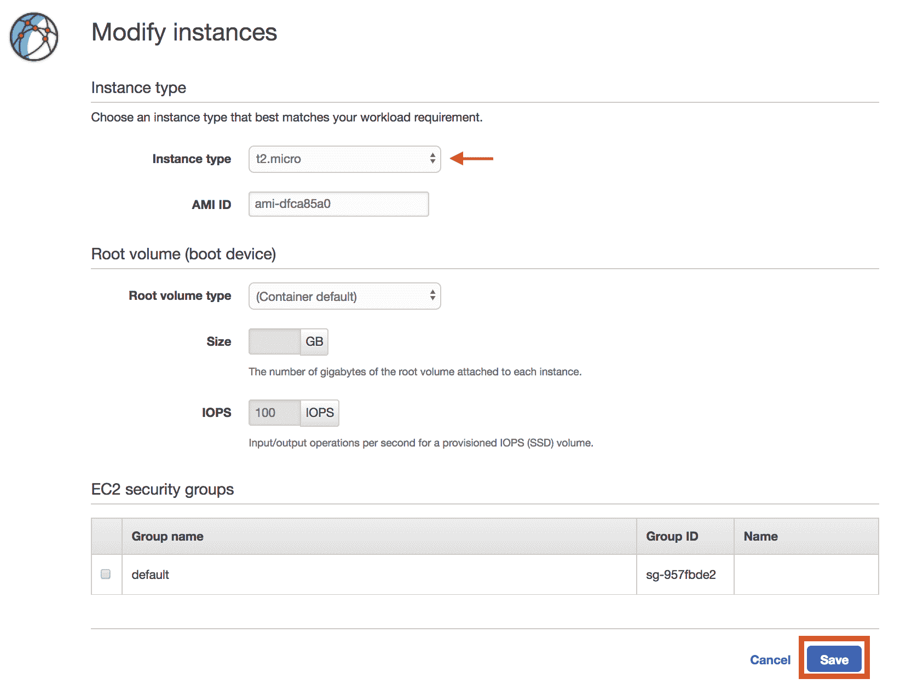
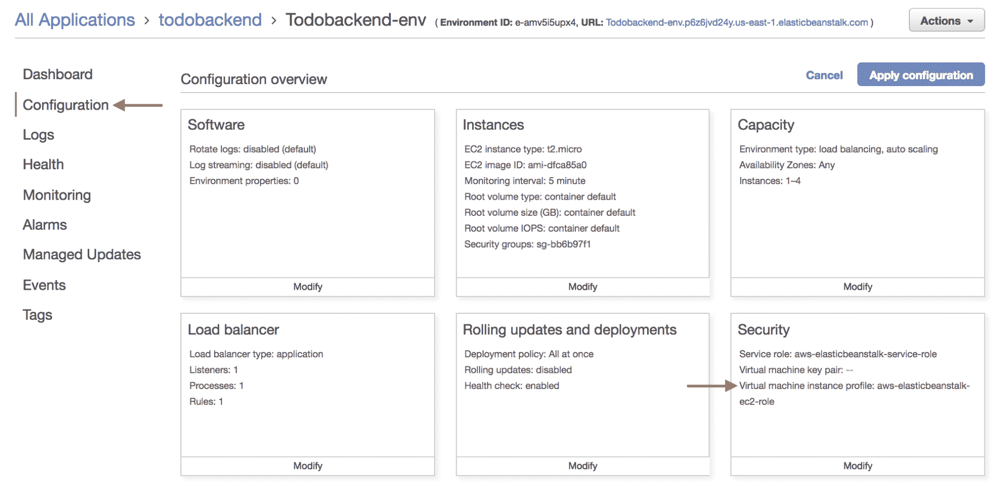
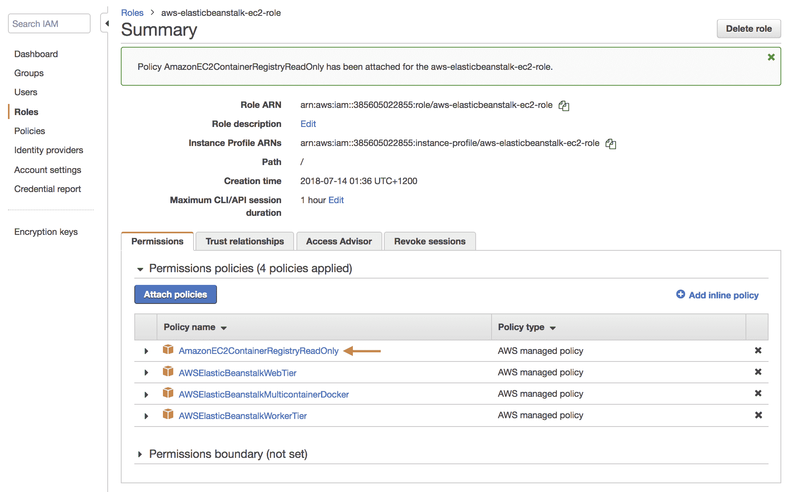
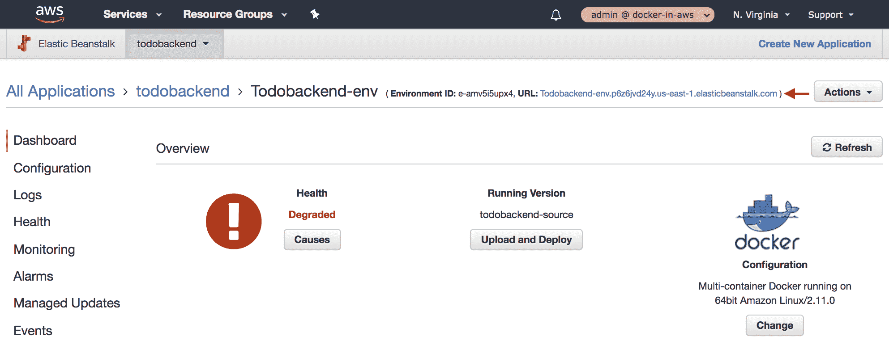
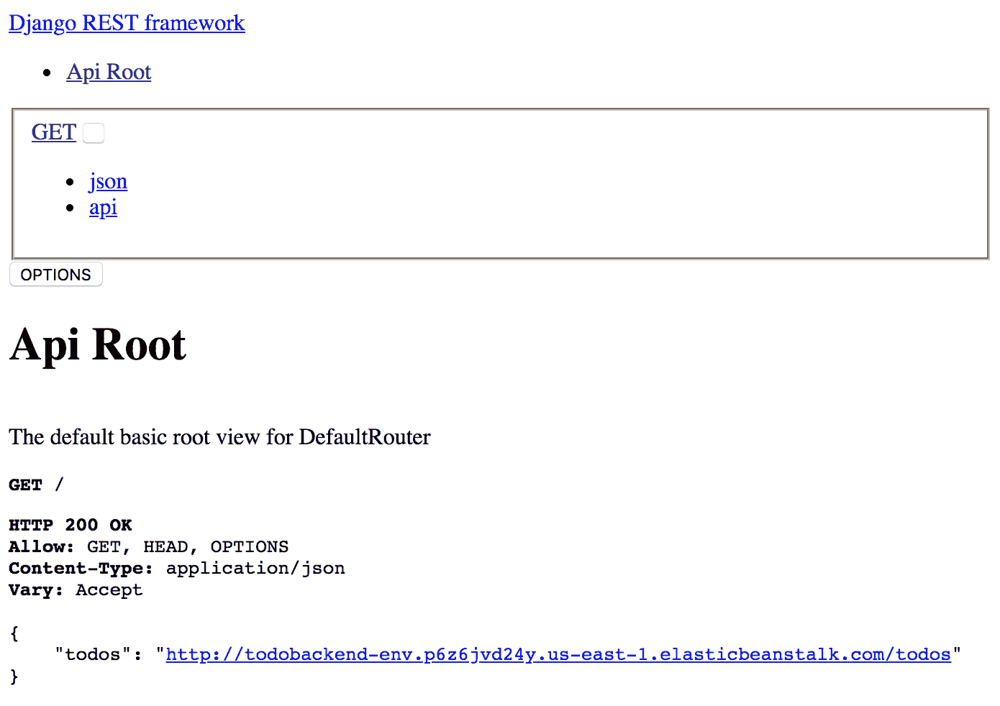
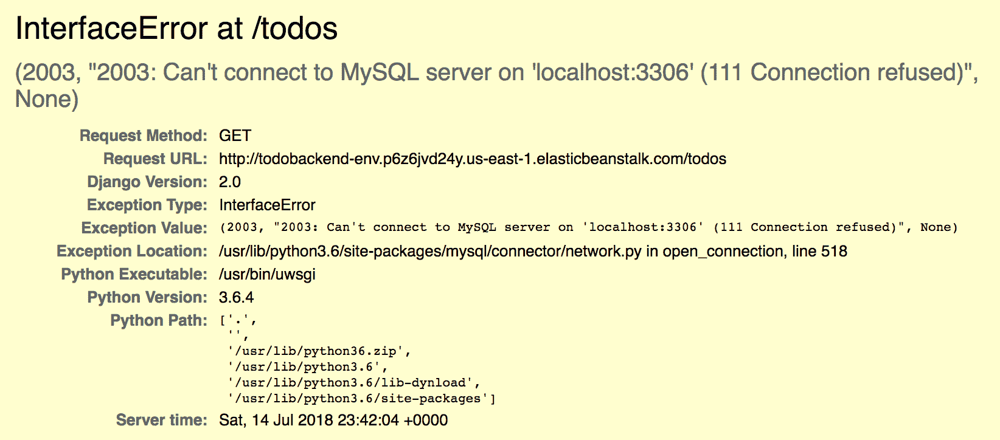

# 十五、弹性Beanstalk

到目前为止，在本书中，我们主要关注弹性容器服务(ECS)及其变体 AWS Fargate 的使用，以管理和部署 Docker 应用。这本书的其余部分将集中在替代技术上，您可以使用这些技术在 AWS 中运行您的 Docker 应用，我们将讨论的第一个是弹性Beanstalk。

Elastic Beanstalk 属于业界通常称为**平台即服务** ( **PaaS** )的一类，是一种旨在为您的应用提供托管运行时环境的服务，让您专注于开发、部署和操作您的应用，而不必担心周围的基础架构。为了加强这种范式，Elastic Beanstalk 专注于支持各种流行的编程语言，今天包括对 Node.js、PHP、Python、Ruby、Java、.NET 和 Go 应用。当您创建弹性Beanstalk应用时，您指定目标编程语言，弹性Beanstalk将部署一个支持您的编程语言和相关运行时和应用框架的环境。Elastic Beanstalk 还将部署负载平衡器和数据库等支持基础架构，更重要的是将配置您的环境，以便您可以轻松访问日志、监控信息和警报，确保您不仅可以部署应用，还可以监控它们，并确保它们以最佳状态启动和运行。

除了前面提到的编程语言之外，Elastic Beanstalk 还支持 Docker 环境，这意味着它可以支持任何可以在 Docker 容器中运行的应用，无论是编程语言还是应用运行时，在本章中，您将学习如何使用 Elastic Beanstalk 来管理和部署您的 Docker 应用。您将学习如何使用 AWS 控制台创建弹性Beanstalk应用，并创建一个环境，其中包括我们的应用所需的应用负载平衡器和 RDS 数据库实例。您将在初始设置中遇到一些问题，并学习如何使用 AWS 控制台和弹性Beanstalk命令行工具诊断和排除这些问题。

为了解决这些问题，您将配置一个名为 **ebextensions** 的功能，这是 Elastic Beanstalk 的高级配置功能，可用于将许多自定义配置方案应用到您的应用中。您将利用 ebextensions 来解决 Docker 卷的权限问题，将 Elastic Beanstalk 生成的默认环境变量转换为应用期望的格式，并最终确保单次部署任务(如执行数据库迁移)仅在每个应用部署的单个实例上运行。

This chapter is not intended to provide exhaustive coverage of Elastic Beanstalk and will only focus on core scenarios related to deploying and managing Docker applications.  For coverage of support for other programming languages and more advanced scenarios, refer to the [AWS Elastic Beanstalk Developer Guide](https://docs.aws.amazon.com/elasticbeanstalk/latest/dg/Welcome.html).

本章将涵盖以下主题:

*   弹性Beanstalk简介
*   使用 AWS 控制台创建弹性Beanstalk应用
*   使用弹性Beanstalk命令行界面管理弹性Beanstalk应用
*   定制弹性Beanstalk应用
*   部署和测试弹性Beanstalk应用

# 技术要求

以下是本章的技术要求:

*   对 AWS 帐户的管理员访问权限
*   按照第 1 章中的说明配置本地环境
*   根据第 3 章中的说明配置的本地 AWS 配置文件
*   Python 2.7 或 3.x
*   画中画包管理器
*   AWS CLI 版本 1.15.71 或更高版本
*   坞站 18.06 CE 或更高版本
*   Docker写作 1.22 或更高
*   GNU Make 3.82 或更高版本

本章假设您已经成功完成了本书到目前为止涵盖的所有配置任务

以下 GitHub URL 包含本章使用的代码示例:[https://GitHub . com/docker-in-AWS/docker-in-AWS/tree/master/ch14](https://github.com/docker-in-aws/docker-in-aws/tree/master/ch14)。

查看以下视频，了解《行动守则》:
[http://bit.ly/2MDhtj2](http://bit.ly/2MDhtj2)

# 弹性Beanstalk简介

正如本章介绍中所讨论的，Elastic Beanstalk 是 AWS 提供的 PaaS 产品，它允许您专注于应用代码和功能，而不用担心支持应用所需的周围基础架构。为此，弹性Beanstalk在方法上有些固执己见，通常以特定的方式工作。Elastic Beanstalk 确实尽可能地利用其他 AWS 服务，并试图从与这些服务的集成中获得努力和复杂性，如果您遵循 Elastic Beanstalk 期望您使用这些服务的方式，这将非常有效。如果你在一个中小型组织中管理一个小团队，弹性Beanstalk可以给桌子带来很多价值，提供很多开箱即用的功能。但是，一旦您的组织发展壮大，并且您希望优化和标准化您部署、监控和操作应用的方式，您可能会发现您已经超越了 Elastic Beanstalk 以应用为中心的方法。

例如，重要的是要理解弹性Beanstalk基于每个 EC2 实例的单个 ECS 任务定义的概念进行操作，因此如果您想要在共享基础架构上运行多个容器工作负载，弹性Beanstalk并不是您的正确选择。这同样适用于日志和操作工具——一般来说，弹性Beanstalk提供自己的工具链，非常专注于单个应用，而您的组织可能希望采用跨多个应用运行的标准工具集。就我个人而言，我更喜欢使用 ECS 提供的更灵活和可扩展的方法，但我必须承认，您基本上通过弹性Beanstalk免费获得的一些现成的操作和监控工具对启动和运行应用非常有吸引力，并且与其他 AWS 服务完全集成。

# 弹性Beanstalk概念

本章只专注于使用弹性Beanstalk运行 Docker 应用，因此不要期望对弹性Beanstalk及其所有支持的编程语言进行详尽的介绍。然而，理解基本概念是很重要的，在我们开始创建弹性Beanstalk应用之前，我现在将简要介绍一下这些概念。

使用弹性Beanstalk时，您可以创建*应用*，该应用可以定义一个或多个*环境*。以 todo back and 应用为例，您可以将 todo back and 应用定义为弹性Beanstalk应用，并创建一个名为 Dev 的环境和一个名为 Prod 的环境，以反映我们迄今为止部署的开发和生产环境。每个环境都引用应用的特定版本，其中包含应用的可部署代码。在 Docker 应用的情况下，源代码包括一个名为`Dockerrun.aws.json`的规范，该规范为您的应用定义了容器环境，该环境可能引用外部 Docker 映像或引用用于构建您的应用的本地 Docker 文件。

另一个需要理解的重要概念是，在幕后，Elastic Beanstalk 在常规的 EC2 实例上运行您的应用，并且遵循一个非常严格的范例，即每个 EC2 实例一个您的应用实例。每个弹性Beanstalk EC2 实例都基于您的目标应用运行一个特别精心策划的环境，例如，在多容器 Docker 应用的情况下，EC2 实例包括 Docker 引擎和 ECS 代理。在 Linux 服务器的情况下，弹性Beanstalk还允许您通过 SSH 访问和管理这些 EC2 实例(我们将在本章中使用)，尽管您通常应该出于故障排除的目的保留这种访问权限，并且永远不要尝试自己直接修改这些实例的配置。

# 创建弹性Beanstalk应用

现在您已经了解了弹性Beanstalk的基本概念，让我们将注意力转向创建一个新的弹性Beanstalk应用。您可以使用多种方法创建和配置弹性Beanstalk应用:

*   AWS 控制台
*   AWS 命令行界面和软件开发工具包
*   AWS 云阵
*   弹性Beanstalk

在本章中，我们将首先在 AWS 控制台中创建一个弹性Beanstalk应用，然后使用弹性Beanstalk命令行界面来管理、更新和细化该应用。

当您创建 Docker 应用时，一定要了解弹性Beanstalk支持两种 Docker 应用:

*   单容器应用:[https://docs . AWS . Amazon . com/elastic cbeanstalk/latest/DG/docker-single container-deploy . html](https://docs.aws.amazon.com/elasticbeanstalk/latest/dg/docker-singlecontainer-deploy.html)
*   多容器应用:[https://docs . AWS . Amazon . com/elastic cbeanstalk/latest/DG/create _ deploy _ docker _ ECS . html](https://docs.aws.amazon.com/elasticbeanstalk/latest/dg/create_deploy_docker_ecs.html)

对于我们的用例，我们将遵循与前几章中如何为 ECS 配置 todo back and 应用非常相似的方法，因此我们将需要一个多容器应用，因为我们之前在 ECS 任务定义中定义了一个名为**todo back and**的主应用容器定义和一个 **collectstatic** 容器定义(参见*使用 CloudFormation* 定义 ECS 任务定义一节中的*使用 ECS* 部署应用一章)。总的来说，我推荐多容器方法，不管您的应用是否是单容器应用，因为最初的单容器应用模型违背了 Docker 最佳实践，如果您的应用需求发生变化或增长，它会强制您从单个容器运行所有内容。

# 创建 Dockrrun . AWS . JSON 文件

无论您正在创建的 Docker 应用的类型如何，您都必须首先创建一个名为`Dockerrun.aws.json`的文件，该文件定义了组成您的应用的各种容器。该文件以 JSON 格式定义，并基于您在前面章节中配置的 ECS 任务定义格式，我们将使用该格式作为`Dockerrun.aws.json`文件中设置的基础。

让我们在`todobackend-aws`存储库中创建一个名为`eb`的文件夹，并定义一个名为`Dockerrun.aws.json`的新文件，如下所示:

```
{
  "AWSEBDockerrunVersion": 2,
  "volumes": [
    {
      "name": "public",
      "host": {"sourcePath": "/tmp/public"}
    }
  ],
  "containerDefinitions": [
    {
      "name": "todobackend",
      "image": "385605022855.dkr.ecr.us-east-1.amazonaws.com/docker-in-aws/todobackend",
      "essential": true,
      "memoryReservation": 395,
      "mountPoints": [
        {
          "sourceVolume": "public",
          "containerPath": "/public"
        }
      ],
      "environment": [
        {"name":"DJANGO_SETTINGS_MODULE","value":"todobackend.settings_release"}
      ],
      "command": [
        "uwsgi",
        "--http=0.0.0.0:8000",
        "--module=todobackend.wsgi",
        "--master",
        "--die-on-term",
        "--processes=4",
        "--threads=2",
        "--check-static=/public"
      ],
      "portMappings": [
        {
          "hostPort": 80,
          "containerPort": 8000
        }
      ]
    },
    {
      "name": "collectstatic",
      "image": "385605022855.dkr.ecr.us-east-1.amazonaws.com/docker-in-aws/todobackend",
      "essential": false,
      "memoryReservation": 5,
      "mountPoints": [
        {
          "sourceVolume": "public",
          "containerPath": "/public"
        }
      ],
      "environment": [
        {"name":"DJANGO_SETTINGS_MODULE","value":"todobackend.settings_release"}
      ],
      "command": [
        "python3",
        "manage.py",
        "collectstatic",
        "--no-input"
      ]
    }
  ]
}
```

定义多容器 Docker 应用时，必须指定并使用规范格式的版本 2，这是通过`AWSEBDockerrunVersion`属性配置的。如果您回头参考*一章中的*使用云信息*定义 ECS 任务定义，您可以看到`Dockerrun.aws.json`文件的版本 2 规范非常相似，尽管格式是 JSON，而不是我们在云信息模板中一直使用的 YAML 格式。我们使用 camel 用例命名来定义每个参数。*

该文件包括两个容器定义——一个用于主 todobackend 应用，一个用于生成静态内容——我们定义了一个名为`public`的卷，用于存储静态内容。我们还在主机上配置了从容器端口 8000 到端口 80 的静态端口映射，因为默认情况下，端口 80 是弹性Beanstalk希望您的网络应用监听的地方。

请注意，与我们用于 ECS 的方法有一些重要的区别:

*   **映像**:我们引用了同一个 ECR 映像，但是我们没有指定映像标签，这意味着将始终部署 Docker 映像的最新版本。`Dockerrun.aws.json`文件不支持参数或变量引用，因此如果您想要引用一个显式映像，您将需要一个连续的交付工作流来自动生成该文件作为构建过程的一部分。
*   **环境**:注意我们没有指定任何与数据库配置相关的环境变量，比如`MYSQL_HOST`或者`MYSQL_USER`。我们将在本章的后面讨论这种情况的原因，但是现在请理解，当您在弹性Beanstalk中使用对 RDS 的集成支持时，您的应用自动可用的环境变量遵循不同的格式，我们需要对其进行转换以满足我们应用的期望。

*   **日志**:我已经删除了 CloudWatch 日志配置来简化本章，但是没有理由不能在容器中包含 CloudWatch 日志配置。请注意，如果您确实使用了 CloudWatch 日志，您将需要修改 Elastic Beanstalk EC2 服务角色，以包括将日志写入 CloudWatch 日志的权限。我们将在本章后面看到一个这样的例子。

I have also removed the `XRAY_DAEMON_ADDRESS` environment variable to keep things simple, as you may no longer have the X-Ray daemon running in your environment.  Note that if you did want to support X-Ray, you would need to ensure the instance security group attached to your Elastic Beanstalk instances included security rules permitting network communications to the X-Ray daemon.

现在我们已经定义了一个`Dockerrun.aws.json`文件，我们需要创建一个包含这个文件的 ZIP 存档。弹性Beanstalk要求您的应用源以 ZIP 或 WAR 存档格式上传，因此有此要求。您可以使用`zip`实用程序从命令行执行此操作，如下所示:

```
todobackend-aws/eb> zip -9 -r app.zip . -x .DS_Store
adding: Dockerrun.aws.json (deflated 69%)
```

这将在`todobackend-aws/eb`文件夹中创建一个名为`app.zip`的归档文件，`-r`标志指定 zip 应该递归地添加任何可能存在的文件夹中的所有文件(这将在本章稍后介绍)。在指定`app.zip`的档案名称后，我们通过指定`.`而不是`*`来引用当前工作目录，因为使用`.`语法将包括任何隐藏的目录或文件(同样，这将是本章后面的情况)。

还要注意，在 macOS 环境中，您可以使用`-x`标志来排除`.DS_Store`目录元数据文件包含在您的归档中。

# 使用 AWS 控制台创建弹性Beanstalk应用

我们现在准备使用 AWS 控制台创建一个弹性Beanstalk应用。要开始，选择**服务** | **弹性Beanstalk**，然后点击**开始**按钮创建新应用。在**创建 web app** 画面中，指定 todobackend 的应用名称，配置**多容器 Docker** 的平台，最后使用**应用代码**设置的**上传代码**选项上传您之前创建的`app.zip`文件:


Creating an Elastic Beanstalk web application

接下来，点击**配置更多选项**按钮，将出现一个名为**配置 Todobackend-Env** 的屏幕，允许您自定义您的应用。请注意，默认情况下，弹性Beanstalk命名您的第一个应用环境`<application-name>-Env`，因此命名为 **Todobackend-Env** 。

在配置预置部分，选择**高可用性**选项，这将为您的配置添加负载平衡器:


Configuring an Elastic Beanstalk web application

如果查看当前设置，会注意到**实例**部分的 **EC2 实例类型**为 **t1.micro** ，**负载均衡器**部分的**负载均衡器类型**为**经典**，当前未配置**数据库**部分。我们先将 **EC2 实例类型**修改为自由层 **t2 .微**实例类型，方法是单击**实例**部分的**修改**链接，更改**实例类型**，然后单击**保存**:



Modifying EC2 instance type

接下来，通过单击**负载平衡器**部分的**修改**链接，然后切片**保存**，将**负载平衡器类型**更改为**应用负载平衡器**。请注意，默认设置期望将您在端口- `80`上的应用暴露给外部世界，如**应用负载平衡器**和**规则**部分中所定义的，并且您的容器将暴露在您的 EC2 实例上的端口 80 上，如**进程**部分中所定义的:


Modifying load balancer type

最后，我们需要通过单击**数据库**部分中的**修改**链接来定义应用的数据库配置。选择 **mysql** 作为**引擎**，指定一个合适的**用户名**和**密码**，最后将**保留**设置为**删除**，因为我们只是为了测试目的使用这个环境。其他设置的默认值已经足够，所以您可以在完成配置后点击**保存**按钮:


Configuring database settings

此时，您已经完成了应用的配置，可以点击**配置 Todobackend-env** 屏幕底部的**创建应用**按钮。弹性Beanstalk现在将开始创建您的应用，并在控制台中向您显示这方面的进展。

The Elastic Beanstalk application wizard creates a CloudFormation stack behind the scenes that includes all of the resources and configuration you specified.  It is also possible to create your own Elastic Beanstalk environments using CloudFormation without using the wizard.

一段时间后，应用的创建将完成，尽管您可以看到应用存在问题:


Initial application state

# 配置 EC2 实例配置文件

我们已经创建了一个新的弹性Beanstalk应用，但是由于几个错误，该应用的当前运行状况被记录为严重。

如果您选择左侧菜单上的**日志**选项，然后选择**请求日志** | **最后 100 行**，您将看到一个**下载**链接，允许您查看最近的日志活动:


Initial application state

浏览器中应该会打开一个单独的选项卡，显示各种弹性Beanstalk日志。在顶部，您应该会看到 ECS 代理日志，最近的错误应该表明 ECS 代理无法将映像从 ECR 拉入您的`Dockerrun.aws.json`规范:


Elastic Beanstalk ECS agent error

为了解决这个问题，我们需要配置与附加到我们的弹性Beanstalk实例的 EC2 实例配置文件相关联的 IAM 角色，以包括从 ECR 中提取映像的权限。通过从左侧菜单中选择**配置**并查看**安全**部分中的**虚拟机实例配置文件**设置，我们可以看到弹性Beanstalk正在使用哪个角色:



Viewing security configuration

您可以看到正在使用名为**AWS-elastic beanstalk-ec2-role**的 IAM 角色，因此如果您从导航栏中选择**服务** | **IAM** ，选择**角色**，然后定位 IAM 角色，您需要将`AmazonEC2ContainerRegistryReadOnly`策略附加到角色，如下所示:



Attaching the AmazonEC2ContainerRegistryReadOnly policy to the Elastic Beanstack EC2 instance role

此时，我们应该已经解决了之前导致应用无法启动的权限问题。现在，您需要配置弹性Beanstalk来尝试重新启动应用，您可以使用以下任何一种技术来完成:

*   上传新的应用源文件—这将触发新的应用部署。
*   重新启动应用服务器
*   重建环境

假设我们的应用源(在 Docker 应用的情况下是`Dockerrun.aws.json`文件)没有改变，破坏性最小且最快的选项是重启应用服务器，您可以通过选择**所有应用**|**todo backand**|**todo backand-env**配置屏幕右上角的 | **重启应用服务器**来完成。

几分钟后，您会注意到您的应用仍然有问题，如果您重复获取最新日志的过程，扫描这些日志会显示 **collectstatic** 容器由于权限错误而失败:


collectstatic permissions error

回想一下，在本书的前面，我们是如何在 ECS 容器实例上配置一个具有正确权限的文件夹来托管 **collectstatic** 容器写入的公共卷的？对于弹性Beanstalk，为 Docker 应用创建的默认 EC2 实例显然不是以这种方式配置的。

我们将很快解决这个问题，但现在重要的是要理解还有其他问题。要了解这些问题，您需要实际尝试访问该应用，您可以通过单击所有应用| todobackand | todobackand-env 配置屏幕顶部的 URL 链接来实现:



Obtaining the Elastic Beanstalk application URL

浏览此链接会立即显示静态内容文件未生成:



Missing static content

如果你点击 **todos** 链接查看当前的 Todo 项目列表，你会收到一个错误，表明应用无法连接到 MySQL 数据库:



Database connectivity error

问题是我们没有在`Dockerrun.aws.json`文件中添加任何数据库配置，因此我们的应用默认使用 localhost 来定位数据库。

# 使用命令行界面配置弹性Beanstalk应用

我们将很快解决应用中仍然存在的问题，但是为了解决这些问题，我们将使用弹性Beanstalk命令行界面继续配置我们的应用并解决这些问题。

在我们开始使用 Elastic Beanstalk CLI 之前，需要了解的是，在与我们在前面章节中介绍的所有控制台和 API 访问的多因素身份验证(MFA)要求进行交互时，此应用的当前版本确实存在一些挑战。如果您继续使用 MFA，您会注意到每次执行弹性Beanstalk命令行界面命令时都会提示您。

为了解决这个问题，我们可以通过首先将您的用户从`Users`组中移除来暂时移除 MFA 要求:

```
> aws iam remove-user-from-group --user-name justin.menga --group-name Users
```

接下来，在您的本地`~/.aws/config`文件内的`docker-in-aws`档案中注释掉`mfa_serial`行:

```
[profile docker-in-aws]
source_profile = docker-in-aws
role_arn = arn:aws:iam::385605022855:role/admin
role_session_name=justin.menga
region = us-east-1
# mfa_serial = arn:aws:iam::385605022855:mfa/justin.menga
```

请注意，这并不理想，在现实场景中，您可能没有能力也不想为给定用户暂时禁用 MFA。在考虑弹性Beanstalk时，请记住这一点，因为您通常会依赖弹性Beanstalk命令行界面进行许多操作。

现在暂时禁用了 MFA，可以安装 Elastic Beanstalk CLI，可以使用 Python `pip`包管理器来完成。安装后，可通过`eb`命令进行访问:

```
> pip3 install awsebcli --user
Collecting awsebcli
...
...
Installing collected packages: awsebcli
Successfully installed awsebcli-3.14.2
> eb --version
EB CLI 3.14.2 (Python 3.6.5)
```

下一步是在您之前创建的`todobackend/eb`文件夹中初始化命令行界面:

```
todobackend/eb> eb init --profile docker-in-aws

Select a default region
1) us-east-1 : US East (N. Virginia)
2) us-west-1 : US West (N. California)
3) us-west-2 : US West (Oregon)
4) eu-west-1 : EU (Ireland)
5) eu-central-1 : EU (Frankfurt)
6) ap-south-1 : Asia Pacific (Mumbai)
7) ap-southeast-1 : Asia Pacific (Singapore)
8) ap-southeast-2 : Asia Pacific (Sydney)
9) ap-northeast-1 : Asia Pacific (Tokyo)
10) ap-northeast-2 : Asia Pacific (Seoul)
11) sa-east-1 : South America (Sao Paulo)
12) cn-north-1 : China (Beijing)
13) cn-northwest-1 : China (Ningxia)
14) us-east-2 : US East (Ohio)
15) ca-central-1 : Canada (Central)
16) eu-west-2 : EU (London)
17) eu-west-3 : EU (Paris)
(default is 3): 1

Select an application to use
1) todobackend
2) [ Create new Application ]
(default is 2): 1
Cannot setup CodeCommit because there is no Source Control setup, continuing with initialization
```

`eb init`命令使用`--profile`标志指定本地 AWS 配置文件，然后提示您将要与之交互的区域。命令行界面然后检查是否有任何现有的弹性Beanstalk应用，并提示您是要管理现有的应用还是创建新的应用。做出选择后，命令行界面会将项目信息添加到名为`.elasticbeanstalk`的文件夹下的当前文件夹中，还会创建或追加到`.gitignore`文件中。鉴于我们的`eb`文件夹是**至**存储库的子目录，最好将`.gitignore`文件的内容附加到**至**存储库的根目录:

```
todobackend-aws/eb> cat .gitignore >> ../.gitignore todobackend-aws/eb> rm .gitignore 
```

现在，您可以使用 CLI 查看应用的当前状态，列出应用环境，并执行许多其他管理任务:

```
> eb status
Environment details for: Todobackend-env
  Application name: todobackend
  Region: us-east-1
  Deployed Version: todobackend-source
  Environment ID: e-amv5i5upx4
  Platform: arn:aws:elasticbeanstalk:us-east-1::platform/multicontainer Docker running on 64bit Amazon Linux/2.11.0
  Tier: WebServer-Standard-1.0
  CNAME: Todobackend-env.p6z6jvd24y.us-east-1.elasticbeanstalk.com
  Updated: 2018-07-14 23:23:28.931000+00:00
  Status: Ready
  Health: Red
> eb list
* Todobackend-env
> eb open
> eb logs 
Retrieving logs...
============= i-0f636f261736facea ==============
-------------------------------------
/var/log/ecs/ecs-init.log
-------------------------------------
2018-07-14T22:41:24Z [INFO] pre-start
2018-07-14T22:41:25Z [INFO] start
2018-07-14T22:41:25Z [INFO] No existing agent container to remove.
2018-07-14T22:41:25Z [INFO] Starting Amazon Elastic Container Service Agent

-------------------------------------
/var/log/eb-ecs-mgr.log
-------------------------------------
2018-07-14T23:20:37Z "cpu": "0",
2018-07-14T23:20:37Z "containers": [
...
...
```

请注意，`eb status`命令在`CNAME`属性中列出了您的应用的网址，请注意这个网址，因为您将需要它来测试您的应用。您也可以使用`eb open`命令访问您的应用，这将在您的默认浏览器中打开应用的网址。

# 管理弹性Beanstalk EC2 实例

使用弹性Beanstalk时，能够访问弹性Beanstalk EC2 实例非常有用，尤其是如果您需要进行一些故障排除。

命令行界面包括建立到弹性Beanstalk EC2 实例的 SSH 连接的能力，您可以通过运行`eb ssh --setup`命令来设置:

```
> eb ssh --setup
WARNING: You are about to setup SSH for environment "Todobackend-env". If you continue, your existing instances will have to be **terminated** and new instances will be created. The environment will be temporarily unavailable.
To confirm, type the environment name: Todobackend-env

Select a keypair.
1) admin
2) [ Create new KeyPair ]
(default is 1): 1
Printing Status:
Printing Status:
INFO: Environment update is starting.
INFO: Updating environment Todobackend-env's configuration settings.
INFO: Created Auto Scaling launch configuration named: awseb-e-amv5i5upx4-stack-AWSEBAutoScalingLaunchConfiguration-8QN6BJJX43H
INFO: Deleted Auto Scaling launch configuration named: awseb-e-amv5i5upx4-stack-AWSEBAutoScalingLaunchConfiguration-JR6N80L37H2G
INFO: Successfully deployed new configuration to environment.
```

请注意，设置 SSH 访问要求您终止现有实例并创建新实例，因为您只能在创建时将 SSH 密钥对与 EC2 实例相关联。选择您在本书前面创建的现有`admin`密钥对后，命令行界面将终止现有实例，创建一个新的启用 SSH 访问的自动扩展启动配置，然后启动新实例。

You can avoid this step by configuring an EC2 key pair in the Security section of the configuration wizard when creating the Elastic Beanstalk application.

现在，您可以通过 SSH 进入您的弹性Beanstalk EC2 实例，如下所示:

```
> eb ssh -e "ssh -i ~/.ssh/admin.pem"
INFO: Attempting to open port 22.
INFO: SSH port 22 open.
INFO: Running ssh -i ~/.ssh/admin.pem ec2-user@34.239.245.78
The authenticity of host '34.239.245.78 (34.239.245.78)' can't be established.
ECDSA key fingerprint is SHA256:93m8hag/EtCPb5i7YrYHUXFPloaN0yUHMVFFnbMlcLE.
Are you sure you want to continue connecting (yes/no)? yes
Warning: Permanently added '34.239.245.78' (ECDSA) to the list of known hosts.
 _____ _ _ _ ____ _ _ _
| ____| | __ _ ___| |_(_) ___| __ ) ___ __ _ _ __ ___| |_ __ _| | | __
| _| | |/ _` / __| __| |/ __| _ \ / _ \/ _` | '_ \/ __| __/ _` | | |/ /
| |___| | (_| \__ \ |_| | (__| |_) | __/ (_| | | | \__ \ || (_| | | <
|_____|_|\__,_|___/\__|_|\___|____/ \___|\__,_|_| |_|___/\__\__,_|_|_|\_\
 Amazon Linux AMI

This EC2 instance is managed by AWS Elastic Beanstalk. Changes made via SSH
WILL BE LOST if the instance is replaced by auto-scaling. For more information
on customizing your Elastic Beanstalk environment, see our documentation here:
http://docs.aws.amazon.com/elasticbeanstalk/latest/dg/customize-containers-ec2.html
```

默认情况下，`eb ssh`命令将尝试使用名为`~/.ssh/<ec2-keypair-name>.pem`的 SSH 私钥，在本例中为`~/.ssh/admin.pem`。如果您的 SSH 私钥在不同的位置，您可以使用`-e`标志来覆盖所使用的文件，如前面的示例所示。

现在，您可以看看您的弹性Beanstalk EC2 实例。假设我们正在运行一个 Docker 应用，您可能首先倾向于运行`docker ps`命令来查看当前正在运行的容器:

```
[ec2-user@ip-172-31-20-192 ~]$ docker ps
Got permission denied while trying to connect to the Docker daemon socket at unix:///var/run/docker.sock: Get http://%2Fvar%2Frun%2Fdocker.sock/v1.37/containers/json: dial unix /var/run/docker.sock: connect: permission denied
```

有点令人惊讶的是，标准的`ec2-user`不能访问 Docker——为了解决这个问题，我们需要添加更高级的配置，称为 **ebextensions** 。

# 定制弹性Beanstalk应用

如前一节所述，我们需要添加一个 ebextension，它只是一个配置文件，可以用来将您的弹性Beanstalk环境定制到我们现有的弹性Beanstalk应用中。这是一个需要理解的重要概念，因为我们最终将使用相同的方法来解决我们的应用当前存在的所有问题。

要配置`ebextensions`，首先需要在当前存储`Dockerrun.aws.json`文件的`eb`文件夹中创建一个名为`.ebextensions`的文件夹(注意，您需要断开 SSH 会话，转到您的弹性Beanstalk EC2 实例，并在您的本地环境中执行此操作):

```
todobackend/eb> mkdir .ebextensions todobackend/eb> touch .ebextensions/init.config
```

在应用部署期间，`.ebextensions`文件夹中扩展名为`.config`的每个文件将被视为 ebextension，并由 Elastic Beanstalk 处理。在前面的例子中，我们创建了一个名为`init.config`的文件，现在我们可以对其进行配置以允许`ec2-user`访问 Docker 引擎:

```
commands:
  01_add_ec2_user_to_docker_group:
    command: usermod -aG docker ec2-user
    ignoreErrors: true
```

我们向`commands`键添加了一个名为`01_add_ec2_user_to_docker_group`的命令指令，它是一个顶级属性，定义了在应用的最新版本被设置和部署到实例之前应该运行的命令。该命令运行`usermod`命令，以确保`ec2-user`是`docker`组的成员，该组将授予`ec2-user`对Docker引擎的访问权限。请注意，您可以使用`ignoreErrors`属性来确保忽略任何命令失败。

有了这个配置，我们可以通过在`eb`文件夹中运行`eb deploy`命令来部署我们应用的新版本，这将自动为我们现有的`Dockerrun.aws.json`和新的`.ebextensions/init.config`文件创建一个 ZIP 存档:

```
todobackend-aws/eb> rm app.zip
todobackend-aws/eb> eb deploy
Uploading todobackend/app-180715_195517.zip to S3\. This may take a while.
Upload Complete.
INFO: Environment update is starting.
INFO: Deploying new version to instance(s).
INFO: Stopping ECS task arn:aws:ecs:us-east-1:385605022855:task/dd2a2379-1b2c-4398-9f44-b7c25d338c67.
INFO: ECS task: arn:aws:ecs:us-east-1:385605022855:task/dd2a2379-1b2c-4398-9f44-b7c25d338c67 is STOPPED.
INFO: Starting new ECS task with awseb-Todobackend-env-amv5i5upx4:3.
INFO: ECS task: arn:aws:ecs:us-east-1:385605022855:task/d9fa5a87-1329-401a-ba26-eb18957f5070 is RUNNING.
INFO: New application version was deployed to running EC2 instances.
INFO: Environment update completed successfully.
```

我们首先删除您第一次创建弹性Beanstalk应用时创建的初始`app.zip`档案，因为`eb deploy`命令会自动处理这个问题。您可以看到，一旦上传了新配置，部署过程就包括停止和启动运行我们应用的 ECS 任务。

一旦部署完成，如果您建立到弹性Beanstalk EC2 实例的新 SSH 会话，您应该会看到您现在能够运行`docker`命令:

```
[ec2-user@ip-172-31-20-192 ~]$ docker ps --format "{{.ID}}: {{.Image}}"
63183a7d3e67: 385605022855.dkr.ecr.us-east-1.amazonaws.com/docker-in-aws/todobackend
45bf3329a686: amazon/amazon-ecs-agent:latest
```

您可以看到该实例当前正在运行 todobackend 容器，并且还运行了 ECS 代理。这表明弹性Beanstalk中的 Docker 支持在后台使用 ECS 来管理和部署基于容器的应用。

# 解决 Docker 卷权限问题

在本章的前面，我们遇到了 collectstatic 容器无法写入公共卷的问题。这里的问题是，运行在弹性Beanstalk EC2 实例上的 ECS 代理创建了一个*绑定*挂载，这些挂载总是用根权限创建的。这阻止了我们的 collectstatic 容器运行的应用用户写入公共卷，因此我们需要一些方法来解决这个问题。

正如我们已经看到的那样，`ebextensions`功能可以在 Elastic Beanstalk EC2 实例上运行命令，我们将再次利用该功能来确保公共卷被配置为允许我们容器中的`app`用户读写`.ebextensions/init.config`文件:

```
commands:
  01_add_ec2_user_to_docker_group:
    command: usermod -aG docker ec2-user
    ignoreErrors: true
 02_docker_volumes:
 command: |
 mkdir -p /tmp/public
 chown -R 1000:1000 /tmp/public
```

我们添加了一个名为`02_docker_volumes`的新命令指令，它将在`01_add_ec2_user_to_docker_group`命令之后执行。请注意，您可以使用 YAML 管道操作符(`|`)来指定多行命令字符串，从而允许您指定多个要运行的命令。我们首先在`Dockerrun.aws.json`文件中创建公共卷宿主`sourcePath`属性引用的`/tmp/public`文件夹，然后确保`1000:1000`的用户 ID/组 ID 值拥有该文件夹。因为应用用户的用户标识为 1000，组标识为 1000，这将使以该用户身份运行的任何进程能够写入公共卷和从公共卷读取。

此时，您可以使用`eb deploy`命令将新的应用配置上传到弹性Beanstalk(参见前面的示例)。部署完成后，您可以通过运行`eb open`命令浏览到您的应用的网址，现在您应该可以看到 todobackend 应用的静态内容和格式是正确的。

# 配置数据库设置

我们已经解决了访问公共卷的问题，但是应用仍然无法工作，因为我们没有传入任何环境变量来配置数据库设置。这样做的原因是，当您在弹性Beanstalk中配置数据库时，所有数据库设置都可以通过以下环境变量获得:

*   `RDS_HOSTNAME`
*   `RDS_USERNAME`
*   `RDS_PASSWORD`
*   `RDS_DB_NAME`
*   `RDS_PORT`

todobackend 应用的问题是，它需要以 MYSQL 为前缀的数据库相关设置，例如，`MYSQL_HOST`用于配置数据库主机名。虽然我们可以更新我们的应用以使用 RDS 前缀的环境变量，但我们可能希望将我们的应用部署到其他云提供商，RDS 是一种特定于 AWS 的技术。

另一种方法(尽管更复杂)是将环境变量映射写入弹性 Beanstalk 实例上的一个文件，将其配置为 todobackend 应用容器可以访问的卷，然后修改我们的 Docker 映像，以便在容器启动时注入这些映射。这要求我们修改位于`todobackend`存储库根目录下的`entrypoint.sh`文件中的 todobackend 应用的入口点脚本:

```
#!/bin/bash
set -e -o pipefail

# Inject AWS Secrets Manager Secrets
# Read space delimited list of secret names from SECRETS environment variable
echo "Processing secrets [${SECRETS}]..."
read -r -a secrets <<< "$SECRETS"
for secret in "${secrets[@]}"
do
  vars=$(aws secretsmanager get-secret-value --secret-id $secret \
    --query SecretString --output text \
    | jq -r 'to_entries[] | "export \(.key)='\''\(.value)'\''"')
  eval $vars
done

# Inject runtime environment variables
if [ -f /init/environment ]
then
 echo "Processing environment variables from /init/environment..."
 export $(cat /init/environment | xargs)
fi

# Run application
exec "$@"
```

在前面的例子中，我们添加了一个新的测试表达式，使用语法`[ -f /init/environment ]`检查名为`/init/environment`的文件的存在。如果找到该文件，我们假设该文件包含一个或多个格式为`<environment variable>=<value>`的环境变量设置，例如:

```
MYSQL_HOST=abc.xyz.com
MYSQL_USERNAME=todobackend
...
...
```

使用前面的格式，我们使用`export $(cat /init/environment | xargs)`命令，该命令使用前面的示例扩展到`export MYSQL_HOST=abc.xyz.com MYSQL_USERNAME=todobackend ... ...`，确保在`/init/environment`文件中定义的每个环境变量都被导出到环境中。

如果您现在将更改提交到`todobackend`存储库并运行`make login`、`make test`、`make release`和`make publish`命令，最新的`todobackend` Docker 映像现在将包含更新的入口点脚本。现在，我们需要修改`todobackend-aws/eb`文件夹中的`Dockerrun.aws.json`文件，以定义一个名为`init`的新卷和挂载:

```
{
  "AWSEBDockerrunVersion": 2,
  "volumes": [
    {
      "name": "public",
      "host": {"sourcePath": "/tmp/public"}
    },
 {
 "name": "init",
 "host": {"sourcePath": "/tmp/init"}
 }
  ],
  "containerDefinitions": [
    {
      "name": "todobackend",
      "image": "385605022855.dkr.ecr.us-east-1.amazonaws.com/docker-in-aws/todobackend",
      "essential": true,
      "memoryReservation": 395,
      "mountPoints": [
        {
          "sourceVolume": "public",
          "containerPath": "/public"
        },
{
 "sourceVolume": "init",
 "containerPath": "/init"
 }
      ],
      "environment": [
{"name":"DJANGO_SETTINGS_MODULE","value":"todobackend.settings_release"}
      ],
   ...
   ...
```

将这个卷映射到 Elastic Beanstalk EC2 实例上的`/tmp/init`和`todobackend`容器中的`/init`，我们现在需要做的就是将环境变量设置写入 EC2 实例上的`/tmp/init/environment`，它将在`todobackend`容器中显示为`/init/environment`，并使用我们对入口点脚本所做的修改来触发文件的处理。这里的想法是，我们将把 Elastic Beanstalk RDS 实例设置写入 todobackend 应用期望的适当环境变量设置。

在我们做到这一点之前，我们需要一种机制来获得 RDS 设置——幸运的是，在每个 Elastic Beanstalk 实例上都有一个名为`/opt/elasticbeanstalk/deploy/configuration/containerconfiguration`的文件，它以 JSON 文件格式包含了整个环境和应用配置。

如果您 SSH 到一个实例中，您可以使用`jq`实用程序(它已经预安装在弹性Beanstalk实例上)来提取弹性Beanstalk应用的无线电数据系统实例设置:

```
> sudo jq '.plugins.rds.env' -r \ 
 /opt/elasticbeanstalk/deploy/configuration/containerconfiguration
{
  "RDS_PORT": "3306",
  "RDS_HOSTNAME": "aa2axvguqnh17c.cz8cu8hmqtu1.us-east-1.rds.amazonaws.com",
  "RDS_USERNAME": "todobackend",
  "RDS_DB_NAME": "ebdb",
  "RDS_PASSWORD": "some-super-secret"
}
```

通过这种提取无线电数据系统设置的机制，我们现在可以修改`.ebextensions/init.config`文件，将这些设置写入`/tmp/init/environment`文件，该文件将通过位于`/init/environment`的`init`卷暴露给`todobackend`容器:

```
commands:
  01_add_ec2_user_to_docker_group:
    command: usermod -aG docker ec2-user
    ignoreErrors: true
  02_docker_volumes:
    command: |
      mkdir -p /tmp/public
 mkdir -p /tmp/init
      chown -R 1000:1000 /tmp/public
 chown -R 1000:1000 /tmp/init

container_commands:
 01_rds_settings:
 command: |
 config=/opt/elasticbeanstalk/deploy/configuration/containerconfiguration
 environment=/tmp/init/environment
 echo "MYSQL_HOST=$(jq '.plugins.rds.env.RDS_HOSTNAME' -r $config)" >> $environment
 echo "MYSQL_USER=$(jq '.plugins.rds.env.RDS_USERNAME' -r $config)" >> $environment
 echo "MYSQL_PASSWORD=$(jq '.plugins.rds.env.RDS_PASSWORD' -r $config)" >> $environment
 echo "MYSQL_DATABASE=$(jq '.plugins.rds.env.RDS_DB_NAME' -r $config)" >> $environment
 chown -R 1000:1000 $environment
```

我们首先修改`02_docker_volumes`指令，创建初始化卷映射到的`/tmp/init`路径，并确保运行在 todobackend 应用中的应用用户对此文件夹具有读/写权限。接下来，我们添加`container_commands`键，该键指定在应用配置后但在应用启动前*应执行的命令*。注意，不同于`commands`键，它在应用应用配置之前执行命令*。***

*The naming of the `container_commands` key is somewhat confusing in that it implies commands will be run inside a Docker container. This is actually not the case and the `container_commands` key is completely unrelated to containers in the Docker sense.

`01_rds_settings`命令写入应用所需的各种带 MYSQL 前缀的环境变量设置，通过执行`jq`命令为每个变量获取适当的值，正如我们前面演示的那样。因为该文件是由根用户创建的，所以我们最终确保`app`用户对`/tmp/init/environment`文件具有读/写访问权限，该文件将通过 init 卷在容器中显示为`/init/environment`。

如果您现在使用`eb deploy`命令部署您的更改，一旦部署完成并且您导航到 todobackend 应用 URL，如果您试图列出 Todos 项目(通过访问`/todos`，注意现在显示一个新的错误:


Accessing todobackend Todos items error

回想一下，当您以前访问同一个网址时，todobackend 应用试图使用 localhost 访问 MySQL，但是现在我们得到一个错误，表明在`ebdb`数据库中找不到`todo_todoitem`表。这确认了应用现在正在与 RDS 实例通信，但是因为我们没有运行数据库迁移，所以支持应用的模式和表不存在。

# 运行数据库迁移

为了解决应用当前的问题，我们需要一种机制，允许我们运行数据库迁移来创建所需的数据库模式和表。这也必须在每次应用更新时发生，但是这应该只在每次应用更新时发生一次*。例如，如果您有多个弹性Beanstalk实例，您不希望迁移在每个实例上运行。相反，您希望每个部署只运行一次迁移。*

 *上一节介绍的`container_commands`键包含一个名为`leader_only`的有用属性，它将弹性Beanstalk配置为仅在引线实例上运行指定的命令。这是第一个可供部署的实例。因此，我们可以向`todobackend-aws/eb`文件夹中的`.ebextensions/init.config`文件添加一个新指令，该指令将在每个应用部署中只运行一次迁移:

```
commands:
  01_add_ec2_user_to_docker_group:
    command: usermod -aG docker ec2-user
    ignoreErrors: true
  02_docker_volumes:
    command: |
      mkdir -p /tmp/public
      mkdir -p /tmp/init
      chown -R 1000:1000 /tmp/public
      chown -R 1000:1000 /tmp/init

container_commands:
  01_rds_settings:
    command: |
      config=/opt/elasticbeanstalk/deploy/configuration/containerconfiguration
      environment=/tmp/init/environment
      echo "MYSQL_HOST=$(jq '.plugins.rds.env.RDS_HOSTNAME' -r $config)" >> $environment
      echo "MYSQL_USER=$(jq '.plugins.rds.env.RDS_USERNAME' -r $config)" >> $environment
      echo "MYSQL_PASSWORD=$(jq '.plugins.rds.env.RDS_PASSWORD' -r $config)" >> $environment
      echo "MYSQL_DATABASE=$(jq '.plugins.rds.env.RDS_DB_NAME' -r $config)" >> $environment
      chown -R 1000:1000 $environment
  02_migrate:
 command: |
 echo "python3 manage.py migrate --no-input" >> /tmp/init/commands
 chown -R 1000:1000 /tmp/init/commands
 leader_only: true
```

这里，我们将`python3 manage.py migrate --no-input`命令写入`/tmp/init/commands`文件，该文件将暴露给位于`/init/commands`位置的应用容器。当然，这要求我们现在修改`todobackend`存储库中的入口点脚本，以查找这样的文件并执行其中包含的命令，如下所示:

```
#!/bin/bash
set -e -o pipefail

# Inject AWS Secrets Manager Secrets
# Read space delimited list of secret names from SECRETS environment variable
echo "Processing secrets [${SECRETS}]..."
read -r -a secrets <<< "$SECRETS"
for secret in "${secrets[@]}"
do
  vars=$(aws secretsmanager get-secret-value --secret-id $secret \
    --query SecretString --output text \
    | jq -r 'to_entries[] | "export \(.key)='\''\(.value)'\''"')
  eval $vars
done

# Inject runtime environment variables
if [ -f /init/environment ]
then
  echo "Processing environment variables from /init/environment..."
  export $(cat /init/environment | xargs)
fi # Inject runtime init commands
if [ -f /init/commands ]
then
  echo "Processing commands from /init/commands..."
  source /init/commands
fi

# Run application
exec "$@"
```

在这里，我们添加一个新的测试表达式来检查`/init/commands`文件的存在，如果这个文件存在，我们使用`source`命令来执行文件中包含的每个命令。因为该文件将只写在 leader Elastic Beanstalk 实例上，所以入口点脚本每次部署只调用这些命令一次。

此时，您需要通过运行`make login`、`make test`、`make release`和`make publish`命令来重建 todobackend Docker 映像，之后您可以通过从`todobackend-aws/eb`目录运行`eb deploy`命令来部署您的弹性Beanstalk更改。一旦成功完成，如果您 SSH 到您的 Elastic Beanstalk 实例并查看当前活动的 todobackend 应用容器的日志，您应该会看到数据库迁移是在容器启动时执行的:

```
> docker ps --format "{{.ID}}: {{.Image}}"
45b8cdac0c92: 385605022855.dkr.ecr.us-east-1.amazonaws.com/docker-in-aws/todobackend
45bf3329a686: amazon/amazon-ecs-agent:latest
> docker logs 45b8cdac0c92
Processing secrets []...
Processing environment variables from /init/environment...
Processing commands from /init/commands...
Operations to perform:
  Apply all migrations: admin, auth, contenttypes, sessions, todo
Running migrations:
  Applying contenttypes.0001_initial... OK
  Applying auth.0001_initial... OK
  Applying admin.0001_initial... OK
  Applying admin.0002_logentry_remove_auto_add... OK
  Applying contenttypes.0002_remove_content_type_name... OK
  Applying auth.0002_alter_permission_name_max_length... OK
  Applying auth.0003_alter_user_email_max_length... OK
  Applying auth.0004_alter_user_username_opts... OK
  Applying auth.0005_alter_user_last_login_null... OK
  Applying auth.0006_require_contenttypes_0002... OK
  Applying auth.0007_alter_validators_add_error_messages... OK
  Applying auth.0008_alter_user_username_max_length... OK
  Applying auth.0009_alter_user_last_name_max_length... OK
  Applying sessions.0001_initial... OK
  Applying todo.0001_initial... OK
[uwsgi-static] added check for /public
*** Starting uWSGI 2.0.17 (64bit) on [Sun Jul 15 11:18:06 2018] ***
```

如果您现在浏览到应用的网址，您应该会发现该应用功能齐全，并且您已经成功地将 Docker 应用部署到了 Elastic Beanstalk。

在我们结束本章之前，您应该通过将您的用户帐户添加回`Users`组来恢复您在本章前面暂时禁用的 MFA 配置:

```
> aws iam add-user-to-group --user-name justin.menga --group-name Users
```

然后重新启用本地`~/.aws/config`文件中`docker-in-aws`配置文件内的`mfa_serial`行:

```
[profile docker-in-aws]
source_profile = docker-in-aws
role_arn = arn:aws:iam::385605022855:role/admin
role_session_name=justin.menga
region = us-east-1
mfa_serial = arn:aws:iam::385605022855:mfa/justin.menga 
```

您也可以通过浏览到弹性Beanstalk主仪表板并单击**旁边的**操作|删除**应用按钮来删除弹性Beanstalk环境，以打开**应用。这将删除弹性Beanstalk环境创建的云信息栈，其中包括应用负载平衡器、无线电数据系统数据库实例和 EC2 实例。

# 摘要

在本章中，您学习了如何使用弹性Beanstalk部署多容器 Docker 应用。您了解了为什么以及何时会选择 Elastic Beanstalk 而不是 ECS 等其他替代容器管理服务，这里的一般结论是，Elastic Beanstalk 非常适合应用数量较少的小型组织，但随着您的组织开始发展并需要开始专注于提供共享容器平台以降低成本、复杂性和管理开销，它变得不再那么有用。

您使用 AWS 控制台创建了一个弹性Beanstalk应用，这需要您定义一个名为`Dockerrun.aws.json`的文件，该文件包含运行应用所需的容器定义和卷，然后以最小的配置自动部署应用负载平衡器和 RDS 数据库实例。让您的应用启动并运行到全功能状态更具挑战性，需要您定义名为`ebextensions`的高级配置文件，允许您调整弹性Beanstalk以满足您的应用的特定需求。您学习了如何安装和设置弹性Beanstalk命令行界面，如何使用 SSH 连接到弹性Beanstalk实例，以及如何将配置更改部署到您的`Dockerrun.aws.json`文件和`ebextensions`文件。这允许您在弹性 Beanstalk 实例上为作为非根用户运行的容器应用设置具有正确权限的卷，并引入了一个特殊的 init 卷，您可以在其中注入环境变量设置和应该在容器启动时执行的命令。

在下一章中，我们将了解 Docker Swarm，以及如何在 AWS 上部署 Docker Swarm 集群来部署和运行您的 Docker 应用。

# 问题

1.  对/错:弹性Beanstalk只支持单容器 Docker 应用。
2.  使用弹性Beanstalk创建 Docker 应用所需的最低工件是什么？
3.  对/错:`.ebextensions`文件夹存储 YAML 文件，允许你定制你的弹性Beanstalk实例。
4.  您创建了一个新的弹性Beanstalk服务，该服务部署了一个 Docker 应用，其 Docker 映像存储在 ECR 中。在最初的创作中。应用失败，弹性Beanstalk日志显示一个错误，包括“CannotPullECRContainerError”字样。您将如何解决这个问题？
5.  真/假:开箱即用，无需任何额外配置，在弹性Beanstalk环境中作为非根用户运行的 Docker 容器可以读写 Docker 卷。
6.  真/假:您可以在`commands`键中将`leader_only`属性设置为真，以便仅在一个弹性Beanstalk实例上运行命令。
7.  对/错:`eb connect`命令用于建立对弹性Beanstalk实例的 SSH 访问。
8.  对/错:弹性Beanstalk支持应用负载平衡器与您的应用集成。

# 进一步阅读

有关本章所涵盖主题的更多信息，您可以查看以下链接:

*   Elastic Beanstalk 开发者指南:[https://docs . AWS . Amazon . com/elastic Beanstalk/latest/DG/welcome . html](https://docs.aws.amazon.com/elasticbeanstalk/latest/dg/Welcome.html)
*   多容器 Docker 环境:[https://docs . AWS . Amazon . com/elastic cbeanstalk/latest/DG/create _ deploy _ Docker _ ECS . html](https://docs.aws.amazon.com/elasticbeanstalk/latest/dg/create_deploy_docker_ecs.html)
*   将 Elastic Beanstalk 与其他 AWS 服务结合使用:[https://docs . AWS . Amazon . com/Elastic Beanstalk/latest/DG/awshowto . html](https://docs.aws.amazon.com/elasticbeanstalk/latest/dg/AWSHowTo.html)
*   带配置文件的高级环境配置:[https://docs . AWS . Amazon . com/elastic beanstalk/latest/DG/ebextensions . html](https://docs.aws.amazon.com/elasticbeanstalk/latest/dg/ebextensions.html)
*   弹性Beanstalk命令行界面:[https://docs . AWS . Amazon . com/Elastic Beanstalk/latest/DG/EB-cli3 . html](https://docs.aws.amazon.com/elasticbeanstalk/latest/dg/eb-cli3.html)**