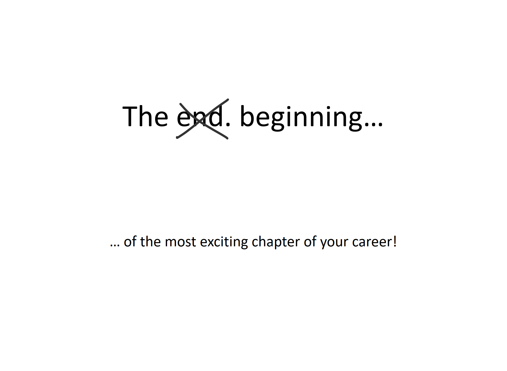

## 16:接下来呢

希望你对 Docker 充满信心，并准备好采取下一步行动。幸运的是，采取这些后续步骤从未如此容易。

### 熟能生巧

没有什么能代替动手实践。幸运的是，正如我们在第 3 章中所展示的，获得 Docker 并开始开发您的实践技能比以往任何时候都更容易。我个人每天都用 Docker Desktop，需要用多个节点快速测试某个东西的时候，会定期用[玩 Docker](https://play-with-docker.com/) 。

### 视频培训

视频培训是另一种学习东西和在行动中看到东西的方式。

我在 [Pluralsight](http://app.pluralsight.com/author/nigel-poulton) 创建了很多高质量的 Docker 视频培训课程。如果你不是 Pluralsight 的会员，那就成为会员吧！这需要钱，但可能是你做过的最重要的职业投资之一。如果你不确定是否要放弃你的血汗钱……他们总是有免费试用，你可以在有限的时间内免费使用我的课程。

### 融入社区

有一个充满活力的 Docker 社区，充满了乐于助人的人。参与 Docker 群组并在互联网上聊天，查找您当地的 Docker 或云原生 meeting up(在谷歌上搜索“我附近的 Docker meeting up”)。我经常出席会议，它们是与人交流和学习的好地方。

### 忽必烈忽必烈忽必烈忽必烈忽必烈忽必烈忽必烈忽必烈忽必烈忽必烈

现在你已经对 Docker 略知一二，一个合乎逻辑的下一步可能是 Kubernetes。无需赘述，Kubernetes 类似于 Docker Swarm，但范围更大，社区更活跃。也是出了名的难学。然而，现在您已经知道了 Docker 和集群编排是如何工作的，学习 Kubernetes 将会更容易。也就是说，如果你不需要Kubernetes带来的所有额外功能，你可能会更好地坚持 Swarm。

### 反馈和连接

非常感谢你阅读我的书，我真的希望它有用。如果你能在亚马逊上留下评论，那就太神奇了。

欢迎在[推特](https://twitter.com/nigelpoulton)[领英](https://www.linkedin.com/in/nigelpoulton/)等你能找到我的地方和我联系(我不接受脸书朋友的请求。没什么私人恩怨，我只是把脸书留给家人和老朋友)。

