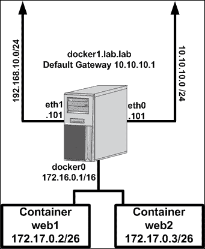
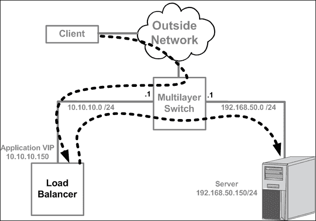
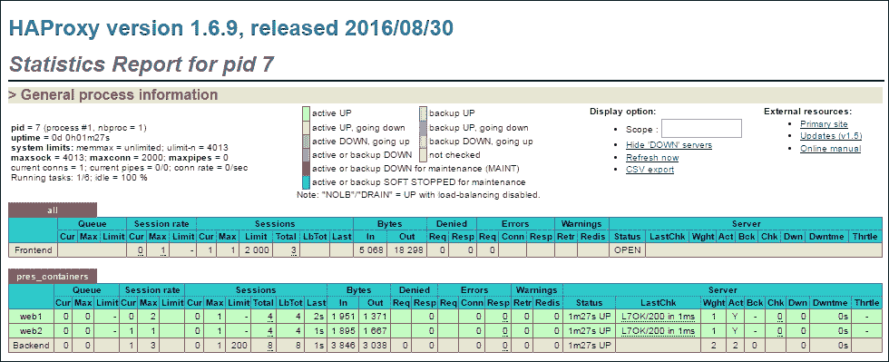
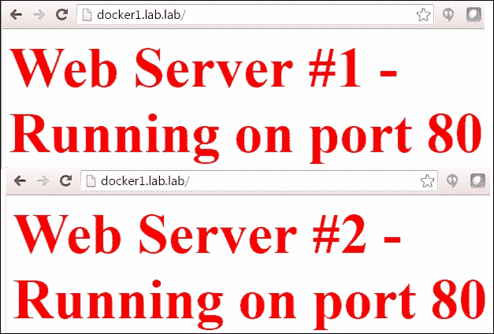

# 六、保护容器网络

在本章中，我们将介绍以下食谱:

*   启用和禁用 ICC
*   禁用出站伪装
*   管理网络过滤器到 Docker 的集成
*   创建自定义 iptables 规则
*   通过负载平衡器公开服务

# 简介

当您转向基于容器的应用时，您需要认真考虑的事项之一是网络安全。尤其是容器，会导致需要保护的网络端点数量激增。诚然，并非所有端点都完全暴露在网络中。然而，默认情况下，那些没有直接对话的人会互相交谈，这可能会引起其他问题。当涉及到基于容器的应用时，有许多方法可以解决网络安全问题，本章并不打算讨论所有可能的解决方案。相反，本章旨在回顾配置选项和相关网络拓扑，它们可以根据您自己的网络安全要求以多种不同的方式进行组合。我们将详细讨论我们在前面章节中接触到的一些特性，例如 ICC 模式和出站伪装。此外，我们将介绍几种不同的技术来限制容器的网络暴露。

# 启用和禁用 ICC

在早期的章节中，我们接触到了 ICC 模式的概念，但是没有太多关于其工作原理的信息。ICC 是一种 Docker-native 方式，用于隔离连接到同一网络的所有容器。所提供的隔离防止了容器之间的直接对话，同时仍然允许它们公开的端口被发布，并允许出站连接。在本食谱中，我们将回顾默认`docker0`网桥上下文以及用户定义网络中基于 ICC 的配置选项。

## 做好准备

在本食谱中，我们将使用两台 Docker 主机来演示 ICC 如何在不同的网络配置中工作。假设本实验中使用的两台 Docker 主机都处于默认配置。在某些情况下，我们所做的更改可能要求您具有对系统的根级访问权限。

## 怎么做…

ICC 模式既可以在本机`docker0`网桥上配置，也可以在任何使用网桥驱动程序的用户定义网络上配置。在本食谱中，我们将回顾如何在`docker0`桥上配置 ICC 模式。正如我们在前面章节中看到的，与`docker0`桥相关的设置需要在服务级别进行。这是因为`docker0`桥是作为服务初始化的一部分创建的。这也意味着，要对其进行更改，我们需要编辑 Docker 服务配置，然后重新启动服务以使其生效。在进行任何更改之前，让我们借此机会回顾一下默认的 ICC 配置。为此，我们先来看看`docker0`桥的配置:

```
user@docker1:~$ docker network inspect bridge
[
    {
        "Name": "bridge",
        "Id": "d88fa0a96585792f98023881978abaa8c5d05e4e2bbd7b4b44a6e7b0ed7d346b",
        "Scope": "local",
        "Driver": "bridge",
        "EnableIPv6": false,
        "IPAM": {
            "Driver": "default",
            "Options": null,
            "Config": [
                {
                    "Subnet": "172.17.0.0/16",
                    "Gateway": "172.17.0.1"
                }
            ]
        },
        "Internal": false,
        "Containers": {},
        "Options": {
            "com.docker.network.bridge.default_bridge": "true",
            "com.docker.network.bridge.enable_icc": "true",
            "com.docker.network.bridge.enable_ip_masquerade": "true",
            "com.docker.network.bridge.host_binding_ipv4": "0.0.0.0",
            "com.docker.network.bridge.name": "docker0",
            "com.docker.network.driver.mtu": "1500"
        },
        "Labels": {}
    }
]
user@docker1:~$
```

### 注

重要的是要记住`docker network`子命令用于管理所有 Docker 网络。一个常见的误解是，它只能用于管理用户定义的网络。

正如我们所见，`docker0`桥配置为开启 ICC 模式(`true`)。这意味着 Docker 不会干扰或阻止连接到此桥的容器直接相互对话。为了证明这一点，让我们从两个容器开始:

```
user@docker1:~$ docker run -d --name=web1 jonlangemak/web_server_1
417dd2587dfe3e664b67a46a87f90714546bec9c4e35861476d5e4fa77e77e61
user@docker1:~$ docker run -d --name=web2 jonlangemak/web_server_2
a54db26074c00e6771d0676bb8093b1a22eb95a435049916becd425ea9587014
user@docker1:~$
```

请注意我们没有指定`-P`标志，它告诉 Docker 不要发布任何暴露端口的容器。现在，让我们获取每个容器的 IP 地址，以便验证连通性:

```
user@docker1:~$ docker exec web1 ip addr show dev eth0 | grep inet
    inet 172.17.0.2/16 scope global eth0
    inet6 fe80::42:acff:fe11:2/64 scope link
 user@docker1:~$ docker exec web2 ip addr show dev eth0 | grep inet
    inet 172.17.0.3/16 scope global eth0
    inet6 fe80::42:acff:fe11:3/64 scope link
user@docker1:~$
```

现在我们知道了 IP 地址，我们可以验证每个容器都可以访问该容器正在侦听的任何服务上的另一个容器:

```
user@docker1:~$ docker exec -it web1 ping 172.17.0.3 -c 2
PING 172.17.0.3 (172.17.0.3): 48 data bytes
56 bytes from 172.17.0.3: icmp_seq=0 ttl=64 time=0.198 ms
56 bytes from 172.17.0.3: icmp_seq=1 ttl=64 time=0.082 ms
--- 172.17.0.3 ping statistics ---
2 packets transmitted, 2 packets received, 0% packet loss
round-trip min/avg/max/stddev = 0.082/0.140/0.198/0.058 ms
user@docker1:~$
user@docker1:~$ docker exec web2 curl -s http://172.17.0.2
<body>
  <html>
    <h1><span style="color:#FF0000;font-size:72px;">Web Server #1 - Running on port 80</span>
    </h1>
</body>
  </html>
user@docker1:~$
```

基于这些测试，我们可以假设容器被允许在任何正在监听的协议上相互对话。这是启用 ICC 模式时的预期行为。现在，让我们更改服务级别设置并重新检查我们的配置。为此，请在您的系统中为 Docker 服务设置以下配置:

```
ExecStart=/usr/bin/dockerd --icc=false
```

现在重新加载系统配置，重新启动 Docker 服务，并检查 ICC 设置:

```
user@docker1:~$ sudo systemctl daemon-reload
user@docker1:~$ sudo systemctl restart docker
user@docker1:~$ docker network inspect bridge
…<Additional output removed for brevity>…
        "Options": {
            "com.docker.network.bridge.default_bridge": "true",
 "com.docker.network.bridge.enable_icc": "false",
            "com.docker.network.bridge.enable_ip_masquerade": "true",
            "com.docker.network.bridge.host_binding_ipv4": "0.0.0.0",
            "com.docker.network.bridge.name": "docker0",
            "com.docker.network.driver.mtu": "1500" 
…<Additional output removed for brevity>… 
user@docker1:~$
```

现在我们已经确认 ICC 已被禁用，让我们再次启动两个容器并运行相同的连接测试:

```
user@docker1:~$ docker start web1
web1
user@docker1:~$ docker start web2
web2
user@docker1:~$
user@docker1:~$ docker exec -it web1 ping 172.17.0.3 -c 2
PING 172.17.0.3 (172.17.0.3): 48 data bytes
user@docker1:~$ docker exec -it web2 curl -m 1 http://172.17.0.2
curl: (28) connect() timed out!
user@docker1:~$
```

正如你看到的，我们两个容器之间没有连接。但是，Docker 主机本身仍然能够访问这些服务:

```
user@docker1:~$ curl http://172.17.0.2
<body>
  <html>
    <h1><span style="color:#FF0000;font-size:72px;">Web Server #1 - Running on port 80</span>
    </h1>
</body>
  </html>
user@docker1:~$ curl http://172.17.0.3
<body>
  <html>
    <h1><span style="color:#FF0000;font-size:72px;">Web Server #2 - Running on port 80</span>
    </h1>
</body>
  </html>
user@docker1:~$
```

我们可以通过查看过滤器表的`iptables`规则`FORWARD`链来检查用于实现 ICC 的网络过滤器规则:

```
user@docker1:~$ sudo iptables -S FORWARD
-P FORWARD ACCEPT
-A FORWARD -j DOCKER-ISOLATION
-A FORWARD -o docker0 -j DOCKER
-A FORWARD -o docker0 -m conntrack --ctstate RELATED,ESTABLISHED -j ACCEPT
-A FORWARD -i docker0 ! -o docker0 -j ACCEPT
-A FORWARD -i docker0 -o docker0 -j DROP
user@docker1:~$ 
```

前面的粗体规则是阻止`docker0`桥上容器到容器通信的原因。如果我们在禁用 ICC 之前检查了这个`iptables`链，我们会看到这个规则设置为`ACCEPT` ，如下所示:

```
user@docker1:~$ sudo iptables -S FORWARD
-P FORWARD ACCEPT
-A FORWARD -j DOCKER-ISOLATION
-A FORWARD -i docker0 -o docker0 -j ACCEPT
-A FORWARD -o docker0 -j DOCKER
-A FORWARD -o docker0 -m conntrack --ctstate RELATED,ESTABLISHED -j ACCEPT
-A FORWARD -i docker0 ! -o docker0 -j ACCEPT
user@docker1:~$
```

正如我们前面看到的，链接容器允许你绕过这个规则，允许一个源容器访问一个目标容器。如果我们移除这两个容器，我们可以通过如下链接重新启动它们:

```
user@docker1:~$ docker run -d --name=web1 jonlangemak/web_server_1
9846614b3bac6a2255e135d19f20162022a40d95bd62a0264ef4aaa89e24592f
user@docker1:~$ docker run -d --name=web2 --link=web1 jonlangemak/web_server_2
b343b570189a0445215ad5406e9a2746975da39a1f1d47beba4d20f14d687d83
user@docker1:~$
```

现在如果我们用`iptables`检查规则，我们可以看到两个新的规则被添加到过滤器表中:

```
user@docker1:~$ sudo iptables -S
-P INPUT ACCEPT
-P FORWARD ACCEPT
-P OUTPUT ACCEPT
-N DOCKER
-N DOCKER-ISOLATION
-A FORWARD -j DOCKER-ISOLATION
-A FORWARD -o docker0 -j DOCKER
-A FORWARD -o docker0 -m conntrack --ctstate RELATED,ESTABLISHED -j ACCEPT
-A FORWARD -i docker0 ! -o docker0 -j ACCEPT
-A FORWARD -i docker0 -o docker0 -j DROP
-A DOCKER -s 172.17.0.3/32 -d 172.17.0.2/32 -i docker0 -o docker0 -p tcp -m tcp --dport 80 -j ACCEPT
-A DOCKER -s 172.17.0.2/32 -d 172.17.0.3/32 -i docker0 -o docker0 -p tcp -m tcp --sport 80 -j ACCEPT
-A DOCKER-ISOLATION -j RETURN
user@docker1:~$ 
```

这两个新规则允许`web2`在任何暴露的端口上访问`web1`。请注意第一条规则如何定义从`web2` ( `172.17.0.3`)到`web1` ( `172.17.0.2`)的访问，目的港为`80`。第二个规则翻转 ips 并将端口`80`指定为源端口，允许流量返回`web2`。

### 注

早些时候，当我们讨论用户定义的网络时，您看到我们可以将 ICC 标志传递给用户定义的桥。但是，覆盖驱动程序目前不支持禁用 ICC 模式。

# 禁用出站伪装

默认情况下，允许容器通过伪装或隐藏其真实的 IP 地址到 Docker 主机后面来访问外部网络。这是通过 netfilter `masquerade`规则实现的，该规则将容器流量隐藏在下一跳中引用的 Docker 主机接口后面。我们在[第 2 章](02.html "Chapter 2. Configuring and Monitoring Docker Networks")、*配置和监控 Docker 网络*中看到了这方面的详细示例，当时我们讨论了跨主机的容器到容器连接。虽然这种类型的配置在许多方面都是理想的，但在某些情况下，您可能更喜欢禁用出站伪装功能。例如，如果您不想让您的容器拥有出站连接，禁用伪装将阻止容器与外部网络对话。但是，这只会由于缺少返回路由而阻止出站流量。更好的选择可能是像对待任何其他单独的网络端点一样对待容器，并使用现有的安全设备来定义网络策略。在本食谱中，我们将讨论如何禁用 IP 伪装，以及如何在容器通过外部网络时为它们提供唯一的 IP 地址。

## 做好准备

在本例中，我们将使用单个 Docker 主机。假设本实验中使用的 Docker 主机处于默认配置。您还需要访问权限来更改 Docker 服务级别设置。在某些情况下，我们所做的更改可能要求您具有对系统的根级访问权限。我们还将对 Docker 主机连接的网络设备进行更改。

## 怎么做…

您会记得，Docker 中的 IP 伪装是通过网络过滤器`masquerade`规则来处理的。在 Docker 主机的默认配置中，我们可以通过使用`iptables`检查规则集来查看该规则:

```
user@docker1:~$ sudo iptables -t nat -S
-P PREROUTING ACCEPT
-P INPUT ACCEPT
-P OUTPUT ACCEPT
-P POSTROUTING ACCEPT
-N DOCKER
-A PREROUTING -m addrtype --dst-type LOCAL -j DOCKER
-A OUTPUT ! -d 127.0.0.0/8 -m addrtype --dst-type LOCAL -j DOCKER
-A POSTROUTING -s 172.17.0.0/16 ! -o docker0 -j MASQUERADE
-A DOCKER -i docker0 -j RETURN
user@docker1:~$
```

该规则将流量源指定为`docker0`网桥子网，只有 NAT 流量才能离开主机。`MASQUERADE`目标告诉主机将流量源 NAT 到 Docker 主机的下一跳接口。也就是说，如果主机有多个 IP 接口，容器的流量将通过 NAT 到达用作下一跳的接口。这意味着根据 Docker 主机接口和路由表配置，容器流量可能隐藏在不同的 IP 地址后面。例如，考虑一个具有两个接口的 Docker 主机，如下图所示:


在左侧的示例中，由于`4.2.2.2`的目的地与主机路由表中更具体的前缀不匹配，流量采用默认路由。在这种情况下，主机执行源 NAT，并在流量穿过 Docker 主机到达外部网络时，将流量源从`172.17.0.2`更改为`10.10.10.101`。但是，如果目的地落入`172.17.0.0/16`，容器运输反而会隐藏在`192.168.10.101`界面后面，如右图所示。

可以通过操作`--ip-masq` Docker 选项来更改 Docker 的默认行为。默认情况下，该选项被认为是`true`，可以通过指定该选项并将其设置为`false`来覆盖。我们可以通过在 Docker 系统文件中指定选项来实现这一点，如下所示:

```
ExecStart=/usr/bin/dockerd --ip-masq=false
```

现在重新加载系统配置，重启 Docker 服务，检查 ICC 设置:

```
user@docker1:~$ sudo systemctl daemon-reload
user@docker1:~$ sudo systemctl restart docker
user@docker1:~$
user@docker1:~$ sudo iptables -t nat -S
-P PREROUTING ACCEPT
-P INPUT ACCEPT
-P OUTPUT ACCEPT
-P POSTROUTING ACCEPT
-N DOCKER
-A PREROUTING -m addrtype --dst-type LOCAL -j DOCKER
-A OUTPUT ! -d 127.0.0.0/8 -m addrtype --dst-type LOCAL -j DOCKERuser@docker1:~$
```

注意`masquerade`规则现在已经不存在了。从该主机上的容器生成的流量将尝试通过 Docker 主机以其实际的源 IP 地址路由出去。Docker 主机上的一个`tcpdump`将使用原始容器 IP 地址捕获从主机的`eth0`接口流出的流量:

```
user@docker1:~$ sudo tcpdump –n -i eth0 dst 4.2.2.2
tcpdump: verbose output suppressed, use -v or -vv for full protocol decode
listening on eth0, link-type EN10MB (Ethernet), capture size 65535 bytes
09:06:10.243523 IP 172.17.0.2 > 4.2.2.2: ICMP echo request, id 3072, seq 0, length 56
09:06:11.244572 IP 172.17.0.2 > 4.2.2.2: ICMP echo request, id 3072, seq 256, length 56
```

由于外部网络不知道`172.17.0.0/16`在哪里，这个请求永远不会收到响应，有效地阻止了容器与外部世界的通信。

虽然这可能是防止与外界交流的有用手段，但并不完全理想。首先，你仍然允许交通出去；响应只是不知道该去哪里，因为它试图返回到源。此外，您还影响了 Docker 主机上来自所有网络的所有容器。如果`docker0`网桥分配了一个可路由的子网，并且外部网络知道该子网位于何处，您可以使用现有的安全工具来做出安全策略决策。

例如，让我们假设`docker0`网桥将被分配一个`172.10.10.0/24`子网，并且我们禁用了 IP 伪装。我们可以通过更改 Docker 选项来指定一个新的网桥 IP 地址:

```
ExecStart=/usr/bin/dockerd --ip-masq=false --bip=172.10.10.1/24

```

像以前一样，离开容器并去往外部网络的流量在穿过 Docker 主机时将保持不变。让我们假设一个小型网络拓扑，如下图所示:


让我们假设是从容器到`4.2.2.2`的流动。在这种情况下，出口流量应该能够正常工作:

*   容器产生流向`4.2.2.2`的流量，并使用其默认网关，即`docker0`网桥 IP 地址
*   Docker 主机进行路由查找，无法找到特定的前缀匹配，并将流量转发到其默认网关(即交换机)。
*   交换机进行路由查找，找不到特定的前缀匹配，然后将流量转发到默认路由，即防火墙。
*   防火墙执行路由查找，无法找到特定的前缀匹配，确保策略中允许流量，对公共 IP 地址执行隐藏 NAT，并将流量转发到其默认路由，即互联网。

因此，在没有任何额外配置的情况下，出口流量应该会到达其目的地。问题出在回程的交通上。当来自互联网目的地的响应返回防火墙时，它将尝试确定如何路由回源。此路由查找可能会失败，导致防火墙丢弃流量。

### 注

在某些情况下，边缘网络设备(在这种情况下是防火墙)会将所有私有 IP 地址路由回内部(在这种情况下是交换机)。在这些情况下，防火墙可能会将返回流量转发到交换机，但交换机不会有导致相同问题的特定返回路由。

为了做到这一点，防火墙和交换机需要知道如何将流量返回到特定的容器。为此，我们需要在每台设备上添加特定路由，将`docker0`网桥子网指向`docker1`主机:


一旦这些路由到位，在 Docker 主机上旋转的容器应该可以连接到外部网络:

```
user@docker1:~$ docker run -it --name=web1 jonlangemak/web_server_1 /bin/bash
root@132530812e1f:/# ping 4.2.2.2
PING 4.2.2.2 (4.2.2.2): 48 data bytes
56 bytes from 4.2.2.2: icmp_seq=0 ttl=50 time=33.805 ms
56 bytes from 4.2.2.2: icmp_seq=1 ttl=50 time=40.431 ms

```

Docker 主机上的一个`tcpdump`将显示流量正带着原始容器 IP 地址离开:

```
user@docker1:~$ sudo tcpdump –n -i eth0 dst 4.2.2.2
tcpdump: verbose output suppressed, use -v or -vv for full protocol decode
listening on eth0, link-type EN10MB (Ethernet), capture size 65535 bytes
10:54:42.197828 IP 172.10.10.2 > 4.2.2.2: ICMP echo request, id 3328, seq 0, length 56
10:54:43.198882 IP 172.10.10.2 > 4.2.2.2: ICMP echo request, id 3328, seq 256, length 56
```

这种类型的配置提供了使用现有安全设备来决定容器是否可以到达外部网络上的某些资源的能力。然而，这也是安全设备离您的 Docker 主机有多近的函数。例如，在这种配置中，Docker 主机上的容器将能够到达连接到交换机的任何其他网络端点。强制点(在本例中是防火墙)仅允许您限制容器与互联网的连接。此外，如果规模较大，为每个 Docker 主机分配可路由的 IP 空间可能会引入 IP 分配限制。

# 管理网络过滤器到 Docker 的集成

默认情况下，Docker 会为您执行大多数网络过滤器配置。它处理一些事情，比如发布端口和出站伪装，以及允许你阻止或允许 ICC。然而，这都是可选的，你可以告诉 Docker 不要修改或增加任何你现有的`iptables`规则。如果这样做，您将需要生成自己的规则来提供类似的功能。如果您已经广泛使用`iptables`规则，并且不希望 Docker 自动对您的配置进行更改，这可能会对您有吸引力。在本食谱中，我们将讨论如何为 Docker 禁用自动`iptables`规则生成，并向您展示如何手动创建类似的规则。

## 做好准备

在本例中，我们将使用单个 Docker 主机。假设本实验中使用的 Docker 主机处于默认配置。您还需要访问权限来更改 Docker 服务级别设置。在某些情况下，我们所做的更改可能要求您具有对系统的根级访问权限。

## 怎么做…

正如我们已经看到的，在网络配置方面，Docker 为您解决了许多繁重的工作。如果需要，它还允许您自行配置这些东西。在我们考虑自己做之前，让我们确认 Docker 实际上代表我们在`iptables`规则方面配置了什么。让我们运行以下容器:

```
user@docker1:~$ docker run -dP --name=web1 jonlangemak/web_server_1
f5b7b389890398588c55754a09aa401087604a8aa98dbf55d84915c6125d5e62
user@docker1:~$ docker run -dP --name=web2 jonlangemak/web_server_2
e1c866892e7f3f25dee8e6ba89ec526fa3caf6200cdfc705ce47917f12095470
user@docker1:~$
```

运行这些容器将产生以下拓扑:



### 注

后面给出的例子不会直接使用主机的`eth1`界面。显示它是为了说明 Docker 生成的规则是如何以包含 Docker 主机上所有物理接口的方式编写的。

正如我们之前提到的，Docker 使用`iptables`来处理以下项目:

*   出站容器连接(伪装)
*   入站端口发布
*   容器到容器的连接

由于我们使用默认配置，并且我们已经在两个容器上发布了端口，因此我们应该能够在`iptables`中看到所有这三个项目的配置。让我们先看一下 NAT 表:

### 注

在大多数情况下，我更喜欢打印规则并解释它们，而不是将它们列在格式化的列中。每种方式都有取舍，但如果你更喜欢列表模式，可以用`-vL`代替`-S`。

```
user@docker1:~$ sudo iptables -t nat -S
-P PREROUTING ACCEPT
-P INPUT ACCEPT
-P OUTPUT ACCEPT
-P POSTROUTING ACCEPT
-N DOCKER
-A PREROUTING -m addrtype --dst-type LOCAL -j DOCKER
-A OUTPUT ! -d 127.0.0.0/8 -m addrtype --dst-type LOCAL -j DOCKER
-A POSTROUTING -s 172.17.0.0/16 ! -o docker0 -j MASQUERADE
-A POSTROUTING -s 172.17.0.2/32 -d 172.17.0.2/32 -p tcp -m tcp --dport 80 -j MASQUERADE
-A POSTROUTING -s 172.17.0.3/32 -d 172.17.0.3/32 -p tcp -m tcp --dport 80 -j MASQUERADE
-A DOCKER -i docker0 -j RETURN
-A DOCKER ! -i docker0 -p tcp -m tcp --dport 32768 -j DNAT --to-destination 172.17.0.2:80
-A DOCKER ! -i docker0 -p tcp -m tcp --dport 32769 -j DNAT --to-destination 172.17.0.3:80
user@docker1:~$
```

让我们回顾一下前面输出中每一条粗体线的重要性。第一个粗体行负责出站隐藏 NAT 或`MASQUERADE`:

```
-A POSTROUTING -s 172.17.0.0/16 ! -o docker0 -j MASQUERADE
```

规则是寻找符合两个特征的流量:

*   源 IP 地址必须与`docker0`网桥的 IP 地址空间相匹配
*   车辆没有通过`docker0`桥离开。也就是说，它通过另一个界面离开，如`eth0`或`eth1`

结尾的跳转语句指定了`MASQUERADE`的目标，它将根据路由表向主机的一个 IP 接口发送 NAT 容器流量。

接下来的两行粗体字提供了类似的功能，并提供了在每个容器上发布端口所需的 NAT。让我们检查其中一个:

```
-A DOCKER ! -i docker0 -p tcp -m tcp --dport 32768 -j DNAT --to-destination 172.17.0.2:80
```

规则是寻找符合三个特征的流量:

*   车辆不通过`docker0`桥进入
*   流量是 TCP
*   交通的目的港为`32768`

结尾的跳转语句指定了`DNAT`的目标和容器的目的地及其真正的服务端口(`80`)。请注意，就 Docker 主机的物理接口而言，这两个规则都是通用的。正如我们前面看到的，端口发布和出站伪装都可以发生在主机上的任何接口上，除非我们特别限制范围。

我们要查看的下一个表是筛选器表:

```
user@docker1:~$ sudo iptables -t filter -S
-P INPUT ACCEPT
-P FORWARD ACCEPT
-P OUTPUT ACCEPT
-N DOCKER
-N DOCKER-ISOLATION
-A FORWARD -j DOCKER-ISOLATION
-A FORWARD -o docker0 -j DOCKER
-A FORWARD -o docker0 -m conntrack --ctstate RELATED,ESTABLISHED -j ACCEPT
-A FORWARD -i docker0 ! -o docker0 -j ACCEPT
-A FORWARD -i docker0 -o docker0 -j ACCEPT
-A DOCKER -d 172.17.0.2/32 ! -i docker0 -o docker0 -p tcp -m tcp --dport 80 -j ACCEPT
-A DOCKER -d 172.17.0.3/32 ! -i docker0 -o docker0 -p tcp -m tcp --dport 80 -j ACCEPT
-A DOCKER-ISOLATION -j RETURN
user@docker1:~$
```

同样，您会注意到默认链的链策略设置为`ACCEPT`。就过滤表而言，它对功能的影响更大。这意味着一切都是允许的，除非在规则中被明确拒绝。换句话说，如果没有规则定义，一切都还会继续。如果您的默认策略未设置为`ACCEPT`，Docker 会插入这些规则。稍后，当我们手动创建规则时，我们将默认策略设置为`DROP`，以便您可以看到规则的影响。前面的规则需要多一点解释，尤其是如果你不熟悉`iptables`规则是如何工作的。让我们一次检查一行粗体字。

第一条加粗的线负责允许来自外部网络的流量返回容器。在这种情况下，该规则特定于容器本身正在向外部网络生成流量并期待来自外部网络的响应的情况:

```
-A FORWARD -o docker0 -m conntrack --ctstate RELATED,ESTABLISHED -j ACCEPT
```

规则是寻找符合两个特征的流量:

*   车辆正通过`docker0`桥离开
*   流量的连接状态为`RELATED`或`ESTABLISHED`。这将包括作为现有流程的一部分或与之相关的会话

结尾的跳转语句引用了`ACCEPT`的目标，这将允许流通过。

第二条加粗的线允许容器连接到外部网络:

```
-A FORWARD -i docker0 ! -o docker0 -j ACCEPT
```

规则是寻找符合两个特征的流量:

*   车辆正通过`docker0`桥进入
*   车辆没有通过`docker0`桥离开

这是一种非常通用的识别来自容器并通过除了 T0 桥以外的任何接口离开的流量的方法。结尾的跳转语句引用了`ACCEPT`的目标，这将允许流通过。该规则与第一个规则一起，将允许从容器向外部网络产生的流工作。

第三条粗线允许容器间连接:

```
-A FORWARD -i docker0 -o docker0 -j ACCEPT
```

规则是寻找符合两个特征的流量:

*   车辆正通过`docker0`桥进入
*   车辆正通过`docker0`桥离开

这是识别源自`docker0`桥上的容器以及去往`docker0`桥上的目标的流量的另一种通用方法。结尾的跳转语句引用了`ACCEPT`的一个目标，这将允许流通过。正如我们在前面章节中看到的，当你禁用 ICC 模式时，这个规则变成了`DROP`目标。

最后两行粗体字允许已发布的端口到达容器。让我们检查其中一个:

```
-A DOCKER -d 172.17.0.2/32 ! -i docker0 -o docker0 -p tcp -m tcp --dport 80 -j ACCEPT
```

规则是寻找符合五个特征的流量:

*   运输的目的地是其港口已公布的容器
*   车辆不通过`docker0`桥进入
*   车辆正通过`docker0`桥离开
*   协议是 TCP
*   端口号为`80`

该规则通过允许访问容器的服务端口(`80`)特别允许公布的端口工作。结尾的跳转语句引用了`ACCEPT`的目标，这将允许流通过。

### 手动创建所需的 iptables 规则

现在我们已经看到了 Docker 如何自动处理规则生成，让我们来看一下如何自己构建这种连接的示例。为此，我们首先需要指示 Docker 不要创建任何`iptables`规则。为此，我们在 Docker 系统文件中设置`--iptables` Docker 选项为`false`:

```
ExecStart=/usr/bin/dockerd --iptables=false
```

我们需要重新加载 systemd drop in 文件，并重新启动 Docker 服务，以便 Docker 重新读取服务参数。为了确保您从一张白纸开始，如果可能的话，重新启动服务器或手动清除所有`iptables`规则(如果您不习惯管理`iptables`规则，最好的方法是重新启动服务器来清除它们)。在本例的其余部分，我们将假设我们正在使用一个空的规则集。一旦 Docker 重启，您可以重启您的两个容器，并确保系统上没有`iptables`规则:

```
user@docker1:~$ docker start web1
web1
user@docker1:~$ docker start web2
web2
user@docker1:~$ sudo iptables -S
-P INPUT ACCEPT
-P FORWARD ACCEPT
-P OUTPUT ACCEPT
user@docker1:~$
```

可以看到，目前没有定义`iptables`规则。我们还可以看到，我们在过滤表中的默认链策略设置为`ACCEPT`。现在让我们为每个链将过滤器表中的默认策略更改为`DROP`。除此之外，让我们还包括一个规则，允许 SSH 进出主机，以免破坏我们的连接:

```
user@docker1:~$ sudo iptables -A INPUT -i eth0 -p tcp --dport 22 \
-m state --state NEW,ESTABLISHED -j ACCEPT
user@docker1:~$ sudo iptables -A OUTPUT -o eth0 -p tcp --sport 22 \
-m state --state ESTABLISHED -j ACCEPT
user@docker1:~$ sudo iptables -P INPUT DROP
user@docker1:~$ sudo iptables -P FORWARD DROP
user@docker1:~$ sudo iptables -P OUTPUT DROP
```

现在让我们再次检查过滤器表，以确保规则被接受:

```
user@docker1:~$ sudo iptables -S
-P INPUT DROP
-P FORWARD DROP
-P OUTPUT DROP
-A INPUT -i eth0 -p tcp -m tcp --dport 22 -m state --state NEW,ESTABLISHED -j ACCEPT
-A OUTPUT -o eth0 -p tcp -m tcp --sport 22 -m state --state ESTABLISHED -j ACCEPT
user@docker1:~$
```

此时点，容器`web1`和`web2`将不再能够相互到达:

```
user@docker1:~$ docker exec -it web1 ping 172.17.0.3 -c 2
PING 172.17.0.3 (172.17.0.3): 48 data bytes
user@docker1:~$
```

### 注

根据您的操作系统，您可能会注意到`web1`此时实际上能够 ping 通`web2`。最可能的原因是`br_netfilter`内核模块没有被加载。如果没有这个模块，桥接的数据包将不会被 netfilter 检查。要解决这个问题，可以使用`sudo modprobe br_netfilter`命令手动加载模块。为了在每次引导时加载模块，您也可以将其添加到`/etc/modules`文件中。当 Docker 管理`iptables`规则集时，它负责为您加载模块。

现在，让我们开始构建规则集，以重新创建 Docker 之前为我们自动构建的连接。我们要做的第一件事是允许容器入站和出站访问。我们将用这两条规则来做到这一点:

```
user@docker1:~$ sudo iptables -A FORWARD -i docker0 ! \
-o docker0 -j ACCEPT
user@docker1:~$ sudo iptables -A FORWARD -o docker0 \
-m conntrack --ctstate RELATED,ESTABLISHED -j ACCEPT
```

虽然这两个规则将允许容器生成和接收来自外部网络的流量，但此时连接仍然不起作用。为了做到这一点，我们需要应用`masquerade`规则，以便容器流量隐藏在`docker0`主机上的接口后面。如果我们不这样做，流量将永远不会返回，因为外部网络对容器所在的`172.17.0.0/16`网络一无所知:

```
user@docker1:~$ sudo iptables -t nat -A POSTROUTING \
-s 172.17.0.0/16 ! -o docker0 -j MASQUERADE
```

有了这些，容器现在将能够到达外部网络上的网络端点:

```
user@docker1:~$ docker exec -it web1 ping 4.2.2.2 -c 2
PING 4.2.2.2 (4.2.2.2): 48 data bytes
56 bytes from 4.2.2.2: icmp_seq=0 ttl=50 time=36.261 ms
56 bytes from 4.2.2.2: icmp_seq=1 ttl=50 time=55.271 ms
--- 4.2.2.2 ping statistics ---
2 packets transmitted, 2 packets received, 0% packet loss
round-trip min/avg/max/stddev = 36.261/45.766/55.271/9.505 ms
user@docker1:~$
```

然而，容器仍然不能直接相互通信:

```
user@docker1:~$ docker exec -it web1 ping 172.17.0.3 -c 2
PING 172.17.0.3 (172.17.0.3): 48 data bytes
user@docker1:~$ docker exec -it web1 curl -S http://172.17.0.3
user@docker1:~$
```

我们需要添加最后一条规则:

```
sudo iptables -A FORWARD -i docker0 -o docker0 -j ACCEPT
```

由于容器之间的流量进入和离开`docker0`桥，这将允许容器间的连接:

```
user@docker1:~$ docker exec -it web1 ping 172.17.0.3 -c 2
PING 172.17.0.3 (172.17.0.3): 48 data bytes
56 bytes from 172.17.0.3: icmp_seq=0 ttl=64 time=0.092 ms
56 bytes from 172.17.0.3: icmp_seq=1 ttl=64 time=0.086 ms
--- 172.17.0.3 ping statistics ---
2 packets transmitted, 2 packets received, 0% packet loss
round-trip min/avg/max/stddev = 0.086/0.089/0.092/0.000 ms
user@docker1:~$
user@docker1:~$ docker exec -it web1 curl http://172.17.0.3
<body>
  <html>
    <h1><span style="color:#FF0000;font-size:72px;">Web Server #2 - Running on port 80</span>
    </h1>
</body>
  </html>
user@docker1:~$
```

剩下的唯一配置是提供一种发布端口的机制。我们可以这样做，首先在 Docker 主机本身上配置一个目标 NAT。即使 Docker 没有提供 NAT 规则，它仍然代表您跟踪端口分配。在容器运行时，如果您选择发布端口，Docker 将为您分配一个端口映射，即使它不处理发布。明智的做法是使用 Docker 分配的端口来防止重叠:

```
user@docker1:~$ docker port web1
80/tcp -> 0.0.0.0:32768
user@docker1:~$ docker port web2
80/tcp -> 0.0.0.0:32769
user@docker1:~$
user@docker1:~$ sudo iptables -t nat -A PREROUTING ! -i docker0 \
-p tcp -m tcp --dport 32768 -j DNAT --to-destination 172.17.0.2:80
user@docker1:~$ sudo iptables -t nat -A PREROUTING ! -i docker0 \
-p tcp -m tcp --dport 32769 -j DNAT --to-destination 172.17.0.3:80
user@docker1:~$
```

使用 Docker 分配的端口，我们可以为每个容器定义一个入站 NAT 规则，将到 Docker 主机上外部端口的入站连接转换为真正的容器 IP 和服务端口。最后，我们只需要允许入站流量:

```
user@docker1:~$ sudo iptables -A FORWARD -d 172.17.0.2/32 ! -i docker0 -o docker0 -p tcp -m tcp --dport 80 -j ACCEPT
user@docker1:~$ sudo iptables -A FORWARD -d 172.17.0.3/32 ! -i docker0 -o docker0 -p tcp -m tcp --dport 80 -j ACCEPT
```

配置完这些规则后，我们现在可以从 Docker 主机外部的已发布端口上测试连通性:


# 创建自定义 iptables 规则

在之前的食谱中，我们介绍了 Docker 如何处理最常见的容器网络需求的`iptables`规则。但是，可能会有您希望扩展默认`iptables`配置以允许更多访问或限制连接范围的情况。在这个食谱中，我们将通过几个例子来展示如何实现定制的`iptables`规则。我们将重点关注限制连接到在您的容器上运行的服务的源的范围，以及允许 Docker 主机本身连接到这些服务。

### 注

后面提供的例子旨在演示配置`iptables`规则集的选项。这些示例中实现它们的方式在您的环境中可能有意义，也可能没有意义，并且可以根据您的安全需求以不同的方式和位置进行部署。

## 做好准备

我们将使用相同的 Docker 主机，其配置与之前的配方相同。Docker 服务应该配置`--iptables=false`服务选项，应该定义两个容器— `web1`和`web2`。如果你不确定如何达到这种状态，请查看之前的食谱。为了定义新的`iptables`策略，我们还需要清除 NAT 和 FILTER 表中所有现有的`iptables`规则。最简单的方法是重启主机。

### 注

当您的默认策略为拒绝时，刷新`iptables`规则将断开任何远程管理会话。如果您在没有控制台访问权限的情况下管理系统，请注意不要意外断开连接！

如果不想重启，可以将默认过滤策略改回`allow`。然后，按如下方式刷新过滤器和 NAT 表:

```
sudo iptables -P INPUT ACCEPT
sudo iptables -P FORWARD ACCEPT
sudo iptables -P OUTPUT ACCEPT
sudo iptables -t filter -F
sudo iptables -t nat -F
```

## 怎么做…

此时，您应该再次拥有一个运行两个容器的 Docker 主机和一个空的默认`iptables`策略。首先，让我们再次将默认过滤策略更改为`deny`，同时确保我们仍然允许通过 SSH 进行管理连接:

```
user@docker1:~$ sudo iptables -A INPUT -i eth0 -p tcp --dport 22 \
-m state --state NEW,ESTABLISHED -j ACCEPT
user@docker1:~$ sudo iptables -A OUTPUT -o eth0 -p tcp --sport 22 \
-m state --state ESTABLISHED -j ACCEPT
user@docker1:~$ sudo iptables -P INPUT DROP
user@docker1:~$ sudo iptables -P FORWARD DROP
user@docker1:~$ sudo iptables -P OUTPUT DROP
```

因为我们将围绕过滤器表关注策略，所以让我们在前面的配方中不变地加入 NAT 策略。这些 NAT 涵盖了每个容器中服务的目的 NAT 的出站伪装和入站伪装:

```
user@docker1:~$ sudo iptables -t nat -A POSTROUTING -s \
172.17.0.0/16 ! -o docker0 -j MASQUERADE
user@docker1:~$ sudo iptables -t nat -A PREROUTING ! -i docker0 \
-p tcp -m tcp --dport 32768 -j DNAT --to-destination 172.17.0.2:80
user@docker1:~$ sudo iptables -t nat -A PREROUTING ! -i docker0 \
-p tcp -m tcp --dport 32769 -j DNAT --to-destination 172.17.0.3:80
```

您可能感兴趣的配置项目之一是限制容器在外部网络上可以访问的范围。您会注意到，在前面的例子中，容器被允许与任何外部事物进行对话。这是允许的，因为过滤器规则相当通用:

```
sudo iptables -A FORWARD -i docker0 ! -o docker0 -j ACCEPT
```

这条规则允许容器通过除`docker0`之外的任何接口与任何东西对话。我们可以只指定希望允许出站的端口，而不是允许这样做。例如，如果我们发布端口`80`，我们就可以定义一个反向或出站规则，只允许特定的返回流量。让我们首先重新创建上一个示例中使用的入站规则:

```
user@docker1:~$ sudo iptables -A FORWARD -d 172.17.0.2/32 \
! -i docker0 -o docker0 -p tcp -m tcp --dport 80 -j ACCEPT
user@docker1:~$ sudo iptables -A FORWARD -d 172.17.0.3/32 \
! -i docker0 -o docker0 -p tcp -m tcp --dport 80 -j ACCEPT
```

现在，我们可以很容易地用只允许端口`80`上的返回流量的特定规则来替换更通用的出站规则。例如，让我们设置一个规则，允许容器`web1`仅在港口`80`返回流量:

```
user@docker1:~$ sudo iptables -A FORWARD -s 172.17.0.2/32 -i \
docker0 ! -o docker0 -p tcp -m tcp --sport 80 -j ACCEPT
```

如果我们检查，我们应该看到从外部网络我们可以到达`web1`上的服务:


然而，容器`web1`此时除了端口`80`之外，不能与外部网络上的任何东西进行通信，因为我们没有使用通用出站规则:

```
user@docker1:~$ docker exec -it web1 ping 4.2.2.2 -c 2
PING 4.2.2.2 (4.2.2.2): 48 data bytes
user@docker1:~$
```

为了解决这个问题，我们可以添加特定的规则来允许像 ICMP 这样的来自`web1`容器的东西:

```
user@docker1:~$ sudo iptables -A FORWARD -s 172.17.0.2/32 -i \
docker0 ! -o docker0 -p icmp -j ACCEPT
```

上面的规则加上来自先前配方的状态感知返回规则将允许 web1 容器启动和接收返回 ICMP 流量。

```
user@docker1:~$ sudo iptables -A FORWARD -o docker0 -m conntrack \
--ctstate RELATED,ESTABLISHED -j ACCEPT
```

```
user@docker1:~$ docker exec -it web1 ping 4.2.2.2 -c 2
PING 4.2.2.2 (4.2.2.2): 48 data bytes
56 bytes from 4.2.2.2: icmp_seq=0 ttl=50 time=33.892 ms
56 bytes from 4.2.2.2: icmp_seq=1 ttl=50 time=34.326 ms
--- 4.2.2.2 ping statistics ---
2 packets transmitted, 2 packets received, 0% packet loss
round-trip min/avg/max/stddev = 33.892/34.109/34.326/0.217 ms
user@docker1:~$
```

在`web2`容器的情况下，其网络服务器仍然不能从外部网络访问。如果我们希望限制可以与网络服务器对话的流量来源，我们可以通过更改入站端口`80`规则，或者通过在出站端口`80`规则中指定目的地来实现。例如，我们可以通过在出口规则中指定目的地，将流量源限制在外部网络的单个设备上:

```
user@docker1:~$ sudo iptables -A FORWARD -s 172.17.0.3/32 -d \
10.20.30.13 -i docker0 ! -o docker0 -p tcp -m tcp --sport 80 \
-j ACCEPT
```

现在，如果我们从外部网络上的实验室设备尝试使用`10.20.30.13`的 IP 地址，我们应该能够访问网络服务器:

```
[user@lab1 ~]# ip addr show dev eth0 | grep inet
    inet 10.20.30.13/24 brd 10.20.30.255 scope global eth0
 [user@lab2 ~]# curl http://docker1.lab.lab:32769
<body>
  <html>
    <h1><span style="color:#FF0000;font-size:72px;">Web Server #2 - Running on port 80</span>
    </h1>
</body>
  </html>
[user@lab1 ~]#
```

但是如果我们从不同的实验室服务器尝试使用不同的 IP 地址，连接将会失败:

```
[user@lab2 ~]# ip addr show dev eth0 | grep inet
    inet 10.20.30.14/24 brd 10.20.30.255 scope global eth0
[user@lab2 ~]# curl http://docker1.lab.lab:32769
[user@lab2 ~]#
```

同样，该规则可以实现为入站或出站规则。

当以这种方式管理`iptables`规则时，您可能已经注意到 Docker 主机本身不再能够连接到它们所承载的容器和服务:

```
user@docker1:~$ ping 172.17.0.2 -c 2
PING 172.17.0.2 (172.17.0.2) 56(84) bytes of data.
ping: sendmsg: Operation not permitted
ping: sendmsg: Operation not permitted
--- 172.17.0.2 ping statistics ---
2 packets transmitted, 0 received, 100% packet loss, time 999ms
user@docker1:~$
```

这是因为我们在筛选器表中编写的所有规则都在前向链中。前向链路仅适用于主机正在转发的流量，而不适用于源自或发往主机本身的流量。要解决这个问题，我们可以在过滤表的`INPUT`和`OUTPUT`链中放入规则。为了允许 ICMP 进出容器，我们可以指定如下规则:

```
user@docker1:~$ sudo iptables -A OUTPUT -o docker0 -p icmp -m \
state --state NEW,ESTABLISHED -j ACCEPT
user@docker1:~$ sudo iptables -A INPUT -i docker0 -p icmp -m \
state --state ESTABLISHED -j ACCEPT
```

被添加到输出链的规则寻找从`docker0`桥(朝向容器)流出的流量，这是协议 ICMP 的流量，并且是新的或已建立的流量。被添加到输入链的规则寻找进入`docker0`桥(朝向主机)的流量，即协议 ICMP 的流量，并且是已建立的流量。由于流量来自 Docker 主机，这些规则将匹配并允许到容器的 ICMP 流量工作:

```
user@docker1:~$ ping 172.17.0.2 -c 2
PING 172.17.0.2 (172.17.0.2) 56(84) bytes of data.
64 bytes from 172.17.0.2: icmp_seq=1 ttl=64 time=0.081 ms
64 bytes from 172.17.0.2: icmp_seq=2 ttl=64 time=0.021 ms
--- 172.17.0.2 ping statistics ---
2 packets transmitted, 2 received, 0% packet loss, time 999ms
rtt min/avg/max/mdev = 0.021/0.051/0.081/0.030 ms
user@docker1:~$
```

但是，这仍然不允许容器本身 ping 默认网关。这是因为我们添加到输入链的规则匹配进入`docker0`桥的流量，只寻找已建立的会话。为了双向工作，您需要在第二个规则中添加`NEW`标志，这样它也将匹配容器生成的流向主机的新流:

```
user@docker1:~$ sudo iptables -A INPUT -i docker0 -p icmp -m \
state --state NEW,ESTABLISHED -j ACCEPT
```

由于我们添加到输出链的规则已经指定了新的或已建立的流，因此从容器到主机的 ICMP 连接现在也将工作:

```
user@docker1:~$ docker exec -it web1 ping  
PING 172.17.0.1 (172.17.0.1): 48 data bytes
56 bytes from 172.17.0.1: icmp_seq=0 ttl=64 time=0.073 ms
56 bytes from 172.17.0.1: icmp_seq=1 ttl=64 time=0.079 ms
^C--- 172.17.0.1 ping statistics ---
2 packets transmitted, 2 packets received, 0% packet loss
round-trip min/avg/max/stddev = 0.073/0.076/0.079/0.000 ms
user@docker1:~$
```

# 通过负载平衡器公开服务

另一种隔离容器的方法是用负载平衡器来处理它们。这种操作模式有几个优点。首先，负载均衡器可以为多个后端节点提供智能负载均衡。如果容器死亡，负载平衡器可以将其从负载平衡池中删除。其次，你实际上是把你的容器藏在一个负载平衡的**虚拟 IP** ( **贵宾**)地址后面。客户端认为，当它们实际上与负载平衡器交互时，它们正在与容器中运行的应用直接交互。在许多情况下，负载平衡器可以提供或卸载安全功能，例如 SSL 和 web 应用防火墙，这些功能使扩展基于容器的应用更容易以安全的方式完成。在本食谱中，我们将学习如何做到这一点，以及 Docker 中使这一点更容易做到的一些功能。

## 做好准备

在以下示例中，我们将使用多个 Docker 主机。我们还将使用用户定义的覆盖网络。假设您知道如何为覆盖网络配置 Docker 主机。如果没有，请参见[第三章](03.html "Chapter 3. User-Defined Networks")、*用户定义网络*中的*创建用户定义覆盖网络*配方。

## 怎么做…

负载平衡并不是一个新概念，它在物理和虚拟机领域都有很好的理解。然而，使用容器进行负载平衡增加了额外的复杂性，这会使事情变得更加复杂。首先，让我们看看负载平衡在没有容器的情况下通常是如何工作的:



在这种情况下，我们有一个简单的负载平衡器配置，其中负载平衡器为单个后端池成员(`192.168.50.150`)提供 VIP。流程是这样工作的:

*   客户端生成对负载平衡器上托管的 VIP (10.10.10.150)的请求
*   负载平衡器接收请求，确保它拥有该 IP 的 VIP，然后代表客户端向该 VIP 的后端池成员生成请求
*   服务器接收来自负载平衡器的请求，并直接响应负载平衡器
*   负载平衡器然后对客户端做出响应

在大多数情况下，对话涉及两个不同的会话，一个在客户端和负载平衡器之间，另一个在负载平衡器和服务器之间。每一个都是不同的 TCP 会话。

现在，让我们展示一个在容器空间中如何工作的例子。检查下图所示的拓扑:


在这个例子中，我们将使用基于容器的应用服务器作为后端池成员以及基于容器的负载平衡器。让我们做以下假设:

*   主机`docker2`和`docker3`将为支持许多不同重要人物的许多不同网络展示容器提供主机服务
*   我们将为我们希望定义的每个 VIP 使用一个负载平衡器容器(`haproxy`实例)
*   每个展示服务器都暴露端口`80`

考虑到这一点，我们可以假设主机网络模式对于负载平衡器主机(`docker1`)以及主机(`docker2`和`docker3`)都是不可能的，因为它需要容器在大量端口上公开服务。在引入用户定义网络之前，这将使我们不得不处理`docker0`桥上的端口映射。

这将很快成为一个管理和故障排除的问题。例如，拓扑可能真的如下所示:


在这种情况下，负载平衡器 VIP 将是主机`docker1`上的一个已发布端口，即`32769`。网络服务器本身也发布端口来公开它们的网络服务器。让我们看一下负载平衡请求可能是什么样子:

*   来自外部网络的客户端生成对`http://docker1.lab.lab:32769`的请求。
*   `docker1`主机接收请求，并通过`haproxy`容器上公布的端口翻译数据包。这将目的地 IP 和端口更改为`172.17.0.2:80`。
*   `haproxy`容器接收请求，并确定被访问的 VIP 具有包含`docker2:23770`和`docker3:32771`的后端池。它为该会话选择`docker3`主机，并向`docker3:32771`发送请求。
*   当请求遍历主机`docker1`时，它执行出站`MASQUERADE`，并将容器隐藏在主机的 IP 接口后面。
*   该请求被发送到主机的默认网关(MLS)，该网关又将该请求向下转发到主机`docker3`。
*   `docker3`主机接收请求，并通过`web2`容器上公布的端口翻译数据包。这将目的地 IP 和端口更改为`172.17.0.3:80`。
*   `web2`容器接收请求并向`docker1`返回响应
*   `docker3`主机接收回复，并通过入站发布端口将数据包翻译回来。
*   请求在`docker1`接收，通过出站`MASQUERADE`翻译回来，并在`haproxy`容器交付。
*   `haproxy`容器然后响应客户端。`docker1`主机将`haproxy`容器的响应翻译回其自己在端口`32769`上的 IP 地址，并且该响应返回到客户端。

虽然可行，但要跟踪的东西很多。此外，负载平衡器节点需要知道每个后端容器的已发布端口和 IP 地址。如果容器重新启动，发布的端口可能会发生变化，使其无法访问。使用大型后端池对此进行故障排除也是一件令人头疼的事情。

因此，虽然这肯定是可行的，但引入用户定义的网络可以让这变得更容易管理。例如，我们可以为后端池成员利用覆盖型网络，并完全消除对大量端口发布和出站伪装的需求。该拓扑看起来更像这样:


让我们看看需要什么来构建这种配置。我们需要做的第一件事是在其中一个节点上定义一个用户定义的覆盖类型网络。我们在`docker1`上定义，称之为`presentation_backend`:

```
user@docker1:~$ docker network create -d overlay \
--internal presentation_backend
bd9e9b5b5e064aee2ddaa58507fa6c15f49e4b0a28ea58ffb3da4cc63e6f8908
user@docker1:~$
```

### 注

注意我创建这个网络时是如何通过`--internal`标志的。您会从[第 3 章](03.html "Chapter 3. User-Defined Networks")、*用户定义网络*中回忆起，这意味着只有连接到该网络的容器才能访问它。

我们要做的下一件事是创建两个 web 容器，它们将作为负载平衡器的后端池成员。我们将在主机`docker2`和`docker3`上进行:

```
user@docker2:~$ docker run -dP --name=web1 --net \
presentation_backend jonlangemak/web_server_1
6cc8862f5288b14e84a0dd9ff5424a3988de52da5ef6a07ae593c9621baf2202
user@docker2:~$
user@docker3:~$ docker run -dP --name=web2 --net \
presentation_backend jonlangemak/web_server_2
e2504f08f234220dd6b14424d51bfc0cd4d065f75fcbaf46c7b6dece96676d46
user@docker3:~$
```

剩下要部署的组件是负载平衡器。如上所述，`haproxy`有一个负载平衡器的容器映像，因此我们将在本例中使用它。在运行容器之前，我们需要想出一个配置，我们可以将其传递到容器中供`haproxy`使用。这是通过将一个卷装入容器来完成的，我们将很快看到。配置文件名为`haproxy.cfg`，我的示例配置如下:

```
global
    log 127.0.0.1   local0
defaults
    log     global
    mode    http
    option  httplog
    timeout connect 5000
    timeout client 50000
    timeout server 50000
    stats enable
    stats auth user:docker
    stats uri /lbstats
frontend all
 bind *:80
 use_backend pres_containers

backend pres_containers
    balance roundrobin
 server web1 web1:80 check
 server web2 web2:80 check
    option httpchk HEAD /index.html HTTP/1.0
```

在前面的配置中，有几项值得指出:

*   我们将`haproxy`服务绑定到端口`80`上的所有接口
*   任何到达港口`80`的容器的请求都将被加载到一个名为`pres_containers`的池中
*   `pres_containers`池在两台服务器之间以循环方式平衡负载:
    *   `web1`在港口`80`
    *   `web2`在港口`80`

这里有趣的一点是，我们可以按名称定义池成员。这是一个巨大的优势，伴随着用户定义的网络，意味着我们不需要担心跟踪容器 IP 寻址。

我把这个配置文件放在我主目录的一个名为`haproxy`的文件夹中:

```
user@docker1:~/haproxy$ pwd
/home/user/haproxy
user@docker1:~/haproxy$ ls
haproxy.cfg
user@docker1:~/haproxy$
```

配置文件同步后，我们可以按如下方式运行容器:

```
user@docker1:~$ docker run -d --name haproxy --net \
presentation_backend -p 80:80 -v \
~/haproxy:/usr/local/etc/haproxy/ haproxy
d34667aa1118c70cd333810d9c8adf0986d58dab9d71630d68e6e15816741d2b
user@docker1:~$
```

您可能会想知道为什么我在将容器连接到`internal`类型网络时指定端口映射。回想一下前面几章，端口映射在所有网络类型中都是全局的。换句话说，即使我目前没有使用它，它仍然是容器的一个特征。因此，如果我将一个网络类型连接到可以使用端口映射的容器，它就会。在这种情况下，我首先需要将容器连接到覆盖网络，以确保它可以到达后端网络服务器。如果`haproxy`容器启动时无法解析池成员名称，将无法加载。

此时，`haproxy`容器对其池成员具有可达性，但我们无法从外部访问`haproxy`容器。为此，我们将把另一个接口连接到可以使用端口映射的容器。在这种情况下，那将是`docker0`桥:

```
user@docker1:~$ docker network connect bridge haproxy
user@docker1:~
```

此时，`haproxy`容器应该可以在以下网址从外部获得:

*   负载均衡贵宾:`http://docker1.lab.lab`
*   HAProxy stats: `http://docker1.lab.lab/lbstats`

如果我们查看统计页面，我们应该看到`haproxy`容器可以通过覆盖层到达每个后端 web 服务器。我们可以看到每个人的健康检查都以`200 OK`状态返回:



现在，如果我们检查 VIP 本身并点击刷新几次，我们应该会看到从每个容器呈现的网页:



这种类型的拓扑为我们提供了几个明显的优势，超过了我们在容器负载平衡方面的第一个概念。基于覆盖的网络的使用不仅提供了基于名称的容器解析，而且显著降低了流量路径的复杂性。当然，在这两种情况下，流量都采用相同的物理路径，但是我们不需要依赖这么多不同的 NAT 来工作。它还使整个解决方案更加动态。这种类型的设计可以很容易地复制，为许多不同的后端覆盖网络提供负载平衡。