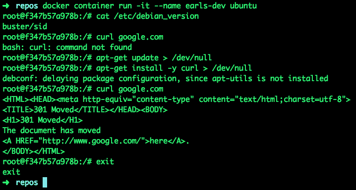
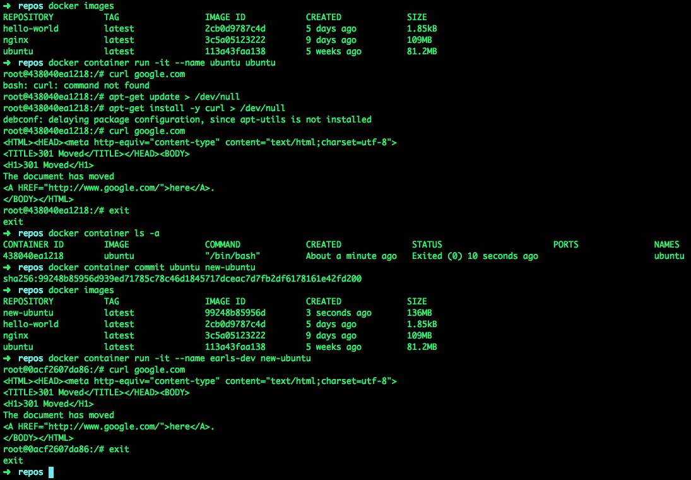
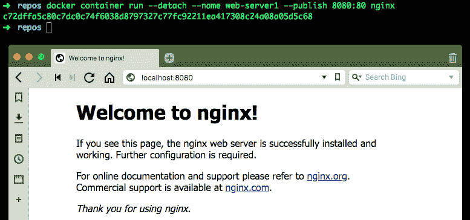

# 二、学习 Docker 命令

在本章中，我们将学习一些基本的 Docker 命令。当我们关注最重要的命令之一`container run`命令时，我们也将涵盖您每天将使用的许多其他命令。这些命令包括列表容器命令、停止容器命令和移除容器命令。在此过程中，我们还将发现其他容器命令，如日志、检查、统计、附加、执行和提交。我想你会发现这一章是 Docker 教育的极好基础。

BIC: The Bureau of International des Containers was founded in 1933 as a neutral, non-profit, international organization whose mission is to promote the safe, secure, and sustainable expansion of containerization and intermodal transportation.

到本章结束时，您将了解以下内容:

*   当前和以前的命令行语法
*   使用版本命令的两种方式
*   如何使用`container run`命令及其许多可选参数
*   如何启动和停止容器，查看关于容器的信息，与正在运行的容器进行交互，以及如何保存和重用对容器所做的更改

# 技术要求

您将从 Docker 的公共 repo 中获取 Docker 映像，并安装 jq 软件包，因此需要基本的互联网访问来执行本章中的示例。

本章代码文件可在 GitHub:
[https://GitHub . com/PacktPublishing/Docker-Quick-Start-Guide/tree/master/chapter 02](https://github.com/PacktPublishing/Docker-Quick-Start-Guide/tree/master/Chapter02)

查看以下视频，查看正在运行的代码:
[http://bit.ly/2P43WNT](http://bit.ly/2P43WNT)

# 关于命令语法的信息

在我们深入学习 Docker 命令及其众多选项之前，我想告诉您 2017 年 1 月发生的对 Docker CLI 的更改。

随着 Docker 的每一个新版本，命令和相关选项的数量都在增加。Docker 认为这种复杂性需要解决。所以，随着 Docker 1.13 版本的发布(Docker 也在 2017 年改变了版本号方案)，CLI 命令被划分到了管理功能组。例如，现在有一个命令容器管理组和一个命令映像管理组。这将改变您运行 Docker 命令的方式。下面是使用新旧`run`命令的一个例子:

```
# the new command syntax...
docker container run hello-world
# the old command syntax...
docker run hello-world
```

这一更改提供了更好的命令组织，但也增加了命令行的冗长性。这是一种交换。目前，据我所知，旧的命令语法仍然适用于所有 Docker 命令，但是对于本书的其余示例，我计划使用新的语法。至少我会努力，因为旧习惯很难改掉。

我想在这里说明的另一点是，大多数命令选项都有短格式和长格式。我将尝试在我的例子中至少分享一次长格式作为选项，这样你就会知道短版本代表什么。如果您安装了 Docker 命令行补全，它将是一个有用的资源，有助于记住新的基于 Docker 管理的命令以及可以与它们一起使用的参数。下面是容器命令的顶层命令完成帮助:


该命令列表为我们提供了本章中要复习的一些命令的预览，因此让我们开始学习 Docker 命令。在[第 1 章](1.html)、*设置 Docker 开发环境*中，我们使用了两个非常常见的 Docker 命令:`version`命令和`run`命令。当你认为你知道关于`version`命令的几乎所有事情时，你可能会惊讶地发现它还有另一个锦囊妙计。Docker 的版本命令还有另一个版本。

# 版本命令

您已经使用`docker --version`命令作为快速测试来确认 Docker 已安装。现在尝试不带破折号的命令:

```
docker version
```

该命令版本为您提供了系统上安装的 Docker 版本的更多详细信息。值得注意的是，我们稍后将讨论的 docker-compose 命令也有两个版本的 version 命令——一个带有提供单行响应的破折号，另一个不带破折号，提供更多细节。

Remember that all the Docker commands have a rich help system built in. Try it by entering any part of a Docker command and using the `--help` parameter. For example, `docker container run --help`.

# Docker 运行命令

既然我们会经常使用`run`命令，我们现在应该看看。您已经以最基本的形式使用了`run`命令:

```
# new syntax
# Usage: docker container run [OPTIONS] IMAGE [COMMAND] [ARG...]
docker container run hello-world

# old syntax
docker run hello-world
```

该命令告诉 Docker，您希望基于描述为 hello-world 的映像运行一个容器。你可能会问自己，当我安装 Docker 时，hello-world 容器映像安装了吗？答案是否定的，`docker run`命令将查看本地容器映像缓存，看是否有与所请求容器的描述相匹配的容器映像。如果有，Docker 将从缓存的映像运行容器。如果在缓存中没有找到所需的容器映像，Docker 将联系 Docker 注册表来尝试下载容器映像，并在此过程中将其存储在本地缓存中。Docker 将从缓存中运行新下载的容器。

Docker 注册表只是一个存储和检索 Docker 映像的集中位置。稍后我们将具体讨论注册表和 Docker 注册表。现在，只需了解有一个本地映像缓存和一个远程映像存储。当我们在[第 1 章](1.html)*中运行 hello-world 容器时，您看到了在本地找不到容器的过程。*以下是 Docker 在本地缓存中找不到容器映像，必须从注册表下载时的情况:


您可以使用 docker `pull`命令为本地 docker 缓存预植入您计划运行的容器映像；例如:

```
# new syntax
# Usage: docker image pull [OPTIONS] NAME[:TAG|@DIGEST]
docker image pull hello-world

# old syntax
docker pull hello-world
```

如果用`pull`命令预取容器镜像，当执行 docker `run`命令时，它会在本地缓存中找到镜像，不需要再次下载。

您可能在前面的截图中注意到，您请求了 hello-world 容器映像，Docker 搜索本地缓存失败，然后从存储库中下载了`hello-world:latest`容器映像。每个容器映像描述由三部分组成:

*   docker registry host name
*   斜线分隔的名称
*   标签名

第一部分，注册表主机名，我们还没有看到或使用，但它是通过公共 Docker 注册表的默认值包含的。只要不指定注册表主机名，Docker 就会不可见地使用公共 Docker 注册表。该注册表主机名为`docker.io`。Docker 注册表的内容可以在[https://hub.docker.com/explore](https://hub.docker.com/explore)浏览。这是 Docker 映像的主要公共商店。可以建立和使用其他公共或私有的映像注册中心，许多公司都会这样做，建立他们自己的私有 Docker 映像注册中心。我们将在第 8 章*Docker 和 Jenkins* 中对此进行更多的讨论。现在，请理解 Docker 映像描述的第一部分是托管容器映像的注册表主机名。值得注意的是，注册表主机名可以包括端口号。这可用于配置为在非默认端口值上提供数据的注册表。

容器映像描述的第二部分是斜线分隔的名称。这部分类似于容器映像的路径和名称。某些官方容器映像不需要指定路径。对于这些映像，您可以简单地指定斜线分隔名称的名称部分。在我们的例子中，这是描述的 hello-world 部分。

容器映像描述的第三部分是标签名。这一部分被认为是映像的版本标签，但它不需要仅由数字组成。标签名称可以是任意一组 ASCII 字符，包括大小写字母、数字、破折号、下划线或句点。关于标签名的唯一限制是不能以句点或破折号开头，并且必须少于或等于 128 个字符。标记名与斜杠分隔的名称之间用冒号隔开。这就把我们带回了之前看到的`hello-world:latest`映像描述。与注册表主机名一样，标记名也有默认值。该默认值为`latest`。在我们的例子中，使用的标签名是默认的，它在搜索和下载中显示为`hello-world:latest`。在下面的示例中，您可以看到所有这些操作:


我们用`docker images`命令确认我们的本地映像缓存是空的，然后我们提取完全合格的 hello-world 映像将其预取到我们的本地缓存中。然后，我们使用了与前面所有 hello-world 示例中相同的简短描述，Docker 无需再次下载即可运行容器，显示使用了默认值，并且它们与完全限定的值相匹配。

好了，现在我们已经了解了 Docker `run`命令的所有基础知识，让我们更深入地研究一下您可以使用`run`命令的一些可选参数。如果您查看完整的`run`命令语法，您将看到以下内容:

```
# Usage: docker container run [OPTIONS] IMAGE [COMMAND] [ARG...]
```

注意命令的最后部分是`[COMMAND] [ARG...]`。这告诉我们`container run`命令有一个可选的命令参数，也可以包含自己的可选参数。Docker 容器映像是用默认命令构建的，该命令在您基于映像运行容器时执行。对于 hello-world 容器，默认命令是`/hello`。对于一个完整的 Ubuntu OS 容器，默认命令是`bash`。每当您运行一个 Ubuntu 容器并且没有指定一个命令在容器中运行时，将使用默认命令。如果这还没有多大意义，不要担心——我们将在本章后面的*回到 Docker 运行命令*部分介绍默认命令并在运行时覆盖它。现在，只要知道当您运行一个容器时，它将执行一个命令就足够了，该命令要么是默认命令，要么是要在运行的容器中执行的覆盖命令(如果提供给`container run`命令)。最后一个注意事项:当正在运行的容器(默认或覆盖)正在执行的命令终止时，容器将退出。在我们使用 hello-world 容器的示例中，一旦`/hello`命令在容器内终止，hello-world 容器就会退出。稍后，您将了解更多关于运行容器和已退出容器之间的区别。

现在，我们将使用我最喜欢的可选参数之一`--rm`继续我们的`run`命令讨论。这里需要一点背景信息。您可能还记得[第 1 章](1.html)、*建立 Docker 开发环境*时，Docker 的形象是由层组成的。每当您运行 docker 容器时，它实际上只是使用本地缓存的 docker 映像(这是一个层的栈)，并在顶部创建一个新的层，即读/写层。容器运行期间发生的所有执行和更改都存储在它自己的读/写层中。

# 列表容器命令

可以使用以下命令显示正在运行的容器的指示:

```
# Usage: docker container ls [OPTIONS]
docker container ls
```

这是 list containers 命令，没有任何附加参数，它将列出当前运行的容器。我说的当前运行是什么意思？容器是系统上运行的特殊进程，与系统上的其他进程一样，容器可以停止或退出。但是，与系统上的其他类型的进程不同，容器的默认行为是在停止时留下其读/写层。这是因为如果需要，您可以重新启动容器，保留它退出时的状态数据。举个例子，假设你运行一个作为操作系统的容器，比如 Ubuntu，在那个容器中你安装`wget`。容器退出后，可以重启，仍然会安装`wget`。请记住，每个运行的容器都有自己的读/写层，所以，如果你运行一个 Ubuntu 容器并安装`wget`，那么你运行另一个 Ubuntu 容器，它就不会有`wget`。容器之间不共享读/写层。然而，如果你重启一个安装了`wget`的容器，它仍然会被安装。

因此，正在运行的容器和停止的容器之间的区别在于，进程要么正在运行，要么已经退出，留下了自己的读/写层。list containers 命令有一个参数，允许您列出所有容器，包括正在运行的容器和已经退出的容器。你可能已经猜到了，是`--all`参数，看起来是这样的:

```
# short form of the parameter is -a
docker container ls -a
# long form is --all
docker container ls --all

# old syntax
docker ps -a
```

现在，让我们回到我最喜欢的可选运行命令参数之一，`--rm`参数:

```
# there is no short form of the --rm parameter
docker container run --rm hello-world
```

此参数指示 Docker 在容器退出时自动移除容器的读/写层。当您运行没有`--rm`参数的 docker 容器时，容器退出时会留下容器数据，以便容器以后可以再次重新启动。但是，如果在运行容器时包含`--rm`参数，则容器退出时，容器的所有读/写数据都会被删除。该参数提供了一个对`exit`功能的简单清理，你会发现它非常有用。让我们用刚才讨论的 run 和`container ls`命令来看一个快速的例子:


首先，我们确认本地缓存中有 hello-world 映像。接下来，我们列出了系统中所有的容器，包括运行的和退出的。请注意映像和容器之间的区别。如果您熟悉 VMware，这个类比有点像模板和虚拟机。接下来，我们使用`--rm`参数运行 hello-world 容器。hello-world 容器打印它的消息，然后立即退出(我们将输出重定向到`/dev/null`以保持示例输出简短)。接下来，我们再次列出容器，因为我们看到 hello-world 容器的读/写数据在容器退出时被自动移除。之后，我们再次运行 hello-world 容器，但这次没有使用`--rm`参数。当我们这次列出容器时，我们看到了(退出的)容器的指示。通常你会运行一个容器，知道以后再也不需要重启了，使用`--rm`参数自动清理就很得心应手了。但是如果不使用`--rm`参数呢？你是否被不断增长的容器清单所困扰？当然不是。Docker 对此有命令。这是`container rm`命令。

# 移除容器命令

remove container 命令如下所示:

```
# the new syntax
# Usage: docker container rm [OPTIONS] CONTAINER [CONTAINER...]
docker container rm cd828234194a

# the old syntax
docker rm cd828234194a
```

该命令需要唯一标识容器的值；在本例中，我使用了我们刚刚运行的 hello-world 容器的完整容器 ID。您可以使用容器标识的前几个字符，只要它在系统上的所有容器之间提供唯一的标识符。唯一识别容器的另一种方法是通过分配给它的`name`。Docker 将在您运行它时为您的容器提供一个唯一的随机生成的名称。在前面的例子中，随机分配的名字是`competent_payne`。所以我们可以像这样使用 remove 命令:

```
# using the randomly generated name docker container rm competent_payne
```

虽然 docker 提供的随机生成的名称比它分配的容器标识更容易让人阅读，但它们可能仍然没有您想要的那么相关。这就是为什么 docker 为`run`命令提供了一个可选参数来命名您的容器。下面是一个使用`--name`参数的例子:

```
# using our own name docker container run --name hi-earl hello-world
```

现在当我们列出所有的容器时，我们可以看到我们的容器有名称`hi-earl`。当然，您可能希望使用更好的容器名称，也许是描述容器执行的功能的名称，例如`db-for-earls-app`。

Note: Like the container IDs, the container names must be unique on a host. You cannot have two containers (even if one has exited) that have the same name. If you will have more than one container running the same image, such as web server image, name them uniquely, for example, web01 and web02.


通过在命令行上为每个容器提供唯一的标识符，可以同时删除多个容器:

```
# removing more than one docker container rm hi-earl hi-earl2
```

通常，只有在容器退出后，您才会移除它们，例如我们一直在使用的 hello-world 容器。但是，有时即使容器当前正在运行，您也会想要删除它。您可以使用`--force`参数来处理这种情况。下面是一个使用 force 参数移除正在运行的容器的示例:

```
# removing even if it is running docker container rm --force web-server
```

这就是它的样子:


请注意，在第一个`container ls`命令中，我们没有使用`--all`参数。这提醒我们 web 服务器容器正在运行。当我们试图移除它时，我们被告知容器仍在运行，不会被移除。这是一个很好的保护措施，有助于防止移动正在运行的容器。接下来，我们使用 force 命令，在没有任何警告的情况下移除了正在运行的容器。最后，我们执行了另一个`container ls`命令，包括`--all`参数，以显示这次我们的容器的读/写数据实际上被移除了。

If you have set up Docker command completion, you can type in the command up to where you need to enter the unique identifier for the container(s) and then use the *Tab *key to get a list of containers, tabbing to the one you want to delete. Once you've highlighted the container to delete, use the space or *Enter* key to select it. You can hit *Tab* again to select another container to delete more than one at a time. Once you have all the containers selected, press *Enter* to execute the command. Remember that you will only see stopped containers when you tab for the `rm` command unless you include the force parameter, `rm -f`.

有时，您可能想要移除系统上所有的容器，无论是否正在运行。有一个有用的方法来处理这种情况。您可以结合`container ls`命令和容器移除命令来完成工作。您将在`container ls`命令中使用一个新的参数来完成这个操作，即`--quiet`参数。该命令指示 Docker 只返回容器标识，而不是带有标题的完整列表。下面是命令:

```
# list just the container IDs docker container ls --all --quiet
```

现在我们可以将*命令返回的值作为输入参数输入到*容器移除命令中。它看起来像这样:

```
# using full parameter names
docker container rm --force $(docker container ls --all --quiet)
# using short parameter names
docker container rm -f $(docker container ls -aq)

# using the old syntax
docker rm -f $(docker ps -aq)
```

这将从您的系统中移除所有运行和退出的容器*的*和*，所以要小心！*

You will probably use this shortcut often, so creating a system alias for it is pretty handy.
You can add something like the following to your `~/.bash_profile` or `~/zshrc` file: `alias RMAC='docker container rm --force $(docker container ls --all --quiet)'`.

许多容器被设计为立即运行和退出，比如我们已经使用过几次的 hello-world 示例。创建其他容器的映像是为了当您使用它运行一个容器时，该容器将继续运行，提供一些持续有用的功能，例如服务网页。当您运行一个持久化的容器时，它将保留前台进程，直到退出，并附加到进程:标准输入、标准输出和标准错误。这对于一些测试和开发用例来说是可以的，但是通常情况下，这对于生产容器来说是不希望的。相反，最好将`container run`作为后台进程，一旦终端会话启动，就让您重新控制终端会话。当然，这是有参数的。它是`--detach`参数。下面是使用该参数的情况:

```
# using the full form of the parameter
docker container run --detach --name web-server --rm nginx
# using the short form of the parameter
docker container run -d --name web-server --rm nginx
```

使用此参数会将进程从前台会话中分离出来，并在容器启动后立即将控制权返回给您。你的下一个问题可能是，如何停止分离的容器？很高兴你问了。您使用`container stop`命令。

# 停止容器命令

停止命令很容易使用。以下是命令的语法和示例:

```
# Usage: docker container stop [OPTIONS] CONTAINER [CONTAINER...]
docker container stop web-server
```

在我们的例子中，我们在运行容器时使用了`--rm`参数，所以容器一停止，读/写层就会被自动删除。像许多 Docker 命令一样，您可以提供多个唯一的容器标识符作为参数，用一个命令停止多个容器。

现在你可能想知道如果我使用`--detach`参数，我如何看到容器发生了什么？有几种方法可以从容器中获取信息。在我们继续我们的运行参数探索之前，让我们看一下其中的一些。

# 容器日志命令

当您在前台运行容器时，容器发送到标准输出的所有输出和标准错误都会显示在运行该容器的会话的控制台中。但是，当您使用`--detach`参数时，容器一启动，会话的控制权就返回，因此您看不到发送到`stdout`和`stderr`的数据。如果您想查看该数据，请使用`container logs`命令。该命令如下所示:

```
# the long form of the command
# Usage: docker container logs [OPTIONS] CONTAINER
docker container logs --follow --timestamps web-server
# the short form of the command
docker container logs -f -t web-server

# get just the last 5 lines (there is no short form for the "--tail" parameter)
docker container logs --tail 5 web-server

# the old syntax
docker logs web-server
```

`--details`、`--follow`、`--timestamps`、`--tail`参数都是可选的，但我在这里收录了，供大家参考。当您使用没有可选参数的`container logs`命令时，它会将容器日志的所有内容转储到控制台。您可以使用带有数字的`--tail`参数来转储最后的行数。可以组合参数(除`--tail`和`--follow`外)得到想要的结果。`--follow`参数就像在查看持续写入的日志时使用`tail -f`命令一样，在写入日志时会显示每一行。您可以使用 *Ctrl* + *C* 退出正在跟踪的日志。`--timestamps`参数对于评估将行写入容器日志的频率非常有用。

# 容器顶部命令

您可能不总是想简单地查看容器的日志；有时您想知道容器中运行的是什么进程。这就是`container top`命令的作用。理想情况下，每个容器运行一个进程，但世界并不总是理想的，因此您可以使用这样的命令来查看目标容器中运行的所有进程:

```
# using the new syntax
# Usage: docker container top CONTAINER [ps OPTIONS]
docker container top web-server

# using the old syntax
docker top web-server
```

如您所料，`container top`命令一次仅用于查看单个容器的进程。

# 容器检查命令

当您运行一个容器时，有很多元数据与该容器相关联。很多时候，您会想要查看该元数据。这样做的命令是:

```
# using the new syntax
# Usage: docker container inspect [OPTIONS] CONTAINER [CONTAINER...]
docker container inspect web-server

# using the old syntax
docker inspect web-server
```

如上所述，该命令返回大量数据。您可能只对元数据的一个子集感兴趣。可以使用`--format`参数缩小返回的数据。看看这些例子:

*   获取一些状态数据:

```
# if you want to see the state of a container you can use this command
docker container inspect --format '{{json .State}}' web-server1 | jq

# if you want to narrow the state data to just when the container started, use this command
docker container inspect --format '{{json .State}}' web-server1 | jq '.StartedAt'
```

*   获取一些`NetworkSettings`数据:

```
# if you are interested in the container's network settings, use this command
docker container inspect --format '{{json .NetworkSettings}}' web-server1 | jq

# or maybe you just want to see the ports used by the container, here is a command for that
docker container inspect --format '{{json .NetworkSettings}}' web-server1 | jq '.Ports'

# maybe you just want the IP address used by the container, this is the command you could use.
docker container inspect -f '{{json .NetworkSettings}}' web-server1 | jq '.IPAddress'
```

*   使用一个命令获取多个容器的数据:

```
# maybe you want the IP Addresses for a couple containers
docker container inspect -f '{{json .NetworkSettings}}' web-server1 web-server2 | jq '.IPAddress'

# since the output for each container is a single line, this one can be done without using jq
docker container inspect -f '{{ .NetworkSettings.IPAddress }}' web-server1 web-server2 web-server3
```

这些例子大多使用 json 处理器`jq`。如果您还没有在系统上安装它，现在是安装的好时机。以下是在我们在本书中使用的每个操作系统上安装`jq`的命令:

```
# install jq on Mac OS
brew install jq

# install jq on ubuntu
sudo apt-get install jq

# install jq on RHEL/CentOS
yum install -y epel-release
yum install -y jq

# install jq on Windows using Chocolatey NuGet package manager
chocolatey install jq
```

检查命令的`--format`参数使用 go 模板。您可以在 Docker 文档页面上找到关于它们的更多信息，用于格式化输出:[https://docs.docker.com/config/formatting](https://docs.docker.com/config/formatting)。

# 容器统计命令

另一个非常有用的 Docker 命令是 stats 命令。它为一个或多个正在运行的容器提供实时的、持续更新的使用统计数据。这有点像使用 Linux `top`命令。您可以运行不带参数的命令来查看所有正在运行的容器的统计信息，也可以提供一个或多个唯一的容器标识符来查看一个或多个容器的特定容器的统计信息。以下是使用该命令的一些示例:

```
# using the new syntax, view the stats for all running containers
# Usage: docker container stats [OPTIONS] [CONTAINER...]
docker container stats

# view the stats for just two web server containers
docker container stats web-server1 web-server2

# using the old syntax, view stats for all running containers
docker stats
```

当你看到足够的统计数据时，你可以使用 C *trl* + *C* 退出视图。

回到`run`命令参数，接下来，我们将讨论通常一起使用的`run`命令的两个参数。有时候你运行一个容器，你想和它进行一个交互会话。例如，您可能运行一个容器，该容器在一个或多或少已满的操作系统(如 Ubuntu)中执行一些应用，并且您希望能够访问该容器来更改配置或调试一些问题，类似于使用 SSH 连接到服务器。与 Docker 的大多数事情一样，实现这一点的方法不止一种。一种常见的方法是对运行命令使用两个可选参数:`--interactive`和`--tty`。现在让我们来看看这是如何工作的。您已经看到了如何使用`--detach`参数启动与我们正在运行的容器断开连接:

```
# running detached docker container run --detach --name web-server1 nginx
```

当我们运行这个命令来启动我们的 nginx web 服务器并浏览到`http://localhost`时，我们发现它并没有提供我们期望的欢迎页面。因此，我们决定进行一些调试，并且决定使用两个`--interactive`和`--tty`参数交互运行它，而不是从我们的容器中分离。现在，由于这是一个 nginx 容器，它有一个默认命令，在容器启动时执行。那个命令是`nginx -g 'daemon off;'`。因为这是默认命令，所以与容器交互对我们没有任何好处。因此，我们将通过为运行命令提供一个参数来覆盖默认命令。它看起来像这样:

```
# using the long form of the parameters
docker container run --interactive --tty --name web-server2 nginx bash

# using the short form of the parameters (joined as one), which is much more common usage
docker container run -it --name web-server2 nginx bash
```

该命令将像以前一样运行容器，但它将执行`bash`命令，而不是执行默认命令。它还会打开一个终端会话，与我们可以交互的容器进行交互。根据需要，我们可以作为`root`用户在容器内部执行命令。我们可以查看文件夹和文件，我们可以编辑配置设置，我们可以安装软件包，等等。我们甚至可以运行映像的默认命令来查看我们是否解决了任何问题。这里有一个有点做作的例子:


您可能已经注意到`-p 80:80`参数。这是发布参数的简短形式，我们将在*回到 Docker 运行命令*一节中讨论。使用`container ls`命令，您可以看到使用默认命令运行容器和使用覆盖命令运行容器之间的区别:


网络服务器运行使用默认 CMD，网络服务器 2 使用覆盖 CMD `bash`。这是一个人为的例子来帮助你理解这些概念。一个真实的例子可能是当您想要与基于操作系统的容器交互连接时，比如 Ubuntu。大家可能还记得在[第 1 章](1.html)、*建立 Docker 开发环境*的开头，说在一个 Ubuntu 容器中运行的默认命令是`bash`。既然是这种情况，您就不必提供命令来覆盖默认值。您可以使用如下运行命令:

```
# running interactively with default CMD docker container run -it --name earls-dev ubuntu
```

通过这个`container run`命令，你被连接到你运行的 Ubuntu 容器的一个交互终端会话。当 ssh 进入 Ubuntu 服务器时，你可以做任何你通常会做的事情。你可以用`apt-get`安装软件，你可以查看正在运行的进程，你可以执行`top`命令，等等。可能是这样的:



还有其他几个容器命令可以帮助您与已经运行并分离的容器进行交互。现在让我们快速看一下这些命令。

# 容器附加命令

假设您有一个正在运行的容器。它当前已从您的终端会话中分离。您可以使用`container attach`命令使该容器的执行进程成为终端会话的前台进程。让我们使用之前使用的 web 服务器示例:

```
# run a container detached
docker container run --detach -it --name web-server1 -p 80:80 nginx

# show that the container is running
docker container ps

# attach to the container
# Usage: docker container attach [OPTIONS] CONTAINER
docker container attach web-server1

# issue a *Ctrl* + *PQ* keystroke to detach (except for Docker on Mac, see below for special Mac instructions)

# again, show that the container is running detached.
docker container ps
```

当您附加到正在运行的容器时，它的执行命令将成为终端会话的前台进程。要脱离容器，需要发出*Ctrl* + *PQ* 键。如果您发出 *Ctrl* + *C* 键击，容器的执行过程将收到一个符号信号并终止，这反过来将退出容器。这通常是不可取的。所以记得用 *Ctrl* + *PQ* 键分离。

但是，在 macOS 上有一个已知的问题:对于 Mac 上的 Docker 来说， *Ctrl* + *PQ* 键击不起作用，除非您在`attach`命令上使用另一个参数`--sig-proxy=false`参数，否则您将无法脱离容器，除非使用 *Ctrl* + *C* 键击终止容器:

```
# when you are using Docker for Mac, remember to always add the "--sig-proxy=false" parameter
docker attach --sig-proxy=false web-server1
```

当您向`attach`命令提供`--sig-proxy=false`参数时，您可以向附加的容器发出 *Ctrl* + *C* 键击，它将脱离，而不会向容器进程发送信号，从而保持容器运行，再次脱离您的终端会话:


# 容器执行命令

有时，当一个容器被分离运行时，您可能想要访问它，但不想附加到正在执行的命令。您可以通过使用 container exec 命令来实现这一点。此命令允许您在运行的容器中执行另一个命令，而不会附加到或干扰已经运行的命令。该命令通常用于创建与已经运行的容器的交互会话，或者在容器中执行单个命令。该命令如下所示:

```
# start an nginx container detached
docker container run --detach --name web-server1 -p 80:80 nginx

# see that the container is currently running
docker container ls

# execute other commands in the running container
# Usage: docker container exec [OPTIONS] CONTAINER COMMAND [ARG...] docker container exec -it web-server1 bash
docker container exec web-server1 cat /etc/debian_version

# confirm that the container is still running 
docker container ls
```

当`exec`命令完成时，您退出 bash shell，或者文件内容已经被替换，然后它退出回到终端会话，保持容器运行分离:


在我们继续讨论许多可选的`container run`参数之前，让我们看一下另一个 Docker 命令。

# 容器提交命令

重要的是要知道，当您附加到一个正在运行的容器并对其进行更改时，例如安装新的包或更改配置文件，这些更改只适用于该正在运行的容器。例如，如果您使用 Ubuntu 映像运行一个容器，然后将`curl`安装到该容器中，则更改不会应用回您运行该容器的映像，在本例中，是 Ubuntu。如果您要从同一个 Ubuntu 映像启动另一个容器，您需要再次安装`curl`。但是，如果您希望在运行的容器中所做的更改保持不变，并在运行新容器时可用，您可以使用`container commit`命令。`container commit`命令允许您将容器的当前读/写层与原始映像的层一起保存，创建一个全新的映像。当您使用新映像运行容器时，它将包括您所做的更改，并使用`container commit`命令保存。以下是`container commit`命令的样子:

```
# Usage: docker container commit [OPTIONS] CONTAINER [REPOSITORY[:TAG]]
docker container commit ubuntu new-ubuntu
```

这里有一个例子，使用`container commit`命令将`curl`安装到一个正在运行的容器中，然后创建一个包含已安装的`curl`命令的新容器:



有了这个例子，我现在可以从`ubuntu-curl`映像运行新的容器，并且它们都已经安装了`curl`命令。

# 返回到 Docker 运行命令

现在，让我们回到对`container run`命令的讨论。之前，您看到了一个使用带有`--publish`参数的`run`命令的例子。使用可选的发布参数可以指定将打开哪些与运行容器相关的端口。`--publish`参数包括用冒号分隔的成对端口号。例如:

```
# create an nginx web-server that redirects host traffic from port 8080 to port 80 in the container
docker container run --detach --name web-server1 --publish 8080:80 nginx
```

第一个端口号与运行容器的主机相关联。在 nginx 示例中，`8080`暴露在主机上；在我们的情况下，这将是`http://localhost:8080`。第二个端口号是正在运行的容器上打开的端口。在这种情况下，应该是`80`。说出`--publish 8080:80`参数的描述，您会说类似于，发送到端口`8080` *o* n 的流量被重定向到运行容器上的端口`80`:



区分主机端口和容器端口非常重要。我可以在同一个系统上运行几个容器，它们都暴露端口`80`，但是只有一个容器可以有来自主机上每个端口的流量。请看下面的例子，以便更好地理解:

```
# all of these can be running at the same time
docker container run --detach --name web-server1 --publish 80:80 nginx
docker container run --detach --name web-server2 --publish 8000:80 nginx
docker container run --detach --name web-server3 --publish 8080:80 nginx
docker container run --detach --name web-server4 --publish 8888:80 nginx # however if you tried to run this one too, it would fail to run 
# because the host already has port 80 assigned to web-server1
docker container run --detach --name web-server5 --publish 80:80 nginx
```

要知道这是一般网络的限制，而不是 Docker 或容器的限制。这里我们可以看到这些命令及其输出。请注意端口和名称，以及已用作端点的端口的使用如何失败:


这是关于`container run`命令的各种选项参数的大量数据。这不是所有的选项参数，但它应该足以让你有一个很好的开始。如果您想了解更多关于我们探索的可选参数的信息，或者想了解我们在这里没有介绍的参数，请访问`container run`命令的 docker documents 页面，该页面可在[https://docs.docker.com/engine/reference/run/](https://docs.docker.com/engine/reference/run/)找到。

# 摘要

在本章中，我们了解了 Docker 映像描述和 Docker 注册表的一些信息。然后我们看到版本命令还有另一种形式。之后，我们探索了很多 Docker 容器命令，包括`run`、`stop`、`ls`、`logs`、`top`、`stats`、`attach`、`exec`，以及`commit`命令。最后，我们找到了如何通过打开主机和容器的端口来公开容器。您应该已经对可以使用 Docker 做的事情感到非常满意，但是请稍等——在[第 3 章](3.html)、*创建 Docker 映像*中，我们将向您展示如何使用`Dockerfile`和映像构建命令创建您自己的 Docker 映像。如果你准备好了，翻开新的一页。

# 参考

*   Docker 注册表:https://hub . docker . com/explore/
*   `container run`命令的所有参数:[https://docs.docker.com/engine/reference/run/](https://docs.docker.com/engine/reference/run/)
*   使用`--format`参数和容器检查命令:[https://docs.docker.com/config/formatting](https://docs.docker.com/config/formatting)
*   json jq 解析器:[https://stedolan . github . io/jq/](https://stedolan.github.io/jq/)
*   巧克力视窗软件包管理器:[https://chocolatey.org/](https://chocolatey.org/)