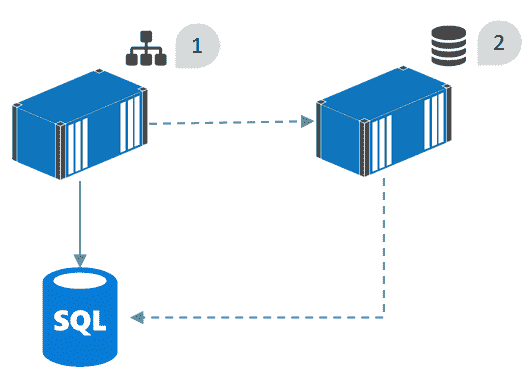
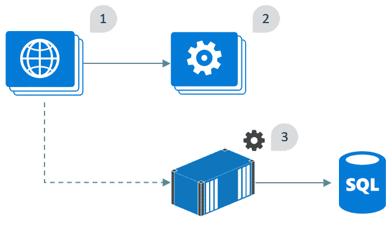
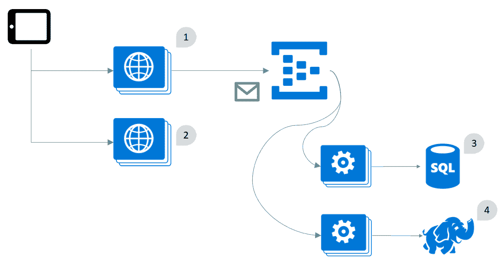
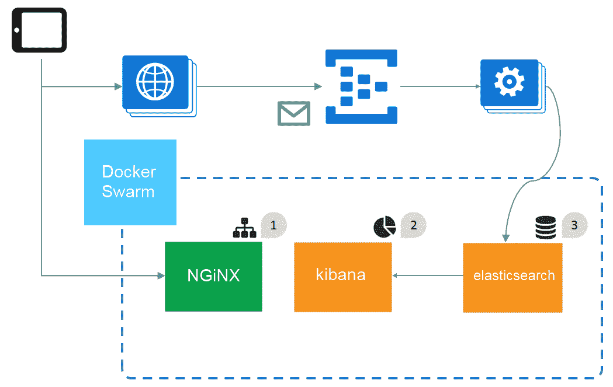
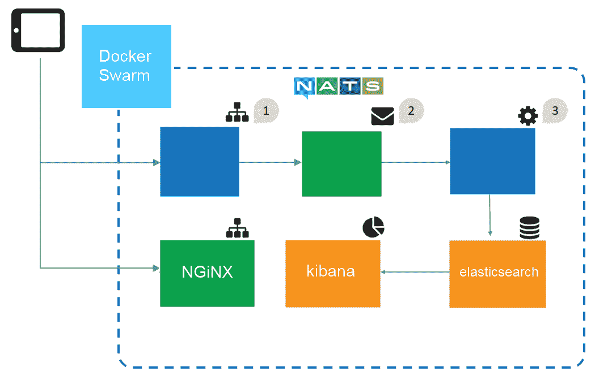

# 将你所知道的内容容器化-实施 Docker 的指南

在这本书里，我用了旧的。NET 技术，向您展示 Docker 与它们一起工作就像与现代的一样好。NET 核心应用。您可以记录一个十年前的网络表单应用，并获得许多与在容器中运行绿地 ASP.NET 核心网络应用相同的好处。

您已经看到了许多容器化应用的例子，并了解了如何使用 Docker 构建、运输和运行生产级应用。现在，您已经准备好开始与 Docker 合作您自己的项目，本章将为您提供如何开始的建议。

我将介绍一些技术和工具，这些技术和工具将帮助您运行概念验证项目，将应用转移到 Docker。我还将向您介绍一些案例研究，向您展示我是如何将 Docker 引入现有项目的:

*   小规模的。NET 2.0 网络表单应用
*   一款 **Windows 通信基础** ( **WCF** )应用中的数据库集成服务
*   运行在 Azure 中的分布式物联网应用编程接口应用

您将看到如何处理典型的问题，以及转到 Docker 如何帮助解决这些问题。

# 记录你所知道的

当您迁移到一个新的应用平台时，您必须使用一组新的工件和新的操作流程。如果您当前使用 Windows 安装程序进行部署，您的工件是 Wix 文件和 MSIs。您的部署过程是将 MSI 复制到目标服务器，登录并运行安装程序。

移动到 Docker 后，您将拥有 Docker 文件和映像作为部署工件。您将映像推送到注册表，并运行容器或更新服务来部署应用。Docker 中的资源和活动更简单，并且它们在项目之间是一致的，但是当您开始时，仍然有一个学习曲线。

将你熟知的应用容器化是为学习体验提供坚实基础的好方法。当您第一次在容器中运行您的应用时，您可能会看到错误或不正确的行为，*，但这将属于您自己的应用领域*。当您追踪问题时，您将处理您非常了解的领域，因此尽管平台是新的，但问题应该很容易识别。

# 选择简单的概念验证应用

Docker 非常适合分布式应用，在分布式应用中，每个组件都运行在一个轻量级容器中，从而有效利用最少的硬件。您可以为您的第一个 Docker 部署选择一个分布式应用，但是更简单的应用会更快地迁移，并且会给您带来更高的成功机会。

单片应用是个不错的选择。它不一定是一个小的代码库，但是它与其他组件的集成越少，它在 Docker 中运行的速度就越快。在 SQL Server 中存储状态的 ASP.NET 应用是一个简单的选项。通过一个简单的应用，您可以期望在一两天内运行一个**概念验证** ( **概念验证**)。

从编译后的应用开始，而不是从源代码开始，这是一个很好的方法来证明应用可以被 Dockerized，而不必进行更改。选择 PoC 应用时，需要考虑几个因素:

*   **状态**:如果你的目标应用将状态存储在内存中，你将无法通过运行多个容器来扩展 PoC。每个容器都有它自己的状态，当请求被不同的容器处理时，你会得到不一致的行为，除非你也运行一个支持粘性会话的反向代理。考虑无状态应用或可以使用共享状态的应用，例如使用 SQL Server 作为 ASP.NET 的会话状态提供程序。
*   **配置**:NET 应用通常在`Web.config`或`app.config`中使用 XML 配置文件。您可以将 PoC 设置为使用现有的配置文件作为基础，然后交换出不适用于容器化环境的任何值。最好通过带有环境变量和机密的 Docker 读取配置设置，但是对于 PoC 来说，保留配置文件更容易。
*   **弹性**:较旧的应用通常假设可用性——网络应用期望数据库总是可用的，并且不能优雅地处理故障情况。如果您的应用没有外部连接的重试逻辑，当容器启动时，如果出现短暂的连接故障，您的 PoC 将面临错误。您可以在 Dockerfile 中通过检查启动时的依赖关系和正在进行的运行状况检查来缓解这种情况。
*   **Windows 身份验证**:容器没有加入域。如果您在 AD 中创建了一个组管理服务帐户，则可以访问容器中的**活动目录** ( **AD** )对象，但这增加了复杂性。对于 PoC，坚持使用更简单的认证方案，如基本认证。

这些都不是主要限制。您应该能够在不更改代码的情况下，在容器化现有应用的基础上工作，但是您需要意识到功能在 PoC 阶段可能并不完美。

# 用 Image2Docker 生成初始 Docker 文件

Image2Docker 是一个开源工具，可以用来为现有应用生成 Dockerfile。它是一个 PowerShell 模块，您可以在本地机器上运行，也可以针对远程机器或虚拟机磁盘文件运行(在 Hyper-V 中，文件采用`VHD`或`VHDX`格式)。

这是开始使用 Docker 的一个非常简单的方法——你甚至不需要在你的机器上安装 Docker 来试用它，看看 Dockerfile 对你的应用来说会是什么样子。Image2Docker 可以处理不同类型的应用(称为**工件**，但是对于运行在 IIS 上的 ASP.NET 应用来说，该功能已经成熟。

在我的开发机器上，我有一个部署到**互联网信息服务** ( **IIS** )的 ASP.NET 应用。我可以将该应用迁移到 Docker，方法是从 PowerShell 库中安装 Image2Docker，并导入该模块以在本地使用它:

```
Install-Module Image2Docker
Import-Module Image2Docker
```

PowerShell 5.0 is the minimum required version for `Image2Docker`, but the tool has no other dependencies.

我可以运行`ConvertTo-Dockerfile` cmdlet，指定 IIS 工件来构建一个包含我机器上所有 IIS 网站的 Dockerfile:

```
ConvertTo-Dockerfile -Local -Artifact IIS -OutputPath C:\i2d\iis
```

这将在`C:\i2d\iis`创建一个目录，在这个文件夹中，我将为每个网站创建一个 Dockerfile 和子目录。`Image2Docker`将网站内容从源位置复制到输出位置。Dockerfile 为其找到的应用使用最相关的基础映像，即`microsoft/iis`、`microsoft/aspnet`或`microsoft/aspnet:3.5`。

如果源上有多个网站或网络应用，`Image2Docker`将它们全部提取出来，并构建一个单一的 Dockerfile，该 Docker file 复制了原始 IIS 设置，因此 Docker 映像中将有多个应用。这不是我的目标，因为我希望 Docker 映像中有一个单独的应用，所以我可以用一个参数来提取一个单独的网站:

```
ConvertTo-Dockerfile -Local -Artifact IIS -ArtifactParam SampleApi -OutputPath C:\i2d\api
```

过程是相同的，但是这一次，`Image2Docker`只从源中提取了一个应用——在`ArtifactParam`参数中命名的那个。Dockerfile 包含部署应用的步骤，您可以运行`docker image build`来创建映像并运行应用。

这可能是应用 Dockerizing 的第一步，然后运行一个容器并检查应用的功能。可能需要额外的设置，`Image2Docker`不适合您，因此您可能需要迭代生成的 Dockerfile，但是该工具是一个很好的开始方式。

`Image2Docker` is an open source project. The source is on GitHub – use the following short link to view it: [https://github.com/docker/communitytools-image2docker-win](https://github.com/docker/communitytools-image2docker-win). The tool has not been updated recently, as Docker now have a commercial alternative called Docker Application Convertor (DAC). DAC has a much greater feature set since it supports Linux and Windows applications. You can see it demonstrated in DockerCon sessions on YouTube: [https://is.gd/sLMOa1](https://is.gd/sLMOa1).

# 让其他利益攸关方参与进来

成功的 PoC 应该在几天内就能实现。其输出将是一个在 Docker 中运行的示例应用，以及一组实现该概念验证所需的额外步骤。如果您在一个 DevOps 环境中工作，在这个环境中，您的团队拥有您项目的交付，您可以同意进行投资，转移到 Docker 进行生产。

对于更大的项目或更大的团队，您需要与其他利益相关方合作，进一步推进您的 PoC。您的对话类型将取决于您的组织结构，但有一些主题侧重于您通过 Docker 获得的改进:

*   当需要部署应用时，运营团队在从开发到移交的过程中经常会遇到摩擦。Docker 工件、Docker 文件和 Docker 组合文件是开发和操作可以一起工作的中心点。不存在运营团队无法部署升级的风险，因为升级将是已经尝试和测试过的 Docker 映像。
*   大公司的安全团队经常需要证明出处。他们需要证明在生产中运行的软件没有被篡改，并且实际上正在运行单片机中的代码。现在这可能是流程驱动的，但是有了映像签名和 Docker 内容信任，就可以明确证明这一点。在某些情况下，安全性还需要证明一个系统只能在经过认证的硬件上运行，而在 Docker Swarm 中使用安全标签和约束很容易做到这一点。
*   产品所有者经常试图平衡大量积压和长时间的发布时间表。企业号。NET 项目通常很难部署——升级过程缓慢、手动且有风险。有一个部署阶段，然后是用户测试阶段，在此期间，应用对普通用户是离线的。相比之下，使用 Docker 的部署是快速、自动化和安全的，这意味着您可以更频繁地进行部署，在功能准备就绪时添加功能，而不是等待几个月等待下一个计划的发布。
*   管理团队将关注产品和运行产品的成本。Docker 通过更高效地利用计算资源和降低许可成本来帮助降低基础架构成本。它有助于降低项目成本，让团队更高效地工作，消除环境之间的差距，从而使部署保持一致。它还有助于提高产品质量，因为自动打包和滚动更新意味着您可以更频繁地部署，更快地添加功能和修复缺陷。

您可以通过为您的概念验证运行**社区版** ( **CE** )来开始使用 Docker，这是您在 Windows 10 上使用 Docker Desktop 获得的。您组织中的其他利益相关者将希望了解对容器中运行的应用的支持。Docker 企业引擎包含在 Windows Server 2016 或 2019 许可成本中，因此您可以免费获得微软和 Docker，Inc .的支持。运营和安全团队可能会在整个 Docker Enterprise 套件中看到很多好处，该套件为您提供了**通用控制平面** ( **UCP** )和 **Docker 可信注册中心** ( **DTR** )。

Docker recently announced that they will be shipping Docker Desktop Enterprise for Mac and Windows. It will have the same great user experience as Docker Desktop, but with support on Windows 10 and the ability to run the same version of the Docker Enterprise Engine locally that your organization is running in production.

PoC 中的 Docker 文件和 Docker 映像在所有这些版本中都将以相同的方式工作。Docker CE、Docker 企业引擎和通用控制平面都共享同一个底层平台。

# 实施 Docker 的案例研究

我将通过三个真实案例研究来结束这一章，在这些案例中，我将 Docker 引入到现有的解决方案中，或者准备了一个路线图来将 Docker 引入到项目中。这些是生产场景，从拥有数十个用户的小公司项目到拥有超过一百万用户的大型企业项目。

# 案例研究 1–内部网络表单应用

几年前，我接受了一家租车公司的网络表单应用的支持。该应用由大约 30 人的团队使用，这是一个小规模的部署——他们有一台服务器托管数据库，一台服务器运行网络应用。虽然很小，但它是业务的核心应用，他们所做的一切都是从这个应用运行的。

该应用有一个非常简单的架构:只有一个网络应用和一个 SQL Server 数据库。最初，我做了大量工作来提高应用的性能和质量。在那之后，它变成了一个管理员角色，我每年会管理两到三个版本，添加新功能或修复旧 bug。

这些发布总是比需要的更加困难和耗时。发布通常包括以下内容:

*   带有更新应用的网络部署包
*   一组带有模式和数据更改的 SQL 脚本
*   验证新特性和检查回归的手动测试指南

部署是在办公时间之外完成的，以便给我们一个时间窗口来解决我们发现的任何问题。我会使用**远程桌面** **协议** ( **RDP** )访问他们的服务，复制工件，并手动运行 Web Deploy 包和 SQL 脚本。发布之间通常需要几个月的时间，所以我会依赖我写的文档来提醒我这些步骤。然后，我会浏览测试指南并检查主要特性。有时，会出现问题，因为我缺少一个 SQL 脚本或 web 应用的依赖项，我需要尝试跟踪一个我之前没有看到的问题。

直到最近，该应用还在 Windows Server 2003 上运行，而 Windows Server 2003 早已不再受支持。当公司想升级 Windows 时，我建议迁移到 Windows Server 2016 Core 和 Docker。我的建议是使用 Docker 来运行 web 应用，让 SQL Server 在自己的服务器上本地运行，但是使用 Docker 作为分发机制来部署数据库升级。

转到 Docker 非常简单。我对生产服务器使用 Image2Docker 来生成一个初始 Dockerfile，然后通过添加运行状况检查和环境变量来进行配置。在 Visual Studio 中，我已经有了一个用于该模式的 SQL Server 项目，因此我添加了另一个 Dockerfile，以便用数据库的部署脚本来打包 Dacpac。只花了两天时间就完成了 Docker 工件，并让新版本在测试环境中运行。这是 Docker 的架构:



*   **1**:web 应用运行在 Windows Docker 容器中。在生产环境中，它连接到一个单独的 SQL Server 实例。在非生产环境中，它连接到在容器中运行的本地 SQL Server 实例。
*   **2** :基于 SQL Server Express 将数据库打包成 Docker 映像，并与数据库模式一起部署在一个 Dacpac 中。在生产中，任务容器从映像运行，以将模式部署到现有数据库。在非生产环境中，运行后台容器来托管数据库。

从那以后，部署变得简单明了，并且总是遵循相同的步骤。我们在 Docker Hub 上有一组私有存储库，其中存储了版本化的应用和数据库映像。我将我的本地 Docker CLI 配置为使用他们的 Docker 引擎，然后执行以下操作:

1.  停止 web 应用容器。
2.  从新数据库映像运行一个容器来升级 SQL Server。
3.  使用 Docker Compose 将网络应用更新为新映像。

迁移到 Docker 的最大好处是快速可靠的发布和减少的基础架构需求。该公司目前正在考虑用更多更小的服务器替换他们当前数量的大型服务器，这样他们就可以运行 Docker Swarm 并实现零停机升级。

另一个好处是发布过程简单。因为部署已经过尝试和测试，使用了将在生产中使用的相同 Docker 映像，所以没有必要让了解应用的人来跟踪问题。该公司的信息技术支持人员现在就发布，没有我的帮助他们也能做到。

I'm working with the same company again to manage their upgrade to the latest Docker Enterprise on Windows Server 2019\. The plan is very simple—I've already built their application and database images on top of the latest Windows Server 2019 Core images and verified that they work with a suite of end-to-end tests. Now, they can perform the server upgrades and deploy the new versions using the same tools and be confident of a successful release.

# 案例研究 2–数据库集成服务

我为一家金融公司开发了一个大型复杂的网络应用。这是一款面向内部的应用，管理着大量交易。前端在 ASP.NET MVC 中，但大部分逻辑在服务层，用 WCF 编写。服务层也是许多第三方应用的门面，隔离了 WCF 层的集成逻辑。

大多数第三方应用都有我们可以使用的 XML web 服务或 JSON REST APIs，但其中一个较旧的应用没有集成选项。我们只将它用于参考数据，因此外观被实现为数据库级集成。WCF 服务公开了封装良好的端点，但是实现直接连接到外部应用数据库来提供数据。

数据库集成很脆弱，因为您必须依赖私有数据库模式而不是公共服务合同，但有时没有其他选择。在这种情况下，模式很少改变，我们可以管理中断。不幸的是，发布过程是由后向前的。运营团队将首先在生产中发布数据库的新版本，因为该应用只有生产中的供应商提供支持。当一切正常时，他们会在开发和测试环境中复制该版本。

有一个版本的数据库模式改变了，破坏了我们的集成。任何使用第三方应用参考数据的功能都停止了工作，我们必须尽快修复。修复很简单，但是 WCF 应用是一个巨大的整体，它需要大量的回归测试，然后我们才能确信这个变化不会影响其他领域。我的任务是将 Docker 视为管理数据库依赖关系的更好方法。

这个提议很简单。我不建议将整个应用转移到 Docker——这已经是一个长期的路线图了——而只是将一项服务转移到 Docker。这方面的 WCF 端点是数据库应用外观将在 Docker 中运行，与应用的其余部分隔离。web 应用是服务的唯一消费者，所以这只是在消费者中更改服务 URL 的一个例子。这是建议的体系结构:



*   **1**:web 应用在 IIS 中运行。代码没有改变，但是配置被更新为使用在容器中运行的新集成组件的 URL。
*   **2** :最初的 WCF 服务继续在 IIS 中运行，但是删除了之前的数据库集成组件。
*   **3** :新的集成组件使用与之前相同的 WCF 契约，但是现在它被托管在一个容器中，隔离了对第三方应用数据库的访问。

这种方法有很多好处:

*   如果数据库模式改变了，我们只需要改变 Dockerized 服务
*   只需更新 Docker 映像，就可以在没有完整应用发布的情况下发布服务更改
*   它是 Docker 的沙盒介绍，因此开发和运营团队可以使用它进行评估

在这种情况下，最重要的好处是减少了测试工作量。对于完整的单片应用，一个版本需要几周的测试。通过将服务分解到 Docker 容器中，只有已经改变的服务需要测试版本。这极大地减少了所需的时间和工作量，从而允许更频繁的发布，从而更快地将新功能发布到业务中。

# 案例研究 3–Azure 物联网应用

我是一个项目的 API 架构师，该项目用于交付移动应用使用的后端服务。有两种主要的原料药。配置应用编程接口是只读的，设备调用它来检查设置和软件的更新。事件应用编程接口是只写的，设备发布了关于用户行为的匿名事件，产品团队使用这些事件为下一代设备的设计决策提供信息。

这些应用编程接口支持超过 150 万台设备。配置 API 需要高可用性；他们必须快速响应设备调用，并扩展到每秒数千个并发请求。事件应用编程接口使用来自设备的数据，并将事件推送到消息队列。监听队列的是两组处理程序:一组在 Hadoop 中存储所有事件数据，用于长期分析，另一组存储事件子集，用于提供实时仪表板。

所有组件都在 Azure 中运行，在项目的高峰期，我们使用云服务、事件中心、SQL Azure 和 HDInsight。建筑是这样的:



*   **1** :事件 API 托管在具有多个实例的云服务中。设备将事件发布到应用编程接口，应用编程接口进行一些预处理，并将它们分批发布到 Azure 事件中心。
*   **2** :配置 API 也托管在一个有多个实例的云服务中。设备连接到应用编程接口来检查软件更新和配置设置。
*   **3** :实时分析数据，用于关键绩效指标的子集。这是为了快速访问而存储在 SQL Azure 中的，因为这些数据量不大。
*   **4** :批量分析数据，用于存储所有设备发布的所有事件。这存储在 HDInsight 中，HDinsight 是 Azure 上的托管 Hadoop 服务，用于长期运行的大数据查询。

这个系统运行成本很高，但它为产品团队提供了许多关于设备使用方式的信息，这些信息被他们输入到下一代的设计过程中。每个人都很高兴，但后来产品路线图被取消了，不会再有设备了，所以我们不得不削减运营成本。

我的工作是将 Azure 账单从每月 5 万美元降低到每月 1 千美元以下。我可能会失去一些报告功能，但是事件 API 和配置 API 必须保持高可用性。

这发生在 Docker 在 Windows 上可用之前，所以我对该架构的第一次修订使用了运行在 Azure 中 Docker Swarm 上的 Linux 容器。我用 Elasticsearch 和 Kibana 替换了系统的分析端，用 Nginx 提供的静态内容替换了配置 API。我离开了习俗。在云服务中运行的. NET 组件，用于向 Azure 事件中心提供设备数据的事件应用编程接口，以及将数据推送到弹性搜索的消息处理程序:



*   **1** :配置 API，现在在 Nginx 作为静态网站运行。配置数据作为 JSON 有效载荷，维护原始的 API 契约。
*   **2** : Kibana 用于实时和历史分析。通过减少存储的数据量，我们显著降低了数据存储需求，但代价是丢失了详细的指标。
*   **3** : Elasticsearch 用于存储传入的事件数据。. NET 云服务仍然用于从事件中心读取，但是这个版本将数据保存在弹性搜索中。

第一次修订为我们节省了所需的成本，主要是通过减少应用编程接口所需的节点数量和我们从设备中存储的数据量。我没有将所有内容都存储在 Hadoop 中，将实时数据存储在 SQL Azure 中，而是集中在弹性搜索上，只存储了一小部分数据。使用 Nginx 来提供配置 API，我们失去了产品团队用于发布配置更新的用户友好特性，但是我们可以用小得多的计算资源运行。

我监督了第二次修订，当时推出了 Windows Server 2016，并支持 Windows 上的 Docker。我在 Docker Swarm 中的现有 Linux 节点上添加了 Windows 节点，并将事件 API 和消息处理程序迁移到 Windows Docker 容器中。当时，我还将消息传递系统转移到了 NATS，运行在一个 Linux 容器中:



*   **1**:Events API 现在托管在 Docker 容器中，但是代码没有改变；这仍然是一个 ASP.NET 网络应用编程接口项目，运行在一个窗口容器中。
*   **2** :消息传递组件正在使用 NATS，而不是事件中心。我们失去了存储和重新处理消息的能力，但是消息队列现在具有与事件应用编程接口相同的可用性。
*   **3** :消息处理程序从 NATS 读取，并将数据保存在弹性搜索中。大部分代码没有改变，但是它现在在一个 Windows 容器中作为一个. NET 控制台应用运行。

第二次修订进一步降低了成本和复杂性:

*   每个组件现在都在 Docker 中运行，所以我可以在开发中复制整个系统
*   所有组件都是用 Docker 文件构建的，并打包成 Docker 映像，因此所有组件都使用相同的工件
*   整个解决方案具有相同的服务级别，在单个 Docker Swarm 上高效运行

在这种情况下，项目注定会结束，用新的解决方案很容易适应。设备使用情况仍会记录下来，并显示在基巴纳仪表盘上。随着时间的推移，使用的设备越来越少，服务需要的计算也越来越少，我们可以从集群中移除节点。最终，该项目将在一个最小的基础架构上运行，可能只是一个双节点群集，运行在 Azure 中的小型虚拟机上，或者它可以移回公司的数据中心。

# 摘要

全世界大大小小的公司都在转向 Windows 和 Linux 上的 Docker。一些主要的驱动因素是效率、安全性和可移植性。许多新项目都是使用容器从头开始设计的，但是有更多的现有项目将从迁移到 Docker 中受益。

在这一章中，我研究了将现有的应用迁移到 Windows 上的 Docker，建议您从自己熟悉的应用开始。一个简短的、限时的 Dockerizing PoC 应用将很快向您展示您的应用在 Dockr 中的样子。PoC 的结果将帮助您了解下一步您需要做什么，以及您需要让谁参与将 PoC 投入生产。

我完成了一些非常不同的案例研究，向您展示了如何在现有项目中引入 Docker。在一个案例中，我使用 Docker 主要是为了打包的好处，在不改变它的情况下运行一个单一的应用，但是为未来的版本提供干净的升级。在另一个例子中，我从一个单一的应用中提取了一个组件，并将其提取出来在一个容器中运行，以减轻发布的测试负担。在最后一种情况下，我将一个现有的解决方案完全迁移到了 Docker，使它运行起来更便宜，更容易维护，并且让我可以选择在任何地方运行它。

我希望这一章帮助你思考如何将 Docker 引入到你自己的项目中，我希望这本书的其余部分已经向你展示了你可以用 Docker 做什么，以及为什么它是如此令人兴奋的技术。感谢您的阅读，请务必查看我的 Pluralsight 课程并在推特上关注我，祝您在 Windows Docker 的旅程中好运！