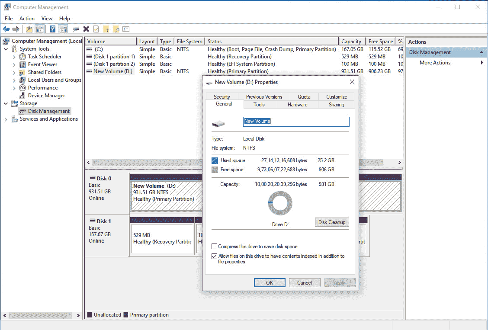
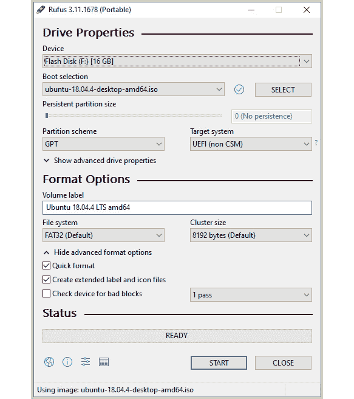

# 零、前言

# 关于书

Docker 容器是高度可扩展软件系统的未来，使创建、运行和部署应用变得容易。

如果你想在不被技术细节淹没的情况下利用它们，把 Docker 研讨会添加到你的阅读列表中！

有了这本书，你将能够快速开始你的知识，并使用交互式活动来处理容器和 Docker。

研讨会首先概述了 Docker 容器，使您能够了解它们是如何工作的。您将运行第三方 Docker 映像，并使用 Docker 文件和多阶段 Docker 文件创建自己的映像。接下来，您将为 Docker 映像创建环境，并通过持续集成加快部署过程。接下来，您将挖掘有趣的主题，并学习如何使用 Docker Swarm 实现生产就绪环境。为了进一步保护 Docker 映像并确保生产环境以最大容量运行，您将应用最佳实践。稍后，您将获得成功地将 Docker 容器从开发转移到测试，然后进入生产的技能。在此过程中，您将学习如何解决问题、清除资源瓶颈和优化服务性能。

到本 Docker 书结束时，您将精通 Docker 基础知识，并且能够在现实世界的用例中使用 Docker 容器。

## 观众

如果你是一个开发人员或者 Docker 初学者，想对 Docker 容器有一个实际的了解，这本书是理想的指南。在开始阅读这本书之前，需要有运行命令外壳的经验以及 IntelliJ、Atom 或 VSCode 编辑器的知识。

## 关于章节

*第 1 章*、*运行我的第一个 Docker 容器*，从 Docker 的基本介绍开始，提供了后台架构、生态系统和基本 Docker 命令的讨论。

*第 2 章*、【Dockerfiles 入门，向您介绍 Dockerfile 及其背景，以及如何使用 Dockerfile 创建和运行您的第一个 Docker 容器。

*第 3 章*、*管理您的 Docker 映像*，提供了有关 Docker 映像、映像存储库和发布您自己的映像的更多详细信息。

*第 4 章*、*多阶段 Dockerfile*向您展示了如何在项目中使用多阶段 Dockerfile 进一步扩展您的 docker file。

*第五章*、*用 Docker Compose* 合成环境，介绍 Docker Compose 以及如何使用 docker-compose 文件生成整个工作环境。

*第 6 章*、*Docker Networking 简介*解释了为什么在 Docker 中需要以不同的方式处理网络，以及如何实现服务和主机系统之间的通信。

*第 7 章*、*Docker 仓库*，详细说明了 Docker 容器和环境中的仓库利用率。

*第 8 章*、 *CI/CD 管道*描述了使用 Jenkins 创建持续集成/持续部署管道。

*第 9 章**DockerSwarm*，介绍了使用群来编排 Docker 服务。

*第 10 章*、 *Kubernetes* 将您的编排提升到一个新的层次，向您介绍 Kubernetes 以及如何在基本集群中部署您的容器映像。

*第 11 章*、 *Docker Security* 将带您了解如何尽可能保证 Docker 映像和容器的安全，提供使用容器时降低风险的方法。

*第 12 章*、*最佳实践*提供了如何确保容器尽可能高效运行的信息。

*第 13 章*、*监控 Docker 度量*，涵盖了正在运行的 Docker 容器的度量收集，以及如何实现 Prometheus 来帮助监控这些度量。

*第 14 章*、*收集容器日志*，教你如何使用 Splunk 从你正在运行的 Docker 容器中收集日志，这将允许你聚合、搜索和显示你的日志详细信息。

*第 15 章**用插件扩展 Docker*，介绍了通过创建自己的插件与 Docker 应用一起使用来进一步扩展 Docker 的方法。

注意

这本书的免费互动版还有一个额外的章节，*Docker 的下一步是什么*。你可以在网上找到它:https://courses.packtpub.com/.

## 惯例

文本中的码字、数据库表名、文件夹名、文件名、文件扩展名、路径名、虚拟网址和用户输入如下所示:

"在你当前的工作目录中创建一个名为`docker-compose.yml`的文件."

创建 YAML 文件的代码块、终端命令或文本设置如下:

```
docker build -t test . 
```

新的重要词汇是这样显示的:“Docker 提供了一个名为 **Docker Hub** 的在线存储库来存储您的映像。”

您在屏幕上看到的单词(例如，在菜单或对话框中)会出现在文本中，如下所示:“在左侧栏上，单击`Settings`，然后单击`Users`

代码片段的关键部分突出显示如下:

```
1 FROM alpine
2 
3 RUN apk update
4 RUN apk add wget curl
5
6 RUN wget -O test.txt https://github.com/PacktWorkshops/   The-Docker-Workshop/raw/master/Chapter3/Exercise3.02/     100MB.bin
7
8 CMD mkdir /var/www/
9 CMD mkdir /var/www/html/
```

长代码片段被截断，GitHub 上代码文件的对应名称被放在截断代码的顶部。到整个代码的永久链接被放在代码片段的下面。它应该如下所示:

Dockerfile

```
7 # create root directory for our project in the container
7 RUN mkdir /service
9 RUN mkdir /service/static
10
11# Set the working directory to /service
12 WORKDIR /service
```

这个例子的完整代码可以在[https://packt.live/2E9OErr](https://packt.live/2E9OErr)找到。

## 设置您的环境

在我们详细研究这本书之前，我们需要设置特定的软件和工具。在下一节中，我们将看到如何做到这一点。

### 硬件要求

您至少需要一个支持虚拟化的双核 CPU、4 GB 内存和 20 GB 可用磁盘空间。

### 操作系统要求

推荐的操作系统是 Ubuntu 20.04 LTS。如果您使用的是 Mac 或 Windows，您应该可以运行本书中的命令，但不能保证它们都能按预期工作。我们建议您使用 VirtualBox 或 VMware 等应用在系统上安装虚拟化环境。我们还在本节末尾提供了如何在您的 Windows 系统上设置双引导以使用 Ubuntu 的说明。

## 安装和设置

本节列出了 Docker 和 Git 的安装说明，因为它们是本次研讨会的主要要求。所使用的任何其他软件的安装说明将在涵盖它的特定章节中提供。由于我们推荐的是 Ubuntu，所以我们将使用 APT 包管理器在 Ubuntu 中安装大多数所需的软件。

### 更新您的套餐列表

在使用 APT 在 Ubuntu 中安装任何软件包之前，请确保您的软件包是最新的。使用以下命令:

```
sudo apt update
```

此外，您可以使用以下命令选择升级机器上的任何可升级软件包:

```
sudo apt upgrade
```

### 安装 Git

这个研讨会的代码包可以在我们的 GitHub 存储库中找到。您可以使用 Git 克隆存储库来获取所有代码文件。

使用以下命令在 Ubuntu 上安装 Git:

```
sudo apt install git-all
```

### Docker

Docker 是该车间使用的默认容器化引擎。随着章节的深入，您将了解更多关于该应用的信息。

使用以下命令在 Ubuntu 上安装 Docker:

```
sudo apt install docker.io -y
```

安装完成后，您需要确保 Docker 守护程序已启动并在您的系统上运行。使用以下命令执行此操作，确保您正在使用`sudo`命令作为提升用户运行此操作:

```
sudo systemctl start docker
```

确保下次启动系统时 Docker 守护程序会启动。运行以下命令，确保每次停止或重新启动安装 Docker 的系统时，Docker 都会启动:

```
sudo systemctl enable docker
```

使用带有`--version`选项的`docker`命令验证您安装的 Docker 版本。运行以下命令:

```
docker –version
```

您应该会看到类似如下的输出:

```
Docker version 19.03.8, build afacb8b7f0
```

如果您不是以 root 用户身份执行命令，很有可能无法运行所需的大多数命令。如果运行以下命令示例，您可能会在连接 Docker 守护程序时遇到访问问题:

```
docker ps
```

如果您以没有提升权限的用户身份运行命令，您可能会看到以下错误:

```
Got permission denied while trying to connect to the 
Docker daemon socket at unix:///var/run/docker.sock: Get http://%2Fvar%2Frun%2Fdocker.sock/v1.40/containers/json: 
dial unix /var/run/docker.sock: connect: permission denied
```

要解决此问题，请将当前用户添加到安装应用时创建的 Docker 组中。使用以下命令在您的系统上执行此操作:

```
sudo usermod -aG docker ${USER}
```

要激活这些更改，您需要注销系统，然后重新登录，或者执行以下命令为当前用户创建新会话:

```
sudo su ${USER}
```

再次运行`docker ps`命令，确保您的更改成功:

```
docker ps
```

如果一切正常，您应该会看到类似如下的输出，显示您的系统上没有运行 Docker 容器:

```
CONTAINER ID  IMAGE  COMMAND  CREATED  STATUS  PORTS  NAMES
```

## 【Windows 用户双引导 Ubuntu

在本节中，您将找到如何在运行 Windows 的情况下双引导 Ubuntu 的说明。

注意

在安装任何操作系统之前，强烈建议您备份系统状态和所有数据。

### 调整分区大小

如果您的计算机上安装了 Windows，很可能您的硬盘已被完全利用，也就是说，所有可用空间都已分区并格式化。您需要在硬盘上有一些未分配的空间，所以调整一个有足够可用空间的分区大小，为您的 Ubuntu 分区腾出空间:

1.  Open the `Computer Management` utility. Press *Win* + *R* and type `compmgmt.msc`:

    

    图 0.1:Windows 上的计算机管理实用程序

2.  On the left-hand pane, go to the `Storage > Disk Management` option, as shown in the following screenshot:

    

    图 0.2:磁盘管理

    您将在屏幕的下半部分看到所有分区的摘要。您还可以看到与所有分区相关联的驱动器号以及有关 Windows 启动驱动器的信息。如果你有一个有足够可用空间(20 GB +)的分区，既不是引导驱动器(`C:`)，也不是恢复分区，更不是**可扩展固件接口** ( **电喷**)系统分区，这将是理想的选择。如果没有这样的分区，那么可以调整`C:`驱动器的大小。

3.  In this example, you will choose the `D:` drive. Right-click on any partition and open `Properties` to check the free space available:

    

    图 0.3:检查驱动器的属性

    现在，在调整分区大小之前，您需要确保文件系统上没有错误或任何硬件故障。使用 Windows 上的 **chkdsk** 实用程序进行此操作。

4.  Open Command Prompt by pressing *Win* + *R* and typing `cmd.exe`. Now, run the following command:

    ```
    chkdsk D: /f
    ```

    将驱动器号替换为您想要使用的驱动器号。您应该会看到类似以下内容的响应:

    

    图 0.4:扫描驱动器中的任何文件系统错误

    注意在*图 0.4* 中，Windows 报告已经扫描了文件系统，没有发现问题。如果您的案例遇到任何问题，您应该首先修复它们，以防止数据丢失。

5.  Now, return to the `Computer Management` window, right-click on the desired drive, and then click on `Shrink Volume`, as shown in the following screenshot:

    

    图 0.5:打开收缩体积对话框

6.  In the prompt window, enter the amount of space that you want to shrink. In this example, you are clearing approximately 25 GB of disk space by shrinking your `D:` drive:

    

图 0.6:通过缩小现有卷来清除 25 GB

缩小驱动器后，您应该能够看到驱动器上未分配的空间:


图 0.7:缩小卷后未分配的空间

现在你已经准备好安装 Ubuntu 了。但是首先，您需要下载它并创建一个可引导的 USB，这是最方便的安装介质之一。

### 创建一个可引导的 u 盘来安装 Ubuntu

您需要一个最小容量为 4 GB 的闪存驱动器来创建可引导的 USB 驱动器。请注意，这上面的所有数据都将被擦除:

1.  从[https://releases.ubuntu.com/20.04/](https://releases.ubuntu.com/20.04/)下载 Ubuntu 桌面的 ISO 镜像。
2.  接下来，将 ISO 映像刻录到 u 盘，并创建一个可引导的 u 盘。有许多工具可用于此，您可以使用其中的任何一个。在这个例子中，您将使用 Rufus，它是免费的开源软件。可以从[https://www.fosshub.com/Rufus.html](https://www.fosshub.com/Rufus.html)获得。
3.  安装好 Rufus 后，插入 u 盘，打开 Rufus。确保选择了正确的`Device`选项，如图*图 0.8* 所示。
4.  按下`Boot selection`下的`SELECT`按钮，然后打开你下载的 Ubuntu 20.04 图片。
5.  The choice for `Partition scheme` will depend on how your BIOS and your disk drive are configured. `GPT` will be the best option for most modern systems, while `MBR` will be compatible with older systems:

    

    图 0.8:鲁弗斯的配置

6.  您可以将所有其他选项保留为默认值，然后按`START`。完成后，关闭 Rufus。您现在有了一个可引导的 u 盘，可以安装 Ubuntu 了。

### 安装 Ubuntu

现在，使用可引导的 u 盘安装 Ubuntu:

1.  To install Ubuntu, boot using the bootable installation media that you just created. In most cases, you should be able to do that by simply having the USB drive plugged in while starting up your machine. If you don't automatically boot into the Ubuntu setup, go into your BIOS settings and ensure that your USB device is at the highest boot priority and that Secure Boot is turned off. The instructions for entering the BIOS setup are usually displayed on the splash screen (the screen with your PC manufacturer logo when you start up your computer) during POST checks. You may also have the option to enter a boot menu while starting up. Usually, you have to hold down *Delete*, *F1*, *F2*, *F12*, or some other key while your PC boots up. It depends on your motherboard's BIOS.

    您应该会看到一个带有`Try Ubuntu`或`Install Ubuntu`选项的屏幕。如果您没有看到此屏幕，而是看到一个带有以`Minimal BASH Like Line Editing is Supported...`开头的消息的外壳，那么很可能在下载国际标准化组织文件或创建可引导的 u 盘时出现了一些数据损坏。通过计算下载文件的`MD5`、`SHA1`或`SHA256`哈希，并将其与前面提到的 Ubuntu 下载页面上名为`MD5SUMS`、`SHA1SUMS`或`SHA256SUMS`的文件进行比较，来检查下载的 ISO 文件的完整性。然后，重复上一节中的步骤，重新格式化并重新创建可引导的 USB 驱动器。

    如果您在 BIOS 中将最高引导优先级设置为正确的 USB 设备，但仍然无法使用 USB 设备进行引导(您的系统可能会忽略它，而是引导至 Windows)，那么您很可能正在处理以下一个或两个问题:

    USB 驱动器未正确配置为可引导设备，或者 GRUB 引导加载程序未正确设置。在大多数情况下，验证下载映像的完整性并重新创建可引导的 u 盘应该可以解决这个问题。

    -您为系统配置选择了错误的`Partition scheme`选项。尝试另一个并重新创建 u 盘。

2.  使用 u 盘启动机器后，选择`Install Ubuntu`。
3.  选择您想要的语言，然后按`Continue`。
4.  在下一个屏幕上，选择合适的键盘布局并继续下一个屏幕。
5.  On the next screen, select the `Normal installation` option.

    检查`Download updates while installing Ubuntu`和`Install third-party software for graphics and Wi-Fi hardware and additional media formats`选项。

    然后，继续下一个屏幕。

6.  在下一屏，选择`Install Ubuntu alongside Windows Boot Manager`，然后点击`Install now`。您将看到一个提示，描述 Ubuntu 将对您的系统进行的更改，例如将创建的新分区。确认更改并进入下一个屏幕。
7.  在下一个屏幕上，选择您的地区并按`Continue`。
8.  On the next screen, set your name (optional), username, computer name, and password, and then press `Continue`.

    安装现在应该开始了。这需要一段时间，具体取决于您的系统配置。安装完成后，将提示您重新启动计算机。拔下 u 盘，然后点击`Restart Now`。

    如果你忘记移除你的 u 盘，你可以重新启动进入 Ubuntu 安装。在这种情况下，只需退出设置。如果 Ubuntu 的一个活动实例已经启动，重新启动你的机器。记住这次要取出 u 盘。

    如果重启后直接引导到 Windows，没有选择操作系统的选项，可能的问题是 Ubuntu 安装的 GRUB 引导加载程序没有优先于 Windows 引导加载程序。在某些系统中，硬盘上引导加载程序的优先级是在 BIOS 中设置的。您需要浏览您的基本输入输出系统设置菜单来找到合适的设置。它可能被命名为类似`UEFI Hard Disk Drive Priorities`的东西。确保`GRUB` / `Ubuntu`设置为最高优先级。

    安装任何操作系统后，最好确保所有硬件组件都按预期工作。

## 其他要求

**Docker 中心帐户**:您可以在 [https://hub.docker.com/](https://hub.docker.com/) 上创建自由 Docker 帐户。

## 访问代码文件

您可以在我们的 GitHub 知识库中找到这个研讨会的完整代码文件，位于[https://packt.live/2RC99QI](https://packt.live/2RC99QI)。

安装 Git 后，您可以使用以下命令克隆存储库:

```
git clone https://github.com/PacktWorkshops/The-Docker-Workshop
cd The-Docker-Workshop
```

如果您对安装有任何问题或疑问，请发送电子邮件至`workshops@packt.com`。