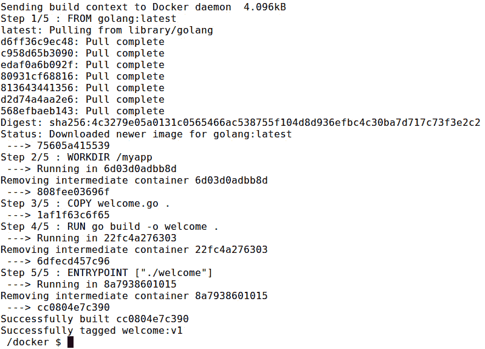
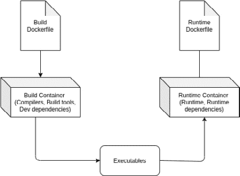
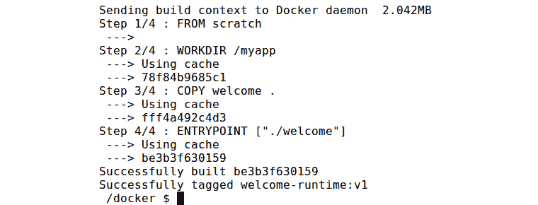
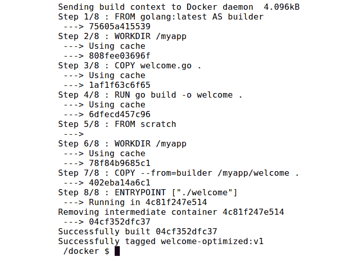

# 四、多阶段Docker文件

概观

在本章中，我们将讨论正常的 Docker 构建。您将回顾和练习`Dockerfile`最佳实践，并学习使用构建器模式和多阶段`Dockerfile`创建和优化 Docker 映像的大小。

# 简介

在前一章中，我们了解了 Docker 注册中心，包括私有和公共注册中心。我们创建了自己的私有 Docker 注册表来存储 Docker 映像。我们还学习了如何在 Docker Hub 中设置访问和存储我们的 Docker 映像。在本章中，我们将讨论多阶段`Dockerfiles`的概念。

多阶段`Dockerfiles`是 Docker 版本中引入的一个特性。当我们希望在生产环境中运行 Docker 映像时优化 Docker 映像大小时，此功能更可取。为了实现这一点，多阶段`Dockerfile`将在构建过程中创建多个中间 Docker 映像，并选择性地仅将基本工件从一个阶段复制到另一个阶段。

在引入多阶段 Docker 构建之前，构建器模式用于优化 Docker 映像大小。与多阶段构建不同，构建器模式需要两个`Dockerfiles`和一个 shell 脚本来创建高效的 Docker 映像。

在本章中，我们将首先检查正常的 Docker 构建以及与之相关的问题。接下来，我们将学习如何使用构建器模式来优化 Docker 映像大小，并讨论与构建器模式相关的问题。最后，我们将学习使用多阶段`Dockerfiles`来克服构建器模式的问题。

# 正常Docker建造

使用 Docker，我们可以使用`Dockerfiles`创建自定义 Docker 映像。正如我们在*第二章，Dockerfiles* 中所讨论的那样，`Dockerfile`是一个文本文件，其中包含如何创建 Docker 映像的说明。然而，在生产环境中运行时，拥有最小大小的 Docker 映像至关重要。这允许开发人员加快 Docker 容器的构建和部署时间。在本节中，我们将构建一个定制的 Docker 映像，以观察与正常 Docker 构建过程相关的问题。

考虑一个例子，我们构建一个简单的 Golang 应用。我们将使用下面的`Dockerfile`部署一个用 Golang 编写的`hello world`应用:

```
# Start from latest golang parent image
FROM golang:latest
# Set the working directory
WORKDIR /myapp
# Copy source file from current directory to container
COPY helloworld.go .
# Build the application
RUN go build -o helloworld .
# Run the application
ENTRYPOINT ["./helloworld"]
```

这个`Dockerfile`以最新的 Golang 映像作为父映像开始。这个父映像包含构建我们的 Golang 应用所需的所有构建工具。接下来，我们将把`/myapp`目录设置为当前工作目录，并将`helloworld.go`源文件从主机文件系统复制到容器文件系统。然后，我们将使用`RUN`指令执行`go build`命令来构建应用。最后，`ENTRYPOINT`指令用于运行上一步创建的`helloworld`可执行文件。

以下是`helloworld.go`文件的内容。这是一个简单的文件，执行时会打印文本`"Hello World"`:

```
package main
import "fmt"
func main() {
    fmt.Println("Hello World")
}
```

一旦`Dockerfile`准备好了，我们可以使用`docker image build`命令构建 Docker 映像。该映像将被标记为`helloworld:v1`:

```
$ docker image build -t helloworld:v1 .
```

现在，使用`docker image ls`命令观察构建的映像。您将获得类似如下的输出:

```
REPOSITORY   TAG   IMAGE ID       CREATED          SIZE
helloworld   v1    23874f841e3e   10 seconds ago   805MB
```

请注意映像大小。这个构建产生了一个 805 兆字节的巨大 Docker 映像。在生产环境中使用这些大型 Docker 映像效率不高，因为它们需要大量时间和带宽才能通过网络推送和拉出。小 Docker 映像的效率要高得多，可以快速地推拉和部署。

除了映像的大小之外，这些 Docker 映像也容易受到攻击，因为它们包含可能存在潜在安全漏洞的构建工具。

注意

潜在的安全漏洞可能因给定 Docker 映像中的包而异。例如，爪哇 JDK 有许多漏洞。您可以通过以下链接详细了解与 Java JDK 相关的漏洞:

[https://www . cvedetails . com/漏洞-列表/vendor _ id-93/product _ id-19116/Oracle-JDK . html](https://www.cvedetails.com/vulnerability-list/vendor_id-93/product_id-19116/Oracle-JDK.html)。

为了减少攻击面，建议在生产环境中运行 Docker 映像时，只包含基本的工件(例如，编译的代码)和运行时。例如，对于 Golang，构建应用需要 Go 编译器，但运行应用则不需要。

理想情况下，您需要一个最小大小的 Docker 映像，它只包含运行时工具，不包含我们用来构建应用的所有构建工具。

我们现在将在下面的练习中使用正常的构建过程来构建这样一个 Docker 映像。

## 练习 4.01:用正常的构建过程构建 Docker 映像

您的经理要求您整理一个简单的 Golang 应用。您获得了 Golang 源代码文件，您的任务是编译和运行该文件。在本练习中，您将使用正常的构建过程构建 Docker 映像。然后，您将观察最终 Docker 映像的映像大小:

1.  为本练习创建一个名为`normal-build`的新目录:

    ```
    $ mkdir normal-build
    ```

2.  导航至新创建的`normal-build`目录:

    ```
    $ cd normal-build
    ```

3.  在`normal-build`目录下，创建一个名为`welcome.go`的文件。该文件将在构建期间复制到 Docker 映像中:

    ```
    $ touch welcome.go
    ```

4.  现在，使用您最喜欢的文本编辑器打开`welcome.go`文件:

    ```
    $ vim welcome.go
    ```

5.  Add the following content to the `welcome.go` file, save it, and exit from the `welcome.go` file:

    ```
    package main
    import "fmt"
    func main() {
        fmt.Println("Welcome to multi-stage Docker builds")
    }
    ```

    这是一个用 Golang 编写的简单的`hello world`应用。这将在执行时输出`"Welcome to multi-stage Docker builds"`。

6.  在`normal-build`目录下，创建一个名为`Dockerfile` :

    ```
    $ touch Dockerfile
    ```

    的文件
7.  现在，使用您最喜欢的文本编辑器打开【T0:

    ```
    $ vim Dockerfile 
    ```

8.  Add the following content to the `Dockerfile` and save the file:

    ```
    FROM golang:latest
    WORKDIR /myapp
    COPY welcome.go .
    RUN go build -o welcome .
    ENTRYPOINT ["./welcome"]
    ```

    `Dockerfile`以`FROM`指令开始，该指令指定最新的 Golang 映像作为父映像。这将把`/myapp`目录设置为 Docker 映像的当前工作目录。然后，`COPY`指令将把您在*步骤 3* 中创建的`welcome.go`源文件复制到 Docker 文件系统。接下来是`go build`命令，它将构建您创建的 Golang 代码。最后，将执行欢迎代码。

9.  Now, build the Docker image:

    ```
    $ docker build -t welcome:v1 .
    ```

    您将看到映像已成功构建，映像标识为`b938bc11abf1`，标记为`welcome:v1`:

    

    图 4.1:构建 Docker 映像

10.  Use the `docker image ls` command to list all the Docker images available on your computer:

    ```
    $ docker image ls
    ```

    该命令应返回以下输出:

    

图 4.2:列出所有 Docker 映像

在前面的输出中可以观察到`welcome:v1`映像的映像尺寸为`805MB`。

在本节中，我们讨论了如何使用正常的 Docker 构建过程来构建 Docker 映像并观察其大小。结果是一个巨大的 Docker 映像，大小超过 800 MB。这些大型 Docker 映像的主要缺点是，它们将花费大量时间来构建、部署、推送和接管网络。因此，建议尽可能创建最小尺寸的 Docker 映像。在下一节中，我们将讨论如何使用构建器模式来优化映像大小。

# 什么是建设者模式？

**构建器模式**是一种用于创建最佳大小的 Docker 映像的方法。它使用两个 Docker 映像，并有选择地将重要的工件从一个复制到另一个。第一个 Docker 映像被称为`build image`，用作构建环境，从源代码构建可执行文件。这个 Docker 映像包含编译器、构建工具和构建过程中所需的开发依赖项。

第二个 Docker 映像称为`runtime image`，用作运行环境来运行由第一个 Docker 容器创建的可执行文件。这个 Docker 映像只包含可执行文件、依赖项和运行时工具。外壳脚本用于使用`docker container cp`命令复制工件。

使用构建器模式构建映像的整个过程包括以下步骤:

1.  创建`Build` Docker 映像。
2.  从`Build` Docker 映像创建一个容器。
3.  将工件从`Build` Docker 映像复制到本地文件系统。
4.  使用复制的工件构建`Runtime` Docker 映像:



图 4.3:使用构建器模式构建映像

如上图所示，`Build` `Dockerfile`用于创建构建容器，该容器将包含构建源代码所需的所有工具，包括编译器和构建工具，如 Maven、Gradle 和开发依赖项。一旦构建容器被创建，shell 脚本将把可执行文件从构建容器复制到 Docker 主机。最后，将使用从`Build`容器复制的可执行文件创建`Runtime`容器。

现在，观察构建器模式如何用于创建最少的 Docker 映像。以下是用于创建`Build` Docker 容器的第一个`Dockerfile`。这个`Dockerfile`被命名为 Dockerfile.build，以区别于`Runtime` `Dockerfile`:

```
# Start from latest golang parent image
FROM golang:latest
# Set the working directory
WORKDIR /myapp
# Copy source file from current directory to container
COPY helloworld.go .
# Build the application
RUN go build -o helloworld .
# Run the application
ENTRYPOINT ["./helloworld"]
```

这与我们在正常 Docker 构建中观察到的`Dockerfile`相同。这用于从`helloworld.go`源文件创建`helloworld`可执行文件。

以下是用于构建`Runtime` Docker 容器的第二个`Dockerfile`:

```
# Start from latest alpine parent image
FROM alpine:latest
# Set the working directory
WORKDIR /myapp
# Copy helloworld app from current directory to container
COPY helloworld .
# Run the application
ENTRYPOINT ["./helloworld"]
```

与从父映像创建的第一个`Dockerfile`不同，第二个`Dockerfile`使用`alpine`映像作为其父映像，因为它是最小尺寸的 Docker 映像，只有 5 MB。这张图片使用的是 Alpine Linux，一个轻量级的 Linux 发行版。接下来，`/myapp`目录被配置为工作目录。最后，`helloworld`工件被复制到 Docker 映像中，并且`ENTRYPOINT`指令被用来运行应用。

这个`helloworld`神器是第一个`Dockerfile`执行`go build -o helloworld .`命令的结果。我们将使用一个 shell 脚本将这个工件从`build` Docker 容器复制到本地文件系统，从那里这个工件将被复制到运行时 Docker 映像。

考虑以下用于在 Docker 容器之间复制构建工件的外壳脚本:

```
#!/bin/sh
# Build the builder Docker image 
docker image build -t helloworld-build -f Dockerfile.build .
# Create container from the build Docker image
docker container create --name helloworld-build-container   helloworld-build
# Copy build artifacts from build container to the local filesystem
docker container cp helloworld-build-container:/myapp/helloworld .
# Build the runtime Docker image
docker image build -t helloworld .
# Remove the build Docker container
docker container rm -f helloworld-build-container
# Remove the copied artifact
rm helloworld
```

这个 shell 脚本将首先使用`Dockerfile.build`文件构建`helloworld-build` Docker 映像。下一步是从`helloworld-build`映像中创建一个 Docker 容器，这样我们就可以将`helloworld`工件复制到 Docker 宿主中。一旦容器被创建，我们需要执行命令将`helloworld`工件从`helloworld-build-container`复制到 Docker 主机的当前目录。现在，我们可以用`docker image build`命令构建运行时容器。最后，我们将通过移除中间工件来执行必要的清理任务，例如`helloworld-build-container`容器和`helloworld`可执行文件。

一旦我们执行了 shell 脚本，我们应该能够看到两个 Docker 映像:

```
REPOSITORY         TAG      IMAGE ID       CREATED       SIZE
helloworld         latest   faff247e2b35   3 hours ago   7.6MB
helloworld-build   latest   f8c10c5bd28d   3 hours ago   805MB
```

请注意两个 Docker 映像之间的大小差异。`helloworld` Docker 映像的大小只有 7.6 MB，与 805 MB 的`helloworld-build`映像相比有了巨大的缩减。

正如我们所看到的，构建器模式可以通过只将必要的工件复制到最终映像中来大幅减小 Docker 映像的大小。然而，构建器模式的缺点是我们需要维护两个`Dockerfiles`和一个 shell 脚本。

在下一个练习中，我们将获得使用构建器模式创建优化的 Docker 映像的实践经验。

## 练习 4.02:使用构建器模式构建Docker映像

在*练习 4.01* 、*使用正常构建过程*构建 Docker 映像中，您创建了一个 Docker 映像来编译和运行 Golang 应用。现在应用已经准备就绪，但是经理对 Docker 映像的大小不满意。您被要求创建一个最小大小的 Docker 映像来运行该应用。在本练习中，您将使用构建器模式优化 Docker 映像:

1.  为本练习创建一个名为`builder-pattern`的新目录:

    ```
    $ mkdir builder-pattern
    ```

2.  导航至新创建的`builder-pattern`目录:

    ```
    $ cd builder-pattern
    ```

3.  在`builder-pattern`目录下，创建一个名为`welcome.go`的文件。该文件将在构建时复制到 Docker 映像中:

    ```
    $ touch welcome.go
    ```

4.  现在，使用您最喜欢的文本编辑器打开`welcome.go`文件:

    ```
    $ vim welcome.go
    ```

5.  Add the following content to the `welcome.go` file, and then save and exit this file:

    ```
    package main
    import "fmt"
    func main() {
        fmt.Println("Welcome to multi-stage Docker builds")
    }
    ```

    这是一个用 Golang 编写的简单的`hello world`应用。一旦执行，将输出`"Welcome to multi-stage Docker builds"`。

6.  在`builder-pattern`目录下，创建一个名为`Dockerfile.build`的文件。该文件将包含所有的指令，您将使用这些指令来创建`build`Docker映像:

    ```
    $ touch Dockerfile.build
    ```

7.  现在，使用您最喜欢的文本编辑器打开【T0:

    ```
    $ vim Dockerfile.build
    ```

8.  Add the following content to the `Dockerfile.build` file and save the file:

    ```
    FROM golang:latest
    WORKDIR /myapp
    COPY welcome.go .
    RUN go build -o welcome .
    ENTRYPOINT ["./welcome"]
    ```

    这与您在*练习 4.01**中为`Dockerfile`创建的内容相同，使用正常构建过程*构建Docker映像。

9.  接下来，为运行时容器创建`Dockerfile`。在`builder-pattern`目录下，创建一个名为`Dockerfile`的文件。该文件将包含您将要用来创建运行时 Docker 映像的所有指令:

    ```
    $ touch Dockerfile
    ```

10.  现在，使用您最喜欢的文本编辑器打开【T0:

    ```
    $ vim Dockerfile
    ```

11.  Add the following content to the `Dockerfile` and save the file:

    ```
    FROM scratch
    WORKDIR /myapp
    COPY welcome .
    ENTRYPOINT ["./welcome"]
    ```

    这个`Dockerfile`使用 Docker 中最微小的映像——划痕映像作为父映像。然后，将`/myapp`目录配置为工作目录。接下来，欢迎可执行文件从 Docker 主机复制到运行时 Docker 映像。最后，`ENTRYPOINT`指令用于执行欢迎可执行文件。

12.  创建 shell 脚本，在 Docker 容器之间复制可执行文件。在`builder-pattern`目录下，创建一个名为`build.sh`的文件。该文件将包含协调两个 Docker 容器之间的构建过程的步骤:

    ```
    $ touch build.sh
    ```

13.  现在，使用您最喜欢的文本编辑器打开`build.sh`文件:

    ```
    $ vim build.sh
    ```

14.  Add the following content to the shell script and save the file:

    ```
    #!/bin/sh
    echo "Creating welcome builder image"
    docker image build -t welcome-builder:v1 -f Dockerfile.build .
    docker container create --name welcome-builder-container   welcome-builder:v1
    docker container cp welcome-builder-container:/myapp/welcome .
    docker container rm -f welcome-builder-container
    echo "Creating welcome runtime image"
    docker image build -t welcome-runtime:v1 .
    rm welcome
    ```

    这个 shell 脚本将首先构建`welcome-builder` Docker 映像，并从中创建一个容器。然后，它会将编译后的 Golang 可执行文件从容器复制到本地文件系统。接下来，`welcome-builder-container`容器作为中间容器被移除。最后，`welcome-runtime`的形象就建立起来了。

15.  向`build.sh` shell 脚本添加执行权限:

    ```
    $ chmod +x build.sh
    ```

16.  Now that you have the two `Dockerfiles` and the shell script, build the Docker image by executing the `build.sh` shell script:

    ```
    $ ./build.sh
    ```

    映像将成功构建并标记为`welcome-runtime:v1`:

    

    图 4.4:构建 Docker 映像

17.  Use the `docker image` ls command to list all the Docker images available on your computer:

    ```
    docker image ls
    ```

    您应该会得到如下图所示的所有可用 Docker 映像的列表:

    

图 4.5:列出所有 Docker 映像

从前面的输出可以看出，有两个 Docker 映像可用。welcome-builder 拥有所有的构建工具，大小为 805 MB，而 welcome-runtime 的映像大小明显更低，只有 2.01 MB。`golang:latest`是我们用作`welcome-builder`的父映像的 Docker 映像。

在本练习中，您学习了如何使用构建器模式来减小 Docker 映像的大小。然而，使用构建器模式来优化 Docker 映像的大小意味着我们必须维护两个`Dockerfiles`和一个 shell 脚本。在下一节中，让我们观察如何通过使用多级`Dockerfile`来消除它们。

# 多阶段Docker文件介绍

**多阶段 Docker 文件**是允许单个`Dockerfile`包含多个阶段的功能，可以产生优化的 Docker 映像。正如我们在前面部分中观察到的构建器模式，这些阶段通常包括一个从源代码构建可执行文件的构建器状态，以及一个运行可执行文件的运行时阶段。多阶段`Dockerfiles`将在`Dockerfile`中为每个阶段使用多个`FROM`指令，每个阶段将以不同的基础映像开始。只有必要的文件会有选择地从一个阶段复制到另一个阶段。在多阶段`Dockerfiles`之前，这是通过构建器模式实现的，正如我们在上一节中所讨论的。

多阶段 Docker 构建允许我们创建最小尺寸的 Docker 映像，这些映像类似于构建器模式，但消除了与之相关的问题。正如我们在前面的例子中看到的，构建器模式需要维护两个`Dockerfiles`和一个 shell 脚本。相比之下，多阶段 Docker 构建将只需要一个`Dockerfile`，并且不需要任何 shell 脚本来在 Docker 容器之间复制可执行文件。此外，构建器模式要求在将可执行文件复制到最终的 Docker 映像之前，将它们复制到 Docker 主机。多阶段 Docker 构建不需要这样做，因为我们可以使用`--from`标志在 Docker 映像之间复制可执行文件，而无需将它们复制到 Docker 主机。

现在，我们来观察一个多级`Dockerfile`的结构:

```
# Start from latest golang parent image
FROM golang:latest
# Set the working directory
WORKDIR /myapp
# Copy source file from current directory to container
COPY helloworld.go .
# Build the application
RUN go build -o helloworld .
# Start from latest alpine parent image
FROM alpine:latest
# Set the working directory
WORKDIR /myapp
# Copy helloworld app from current directory to container
COPY --from=0 /myapp/helloworld .
# Run the application
ENTRYPOINT ["./helloworld"]
```

普通`Dockerfile`和多阶段`Dockerfile`的主要区别在于多阶段`Dockerfile`将使用多个`FROM`指令来构建每个阶段。每个新阶段将以新的父映像开始，除了选择性复制的可执行文件之外，不包含来自先前映像的任何内容。`COPY --from=0`用于将可执行文件从第一阶段复制到第二阶段。

构建 Docker 映像并将映像标记为`multi-stage:v1`:

```
docker image build -t multi-stage:v1 .
```

现在，您可以列出可用的 Docker 映像:

```
REPOSITORY    TAG      IMAGE ID       CREATED         SIZE
multi-stage   latest   75e1f4bcabd0   7 seconds ago   7.6MB
```

您可以看到，这产生了一个与我们用构建器模式观察到的大小相同的 Docker 映像。

注意

多阶段`Dockerfiles`减少所需的`Dockerfiles`数量，在不影响映像大小的情况下消除 shell 脚本。

默认情况下，多阶段`Dockerfile`中的阶段由一个整数引用，从第一阶段的`0`开始。通过将`AS <NAME>`添加到`FROM`指令中，这些阶段可以被命名为增加可读性和可维护性。以下是您在前面的代码块中观察到的多阶段`Dockerfile`的改进版本:

```
# Start from latest golang parent image
FROM golang:latest AS builder 
# Set the working directory
WORKDIR /myapp
# Copy source file from current directory to container
COPY helloworld.go .
# Build the application
RUN go build -o helloworld .
# Start from latest alpine parent image
FROM alpine:latest AS runtime
# Set the working directory
WORKDIR /myapp
# Copy helloworld app from current directory to container
COPY --from=builder /myapp/helloworld .
# Run the application
ENTRYPOINT ["./helloworld"]
```

在上例中，我们将第一阶段`builder`和第二阶段`runtime`命名为，如下所示:

```
FROM golang:latest AS builder
FROM alpine:latest AS runtime
```

然后，在第二阶段复制工件时，您使用名称`builder`作为`--from`标志:

```
COPY --from=builder /myapp/helloworld .
```

在构建多阶段`Dockerfile`时，可能会出现您只想构建特定构建阶段的情况。考虑一下你的`Dockerfile`有两个阶段。第一个是构建开发阶段并包含所有的构建和调试工具，第二个是构建只包含运行时工具的生产映像。在项目的代码开发阶段，您可能只需要在开发阶段进行构建，以便在必要时测试和调试您的代码。在这种情况下，您可以使用带有`docker build`命令的`--target`标志来指定中间阶段作为最终映像的最终阶段:

```
docker image build --target builder -t multi-stage-dev:v1 .
```

在上例中，您使用`--target builder`在构建器阶段停止构建。

在下一个练习中，您将学习使用多阶段`Dockerfile`来创建大小优化的 Docker 映像。

## 练习 4.03:使用多阶段 Docker 构建构建 Docker 映像

在*练习 4.02* 、*使用构建器图案*构建Docker映像时，您使用了构建器图案来优化Docker映像的大小。然而，有一个操作负担，因为您需要在 Docker 映像构建过程中管理两个`Dockerfiles`和一个 shell 脚本。在本练习中，您将使用多阶段`Dockerfile`来消除这一操作负担。

1.  为本练习创建一个名为`multi-stage`的新目录:

    ```
    mkdir multi-stage
    ```

2.  导航至新创建的`multi-stage`目录:

    ```
    cd multi-stage
    ```

3.  在`multi-stage`目录下，创建一个名为`welcome.go`的文件。该文件将在构建期间复制到 Docker 映像中:

    ```
    $ touch welcome.go
    ```

4.  现在，使用您最喜欢的文本编辑器打开`welcome.go`文件:

    ```
    $ vim welcome.go
    ```

5.  Add the following content to the `welcome.go` file, and then save and exit this file:

    ```
    package main
    import "fmt"
    func main() {
        fmt.Println("Welcome to multi-stage Docker builds")
    }
    ```

    这是一个用 Golang 编写的简单的`hello world`应用。一旦执行，将输出`"Welcome to multi-stage Docker builds"`。

    在多级目录内，创建一个名为`Dockerfile`的文件。该文件将是多阶段`Dockerfile`:

    ```
    touch Dockerfile
    ```

6.  现在，使用您最喜欢的文本编辑器打开【T0:

    ```
    vim Dockerfile
    ```

7.  Add the following content to the `Dockerfile` and save the file:

    ```
    FROM golang:latest AS builder
    WORKDIR /myapp
    COPY welcome.go .
    RUN go build -o welcome .
    FROM scratch
    WORKDIR /myapp
    COPY --from=builder /myapp/welcome .
    ENTRYPOINT ["./welcome"]
    ```

    这个多阶段`Dockerfile`使用最新的`golang`映像作为父映像，这个阶段被命名为`builder`。接下来，将`/myapp`目录指定为当前工作目录。然后，`COPY`指令用来复制`welcome.go`源文件，`RUN`指令用来构建 Golang 文件。

    `Dockerfile`的下一阶段使用`scratch`映像作为父映像。这将把`/myapp`目录设置为 Docker 映像的当前工作目录。然后，`COPY`指令用于将`welcome`可执行文件从构建器阶段复制到该阶段。最后，使用`ENTRYPOINT`运行`welcome`可执行文件。

8.  Build the Docker image using the following command:

    ```
    docker build -t welcome-optimized:v1 .
    ```

    映像将成功构建并标记为`welcome-optimized:v1`:

    

    图 4.6:构建 Docker 映像

9.  Use the `docker image ls` command to list all the Docker images available on your computer. These images are available on your computer, either when you pull them from Docker Registry or when you build them on your computer:

    ```
    docker images
    ```

    从下面的输出可以看出，`welcome-optimized`映像的大小与您在*练习 4.02 中使用构建器模式*构建的`welcome-runtime`映像的大小相同:

    

图 4.7:列出所有 Docker 映像

在本练习中，您学习了如何使用多阶段`Dockerfiles`来构建优化的 Docker 映像。下表总结了构建器模式和多阶段`Docker Builds`之间的主要差异:


图 4.8:构建器模式和多阶段 Docker 构建之间的差异

在下一节中，我们将回顾编写`Dockerfile`时要遵循的最佳实践。

# 最佳实践文件

在前一节中，我们讨论了如何通过多阶段`Dockerfiles`构建高效的 Docker 映像。在本节中，我们将介绍编写`Dockerfiles`的其他推荐最佳实践。这些最佳实践将确保减少构建时间、减少映像大小、提高安全性，并提高所生成的 Docker 映像的可维护性。

## 使用适当的父映像

在构建高效的 Docker 映像时，使用合适的基础映像是一个重要的建议。

在构建自定义 Docker 映像时，总是鼓励使用来自 **Docker Hub** 的官方映像作为父映像。这些官方映像将确保遵循所有最佳实践，提供文档，并应用安全补丁。例如，如果您的应用需要 **JDK** ( **Java 开发工具包**)，您可以使用`openjdk`官方 Docker 映像，而不是使用通用的`ubuntu`映像，并在`ubuntu`映像之上安装 JDK:


图 4.9:使用适当的父映像

其次，在为生产环境构建 Docker 映像时，避免对父映像使用`latest`标记。当新版本发布到 Docker Hub 时，`latest`标签可能会指向映像的更新版本，并且更新版本可能与您的应用不向后兼容，从而导致您的生产环境出现故障。相反，最佳做法是始终使用特定的版本化标签作为父映像:


图 4.10:避免使用父映像的最新标签

最后，使用父映像的最小版本对于获得最小大小的 Docker 映像至关重要。Docker Hub 中的大多数正式 Docker 映像都有一个围绕 Alpine Linux 映像构建的最小大小的映像。此外，在我们的示例中，我们可以使用 **JRE** ( **Java 运行时环境**)来运行应用，而不是包含构建工具的 JDK:


图 4.11:使用最小尺寸的映像

`openjdk:8-jre-alpine`映像大小仅为 84.9 MB，而`openjdk:8`则为 488 MB。

## 使用非根用户提高安全性

默认情况下，Docker 容器与 root ( `id = 0`)用户一起运行。这允许用户执行所有必要的管理活动，例如更改系统配置、安装软件包和绑定到特权端口。然而，这是高风险的，并且当在生产环境中运行 Docker 容器时被认为是不良的安全实践，因为黑客可以通过黑客攻击在 Docker 容器内运行的应用来获得对 Docker 主机的根访问。

作为非根用户运行容器是提高 Docker 容器安全性的推荐最佳实践。这将遵循最小特权原则，确保应用只有最少的特权来执行任务。我们可以使用两种方法作为非根用户运行容器:使用`--user`(或`-u`)标志，以及使用`USER`指令。

在运行 Docker 容器时，使用`docker run`命令的`--user`(或`-u`)标志是一种更改默认用户的方法。用户名或用户标识可以用`--user`(或`-u`)标志指定:

```
$ docker run --user=9999 ubuntu:focal
```

在前面的命令中，我们已经将用户标识指定为`9999`。如果我们将用户指定为一个标识，那么相应的用户不必在 Docker 容器中可用。

此外，我们可以使用`Dockerfile`中的`USER`指令来定义默认用户。但是，在启动 Docker 容器时，该值可以被`--user`标志覆盖:

```
FROM ubuntu:focal
RUN apt-get update 
RUN useradd demo-user
USER demo-user
CMD whoami
```

在前面的例子中，我们使用`USER`指令将默认用户设置为`demo-user`。这意味着`USER`指令之后的任何命令都将作为`demo-user`执行。

## 使用 dockrignore

`.dockerignore`文件是 Docker 上下文中的特殊文本文件，用于在构建 Docker 映像时指定要从 Docker 上下文中排除的文件列表。一旦我们执行`docker build`命令，Docker 客户端会将整个构建上下文打包为一个 TAR 归档文件，并将其上传到 Docker 守护程序。当我们执行`docker build`命令时，输出的第一行是`Sending build context to Docker daemon`，这表明 Docker 客户端正在将构建上下文上传到 Docker 守护程序:

```
Sending build context to Docker daemon  18.6MB
Step 1/5 : FROM ubuntu:focal
```

每次我们构建 Docker 映像时，构建上下文都会被发送给 Docker 守护程序。由于这将在 Docker 映像构建过程中花费时间和带宽，建议排除最终 Docker 映像中不需要的所有文件。`.dockerignore`文件可以用来达到这个目的。除了节省时间和带宽外，`.dockerignore`文件还用于从构建上下文中排除机密文件，如密码文件和密钥文件。

`.dockerignore`文件应该在构建上下文的根目录中创建。在将构建上下文发送给 Docker 守护程序之前，Docker 客户端将在构建上下文的根中查找`.dockerignore`文件。如果`.dockerignore`文件存在，Docker 客户端将从构建上下文中排除`.dockerignore`文件中提到的所有文件。

以下是一个样本`.dockerignore`文件的内容:

```
PASSWORDS.txt
tmp/
*.md
!README.md
```

在前面的例子中，我们已经明确地从构建上下文中排除了`PASSWORDS.txt`文件和`tmp`目录，以及除了`README.md`文件以外的所有扩展名为`.md`的文件。

## 最小化层

`Dockerfile`中的每一行都将创建一个新的图层，该图层将占用 Docker 映像中的空间。因此，建议在构建 Docker 映像时创建尽可能少的层。为此，尽可能结合`RUN`指令。

例如，考虑以下`Dockerfile`，它将首先更新包库，然后安装`redis-server`和`nginx`包:

```
FROM ubuntu:focal
RUN apt-get update
RUN apt-get install -y nginx
RUN apt-get install -y redis-server
```

这个`Dockerfile`可以通过结合三个`RUN`指令进行优化:

```
FROM ubuntu:focal
RUN apt-get update \
  && apt-get install -y nginx redis-server
```

## 不要安装所有不必要的工具

不安装不必要的调试工具(如`vim`、`curl`和`telnet`)并删除不必要的依赖关系有助于创建高效的小尺寸 Docker 映像。一些软件包管理器，如`apt`会自动在所需软件包旁边安装推荐和建议软件包。我们可以通过使用`apt-get install`命令指定`no-install-recommends`标志来避免这种情况:

```
FROM ubuntu:focal
RUN apt-get update \
  && apt-get install --no-install-recommends -y nginx 
```

在 prec 的例子中，我们正在安装带有`no-install-recommends`标志的`nginx`包，这将有助于将最终映像大小减少 10 MB 左右。

除了使用`no-install-recommends`标志，我们还可以移除`apt`包管理器的缓存，以进一步减小最终 Docker 映像的大小。这可以通过在`apt-get install`命令结束时运行`rm -rf /var/lib/apt/lists/*`来实现:

```
FROM ubuntu:focal
RUN apt-get update \
    && apt-get install --no-install-recommends -y nginx \
    && rm -rf /var/lib/apt/lists/*
```

在这一节中，我们讨论了编写`Dockerfile`时的最佳实践。遵循这些最佳实践将有助于减少构建时间，减小映像大小，提高安全性，并增加 Docker 映像的可维护性。

现在，让我们通过在下一个活动中部署一个带有多阶段 Docker 构建的 Golang HTTP 服务器来测试我们的知识。

## 活动 4。 01:部署具有多阶段 Docker 构建的 Golang HTTP 服务器

假设您的任务是将一个 Golang HTTP 服务器部署到一个 Docker 容器中。您的经理要求您建立一个最小尺寸的 Docker 映像，并在建立`Dockerfile`时遵守最佳实践。

该 Golang HTTP 服务器将根据调用网址返回不同的响应:


图 4.12:基于调用网址的响应

您的任务是使用多阶段`Dockerfile`将下面代码块中给出的 Golang 应用归档:

```
package main
import (
    "net/http"
    "fmt"
    "log"
    "os"
)
func main() {
    http.HandleFunc("/", defaultHandler)
    http.HandleFunc("/contact", contactHandler)
    http.HandleFunc("/login", loginHandler)
    port := os.Getenv("PORT")
    if port == "" {
        port = "8080"
    }
    log.Println("Service started on port " + port)
    err := http.ListenAndServe(":"+port, nil)
    if err != nil {
        log.Fatal("ListenAndServe: ", err)
        return
    }
}
func defaultHandler(w http.ResponseWriter, r *http.Request) {
    fmt.Fprintf(w, "<h1>Home Page</h1>")
}
func contactHandler(w http.ResponseWriter, r *http.Request) {
    fmt.Fprintf(w, "<h1>Contact Us</h1>")
}
func loginHandler(w http.ResponseWriter, r *http.Request) {
    fmt.Fprintf(w, "<h1>Login Page</h1>")
}
```

执行以下步骤完成本活动:

1.  创建一个文件夹来存储活动文件。
2.  用前面代码块中提供的代码创建一个`main.go`文件。
3.  创建具有两个阶段的多阶段`Dockerfile`。第一阶段将使用`golang`映像。这个阶段将使用`go build`命令构建 Golang 应用。第二阶段将使用`alpine`映像。这个阶段将从第一个阶段复制可执行文件并执行它。
4.  构建并运行 Docker 映像。
5.  完成后，停止并移除 Docker 容器。

当您导航到网址`http://127.0.0.1:8080/`时，您应该会得到以下输出:


图 4.13:活动 4.01 的预期产出

注意

此活动的解决方案可以通过[这个链接](16.html#_idTextAnchor326)找到。

# 总结

本章首先定义了一个普通的 Docker 构建，并使用普通的 Docker 构建过程创建了一个简单的 Golang Docker 映像。然后，我们观察了生成的 Docker 映像的大小，并讨论了最小大小的 Docker 映像如何加快 Docker 容器的构建和部署时间，并通过减少攻击面来增强安全性。

然后，我们使用构建器模式来创建最小尺寸的 Docker 映像，在这个过程中利用两个`Dockerfiles`和一个 shell 脚本来创建映像。我们探索了多阶段 Docker 构建——这是 Docker 在 17.05 版本中引入的新功能，可以帮助消除必须维护两个`Dockerfiles`和一个 shell 脚本的操作负担。最后，我们讨论了编写`Dockerfiles`的最佳实践，以及这些最佳实践如何确保缩短构建时间、减少映像大小和提高安全性，同时提高 Docker 映像的可维护性。

在下一章中，我们将介绍`docker-compose`以及如何使用它来定义和运行多容器 Docker 应用。