# 6。Docker 网络简介

概观

本章的目标是向您简要概述容器联网是如何工作的，它与 Docker 主机级别的联网有何不同，以及容器如何利用 Docker 联网来提供与其他容器化服务的直接网络连接。到本章结束时，您将知道如何使用网络配置部署容器，如`bridge`、`overlay`、`macvlan`和`host`。您将了解不同网络驱动程序的优势，以及在什么情况下您应该选择特定的网络驱动程序。最后，我们将研究部署在 Docker 集群中的主机之间的容器化网络。

# 简介

在整个研讨会中，我们已经研究了与 Docker 相关的容器化和微服务架构的许多方面。我们已经了解了如何将应用封装到执行离散功能的微服务中，从而创建一个难以置信的灵活架构，实现快速部署和强大的水平扩展。也许与容器化相关的一个更有趣和复杂的话题是网络。毕竟，为了开发灵活敏捷的微服务架构，需要进行适当的网络考虑，以确保容器实例之间的可靠连接。

在提到**容器联网**时，请始终记住容器主机上的联网(底层联网)和同一主机上或不同集群内的容器之间的联网(`overlay`联网)之间的区别。Docker 支持许多不同类型的现成网络配置，可以根据您的基础架构和部署策略的需求进行定制。

例如，一个容器可能有一个该容器实例唯一的 IP 地址，该地址存在于容器主机之间的虚拟子网中。这种类型的网络是典型的 Docker 群集配置，其中网络流量被加密并通过主机的网络接口传递，只在不同的主机上解密，然后传递给接收微服务。这种类型的网络配置通常涉及 Docker 维护容器和服务名称到容器 IP 地址的映射。这提供了强大的服务发现机制，即使容器在不同的集群主机上终止和重新启动，也允许容器联网。

或者，容器可以以更简单的主机网络模式运行。在这种情况下，在集群或独立主机中运行的容器会公开主机网络接口上的端口，以发送和接收网络流量。容器本身可能仍然有它们的 IP 地址，这些地址被 Docker 映射到主机上的物理网络接口。当您的微服务需要主要与容器化基础设施之外的服务进行通信时，这种类型的网络配置非常有用。

默认情况下，Docker 以**桥接网络模式**运行。一个`bridge`网络在主机上创建一个单一的网络接口，作为连接主机上配置的另一个子网的桥梁。所有输入(输入)和输出(输出)网络流量都使用`bridge`网络接口在容器子网和主机之间传输。

在 Linux 环境中安装 Docker Engine 后，如果运行`ifconfig`命令，Docker 将创建一个名为`docker0`的新虚拟桥接网络接口。该接口将默认创建的 Docker 专用子网(通常是`172.16.0.0/16`)连接到主机的网络栈。如果一个容器运行在默认的 Docker 网络中，其 IP 地址为`172.17.8.1`，并且您试图联系该 IP 地址，则内部路由表将通过`docker0` `bridge`接口引导该流量，并将该流量传递到专用子网中该容器的 IP 地址。除非通过 Docker 发布端口，否则外部世界无法访问该容器的 IP 地址。在本章中，我们将深入探讨 Docker 提供的各种网络驱动程序和配置选项。

在下一个练习中，我们将研究在默认 Docker `bridge`网络中创建 Docker 容器，以及如何向外界公开容器端口。

## 练习 6.01:动手操作Docker网络

默认情况下，当您在 Docker 中运行容器时，您创建的容器实例将存在于 Docker 网络中。Docker 网络是子网、规则和元数据的集合，Docker 使用这些集合将网络资源分配给直接在 Docker 服务器中运行或在 Docker 集群中跨服务器运行的容器。网络将为容器提供对同一子网中其他容器的访问，甚至是对其他外部网络(包括互联网)的出站(出口)访问。每个 Docker 网络都与一个网络驱动程序相关联，该网络驱动程序决定了网络在运行容器的系统环境中的运行方式。

在本练习中，您将运行 Docker 容器，并使用基本网络来运行两个简单的 web 服务器(Apache2 和 NGINX)，这两个服务器将在几个不同的基本网络场景中公开端口。然后，您将访问容器的公开端口，以了解更多关于 Docker 网络在最基本的层面上是如何工作的。当首先从容器化基础设施开始时，启动容器并公开服务端口以使它们可用是最常见的网络场景之一:

1.  List the networks that are currently configured in your Docker environment using the `docker network ls` command:

    ```
    $ docker network ls
    ```

    显示的输出将显示系统上可用的所有配置的 Docker 网络。它应该类似于以下内容:

    ```
    NETWORK ID      NAME      DRIVER     SCOPE
    0774bdf6228d    bridge    bridge     local
    f52b4a5440ad    host      host       local
    9bed60b88784    none      null       local
    ```

2.  When creating a container using Docker without specifying a network or networking driver, Docker will create the container using a `bridge` network. This network exists behind a `bridge` network interface configured in your host OS. Use `ifconfig` in a Linux or macOS Bash shell, or `ipconfig` in Windows PowerShell, to see which interface the Docker bridge is configured as. It is generally called `docker0`:

    ```
    $ ifconfig 
    ```

    此命令的输出将列出您的环境中可用的所有网络接口，如下图所示:

    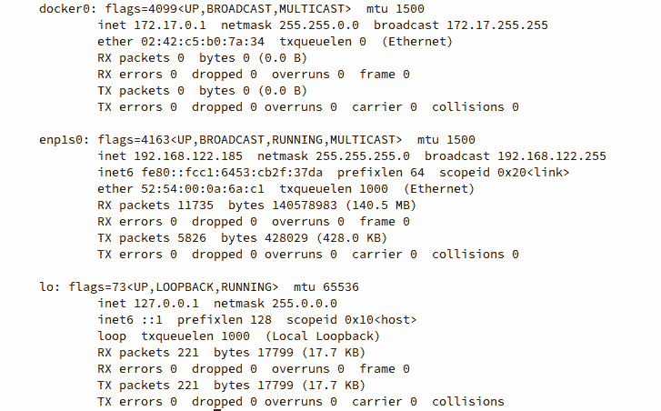

    图 6.1:列出了可用的网络接口

    从上图可以观察到，Docker `bridge`接口名为`docker0`，IP 地址为`172.17.0.1`。

3.  Use the `docker run` command to create a simple NGINX web server container, using the `latest` image tag. Set the container to start in the background using the `-d` flag and give it a human-readable name of `webserver1` using the `--name` flag:

    ```
    $ docker run -d –-name webserver1 nginx:latest 
    ```

    如果命令成功，在终端会话中将不会返回任何输出。

4.  Execute the `docker ps` command to check whether the container is up and running:

    ```
    $ docker ps
    ```

    如您所见，`webserver1`容器已按预期启动并运行:

    ```
    CONTAINER ID  IMAGE         COMMAND                 CREATED
      STATUS                   PORTS               NAMES
    0774bdf6228d  nginx:latest  "nginx -g 'daemon of…"  4 seconds ago
      Up 3 seconds             80/tcp              webserver1
    ```

5.  Execute the `docker inspect` command to check what networking configuration this container has by default:

    ```
    $ docker inspect webserver1
    ```

    Docker 将以 JSON 格式返回运行容器的详细信息。本练习的重点是`NetworkSettings`块。特别注意`Gateway`、`IPAddress`、`Ports`和`NetworkID`子块下面的参数:

    

    图 6.2:Docker检查命令的输出

    从这个输出可以得出结论，这个容器生活在默认的 Docker `bridge`网络中。查看`NetworkID`的前 12 个字符，您会发现它与在*步骤 1* 中执行的`docker network ls`命令的输出中使用的标识符相同。还需要注意的是`Gateway`这个容器配置使用的是`docker0` `bridge`接口的 IP 地址。Docker 将使用此接口作为出口点来访问其外部其他子网中的网络，并将流量从我们的环境转发到子网中的容器。还可以观察到，该容器在 Docker 桥网络中具有唯一的 IP 地址，在本例中为`172.17.0.2`。我们的本地机器能够路由到这个子网，因为我们有`docker0` `bridge`接口可以转发流量。最后，可以观察到 NGINX 容器默认公开 TCP 端口`80`用于传入流量。

6.  In a web browser, access the `webserver1` container by IP address over port `80`. Enter the IP address of the `webserver1` container in your favorite web browser:

    

    图 6.3:通过默认的 Docker 桥网络通过 IP 地址访问 NGINX 网络服务器容器

7.  Alternatively, use the `curl` command to see similar output, albeit in text format:

    ```
    $ curl 172.17.0.2:80
    ```

    以下 HTML 响应表明您已经收到了来自正在运行的 NGINX 容器的响应:

    ```
    <!DOCTYPE html>
    <html>
    <head>
    <title>Welcome to nginx!</title>
    <style>
        body {
            width: 35em;
            margin: 0 auto;
            font-family: Tahoma, Verdana, Arial, sans-serif;
        }
    </style>
    </head>
    <body>
    <h1>Welcome to nginx!</h1>
    <p>If you see this page, the nginx web server is successfully 
    installed and working. Further configuration is required.</p>
    <p>For online documentation and support please refer to
    <a href="http://nginx.org/">nginx.org</a>.<br/>
    Commercial support is available at
    <a href="http://nginx.com/">nginx.com</a>.</p>
    <p><em>Thank you for using nginx.</em></p>
    </body>
    </html>
    ```

8.  Accessing the IP address of a container in the local `bridge` subnet works well for testing containers locally. To expose your service on the network to other users or servers, use the `-p` flag in the `docker run` command. This will allow you to map a port on the host to an exposed port on the container. This is similar to port forwarding on a router or other network device. To expose a container by the port to the outside world, use the `docker run` command followed by the `-d` flag to start the container in the background. The `-p` flag will enable you to specify a port on the host, separated by a colon and the port on the container that you wish to expose. Also, give this container a unique name, `webserver2`:

    ```
    $ docker run -d -p 8080:80 –-name webserver2 nginx:latest
    ```

    容器成功启动后，您的 shell 不会返回任何内容。但是，Docker 的某些版本可能会显示完整的容器标识。

9.  Run the `docker ps` command to check whether you have two NGINX containers up and running:

    ```
    $ docker ps
    ```

    将显示两个运行容器`webserver1`和`webserver2`:

    ```
    CONTAINER ID IMAGE         COMMAND                 CREATED
      STATUS              PORTS                  NAMES
    b945fa75b59a nginx:latest  "nginx -g 'daemon of…"  1 minute ago
      Up About a minute   0.0.0.0:8080->80/tcp   webserver2
    3267bf4322ed nginx:latest  "nginx -g 'daemon of…"  2 minutes ago
      Up 2 minutes        80/tcp                 webserver1
    ```

    在`PORTS`栏中，您将看到 Docker 正在将`webserver`容器上的端口`80`转发到主机上的端口`8080`。这是从`0.0.0.0:8080->80/tcp`部分的输出中推导出来的。

    注意

    重要的是要记住，当用`-p`标志指定端口时，主机端口总是在冒号的左边，而容器端口在右边。

10.  In your web browser, navigate to `http://localhost:8080` to see the running container instance you just spawned:

    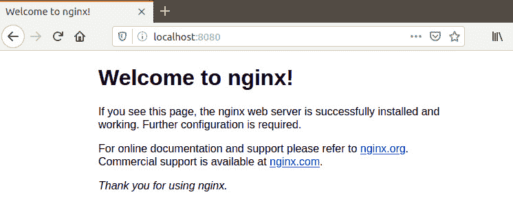

    图 6.4: NGINX 默认页面，表示您已经成功地将一个端口转发到您的 web 服务器容器

11.  Now, you have two NGINX instances running in the same Docker environment with slightly different networking configurations. The `webserver1` instance is running solely on the Docker network without any ports exposed. Inspect the configuration of the `webserver2` instance using the `docker inspect` command followed by the container name or ID:

    ```
    $ docker inspect webserver2
    ```

    JSON 输出底部的`NetworkSettings`部分如下所示。密切关注`networks`子块下面的参数(`Gateway`、`IPAddress`、`Ports`和`NetworkID`):

    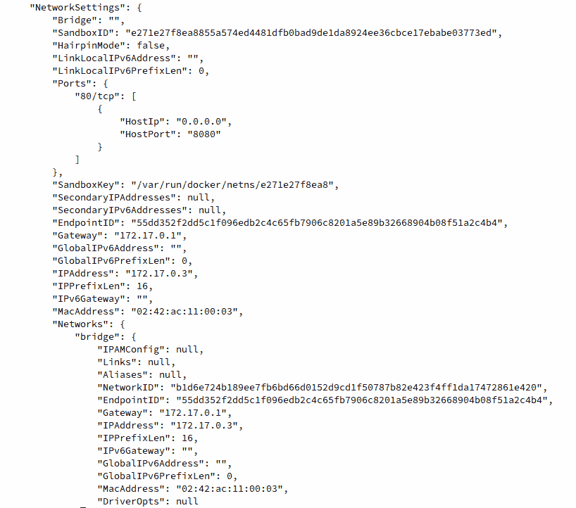

    图 6.5:Docker检查命令的输出

    当`docker inspect`输出显示时，`webserver2`容器的 IP 地址为`172.17.0.3`，而您的`webserver1`容器的 IP 地址为`172.17.0.1`。根据 Docker 如何为容器分配 IP 地址，您的本地环境中的 IP 地址可能略有不同。两个容器都位于同一个 Docker 网络(`bridge`)上，并且具有相同的默认网关，即主机上的`docker0` `bridge`接口。

12.  Since both of these containers live on the same subnet, you can test communication between the containers within the Docker `bridge` network. Run the `docker exec` command to gain access to a shell on the `webserver1` container:

    ```
    docker exec -it webserver1 /bin/bash
    ```

    该提示应明显变为根提示，表明您现在处于`webserver1`容器上的 Bash shell 中:

    ```
    root@3267bf4322ed:/#
    ```

13.  At the root shell prompt, use the `apt` package manager to install the `ping` utility in this container:

    ```
    root@3267bf4322ed:/# apt-get update && apt-get install -y inetutils-ping
    ```

    智能包管理器将在`webserver1`容器中安装`ping`实用程序。请注意，`apt`包管理器将安装`ping`以及运行`ping`命令所需的其他依赖项:

    

    图 6.6:在 Docker 容器中安装 ping 命令

14.  Once the `ping` utility has successfully installed, use it to ping the IP address of the other container:

    ```
    root@3267bf4322ed:/# ping 172.17.0.3
    ```

    输出应该显示 ICMP 响应数据包，表明容器可以通过 Docker `bridge`网络成功地相互 ping 通:

    ```
    PING 172.17.0.1 (172.17.0.3): 56 data bytes
    64 bytes from 172.17.0.3: icmp_seq=0 ttl=64 time=0.221 ms
    64 bytes from 172.17.0.3: icmp_seq=1 ttl=64 time=0.207 ms
    ```

15.  You can also access the NGINX default web interface using the `curl` command. Install `curl` using the `apt` package manager:

    ```
    root@3267bf4322ed:/# apt-get install -y curl
    ```

    应显示以下输出，表明正在安装`curl`实用程序和所有必需的依赖项:

    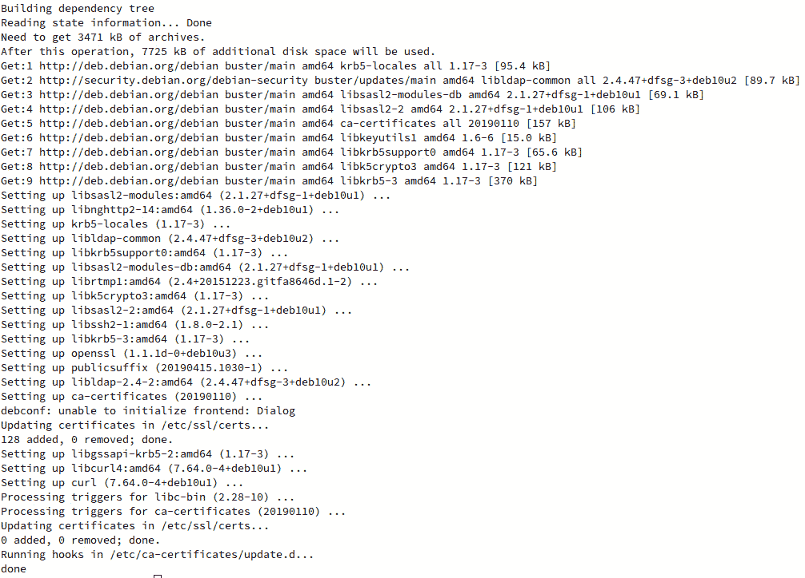

    图 6.7:安装 curl 实用程序

16.  After installing `curl`, use it to curl the IP address of `webserver2`:

    ```
    root@3267bf4322ed:/# curl 172.17.0.3
    ```

    您应该会看到以 HTML 格式显示的`Welcome to nginx!`页面，表明您能够通过 Docker `bridge`网络成功联系到`webserver2`容器的 IP 地址:

    ```
    <!DOCTYPE html>
    <html>
    <head>
    <title>Welcome to nginx!</title>
    <style>
        body {
            width: 35em;
            margin: 0 auto;
            font-family: Tahoma, Verdana, Arial, sans-serif;
        }
    </style>
    </head>
    <body>
    <h1>Welcome to nginx!</h1>
    <p>If you see this page, the nginx web server is successfully 
    installed and working. Further configuration is required.</p>
    <p>For online documentation and support please refer to
    <a href="http://nginx.org/">nginx.org</a>.<br/>
    Commercial support is available at
    <a href="http://nginx.com/">nginx.com</a>.</p>
    <p><em>Thank you for using nginx.</em></p>
    </body>
    </html>
    ```

    由于您正在使用`curl`导航到 NGINX 欢迎页面，它将以原始 HTML 格式呈现在您的终端显示器上。

在本节中，我们已经在同一个 Docker 环境中成功地生成了两个 NGINX web 服务器实例。我们将一个实例配置为不暴露默认 Docker 网络之外的任何端口，而将第二个 NGINX 实例配置为在同一网络上运行，但将端口`80`暴露给端口`8080`上的主机系统。我们看到了如何使用标准的互联网浏览器以及 Linux 中的`curl`实用程序来访问这些容器。

在本练习中，我们还看到了容器如何使用 Docker 网络与其他容器直接对话。我们使用`webserver1`容器调用`webserver2`容器的 IP 地址，并显示该容器托管的网页的输出。

在本练习中，我们还能够使用本机 Docker `bridge`网络演示容器实例之间的网络连接。然而，当我们大规模部署容器时，没有简单的方法知道 Docker 网络中的哪个 IP 地址属于哪个容器。

在下一节中，我们将研究本机 Docker DNS，并了解如何使用人类可读的 DNS 名称向其他容器实例可靠地发送网络流量。

# 原生〔t0〕DNS 坞站

运行容器化基础架构的最大好处之一是能够快速轻松地横向扩展您的工作负载。一个集群中有多台机器，它们之间有一个共享的`overlay`网络，这意味着您可以有许多容器跨服务器群运行。

正如我们在前面的练习中看到的，Docker 赋予我们允许容器通过 Docker 提供的各种网络驱动程序(如`bridge`、`macvlan`和`overlay`驱动程序)与集群中的其他容器直接对话的能力。在前面的例子中，我们利用 Docker `bridge`网络允许容器通过各自的 IP 地址相互对话。然而，当您的容器部署在真实的服务器上时，您通常不能依赖于具有一致的 IP 地址的容器，它们可以使用这些地址来相互交谈。每当一个新的容器实例终止或重新启动时，Docker 都会给这个容器一个新的 IP 地址。

类似于传统的基础架构场景，我们可以利用容器网络中的域名系统，为容器提供可靠的相互通信方式。通过为 Docker 网络中的容器分配人类可读的名称，用户不再需要在每次想要在 Docker 网络上的容器之间发起通信时查找 IP 地址。Docker 本身将在容器产生和重生时跟踪它们的 IP 地址。

在 Docker 的旧版本中，通过使用`docker run`命令中的`--link`标志在容器之间建立链接，可以实现简单的 DNS 解析。使用链接，Docker 将在链接容器的`hosts`文件中创建一个条目，这将实现简单的名称解析。然而，正如您将在接下来的练习中看到的，在容器之间使用链接可能会很慢，不可伸缩，并且容易出错。Docker 的最新版本支持在同一 Docker 网络上运行的容器之间的本地 DNS 服务。这允许容器查找在同一 Docker 网络中运行的其他容器的名称。这种方法的唯一警告是，本地 Docker DNS 在默认的 Docker `bridge`网络上不起作用；因此，必须首先创建其他网络来构建您的容器。

要使本机 Docker DNS 工作，我们必须首先使用`docker network create`命令创建一个新网络。然后，我们可以使用带有`--network-alias`标志的`docker run`在该网络中创建新的容器。在下面的练习中，我们将使用这些命令来了解本机 Docker DNS 如何工作，以实现容器实例之间的可扩展通信。

## 练习 e 6.02:使用 Docker DNS

在下面的练习中，您将了解在同一网络上运行的 Docker 容器之间的名称解析。您将首先使用传统链接方法启用简单的名称解析。您将通过使用更新、更可靠的本地 Docker DNS 服务来对比这种方法:

1.  First, create two Alpine Linux containers on the default Docker `bridge` network that will communicate with each other using the `--link` flag. Alpine is a very good base image for this exercise because it contains the `ping` utility by default. This will enable you to quickly test the connectivity between containers in the various scenarios. To get started, create a container called `containerlink1` to indicate that you have created this container using the legacy link method:

    ```
    $ docker run -itd --name containerlink1 alpine:latest
    ```

    这将在默认的 Docker 网络中启动一个名为`containerlink1`的容器。

2.  Start another container in the default Docker bridge network, called `containerlink2`, which will create a link to `containerlink1` to enable rudimentary DNS:

    ```
    $ docker run -itd --name containerlink2 --link containerlink1 alpine:latest
    ```

    这将在默认的 Docker 网络中启动一个名为`containerlink2`的容器。

3.  Run the `docker exec` command to access a shell inside the `containerlink2` container. This will allow you to investigate how the link functionality is working. Since this container is running Alpine Linux, you do not have access to the Bash shell by default. Instead, access it using an `sh` shell:

    ```
    $ docker exec -it containerlink2 /bin/sh
    ```

    这会让你掉进`containerlink2`容器里的一个根`sh`壳里。

4.  From the shell of the `containerlink2` container, ping `containerlink1`:

    ```
    / # ping containerlink1
    ```

    您将收到对`ping`请求的回复:

    ```
    PING container1 (172.17.0.2): 56 data bytes
    64 bytes from 172.17.0.2: seq=0 ttl=64 time=0.307 ms
    64 bytes from 172.17.0.2: seq=1 ttl=64 time=0.162 ms
    64 bytes from 172.17.0.2: seq=2 ttl=64 time=0.177 ms
    ```

5.  Use the `cat` utility to have a look at the `/etc/hosts` file of the `containerlink2` container. The `hosts` file is a list of routable names to IP addresses that Docker can maintain and override:

    ```
    / # cat /etc/hosts
    ```

    `hosts`文件的输出应如下所示:

    ```
    127.0.0.1  localhost
    ::1  localhost ip6-localhost ip6-loopback
    fe00::0    ip6-localnet
    ff00::0    ip6-mcastprefix
    ff02::1    ip6-allnodes
    ff02::2    ip6-allrouters
    172.17.0.2    containerlink1 032f038abfba
    172.17.0.3    9b62c4a57ce3
    ```

    从`containerlink2`容器的`hosts`文件的输出中，观察到 Docker 正在为`containerlink1`容器名称及其容器标识添加条目。这使得`containerlink2`容器能够知道名称，并且容器标识被映射到 IP 地址`172.17.0.2`。键入`exit`命令将终止`sh` shell 会话，并将您带回环境的主终端。

6.  Run `docker exec` to access an `sh` shell inside the `containerlink1` container:

    ```
    $ docker exec -it containerlink1 /bin/sh
    ```

    这会让你掉进`containerlink1`容器的壳里。

7.  Ping the `containerlink2` container using the `ping` utility:

    ```
    / # ping containerlink2
    ```

    您应该会看到以下输出:

    ```
    ping: bad address 'containerlink2'
    ```

    无法 ping 通`containerlink2`容器，因为链接容器只能单向工作。`containerlink1`容器不知道`containerlink2`容器存在，因为在`containerlink1`容器实例中没有创建`hosts`文件条目。

    注意

    您只能使用容器之间的传统链接方法链接到正在运行的容器。这意味着第一个容器不能链接到稍后开始的容器。这是为什么不再推荐使用容器之间的链接的众多原因之一。我们将在本章中介绍这个概念，向您展示功能是如何工作的。

8.  Due to the limitations using the legacy link method, Docker also supports native DNS using user-created Docker networks. To leverage this functionality, create a Docker network called `dnsnet` and deploy two Alpine containers within that network. First, use the `docker network create` command to create a new Docker network using a `192.168.56.0/24` subnet and using the IP address `192.168.54.1` as the default gateway:

    ```
    $ docker network create dnsnet --subnet 192.168.54.0/24 --gateway 192.168.54.1
    ```

    根据您使用的 Docker 版本，成功执行此命令可能会返回您创建的网络的标识。

    注意

    简单地使用`docker network create dnsnet`命令将创建一个带有 Docker 分配的子网和网关的网络。本练习演示如何为 Docker 网络指定子网和网关。还应注意，如果您的计算机连接到`192.168.54.0/24`子网或与该空间重叠的子网，可能会导致网络连接问题。请在本练习中使用不同的子网。

9.  Use the `docker network ls` command to list the Docker networks available in this environment:

    ```
    $ docker network ls
    ```

    应返回 Docker 网络列表，包括您刚刚创建的`dnsnet`网络:

    ```
    NETWORK ID      NAME       DRIVER     SCOPE
    ec5b91e88a6f    bridge     bridge     local
    c804e768413d    dnsnet     bridge     local
    f52b4a5440ad    host       host       local
    9bed60b88784    none       null       local
    ```

10.  Run the `docker network inspect` command to view the configuration for this network:

    ```
    $ docker network inspect dnsnet
    ```

    应显示`dnsnet`网络的详细信息。密切关注`Subnet`和`Gateway`参数。这些参数与您在*步骤 8* 中创建Docker网络时使用的参数相同:

    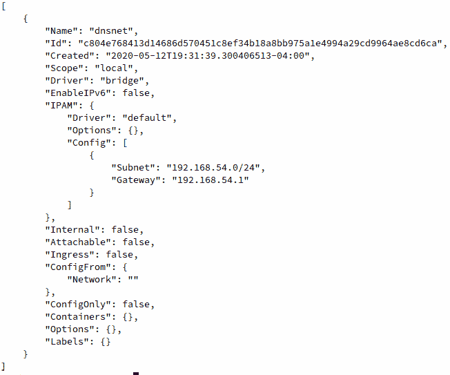

    图 6.8:docker 网络检查命令的输出

11.  Since this is a Docker `bridge` network, Docker will also create a corresponding bridge network interface for this network. The IP address of the `bridge` network interface will be the same IP address as the default gateway address you specified when creating this network. Use the `ifconfig` command to view the configured network interfaces on Linux or macOS. If you are using Windows, use the `ipconfig` command:

    ```
    $ ifconfig
    ```

    这将显示所有可用网络接口的输出，包括新创建的`bridge`接口:

    

    图 6.9:分析新创建的 Docker 网络的网桥接口

12.  Now that a new Docker network has been created, use the `docker run` command to start a new container (`alpinedns1`) within this network. Use the `docker run` command with the `--network` flag to specify the `dnsnet` network that was just created, and the `--network-alias` flag to give your container a custom DNS name:

    ```
    $ docker run -itd --network dnsnet --network-alias alpinedns1 --name alpinedns1 alpine:latest
    ```

    成功执行命令后，应在返回正常终端提示之前显示完整的容器标识。

13.  Start a second container (`alpinedns2`) using the same `--network` and `--network-alias` settings:

    ```
    $ docker run -itd --network dnsnet --network-alias alpinedns2 --name alpinedns2 alpine:latest
    ```

    注意

    理解`–network-alias`标志和`--name`标志之间的区别很重要。`--name`标志用于在 Docker API 中赋予容器一个人类可读的名称。这使得按名称启动、停止、重新启动和管理容器变得很容易。但是`--network-alias`标志用于为容器创建一个自定义的域名系统条目。

14.  Use the `docker ps` command to verify that the containers are running as expected:

    ```
    $ docker ps 
    ```

    输出将显示正在运行的容器实例:

    ```
    CONTAINER ID    IMAGE           COMMAND      CREATED 
      STATUS              PORTS             NAMES
    69ecb9ad45e1    alpine:latest   "/bin/sh"    4 seconds ago
      Up 2 seconds                          alpinedns2
    9b57038fb9c8    alpine:latest   "/bin/sh"    6 minutes ago
      Up 6 minutes                          alpinedns1
    ```

15.  Use the `docker inspect` command to verify that the IP addresses of the container instances are from within the subnet (`192.168.54.0/24`) that was specified:

    ```
    $ docker inspect alpinedns1
    ```

    以下输出被截断以显示相关细节:

    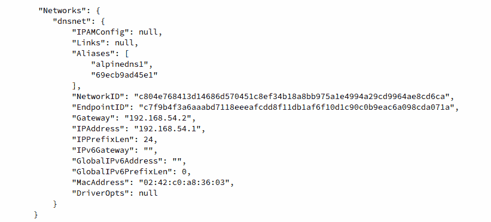

    图:6.10:alpindens1 容器实例的网络部分的输出

    从输出中可以观察到`alpinedns1`容器被部署了一个`192.168.54.2`的 IP 地址，这是在 Docker 网络创建期间定义的子网的一部分。

16.  Execute the `docker network inspect` command in a similar fashion for the `alpinedns2` container:

    ```
    $ docker inspect alpinedns2
    ```

    输出再次被截断以显示相关的网络详细信息:

    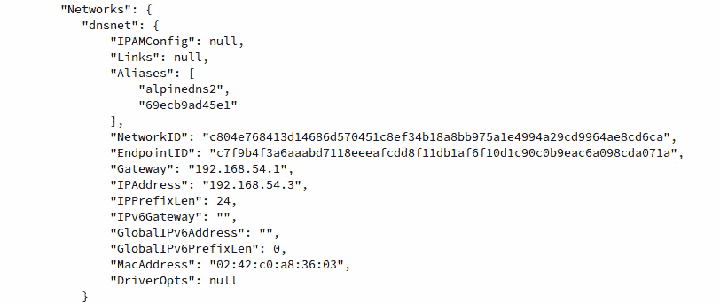

    图 6.11:alpinds2 容器实例的网络部分的输出

    在前面的输出中可以观察到`alpinedns2`容器有一个`192.168.54.3`的 IP 地址，这是`dnsnet`子网内的一个不同的 IP 地址。

17.  Run the `docker exec` command to access a shell in the `alpinedns1` container:

    ```
    $ docker exec -it alpinedns1 /bin/sh
    ```

    这将把你放入容器内部的一个根外壳中。

18.  Once inside the `alpinedns1` container, use the `ping` utility to ping the `alpinedns2` container:

    ```
    / # ping alpinedns2
    ```

    `ping`输出应该显示成功连接到`alpinedns2`容器实例的网络:

    ```
    PING alpinedns2 (192.168.54.3): 56 data bytes
    64 bytes from 192.168.54.3: seq=0 ttl=64 time=0.278 ms
    64 bytes from 192.168.54.3: seq=1 ttl=64 time=0.233 ms
    ```

19.  Use the `exit` command to return to your primary terminal. Use the `docker exec` command to gain access to a shell inside the `alpinedns2` container:

    ```
    $ docker exec -it alpinedns2 /bin/sh
    ```

    这会让你掉到`alpinedns2`容器内的一个壳里。

20.  Use the `ping` utility to ping the `alpinedns1` container by name:

    ```
    $ ping alpinedns1
    ```

    输出应显示来自`alpinedns1`容器的成功响应:

    ```
    PING alpinedns1 (192.168.54.2): 56 data bytes
    64 bytes from 192.168.54.2: seq=0 ttl=64 time=0.115 ms
    64 bytes from 192.168.54.2: seq=1 ttl=64 time=0.231 ms
    ```

    注意

    与传统链接方法相反，Docker DNS 允许同一 Docker 网络中的容器之间的双向通信。

21.  Use the `cat` utility inside any of the `alpinedns` containers to reveal that Docker is using true DNS as opposed to `/etc/hosts` file entries inside the container:

    ```
    # cat /etc/hosts
    ```

    这将显示相应容器内`/etc/hosts`文件的内容:

    ```
    127.0.0.1  localhost
    ::1  localhost ip6-localhost ip6-loopback
    fe00::0    ip6-localnet
    ff00::0    ip6-mcastprefix
    ff02::1    ip6-allnodes
    ff02::2    ip6-allrouters
    192.168.54.2    9b57038fb9c8
    ```

    使用`exit`命令终止`alpinedns2`容器内部的 shell 会话。

22.  使用`docker stop`命令

    ```
    $ docker stop  containerlink1
    $ docker stop  containerlink2
    $ docker stop  alpinedns1
    $ docker stop  alpinedns2
    ```

    停止所有正在运行的容器，从而清理您的环境
23.  Use the `docker system prune -fa` command to clean the remaining stopped containers and networks:

    ```
    $ docker system prune -fa
    ```

    成功执行该命令将清理`dnsnet`网络以及容器实例和映像:

    ```
    Deleted Containers:
    69ecb9ad45e16ef158539761edc95fc83b54bd2c0d2ef55abfba1a300f141c7c
    9b57038fb9c8cf30aaebe6485e9d223041a9db4e94eb1be9392132bdef632067
    Deleted Networks:
    dnsnet
    Deleted Images:
    untagged: alpine:latest
    untagged: alpine@sha256:9a839e63dad54c3a6d1834e29692c8492d93f90c
        59c978c1ed79109ea4fb9a54
    deleted: sha256:f70734b6a266dcb5f44c383274821207885b549b75c8e119
        404917a61335981a
    deleted: sha256:3e207b409db364b595ba862cdc12be96dcdad8e36c59a03b
        b3b61c946a5741a
    Total reclaimed space: 42.12M
    ```

    系统清理输出的每个部分将识别并删除不再使用的 Docker 资源。在这种情况下，它将删除`dnsnet`网络，因为该网络中当前没有部署容器实例。

在本练习中，您了解了使用名称解析在 Docker 网络上实现容器间通信的好处。使用名称解析是有效的，因为应用不必担心其他运行容器的 IP 地址。相反，可以通过简单地按名称调用其他容器来启动通信。

我们首先探索了名称解析的传统链接方法，通过该方法，运行的容器可以建立一个关系，利用容器的`hosts`文件中的条目利用单向关系。在容器之间使用域名系统的第二种也是更现代的方法是创建用户定义的 Docker 网络，该网络允许双向解析域名系统。这将使网络上的所有容器能够通过名称或容器标识解析所有其他容器，而无需任何额外的配置。

正如我们在本节中看到的，Docker 提供了许多独特的方法来为容器实例提供可靠的网络资源，例如在同一 Docker 网络上的容器之间启用路由，以及在容器之间启用本地 DNS 服务。这只是 Docker 提供的网络选项的表面。

在下一节中，我们将了解如何使用其他类型的网络驱动程序部署容器，以便在部署容器化基础架构时真正提供最大的灵活性。

# 本机坞站 er 网络驱动程序

由于 Docker 是近年来得到最广泛支持的容器平台之一，因此 Docker 平台已经通过了众多生产级网络场景的审查。为了支持各种类型的应用，Docker 提供了各种网络驱动程序，可以灵活地创建和部署容器。这些网络驱动程序允许容器化应用在几乎任何直接受裸机或虚拟化服务器支持的网络配置中运行。

例如，可以部署共享主机服务器网络栈的容器，或者在允许从底层网络基础架构为它们分配唯一 IP 地址的配置中部署容器。在本节中，我们将了解基本的 Docker 网络驱动程序，以及如何利用它们为各种类型的网络基础架构提供最大的兼容性:

*   `bridge` : A `bridge`是 Docker 将在其中运行容器的默认网络。如果在启动容器实例时没有定义任何内容，Docker 将使用`docker0`接口后面的子网，其中容器将被分配一个`172.17.0.0/16`子网中的 IP 地址。在`bridge`网络中，容器与`bridge`子网中的其他容器有网络连接，也有到互联网的出站连接。到目前为止，我们在本章中创建的所有容器都在`bridge`网络中。Docker `bridge`网络通常用于简单的 TCP 服务，这些服务只公开简单的端口或需要与存在于同一主机上的其他容器进行通信。
*   `host`:在`host`联网模式下运行的容器可以直接访问主机的网络栈。这意味着暴露给容器的任何端口也暴露给运行容器的主机上的相同端口。该容器还可以看到主机上运行的所有物理和虚拟网络接口。`host`当运行消耗大量带宽或利用多种协议的容器实例时，网络通常是首选。
*   `none`:网络`none`不为部署在该网络中的容器提供网络连接。部署在`none`网络中的容器实例只有一个环回接口，根本无法访问其他网络资源。没有驱动程序运行此网络。使用`none`网络模式部署的容器通常是在存储或磁盘工作负载上运行的应用，不需要网络连接。出于安全目的与网络连接隔离的容器也可以使用此网络驱动程序进行部署。
*   `macvlan` : `macvlan`在 Docker 中创建的网络用于您的容器化应用需要一个 MAC 地址和到底层网络的直接网络连接的场景。使用`macvlan`网络，Docker 将通过主机上的物理接口为您的容器实例分配一个 MAC 地址。这使得您的容器在部署的网段上显示为物理主机。需要注意的是，很多云环境，比如 AWS、Azure 以及很多虚拟化虚拟机管理程序都不允许在容器实例上配置`macvlan`网络。`macvlan`网络允许 Docker 基于连接到主机的物理网络接口从底层网络分配容器 IP 地址和 MAC 地址。如果配置不正确，使用`macvlan`联网很容易导致 IP 地址耗尽或 IP 地址冲突。`macvlan`容器网络通常用于非常具体的网络用例，例如监控网络流量模式或其他网络密集型工作负载的应用。

没有对 **Docker 覆盖网络**的简要概述，关于 Docker 网络的任何对话都是不完整的。`Overlay`联网是 Docker 如何处理与集群集群的联网。当在节点之间定义 Docker 集群时，Docker 将使用将节点链接在一起的物理网络来定义在节点上运行的容器之间的逻辑网络。这允许容器在集群节点之间直接相互对话。在*练习 6.03，探索 Docker 网络*中，我们将了解 Docker 默认支持的各种类型的 Docker 网络驱动程序，例如`host`、`none`和`macvlan`。在*练习 6.04* 、*定义覆盖网络*中，我们将定义一个简单的 Docker 群集群，以了解在集群模式下配置的 Docker 主机之间的`overlay`网络如何工作。

## 练习 6.03:探索Docker网络

在本练习中，我们将研究 Docker 默认支持的各种类型的 Docker 网络驱动程序，例如`host`、`none`和`macvlan`。我们将从`bridge`网络开始，然后研究`none`、`host`和`macvlan`网络:

1.  First, you need to get an idea of how networking is set up in your Docker environment. From a Bash or PowerShell terminal, use the `ifconfig` or `ipconfig` command on Windows. This will display all the network interfaces in your Docker environment:

    ```
    $ ifconfig
    ```

    这将显示所有可用的网络接口。你应该会看到一个名为`docker0`的`bridge`界面。这是 Docker `bridge`接口，用作默认 Docker 网络的入口(或入口点):

    

    图 6.12:Docker 开发环境的 ifconfig 输出示例

2.  Use the `docker network ls` command to view the networks available in your Docker environment:

    ```
    $ docker network ls
    ```

    这将列出之前定义的三种基本网络类型，显示网络标识、Docker 网络名称以及与网络类型相关的驱动程序:

    ```
    NETWORK ID       NAME      DRIVER     SCOPE
    50de4997649a     bridge    bridge     local
    f52b4a5440ad     host      host       local
    9bed60b88784     none      null       local
    ```

3.  View the verbose details of these networks using the `docker network inspect` command, followed by the ID or the name of the network you want to inspect. In this step, you will view the verbose details of the `bridge` network:

    ```
    $ docker network inspect bridge
    ```

    Docker 将以 JSON 格式显示`bridge`网络的详细输出:

    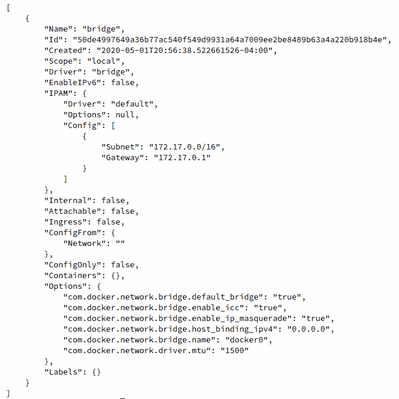

    图 6.13:检查默认网桥网络

    该输出中需要注意的一些关键参数是`Scope`、`Subnet`和`Gateway`关键词。根据这个输出，可以观察到这个网络的范围只有本地主机(`Scope: Local`)。这表示 Docker 群集中的主机之间不共享网络。该网络在`Config`部分下的`Subnet`值为`172.17.0.0/16`，子网的`Gateway`地址为定义的子网(`172.17.0.1`内的一个 IP 地址。子网的`Gateway`值必须是该子网内的一个 IP 地址，以便部署在该子网中的容器能够访问该网络范围之外的其他网络。最后，该网络与主机接口`docker0`相连，主机接口将作为网络的`bridge`接口。`docker network inspect`命令的输出非常有助于全面了解部署在该网络中的容器的行为。

4.  View the verbose details of the `host` network using the `docker network inspect` command:

    ```
    $ docker network inspect host
    ```

    这将以 JSON 格式显示`host`网络的详细信息:

    

    图 6.14:主机网络的 docker 网络检查输出

    如您所见，`host`网络中没有太多配置。由于它使用`host`网络驱动程序，所有容器的网络将与主机共享。因此，这种网络配置不需要定义特定的子网、接口或其他元数据，就像我们之前在默认的`bridge`网络中看到的那样。

5.  Investigate the `none` network next. Use the `docker network inspect` command to view the details of the `none` network:

    ```
    docker network inspect none
    ```

    详细信息将以 JSON 格式显示:

    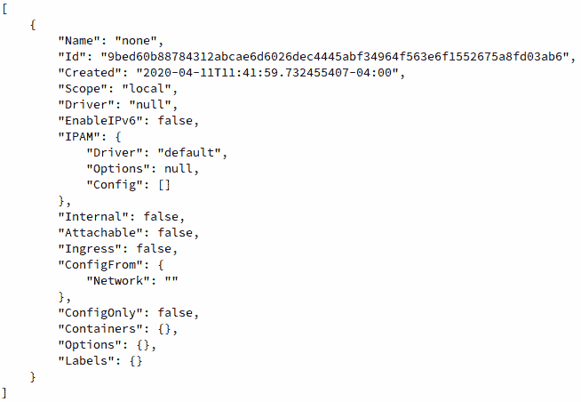

    图 6.15:无网络的 docker 网络检查输出

    类似于`host`网络，`none`网络大多是空的。由于部署在该网络中的容器通过利用`null`驱动程序将没有网络连接，因此不太需要配置。

    注意

    请注意`none`和`host`网络的区别在于它们使用的驱动程序，尽管配置几乎相同。在`none`网络中启动的容器根本没有网络连接，也没有网络接口分配给容器实例。然而，在`host`网络中启动的容器将与主机系统共享网络栈。

6.  Now create a container in the `none` network to observe its operation. In your terminal or PowerShell session, use the `docker run` command to start an Alpine Linux container in the `none` network using the `--network` flag. Name this container `nonenet` so we know that it is deployed in the `none` network:

    ```
    $ docker run -itd --network none --name nonenet alpine:latest 
    ```

    这将在`none`网络中拉出并启动一个 Alpine Linux Docker 容器。

7.  Use the `docker ps` command to verify whether the container is up and running as expected:

    ```
    $ docker ps 
    ```

    输出应显示`nonenet`容器启动并运行:

    ```
    CONTAINER ID    IMAGE            COMMAND      CREATED 
      STATUS              PORTS              NAMES
    972a80984703    alpine:latest    "/bin/sh"    9 seconds ago
      Up 7 seconds                           nonenet
    ```

8.  Execute the `docker inspect` command, along with the container name, `nonenet`, to get a deeper understanding of how this container is configured:

    ```
    $ docker inspect nonenet
    ```

    `docker inspect`的输出将以 JSON 格式显示完整的容器配置。此处提供了突出显示`NetworkSettings`部分的截断版本。密切关注`IPAddress`和`Gateway`设置:

    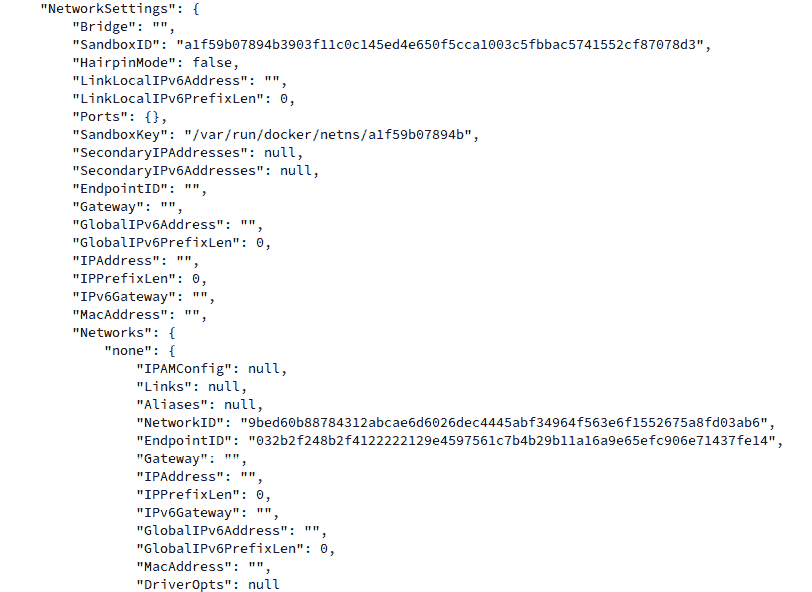

    图 6.16: docker 检查非网络容器的输出

    `docker inspect`输出将显示该容器没有 IP 地址，也没有网关或任何其他网络设置。

9.  Use the `docker exec` command to access an `sh` shell inside this container:

    ```
    $ docker exec -it nonenet /bin/sh
    ```

    成功执行此命令后，您将被放入容器实例的根外壳中:

    ```
    / #
    ```

10.  Execute the `ip a` command to view the network interfaces available in the container:

    ```
    / $ ip a 
    ```

    这将显示此容器中配置的所有网络接口:

    ```
    1: lo: <LOOPBACK,UP,LOWER_UP> mtu 65536 qdisc noqueue state 
    UNKNOWN qlen 1000
        link/loopback 00:00:00:00:00:00 brd 00:00:00:00:00:00
        inet 127.0.0.1/8 scope host lo
        valid_lft forever preferred_lft forever
    ```

    该容器唯一可用的网络接口是其`LOOPBACK`接口。由于此容器未配置 IP 地址或默认网关，通用网络命令将不起作用。

11.  Test the lack of network connectivity using the `ping` utility provided by default in the Alpine Linux Docker image. Try to ping the Google DNS servers located at IP address `8.8.8.8`:

    ```
    / # ping 8.8.8.8
    ```

    `ping`命令的输出应该显示它没有网络连接:

    ```
    PING 8.8.8.8 (8.8.8.8): 56 data bytes
    ping: sendto: Network unreachable
    ```

    使用`exit`命令返回您的主终端会话。

    现在您已经仔细查看了`none`网络，考虑一下`host`网络驱动程序。Docker 中的`host`网络驱动程序是独一无二的，因为它没有任何中间接口或创建任何额外的子网。相反，`host`网络驱动程序与主机操作系统共享网络栈，以便主机可用的任何网络接口也可用于以`host`模式运行的容器。

12.  To get started with running a container in `host` mode, execute `ifconfig` if you are running macOS or Linux, or use `ipconfig` if you are running on Windows, to take inventory of the network interfaces that are available on the host machine:

    ```
    $ ifconfig
    ```

    这将输出主机上可用的网络接口列表:

    

    图 6.17:主机上配置的网络接口列表

    在本例中，您主机的主要网络接口是`enp1s0`，其 IP 地址为`192.168.122.185`。

    注意

    macOS 或 Windows 上的 Docker Desktop 的某些版本可能无法在`host`网络模式下或使用`macvlan` 网络驱动程序正常启动和运行容器，因为依赖 Linux 内核来提供其中的许多功能。在 macOS 或 Windows 上运行这些示例时，您可能会看到运行 Docker 的底层 Linux 虚拟机的网络详细信息，而不是您的 macOS 或 Windows 主机上可用的网络接口。

13.  Use the `docker run` command to start an Alpine Linux container in the `host` network. Name it `hostnet1` to tell it apart from the other containers:

    ```
    docker run -itd --network host --name hostnet1 alpine:latest
    ```

    Docker 将使用`host`网络在后台启动该容器。

14.  Use the `docker inspect` command to look at the network configuration of the `hostnet1` container you just created:

    ```
    $ docker inspect hostnet1
    ```

    这将以 JSON 格式显示运行容器的详细配置，包括网络细节:

    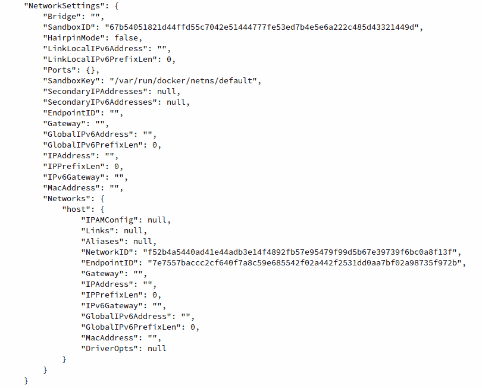

    图 6.18: docker 检查 hostnet1 容器的输出

    需要注意的是`NetworkSettings`块的输出看起来很像你在`none`网络中部署的容器。在`host`网络模式下，Docker 不会为容器实例分配 IP 地址或网关，因为它直接与主机共享所有网络接口。

15.  Use `docker exec` to access an `sh` shell inside this container, providing the name `hostnet1`:

    ```
    $ docker exec -it hostnet1 /bin/sh
    ```

    这会让你掉进`hostnet1`容器里的一个根壳里。

16.  Inside the `hostnet1` container, execute the `ifconfig` command to list which network interfaces are available to it:

    ```
    / # ifconfig
    ```

    应显示该容器内可用网络接口的完整列表:

    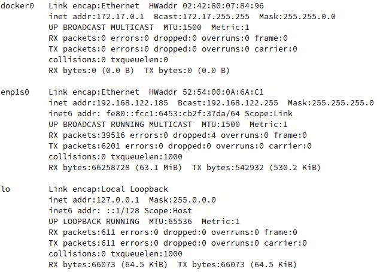

    图 6.19:显示 hostnet1 容器中可用的网络接口

    请注意，此网络接口列表与您直接查询主机时遇到的列表相同。这是因为这个容器和主机直接共享网络。主机可用的任何内容也将可用于在`host`网络模式下运行的容器。

17.  使用`exit`命令结束 shell 会话，返回主机终端。
18.  To understand more fully how the shared networking model works in Docker, start an NGINX container in `host` network mode. The NGINX container automatically exposes port `80`, which we previously had to forward to a port on the host machine. Use the `docker run` command to start an NGINX container on the host machine:

    ```
    $ docker run -itd --network host --name hostnet2 nginx:latest
    ```

    该命令将在`host`网络模式下启动一个 NGINX 容器。

19.  Navigate to `http://localhost:80` using a web browser on the host machine:

    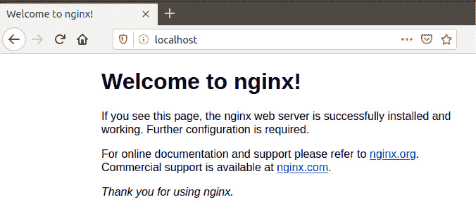

    图 6.20:访问在主机网络模式下运行的容器的 NGINX 默认网页

    您应该能够看到在您的网络浏览器中显示的 NGINX 默认网页。需要注意的是`docker run`命令并没有明确的向主机转发或者暴露任何端口。由于容器在`host`网络模式下运行，容器默认公开的任何端口将直接在主机上可用。

20.  使用`docker run`命令在`host`网络模式下创建另一个 NGINX 实例。将此容器称为`hostnet3`，以区别于其他两个容器实例:

    ```
    $ docker run -itd --network host --name hostnet3 nginx:latest
    ```

21.  Now use the `docker ps -a` command to list all the containers, both in running and stopped status:

    ```
    $ docker ps -a
    ```

    将显示正在运行的容器列表:

    ```
    CONTAINER ID  IMAGE         COMMAND                CREATED
      STATUS                        PORTS           NAMES
    da56fcf81d02  nginx:latest  "nginx -g 'daemon of…" 4 minutes ago
      Exited (1) 4 minutes ago                      hostnet3
    5786dac6fd27  nginx:latest  "nginx -g 'daemon of…" 37 minutes ago
      Up 37 minutes                                 hostnet2
    648b291846e7  alpine:latest "/bin/sh"              38 minutes ago
      Up 38 minutes                                 hostnet
    ```

22.  Based on the preceding output, you can see that the `hostnet3` container exited and is currently in a stopped state. To understand more fully why this is the case, use the `docker logs` command to view the container logs:

    ```
    $ docker logs hostnet3
    ```

    日志输出应显示如下:

    

    图 6.21:hostnet 3 容器中的 NGINX 错误

    本质上，NGINX 容器的第二个实例无法正常启动，因为它无法绑定到主机上的端口`80`。原因是`hostnet2`容器已经在监听该端口。

    注意

    请注意，在`host`联网模式下运行的容器需要小心谨慎地部署。如果没有适当的规划和架构，容器无序蔓延会导致在同一台机器上运行的多个容器实例之间出现各种各样的端口冲突。

23.  您将调查的下一种本地 Docker 网络类型是`macvlan`。在`macvlan`网络中，Docker 将为容器实例分配一个 MAC 地址，使其在特定网段上显示为物理主机。它可以在`bridge`模式下运行，该模式使用父`host`网络接口获得对底层网络的物理访问，也可以在`802.1Q trunk`模式下运行，该模式利用 Docker 动态创建的子接口。
24.  首先，通过使用`docker network create`命令将主机上的物理接口指定为父接口，使用`macvlan` Docker 网络驱动程序创建一个新网络。
25.  Earlier in the `ifconfig` or `ipconfig` output, you saw that the `enp1s0` interface is the primary network interface on the machine. Substitute the name of the primary network interface of your machine. Since you are using the primary network interface of the host machine as the parent, specify the same subnet (or a smaller subnet within that space) for the network connectivity of our containers. Use a `192.168.122.0/24` subnet here, since it is the same subnet of the primary network interface. Likewise, you want to specify the same default gateway as the parent interface. Use the same subnet and gateway of your host machine:

    ```
    $ docker network create -d macvlan --subnet=192.168.122.0/24 --gateway=192.168.122.1 -o parent=enp1s0 macvlan-net1
    ```

    这个命令应该创建一个名为`macvlan-net1`的网络。

26.  Use the `docker network ls` command to confirm that the network has been created and is using the `macvlan` network driver:

    ```
    $ docker network ls
    ```

    此命令将输出在您的环境中定义的所有当前配置的网络。你应该看看`macvlan-net1`网络:

    ```
    NETWORK ID       NAME            DRIVER     SCOPE
    f4c9408f22e2     bridge          bridge     local
    f52b4a5440ad     host            host       local
    b895c821b35f     macvlan-net1    macvlan    local
    9bed60b88784     none            null       local
    ```

27.  Now that the `macvlan` network has been defined in Docker, create a container in this network and investigate the network connectivity from the host's perspective. Use the `docker run` command to create another Alpine Linux container named `macvlan1` using the `macvlan` network `macvlan-net1`:

    ```
    $ docker run -itd --name macvlan1 --network macvlan-net1 alpine:latest
    ```

    这应该会在后台启动一个名为`macvlan1`的 Alpine Linux 容器实例。

28.  Use the `docker ps -a` command to check and make sure this container instance is running:

    ```
    $ docker ps -a
    ```

    这应该显示名为`macvlan1`的容器按预期启动并运行:

    ```
    CONTAINER ID   IMAGE           COMMAND      CREATED
      STATUS              PORTS              NAMES
    cd3c61276759   alpine:latest   "/bin/sh"    3 seconds ago
      Up 1 second                            macvlan1
    ```

29.  Use the `docker inspect` command to investigate the networking configuration of this container instance:

    ```
    $ docker inspect macvlan1
    ```

    应该显示容器配置的详细输出。以下输出已被截断，仅显示 JSON 格式的网络设置部分:

    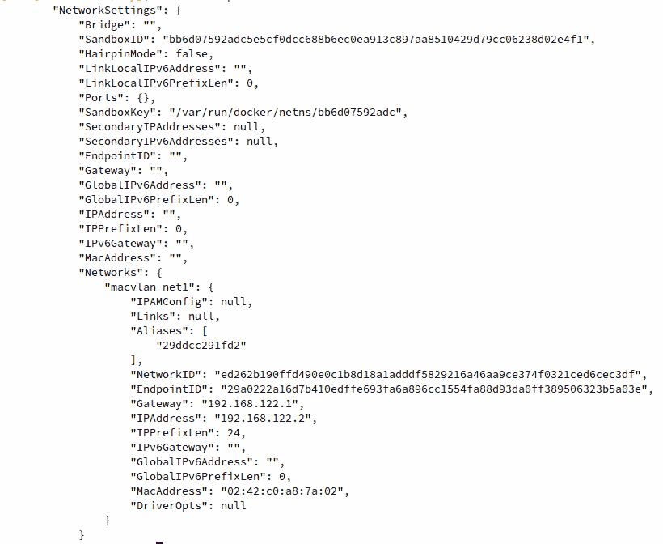

    图 6.22:docker 网络检查 macvlan1 网络的输出

    从这个输出中，您可以看到这个容器实例(类似于其他网络模式中的容器)有一个 IP 地址和一个默认网关。根据`Networks`子节下的`MacAddress`参数，还可以得出结论，该容器在`192.168.122.0/24`网络中还有一个 OSI 模型第 2 层媒体访问控制地址。该网段中的其他主机会认为该机器是位于该子网中的另一个物理节点，而不是位于该子网节点内部的容器。

30.  Use `docker run` to create a second container instance named `macvlan2` inside the `macvlan-net1` network:

    ```
    $ docker run -itd --name macvlan2 --network macvlan-net1 alpine:latest
    ```

    这将启动`macvlan-net1`网络中的另一个容器实例。

31.  Run the `docker inspect` command to see the MAC address of the `macvlan-net2` container instance:

    ```
    $ docker inspect macvlan2
    ```

    这将以 JSON 格式输出`macvlan2`容器实例的详细配置，此处被截断，仅显示相关的网络设置:

    

    图 6.23: docker 检查 macvlan2 容器的输出

    在这个输出中可以看到`macvlan2`容器与`macvlan1`容器实例有不同的 IP 地址和 MAC 地址。Docker 分配不同的媒体访问控制地址，以确保许多容器使用`macvlan`网络时不会出现第 2 层冲突。

32.  Run the `docker exec` command to access an `sh` shell inside this container:

    ```
    $ docker exec -it macvlan1 /bin/sh
    ```

    这应该会将您放入容器内的根会话中。

33.  Use the `ifconfig` command inside the container to observe that the MAC address you saw in the `docker inspect` output on the `macvlan1` container is present as the MAC address of the container's primary network interface:

    ```
    / # ifconfig
    ```

    在`eth0`界面的详细信息中，查看`HWaddr`参数。您可能还会注意到`inet addr`参数下列出的 IP 地址，以及该网络接口发送和接收的字节数–`RX bytes`(接收的字节)和`TX bytes`(发送的字节):

    ```
    eth0      Link encap:Ethernet  HWaddr 02:42:C0:A8:7A:02
              inet addr:192.168.122.2  Bcast:192.168.122.255
                                       Mask:255.255.255.0
              UP BROADCAST RUNNING MULTICAST  MTU:1500  Metric:1
              RX packets:353 errors:0 dropped:0 overruns:0 frame:0
              TX packets:188 errors:0 dropped:0 overruns:0 carrier:0
              collisions:0 txqueuelen:0 
              RX bytes:1789983 (1.7 MiB)  TX bytes:12688 (12.3 KiB)
    ```

34.  Install the `arping` utility using the `apk` package manager available in the Alpine Linux container. This is a tool used to send `arp` messages to a MAC address to check Layer 2 connectivity:

    ```
    / # apk add arping
    ```

    `arping`实用程序应安装在`macvlan1`容器内:

    ```
    fetch http://dl-cdn.alpinelinux.org/alpine/v3.11/main
    /x86_64/APKINDEX.tar.gz
    fetch http://dl-cdn.alpinelinux.org/alpine/v3.11/community
    /x86_64/APKINDEX.tar.gz
    (1/3) Installing libnet (1.1.6-r3)
    (2/3) Installing libpcap (1.9.1-r0)
    (3/3) Installing arping (2.20-r0)
    Executing busybox-1.31.1-r9.trigger
    OK: 6 MiB in 17 packages
    ```

35.  Specify the Layer 3 IP address of the `macvlan2` container instance as the primary argument to `arping`. Now, `arping` will automatically look up the MAC address and check the Layer 2 connectivity to it:

    ```
    / # arping 192.168.122.3
    ```

    `arping`实用程序应该报告回`macvlan2`容器实例的正确的媒体访问控制地址，指示成功的第 2 层网络连接:

    ```
    ARPING 192.168.122.3
    42 bytes from 02:42:c0:a8:7a:03 (192.168.122.3): index=0 
    time=8.563 usec
    42 bytes from 02:42:c0:a8:7a:03 (192.168.122.3): index=1 
    time=18.889 usec
    42 bytes from 02:42:c0:a8:7a:03 (192.168.122.3): index=2 
    time=15.917 use
    type exit to return to the shell of your primary terminal. 
    ```

36.  Check the status of the containers using the `docker ps -a` command:

    ```
    $ docker ps -a 
    ```

    该命令的输出应该显示环境中所有正在运行和停止的容器实例。

37.  Next, stop all running containers using `docker stop`, followed by the container name or ID:

    ```
    $ docker stop hostnet1
    ```

    对环境中所有正在运行的容器重复此步骤。

38.  Clean up the container images and unused networks using the `docker system prune` command:

    ```
    $ docker system prune -fa 
    ```

    此命令将清理计算机上剩余的所有未使用的容器映像、网络和卷。

在本练习中，我们查看了 Docker 中默认可用的四个默认网络驱动程序:`bridge`、`host`、`macvlan`和`none`。对于每个示例，我们探讨了网络如何工作，使用这些网络驱动程序部署的容器如何与主机一起工作，以及它们如何与网络上的其他容器一起工作。

Docker 默认公开的网络功能可以用来在非常高级的网络配置中部署容器，正如我们到目前为止所看到的。Docker 还提供了在集群配置中管理和协调主机之间的容器网络的能力。

在下一节中，我们将研究创建网络，该网络将在 Docker 主机之间创建覆盖网络，以确保容器实例之间的直接连接。

# 坞站叠加网络 i ng

`Overlay`网络是为了特定目的而在物理(底层)网络之上创建的逻辑网络。例如，**虚拟专用网络** ( **虚拟专用网络**)是`overlay`网络的一种常见类型，它使用互联网来创建到另一个专用网络的链接。Docker 可以创建和管理容器之间的`overlay`网络，这可以用于容器化的应用直接相互对话。当容器被部署到`overlay`网络中时，它们被部署在集群中的哪个主机上并不重要；它们将直接连接到存在于同一`overlay`网络中的其他容器化服务，就像它们存在于同一台物理主机上一样。

## 练习 6.04:定义覆盖网络

Docker `overlay`联网用于在 Docker 集群中的机器之间创建网状网络。在本练习中，您将使用两台机器创建一个基本的 Docker 集群。理想情况下，这些机器将存在于同一网络段上，以确保它们之间的直接网络连接和快速网络连接。此外，他们应该在支持的 Linux 发行版中运行相同版本的 Docker，例如红帽、CentOS 或 Ubuntu。

您将定义`overlay`网络，这些网络将跨越 Docker 集群中的主机。然后，您将确保部署在不同主机上的容器可以通过`overlay`网络相互通信:

注意

本练习需要访问安装了 Docker 的辅助机器。通常，基于云的虚拟机或部署在另一个虚拟机管理程序中的机器效果最好。使用 Docker Desktop 在系统上部署 Docker 群集可能会导致网络问题或严重的性能下降。

1.  On the first machine, `Machine1`, run `docker --version` to find out which version of Docker is currently running on it.

    ```
    Machine1 ~$ docker --version
    ```

    `The version details of the Docker installation of Machine1 will be displayed:`

    ```
    Docker version 19.03.6, build 369ce74a3c
    ```

    然后，你可以对`Machine2:`进行同样的操作

    ```
    Machine2 ~$ docker --version
    ```

    `The version details of the Docker installation of Machine2 will be displayed`:

    ```
    Docker version 19.03.6, build 369ce74a3c
    ```

    继续之前，请验证安装的 Docker 版本是否相同。

    注意

    Docker 版本可能因您的系统而异。

2.  On `Machine1`, run the `docker swarm init` command to initialize a Docker swarm cluster:

    ```
    Machine1 ~$ docker swarm init
    ```

    这将打印您可以在其他节点上使用的命令，以加入 Docker 群集群，包括 IP 地址和`join`令牌:

    ```
    docker swarm join --token SWMTKN-1-57n212qtvfnpu0ab28tewiorf3j9fxzo9vaa7drpare0ic6ohg-5epus8clyzd9xq7e7ze1y0p0n 
    192.168.122.185:2377
    ```

3.  On `Machine2`, run the `docker swarm join` command, which was provided by `Machine1`, to join the Docker swarm cluster:

    ```
    Machine2 ~$  docker swarm join --token SWMTKN-1-57n212qtvfnpu0ab28tewiorf3j9fxzo9vaa7drpare0ic6ohg-5epus8clyzd9xq7e7ze1y0p0n 192.168.122.185:2377
    ```

    `Machine2`应成功加入 Docker 群集群:

    ```
    This node joined a swarm as a worker.
    ```

4.  Execute the `docker info` command on both nodes to ensure they have successfully joined the swarm cluster:

    `Machine1`:

    ```
    Machine1 ~$ docker info
    ```

    `Machine2` :

    ```
    Machine2 ~$ docker info
    ```

    以下输出是`docker info`输出的`swarm`部分的截断。从这些详细信息中，您将看到这些 Docker 节点被配置在一个群集中，并且群集中有两个节点和一个管理器节点(`Machine1`)。这些参数在两个节点上应该是相同的，除了`Is Manager`参数，对于该参数`Machine1`将是管理器。默认情况下，Docker 将为默认 Docker 群集`overlay`网络分配一个默认子网`10.0.0.0/8`:

    ```
     swarm: active
      NodeID: oub9g5383ifyg7i52yq4zsu5a
      Is Manager: true
      ClusterID: x7chp0w3two04ltmkqjm32g1f
      Managers: 1
      Nodes: 2
      Default Address Pool: 10.0.0.0/8  
      SubnetSize: 24
      Data Path Port: 4789
      Orchestration:
        Task History Retention Limit: 5
    ```

5.  From the `Machine1` box, create an `overlay` network using the `docker network create` command. Since this is a network that will span more than one node in a simple swarm cluster, specify the `overlay` driver as the network driver. Call this network `overlaynet1`. Use a subnet and gateway that are not yet in use by any networks on your Docker hosts to avoid subnet collisions. Use `172.45.0.0/16` and `172.45.0.1` as the gateway:

    ```
    Machine1 ~$ docker network create overlaynet1 --driver overlay --subnet 172.45.0.0/16 --gateway 172.45.0.1
    ```

    将创建`overlay`网络。

6.  Use the `docker network ls` command to verify whether the network was created successfully and is using the correct `overlay` driver:

    ```
    Machine1 ~$ docker network ls
    ```

    将显示 Docker 主机上可用的网络列表:

    ```
    NETWORK ID       NAME              DRIVER     SCOPE
    54f2af38e6a8     bridge            bridge     local
    df5ebd75303e     docker_gwbridge   bridge     local
    f52b4a5440ad     host              host       local
    8hm1ouvt4z7t     ingress           overlay    swarm
    9bed60b88784     none              null       local
    60wqq8ewt8zq     overlaynet1       overlay    swarm
    ```

7.  Use the `docker service create` command to create a service that will span multiple nodes in the swarm cluster. Deploying containers as services allow you to specify more than one replica of a container instance for horizontal scaling or scaling container instances across nodes in a cluster for high availability. To keep this example simple, create a single container service of Alpine Linux. Name this service `alpine-overlay1`:

    ```
    Machine1 ~$ docker service create -t --replicas 1 --network overlaynet1 --name alpine-overlay1 alpine:latest
    ```

    基于文本的进度条将显示`alpine-overlay1`服务部署的进度:

    ```
    overall progress: 1 out of 1 tasks 
    1/1: running   [===========================================>]
    verify: Service converged 
    ```

8.  Repeat the same `docker service create` command, but now specify `alpine-overlay2` as the service name:

    ```
    Machine1 ~$ docker service create -t --replicas 1 --network overlaynet1 --name alpine-overlay2 alpine:latest
    ```

    基于文本的进度条将再次显示服务部署的进度:

    ```
    overall progress: 1 out of 1 tasks 
    1/1: running   [===========================================>]
    verify: Service converged
    ```

    注意

    关于在 Docker swarm 中创建服务的更多细节可以在*第 9 章，Docker Swarm* 中找到。由于本练习的范围是网络，我们现在将重点讨论网络组件。

9.  From the `Machine1` node, execute the `docker ps` command to see which service is running on this node:

    ```
    Machine1 ~$ docker ps 
    ```

    将显示正在运行的容器。Docker 将智能地在 Docker 集群中的节点之间扩展容器。在本例中，来自`alpine-overlay1`服务的容器落在`Machine1`上。根据 Docker 部署服务的方式，您的环境可能会有所不同:

    ```
    CONTAINER ID    IMAGE           COMMAND     CREATED
      STATUS              PORTS             NAMES
    4d0f5fa82add    alpine:latest   "/bin/sh"   59 seconds ago
      Up 57 seconds                         alpine-overlay1.1.
    r0tlm8w0dtdfbjaqyhobza94p
    ```

10.  Run the `docker inspect` command to view the verbose details of the running container:

    ```
    Machine1 ~$ docker inspect alpine-overlay1.1.r0tlm8w0dtdfbjaqyhobza94p
    ```

    将显示正在运行的容器实例的详细信息。以下输出已被截断以显示`docker inspect`输出的`NetworkSettings`部分:

    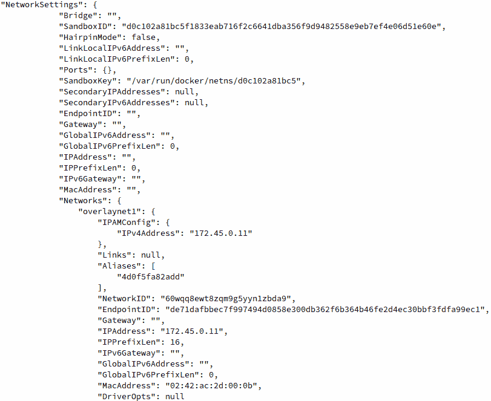

    图 6.24:检查高山覆盖 1 容器实例

    请注意，该容器的 IP 地址在您在`Machine1`上指定的子网内。

11.  On the `Machine2` instance, execute the `docker network ls` command to view the Docker networks available on the host:

    ```
    Machine2 ~$ docker network ls
    ```

    所有可用 Docker 网络的列表将显示在 Docker 主机上:

    ```
    NETWORK ID       NAME              DRIVER     SCOPE
    8c7755be162f     bridge            bridge     local
    28055e8c63a0     docker_gwbridge   bridge     local
    c62fb7ac090f     host              host       local
    8hm1ouvt4z7t     ingress           overlay    swarm
    6182d77a8f62     none              null       local
    60wqq8ewt8zq     overlaynet1       overlay    swarm
    ```

    请注意在`Machine1`上定义的`overlaynet1`网络也可以在`Machine2`上获得。这是因为使用`overlay`驱动程序创建的网络对 Docker 集群中的所有主机都可用。这使得可以使用该网络部署容器，以便在集群中的所有主机上运行。

12.  Use the `docker ps` command to list the running containers on this Docker instance:

    ```
    Machine2 ~$ docker ps
    ```

    将显示所有运行容器的列表。在本例中，`alpine-overlay2`服务中的容器落在了`Machine2`集群节点上:

    ```
    CONTAINER ID   IMAGE           COMMAND      CREATED
      STATUS              PORTS               NAMES
    53747ca9af09   alpine:latest   "/bin/sh"    33 minutes ago
      Up 33 minutes                           alpine-overlay2.1.ui9vh6zn18i48sxjbr8k23t71
    ```

    注意

    在您的示例中，服务所在的节点可能与此处显示的不同。Docker 根据各种标准(如可用的 CPU 带宽、内存和对已部署容器的调度限制)来决定如何部署容器。

13.  Use `docker inspect` to investigate the network configuration of this container as well:

    ```
    Machine2 ~$ docker inspect alpine-overlay2.1.ui9vh6zn18i48sxjbr8k23t71
    ```

    将显示详细的容器配置。该输出已被截断，以 JSON 格式显示输出的`NetworkSettings`部分:

    

    图 6.25: docker 检查高山覆盖 2 容器实例的输出

    请注意，该容器在`overlaynet1` `overlay`网络中也有一个 IP 地址。

14.  Since both services are deployed within the same `overlay` network but exist in two separate hosts, you can see that Docker is using the `underlay` network to proxy the traffic for the `overlay` network. Check the network connectivity between the services by attempting a ping from one service to the other. It should be noted here that, similar to static containers deployed in the same network, services deployed on the same network can resolve each other by name using Docker DNS. Use the `docker exec` command on the `Machine2` host to access an `sh` shell inside the `alpine-overlay2` container:

    ```
    Machine2 ~$ docker exec -it alpine-overlay2.1.ui9vh6zn18i48sxjbr8k23t71 /bin/sh
    ```

    这将把你放到`alpine-overlay2`容器实例的根外壳中。使用`ping`命令启动与`alpine-overlay1`容器的网络通信:

    ```
    / # ping alpine-overlay1
    PING alpine-overlay1 (172.45.0.10): 56 data bytes
    64 bytes from 172.45.0.10: seq=0 ttl=64 time=0.314 ms
    64 bytes from 172.45.0.10: seq=1 ttl=64 time=0.274 ms
    64 bytes from 172.45.0.10: seq=2 ttl=64 time=0.138 ms
    ```

    请注意，即使这些容器部署在两个独立的主机上，这些容器也可以使用共享的`overlay`网络通过名称相互通信。

15.  From the `Machine1` box, you can attempt the same communication to the `alpine-overlay2` service container. Use the `docker exec` command to access an `sh` shell on the `Machine1` box:

    ```
    Machine1 ~$ docker exec -it alpine-overlay1.1.r0tlm8w0dtdfbjaqyhobza94p /bin/sh
    ```

    这应该会将您放入容器内的根外壳中。使用`ping`命令启动与`alpine-overlay2`容器实例的通信:

    ```
    / # ping alpine-overlay2
    PING alpine-overlay2 (172.45.0.13): 56 data bytes
    64 bytes from 172.45.0.13: seq=0 ttl=64 time=0.441 ms
    64 bytes from 172.45.0.13: seq=1 ttl=64 time=0.227 ms
    64 bytes from 172.45.0.13: seq=2 ttl=64 time=0.282 ms
    ```

    再次注意，通过使用 Docker DNS，可以使用`overlay`网络驱动程序在主机之间解析`alpine-overlay2`容器的 IP 地址。

16.  Use the `docker service rm` command to delete both services from the `Machine1` node:

    ```
    Machine1 ~$ docker service rm alpine-overlay1
    Machine1 ~$ docker service rm alpine-overlay2
    ```

    对于这些命令中的每一个，服务名称将短暂出现，表示命令执行成功。在这两个节点上，`docker ps`将显示当前没有容器正在运行。

17.  Delete the `overlaynet1` Docker network by using the `docker rm` command and specifying the name `overlaynet1`:

    ```
    Machine1 ~$ docker network rm overlaynet1
    ```

    `overlaynet1`网络将被删除。

在本练习中，我们研究了 Docker 集群中两台主机之间的 Docker `overlay`网络。`Overlay`联网在 Docker 容器集群中非常有益，因为它允许在集群中的节点之间水平扩展容器。从网络角度来看，这些容器可以通过主机的物理网络接口上代理的服务网格直接相互对话。这不仅减少了延迟，而且通过利用 Docker 的许多功能(如 DNS)简化了部署。

既然我们已经了解了所有原生的 Docker 网络类型以及它们如何工作的示例，我们可以看看最近越来越流行的 Docker 网络的另一个方面。正如我们所看到的，由于 Docker 网络非常模块化，Docker 支持一个插件系统，允许用户部署和管理定制的网络驱动程序。

在下一节中，我们将通过从 Docker Hub 安装第三方网络驱动程序来了解非本地 Docker 网络如何工作。

# 非本地Docker网络

在本章的最后一节，我们将讨论非本地 Docker 网络。除了可用的本机 Docker 网络驱动程序之外，Docker 还支持自定义网络驱动程序，这些驱动程序可以由用户编写，也可以通过 Docker Hub 从第三方下载。自定义第三方网络驱动程序在需要非常特殊的网络配置的情况下，或者在容器网络需要以某种方式运行的情况下非常有用。例如，一些网络驱动程序为用户提供了设置有关访问互联网资源的自定义策略的能力，或者为容器化应用之间的通信定义白名单的能力。从安全、策略和审计的角度来看，这可能很有帮助。

在下面的练习中，我们将下载并安装 Weave Net 驱动程序，并在 Docker 主机上创建一个网络。Weave Net 是一个高度受支持的第三方网络驱动程序，它提供了对容器网状网络的出色可见性，允许用户创建复杂的服务网状基础架构，可以跨越多云场景。我们将从 Docker Hub 安装 Weave Net 驱动程序，并在我们在前面的练习中定义的简单集群集群中配置一个基本网络。

## 练习 6.05:安装和配置编织网 Docker 网络驱动程序

在本练习中，您将下载并安装 Weave Net Docker 网络驱动程序，并将其部署在您在上一个练习中创建的 Docker 集群中。Weave Net 是最常见和最灵活的第三方 Docker 网络驱动程序之一。使用编织网，可以定义非常复杂的网络配置，以实现基础架构的最大灵活性:

1.  Install the Weave Net driver from Docker Hub using the `docker plugin install` command on the `Machine1` node:

    ```
    Machine1 ~$ docker plugin install store/weaveworks/net-plugin:2.5.2
    ```

    这将提示您在安装编织网的机器上授予编织网权限。授予请求的权限是安全的，因为 Weave Net 要求他们在主机操作系统上正确设置网络驱动程序:

    ```
    Plugin "store/weaveworks/net-plugin:2.5.2" is requesting 
    the following privileges:
     - network: [host]
     - mount: [/proc/]
     - mount: [/var/run/docker.sock]
     - mount: [/var/lib/]
     - mount: [/etc/]
     - mount: [/lib/modules/]
     - capabilities: [CAP_SYS_ADMIN CAP_NET_ADMIN CAP_SYS_MODULE]
    Do you grant the above permissions? [y/N]
    ```

    按下 *y* 键，回答提示。织网插件应该安装成功。

2.  On the `Machine2` node, run the same `docker plugin install` command. All nodes in the Docker swarm cluster should have the plugin installed since all nodes will be participating in the swarm mesh networking:

    ```
    Machine2 ~$ docker plugin install store/weaveworks/net-plugin:2.5.2
    ```

    将显示权限提示。当提示继续安装时，用 *y* 响应:

    ```
    Plugin "store/weaveworks/net-plugin:2.5.2" is requesting 
    the following privileges:
     - network: [host]
     - mount: [/proc/]
     - mount: [/var/run/docker.sock]
     - mount: [/var/lib/]
     - mount: [/etc/]
     - mount: [/lib/modules/]
     - capabilities: [CAP_SYS_ADMIN CAP_NET_ADMIN CAP_SYS_MODULE]
    Do you grant the above permissions? [y/N]
    ```

3.  Create a network using the `docker network create` command on the `Machine1` node. Specify the Weave Net driver as the primary driver and the network name as `weavenet1`. For the subnet and gateway parameters, use a unique subnet that has not yet been used in the previous exercises:

    ```
    Machine1 ~$  docker network create --driver=store/weaveworks/net-plugin:2.5.2 --subnet 10.1.1.0/24 --gateway 10.1.1.1 weavenet1
    ```

    这应该会在 Docker 集群中创建一个名为`weavenet1`的网络。

4.  List the available networks in the Docker swarm cluster using the `docker network ls` command:

    ```
    Machine1 ~$ docker network ls 
    ```

    列表中应显示`weavenet1`网络:

    ```
    NETWORK ID     NAME             DRIVER
      SCOPE
    b3f000eb4699   bridge           bridge
      local
    df5ebd75303e   docker_gwbridge  bridge
      local
    f52b4a5440ad   host             host
      local
    8hm1ouvt4z7t   ingress          overlay
      swarm
    9bed60b88784   none             null
      local
    q354wyn6yvh4   weavenet1        store/weaveworks/net-plugin:2.5.2
      swarm
    ```

5.  Execute the `docker network ls` command on the `Machine2` node to ensure that the `weavenet1` network is present on that machine as well:

    ```
    Machine2 ~$ docker network ls 
    ```

    `weavenet1`网络应列出:

    ```
    NETWORK ID    NAME              DRIVER
      SCOPE
    b3f000eb4699  bridge            bridge
      local
    df5ebd75303e  docker_gwbridge   bridge
      local
    f52b4a5440ad  host              host
      local
    8hm1ouvt4z7t  ingress           overlay
      swarm
    9bed60b88784  none              null
      local
    q354wyn6yvh4  weavenet1         store/weaveworks/net-plugin:2.5.2
      swarm
    ```

6.  On the `Machine1` node, create a service called `alpine-weavenet1` that uses the `weavenet1` network using the `docker service create` command:

    ```
    Machine1 ~$ docker service create -t --replicas 1 --network weavenet1 --name alpine-weavenet1 alpine:latest
    ```

    基于文本的进度条将显示服务的部署状态。它应该在没有任何问题的情况下完成:

    ```
    overall progress: 1 out of 1 tasks 
    1/1: running   [===========================================>]
    verify: Service converged 
    ```

7.  Use the `docker service create` command again to create another service in the `weavenet1` network called `alpine-weavenet2`:

    ```
    Machine1 ~$ docker service create -t --replicas 1 --network weavenet1 --name alpine-weavenet2 alpine:latest
    ```

    基于文本的进度条将再次显示，指示服务创建的状态:

    ```
    overall progress: 1 out of 1 tasks 
    1/1: running   [===========================================>]
    verify: Service converged 
    ```

8.  Run the `docker ps` command to validate that an Alpine container is successfully running on each node in the cluster:

    `Machine1` :

    ```
    Machine1 ~$ docker ps
    ```

    `Machine2` :

    ```
    Machine2 ~$ docker ps
    ```

    其中一个服务容器应该在两台机器上启动并运行:

    `Machine1` :

    ```
    CONTAINER ID    IMAGE           COMMAND      CREATED
      STATUS              PORTS               NAMES
    acc47f58d8b1    alpine:latest   "/bin/sh"    7 minutes ago
      Up 7 minutes                            alpine-weavenet1.1.zo5folr5yvu6v7cwqn23d2h97
    ```

    `Machine2`:

    ```
    CONTAINER ID    IMAGE           COMMAND     CREATED
      STATUS              PORTS        NAMES
    da2a45d8c895    alpine:latest   "/bin/sh"   4 minutes ago
      Up 4 minutes                     alpine-weavenet2.1.z8jpiup8yetj
    rqca62ub0yz9k
    ```

9.  Use the `docker exec` command to access an `sh` shell inside the `weavenet1.1` container instance. Make sure to run this command on the node in the swarm cluster that is running this container:

    ```
    Machine1 ~$ docker exec -it alpine-weavenet1.1.zo5folr5yvu6v7cwqn23d2h97 /bin/sh
    ```

    这将使您进入容器内部的根外壳:

    ```
    / #
    ```

10.  Use the `ifconfig` command to view the network interfaces present inside this container:

    ```
    / # ifconfig
    ```

    这将显示一个新命名的网络接口`ethwe0`。Weave Net 核心网络策略的一个核心部分是在容器内创建自定义命名的接口，以便于识别和故障排除。应该注意的是，该接口从我们提供的子网中分配了一个 IP 地址作为配置参数:

    ```
    ethwe0  Link encap:Ethernet  HWaddr AA:11:F2:2B:6D:BA  
            inet addr:10.1.1.3  Bcast:10.1.1.255  Mask:255.255.255.0
            UP BROADCAST RUNNING MULTICAST  MTU:1376  Metric:1
            RX packets:37 errors:0 dropped:0 overruns:0 frame:0
            TX packets:0 errors:0 dropped:0 overruns:0 carrier:0
            collisions:0 txqueuelen:0 
            RX bytes:4067 (3.9 KiB)  TX bytes:0 (0.0 B)
    ```

11.  From inside this container, ping the `alpine-weavenet2` service by name, using the `ping` utility:

    ```
    ping alpine-weavenet2
    ```

    您应该会看到来自`alpine-weavenet2`服务的解析 IP 地址的响应:

    ```
    64 bytes from 10.1.1.4: seq=0 ttl=64 time=3.430 ms
    64 bytes from 10.1.1.4: seq=1 ttl=64 time=1.541 ms
    64 bytes from 10.1.1.4: seq=2 ttl=64 time=1.363 ms
    64 bytes from 10.1.1.4: seq=3 ttl=64 time=1.850 ms
    ```

    注意

    由于 Docker 和 Docker Swarm 的最新版本中 Docker libnetwork 栈的最新更新，按名称 ping 服务:`alpine-weavenet2`可能不起作用。要证明网络按预期工作，请尝试直接 ping 通容器的名称:`alpine-weavenet2.1.z8jpiup8yetjrqca62ub0yz9k`–请记住，此容器的名称在您的实验室环境中会有所不同。

12.  Try pinging Google DNS servers (`8.8.8.8`) on the open internet from these containers as well to ensure that these containers have internet access:

    ```
    ping 8.8.8.8
    ```

    您应该会看到响应返回，表明这些容器可以访问互联网:

    ```
    / # ping 8.8.8.8
    PING 8.8.8.8 (8.8.8.8): 56 data bytes
    64 bytes from 8.8.8.8: seq=0 ttl=51 time=13.224 ms
    64 bytes from 8.8.8.8: seq=1 ttl=51 time=11.840 ms
    type exit to quit the shell session in this container.
    ```

13.  Use the `docker service rm` command to remove both services from the `Machine1` node:

    ```
    Machine1 ~$ docker service rm alpine-weavenet1
    Machine1 ~$ docker service rm alpine-weavenet2
    ```

    这将删除两个服务，停止并删除容器实例。

14.  Delete the Weave Net network that was created by running the following command:

    ```
    Machine1 ~$ docker network rm weavenet1
    ```

    编织网络应该被删除。

在健壮的容器化网络概念系统中，Docker 有大量的网络驱动程序来覆盖您的工作负载所需的几乎任何环境。但是，对于默认 Docker 网络驱动程序之外的所有用例，Docker 支持几乎任何可能出现的网络条件的第三方定制驱动程序。第三方网络驱动程序允许 Docker 与各种平台甚至跨多个云提供商进行灵活的集成。在本练习中，我们查看了如何安装和配置 Weave Net 网络插件，以及如何在 Docker 集群中创建简单的服务来利用这个网络。

在下面的活动中，您将使用各种 Docker 网络驱动程序，应用本章中所学的知识来部署多容器基础架构解决方案。这些容器将使用相同主机上的不同 Docker 网络驱动程序进行通信，甚至在 Docker 群配置中跨多个主机进行通信。

## 活动 6.01:利用 Docker 网络驱动程序

在本章的前面，我们研究了各种类型的 Docker 网络驱动程序，以及它们如何以不同的方式发挥作用，以带来不同程度的网络功能，从而在您的容器环境中提供功能。在本练习中，您将在 Docker `bridge`网络中部署全景徒步应用的示例容器。然后，您将在`host`网络模式下部署一个辅助容器，作为监控服务器，并能够使用`curl`验证应用是否按预期运行。

执行以下步骤完成本活动:

1.  使用自定义子网和网关 IP 创建自定义 Docker `bridge`网络。
2.  在该`bridge`网络中部署名为`webserver1`的 NGINX 网络服务器，将容器上的转发端口`80`暴露给主机上的端口`8080`。
3.  在`host`联网模式下部署一个 Alpine Linux 容器，作为监控容器。
4.  使用 Alpine Linux 容器`curl`到 NGINX 网络服务器并得到响应。

**预期输出:**

完成活动后，当您直接连接到端口`80`上的转发端口`8080`和`webserver1`容器的 IP 地址时，您应该会得到以下输出:

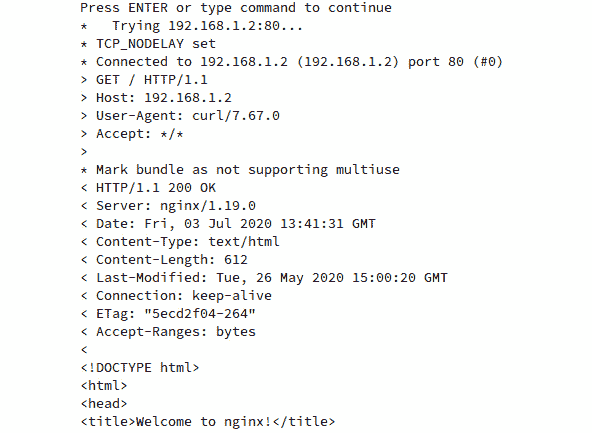

图 6.26:从容器实例的 IP 地址访问 NGINX 网络服务器

注意

此活动的解决方案可以通过[这个链接](16.html#_idTextAnchor331)找到。

在下一个活动中，我们将了解如何利用 Docker 网络为全景徒步旅行应用提供横向可扩展性。通过在多台主机上部署全景徒步，我们可以确保可靠性和持久性，并利用环境中多个节点的系统资源。

## 活动 6.02:覆盖网络在行动

在本章中，您已经看到了`overlay`网络在集群主机之间部署多个容器并在它们之间建立直接网络连接时是多么强大。在本练习中，您将重新访问双节点 Docker 群集，并从全景徒步应用创建服务，该应用将使用两个主机之间的 Docker DNS 进行连接。在这种情况下，不同的微服务将在不同的 Docker 群主机上运行，但仍然能够利用 Docker `overlay`网络直接相互通信。

要成功完成本活动，请执行以下步骤:

1.  使用自定义子网和网关的 Docker `overlay`网络
2.  一个名为`trekking-app`的应用 Docker 集群服务使用了一个 Alpine Linux 容器
3.  一个名为`database-app`的数据库 Docker 群服务使用 PostgreSQL 12 容器(提供默认凭证的额外信用)
4.  证明`trekking-app`服务可以使用`overlay`网络与`database-app`服务进行通信

**预期输出:**

`trekking-app`服务应该能够与`database-app`服务进行通信，这可以通过 ICMP 回复来验证，例如:

```
PING database-app (10.2.0.5): 56 data bytes
64 bytes from 10.2.0.5: seq=0 ttl=64 time=0.261 ms
64 bytes from 10.2.0.5: seq=1 ttl=64 time=0.352 ms
64 bytes from 10.2.0.5: seq=2 ttl=64 time=0.198 ms
```

注意

此活动的解决方案可以通过[这个链接](16.html#_idTextAnchor333)找到。

# 总结

在本章中，我们研究了与微服务和 Docker 容器相关的网络的许多方面。Docker 配备了许多驱动程序和配置选项，用户可以使用它们来调整他们的容器网络在几乎任何环境中的工作方式。通过部署正确的网络和正确的驱动程序，强大的服务网状网络可以快速旋转，以实现容器到容器的访问，而无需脱离任何物理 Docker 主机。甚至可以创建绑定到主机网络结构的容器，以利用底层网络基础设施。

可以说，Docker 中最强大的网络功能是跨 Docker 主机集群创建网络的能力。这使我们能够在主机之间快速创建和部署水平扩展应用，以实现高可用性和冗余。通过利用底层网络，`overlay`集群内的网络允许容器通过利用强大的 Docker DNS 系统直接联系运行在其他集群主机上的容器。

在下一章中，我们将探讨强大的容器化基础架构的下一个支柱:存储。通过了解容器存储如何用于有状态应用，可以构建极其强大的解决方案，不仅包括容器化的无状态应用，还包括容器化的数据库服务，这些服务可以像基础架构中的其他容器一样轻松地进行部署、扩展和优化。