# 八、CI/CD 管道

概观

本章介绍**持续集成和持续交付** ( **CI/CD** )，投产前最关键的一步。这是开发和生产之间的中间阶段。本章将展示 Docker 如何成为 CI 和 CD 的强大技术，以及它如何轻松地与其他广泛使用的平台集成。到本章结束时，您将能够配置 GitHub、Jenkins 和 SonarQube，并将它们合并到一起，以自动发布您的映像用于生产。

# 简介

在前几章中，您学习了如何编写`docker-compose`文件，并探索了服务的网络和存储。在本章中，您将学习如何集成应用的各种微服务，并对其进行整体测试。

**CI/CD** 代表**持续集成和持续交付**。有时，**光盘**也用于**持续部署**。这里的部署意味着通过自动化的管道工作流使应用可以从特定的网址公开访问，而交付意味着使应用准备好进行部署。在本章中，我们将重点讨论 CI/CD 的概念。

本章讨论 Docker 如何在分步练习中集成到 CI/CD 管道中。您还将学习如何安装和运行 Jenkins 作为 Docker 容器。Jenkins 是一个开源的自动化服务器。通过软件开发的自动化部分，您可以使用它来构建、测试、部署和促进 CI/CD。詹金斯的安装只是一个 Docker 命令。在 Docker 上安装 Jenkins 比将其作为应用安装更健壮，而且不会与特定的操作系统紧密耦合。

注意

如果您在 GitHub 和 Docker Hub 上没有帐户，请创建它们。您可以通过以下链接免费获取:[www.github.com](http://www.github.com)[http://hub.docker.com](http://hub.docker.com)。

# 什么是 CI/CD？

CI/CD 是一种帮助应用开发团队更频繁、更可靠地向用户提供代码更改的方法。CI/CD 将自动化引入到代码部署的各个阶段。

当几个开发人员协作并贡献给同一个应用时(他们每个人负责某个微服务或修复特定的错误)，他们使用代码版本控制提供程序来使用开发人员上传和推送的最新代码版本聚合应用。GitHub、Bitbucket 和 Assembla 都是版本控制系统的例子。开发人员和测试人员将应用代码和 Docker 文件推送到自动化软件，以构建、测试和部署 CI/CD 管道。Jenkins、Circle CI 和 GitLab CI/CD 就是这样的自动化平台的例子。

通过测试后，构建一个 Docker 映像并发布到您的存储库中。这些存储库可以是 Docker Hub，即贵公司的 **Docker 可信注册中心** ( **DTR** )或亚马逊**弹性容器注册中心** ( **ECR** )。

在本章中，如同在*图 8.1* 中一样，我们将使用 GitHub 存储库进行代码版本控制。然后，我们将使用 Jenkins 来构建和发布框架，并将 Docker Hub 作为注册中心。


图 8.1:配置项/光盘管道

您必须在生产阶段之前构建 Docker 映像，因为在生产中使用的`docker-stack.yml`文件中没有`build`关键字。然后，该映像将在集成的自动化目标环境中部署到生产环境中。在生产中，操作人员(或开发人员)配置编排者从注册表中提取映像。Kubernetes、Docker Swarm 和 Google Kubernetes Engine 是可用于从注册表中提取映像的生产编排器和管理服务的示例。

总而言之，我们有三个主要步骤:

1.  将代码上传到 GitHub。
2.  在詹金斯创建一个项目，并输入 GitHub 和 Docker Hub 凭据。Jenkins 将自动构建映像，并将其推送给 Docker Hub 帐户。当您将代码推送到 GitHub 时，Jenkins 会自动检测、测试和构建映像。如果没有生成错误，Jenkins 会将映像推送到注册表。
3.  验证映像是否在您的 Docker Hub 帐户上。

在下一个练习中，您将安装 Jenkins 作为用于构建映像的容器。Jenkins 是最受欢迎的测试平台之一，市场需求量很大。詹金斯有几种项目类型。在本章中，我们将使用自由式项目类型。

注意

请使用`touch`命令创建文件，使用`vim`命令使用 vim 编辑器处理文件。

## 练习 8.01:将 Jenkins 安装为容器

在本练习中，您将安装 Jenkins，完成其设置，并安装初步插件。您将安装将在本章中使用的 Git 和 GitHub 插件。执行以下步骤，将 Jenkins 成功安装为容器:

1.  Run the following command to pull the Jenkins image:

    ```
    $docker run -d -p 8080:8080 -v /var/run/docker.sock:/var/run/docker.sock jenkinsci/blueocean
    ```

    这将产生类似如下的输出:

    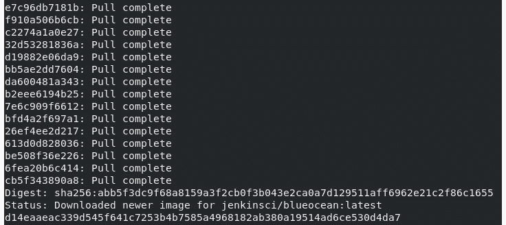

    图 8.2:docker 运行命令的输出

    注意

    Docker Hub 上有很多詹金斯的图片。请随意拉动其中的任何一个，并使用端口和共享卷进行播放，但请注意不推荐使用的映像，因为詹金斯官方映像现在不推荐使用`Jenkins/Jenkins:lts`映像。因此，请仔细阅读图片文档。然而，如果一个人不工作，不要担心。这可能不是你的错。寻找另一个，并仔细遵循文档的说明。

2.  Open the browser and connect to the Jenkins service at `http://localhost:8080`.

    如果它给你一条错误消息，说明它无法到达 Docker 守护程序，使用以下命令将 Jenkins 添加到`docker`组:

    ```
    $ sudo groupadd docker
    $ sudo usermod –aG docker jenkins
    ```

    注意

    如果您机器的操作系统是 Windows，本地主机可能无法解析。在 Windows PowerShell 中运行`ipconfig`命令。在输出的第二部分，`ipconfig`显示`switch`网络的信息。复制 IPv4 地址，并在整个练习中使用它代替本地主机。

    您也可以从`Control Panel` > `Network and Sharing Center`获取 IP 地址，然后点击`Details`进行以太网或 Wi-Fi 连接。

    安装后，詹金斯会要求一个`Administrator password`来解锁:

    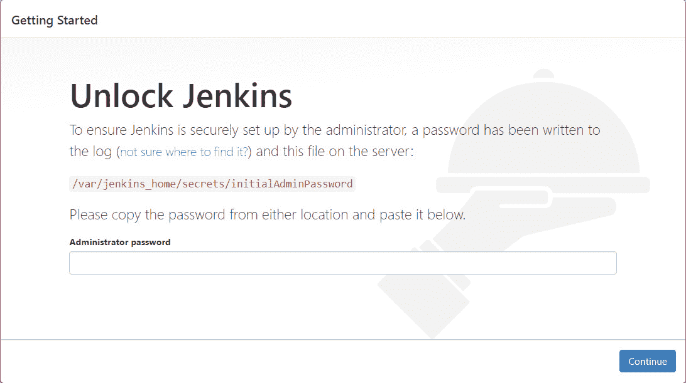

    图 8.3:詹金斯入门

    Jenkins 会自动生成一个密码，供您用来解锁应用。在下一步中，您将看到如何获取此密码。

3.  Run the `docker container ls` command to get the list of the currently running containers:

    ```
    $ docker container ls
    ```

    您将获得从`jekinsci/blueocean`映像制作的容器的细节:

    ```
    CONTAINER ID IMAGE              COMMAND               CREATED
      STATUS              PORTS
    9ed51541b036 jekinsci/blueocean "/sbin/tini../usr/.." 5 minutes ago
      Up 5 minutes        0.0.0.0:8080->8080/tcp, 5000/tcp
    ```

4.  Copy the container ID and run the `docker logs` command:

    ```
    $ docker logs 9ed51541b036
    ```

    在日志文件的末尾，您会发现六行星号。密码将在它们之间。复制并粘贴到浏览器中:

    

    图 8.4:Docker日志命令的输出

5.  Select `Install suggested plugins`. Then, click `Skip and continue as admin`. Click `Save and Finish`:

    

    图 8.5:安装插件定制詹金斯

    在建议的插件中，有 Git 和 GitHub 插件，Jenkins 会自动为你安装。在接下来的练习中，你将需要这些插件。

    注意

    在*练习 8.04* 、*集成 Jenkins 和 Docker Hub、*中，您将需要安装更多插件，以便 Jenkins 可以将映像推送到 Docker Hub 注册表。这将在后面详细讨论，以及如何在一步一步的实验中管理 Jenkins 插件。

6.  After installation, it will display `Jenkins is ready!`. Click `Start using Jenkins`:

    

    图 8.6:设置詹金斯

7.  Click on `Create a job` to build the software project:

    

图 8.7:詹金斯的欢迎页面

前面的截图验证了您已经在系统上成功安装了 Jenkins。

在接下来的部分中，我们将遵循本章中的 CI/CD 管道。第一步是将代码上传到 GitHub，然后将 Jenkins 与 GitHub 集成，这样 Jenkins 就可以拉取代码并自动构建映像。最后一步是将 Jenkins 与注册中心集成，在没有任何人工干预的情况下将该映像推送到注册中心。

# 整合 GitHub 和 Jenkins

安装 Jenkins 后，我们将创建第一个作业，并将其与 GitHub 集成。在这一节中，就像在*图 8.8* 中一样，我们将只关注 GitHub 和 Jenkins。稍后将讨论 Docker Hub。


图 8.8:集成 GitHub 和 Jenkins

我们将使用一个简单的 Python 应用来计算网站的点击量。每次刷新页面，计数器都会递增，导致网站点击次数增加。

注意

`Getting Started`应用的代码文件可以在以下链接找到:[https://github.com/efoda/hit_counter](https://github.com/efoda/hit_counter)。

该应用由四个文件组成:

*   `app.py`:这是 Python 应用代码。它使用`Redis`来记录网站的点击次数。
*   `requirments.txt`:该文件包含应用正常工作所需的依赖项。
*   `Dockerfile`:这将使用所需的库和依赖项构建映像。
*   `docker-compose.yml`: It is essential to have the YAML file when two or more containers are working together.

    在这个简单的应用中，我们还有两个服务，`Web`和`Redis`，如*图 8.9* 所示:

    

图 8.9:命中计数器应用架构

如果你不知道如何把这个应用上传到你的 GitHub 账号，不用担心。下一个练习将指导您完成这个过程。

## 练习 8.02:将代码上传到 GitHub

您可以使用 GitHub 保存您的代码和项目。在本练习中，您将学习如何将代码下载并上传到 GitHub。您可以通过在 GitHub 网站上分叉代码或从命令提示符下推送代码来实现这一点。在本练习中，您将从命令提示符处进行操作。

执行以下步骤将代码上传到 GitHub:

1.  On the GitHub website, create a new empty repository with the name `hit_counter`. Open a terminal and clone the code by typing the following command:

    ```
    $ git clone https://github.com/efoda/hit_counter
    ```

    这将产生类似如下的输出:

    ```
    Cloning into 'hit counter'...
    remote: Enumerating objects: 38, done.
    remote: Counting objects: 100% (38/38), done
    remote: Compressing objects: 100% (35/35), done
    remote: Total 38 (delta 16), reused 0 (delta 0), pack-reused 0
    Receiving object: 100% (38/38), 8.98 KiB | 2.25 MiB/s, done.
    Resolving deltas: 100% (16/16), done
    ```

2.  Verify that the code is downloaded to your local machine by listing the directories. Then, open the application directory:

    ```
    $ cd hit_counter
    ~/hit_counter$ ls
    ```

    您将找到下载到本地计算机的应用文件:

    ```
    app.py docker-compose.yml Dockerfile README.md requirements.txt
    ```

3.  Initialize and configure Git:

    ```
    $ git init
    ```

    您应该会得到类似如下的输出:

    ```
    Reinitialized existing Git repository in 
    /home/docker/hit_counter/.git/
    ```

4.  输入您的用户名和电子邮件:

    ```
    $ git config user.email "<you@example.com>"
    $ git config user.name "<Your Name>"
    ```

5.  指定 Git 账户的名称，`origin`和`destination` :

    ```
    $ git remote add origin https://github.com/efoda/hit_counter.git
    fatal: remote origin already exists.
    $ git remote add destination https://github.com/<your Github Username>/hit_counter.git
    ```

6.  Add all the content in the current path:

    ```
    $ git add .
    ```

    您也可以通过键入以下命令来添加特定文件，而不是所有文件:

    ```
    $ git add <filename>.<extension>
    ```

7.  Specify a `commit` message:

    ```
    $ git commit -m "first commit"
    ```

    这将产生类似如下的输出:

    ```
    On branch master
    Your branch is up to date with 'origin/master'.
    nothing to commit, working tree clean
    ```

8.  Push the code to your GitHub account:

    ```
    $ git push -u destination master
    ```

    它会询问您的用户名和密码。登录后，文件将上传到您的 GitHub 存储库中:

    

    图 8.10:将代码推送到 GitHub

9.  检查您的 GitHub 帐户。你会发现文件都上传到那里了。

现在我们已经完成了 CI/CD 管道的第一步，并将代码上传到 GitHub，我们将把 GitHub 与 Jenkins 集成在一起。

注意

从这一点开始，接下来，用您的用户名替换 GitHub 用户名`efoda`。

## 练习 8.03:整合 GitHub 和 Jenkins

您在*练习 8.01* 、*将詹金斯安装为容器*中将詹金斯安装为容器。在本练习中，您将在 Jenkins 中创建一个作业，并用 GitHub 对其进行配置。您将检查詹金斯的`Output Console`以验证它是否成功构建了映像。然后，您将在 GitHub 上修改`Dockerfile`，并确保 Jenkins 已经检测到`Dockerfile`中的变化，并自动重建映像:

1.  Go back to Jenkins in the browser. Click on `Create a job`:

    

    图 8.11:在詹金斯创建工作

2.  Fill in the `Enter an item name` textbox by providing the name of the project. Click `Freestyle project` and then click `OK`:

    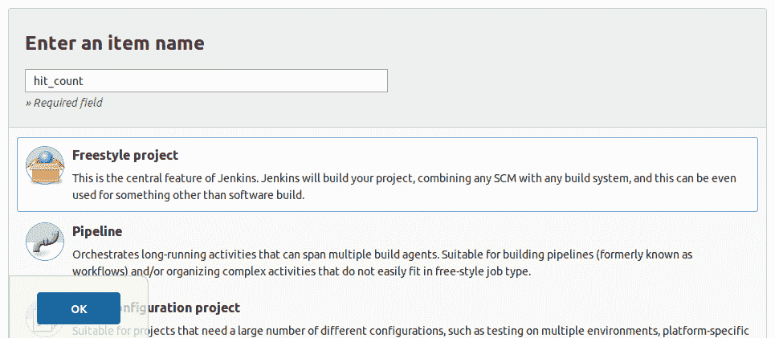

    图 8.12:选择自由式项目

    您将看到六个选项卡:`General`、`Source Code Management`、`Build Triggers`、`Build Environment`、`Build`和`Post-build Actions`，如图 8.13 所示。

3.  In the `General` tab, select the `Discard old builds` option so that the old builds do not eat up your disk space. Jenkins will do the housekeeping for you as well:

    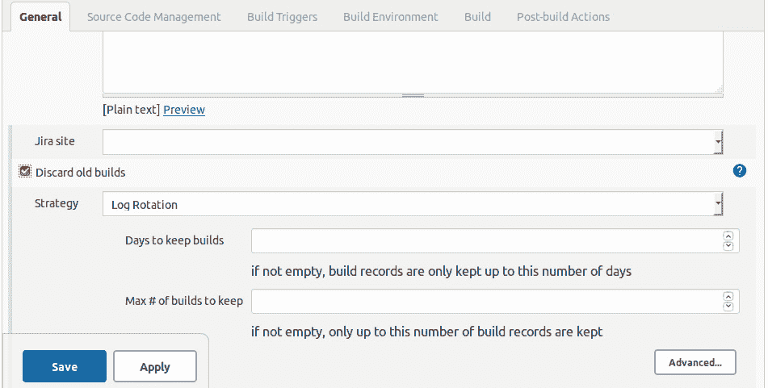

    图 8.13:选择放弃旧版本选项

4.  In the `Source Code Management` tab, select `Git`. In `Repository URL`, enter `https://github.com/<your GitHub username>/hit_counter`, as in *Figure 8.14*. If you do not have Git, check your plugins and download the Git plugin. We will talk about managing plugins in *Exercise 8.04*, *Integrating Jenkins and Docker Hub*:

    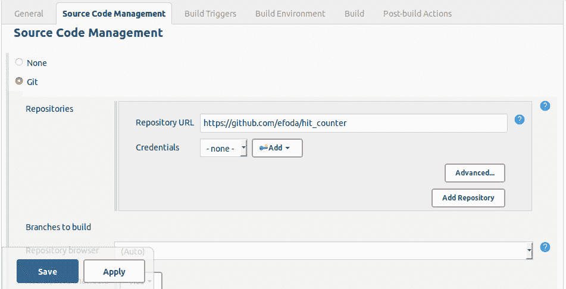

    图 8.14:输入 GitHub 存储库网址

5.  In the `Build Triggers` tab, select `Poll SCM`. This is where you specify how often you want Jenkins to perform the tests. If you enter `H/5` with four asterisks and spaces in between each asterisk, this means that you want Jenkins to perform the test every minute, as in *Figure 8.16*. If you enter it as `H * * * *`, this means the polling will be done every hour. If you do it as `H/15 * * * *`, the polling will be done every 15 minutes. Click your mouse outside the textbox. If you entered the code correctly, Jenkins will show the message stating when it will execute the next job. Otherwise, it will display an error in red.

    

    图 8.15:构建触发器

6.  Click the `Build` tab. Click `Add build step`. Select `Execute shell`, as in *Figure 8.17*:

    

    图 8.16:选择执行外壳

7.  A textbox will be displayed. Write the following command:

    ```
    docker build -t hit_counter .
    ```

    然后点击`Save`，如图*图 8.17* :

    

    图 8.17:在执行外壳命令框中输入 docker 构建命令

    应该会出现类似以下屏幕截图的屏幕:

    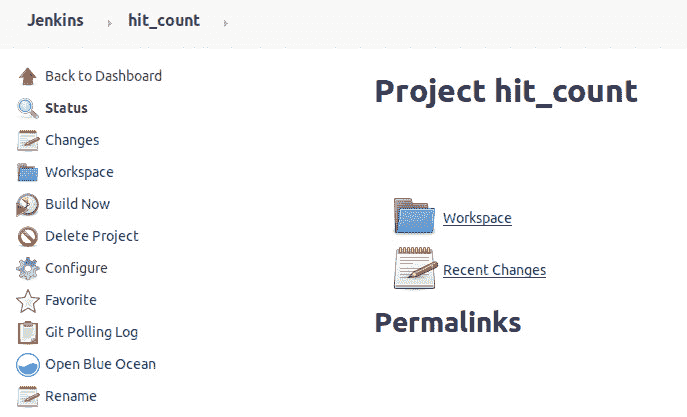

    图 8.18:成功创建命中计数项目

8.  Before doing anything further in Jenkins, check the images that you currently have in your host. In a terminal, run the `docker images` command to list the images:

    ```
    $docker images
    ```

    如果您在本章之前清洁了实验室，您将只有`jenkinsci/blueocean`映像:

    ```
    REPOSITORY           TAG     IMAGE ID      CREATED
           SIZE
    jenkinsci/blueocean  latest  e287a467e019  Less than a second ago
           562MB
    ```

9.  Go back to Jenkins. Click on `Build Now` from the menu on the left.

    注意

    如果在连接到 Docker 守护程序时出现“权限被拒绝”错误，请执行以下步骤:

    1.如果尚不存在，请向 docker 主机添加一个 Jenkins 用户:

    `$ sudo useradd jenkins`

    2.将詹金斯用户添加到 docker 组:

    `$ sudo usermod -aG docker jenkins`

    3.从`/etc/group`即`998`获取Docker组标识:

    `$ sudo cat /etc/group | grep docker`

    4.使用`docker exec`命令在运行的 Jenkins 容器中创建一个 bash shell:

    `$ docker container ls`

    `$ docker exec -it -u root <CONTAINER NAME | CONTAINER ID> /bin/bash`

    5.编辑詹金斯容器内的`/etc/group`文件:

    `# vi /etc/group`

    6.用从主机获得的标识替换 docker 组标识，并将 Jenkins 用户添加到 docker 组:

    `docker:x:998:jenkins`

    7.保存`/etc/group`文件并关闭编辑器:

    `:wq`

    8.詹金斯容器的出口:

    `# exit`

    9.停止詹金斯容器:

    `$ docker container ls`

    `$ docker container stop <CONTAINER NAME | CONTAINER ID>`

    注意

    10.重新启动詹金斯容器:

    `$ docker container ls`

    `$ docker container start <CONTAINER NAME | CONTAINER ID>`

    现在，作业将成功构建。

10.  Click on `Back to Dashboard`. The following screen will appear. In the bottom-left corner, you will see the `Build Queue` and `Build Executor Status` fields. You can see that one build has started with `#1` beside it, as in *Figure 8.19*:

    

    图 8.19:检查构建队列

    构建还没有成功或失败。构建完成后，其状态将显示在屏幕上。一段时间后，您会发现已经完成了两个构建。

11.  Click on the small arrow beside `#2` under the `Last Success` field. A drop-down menu will appear, as shown in the following figure. Select `Console Output` to check what Jenkins did automatically for us, as in *Figure 8.20*:

    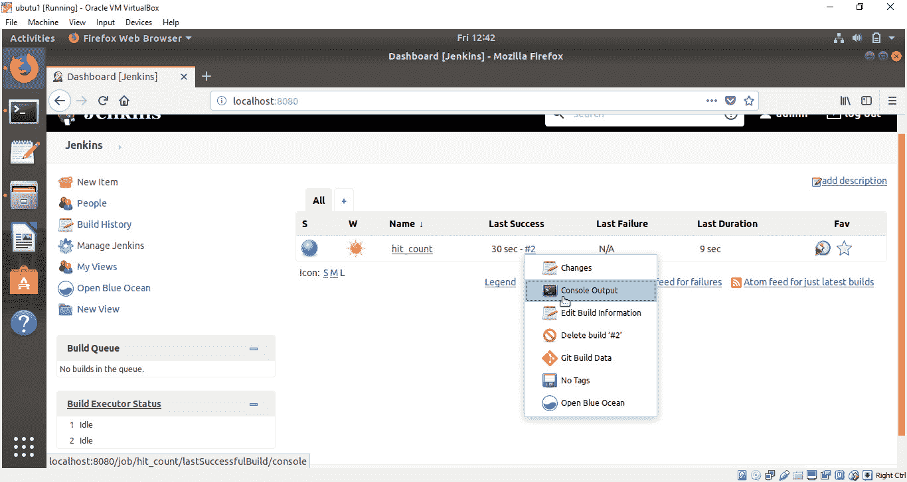

    图 8.20:选择控制台输出

    在`Console Output`中，您会发现 Jenkins 在项目配置期间执行了您在`Build`步骤中输入的`docker build` 命令:

    向下滚动至`Console Output`底部，查看执行结果。您将看到映像已成功构建。您还会发现映像标识和标签:

    

    图 8.21:验证映像构建成功

12.  Verify the image ID and tag from the terminal. Re-run the `docker images` command.

    ```
    $docker images
    ```

    你会发现`hit_counter`映像已经为你创建好了。您还会发现`python:3.7-alpine`映像，因为这是`Dockerfile`中的基础映像，詹金斯已经自动提取了它:

    ```
    REPOSITORY           TAG           IMAGE ID
      CREATED                      SIZE
    jenkinsci/blueocean  latest        e287a467e019
      Less than a second ago       562MB
    hit_counter          latest        bdaf6486f2ce
      3 minutes ago                227MB
    python               3.7-alpine    6a5ca85ed89b
      2 weeks ago                  72.5MB
    ```

    通过这一步，您可以确认 Jenkins 能够成功地从您的 GitHub 中提取文件。

13.  Now, you will make the desired changes in the GitHub code. But first, verify that you did not commit any changes to the code yet. Return to Jenkins, scroll up and click `Back to Project` in the left-hand menu at the top. Then click on `Recent Changes`, as in *Figure 8.22*:

    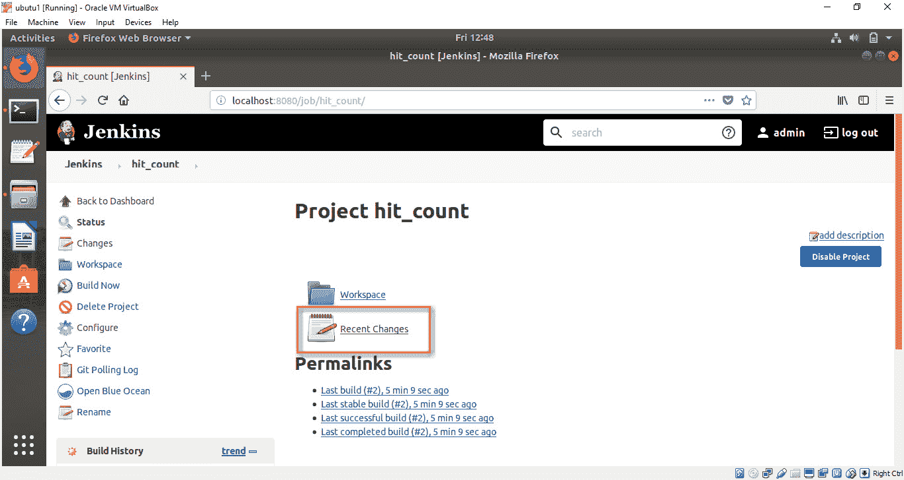

    图 8.22:选择最近的更改

    Jenkins 将显示任何版本都没有变化，如下图所示:

    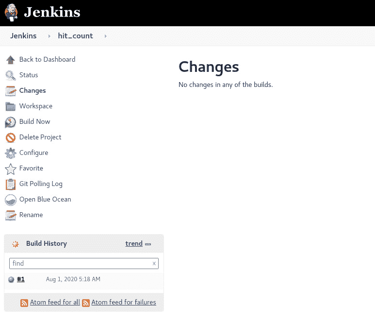

    图 8.23:验证代码中的更改

14.  Go to GitHub and edit the `Dockerfile` by changing the base image's tag from `3.7-alpine` to `alpine` only.

    您也可以通过使用任何文本编辑器编辑文件，在终端上执行与以前相同的操作。然后运行`git add`和`git push`命令:

    ```
    $ git add Dockerfile
    $ git commit -m "editing the Dockerfile"
    $ git push -u destination master
    ```

15.  向下滚动并向 GitHub 提交您的更改。
16.  回到詹金斯。移除`hit_counter`和`python:3.7-alpine`映像，确保詹金斯没有使用之前的本地映像:

    ```
    $ docker rmi hit_counter python:3.7-alpine
    ```

17.  Click `Build Now` again to start building the job instantly. Refresh the `Recent Changes` page. It will display a message stating that a change has occurred.

    如果您点击已经发生的更改，它会将您转发到 GitHub，向您显示旧代码和新代码之间的差异。

18.  Click back into the browser to return to Jenkins. Check `Console Output` again to see the base image that Jenkins has used:

    在底部，你会发现詹金斯成功地建立了形象。

19.  Go to the terminal and check the images again:

    ```
    $ docker images
    ```

    你会发现`hit_counter`和`python:alpine`都在名单上:

    ```
    REPOSITORY             TAG           IMAGE ID
      CREATED                      SIZE
    jenkinsci/blueocean    latest        e287a467e019
      Less than a second ago       562MB
    hit_counter            latest        6288f76c1f15
      3 minutes ago                234MB
    <none>                 <none>        786bdbef6ea2
      10 minutes ago               934MB
    python                 alpine        8ecf5a48c789
      2 weeks ago                  78.9MB
    ```

20.  通过移除除`jenkinsci/blueocean` :

    ```
    $ docker image rm hit_counter python:alpine 786
    ```

    之外的所有列出的映像，为下一个练习清洁您的实验室

在本练习中，您学习了如何将 Jenkins 与 GitHub 集成。詹金斯能够自动从 GitHub 中提取代码并构建映像。

在下一节中，您将学习如何在没有手动干预的情况下将此映像推送到注册表，以完成您的 CI/CD 管道。

# 整合詹金斯和多克枢纽

在本节中，与*图 8.31* 中一样，我们将重点关注 CI/CD 管道的最后一步，即将 Jenkins 与 Docker Hub 集成。正如我们之前提到的，有很多注册中心。我们将使用 Docker Hub，因为它免费且易于使用。在你的工作场所，你的公司可能会有一个私人的本地注册。您需要要求运营或信息技术管理员为您创建一个帐户，并授予您一些权限，以便您能够访问注册表并将您的映像推送到其中。


图 8.24:集成詹金斯和多克枢纽

在下面的练习中，您将学习如何将 Jenkins 与 Docker Hub 集成，以及如何推送 Jenkins 在上一个练习中构建的映像。

## 练习 8.04:整合詹金斯和多克枢纽

在本练习中，您将把 Jenkins 与 Docker Hub 集成，并将该映像推送到您的存储库中。首先，您将安装`Docker`、`docker-build-step`和`Cloudbees Docker Build and Publish`插件，以便詹金斯可以连接到 Docker Hub。然后，您将学习如何在 Jenkins 中输入您的 Docker Hub 凭据，以便 Jenkins 可以自动访问您的 Docker Hub 帐户并将您的映像推送到该帐户。最后，您将在 Docker Hub 中检查您的映像，以验证管道是否正确执行。在本练习结束时，您将通过检查您的 Docker Hub 帐户来验证映像是否已成功推送到存储库:

1.  Click on `Manage Jenkins` in the left-hand menu to install the plugins:

    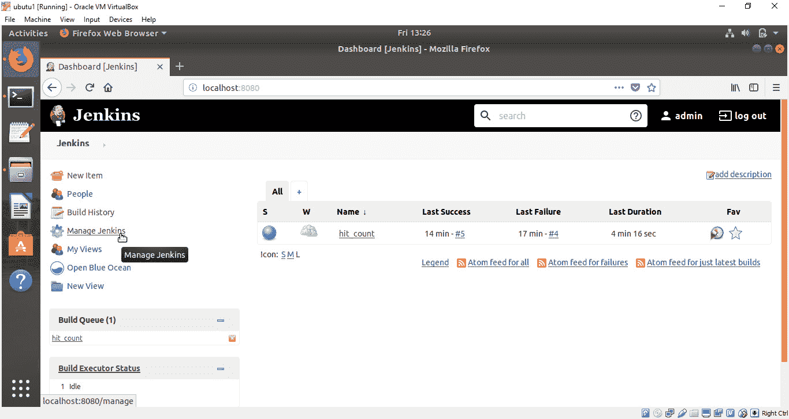

    图 8.25:点击管理詹金斯

2.  Click on `Plugin Manager`. Four tabs will appear. Click on the `Available` tab and select the `Docker`, `docker-build-step`, and `Cloudbees Docker Build and Publish` plugins:

    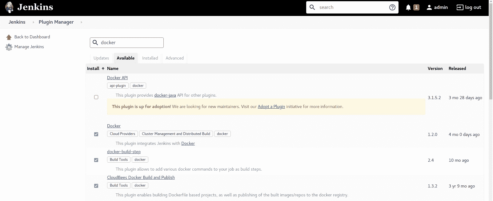

    图 8.26:安装 docker、Docker 构建步骤和 Cloudbees Docker 构建和发布插件

3.  点击`Install without restart`。安装后，检查`Restart Jenkins when installation is complete and no jobs are running`。
4.  Jenkins will take an extended period of time to restart, depending upon your disk space, memory, and internet connectivity speed. Wait until it is done, and the dashboard is shown. Click on the project's name, that is, `hit_count`:

    

    图 8.27:显示命中数项目的詹金斯仪表板

5.  Click `Configure` in the left-hand menu to modify the project configurations:

    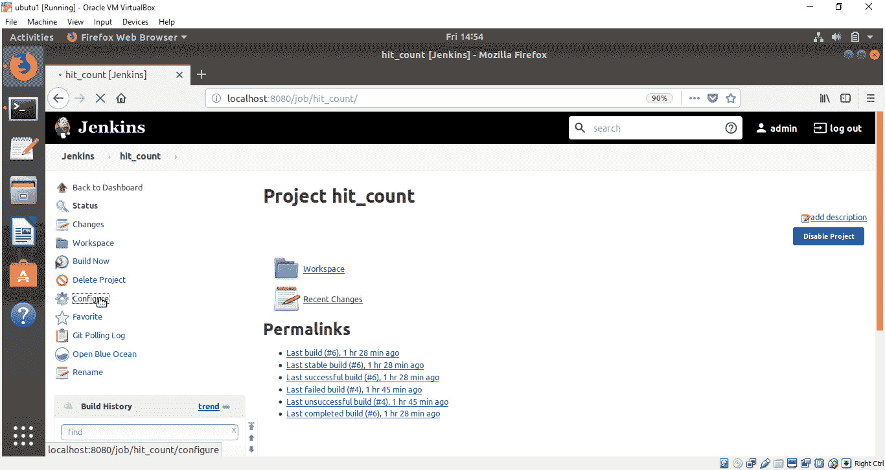

    图 8.28:左侧菜单中的配置选项

6.  Modify the details in the `Build` tab only. Click on it and select `Add build step`. A larger menu than the one you saw before will show up. If you see `Docker Build and Publish` in that menu, it verifies that your plugins were installed successfully. Click `Docker Build and Publish`:

    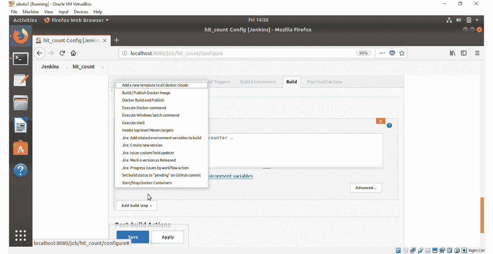

    图 8.29:从菜单中选择 Docker 构建和发布

7.  在`Registry Credentials`中，点击`Add`。然后从下拉菜单中选择`Jenkins`。
8.  A pop-up box will appear. Enter your Docker Hub username and password. Then, click `Add`:

    

    图 8.30:添加詹金斯凭据

9.  Now, in `Registry Credentials`, click the first drop-down menu and select the credentials that you entered in the previous step. Then, enter `<your Docker Hub username>/<image name>` in the `Repository Name` field. Remove the `Execute Shell` option that you entered in *Exercise 8.02*, *Uploading the Code to GitHub*, by clicking the Red `X` at the top right. Now, you will have only one build step, which is the `Docker Build and Publish` step. Click `Save` to save the new configuration:

    

    图 8.31:Docker 构建和发布步骤

10.  在左侧菜单中再次点击`Build Now`，在`Build History`选项中，跟随映像构建的进度。它将与您在上一步中在`Repository Name`中指定的名称相同。詹金斯会自动添加`docker build`步骤，因为你是从插件中选择的。如果映像成功通过构建，Jenkins 将使用您的 Docker 凭据并自动连接到 Docker Hub 或您在`Repository Name`中指定的任何注册表。最后，Jenkins 会将新映像自动推送到您的注册表中，在本练习中，它是您的 Docker Hub 注册表。
11.  As a further check, while the image is being built and before it is done, go to the terminal and list the images you have using the `docker images` command:

    ```
    $ docker images
    ```

    因为你在上一次练习结束时清理了实验室，你应该只找到`jenkinsci/blueocean`映像:

    ```
    REPOSITORY              TAG        IMAGE ID
      CREATED                       SIZE
    jenkinsci/blueocean     latest     e287a467e019
      Less than a second ago        562MB
    ```

    此外，检查您的 Docker Hub 帐户以验证是否构建了`hit_counter`映像。您将找不到`hit_counter`映像:

    

    图 8.32:检查你的Docker中心

12.  If the job is successfully built, you will find a blue ball beside the image name. If it is a red ball, this means that there was an error. Now, click on the arrow beside the image name and select `Console Output`:

    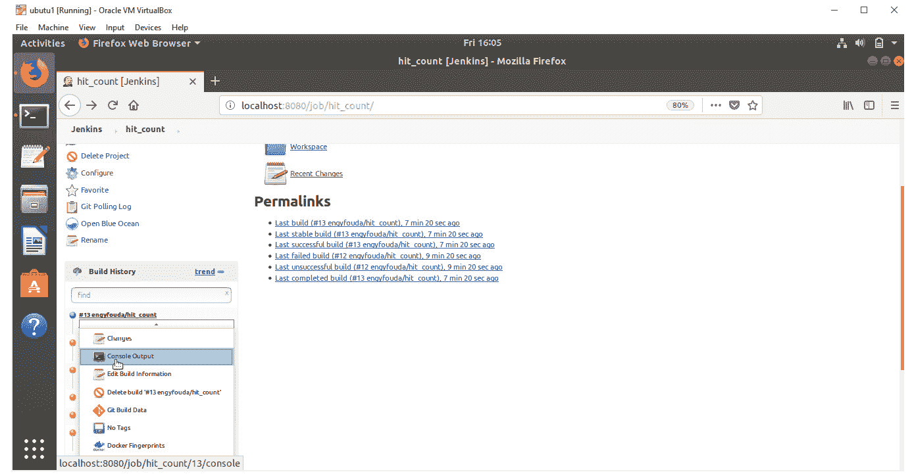

    图 8.33:选择控制台输出

    如下图所示，您会发现 Jenkins 成功地构建了映像，并将其推送到您的 Docker Hub:

    

    图 8.34:在控制台输出中，验证 Jenkins 已经构建并推送了映像

13.  Go back to the terminal and rerun the `docker images` command to list the images:

    ```
    $ docker images
    ```

    你会发现一个带有`<your Docker Hub Username>/hit_count`的映像:

    ```
    REPOSITORY             TAG             IMAGE ID
      CREATED                      SIZE
    jenkinsci/blueocean    latest          e287a467e019
      Less than a second ago       562MB
    engyfouda/hit_count    latest          65e2179392ca
      5 minutes ago                227MB
    <none>                 <none>          cf4adcf1ac88
      10 minutes ago               1.22MB
    python                 3.7alpine       6a5ca85ed89b
      2 weeks ago                  72.5MB
    ```

14.  In the browser, refresh the Docker Hub page. You will find your image at the top; Jenkins pushed it for you automatically:

    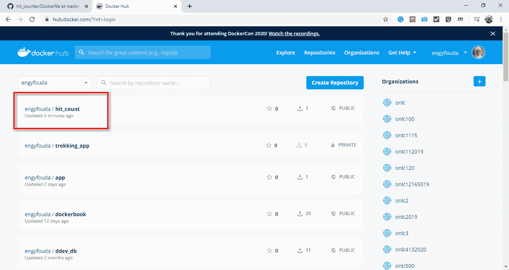

图 8.35:验证 Jenkins 已自动将映像推送到您的 Docker Hub

在本练习中，我们完成了 CI/CD 管道的最后一个阶段，并将 Jenkins 与 Docker Hub 集成在一起。詹金斯把它建立的形象推给了 Docker Hub。您还通过检查 Docker Hub 帐户验证了映像是否被正确推送。

在下一个活动中，我们将应用安装额外插件的相同方法来将 Jenkins 与 SonarQube 集成在一起。SonarQube 是另一个强大的工具，可以分析代码并生成关于其质量的报告，并检测大量编程语言中的 bug、代码气味和安全漏洞。

## 活动 8.01:利用詹金斯和索纳库

通常，在将代码提交给测试人员之前，会要求您评估代码的质量。您可以通过添加 SonarQube 插件生成关于调试错误、代码气味和安全漏洞的报告，从而利用 Jenkins 进行进一步的代码检查。

在本活动中，我们将利用詹金斯和索纳库插件作为我们的`hit_count` Python 示例。

**步骤**:

1.  在容器中安装并运行 SonarQube，就像您在*练习 8.01* 、*将 Jenkins 安装为容器*中所做的那样。使用默认端口`9000`。
2.  在詹金斯安装 SonarQube 插件。使用`admin/admin`登录 SonarQube，生成认证令牌。不要忘记复制令牌并将其保存在文本文件中。在此步骤后，您无法检索令牌。如果您丢失了令牌，请移除 SonarQube 容器，按照*步骤 1* 中的步骤，从 SonarQube 映像中重新制作它，然后再次重复这些步骤。
3.  重启詹金斯。
4.  在 Jenkins 中，将 SonarQube 的身份验证令牌作为机密文本添加到`Global Credentials`域。
5.  通过调整`Global System Configuration`和`Configure System`选项，将詹金斯和索纳库整合在一起。
6.  通过启用`Prepare SonarQube scanner`环境修改`Build Environment`选项卡中的字段。
7.  修改`Build`步骤，增加`Analysis Properties`。
8.  在浏览器中，转到 SonarQube 窗口，并检查其报告。

输出应该如下所示:


图 8.36:预期的声纳管输出

注意

此活动的解决方案可以通过[这个链接](16.html#_idTextAnchor339)找到。

在下一个活动中，您将把 Jenkins 和 SonarQube 与我们的全景徒步应用集成在一起。

## 活动 8.02:在全景徒步应用中利用詹金斯和索纳库

全景徒步应用也有前端和后端，就像`hit_counter`应用一样。在本活动中，您将在詹金斯创建一个新项目，该项目链接到 GitHub 上的全景徒步应用。然后，您将运行 SonarQube 来获得关于其 bug 和安全漏洞的详细报告，如果徒步旅行应用有任何漏洞的话。

按照以下步骤完成活动:

1.  在詹金斯中创建一个名为`trekking`的新项目。
2.  选择它作为`FREESTYLE`项目。
3.  在`General`选项卡中，选择`Discard Old Builds`。
4.  在`Source Code Management`中，选择`GIT`。然后输入网址`http://github.com/efoda/trekking_app`。
5.  在`Build Triggers`中，选择`Poll SCM`，设置为每 15 分钟分析测试一次。
6.  在`Build`选项卡中，输入`Analysis properties`代码。
7.  保存并点击`Build Now`。
8.  在浏览器的`SonarQube`选项卡中查看报告。

SonarQube 的输出应该如下所示:


图 8.37:活动 8.02 的预期产出

注意

此活动的解决方案可以通过[这个链接](16.html#_idTextAnchor340)找到。

# 总结

本章提供了使用 CI/CD 管道集成代码的实践经验。CI 帮助开发人员将代码集成到一个共享且易于访问的存储库中。光盘帮助开发人员将存储在存储库中的代码交付给产品。CI/CD 方法还有助于保持产品与最新技术同步，并为客户提供最新版本，从而快速获得新功能和错误修复。

一旦本章定义的 CI/CD 管道的三个阶段成功完成，您将只需要专注于在 GitHub 上编辑您的代码。詹金斯将成为你的自动化助手，它将自动为你处理剩余的阶段，并使映像可用于生产。

在下一章中，您将了解 Docker 集群模式以及如何执行服务发现、集群、扩展和滚动更新。