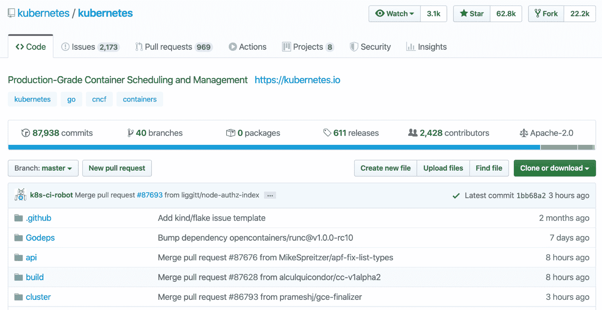
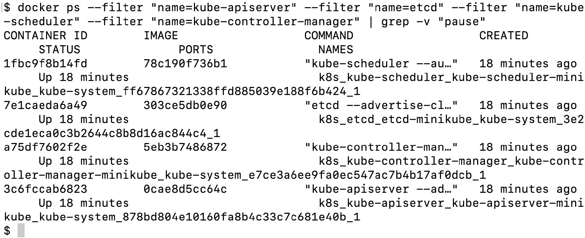
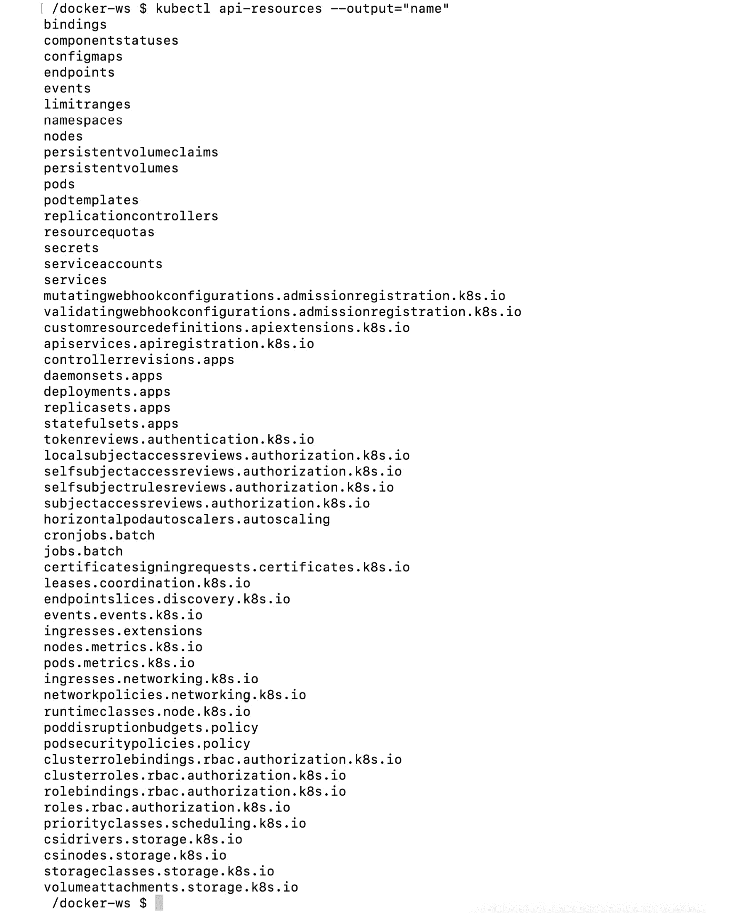
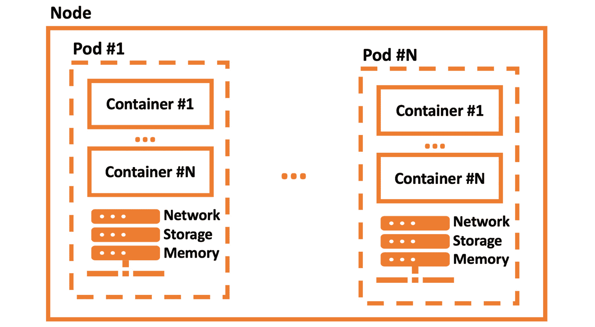
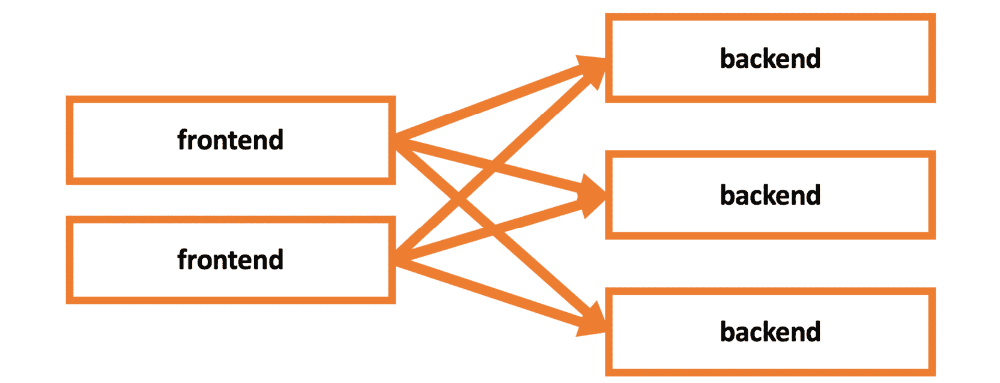
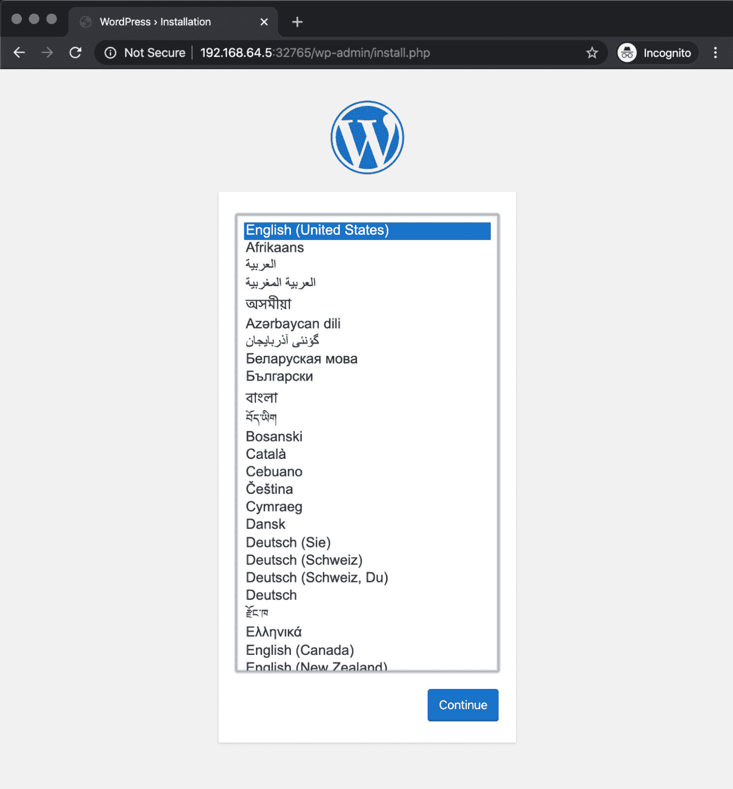
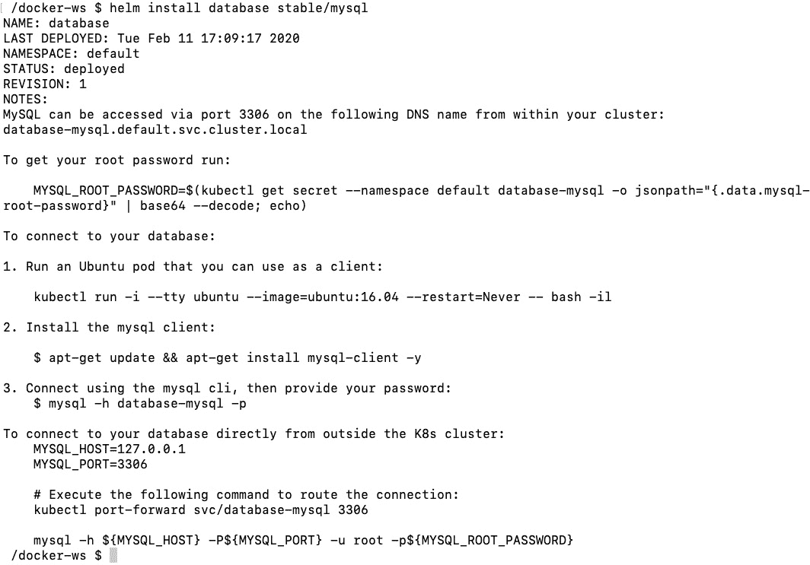
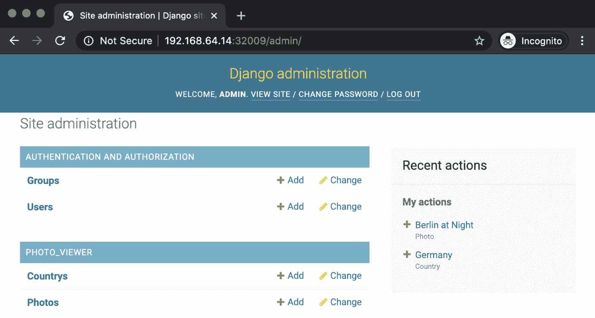

# 十、Kubernetes

概观

在本章中，我们将了解市场上最流行的容器管理系统 Kubernetes。从基础知识、体系结构和资源开始，您将创建 Kubernetes 集群并在其中部署实际应用。

到本章结束时，您将能够确定 Kubernetes 设计的基础及其与 Docker 的关系。您将创建和配置一个本地 Kubernetes 集群，使用客户端工具使用 Kubernetes API，并使用基本的 Kubernetes 资源来运行容器化的应用。

# 简介

在前几章中，您使用 **Docker Compose** 和 **Docker Swarm** 运行了多个 Docker 容器。运行在各种容器中的微服务帮助开发人员创建可扩展和可靠的应用。

但是，当多个应用分布在数据中心的多个服务器上，甚至分布在世界各地的多个数据中心时，管理这些应用就变得更加复杂。有许多与分布式应用的复杂性相关的开放式问题，包括但不限于网络、存储和容器管理。

例如，应该配置运行在相同节点以及不同节点上的容器的网络。类似地，包含应用的容器的体积(可以放大或缩小)应该用中央控制器来管理。幸运的是，分布式容器的管理有一个广为接受和采用的解决方案:Kubernetes。

**Kubernetes** 是一个开源的容器编排系统，用于运行可扩展、可靠和健壮的容器化应用。从 T2 树莓皮到数据中心，可以在各种平台上运行 Kubernetes。Kubernetes 使运行带有装载卷、插入机密和配置网络接口的容器成为可能。此外，它还关注容器的生命周期，以提供高可用性和可伸缩性。凭借其包容性的方法，Kubernetes 是目前市场上领先的容器管理系统。

Kubernetes 在希腊语中翻译为**船长**。用Docker对船只和容器的比喻，Kubernetes把自己定位为航海大师。Kubernetes 的想法源于管理谷歌服务(如 Gmail 或谷歌驱动)的容器已有十多年。从 2014 年至今，Kubernetes 一直是开源项目，由**云原生计算基金会** ( **CNCF** )管理。

Kubernetes 的主要优势之一来自它的社区和维护者。它是 GitHub 上最活跃的存储库之一，有来自 2400 多个贡献者的近 88000 个提交。此外，存储库拥有超过 62，000 颗星，这意味着超过 62，000 人对存储库有信心:



图 10.1:永久 GitHub 资料档案库

在本章中，您将探索 Kubernetes 的设计和架构，然后是它的 API 和访问，并使用 Kubernetes 资源来创建容器化的应用。由于 Kubernetes 是领先的容器编排工具，获得它的实际操作经验将帮助您进入容器化应用的世界。

# 立方结构设计

Kubernetes 关注容器的生命周期，包括配置、调度、运行状况检查和扩展。使用 Kubernetes，可以安装各种类型的应用，包括数据库、内容管理系统、队列管理器、负载平衡器和 web 服务器。

例如，假设你在一家名为 **InstantPizza** 的新在线食品配送连锁店工作。您可以在 Kubernetes 中部署移动应用的后端，并根据客户需求和使用情况进行扩展。同样，您可以实现一个消息队列来在餐馆和顾客之间进行通信，同样在 Kubernetes 中。为了存储过去的订单和收据，您可以在 Kubernetes 中部署一个带有存储的数据库。此外，您可以使用负载平衡器为您的应用实现**蓝/绿**或**甲乙部署**。

在本节中，讨论了 Kubernetes 的设计和架构，以说明它是如何实现可扩展性和可靠性的。

注意

蓝/绿部署侧重于安装同一应用的两个相同版本(分别称为蓝和绿)，并立即从蓝转绿，以减少停机时间和风险。

A/B 部署侧重于安装应用的两个版本(即 A 和 B)，用户流量在两个版本之间分配，用于测试和实验。

Kubernetes 的设计专注于在一台或多台服务器上运行，即集群。另一方面，Kubernetes 由许多组件组成，这些组件应该分布在单个集群中，以便拥有可靠且可扩展的应用。

有两组 Kubernetes 组件，即**控制平面**和**节点**。尽管构成 Kubernetes 景观的元素有不同的命名约定，例如主组件而不是控制平面，但是分组的主要思想一点也没有改变。控制平面组件负责运行 Kubernetes API，包括数据库、控制器和调度器。Kubernetes 控制平面有四个主要组件:

*   `kube-apiserver`:这是连接集群中所有组件的中央 API 服务器。
*   `etcd`:这是 Kubernetes 资源的数据库，`kube-apiserver`存储`etcd`上集群的状态。
*   `kube-scheduler`:这是为节点分配容器化应用的调度程序。
*   `kube-controller-manager`:这是创建和管理集群中 Kubernetes 资源的控制器。

在具有角色节点的服务器中，有两个 Kubernetes 组件:

*   `kubelet`:这是 Kubernetes 客户端，它驻留在节点上，在 Kubernetes API 和容器运行时之间创建一个桥梁，比如 Docker。
*   `kube-proxy`:这是一个网络代理，运行在每个节点上，允许跨集群的工作负载进行网络通信。

下图说明了控制平面和节点组件及其相互作用:


图 10.2:无缝体系结构

Kubernetes 旨在可扩展的云系统上运行。但是，有许多工具可以在本地运行 Kubernetes 集群。`minikube`是官方支持的 CLI 工具，用于创建和管理本地 Kubernetes 集群。它的命令侧重于生命周期事件和集群故障排除，如下所示:

*   `minikube start`:启动本地 Kubernetes 集群
*   `minikube stop`:停止正在运行的本地 Kubernetes 集群
*   `minikube delete`:删除本地 Kubernetes 集群
*   `minikube service`:获取本地集群中指定服务的网址
*   `minikube ssh`:在使用 SSH 的机器上登录或运行命令

在下面的练习中，您将创建一个本地 Kubernetes 集群来检查本章中讨论的组件。要创建本地集群，您将使用`minikube`作为官方的本地 Kubernetes 解决方案，并运行其命令来探索 Kubernetes 组件。

注意

`minikube`在虚拟机管理程序上运行集群，需要根据自己的操作系统安装 KVM、VirtualBox、VMware Fusion、Hyperkit 或 Hyper-V 等虚拟机管理程序。您可以在[https://kubernetes . io/docs/tasks/tools/install-minikube/# install-a-hypervisor](https://kubernetes.io/docs/tasks/tools/install-minikube/#install-a-hypervisor)查看官方文档了解更多信息。

注意

请使用`touch`命令创建文件，使用`vim`命令使用 vim 编辑器处理文件。

## 练习 10.01:启动本地Kubernetes集群

Kubernetes 最初被设计为在具有多台服务器的集群上运行。这是在云中运行可扩展应用的容器编排器的预期特征。但是，很多时候需要在本地运行 Kubernetes 集群，例如为了开发或测试。在本练习中，您将安装一个本地 Kubernetes 提供程序，然后创建一个 Kubernetes 集群。在集群中，您将检查本节中讨论的组件。

要完成本练习，请执行以下步骤:

1.  Download the latest version of the `minikube` executable for your operating system and set the binary as executable for your local system by running the following command in your terminal:

    ```
    # Linux
    curl -Lo minikube https://storage.googleapis.com/minikube/releases/latest/minikube-linux-amd64
    # MacOS
    curl -Lo minikube https://storage.googleapis.com/minikube/releases/latest/minikube-darwin-amd64 
    chmod +x minikube 
    sudo mv minikube /usr/local/bin
    ```

    这些前面的命令为 Linux 或 Mac 下载二进制文件，并准备在终端中使用:

    

    图 10.3:minikube 的安装

2.  Start a Kubernetes cluster with the following command in your terminal:

    ```
    minikube start
    ```

    前面的单个命令执行多个步骤来成功创建集群。您可以按如下方式检查每个阶段及其输出:

    

    图 10.4:启动一个新的 Kubernetes 集群

    输出从打印出版本和环境开始。然后，拉取并启动 Kubernetes 组件的映像。最后，几分钟后，您有一个本地运行的 Kubernetes 集群。

3.  Connect to the cluster node started by `minikube` with the following command:

    ```
    minikube ssh
    ```

    使用`ssh`命令，您可以继续在集群中运行的节点上工作:

    

    图 10.5:集群节点

4.  Check for each control plane component with the following commands:

    ```
    docker ps --filter „name=kube-apiserver" --filter „name=etcd" --filter „name=kube-scheduler" --filter „name=kube-controller-manager" | grep -v „pause"
    ```

    该命令检查具有控制平面组件名称的 Docker 容器和过滤器。以下输出不包含 pause 容器，该容器负责 Kubernetes 中容器组的网络设置，以便于分析:

    

    图 10.6:控制平面组件

    输出显示四个控制平面组件正在`minikube`节点的 Docker 容器中运行。

5.  Check for the first node component, `kube-proxy`, with the following command:

    ```
    docker ps --filter "name=kube-proxy"  | grep -v "pause"
    ```

    类似于*第 4 步*，这个命令列出了一个`kube-proxy`组件，它运行在一个 Docker 容器中:

    

    图 10.7:minikube 中的 kube 代理

    可以看到在 Docker 容器中运行的`kube-proxy`组件已经启动了 21 分钟。

6.  Check for the second node component, `kubelet`, with the following command:

    ```
    pgrep -l kubelet
    ```

    该命令列出其标识在`minikube`中运行的进程:

    ```
    2554 kubelet
    ```

    由于`kubelet`在容器运行时和 API 服务器之间通信，所以它被配置为直接在机器上运行，而不是在 Docker 容器内运行。

7.  Disconnect from the `minikube` node connected in *Step 3* with the following command:

    ```
    exit
    ```

    您应该已经返回到您的终端，并获得类似如下的输出:

    ```
    logout
    ```

在本练习中，您已经安装了一个 Kubernetes 集群并检查了架构组件。在下一节中，将介绍 Kubernetes API 和访问方法来连接和使用在这一节中创建的集群。

# Kubernetes斯原料药和接入

**Kubernetes API** 是 Kubernetes 系统的基本构件。它是集群中所有组件之间通信的场所。外部通信，如用户命令，也作为 REST API 调用针对 Kubernetes API 执行。Kubernetes API 是一个基于资源的 HTTP 接口。换句话说，应用编程接口服务器面向与资源一起工作来创建和管理 Kubernetes 资源。在本节中，您将连接到应用编程接口，在下一节中，您将开始使用 Kubernetes 资源，包括但不限于 Pods、部署、状态集和服务。

Kubernetes 有一个用于客户端访问的官方命令行工具，名为`kubectl`。如果你想访问一个 Kubernetes 集群，你需要安装`kubectl`工具并配置它连接到你的集群。然后，您可以安全地使用该工具来管理运行集群的应用的生命周期。`kubectl`能够执行基本的创建、读取、更新和删除操作，以及故障排除和日志检索。

例如，您可以使用`kubectl`安装一个容器化的应用，将其扩展到更多副本，检查日志，如果您不再需要它，最后将其删除。此外，`kubectl`有集群管理命令来检查集群和服务器的状态。因此，`kubectl`是访问 Kubernetes 集群和管理应用的重要命令行工具。

`kubectl`是用其丰富的命令集控制 Kubernetes 集群的关键。基本的基本命令和与部署相关的命令如下所示:

*   `kubectl create`:该命令从带有`-f`标志或标准终端输入的文件名创建资源。第一次创建资源时很有帮助。
*   `kubectl apply`:这个命令创建或更新配置到一个 Kubernetes 资源，类似于`create`命令。如果您在首次创建后更改资源配置，这是一个必不可少的命令。
*   `kubectl get`:该命令显示集群中的一个或多个资源及其名称、标签和其他信息。
*   `kubectl edit`:该命令使用`vi`等编辑器直接在终端编辑 Kubernetes 资源。
*   `kubectl delete`:此命令删除 Kubernetes 资源，并传递文件名、资源名和标签标志。
*   `kubectl scale`:这个命令改变了 Kubernetes 集群的资源数量。

同样，所需的集群管理和配置命令如下所示:

*   `kubectl cluster-info`:该命令显示集群及其应用编程接口和域名系统服务的摘要。
*   `kubectl api-resources`:该命令列出了服务器上支持的 API 资源。如果您使用支持不同 API 资源集的不同 Kubernetes 安装，这将特别有帮助。
*   `kubectl version`:该命令打印客户端和服务器版本信息。如果您正在使用具有不同版本的多个 Kubernetes 集群，这是一个捕获版本不匹配的有用命令。
*   `kubectl config`:该命令配置`kubectl`将不同的集群相互连接。`kubectl`是一个 CLI 工具，旨在通过更改其配置来与多个集群配合使用。

在下面的练习中，您将安装并配置`kubectl`以连接到本地 Kubernetes 集群，并借助其丰富的命令集开始探索 Kubernetes API。

## 练习 10.02:使用 kubectl 访问 Kubernetes 集群

Kubernetes 集群安装在云系统中，可以从不同的位置访问。为了安全可靠地访问集群，您需要一个可靠的客户端工具，这是 Kubernetes 的官方客户端工具，即`kubectl`。在本练习中，您将安装、配置和使用`kubectl`来探索其功能以及Kubernetes斯应用编程接口。

要完成本练习，请执行以下步骤:

1.  Download the latest version of the `kubectl` executable for your operating system and set this as the executable for your local system by running the following command in your terminal:

    ```
    # Linux
    curl -LO https://storage.googleapis.com/kubernetes-release/release/'curl -s https://storage.googleapis.com/kubernetes-release/release/stable.txt'/bin/linux/amd64/kubectl
    # MacOS
    curl -LO "https://storage.googleapis.com/kubernetes-release/release/$(curl -s https://storage.googleapis.com/kubernetes-release/release/stable.txt)/bin/darwin/amd64/kubectl"
    chmod +x kubectl 
    sudo mv kubectl /usr/local/bin
    ```

    这些前面的命令为 Linux 或 Mac 下载二进制文件，并准备在终端中使用:

    

    图 10.8:minikube 的安装

2.  In your terminal, run the following command to configure `kubectl` to connect to the `minikube` cluster and use it for further access:

    ```
    kubectl config use-context minikube
    ```

    `use-context`命令将`kubectl`上下文配置为使用`minikube`集群。对于以下步骤，所有命令都将与`minikube`内运行的 Kubernetes 集群进行通信:

    ```
    Switched to context "minikube".
    ```

3.  Check for the cluster and client version with the following command:

    ```
    kubectl version --short
    ```

    此命令返回人类可读的客户端和服务器版本信息:

    ```
    Client Version: v1.17.2
    Server Version: v1.17.0
    ```

4.  Check for further information about the cluster with the following command:

    ```
    kubectl cluster-info
    ```

    此命令显示 Kubernetes 组件的摘要，包括主组件和 DNS:

    ```
    Kubernetes master is running at https://192.168.64.5:8443
    KubeDNS is running at https://192.168.64.5:8445/api/v1/
    namespaces/kube-system/Services/kube-dns:dns/proxy
    To further debug and diagnose cluster problems, use 
    'kubectl cluster-info dump'.
    ```

5.  Get a list of the nodes in the cluster with the following command:

    ```
    kubectl get nodes
    ```

    由于集群是一个`minikube`本地集群，因此只有一个名为`minikube`的节点，其角色为`master`:

    ```
    NAME        STATUS        ROLES        AGE        VERSION
    Minikube    Ready         master       41h        v1.17.0
    ```

6.  List the supported resources in the Kubernetes API with the following command:

    ```
    kubectl api-resources --output="name"
    ```

    该命令列出了Kubernetes斯应用编程接口服务器支持的`api-resources`的`name`字段。长长的列表显示了 Kubernetes 如何创建不同的抽象来运行容器化的应用:

    

图 10.9: Kubernetes 资源列表

输出列出了我们连接的 Kubernetes 集群中可用的 API 资源。如您所见，您可以使用数十种资源，每种资源都有助于您创建云原生、可扩展和可靠的应用。

在本练习中，您已经连接到 Kubernetes 集群并检查了客户端工具的功能。`kubectl`是访问和管理在 Kubernetes 中运行的应用的最关键的工具。在本练习结束时，您将学会如何安装、配置和连接到 Kubernetes 集群。此外，您将检查它的版本、它的节点的状态以及可用的 API 资源。对于与 Kubernetes 交互的开发者来说，有效地使用`kubectl`是日常生活中必不可少的任务。

在下一节中，将介绍主要的 Kubernetes 资源(在前面练习的最后一步中可以看到)。

# 不灭资源

Kubernetes 提供了一组丰富的容器抽象来定义云原生应用。所有这些抽象都被设计为 Kubernetes API 中的资源，并由控制平面管理。换句话说，应用被定义为控制平面中的一组资源。同时，节点组件试图达到资源中指定的状态。如果将一个 Kubernetes 资源分配给一个节点，节点组件将专注于附加所需的卷和网络接口，以保持应用正常运行。

让我们假设您将在 Kubernetes 上部署 InstantPizza 预订系统的后端。后端由一个数据库和一个用于处理 REST 操作的网络服务器组成。您需要在 Kubernetes 中定义一些资源:

*   数据库的**状态集**资源
*   一个**服务**资源，用于从其他组件(如网络服务器)连接到数据库
*   一个**部署**资源，以可扩展的方式部署网络服务器
*   一个**服务**资源，用于启用到网络服务器的外部连接

当这些资源通过`kubectl`在控制平面中定义时，节点组件将在集群中创建所需的容器、网络和存储。

在 Kubernetes API 中，每个资源都有独特的特性和模式。在本节中，您将了解基本的 Kubernetes 资源，包括 **Pods** 、**部署**、**状态集**和**服务**。此外，您还将了解到更复杂的 Kubernetes 资源，如 Kubernetes 中的**Ingres**、**水平荚自动缩放**、 **RBAC** 、**授权**。

## 豆荚

Pod 是 Kubernetes 中容器化应用的基本构件。它由一个或多个可以共享网络、存储和内存的容器组成。Kubernetes 将 Pod 中的所有容器调度到同一个节点。此外，Pod 中的容器会一起放大或缩小。容器、Pods 和节点之间的关系可以概括如下:



图 10.10:容器、荚和节点

从上图可以看出，一个 Pod 可以包含多个容器。所有这些容器共享一个公共的网络、存储和内存资源。

Pod 的定义很简单，有四个主要部分:

```
apiVersion: v1
kind: Pod
metadata:
  name: server
spec:
  containers:
  - name: main
    image: nginx
```

所有 Kubernetes 资源都需要这四个部分:

*   `apiVersion`定义对象的这个资源的版本化模式。
*   `kind`代表 REST 资源名称。
*   `metadata`保存资源的信息，如名称、标签和注释。
*   `spec`是保存资源特定信息的资源特定部分。

当前面的服务器 Pod 在 Kubernetes API 中创建时，API 将首先根据`apiVersion=v1`和`kind=Pod`模式检查定义是否正确。然后，调度程序会将 Pod 分配给一个节点。接下来，节点中的`kubelet`将为`main`容器创建`nginx`容器。

Pods 是 Kubernetes 对容器的第一次抽象，它们是更复杂资源的构建块。在下一节中，我们将使用部署和状态集等资源来封装 Pods，以创建更复杂的应用。

## 部署

部署是一个 Kubernetes 资源，它关注可伸缩性和高可用性。部署封装了 Pods，以扩展、缩减和推出新版本。换句话说，您可以将一个三副本 web 服务器 Pod 定义为一个部署。控制平面中的部署控制器将保证副本的数量。此外，当您将部署更新到较新版本时，控制器将逐渐更新应用实例。

部署和 Pods 的定义相似，尽管标签和副本被添加到部署模式中:

```
apiVersion: apps/v1
kind: Deployment
metadata:
  name: server
spec:
  replicas: 10
  selector:
    matchLabels:
      app: server
  template:
    metadata:
      labels:
        app: server
    spec:
      containers:
      - name: main
        image: nginx
        ports:
        - containerPort: 80 
```

部署`server`有 10 个带有标签`app:server`的 Pod 规范副本。此外，为服务器实例的每个主容器发布容器的端口`80`。部署控制器将创建或删除实例，以匹配已定义 Pod 的 10 个副本。换句话说，如果具有两个服务器部署运行实例的节点离线，控制器将在其余节点上创建两个额外的 Pods。Kubernetes 的这种自动化使我们能够开箱即用地创建可扩展的高可用性应用。

在下一节中，将介绍用于有状态应用的 Kubernetes 资源，例如数据库和消息队列。

## 状态集

Kubernetes 支持运行有状态应用，这些应用使用**statefleset**资源将其状态存储在磁盘卷上。StatefulSets 使在 Kubernetes 中运行数据库应用或数据分析工具成为可能，具有与临时应用相同的可靠性和高可用性。

状态集合的定义类似于**部署**的定义，其中**卷挂载**和**声明增加**:

```
apiVersion: apps/v1
kind: StatefulSet
metadata:
  name: database
spec:
  selector:
    matchLabels:
      app: mysql
  serviceName: mysql
  replicas: 1
  template:
    metadata:
      labels:
        app: mysql
    spec:
      containers:
      - name: mysql
        image: mysql:5.7
        env:
        - name: MYSQL_ROOT_PASSWORD
          value: "root"
        ports:
        - name: mysql
          containerPort: 3306
        volumeMounts:
        - name: data
          mountPath: /var/lib/mysql
        subPath: mysql
  volumeClaimTemplates:
  - metadata:
      name: data
    spec:
      accessModes: ["ReadWriteOnce"]
      resources:
        requests:
          storage: 2Gi
```

数据库资源定义了一个磁盘卷为 2 GB 的数据库。当在 Kubernetes API 中创建服务器`StatefulSet`资源时，`cloud-controller-manager`将创建一个卷，并使其在计划节点上准备就绪。创建卷时，它使用`volumeClaimTemplates`下的规范。然后，节点将根据`spec`中的`volumeMounts`部分将卷装入容器中。

在这个资源定义中，还有一个为`MYSQL_ROOT_PASSWORD`设置环境变量的例子。状态集是 Kubernetes 中至关重要的资源，因为它们支持在具有短暂工作负载的同一个集群中运行有状态应用。

在下面的资源中，将介绍用于 Pods 之间连接的 Kubernetes 解决方案。

## 服务

Kubernetes 集群托管多个运行在不同节点上的应用，大多数情况下，这些应用需要相互通信。假设您有一个后端的三实例部署和一个前端应用的两实例部署。五个吊舱运行，分布在集群中，它们的 IP 地址。由于前端实例需要连接后端，因此前端实例需要知道后端实例的 IP 地址，如图*图 10.11* :



图 10.11:前端和后端实例

但是，这不是一个可持续的方法，会扩大或缩小规模，并且集群中可能会出现许多潜在故障。Kubernetes 建议**服务**资源定义一组带有标签的 Pods，并使用服务的名称访问它们。例如，前端应用只需使用`backend-service`的地址就可以连接到后端实例，如图 10.12 所示:


图 10.12:通过后端服务连接的前端和后端实例

服务资源的定义相当简单，如下所示:

```
apiVersion: v1
kind: Service
metadata:
  name: my-db
spec:
  selector:
    app: mysql
  ports:
    - protocol: TCP
      port: 3306
      targetPort: 3306
```

创建`my-db`服务后，集群中的所有其他 Pods 将能够通过地址`my-db`连接到端口`3306`上标签为`app:mysql`的 Pods。在下面的资源中，将展示通过使用 Kubernetes 入口资源对集群中的服务的外部访问。

## 进入

Kubernetes 集群旨在为集群内外的应用提供服务。入口资源被定义为通过外部网址和负载平衡等附加功能向外部世界公开服务。尽管入口资源是本地 Kubernetes 对象，但它们需要一个入口控制器在集群中启动和运行。换句话说，入口控制器不是`kube-controller-manager`的一部分，您需要在集群中安装一个。市场上有多种实现。不过，Kubernetes 目前正式支持和维护`GCE`和`nginx`控制器。

注意

附加入口控制器的列表可在以下链接的官方文档中获得:[https://kubernetes . io/docs/concepts/Services-networking/Ingress-controller](https://kubernetes.io/docs/concepts/Services-networking/Ingress-controllers)。

主机网址为`my-db.docker-workshop.io`的入口资源连接到`my-db`服务上的端口`3306`，如下所示:

```
apiVersion: networking.k8s.io/v1beta1
kind: Ingress
metadata:
  name: my-db
spec:
  rules:
  - host: my-db.docker-workshop.io
    http:
      paths:
      - path: /
        backend:
          serviceName: my-db
          servicePort: 3306
```

入口资源对于向外部世界开放服务至关重要。然而，它们的配置可能比看起来更复杂。入口资源可能需要基于集群中运行的入口控制器的单独注释。

在下面的资源中，将介绍在水平吊舱自动缩放器的帮助下吊舱的自动缩放。

## 水平吊舱自动缩放

Kubernetes 集群提供了一个可扩展且可靠的容器化应用环境。然而，手动跟踪应用的使用情况并在需要时扩大或缩小规模既麻烦又不可行。因此，Kubernetes 提供了水平 Pod 自动缩放器，可以根据 CPU 利用率自动缩放 Pod 的数量。

水平吊舱自动缩放器是一种 Kubernetes 资源，具有用于缩放和目标度量的目标资源:

```
apiVersion: Autoscaling/v1
kind: HorizontalPodAutoscaler
metadata:
  name: server-scaler
spec:
  scaleTargetRef:
    apiVersion: apps/v1
    kind: Deployment
    name: server
  minReplicas: 1
  maxReplicas: 10
  targetCPUUtilizationPercentage: 50
```

当`server-scaler`资源被创建时，Kubernetes 控制平面将通过放大或缩小名为`server`的部署来尝试实现`50%`的目标 CPU 利用率。此外，副本的最小和最大数量设置为`1`和`10`。这确保了部署在不使用时不会扩展到`0`，也不会扩展得太高而消耗集群中的所有资源。水平 Pod 自动缩放器资源是 Kubernetes 的重要组成部分，用于创建自动管理的可扩展和可靠的应用。

在下一节中，您将了解 Kubernetes 中的授权。

## RBAC 授权

Kubernetes 集群旨在安全地连接和更改资源。但是，当应用在生产环境中运行时，限制用户的操作范围至关重要。

让我们假设您已经授予项目组中的每个人广泛的权力。在这种情况下，无法保护集群中运行的应用不被删除或配置错误。Kubernetes 提供了**基于角色的访问控制** ( **RBAC** )来根据用户被赋予的角色管理用户的访问和能力。换句话说，Kubernetes 可以限制用户在特定 Kubernetes 资源上执行特定任务的能力。

让我们从`Role`资源开始定义功能:

```
kind: Role
apiVersion: rbac.authorization.k8s.io/v1
metadata:
  namespace: critical-project
  name: Pod-reader
rules:
  - apiGroups: [""]
    resources: ["Pods"]
    verbs: ["get", "watch", "list"]
```

前面片段中定义的`Pod-reader`角色只允许用于`critical-project`命名空间中的`get`、`watch`和`list`Pod 资源。当用户只有`Pod-reader`角色时，他们将不能删除或修改`critical-project`命名空间中的资源。让我们看看如何使用`RoleBinding`资源将角色分配给用户:

```
kind: RoleBinding
apiVersion: rbac.authorization.k8s.io/v1
metadata:
  name: read-Pods
  namespace: critical-project
subjects:
  - kind: User
    name: new-intern
roleRef:
  kind: Role
  name: Pod-reader
  apiGroup: rbac.authorization.k8s.io
```

`RoleBinding`资源将`Role`资源与主题相结合。在`read-Pods RoleBinding`中，用户`new-intern`被分配到`Pod-reader` `Role`。当`read-Pods`资源在 Kubernetes API 中创建时，`new-intern`用户将无法修改或删除`critical-project`命名空间中的 Pods。

在下面的练习中，您将看到使用`kubectl`和本地 Kubernetes 集群的 Kubernetes 资源正在运行。

## 练习 10.03:库伯内斯资源在行动

云原生容器化应用由于其复杂性，需要多个 Kubernetes 资源。在本练习中，您将使用一个**状态集**、一个**部署**和两个**服务**资源在 Kubernetes 上创建一个流行的 WordPress 应用的实例。此外，您将检查 Pods 的状态，并使用`kubectl`和`minikube`连接到服务。

要完成本练习，请执行以下步骤:

1.  Create a `StatefulSet` definition in a file, named `database.yaml`, with the following content:

    ```
    apiVersion: apps/v1
    kind: StatefulSet
    metadata:
      name: database
    spec:
      selector:
        matchLabels:
          app: mysql
      serviceName: mysql
      replicas: 1
      template:
        metadata:
          labels:
            app: mysql
        spec:
          containers:
          - name: mysql
            image: mysql:5.7
            env:
            - name: MYSQL_ROOT_PASSWORD
              value: "root"
            ports:
            - name: mysql
              containerPort: 3306
            volumeMounts:
            - name: data
              mountPath: /var/lib/mysql
              subPath: mysql
      volumeClaimTemplates:
      - metadata:
          name: data
        spec:
          accessModes: ["ReadWriteOnce"]
          resources:
            requests:
              storage: 2Gi
    ```

    这个`StatefulSet`资源定义了一个由 WordPress 在以下步骤中使用的数据库。只有一个名为`mysql`的容器，其Docker形象为`mysql:5.7`。根密码有一个环境变量，容器规范中定义了一个端口。此外，在前面的定义中，有一卷被要求并附在`/var/lib/mysql`上。

2.  Deploy the `StatefulSet` to the cluster by running the following command in your terminal:

    ```
    kubectl apply -f database.yaml
    ```

    该命令将应用`database.yaml`文件中的定义，因为它通过了`-f`标志:

    ```
    StatefulSet.apps/database created
    ```

3.  Create a `database-service.yaml` file in your local computer with the following content:

    ```
    apiVersion: v1
    kind: Service
    metadata:
      name: database-service
    spec:
      selector:
        app: mysql
      ports:
        - protocol: TCP
          port: 3306
          targetPort: 3306
    ```

    该服务资源定义了数据库实例上的服务抽象。WordPress 实例将通过使用指定的服务连接到数据库。

4.  Deploy the Service resource with the following command:

    ```
    kubectl apply -f database-service.yaml
    ```

    该命令部署`database-service.yaml`文件中定义的资源:

    ```
    Service/database-service created
    ```

5.  Create a file with the name `wordpress.yaml` and the following content:

    ```
    apiVersion: apps/v1 
    kind: Deployment
    metadata:
      name: wordpress
      labels:
        app: wordpress
    spec:
      replicas: 3
      selector:
        matchLabels:
          app: wordpress
      template:
        metadata:
          labels:
            app: wordpress
        spec:
          containers:
          - image: wordpress:4.8-apache
            name: wordpress
            env:
            - name: WORDPRESS_DB_HOST
              value: database-Service
            - name: WORDPRESS_DB_PASSWORD
              value: root
            ports:
            - containerPort: 80
              name: wordpress
    ```

    这个`Deployment`资源定义了一个三副本 WordPress 安装。有一个用`wordpress:4.8-apache`映像定义的容器，`database-service`作为环境变量传递给应用。在这个环境变量的帮助下，WordPress 连接到在*步骤 3* 中部署的数据库。此外，在端口`80`上定义了一个容器端口，这样我们就可以在下面的步骤中从浏览器到达应用。

6.  Deploy the WordPress Deployment with the following command:

    ```
    kubectl apply -f wordpress.yaml
    ```

    该命令部署`wordpress.yaml`文件中定义的资源:

    ```
    Deployment.apps/wordpress created
    ```

7.  Create a `wordpress-service.yaml` file on your local computer with the following content:

    ```
    apiVersion: v1
    kind: Service
    metadata:
      name: wordpress-service
    spec:
      type: LoadBalancer
      selector:
        app: wordpress
      ports:
        - protocol: TCP
          port: 80
          targetPort: 80
    ```

    这个服务资源在 WordPress 实例上定义了一个服务抽象。该服务将用于通过端口`80`从外部世界连接到 WordPress。

8.  Deploy the `Service` resource with the following command:

    ```
    kubectl apply -f wordpress-service.yaml
    ```

    该命令部署`wordpress-service.yaml`文件中定义的资源:

    ```
    Service/wordpress-service created
    ```

9.  Check the status of all running Pods with the following command:

    ```
    kubectl get pods
    ```

    该命令列出了所有状态的 Pods，有一个数据库和三个状态为`Running`的 WordPress Pods:

    

    图 10.13: Pod 列表

10.  Get the URL of `wordpress-service` by running the following command:

    ```
    minikube service wordpress-service --url
    ```

    此命令列出可从主机访问的服务的网址:

    ```
    http://192.168.64.5:32765
    ```

    在浏览器中打开网址，进入设置屏幕:

    

图 10.14: WordPress 设置屏幕

设置屏幕指示 WordPress 实例正在运行，并且可以通过它们的服务访问。此外，它显示了`StatefulSet`数据库也正在运行，并且可以通过 WordPress 实例通过其服务进行访问。

在本练习中，您使用了不同的 Kubernetes 资源来定义和安装 Kubernetes 中的复杂应用。首先，您部署了一个`Statefulset`资源，用于在集群中安装 MySQL。然后，您部署了一个`Service`资源来访问集群中的数据库。接下来，您部署了一个`Deployment`资源来安装 WordPress 应用。同样，您创建了另一个`Service`来到达集群之外的 WordPress 应用。您已经使用不同的 Kubernetes 资源创建了独立可扩展且可靠的微服务，并将它们连接起来。此外，您还学习了如何检查`Pods`的状态。在下一节中，您将了解 Kubernetes 包管理器:Helm。

# 不可思议的套装管理员:头盔

由于云原生微服务架构的特性，Kubernetes 应用由多个容器、卷和网络资源组成。微服务体系结构将大型应用分成更小的块，从而产生大量的 Kubernetes 资源和大量的配置值。

Helm 是官方的 Kubernetes 包管理器，它收集应用的资源作为模板，并用提供的值填充它们。这里的主要优势是积累了使用最佳实践安装应用的社区知识。你可以用最流行的方法安装一个应用，即使你是第一次使用它。此外，使用 Helm 图表可以增强开发人员的体验。

例如，在 Kubernetes 中安装和管理复杂的应用变得类似于在苹果商店或谷歌 Play 商店下载应用，命令和配置更少。在 Helm 术语中，单个应用的资源集合是一个**图表**。当您使用 Helm 包管理器时，图表可以用来部署任何东西，从简单的 pod 到包含 HTTP 服务器、数据库、缓存等的完整 web 应用栈。将应用封装为图表使得部署复杂的应用更加容易。

此外，Helm 还有一个图表存储库，其中包含流行且稳定的应用，这些应用被打包为图表并由 Helm 社区维护。稳定的 Helm 图表存储库有各种各样的应用，包括数据库，如 MySQL、PostgreSQL、CouchDB 和 InfluxDB 配置项/光盘工具，如詹金斯、中央大厅和无人机；或者使用 Grafana、Prometheus、Datadog 和 Fluentd 等监控工具。图表存储库不仅使安装应用变得更加容易，而且还确保您使用 Kubernetes 社区中最新的、广为接受的方法来部署应用。

Helm 是一个客户端工具，最新版本是 Helm 3。您只需要在本地系统上安装它，为图表存储库配置它，然后就可以开始部署应用了。Helm 是一个强大的包管理器，它有一套详尽的命令，包括以下命令:

*   `helm repo`:此命令向本地 Helm 安装添加、列出、删除、更新和索引图表存储库。
*   `helm search`:此命令使用用户提供的关键字或图表名称在各种存储库中搜索 Helm 图表。
*   `helm install`:这个命令在 Kubernetes 集群上安装一个 Helm 图表。也可以用值文件或命令行参数设置变量。
*   `helm list`或`helm ls`:这些命令列出了集群中已安装的图表。
*   `helm uninstall`:这个命令从 Kubernetes 中删除一个已安装的图表。
*   `helm upgrade`:此命令使用集群上的新值或新图表版本升级已安装的图表。

在下面的练习中，您将安装 Helm，连接到图表存储库，并在集群上安装应用。

## 练习 10.04:安装 MySQL 掌舵图

掌舵图由官方客户端工具`helm`安装和管理。您需要在本地安装`helm`客户端工具，从图表存储库中检索图表，然后在集群上安装应用。在本练习中，您将开始使用 Helm，并从其稳定的 Helm 图表中安装 **MySQL** 。

要完成本练习，请执行以下步骤:

1.  Run the following command in your terminal to download the latest version of the `helm` executable with the installation script:

    ```
    curl https://raw.githubusercontent.com/helm/helm/master/scripts/get-helm-3 | bash
    ```

    该脚本为您的操作系统下载适当的二进制文件`helm`，并准备在终端中使用:

    

    图 10.15:舵的安装

2.  Add the chart repository to `helm` by running the following command in your terminal:

    ```
    helm repo add stable https://kubernetes-charts.storage.googleapis.com/
    ```

    该命令将图表存储库的网址添加到本地安装的`helm`实例中:

    ```
    "stable" has been added to your repositories
    ```

3.  List the charts in the `stable` repository from *Step 2* with the following command:

    ```
    helm search repo stable
    ```

    此命令将列出存储库中所有可用的图表:

    

    图 10.16:图表存储库列表

4.  Install the MySQL chart with the following command:

    ```
    helm install database stable/mysql
    ```

    该命令将从名为`database`的`stable`存储库中安装 MySQL Helm 图表，并打印如何连接到数据库的信息:

    

    图 10.17: MySQL 安装

    如果您想使用集群内部或外部的`mysql`客户端连接到 MySQL 安装，输出中的信息很有价值。

5.  Check the status of the installation with the following command:

    ```
    helm ls
    ```

    我们可以看到有一个`mysql-chart-1.6.2`的安装，状态为`deployed`:

    

    图 10.18:头盔安装状态

    您也可以使用`helm ls`命令检查应用和图表版本，如`5.7.28`和`mysql-1.6.2`。

6.  Check for the Kubernetes resources related to the installation from *Step 4* with the following command:

    ```
    kubectl get all -l release=database
    ```

    该命令列出所有带有标签`release = database`的资源:

    

图 10.19: Kubernetes 资源列表

这里列出了各种资源，因为生产级 MySQL 实例的安装并不简单，而是由多个资源组成。多亏了 Helm，我们不需要配置和连接这些资源。此外，带有标签`release = database`的列表有助于在 Helm 安装的某些部分失败时提供故障排除概述。

在本练习中，您已经安装并配置了 Kubernetes 包管理器 Helm，并使用它安装了应用。如果您计划将 Kubernetes 用于生产并需要管理复杂的应用，Helm 是一个必不可少的工具。

在下面的活动中，您将配置全景徒步旅行应用并将其部署到 Kubernetes 集群。

## 活动 10.01:在 Kubernetes 上安装全景徒步应用

您已被指派在 Kubernetes 上创建全景徒步旅行应用的部署。您将利用全景徒步旅行应用的三层架构和最先进的 Kubernetes 资源。您将使用 Helm 安装数据库，并使用 Statefulset 安装带有`nginx`的后端。因此，您将把它设计成一个 Kubernetes 应用，并用`kubectl`和`helm`管理它。

执行以下步骤完成练习:

1.  使用 PostgreSQL Helm 图表安装数据库。确保`POSTGRES_PASSWORD`环境变量设置为`kubernetes`。
2.  为全景徒步应用后端和`nginx`创建一个包含两个容器的状态集。确保您使用的是容器的Docker映像`packtworkshops/the-docker-workshop:chapter10-pta-web`和`packtworkshops/the-docker-workshop:chapter10-pta-nginx`。为了存储静态文件，您需要创建一个`volumeClaimTemplate`部分，并将其安装到两个容器的`/Service/static/`路径上。最后，别忘了公布`nginx`容器的港口`80`。
3.  为全景徒步应用创建一个 Kubernetes 服务，以连接到在*步骤 2* 中创建的状态集。确保服务的`type`为`LoadBalancer`。
4.  With a successful deployment, obtain the IP of the Kubernetes Service created in *Step 3* and connect to the `$SERVICE_IP/admin` address in the browser:

    

    图 10.20:管理员登录

5.  Log in with the username `admin` and the password `changeme` and add new photos and countries:

    

    图 10.21:管理设置

6.  The Panoramic Trekking App will be available at the address `$SERVICE_IP/photo_viewer` in the browser:

    

图 10.22:应用视图

注意

此活动的解决方案可以通过[这个链接](16.html#_idTextAnchor345)找到。

# 总结

本章重点介绍如何使用 Kubernetes 来设计、创建和管理容器化的应用。Kubernetes 是市场上的后起之秀，采用率高，社区活跃。在本章中，您已经了解了它的体系结构和设计，接下来是 Kubernetes API 及其访问方法，并深入到重要的 Kubernetes 资源中创建复杂的云原生应用。

本章中的每个练习都旨在说明 Kubernetes 的设计方法及其功能。使用 Kubernetes 资源及其官方客户端工具`kubectl`，可以配置、部署和管理容器化的应用。

在下一章中，您将了解 Docker 世界中的安全性。您将学习容器运行时、容器映像和 Linux 环境的安全概念，以及如何在 Docker 中安全地运行容器。