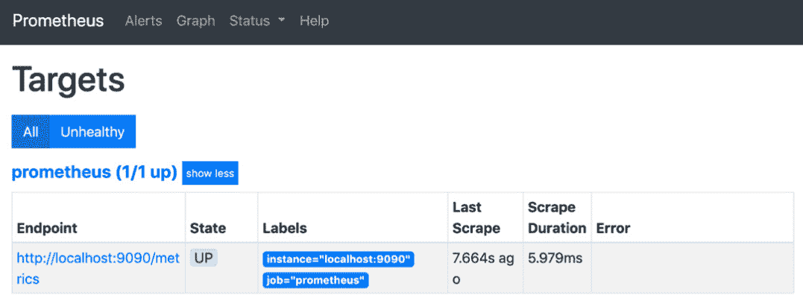
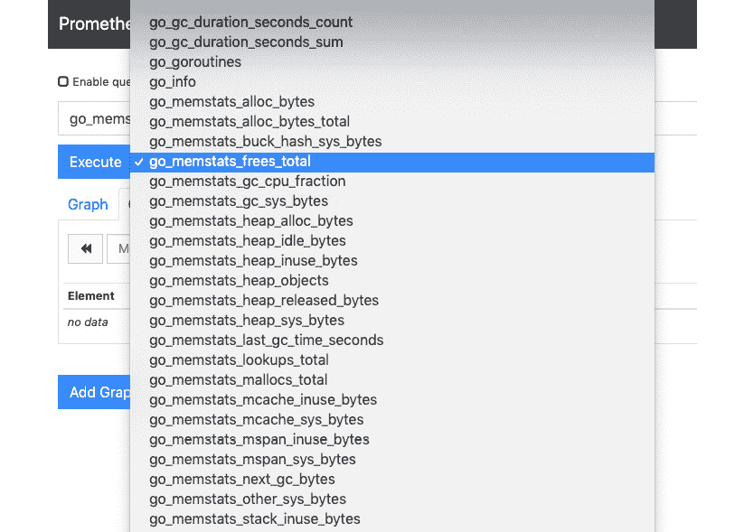
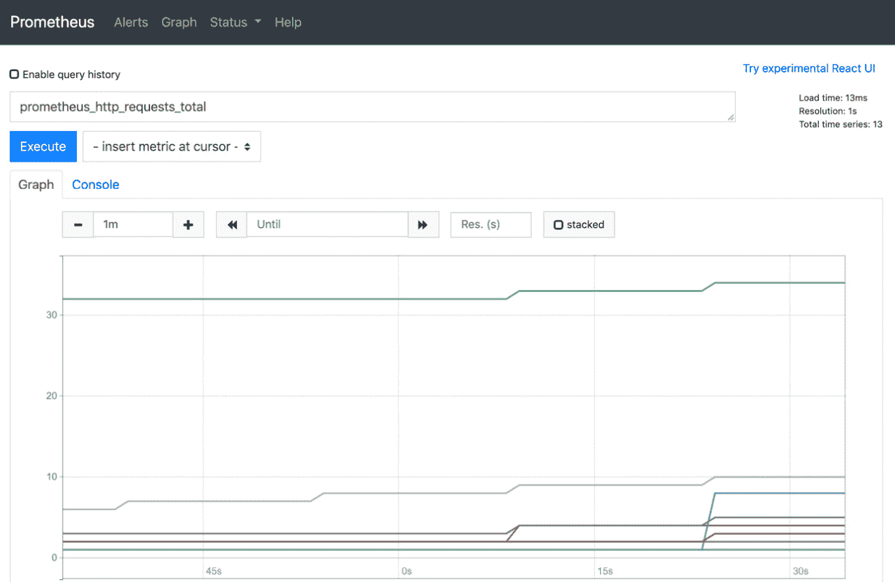
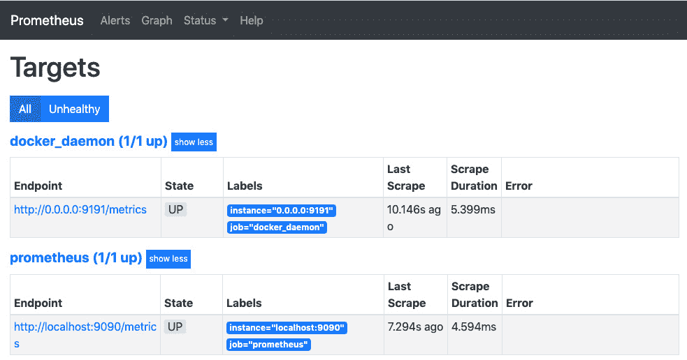
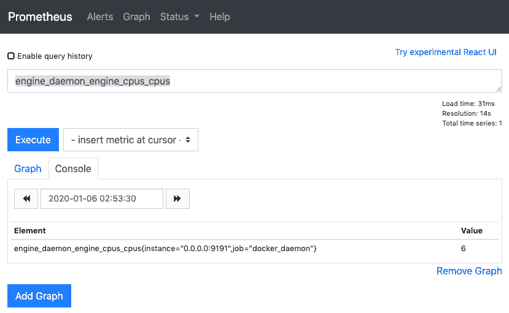
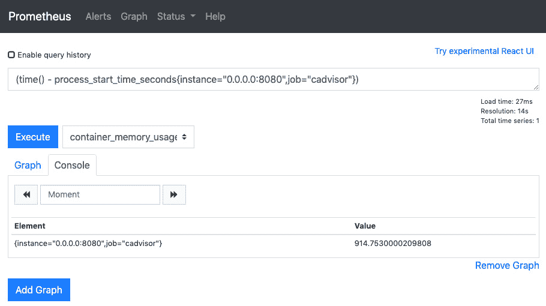
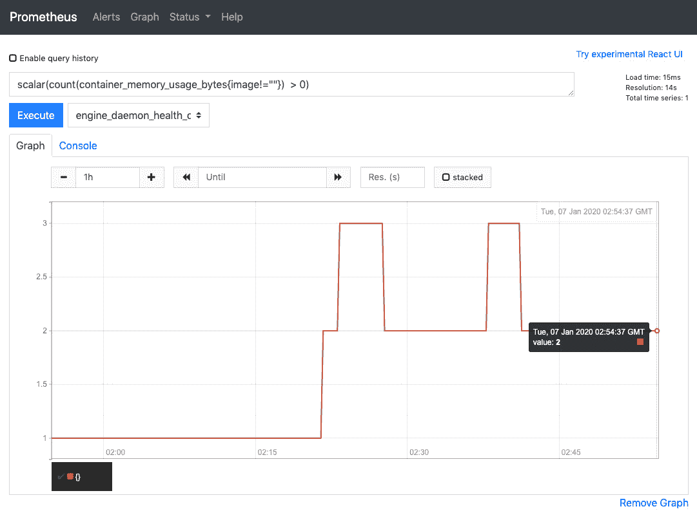
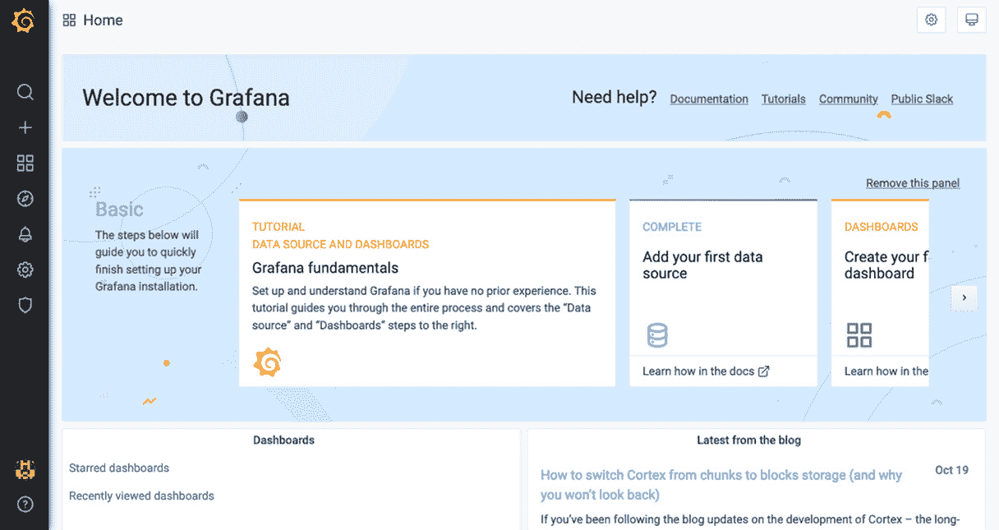
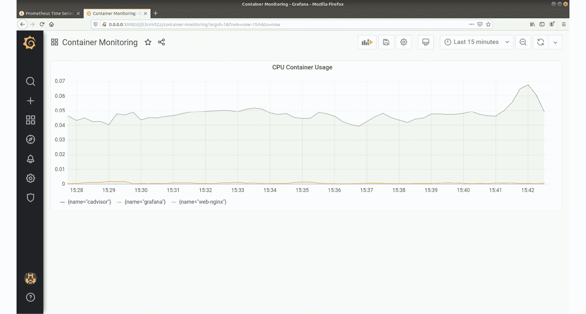

# 13。监控Docker指标

概观

本章将为您提供为系统设置监控环境以开始收集容器和资源指标所需的技能。到本章结束时，您将能够为您的度量设计一个监控策略，并确定在您开始项目开发之前需要考虑什么。您还将在系统上实现基本的普罗米修斯配置。本章将通过探索用户界面、PromQL 查询语言、配置选项以及 Docker 和应用度量的集合来扩展您对普罗米修斯的了解。它还将增强您的可视化和仪表板，将格拉夫纳作为普罗米修斯安装的一部分。

# 简介

在本书的前一章中，我们花了一些时间研究我们的容器如何使用它们的主机系统上的资源。我们这样做是为了确保我们的应用和容器尽可能高效地运行，但是当我们开始将我们的应用和容器移动到更大的生产环境中时，使用命令行工具(如`docker stats`)将开始变得麻烦。您会注意到，随着容器数量的增加，仅使用`stats`命令就很难理解这些指标。正如您将在接下来的页面中看到的，通过一点点规划和配置，为我们的容器环境设置监控将使我们能够轻松跟踪容器和系统的运行情况，并确保生产服务的正常运行时间。

随着我们进入更加敏捷的开发过程，应用的开发需要包含对应用的监控。在项目开始时有一个清晰的计划来监控我们的应用将允许开发人员将监控工具作为他们开发过程的一部分。这意味着，在创建应用之前，清楚地了解我们计划如何收集和监控应用非常重要。

除了应用和服务之外，监控环境中运行的基础架构、编排和容器也很重要，这样我们就可以全面了解环境中发生的一切。

当您建立度量监控策略时，您需要考虑的一些事情如下:

*   **应用和服务**:这包括您的代码可能依赖的第三方应用，它们不在您的硬件上。它还包括应用运行的编排服务。
*   **硬件**:退一步，确保你也注意到你的服务所依赖的所有硬件，包括数据库、应用编程接口网关和服务器，有时是很好的。
*   **要监控和提醒的服务**:随着应用的增长，您可能不仅希望监控特定的服务或网页；您可能还希望确保用户能够执行所有事务。这可能会增加您的警报和监控系统的复杂性。
*   **仪表盘和报表**:仪表盘和报表可以给非技术用户提供很多有用的信息。
*   **什么样的应用适合你的需求**:如果你在一家较大的公司工作，他们很可能会有一个应用列表供你选择。但它不应该是一刀切的。您决定用来监控您的环境的应用应该适合您的目的，并得到参与项目的每个人的同意。

这就是普罗米修斯进来的地方。在本章中，我们将使用普罗米修斯作为监控解决方案，因为它被广泛采用，是开源的，并且可以免费使用。市场上还有许多其他免费和企业应用提供类似的监控，包括自托管应用，如 Nagios 和 SCOM，以及更新的基于订阅的服务，包括新遗物、相扑逻辑和数据狗。普罗米修斯是基于监控云上服务的特殊需要而构建的。它提供了领先于市场其他主要参与者的一流功能。

其他一些应用也提供日志收集和聚合，但是我们已经将其分配给了一个单独的应用，并将在下一章专门讨论 Docker 环境的日志管理。Prometheus 只专注于度量收集和监控，由于日志管理中有合适的免费和开源替代方案，因此它没有将日志管理作为其关注的一部分。

# 用普罗米修斯监测环境指标

普罗米修斯最初是由 SoundCloud 创建和开发的，因为他们需要一种方法来监控他们高度动态的容器环境，并且对当时的当前工具不满意，因为他们觉得它不适合他们的需求。普罗米修斯被开发为一种让 SoundCloud 不仅监控其容器，还监控运行其服务的底层托管硬件和编排的方式。

它的最初创建要追溯到 2012 年，从那以后，该项目一直是免费和开源的，并且是云原生计算基金会的一部分。它也被全球需要深入了解其云环境表现的公司广泛采用。

普罗米修斯的工作原理是从我们的系统中收集感兴趣的指标，并将其存储在本地磁盘上的时间序列数据库中。它通过抓取您正在从中收集数据的服务或应用提供的 HTTP 端点来实现这一点。

端点可以被写入应用中，以提供一个提供与应用或服务相关的度量的基本网络接口，也可以由导出器提供，该导出器将从服务或应用中获取数据，然后以普罗米修斯可以理解的形式公开它。

注意

本章多次提到 HTTP 端点，这可能会导致混淆。您将在本章后面看到，HTTP 端点是由服务或应用提供的非常基本的 HTTP 网页。正如您将很快看到的，这个 HTTP 网页提供了服务向普罗米修斯公开的所有度量的列表，还提供了存储在普罗米修斯时间序列数据库中的度量值。

普罗米修斯包括许多组件:

*   **普罗米修斯**:普罗米修斯应用执行度量的抓取和收集，并将它们存储在其时间序列数据库中。
*   **Grafana** :普罗米修斯二进制还包括一个基本的 web 界面，帮助你开始查询数据库。在大多数情况下，Grafana 还将被添加到环境中，以实现更具视觉吸引力的界面。它将允许创建和存储仪表板，以更容易的方式进行度量监控。
*   **出口商**:出口商为普罗米修斯提供从不同应用和服务收集数据所需的指标端点。在本章中，我们将启用 Docker 守护程序来导出数据并安装`cAdvisor`来提供我们系统上运行的特定容器的度量。
*   **警报管理器**:虽然本章没有介绍，`AlertManager`通常会与 Prometheus 一起安装，以便在服务关闭时触发警报，或者在您的环境中触发其他警报。

普罗米修斯还提供了一个基于网络的表达式浏览器，允许您查看和聚合您使用功能性 PromQL 查询语言收集的时间序列指标。这意味着您可以在收集数据时查看数据。表达式浏览器有点有限，但可以与 Grafana 集成，允许您创建仪表板、监控服务和`AlertManager`以允许您触发警报并在需要时得到通知。

Prometheus 易于安装和配置(您将很快看到)，并自行收集数据以允许您开始测试应用。

由于普罗米修斯的采用率和受欢迎程度，许多公司为其应用和服务创建了出口商。我们将在本章中给你一些出口商的例子。

现在是你弄脏手的时候了。在下面的练习中，您将在自己的系统上下载并运行普罗米修斯二进制文件，以开始监控服务。

注意

请使用`touch`命令创建文件，使用`vim`命令使用 vim 编辑器处理文件。

## 练习 13.01:安装和运行普罗米修斯

在本练习中，您将下载并解压缩普罗米修斯二进制文件，启动应用，并探索普罗米修斯的网络界面和一些基本配置。您还将练习监控指标，例如向 Prometheus 接口发出的 HTTP 请求总数。

注意

截至撰写本书时，普罗米修斯的最新版本为 2.15.1 版。该应用的最新版本可在以下网址找到:https://prometheus.io/download/.

1.  找到要安装的普罗米修斯的最新版本。使用`wget`命令将压缩的归档文件带到您的系统中。您在命令中使用的网址可能与这里的不同，这取决于您的操作系统和您使用的普罗米修斯版本:

    ```
    wget https://github.com/prometheus/prometheus/releases/download/v2.15.1/prometheus-2.15.1.<operating-system>-amd64.tar.gz
    ```

2.  使用`tar`命令解压缩您在上一步下载的普罗米修斯档案。以下命令使用`zxvf`选项解压缩文件，然后提取档案和文件，输出详细信息:

    ```
    tar zxvf prometheus-2.15.1.<operating-system>-amd64.tar.gz
    ```

3.  该档案提供了一个完全创建的普罗米修斯二进制应用，准备启动。进入应用目录，查看目录中包含的一些导入文件:

    ```
    cd prometheus-2.15.1.<operating-system>-amd64
    ```

4.  List the files in the application directory using the `ls` command to look into the important files in our application:

    ```
    ls
    ```

    请注意输出，因为它看起来应该类似于下面的内容，其中`prometheus.yml`文件是我们的配置文件。`prometheus`文件是应用二进制文件，`tsdb`和数据目录是存储我们的时间序列数据库数据的地方:

    ```
    LICENSE    console_libraries    data    prometheus.yml    tsdb
    NOTICE    consoles    prometheus    promtool
    ```

    在前面的目录列表中，请注意`console_libraries`和`consoles`目录包含了用来查看我们将很快处理的普罗米修斯 web 界面的二进制文件。`promtool`目录包含了你可以用来和普罗米修斯一起工作的工具，包括一个配置检查工具来确保你的`prometheus.yml`文件是有效的。

5.  If there is no issue with your binary and the application is ready to run, you should be able to verify the version of Prometheus. Run the application from the command line using the `--version` option:

    ```
    ./prometheus --version
    ```

    输出应该如下所示:

    ```
    prometheus, version 2.15.1 (branch: HEAD, revision: 8744510c6391d3ef46d8294a7e1f46e57407ab13)
      build user:       root@4b1e33c71b9d
      build date:       20191225-01:12:19
      go version:       go1.13.5
    ```

6.  You won't be making any changes to your configuration file, but before you get started, make sure it has valid information for Prometheus. Run the `cat` command to view the content of the file:

    ```
    cat prometheus.yml 
    ```

    这里减少了输出中的行数。从以下输出可以看出，您的全局`scrap_interval`参数和`evaluation_interval`参数被设置为`15`秒:

    ```
    # my global config
    global:
      scrape_interval:     15s # Set the scrape interval to every 
    15 seconds. Default is every 1 minute.
      evaluation_interval: 15s # Evaluate rules every 15 seconds. 
    The default is every 1 minute.
      # scrape_timeout is set to the global default (10s).
    …
    ```

    如果您有时间查看一下`prometheus.yml`配置文件，您会注意到它分为四个主要部分:

    `global`:控制服务器的全局配置。这些配置包括`scrape_interval`，以了解其刮擦目标的频率，以及`evaluation_interval`，以控制其评估规则以创建时间序列数据和生成规则的频率。

    `alerting`:默认情况下，配置文件也会通过 AlertManager 设置告警。

    `rule_files`:这是普罗米修斯将定位额外规则加载的地方，作为其度量收集的一部分。`rule_files`指向存储规则的位置。

    `scrape_configs`:这些是普罗米修斯将要监控的资源。我们希望监视的任何其他目标都将被添加到配置文件的这一部分。

7.  Starting Prometheus is simply a matter of running the binary and specifying the configuration file you would like it to use with the `--config.file` command-line option. Run the following command to start Prometheus:

    ```
    ./prometheus --config.file=prometheus.yml
    ```

    几秒钟后，你应该有希望看到`"Server is ready to receive web requests."`的信息:

    ```
    …
    msg="Server is ready to receive web requests."
    ```

8.  Enter the URL `http://localhost:9090`. Prometheus provides an easy-to-use web interface. If the application has started up correctly, you should now be able to open a web browser on your system. You should have the expression browser presented to you, similar to the following screenshot.Although the expression browser doesn't look very impressive, it does have some good functionality out of the box. It is set up in three distinct sections.

    **主菜单**:屏幕顶部的主菜单，黑色背景，允许您通过`Status`下拉菜单查看额外的配置详细信息，使用`Alerts`选项向您显示警报历史，使用`Prometheus`和`Graph`选项将您带回主表情浏览器屏幕。

    **表达式编辑器**:这是顶部的文本框，我们可以在其中输入 PromQL 查询或者从下拉列表中选择一个指标。然后点击`Execute`按钮开始显示数据。

    **图形和控制台显示**:一旦您决定要查询什么数据，它将以表格格式显示在`Console`选项卡中，并以时间序列图形格式显示在`Graph`选项卡中，您可以使用`Add Graph`按钮在网页下方添加更多图形:

    

    图 13.1:首次加载表达式浏览器

9.  Click the `Status` drop-down menu. You'll get to see the following image with useful information, including `Runtime & Build Information` to display details of the version running, `Command-Line Flags` to run the application with, `Configuration`, which displays the current `config` file running, and `Rules` for alerting rules. The final two options in the drop-down menu show `Targets`, which you are currently scraping data from, and `Service Discovery`, which is showing automatic services that are being monitored:

    

    图 13.2:状态下拉菜单

10.  From the `Status` menu, select the `Targets` option and you will be able to see what Prometheus is scraping data from. You can also get the same result by going to the URL `HTTP:localhost:9090/targets`. You should see a screenshot similar to the following, as Prometheus is currently only monitoring itself:

    

    图 13.3:普罗米修斯目标页面

11.  单击目标端点。您将能够看到目标公开的指标。您现在可以看到普罗米修斯如何利用其拉架构从其目标中抓取数据。点击链接或打开浏览器，输入网址`http://localhost:9090/metrics`查看普罗米修斯指标端点。您应该会看到类似于下面的内容，显示了普罗米修斯暴露的所有度量点，然后被自己刮擦:

    ```
    # HELP go_gc_duration_seconds A summary of the GC invocation 
    durations.
    # TYPE go_gc_duration_seconds summary
    go_gc_duration_seconds{quantile="0"} 9.268e-06
    go_gc_duration_seconds{quantile="0.25"} 1.1883e-05
    go_gc_duration_seconds{quantile="0.5"} 1.5802e-05
    go_gc_duration_seconds{quantile="0.75"} 2.6047e-05
    go_gc_duration_seconds{quantile="1"} 0.000478339
    go_gc_duration_seconds_sum 0.002706392
    …
    ```

12.  Return to the expression browser by either clicking the back button or by entering the URL `http://localhost:9090/graph`. Click the drop-down list next to the `Execute` button to see all the metric points available:

    

    图 13.4:表达式浏览器中可用的普罗米修斯度量

13.  From the drop-down list or in the query editor, add the `prometheus_http_requests_total` metrics to view all the HTTP requests made to the Prometheus application. Your output may differ from the following. Click the `Execute` button and click the `Graphs` tab to see a visual view of our data:

    

图 13.5:从表达式浏览器显示的普罗米修斯 HTTP 请求图

如果你对我们到目前为止所取得的成就还有点困惑，不要担心。在短时间内，我们建立了普罗米修斯，并开始收集它的数据。尽管我们只收集了普罗米修斯本身的数据，但我们已经能够展示我们现在如何快速轻松地可视化应用正在执行的 HTTP 请求。下一节将向您展示如何通过对 Prometheus 配置进行小的更改来开始从 Docker 和您正在运行的容器中捕获数据。

# 用普罗米修斯监控Docker容器

普罗米修斯监控是了解应用功能的一个很好的方法，但是它不能帮助我们监控 Docker 和我们系统上运行的容器。幸运的是，有两种方法可以收集数据，让我们更深入地了解正在运行的容器。我们可以使用 Docker 守护程序向 Prometheus 公开度量，还可以安装一些额外的应用，例如`cAdvisor`，以收集我们系统上运行的容器的进一步度量。

通过对 Docker 配置进行一些小的更改，我们能够向 Prometheus 公开度量标准，以允许它收集在我们的系统上运行的 Docker 守护进程的特定数据。这将是收集度量的一部分，但不会给我们实际运行的容器的度量。这就是我们接下来需要安装`cAdvisor`的地方，它是由谷歌专门为收集我们的运行容器指标而创建的。

注意

如果我们需要在底层硬件上收集更多的指标，Docker 和我们的容器正在运行，我们也可以使用`node_exporter`收集更多的指标。我们不会在本章中讨论`node_exporter`，但支持文档可以在以下网址找到:

https://github.com/prometheus/node_exporter.

由于 Docker 已经在您的主机系统上运行，将其设置为允许 Prometheus 从其连接度量是一个向`/etc/docker/daemon.json`文件添加配置更改的问题。在大多数情况下，文件很可能是空白的。如果文件中已经有详细信息，您只需将以下示例中的*第 2 行*和*第 3 行*添加到您的配置文件中。*第 2 行*启用此`experimental`功能，公开 Prometheus 要收集的指标，*第 3 行*为这些要公开的数据点设置 IP 地址和端口:

```
1 {
2        "experimental": true,
3        "metrics-addr": "0.0.0.0:9191"
4 }
```

由于配置更改，您系统上的 Docker 守护程序需要重新启动才能生效。但是一旦发生这种情况，您就应该在您添加到`daemon.json`文件中的指定 IP 地址和端口上有可用的指标。在我们上面的例子中，这将是在`http://0.0.0.0:9191`。

为了安装`cAdvisor`，谷歌提供了一个易于使用的 Docker 映像，可以从谷歌的云注册表中提取并在您的环境中运行。

要运行`cAdvisor`，您将运行装载与 Docker 守护程序和运行容器相关的所有目录的映像。您还需要确保公开指标可用的端口。默认情况下，`cAdvisor`被配置为在端口`8080`上公开指标，除非您对`cAdvisor`的底层映像进行更改，否则您将无法更改这些指标。

以下`docker run`命令将卷装入容器，如`/var/lib/docker`、`/var/run`，将端口`8080`暴露给主机系统，最后使用谷歌提供的最新`cadvisor`映像:

```
docker run \
  --volume=<host_directory>:<container_directory> \
  --publish=8080:8080 \
  --detach=true \
  --name=cadvisor \
  gcr.io/google-containers/cadvisor:latest
```

注意

对`cAdvisor`的底层映像进行更改不是我们将在本章讨论的内容，但是您需要参考`cAdvisor`文档并对`cAdvisor`代码进行具体更改。

`cAdvisor`映像还将提供一个有用的网络界面来查看这些指标。`cAdvisor`不保存任何历史数据，需要用普罗米修斯收集数据。

一旦 Docker 守护程序和`cAdvisor`有了普罗米修斯可以收集的数据，我们需要确保我们有一个计划的配置来将数据添加到时间序列数据库中。应用目录中的`prometheus.yml`配置文件允许我们这样做。您只需将配置添加到文件的`scrape_configs`部分。从下面的例子中可以看出，您需要添加一个`job_name`参数，并提供指标作为`targets`条目的详细信息:

```
    - job_name: '<scrap_job_name>'
      static_configs:
      - targets: ['<ip_address>:<port>']
```

一旦目标对普罗米修斯可用，你就可以开始搜索数据。现在，我们已经提供了如何开始使用 Prometheus 收集 Docker 指标的详细信息，下面的练习将向您展示如何在运行的系统上执行此操作。

## 练习 13.02:与普罗米修斯一起收集Docker指标

在本练习中，您将配置普罗米修斯开始从我们的 Docker 守护程序收集数据。这将允许您查看 Docker 守护程序本身具体使用了哪些资源。您还将运行`cAdvisor` Docker 映像，以开始收集正在运行的容器的特定指标:

1.  To start collecting data from the Docker daemon, you first need to enable this functionality on your system. Start by opening the `/etc/docker/daemon.json` file with your text editor and add in the following details:

    ```
    1 {
    2        "experimental": true,
    3        "metrics-addr": "0.0.0.0:9191"
    4 }
    ```

    您对配置文件所做的更改将公开 Docker 守护程序度量，以允许普罗米修斯抓取并存储这些值。要启用此更改，请保存 Docker 配置文件并重新启动 Docker 守护程序。

2.  通过打开您的网络浏览器并使用您在配置中设置的网址和端口号来验证这是否有效。输入网址`http://0.0.0.0:9191/metrics`，你会看到一个允许普罗米修斯抓取的指标列表:

    ```
    # HELP builder_builds_failed_total Number of failed image builds
    # TYPE builder_builds_failed_total counter
    builder_builds_failed_total{reason="build_canceled"} 0
    builder_builds_failed_total{reason="build_target_not_reachable
    _error"} 0
    builder_builds_failed_total{reason="command_not_supported_
    error"} 0
    builder_builds_failed_total{reason="dockerfile_empty_error"} 0
    builder_builds_failed_total{reason="dockerfile_syntax_error"} 0
    builder_builds_failed_total{reason="error_processing_commands_
    error"} 0
    builder_builds_failed_total{reason="missing_onbuild_arguments_
    error"} 0
    builder_builds_failed_total{reason="unknown_instruction_error"} 0
    …
    ```

3.  您现在需要让普罗米修斯知道它可以在哪里找到 Docker 向它公开的指标。您可以通过应用目录中的`prometheus.yml`文件来实现。不过，在执行此操作之前，您需要停止 Prometheus 服务的运行，这样配置文件中的添加内容才会生效。打开普罗米修斯正在运行的终端，按下 *Ctrl* + *C* 。当您成功做到这一点时，您应该会看到类似如下的输出:

    ```
    level=info ts=2020-04-28T04:49:39.435Z caller=main.go:718 
    msg="Notifier manager stopped"
    level=info ts=2020-04-28T04:49:39.436Z caller=main.go:730 
    msg="See you next time!"
    ```

4.  Open the `prometheus.yml` configuration file in the application directory with your text editor. Move to the end of the file in the `scrape_configs` section and add *lines 21* to *34*. The additional lines will tell Prometheus that it can now obtain metrics from the Docker daemon that has been exposed on IP address `0.0.0.0` and port `9191`:

    普罗米修斯号

    ```
    21 scrape_configs:
    22   # The job name is added as a label 'job=<job_name>' to any        timeseries scraped from this config.
    23   - job_name: 'prometheus'
    24
    25     # metrics_path defaults to '/metrics'
    26     # scheme defaults to 'http'.
    27 
    28     static_configs:
    29     - targets: ['localhost:9090']
    30 
    31   - job_name: 'docker_daemon'
    32     static_configs:
    33     - targets: ['0.0.0.0:9191']
    34
    ```

    这一步的完整代码可以在 https://packt.live/33satLe.找到

5.  保存您对`prometheus.yml`文件所做的更改，并从命令行再次启动普罗米修斯应用，如下所示:

    ```
    ./prometheus --config.file=prometheus.yml
    ```

6.  If you move back to the expression browser for Prometheus, you can once again verify it is now configured to collect data from the Docker daemon. Either select `Targets` from the `Status` menu or use the URL `http://localhost:9090/targets`, which should now include the `docker_daemon` job we specified in our configuration file:

    

    图 13.6:普罗米修斯目标现在有了 docker_daemon

7.  Verify that you are collecting data by searching `engine_daemon_engine_cpus_cpus`. This value should be the same as the number of CPUs or cores available on your host system. Enter this into the Prometheus expression browser and click the `Execute` button:

    

    图 13.7:主机系统上可用的 docker _ daemon CPUs

8.  Docker 守护进程受限于它可以向普罗米修斯公开的数据量。设置`cAdvisor`映像以收集运行容器的详细信息。在命令行中使用以下`docker run`命令，将它作为谷歌提供的容器运行。`docker run`命令使用存储在谷歌容器注册表中的`cadvisor:latest`映像，类似于 Docker Hub。没有必要登录到此注册表；映像会自动被拉到你的系统中:

    ```
    docker run \
      --volume=/:/rootfs:ro \
      --volume=/var/run:/var/run:ro \
      --volume=/sys:/sys:ro \
      --volume=/var/lib/docker/:/var/lib/docker:ro \
      --volume=/dev/disk/:/dev/disk:ro \
      --publish=8080:8080 \
      --detach=true \
      --name=cadvisor \
      gcr.io/google-containers/cadvisor:latest
    ```

9.  `cAdvisor` comes with a web interface that will give you some basic functionality, but as it does not store historical data, you will be collecting the data and storing it on Prometheus. For now, open another web browser session and enter the URL `http://0.0.0.0:8080` and you should see a web page similar to the following:

    

    图 13.8:cAdvisor 欢迎页面

10.  Enter the URL `http://0.0.0.0:8080/metrics` to view all the data that `cAdvisor` is displaying on the web interface.

    注意

    对普罗米修斯配置文件进行更改时，需要重新启动应用才能使更改生效。在我们进行的练习中，我们通过停止服务来达到同样的效果。

11.  As you did with the Docker daemon, configure Prometheus to periodically scrape data from the metrics endpoint. Stop the Prometheus application running and, once again, open the `prometheus.yml` configuration file with your text editor. At the bottom of the configuration, add in another configuration for `cAdvisor` with the following details:

    普罗米修斯号

    ```
    35   - job_name: 'cadvisor'
    36     scrape_interval: 5s
    37     static_configs:
    38     - targets: ['0.0.0.0:8080']
    ```

    这一步的完整代码可以在 https://packt.live/33BuFub.找到

12.  Save your configuration changes once again and run the Prometheus application from the command line, as shown here:

    ```
    ./prometheus --config.file=prometheus.yml
    ```

    如果您现在查看普罗米修斯网络界面上可用的`Targets`，您应该会看到类似于下面的内容，显示`cAdvisor`也在我们的界面上可用:

    

    图 13.9:添加了 cAdvisor 的普罗米修斯目标页面

13.  With the `Targets` page of Prometheus showing that `cAdvisor` is now available and connected, it verifies that Prometheus is now collecting metrics data from `cAdvisor`. You can also test this from the expression browser to verify it is working as it should. Move into the expression browser by selecting `Graphs` or `Prometheus` from the top menu. When the page loads, add the following PromQL query to the query editor and click the `Execute` button:

    ```
    (time() - process_start_time_seconds{instance="0.0.0.0:8080",job="cadvisor"})
    ```

    注意

    我们开始使用一些更高级的 PromQL 查询，它看起来可能有点混乱。本章的下一部分致力于让您更好地理解 PromQL 查询语言。

    该查询使用`process_start_time_seconds`度量，特别是针对`cAdvisor`应用和`time()`函数来添加总秒数。您应该会在表达式浏览器上看到类似以下的结果:

    

图 13.10:表达式浏览器的 cAdvisor 正常运行时间

通过这个练习，我们现在有了一个正在运行的普罗米修斯实例，并且正在从 Docker 守护程序收集数据。我们还设置了`cAdvisor`来给我们一些关于正在运行的容器实例的进一步信息。本章的下一部分将更深入地讨论 PromQL 查询语言，以帮助您更轻松地查询 Prometheus 提供的指标。

# 理解普罗米修斯查询语言

正如我们在本章前面部分看到的，普罗米修斯提供了自己的查询语言 PromQL。它允许您搜索、查看和聚合普罗米修斯数据库中存储的时间序列数据。本节帮助您进一步理解查询语言。普罗米修斯中有四种核心度量类型，我们将从描述每一种开始。

## 计数器

计数器随着时间对元素进行计数；例如，这可能是访问您的网站的次数。当服务或应用重新启动时，计数只会上升或重置。它们适用于计算某个时间点上特定事件的数量。每次计数器改变时，数字也会反映在您收集的数据中。

计数器通常以`_total`后缀结束。但是由于计数器的性质，每次服务重新启动时，计数器将被设置回 0。在我们的查询中使用`rate()`或`irate()`函数，我们将能够查看一段时间内的度量率，并忽略计数器重置为 0 的任何时间。`rate()`和`irate()`函数都使用方括号`[ ]`取一个数值范围，其中指定了一个时间值，如`[1m]`。

如果您对我们正在收集的数据中的计数器示例感兴趣，请在网址`http://0.0.0.0:8080/metrics`上打开`cAdvisor`正在收集的数据的指标页面。首先提供的指标之一是`container_cpu_system_seconds_total`。如果我们浏览指标页面，我们将看到此处列出的指标值和类型的信息:

```
# HELP container_cpu_system_seconds_total Cumulative system cpu time 
consumed in seconds.
# TYPE container_cpu_system_seconds_total counter
container_cpu_system_seconds_total{id="/",image="",name=""} 
195.86 1579481501131
…
```

现在，我们将研究普罗米修斯公司提供的第二种公制类型，换句话说，就是仪表。

## 仪表

仪表被设计用来处理可能随时间而减少的值，并且被设计用于任何暴露事物当前状态的度量。就像温度计或燃油表一样，你可以看到当前的状态值。仪表的功能受到限制，因为并非所有数据都将被收集，因为时间点之间可能会有缺失值。因此，它们不如计数器可靠，因此计数器仍然用于数据的时间序列表示。

如果我们再次转到`cAdvisor`的指标页面，您可以看到我们的一些指标显示为指标。我们首先看到的指标之一是`container_cpu_load_average_10s`，它是作为一个标准提供的，类似于以下值:

```
# HELP container_cpu_load_average_10s Value of container cpu load 
average over the last 10 seconds.
# TYPE container_cpu_load_average_10s gauge
container_cpu_load_average_10s{id="/",image="",name=""} 0 
1579481501131
…
```

下一节将带您浏览直方图，这是普罗米修斯中可用的第三种度量。

## 直方图

直方图比计量器和计数器复杂得多，并且提供额外的信息，比如观察值的总和。它们用于提供一组数据的分布。直方图使用采样，可用于估计普罗米修斯服务器上的分位数。

直方图不如仪表和计数器常见，似乎也不是为`cAdvisor`设置的，但是我们可以在我们的 Docker 守护程序度量中看到一些可用的直方图。移动到网址`http://0.0.0.0:9191/metrics`你将能够看到首先列出的直方图指标之一是`engine_daemon_container_actions_seconds`。这是 Docker 守护程序处理每个操作所需的秒数:

```
# HELP engine_daemon_container_actions_seconds The number of seconds 
it takes to process each container action
# TYPE engine_daemon_container_actions_seconds histogram
engine_daemon_container_actions_seconds_bucket{action="changes",
le="0.005"} 1
…
```

下一节将介绍第四种可用的度量类型，换句话说，总结。

## 总结

摘要是直方图的扩展，是在客户端计算的。它们的优点是更准确，但对客户来说也很昂贵。我们可以在 Docker 守护进程度量中看到一个摘要示例，这里列出了`http_request_duration_microseconds`:

```
# HELP http_request_duration_microseconds The HTTP request latencies in microseconds.
# TYPE http_request_duration_microseconds summary
http_request_duration_microseconds{handler="prometheus",quantile=
"0.5"} 3861.5
…
```

现在，既然我们已经解释了 PromQL 中可用的度量类型，我们可以进一步了解如何将这些度量作为查询的一部分来实现。

# 执行 PromQL 查询

在表达式浏览器上运行查询很容易，但您可能并不总能获得所需的信息。通过简单地添加度量名称，比如`countainer_cpu_system_seconds_total`，我们可以得到相当多的响应。尽管如此，这个数量取决于我们系统上的容器数量以及我们主机系统上运行的每个文件系统的返回值。为了限制我们的结果中提供的响应数量，我们可以使用花括号`{ }`搜索特定的文本。

考虑下面的例子。以下命令提供了我们希望查看的`"cadvisor"`容器的全名:

```
container_cpu_system_seconds_total{ name="cadvisor"}
```

以下示例使用与 GO 兼容的正则表达式。该命令查找任何以`ca`开头并在其后有更多字符的名称:

```
container_cpu_system_seconds_total{ name=~"ca.+"} 
```

下面的代码片段通过使用不等于(`!=`)值来搜索名称值不为空的任何容器:

```
container_cpu_system_seconds_total{ name!=""}
```

如果我们将这些度量搜索中的任何一个放在表达式浏览器中，并创建一个图表，您会注意到图表会随着时间的推移以线性方式攀升。正如我们前面提到的，这是因为度量`container_cpu_system_seconds_total`是一个计数器，只会随着时间的推移而增加或被设置回零。利用函数，我们可以计算出更多有用的时间序列数据。以下示例使用`rate()`函数计算匹配时间序列数据的每秒速率。我们用了`[1m]`，代表 1 分钟。数字越大，图形越平滑:

```
rate(container_cpu_system_seconds_total{name="cadvisor"}[1m])
```

`rate`功能只能用于计数器指标。如果我们有多个容器在运行，那么我们可以使用`sum()`函数将所有值相加，并使用`(name)`函数按容器名称提供一个图表，如这里所示:

```
sum(rate(container_cpu_system_seconds_total[1m])) by (name)
```

注意

如果您想查看 PromQL 中所有可用功能的列表，请访问 Prometheus 官方文档提供的以下链接:

https://prometheus.io/docs/prometheus/latest/querying/functions/.

PromQL 还允许我们根据查询进行算术运算。在下面的例子中，我们使用`process_start_time_seconds`度量并搜索普罗米修斯实例。我们可以从`time()`函数中减去这个时间，该函数给出了纪元时间中的当前日期和时间:

```
(time() - process_start_time_seconds{instance="localhost:9090",job="prometheus"})
```

注意

Epoch time 是从 1970 年 1 月 1 日开始的秒数，用数字表示；例如，1578897429 被转换为 2020 年 1 月 13 日上午 6:37(格林尼治标准时间)。

我们希望 PromQL 中的这本入门书能让您对在项目中使用查询语言有更多的了解。下面的练习将通过进一步监控我们正在运行的 Docker 容器来帮助巩固我们所学到的知识。

## 练习 13.03:使用 PromQL 查询语言

在下面的练习中，我们将在您的系统中引入一个新的 Docker 映像，以帮助您演示在使用 Prometheus 时 Docker 特有的一些可用指标。本练习将通过收集和显示基本网站的指标数据的实际用例，巩固您迄今为止对 PromQL 查询语言的了解:

1.  打开一个新终端，新建一个目录，称之为`web-nginx` :

    ```
    mkdir web-nginx; cd web-nginx
    ```

2.  在`web-nginx`目录下新建一个文件，称之为`index.html`。用文本编辑器打开新文件，并添加以下 HTML 代码:

    ```
    <!DOCTYPE html>
    <html lang="en">
    <head>
    </head>
    <body>
        <h1>
            Hello Prometheus
        </h1>
    </body>
    </html>
    ```

3.  使用以下命令运行一个新的 Docker 容器。现在，您应该已经熟悉了语法，但是下面的命令将拉取最新的`nginx`映像，将其命名为`web-nginx`，并暴露端口`80`，这样您就可以查看您在上一步中创建的挂载的`index.html`文件:

    ```
    docker run --name web-nginx --rm -v ${PWD}/index.html:/usr/share/nginx/html/index.html -p 80:80 -d nginx
    ```

4.  Open a web browser and access `http://0.0.0.0`. The only thing you should see is the greeting `Hello Prometheus`:

    

    图 13.11:示例网页

5.  If Prometheus is not running on your system, open a new terminal and, from the Prometheus application directory, start the application from the command line:

    ```
    ./prometheus --config.file=prometheus.yml
    ```

    注意

    我们不会显示本章这一部分执行的所有 PromQL 查询的截图，因为我们不想浪费太多空间。但是这些查询应该对我们设置的运行容器和系统都有效。

6.  The bulk of the `cAdvisor` metrics now available in Prometheus will start with the word `container`. Use the `count()` function with the metric `container_memory_usage_bytes` to see the count of the current memory usage in bytes:

    ```
    count(container_memory_usage_bytes)
    ```

    前面的查询在运行它的系统上提供了 28 个结果。

7.  要限制您要查找的信息，请使用花括号进行搜索，或者使用 not search ( `!=`)搜索特定的映像名称，如下命令所示。目前，您只有两个运行映像名称的容器，`cAdvisor`和`web-nginx`。通过使用`scalar()`功能，您可以计算一段时间内系统上运行的容器数量。输入以下查询后，点击`Execute`按钮:

    ```
    scalar(count(container_memory_usage_bytes{image!=""}) > 0)
    ```

8.  Click the `Graphs` tab, and you should now have a plotted graph of the preceding query. The graph should be like the following image in which you started up a third image `web-nginx` container to show how the Prometheus expression browser displays this type of data. Remember that you are only seeing one line in the graph as this is the memory used by the two containers on our system and there is not a separate memory usage value for both:

    

    图 13.12:表达式浏览器中的 cAdvisor 度量

9.  Use the `container_start_time_seconds` metric to get the Unix timestamp of when the container started up:

    ```
    container_start_time_seconds{name="web-nginx"}
    ```

    您将看到类似 1578364679 的内容，这是纪元时间(1970 年 1 月 1 日)过去的秒数。

10.  使用`time()`功能获取当前时间，然后从该值中减去`container_start_time_seconds`，以显示容器已经运行了多少秒:

    ```
    (time() - container_start_time_seconds{name="web-nginx"})
    ```

11.  Monitor HTTP requests on your application via Prometheus' `prometheus_http_request_duration_seconds_count` metric. Use the `rate()` function to plot a graph of the duration of each HTTP request to Prometheus:

    ```
    rate(prometheus_http_request_duration_seconds_count[1m])
    ```

    注意

    使用`web-nginx`容器查看其 HTTP 请求时间和延迟会很好，但是该容器尚未设置为向普罗米修斯提供该信息。我们将在本章中很快讨论这个问题。

12.  使用算术运算符将`prometheus_http_request_duration_seconds_sum`除以`prometheus_http_request_duration_seconds_count`，这将提供请求的 HTTP 延迟:

    ```
    rate(prometheus_http_request_duration_seconds_sum[1m]) / rate(prometheus_http_request_duration_seconds_count[1m])
    ```

13.  Run the following command using the `container_memory_usage_bytes` metric to see the memory being used by each of the running containers on your system. In this query, we are using the `sum by (name)` command to add the values per container name:

    ```
    sum by (name) (container_memory_usage_bytes{name!=""})
    ```

    如果执行前面的查询，您将在表达式浏览器中看到显示`web-nginx`和`cAdvisor`容器使用的内存的图表:

    

图 13.13:运行在我们系统上的两个容器的内存

本节帮助您对`PromQL`查询语言有了更多的了解，并将您的查询组合在一起，开始从表达式浏览器查看您的度量。下一节将详细介绍如何使用导出器以普罗米修斯友好的方式从您在 Docker 中创建的应用和服务中收集指标。

# 使用普罗米修斯出口商

在这一章中，我们已经配置了应用指标，为 Prometheus 提供数据进行刮取和收集，那么为什么我们需要担心出口商呢？正如您所看到的，Docker 和`cAdvisor`很好地公开了数据端点，普罗米修斯可以从中收集度量。但是这些功能有限。正如我们在新的`web-nginx`网站上看到的，在我们的映像上运行的网页没有暴露相关数据。我们可以使用导出器来帮助从应用或服务中收集指标，然后以普罗米修斯能够理解和收集的方式提供数据。

尽管这似乎是普罗米修斯工作方式的一个主要缺陷，但由于普罗米修斯的使用越来越多，并且它是开源的，供应商和第三方提供商现在正在提供出口商来帮助您从应用中获取指标。

这意味着，通过安装特定的库或使用预构建的 Docker 映像来运行您的应用，您可以公开度量数据以供收集。例如，我们在本章前面创建的`web-nginx`应用正在 NGINK 上运行。为了获得我们的 web 应用的度量，我们可以简单地将`ngx_stub_status_prometheus`库安装到运行我们的 web 应用的 NGINX 实例上。或者更好的是，我们可以找到某人已经构建的 Docker 映像来运行我们的 web 应用。

注意

本章的这一部分集中在 NGINX Exporter 上，但是大量应用的出口商可以在他们的支持文档或 Prometheus 文档中找到。

在下面的练习中，我们将使用我们的`nginx`容器作为示例，并使用带有我们的`web-nginx`容器的导出器来展示普罗米修斯可以收集的度量。

## 练习 13.04:在应用中使用指标导出器

到目前为止，我们已经使用了一个`nginx`容器来提供一个基本的网页，但是我们没有针对我们的网页的具体指标。在本练习中，您将使用一个不同的 NGINX 映像，该映像由一个可以暴露给 Prometheus 的指标导出器构建:

1.  如果`web-nginx`容器仍在运行，用以下命令停止容器:

    ```
    docker kill web-nginx
    ```

2.  在 Docker Hub 中，您有一个名为`mhowlett/ngx-stud-status-prometheus`的映像，它已经安装了`ngx_stub_status_prometheus`库。该库将允许您设置一个 HTTP 端点，从您的`nginx`容器向普罗米修斯提供指标。将这张图片拉下到你的工作环境中:

    ```
    docker pull mhowlett/ngx-stub-status-prometheus
    ```

3.  In the previous exercise, you used the default NGINX configuration on the container to run your web application. To expose the metrics to Prometheus, you will need to create your configuration to override the default configuration and provide your metrics as an available HTTP endpoint. Create a file named `nginx.conf` in your working directory and add the following configuration details:

    ```
    daemon off;
    events {
    }
    http {
      server {
        listen 80;
        location / {
          index  index.html;
        }
        location /metrics {
          stub_status_prometheus;
        }
      }
    }
    ```

    上述配置将确保您的服务器在第 8 行*的端口`80`上仍然可用。*第 11 行*将确保提供您当前的`index.html`页面，*第 14 行*将设置`/metrics`的子域，以提供可从`ngx_stub_status_prometheus`库中获得的详细信息。*

**   为`index.html`文件提供挂载点，以启动`web-nginx`容器，并使用以下命令挂载您在上一步中创建的`nginx.conf`配置:

    ```
    docker run --name web-nginx --rm -v ${PWD}/index.html:/usr/html/index.html -v ${PWD}/nginx.conf:/etc/nginx/nginx.conf -p 80:80 -d mhowlett/ngx-stub-status-prometheus
    ```

    *   您的`web-nginx`应用应该会再次运行，并且您应该能够从您的网络浏览器中看到它。输入网址`http://0.0.0.0/metrics`查看指标端点。您的网络浏览器窗口中的结果应该类似于以下信息:

    ```
    # HELP nginx_active_connections_current Current number of 
    active connections
    # TYPE nginx_active_connections_current gauge
    nginx_active_connections_current 2
    # HELP nginx_connections_current Number of connections currently 
    being processed by nginx
    # TYPE nginx_connections_current gauge
    nginx_connections_current{state="reading"} 0
    nginx_connections_current{state="writing"} 1
    nginx_connections_current{state="waiting"} 1
    …
    ```

    *   You still need to let Prometheus know that it needs to collect the data from the new endpoint. So, stop Prometheus from running. Move into the application directory again, and with your text editor, add the following target to the end of the `prometheus.yml` configuration file:

    普罗米修斯号

    ```
    40   - job_name: 'web-nginx'
    41     scrape_interval: 5s
    42     static_configs:
    43     - targets: ['0.0.0.0:80']
    ```

    这一步的完整代码可以在 https://packt.live/3hzbQgj.找到

    *   保存对配置的更改，并再次启动普罗米修斯运行:

    ```
    ./prometheus --config.file=prometheus.yml
    ```

    *   Confirm whether Prometheus is configured to collect data from the new metrics endpoint you have just created. Open your web browser and enter the URL `http://0.0.0.0:9090/targets`:

    * 

 *图 13.14:显示网络引擎的目标页面

在本练习中，您学习了向运行在您的环境中的应用添加导出器。我们首先扩展了我们之前的`web-nginx`应用，允许它显示多个 HTTP 端点。然后，我们使用包含`ngx_stub_status_prometheus`库的 Docker 映像来显示我们的`web-nginx`统计数据。然后，我们配置普罗米修斯从提供的端点收集这些细节。

在下一节中，我们将设置 Grafana，使我们能够更近距离地查看数据，并为我们正在收集的数据提供用户友好的仪表盘。

# 用格拉夫纳延长普罗米修斯号

普罗米修斯网络界面提供了一个功能性的表达式浏览器，允许我们在有限的安装下搜索和查看时间序列数据库中的数据。它提供了一个图形界面，但不允许我们保存任何搜索或可视化。普罗米修斯的网络界面也受到限制，因为它不能在仪表板中对查询进行分组。此外，界面提供的可视化不多。在这里，我们可以使用 Grafana 等应用进一步扩展收集的数据。

Grafana 允许我们直接连接普罗米修斯时间序列数据库，执行查询并创建视觉上吸引人的仪表盘。Grafana 可以作为一个独立的应用在服务器上运行。我们可以预先配置 Grafana Docker 映像以部署到我们的系统上，配置为连接到我们的 Prometheus 数据库，并且已经设置了一个基本的仪表板来监控我们正在运行的容器。

当您第一次登录到 Grafana 时，会出现以下屏幕，即 Grafana 主页仪表板。您可以随时点击屏幕左上角的 Grafana 图标返回此页面。这是您可以开始构建仪表板、配置环境和添加用户插件的主要工作领域:


图 13.15:格拉夫纳家庭仪表板

屏幕左侧是一个方便的菜单，可以帮助您进一步配置 Grafana。加号将允许您向安装中添加新的仪表板和数据源，而仪表板图标(四个正方形)将所有仪表板组织到一个区域中进行搜索和查看。仪表板图标下面是 explore 按钮，它提供了一个像 Prometheus 一样的表达式浏览器，以便运行 PromQL 查询，而 alerts 图标(bell)将您带到一个窗口，您可以在该窗口中配置在不同事件发生后触发的 alerts。配置图标将带您进入屏幕，您可以在其中配置 Grafana 的操作方式，而服务器管理图标允许您管理谁可以访问您的 Grafana 网络界面以及他们可以拥有哪些权限。

当您在下一个练习中安装 Grafana 时，请随意进一步探索该界面，但我们将尽可能使该过程自动化，以避免对您的工作环境进行任何更改。

## 练习 13.05:在系统上安装和运行 Grafana

在本练习中，您将在系统上设置 Grafana，并允许应用开始使用您存储在普罗米修斯数据库中的数据。您将使用 Grafana 的 Docker 映像安装 Grafana，提供界面的简要说明，并开始设置基本仪表板:

1.  如果普罗米修斯没有运行，请重新启动它。另外，确保您的容器、`cAdvisor`和测试 NGINX 服务器(`web-nginx`)正在运行:

    ```
    ./prometheus --config.file=prometheus.yml
    ```

2.  打开你系统的`/etc/hosts`文件，给`127.0.0.1`的主机 IP 加一个域名。不幸的是，您将无法使用您用来访问普罗米修斯的本地主机 IP 地址来自动为格拉夫纳提供数据源。诸如`127.0.0.1`、`0.0.0.0`或使用本地主机的 IP 地址将不会被识别为 Grafana 的数据源。根据您的系统，您可能已经在`hosts`文件中添加了许多不同的条目。您通常会将`127.0.0.1`的 IP 地址列为第一批引用`localhost`域的 IP 地址之一，并将`prometheus`修改为这一行，如下图所示:

    ```
    1 127.0.0.1       localhost prometheus
    ```

3.  保存`hosts`文件。打开你的网络浏览器，输入网址`http://prometheus:9090`。普罗米修斯表情浏览器现在应该显示了。您不再需要提供系统 IP 地址。
4.  要自动配置您的 Grafana 映像，您需要从您的主机系统挂载一个`provisioning`目录。创建一个供应目录，并确保该目录包含用于`dashboards`、`datasources`、`plugins`和`notifiers`的额外目录，如下命令所示:

    ```
    mkdir -p provisioning/dashboards provisioning/datasources provisioning/plugins provisioning/notifiers
    ```

5.  在`provisioning/datasources`目录下创建一个名为`automatic_data.yml`的文件。用文本编辑器打开文件，输入以下详细信息，告诉 Grafana 它将使用哪些数据来提供仪表板和可视化效果。以下详细信息只是简单地命名数据源、提供数据类型以及在哪里查找数据。在这种情况下，这是你的新普罗米修斯域名:

    ```
    apiVersion: 1
    datasources:
    - name: Prometheus
      type: prometheus
      url: http://prometheus:9090
      access: direct
    ```

6.  Now, create a file, `automatic_dashboard.yml`, in the `provisioning/dashboards` directory. Open the file with your text editor and add the following details. This simply provides the location of where future dashboards can be stored on startup:

    ```
    apiVersion: 1
    providers:
    - name: 'Prometheus'
      orgId: 1
      folder: ''
      type: file
      disableDeletion: false
      editable: true
      options:
        path: /etc/grafana/provisioning/dashboards
    ```

    你已经做了足够多的工作来树立我们的格拉夫娜·多克形象。您正在使用作为`grafana/grafana`提供的受支持的 Grafana 映像。

    注意

    我们还没有任何代码可以添加为仪表板，但是在下面的步骤中，您将创建一个基本的仪表板，该仪表板将在本练习的后面自动配置。如果你想的话，你也可以在网上搜索 Grafana 用户创建的现有仪表板，并提供给他们。

7.  Run the following command to pull and start up the Grafana image. It mounts your provisioning directory to the `/etc/grafana/provisioning` directory on your Docker image using the `-v` option. It also uses the `-e` option to set the administration password to `secret` using the `GF_SECURITY_ADMIN_PASSWORD` environment variable, which will mean you won't need to reset the administration password each time you log in to a newly started container. Finally, you also use `-p` to expose port `3000` of your image to port `3000` of our system:

    ```
    docker run --rm -d --name grafana -p 3000:3000 -e "GF_SECURITY_ADMIN_PASSWORD=secret" -v ${PWD}/provisioning:/etc/grafana/provisioning grafana/grafana
    ```

    注意

    虽然使用 Grafana Docker 映像很方便，但每次映像重新启动时，您都会丢失所有更改和仪表板。这就是为什么我们将提供安装，同时演示如何使用 Grafana。

8.  You have started up the image on port `3000`, so you should now be able to open a web browser. Enter the URL `http://0.0.0.0:3000` in your web browser. It should display the welcome page for Grafana. To log in to the application, use the default administrator account that has a username of `admin` and the password we specified as the `GF_SECURITY_ADMIN_PASSWORD` environment variable:

    

    图 13.16:格拉夫纳登录屏幕

9.  When you log in, you'll be presented with the Grafana Home Dashboard. Click the plus symbol on the left of the screen and select `Dashboard` to add a new dashboard:

    

    图 13.17:格拉夫纳欢迎屏幕

    注意

    您的 Grafana 界面很可能会显示在黑暗的默认主题中。我们已经将我们的主题改为浅色，以便于阅读。要在您自己的 Grafana 应用上更改此首选项，您可以单击屏幕左下方的用户图标，选择`Preferences`，然后搜索`UI Theme`。

10.  点击`Add new panel`按钮。
11.  To add a new query using `Prometheus` data, select `Prometheus` as the data source from the drop-down list:

    

    图 13.18:在格拉夫纳创建我们的第一个仪表板

12.  In the metrics section, add the PromQL query `sum (rate (container_cpu_usage_seconds_total{image!=""}[1m])) by (name)`. The query will provide the details of all the containers running on your system. It will also provide the CPU usage of each overtime. Depending on the amount of data you have, you may want to set `Relative time` to `15m` in the `Query options` drop down menu.

    本示例使用`15m`来确保您有足够的数据用于图表，但是这个时间范围可以设置为您想要的任何值:

    

    图 13.19:添加仪表板指标

13.  Select the `Show options` button to add a title to your dashboard panel. In the following image, the title of your panel is set as `CPU Container Usage`:

    

    图 13.20:添加仪表板标题

14.  Click the save icon at the top of the screen. This will give you the option to name the dashboard— `Container Monitoring` in this instance. When you click `Save`, you will then be taken to your completed dashboard screen, similar to the one here:

    

    图 13.21:仪表板屏幕

15.  At the top of the dashboard screen, to the left of the save icon, you will have the option to export your dashboard in `JSON` format. If you do this, you can use this `JSON` file to add to your provisioning directory. It will help you install the dashboard into your Grafana image when you run it. Select `Export` and save the file to the `/tmp` directory where the name of the file will default to something similar to the name of the dashboard and the timestamp data. In this example, it saved the `JSON` file as `Container Monitoring-1579130313205.json`. Also make sure the `Export for sharing externally` option is not turned on, as shown in the image below:

    

    图 13.22:将仪表板导出为 JSON

16.  要将仪表板添加到您的配置文件中，您需要首先停止 Grafana 映像的运行。使用以下`docker kill`命令进行操作:

    ```
    docker kill grafana
    ```

17.  将您在*步骤 15* 中保存的仪表板文件添加到`provisioning/dashboards`目录，并将文件`ContainerMonitoring.json`命名为副本的一部分，如下命令所示:

    ```
    cp /tmp/ContainerMonitoring-1579130313205.json provisioning/dashboards/ContainerMonitoring.json
    ```

18.  Start the Grafana image again and log in to the application using the default administration password:

    ```
    docker run --rm -d --name grafana -p 3000:3000 -e "GF_SECURITY_ADMIN_PASSWORD=secret" -v ${PWD}/provisioning:/etc/grafana/provisioning grafana/grafana
    ```

    注意

    通过以这种方式配置仪表板和数据源，这意味着您将不再能够从 Grafana web 界面创建仪表板。从现在开始创建仪表板时，您将看到一个选项，可以将仪表板保存为 JSON 文件，就像我们在导出仪表板时所做的那样。

19.  Log in to the home dashboard now. You should see the `Container Monitoring` dashboard available as a recently accessed dashboard, but if you click the home icon at the top of the screen, it will also show it available in the `General` folder of your Grafana installation:

    

图 13.23:容器监控仪表板可用并已配置

我们现在已经设置了一个功能齐全的仪表板，当我们运行 Grafana Docker 映像时，它会自动加载。如您所见，Grafana 提供了一个专业的用户界面来帮助我们监控正在运行的容器的资源使用情况。

这就把我们带到了本节的最后，我们向您展示了如何使用 Prometheus 来收集您的指标，以帮助监控您的容器应用是如何运行的。以下活动将利用您在前面几节中学到的知识来进一步扩展您的安装和监控。

## 活动 13.01:创建 Grafana 仪表板来监控系统内存

在前面的练习中，您已经设置了一个快速仪表板来监控我们的 Docker 容器正在使用的系统 CPU。正如您在上一章中看到的，监控我们的运行容器所使用的系统内存也很重要。在本练习中，您将被要求创建一个 Grafana 仪表板，该仪表板将监控我们正在运行的容器所使用的系统内存，并将其添加到我们的`Container Monitoring`仪表板中，确保在我们的 Grafana 映像启动时可以对其进行配置:

完成本活动所需的步骤如下:

1.  确保普罗米修斯正在监控您的环境，并且您的系统上安装了 Grafana。确保您使用 Grafana 搜索普罗米修斯上存储的时间序列数据。
2.  创建一个 PromQL 查询来监控正在运行的 Docker 容器所使用的容器内存。
3.  将新仪表板保存在`Container Monitoring`仪表板上。
4.  当您启动 Grafana 容器时，确保新的和改进的`Container Monitoring`仪表板现在可用并已配置好。

**预期输出**:

启动 Grafana 容器时，您应该会在仪表板顶部看到新创建的`Memory Container usage`面板:


图 13.24:显示内存使用情况的新仪表板面板

注意

此活动的解决方案可以通过[这个链接](16.html#_idTextAnchor353)找到。

下一个活动将确保您可以放心使用出口商，并向普罗米修斯添加新的目标，以开始在您的全景徒步应用中跟踪额外的指标。

## 活动 13.02:配置全景徒步应用向普罗米修斯展示指标

您的指标监控环境开始变得非常好，但是在您的全景徒步应用中有一些应用可以提供额外的细节和指标来监控，例如，在您的数据库上运行的 PostgreSQL 应用。选择全景徒步旅行应用中的一个应用，向您的普罗米修斯环境展示指标:

要完成本活动，您必须采取以下步骤:

1.  确保普罗米修斯正在您的系统上运行并收集指标。
2.  选择一个作为全景徒步应用的一部分运行的服务或应用，并研究如何公开指标供普罗米修斯收集。
3.  实现对应用或服务的更改。
4.  测试您的更改，并验证指标是否可供收集。
5.  在普罗米修斯上配置一个新目标来收集新的全景徒步应用指标。
6.  验证您能够在普罗米修斯上查询您的新指标。

成功完成活动后，您应该会看到普罗米修斯`Targets`页面上显示的`postgres-web`目标:


图 13.25:普罗米修斯上显示的新 postgres-web 目标页面

注意

此活动的解决方案可以通过[这个链接](16.html#_idTextAnchor354)找到。

# 总结

在这一章中，我们花了很长时间来研究度量和监控我们的容器应用和服务。我们首先讨论了为什么您需要对度量监控有一个清晰的策略，以及为什么您需要在项目开始开发之前做很多决定。然后我们介绍了普罗米修斯，并概述了它的历史，它是如何工作的，以及为什么它在很短的时间内变得越来越受欢迎。然后是时候重新开始工作了，我们将普罗米修斯安装到我们的系统上，开始熟悉使用网络界面，开始从 Docker 收集指标(有一些小的变化)，并通过使用`cAdvisor`，在运行的容器上收集指标。

普罗米修斯使用的查询语言有时会有点混乱，所以我们花了一些时间来探索 PromQL，然后才考虑使用导出器来收集更多的指标。我们通过将 Grafana 集成到我们的环境中，显示来自普罗米修斯的时间序列数据，并对我们收集的数据创建有用的仪表板和可视化来完成这一章。

我们的下一章将继续监控主题，从正在运行的容器中收集和监控日志数据。*