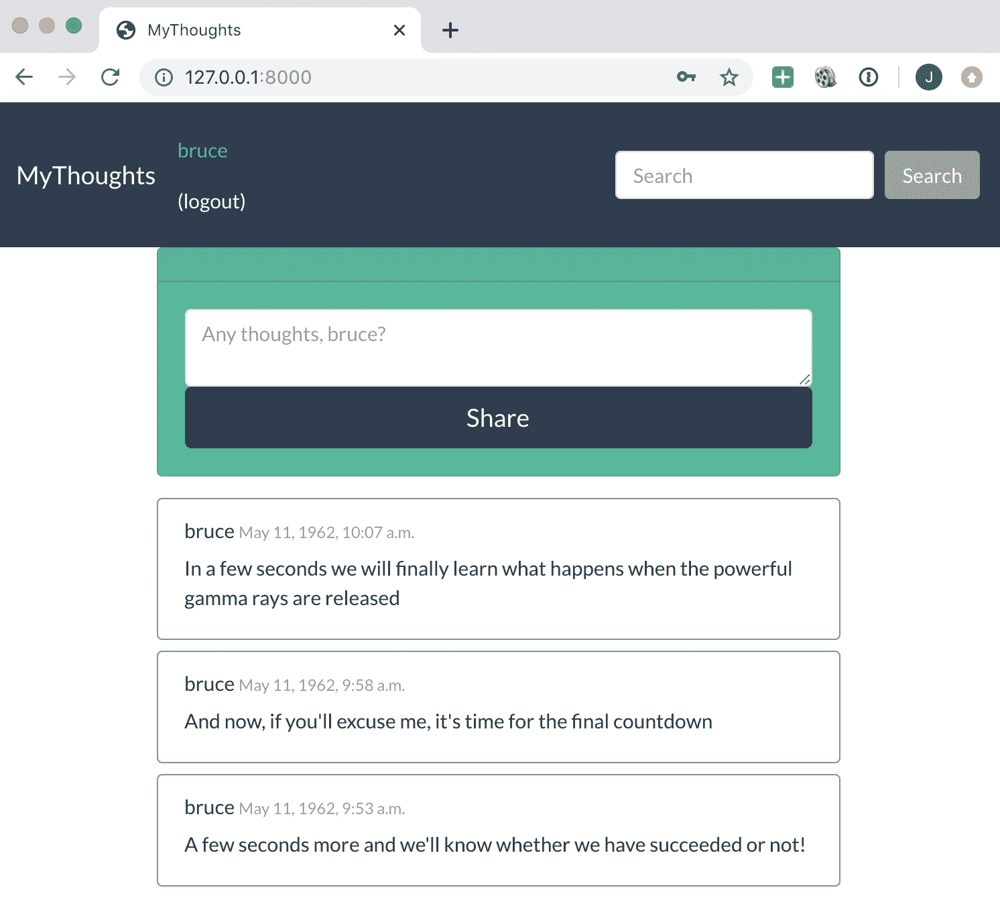
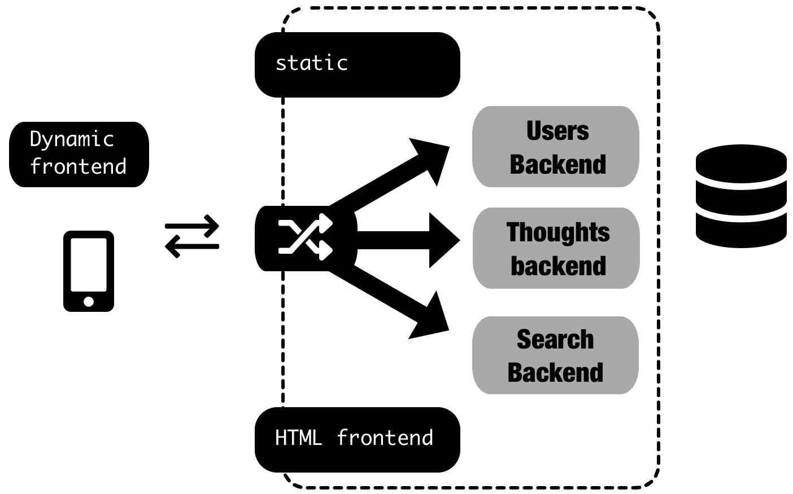
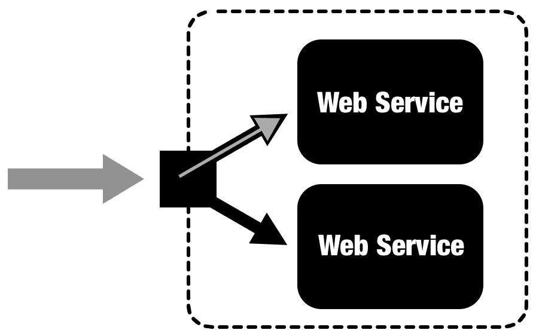

# 行动起来——设计、规划和执行

随着 web 服务变得越来越复杂，软件服务公司的规模越来越大，我们需要新的工作方式来适应和加快变化的速度，同时建立高质量的标准。微服务架构已经成为控制大型软件系统的最佳工具之一，由容器和编排器等新工具支持。我们将首先介绍传统整体架构和微服务架构之间的差异，以及转向后者的优势。我们将介绍如何构建架构迁移，以及如何计划在这个困难的过程中取得成功。

在这本书里，我们将讨论 web 服务器服务，尽管有些想法可以用于其他类型的软件应用程序，显然是通过修改它们。整体/微服务架构与操作系统设计中的整体/微内核讨论有一些相似之处，包括早在 1992 年莱纳斯·托瓦尔兹和安德鲁·s·塔南鲍姆之间著名的辩论([https://www.oreilly.com/openbook/opensources/book/appa.html](https://www.oreilly.com/openbook/opensources/book/appa.html))。这一章是相对不可知的工具，而接下来的章节将介绍具体的工具。

本章将涵盖以下主题:

*   传统的整体方法及其问题
*   微服务方法的特点
*   并行部署和开发速度
*   挑战和危险信号
*   分析当前系统
*   通过测量使用情况进行准备和调整
*   打破整体的战略规划
*   执行移动

在这一章的最后，您将熟悉我们将在整本书中使用的基本概念，在迁移到微服务的过程中如何继续和构建工作的不同策略，以及我们将在其余章节中研究的一个实际例子。

# 技术要求

本章不关注具体的技术，而是采用一种更不可知的方法。我们将讨论 Python Django 应用程序作为我们的整体示例。

整体的例子可以在以下网址找到:https://github . com/PacktPublishing/动手操作-Python 微服务-Docker/tree/master/chapter 01/整体。安装和运行说明可在其`README.md`文件中找到。

# 传统的整体方法及其问题

当开发一个系统时，软件的传统方法是创建一个整体。这是一个奇特的词来形容*一个单一的元素，包含一切*，这是几乎每个项目开始的方式。在 web 应用程序的上下文中，这意味着创建可复制的可部署代码，以便将请求定向到任何已部署的副本:


毕竟，每个项目都会从小处着手。早期进行严格的划分是不方便的，甚至是没有意义的。新创建的项目很小，可能由一个开发人员来处理。虽然设计可以适合少数人的头脑，但在系统的各个部分之间建立严格的界限会适得其反。

There are a lot of options for running a web service, but one will typically consist of one or more servers (physical boxes, virtual machines, and cloud instances such as EC2 and more)  running a  web server application (such as NGINX or Apache) to direct requests directed to HTTP port `80` or HTTPS port `443` toward one or more Python workers (normally, through the WSGI protocol), run by `mod_wsgi`—[https://github.com/GrahamDumpleton/mod_wsgi](https://github.com/GrahamDumpleton/mod_wsgi) (Apache only), uWSGI, GNUnicorn, and so on.

If more than one server is used, there will be a load balancer to spread the load among them. We'll talk about them later in this chapter. The server (or load balancer) needs to be accessible on the internet, so it will have a dedicated DNS and a public IP address.

In other programming languages, the structure will be similar: a frontend web server that exposes the port in HTTP/HTTPS, and a backend that runs the monolith code in a dedicated web worker. 

但是事情变了，成功的软件成长了，一段时间后，拥有一大堆代码可能不是构建一个大项目的最佳方式。

无论如何，单片可以有内部结构，这意味着它们不一定进入意大利面代码的领域。它可能是结构完美的代码。整体的定义是需要将系统作为一个整体来部署，而不能进行部分部署。

Spaghetti code is a common way of referring to code that lacks any structure and is difficult to read and follow.

随着整体的增长，它的一些局限性将开始显现:

*   **代码会变大**:如果模块之间没有严格的界限，开发人员会开始在理解整个代码库时出现问题。虽然良好的实践可以有所帮助，但复杂性自然会增加，使得以某些方式更改代码变得更加困难，并增加了微妙的 bug。运行所有测试将变得缓慢，降低任何持续集成系统的速度。
*   **资源的低效利用**:每个单独部署的 web worker 将需要整个系统工作所需的所有资源，例如，任何一种请求的最大内存量，即使一个需要大量内存的请求很少，只有几个 worker 就足够了。CPU 也可能发生同样的情况。如果单块连接到一个数据库，每个工人都需要连接到它，不管它是否经常使用，等等。
*   **开发可扩展性问题**:即使系统被完美设计为横向可扩展(可以无限增加新的工作人员)，随着系统的增长和开发团队的壮大，不踩对方的脚趾头，开发也会越来越难。一个小团队很容易协调，但是一旦几个团队在同一个代码库上工作，冲突的概率就会增加。除非执行严格的纪律，否则在所有权和责任方面给团队强加界限也会变得模糊。无论如何，团队需要积极协调，这降低了他们的独立性和速度。
*   **部署限制**:部署方法需要跨团队共享，团队不能单独负责每个部署，因为部署可能会涉及多个团队的工作。部署问题会使整个系统瘫痪。
*   **技术的相互依赖性**:任何新技术都需要与整体中使用的技术相适应。例如，一项新技术，一个完美解决特定问题的工具，由于技术的不匹配，可能很难添加到整体中。更新依赖项也会导致问题。例如，Python 新版本(或子模块)的更新需要使用整个代码库。一些必要的维护任务，如安全补丁，可能会导致问题，因为单块已经使用了库的特定版本，如果更改，该版本将会崩溃。适应这些变化也需要额外的工作。
*   **系统一小部分的 bug 可以拖垮整个服务**:由于服务是一个整体，任何影响稳定性的关键问题都会影响到一切，难以产生优质的服务策略或造成降级的结果。

正如你在例子中看到的，大部分的整体问题都是不断增长的问题。除非系统有相当大的代码库，否则它们并不真正重要。有些东西在单片中工作得非常好，例如，因为代码中没有边界，所以代码可以非常快速有效地更改。但是随着团队的成长，越来越多的开发人员在系统中工作，边界有助于定义目标和责任。从长远来看，过多的灵活性会成为一个问题。

# 微服务方法的特点

整块的方法一直有效，直到它不起作用为止。但是，有什么选择呢？这就是微服务架构进入场景的地方。

遵循微服务架构的系统*是松散耦合的专业服务的集合，这些服务协同工作以提供全面的服务*。让我们用更具体的术语来划分一下定义:

1.  专门服务的集合，意味着有不同的、定义良好的模块。
2.  **松散耦合**，意味着每个微服务都可以独立部署。
3.  **协同工作**—每个微服务都能够与其他人通信。
4.  提供全面的服务，因为我们的微服务系统将需要复制使用整体方法提供的相同功能。它的设计背后有一个意图。

与上图相反，微服务体系结构如下所示:


每个外部请求将被引导至**微服务 A** 或**微服务 B** ，每个微服务专门处理特定类型的请求。在某些情况下，**微服务 B** 与**微服务 C** 通信，不能直接从外部获得。请注意，每个微服务可能有多个工作人员。

这种架构有几个优点和含义:

1.  如果微服务之间的通信是通过标准协议完成的，那么每个微服务都可以用不同的语言进行编程。

Throughout the book, we will use HTTP requests with data encoded in JSON to communicate between microservices. Though there are more options, this is definitively the most standard and widely-used option, as virtually every widely-used programming language has good support for it.

这在专门的语言对于专门的问题是理想的情况下非常有用，但是限制它的使用以便它被包含，而不需要公司的剧烈变化。

2.  更好的资源利用率——如果**微服务 A** 需要更多内存，我们可以减少工作副本的数量。虽然在一个整体上，每个工作人员需要最大限度的资源分配，但现在每个微服务只使用整个系统中其部分所需的资源。例如，可能其中一些不需要连接到数据库。每个单独的元素都可以被调整，甚至可能在硬件级别。
3.  每个服务都比较小，可以独立处理。这意味着需要维护的代码行更少，构建更快，设计更简单，需要维护的技术债务更少。服务之间不存在依赖性问题，因为每个服务都可以按照自己的速度定义和移动它们。执行重构可以以更可控的方式完成，因为它们不会影响整个系统。此外，每个微服务都可以改变它所使用的编程语言，而不会影响其他微服务。

From a certain point of view, the microservices architecture is similar to the UNIX philosophy, applied to web services: write each program (service) to do one thing and do it well, write programs (services) to work together and write programs (services) to handle text streams (HTTP calls), because that is a universal interface.

4.  一些服务可以对外部访问隐藏。比如**微服务 C** 只被其他服务调用，不对外调用。在某些情况下，这可以提高安全性，减少敏感数据或服务的攻击面。
5.  由于系统是独立的，一个系统中的稳定性问题不会完全停止系统。这减少了关键响应，并限制了灾难性故障的范围。
6.  每个服务都可以由不同的开发人员独立维护。这允许并行开发和部署，增加了公司可以完成的工作量。这要求公开的 API 向后兼容，我们将在后面描述。

# Docker 容器

微服务架构对于支持它的平台是相当不可知的。它可以部署在专用数据中心、公共云中的旧物理盒上，也可以以容器形式部署。

但是，有一种趋势是使用容器来部署微服务。容器是一个打包的软件包，它封装了运行所需的一切，包括所有的依赖关系。它只需要一个兼容的操作系统内核就可以自主运行。

Docker 是 web 应用程序容器的主角。它有一个极其活跃的社区来支持它，也有很好的工具来处理各种操作。我们将学习如何使用 Docker 工作和操作。

我第一次使用 Docker 容器时，它们在我看来就像一种*轻型虚拟机*；不需要模拟硬件运行的小型操作系统。但是过了一会儿，我意识到这不是正确的方法。

描述容器的最佳方式是将*想象成一个被自己的文件系统*包围的进程。你运行一个进程(或者几个相关的进程)，它们*看到*一个完整的文件系统，不被任何人共享。

这使得容器极其便携，因为它们与底层硬件和运行它们的平台是分离的；它们非常轻量级，因为只需要包含最少量的数据，而且它们是安全的，因为容器暴露的攻击面非常小。您不需要应用程序像在传统服务器(如`sshd`服务器)或配置工具(如 Puppet)上一样管理它们。它们是专门设计的，体积小，用途单一。

In particular, try to keep your containers small and single-purpose. If you end up adding several daemons and a lot of configuration, it's likely that you are trying to include too much; maybe you need to split it into several containers.

使用 Docker 容器有两个步骤。首先，我们构建容器，在文件系统上执行一层又一层的更改，例如添加将要执行的软件和配置文件。然后，我们执行它，启动它的主命令。我们将在[第 3 章](03.html)、*服务文档化*中看到如何做到这一点。

微服务架构非常符合 Docker 容器的一些特征——通过 HTTP 调用进行通信的小型、单一用途的元素。这就是为什么，尽管这不是一个硬性要求，但这些天它们通常会一起出现。

十二因素应用原则([https://12factor.net/](https://12factor.net/))是开发网络应用程序中已被证明成功的实践的集合，也非常符合 Docker 容器和微服务架构。Docker 非常容易遵循其中的一些原则，我们将在本书的后面对它们进行深入的评论。

An important factor for dealing with containers is that containers should be stateless (Factor VI—[https://12factor.net/processes](https://12factor.net/processes)). Any state needs to be stored in a database and each container stores no persistent data. This is one of the key elements for scalable web servers that, when dealing with a couple of servers, may not be done. Be sure to keep it in mind.

Docker 的另一个优势是有很多现成的容器。docker Hub([https://hub.docker.com/](https://hub.docker.com/))是一个公共注册中心，里面充满了有趣的容器，可以在开发或生产中继承或直接使用。这有助于您为自己的服务提供示例，并快速创建几乎不需要配置的小型服务。

# 容器编排和 Kubernetes

虽然 Docker 介绍了如何处理每个单独的微服务，但是我们需要一个协调器来处理整个服务集群。为此，我们将在整本书中使用库本内特斯([https://kubernetes.io/](https://kubernetes.io/))。这是主要的编排项目，它得到了主要云供应商的大力支持。我们将在[第 5 章](05.html)、*中详细讨论使用 Kubernetes 来协调微服务*。

# 并行部署和开发速度

最重要的因素是独立部署的能力。创建成功的微服务系统的第一条规则是确保每个微服务能够尽可能独立于其他微服务运行。这包括开发、测试和部署。

这是允许不同团队之间并行开发的关键因素，允许他们扩展工作。这增加了复杂系统的变化速度。

负责特定微服务的团队需要能够部署新版本的微服务，而不中断任何其他团队或服务。目标是增加部署的数量和速度。

The microservice architecture is strongly related to Continuous Integration and Continuous Deployment principles. Small services are easy to keep up to date and to continuously build, as well as to deploy without interruption. In that regard, a CI/CD system tends to be microservices due to the increase in parallelization and the speed of delivery.

由于部署微服务对于依赖服务来说应该是透明的，因此应该特别注意向后兼容性。一些变更需要升级并与其他团队协调，以在不中断系统的情况下移除旧的、不正确的功能。

虽然从理论上讲，完全断开服务是可能的，但在实践中这是不现实的。有些服务之间会有依赖关系。微服务系统会强迫你定义服务之间的强边界，任何需要跨服务通信的特性都会带来一些开销，甚至可能需要跨不同团队协调工作。

当转移到微服务架构时，这种转移不仅仅是技术上的，还意味着公司工作方式的巨大变化。微服务的开发将需要自主性和结构化的通信，这需要在规划系统的总体架构时付出额外的努力。在单块系统中，这可能是临时的，可能已经演变成一个不那么分离的内部结构，增加了混乱的代码和技术债务的风险。

The need to clearly communicate and define owners cannot be stressed enough. Aim to allow each team to make their own decisions about their code and formalize and maintain the external APIs where other services depend on them.

然而，这种额外的规划增加了长期交付带宽，因为团队能够做出更自主的决策，包括大型决策，如使用哪种操作系统或哪种编程语言，但也包括无数小型决策，如使用第三方包、框架或模块结构。这加快了日常运营的发展速度。

微服务也可能影响团队在组织中的结构。一般来说，现有的团队应该受到尊重。他们会有非常有用的专业知识，引发一场彻底的革命将会打破这种局面。但是一些调整可能是必要的。一些概念，比如理解 web 服务和 RESTful 接口，需要出现在每个微服务中，以及如何部署自己的服务的知识。

A traditional way of dividing teams is to create an operations team that is in charge of infrastructure and any new deployments because they are the only ones allowed to have access to the production servers. The microservices approach interferes with this as it needs teams to be able to have control over their own deployments. In [Chapter 5](05.html), *Using Kubernetes to Coordinate Microservices*, we'll see how using Kubernetes helps in this situation, detaching the maintenance of the infrastructure from the deployment of services.

它还允许创造一种强烈的主人翁意识，因为团队被鼓励在他们自己的王国里以他们自己喜欢的方式工作，同时他们在明确定义和结构化的边界内与其他团队一起玩游戏。微服务架构可以允许在系统的小部分进行实验和创新，一旦得到验证，就可以在整个系统中传播。

# 挑战和危险信号

我们已经讨论了微服务架构相对于整体架构的许多优势，但是迁移是一项不可低估的巨大任务。

系统以单片开始，因为它更简单，并且允许在小代码库中更快的迭代。在任何一家新公司，旋转和改变代码，寻找一个成功的商业模式是至关重要的。这比清晰的结构和建筑分隔更有优势——这是应该的方式。

然而，一旦系统成熟，公司就会成长。随着越来越多的开发人员参与进来，整体的优势开始变得不那么明显，对长期战略和结构的需求变得更加重要。更多的结构并不一定意味着向微服务架构发展。一个结构良好的整体可以实现很多目标。

转向微服务也有其自身的问题。其中一些如下:

1.  迁移到微服务需要付出大量努力，积极改变组织的运营方式，并且需要大量投资，直到开始有回报。过渡可能是痛苦的，因为需要务实的方法，需要做出妥协。它还将涉及大量设计文档和会议来规划迁移，所有这些都是在业务继续运营的同时进行的。这需要充分的投入和对所涉及内容的理解。
2.  不要低估文化的变化——组织是由人组成的，人们不喜欢变化。微服务的许多变化都与不同的操作方式和不同的做事方式有关。虽然这赋予了不同的团队权力，但也迫使他们澄清自己的接口和 API，并正式确定通信和边界。这可能会导致团队成员的沮丧和抵制。

There's an adage called Conway's law ([http://www.melconway.com/Home/Conways_Law.html](http://www.melconway.com/Home/Conways_Law.html)) that states that *organizations which design systems are constrained to produce designs which are copies of the communication structures of these organizations.* For microservices, this means that divisions between teams should reflect the different services. Having multiple teams working in the same microservice will blur the interfaces. We will discuss Conway's law in detail in [Chapter 12](12.html), *Collaborating and Communicating across Teams*.

3.  学习工具和程序也有一个学习曲线。管理集群的方式不同于单个整体，开发人员需要了解如何在本地测试中互操作不同的服务。同样，这种部署也将不同于传统的本地开发。特别是，学习 Docker 需要一些时间来适应。做好相应的计划，并向所有相关人员提供支持和培训。

4.  调试跨服务移动的请求比调试单一系统更困难。监控请求的生命周期是很重要的，一些细微的错误在开发中很难复制和修复。

5.  将一个整体分成不同的服务需要仔细考虑。一条不好的分割线会让两个服务紧密耦合，不允许独立部署。这种情况下的一个危险信号意味着几乎任何对一个服务的改变都需要对另一个服务的改变，即使它通常可以独立完成。这造成了工作的重复，因为常规的单一功能工作需要更改和部署多个微服务。微服务可以在以后变异，重新定义边界，但是这是有代价的。在添加新服务时，也应该同样小心。
6.  创建微服务会有开销，因为有些工作会在每个服务上复制。这种开销通过允许独立和并行开发得到补偿。但是，要充分利用这一点，你需要数字。一个多达 10 人的小型开发团队可以非常高效地协调和处理一个整体。只有当规模增长和独立团队形成时，迁移到微服务才开始有意义。公司越大，越有意义。
7.  自由和允许每个团队做出自己的决定以及标准化一些共同的元素和决定之间的平衡是必要的。如果团队的方向太少，他们会一遍又一遍地重新发明轮子。他们还会最终形成知识孤岛，公司某个部门的知识对另一个团队来说是完全不可转移的，使得集体学习课程变得困难。团队之间需要稳固的沟通，以便达成共识并重用共同的解决方案。允许有控制的实验，给它贴上这样的标签，并全面吸取经验教训，以便其他团队受益。共享的、可重用的想法和独立的、多实现的想法之间会有矛盾。

Be careful when introducing shared code across services. If the code grows, it will make services dependent on each other. This can reduce the independence of the microservices.

8.  遵循敏捷原则，我们知道工作软件比大量文档更重要。然而，在微服务中，最大化每个单个微服务的可用性以减少团队之间的支持量是很重要的。这涉及到一定程度的文档。最好的方法是创建自我记录的服务。我们将在本书后面看一些关于如何使用工具来记录如何用最少的努力使用服务的例子。
9.  对另一个服务的每次调用，例如内部微服务之间的相互调用，都会增加响应的延迟，因为需要涉及多个层。这会产生延迟问题，外部响应需要更长时间。它们还会受到连接微服务的内部网络的性能和容量的影响。

迁移到微服务应该小心谨慎，并仔细分析其利弊。在成熟的系统中完成迁移可能需要数年时间。但是对于一个大系统来说，由此产生的系统将更加敏捷和易于更改，允许您有效地解决技术债务，并授权开发人员完全拥有和创新，构建通信并提供高质量、可靠的服务。

# 分析当前系统

正如我们之前定义的，从单块迁移到微服务集合的第一步是理解当前的系统。这个阶段不容小觑。很可能没有一个人对整块石头的不同组成部分有很好的理解，尤其是如果有些部分是遗留下来的。

此阶段的目标是确定对微服务的更改是否真正有益，并初步了解迁移的结果是什么。正如我们已经讨论过的，采取行动是一项巨大的投资，不应该掉以轻心。在这个阶段不可能对所需的工作量进行详细的评估；在这一点上，不确定性会很大，但千里之行始于足下。

所涉及的努力将在很大程度上取决于整块石头的结构。这可能会有所不同，从一堆没有太多方向的有机增长的意大利面条代码，到一个结构良好的模块化代码库。

我们将在这本书中使用一个示例应用程序——一个名为 MyThoughts 的微博网站，一个允许我们发布和阅读短信或想法的简单服务。该网站允许我们登录，发布新的想法，查看我们的想法，并在系统中搜索想法。



作为第一步，我们将画出整块建筑的建筑图。将当前系统简化为相互作用的块列表。

The code for our example is available here: [https://github.com/PacktPublishing/Hands-On-Docker-for-Microservices-with-Python/tree/master/Chapter01/Monolith](https://github.com/PacktPublishing/Hands-On-Docker-for-Microservices-with-Python/tree/master/Chapter01/Monolith). It is a Django application that uses Bootstrap for its HTML interface. See the `README` for instructions on how to run it.

在我们的示例中，下面的图表描述了 MyThoughts 模型:


如您所见，整块似乎遵循模型视图控制器结构([https://www.codecademy.com/articles/mvc](https://www.codecademy.com/articles/mvc)):

Django uses a structure called Model Template View, which follows a similar pattern to the MVC one. Read the article at [https://medium.com/shecodeafrica/understanding-the-mvc-pattern-in-django-edda05b9f43f](https://medium.com/shecodeafrica/understanding-the-mvc-pattern-in-django-edda05b9f43f) for more information. Whether it's 100% MCV or not is debatable. Let's not get stuck on semantics, but use the definition as a starting point to describe the system.

*   有三个实体存储在数据库中，并通过模型访问:用户、想法和会话模型。会话用于跟踪登录。
*   用户可以通过`login.py`中的代码登录和退出来访问网站。如果用户登录，将创建一个会话，允许用户查看网站的其余部分。

Please note that the handling of authentication and passwords in this example is for demonstration purposes only. Use the default mechanisms in Django for more secure access. It's the same for the session, where the native session management is not used.

*   用户可以看到自己的想法。在同一页，有一个新的形式，创造了一个新的想法。这由`thoughts.py`文件处理，该文件通过`ThoughtModel`检索并存储思想。
*   为了搜索其他用户的想法，有一个搜索栏连接到`search.py`模块，并返回获得的值。
*   HTML 通过`login.html`、`search.html`、`list_thoughts.html`和`base.html`模板呈现。
*   除此之外，网站还有静态资产。

这个例子非常简单，但是我们能够看到一些相互依赖的关系:

*   静态数据非常孤立。它可以在任何时候进行更改，而不需要在其他任何地方进行任何更改(只要模板与 Bootstrap 兼容)。
*   搜索功能与列出想法密切相关。模板相似，信息的显示方式也相同。
*   登录和注销不与`ThoughtModel` *交互。*他们编辑会话，但应用程序的其余部分只读取那里的信息。
*   `base.html`模板生成顶栏，用于所有页面。

分析之后，我想到了一些关于如何进行的想法:

1.  就让它保持原样，投资构建它，但不要把它分成几个服务。它已经有了一定的结构，虽然有些部分还可以改进。例如，处理用户是否登录可能会更好。这显然是一个小例子，在现实生活中，将其拆分成微服务会有很大的开销。请记住，坚持一个整体可能是一个可行的策略，但如果你这样做了，请投入时间清理代码和支付技术债务。

2.  寻找想法是非常基本的。此刻，我们直接搜索数据库。如果有数百万个想法，这将不是一个可行的选择。`search.py`中的代码可以调用特定的搜索微服务，由搜索引擎支持，如 Solr([https://lucene.apache.org/solr/](https://lucene.apache.org/solr/))或 elastic search([https://www.elastic.co/products/elasticsearch](https://www.elastic.co/products/elasticsearch))。这将扩大搜索范围，并可增加诸如在日期之间搜索或显示匹配文本等功能。搜索也是只读的，因此将创建新想法的呼叫从搜索它们的呼叫中分离出来可能是个好主意。
3.  认证也是一个不同于读写思维的问题。拆分它将使我们能够跟踪新的安全问题，并有一个专门处理这些问题的团队。从应用程序其余部分的角度来看，它只要求您有一些可用的东西来检查用户是否登录，并且可以在模块或包中进行委托。
4.  目前前端相当稳定。也许我们想创建一个单页应用程序，调用一个后端应用编程接口来呈现客户端的前端。为此，需要创建一个能够返回用于思考和搜索的元素的 RESTful API 微服务。前端可以用 JavaScript 框架编码，比如 Angular([https://Angular . io](https://angular.io))或者 React([https://reactjs.org/](https://reactjs.org/))。在这种情况下，新的微服务将是前端，它将作为静态的预编译代码，并将从后端获取。
5.  RESTful 应用编程接口后端也将允许外部开发人员在 MyThoughts 数据的基础上创建自己的工具，例如，创建一个本地手机应用程序。

这些只是一些想法，需要讨论和评估。你的单体应用有哪些具体的痛点？路线图和战略未来是什么？现在或未来最重要的点和特点是什么？也许，对于一家公司来说，拥有强大的安全性是优先事项，第 3 点至关重要，但对于另一家公司来说，第 5 点可能是与合作伙伴合作的扩展模式的一部分。

团队的结构也很重要。第 4 点将需要一个具有良好前端和 JavaScript 技能的团队，而第 2 点可能涉及后端优化和数据库工作，以允许高效搜索数百万条记录。

Do not jump too quickly to conclusions here; think about what capacity is viable and what your teams can achieve. As we discussed before, the change to microservices requires a certain way of working. Check with the people involved for their feedback and suggestions.

经过一些考虑，对于我们的示例，我们提出了以下潜在的体系结构:



该系统将分为以下模块:

1.  **用户后端:**这将负责所有身份验证任务，并保存用户的相关信息。它会将其数据存储在数据库中。
2.  **思想后端:**这将创建并存储*思想*。
3.  **搜索后端**:这将允许搜索*的想法*。
4.  将任何请求路由到适当后端的代理。这需要外部访问。
5.  **HTML 前端:**这将复制当前的功能。这将确保我们以向后兼容的方式工作，并确保过渡能够顺利进行。
6.  允许客户端访问后端将允许创建除我们的 HTML 前端之外的其他客户端。将创建一个动态前端服务器，并与一家外部公司就创建一个移动应用程序进行谈判。
7.  **静态资产:**能够处理静态文件的网络服务器。这将为 HTML 前端提供样式，为动态前端提供索引文件和 JavaScript 文件。

这种架构需要适应现实生活中的使用；为了验证它，我们需要测量现有的使用情况。

# 通过测量使用情况进行准备和调整

显然，任何现实世界的系统都会比我们的例子更复杂。代码分析仅仅通过仔细查看就能发现的东西是有限度的，而且计划在与现实世界的接触中往往无法存活。

任何部门都需要得到验证，以确保它会有预期的结果，并且努力是值得的。因此，请仔细检查系统是否按照您认为的方式工作。

了解实时系统如何工作的能力被称为**可观测性**。它的主要工具是度量和日志。您会发现的问题是，它们通常会被配置为反映外部请求，而不会给出关于内部模块的信息。我们将在 [第 10 章](10.html)*监控日志和指标*中深入讨论系统的可观测性。您可以参考它了解更多信息，并在此阶段应用那里描述的技术。

If your system is a web service, by default, it will have activated its access log. This will log each HTTP request that comes into the system and store the URL, result, and time when it happens. Check with your team where these logs are located, as they will provide good information on what URLs are being called.

然而，这种分析可能只给出关于被调用的外部端点是什么的信息，但不会说太多关于根据我们的计划将被分成不同微服务的内部模块的信息。请记住，迁移到微服务的长期成功最重要的因素是允许团队独立。如果您在不断需要统一更改的模块之间进行划分，部署就不会真正独立，并且在过渡之后，您将被迫使用两个紧密耦合的服务。

Be careful, in particular, about making a microservice that's a dependency for every other service. Unless the service is extremely stable, that will make frequent updates likely when any other service requires a new feature.

为了验证新的微服务不会紧密耦合，让团队意识到这些划分，以及他们必须多久改变一次围绕它们的接口。监控这些变化几周，以确保分割线是稳定的，不需要不断变化。如果微服务之间的接口被非常积极地改变，任何特性都需要在几个服务中进行多次改变，这将减缓交付新特性的速度。

在我们的示例中，在分析了建议的体系结构后，我们决定简化设计，如下图所示:


在监控和与团队讨论后，已经决定了一些变更:

1.  这些团队对 JavaScript 动态编程没有很好的了解。在转向微服务的同时，对前端的改变被认为风险太大。
2.  另一方面，外部移动应用程序被视为公司的一项战略举措，使外部可访问的应用编程接口成为一项可取的举措。
3.  分析日志，似乎不经常使用搜索功能。搜索数量的增长很小，将搜索分成自己的服务需要与思想后端协调，因为这是一个积极发展的领域，并增加了新的领域。决定在思想后端下继续搜索，因为两者都使用相同的思想。
4.  用户后端受到了好评。它将允许通过明确谁负责修补安全漏洞和改进服务来提高身份验证的安全性。其余的微服务必须独立工作，由用户后端进行验证，这意味着负责这个微服务的团队需要创建和维护一个包，其中包含如何验证请求的信息。

一旦我们决定了最终状态，我们仍然必须决定如何从一个状态转移到另一个状态。

# 打破整体的战略规划

正如我们之前所讨论的，从初始状态到期望状态将是一个缓慢的过程。不仅因为它涉及到新的做事方式，还因为它将与“一切照旧”的其他特性和开发并行发生。实事求是，公司的经营活动不会停止。这就是为什么应该有一个计划来允许一个州和另一个州之间的平稳过渡。

This is known as the **strangler pattern** ([https://docs.microsoft.com/en-us/azure/architecture/patterns/strangler](https://docs.microsoft.com/en-us/azure/architecture/patterns/strangler))—replacing parts of a system gradually until the old system is "strangled" and can be removed safely.

对于采取何种技术方法进行迁移以及如何划分每个元素以迁移到新系统，有几种选择:

*   替换方法，用新服务从头开始编写的新代码替换旧代码
*   divide 方法，即挑选现有代码并将其移入自己的新服务中
*   两者的结合

让我们更好地看看他们。

# 替代方法

服务被大块替换，只考虑它们的外部接口或影响。这种黑盒方法用从头开始的替代方法完全取代了现有的功能编码。一旦新代码准备好了，它就会被激活，旧系统中的功能就会被弃用。

请注意，这不是指取代整个系统的单一部署。这可以一部分一部分地完成。这种方法的基础是它创建了一个新的外部服务，旨在取代旧的系统。

这种方法的优点是，它极大地有助于构建新服务，因为它不继承技术债务，并且允许事后重新审视旧问题。

新的服务还可以使用新的工具，并且不需要继续使用任何与公司未来技术方向的战略观点不一致的旧堆栈。

这种方法的问题在于，成本可能很高，而且可能需要很长时间。对于没有文档记录的旧服务，替换它们可能需要很大的努力。此外，这种方法只能应用于稳定的模块；如果它们被积极开发，试图用其他东西来代替它们会一直移动门柱。

这种方法对于旧的遗留系统来说最有意义，这些遗留系统很小，或者至少有一小部分执行有限的功能，并且是在旧的技术堆栈中开发的，这很难或者不再被认为是值得维护的。

# 分割方法

如果系统结构良好，也许它的某些部分可以干净地分成自己的系统，保持相同的代码。

在这种情况下，创建一个新服务更多的是一个复制粘贴的练习，用最少的代码量包装它，以允许它独立执行并与其他系统互操作，换句话说，围绕 HTTP 请求构建它的应用编程接口，以获得一个标准接口。

如果可以使用这种方法，这意味着代码已经非常结构化了，这是一个好消息。

被调用到这个部分的系统也必须进行调整以进行调用，不是内部代码，而是通过 HTTP 调用。好的一面是，这可以通过几个步骤来完成:

1.  将代码复制到自己的微服务中并部署它。
2.  旧的调用系统正在使用旧的嵌入式代码。
3.  迁移呼叫并检查系统是否正常工作。
4.  迭代，直到所有旧调用都迁移到新系统。
5.  从旧系统中删除分割的代码。

如果代码的结构不够清晰，我们需要先修改它。

# 变革和结构化方法

如果整体是有机增长的，它不可能所有的模块都是干净的结构。有些结构可能存在，但它们可能不是我们想要的微服务部门的正确结构。

为了调整服务，我们需要进行一些内部更改。这些内部变化可以反复进行，直到服务可以被干净地划分。

这三种方法可以结合起来生成完整的迁移。每一个涉及的工作是不一样的，因为一个容易分割的服务将能够比替换记录不良的遗留代码更快。

在项目的这个阶段，目标是有一个清晰的路线图，它应该分析以下要素:

*   什么样的微服务将首先可用的有序计划，考虑如何处理依赖性。
*   了解最大的痛点是什么，以及解决这些痛点是否是优先事项。痛点是经常处理的元素，当前处理整块的方式使它们变得困难。
*   有哪些难点和易拉罐虫？很可能会有一些。承认它们的存在，并尽量减少它们对其他服务的影响。请注意，它们可能与痛点相同，也可能不同。难点可能是非常稳定的旧系统。
*   几个速战速决将保持项目的势头。快速向您的团队和利益相关者展示优势！这也将让每个人都了解你想要转向的新运作模式，并开始以这种方式工作。
*   关于团队需要的培训以及您想要引入的新要素的想法。此外，无论你的团队中是否缺乏任何技能，你都有可能计划雇佣。
*   任何团队变更和新服务的所有权。考虑团队的反馈很重要，这样他们就可以表达对计划创建过程中任何疏忽的担忧。

对于我们的具体示例，最终计划如下:

*   作为先决条件，负载平衡器需要在操作之前。这将负责将请求引导到适当的微服务。然后，改变这个元素的配置，我们将能够将请求路由到旧的单块或任何新的微服务。
*   之后，静态文件将通过自己独立的服务进行服务，这是一个很容易的改变。静态 web 服务器就足够了，尽管它将作为独立的微服务进行部署。这个项目将有助于理解向 Docker 的转移。
*   身份验证代码将在新服务中复制。它将使用一个 RESTful API 来登录和生成一个会话，以及注销。该服务将负责检查用户是否存在，以及添加和删除他们:
    *   第一个想法是检查针对服务检索的每个会话，但是，鉴于检查会话是一个非常常见的操作，我们决定生成一个包，在面向外部的微服务之间共享，这将允许检查是否已经使用我们自己的服务生成了会话。这将通过对会话进行加密签名并在我们的服务中共享秘密来实现。这个模块预计不会经常改变，因为它是所有微服务的依赖项。这使得会话成为不需要存储的会话。
    *   用户后端需要能够允许使用 OAuth 2.0 模式进行身份验证，这将允许不基于网络浏览器的其他外部服务进行身份验证和操作，例如移动应用程序。
*   思想后端也将被复制为一个 RESTful 应用编程接口。这个后端目前非常简单，它将包括搜索功能。
*   在两个后端都可用之后，当前的整体将被改变，从直接调用数据库，变成使用后端的 RESTful APIs。成功完成后，旧的部署将被 Docker 构建替换并添加到负载平衡器中。
*   新的应用编程接口将从外部添加到负载平衡器，并提升为可从外部访问。制造移动应用的公司将开始整合他们的客户。

我们的新架构模式如下:


请注意，HTML 前端将使用外部可用的相同 API。这将验证这些调用是否有用，因为我们将首先将它们用于我们自己的客户端。

这个行动计划可以有可衡量的时间和时间表。也可以采用一些技术选项，在我们的案例中，如下所示:

*   每个微服务都将部署在自己的 Docker 容器中([https://www.docker.com/](https://www.docker.com/))。我们将建立一个 Kubernetes 集群来协调不同的服务。
*   我们决定在 Flask([https://palletsprojects.com/p/flask/](https://palletsprojects.com/p/flask/))中创建新的后端服务，使用 Flask-RESTPlus([https://flask-restplus.readthedocs.io/en/stable/](https://flask-restplus.readthedocs.io/en/stable/))来生成一个文档齐全的 RESTful 应用程序，并使用 SQLAlchemy([https://www.sqlalchemy.org/](https://www.sqlalchemy.org/))连接到现有数据库。这些工具是 Python，但采用的方法比 Django 更简单。
*   后端服务将使用 uWSGI 服务器([https://uwsgi-docs.readthedocs.io/en/latest/](https://uwsgi-docs.readthedocs.io/en/latest/))提供。
*   静态文件将使用 NGINX([https://www.nginx.com/](https://www.nginx.com/))提供。
*   NGINX 还将用作负载平衡器来控制输入。
*   HTML 前端将继续使用 Django([https://www.djangoproject.com/](https://www.djangoproject.com/))。

团队可以继续使用这些技术堆栈，并期待学习一些新技巧！

# 执行移动

最后一步是执行精心设计的计划，开始从过时的整块石头转移到微服务的新乐土！

但这一阶段的旅程实际上可能是最长和最困难的——尤其是如果我们希望保持服务运行，并且不发生中断业务的中断。

这个阶段最重要的想法是**向后兼容**。这意味着从外部角度来看，该系统仍像旧系统一样运行。如果我们能够做到这一点，我们就可以透明地改变我们的内部运营，同时我们的客户能够不间断地继续他们的运营。

这显然说起来容易做起来难，有时被称为用福特 T 开始比赛，用法拉利结束比赛，不停地更换每一个零件。好消息是，软件是如此绝对灵活和可延展，以至于它实际上是可能的。

# Web 服务最好的朋友——负载平衡器

负载平衡器是一种工具，允许在几个后端资源之间分发 HTTP 请求(或其他类型的网络请求)。

负载平衡器的主要操作是允许将流量定向到一个地址，并在几个相同的后端服务器之间进行分配，这样可以分散负载并实现更好的吞吐量。通常，流量将通过循环分配，也就是说，按顺序分配给所有流量:



首先是一名工人，然后是另一名工人，依次是:


这是正常的操作。但也可以用来替代服务。负载平衡器确保每个请求干净地传递给一个或另一个工作者。工作人员池中的服务可能不同，因此我们可以使用它在 web 服务的一个版本和另一个版本之间进行干净的转换。

出于我们的目的，负载平衡器后面的一组旧 web 服务可以添加一个或多个向后兼容的替换服务，而不会中断操作。取代旧服务的新服务将少量添加(可能是一个或两个工作人员)，以合理的配置分割流量，并确保一切都按预期运行。验证后，通过停止向旧服务发送新请求、耗尽它们并只留下新服务器来完全替换它。

如果在快速移动中完成，比如在部署新版本的服务时，这被称为滚动更新，因此工人被一个接一个地替换。

但是对于从旧的整体迁移到新的微服务来说，更慢的速度更明智。一项服务可以在 5%/95%的分割中存活数天，因此任何意外的错误只会出现二十分之一的时间，然后移动到 33/66，然后 50/50，然后 100%迁移。

A highly loaded system with good observability will be able to detect problems very quickly and may only need to wait minutes before proceeding. Most legacy systems will likely not fall into this category, though.

任何能够在反向代理模式下工作的网络服务器，例如 NGINX，都能够作为负载平衡器工作，但是，对于这个任务，最完整的选择可能是 HAProxy([http://www.haproxy.org/](http://www.haproxy.org/))。

HAProxy 专门在高可用性和高需求的情况下充当负载平衡器。它是非常可配置的，并且在必要时接受从 HTTP 到较低级别的 TCP 连接的流量。它还有一个很棒的状态页面，有助于监控通过它的流量，并采取快速行动，如禁用一个失败的工人。

AWS 或谷歌等云提供商也提供集成负载平衡器产品。它们在我们网络的边缘工作非常有趣，因为它们的稳定性使它们非常棒，但是它们不会像 HAProxy 那样容易配置和集成到您的操作系统中。例如，亚马逊网络服务提供的服务被称为**弹性负载平衡**(**ELB**)—[https://aws.amazon.com/elasticloadbalancing/](https://aws.amazon.com/elasticloadbalancing/)。

要从带有 DNS 引用的外部 IP 的传统服务器迁移，并将负载平衡器放在前面，您需要遵循以下步骤:

1.  创建一个新的域名系统来访问当前系统。这将允许您在转换完成时独立引用旧系统。
2.  部署负载平衡器，配置为在旧的 DNS 上为旧系统提供流量服务。这样，通过访问负载平衡器或旧系统，请求将最终在同一个地方传递。只为负载平衡器创建一个域名系统，以允许专门引用它。
3.  测试向负载平衡器发送一个指向旧 DNS 主机的请求是否按预期工作。您可以使用以下`curl`命令发送请求:

```
$ curl --header "Host:old-dns.com" http://loadbalancer/path/
```

4.  将域名系统更改为指向负载平衡器 IP。更改域名注册中心需要时间，因为会涉及缓存。在此期间，无论在哪里收到请求，都会以相同的方式进行处理。将此状态保持一两天，以完全确保每个可能的缓存都已过时并使用新的 IP 值。
5.  旧的 IP 不再使用。服务器可以(也应该)从面向外部的网络中移除，只留下负载平衡器进行连接。任何需要转到旧服务器的请求都可以使用其特定的新 DNS。

请注意，像 HAProxy 这样的负载平衡器可以处理 URL 路径，这意味着它可以将不同的路径指向不同的微服务，这在从单块迁移时非常有用。

Because a load balancer is a single point of failure, you'll need to load balance your load balancer. The easiest way of doing it is creating several identical copies of HAProxy, as you'd do with any other web service, and adding a cloud provider load balancer on top. 

因为 HAProxy 是如此通用和快速，当正确配置时，您可以将其作为一个中心点来重定向您的请求——以真正的微服务方式！

# 保持新旧之间的平衡

计划只是计划，转向微服务是为了内部利益，因为它需要投资，直到外部改进能够以更好的创新速度表现出来。

这意味着开发团队将面临外部压力，需要在公司正常运营的基础上增加新的特性和需求。即使我们让这种迁移更快，也有一个初始阶段，你会移动得更慢。毕竟，改变事情是困难的，你需要克服最初的惰性。

迁移将经历三个粗略的阶段。

# 试点阶段–建立第一对微服务

在看到第一次部署之前，可能需要很多基础架构。这个阶段可能很难克服，也是最需要推动的阶段。一个好的策略是在新的微服务架构中组建一个专门的**爱好者团队**，并允许他们领导开发。他们可以是参与过设计的人，也可以是喜欢新技术的人，或者是与 Docker 和 Kubernetes 合作过辅助项目的人。不是你团队中的每个开发人员都会对改变你的操作方式感到兴奋，但有些人会。利用他们的热情启动项目，并在项目的最初阶段进行管理:

1.  开始**小**—将有足够的工作来建立基础设施。这个阶段的目标是学习工具，建立平台，并调整如何使用新系统。团队合作和协调是很重要的，从一个小团队开始，我们可以测试一些方法，并迭代以确保它们有效。
2.  选择**非关键服务**。在这个阶段，有很多事情可能会出错。确保问题不会对运营或收入产生巨大影响。
3.  一定要保持**向后兼容**。用新的服务替换整体的部分，但不要试图同时改变行为，除非它们是明显的 bug。

如果有一个新特性可以作为新的微服务来实现，那么抓住机会直接采用新的方法，但是要确保额外交付时间的风险，或者 bug，是值得的。

# 整合阶段—稳定迁移到微服务

在初始设置之后，其他团队开始使用微服务方法。这增加了处理容器和新部署的人数，因此初始团队需要为他们提供支持和培训。

Training will be a critical part of the migration project—be sure to allocate enough time. While training events such as workshops and courses can be very useful to kickstart the process, constant support from experienced developers is invaluable. Appoint developers as a point of contact for questions, and tell them explicitly that their job is to ensure that they answer questions and help other developers. Make the supporting team meet up regularly to share concerns and improvements on the knowledge transfer.

传播知识是这个阶段的主要焦点之一，但还有另外两个:澄清和标准化流程，并保持迁移微服务的适当速度。

记录标准将有助于给出清晰和方向。创建检查点来全面明确需求，因此微服务何时可以投入生产是非常清楚的。创建足够的反馈渠道，以确保流程能够得到改进。

在此期间，移民的速度可以加快，因为许多不确定性和问题已经解决；因为开发是并行进行的。您应该尝试以微服务的方式开发任何新功能，尽管可能需要做出妥协。一定要保持动力，按照计划去做。

# 最后阶段——微服务商店

整块建筑已经被拆分，现在的建筑是微服务。可能存在被认为具有较低优先级的整块的剩余部分。任何新功能都是以微服务的方式实现的。

While desirable, it may not be realistic to migrate absolutely everything from the monolith. Some parts may take a long time to migrate because they are especially difficult to migrate or they deal with strange corners of your company. If that's the case, at least clearly define the boundaries and limit their action radius.

在这个阶段，团队可以完全拥有他们的微服务，并开始进行测试和创新，例如改变编程语言。架构也可以改变，微服务可以拆分或合并。有明确的界限来定义微服务的约定需求，但允许其中的自由。

团队将建立良好，过程将顺利进行。留意来自不同团队的好点子，一定要传播出去。

恭喜你！你做到了！

# 摘要

在这一章中，我们看到了传统的整体方法和微服务架构之间的区别，以及微服务如何允许我们跨多个团队扩展开发并改进高质量软件的交付。

我们讨论了从整体服务过渡到微服务过程中面临的主要挑战，以及如何在不同阶段实施变革:分析当前系统、进行测量以验证我们的假设、制定计划以可控方式拆分整体服务，以及成功实施变革的策略。

虽然这一章是以技术不可知的方式编写的，但是我们已经了解了为什么 Docker 容器是实现微服务的一种很好的方式，这将在后面的章节中进行探讨。您现在也知道了使用负载平衡器如何帮助保持向后兼容性，并以不间断的方式部署新服务。

您学习了如何构建一个计划，将一个整体划分为更小的微服务。我们描述了这样一个过程的例子和一个整体的例子，以及它将如何被划分。我们将在接下来的章节中详细了解如何做到这一点。

# 问题

1.  什么是独石？
2.  单片的一些问题是什么？
3.  描述微服务架构。
4.  微服务最重要的属性是什么？
5.  从整体迁移到微服务需要克服的主要挑战是什么？
6.  进行这种迁移的基本步骤是什么？
7.  描述如何使用负载平衡器在不中断系统的情况下从旧服务器迁移到新服务器。

# 进一步阅读

你可以在*架构模式*([https://www . packtpub . com/application-development/Architectural-Patterns](https://www.packtpub.com/application-development/architectural-patterns))和*软件架构师手册*([https://www . packtpub . com/application-development/Software-architects-Handbook](https://www.packtpub.com/application-development/software-architects-handbook))[这两本书里了解更多关于系统架构以及如何划分和构造复杂系统的知识。](https://prod.packtpub.com/application-development/architectural-patterns)