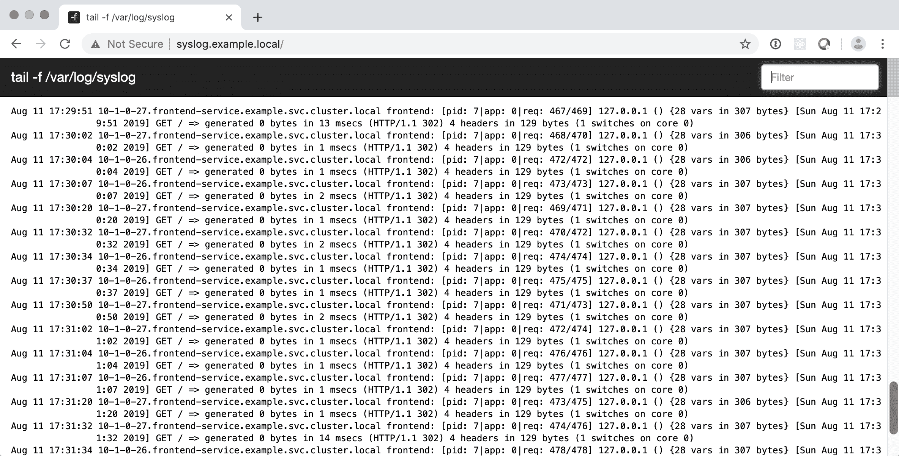
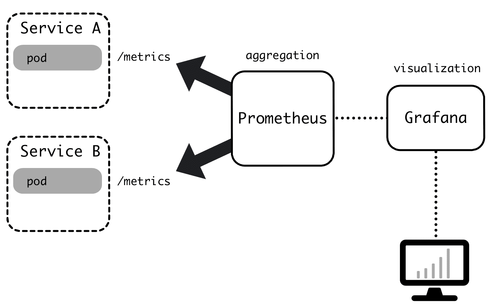
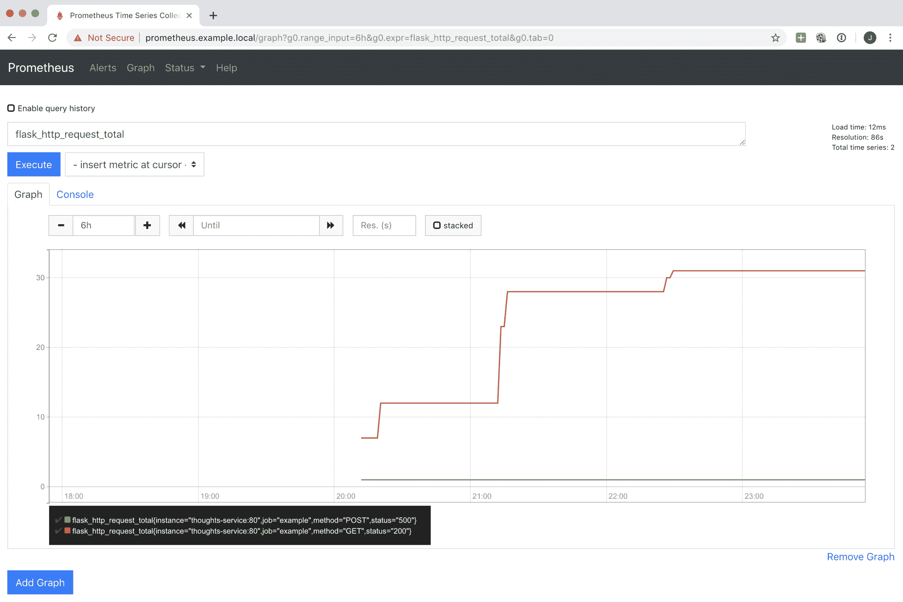
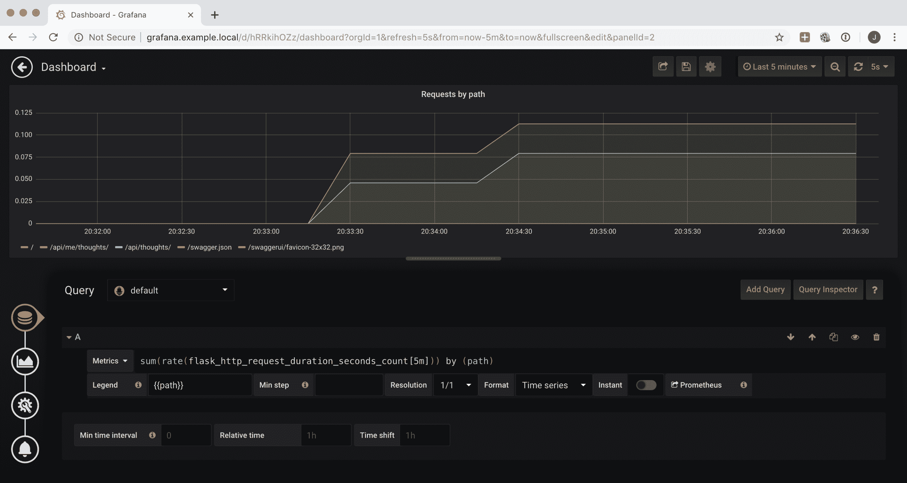

# 监控日志和指标

在实际操作中，快速检测和调试问题的能力至关重要。在本章中，我们将讨论两个最重要的工具，我们可以使用它们来发现在处理大量请求的生产集群中发生了什么。第一个工具是日志，它帮助我们了解单个请求中发生了什么，而另一个工具是度量，它对系统的聚合性能进行分类。

本章将涵盖以下主题:

*   实时系统的可观测性
*   设置日志
*   通过日志检测问题
*   设置指标
*   积极主动

到本章结束时，您将知道如何添加日志，以便它们可用于检测问题，以及如何添加和绘制指标，并了解两者之间的差异。

# 技术要求

我们将使用本章的示例系统，并对其进行调整，以包括集中式日志记录和度量。本章的代码可以在本书的 GitHub 资源库中找到:[https://GitHub . com/PacktPublishing/动手 Docker-for-micro service-with-Python/tree/master/chapter 10](https://github.com/PacktPublishing/Hands-On-Docker-for-Microservices-with-Python/tree/master/Chapter10)。

要安装集群，您需要构建每个单独的微服务:

```
$ cd Chapter10/microservices/
$ cd frontend
$ docker-compose build
...
$ cd thoughts_backend
$ docker-compose build
...
$ cd users_backend
$ docker-compose build
...
```

The microservices in this chapter are the same ones that we introduced previously, but they add extra log and metrics configuration.

现在，我们需要创建示例名称空间，并使用`Chapter10/kubernetes`子目录中的`find`配置启动 Kubernetes 集群:

```
$ cd Chapter10/kubernetes
$ kubectl create namespace example
$ kubectl apply --recursive -f .
...
```

为了能够访问不同的服务，您需要更新您的`/etc/hosts`文件，使其包含以下代码行:

```
127.0.0.1 thoughts.example.local
127.0.0.1 users.example.local
127.0.0.1 frontend.example.local
127.0.0.1 syslog.example.local
127.0.0.1 prometheus.example.local
127.0.0.1 grafana.example.local
```

这样，您将能够访问本章的日志和指标。

# 实时系统的可观测性

可观察性是了解实时系统中正在发生什么的能力。我们可以处理低可观测性系统，在那里我们无法知道发生了什么，或者高可观测性系统，在那里我们可以通过工具从外部推断事件和内部状态。

可观测性是系统本身的特性。通常，监控是获取有关系统当前或过去状态的信息的操作。这有点像命名的争论，但是你要监控系统来收集它的可观察部分。

在很大程度上，监控很容易。有很多很棒的工具可以帮助我们捕捉和分析信息，并以各种方式呈现出来。但是，系统需要公开相关信息，以便收集。

暴露正确的信息量是困难的。过多的信息会产生大量的噪声，从而隐藏相关的信号。太少的信息不足以发现问题。在本章中，我们将研究不同的策略来解决这个问题，但是每个系统都必须自己探索和发现这个问题。期待在自己的系统中进行实验和改变！

分布式系统，如遵循微服务架构的系统，也存在问题，因为系统的复杂性会使其难以理解内部状态。在某些情况下，行为也是不可预测的。这种大规模的系统本质上永远不会完全健康；这里那里总会有小问题。您需要开发一个优先级系统来确定哪些问题需要立即采取行动，哪些问题可以在稍后阶段解决。

微服务可观测性的主要工具是**日志**和**度量**。它们被社区很好地理解和使用，并且有很多工具可以极大地简化它们的使用，既可以作为可在本地安装的包，也可以作为有助于数据保留和降低维护成本的云服务。

Using cloud services for monitoring will save you from maintenance costs. We will talk about this later in the *Setting up logs* and *Setting up metrics* sections.

Another alternative when it comes to observability is services such as Data Dog ([https://www.datadoghq.com/](https://www.datadoghq.com/)) and New Relic ([https://newrelic.com/](https://newrelic.com/)). They receive events – normally logs – and are able to derive metrics from there.

集群状态最重要的细节可以通过`kubectl`查看，正如我们在前面章节中看到的。这将包括诸如已部署的版本、重新启动、提取映像等详细信息。

For production environments, it may be good to deploy a web-based tool to display this kind of information. Check out Weave Scope, an open source tool that shows data in a web page similar to the one that can be obtained with `kubectl`, but in a nicer and more graphical way. You can find out more about this tool here: [https://www.weave.works/oss/scope/](https://www.weave.works/oss/scope/).

日志和度量有不同的目标，两者都可能是错综复杂的。我们将在这本书里看看它们的一些常见用法。

# 理解日志

日志跟踪系统中发生的独特事件。每个日志存储一条消息，该消息是在执行代码的特定部分时产生的。日志可以是完全通用的(*函数 X 称为*)也可以是包含具体细节的(*函数 X 用参数 A* 调用)。

日志最常见的格式是以普通字符串的形式生成。这非常灵活，通常与日志相关的工具可以处理文本搜索。

每个日志都包括一些元数据，这些元数据涉及谁生成了日志，日志是在什么时间创建的，等等。这通常也编码为文本，位于日志的开头。标准格式有助于排序和过滤。

日志还包括严重性级别。这允许进行分类，以便我们能够捕捉消息的重要性。严重性级别可以按重要性顺序为`DEBUG`、`INFO`、`WARNING`或`ERROR`。这种严重性允许我们过滤掉不重要的日志，并确定我们应该采取的措施。记录工具可以被配置为设置阈值；不太严重的日志将被忽略。

There are many severity levels, and you can define custom intermediate levels if you wish. However, this isn't very useful except in very specific situations. Later in this chapter, in the *Detecting problems through logs* section, we will describe how to set a strategy per level; too many levels can add confusion.

在 web 服务环境中，大多数日志将作为 web 请求响应的一部分生成。这意味着请求将到达系统，被处理，并返回一个值。沿途会生成几个日志。请记住，在负载下的系统中，多个请求将同时发生，因此来自多个请求的日志也将同时生成。例如，请注意第二个日志如何来自不同的 IP:

```
Aug 15 00:15:15.100 10.1.0.90 INFO app: REQUEST GET /endpoint
Aug 15 00:15:15.153 10.1.0.92 INFO api: REQUEST GET /api/endpoint
Aug 15 00:15:15.175 10.1.0.90 INFO app: RESPONSE TIME 4 ms
Aug 15 00:15:15.210 10.1.0.90 INFO app: RESPONSE STATUS 200
```

可以添加一个通用请求标识，将为单个请求生成的所有相关日志分组。我们将在本章后面看到如何做到这一点。

每个单独的日志可能相对较大，并且总体上占用大量磁盘空间。在负载下，系统中的日志可能会很快变得不成比例。不同的日志系统允许我们调整它们的保留时间，这意味着我们只保留它们一定的时间。在保留日志以查看过去发生的事情和使用合理的空间之间找到平衡很重要。

Be sure to check the retention policies when enabling any new log service, whether it be local or cloud-based. You won't be able to analyze what happened before the time window. Double-check that the progress rate is as expected – you don't want to find out that you went unexpectedly over quota while you were tracking a bug.

一些工具允许我们使用原始日志来生成聚合结果。他们可以统计特定日志出现的次数，并生成每分钟的平均次数或其他统计数据。但是这很昂贵，因为每个日志都占用空间。要观察这种聚集行为，最好使用特定的度量系统。

# 理解指标

度量处理聚合信息。它们显示的信息与一个事件无关，而是一组事件。这使我们能够以比使用日志更好的方式检查集群的一般状态。

We will use typical examples related to web services, mainly dealing with requests metrics, but don't feel restricted by them. You can generate your own metrics that are specific to your service!

当日志保存关于每个单独事件的信息时，度量会将信息减少到事件发生的次数，或者将它们减少到一个值，然后以某种方式对该值进行平均或聚合。

这使得度量比日志更轻量级，并允许我们根据时间绘制它们。度量提供了诸如每分钟请求数、一分钟内请求的平均时间、排队请求数、每分钟错误数等信息。

The resolution of the metrics may depend on the tool that was used to aggregate them. Keep in mind that a higher resolution will require more resources. A typical resolution is 1 minute, which is small enough to present detailed information unless you have a very active system that receives 10 or more requests per second.

捕获和分析与性能相关的信息，如平均请求时间，使我们能够检测到可能的瓶颈并迅速采取行动，以提高系统的性能。平均来说，这更容易处理，因为单个请求可能无法捕获足够的信息来让我们看到全局。它还帮助我们预测未来的瓶颈。

根据所使用的工具，有许多不同类型的度量标准。最常见的支持如下:

*   **计数器**:每次发生事情都会产生一个触发器。这将被计算和汇总。这方面的一个例子是请求的数量和错误的数量。
*   **仪表**:唯一的单个数字。它可以上升或下降，但最后一个值会覆盖前一个值。这方面的一个例子是队列中请求的数量和可用工作人员的数量。
*   **测量**:有数字关联的事件。这些数字可以通过某种方式进行平均、求和或汇总。与仪表相比，不同之处在于以前的测量仍然是独立的；例如，当我们以毫秒为单位请求时间，以字节为单位请求大小时。度量也可以作为计数器，因为它们的数量可能很重要；例如，跟踪请求时间也会计算请求的数量。

衡量标准主要有两种工作方式:

*   每发生一件事，一个事件就会被推向度量收集器。
*   每个系统维护自己的度量，然后定期从度量系统中*提取*。

每种方式都有其利弊。推送事件会产生更高的流量，因为每个事件都需要发送；这会导致瓶颈和延迟。提取事件只会对信息进行采样，并错过采样之间发生的事情，但它本质上更具可扩展性。

While both approaches are used, the trend is moving toward pulling systems for metrics. They reduce the maintenance that's required for pushing systems and are much more easier to scale.

我们将建立普罗米修斯，它使用第二种方法。第一种方法最常用的指数是石墨。

度量还可以组合生成其他度量；例如，我们可以将返回错误的请求数除以生成错误请求的请求总数。这种派生的度量可以帮助我们以有意义的方式呈现信息。

仪表板中可以显示多个指标，这样我们就可以了解服务或集群的状态。一眼看去，这些图形工具允许我们检测系统的一般状态。我们将设置 Grafana，使其显示图形信息:


与日志相比，度量占用的空间要少得多，而且它们可以捕获更长的时间窗口。甚至有可能保留系统寿命的指标。这与日志不同，日志永远不会存储那么长时间。

# 设置日志

我们将把系统生成的所有日志集中到一个 pod 中。在本地开发中，这个 pod 将通过 web 界面公开所有接收到的日志。

日志将通过`syslog`协议发送，这是最标准的传输方式。Python 中对`syslog`有本地支持，实际上任何处理日志记录并支持 Unix 的系统也是如此。

Using a single container makes it easy to aggregate logs. In production, this system should be replaced with a container that relays the received logs to a cloud service such as Loggly or Splunk.

有多个`syslog`服务器能够接收日志并聚合日志；`syslog-ng`([https://www.syslog-ng.com/](https://www.syslog-ng.com/))和`rsyslog`([https://www.rsyslog.com/](https://www.rsyslog.com/))是最常见的。最简单的方法是接收日志并将它们存储在文件中。让我们用`rsyslog`服务器启动一个容器，它将存储接收到的日志。

# 设置 rsyslog 容器

在本节中，我们将创建自己的`rsyslog`服务器。这是一个非常简单的容器，您可以在 GitHub 上查看`docker-compose`和`Dockerfile`以获得更多关于日志的信息。

We will set up logs using the UDP protocol. This is the standard protocol for `syslog`, but it's less common than the usual HTTP over TCP that's used for web development.

The main difference is that UDP is connectionless, so the log is sent and no confirmation that it has been delivered is received. This makes UDP lighter and faster, but also less reliable. If there's a problem in the network, some logs may disappear without warning.

This is normally an adequate trade-off since the number of logs is high and the implications of losing a few isn't big. `syslog` can also work over TCP, thus increasing reliability but also reducing the performance of the system.

Dockerfile 安装`rsyslog`并复制其配置文件:

```
FROM alpine:3.9

RUN apk add --update rsyslog

COPY rsyslog.conf /etc/rsyslog.d/rsyslog.conf
```

配置文件主要在端口`5140`启动服务器，并将接收到的文件存储在`/var/log/syslog`中:

```
# Start a UDP listen port at 5140
module(load="imudp")
input(type="imudp" port="5140")
...
# Store the received files in /var/log/syslog, and enable rotation
$outchannel log_rotation,/var/log/syslog, 5000000,/bin/rm /var/log/syslog
```

使用日志旋转，我们在`/var/log/syslog`文件的一侧设置了一个限制，这样它就不会无限制地增长。

我们可以用通常的`docker-compose`命令来构建容器:

```
$ docker-compose build
Building rsyslog
...
Successfully built 560bf048c48a
Successfully tagged rsyslog:latest
```

这将创建一个 pod、一个服务和一个入口的组合，就像我们对其他微服务所做的那样，以收集日志并允许从浏览器进行外部访问。

# 定义系统日志窗格

`syslog`舱将包含`rsyslog`容器和另一个显示日志的容器。

为了显示日志，我们将使用 front rail，一个将日志文件流式传输到 web 服务器的应用。我们需要在同一个容器中跨两个容器共享文件，最简单的方法是通过一个卷。

我们通过部署来控制吊舱。您可以在[https://github . com/packt publishing/hand-On-Docker-for-micro-service-with-Python/blob/master/chapter 10/kubernetes/logs/deployment . YAML](https://github.com/PacktPublishing/Hands-On-Docker-for-Microservices-with-Python/blob/master/Chapter10/kubernetes/logs/deployment.yaml)查看部署配置文件。让我们在下面的小节中看看它最有趣的部分。

# 对数体积

`log-volume`创建两个容器共享的空目录:

```
  volumes:
  - emptyDir: {}
    name: log-volume
```

这允许容器在文件中存储信息的同时进行通信。`syslog`容器将向其写入，而前轨将从中读取。

# 系统日志容器

`syslog`容器开始一个`rsyslogd`过程:

```
spec:
  containers:
  - name: syslog
    command:
      - rsyslogd
      - -n
      - -f
      - /etc/rsyslog.d/rsyslog.conf
    image: rsyslog:latest
    imagePullPolicy: Never
    ports:
      - containerPort: 5140
        protocol: UDP
    volumeMounts:
      - mountPath: /var/log
        name: log-volume
```

`rsyslogd -n -f /etc/rsyslog.d/rsyslog.conf`命令用我们前面描述的配置文件启动服务器。`-n`参数将进程保持在前台，从而保持容器运行。

指定了 UDP 端口`5140`，这是定义的接收日志的端口，`log-volume`安装到`/var/log`。稍后在文件中，将定义`log-volume`。

# 前轨容器

前轨容器从官方容器映像开始:

```
  - name: frontrail
    args:
    - --ui-highlight
    - /var/log/syslog
    - -n
    - "1000"
    image: mthenw/frontail:4.6.0
    imagePullPolicy: Always
    ports:
    - containerPort: 9001
      protocol: TCP
    resources: {}
    volumeMounts:
    - mountPath: /var/log
      name: log-volume
```

我们用`frontrail /var/log/syslog`命令启动它，指定端口`9001`(这是我们用来访问`frontrail`的端口)，并挂载`/var/log`，就像我们用`syslog`容器一样，来共享日志文件。

# 允许外部访问

正如我们对其他微服务所做的那样，我们将创建一个服务和一个入口。该服务将被其他微服务使用，因此它们可以发送日志。入口将用于访问网络界面，以便我们可以在日志到达时看到它们。

YAML 的文件分别在`service.yaml`和`ingress.yaml`文件中的 GitHub([https://GitHub . com/packt publishing/hand-Docker-for-micro-service-with-Python/tree/master/chapter 10/kubernetes/logs](https://github.com/PacktPublishing/Hands-On-Docker-for-Microservices-with-Python/tree/master/Chapter10/kubernetes/logs))上。

服务非常简单；唯一的特点是它有两个端口——一个 TCP 端口和一个 UDP 端口——并且每个端口都连接到不同的容器:

```
spec:
  ports:
  - name: fronttail
    port: 9001
    protocol: TCP
    targetPort: 9001
  - name: syslog
    port: 5140
    protocol: UDP
    targetPort: 5140
```

入口仅暴露前轨端口，这意味着我们可以通过浏览器访问它。请记住，需要将域名系统添加到您的`/etc/host`文件中，如本章开头所述:

```
apiVersion: extensions/v1beta1
kind: Ingress
metadata:
  name: syslog-ingress
  namespace: example
spec:
  rules:
  - host: syslog.example.local
    http:
      paths:
      - backend:
          serviceName: syslog
          servicePort: 9001
        path: /
```

在浏览器中进入`http://syslog.example.local`可以进入前轨界面:



您可以使用右上角的框过滤日志。

Remember that, most of the time, logs reflect the readiness and liveness probes, as shown in the preceding screenshot. The more health checks you have in your system, the more noise you'll get.

You can filter them out at the `syslog` level by configuring the `rsyslog.conf` file, but be careful not to leave out any relevant information.

现在，我们需要看看其他微服务如何配置并在这里发送它们的日志。

# 发送日志

我们需要在 uWSGI 中配置微服务，这样我们就可以将日志转发给日志服务。我们将以思想后端为例，即使可以在`Chapter10/microservices`目录下找到的前端和用户后端也启用了该配置。

打开`uwsgi.ini`配置文件([https://github . com/PacktPublishing/hand-On-Docker-for-micro-service-with-Python/blob/master/chapter 10/micro-service/thinks _ 后端/docker/app/uwsgi.ini](https://github.com/PacktPublishing/Hands-On-Docker-for-Microservices-with-Python/blob/master/Chapter10/microservices/thoughts_backend/docker/app/uwsgi.ini) )。您将看到下面一行:

```
# Log to the logger container
logger = rsyslog:syslog:5140,thoughts_backend
```

这将把日志以`rsyslog`格式发送到`5140`港的`syslog`服务。我们还增加了*设施*，这是原木的来源。这会将字符串添加到来自该服务的所有日志中，这有助于排序和过滤。每个`uwsgi.ini`文件应该有自己的工具来帮助过滤。

In old systems that support the `syslog` protocol, the facility needs to fit predetermined values such as `KERN`, `LOCAL_7`, and more. But in most modern systems, this is an arbitrary string that can take any value.

uWSGI 的自动日志很有趣，但是我们也需要设置自己的日志来进行自定义跟踪。让我们看看如何。

# 生成应用日志

Flask 自动为应用配置记录器。我们需要通过以下方式添加一个日志，如`api_namespace.py`文件([https://github . com/packt publishing/hand-On-Docker-for-microservice-with-Python/blob/master/chapter 10/microservice/thinks _ back/thinks _ back end/API _ namespace . py # L102](https://github.com/PacktPublishing/Hands-On-Docker-for-Microservices-with-Python/blob/master/Chapter10/microservices/thoughts_backend/ThoughtsBackend/thoughts_backend/api_namespace.py#L102))所示:

```
from flask import current_app as app

...
if search_param:
    param = f'%{search_param}%'
    app.logger.info(f'Searching with params {param}')
    query = (query.filter(ThoughtModel.text.ilike(param)))
```

`app.logger`可以调用`.debug`、`.info`、`.warning`或`.error`生成日志。注意`app`可以通过导入`current_app`进行检索。

记录器遵循 Python 中的标准`logging`模块。它可以通过不同的方式进行配置。看一下`app.py`文件([https://github . com/packt publishing/动手-Docker-for-micro-service-with-Python/blob/master/chapter 10/micro-service/thinks _ back end/thinks _ back end/app . py](https://github.com/PacktPublishing/Hands-On-Docker-for-Microservices-with-Python/blob/master/Chapter10/microservices/thoughts_backend/ThoughtsBackend/thoughts_backend/app.py))查看我们将在以下小节中介绍的不同配置。

# 字典配置

第一级记录通过默认的`dictConfig`变量。这个变量由 Flask 自动定义，允许我们按照 Python 文档([https://docs.python.org/3.7/library/logging.config.html](https://docs.python.org/3.7/library/logging.config.html))中定义的方式配置日志。您可以在`app.py`文件中查看登录的定义:

```
from logging.config import dictConfig

dictConfig({
    'version': 1,
    'formatters': {
        'default': {
            'format': '[%(asctime)s] %(levelname)s in 
                        %(module)s: %(message)s',
        }
    },
    'handlers': {
        'wsgi': {
            'class': 'logging.StreamHandler',
            'stream': 'ext://flask.logging.wsgi_errors_stream',
            'formatter': 'default'
        }
    },
    'root': {
        'level': 'INFO',
        'handlers': ['wsgi']
    }
})
```

`dictConfig`词典有三个主要层次:

*   `formatters`:检查日志的格式。要定义格式，可以使用 Python 文档中提供的自动值。这将收集每个日志的信息。
*   `handlers`:这将检查日志的去向。您可以为记录器分配一个或多个。我们定义了一个名为`wsgi`的处理程序，并对其进行了配置，使其向上，朝向 uWSGI。
*   `root`:这是日志的最高级别，所以之前没有记录的东西都会引用这个级别。我们在这里配置`INFO`日志级别。

这将设置默认配置，这样我们就不会错过任何日志。然而，我们可以创建更复杂的日志处理程序。

# 记录请求标识

分析大量日志时的一个问题是关联它们。我们需要看看哪些是相互关联的。一种可能性是通过生成日志的 pod 过滤日志，日志存储在日志的开始处(例如，`10-1-0-27.frontend-service.example.svc.cluster.local`)。这类似于生成日志的主机。然而，这个过程很麻烦，在某些情况下，一个容器可以同时处理两个请求。我们需要每个请求的唯一标识符，该标识符被添加到单个请求的所有日志中。

为此，我们将使用`flask-request-id-header`包([https://pypi.org/project/flask-request-id-header/](https://pypi.org/project/flask-request-id-header/))。这增加了一个`X-Request-ID`头(如果不存在的话)，我们可以用它来记录每个单独的请求。

Why do we set up a header instead of storing a randomly generated value in memory for the request? This is a common pattern that allows us to inject the request ID into the backend. The request ID allows us to carry over the same request identifier through the life cycle of a request for different microservices. For example, we can generate it on the Frontend and pass it over to the Thoughts Backend so that we can trace several internal requests that have the same origin.

Although we won't be including this in our example for simplicity, as a microservices system grows, this becomes crucial for determining flows and origins. Generating a module so that we can automatically pass it over internal calls is a good investment.

下图显示了一个**前端**和两个服务之间的流程。请注意，`X-Request-ID`头在到达时没有为**前端**服务设置，它需要被转发到任何呼叫:


我们还需要将日志直接发送到`syslog`服务，这样我们就可以创建一个处理程序来完成这项工作。

当从脚本中执行代码时，与在 web 服务器中运行代码相比，我们不使用这个处理程序。当直接运行脚本时，我们希望我们的日志转到我们之前定义的默认记录器。在`create_app`中，我们将设置一个参数来区分它们。

The Python logging module has a lot of interesting features. Check out the Python documentation for more information ([https://docs.python.org/3/library/logging.html](https://docs.python.org/3/library/logging.html)).

Setting logs properly is trickier than it looks. Don't be discouraged and keep tweaking them until they work.

我们将在`app.py`文件中设置所有的日志配置。让我们分解配置的每个部分:

1.  首先，我们将生成一个附加`request_id`的格式化程序，以便它在生成日志时可用:

```
class RequestFormatter(logging.Formatter):
    ''' Inject the HTTP_X_REQUEST_ID to format logs '''

    def format(self, record):
        record.request_id = 'NA'

        if has_request_context():
            record.request_id = request.environ.get("HTTP_X_REQUEST_ID")

        return super().format(record)
```

可以看到，`request.environ`变量中有`HTTP_X_REQUEST_ID`表头。

2.  稍后，在`create_app`中，我们将设置附加到`application`记录器的处理程序:

```
# Enable RequestId
application.config['REQUEST_ID_UNIQUE_VALUE_PREFIX'] = ''
RequestID(application)

if not script:
    # For scripts, it should not connect to Syslog
    handler = logging.handlers.SysLogHandler(('syslog', 5140))
    req_format = ('[%(asctime)s] %(levelname)s [%(request_id)s] '
                    %(module)s: %(message)s')
    handler.setFormatter(RequestFormatter(req_format))
    handler.setLevel(logging.INFO)
    application.logger.addHandler(handler)
    # Do not propagate to avoid log duplication
    application.logger.propagate = False
```

我们只在脚本运行时设置处理程序。`SysLogHandler`包含在 Python 中。之后，我们设置格式，包括`request_id`。格式化程序使用我们之前定义的`RequestFormatter`。

Here, we are hardcoding the values of the logger level to `INFO` and the `syslog` host to `syslog`, which corresponds to the service. Kubernetes will resolve this DNS correctly. Both values can be passed through environment variables, but we didn't do this here for the sake of simplicity.

记录器尚未传播，因此避免将其发送给`root`记录器，该记录器将复制日志。

# 记录每个请求

我们需要捕获的每个请求中都有共同的元素。Flask 允许我们在请求之前和之后执行代码，所以我们可以用它来记录每个请求的公共元素。让我们学习如何做到这一点。

从`app.py`文件中，我们将定义`logging_before`功能:

```
from flask import current_app, g

def logging_before():
    msg = 'REQUEST {REQUEST_METHOD} {REQUEST_URI}'.format(**request.environ)
    current_app.logger.info(msg)

    # Store the start time for the request
    g.start_time = time()
```

这会创建一个带有单词`REQUEST`的日志，以及每个请求的两个基本部分——方法和 URI——它们来自`request.environ`。然后，他们会被添加到应用记录器的`INFO`日志中。

我们还使用`g`对象来存储请求开始的时间。

The `g` object allows us to store values through a request. We will use it to calculate the time the request is going to take.

也有相应的`logging_after`功能。它收集请求结束时的时间，并以毫秒为单位计算差值:

```
def logging_after(response):
    # Get total time in milliseconds
    total_time = time() - g.start_time
    time_in_ms = int(total_time * 1000)
    msg = f'RESPONSE TIME {time_in_ms} ms'
    current_app.logger.info(msg)

    msg = f'RESPONSE STATUS {response.status_code.value}'
    current_app.logger.info(msg)

    # Store metrics
    ...

    return response
```

这将允许我们检测花费更长时间的请求，并将其存储在指标中，我们将在下一节中看到。

然后，在`create_app`功能中启用这些功能:

```
def create_app(script=False):
    ...
    application = Flask(__name__)
    application.before_request(logging_before)
    application.after_request(logging_after)
```

这将在我们每次生成请求时创建一组日志。

生成日志后，我们可以在`frontrail`界面进行搜索。

# 搜索所有的日志

来自不同应用的所有不同日志将被集中，并可在`http://syslog.example.local`进行搜索。

如果你打电话到`http://frontend.example.local/search?search=speak`搜索想法，你会在日志中看到对应的想法后端，如下图截图所示:


我们可以通过请求标识进行过滤，即`63517c17-5a40-4856-9f3b-904b180688f6`，来获取思想后端请求日志。紧随其后的是`thoughts_backend_uwsgi`和`frontend_uwsgi`请求日志，它们显示了请求的流程。

在这里，您可以看到我们之前谈到的所有元素:

*   请求前的`REQUEST`日志
*   `api_namespace`请求，包含应用数据
*   `RESPONSE`之后的日志，包含结果和时间

在思想后端的代码中，我们故意留下了一个错误。如果用户试图分享一个新想法，它就会被触发。我们将使用它来学习如何通过日志调试问题。

# 通过日志检测问题

对于运行系统中的任何问题，都可能出现两种错误:预期错误和意外错误。

# 检测预期错误

预期错误是通过在代码中显式创建`ERROR`日志而引发的错误。如果正在生成错误日志，这意味着它反映了预先计划的情况；例如，您无法连接到数据库，或者有一些数据以旧的不推荐使用的格式存储。我们不希望这种情况发生，但我们看到了这种情况发生的可能性，并准备了代码来处理它。他们通常会很好地描述情况，以至于问题很明显，即使解决方案并不明显。

它们相对容易处理，因为它们描述了可预见的问题。

# 捕获意外错误

意外错误是可能发生的其他类型的错误。事情以不可预见的方式发展。意外错误通常是由于 Python 异常在代码中的某个点被引发而没有被捕获而产生的。

如果日志记录已正确配置，任何未被捕获的异常或错误将触发`ERROR`日志，其中将包括堆栈跟踪。这些错误可能不会立即显而易见，需要进一步调查。

To help explain these errors, we introduced an exception in the code for the Thoughts Backend in the `Chapter10` code. You can check the code on GitHub ([https://github.com/PacktPublishing/Hands-On-Docker-for-Microservices-with-Python/tree/master/Chapter10/microservices/thoughts_backend/ThoughtsBackend/thoughts_backend](https://github.com/PacktPublishing/Hands-On-Docker-for-Microservices-with-Python/tree/master/Chapter10/microservices/thoughts_backend/ThoughtsBackend/thoughts_backend)). This simulates an unexpected exception.

当试图为一个登录用户发布一个新想法时，我们得到一个奇怪的行为，并在日志中看到以下错误。如下图右上角所示，我们通过`ERROR`进行过滤，过滤问题:


如您所见，堆栈跟踪显示在一行中。这可能取决于您如何捕获和显示日志。Flask 将自动生成一个状态代码为 500 的 HTTP 响应。如果呼叫者没有准备好接收 500 响应，这可能会触发更多的错误。

然后，堆栈跟踪会让你知道什么坏了。在这种情况下，我们可以看到在第 80 行的`api_namespace.py`文件中有一个`raise Exception`命令。这允许我们定位异常。

Since this is a synthetic error that's been generated specifically as an example, it is actually easy to find out the root cause. In the example code, we are explicitly raising an exception, which produces an error. This may not be the case in a real use case, where the exception could be generated in a different place than the actual error. Exceptions can be also originated in a different microservice within the same cluster.

检测到错误后，目标应该是用微服务中的单元测试来复制它，以便生成异常。这将允许我们在受控环境中复制条件。

如果我们为`Chapter10`中可用的思想后端代码运行测试，我们将会因此看到错误。请注意，日志显示在失败的测试中:

```
$ docker-compose run test
...
___ ERROR at setup of test_get_non_existing_thought ___
-------- Captured log setup ---------
INFO flask.app:app.py:46 REQUEST POST /api/me/thoughts/
INFO flask.app:token_validation.py:66 Header successfully validated
ERROR flask.app:app.py:1761 Exception on /api/me/thoughts/ [POST]
Traceback (most recent call last):
 File "/opt/venv/lib/python3.6/site-packages/flask/app.py", line 1813, in full_dispatch_request
 rv = self.dispatch_request()
 File "/opt/venv/lib/python3.6/site-packages/flask/app.py", line 1799, in dispatch_request
 return self.view_functions[rule.endpoint](**req.view_args)
 File "/opt/venv/lib/python3.6/site-packages/flask_restplus/api.py", line 325, in wrapper
 resp = resource(*args, **kwargs)
 File "/opt/venv/lib/python3.6/site-packages/flask/views.py", line 88, in view
 return self.dispatch_request(*args, **kwargs)
 File "/opt/venv/lib/python3.6/site-packages/flask_restplus/resource.py", line 44, in dispatch_request
 resp = meth(*args, **kwargs)
 File "/opt/venv/lib/python3.6/site-packages/flask_restplus/marshalling.py", line 136, in wrapper
 resp = f(*args, **kwargs)
 File "/opt/code/thoughts_backend/api_namespace.py", line 80, in post
 raise Exception('Unexpected error!')
Exception: Unexpected error!
INFO flask.app:app.py:57 RESPONSE TIME 3 ms
INFO flask.app:app.py:60 RESPONSE STATUS 500 
```

一旦错误在单元测试中重现，修复它通常是微不足道的。添加一个单元测试来捕获触发错误的条件集，然后修复它。新的单元测试将检测错误是否已经在每个自动化构建中被重新引入。

To fix the example code, remove the `raise` line of code. Then, things will work again.

有时，问题无法解决，因为它可能是外部的。也许我们数据库中的某些行有问题，或者另一个服务正在返回格式不正确的数据。在那些情况下，我们无法完全避免错误的根本原因。但是，有可能捕获问题，进行一些补救，并从意外错误转移到预期错误。

请注意，并不是每一个检测到的意外错误都值得花费时间。有时，未捕获的错误提供了问题所在的足够信息，这超出了 web 服务应该处理的范围；例如，可能存在网络问题，web 服务无法连接到数据库。当你想把时间花在发展上时，运用你的判断力。

# 日志策略

我们在处理日志时有一个问题。特定信息的适当级别是什么？这是`WARNING`还是`ERROR`？这应该是一个`INFO`声明吗？

大多数日志级别的描述都使用了定义，如*程序显示了潜在的有害情况*或*程序突出显示了请求的进度*。这些都是模糊的，在现实生活环境中不是很有用。相反，尝试通过将每个日志级别与预期的后续操作相关联来定义它们。这有助于明确当发现特定级别的日志时该做什么。

下表显示了不同级别的一些示例以及应该采取的措施:

| **日志级别** | **采取的行动** | **评论** |
| `DEBUG` | 没什么？ | 未跟踪。 |
| `INFO` | 没什么？ | `INFO`日志显示关于请求流的一般信息，以帮助跟踪问题。 |
| `WARNING` | 曲目编号。警惕提高水平。 | `WARNING`日志跟踪已自动修复的错误，如重试连接(但最终连接)或数据库数据中可修复的格式错误。突然增加可能需要调查。 |
| `ERROR` | 曲目编号。警惕提高水平。全部复习。 | `ERROR`日志跟踪无法修复的错误。突然增加可能需要立即采取行动，以便能够补救。 |
| `CRITICAL` | 立即响应。 | `CRITICAL`日志表明系统出现灾难性故障。甚至有一个会表示系统不工作，无法恢复。 |

这只是一个建议，但它对如何应对提出了明确的期望。根据您的团队和您期望的服务级别的工作方式，您可以根据您的用例对它们进行调整。

在这里，层次非常清晰，并且接受将生成一定数量的`ERROR`日志。不是所有的事情都需要立即修复，但是应该记录并检查它们。

In real life, `ERROR` logs will be typically categorized as "we're doomed" or "meh." Development teams should actively either fix or remove "mehs" to reduce them as much as possible. That may include lowering the level of logs if they aren't covering actual errors. You want as few `ERROR` logs as possible, but all of them need to be meaningful.

Be pragmatic, though. Sometimes, errors can't be fixed straight away and time is best utilized in other tasks. However, teams should reserve time to reduce the number of errors that occur. Failing to do so will compromise the reliability of the system in the medium term.

`WARNING`日志表明，某些事情可能没有我们预期的那么顺利，但除非数字增长，否则没有必要恐慌。`INFO`只是在那里给我们上下文如果有问题，但否则应该被忽略。

Avoid the temptation to produce an `ERROR` log when there's a request returning a 400 BAD REQUEST status code. Some developers will argue that if the customer sent a malformed request, it is actually an error. But this isn't something that you should care about if the request has been properly detected and returned. This is business as usual. If this behavior can lead to indicate something else, such as repeated attempts to send incorrect passwords, you can set a `WARNING` log. There's no point in generating `ERROR` logs when your system is behaving as expected.

As a rule of thumb, if a request is not returning some sort of 500 error (500, 502, 504, and so on), it should not generate an `ERROR` log. Remember the categorization of 400 errors as *you (customer) have a problem* versus 500 errors, which are categorized as *I have a problem*.

This is not absolute, though. For example, a spike in authentication errors that are normally 4XX errors may indicate that users cannot create logs due to a real internal problem.

考虑到这些定义，您的开发和运营团队将有一个共同的理解，这将有助于他们采取有意义的行动。

随着系统的成熟，期望调整系统并更改一些日志级别。

# 开发时添加日志

正如我们已经看到的，正确配置`pytest`会使测试中的任何错误显示捕获的日志。

这是一个检查功能开发过程中是否生成了预期日志的机会。任何检查错误条件的测试都应该添加相应的日志，并检查它们是否是在特性开发期间生成的。

You can check the logs as part of testing with a tool such as `pytest-catchlog` ([https://pypi.org/project/pytest-catchlog/](https://pypi.org/project/pytest-catchlog/)) to enforce that the proper logs are being produced.

Typically, though, just taking a bit of care and checking during development that logs are produced is enough for most cases. However, be sure that developers understand why it's useful to have logs while they're developing.

在开发过程中，`DEBUG`日志可以用来显示额外的流量信息，这些信息对于生产来说太多了。这可能会填补`INFO`日志之间的空白，帮助我们养成添加日志的习惯。如果在测试过程中发现`DEBUG`日志有助于跟踪生产中的问题，则该日志可能会升级到`INFO`。

潜在地，`DEBUG`日志可以在受控情况下在生产中启用，以跟踪一些困难的问题，但是要注意拥有大量日志的影响。

Be sensible with the information that's presented in `INFO` logs. In terms of the information that's displayed, avoid sensible data such as passwords, secret keys, credit card numbers, or personal information. This is the same for the number of logs.

Keep an eye on any size limitations and how quickly logs are being generated. Growing systems may have a log explosion while new features are being added, more requests are flowing through the system, and new workers are being added.

此外，请仔细检查日志是否正确生成和捕获，以及它们是否在所有不同的级别和环境下工作。所有这些配置可能需要一点时间，但是您需要非常确定您可以捕获生产中的意外错误，并且所有管道都设置正确。

让我们来看看可观察性的另一个关键要素:度量。

# 设置指标

为了用普罗米修斯建立度量标准，我们需要了解这个过程是如何工作的。它的关键组成部分是，每个被测量的服务都有自己的 Prometheus 客户端来跟踪度量。普罗米修斯服务器中的数据将可用于 Grafana 服务，该服务将绘制指标。

下图显示了一般体系结构:



普罗米修斯服务器定期提取信息。这种操作方法非常轻量级，因为注册度量只会更新服务的本地内存，并且伸缩性很好。另一方面，它显示特定时间的采样数据，并且不记录每个单独的事件。这对存储和表示数据有一定的影响，并且对数据的分辨率有限制，特别是对于非常低的速率。

There are lots of available metrics exporters that will expose standard metrics in different systems, such as databases, hardware, HTTP servers, or storage. Check out the Prometheus documentation for more information: [https://prometheus.io/docs/instrumenting/exporters/](https://prometheus.io/docs/instrumenting/exporters/).

这意味着我们的每个服务都需要安装一个 Prometheus 客户端，并以某种方式公开其收集的指标。我们将使用 Flask 和 Django 的标准客户。

# 为思想后端定义度量标准

对于烧瓶应用，我们将使用`prometheus-flask-exporter`包([https://github.com/rycus86/prometheus_flask_exporter](https://github.com/rycus86/prometheus_flask_exporter)，该包已添加到`requirements.txt`。

在创建应用时，它会在`app.py`文件中被激活。

`metrics`对象在没有 app 的情况下设置，然后在`created_app`功能中实例化:

```
from prometheus_flask_exporter import PrometheusMetrics

metrics = PrometheusMetrics(app=None)

def create_app(script=False):
    ...
    # Initialise metrics
    metrics.init_app(application)
```

这会在`/metrics`服务端点中生成一个端点，即`http://thoughts.example.local/metrics`，该端点以普罗米修斯格式返回数据。普罗米修斯格式是纯文本，如下图所示:


由`prometheus-flask-exporter`捕获的默认度量是基于端点和方法(`flask_http_request_total`)的请求调用，以及它们花费的时间(`flask_http_request_duration_seconds`)。

# 添加自定义指标

当涉及到应用细节时，我们可能希望添加更具体的指标。我们还在请求的末尾添加了一些额外的代码，这样我们就可以存储类似于`prometheus-flask-exporter`允许我们存储的度量的信息。

特别是，我们使用较低级别的`prometheus_client`将这段代码添加到了`logging_after`函数([https://github . com/packt publishing/hand-On-Docker-for-microservice-with-Python/blob/master/chapter 10/microservice/thinks _ back/thinks _ back/app . py # L72](https://github.com/PacktPublishing/Hands-On-Docker-for-Microservices-with-Python/blob/master/Chapter10/microservices/thoughts_backend/ThoughtsBackend/thoughts_backend/app.py#L72))中。

该代码创建`Counter`和`Histogram`:

```
from prometheus_client import Histogram, Counter

METRIC_REQUESTS = Counter('requests', 'Requests',
                          ['endpoint', 'method', 'status_code'])
METRIC_REQ_TIME = Histogram('req_time', 'Req time in ms',
                            ['endpoint', 'method', 'status_code']) 

def logging_after(response):
    ...
    # Store metrics
    endpoint = request.endpoint
    method = request.method.lower()
    status_code = response.status_code
    METRIC_REQUESTS.labels(endpoint, method, status_code).inc()
    METRIC_REQ_TIME.labels(endpoint, method, status_code).observe(time_in_ms)
```

在这里，我们创建了两个度量:一个叫做`requests`的计数器和一个叫做`req_time`的直方图。直方图是具有特定值的度量和事件的普罗米修斯实现，例如请求时间(在我们的例子中)。

The histogram stores the values in buckets, thereby making it possible for us to calculate quantiles. Quantiles are very useful to determine metrics such as the 95% value for times, such as the aggregate time, where 95% comes lower than it. This is much more useful than averages since outliers won't pull from the average.

There's another similar metric called summary. The differences are subtle, but generally, the metric we should use is a histogram. Check out the Prometheus documentation for more details ([https://prometheus.io/docs/practices/histograms/](https://prometheus.io/docs/practices/histograms/)).

度量在`METRIC_REQUESTS`和`METRIC_REQ_TIME`中通过它们的名称、度量和它们定义的标签来定义。每个标签都是度量的一个额外维度，因此您可以根据它们进行筛选和聚合。在这里，我们定义了端点、HTTP 方法和产生的 HTTP 状态代码。

对于每个请求，都会更新度量。我们需要设置标签，计数器调用，即`.inc()`，直方图调用，即`.observe(time)`。

You can find the documentation for the Prometheus client at [https://github.com/prometheus/client_python](https://github.com/prometheus/client_python).

我们可以在度量页面上看到`request`和`req_time`度量。

**Setting up metrics for the Users Backend follows a similar pattern.** The Users Backend is a similar Flask application, so we install `prometheus-flask-exporter` as well, but no custom metrics. You can access these metrics at `http://users.example.local/metrics`.

下一个阶段是建立一个普罗米修斯服务器，这样我们就可以收集指标并适当地聚合它们。

# 收集指标

为此，我们需要使用 Kubernetes 部署度量。我们准备了一份 YAML 文件，所有内容都已经在`Chapter10/kubernetes/prometheus.yaml`文件中设置好了。

这个 YAML 文件包含一个部署，`ConfigMap`，它包含配置文件、服务和入口。服务和入口都很标准，所以我们在这里不做评论。

`ConfigMap`允许我们定义一个文件:

```
apiVersion: v1
kind: ConfigMap
metadata:
  name: prometheus-config
  namespace: example
data:
  prometheus.yaml: |
    scrape_configs:
    - job_name: 'example'

      static_configs:
        - targets: ['thoughts-service', 'users-service', 
                    'frontend-service']
```

注意`|`符号后`prometheus.yaml`文件是如何生成的。这是从`thoughts-service`、`users-service`和`frontend-service`服务器上抓取的最小普罗米修斯配置。正如我们在前面章节中所知道的，这些名称访问服务并将连接到为应用服务的 pods。他们会自动搜索`/metrics`路径。

There is a small caveat here. From the point of view of Prometheus, everything behind the service is the same server. If you have more than one pod being served, the metrics that are being accessed by Prometheus will be load balanced and the metrics won't be correct.

This is fixable with a more complicated Prometheus setup whereby we install the Prometheus operator, but this is out of the scope of this book. However, this is highly recommended for a production system. In essence, it allows us to annotate each of the different deployments so that the Prometheus configuration is dynamically changed. This means we can access all the metrics endpoints exposed by the pods automatically once this has been set up. Prometheus Operator annotations make it very easy for us to add new elements to the metrics system.

Check out the following article if you want to learn how to do this: [https://sysdig.com/blog/kubernetes-monitoring-prometheus-operator-part3](https://sysdig.com/blog/kubernetes-monitoring-prometheus-operator-part3).

该部署从`prom/prometheus`中的公共普罗米修斯映像创建一个容器，如以下代码所示:

```
spec:
  containers:
  - name: prometheus
    image: prom/prometheus
    volumeMounts:
    - mountPath: /etc/prometheus/prometheus.yml
      subPath: prometheus.yaml
      name: volume-config
    ports:
    - containerPort: 9090
    volumes:
    - name: volume-config
      configMap:
        name: prometheus-config
```

它还将`ConfigMap`挂载为一个卷，然后在`/etc/prometheus/prometheus.yml`中挂载为一个文件。这将使用该配置启动普罗米修斯服务器。容器打开港口`9090`，这是普罗米修斯的默认港口。

At this point, note how we delegated for the Prometheus container. This is one of the advantages of using Kubernetes: we can use standard available containers to add features to our cluster with minimal configuration. We don't even have to worry about the operating system or the packaging of the Prometheus container. This simplifies operations and allows us to standardize the tools we use.

部署的普罗米修斯服务器可以在`http://prometheus.example.local/`访问，如入口和服务中所述。

这将显示一个可用于绘制图形的图形界面，如下图所示:



表达式搜索框还将自动完成指标，有助于发现过程。

该界面还显示普罗米修斯公司其他有趣的元素，例如目标的配置或状态:


这个界面中的图形是可用的，但是我们可以通过 Grafana 设置更复杂更有用的仪表盘。让我们看看这个设置是如何工作的。

# 绘制图表和仪表板

所需的 Kubernetes 配置`grafana.yaml`可在本书的 GitHub 存储库中的`Chapter10/kubernetes/metrics`目录中找到。就像我们使用普罗米修斯一样，我们使用一个文件来配置格拉夫纳。

出于我们之前解释的相同原因，我们不会显示入口和服务。部署很简单，但是我们安装了两个卷而不是一个卷，如以下代码所示:

```
spec:
  containers:
    - name: grafana
      image: grafana/grafana
      volumeMounts:
        - mountPath: /etc/grafana/provisioning
                     /datasources/prometheus.yaml
          subPath: prometheus.yaml
          name: volume-config
        - mountPath: /etc/grafana/provisioning/dashboards
          name: volume-dashboard
      ports:
        - containerPort: 3000
  volumes:
    - name: volume-config
      configMap:
        name: grafana-config
    - name: volume-dashboard
      configMap:
        name: grafana-dashboard
```

`volume-config`卷共享一个配置 Grafana 的文件。`volume-dashboard`卷增加了一个仪表盘。后者挂载一个包含两个文件的目录。两个安装都在 Grafana 期望配置文件的默认位置。

`volume-config`卷将数据源设置在 Grafana 将接收数据的地方进行绘图:

```
---
apiVersion: v1
kind: ConfigMap
metadata:
  name: grafana-config
  namespace: example
data:
  prometheus.yaml: |
      apiVersion: 1

      datasources:
      - name: Prometheus
        type: prometheus
        url: http://prometheus-service
        access: proxy
        isDefault: true
```

数据来自`http://prometheus-service`，指向我们之前配置的普罗米修斯服务。

`volume-dashboard`定义两个文件，`dashboard.yaml`和`dashboard.json`:

```
---
apiVersion: v1
kind: ConfigMap
metadata:
  name: grafana-dashboard
  namespace: example
data:
  dashboard.yaml: |
    apiVersion: 1

    providers:
    - name: 'Example'
      orgId: 1
      folder: ''
      type: file
      editable: true
      options:
        path: /etc/grafana/provisioning/dashboards
  dashboard.json: |-
    <JSON FILE>
```

`dashboard.yaml`是一个简单的文件，指向我们可以找到描述系统可用仪表盘的 JSON 文件的目录。我们指向同一个目录，用一个卷装载所有内容。

`dashboard.json` is redacted here to save space; check out this book's GitHub repository for the data.

`dashboard.json`以 JSON 格式描述仪表板。这个文件可以通过 Grafana UI 自动生成。添加更多`.json`文件将创建新的仪表板。

# 格拉凡·ui

通过访问`http://grafana.example.local`并使用您的登录/密码详细信息，即`admin/admin`(默认值)，您可以访问 Grafana UI:


从那里，您可以查看仪表板，该仪表板位于左侧中央栏中:


这捕获了对 Flask 的调用，无论是在数字方面还是在 *95 <sup>第</sup>个*百分位时间方面。每个单独的图表都可以编辑，这样我们就可以看到制作它的配方:



左侧的图标允许我们更改系统中运行的查询，更改可视化(单位、颜色、条或线、绘图的比例等)，添加名称等常规信息，以及创建警报。

The Grafana UI allows us to experiment and so is highly interactive. Take some time to try out the different options and learn how to present the data.

查询部分允许我们添加和显示普罗米修斯的度量。注意默认附近的普罗米修斯标志，这是数据源。

每个查询都有一个从普罗米修斯提取数据的度量部分。

# 质疑普罗米修斯

普罗米修斯有自己的查询语言，叫做 PromQL。这种语言很强大，但也有一些独特之处。

The Grafana UI helps by autocompleting the query, which makes it easy for us to search for metric names. You can experiment directly in the dashboard, but there's a page on Grafana called Explore that allows you to make queries out of any dashboard and has some nice tips, including basic elements. This is denoted by a compass icon in the left sidebar.

首先要记住的是理解普罗米修斯的度量标准。考虑到它的抽样方法，大多数都是单调递增的。这意味着绘制指标将显示一条向上和向上的线。

要获得一段时间内数值变化的速率，需要使用`rate`:

```
rate(flask_http_request_duration_seconds_count[5m])
```

这平均每秒生成请求，移动窗口为`5`分钟。可以使用`sum`和`by`进一步汇总费率:

```
sum(rate(flask_http_request_duration_seconds_count[5m])) by (path)
```

计算次数可以用`avg`代替。您也可以按多个标签分组:

```
avg(rate(flask_http_request_duration_seconds_bucket[5m])) by (method, path)
```

但是，您也可以设置分位数，就像我们可以在图形中设置分位数一样。我们乘以 100 得到以毫秒而不是秒为单位的时间，并通过`method`和`path`分组。现在，`le`是一个自动创建的特殊标签，将数据分成多个桶。`histogram_quantile`函数用它来计算分位数:

```
histogram_quantile(0.95, sum(rate(flask_http_request_duration_seconds_bucket[5m])) by (method, path, le)) * 1000

```

可以过滤指标，以便只显示特定的标签。它们也可以用于不同的功能，如除法、乘法等。

Prometheus queries can be a bit long and complicated when we're trying to display the result of several metrics, such as the percentage of successful requests over the total. Be sure to test that the result is what you expect it to be and allocate time to tweak the requests, later.

如果您想了解更多信息，请务必查看普罗米修斯文档:[https://Prometheus . io/docs/Prometheus/latest/query/basic/](https://prometheus.io/docs/prometheus/latest/querying/basics/)。

# 更新仪表板

仪表板可以交互更改和保存，但是在我们的 Kubernetes 配置中，我们将包含文件的卷设置为非持久的。因此，重新启动 Grafana 将放弃任何更改，并重新应用`Chapter10/kubernetes/metrics/grafana.yaml`文件中`volume-dashboard`中定义的配置。

这实际上是一件好事，因为我们应用相同的 GitOps 原则将完整的配置存储在 Git 源代码控制下的存储库中。

但是可以看到，`grafana.yaml`文件中包含的仪表盘的完整 JSON 描述非常长，给定了参数的数量和手动更改的难度。

最好的方法是交互式地更改仪表板，然后使用菜单顶部的共享文件按钮将其导出到 JSON 文件中。然后，可以将 JSON 文件添加到配置中:


然后可以重新部署格拉夫纳吊舱，并将保存的更改包含在仪表板中。然后可以通过通常的过程在 Git 中更新 Kubernetes 配置。

一定要探索仪表板的所有可能性，包括设置变量的选项，以便您可以使用同一个仪表板来监控不同的应用或环境以及不同种类的可视化工具。有关更多信息，请参见完整的 Grafana 文档:[https://grafana.com/docs/reference/](https://grafana.com/docs/reference/)。

有了可用的指标，我们就可以使用它们来主动了解系统并预测任何问题。

# 积极主动

指标显示了整个集群状态的汇总视图。它们允许我们检测趋势问题，但是很难找到一个虚假的错误。

不过，不要低估他们。它们对于成功的监控至关重要，因为它们告诉我们系统是否健康。在一些公司中，最关键的指标会突出显示在墙上的屏幕上，这样运营团队就可以随时看到它们，并迅速做出反应。

为系统中的指标找到适当的平衡不是一项简单的任务，需要时间和反复试验。不过，在线服务有四个指标总是很重要。这些措施如下:

*   **延迟**:系统响应一个请求需要多少毫秒。

Depending on the times, a different time unit, such as seconds or microseconds, can be used. From my experience, milliseconds is adequate since most of the requests in a web application system should take between 50 ms and 1 second to respond. Here, a system that takes 50 ms is too slow and one that takes 1 second is a very performant one.

*   **流量**:单位时间内流经系统的请求数，即每秒或每分钟的请求数。
*   **错误**:收到的返回错误的请求的百分比。
*   **饱和**:集群的容量是否有足够的余量。这包括硬盘空间、内存等元素。例如，有 20%的可用内存。

To measure saturation, remember to install the available exporters that will collect most of the hardware information (memory, hard disk space, and so on) automatically. If you use a cloud provider, normally, they expose their own set of related metrics as well, for example, CloudWatch for AWS.

这些指标可以在谷歌 SRE 书中找到，作为*四个黄金信号*，并被认为是成功监控的最重要的高级元素。

# 发信号

当度量出现问题时，应该生成自动警报。普罗米修斯有一个内置的警报系统，当一个定义的指标满足定义的条件时就会触发。

Check out the Prometheus documentation on alerting for more information: [https://prometheus.io/docs/alerting/overview/](https://prometheus.io/docs/alerting/overview/).

普罗米修斯的警报管理器可以执行某些操作，例如根据规则发送电子邮件以获得通知。该系统可以连接到 OpsGenie([https://www.opsgenie.com](https://www.opsgenie.com))等集成事件解决方案，以生成各种警报和通知，如电子邮件、短信、电话等。

日志也可以用来创建警报。有一些工具允许我们在`ERROR`升起时创建一个条目，比如**哨兵**。这使我们能够检测问题并主动修复它们，即使集群的运行状况没有受到损害。

一些处理日志的商业工具，如 Loggly，允许我们从日志本身导出指标，根据日志的种类绘制图表，或者从中提取值并将其用作值。虽然不如普罗米修斯这样的系统完整，但它们可以监控一些值。它们还允许我们在达到阈值时发出通知。

The monitoring space is full of products, both free and paid, that can help us to handle this. While it's possible to create a completely in-house monitoring system, being able to analyze whether commercial cloud tools will be of help is crucial. The level of features and their integration with useful tools such as external alerting systems will be difficult to replicate and maintain.

警报也是一个持续的过程。一些元素将会被发现，并且必须创建新的警报。一定要投入时间，让一切都按预期进行。当系统不健康时，将使用日志和指标，在这些时刻，时间是至关重要的。您不想猜测日志，因为主机参数配置不正确。

# 做好准备

同样，除非恢复过程已经过测试并且正在运行，否则备份是没有用的，在检查监控系统是否正在产生有用的信息时要积极主动。

特别是，尝试标准化日志，以便对包含哪些信息以及如何构建有一个良好的预期。不同的系统可能会产生不同的日志，但最好让所有微服务的日志都采用相同的格式。仔细检查是否正确记录了任何参数，如客户端引用或主机。

这同样适用于指标。当您跟踪问题时，拥有一套每个人都了解的指标和仪表板将节省大量时间。

# 摘要

在本章中，我们学习了如何使用日志和指标，以及如何使用`syslog`协议设置日志并将其发送到集中的容器。我们描述了如何向不同的应用添加日志，如何包含请求标识，以及如何从不同的微服务中生成定制日志。然后，我们学习了如何定义策略来确保日志在生产中有用。

我们还描述了如何在所有微服务中设置标准和定制的普罗米修斯指标。我们启动了一台普罗米修斯服务器，并对其进行了配置，使其能够从我们的服务中收集指标。我们启动了一个 Grafana 服务，这样我们就可以绘制指标并创建仪表板，这样我们就可以显示集群和正在运行的不同服务的状态。

然后，我们向您介绍了普罗米修斯的警报系统，以及如何使用它来通知我们问题。请记住，有一些商业服务可以帮助您处理日志、指标和警报。分析您的选项，因为它们可以为您节省大量维护成本方面的时间和金钱。

在下一章中，我们将学习如何管理影响几个微服务的变化和依赖关系，以及如何处理配置和机密。

# 问题

1.  系统的可观测性是什么？
2.  日志中有哪些不同的严重级别？
3.  度量标准用于什么？
4.  为什么需要在日志中添加请求标识？
5.  普罗米修斯中有哪些可用的度量标准？
6.  指标中的第 75 百分位是什么，它与平均值有什么不同？
7.  四大黄金信号是什么？

# 进一步阅读

通过阅读*监控 Docker*([https://www . packtpub . com/虚拟化与云/监控-docker](https://www.packtpub.com/virtualization-and-cloud/monitoring-docker) ，可以了解更多关于使用不同工具和技术进行监控的信息。要了解更多关于普罗米修斯和格拉夫纳的信息，包括如何设置警报，请阅读*用普罗米修斯进行基础设施实践监控*([https://www . packtpub . com/虚拟化和云/手动-基础设施-监控-普罗米修斯](https://www.packtpub.com/virtualization-and-cloud/hands-infrastructure-monitoring-prometheus))。

监控只是成功可靠地运行服务的起点。要了解如何成功改善您的运营，请查看*真实世界 SRE*([https://www.packtpub.com/web-development/real-world-sre](https://www.packtpub.com/web-development/real-world-sre))。