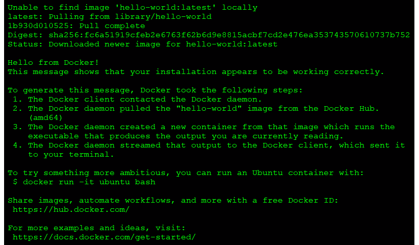
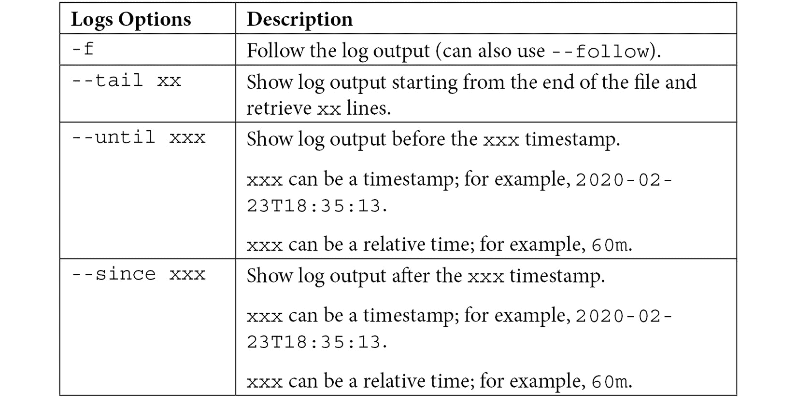

# 一、Docker和容器要领

容器是我们多年来见过的最具变革性的技术之一。科技公司、企业和最终用户都采用它来处理日常工作负载。越来越多的**普通现成** ( **COTS** )应用正在从传统安装转变为完全容器化的部署。随着如此大的技术转变，信息技术领域的任何人都必须了解容器。

在本章中，我们将介绍容器解决的问题。在介绍了为什么容器很重要之后，我们将介绍引发现代容器狂潮的运行时 Docker。本章结束时，您将了解如何安装 Docker 以及如何使用最常见的 Docker CLI 命令。

在本章中，我们将涵盖以下主题:

*   理解容器化的需求
*   理解Docker
*   安装 Docker
*   使用 Docker 命令行界面

我们开始吧！

# 技术要求

本章有以下技术要求:

*   一台 Ubuntu 18.04 服务器，内存至少为 4 GB，但建议为 8 GB

您可以通过访问以下 GitHub 存储库来访问本章的代码:[https://GitHub . com/PacktPublishing/Kubernetes-and-Docker-The-Complete-Guide](https://github.com/PacktPublishing/Kubernetes-and-Docker-The-Complete-Guide)。

# 了解容器化的需求

你可能在办公室或学校经历过这样的对话:

**开发者** : *“新应用来了。它经历了几周的测试，你是第一个获得新版本的人。”*

*…..过了一会儿…*

**用户** : *“没用。当我单击提交按钮时，它会显示一个关于缺少依赖项的错误。”*

**开发者** : *“太奇怪了；它在我的机器上运行良好。”*

这是开发人员在交付应用时可能遇到的最令人沮丧的事情之一。通常，潜移默化出现的问题与开发人员机器上的库有关，但它不包含在包的分发中。解决这个问题的一个简单方法是将所有的库都包含在这个版本中，但是如果这个版本包含一个新的库来覆盖旧的版本，这可能是不同的应用所需要的呢？

开发人员需要考虑他们的新版本，以及与用户工作站上任何现有软件的任何潜在冲突。这通常会变成一种谨慎的平衡行为，需要更大的部署团队在不同的系统配置上测试应用。它还可能导致开发人员的额外返工，或者在某些极端情况下，与现有应用完全不兼容。

多年来，有各种各样的尝试来简化应用交付。首先是解决方案，如 **VMware** 的 **Thinapp** ，虚拟化 san 应用(不要与虚拟化操作系统混淆)。它允许您将应用及其依赖项打包成一个可执行包。这种打包消除了应用的依赖关系与另一个应用的依赖关系相冲突的问题，因为该应用是在一个独立的包中。这种提供的应用隔离不仅消除了依赖性问题，还提供了增强的安全级别，并减轻了操作系统迁移的负担。

在阅读本书之前，您可能听说过应用流，也可能没有听说过。这听起来像是对“它在我的机器上工作”问题的一个很好的解决方案。不过，它没有像预期的那样起飞有很多原因。首先，大多数产品都是需要大量投资的付费解决方案。除了许可之外，他们还需要一台“干净的电脑”，这意味着对于您想要虚拟化的每一个应用，您都需要从一个基本系统开始。您要创建的包使用基本安装和初始系统快照后添加的任何内容之间的差异。这些差异随后被打包到您的分发文件中，该文件可以在任何工作站上执行。

我们提到了应用虚拟化，以强调多年来“它在我的机器上工作”等应用问题有不同的解决方案。像 **Thinapp** 这样的产品只是解决问题的一次尝试。其他尝试包括在运行 **Citrix** 或**远程桌面**、 **Linux 容器**甚至**虚拟机**的服务器上运行应用。

## 介绍Docker

行业甚至终端用户都需要更简单、更便宜的东西——进入 Docker 容器。容器不是新技术；多年来，它们一直以各种形式使用。Docker 所做的是让普通开发人员可以访问它们。

Docker 给大众带来了一个抽象层。它很容易使用，并且在创建包之前不需要每个应用都有一台干净的电脑，从而为依赖性问题提供了一个解决方案，但最吸引人的是，它是免费的。Docker 成为 GitHub 上许多项目的标准，团队通常会创建一个 Docker 容器并将 Docker 映像或 **Dockerfile** 分发给团队成员，提供一个标准的测试或开发环境。最终用户的采用最终将 Docker 带入企业，并最终使其成为今天的标准。

虽然有很多关于 Docker 的书，但这本书侧重于 Docker 用于与容器交互的基本主题。这本书将重点介绍在尝试使用本地 Kubernetes 环境时需要了解的内容。Docker 有着悠久而有趣的历史，它是如何演变成我们今天使用的标准容器映像格式的。我们鼓励您阅读有关该公司的信息，以及他们如何开创了我们今天所知的容器世界。

虽然我们的重点不是由内而外地教授 Docker，但我们认为，那些对 Docker 不熟悉的人将受益于一般容器概念的快速入门。如果你有一些Docker的经验，并且理解诸如短暂和无状态的术语，请继续到安装Docker部分。

# 了解Docker

这本书是在假设你对 Docker 和容器概念有一些基本了解的情况下创作的。我们意识到，过去可能不是每个人都玩过 Docker 或 containers，所以我们想展示一个关于容器概念和使用 Docker 的速成课程。

重要说明

如果您是容器新手，我们建议阅读 Docker 网站上的文档，了解更多信息:[https://docs.docker.com/](https://docs.docker.com/)。

## 容器是短暂的

首先要理解的主题是容器映像是短暂的。

对于那些不熟悉 Docker 的人来说，短暂这个词意味着短暂。根据设计，容器可以在任何时候被销毁，并且在没有用户交互的情况下被恢复。在前面的例子中，有人以交互方式向 web 服务器添加文件。这些添加的文件只是临时的，因为基本映像中不包含这些文件。

这意味着，一旦容器被创建并运行，一旦容器从 Docker 主机中移除或销毁，对映像*所做的任何更改都不会保存。让我们看一个例子:*

1.  您在没有任何基础的 **HTML** 页面的情况下，在您的主机上使用 **NGINX** 启动一个运行网络服务器的容器。
2.  使用 Docker 命令，执行`copy`命令将一些网络文件复制到容器的文件系统中。
3.  为了测试复制是否成功，您浏览该网站并确认它提供了正确的网页。
4.  对结果感到满意，您停止容器并将其从主机中移除。那天晚些时候，你想给一个同事看这个网站，你启动了你的 NGINX 容器。您再次浏览网站，但是当网站打开时，您会收到一个 404 错误(找不到页面错误)。

在您停止并从主机移除容器之前，您上传的文件发生了什么变化？

容器重启后找不到你的网页的原因是因为所有容器都是**短暂的**。

每次容器初始启动时，基本容器映像中包含的内容就是所有内容。您在容器中所做的任何更改都是短暂的。

如果您需要向现有映像添加永久文件，您将需要重建包含文件的映像,或者，正如我们将在本章后面的*持久数据*一节中解释的，您可以在容器中装入一个 Docker 卷。在这一点上，要理解的主要概念是容器是短暂的。

但是等等！你可能会想，*“如果容器是短暂的，我是如何向服务器添加网页的？”*。短暂只是意味着改变不会被保存；它不会阻止您对正在运行的容器进行更改。

对正在运行的容器所做的任何更改都将被写入一个临时层，称为**容器层**，它是本地主机文件系统上的一个目录。Docker 存储驱动程序负责处理使用容器层的请求。该位置将存储容器文件系统中的任何更改，以便当您将 HTML 页面添加到容器中时，它们将存储在本地主机上。容器层与正在运行的映像的容器标识相关联，它将保留在主机系统上，直到通过使用命令行界面或运行 Docker 清理作业将容器从 Docker 中删除。

如果容器是短暂的，并且无法写入映像，那么如何修改容器中的数据？Docker 使用映像分层来创建多个链接层，这些链接层显示为单个文件系统。

## Docker映像

在高级别，Docker 映像是映像层的集合，每个映像层都有一个包含该层元数据的 JSON 文件。所有这些都组合在一起，创建一个运行中的应用，当容器映像启动时，您可以与之交互。

您可以在 https://github.com/moby/moby/blob/master/img/spec/v1.md 的 Docker GitHub 上阅读更多关于映像内容的信息。

## 映像层

正如我们在上一节中提到的一样，一个正在运行的容器使用一个位于基础映像层“顶部”的容器层，如下图所示:


图 1.1–Docker 映像层

无法写入映像层，因为它们处于只读状态，但临时容器层处于可写状态。您添加到容器中的任何数据都存储在该层中，只要容器运行，这些数据就会被保留。

为了有效地处理多个层，Docker 实现了写时复制，这意味着如果一个文件已经存在，它将不会被创建。但是，如果需要当前映像中不存在的文件，则会写入该文件。在容器世界中，如果一个文件存在于较低的层中，它上面的层不需要包含它。例如，如果层 1 中有一个名为`/opt/nginx/index.html`的文件，则层 2 在其层中不需要相同的文件。

这解释了系统如何处理存在或不存在的文件，但是被修改的文件怎么办？有时，您需要“替换”位于较低层的文件。您可能需要在构建映像或临时修复运行中的容器问题时这样做。写时复制系统知道如何处理这些问题。由于映像是从上到下读取的，因此容器只使用最高层的文件。如果您的系统在第 1 层中有一个`/opt/nginx/index.html`文件，并且您修改并保存了该文件，运行的容器将在容器层中存储新文件。由于容器层是最顶层，因此`index.html`的新副本将总是先于映像层中的旧版本被读取。

## 持久数据

我们将在 [*第二章*](02.html#_idTextAnchor044)*中讨论如何使用持久磁盘使用 Docker Data* 。现在，我们将只提供一个简单的介绍。

仅限于短暂的容器将严重限制 Docker 的用例。很有可能您会有一些需要持久存储的用例，或者在您停止容器时会保留的数据。

这看起来像是我们在反驳我们之前的说法，即容器是短暂的，但这仍然是事实。将数据存储在容器映像图层中时，基础映像不会改变。当容器从主机中移除时，容器层也将被移除。如果使用相同的映像来启动新的容器，则会创建一个新的容器映像层。因此，容器是短暂的，但是通过向容器添加 Docker 卷，您可以将数据存储在容器之外，从而获得数据持久性。

Docker 通过几个方法提供持久性，我们将在 [*第 2 章*](02.html#_idTextAnchor044)*中更详细地讨论使用 Docker 数据*，但是现在，要知道 Docker 确实提供了一种方法来持久化您的数据。

## 访问在容器中运行的服务

我们将在 [*第三章*](03.html#_idTextAnchor062)*了解 Docker Networking* 中讲述如何暴露容器。现在，我们将只提供一个简单的介绍。

与物理机或虚拟机不同，容器不直接连接到网络。当容器需要发送或接收流量时，它通过 Docker 主机系统使用桥接的 **NAT 网络**连接。这意味着当您运行一个容器并且您想要接收传入的流量请求时，您需要公开您想要接收流量的每个容器的端口。在基于 Linux 的系统上，`iptables`具有将流量转发给 Docker 守护程序的规则，Docker 守护程序将为每个容器的指定端口提供服务。

基本容器和 Docker 的介绍到此结束。在下一节中，我们将解释如何在主机上安装 Docker。

# 安装Docker

本书中的实践练习将要求你有一个工作的Docker主持人。您可以按照本书中的步骤操作，也可以在`chapter1`目录下执行位于本书 GitHub 存储库中的脚本，该目录名为`install-docker.sh`。

如今，您可以在几乎所有硬件平台上安装 Docker。Docker 的每个版本在每个平台上的行为和外观都是相同的，这使得需要开发跨平台应用的人很容易开发和使用 Docker。通过使不同平台之间的函数和命令相同，开发人员不需要学习不同的容器运行时来运行映像。

以下是 Docker 的可用平台表。如您所见，有多种操作系统和多种 CPU 架构的安装:


图 1.2–可用的 Docker 平台

重要说明

使用一种体系结构创建的映像不能在不同的体系结构上运行。这意味着您不能创建基于 x86 硬件的映像，并期望该映像在运行 ARM 处理器的树莓 Pi 上运行。还需要注意的是，虽然您可以在 Windows 机器上运行 Linux 容器，但不能在 Linux 机器上运行 Windows 容器。

用于安装 Docker 的安装程序因平台而异。幸运的是，Docker 在他们的网站上记录了许多安装过程:[https://docs.docker.com/install/](https://docs.docker.com/install/)。

在本章中，我们将在 Ubuntu 18.04 系统上安装 Docker。如果您没有安装 Ubuntu 的机器，您仍然可以阅读安装步骤，因为每个步骤都将被解释，并且不需要您有一个运行的系统来理解这个过程。如果您有不同的 Linux 安装，您可以使用 Docker 网站上的[https://docs.docker.com/](https://docs.docker.com/)概述的安装程序。为 CentOS、Debian、Fedora、Ubuntu 提供了步骤，其他 Linux 发行版也有通用步骤。

## 准备安装 Docker

在我们开始安装之前，我们需要考虑使用什么存储驱动。存储驱动程序提供了联合文件系统，它管理容器的层以及如何访问容器的可写层。

在大多数安装中，您不需要更改默认存储驱动程序，因为将选择默认选项。如果您运行的是至少 4.0 版或以上的 Linux 内核，您的 Docker 安装将使用`overlay2`存储驱动程序；早期的内核将安装`AUFS`存储驱动程序。

作为参考，Docker 与`overlay2`和`AUFS`驱动程序一起支持`devicemapper`、`btrfs`、`zfs`和`vfs`存储驱动程序。然而，这些在新系统中很少使用，在此仅作为参考。

如果您想了解每个存储驱动程序，请查看以下 Docker 网页，其中详细介绍了每个驱动程序及其用例:[https://docs . Docker . com/storage/storage driver/select-storage-driver/](https://docs.docker.com/storage/storagedriver/select-storage-driver/)。

现在您已经了解了存储驱动程序的要求，下一步是选择安装方法。您可以使用三种方法之一安装 Docker:

*   将 Docker 存储库添加到您的主机系统。
*   手动安装软件包。
*   使用 Docker 提供的安装脚本。

第一个选项被认为是最好的选项，因为它可以方便地安装和更新 Docker 引擎。第二个选项对于无法通过互联网访问服务器(也称为“气隙”服务器)的企业非常有用。第三个选项用于安装 Docker 的边缘和测试版本，不建议用于生产。

由于首选的方法是将 Docker 的存储库添加到我们的主机中，因此我们将使用该选项并解释我们应该用来添加存储库和安装 Docker 的过程。

## 在 Ubuntu 上安装Docker

现在我们已经完成了一切准备，让我们安装 Docker:

1.  第一步是通过执行`apt-get update` :

    ```
    sudo apt-get update
    ```

    更新包索引
2.  接下来，我们需要添加主机系统上可能丢失的任何包，以允许 HTTPS apt 访问:

    ```
    sudo apt-get install apt-transport-https ca-certificates curl gnupg-agent software-properties-common
    ```

3.  要从 Docker 的存储库中提取包，我们需要添加它们的密钥。您可以使用以下命令添加密钥，该命令将下载 gpg 密钥并将其添加到您的系统中:

    ```
    curl -fsSL https://download.docker.com/linux/ubuntu/gpg | sudo apt-key add –
    ```

4.  现在，将 Docker 的存储库添加到您的主机系统中:

    ```
    sudo add-apt-repository "deb [arch=amd64] https://download.docker.com/linux/ubuntu $(lsb_release -cs) stable"
    ```

5.  完成所有先决条件后，您可以在服务器上安装 Docker:

    ```
    sudo apt-get update sudo apt-get install docker-ce docker-ce-cli containerd.io
    ```

6.  Docker 现已安装在您的主机上，但与大多数新服务一样，Docker 当前没有运行，并且尚未配置为从系统启动。要启动 Docker 并在启动时启用它，请使用以下命令:

    ```
    sudo systemctl enable docker && systemctl start docker
    ```

现在我们已经安装了 Docker，让我们进行一些配置。首先，我们将授予 Docker 权限。

## 授予Docker权限

在默认的安装中，Docker 需要 root 访问权限，因此您需要以 root 身份运行所有 Docker 命令。您可以将您的用户帐户添加到服务器上提供 Docker 访问的新组中，而不是对每个 Docker 命令都使用`sudo`，而不需要对每个命令都使用`sudo`。

如果您以标准用户身份登录并尝试运行 Docker 命令，您将收到一条错误消息:

```
Got permission denied while trying to connect to the Docker daemon socket at unix:///var/run/docker.sock: Get http://%2Fvar%2Frun%2Fdocker.sock/v1.40/img/json: dial unix /var/run/docker.sock: connect: permission denied
```

要允许您的用户或您可能想要添加的任何其他用户执行 Docker 命令，您需要创建一个新组并将用户添加到该组。以下是可用于添加当前登录用户的命令示例:

```
sudo groupadd docker sudo usermod -aG docker $USER
```

第一个命令创建`docker`组，而第二个命令将您当前登录的用户帐户添加到`docker`组。

要将新成员添加到您的帐户，您需要从系统中注销并重新登录，这将更新您的组。

最后，您可以通过运行标准 hello world image 来测试它是否工作(注意，我们不要求`sudo`运行 Docker 命令):

```
docker run hello-world
```

如果您看到以下输出，那么您已经成功安装了 Docker 并授予您的非根帐户访问 Docker 的权限:



图 1.3–hello-world 的输出

现在已经授予 Docker 无需`sudo`即可运行的权限，我们可以通过学习如何使用 Docker CLI 来开始解锁我们可以使用的命令。

# 使用 Docker 命令行界面

当您运行`hello-world`容器来测试您的安装时，您使用了Docker 命令行界面。Docker 命令是您将用来与 Docker 守护程序交互的命令。使用此单个可执行文件，您可以执行以下操作以及更多操作:

*   启动和停止容器
*   推拉映像
*   在活动容器中运行外壳
*   看看容器日志
*   创建 Docker 卷
*   创建 Docker 网络
*   删除旧映像和卷

本章并不意味着包括对每个 Docker 命令的详尽解释；相反，我们将解释一些您需要用来与 Docker 守护程序和容器交互的常见命令。因为我们认为卷和网络对于理解这本书非常重要，所以我们将深入这些主题的更多细节。

您可以将 Docker 命令分为两类:通用 Docker 命令和 Docker 管理命令。标准的 Docker 命令允许您管理容器，而管理命令允许您管理 Docker 选项，如管理卷和网络。

## Docker帮助

忘记命令的选项或语法是很常见的，Docker 意识到了这一点。每当你试图记住一个命令时，你总是可以使用`docker help`命令来刷新你的记忆。

## Docker运行

要运行容器，使用带有提供的映像名称的`docker run`命令。在执行`docker run`命令之前，您应该了解启动容器时可以提供的选项。

最简单的形式是`docker run bitnami/nginx:latest`，这是一个可以用来运行 NGINX 网络服务器的示例命令。虽然这将启动一个运行 NGINX 的容器，但它将在前台运行:


图 1.4–NGINX 容器启动

要将容器作为后台进程运行，您需要在 Docker 命令中添加`-d`选项，这将在分离模式下运行您的容器。现在，当您运行分离的容器时，您将只看到容器标识，而不是交互式或附加的屏幕:


图 1.5–Docker 运行输出

默认情况下，容器一旦启动就会被赋予一个随机的名称。在我们前面的分离示例中，容器被命名为`silly_keldysh`:


图 1.6–Docker 命名示例

如果不为容器指定名称，当您开始在单个主机上运行多个容器时，会很快变得混乱。为了使管理更容易，你应该总是用一个更容易管理的名字来开始你的容器。Docker 通过`run`命令提供了另一个选项:`--name`选项。在前面例子的基础上，我们将命名我们的容器`nginx-test`。我们新的`docker run`命令如下:

```
docker run --name nginx-test -d bitnami/nginx:latest
```

就像运行任何分离的映像一样，这将返回容器标识，但不是您提供的名称。为了验证容器是否以名称`nginx-test`运行，我们可以使用`docker ps`命令列出容器。

## Docker

每天，你将需要检索一个正在运行的容器列表或一个已经停止的容器列表。Docker CLI 有一个名为`ps`的选项，该选项将列出所有正在运行的容器，或者如果您向`ps`命令添加一个额外的选项，则列出所有正在运行且已停止的容器。输出将列出容器，包括它们的容器标识、映像标签、输入命令、创建日期、状态、端口和容器名称。以下是当前正在运行的容器示例:


图 1.7–当前运行的容器

如果您正在寻找的容器当前正在运行，这将很有帮助。如果容器被停止了，或者更糟，如果你启动了容器，但它没有启动，然后又停止了，怎么办？通过在`docker ps`命令中添加`-a`选项，可以查看所有容器的状态，包括之前运行的容器。当您执行`docker ps -a`时，您将看到来自标准`ps`命令的相同输出，但是您将注意到列表可能包括额外的容器。

如何区分哪些容器正在运行，哪些容器已经停止？如果查看列表的`STATUS`字段，运行容器会显示一个运行时间；例如`Up xx hours`，或者`Up xx days`。但是，如果容器由于任何原因被停止，当它停止时，状态将显示；例如`Exited (1) 3 days ago`。


图 1.8–Docker PS 输出

停止的容器并不意味着运行映像时出现问题。有些容器可以执行单个任务，一旦完成，容器就可以优雅地停止。确定退出是正常的还是由于启动失败导致的一种方法是检查容器的日志。

## Docker开始和停止

要停止一个正在运行的容器，使用带有要停止的容器名称的`docker stop`选项。由于主机上的资源，您可能希望停止一个容器，因为您可能资源有限，只能同时运行几个容器。

如果您需要在未来某个时间启动该容器进行额外的测试或开发，请执行`docker start container name`，这将使用最初启动该容器的所有选项启动该容器，包括分配的任何网络或卷。

## Docker附件

您可能需要交互式地访问一个容器来解决问题或查看日志文件。连接到正在运行的容器的一种方法是使用`docker attach container name`命令。当您附加到一个正在运行的容器时，您将连接到正在运行的容器进程，因此如果您附加到一个正在运行进程的容器，您不可能只看到任何类型的命令提示符。事实上，在容器向屏幕输出一些数据之前的一段时间里，您可能只会看到一个空白屏幕。

一旦连接到容器上，您必须小心–您可能会意外停止运行过程，进而停止容器。让我们使用一个连接到运行 NGINX 的网络服务器的例子。首先，我们需要使用`docker ps`验证容器是否正在运行:


图 1.9–docker PS 输出

使用`attach`命令，我们执行`docker attach bbadb2bddaab`:


图 1.10–Docker附件输出

如前面的截图所示，一旦您附加到正在运行的容器进程，似乎什么都没有发生。当您附加到流程时，您将只能与流程交互，并且您将看到的唯一输出是发送到标准输出的数据。在 NGINX 容器的情况下，`attach`命令已经附加到 NGINX 进程。为了展示这一点，我们将从另一个会话中把附件和 curl 留给 web 服务器。一旦我们转到容器端口，您将看到日志输出到连接的控制台:


图 1.11–容器的 STDOUT 输出

根据容器中运行的内容，附加到正在运行的容器有不同的好处。

我们提到，一旦连接到容器上，您需要小心。那些对 Docker 不熟悉的人可能会附加到 NGINX 映像，并假设服务器上没有发生任何事情，或者附加失败。既然他们认为可能有问题，既然只是坐在那里，他们可能会决定使用标准的 *Ctrl + C* 键盘命令来突破容器。这将把它们发送回 bash 提示符，在那里它们可以运行`docker ps`来查看正在运行的容器:


图 1.12–docker PS 输出

NGINX 容器在哪里？我们没有执行`docker stop`命令，容器一直在运行，直到我们连接到容器。为什么附着后容器会停止？

当一个附件被附加到一个容器时，你就被附加到了正在运行的进程。所有键盘命令的作用方式都是一样的，就像你在一个运行 NGINX 的交互式外壳的物理服务器上一样。这意味着当用户使用 *Ctrl + C* 返回提示时，他们停止了正在运行的 NGINX 进程。如果一个容器的运行过程停止，该容器也将停止，这就是为什么`docker ps`命令没有显示一个正在运行的容器。

与其用 *ctrl-c* 返回提示，用户应该先用 *Ctrl + P* ，再用 *Ctrl + Q* 。

除了`attach`命令，还有一个替代命令:`docker exec` 命令。`exec`命令不同于`attach`命令，因为您提供了在容器上执行的过程。

## Docker工执行

一个更好的选择是`exec`命令。您可以使用`docker exec`命令在容器中执行一个进程，而不是附加到容器上。您需要提供容器名称和要在映像中执行的进程。当然，这个过程必须包含在运行的映像中——如果您在映像中没有 bash 可执行文件，那么当您试图在容器中执行 bash 时，您将会收到一个错误。

我们将再次使用一个 NGINX 容器作为例子。我们将使用`docker ps`验证 NGINX 正在运行，然后使用容器 ID 或名称，我们执行到容器中。命令语法为`docker exec <options> <container name> <process>`:


图 1.13-Docker exec 示例

我们包括的选项是`-it`，它告诉`exec`在交互式 TTY 会话中运行。这里，我们要执行的流程是 bash。请注意该名称是如何从原始用户和主机名更改的。主机名为`Blade`，容器名为`0a7c916e7411`。你可能也注意到了，当前工作目录从`~`变为`/app`，提示没有以 root 用户身份运行，如`$`提示所示。

您可以像使用标准的 **SSH** 连接一样使用会话；您正在容器中运行 bash。

由于我们是而不是附着在容器上， *ctrl-c* 不会停止任何进程的运行。要退出交互会话，只需输入`exit`，然后输入*进入*，即可退出容器。如果您接着运行`docker ps`，您会注意到容器仍然处于运行状态:


图 1.14–docker PS 输出

接下来，让我们看看我们能从 Docker 日志文件中学到什么。

## Docker日志

`docker logs`命令允许您使用您使用`docker ps`命令检索的容器名称或容器标识从容器中检索日志。您可以从您的`ps`命令中列出的任何容器中查看日志；它当前是运行还是停止并不重要。

日志文件通常是解决容器无法启动或容器处于退出状态的唯一方法。例如，如果您试图运行一个映像，该映像启动后突然停止，您可以通过查看该容器的日志找到答案。

要查看容器的日志，可以使用`docker logs <container ID or name>`命令。

要查看容器标识为`7967c50b260f`的容器的日志，可以使用以下命令:

```
docker logs 7967c50b260f
```

这将把容器中的日志输出到您的屏幕上，这可能非常长而且冗长。由于许多日志可能包含大量信息，您可以通过向`logs`命令提供附加选项来限制输出。下表列出了可用于查看日志的选项:



## Docker rm

一旦您命名了一个容器，分配的名称不能用于启动一个不同的容器，除非您使用`docker rm`命令将其移除。如果您有一个名为`nginx-test`的容器运行被停止，并且您试图启动另一个名为`nginx-test`的容器，Docker 守护程序将返回一个错误，指出该名称正在使用中:


图 1.15–Docker 命名冲突错误

这个容器没有运行，但是守护进程知道容器名称以前使用过，并且它仍然在以前运行的容器列表中。

如果您想要重复使用相同的名称，您需要在启动另一个具有该名称的容器之前移除该容器。这是测试容器映像时的常见场景。您可以启动一个容器来发现应用或映像的问题。您停止容器，修复映像/应用问题，并希望使用相同的名称重新部署。由于该名称以前使用过，并且仍然是 Docker 历史记录的一部分，因此您需要在重用该名称之前删除该映像。

我们还没有讨论卷，但是当移除一个带有卷的容器时，最好在移除命令中添加`-v`选项。将`-v`选项添加到`docker rm`命令将移除所有连接到容器的卷。

# 总结

在本章中，您学习了如何使用 Docker 来解决常见的开发问题，包括可怕的“它在我的机器上工作”问题。我们还介绍了您日常使用的最常用的 Docker CLI 命令。我们通过查看和如何处理容器的持久数据以及定制容器网络来结束这一章。

在下一章中，我们将介绍容器为什么以及如何使用持久数据。我们将解释每个可以附加到容器的数据类型，包括卷、绑定装载和 tmpfs。

# 问题

1.  A single Docker image can be used on any Docker host, regardless of the architecture used.

    A.真实的

    B.错误的

2.  What does Docker use to merge multiple image layers into a single filesystem?

    A.合并文件系统

    B.NTFS 文件系统

    C.EXT4 文件系统

    D.联合文件系统

3.  What is the most commonly used Docker storage driver when using a Kernel that is above version 4.0?

    A.上啊

    B. ZFS

    C.VFS-VFS-VFS-VFS-VFS-VFS-VFS-VFS-VFS-VFS-VFS-VFS-VFS

    D.重叠 2

4.  When you edit a container's filesystem interactively, what layer are the changes written to?

    A.操作系统层

    B.最底层

    C.容器层

    D.短命层

5.  Assuming the image contains the required binaries, what Docker command allows you to gain access to a container's bash prompt?

    A.`docker shell -it <container> /bin/bash`

    B.`docker run -it <container> /bin/bash`

    C.`docker exec -it <container> /bin/bash`

    D.`docker spawn -it <container> /bin/bash`

6.  When a container is stopped, the Docker daemon will delete all traces of the container.

    A.真实的

    B.错误的

7.  What command will show you a list of all containers, including any stopped containers?

    A.`docker ps -all`

    B.`docker ps -a`

    C.`docker ps -list`

    D.`docker list all`