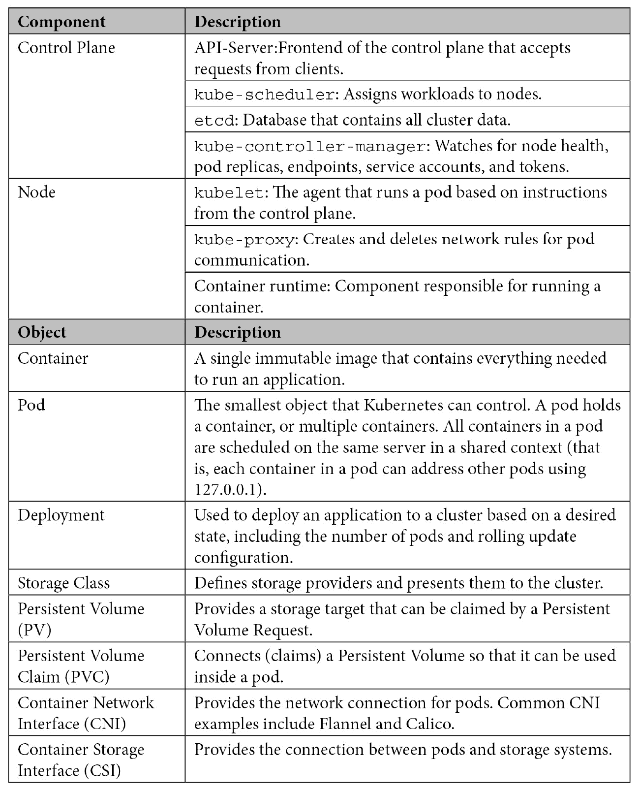
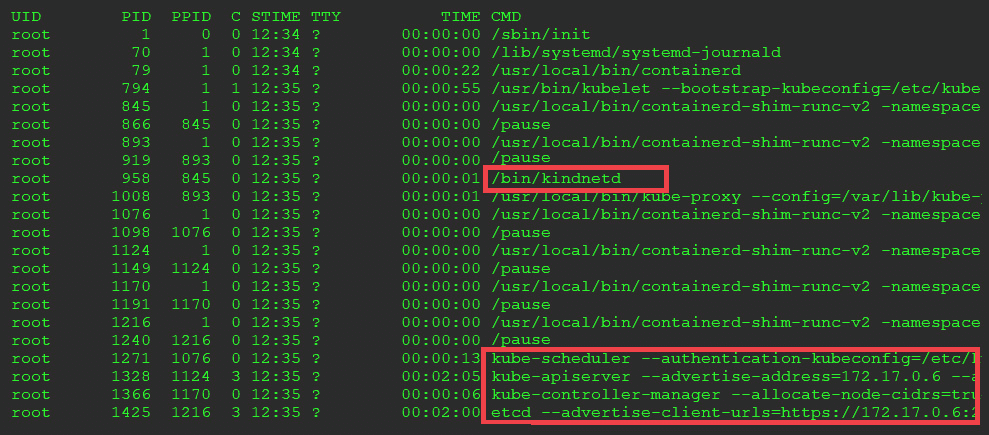
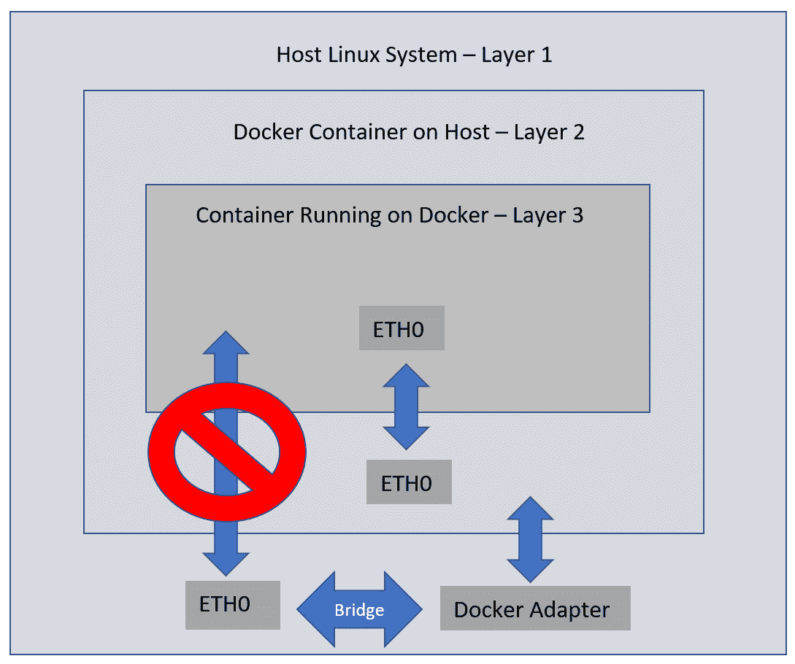
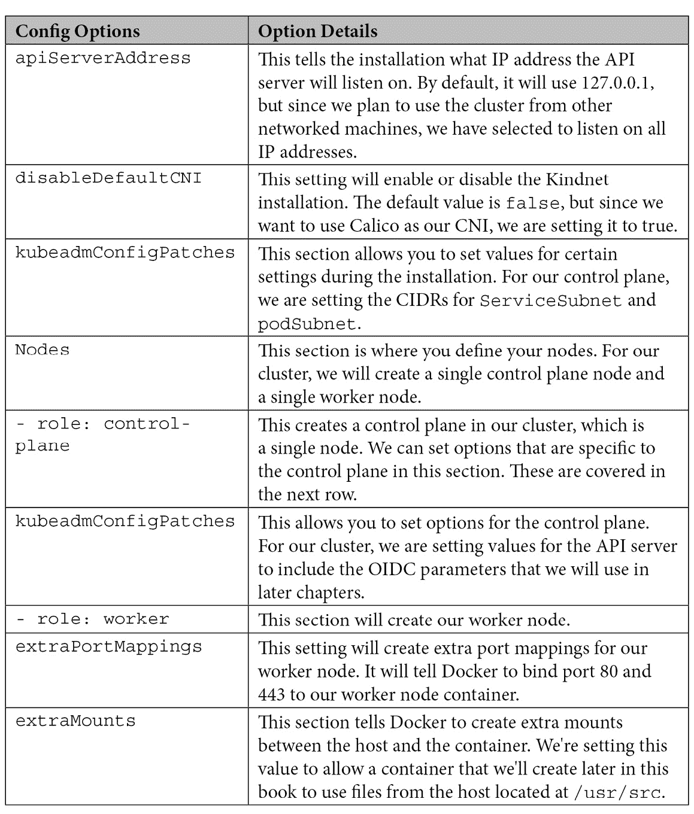
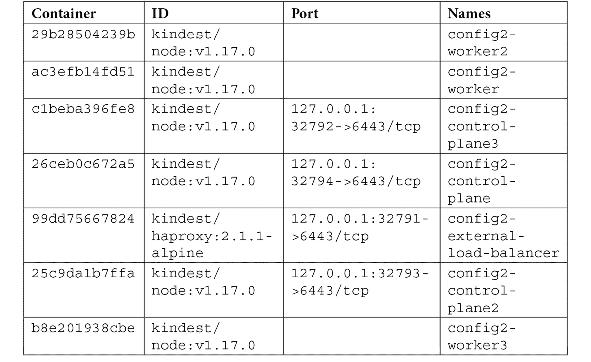
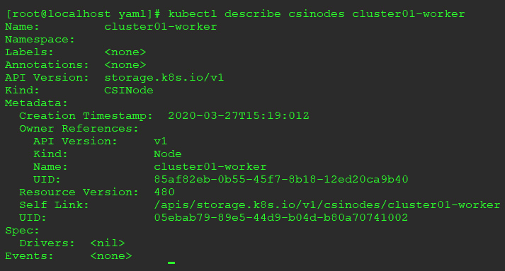
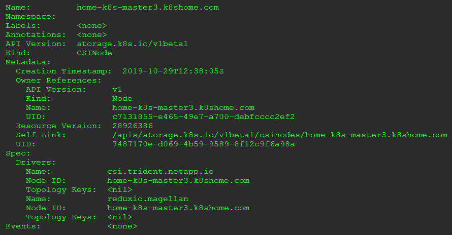

# *第四章*:使用 KinD 部署 Kubernetes

学习 Kubernetes 的最大障碍之一是有足够的资源来创建一个集群进行测试或开发。像大多数信息技术专业人员一样，我们喜欢在笔记本电脑上安装一个 Kubernetes 集群，用于演示和测试产品。

通常，您可能需要运行多个集群来进行复杂的演示，例如多集群服务网格或测试`kubefed2`。这些场景需要多台服务器来创建必要的集群，而这又需要大量内存和虚拟机管理程序。

要对多集群场景进行全面测试，您需要为每个集群创建六个节点。如果使用虚拟机创建集群，则需要足够的资源来运行 6 台虚拟机。每台机器都有开销，包括磁盘空间、内存和 CPU 利用率。

但是，如果您可以仅使用容器创建一个集群呢？由于系统要求降低，使用容器而不是完整的虚拟机将使您能够运行额外的节点，通过一个命令在几分钟内创建和删除集群，编写集群创建脚本，并允许您在单个主机上运行多个集群。

使用容器运行 Kubernetes 集群为您提供了一个环境，由于资源限制，大多数人很难使用虚拟机或物理硬件进行部署。为了解释如何在本地仅使用容器运行集群，我们将使用 KinD 在 Docker 主机上创建一个 Kubernetes 集群。我们将部署一个多节点集群，您将在以后的章节中使用它来测试和部署诸如入口控制器、身份验证、RBAC、安全策略等组件。

在本章中，我们将涵盖以下主题:

*   介绍 Kubernetes 组件和对象
*   使用开发集群
*   正在安装 KinD
*   创建 KinD 群集
*   查看您的 KinD 群
*   为入口添加自定义负载平衡器

我们开始吧！

# 技术要求

本章有以下技术要求:

*   使用第 1 章 、*Docker和容器要领*的步骤安装Docker主机
*   本书 GitHub 存储库中的安装脚本

您可以通过访问本书的 GitHub 资源库来访问本章的代码:[https://GitHub . com/PacktPublishing/Kubernetes-and-Docker-The-Complete-Guide](https://github.com/PacktPublishing/Kubernetes-and-Docker-The-Complete-Guide)。

票据

我们认为有必要指出，本章将引用多个 Kubernetes 对象，其中一些没有太多上下文。 [*第 5 章*](05.html#_idTextAnchor150) *，Kubernetes Bootcamp* ，详细介绍了 Kubernetes 对象，其中许多都带有您可以用来理解它们的命令，因此我们认为在阅读相关内容时使用集群会很有用。

本章中涉及的大部分基本 Kubernetes 主题将在以后的章节中讨论，因此，如果有些主题在您阅读完本章后有点模糊，请不要害怕！它们将在后面的章节中详细讨论。

# 介绍Kubernetes斯组件和对象

由于这一章将提到常见的 Kubernetes 对象和组件，我们希望提供一个简短的术语表，您将会看到，并提供每个术语的简要定义，以提供上下文。

在 [*第五章*](05.html#_idTextAnchor150)*库本内斯训练营*中，我们将回顾库本内斯的组件和包含在集群中的基本对象集。我们还将讨论如何使用 kubectl 可执行文件与集群进行交互:



表 4.1–Kubernetes 组件和对象

虽然这些只是 Kubernetes 集群中可用的的几个对象，但它们是我们将在本章中提到的主要对象。了解每个对象是什么，并对它们的功能有基本的了解，将有助于您理解本章并部署一个 KinD 集群。

## 与集群交互

为了测试我们的 KinD 安装，我们将使用 kubectl 可执行文件与集群交互。我们将在 [*第 5 章*](05.html#_idTextAnchor150)*【Kubernetes boot camp】*中讨论 kubectl，但是由于我们将在本章中使用一些命令，所以我们希望在表格中提供我们将使用的命令，并解释这些选项提供了什么:


表 4.2–基本 kubectl 命令

在本章中，您将使用这些基本命令来部署我们将在本书中使用的集群部分。

接下来，我们将介绍开发集群的概念，然后重点介绍用于创建开发集群的最流行的工具之一:KinD。

# 利用发展集群

多年来，已经创建了各种工具来安装开发 Kubernetes 集群，允许管理员和开发人员在本地系统上执行测试。这些工具中的许多都适用于基本的 Kubernetes 测试，但是它们经常有一些限制，使得它们不太适合快速、高级的场景。

一些最常见的解决方案如下:

*   Docker 桌面
*   迷你库比
*   库比德姆

每种解决方案都有优点、局限性和用例。有些解决方案将您限制为运行控制平面和工作节点的单个节点。其他公司提供多节点支持，但需要额外资源来创建多个虚拟机。根据您的开发或测试需求，这些解决方案可能无法完全满足您的需求。

似乎每隔几周就会出现一个新的解决方案，而创建开发集群的最新选项之一是 Docker(**KinD**)Kubernetes SIG 中的一个 **Kubernetes 的项目。**

使用单个主机，KinD 允许您创建多个集群，每个集群可以有多个控制平面和工作节点。运行多个节点的能力允许使用另一个解决方案进行需要更多资源的高级测试。KinD 受到了社区的好评，在[https://github.com/kubernetes-sigs/kind](https://github.com/kubernetes-sigs/kind)有一个活跃的 Git 社区，还有一个 Slack 频道( *#kind* )。

注意

不要将 KinD 用作生产集群或将 KinD 集群暴露给互联网。虽然 KinD 集群提供了您在生产集群中想要的大多数相同功能，但它的**而不是**是为生产环境设计的。

## 为什么我们为这本书选择了 KinD？

当我们开始这本书的时候，我们希望包括理论，以及实践经验。KinD 允许我们提供脚本来加速和减速集群，而其他解决方案可以做类似的事情，KinD 可以在几分钟内创建一个新的多节点集群。我们希望将控制平面和工作节点分开，以提供一个更“真实”的集群。为了限制硬件要求并使 Ingress 更容易配置，我们将仅为本书中的练习创建一个双节点集群。

多节点集群可以在几分钟内创建，一旦测试完成，集群可以在几秒钟内拆除。能够向上旋转和向下旋转集群使 KinD 成为我们练习的完美平台。KinD 的要求很简单:您只需要一个正在运行的 Docker 守护程序来创建一个集群。这意味着它与大多数操作系统兼容，包括:

*   Linux 操作系统
*   macOS 运行坞站桌面
*   运行 Docker 桌面的窗口
*   Windows running WSL2

    重要说明

    在撰写本文时，KinD 并不支持 Chrome OS。

虽然 KinD 支持大多数操作系统，但我们选择了 Ubuntu 18.04 作为我们的主机系统。本书中的一些练习要求文件位于特定的目录中，选择一个单一的 Linux 版本有助于我们确保练习按照设计工作。如果您在家中无法访问 Ubuntu 服务器，您可以在云提供商(如 GCP)中创建虚拟机。谷歌提供 300 美元的信贷，这足以运行一台 Ubuntu 服务器几周。您可以在[https://cloud.google.com/free/](https://cloud.google.com/free/)查看 GCP 的免费选项。

现在，让我们解释一下 KinD 是如何工作的，以及基本的 KinD Kubernetes 集群是什么样子的。

## 使用基本的 KinD Kubernetes 集群

在高级别上，您可以将 KinD 集群看作是由一个**单个** Docker 容器组成，该容器运行一个控制平面节点和一个工作节点来创建 Kubernetes 集群。为了使部署变得简单和健壮，KinD 将每个 Kubernetes 对象捆绑成一个映像，称为节点映像。此节点映像包含创建单节点群集或多节点群集所需的所有 Kubernetes 组件。

集群运行后，可以使用 Docker 执行到控制平面节点容器中，并查看进程列表。在进程列表中，您将看到控制平面节点运行的标准 Kubernetes 组件:



图 4.1–显示控制平面组件的主机进程列表

如果你要进入一个工作节点检查组件，你会看到所有标准的工作节点组件:


图 4.2–显示工人组件的主机进程列表

我们将涵盖第 5 章[](05.html#_idTextAnchor150)**、Kubernetes斯训练营*中的标准Kubernetes斯组件，包括`kube-apiserver`、`kubelets`、`kube-proxy`、`kube-scheduler`和`kube-controller-manager`。*

 *除了标准的 Kubernetes 组件之外，这两个 KinD 节点还有一个不是大多数标准安装的一部分的附加组件:Kindnet。Kindnet 是安装基本 KinD 集群时包含的默认 CNI。虽然 Kindnet 是默认的 CNI，但您可以选择禁用它并使用替代方案，如 Calico。

现在已经看到了每个节点和 Kubernetes 组件，让我们来看看基本的 KinD 集群包含了什么。要显示完整的集群和所有正在运行的组件，我们可以运行`kubectl get pods --all-namespaces`命令。这将列出集群的所有运行组件，包括我们将在 [*第 5 章*](05.html#_idTextAnchor150)*Kubernetes boot camp*中讨论的基础组件。除了基本集群组件之外，您可能会注意到一个名为`local-path-storage`的名称空间中有一个正在运行的 pod，以及一个名为`local-path-provisioner`的 pod。该 pod 正在运行 KinD 包含的一个附加组件，为集群提供了自动配置`PersistentVolumeClaims`的能力:


图 4.3–kube CTL get pods 显示了本地路径提供程序

大多数开发集群产品都提供了类似的通用功能，人们需要这些功能来测试 Kubernetes 上的部署。它们都提供了一个 Kubernetes 控制平面和工作节点，并且大多数都包括一个默认的 CNI 网络。很少有产品能超越这一基本功能，随着 Kubernetes 工作负载的成熟，您可能会发现需要额外的插件，如`local-path-provisioner`。我们将在本书的一些练习中大量使用这个组件，因为没有它，我们将很难创建一些过程。

为什么要关心开发集群中的持久卷？大多数运行 Kubernetes 的生产集群将为开发人员提供持久存储。通常，存储将由基于数据块存储、S3 或 NFS 的存储系统支持。除了 NFS，大多数家庭实验室很少拥有运行全功能存储系统的资源。`local-path-provisioner`通过向您的 KinD 集群提供昂贵的存储解决方案所能提供的所有功能，消除了用户的这一限制。

在 [*第 5 章*](05.html#_idTextAnchor150) *中，Kubernetes Bootcamp* 中，我们将讨论几个属于 Kubernetes 存储的 API 对象。我们将讨论`CSIdrivers`、`CSInodes`和`StorageClass`物体。群集使用这些对象来提供对后端存储系统的访问。一旦安装和配置完毕，吊舱将使用`PersistentVolumes`和`PersistentVolumeClaims`对象消耗存储空间。理解存储对象很重要，但是当它们第一次发布时，大多数人很难测试它们，因为它们没有包含在大多数 Kubernetes 开发产品中。

KinD 认识到了这一限制，并选择捆绑来自 Rancher 的名为`local-path-provisioner`的项目，该项目基于 Kubernetes 1.10 中引入的 Kubernetes 本地持久卷。

您可能想知道为什么会有人需要一个附加组件，因为 Kubernetes 对本地主机持久卷有本地支持。虽然可能增加了对本地持久存储的支持，但是 Kubernetes 没有增加自动资源调配功能。CNCF 确实提供了自动资源调配器，但它必须作为单独的 Kubernetes 组件进行安装和配置。KinD 使自动资源调配变得容易，因为所有基本安装中都包含了资源调配器。

Rancher 的项目为 KinD 提供了以下内容:

*   创建聚氯乙烯请求时自动创建`PersistentVolumes`
*   一个默认的`StorageClass`命名标准

当自动供应器看到应用编程接口服务器收到一个`PersistentVolumeClaim`请求时，将创建一个`PersistentVolume`，pod 的聚氯乙烯将绑定到新创建的聚氯乙烯。

`local-path-provisioner`为 KinD 集群增加了一个功能，大大扩展了你可以运行的潜在测试场景。如果没有自动调配持久磁盘的能力，测试许多需要持久磁盘的预构建部署将是一项挑战。

在 Rancher 的帮助下，KinD 为您提供了一个解决方案，以便您可以试验动态卷、存储类和其他存储测试，否则将无法在数据中心之外运行。我们将在多个章节中使用置备程序为不同的部署提供卷。我们将指出这些来加强使用自动供应的优势。

## 了解节点映像

节点映像提供了在 Docker 容器中运行 Kubernetes 的魔力。这是一个令人印象深刻的成就，因为 Docker 依赖于一个`systemd`运行系统和大多数容器映像中没有的其他组件。

KinD 从一个基本映像开始，这个映像是团队开发的，包含了 Docker、Kubernetes 和`systemd`所需的一切。由于基础映像基于 Ubuntu 映像，团队删除了不需要的服务，并为 Docker 配置`systemd`。最后，使用基础映像创建节点映像。

小费

如果你想知道基础映像是如何创建的细节，可以在[https://GitHub . com/kubernetes-sigs/KinD/blob/control plane/img/base/Dockerfile](https://github.com/kubernetes-sigs/kind/blob/controlplane/img/base/Dockerfile)上查看 KinD 团队 GitHub 资源库中的 docker file。

## KinD 和 Docker 联网

由于 KinD 使用 Docker 作为容器引擎来运行集群节点，因此所有集群都受到与标准 Docker 容器相同的网络限制。在 [*第 3 章*](03.html#_idTextAnchor062) *【理解 Docker 网络】*中，我们复习了 Docker 网络和 Docker 默认网络堆栈的潜在限制。这些限制不会限制从本地主机测试您的 KinD Kubernetes 集群，但是当您想要从网络上的其他机器测试容器时，它们会导致问题。

除了Docker网络的考虑外，我们还必须考虑库本内斯容器网络接口 T2(T3)CNI(T4)。官方说法是，KinD 团队将联网选项限制在了两个 CNI:KinD net 和 Calico。Kindnet 是他们唯一支持的 CNI，但是您可以选择禁用默认的 Kindnet 安装，这将创建一个没有安装 CNI 的集群。部署集群后，您可以部署 CNI 清单，如 Calico。

许多小型开发集群和企业集群的 Kubernetes 安装都使用 Tigera 的 CNI 印花布，因此，我们选择使用印花布作为我们在他的书中练习的 CNI。

### 追踪筑巢的玩偶

由于容器中容器的部署，运行像 KinD 这样的解决方案可能会令人困惑。我们把它和俄罗斯的嵌套娃娃进行比较，一个娃娃放在另一个娃娃里，然后放在另一个娃娃里，以此类推。当您开始为自己的集群使用 KinD 时，您可能会丢失主机、Docker 和 Kubernetes 节点之间的通信路径。为了保持理智，您应该对每个组件在哪里运行以及如何与每个组件交互有一个坚实的了解。

下图显示了组成 KinD 集群必须运行的三层。需要注意的是，每一层只能与其正上方的层交互。这意味着第 3 层的 KinD 容器只能看到第 2 层运行的 Docker 映像，Docker 映像可以看到第 1 层运行的 Linux 主机。如果您想从主机直接与在您的 KinD 集群中运行的容器通信，您需要通过 Docker 层，然后到第 3 层的 Kubernetes 容器。

理解这一点很重要，这样您就可以有效地使用 KinD 作为测试环境:



图 4.4–主机无法直接与 KinD 通信

作为一个例子，考虑您想要部署一个 web 服务器到您的 Kubernetes 集群。您在 KinD 集群中部署了一个入口控制器，并且希望在 Docker 主机或网络上的不同工作站上使用 Chrome 测试该站点。您试图以端口 80 上的主机为目标，但在浏览器中收到一条失败消息。为什么会失败？

运行 web 服务器的 pod 位于第 3 层，无法从网络上的主机或机器接收直接流量。为了从您的主机访问 web 服务器，您需要将流量从 Docker 层转发到 KinD 层。记得在 [*第三章*](03.html#_idTextAnchor062) *【理解 Docker Networking】*中，我们解释了如何通过给容器添加监听端口来将容器暴露给网络。在我们的例子中，我们需要端口 80 和端口 443。当容器使用端口启动时，Docker 守护程序会将来自主机的传入流量转发到正在运行的 Docker 容器:


图 4.5–主机通过入口控制器与 KinD 通信

随着端口 80 和 443 暴露在 Docker 容器上，Docker 守护程序现在将接受 80 和 443 的传入请求，NGINX 入口控制器将接收流量。这是可行的，因为我们在 Docker 层的两个地方暴露了端口 80 和 443。通过使用主机端口 80 和 443 运行我们的 NGINX 容器，我们已经在 Kubernetes 层公开了它。这个安装过程将在本章后面解释，但是现在，您只需要了解基本流程。

在主机上，您请求一个在 Kubernetes 集群中具有入口规则的 web 服务器:

1.  该请求查看被请求的 IP 地址(在本例中是本地 IP 地址)。
2.  运行我们的 Kubernetes 节点的 Docker 容器正在监听端口 80 和 443 的 IP 地址，因此请求被接受并发送到运行的容器。
3.  您的 Kubernetes 集群中的 NGINX pod 已经配置为使用主机端口 80 和 443，因此流量被转发到 pod。
4.  用户通过 NGINX 入口控制器从网络服务器接收所请求的网页。

这有点令人困惑，但你越是使用 KinD 并与之互动，这就变得越容易。

为了将 KinD 集群用于您的开发需求，您需要了解 KinD 是如何工作的。到目前为止，您已经了解了节点映像以及如何使用该映像创建集群。您还学习了 KinD 网络流量如何在 Docker 主机和运行集群的容器之间流动。有了这些基础知识，我们将继续使用 KinD 创建 Kubernetes 集群。

# 安装 KinD

本章的文件位于 KinD 目录下。您可以使用提供的文件，也可以根据本章内容创建自己的文件。我们将在本节中解释安装过程的每个步骤。

注意

在撰写本文时，KinD 的当前版本是. 0.8.1。版本. 0.8.0 引入了新功能；也就是说，在重启和 Dock er 重启之间保持集群状态。

## 安装 KinD–先决条件

KinD 需要几个先决条件才能创建集群。在本节中，我们将详细说明每个要求以及如何安装 ea ch 组件。

### 安装 Kubectl

因为 KinD 是一个单个可执行文件，所以它不安装`kubectl`。如果您没有安装`kubectl`并且您使用的是 Ubuntu 18.04 系统，您可以通过运行快照安装来安装它:

```
sudo snap install kubectl --classic
```

### 安装 Go

在我们创建 KinD 集群之前，您需要在您的主机上安装 Go。如果您已经安装并运行了 Go，可以跳过这一步。安装 Go 需要您下载 Go 归档文件、提取可执行文件并设置项目路径。以下命令可用于在您的计算机上安装 Go。

安装 Go 的脚本可以通过运行`/chapter4/install-go.sh`从本书的存储库中执行:

```
wget https://dl.google.com/go/go1.13.3.linux-amd64.tar.gz
tar -xzf go1.13.3.linux-amd64.tar.gz
sudo mv go /usr/local
mkdir -p $HOME/Projects/Project1
cat << 'EOF' >> ~/.bash_profile
export -p GOROOT=/usr/local/go
     export -p GOPATH=$HOME/Projects/Project1
export -p PATH=$GOPATH/bin:$GOROOT/bin:$PATH
EOF
source ~/.bash_profile 
```

前面列表中的命令将执行以下操作:

*   下载转到您的主机，解压缩档案，并将文件移动到`/usr/local`。
*   在你的主目录中创建一个名为`Projects/Project1`的 Go 项目文件夹。
*   在`.bash_profile`中增加 Go 环境变量，执行 Go 应用需要用到这些变量。

既然你已经具备了先决条件，我们就可以继续进行第一步了。

## 安装 KinD 二进制文件

安装 KinD 是一个简单的过程；只需一个命令就可以完成。您可以通过在本书位于`/chapter4/install-kind.sh`的存储库中运行包含的脚本来安装 KinD。或者，您可以执行以下命令:

```
GO111MODULE="on" go get sigs.k8s.io/kind@v0.7.0
```

安装后，您可以通过在提示中键入`kind version`来验证 KinD 是否已正确安装:

```
kind version
```

这将返回已安装的版本:

```
kind v0.7.0 go1.13.3 linux/amd64
```

KinD 可执行文件提供了维护集群生命周期所需的所有选项。当然，KinD 可执行文件可以创建和删除集群，但它也提供以下功能:

*   创建自定义构建基础和节点映像的能力
*   可以导出`kubeconfig`或日志文件
*   可以检索集群、节点或`kubeconfig`文件
*   可以将映像加载到节点中

现在，您已经安装了 KinD 实用程序，几乎可以创建自己的 KinD 集群了。在我们执行一些`create cluster`命令之前，我们将解释 KinD 提供的一些创建选项。

# 创建种类簇

现在您已经满足了所有要求，您可以使用 KinD 可执行文件创建您的第一个集群。KinD 实用程序可以创建一个单节点集群，也可以创建一个复杂的集群，该集群为控制平面运行多个节点和多个工作节点。在本节中，我们将讨论 KinD 可执行选项。到本章结束时，您将有一个双节点集群正在运行——一个控制平面节点和一个工作节点。

重要说明

对于本书中的练习，我们将安装一个多节点集群。简单的集群配置就是一个例子，不应该在我们的练习中使用。

## 创建简单的集群

要创建一个在单个容器中运行控制平面和工作节点的简单集群，您只需要使用`create cluster`选项执行 KinD 可执行文件。

让我们创建一个快速单节点集群，看看 KinD 创建快速开发集群的速度有多快。在您的主机上，使用以下命令创建群集:

```
kind create cluster
```

这将通过使用集群名称`kind`在单个 Docker 容器中快速创建包含所有 Kubernetes 组件的集群。它还将为 Docker 容器指定一个名称`kind-control-plane`。如果您想要指定一个集群名称，而不是默认名称，您需要将`--name <cluster name>`选项添加到`create cluster`命令中:

```
Creating cluster "kind" ...
 Ensuring node image (kindest/node:v1.18.2) 
 Preparing nodes
 Writing configuration
 Starting control-plane
 Installing CNI
 Installing StorageClass
Set kubectl context to "kind-kind"
You can now use your cluster with:
kubectl cluster-info --context kind-kind
```

`create`命令将创建集群并修改 kubectl `config`文件。KinD 会将新集群添加到您当前的 kubectl `config`文件中，并且它会将新集群设置为默认上下文。

我们可以通过使用 kubectl 实用程序列出节点来验证集群是否已成功创建:

```
kubectl get nodes
```

这将返回正在运行的节点，对于基本集群，这些节点是单个节点:

```
NAME               STATUS   ROLES    AGE   VERSION
kind-control-plane Ready    master   130m  v1.18.2
```

部署这个单节点集群的主要目的是向您展示 KinD 可以多快地创建一个可以用于测试的集群。在我们的练习中，我们希望分割控制平面和工作节点，以便可以使用下一节中的步骤删除该集群。

## 删除集群

当完成测试后，可以使用`delete`命令删除集群:

```
kind delete cluster –name <cluster name>
```

`delete`命令将快速删除集群，包括您的`kubeconfig`文件中的任何条目。

快速的单节点集群对于许多用例都很有用，但是您可能希望为各种测试场景创建一个多节点集群。创建一个更复杂的集群需要你创建一个配置文件。

## 创建集群配置文件

创建多节点集群时，比如带有自定义选项的双节点集群，我们需要创建一个集群配置文件。配置文件是一个 YAML 文件，格式应该看起来很熟悉。在此文件中设置值允许您自定义 KinD 集群，包括节点数量、API 选项等。我们将用于为该书创建集群的配置文件显示在这里，它包含在该书的存储库中`/chapter4/cluster01-kind.yaml`:

```
kind: Cluster
apiVersion: kind.x-k8s.io/v1alpha4
networking:
  apiServerAddress: "0.0.0.0"
  disableDefaultCNI: true
kubeadmConfigPatches:
- |
  apiVersion: kubeadm.k8s.io/v1beta2
  kind: ClusterConfiguration
  metadata:
    name: config
  networking:
    serviceSubnet: "10.96.0.1/12"
    podSubnet: "192.168.0.0/16"
nodes:
- role: control-plane
- role: worker
  extraPortMappings:
  - containerPort: 80
    hostPort: 80
  - containerPort: 443
    hostPort: 443
  extraMounts:
  - hostPath: /usr/src
    containerPath: /usr/src
```

下表提供了文件中每个自定义选项的详细信息:



表 4.3–KinD 配置选项

如果您计划创建一个超越单节点集群的集群，而不使用高级选项，您将需要创建一个配置文件。了解可用的选项将允许您创建一个 Kubernetes 集群，该集群具有高级组件，如入口控制器或多个节点，以测试部署的故障和恢复过程。

现在，您已经知道了如何创建一个简单的运行集群的一体化容器，以及如何使用配置文件创建一个多节点集群，让我们讨论一个更复杂的集群示例。

## 多节点集群配置

如果您只想要一个没有任何额外选项的多节点集群，您可以创建一个简单的配置文件，列出集群中您想要的数量和节点类型。以下`config`文件将创建一个具有三个控制平面节点和三个工作节点的集群:

```
kind: Cluster
apiVersion: kind.x-k8s.io/v1alpha4
nodes:
- role: control-plane
- role: control-plane
- role: control-plane
- role: worker
- role: worker
- role: worker 
```

使用多个控制平面服务器会带来额外的复杂性，因为在我们的配置文件中，我们只能针对单个主机或 IP。为了使这种配置可用，我们需要在集群前面部署一个负载平衡器。

KinD 已经考虑到了这一点，如果您确实部署了多个控制平面节点，安装将创建一个运行 HAProxy 负载平衡器的附加容器。如果我们从多节点配置中查看正在运行的容器，我们将看到六个节点容器正在运行，一个 HAProxy 容器 r:



表 4.4–KinD 配置选项

请记住，在 [*第 3 章*](03.html#_idTextAnchor062) *【理解Docker网络】*中，我们解释了端口和插座。因为我们只有一台主机，所以每个控制平面节点和 HAProxy 容器都运行在唯一的端口上。每个容器都需要向主机公开，以便它们可以接收传入的请求。在本例中，需要注意的重要一点是分配给 HAProxy 的端口，因为这是集群的目标端口。如果您查看 Kubernetes 配置文件，您会看到它的目标是 [https://127.0.0.1:32791](https://127.0.0.1:32791) ，这是分配给 HAProxy 容器的端口。

当使用`kubectl`执行命令时，它被直接发送到 HAProxy 服务器。使用由 KinD 在集群创建期间创建的配置文件，HAProxy 容器知道如何在三个控制平面节点之间路由流量:

```
# generated by kind
global
  log /dev/log local0
  log /dev/log local1 notice
  daemon
defaults
  log global
  mode tcp
  option dontlognull
  # TODO: tune these
  timeout connect 5000
  timeout client 50000
  timeout server 50000
frontend control-plane
  bind *:6443
  default_backend kube-apiservers
backend kube-apiservers
  option httpchk GET /healthz
  # TODO: we should be verifying (!)
  server config2-control-plane 172.17.0.8:6443 check check-ssl verify none
  server config2-control-plane2 172.17.0.6:6443 check check-ssl verify none
  server config2-control-plane3 172.17.0.5:6443 check check-ssl verify none  
```

如前面的配置文件所示，有一个名为`kube-apiservers`的后端部分，包含三个控制平面容器。每个条目包含一个控制平面节点的 Docker IP 地址，端口分配为 6443，目标是容器中运行的 API 服务器。当您请求 [https://127.0.0.1:32791](https://127.0.0.1:32791) 时，该请求将命中 HAProxy 容器。使用 HAProxy 配置文件中的规则，请求将被路由到列表中的三个节点之一。

由于我们的集群现在由一个负载平衡器负责，因此我们有一个高度可用的控制平面进行测试。

注意

包含的羟基磷灰石映像不可配置。它仅用于处理控制平面和负载平衡应用编程接口服务器。由于这个限制，如果您需要为工作节点使用负载平衡器，您将需要提供自己的负载平衡器。

这方面的一个示例用例是，如果您想要在多个工作节点上使用一个入口控制器。您需要在工作节点前使用负载平衡器来接受传入的 80 和 443 请求，这些请求会将流量转发到运行 NGINX 的每个节点。在本章的最后，我们提供了一个示例配置，其中包括一个定制的 HAProxy 配置，用于对工作节点的流量进行负载平衡。

## 自定义控制平面和库布雷选项

你可能想更进一步测试一些特性，比如 OIDC 集成或者库伯内特特性门。KinD 使用与 kubeadm 安装相同的配置。例如，如果您想将集群与 OIDC 提供商集成，您可以将所需选项添加到配置修补程序部分:

```
kind: Cluster
apiVersion: kind.x-k8s.io/v1alpha4
kubeadmConfigPatches:
- |
  kind: ClusterConfiguration
  metadata:
    name: config
  apiServer:
    extraArgs:
      oidc-issuer-url: "https://oidc.testdomain.com/auth/idp/k8sIdp"
      oidc-client-id: "kubernetes"
      oidc-username-claim: sub
      oidc-client-id: kubernetes
      oidc-ca-file: /etc/oidc/ca.crt
nodes:
- role: control-plane
- role: control-plane
- role: control-plane
- role: worker
- role: worker
- rol: worker
```

有关可用配置选项的列表，请查看[网站上的*使用 Kubernetes 定制控制平面配置，网址为 https://Kubernetes . io/docs/setup/production-environment/tools/kubernetm/control-plane-flags/*](https://kubernetes.io/docs/setup/production-environment/tools/kubeadm/control-plane-flags/)。

现在已经创建了集群文件，可以创建自己的 KinD cl 集群了。

## 创建自定义 KinD 集群

终于！现在您已经熟悉了 KinD，我们可以继续前进，创建我们的集群。

我们需要创建一个受控的已知环境，因此我们将为集群命名，并提供我们在上一节中讨论过的配置文件。

确保您在`chapter4`目录下的克隆存储库中。

要用我们需要的选项创建一个 KinD 集群，我们需要用以下选项运行 KinD 安装程序:

```
kind create cluster --name cluster01 --config c
luster01-kind.yamlThe option --name will set the name of the cluster to cluster01 and the --config tells the installer to use the config file cluster01-kind.yaml.  
```

当您在主机上执行安装程序时，KinD 将开始安装，并告诉您正在执行的每个步骤。整个群集创建过程应该不到 2 分钟:


图 4.6–KinD 集群创建输出

部署的最后一步创建或编辑一个现有的 Kubernetes 配置文件。无论哪种情况，安装程序都会创建一个名为`kind-<cluster name>`的新上下文，并将其设置为默认上下文。

虽然看起来集群安装程序已经完成了它的任务，但是集群**还没有**准备好。有些任务需要几分钟才能完全初始化，由于我们禁用了默认的 CNI 来使用卡利科，我们仍然需要部署卡利科来提供集群网络工作。

## 安装印花棉布

为了向集群中的吊舱提供网络，我们需要安装一个容器网络接口，或者 CNI。我们选择安装卡利科作为我们的 CNI，由于 KinD 只包括 Kindnet CNI，我们需要手动安装卡利科。

如果您在创建步骤后暂停并查看集群，您会注意到一些单元处于挂起状态:

```
coredns-6955765f44-86l77  0/1  Pending  0  10m
coredns-6955765f44-bznjl  0/1  Pending  0  10m
local-path-provisioner-7  0/1  Pending  0  11m 745554f7f-jgmxv
```

这里列出的吊舱需要一个工作的 CNI 开始。这使吊舱进入挂起状态，等待网络。因为我们没有部署默认的 CNI，所以我们的集群不支持网络。为了让这些吊舱从挂起变为运行，我们需要安装一个 CNI——对于我们的集群，这将是卡利科。

要安装 Calico，我们将使用标准的 Calico 部署，它只需要一个清单。要开始部署 Calico，请使用以下命令:

```
kubectl apply -f https://docs.projectcalico.org/v3.11/manifests/calico.yaml 
```

这将从互联网上提取清单并将其应用于集群。随着它的部署，您将看到创建了许多 Kubernetes 对象:


图 4.7–卡利科安装输出

安装过程大约需要一分钟，您可以使用`kubectl get pods -n kube-system`检查其状态。你会看到三个卡利科豆荚被创造出来。两个是`calico-node`吊舱，另一个是`calico-kube-controller`吊舱:

```
NAME                    READY STATUS RESTARTS AGE
calico-kube-controllers  1/1  Running    0    64s -5b644bc49c-nm5wn
calico-node-4dqnv        1/1  Running    0    64s
calico-node-vwbpf        1/1  Running    0    64s
```

如果您再次检查`kube-system`名称空间中的两个 CoreDNS 容器，您会注意到它们已经从挂起状态，从我们安装 Calico 之前的变为运行状态:

```
coredns-6955765f44-86l77   1/1  Running   0  18m
coredns-6955765f44-bznjl   1/1  Running   0  18m
```

现在集群已经安装了一个工作的 CNI，任何依赖网络的吊舱都将处于运行状态。

## 安装入口控制器

我们有一章专门介绍入口，解释所有的技术细节。由于我们正在部署一个集群，并且在未来的章节中需要入口，因此我们需要部署一个入口控制器来展示完整的集群构建。所有这些细节将在 [*第 6 章*](06.html#_idTextAnchor174)*服务、负载平衡和外部域名系统*中详细解释。

安装 NGINX 入口控制器只需要两个清单，我们将从互联网上获取清单，使安装变得容易。要安装控制器，请执行以下两行:

```
kubectl apply -f https://raw.githubusercontent.com/kubernetes/ingress-nginx/nginx-0.28.0/deploy/static/mandatory.yaml
kubectl apply -f https://raw.githubusercontent.com/kubernetes/ingress-nginx/nginx-0.27.0/deploy/static/provider/baremetal/service-nodeport.yaml
```

该部署将在名为`ingress-nginx`的命名空间中创建几个入口所需的 Kubernetes 对象:


图 4.8–NGINX 安装输出

我们还有一个步骤，这样我们就有了一个功能齐全的入口控制器:我们需要向运行的 pod 公开端口 80 和 443。这可以通过修补部署来完成。这里，我们包括了修补部署的补丁:

```
kubectl patch deployments -n ingress-nginx nginx-ingress-controller -p '{"spec":{"template":{"spec":{"containers":[{"name":"nginx-ingress-controller","ports":[{"containerPort":80,"hostPort":80},{"containerPort":443,"hostPort":443}]}]}}}}'
```

恭喜你！你现在有了一个运行卡利科的全功能双节点Kubernetes集群，它带有一个入口控制器。

# 查看您的 KinD 集群

现在有了一个 Kubernetes 集群，我们有能力直接观察 Kubernetes 对象。这将有助于您理解前一章，在这一章中，我们介绍了 Kubernetes 集群中包含的许多基本对象。特别是，我们将讨论 Ki nD 集群中包含的存储对象。

## 实物储存

记住【KinD 包括 Rancher 的自动资源调配器，为集群提供自动化的持久磁盘管理。在 [*第 5 章*](05.html#_idTextAnchor150)*Kubernetes boot camp*中，我们已经介绍了与存储相关的对象，现在我们已经配置了存储系统的集群，我们可以更详细地解释它们。

有一个对象是自动资源调配器不需要的，因为它使用了基本的 Kubernetes 特性:它不需要`CSIdriver`。由于使用本地主机路径作为 PVCs 的能力是 Kubernetes 的一部分，所以我们在我们的 KinD 集群中不会看到任何`CSIdriver`对象。

我们将要讨论的 KinD 集群中的第一个对象是我们的`CSInodes`。在 bootcamp 中，我们提到创建这个对象是为了从基节点对象中分离出任何 CSI 对象。任何可以运行工作负载的节点都将有一个`CSInode`对象。在我们的 KinD 集群中，两个节点都有一个`CSInode`对象。您可以通过执行`kubectl get csinodes`来验证:

```
NAME                      CREATED AT
cluster01-control-plane   2020-03-27T15:18:19Z
cluster01-worker          2020-03-27T15:19:01Z
```

如果我们使用`kubectl describe csinodes <node name>`来描述其中一个节点，您会看到对象的详细信息:



图 4.9–CSInode 描述

要指出的主要是输出的`Spec`部分。这列出了可能安装以支持后端存储系统的任何驱动程序的详细信息。由于我们没有后端存储系统，因此不需要在群集上安装额外的驱动程序。

为了展示节点将列出的内容，下面是安装了两个驱动程序的集群的输出，支持两种不同的供应商存储解决方案:



图 4.10–多驱动示例

如果你查看这个节点的`spec.drivers`部分，你会看到两个不同的名称部分。第一个显示我们安装了支持 NetApp SolidFire 的驱动程序，而第二个是支持 Reduxio 的 stora ge 解决方案的驱动程序。

## 存储驱动程序

正如我们已经提到的，您的 KinD 集群没有安装任何额外的存储驱动程序。如果执行`kubectl get csidrivers`，应用编程接口将不会列出的任何资源。

## KinD 存储类

要将附加到任何群集提供的存储，群集需要一个`StorageClass`对象。Rancher 的提供程序创建了一个名为 standard 的默认存储类。它还将类设置为默认的`StorageClass`，因此您不需要在您的聚氯乙烯请求中提供`StorageClass`名称。如果没有设置默认的`StorageClass`，每个聚氯乙烯请求都需要一个`StorageClass`的名字。如果未启用默认类，并且聚氯乙烯请求未能设置`StorageClass`名称，聚氯乙烯分配将失败，因为应用编程接口服务器将无法将请求链接到`StorageClass`。

注意

在生产集群上，省略分配默认`StorageClass`被认为是一种好的做法。根据您的用户，您可能有忘记设置类别的部署，默认存储系统可能不适合部署需求。这个问题可能不会发生，直到它成为一个生产问题，这可能会影响业务收入或公司的声誉。如果您不分配默认类，开发人员将有一个失败的聚氯乙烯请求，这个问题将在业务受到任何损害之前被发现。

要列出集群上的存储类，请执行`kubectl get storageclasses`，或者使用缩短版本，用`sc`代替`storageclasses`:


图 4.11–默认存储类别

接下来，让我们学习如何使用置备程序。

## 使用 KinD 的存储供应程序

使用附带的置备程序非常简单。由于它可以自动调配存储并被设置为默认类，任何进入的聚氯乙烯请求都会被调配窗格看到，然后创建`PersistentVolume`和`PersistentVolumeClaim`。

为了展示这个过程，让我们通过必要的步骤。以下是在基本 KinD 集群上运行`get pv`和`get pvc`的输出:


图 4.12–光伏和聚氯乙烯示例

请记住`PersistentVolume`不是命名空间对象，因此我们不需要在命令中添加命名空间选项。PVC 是命名空间对象，所以我告诉 Kubernetes 向我展示所有命名空间中可用的 PVC。由于这是一个新群集，并且没有默认工作负载需要持久磁盘，因此没有 PV 或 PVC 对象。

如果没有自动资源调配器，我们需要先创建一个 PV，然后 PVC 才能申请卷。由于我们的集群中运行了 Rancher provisioner，因此我们可以通过部署一个带有 PVC 请求的 pod 来测试创建过程，如下所示:

```
kind: PersistentVolumeClaim
apiVersion: v1
metadata:
  name: test-claim
spec:
  accessModes:
    - ReadWriteOnce
  resources:
    requests:
      storage: 1Mi
---
kind: Pod
apiVersion: v1
metadata:
  name: test-pvc-claim
spec:
  containers:
  - name: test-pod
    image: busybox
    command:
      - "/bin/sh"
    args:
      - "-c"
      - "touch /mnt/test && exit 0 || exit 1"
    volumeMounts:
      - name: test-pvc
        mountPath: "/mnt"
  restartPolicy: "Never"
  volumes:
    - name: test-pvc
      persistentVolumeClaim:
        claimName: test-claim
```

这个聚氯乙烯请求将在默认命名空间中被命名为`test-claim`，并且它正在请求一个 1 MB 的卷。我们确实需要包含`StorageClass`选项，因为 KinD 已经为集群设置了默认的`StorageClass`。

要创建 PVC，我们可以使用 kubectl 执行一个`create`命令，比如`kubectl create -f pvctest.yaml`–Kubernetes 将返回，说明 PVC 已经创建，但需要注意的是，这并不意味着 PVC 已经完全工作。聚氯乙烯对象已经创建，但如果聚氯乙烯请求中缺少任何依赖项，它仍将创建该对象，尽管它将无法完全创建聚氯乙烯请求。

创建聚氯乙烯后，您可以使用两个选项之一来检查真实状态。第一个是简单的`get`命令；也就是`kubectl get pvc`。因为我的请求在默认的名称空间中，所以我不需要在`get`命令中包含名称空间值(注意，我们必须缩短卷的名称，以便它适合页面):

```
NAME         STATUS          VOLUME                                     CAPACITY   ACCESS MODES   STORAGECLASS   AGE
test-claim   Bound    pvc-9c56cf65-d661-49e3-         1Mi            RWO          standard     2s
```

我们知道我们在清单中创建了一个 PVC 请求，但是我们没有创建 PV 请求。如果我们现在查看 PV，我们会看到单个 PV 是根据我们的 PVC 请求创建的。同样，我们缩短了 PV 名称，以便将输出放在一行中:

```
NAME                   CAPACITY   ACCESS MODES   RECLAIM POLICY   STATUS   CLAIM
pvc-9c56cf65-d661-49e3-   1Mi          RWO           Delete       Bound    default/test-claim
```

这就完成了 KinD 存储部分。

由于如此多的工作负载需要持久磁盘，了解 Kubernetes 工作负载如何与存储系统集成非常重要。在本节中，您学习了 KinD 如何向群集添加自动资源调配器。我们将在下一章 [*第五章*](05.html#_idTextAnchor150) *，库本 etes Bootcamp* 中强化我们对这些Kubernetes存储对象的了解。

# 为入口添加自定义负载平衡器

注意

这一节是一个复杂的主题涉及添加一个自定义的 HAProxy 容器，您可以使用它来负载平衡 KinD 集群中的工作节点。*您不应该将这些步骤部署在我们将在其余章节中使用的 KinD 集群上。*

我们添加了这一部分，供任何想了解更多关于如何在多个工作节点之间进行负载平衡的人使用。

KinD 不包括工作节点的负载平衡器。包含的 HAProxy 容器只为 API 服务器创建一个配置文件；该团队不正式支持对默认映像或配置的任何修改。由于您将在日常工作中与负载平衡器进行交互，我们希望添加一节，介绍如何配置自己的 HAProxy 容器，以便在三个 KinD 节点之间实现负载平衡。

首先，我们不会在本书的任何章节中使用这种配置。我们希望每个人都可以使用这些练习，因此为了限制所需的资源，我们将始终使用我们在本章前面创建的双节点集群。如果你想用负载均衡器测试 KinD 节点，我们建议使用不同的 Docker 主机，或者等到你读完这本书，删除你的 KinD 集群。

## 安装先决条件

我们假设您有一个基于以下配置的 KinD 集群:

*   任意数量的控制平面节点
*   三个工作节点
*   集群名为`cluster01`
*   **金网或印花布** ( **CNI** )的工作版本
*   NGINX 入口控制器已安装–已打补丁监听主机上的端口 80 和 443

## 创建 KinD 集群配置

由于您将使用在 Docker 主机的端口 80 和 443 上公开的 HAProxy 容器，因此您不需要公开集群`config`文件中的任何端口。

为了使测试部署更容易，您可以使用这里显示的示例集群配置，它将创建一个简单的六节点集群，并禁用 Kindnet:

```
kind: Cluster
apiVersion: kind.x-k8s.io/v1alpha4
networking:
  apiServerAddress: "0.0.0.0"
  disableDefaultCNI: true
kubeadmConfigPatches:
- |
  apiVersion: kubeadm.k8s.io/v1beta2
  kind: ClusterConfiguration
  metadata:
    name: config
  networking:
    serviceSubnet: "10.96.0.1/12"
    podSubnet: "192.168.0.0/16"
nodes:
- role: control-plane
- role: control-plane
- role: control-plane
- role: worker
- role: worker
- role: worker
```

您需要使用我们在本章前面使用的相同清单来安装 Calico。安装 Calico 后，需要按照本章前面提供的步骤安装 NGINX 入口控制器。

一旦您部署了 Calico 和 NGINX，您应该有一个工作的基础集群。现在，您可以继续部署 custo m HAProxy 容器了。

## 部署定制的 HAProxy 容器

HAProxy 在 Docker Hub 上提供了一个易于部署的容器，只需要一个配置文件就可以启动容器。

要创建配置文件，您需要知道集群中每个工作节点的 IP 地址。在本书的 GitHub 存储库中，我们包含了一个脚本文件，它将为您找到这些信息，创建配置文件，并启动 HAProxy 容器。它位于`HAProxy`目录下，叫做`HAProxy-ingress.sh`。

为了帮助您更好地理解这个脚本，我们将分解脚本的各个部分，并详细说明每个部分正在执行什么。首先，下面的代码块获取集群中每个工作节点的 IP 地址，并将结果保存在一个变量中。后端服务器列表需要这些信息:

```
 #!/bin/bash
worker1=$(docker inspect --format '{{ .NetworkSettings.IPAddress }}' cluster01-worker)
worker2=$(docker inspect --format '{{ .NetworkSettings.IPAddress }}' cluster01-worker2)
worker3=$(docker inspect --format '{{ .NetworkSettings.IPAddress }}' cluster01-worker3)
```

接下来，因为我们将在启动容器时使用绑定挂载，所以我们需要将配置文件放在一个已知的位置。我们选择将其存储在当前用户的个人文件夹中，位于名为`HAProxy`的目录下:

```
# Create an HAProxy directory in the current users home folder
mkdir ~/HAProxy
```

接下来，脚本的以下部分将创建`HAProxy`目录:

```
# Create the HAProxy.cfg file for the worker nodes
tee ~/HAProxy/HAProxy.cfg <<EOF
```

配置的`global`部分设置整个流程的安全性和性能设置:

```
global
  log /dev/log local0
  log /dev/log local1 notice
  daemon
```

`defaults`部分用于配置将应用于配置值中所有前端和后端部分的值:

```
defaults
  log global
  mode tcp
  timeout connect 5000
  timeout client 50000
  timeout server 50000
frontend workers_https
  bind *:443
  mode tcp
  use_backend ingress_https
backend ingress_https
  option httpchk GET /healthz
  mode tcp
  server worker $worker1:443 check port 80
  server worker2 $worker2:443 check port 80
  server worker3 $worker3:443 check port 80
```

这告诉 HAProxy 创建一个名为`workers_https`的前端，并为传入的请求绑定 IP 地址和端口，使用 TCP 模式，并使用名为`ingress_https`的后端。

`ingress_https`后端包括使用端口 443 作为目的地的三个工作节点。检查端口是一个健康检查，将测试端口 80。如果服务器在端口 80 上回复，它将被添加为请求的目标。虽然这是 HTTPS 端口 443 规则，但我们仅使用端口 80 来检查来自 NGINX pod 的网络回复:

```
frontend workers_http
  bind *:80
  use_backend ingress_http
backend ingress_http
  mode http
  option httpchk GET /healthz
  server worker $worker1:80 check port 80
  server worker2 $worker2:80 check port 80
  server worker3 $worker3:80 check port 80
```

这个`frontend`部分创建了一个前端，接受端口 80 上的传入 HTTP 流量。然后，它将后端名为`ingress_http`的服务器列表用于端点。就像在 HTTPS 部分一样，我们使用端口 80 来检查在端口 80 上运行服务的任何节点。任何回复检查的端点都将被添加为 HTTP 流量的目的地，任何没有运行 NGINX 的节点都不会回复，这意味着它们不会被添加为目的地:

```
EOF
```

这就结束了我们文件的创建。最终文件将在`HAProxy`目录中创建:

```
# Start the HAProxy Container for the Worker Nodes
docker run --name HAProxy-workers-lb -d -p 80:80 -p 443:443 -v ~/HAProxy:/usr/local/etc/HAProxy:ro HAProxy -f /usr/local/etc/HAProxy/HAProxy.cfg
```

最后一步是用我们创建的包含三个工作节点的配置文件启动一个运行 HAProxy 的 Docker 容器，这三个工作节点暴露在端口 80 和 443 上的 Docker 主机上。

现在，您已经学习了如何为您的工作节点安装定制的 HAProxy 负载平衡器，让我们看看配置是如何工作的。

## 了解高速公路交通流量

集群将总共运行八个容器。其中六个容器将是标准的 Kubernetes 组件；即三个控制平面服务器和三个工作节点。另外两个容器是 KinD 的 HAProxy 服务器和您自己定制的 HAProxy 容器:


图 4.13–定制的 HAProxy 容器正在运行

在练习中，这个集群输出与我们的双节点集群有一些不同。请注意，工作节点没有暴露在任何主机端口上。工作节点不需要任何映射，因为我们的新 HAProxy 服务器正在运行。如果您查看我们创建的 HAProxy 容器，它会暴露在主机端口 80 和 443 上。这意味着在端口 80 或 443 上对主机的任何传入请求都将被定向到定制的 HAProxy 容器。

默认的 NGINX 部署只有一个副本，这意味着入口控制器运行在单个节点上。如果我们查看 HAProxy 容器的日志，我们会看到一些有趣的东西:

```
 [NOTICE] 093/191701 (1) : New worker #1 (6) forked
[WARNING] 093/191701 (6) : Server ingress_https/worker is DOWN, reason: Layer4 connection problem, info: "SSL handshake failure (Connection refused)", check duration: 0ms. 2 active and 0 backup servers left. 0 sessions active, 0 requeued, 0 remaining in queue.
[WARNING] 093/191702 (6) : Server ingress_https/worker3 is DOWN, reason: Layer4 connection problem, info: "SSL handshake failure (Connection refused)", check duration: 0ms. 1 active and 0 backup servers left. 0 sessions active, 0 requeued, 0 remaining in queue.
[WARNING] 093/191702 (6) : Server ingress_http/worker is DOWN, reason: Layer4 connection problem, info: "Connection refused", check duration: 0ms. 2 active and 0 backup servers left. 0 sessions active, 0 requeued, 0 remaining in queue.
[WARNING] 093/191703 (6) : Server ingress_http/worker3 is DOWN, reason: Layer4 connection problem, info: "Connection refused", check duration: 0ms. 1 active and 0 backup servers left. 0 sessions active, 0 requeued, 0 remaining in queue.
```

您可能已经注意到日志中的一些错误，例如 SSL 握手失败和`Connection refused`。虽然这些看起来确实像错误，但它们实际上是工作节点上的失败检查事件。请记住，NGINX 仅在单个 pod 中运行，由于我们的 HAProxy 后端配置中有所有三个节点，它将检查每个节点上的端口。任何未能回复的节点都不会用于负载平衡流量。在我们当前的配置中，这确实实现了负载平衡，因为我们在一个节点上只有 NGINX。但是，它确实为入口控制器提供了高可用性。

如果您仔细查看日志输出，您将看到在一个定义的后端上有多少服务器处于活动状态；例如:

```
check duration: 0ms. 1 active and 0 backup servers left.
```

日志输出中的每个服务器池显示 1 个活动端点，因此我们知道 HAProxy 已经在端口 80 和 443 上成功找到了一个 NGINX 控制器。

为了找出 HAProxy 服务器连接到了什么工作器，我们可以使用日志中的失败连接。每个后端都会列出失败的连接。例如，根据其他两个工作节点显示为`DOWN`的日志，我们知道正在工作的节点是`cluster01-worker2`:

```
Server ingress_https/worker is DOWN Server ingress_https/worker3 is DOWN
```

让我们模拟一个节点故障来证明 HAProxy 为 NGINX 提供了高可用性。

## 模拟库伯莱故障

请记住，KinD 节点是短暂的，停止任何容器可能会导致它在重新启动时失败。那么，既然我们不能简单地停止容器，我们如何模拟工作节点故障呢？

为了模拟故障，我们可以在一个节点上停止 kubelet 服务，这会提醒`kube-apisever`，这样它就不会在该节点上安排任何额外的 pods。在我们的例子中，我们想证明 HAProxy 正在为 NGINX 提供高可用性支持。我们知道运行的容器在`worker2`上，所以这就是我们想要“取下来”的节点

停止`kubelet`最简单的方法是向容器发送`docker exec`命令:

```
docker exec cluster01-worker2 systemctl stop kubelet
```

您将看不到此命令的任何输出，但是如果您等待几分钟让群集接收更新的节点状态，您可以通过查看节点列表来验证该节点已关闭:

```
kubectl get nodes.
```

您将收到以下输出:


图 4.14–工人 2 处于未就绪状态

这验证了我们刚刚模拟了 kubelet 故障，并且`worker2`处于`NotReady`状态。

在 kubelet“故障”之前运行的任何 pods 都将继续运行，但是`kube-scheduler`在 kubelet 问题解决之前不会在节点上调度任何工作负载。因为我们知道 pod 不会在节点上重新启动，所以我们可以删除 pod，以便它可以在不同的节点上重新计划。

您需要获取 pod 名称，然后将其删除以强制重新启动:

```
kubectl get pods -n ingress-nginx
nginx-ingress-controller-7d6bf88c86-r7ztq
kubectl delete pod nginx-ingress-controller-7d6bf88c86-r7ztq -n ingress-nginx
```

这将迫使调度程序在另一个工作节点上启动容器。这也将导致 HAProxy 容器更新后端列表，因为 NGINX 控制器已经移动到另一个工作节点。

如果你再次查看的 HAProxy 日志，你会发现 HAProxy 已经更新了后端以包括`cluster01-worker3`，并且从活动服务器列表中删除了`cluster01-worker2`:

```
[WARNING] 093/194006 (6) : Server ingress_https/worker3 is UP, reason: Layer7 check passed, code: 200, info: "OK", check duration: 4ms. 2 active and 0 backup servers online. 0 sessions requeued, 0 total in queue.
[WARNING] 093/194008 (6) : Server ingress_http/worker3 is UP, reason: Layer7 check passed, code: 200, info: "OK", check duration: 0ms. 2 active and 0 backup servers online. 0 sessions requeued, 0 total in queue.
[WARNING] 093/195130 (6) : Server ingress_http/worker2 is DOWN, reason: Layer4 timeout, check duration: 2000ms. 1 active and 0 backup servers left. 0 sessions active, 0 requeued, 0 remaining in queue.
[WARNING] 093/195131 (6) : Server ingress_https/worker2 is DOWN, reason: Layer4 timeout, check duration: 2001ms. 1 active and 0 backup servers left. 0 sessions active, 0 requeued, 0 remaining in queue.
```

如果您计划使用该高可用性集群进行额外的测试，您将希望在`cluster01-worker2`上重新启动 kubelet。如果您计划删除高可用性集群，您只需运行一个 KinD 集群删除，所有节点都将被删除。

## 删除 HAProxy 容器

一旦你删除了你的 KinD 集群，你需要手动移除我们添加的 HAProxy 容器。由于 KinD 没有创建我们的自定义负载平衡器，删除集群不会删除容器。

要删除自定义 HAProxy 容器，运行`docker rm`命令强制删除映像:

```
docker rm HAProxy-workers-lb –force
```

这将停止容器，并将其从 Docker 的列表中删除，允许您使用与未来的 KinD 集群相同的名称再次运行它。

# 总结

在本章中，您了解了名为 KinD 的 Kubernetes SIG 项目。我们详细讨论了如何在 KinD 集群中安装可选组件，包括作为 CNI 的 Calico 和作为入口控制器的 NGINX。最后，我们介绍了 KinD 集群中包含的 Kubernetes 存储对象的细节。

希望在本章的帮助下，您现在理解了使用 KinD 可以给您和您的组织带来的力量。它提供了一个易于部署、完全可配置的 Kubernetes 集群。单个主机上运行的集群数量理论上仅受主机资源的限制。

在下一章中，我们将深入探讨 Kubernetes 对象。我们称之为下一章 *Kubernetes 训练营*，因为它将涵盖大部分的基本 Kubernetes 对象以及每个对象的用途。下一章可以被认为是“Kubernetes 袖珍指南”它包含对 Kubernetes 对象和它们的作用以及何时使用它们的快速引用。

这是一个打包的章节，旨在为那些有 Kubernetes 经验的人提供复习课程，或者为那些刚接触 Kubernetes 的人提供速成课程。我们写这本书的目的是超越基本的Kubernetes对象，因为现在市场上有很多书很好地涵盖了Kubernetes的基础知识。

# 问题

1.  What object must be created before you can create a `PersistentVolumeClaim`?

    A.聚氯乙烯

    B.唱片

    C.`PersistentVolume`

    D.`VirtualDisk`

2.  KinD includes a dynamic disk provisioner. What company created the provisioner?

    A.微软

    B.CNCF(消歧义)

    C.VMware

    D.大牧场主

3.  If you create a KinD cluster with multiple worker nodes, what would you install to direct traffic to each node?

    A.负载平衡器

    B.代理服务系统

    C.没有任何东西

    D.网络负载平衡器

4.  True or false: A Kubernetes cluster can only have one CSIdriver installed.

    A.真实的

    B.错误的*