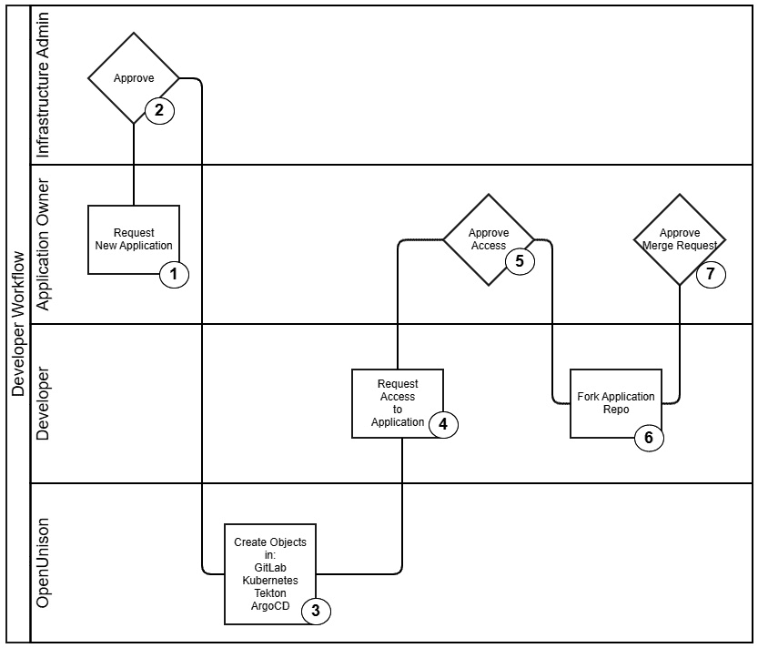
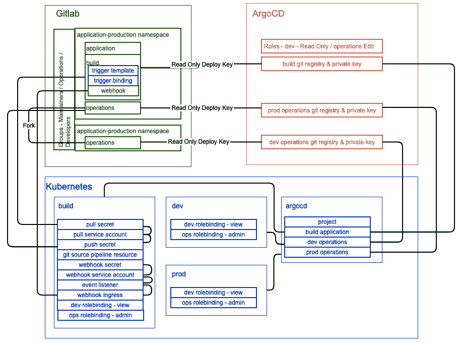

# *第十四章*:提供平台

到目前为止，本书的每一章都集中在集群的基础设施上。我们已经探索了如何部署 Kubernetes，如何保护它，以及如何监控它。我们还没有讨论的是如何部署应用。

在这一章，也就是我们的最后一章，我们将利用我们对 Kubernetes 的了解来构建一个应用部署平台。我们将基于一些常见的企业需求来构建我们的平台。在我们不能直接实现一个需求的地方，因为在 Kubernetes 上构建一个平台可以填充它自己的书，我们将调用它并提供一些见解。

在本章中，我们将涵盖以下主题:

*   设计管道
*   准备我们的集群
*   部署 GitLab
*   部署 Tekton
*   部署 ArgoCD
*   使用 OpenUnison 自动化项目入职

# 技术要求

要执行本章中的练习，您将需要一个干净的 KinD 集群，该集群至少有 8 GB 内存、75 GB 存储空间和 4 个 CPU。我们将构建的系统是极简主义的，但仍然需要相当大的马力来运行。

您可以在以下 GitHub 存储库中访问本章的代码:[https://GitHub . com/PacktPublishing/Kubernetes-and-Docker-The-Complete-Guide](https://github.com/PacktPublishing/Kubernetes-and-Docker-The-Complete-Guide)。

# 设计管道

术语“管道”在 Kubernetes 和 DevOps 世界中被广泛使用。很简单，管道是一个过程，通常是自动化的，它接受代码并让它运行。这通常包括以下内容:


图 14.1–一个简单的管道

让我们快速浏览一下此过程中涉及的步骤:

1.  将源代码存储在中央存储库中，通常是 Git
2.  当提交代码时，构建它并生成工件，通常是一个容器
3.  告诉平台——在这个例子中是 Kubernetes——推出新容器并关闭旧容器

这是管道能得到的最基本的东西，在大多数部署中用处不大。除了构建和部署代码之外，我们还希望确保扫描容器中已知的漏洞。在投入生产之前，我们可能还想通过一些自动化测试来运行我们的容器。在企业部署中，通常会有一个法规遵从性要求，即有人也负责生产转移。考虑到这一点，管道开始变得更加复杂:


图 14.2–具有常见企业需求的管道

管道增加了一些额外的步骤，但它仍然是线性的，只有一个起点，即提交。这也是非常简单化和不现实的。随着新的**常见漏洞和暴露** ( **CVEs** )的发现和修补，应用所基于的基本容器和库不断更新，这是一种对安全漏洞进行编目和识别的常见方法。除了让开发人员更新应用代码以满足新的需求之外，您还需要一个系统来扫描代码和基本容器以获得可用的更新。这些扫描器监视您的基本容器，并且可以在新的基本容器准备好之后触发构建。虽然扫描器可以调用一个 API 来触发管道，但是您的管道已经在等待您的 Git 存储库去做一些事情，所以最好简单地向 Git 存储库添加一个提交或拉请求来触发管道:


图 14.3–集成扫描仪的管道

这意味着您的应用代码被跟踪，您的操作更新在 Git 中被跟踪。Git 现在不仅是你的应用代码的真实来源，也是操作更新的真实来源。到了审核的时候，你有一个现成的变更日志！如果您的策略要求您将变更输入到变更管理系统中，只需从 Git 中导出变更。

到目前为止，我们专注于我们的应用代码，只是把**推出**放在我们管道的末端。最后一步通常意味着用我们新构建的容器修补一个`Deployment`或`StatefulSet`，让库本内特斯做旋转新的`Pods`和缩小旧的工作。这可以通过一个简单的 API 调用来完成，但是我们如何跟踪和审计这种变化呢？真理的来源是什么？

我们在 Kubernetes 中的应用被定义为存储在`etcd`中的一系列对象，这些对象通常用 YAML 文件表示为代码。为什么不把这些文件也存储在 Git 存储库中呢？这给我们带来了与用 Git 存储应用代码相同的好处。对于应用源和应用的操作，我们都有一个单一的真实来源！现在，我们的管道还包括一些步骤:


图 14.4–GitOps 管道

在这个图中，我们的展示用我们应用的库本内斯·YAML 更新了一个 Git 存储库。我们集群中的一个控制器监视 Git 的更新，当它看到更新时，让集群与 Git 中的内容同步。它也能探测到我们星系团中的漂移，并使其与我们的真相之源重新对齐。

这个对 Git 的关注叫做 **GitOps** 。其思想是应用的所有工作都是通过代码完成的，而不是直接通过 API。你对这个想法有多严格可以决定你的平台是什么样的。接下来，我们将探讨意见如何塑造您的平台。

## 固执己见的平台

谷歌的开发者倡导者、Kubernetes 世界的领导者 Kelsey Hightower 曾经说过:“Kubernetes 是一个构建平台的平台。这是一个更好的起点；不是终局。”当您看到构建基于 Kubernetes 的产品的供应商和项目的情况时，他们都对应该如何构建系统有自己的看法。举个例子，红帽的 **OpenShift 集装箱平台** ( **OCP** )想要成为多租户企业部署的一站式平台。它建立在我们讨论的大量管道中。您定义了一个由提交触发的管道，该管道构建一个容器并将其推入自己的内部注册表，然后触发新容器的部署。名称空间是租户的边界。Canonical 是一个极简主义的发行版，不包含任何管道组件。亚马逊、Azure 和谷歌等托管供应商提供集群的构建模块和管道的托管构建工具，但让您自行构建您的平台。

对于使用哪个平台，没有正确的答案。每个都是固执己见的，适合您的部署将取决于您自己的要求。根据您企业的规模，看到部署多个平台并不奇怪！

看了固执己见的平台的想法之后，让我们探讨一下构建管道的安全影响。

## 保护你的管道

根据您的起点，这可能会很快变得复杂。你的管道有多少是一个集成的系统，或者可以用一个多彩的美国口语来描述，包括管道胶带？即使在所有组件都在的平台上，将它们捆绑在一起通常也意味着构建一个复杂的系统。作为您的管道的一部分，大多数系统都有一个可视化组件。通常，视觉组件是仪表板。用户和开发人员可能需要访问该仪表板。你不想为所有这些系统维护单独的帐户，是吗？您需要为管道的所有组件提供一个登录点和入口。

在确定如何对使用这些系统的用户进行身份验证后，下一个问题是如何自动化部署。管道的每个组件都需要配置。它可以像通过应用编程接口调用创建的对象一样简单，也可以像用 SSH 密钥将 Git repo 和构建过程捆绑在一起以实现安全自动化一样复杂。在如此复杂的环境中，手动创建管道基础设施将导致安全漏洞。这也将导致无法管理的系统。自动化流程并提供一致性将帮助您保护基础架构并保持其可维护性。

最后，从安全角度理解 GitOps 对我们集群的影响是很重要的。我们在 [*第 7 章*](07.html#_idTextAnchor203) 、*将身份验证集成到您的集群中*和 [*第 8 章*](08.html#_idTextAnchor228) *、使用活动目录用户的 RBAC 策略*中讨论了对管理员和开发人员使用 Kubernetes API 进行身份验证以及授权访问不同的 API。如果有人可以签入一个为其分配名称空间的`admin` `ClusterRole`的`RoleBinding`，并且 GitOps 控制器自动将其推送到集群，会有什么影响？在设计平台时，请考虑开发人员和管理员希望如何与之交互。说“让每个人都与他们应用的 Git 注册表交互”是很有诱惑力的，但这意味着作为许多请求的集群所有者，您要承担负担。正如我们在 [*第 8 章*](08.html#_idTextAnchor228)*使用活动目录的 RBAC 策略*中所讨论的，这可能会使您的团队成为企业中的瓶颈。在这种情况下，了解您的客户对于了解他们希望如何与其运营互动非常重要，即使这不是您想要的。

在接触了 GitOps 和管道的一些安全方面之后，让我们探讨一下典型管道的需求以及我们将如何构建它。

## 构建我们平台的需求

Kubernetes 部署，尤其是在企业环境中，通常有以下基本要求:

*   **开发和测试环境**:至少两个集群，测试集群级别的变化对应用的影响
*   **开发人员沙箱**:开发人员可以构建容器并对其进行测试而不用担心对共享命名空间的影响的地方
*   **源代码控制和问题跟踪**:存储代码和跟踪未完成任务的地方

除了这些基本要求之外，企业通常还有其他要求，例如定期访问审查、基于策略限制访问，以及为可能影响共享环境的操作分配责任的工作流。

对于我们的平台，我们希望包含尽可能多的这些需求。为了更好地将部署自动化到我们的平台上，我们将每个应用定义为具有以下内容:

*   **一个开发命名空间**:开发人员就是管理员。
*   **一个生产命名空间**:开发者就是观众。
*   **一个源码控制项目**:开发者可以分叉。
*   **一个构建过程**:由 Git 的更新触发。
*   **一个部署流程**:由 Git 更新触发。

此外，我们希望我们的开发人员拥有自己的沙盒，这样每个用户都将获得自己的开发名称空间。

重要说明

在实际部署中，您会希望将开发和生产环境分离到单独的集群中。这使得测试集群范围内的操作(如升级)变得更加容易，而不会影响正在运行的应用。我们在一个集群中做所有事情，让您更容易独立设置。

为了提供对每个应用的访问，我们将定义三个角色:

*   **所有者**:作为应用所有者的用户可以批准其应用内其他角色的访问权限。此角色分配给应用请求者，并且可以由应用所有者分配。所有者还负责推动开发和生产的变革。
*   **开发人员**:这些用户可以访问应用的源代码控制，并且可以管理应用的开发命名空间。他们可以查看生产命名空间中的对象，但不能编辑任何内容。该角色可以由任何用户请求，并由应用所有者批准。
*   **操作**:这些用户具有作为开发人员的能力，但是也可以根据需要对生产命名空间进行更改。该角色可以由任何用户请求，并得到应用所有者的批准。

我们还将创建一些全环境角色:

*   **系统批准者**:具有该角色的用户可以批准对任何系统范围角色的访问。
*   **集群管理员**:这个角色专门负责管理我们的集群和组成我们管道的应用。它可以由任何人请求，并且必须由系统批准者角色的成员批准。
*   **开发人员**:任何登录的人都会获得自己的开发命名空间。其他用户不能请求访问这些命名空间。这些名称空间没有直接连接到任何 CI/CD 基础设施或 Git 存储库。

即使使用非常简单的平台，我们也有六个角色需要映射到组成管道的应用。每个应用都有自己的身份验证和授权过程，这些角色需要映射到这些过程。这只是自动化对集群安全性如此重要的一个例子。基于电子邮件请求手动配置此访问可能会变得难以管理。

开发人员在应用中需要经历的工作流程将与我们之前设计的 GitOps 流程一致:

*   应用所有者将请求创建应用。一旦获得批准，将为应用代码、管道构建清单和 Kubernetes 清单创建一个 Git 存储库。开发和生产名称空间也将使用适当的`RoleBinding`对象来创建。将创建反映每个应用角色的组，并将对这些组的访问权限授予应用所有者。
*   开发人员和操作人员可以通过请求或由应用所有者直接提供来访问应用。一旦被授予访问权限，开发人员的沙箱和开发命名空间中都需要更新。Git 存储库的更新是在用户的分叉中进行的，拉取请求用于将代码合并到驱动自动化的主存储库中。
*   所有的构建都是通过应用源代码控制中的“脚本”来控制的。
*   所有工件都发布到一个集中的容器注册中心。
*   所有生产更新都必须得到应用所有者的批准。

这个基本工作流不包括工作流的典型组件，如代码和容器扫描、定期访问重新认证或特权访问要求。这一章的主题本身很容易成为一本完整的书。目标不是构建一个完整的企业平台，而是为您提供一个构建和设计自己系统的起点。

## 选择我们的技术堆栈

在本节前面的部分中，我们一般性地讨论了管道。现在，让我们进入管道中需要什么技术的细节。我们之前已经确定，每个应用都有应用源代码和 Kubernetes 清单定义。它还必须构建容器。需要有一种方法来观察 Git 的变化并更新我们的集群。最后，我们需要一个自动化平台，以便所有这些组件协同工作。

基于我们对平台的要求，我们希望技术具有以下特点:

*   **开源**:我们不希望你为了这本书就去买任何东西！
*   **API 驱动的**:我们需要能够以自动化的方式供应组件和访问。
*   **有一个支持外部认证的可视化组件**:这本书聚焦企业，企业里的每个人都爱自己的 GUI。只是每个应用没有不同的凭据。
*   **支持于 Kubernetes** :这是一本关于 Kubernetes 的书。

为了满足这些要求，我们将在集群中部署以下组件:

*   **Git 注册表–Git lab**:Git lab 是一个功能强大的系统，为使用支持外部身份验证的 Git(即**单点登录(SSO)** )提供了很好的 UI 和体验。它集成了问题管理和广泛的应用编程接口。它也有一个赫尔姆图表，我们为这本书量身定制，运行一个最小的安装。
*   **自动化构建–Tekton**:最初是 Kubernetes 功能即服务部署的 Knative 项目的构建部分，Tekton 被剥离到自己的项目中，为通用应用提供构建服务。它在 Kubernetes 中运行，所有交互都是通过 Kubernetes API 进行的。还有一个早期仪表板！
*   **容器注册表–简单 Docker 注册表**:有很多非常有能力的开源注册表。由于这个部署会很快变得复杂，我们决定只使用 Docker 提供的注册表。上面不会有任何安全性，所以不要在生产中使用！
*   **GitOps–ArgoCD**:ArgoCD 是 Intuit 和 Weaveworks 合作打造的功能丰富的 GitOps 平台。它是 Kubernetes 原生的，有自己的 API，并将其对象存储为 Kubernetes 自定义资源，使其更容易自动化。它的用户界面和命令行界面工具都使用 OpenID Connect 与单点登录集成。
*   **访问、身份验证和自动化–OpenUnison**:我们将继续使用 OpenUnison 在我们的集群中进行身份验证。我们还将集成我们技术堆栈的用户界面组件，为我们的平台提供单一门户。最后，我们将使用 OpenUnison 的工作流基于我们的角色结构来管理对每个系统的访问，并提供所有东西协同工作所需的对象。访问将通过 OpenUnison 的自助服务门户网站提供。

翻阅这一技术栈，你可能会问“为什么不选择 *XYZ* ？”Kubernetes 生态系统是多样化的，不缺乏适合您集群的优秀项目和产品。这绝不是一个确定的堆栈，甚至也不是一个“推荐”的堆栈。它是满足我们需求的应用的集合，让我们专注于正在实现的过程，而不是学习特定的技术。

您可能还会发现，即使是这个堆栈中的工具之间也有相当多的重叠。例如，GitLab 有 GitOps 功能和自己的构建系统，但我们选择在本章中不使用它们。我们这样做是为了让您能够看到如何将不同的系统连接在一起以构建一个平台。您的平台可能使用 GitHub 的 SaaS 解决方案进行源代码控制，但在内部运行构建，并与亚马逊的容器注册相结合。我们希望您了解如何将这些系统连接起来，以构建一个平台，而不是专注于特定的工具。

本节深入探讨了管道设计背后的理论，并探讨了构建基于 Kubernetes 的平台的常见需求。我们确定了可以实现这些需求的技术组件，以及我们选择它们的原因。有了这些知识，是时候建造了！

# 准备我们的集群

在我们开始部署我们的技术堆栈之前，我们需要做一些事情。我建议从一个新鲜的集群开始。如果您正在使用本书中的 KinD 集群，请从一个新集群开始。我们正在部署几个需要集成的组件，重新开始会更简单、更容易，而不是潜在的与以前的配置做斗争。在我们开始部署将组成我们的堆栈的应用之前，我们将部署 JetStack 的证书管理器来自动化证书颁发、一个简单的容器注册表以及用于身份验证和自动化的 OpenUnison。

## 部署证书管理器

专注于 Kubernetes 的咨询公司 JetStack 创建了一个名为`cert-manager`的项目，以使证书的创建和更新更容易自动化。这个项目的工作原理是让您使用 Kubernetes 自定义资源定义发行者，然后在`Ingress`对象上使用注释，使用这些发行者生成证书。最终的结果是，一个集群运行在适当管理的轮换证书上，而不会生成单个**证书签名请求** ( **CSR** )或担心过期！

`cert-manager`项目最常被提及的是*让我们加密*(https://letsencrypt.org/)，以自动发布由商业认可的证书颁发机构免费签署的证书(如啤酒)。这是可能的，因为*让我们加密*自动化了这个过程。证书有效期只有 90 天，整个过程都是由应用编程接口驱动的。为了推动这种自动化，您必须有某种方式让*让我们加密*来验证您试图获取证书的域的所有权。在本书中，我们一直使用`nip.io`来模拟 DNS。如果你有一个你可以使用并且得到`cert-manager`支持的域名服务，比如亚马逊的 53 号路线，那么这是一个很好的解决方案。

由于我们使用的是`nip.io`，我们将使用自签名的证书颁发机构来部署`cert-manager`。这给了我们一个好处，拥有一个可以快速生成证书的证书颁发机构，而不必担心域验证。然后，我们将指示我们的工作站信任该证书以及我们部署的应用，以便使用正确构建的证书来保护一切。

重要说明

使用自签名证书颁发机构是大多数企业内部部署的常见做法。这避免了必须处理潜在的验证问题，因为商业签署的证书不会提供太多价值。大多数企业都能够通过其活动目录基础结构分发内部证书颁发机构的证书。您的企业有办法请求内部证书或也可以使用的通配符。

部署`cert-manager`的步骤如下:

1.  从您的集群中，部署`cert-manager`清单:

    ```
    $ kubectl apply --validate=false -f https://github.com/jetstack/cert-manager/releases/download/v0.16.1/cert-manager.yaml
    ```

2.  一旦 Pods 在`cert-manager`命名空间中运行，创建一个自签名证书，我们将使用它作为我们的证书颁发机构。在这本书的 Git 库的`chapter14/shell`目录中有一个名为`makeca.sh`的脚本，它将为你生成这个证书:

    ```
    $ cd Kubernetes-and-Docker-The-Complete-Guide/chapter14/shell/
    $ sh ./makeca.sh
    Generating RSA private key, 2048 bit long modulus (2 primes)
    .............................................................................................................................................+++++
    ....................+++++
    e is 65537 (0x010001)
    ```

3.  现在有一个带有证书和密钥的 SSL 目录。下一步是从这些文件中创建一个秘密，它将成为我们的证书颁发机构:

    ```
    $ cd ssl/
    $ kubectl create secret tls ca-key-pair --key=./tls.key --cert=./tls.crt -n cert-manager
    secret/ca-key-pair created
    ```

4.  接下来，创建`ClusterIssuer`对象，这样我们所有的`Ingress`对象都可以拥有正确铸造的证书:

    ```
    $ cd ../../yaml/
    $ kubectl create -f ./certmanager-ca.yaml
    clusterissuer.cert-manager.io/ca-issuer created
    ```

5.  With `ClusterIssuer` created, any `Ingress` object with the `cert-manager.io/cluster-issuer: "ca-issuer"` annotation will have a certificate signed by our authority created for them. One of the components we will be using for this is our container registry. Kubernetes uses Docker's underlying mechanisms for pulling containers, and KinD will not pull images from registries running without TLS or using an untrusted certificate. To get around this issue, we need to import our certificate into both our worker and nodes:

    ```
    $ cd ~/
    $ kubectl get secret ca-key-pair -n cert-manager -o json | jq -r '.data["tls.crt"]' | base64 -d > internal-ca.crt
    $ docker cp internal-ca.crt cluster01-worker:/usr/local/share/ca-certificates/internal-ca.crt
    $ docker exec -ti cluster01-worker update-ca-certificates
    Updating certificates in /etc/ssl/certs...
    1 added, 0 removed; done.
    Running hooks in /etc/ca-certificates/update.d...
    done.
    $ docker restart cluster01-worker
    $ docker cp internal-ca.crt cluster01-control-plane:/usr/local/share/ca-certificates/internal-ca.crt
    $ docker exec -ti cluster01-control-plane update-ca-certificates
    Updating certificates in /etc/ssl/certs...
    1 added, 0 removed; done.
    Running hooks in /etc/ca-certificates/update.d...
    done.
    $ docker restart cluster01-control-plane
    ```

    第一个命令从我们为托管证书而创建的秘密中提取证书。下一组命令将证书复制到每个容器，指示容器信任它，最后重新启动容器。一旦你的容器重启，等待所有的 Pods 回来；可能需要几分钟。

    重要说明

    现在是下载`internal-ca.crt`的好时机；将其安装到您的本地工作站上，并可能安装到您选择的浏览器中。不同的操作系统和浏览器对此的处理方式不同，因此请查看相关文档了解如何处理。信任该证书将使与应用交互、推送容器和使用命令行工具时变得更加容易。

`cert-manager`准备好颁发证书，并且您的集群和工作站都信任这些证书，下一步是部署容器注册表。

## 部署 Docker 容器注册表

Docker，Inc .提供了一个简单注册表。这个注册表上没有安全性，所以它对于生产使用来说肯定不是一个好的选择。`chapter14/yaml/docker-registry.yaml`文件将为我们部署注册表并创建一个`Ingress`对象。部署前，编辑该文件，将`192-168-2-140`的所有实例更改为集群 IP 地址的破折号表示。例如，我的集群运行在`192.168.2.114`上，所以我将用`192-168-2-114`替换`192-168-2-140`。然后，在清单上运行`kubectl create`来创建注册表:

```
$ kubectl create -f ./docker-registry.yaml
namespace/docker-registry created
statefulset.apps/docker-registry created
service/docker-registry created
ingress.extensions/docker-registry created
```

一旦注册表运行，您可以尝试从您的浏览器访问它:


图 14.5–在浏览器中访问容器注册表

因为注册表没有 web UI，所以您不会看到太多，但是也不应该出现证书错误。那是因为我们部署了`cert-manager`，正在发放签名证书！运行我们的注册表后，最后一个要部署的组件是 OpenUnison。

## 部署开放协调

在 [*第 7 章*](07.html#_idTextAnchor203)*将身份验证集成到您的集群*中，我们引入了 OpenUnison 来验证对我们的 KinD 部署的访问。OpenUnison 有两种口味。我们已经部署的第一个是登录门户，它允许我们使用中央源进行身份验证，并将组信息传递给我们的 RBAC 策略。第二个是自动化门户，我们将使用它作为集成管理我们管道的系统的基础。该门户还将为我们提供一个中央用户界面，用于请求创建项目和管理对项目系统的访问。

我们定义了我们部署的每个项目将有三个“角色”，它们将跨越几个系统。您的企业会让您为我们创建的每个项目创建和管理组吗？有些人可能会，但活动目录在大多数企业中是一个关键组件，并且很难获得写访问权限。运行您的活动目录的人员不太可能与您在管理集群时向其报告的人员相同，这使得您获得您拥有管理权限的活动目录区域的能力变得复杂。OpenUnison 自动化门户允许您管理可以轻松查询的本地组的访问，就像使用活动目录一样，但是您可以控制管理它们。不过，我们仍将根据我们的中央 SAML 提供商进行身份验证。

为了促进 OpenUnison 的自动化功能，我们需要部署一个数据库来存储持久数据，并部署一个 SMTP 服务器来通知用户何时有打开请求或何时请求已经完成。对于数据库，我们将部署开源的 MariaDB。对于**简单邮件传输协议** ( **SMTP** )(电子邮件)服务器，大多数企业对发送电子邮件有非常严格的规定。我们不想为设置电子邮件通知而担心，所以我们将运行一个“黑洞”电子邮件服务，它会忽略所有 SMTP 请求:

1.  首先，从书的 GitHub 存储库中运行`chapter14/yaml/mariadb.yaml`清单。无需进行任何更改。
2.  接下来，部署 SMTP 黑洞:

    ```
    $ kubectl create ns blackhole
    namespace/blackhole created
    $ kubectl create deployment blackhole --image=tremolosecurity/smtp-blackhole -n blackhole
    deployment.apps/blackhole created
    $ kubectl expose deployment/blackhole --type=ClusterIP --port 1025 --target-port=1025 -n blackhole
    service/blackhole exposed
    ```

3.  随着 MariaDB 和我们的 SMTP 服务的部署，我们能够部署 OpenUnison。按照第 7 章 、*中 [*的*部署开放协调器*部分的*步骤 1–5*将身份验证集成到您的集群中*，部署开放协调器操作器和 Kubernetes 仪表板。](07.html#_idTextAnchor203)*
4.  接下来，创建一个`Secret`来存储访问 MariaDB 和 SMTP 服务的凭据。为了简单起见，我们将密码硬编码到我们的马里亚数据库部署中，因此确保为您的生产数据库帐户生成长的随机密码！在集群中创建以下`Secret`:

    ```
    apiVersion: v1
    type: Opaque
    metadata:
      name: orchestra-secrets-source
      namespace: openunison
    data:
      K8S_DB_SECRET: aW0gYSBzZWNyZXQ=
      SMTP_PASSWORD: ""
      OU_JDBC_PASSWORD: c3RhcnR0MTIz
      unisonKeystorePassword: aW0gYSBzZWNyZXQ=
    kind: Secret
    ```

5.  我们将在 [*第 7 章*](07.html#_idTextAnchor203) 、*将身份验证集成到您的集群中*的*配置您的集群进行模拟*部分中重用我们在*步骤 2* 中使用的 Helm 值，有三处更改。
6.  首先，将映像从`docker.io/tremolosecurity/openunison-k8s-login-saml2:latest`更改为`docker.io/tremolosecurity/openunison-k8s-saml2:latest`。
7.  接下来，Base64-将您的`internal-ca.crt`文件编码成一行，并将其添加到`values.yaml` :

    ```
    $ base64 -w 0 < internal-ca.crt
    LS0tLS1CRUdJTiBDRVJUSUZJQ0FURS0tLS0 tCk1JSUREVENDQWZXZ0F3SUJ…
    ```

    的`trusted_certs`部分
8.  添加 SMTP 和数据库部分。`values.yaml`的更新如下。一去掉了大部分不变的部分以节省空间:

    ```
    trusted_certs:
      - name: internal-ca
        pem_b64: LS0tLS1CRUdJTiB…
    saml:
      idp_url: https://portal.apps.tremolo.io/idp-test/metadata/dfbe4040-cd32-470e-a9b6-809c8f857c40
      metadata_xml_b64: ""
    database:
      hibernate_dialect: org.hibernate.dialect.MySQL5InnoDBDialect
      quartz_dialect: org.quartz.impl.jdbcjobstore.StdJDBCDelegate
      driver: com.mysql.jdbc.Driver
      url: jdbc:mysql://mariadb.mariadb.svc.cluster.local:3306/unison
      user: unison
      validation: SELECT 1
    smtp:
      host: blackhole.blackhole.svc.cluster.local
      port: 1025
      user: none
      from: donotreply@domain.com
      tls: false
    ```

9.  使用掌舵图

    ```
    $ helm install orchestra tremolo/openunison-k8s-saml2 --namespace openunison -f ./openunison-values.yaml
    ```

    部署 OpenUnison
10.  一旦打开，编辑`orchestra`打开统一对象到移除`unison-ca`键。移除看起来像这样的区块:

    ```
          - create_data:
              ca_cert: true
              key_size: 2048
              server_name: k8sou.apps.192-168-2-114.nip.io
              sign_by_k8s_ca: false
              subject_alternative_names:
              - k8sdb.apps.192-168-2-114.nip.io
              - k8sapi.apps.192-168-2-114.nip.io
            import_into_ks: certificate
            name: unison-ca
            tls_secret_name: ou-tls-certificate
    ```

11.  删除`ou-tls-certificate` `Secret` :

    ```
    $ kubectl delete secret ou-tls-certificate -n openunison
    secret "ou-tls-certificate" deleted
    ```

12.  编辑`openunison` `Ingress`对象，将`cert-manager.io/cluster-issuer: ca-issuer`添加到`annotations`列表中。
13.  使用第 7 章 、*将身份验证集成到您的集群中*的 [*部分的*中的步骤 4–6*完成与测试身份提供者的单点登录集成。*](07.html#_idTextAnchor203)
14.  登录打开统一，然后注销。
15.  OpenUnison 自动化门户不对来自测试身份提供者的组做任何事情。要成为集群管理员，您必须“引导”到环境的组中:

    ```
    $ kubectl exec -ti mariadb-0 -n mariadb -- mysql -u \
     unison --password='startt123' \
     -e "insert into userGroups (userId,groupId) values (2,1);" \
     unison
    $ kubectl exec -ti mariadb-0 -n mariadb -- mysql -u \
     unison --password='startt123' \
     -e "insert into userGroups (userId,groupId) values (2,2);" \  unison
    ```

16.  最后，重新登录。您将成为您的群集的全局管理员和群集管理员。

部署 OpenUnison 后，您现在可以远程管理您的集群。根据您访问集群的方式，在本章的其余步骤中，使用工作站直接管理集群可能会更容易。

你会注意到现在 OpenUnison 中有不同的“徽章”。除了获取令牌或访问仪表盘，您还可以请求创建新的命名空间或访问 ActiveMQ 仪表盘。您还会看到标题栏有附加选项，如**请求访问**。OpenUnison 将成为我们部署管道的自助服务门户，而无需在我们的应用或集群中手动创建对象。我们不会详细讨论这些，直到我们谈到使用 OpenUnison 来自动部署我们的管道。

准备好集群后，下一步是为我们的管道部署组件。

# 部署 GitLab

在构建 GitOps 管道时，最重要的组件之一是 Git 存储库。GitLab 除了 Git 之外，还有很多组件，包括用于导航代码的 UI、用于编辑代码的基于 web 的**集成开发环境** ( **IDE** )以及在多租户环境中管理项目访问的强大身份实现。这使得它成为我们平台的一个很好的解决方案，因为我们可以将我们的“角色”映射到 GitLab 组。

在本节中，我们将把 GitLab 部署到我们的集群中，并创建两个简单的存储库，我们将在以后部署 Tekton 和 ArgoCD 时使用它们。当我们重新访问 OpenUnison 来自动化我们的管道部署时，我们将关注自动化步骤。

GitLab 部署了一个 Helm 图表。对于这本书，我们构建了一个定制的`values`文件来运行一个最小的安装。虽然 GitLab 附带了类似于 ArgoCD 和 Tekton 的功能，但我们不会使用它们。我们也不想担心高可用性。让我们开始吧:

1.  创建名为`gitlab` :

    ```
    $ kubectl create ns gitlab
    namespace/gitlab created
    ```

    的新命名空间
2.  我们需要添加我们的证书颁发机构作为 GitLab 信任与 OpenUnison 对话的秘密，以及我们最终将为 Tekton 创建的网络钩子:

    ```
    $ kubectl get secret ca-key-pair \
     -n cert-manager -o json | jq -r '.data["tls.crt"]' \
     | base64 -d > tls.crt
    $ kubectl create secret generic \
     internal-ca --from-file=. -n gitlab
    ```

3.  Open `chapter14/gitlab/secret/provider` in your favorite text editor. Replace `local.tremolo.dev` with the full domain suffix for your cluster. For instance, my cluster is running on `192.168.2.114`, so I'm using the `apps.192-168-2-114.nip.io` suffix. Here's my updated `Secret`:

    ```
    name: openid_connect
    label: OpenUnison
    args:
      name: openid_connect
      scope:
        - openid
        - profile
      response_type: code
      issuer: https://k8sou.apps.192-168-2-114.nip.io/auth/idp/k8sIdp
      discovery: true
      client_auth_method: query
      uid_field: sub
      send_scope_to_token_endpoint: false
      client_options:
        identifier: gitlab
        secret: secret
        redirect_uri: https://gitlab.apps.192-168-2-114.nip.io/users/auth/openid_connect/callback
    ```

    重要说明

    我们使用的是`secret`的客户秘密。对于生产集群，不应该这样做。如果您正在使用我们的模板作为起点将 GitLab 部署到生产中，请确保对此进行更改。

4.  为 GitLab 创建`secret`与 OpenUnison 进行单点登录集成。当我们再次访问 OpenUnison 时，我们将完成流程:

    ```
    $ kubectl create secret generic gitlab-oidc --from-file=. -n gitlab
    secret/gitlab-oidc created
    ```

5.  编辑`chapter14/yaml/gitlab-values.yaml`。就像在*步骤 3* 中一样，用集群的完整域后缀替换`local.tremolo.dev`。例如，我的集群运行在`192.168.2.114`上，所以我使用了`apps.192-168-2-114.nip.io`后缀。
6.  如果您的群集运行在单个虚拟机上，现在是创建快照的好时机。如果在 GitLab 部署过程中出现问题，恢复到快照会更容易，因为 Helm 图表在删除后没有做好清理工作。
7.  将图表添加到您的本地存储库中，并部署 GitLab:

    ```
    $ helm repo add gitlab https://charts.gitlab.io
    $ "gitlab" has been added to your repositories
    $ helm install gitlab gitlab/gitlab -n gitlab -f chapter14/yaml/gitlab-values.yaml
    NAME: gitlab
    LAST DEPLOYED: Sat Aug  8 14:50:13 2020
    NAMESPACE: gitlab
    STATUS: deployed
    REVISION: 1
    WARNING: Automatic TLS certificate generation with cert-manager is disabled and no TLS certificates were provided. Self-signed certificates were generated.
    ```

8.  运行需要几分钟。即使安装了 Helm 图表，所有 Pods 完成部署也需要 15–20 分钟。当 GitLab 正在初始化时，我们需要更新 web 前端的`Ingress`对象，以使用由我们的证书颁发机构签署的证书。在`gitlab`命名空间中编辑`gitlab-webservice` `Ingress`对象。将`kubernetes.io/ingress.class: gitlab-nginx`注释改为`kubernetes.io/ingress.class: nginx`。另外，将`secretName`从`gitlab-wildcard-tls`改为`gitlab-web-tls` :

    ```
    apiVersion: extensions/v1beta1
    kind: Ingress
    metadata:
      annotations:
        cert-manager.io/cluster-issuer: ca-issuer
        kubernetes.io/ingress.class: nginx
        kubernetes.io/ingress.provider: nginx
    .
    .
    .
      tls:
      - hosts:
        - gitlab.apps.192-168-2-114.nip.io
        secretName: gitlab-web-tls
    status:
      loadBalancer: {}
    ```

9.  我们接下来需要更新我们的 GitLab shell，以接受端口`2222`上的 SSH 连接。这样，我们可以提交代码，而不必担心阻止 SSH 访问您的 KinD 服务器。编辑`gitlab`命名空间中的`gitlab-gitlab-shell` `Deployment`。找到`containerPort: 2222`并将`hostPort: 2222`插入下方，确保保持间距。一旦 Pod 重新启动，您将能够在端口`2222`上 SSH 到您的 GitLab 主机名。
10.  要获取登录 GitLab 的根密码，请从生成的秘密中获取:

    ```
    $ kubectl get secret gitlab-gitlab-initial-root-password -o json -n gitlab | jq -r '.data.password' | base64 -d
    10xtSWXfbvH5umAbCk9NoN0wAeYsUo9jRVbXrfLn KbzBoPLrCGZ6kYRe8wdREcDl
    ```

现在，您可以通过转到`https://gitlab.apps.x-x-x-x.nip.io`登录到您的 GitLab 实例，其中`x-x-x-x`是您的服务器的 IP。由于我的服务器运行在`192.168.2.114`上，我的 GitLab 实例运行在`https://gitlab.apps.192-168-2-114.nip.io/`上。

## 创建示例项目

为了探索 Tekton 和 ArgoCD，我们将创建两个项目。一个用于存储简单的 Python web 服务，而另一个用于存储运行该服务的清单。让我们开始吧:

1.  GitLab 屏幕的顶部会要求您添加一个 SSH 密钥。现在就这样做，这样我们就可以提交代码了。由于我们将通过 SAML 集中身份验证，GitLab 将没有用于身份验证的密码。
2.  创建一个项目，并将其称为`hello-python`。保持能见度**私密**。
3.  使用 SSH 克隆项目。因为我们运行在端口`2222`上，我们需要将 GitLab 提供的 URL 更改为合适的 SSH URL。例如，我的 GitLab 实例给了我 URL[git @ git lab . apps . 192-168-2-114 . nip . io:root/hello-python . git](mailto:git@gitlab.apps.192-168-2-114.nip.io:root/hello-python.git)。这个需要改成[ssh://git @ git lab . apps . 192-168-2-114 . nip . io:2222/root/hello-python . git](mailto:ssh://git@gitlab.apps.192-168-2-114.nip.io:2222/root/hello-python.git)。
4.  克隆后，将`chapter14/python-hello`的内容复制到您的存储库中，并推送到 GitLab:

    ```
    $ cd chapter14/python-hello
    $ git archive --format=tar HEAD > /path/to/hello-python/data.tar
    $ cd /path/to/hello-python
    $ tar -xvf data.tar
    README.md
    source/
    source/Dockerfile
    source/helloworld.py
    source/requirements.txt
    $ git add *
    $ git commit -m 'initial commit'
    $ git push
    ```

5.  在 GitLab 中，创建另一个名为`hello-python-operations`的项目，将可见性设置为私有。克隆这个项目，将`chapter14/python-hello-operations`的内容复制到存储库中，然后推送。

现在已经使用一些示例代码部署了 gitrab，我们可以继续下一步，构建一个实际的管道！

# 部署泰克顿

Tekton 是我们平台使用的管道系统。Tekton 最初是在 Kubernetes 上构建功能即服务的 Knative 项目的一部分，后来被拆分为自己的项目。Tekton 和您可能已经运行的其他管道技术之间的最大区别是 Tekton 是 Kubernetes 本地的。从它的执行系统、定义和用于自动化的网络钩子，一切都可以在你能找到的任何 Kubernetes 发行版上运行。例如，我们将在 KinD 中运行它，红帽已经转移到 Tekton，作为从 4.1 开始用于 OpenShift 的主要管道技术。

部署 Tekton 的过程非常简单。Tekton 是一系列操作符，它们寻找定义构建管道的自定义资源的创建。部署本身只需要几个`kubectl`命令:

```
$ kubectl apply --filename \  https://storage.googleapis.com/tekton-releases/pipeline/latest/release.yaml
$ kubectl apply --filename \ https://storage.googleapis.com/tekton-releases/triggers/latest/release.yaml
```

第一个命令部署运行 Tekton 管道所需的基础系统。第二个命令部署构建 webhooks 所需的组件，以便在推送代码后立即启动管道。一旦两个命令都完成并且`tekton-pipelines`命名空间中的 Pods 正在运行，您就可以开始构建管道了！我们将以 Python Hello World 网络服务为例。

## 建设你好世界

我们的 Hello World 应用非常简单。这是一个简单的服务，它回应了必须的“你好”和服务运行的主机，所以我们觉得我们的服务在做一些有趣的事情。由于服务是用 Python 编写的，我们不需要“构建”二进制文件，但是我们确实想要构建一个容器。一旦构建了容器，我们希望为我们正在运行的命名空间更新 Git 存储库，并让我们的 GitOps 系统协调更改以重新部署我们的应用。我们构建的步骤如下:

1.  查看我们的最新代码。
2.  基于时间戳创建标签。
3.  建立我们的形象。
4.  推送至我们的注册表。
5.  在`operations`命名空间中修补部署 YAML 文件。

我们将建立我们的管道一次一个对象。第一组任务是创建一个 SSH 密钥，Tekton 将使用它来获取我们的源代码:

1.  创建一个 SSH 密钥对，我们将使用它来检查我们的代码。当提示输入密码时，只需点击*输入*即可跳过添加密码:

    ```
    $ ssh-keygen -f ./gitlab-hello-python
    ```

2.  登录 GitLab，导航到我们创建的`hello-python`项目。点击**设置** | **存储库** | **部署键**，点击**展开**。使用`tekton`作为标题，将您刚刚创建的`github-hello-python.pub`文件的内容粘贴到**键**部分。保持**允许写访问** *未选中*并点击**添加键**。
3.  接下来，创建`python-hello-build`命名空间和以下秘密。将`ssh-privatekey`属性替换为我们在*步骤 1* 中创建的`gitlab-hello-python`文件的 Base64 编码内容。注释告诉 Tekton 该在哪个服务器上使用这个密钥。服务器名是 GitLab 命名空间中的`Service`:

    ```
    apiVersion: v1
    data:
      ssh-privatekey: ...
    kind: Secret
    metadata:
      annotations:
        tekton.dev/git-0: gitlab-gitlab-shell.gitlab.svc.cluster.local
      name: git-pull
      namespace: python-hello-build
    type: kubernetes.io/ssh-auth
    ```

4.  创建一个 SSH 密钥对，我们将使用该密钥对将管道推送到`operations`存储库。当提示输入密码时，只需点击*输入*跳过添加密码:

    ```
    $ ssh-keygen -f ./gitlab-hello-python-operations
    ```

5.  登录 GitLab 并导航到我们创建的`hello-python-operations`项目。点击**设置** | **存储库** | **部署键**，点击**展开**。使用`tekton`作为标题，将您刚刚创建的`github-hello-python-operations.pub`文件的内容粘贴到**键**部分。确认**允许写入权限**已勾选*并点击**添加键**。*
**   接下来，创建以下秘密。用我们在*步骤 4* 中创建的`gitlab-hello-python-operations`文件的 Base64 编码内容替换`ssh-privatekey`属性。注释告诉 Tekton 该在哪个服务器上使用这个密钥。服务器名是我们在 GitLab 命名空间

    ```
    apiVersion: v1
    data:
      ssh-privatekey: ...
    kind: Secret
    metadata:
      name: git-write
      namespace: python-hello-build
    type: kubernetes.io/ssh-auth
    ```

    的*步骤 6* 中创建的`Service`*   为要运行的任务创建一个服务帐户，就像我们的秘密一样:

    ```
    $ kubectl create -f chapter14/tekton-serviceaccount.yaml
    ```

    *   我们需要一个同时包含`git`和`kubectl`的容器。我们将构建`chapter14/docker/PatchRepoDockerfile`并将其推送到我们的内部注册中心。确保将`192-168-2-114`替换为您服务器的 IP 地址的主机名:

    ```
    $ docker build -f ./PatchRepoDockerfile -t \
     docker.apps.192-168-2-114.nip.io/gitcommit/gitcommit .
    $ docker push \ 
     docker.apps.192-168-2-114.nip.io/gitcommit/gitcommit
    ```* 

 *每个`Task`对象都可以进行输入，并产生可以与其他`Task`对象共享的结果。泰克顿可以为跑步者(无论是`TaskRun`还是`PipelineRun`)提供一个可以存储和检索状态的工作空间。写入工作空间允许我们在`Task`对象之间共享数据。

在部署我们的任务和管道之前，让我们逐步完成每个任务所做的工作。第一个任务生成一个映像标记，并获取最近一次提交的 SHA 哈希。全部来源在`chapter14/yaml/tekton-task1.yaml`:

```
- name: create-image-tag
  image: docker.apps.192-168-2-114.nip.io/gitcommit/gitcommit
  script: |-
    #!/usr/bin/env bash
    export IMAGE_TAG=$(date +"%m%d%Y%H%M%S")
    echo -n "$(resources.outputs.result-image.url):$IMAGE_TAG" > /tekton/results/image-url
    echo "'$(cat /tekton/results/image-url)'"
    cd $(resources.inputs.git-resource.path)
    RESULT_SHA="$(git rev-parse HEAD | tr -d '\n')"
    echo "Last commit : $RESULT_SHA"
    echo -n "$RESULT_SHA" > /tekton/results/commit-tag
```

任务中的每一步都是一个容器。在这种情况下，我们使用之前构建的容器，其中包含`kubectl`和`git`。这项任务我们不需要`kubectl`，但是我们需要`git`。第一个代码块根据`result-image`网址和时间戳生成映像名称。我们可以使用最新的提交，但是我喜欢有一个时间戳，这样我就可以快速知道一个容器有多旧。我们将完整的映像网址保存到`/text/results/image-url`，这对应于我们在任务中定义的结果`image-url`。这可以通过我们的管道引用，也可以通过引用`$(tasks.generate-image-tag.results.image-url)`来引用其他任务，其中`generate-image-tag`是我们`Task`的名称，`image-url`是我们结果的名称。

我们的下一个任务，在`chapter14/yaml/tekton-task2.yaml`中，使用谷歌的 Kaniko 项目([https://github.com/GoogleContainerTools/kaniko](https://github.com/GoogleContainerTools/kaniko))从我们应用的源代码中生成一个容器。Kaniko 允许您生成一个容器，而不需要访问 Docker 守护程序。这很好，因为您不需要特权容器来构建您的映像:

```
steps:
- args:
  - --dockerfile=$(params.pathToDockerFile)
  - --destination=$(params.imageURL)
  - --context=$(params.pathToContext)
  - --verbosity=debug
  - --skip-tls-verify
  command:
  - /kaniko/executor
  env:
  - name: DOCKER_CONFIG
    value: /tekton/home/.docker/
  image: gcr.io/kaniko-project/executor:v0.16.0
  name: build-and-push
  resources: {}
```

Kaniko 容器就是所谓的“无发行版”容器。它不是用底层外壳构建的，也没有您可能习惯的许多命令行工具。它只是一个二进制文件。这意味着任何变量操作，例如为映像生成标签，都需要在此步骤之前完成。请注意，正在创建的映像没有引用我们在第一个任务中创建的结果。而是引用了一个名为`imageURL`的参数。虽然我们可以直接引用结果，但这会使测试此任务变得更加困难，因为它现在与第一个任务紧密绑定。通过使用我们的管道设置的参数，我们可以独立测试这个任务。一旦运行，这个任务将生成并推送我们的容器。

我们在`chapter14/yaml/tekton-task-3.yaml`中的最后一个任务是触发 ArgoCD 推出一个新容器:

```
- image: docker.apps.192-168-2-114.nip.io/gitcommit/gitcommit
  name: patch-and-push
  resources: {}
  script: |-
    #!/bin/bash
    export GIT_URL="$(params.gitURL)"
    export GIT_HOST=$(sed 's/.*[@]\(.*\)[:].*/\1/' <<< "$GIT_URL")

    mkdir /usr/local/gituser/.ssh
    cp /pushsecret/ssh-privatekey /usr/local/gituser/.ssh/id_rsa
    chmod go-rwx /usr/local/gituser/.ssh/id_rsa      
    ssh-keyscan -H $GIT_HOST > /usr/local/gituser/.ssh/known_hosts

    cd $(workspaces.output.path)
    git clone $(params.gitURL) .
    kubectl patch --local -f src/deployments/hello-python.yaml -p '{"spec":{"template":{"spec":{"containers":[{"name":"python-hello","image":"$(params.imageURL)"}]}}}}' -o yaml > /tmp/hello-python.yaml
    cp /tmp/hello-python.yaml src/deployments/hello-python.yaml
    git add src/deployments/hello-python.yaml
    git commit -m 'commit $(params.sourceGitHash)'
    git push
```

第一段代码将 SSH 密钥复制到我们的主目录中，生成`known_hosts`，并将我们的存储库克隆到我们在`Task`中定义的工作空间中。我们不依赖泰克顿从我们的`operations`存储库中提取代码，因为泰克顿认为我们不会推送代码，所以它将源代码从我们的存储库中断开。如果我们尝试运行提交，它将失败。由于该步骤是一个容器，我们不想尝试对其进行写入，因此我们使用`emptyDir`创建一个工作区，就像我们可能运行的`Pod`中的`emptyDir`一样。我们还可以基于持久卷定义工作空间。这有助于加快依赖项下载的速度。

我们正在从`/pushsecret`复制 SSH 密钥，它被定义为任务上的一个卷。我们的容器作为用户`431`运行，但是 SSH 密钥由 Tekton 作为根安装。我们不想仅仅为了从一个`Secret`复制密钥而运行一个特权容器，所以相反，我们把它当作一个普通的`Pod`来挂载。

一旦我们克隆了我们的存储库，我们就用最新的映像修补我们的部署，最后，在我们的应用存储库中使用源提交的散列来提交更改。现在我们可以跟踪一个映像回到生成它的提交！就像我们的第二个任务一样，我们不会直接引用任务的结果来使测试更容易。

我们将这些任务放在一个管道中，具体来说就是`chapter14/yaml/tekton-pipeline.yaml`。这个 YAML 文件有几页长，但关键部分定义了我们的任务并将它们联系在一起。您永远不应该将值硬编码到管道中。看看我们第三个任务的定义:

```
- name: update-operations-git
    taskRef: 
      name: patch-deployment
    params:
      - name: imageURL
        value: $(tasks.generate-image-tag.results.image-url)
      - name: gitURL
        value: $(params.gitPushUrl)
      - name: sourceGitHash
        value: $(tasks.generate-image-tag.results.commit-tag)
    workspaces:
    - name: output
      workspace: output
```

我们引用参数和任务结果，但没有硬编码。这使得我们的`Pipeline`可以重复使用。我们还在第二个和第三个任务中包含`runAfter`指令，以确保我们的任务按顺序运行。否则，任务将并行运行。鉴于每个任务都依赖于它之前的任务，我们不想同时运行它们。接下来，让我们部署并运行我们的管道:

1.  将`chapter14/yaml/tekton-source-git.yaml`文件添加到您的集群中；这告诉 Tekton 从哪里获取应用代码。
2.  编辑`chapter14/yaml/tekton-image-result.yaml`，用服务器 IP 地址的哈希表示替换`192-168-2-114`，并将其添加到集群中。
3.  编辑`chapter14/yaml/tekton-task1.yaml`，用 Docker 注册表的主机替换镜像主机，并将文件添加到集群中。
4.  将`chapter14/yaml/tekton-task2.yaml`添加到您的集群中。
5.  编辑`chapter14/yaml/tekton-task3.yaml`，用 Docker 注册表的主机替换镜像主机，并将文件添加到集群中。
6.  将`chapter14/yaml/tekton-pipeline.yaml`添加到您的集群中。
7.  将`chapter14/yaml/tekton-pipeline-run.yaml`添加到您的集群中。

您可以使用`kubectl`查看管道的进度，也可以使用泰克顿的命令行界面工具`tkn`([https://github.com/tektoncd/cli](https://github.com/tektoncd/cli))。运行`tkn pipelinerun describe build-hello-pipeline-run -n python-hello-build`会列出你的构建进度。您可以通过重新创建您的`run`对象来重新运行构建，但这不是很有效。此外，我们真正想要的是我们的管道在提交时运行！

## 自动建造

我们不想手动运行构建。我们希望构建自动化。Tekton 提供了触发器项目来提供 webhooks，因此每当 GitLab 收到提交时，它就可以告诉 Tekton 为我们构建一个`PipelineRun`对象。设置触发器需要创建一个 Pod，它有自己的服务帐户，可以创建`PipelineRun`对象、该 Pod 的服务和一个`Ingress`对象来托管 HTTPS 对 Pod 的访问。你也想用一个秘密来保护网络钩子，这样它就不会被无意中触发。让我们将这些对象部署到我们的集群中:

1.  将`chapter14/yaml/tekton-webhook-cr.yaml`添加到您的集群中。这个`ClusterRole`将被任何想要为构建提供网络钩子的名称空间使用。
2.  编辑`chapter14/yaml/tekton-webhook.yaml`。文件底部是一个`Ingress`对象。更改`192-168-2-114`来表示你的集群的 IP，用破折号代替圆点。然后，将文件添加到您的集群中:

    ```
    apiVersion: extensions/v1beta1
    kind: Ingress
    metadata:
      name: gitlab-webhook
      namespace: python-hello-build
      annotations:
        cert-manager.io/cluster-issuer: ca-issuer
    spec:
      rules:
      - host: "python-hello-application.build.192-168-2-114.nip.io"
        http:
          paths:
          - backend:
              serviceName: el-gitlab-listener
              servicePort: 8080
            pathType: ImplementationSpecific
      tls:
      - hosts:
        - "python-hello-application.build.192-168-2-114.nip.io"
        secretName: ingresssecret
    ```

3.  登录 GitLab。前往**管理区** | **网络**。点击**展开**出站请求**旁边的**。选中**允许从网络挂钩和服务请求本地网络**，点击**保存更改**。
4.  转到我们创建的`hello-python`项目，点击**设置** | **网页挂钩**。对于网址，使用 HTTPS 的`Ingress`主机，例如`https://python-hello-application.build.192-168-2-114.nip.io/`。对于**秘密令牌**，使用`notagoodsecret`，对于**推送事件**，将分支名称设置为**主**。最后，点击**添加网钩**。
5.  添加完成后，点击**测试**，选择**推送事件**。如果一切配置正确，应该已经创建了一个新的`PipelineRun`对象。您可以运行`tkn pipelinerun list -n python-hello-build`查看运行列表；应该有一个新的运行。几分钟后，您将在`python-hello-operations`项目中拥有一个新的容器和一个补丁部署！

我们在这一节中花了很多时间来构建我们的应用，并使用 GitOps 部署它。好消息是一切都是自动化的；推送将创建我们应用的新实例！坏消息是我们不得不创建十几个 Kubernetes 对象，并在 GitLab 中手动更新我们的项目。在最后一部分，我们将自动化这个过程。首先，让我们部署 ArgoCD，这样我们就可以运行我们的应用了！

# 部署 ArgoCD

到目前为止，我们已经有了一个进入集群的方法，一个存储代码的方法，以及一个构建代码和生成映像的系统。我们平台的最后一个组件是我们的 GitOps 控制器。这是让我们将清单提交给 Git 存储库并对集群进行更改的部分。ArgoCD 是 Intuit 和 Weaveworks 之间的合作。它提供了一个很好的用户界面，并由自定义资源和库本内特本地`ConfigMap`和`Secret`对象的组合驱动。它有一个命令行界面工具，网络和命令行界面工具都与 OpenID Connect 集成在一起，所以用我们的 OpenUnison 添加单点登录将很容易。让我们部署 ArgoCD 并使用它来启动我们的`hello-python`网络服务:

1.  使用来自[https://argoproj.github.io/argo-cd/getting_started/](https://argoproj.github.io/argo-cd/getting_started/):

    ```
    $ kubectl create namespace argocd
    $ kubectl apply -n argocd -f https://raw.githubusercontent.com/argoproj/argo-cd/stable/manifests/install.yaml
    ```

    的标准 YAML 进行部署
2.  通过编辑`chapter14/yaml/argocd-ingress.yaml`为蓉城创建`Ingress`对象。用你的 IP 地址替换`192-168-2-140`的所有实例，用破折号替换圆点。我的服务器的 IP 是`192.168.2.114`，所以我用的是`192-168-2-114`。完成后，将文件添加到集群中。
3.  通过运行`kubectl get pods -n argocd -l app.kubernetes.io/name=argocd-server -o name | cut -d'/' -f 2`获取根密码。保存此密码。
4.  编辑`argocd`命名空间中的`argocd-server` `Deployment`。将`--insecure`添加到命令中:

    ```
        spec:
          containers:
          - command:
            - argocd-server
            - --staticassets
            - /shared/app
            - --repo-server
     - argocd-repo-server:8081
     - --insecure
    ```

5.  现在，您可以通过转到您在*步骤 2* 中定义的`Ingress`主机来登录蓉城。您还需要从 https://github.com/argoproj/argo-cd/releases/latest.下载 ArgoCD CLI 实用程序。下载完成后，通过运行`./argocd login grpc-argocd.apps.192-168-2-114.nip.io`登录，用服务器的 IP 替换`192-168-2-114`，用破折号代替点号。
6.  创建`python-hello`命名空间。
7.  在添加我们的 GitLab 存储库之前，我们需要告诉 ArgoCD 信任我们的 GitLab 实例的 SSH 主机。因为我们将让 ArgoCD 直接与 GitLab shell 服务对话，所以我们需要为该服务生成`known_host`。为了使这变得更容易，我们包含了一个脚本，该脚本将从集群外部运行`known_host`，但会像从集群内部一样重写内容。运行`chapter14/shell/getSshKnownHosts.sh`脚本，将输出导入`argocd`命令导入`known_host`。请记住更改主机名以反映您自己群集的 IP 地址:

    ```
    $ ./chapter14/shell/getSshKnownHosts.sh gitlab.apps.192-168-2-114.nip.io | argocd cert add-ssh --batch
    Enter SSH known hosts entries, one per line. Press CTRL-D when finished.
    Successfully created 3 SSH known host entries
    ```

8.  接下来，我们需要生成一个 SSH 密钥来访问`python-hello-operations`存储库:

    ```
    $ ssh-keygen -f ./argocd-python-hello
    ```

9.  进入项目，点击**设置** | **存储库**，将公钥添加到`python-hello-operations`存储库中。在**展开键**旁边，点击**展开**。对于**标题**，使用`argocd`。使用`argocd-python-hello.pub`的内容，点击**添加键**。然后，使用命令行界面将密钥添加到 ArgoCD，并用`gitlab-gitlab-shell` `Service`主机名:

    ```
    $ argocd repo add git@gitlab-gitlab-shell.gitlab.svc.cluster.local:root/hello-python-operations.git --ssh-private-key-path ./argocd-python-hello
    repository 'git@gitlab-gitlab-shell.gitlab.svc.cluster.local:root/hello-python-operations.git' added
    ```

    替换公共 GitLab 主机
10.  我们的最后一步是创建一个`Application`对象。您可以通过网络用户界面或命令行界面创建它。您也可以通过在`argocd`命名空间中创建一个`Application`对象来创建它，这就是我们将要做的。在集群中创建以下对象(`chapter14/yaml/argocd-python-hello.yaml` ):

    ```
    apiVersion: argoproj.io/v1alpha1
    kind: Application
    metadata:
      name: python-hello
      namespace: argocd
    spec:
      destination:
        namespace: python-hello
        server: https://kubernetes.default.svc
      project: default
      source:
        directory:
          jsonnet: {}
          recurse: true
        path: src
        repoURL: git@gitlab-gitlab-shell.gitlab.svc.cluster.local:root/hello-python-operations.git
        targetRevision: HEAD
      syncPolicy:
        automated: {}
    ```

这是最基本的配置。我们正在处理简单的清单。ArgoCD 也可以通过 jsonet 和 Helm 工作。创建这个应用后，查看`python-hello`命名空间中的 Pods。你应该有一个运行！对代码进行更新将导致命名空间的更新。

我们现在有了一个可以通过提交自动部署的代码库。我们花了几十页，运行了几十个命令，创建了 20 多个对象来实现它。最好自动化这个过程，而不是手动创建这些对象。现在我们有了需要创建的对象，我们可以自动化入职。在下一节中，我们将采用手动过程来构建 GitLab、Tekton 和 ArgoCD 之间的链接，以与我们的业务流程保持一致。

# 使用 OpenUnison 自动化项目入职

在本章的前面，我们部署了 OpenUnison 自动化门户。该门户允许用户请求创建新的命名空间，并允许开发人员通过自助界面请求访问这些命名空间。该门户内置的工作流非常基本，但创建了名称空间和适当的`RoleBinding`对象。我们想要做的是构建一个工作流，集成我们的平台，并创建我们在本章前面手动创建的所有对象。目标是我们能够将新的应用部署到我们的环境中，而不必运行`kubectl`命令(或者至少最小化它的使用)。这需要仔细规划。下面是我们的开发人员工作流将如何运行:



图 14.6–平台开发人员工作流程

让我们快速运行上图中看到的工作流程:

1.  应用所有者将请求创建应用。
2.  基础架构管理员批准创建。
3.  此时，OpenUnison 将部署我们手动创建的对象。我们将很快详细说明这些对象。
4.  一旦创建，开发人员就能够请求访问应用
5.  应用所有者批准对应用的访问。
6.  一旦获得批准，开发人员将分叉应用源代码库并完成他们的工作。他们可以在开发人员工作区启动应用。他们还可以分叉构建项目来创建管道，分叉开发环境操作项目来为应用创建清单。一旦工作完成并在本地测试，开发人员将把代码推入他们自己的分叉中，然后请求合并请求。
7.  应用所有者将批准该请求，并合并来自 GitLab 的代码。

一旦代码被合并，ArgoCD 将同步构建和操作项目。应用项目中的 webhook 将启动一个 Tekton 管道，该管道将构建我们的容器，并用最新容器的标签更新开发操作项目。ArgoCD 会将更新后的清单同步到我们应用的开发命名空间中。测试完成后，应用所有者从开发操作工作区向生产操作工作区提交一个合并请求，从而触发 ArgoCD 投入生产。

在这个流程中，没有一个步骤叫做“运营人员使用`kubectl`来创建名称空间。”这是一个简单的流程，不会完全避免你的运营人员使用`kubectl`，但应该是一个很好的起点。所有这些自动化都需要创建大量的对象:



图 14.7–应用入职对象图

在 GitLab 中，我们为应用代码、操作和构建管道创建了一个项目。我们还将运营项目划分为开发运营项目。对于每个项目，我们生成部署密钥并注册 webhooks。我们还创建组来匹配我们在本章前面定义的角色。

对于 Kubernetes，我们为开发和生产环境创建名称空间。我们还为泰克顿管道创建了一个名称空间。我们根据需要将钥匙添加到`Secrets`。在构建命名空间中，我们创建所有的支架来支持触发自动构建的 webhook。这样，我们的开发人员只需要担心创建他们的管道对象。

在我们的最后一个应用 ArgoCD 中，我们将创建一个`AppProject`来承载我们的构建和操作名称空间。我们还将添加我们在创建 GitLab 项目时生成的 SSH 密钥。每个项目还在我们的`AppProject`中获得一个`Application`对象，该对象指示 ArgoCD 如何从 GitLab 同步。最后，我们将 RBAC 规则添加到 ArgoCD 中，这样我们的开发人员可以查看他们的应用同步状态，但是所有者和操作人员可以进行更新和更改。

你不需要自己建立这个！`chapter14/openunison`是实现这个流程的 OpenUnison 的源码。如果你想看到我们创造的每一个物体，请参考`chapter14/openunison/src/main/webapp/WEB-INF/workflows/30-NewK8sNamespace.xml`。这个工作流程完成了我们刚才描述的一切。我们还将`chapter14/python-hello`作为我们的示例应用，将`chapter14/python-hello-operations`作为我们的清单，将`chapter14/python-hello-build`作为我们的管道。您需要调整这三个文件夹中的一些对象来匹配您的环境，主要是更新主机名。

随着我们的开发人员工作流程的设计和示例项目的准备就绪，接下来我们将更新 OpenUnison、GitLab 和 ArgoCD，以使所有这些自动化工作！

## 整合 GitLab

当我们第一次部署 Helm 图表时，我们为单点登录配置了 GitLab。我们部署的`gitlab-oidc` `Secret`已经拥有了GitLab 从 OpenUnison 访问 SSO 所需的所有信息。不过，我们仍然需要配置 OpenUnison。我们可以将单点登录配置硬编码到我们的 OpenUnison 源代码库中，或者我们可以将其作为自定义资源动态添加。在这种情况下，我们将通过自定义资源添加单点登录连接:

1.  编辑`chapter14/yaml/gitlab-trust.yaml`，用集群运行的服务器 IP 替换`192-168-2-140`。我的集群在`192.168.2.114`上，我换成`192-168-2-114`。将`chapter14/yaml/gitlab-trust.yaml`添加到您的集群中。这个文件告诉 OpenUnison 为 SSO 与 GitLab 建立信任。
2.  编辑`chapter14/yaml/gitlab-url.yaml`，用集群运行的服务器 IP 替换`192-168-2-140`。我的集群在`192.168.2.114`上，我换成`192-168-2-114`。将`chapter14/yaml/gitlab-url.yaml`添加到您的集群中。这个文件告诉 OpenUnison 为 GitLab 的门户添加一个徽章。
3.  以 root 用户身份登录 GitLab。转到您用户的个人资料区域，点击**访问令牌**。对于**名称**，使用`openunison`。将**过期**留空，检查原料药范围。点击**创建个人访问令牌**。将令牌复制并粘贴到记事本或其他地方。一旦离开此屏幕，您将无法再次检索此令牌。
4.  编辑`openunison`命名空间中的`orchestra-secrets-source`秘密。添加两个键:

    ```
    apiVersion: v1
    data:
      K8S_DB_SECRET: aW0gYSBzZWNyZXQ=
      OU_JDBC_PASSWORD: c3RhcnR0MTIz
      SMTP_PASSWORD: ""
      unisonKeystorePassword: aW0gYSBzZWNyZXQ=
     gitlab: c2VjcmV0  GITLAB_TOKEN: S7CCuqHfpw3a6GmAqEYg
    kind: Secret
    ```

记住对值进行 Base64 编码。`gitlab`密钥与我们`oidc-provider`秘密中的秘密相匹配。`GITLAB_TOKEN`将被 OpenUnison 用来与 GitLab 交互，以提供我们在入职工作流程中定义的项目和小组。配置了 GitLab，接下来就是 ArgoCD 了。

## 整合 ArgoCD

ArgoCD 内置了对 OpenID Connect 的支持。不过，在部署中没有为我们配置:

1.  Edit the `argocd-cm` `ConfigMap` in the `argocd` namespace, adding the `url` and `oidc.config` keys, as shown in the following cde block. Make sure to update `192-168-2-140` to match your cluster's IP address. Mine is `192.168.2.114`, so I'll be using `192-168-2-114`:

    ```
    apiVersion: v1
    data:
      url: https://argocd.apps.192-168-2-140.nip.io
      oidc.config: |-
        name: OpenUnison
        issuer: https://k8sou.apps.192-168-2-140.nip.io/auth/idp/k8sIdp
        clientID: argocd
        requestedScopes: ["openid", "profile", "email", "groups"]
    ```

    重要说明

    我们没有用 ArgoCD 指定客户端机密，因为它既有 CLI 又有 web 组件。就像使用应用编程接口服务器一样，担心需要驻留在用户已知的每个工作站上的客户端秘密是没有意义的。在这种情况下，它不会增加任何安全性，因此我们将跳过它。

2.  编辑`chapter14/yaml/argocd-trust.yaml`，将`192-168-2-140`替换为集群运行的服务器 IP。我的集群在`192.168.2.114`上，我换成`192-168-2-114`。将`chapter14/yaml/argocd-trust.yaml`添加到您的集群中。这个文件告诉 OpenUnison 为 SSO 与 ArgoCD 建立信任。
3.  编辑`chapter14/yaml/argocd-url.yaml`，用集群运行的服务器 IP 替换`192-168-2-140`。我的集群在`192.168.2.114`上，我换成`192-168-2-114`。将`chapter14/yaml/argocd-url.yaml`添加到您的集群中。这个文件告诉 OpenUnison 给 ArgoCD 的入口添加一个徽章。
4.  虽然大多数 ArgoCD 是由 Kubernetes 定制资源控制的，但也有一些 ArgoCD 特定的 API。为了使用这些 API，我们需要创建一个服务帐户。我们需要创建这个帐户并为其生成一个密钥:

    ```
    $ kubectl patch configmap argocd-cm -n argocd -p '{"data":{"accounts.openunison":"apiKey","accounts.openunison.enabled":"true"}}'
    $ argocd account generate-token --account openunison
    ```

5.  获取`generate-token`命令的输出，并将其添加为`openunison`命名空间中`orchestra-secrets-source` `Secret`的`ARGOCD_TOKEN`键。别忘了对它进行 Base64 编码。
6.  最后，我们想创建 ArgoCD RBAC 规则，这样我们就可以控制谁可以访问网络用户界面和命令行界面。编辑`argocd-rbac-cm` `ConfigMap`并添加以下键。第一个密钥将让我们的系统管理员和我们的应用编程接口密钥在 ArgoCD 中做任何事情。第二个键将所有没有被`policy.csv`映射到角色的用户映射到一个不存在的角色，这样他们就不能访问任何东西:

    ```
    data:  
      policy.csv: |- 
        g, k8s-cluster-administrators,role:admin
        g, openunison,role:admin
      policy.default: role:none
    ```

集成 ArgoCD 后，实现世界自动化的最后一步是更新我们的 OpenUnison 定制资源！

## 更新开放协调

OpenUnison 已经部署。使用内置的开发人员工作流启动自动化门户的最后一步是更新`orchestra` OpenUnison 定制资源。按照下面的代码块更新映像。添加`non_secret_data`，替换`hosts`以匹配您集群的 IP。最后，将新创建的机密添加到操作员需要导入的机密列表中:

```
.
.
.
  image: docker.io/tremolosecurity/openunison-k8s-definitive-guide:latest
.
.
.

  non_secret_data:
.
.
.
  - name: GITLAB_URL
 value: https://gitlab.apps.192-168-2-140.nip.io
 - name: GITLAB_SSH_HOST
 value: gitlab-gitlab-shell.gitlab.svc.cluster.local
 - name: GITLAB_WEBHOOK_SUFFIX
 value: gitlab.192-168-2-140.nip.io
 - name: ARGOCD_URL
 value: https://argocd.apps.192-168-2-140.nip.io
 - name: GITLAB_WRITE_SSH_HOST
 value: gitlab-write-shell.gitlab.svc.cluster.local
.
.
.
  secret_data:
  - K8S_DB_SECRET
  - unisonKeystorePassword
  - SMTP_PASSWORD
  - OU_JDBC_PASSWORD
  - GITLAB_TOKEN
 - ARGOCD_TOKEN
```

几分钟后，自动化门户将开始运行。当你登录的时候，你会看到 GitLab 和 ArgoCD 的徽章。您还可以点击**新应用**开始根据我们的工作流程部署应用！您可以将此作为设计您自己的自动化平台的起点，或者将其用作创建集成您平台上的工具所需的各种对象的地图。

# 总结

进入这一章，我们没有花太多时间部署应用。我们想以对应用部署和自动化的简单介绍来结束本文。我们了解了管道，它们是如何构建的，以及它们如何在 Kubernetes 集群上运行。我们探索了通过部署 GitLab 进行源代码控制来构建平台的过程，构建了一个 Tekton 管道在 GitOps 模型中工作，并使用 ArgoCD 使 GitOps 模型成为现实。最后，我们用 OpenUnison 实现了整个过程的自动化。

使用本章中的信息可以为您提供如何构建自己的平台的方向。使用本章中的实际示例将帮助您将组织中的需求映射到自动化基础架构所需的技术。我们在这一章搭建的平台还远远没有完成。它应该给你一张地图来规划你自己的符合你需求的平台。

最后，谢谢大家。感谢您加入我们构建库本内特集群的冒险。我们希望你能像我们创作这本书一样，从阅读和构建例子中获得乐趣！

# 问题

1.  True or false: A pipeline must be implemented to make Kubernetes work.

    A.真实的

    B.错误的

2.  What are the minimum steps of a pipeline?

    A.构建、扫描、测试和部署

    B.构建和部署

    C.扫描、测试、部署和构建

    D.以上都不是

3.  What is GitOps?

    A.运行 gitlab on kubernetes

    B.使用 Git 作为操作配置的权威来源

    C.愚蠢的营销术语

    D.新创企业的产品

4.  What is the standard for writing pipelines?

    A.所有管道都应该用 YAML 书写。

    B.没有标准；每个项目和供应商都有自己的实现。

    C.JSON 结合 Go。

    D.生锈。

5.  How do you deploy a new instance of a container in a GitOps model?

    A.使用`kubectl`更新命名空间中的`Deployment`或`StatefulSet`。

    B.更新 Git 中的`Deployment`或`StatefulSet`清单，让 GitOps 控制器更新 Kubernetes 中的对象。

    C.提交运营部门人员需要执行的票证。

    D.以上都不是。

6.  True or false: All objects in GitOps needs to be stored in your Git repository.

    A.真实的

    B.错误的

7.  True or false: Your way is the right way to automate your processes.

    A.真实的

    B.错误的*