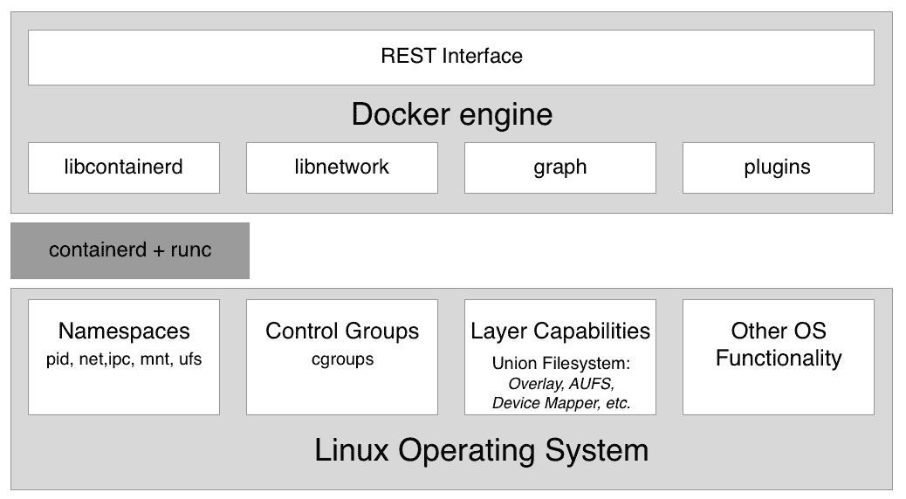

# 什么是容器，我为什么要使用它们？

这本书的第一章将向您介绍容器及其编排的世界。这本书从头开始，假设没有容器领域的先验知识，会给你一个非常实用的主题介绍。

在本章中，我们将重点关注软件供应链及其内部的摩擦。然后，我们将容器作为一种手段来减少这种摩擦，并在此基础上增加企业级安全性。在本章中，我们还将研究容器及其周围的生态系统是如何组装的。我们特别指出上游**运营支持系统** ( **OSS** )组件之间的区别，这些组件统一在代号莫比下，构成了 Docker 和其他供应商下游产品的构件。

本章涵盖以下主题:

*   什么是容器？
*   为什么容器很重要？
*   对我或我的公司有什么好处？
*   莫比项目
*   Docker 产品
*   集装箱生态系统
*   集装箱建筑

完成本模块后，您将能够:

*   用一些简单的句子向感兴趣的外行解释什么是容器，用一个类比，比如物理容器
*   向感兴趣的门外汉解释为什么集装箱如此重要，用一个类比，比如实体集装箱对传统航运，公寓住宅对单身家庭住宅，等等
*   说出 Docker 产品使用的至少四个上游开源组件，例如 Mac/Windows 的 Docker
*   确定至少三种 Docker 产品

# 技术要求

这一章是对该主题的理论介绍。因此，本章没有特殊的技术要求。

# 什么是容器？

软件容器是一个非常抽象的东西，因此如果我们从一个大多数读者都非常熟悉的类比开始，它可能会有所帮助。类比是运输业中的集装箱。纵观历史，人们一直在通过各种方式将货物从一个地方运输到另一个地方。在轮子发明之前，货物很可能是用袋子、篮子或箱子装在人类自己的肩膀上运输的，或者他们可能用驴、骆驼或大象等动物来运输。

随着轮子的发明，运输变得更有效率了，因为人类会建造道路来移动他们的手推车。一次可以运输更多的货物。当我们随后推出第一台蒸汽驱动机器，以及后来的汽油驱动发动机时，交通变得更加强大。我们现在用火车、轮船和卡车运输大量货物。与此同时，商品的类型变得越来越多样化，有时处理起来也很复杂。

在这几千年的时间里，有一件事没有改变，那就是必须在目标地点卸货，并可能将货物装载到另一种运输工具上。举个例子，一个农民把装满苹果的手推车带到一个中央火车站，然后苹果和其他农民的苹果一起被装上火车。或者想象一下，一个酿酒师用卡车把他的酒桶运到港口卸货，然后转移到一艘将酒桶运往海外的船上。

这种从一种运输工具上卸下并装载到另一种运输工具上的过程非常复杂和乏味。每一种商品都以自己的方式包装，因此必须以自己的方式处理。此外，松散的货物有被不道德的工人偷走的风险，或者货物可能在此过程中受损。

然后，集装箱出现了，它彻底改变了运输行业。容器只是一个标准尺寸的金属盒子。每个容器的长度、宽度和高度都是相同的。这是非常重要的一点。如果世界没有就标准尺寸达成一致，整个集装箱的事情就不会像现在这样成功。

现在，有了标准化的集装箱，那些想把货物从甲地运输到乙地的公司就把这些货物包装到这些集装箱里。然后，他们给托运人打电话，托运人有一个标准化的运输工具。这可以是一辆可以装载集装箱的卡车，也可以是一辆四轮拖车可以运输一个或几个集装箱的火车。最后，我们有专门运输大量集装箱的船只。托运人从来不需要拆包和重新包装货物。对于托运人来说，集装箱是一个黑匣子，他们对里面的东西不感兴趣，在大多数情况下也不应该关心。只是一个标准尺寸的大铁盒。现在，将货物包装到集装箱中的工作完全委托给了希望将货物装船的各方，他们应该最了解如何处理和包装这些货物。

由于所有集装箱都具有相同的标准化形状和尺寸，托运人可以使用标准化的工具来处理集装箱，也就是说，起重机从火车或卡车上卸下集装箱，然后将其装载到船上，反之亦然。一种类型的起重机足以处理所有随着时间推移出现的集装箱。此外，运输工具可以标准化，如集装箱船、卡车和火车。

由于所有这些标准化，运输货物的所有过程也可以标准化，从而比集装箱时代之前更加高效。

我认为现在你应该很好地理解为什么集装箱如此重要，为什么它们彻底改变了整个运输行业。我有目的地选择了这个类比，因为我们将在这里介绍的软件容器在所谓的软件供应链中扮演着与运输容器在实物供应链中完全相同的角色。

在过去，开发人员会开发新的应用程序。在开发人员看来，一旦该应用程序完成，他们就会将该应用程序移交给运营工程师，然后由运营工程师将该应用程序安装到生产服务器上并使其运行。如果操作工程师幸运的话，他们甚至从开发人员那里得到了一份带有安装说明的稍微准确的文档。到目前为止一切顺利，生活也很轻松。

但是，当在一个企业中，有许多开发团队创建了完全不同类型的应用程序，但所有这些应用程序都需要安装在相同的生产服务器上并在那里继续运行时，事情就有点失控了。通常，每个应用程序都有一些外部依赖关系，比如它建立在哪个框架上，或者它使用什么库等等。有时，两个应用程序会使用相同的框架，但版本不同，彼此之间可能兼容，也可能不兼容。随着时间的推移，我们运营工程师的生活变得更加艰难。他们必须在如何装载他们的船上有真正的创造力，这当然是他们的服务器与不同的应用程序，而不打破一些东西。

安装某个应用程序的新版本现在本身就是一个复杂的项目，通常需要几个月的规划和测试。换句话说，在软件供应链中有很多摩擦。但是现在，公司越来越依赖软件，发布周期越来越短。我们再也负担不起一年发行两次新版本了。应用程序需要在几周或几天内更新，有时甚至每天更新多次。由于缺乏敏捷性，不遵守规则的公司有倒闭的风险。那么，*有什么解决办法？*

第一种方法是使用**虚拟机** ( **虚拟机**)。公司将在每个虚拟机上打包并运行一个应用程序，而不是在同一台服务器上运行多个应用程序。有了它，兼容性问题消失了，生活似乎又好了起来。不幸的是，这种幸福没有持续多久。虚拟机本身就是非常沉重的负担，因为它们都包含一个成熟的操作系统，例如 Linux 或 Windows Server，而所有这些都只适用于一个应用程序。这就好像在运输行业，你会用一艘巨大的船来运输一卡车的香蕉。真是浪费。那永远不可能盈利。

这个问题的最终解决方案是提供比虚拟机轻得多的东西，而且能够完美地封装运输所需的货物。这里，商品是我们的开发人员编写的实际应用程序，加上(这很重要)应用程序的所有外部依赖项，例如框架、库、配置等等。软件打包机制的圣杯是 Docker 容器。

开发人员使用 Docker 容器将他们的应用程序、框架和库打包到其中，然后将这些容器发送给测试人员或操作工程师。对于测试人员和操作工程师来说，容器只是一个黑匣子。不过，这是一个标准化的黑匣子。所有容器，无论里面运行什么应用程序，都可以被平等对待。工程师们知道，如果任何容器在他们的服务器上运行，那么任何其他容器也应该运行。事实上这是真的，除了一些一直存在的边缘情况。

因此，Docker 容器是一种以标准化方式打包应用程序及其依赖关系的方法。Docker 随后创造了一个短语——“建造、运输和运行到任何地方”。

# 为什么容器很重要？

如今，一个应用程序的新版本之间的时间越来越短，然而软件本身并没有变得更简单。相反，软件项目增加了复杂性。因此，我们需要一种驯服野兽和简化软件供应链的方法。

我们也每天听到越来越多的网络犯罪在上升。许多知名公司都受到安全漏洞的影响。高度敏感的客户数据被盗，如社会安全号码、信用卡信息等。但不仅客户数据被泄露，敏感的公司机密也被窃取。

容器可以在很多方面提供帮助。首先，Gartner 在最近的一份报告中发现，在容器中运行的应用程序比不在容器中运行的应用程序更安全。容器使用 Linux 安全原语(如 Linux 内核命名空间)来沙盒运行在同一台计算机上的不同应用程序和**控制组**(**cggroups**)，以避免嘈杂的邻居问题，即一个坏应用程序正在使用服务器的所有可用资源，而让所有其他应用程序挨饿。

由于容器图像是不可变的，因此很容易对它们进行已知漏洞和暴露的扫描，这样做可以提高我们应用程序的整体安全性。

在使用容器时，我们可以让我们的软件供应链更安全的另一种方法是使用**内容信任**。内容信任基本上确保了容器图像的作者是他们假装的人，并且容器图像的消费者保证了图像在传输过程中没有被篡改。后者被称为**中间人** ( **MITM** )攻击。

我刚才所说的一切当然在技术上也可以不使用容器，但是因为容器引入了一个全球公认的标准，所以实现和实施这些最佳实践变得非常容易。

好的，但是安全性不是容器重要的唯一原因。还有其他原因:

其中之一是容器使得模拟类似生产的环境变得很容易，即使是在开发人员的笔记本电脑上。如果我们可以容器化任何应用程序，那么我们也可以容器化数据库，比如甲骨文或微软的 SQL Server。现在，每个必须在计算机上安装 Oracle 数据库的人都知道，这不是最容易做到的事情，而且会占用计算机上的大量空间。你不会想对你的开发笔记本电脑做这样的事情，只是为了测试你开发的应用程序是否真的端到端工作。有了容器，我可以像说 1、2、3 一样轻松地在容器中运行完整的关系数据库。当我完成测试后，我可以停止并删除容器，数据库就会消失，而不会在我的计算机上留下任何痕迹。

由于与虚拟机相比，容器非常精简，因此在开发人员的笔记本电脑上同时运行多个容器而不会使笔记本电脑不堪重负的情况并不少见。

容器之所以重要的第三个原因是，操作员最终可以专注于他们真正擅长的事情，调配基础架构，并在生产中运行和监控应用程序。当他们必须在生产系统上运行的应用程序都被容器化时，运营商就可以开始标准化他们的基础设施。每台服务器都变成了另一台 Docker 主机。不需要在这些服务器上安装特殊的框架库，只需要一个操作系统和一个容器运行时，比如 Docker。

此外，操作人员不必再对应用程序的内部有任何深入的了解，因为这些应用程序运行在独立的容器中，对于操作工程师来说，这些容器应该看起来像黑匣子，类似于运输行业人员眼中的运输容器。

# 对我或我的公司有什么好处？

有人曾经说过，今天，每个一定规模的公司都必须承认，他们需要成为一家软件公司。软件经营所有的生意，就这样。随着每个公司都成为软件公司，就需要建立软件供应链。为了保持公司的竞争力，他们的软件供应链必须安全高效。效率可以通过彻底的自动化和标准化来实现。但是在安全、自动化和标准化这三个领域，容器都表现出了光芒。大型知名企业报告称，当将现有的遗留应用程序(许多人称之为传统应用程序)容器化并建立基于容器的全自动软件供应链时，他们可以将这些任务关键型应用程序的维护成本降低 50%至 60%，并且可以将这些传统应用程序的新版本之间的时间缩短高达 90%。

也就是说，容器技术的采用为这些公司节省了大量资金，同时加快了开发过程，缩短了上市时间。

# 莫比项目

最初，当 Docker 公司推出 Docker 容器时，一切都是开源的。Docker 此时没有任何商业产品。该公司开发的 Docker 引擎是一个完整的软件。它包含许多逻辑部分，例如容器运行时、网络库、RESTful API、命令行界面等等。

其他供应商或项目，如红帽或 Kubernetes，在他们自己的产品中使用 Docker 引擎，但大多数时候他们只使用它的部分功能。例如，Kubernetes 没有使用 Docker 引擎的 Docker 网络库，而是提供了自己的网络方式。红帽反过来也没有频繁更新 Docker 引擎，更倾向于对老版本的 Docker 引擎应用非官方补丁，但他们仍然称之为 **Docker 引擎**。

出于所有这些原因以及许多其他原因，出现了 Docker 必须做一些事情来明确区分 Docker 开源部分和 Docker 商业部分的想法。此外，该公司希望防止竞争对手为了自己的利益使用和滥用 Docker 这个名字。这是莫比项目诞生的主要原因。它是 Docker 开发并继续开发的大多数开源组件的保护伞。这些开源项目不再有 Docker 这个名字了。

莫比项目的一部分是图像管理、秘密管理、配置管理、网络和供应等组件。此外，莫比项目的一部分是特殊的莫比工具，例如，用于将组件组装成可运行的工件。

技术上属于莫比项目的一些组件已经由 Docker 捐赠给了**云原生计算基金会** ( **CNCF** )，因此不再出现在组件列表中。最突出的是`containerd`和`runc`，它们共同构成了容器运行时。

# Docker 产品

Docker 目前将其产品线分为两个部分。有**社区版** ( **CE** )是封闭源码但完全免费，还有**企业版** ( **EE** )也是封闭源码，需要按年领证。企业产品支持 24 x 7 支持，并且支持的错误修复时间比其 CE 产品长得多。

# 停靠此

Docker 社区版的一部分是 Docker 工具箱、Docker for Mac 和 Docker for Windows 等产品。这三款产品主要面向开发者。

Mac Docker 和 Windows Docker 是易于安装的桌面应用程序，可用于在 Mac 或 Windows 上构建、调试和测试 Docker 化的应用程序或服务。Mac 的 Docker 和 Windows 的 Docker 是完整的开发环境，它们与各自的虚拟机管理程序框架、网络和文件系统深度集成。这些工具是在 Mac 或 Windows 上运行 Docker 最快、最可靠的方法。

在 CE 的保护伞下，还有两款产品更面向运营工程师。这些产品是 Azure 的 Docker 和 AWS 的 Docker。

例如，使用 Docker for Azure，这是一个本机 Azure 应用程序，您只需点击几下鼠标即可设置 Docker，针对基础 Azure **基础架构即服务** ( **I** **aaS** )服务进行优化并集成。它帮助运营工程师加快在 Azure 中构建和运行 Docker 应用程序的生产时间。

AWS 的 Docker 工作原理非常相似，但适用于亚马逊的云。

# 码头工人 EE

Docker EE 由两个产品**通用控制平面**(**【UCP】**)和 **Docker 可信注册中心** ( **DTR** )组成，它们都运行在 Docker Swarm 之上。两者都是 Swarm 应用程序。Docker EE 构建在莫比项目的上游组件之上，并添加了企业级功能，如**基于角色的访问控制** ( **RBAC** )、多租户、Docker Swarm 和 Kubernetes 的混合集群、基于 web 的 UI 和内容信任，以及在其之上的图像扫描。

# 集装箱生态系统

在信息技术领域，从来没有一种新技术比容器更快、更彻底地渗透到整个领域。任何不想被落下的公司都不能忽视集装箱。来自行业各个部门对集装箱的巨大兴趣引发了该领域的大量创新。许多公司专门研究容器，或者提供基于这种技术的产品，或者构建支持它的工具。

最初，Docker 没有容器编排的解决方案，因此其他公司或项目，无论是否开源，都试图缩小这个差距。其中最著名的是由谷歌发起，后来捐赠给 CNCF 的 Kubernetes。其他容器编排产品有 Apache Mesos、Rancher、Red Hat 的 Open Shift、Docker 自己的 Swarm 等等。

最近，趋势朝着服务网格发展。这是新的流行语。随着我们将越来越多的应用程序容器化，以及将这些应用程序重构为更多面向微服务的应用程序，我们遇到了简单的编排软件无法以可靠且可扩展的方式解决的问题。该领域的主题包括服务发现、监控、跟踪和日志聚合。这一领域出现了许多新项目，目前最受欢迎的项目是 Istio，它也是 CNCF 的一部分。

很多人说软件进化的下一步是功能，或者更准确的说是**功能即服务** ( **FaaS** )。有些项目正是提供这种类型的服务，并且建立在容器之上。一个突出的例子是 OpenFaaS。

我们只是触及了集装箱生态系统的表面。谷歌、微软、英特尔、红帽、IBM 等所有大型信息技术公司都在狂热地研究容器和相关技术。主要是关于容器和相关技术的 CNCF 有如此多的注册项目，以至于它们不再适合贴在海报上。在这个领域工作是令人兴奋的时刻。而依我拙见，这只是开始。

# 集装箱建筑

现在，让我们从高层次上讨论如何设计一个可以运行 Docker 容器的系统。下图说明了安装了 Docker 的计算机的外观。顺便说一下，安装了 Docker 的计算机通常被称为 Docker 主机，因为它可以运行或托管 Docker 容器:

High-level architecture diagram of the Docker engine

在上图中，我们看到了三个基本部分:

*   在底部，我们有 Linux 操作系统
*   在中间的深灰色中，我们有容器运行时
*   在顶部，我们有 Docker 引擎

容器之所以成为可能，只是因为 Linux 操作系统提供了一些原语，如名称空间、控制组、层功能等，容器运行时和 Docker 引擎以非常具体的方式利用了这些原语。Linux 内核命名空间如**进程 ID** ( **pid** )命名空间或**网络** ( **net** )命名空间允许 Docker 封装或沙箱化在容器内部运行的进程。控制组确保容器不会遭受噪音邻居综合症，即在容器中运行的单个应用程序会消耗整个 Docker 主机的大部分或全部可用资源。控制组允许 Docker 限制资源，如中央处理器时间或每个容器最大分配的内存量。

Docker 主机上的容器运行时由`containerd`和`runc`组成。`runc`是容器运行时的低级功能，基于`runc`的`containerd`提供更高级的功能。这两个都是开源的，由 Docker 捐赠给了 CNCF。

容器运行时负责容器的整个生命周期。如有必要，它会从注册表中提取一个容器映像(它是容器的模板)，从该映像创建一个容器，初始化并运行该容器，并最终在系统要求时停止并移除该容器。

Docker 引擎在容器运行时之上提供了额外的功能，例如网络库或插件支持。它还提供了一个 REST 接口，所有容器操作都可以通过该接口实现自动化。我们将在本书中经常使用的 Docker 命令行界面就是这个 REST 界面的消费者之一。

# 摘要

在这一章中，我们研究了容器如何大规模减少软件供应链中的摩擦，最重要的是，使供应链更加安全。

在下一章中，我们将熟悉容器。我们将学习如何运行、停止和移除容器以及以其他方式操作它们。我们还将对容器的构造有一个相当好的概述。第一次，我们真的会弄脏手，玩这些容器，所以请继续关注。

# 问题

请解决以下问题来评估您的学习进度:

1.  哪些陈述是正确的(可能有多个答案)？
    1.  容器是一种轻量级虚拟机
    2.  容器只在 Linux 主机上运行
    3.  一个容器只能运行一个进程
    4.  容器中的主进程总是具有 PID 1
    5.  容器是一个或多个由 Linux 命名空间封装并受 cgroups 限制的进程
2.  用你自己的话向感兴趣的外行解释，也许用类比，什么是容器。
3.  为什么容器被认为是信息技术的游戏规则改变者？列举三到四个理由。
4.  当我们声称:*如果一个容器在给定的平台上运行，那么它可以在任何地方运行，这意味着什么...*？说出两到三个这是真的原因。
5.  真或假: *Docker 容器只对基于微服务的现代绿地应用真正有用*。请证明你的回答是正确的。
6.  一个典型的企业在将其遗留应用程序进行容器化时能节省多少成本？
    1.  20%
    2.  33%
    3.  50%
    4.  75%
7.  容器基于 Linux 的哪两个核心概念？

# 进一步阅读

以下是一个链接列表，这些链接指向有关我们在本章中讨论的主题的更详细信息:

*   *https://docs.docker.com/engine/docker-overview/[码头工人概况](https://docs.docker.com/engine/docker-overview/)*
*   *https://mobyproject.org/[的莫比项目](https://mobyproject.org/)*
*   *https://www.docker.com/get-docker[码头工人产品](https://www.docker.com/get-docker)*
*   *https://www.cncf.io/云原生计算基金会*
*   *集装箱–https://containerd.io/的行业标准集装箱运行时间*