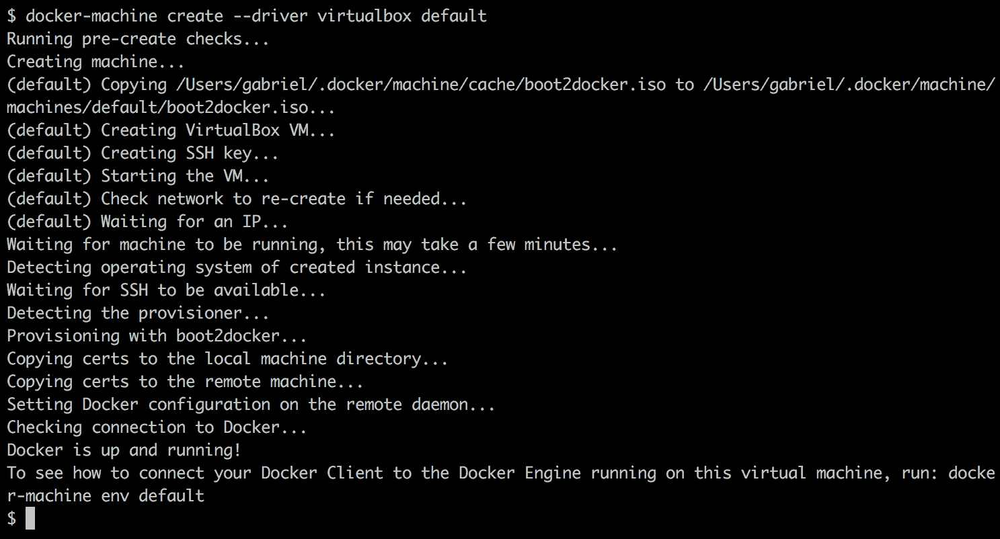
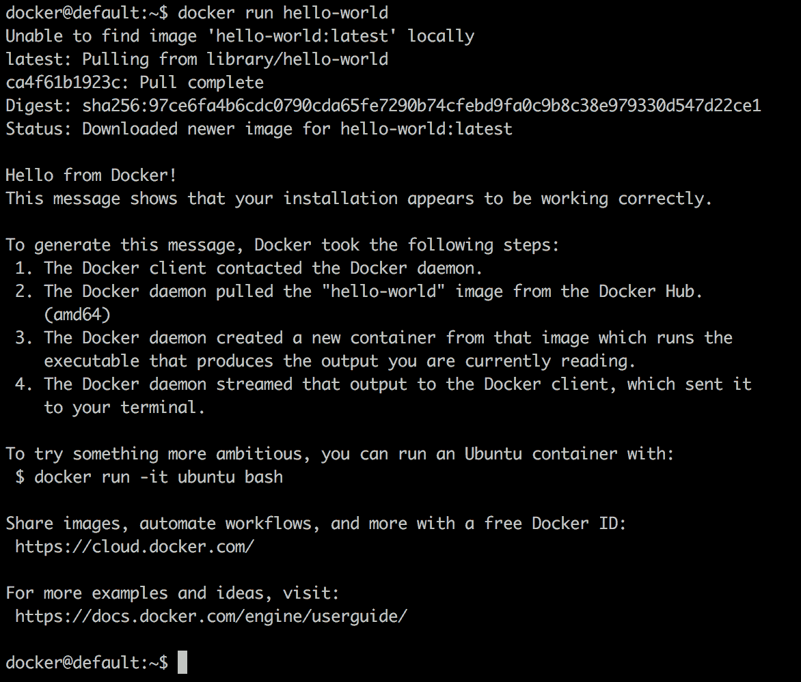
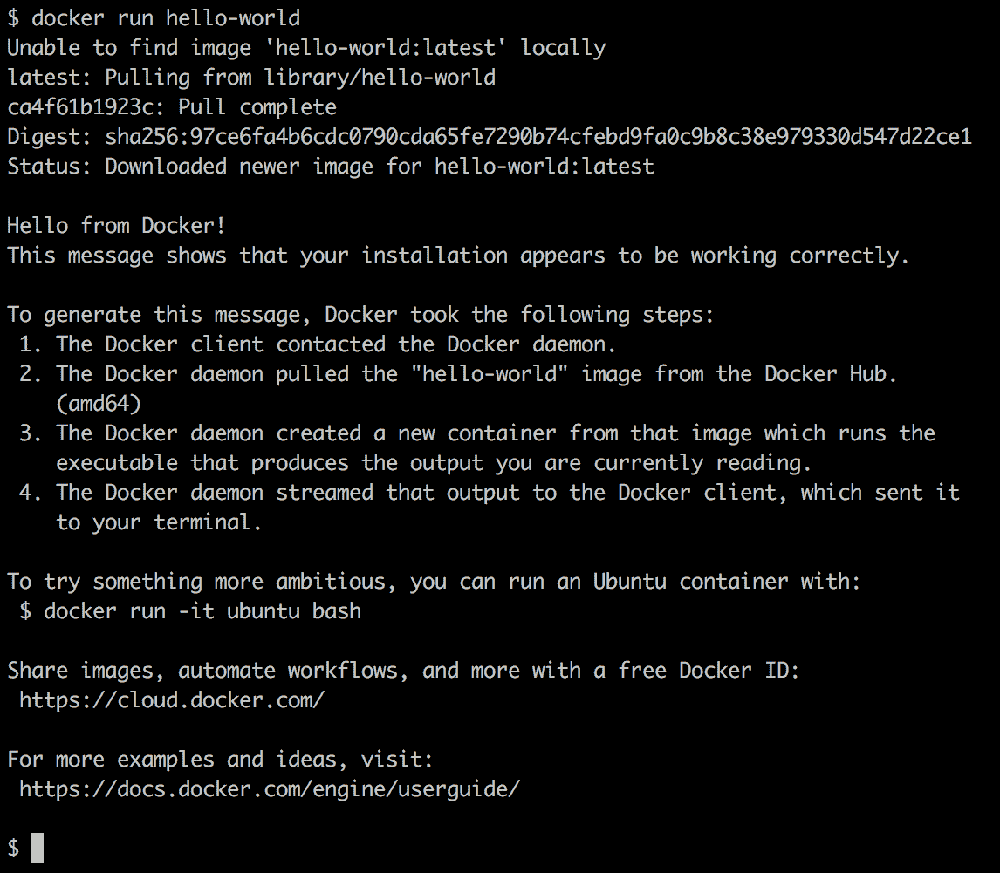
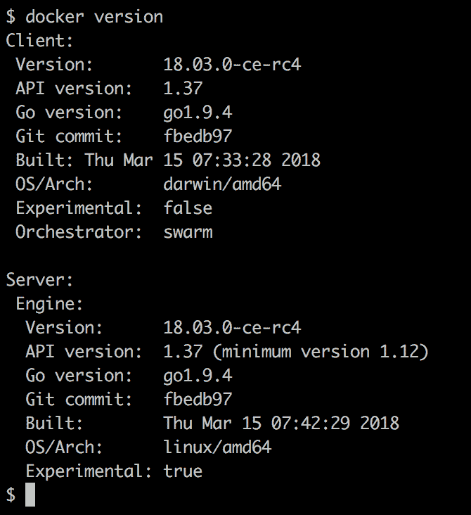

# 二、建立工作环境

在最后一章中，我们学习了什么是 Docker 容器，以及它们为什么重要。我们了解了在现代软件供应链中，什么样的问题容器可以解决。

在这一章中，我们将准备我们的个人或工作环境，以高效和有效地与 Docker 一起工作。我们将详细讨论如何为开发人员、开发人员和操作人员建立一个理想的环境，以便在使用 Docker 容器时使用。

本章涵盖以下主题:

*   Linux 命令外壳
*   适用于 Windows 的 PowerShell
*   使用包管理器
*   选择代码编辑器
*   Docker工具箱
*   Mac 的Docker和 Windows 的Docker
*   迷你库比

完成本章后，您将能够执行以下操作:

*   在你的笔记本电脑上使用一个能够编辑简单文件的编辑器，比如 Dockerfile 或`docker-compose.yml`文件
*   使用外壳(如 Mac 上的 Bash 和 Windows 上的 PowerShell)来执行 Docker 命令和其他简单操作，如导航文件夹结构或创建新文件夹
*   在您的计算机上安装 Mac 的 Docker 或 Windows 的 Docker
*   在 Mac 的 Docker 或 Windows 的 Docker 上执行简单的 Docker 命令，如`docker version`或`docker container run`
*   在您的计算机上成功安装 Docker 工具箱
*   使用`docker-machine`在 VirtualBox 上创建 Docker 主机
*   将您的本地 Docker CLI 配置为远程访问运行在 VirtualBox 中的 Docker 主机

# 技术要求

在本章中，您将需要一台安装了 macOS 或 Windows(最好是 Windows 10 Professional)的笔记本电脑或工作站。你还应该有下载应用的免费互联网接入，以及在你的笔记本电脑上安装这些应用的权限。

# Linux 命令外壳

Docker 容器最初是在 Linux 上为 Linux 开发的。因此，用于与 Docker 一起工作的主要命令行工具(也称为 shell)自然是 Unix shell 请记住，Linux 是从 Unix 衍生而来的。大多数开发人员使用 Bash 外壳。在一些轻量级的 Linux 发行版上，比如 Alpine，Bash 没有被安装，因此人们不得不使用更简单的 Bourne shell，仅仅叫做 **sh** 。每当我们在 Linux 环境中工作时，例如在容器内或 Linux 虚拟机上，我们将使用`/bin/bash`或`/bin/sh`，这取决于它们的可用性。

虽然 macOS X 不是 Linux 操作系统，但是 Linux 和 OS X 都是 Unix 的两种风格，因此支持相同类型的工具。这些工具中有贝壳。所以，当在苹果电脑上工作时，你可能会使用 Bash 外壳。

在这本书里，我们期望读者熟悉 Bash 中最基本的脚本命令，如果你在 Windows 上工作，还需要熟悉 PowerShell。如果您完全是初学者，那么我们强烈建议您熟悉以下备忘单:

*   *戴夫·蔡尔德在[http://bit.ly/2mTQr8l](http://bit.ly/2mTQr8l)发布的 Linux 命令行备忘单*
*   *http://bit.ly/2EPHxze的 PowerShell 基本备忘单*

# 适用于 Windows 的 PowerShell

在 Windows 计算机、笔记本电脑或服务器上，我们有多种命令行工具可用。最熟悉的是命令外壳。它已经在任何一台 Windows 电脑上使用了几十年。这是一个非常简单的外壳。为了更高级的脚本编写，微软开发了 PowerShell。PowerShell 非常强大，在从事 Windows 工作的工程师中非常受欢迎。在 Windows 10 上，我们终于有了所谓的 **Windows 子系统 for****r Linux**，它允许我们使用任何 Linux 工具，比如 Bash 或者 Bourne shells。除此之外，还存在其他在 Windows 上安装 Bash shell 的工具，例如 Git Bash shell。在本书中，所有命令都将使用 Bash 语法。大多数命令也在 PowerShell 中运行。

因此，我们建议您使用 PowerShell 或任何其他 Bash 工具在 Windows 上与 Docker 一起工作。

# 使用包管理器

在 Mac 或 Windows 笔记本电脑上安装软件最简单的方法是使用好的软件包管理器。在苹果电脑上，大多数人使用自制软件，在视窗系统上，巧克力是个不错的选择。

# 在苹果电脑上安装自制程序

在苹果电脑上安装自制程序很容易；只需按照[https://brew.sh/](https://brew.sh/)的指示操作即可。

以下是安装自制程序的命令:

```
/usr/bin/ruby -e "$(curl -fsSL https://raw.githubusercontent.com/Homebrew/install/master/install)"
```

安装完成后，在终端输入`brew --version`测试家酿是否工作。你应该看到这样的东西:

```
$ brew --version
Homebrew 1.4.3
Homebrew/homebrew-core (git revision f4e35; last commit 2018-01-11)
```

现在，我们准备使用家酿安装工具和实用程序。例如，如果我们想安装 Vi 文本编辑器，我们可以这样做:

```
$ brew install vim
```

这将为您下载并安装编辑器。

# 在 Windows 上安装巧克力

要在 Windows 上安装巧克力包管理器，请按照[https://chocolatey.org/](https://chocolatey.org/)的说明进行操作，或者在以管理员身份运行的 PowerShell 终端中执行以下命令:

```
PS> Set-ExecutionPolicy Bypass -Scope Process -Force; iex ((New-Object System.Net.WebClient).DownloadString('https://chocolatey.org/install.ps1'))
```

一旦安装了巧克力，在没有额外参数的情况下，使用命令`choco`进行测试。您应该会看到类似如下的输出:

```
PS> choco
Chocolatey v0.10.3
```

要安装 Vi 编辑器等应用，请使用以下命令:

```
PS> choco install -y vim
```

`-y`参数确保安装在不要求再次确认的情况下进行。请注意，一旦巧克力安装了应用，您需要打开一个新的 PowerShell 窗口来使用它。

# 选择代码编辑器

使用一个好的代码编辑器对于高效地使用 Docker 是必不可少的。当然，哪个编辑最好，争议很大，要看你个人的喜好。很多人使用 Vim，或其他如 Emacs，Atom，Sublime，或 **Visual Studio** ( **VS** )代码，仅举几例。如果您还没有决定哪个编辑器最适合您，那么我强烈建议您尝试 VS Code。这是一个免费的轻量级编辑器，但它非常强大，可用于苹果电脑、视窗和 Linux。试试看。可以从[https://code.visualstudio.com/download](https://code.visualstudio.com/download)下载 VS 代码。

但是如果你已经有一个喜欢的代码编辑器，那么请继续使用它。只要你能编辑文本文件，你就可以走了。如果您的编辑器支持 Dockerfiles、JSON 和 YAML 文件的语法高亮显示，那就更好了。

# Docker工具箱

Docker 工具箱已经为开发人员提供了几年。它领先于较新的工具，如 Mac 的 Docker 和 Windows 的 Docker。工具箱允许用户在任何苹果电脑或视窗电脑上非常优雅地使用容器。容器必须在 Linux 主机上运行。Windows 和 Mac 都不能本地运行容器。因此，我们需要在我们的笔记本电脑上运行一个 Linux 虚拟机，然后我们可以在那里运行我们的容器。Docker 工具箱在我们的笔记本电脑上安装了 VirtualBox，用来运行我们需要的 Linux 虚拟机。

As a Windows user, you might already be aware that there exists so-called Windows containers that run natively on Windows. And you are right. Recently, Microsoft has ported the Docker engine to Windows and it is now possible to run Windows containers directly on a Windows Server 2016 without the need for a VM. So, now we have two flavors of containers, Linux containers and Windows containers. The former only run on Linux host and the latter only run on a Windows Server. In this book, we are exclusively discussing Linux containers, but most of the things we learn also apply to Windows containers.

让我们使用`docker-machine`来设置我们的环境。首先，我们列出了我们当前在系统上定义的所有备审虚拟机。如果您刚刚安装了 Docker 工具箱，您应该会看到以下输出:


List of all Docker-ready VMs

在您的情况下，使用的 IP 地址可能会有所不同，但肯定会在`192.168.0.0/24`范围内。我们还可以看到，VM 安装了 Docker 版本`18.04.0-ce`。

如果出于某种原因，您没有默认虚拟机或您意外删除了它，您可以使用以下命令创建它:

```
$ docker-machine create --driver virtualbox default
```

您应该会看到如下输出:



Creating the VM called default in VirtualBox

要了解如何将 Docker 客户端连接到在此虚拟机上运行的 Docker 引擎，请运行以下命令:

```
$ docker-machine env default
```

一旦我们准备好了名为`default`的虚拟机，我们就可以尝试在其中进行 SSH:

```
$ docker-machine ssh default
```

当执行前面的命令时，我们会收到一条 boot2docker 欢迎消息。

在命令提示符下键入`docker --version`，如下所示:

```
docker@default:~$ docker --version
Docker version 17.12.1-ce, build 7390fc6
```

现在，让我们尝试运行一个容器:

```
docker@default:~$ docker run hello-world
```

这将产生以下输出:



Running the Docker Hello World container

# Mac 的Docker和 Windows 的Docker

如果您使用的是苹果电脑，或者笔记本电脑上安装了视窗 10 专业版，那么我们强烈建议您安装苹果电脑的 Docker 或视窗系统的 Docker。这些工具为您提供了处理容器的最佳体验。注意，旧版本的 Windows 或 Windows 10 家庭版不能运行 Docker for Windows。Windows docker 使用 Hyper-V 在虚拟机中透明地运行容器，但是 Hyper-V 在旧版本的 Windows 上不可用，在家庭版中也不可用。

# 为 Mac 安装 Docker

导航至以下链接，在[https://docs.docker.com/docker-for-mac/install/](https://docs.docker.com/docker-for-mac/install/)下载 Docker。

There is a stable version and a so-called edge version of the tool available. In this book, we are going to use some newer features and Kubernetes, which at the time of writing are only available in the edge version. Thus, please select this version.

要开始安装，请单击“获取 Mac Docker(边缘)”按钮，并按照说明进行操作。

一旦你成功地为苹果电脑安装了 Docker，请打开一个终端。按*命令* + *空格键*打开聚光灯并输入`terminal`，然后点击*进入*。苹果终端将按如下方式打开:


Apple Terminal window

在命令提示符下输入`docker --version`，点击*进入*。如果 Mac 的 Docker 安装正确，您应该会得到如下输出:

```
$ docker --version
Docker version 18.02.0-ce-rc2, build f968a2c
```

要查看是否可以运行容器，请在终端中输入以下命令，然后点击*进入*:

```
$ docker run hello-world
```

如果一切顺利，您的输出应该如下所示:



Running the Hello World container on Docker for Mac

恭喜，您现在已经准备好使用 Docker 容器了。

# 为窗口安装 Docker

注意，您只能在 Windows 10 Professional 或 Windows Server 2016 上安装 Docker for Windows，因为它需要 Hyper-V，而 Hyper-V 在旧的 Windows 版本或 Windows 10 的家庭版上不可用。如果您使用的是 Windows 10 Home 或旧版本的 Windows，则需要坚持使用 Docker 工具箱。

导航至以下链接，在[https://docs.docker.com/docker-for-windows/install/](https://docs.docker.com/docker-for-windows/install/)下载 Windows Docker。

There is a stable version and a so-called edge version of the tool available. In this book, we are going to use some newer features and Kubernetes, which at the time of writing are only available in the edge version. Thus, please select this version.

要开始安装，请单击“获取 Windows Docker(边缘)”按钮，并按照说明进行操作。

使用 Docker for Windows，您可以开发、运行和测试 Linux 容器和 Windows 容器。然而，在这本书里，我们只讨论了 Linux 容器。

一旦成功安装了窗口 Docker，打开一个 PowerShell 窗口，在命令提示符下键入`docker --version`。您应该会看到如下内容:

```
PS> docker --version
Docker version 18.04.0-ce, build 3d479c0 
```

# 用 Hyper-V 在 Windows 上使用文件机

如果你的笔记本电脑上安装了视窗 Docker，那么你也可以启用 Hyper-V。在这种情况下，您不能使用 Docker 工具箱，因为它使用 VirtualBox，Hyper-V 和 VirtualBox 不能同时共存和运行。在这种情况下，您可以将`docker-machine`与 Hyper-V 驱动程序一起使用。

以管理员身份打开 PowerShell 控制台。使用巧克力安装`docker-machine`，如下所示:

```
PS> choco install -y docker-machine
```

使用以下命令在 Hyper-V 中创建一个名为`boot2docker`的虚拟机:

```
PS> docker-machine create --driver hyperv --hyperv-virtual-switch "My Internal Switch" boot2docker
```

注意，您必须在管理员模式下运行前面的命令，否则它将失败。

您应该会看到由前面的命令生成的以下输出:

```
Running pre-create checks...
(boot2docker) Image cache directory does not exist, creating it at C:\Users\Docker\.docker\machine\cache...
(boot2docker) No default Boot2Docker ISO found locally, downloading the latest release...
(boot2docker) Latest release for github.com/boot2docker/boot2docker is v18.01.0-ce
....
....
Checking connection to Docker...
Docker is up and running!
To see how to connect your Docker Client to the Docker Engine running on this virtual machine, run: C:\Program Files\Doc
ker\Docker\Resources\bin\docker-machine.exe env boot2docker
```

要了解如何将 Docker 客户端连接到在此虚拟机上运行的 Docker 引擎，请运行以下命令:

```
C:\Program Files\Docker\Docker\Resources\bin\docker-machine.exe env boot2docker
```

列出由`docker-machine`生成的所有虚拟机，我们得到以下输出:

```
PS C:\WINDOWS\system32> docker-machine ls
NAME          ACTIVE   DRIVER   STATE     URL               SWARM   DOCKER        ERRORS
boot2docker   -        hyperv   Running   tcp://[...]:2376          v18.01.0-ce
```

现在，让我们将 SSH 引入我们的`boot2docker`虚拟机:

```
PS> docker-machine ssh boot2docker
```

迎接你的应该是欢迎屏幕。

我们可以通过执行`docker version`命令来测试虚拟机，如下所示:



Version of the Docker client (CLI) and server

这绝对是一个 Linux 虚拟机，正如我们在`OS/Arch`条目上看到的，并且安装了 Docker `18.03.0-ce-rc4`。

# 迷你库比

如果您不能将 Docker 用于 Mac 或 Windows，或者由于某种原因，您只能访问尚不支持 Kubernetes 的旧版本工具，那么安装 Minikube 是个好主意。Minikube 在您的工作站上配置了一个单节点 Kubernetes 集群，并且可以通过**Kubernetes**访问，这是一个用于与 Kubernetes 一起工作的命令行工具。

# 在 Mac 和 Windows 上安装 Minikube

要为 Mac 或 Windows 安装 Minikube，请导航至以下位于[https://kubernetes.io/docs/tasks/tools/install-minikube/](https://kubernetes.io/docs/tasks/tools/install-minikube/)的链接。

请仔细遵循说明。如果您安装了 Docker 工具箱，那么您的系统上已经有了虚拟机管理程序，因为 Docker 工具箱安装程序也安装了 VirtualBox。否则，我建议您先安装 VirtualBox。

如果你安装了 Docker for Mac 或 Windows，那么你已经安装了`kubectl`，因此你也可以跳过这一步。否则，请按照网站上的说明操作。

最后，为苹果或视窗的 Minikube 选择最新的二进制文件并安装。对于 Mac 来说，最新的二进制文件叫做`minikube-darwin-amd64`，对于 Windows 来说就是`minikube-windows-amd64`。

# 测试 Minikube 和 kubectl

一旦 Minikube 成功安装在您的工作站上，请打开一个终端并测试安装。首先，我们需要启动 Minikube。在命令行输入`minikube start`。输出应该如下所示:


Starting Minikube

现在进入`kubectl version`点击*进入*看到如下截图:


Determining the version of the Kubernetes client and server

如果前面的命令失败，例如超时，那么可能是您的`kubectl`没有配置正确的上下文。`kubectl`可用于处理许多不同的 Kubernetes 集群。每个集群称为一个上下文。要找出`kubectl`当前配置的上下文，请使用以下命令:

```
$ kubectl config current-context
minikube
```

答案应该是`minikube`，如前面的输出所示。如果不是这样，使用`kubectl config get-contexts`列出系统中定义的所有上下文，然后将当前上下文设置为`minikube`，如下所示:

```
$ kubectl config use-context minikube
```

存储上下文的`kubectl`的配置通常在`~/.kube/config`中找到，但是这可以通过定义一个名为`KUBECONFIG`的环境变量来覆盖。如果在您的计算机上设置了此变量，您可能需要将其取消设置。

有关如何配置和使用 Kubernetes 上下文的更多详细信息，请参考[https://Kubernetes . io/docs/concepts/configuration/organize-cluster-access-kube nfig/](https://kubernetes.io/docs/concepts/configuration/organize-cluster-access-kubeconfig/)上的链接。

假设 Minikube 和`kubectl`按预期工作，我们现在可以使用`kubectl`获得关于 Kubernetes 集群的信息。输入以下命令:

```
$ kubectl get nodes
NAME       STATUS    ROLES     AGE       VERSION
minikube   Ready     <none>    47d       v1.9.0
```

显然，我们有一个由一个节点组成的集群，在我的例子中，它安装了 Kubernetes `v1.9.0`。

# 摘要

在本章中，我们设置和配置了我们的个人或工作环境，以便我们可以高效地使用 Docker 容器。这同样适用于开发人员、开发人员和运营工程师。在这种情况下，我们确保使用一个好的编辑器，安装 Docker for Mac 或 Windows，并且还可以使用`docker-machine`在 VirtualBox 或 Hyper-V 中创建虚拟机，我们可以使用这些虚拟机来运行和测试容器。

在下一章中，我们将学习关于容器的所有重要事实。例如，我们将探索如何运行、停止、列出和删除容器，但除此之外，我们还将深入剖析容器。

# 问题

根据您对本章的阅读，请回答以下问题:

1.  `docker-machine`是干什么用的？说出三到四个场景。
2.  是真是假？使用窗口 Docker，可以开发和运行 Linux 容器。
3.  为什么好的脚本技能(如 Bash 或 PowerShell)对容器的高效使用至关重要？
4.  说出 Docker 被认证运行的三到四个 Linux 发行版。
5.  命名所有可以运行 Windows 容器的 Windows 版本。

# 进一步阅读

请考虑以下链接进行进一步阅读:

*   *在超 V 上运行Docker，Docker机器位于*[http://bit.ly/2HGMPiI](http://bit.ly/2HGMPiI)