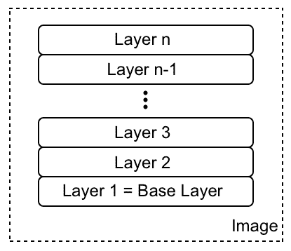
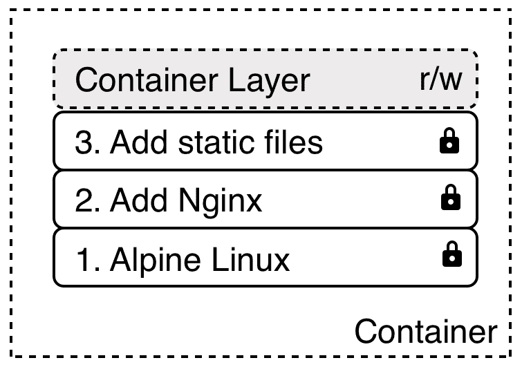
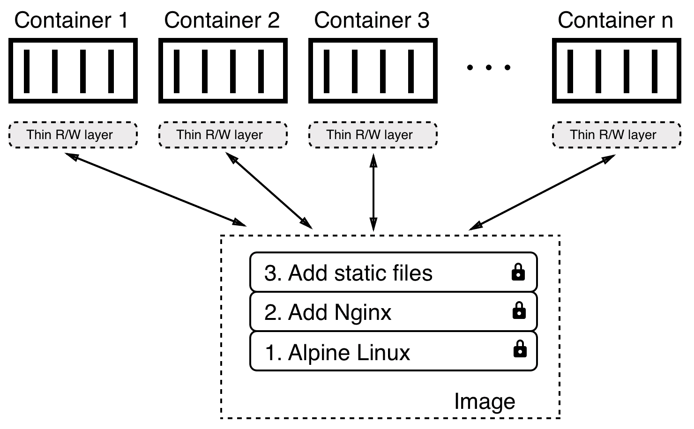
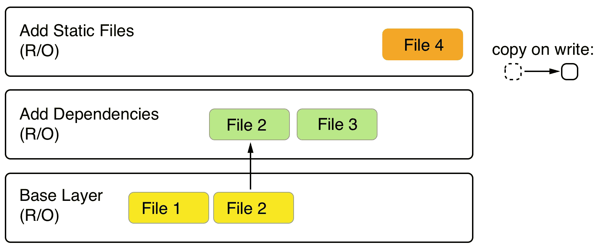
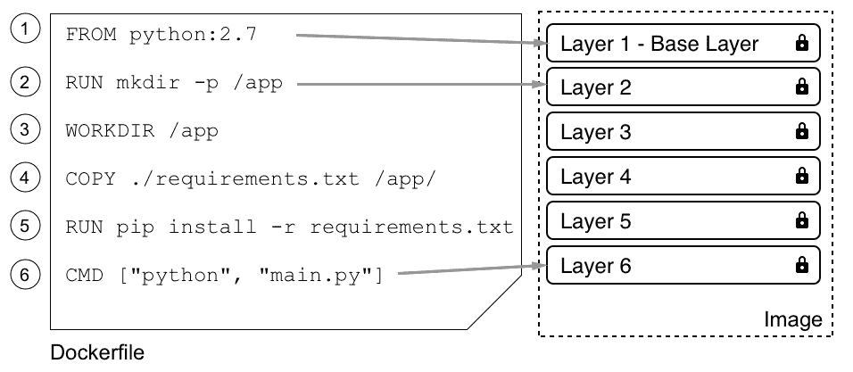
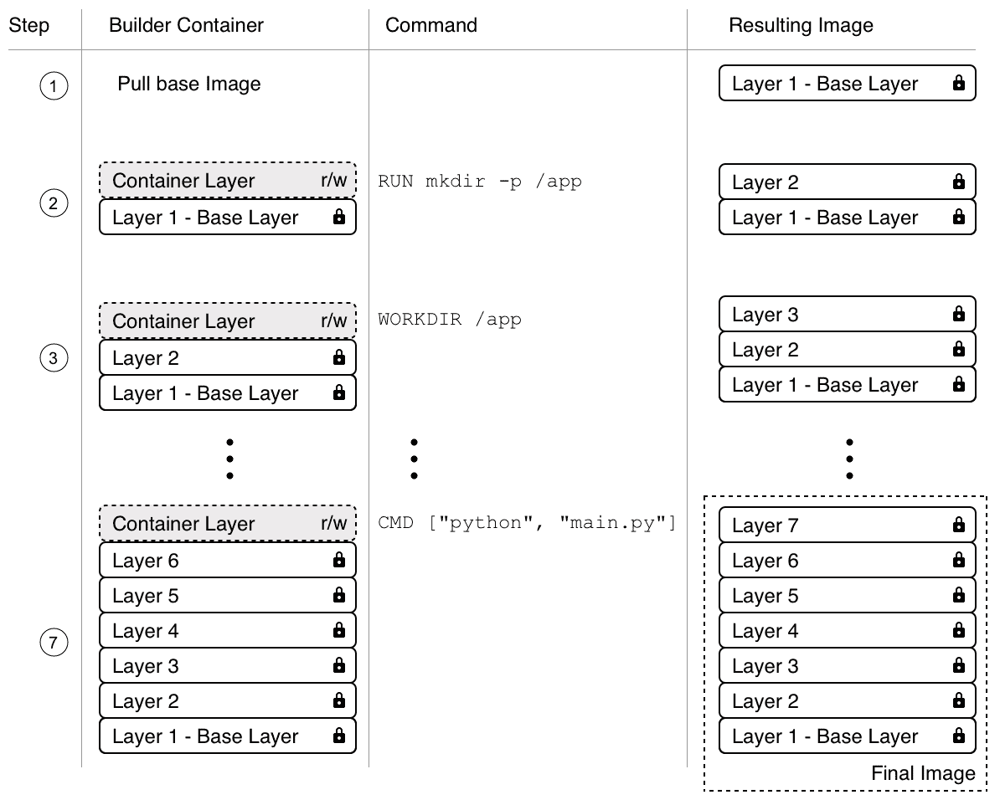

# 创建和管理容器映像

在前一章中，我们学习了什么是容器，以及如何运行、停止、移除、列出和检查它们。我们提取了一些容器的日志信息，在一个已经运行的容器中运行其他进程，最后我们深入到容器的解剖结构中。每当我们运行一个容器时，我们都使用一个容器映像来创建它。在本章中，我们将熟悉这些容器映像。我们将详细了解它们是什么，如何创建它们，以及如何分发它们。

本章将涵盖以下主题:

*   什么是映像？
*   创建映像
*   共享或发送映像

完成本章后，您将能够执行以下操作:

*   说出容器映像最重要的三个特征
*   通过交互式更改容器层并提交它来创建自定义映像
*   使用`FROM`、`COPY`、`RUN`、`CMD`和`ENTRYPOINT`等关键字创建一个简单的 Dockerfile，以生成自定义映像
*   使用`docker image save`导出现有映像，并使用`docker image load`将其导入另一个 Docker 主机
*   编写一个两步 Dockerfile，通过在最终映像中只包含结果工件(二进制文件)来最小化结果映像的大小

# 什么是映像？

在 Linux 中，一切都是一个文件。整个操作系统基本上是一个文件系统，文件和文件夹存储在本地磁盘上。当查看什么是容器映像时，这是一个需要记住的重要事实。正如我们将看到的，映像基本上是一个包含文件系统的大目标球。更具体地说，它包含一个分层的文件系统。

# 分层文件系统

容器映像是创建容器的模板。这些映像不仅仅是一个整体块，而是由许多层组成。映像中的第一层也称为基础层:



The image as a stack of layers

每个单独的层包含文件和文件夹。每一层只包含相对于底层文件系统的更改。Docker 使用联合文件系统——如第 3 章、*中讨论的那样，使用容器—* 从一组层中创建一个虚拟文件系统。存储驱动程序处理关于这些层相互作用方式的细节。不同的存储驱动程序在不同的情况下各有利弊。

容器映像的层都是不可变的。不可变意味着一旦生成，图层就永远无法更改。影响该层的唯一可能的操作是物理删除它。正如我们将看到的，这种层的不变性很重要，因为它打开了大量的机会。

在下图中，我们可以看到使用 Nginx 作为 web 服务器的 web 应用的自定义映像是什么样子的:


A sample custom image based on Alpine and Nginx

我们这里的基础层由 Alpine Linux 发行版组成。然后，在此之上，我们有一个层，其中 Nginx 被添加到阿尔卑斯山的顶部。最后，第三层包含构成 web 应用的所有文件，如 HTML、CSS 和 JavaScript 文件。

如前所述，每个映像都从一个基础映像开始。通常，这个基础映像是 Docker Hub 上的官方映像之一，例如 Linux 发行版、Alpine、Ubuntu 或 CentOS。但是，也可以从头开始创建映像。

Docker Hub is a public registry for container images. It is a central hub ideally suited for sharing public container images. 

每一层仅包含相对于前一组层的变化增量。每一层的内容都映射到主机系统上一个特殊的文件夹，通常是`/var/lib/docker/`的一个子文件夹。

因为层是不可变的，所以它们可以被缓存而不会过时。这是一个很大的优势，我们将会看到。

# 可写容器层

正如我们已经讨论过的，容器映像是由一堆不可变或只读的层组成的。当 Docker 引擎从这样的映像创建一个容器时，它会在这个不可变层的栈上添加一个可写的容器层。我们的栈现在如下所示:



The writable container layer

容器层标记为读/写。映像层不变性的另一个优点是，它们可以在从该映像创建的许多容器之间共享。所需要的只是每个容器的一个薄的、可写的容器层:



Multiple containers sharing the same image layers

当然，这种技术大大减少了消耗的资源。此外，这有助于减少容器的加载时间，因为一旦映像层被加载到存储器中，只需要创建一个薄的容器层，这仅发生在第一个容器上。

# 写时复制

Docker 在处理映像时使用写时复制技术。写时复制是一种共享和复制文件以实现最高效率的策略。如果一个图层使用的文件或文件夹在其中一个较低的图层中可用，那么它只会使用它。另一方面，如果一个层想要修改，比如说，一个低层的文件，那么它首先将这个文件复制到目标层，然后修改它。在下图中，我们可以看到这意味着什么:



Copy-on-write

第二层想修改**文件 2** ，存在于基础层。因此，它复制了它，然后修改了它。现在，假设我们位于上图的顶层。该层将使用基础层的**文件 1** 和第二层的**文件 2** 和**文件 3** 。

# 图形驱动程序

图形驱动程序支持联合文件系统。图形驱动程序也称为存储驱动程序，在处理分层容器映像时使用。图形驱动程序将多个映像层合并到容器的装载命名空间的根文件系统中。或者，换句话说，驱动程序控制映像和容器如何在 Docker 主机上存储和管理。

Docker 使用可插拔架构支持几种不同的图形驱动程序。首选驱动程序是覆盖 2，然后是覆盖。

# 创建映像

有三种方法可以在系统上创建新的容器映像。第一种方法是交互式地构建一个容器，其中包含所有您想要的添加和更改，然后将这些更改提交到一个新的映像中。第二种也是最重要的方法是使用 Dockerfile 来描述新映像中的内容，然后使用该 Dockerfile 作为清单来构建该映像。最后，创建映像的第三种方法是从 tarball 将其导入系统。

现在，让我们详细看看这三种方式。

# 交互式映像创建

我们可以创建自定义映像的第一种方法是通过交互式地构建一个容器。也就是说，我们从一个我们想要用作模板的基础映像开始，并交互地运行它的一个容器。假设这是`alpine`映像。运行容器的命令如下:

```
$ docker container run -it --name sample alpine /bin/sh
```

默认情况下，高山容器没有安装`ping`工具。假设我们想要创建一个安装了`ping`的新自定义映像。在容器中，我们可以运行以下命令:

```
/ # apk update && apk add iputils
```

这使用阿尔卑斯包管理器`apk`来安装`iputils`库，其中`ping`是一部分。前面命令的输出应该如下所示:

```
fetch http://dl-cdn.alpinelinux.org/alpine/v3.7/main/x86_64/APKINDEX.tar.gz
fetch http://dl-cdn.alpinelinux.org/alpine/v3.7/community/x86_64/APKINDEX.tar.gz
v3.7.0-50-gc8da5122a4 [http://dl-cdn.alpinelinux.org/alpine/v3.7/main]
v3.7.0-49-g06d6ae04c3 [http://dl-cdn.alpinelinux.org/alpine/v3.7/community]
OK: 9046 distinct packages available
(1/2) Installing libcap (2.25-r1)
(2/2) Installing iputils (20121221-r8)
Executing busybox-1.27.2-r6.trigger
OK: 4 MiB in 13 packages
```

现在，我们确实可以使用`ping`，如下图所示:

```
/ # ping 127.0.0.1
PING 127.0.0.1 (127.0.0.1) 56(84) bytes of data.
64 bytes from 127.0.0.1: icmp_seq=1 ttl=64 time=0.028 ms
64 bytes from 127.0.0.1: icmp_seq=2 ttl=64 time=0.044 ms
64 bytes from 127.0.0.1: icmp_seq=3 ttl=64 time=0.049 ms
^C
--- 127.0.0.1 ping statistics ---
3 packets transmitted, 3 received, 0% packet loss, time 2108ms
rtt min/avg/max/mdev = 0.028/0.040/0.049/0.010 ms
```

一旦我们完成了定制，我们可以通过在提示符下键入`exit`退出容器。如果我们现在列出所有带有`docker container ls -a`的容器，我们可以看到我们的样品容器的状态为`Exited`，但是仍然存在于系统中:

```
$ docker container ls -a | grep sample
eff7c92a1b98    alpine    "/bin/sh"    2 minutes ago      Exited (0) ...
```

如果我们想查看容器中相对于基础映像发生了什么变化，我们可以使用`docker container diff`命令，如下所示:

```
$ docker container diff sample
```

输出应该显示在容器的文件系统上完成的所有修改的列表:

```
C /bin
C /bin/ping
C /bin/ping6
A /bin/traceroute6
C /etc/apk
C /etc/apk/world
C /lib/apk/db
C /lib/apk/db/installed
C /lib/apk/db/lock
C /lib/apk/db/scripts.tar
C /lib/apk/db/triggers
C /root
A /root/.ash_history
C /usr/lib
A /usr/lib/libcap.so.2
A /usr/lib/libcap.so.2.25
C /usr/sbin
C /usr/sbin/arping
A /usr/sbin/capsh
A /usr/sbin/clockdiff
A /usr/sbin/getcap
A /usr/sbin/getpcaps
A /usr/sbin/ipg
A /usr/sbin/rarpd
A /usr/sbin/rdisc
A /usr/sbin/setcap
A /usr/sbin/tftpd
A /usr/sbin/tracepath
A /usr/sbin/tracepath6
C /var/cache/apk
A /var/cache/apk/APKINDEX.5022a8a2.tar.gz
A /var/cache/apk/APKINDEX.70c88391.tar.gz
C /var/cache/misc
```

在上表中，`A`代表*增加了*，`C`代表*改变了*。如果我们有任何删除的文件，那么这些文件的前缀将是`D`。

我们现在可以使用`docker container commit`命令来保存我们的修改，并从中创建一个新的映像:

```
$ docker container commit sample my-alpine
sha256:44bca4141130ee8702e8e8efd1beb3cf4fe5aadb62a0c69a6995afd49c2e7419
```

通过前面的命令，我们已经指定新映像将被称为`my-alpine`。由前面的命令生成的输出对应于新生成的映像的标识。我们可以通过列出系统上的所有映像来验证这一点，如下所示:

```
$ docker image ls
```

我们可以看到这个映像标识(简称)如下:

```
REPOSITORY TAG      IMAGE ID        CREATED               SIZE
my-alpine  latest   44bca4141130    About a minute ago    5.64MB
...
```

我们可以看到名为`my-alpine`的映像，拥有`44bca4141130`的预期 ID，并且自动获得了一个分配的标签`latest`。这是因为我们自己没有明确定义标签。在这种情况下，Docker 始终默认为标签`latest`。

如果我们想看看我们的自定义映像是如何构建的，我们可以使用`history`命令，如下所示:

```
$ docker image history my-alpine
```

这将打印映像包含的图层列表:

```
IMAGE            CREATED         CREATED BY          SIZE       COMMENT
44bca4141130     3 minutes ago   /bin/sh             1.5MB
e21c333399e0     6 weeks ago     /bin/sh -c #...     0B
<missing>        6 weeks ago     /bin/sh -c #...     4.14MB
```

前面列表中的第一层是我们刚刚通过添加`iputils`包创建的。

# 使用 Dockerfiles

在进行探索、创建原型或进行可行性研究时，如本章前面部分所示手动创建自定义映像非常有帮助。但它有一个严重的缺点:这是一个手动过程，因此不可重复或扩展。它也像任何人工执行的任务一样容易出错。肯定有更好的办法。

这就是所谓的 Dockerfile 发挥作用的地方。Dockerfile 是一个文本文件，通常字面上称为 Dockerfile。它包含如何构建自定义容器映像的说明。这是一种构建映像的声明方式。

**De****clarative versus imperative**:
In computer science, in general and with Docker specifically, one often uses a declarative way of defining a task. One describes the expected outcome and lets the system figure out how to achieve this goal, rather than giving step-by-step instructions to the system on how to achieve this desired outcome. The latter is the imperative approach.

让我们看一个示例 Dockerfile:

```
FROM python:2.7
RUN mkdir -p /app
WORKDIR /app
COPY ./requirements.txt /app/
RUN pip install -r requirements.txt
CMD ["python", "main.py"]
```

这是一个 Dockerfile，因为它用于容器化 Python 2.7 应用。如我们所见，文件有六行，每一行都以一个关键字开始，如`FROM`、`RUN`或`COPY`。用所有大写字母写关键词是惯例，但这不是必须的。

Dockerfile 的每一行都会在结果映像中产生一个图层。在下图中，与本章前面的插图相比，映像是颠倒绘制的，将映像显示为一叠图层。这里，基层显示在顶部。不要让自己被这个迷惑。实际上，基础层始终是栈中的最低层:



The relation of Dockerfile and layers in an image

现在让我们更详细地看看单个关键词。

# FROM 关键字

每个 Dockerfile 都以`FROM`关键字开始。有了它，我们就可以定义从哪个基础映像开始构建我们的自定义映像。例如，如果我们想从 CentOS 7 开始构建，我们将在 Dockerfile 中有以下行:

```
FROM centos:7
```

在 Docker Hub 上，有所有主要 Linux 发行版的精选或官方映像，以及所有重要的开发框架或语言，如 Python、Node JS、Ruby、Go 等。根据我们的需要，我们应该选择最合适的基础映像。

例如，如果我想要容器化一个 Python 2.7 应用，我可能想要选择相关的官方`python:2.7`映像。

如果我们真的想从头开始，我们也可以使用以下语句:

```
FROM scratch
```

这在构建仅包含单个二进制文件(实际的静态链接可执行文件，如`Hello-World`)的超最小映像时非常有用。草稿映像实际上是一个空的基本映像。

`FROM scratch`是 Dockerfile 中的 no-op，因此不会在生成的容器映像中生成图层。

# RUN 关键字

接下来重要的关键词是`RUN`。`RUN`的参数是任何有效的 Linux 命令，例如:

```
RUN yum install -y wget
```

前面的命令是使用 CentOS 包管理器`yum`将`wget`包安装到运行容器中。这假设我们的基本映像是 CentOS 或 RHEL。如果我们有 Ubuntu 作为我们的基础映像，那么命令看起来将类似于以下内容:

```
RUN apt-get update && apt-get install -y wget
```

它看起来像这样，因为 Ubuntu 使用`apt-get`作为包管理器。同样，我们可以用`RUN`定义一条线，如下所示:

```
RUN mkdir -p /app && cd /app
```

我们也可以这样做:

```
RUN tar -xJC /usr/src/python --strip-components=1 -f python.tar.xz
```

在这里，前者在容器中创建一个`/app `文件夹并导航到它，后者将一个文件解压到一个给定的位置。使用多条物理线格式化 Linux 命令是完全可以的，甚至是推荐的，例如:

```
RUN apt-get update \
 && apt-get install -y --no-install-recommends \
 ca-certificates \
 libexpat1 \
 libffi6 \
 libgdbm3 \
 libreadline7 \
 libsqlite3-0 \
 libssl1.1 \
 && rm -rf /var/lib/apt/lists/*
```

如果我们使用多行，我们需要在行尾放一个反斜杠(`\`)，向 shell 表明命令在下一行继续。

尝试找出前面的命令是做什么的。

# 复制和添加关键字

`COPY`和`ADD`关键词非常重要，因为最终，我们希望向现有的基础映像添加一些内容，使其成为自定义映像。大多数时候，这些都是一些源文件，比如说，一个 web 应用或者一个编译后的应用的一些二进制文件。

这两个关键字用于将文件和文件夹从主机复制到我们正在构建的映像中。这两个关键词非常相似，除了`ADD`关键词还可以让我们复制和解压 TAR 文件，以及提供一个 URL 作为文件和文件夹复制的来源。

让我们看几个如何使用这两个关键词的例子:

```
COPY . /app
COPY ./web /app/web
COPY sample.txt /data/my-sample.txt
ADD sample.tar /app/bin/
ADD http://example.com/sample.txt /data/
```

在前面几行代码中:

*   第一行将当前目录下的所有文件和文件夹递归复制到容器映像内的`/app `文件夹
*   第二行将`web `子文件夹中的所有内容复制到目标文件夹`/app/web`
*   第三行将单个文件`sample.txt`复制到目标文件夹`/data`中，同时将其重命名为`my-sample.txt`
*   第四条语句将`sample.tar `文件解压到目标文件夹`/app/bin`
*   最后，最后一条语句将远程文件`sample.txt`复制到目标文件`/data`中

源路径中允许使用通配符。例如，以下语句将所有以`sample`开头的文件复制到映像内的`mydir`文件夹中:

```
COPY ./sample* /mydir/
```

从安全角度来看，重要的是要知道，默认情况下，映像中的所有文件和文件夹都将有一个**用户标识** ( **UID** )和一个**组标识**(**GID**)`0`。好消息是，对于`ADD`和`COPY`，我们可以使用可选的`--chown`标志更改文件在映像中的所有权，如下所示:

```
ADD --chown=11:22 ./data/files* /app/data/
```

前面的语句将复制所有以名称`web`开头的文件，并将其放入映像中的`/app/data `文件夹，同时将用户`11`和组`22`分配给这些文件。

除了数字之外，还可以使用用户和组的名称，但是这些实体必须分别在`/etc/passwd`和`/etc/group`的映像根文件系统中定义，否则映像的构建将会失败。

# WORKDIR 关键字

`WORKDIR`关键字定义了从我们的自定义映像运行容器时使用的工作目录或上下文。因此，如果我想将上下文设置为映像中的`/app/bin`文件夹，我在 Dockerfile 中的表达式必须如下所示:

```
WORKDIR /app/bin
```

在前一行之后映像内部发生的所有活动都将使用该目录作为工作目录。需要注意的是，Dockerfile 中的以下两个片段并不相同:

```
RUN cd /app/bin
RUN touch sample.txt
```

将前面的代码与下面的代码进行比较:

```
WORKDIR /app/bin
RUN touch sample.txt
```

前者将在映像文件系统的根目录中创建文件，而后者将在`/app/bin `文件夹中的预期位置创建文件。只有`WORKDIR`关键字设置映像各层的上下文。仅`cd`命令不能跨层持续。

# CMD 和 ENTRYPOINT 关键字

`CMD`和`ENTRYPOINT`关键词比较特殊。虽然为 Dockerfile 定义的所有其他关键字都是在 Docker builder 构建映像时执行的，但这两个关键字实际上是定义当容器从我们定义的映像启动时会发生什么。当容器运行时启动一个容器时，它需要知道必须在这个容器中运行的进程或应用是什么。这正是`CMD`和`ENTRYPOINT`的用途——告诉 Docker 启动过程是什么以及如何启动该过程。

现在`CMD`和`ENTRYPOINT`的区别很微妙，老实说，大多数用户并没有完全理解它们或者以预期的方式使用它们。幸运的是，在大多数情况下，这不是问题，容器无论如何都会运行；只是对它的处理没有想象的那么简单。

为了更好地理解如何使用这两个关键词，让我们分析一下典型的 Linux 命令或表达式是什么样子的——例如，让我们以`ping`实用程序为例，如下所示:

```
$ ping 8.8.8.8 -c 3
```

在前面的表达式中，`ping`是命令，`8.8.8.8 -c 3`是该命令的参数。让我们看看另一种表达方式:

```
$ wget -O - http://example.com/downloads/script.sh
```

同样，在前面的表达式中，`wget`是命令，`-O - http://example.com/downloads/script.sh`是参数。

既然我们已经处理了这个，我们就可以回到`CMD`和`ENTRYPOINT`了。`ENTRYPOINT`用于定义表达式的命令，而`CMD`用于定义命令的参数。因此，使用`alpine`作为基本映像并将`ping`定义为要在容器中运行的进程的 Dockerfile 可能如下所示:

```
FROM alpine:latest
ENTRYPOINT ["ping"]
CMD ["8.8.8.8", "-c", "3"]
```

对于`ENTRYPOINT`和`CMD`，这些值都被格式化为字符串的 JSON 数组，其中各个项目对应于由空白分隔的表达式的标记。这是定义`CMD`和`ENTRYPOINT`的首选方式。它也被称为**高管**形式。

或者，也可以使用所谓的**外壳**形式，例如:

```
CMD command param1 param2
```

我们现在可以从前面的 Dockerfile 构建一个映像，如下所示:

```
$ docker image build -t pinger .
```

然后，我们可以从刚刚创建的`pinger`映像运行一个容器:

```
$ docker container run --rm -it pinger
PING 8.8.8.8 (8.8.8.8): 56 data bytes
64 bytes from 8.8.8.8: seq=0 ttl=37 time=19.298 ms
64 bytes from 8.8.8.8: seq=1 ttl=37 time=27.890 ms
64 bytes from 8.8.8.8: seq=2 ttl=37 time=30.702 ms
```

这样做的好处是，当我通过在`docker container run`表达式末尾添加新值来创建一个新容器时，我现在可以覆盖我在 Dockerfile 中定义的`CMD`部分(记住，它是`["8.8.8.8", "-c", "3"]`:

```
$ docker container run --rm -it pinger -w 5 127.0.0.1
```

这将导致容器 ping 回送`5`秒。

如果我们想要覆盖 Dockerfile 中的`ENTRYPOINT`中定义的内容，我们需要使用`docker container run`表达式中的`--entrypoint`参数。假设我们想在容器中执行一个 shell，而不是`ping`命令。我们可以通过使用以下命令来实现:

```
$ docker container run --rm -it --entrypoint /bin/sh pinger
```

然后我们会发现自己在容器里。键入`exit`离开容器。

正如我已经提到的，我们不一定要遵循最佳实践，通过`ENTRYPOINT`定义命令，通过`CMD`定义参数，但是我们可以将整个表达式输入为`CMD`的值，它会起作用:

```
FROM alpine:latest
CMD wget -O - http://www.google.com
```

在这里，我甚至用**外壳**的形式来定义`CMD`。但是在`ENTRYPOINT`未定义的这种情况下，真正会发生什么呢？如果不定义`ENTRYPOINT`，那么它的默认值为`/bin/sh -c`，无论`CMD`的值是多少，都将作为字符串传递给 shell 命令。因此，前面的定义将导致进入以下进程在容器内运行:

```
/bin/sh -c "wget -O - http://www.google.com"
```

因此，`/bin/sh`是容器内部运行的主进程，它将启动一个新的子进程来运行`wget`实用程序。

# 复杂的文件

我们已经讨论了 Dockerfiles 中常用的最重要的关键词。让我们看一个现实的、有点复杂的 Dockerfile 示例。感兴趣的读者可能会注意到，它看起来与我们在本章中介绍的第一个 Dockerfile 非常相似。内容如下:

```
FROM node:9.4
RUN mkdir -p /app
WORKDIR /app
COPY package.json /app/
RUN npm install
COPY . /app
ENTRYPOINT ["npm"]
CMD ["start"]
```

好的，这里发生了什么？显然，这是一个 Dockerfile，用于为 Node.js 应用构建一个映像；我们可以从使用基础映像`node:9.4`的事实中推导出这一点。然后第二行是在映像的文件系统中创建`/app `文件夹的指令。第三行将映像中的工作目录或上下文定义为这个新的`/app `文件夹。然后，在第四行，我们将一个`package.json `文件复制到映像内的`/app`文件夹中。之后，在第五行，我们在容器内部执行`npm install `命令；请记住，我们的上下文是`/app`文件夹，因此，`npm`会在那里找到我们在第四行复制的`package.json`文件。

安装好所有 Node.js 依赖项后，我们将剩下的应用文件从主机的当前文件夹复制到镜像的`/app`文件夹中。

最后，在最后两行，我们定义了当一个容器从这个映像运行时，启动命令应该是什么。在我们的例子中，是`npm start`，它将启动 Node 应用。

# 建立形象

在你的`home`目录中，创建一个`FundamentalsOfDocker`文件夹并导航到它:

```
$ mkdir ~/FundamentalsOfDocker
$ cd ~/FundamentalsOfDocker
```

在前面的文件夹中，创建一个`sample1`子文件夹并导航到它:

```
$ mkdir sample1 && cd sample1
```

使用您最喜欢的编辑器在该示例文件夹中创建一个名为`Dockerfile`的文件，其内容如下:

```
FROM centos:7
RUN yum install -y wget
```

保存文件并退出编辑器。

回到终端，我们现在可以使用前面的 Dockerfile 作为清单或构建计划来构建新的容器映像:

```
$ docker image build -t my-centos .
```

请注意，在前一个命令的末尾有一个句点。该命令意味着 Docker builder 正在使用当前目录中的 Dockerfile 创建一个名为`my-centos`的新映像。这里，命令末尾的句点代表*当前目录*。我们还可以将前面的命令编写如下，得到相同的结果:

```
$ docker image build -t my-centos -f Dockerfile .
```

但是我们可以省略`-f`参数，因为构建器假设 Dockerfile 字面上叫做`Dockerfile`。只有当我们的 Dockerfile 具有不同的名称或者不在当前目录中时，我们才需要`-f`参数。

前面的命令给出了这个(缩短的)输出:

```
Sending build context to Docker daemon 2.048kB
Step 1/2 : FROM centos:7
7: Pulling from library/centos
af4b0a2388c6: Pull complete
Digest: sha256:2671f7a3eea36ce43609e9fe7435ade83094291055f1c96d9d1d1d7c0b986a5d
Status: Downloaded newer image for centos:7
---> ff426288ea90
Step 2/2 : RUN yum install -y wget
---> Running in bb726903820c
Loaded plugins: fastestmirror, ovl
Determining fastest mirrors
* base: mirror.dal10.us.leaseweb.net
* extras: repos-tx.psychz.net
* updates: pubmirrors.dal.corespace.com
Resolving Dependencies
--> Running transaction check
---> Package wget.x86_64 0:1.14-15.el7_4.1 will be installed
...
Installed:
wget.x86_64 0:1.14-15.el7_4.1
Complete!
Removing intermediate container bb726903820c
---> bc070cc81b87
Successfully built bc070cc81b87
Successfully tagged my-centos:latest
```

让我们分析一下这个输出:

*   首先，我们有以下几行:

```
Sending build context to Docker daemon 2.048kB
```

构建器要做的第一件事是打包当前构建上下文中的文件，不包括`.dockerignore`文件中提到的文件和文件夹(如果存在)，并将生成的`.tar`文件发送给 Docker 守护程序。

*   接下来，我们有以下几行:

```
Step 1/2 : FROM centos:7
7: Pulling from library/centos
af4b0a2388c6: Pull complete
Digest: sha256:2671f7a...
Status: Downloaded newer image for centos:7
---> ff426288ea90
```

第一行告诉我们构建器当前正在执行 Dockerfile 的哪个步骤。这里，我们在 Dockerfile 中只有两个语句，我们在第 1 步，共 2 步。我们也可以看到那一节的内容是什么。这是基础映像的声明，我们希望在此基础上构建自定义映像。然后，构建器会从 Docker Hub 中提取该映像，如果它在本地缓存中不可用的话。前面代码片段的最后一行指出了构建器分配给刚构建的层的标识。

*   现在，进行下一步。我已经缩短了它甚至比前一个更集中在重要的部分:

```
Step 2/2 : RUN yum install -y wget
---> Running in bb726903820c
...
...
Removing intermediate container bb726903820c
---> bc070cc81b87
```

这里，第一行再次向我们表明，我们处于第 2 步，共 2 步。它还向我们显示了 Dockerfile 中的相应条目。在第二行，我们可以看到`Running in bb726903820c`，它告诉我们构建器已经创建了一个内部有`ID bb726903820c`的容器，它执行`RUN`命令。我们在代码片段中省略了`yum install -y wget `命令的输出，因为它在本节中并不重要。命令完成后，构建器停止容器，将其提交到新的层，然后移除容器。在这种特殊情况下，新图层具有`ID bc070cc81b87`。

*   在输出的最后，我们会遇到以下两行:

```
Successfully built bc070cc81b87
Successfully tagged my-centos:latest
```

这告诉我们，生成的自定义映像已经被赋予了标识`bc070cc81b87`，并被标记了名称`my-centos:latest`。

那么，*构建器到底是如何工作的呢？*从基础形象开始。从这个基础映像，一旦下载到本地缓存，它就创建一个容器，并在这个容器中运行 Dockerfile 的第一个语句。然后，它停止容器并将容器中所做的更改保存到新的映像层中。然后，构建器根据基础映像和新图层创建一个新容器，并在这个新容器中运行第二条语句。再一次，结果被提交到一个新的层。重复这个过程，直到遇到 Dockerfile 中的最后一条语句。提交新映像的最后一层后，构建器为该映像创建一个 ID，并用我们在`build`命令中提供的名称标记该映像:



The image build process visualized

# 多步构建

为了演示为什么具有多个构建步骤的 Dockerfile 是有用的，让我们制作一个 Dockerfile 示例。我们来看一个用 c 语言编写的`Hello World`应用，下面是在`hello.c `文件中找到的代码:

```
#include <stdio.h>
int main (void)
{
  printf ("Hello, world!\n");
  return 0;
}
```

现在，我们希望将这个应用容器化，并编写这个 Dockerfile:

```
FROM alpine:3.7
RUN apk update &&
apk add --update alpine-sdk
RUN mkdir /app
WORKDIR /app
COPY . /app
RUN mkdir bin
RUN gcc -Wall hello.c -o bin/hello
CMD /app/bin/hello
```

现在，让我们构建这个映像:

```
$ docker image build -t hello-world .
```

这给了我们一个相当长的输出，因为构建器必须安装 Alpine SDK，其中包含了我们构建应用所需的 C++编译器。

构建完成后，我们可以列出映像并查看其大小，如下所示:

```
$ docker image ls | grep hello-world
hello-world      latest      e9b...     2 minutes ago     176MB
```

大小为 176 兆字节，结果映像太大了。说到底也只是一个`Hello World`应用。之所以这么大，是因为图片中不仅包含`Hello World`二进制，还包含从源代码编译链接应用的所有工具。但是，在生产中运行应用时，这确实是不可取的。理想情况下，我们只希望在映像中有结果二进制，而不是整个 SDK。

正是因为这个原因，我们应该将 Dockerfiles 定义为多级。我们有一些阶段用来构建最终的工件，然后是最后一个阶段，在这个阶段我们使用最少必要的基础映像，并将工件复制到其中。这导致映像非常小。看看这个修订的 Dockerfile:

```
FROM alpine:3.7 AS build
RUN apk update && \
    apk add --update alpine-sdk
RUN mkdir /app
WORKDIR /app
COPY . /app
RUN mkdir bin
RUN gcc hello.c -o bin/hello

FROM alpine:3.7
COPY --from=build /app/bin/hello /app/hello
CMD /app/hello
```

这里，我们有一个带有别名构建的第一阶段，用于编译应用，然后第二阶段使用相同的基础映像`alpine:3.7`，但不安装 SDK，并且仅使用`--from`参数将构建阶段的二进制文件复制到这个最终映像中。

让我们按照如下方式再次构建映像:

```
$ docker image build -t hello-world-small .
```

当我们比较映像的大小时，我们得到以下输出:

```
$ docker image ls | grep hello-world
hello-world-small   latest    f98...    20 seconds ago     4.16MB
hello-world         latest    469...    10 minutes ago     176MB
```

我们已经能够将大小从 176 MB 减少到 4 MB。这是尺寸缩小了 40 倍。较小的映像大小有许多优点，例如黑客的攻击表面积更小，内存和磁盘消耗减少，相应容器的启动时间更快，以及从注册表(如 Docker Hub)下载映像所需的带宽减少。

# 最佳实践文件

创作 Dockerfile 时，有几个推荐的最佳实践需要考虑，如下所示:

*   首先，我们需要考虑容器是短暂的。我们所说的短暂，是指一个容器可以被停止和销毁，而一个新的容器可以通过最少的设置和配置来构建和放置。这意味着我们应该努力将初始化容器内运行的应用所需的时间以及终止或清理应用所需的时间保持在最低限度。
*   下一个最佳实践告诉我们，我们应该在 Dockerfile 中对各个命令进行排序，以便尽可能多地利用缓存。构建一层映像可能需要相当长的时间，有时需要几秒钟甚至几分钟。在开发应用时，我们将不得不多次为我们的应用构建容器映像。我们希望将构建时间保持在最低限度。

当我们重建以前构建的映像时，重建的图层只有那些已经更改的图层，但是如果一个图层需要重建，所有后续图层也需要重建。这一点很重要要记住。考虑以下示例:

```
FROM node:9.4
RUN mkdir -p /app
WORKIR /app
COPY . /app
RUN npm install
CMD ["npm", "start"]
```

在本例中，Dockerfile 第 5 行的`npm install`命令通常耗时最长。一个经典的 Node.js 应用有很多外部依赖，这些都是在这个步骤中下载和安装的。这可能需要几分钟才能完成。因此，我们希望避免每次重建映像时都运行`npm install`，但是在应用开发过程中，开发人员一直在更改他们的源代码。这意味着第四行，也就是`COPY`命令的结果，一直在变化，并且这一层每次都必须重建。但正如我们之前所讨论的，这也意味着所有后续图层都必须重建，在这种情况下包括`npm install`命令。为了避免这种情况，我们可以稍微修改 Dockerfile，并具有以下内容:

```
FROM node:9.4
RUN mkdir -p /app
WORKIR /app
COPY package.json /app/
RUN npm install
COPY . /app
CMD ["npm", "start"]
```

我们在这里所做的是，在第四行，我们只复制`npm install`命令需要作为源的单个文件，也就是`package.json`文件。这个文件在典型的开发过程中很少改变。因此，`npm install`命令也只能在`package.json`文件改变时执行。在`npm install`命令之后，所有剩余的、频繁改变的内容被添加到映像中。

*   另一个最佳实践是保持构成映像的层数相对较少。映像的图层越多，图形驱动程序就越需要将图层合并到对应容器的单个根文件系统中。当然，这需要时间，因此映像的层数越少，容器的启动时间就越快。

但是*怎么才能保持我们的层数低呢？*请记住，在 Dockerfile 中，以关键字(如 FROM、COPY 或 RUN)开头的每一行都会创建一个新图层。减少层数最简单的方法是将多个单独的`RUN`命令组合成一个——例如，假设我们在一个 Dockerfile 中有以下内容:

```
RUN apt-get update
RUN apt-get install -y ca-certificates
RUN rm -rf /var/lib/apt/lists/*
```

我们可以将这些组合成一个串联的表达式，如下所示:

```
RUN apt-get update \
 && apt-get install -y ca-certificates \
 && rm -rf /var/lib/apt/lists/*
```

前者将在生成的映像中生成三层，而后者仅创建一层。

接下来的三个最佳实践都会产生更小的映像。为什么这很重要？较小的映像减少了从注册表下载映像所需的时间和带宽。它们还减少了在 Docker 主机上本地存储副本所需的磁盘空间，以及加载映像所需的内存。最后，较小的映像也意味着黑客的攻击面较小。以下是提到的最佳实践:

*   有助于减小映像尺寸的第一个最佳实践是使用`.dockerignore`文件。我们希望避免将不必要的文件和文件夹复制到映像中，以使其尽可能精简。对于熟悉 Git 的人来说，`.dockerignore`文件的工作方式与`.gitignore`文件完全相同。在`.dockerignore`文件中，我们可以配置模式，在构建映像时将某些文件或文件夹排除在上下文之外。
*   下一个最佳实践是避免将不必要的包安装到映像的文件系统中。再一次强调，这是为了尽可能地保持形象。
*   最后但同样重要的是，建议您使用多阶段构建，以便生成的映像尽可能小，并且只包含运行应用或应用服务所需的绝对最小值。

# 保存和加载映像

创建新容器映像的第三种方法是从文件中导入或加载它。容器映像只不过是一个 tarball。为了演示这一点，我们可以使用`docker image save`命令将现有映像导出到一个 tarball:

```
$ docker image save -o ./backup/my-alpine.tar my-alpine
```

前面的命令获取我们之前构建的`my-alpine`映像，并将其导出到`./backup/my-alpine.tar `文件中。

另一方面，如果我们有一个现有的 tarball，并希望将其作为映像导入我们的系统，我们可以使用`docker image load`命令，如下所示:

```
$ docker image load -i ./backup/my-alpine.tar
```

# 共享或发送映像

为了能够将我们的定制映像运送到其他环境，我们需要首先给它一个全球唯一的名称。这个动作通常被称为标记映像。然后，我们需要将映像发布到一个中心位置，其他感兴趣或有资格的各方可以从中提取映像。这些中心位置被称为**映像注册表**。

# 标记映像

每个映像都有一个所谓的**标签**。标签通常用于版本化映像，但它的范围比版本号更广。如果我们在处理映像时没有明确指定标签，那么 Docker 会自动假设我们指的是*最新的*标签。这与从 Docker Hub 中提取映像相关，例如:

```
$ docker image pull alpine
```

前面的命令将从集线器中拉出`alpine:latest`映像。如果我们想显式指定一个标签，我们这样做:

```
$ docker image pull alpine:3.5
```

现在，这将拉出已经用`3.5`标记的`alpine`映像。

# 映像命名空间

到目前为止，你一直在拉各种图片，并没有那么担心那些图片是从哪里来的。您的 Docker 环境配置为，默认情况下，从 Docker Hub 中提取所有映像。我们也只从 Docker Hub 上拉了所谓的官方图片，比如`alpine`或者`busybox`。

现在是时候拓宽我们的视野，了解映像是如何命名的。定义映像最通用的方法是通过它的完全限定名，如下所示:

```
<registry URL>/<User or Org>/<name>:<tag>
```

让我们更详细地看看这个:

*   `<registry URL>`:这是我们要从中提取映像的注册表的 URL。默认情况下，这是`docker.io`。更一般地说，这可能是`https://registry.acme.com`。

除了 Docker Hub 之外，还有相当多的公共注册中心可以从中提取映像。以下是其中一些的列表，没有特别的顺序:

*   `<User or Org>`:这是 Docker Hub 上定义的个人或组织的私人 Docker ID，或任何其他相关的注册，如`microsoft`或`oracle`。
*   `<name>`:这是映像的名称，通常也称为存储库。
*   `<tag>`:这是图片的标签。

让我们看一个例子:

```
https://registry.acme.com/engineering/web-app:1.0
```

在这里，我们有一个映像`web-app`，它被标记为版本`1.0`，并且属于位于`https://registry.acme.com`的私有注册表上的`engineering`组织。

现在，有一些特殊的惯例:

*   如果我们省略了注册表网址，那么 Docker Hub 将被自动获取
*   如果我们省略标签，那么`latest`被取
*   如果它是 Docker Hub 上的正式映像，则不需要用户或组织名称空间

表格形式的几个示例如下:

| **映像** | **描述** |
| `alpine` | 带有`latest `标签的 Docker Hub 上的官方`alpine`映像。 |
| `ubuntu:16.04` | Docker Hub 上带有`16.04 `标签或版本的官方`ubuntu`映像。 |
| `microsoft/nanoserver` | `nanoserver`带有`latest `标签的 Docker Hub 上的微软图片。 |
| `acme/web-api:12.0` | `web-api`影像版`12.0`关联了`acme `组织。映像在 Docker Hub 上。 |
| `gcr.io/gnschenker/sample-app:1.1` | 在谷歌的容器注册中，标签为`1.1 `的映像属于一个拥有`gnschenker`身份的个人。 |

# 官方图片

在上表中，我们几次提到了*官方形象*。这需要一个解释。映像存储在 Docker Hub 注册表的存储库中。官方存储库是托管在 Docker Hub 上的一组存储库，由个人或组织管理，他们也负责打包在映像中的软件。让我们看一个例子来说明这意味着什么。Ubuntu Linux 发行版背后有一个官方组织。这个团队还提供包含 Ubuntu 发行版的 Docker 映像的官方版本。

官方映像旨在提供基本操作系统存储库、流行编程语言运行时映像、常用数据存储和其他重要服务。

Docker 赞助了一个团队，其任务是在 Docker Hub 上的公共存储库中审查和发布所有这些精选的映像。此外，Docker 会扫描所有官方映像以查找漏洞。

# 将映像推送到注册表

创建自定义映像是非常好的，但是在某些时候，我们希望将我们的映像共享或发送到目标环境，例如测试、质量保证或生产系统。为此，我们通常使用容器注册表。最受欢迎的公共注册中心之一是 Docker Hub。它在您的 Docker 环境中被配置为默认注册表，到目前为止，我们已经从该注册表中提取了所有映像。

在注册表中，通常可以创建个人或组织帐户。比如我在 Docker Hub 的个人账号是`gnschenker`。个人账户适合个人使用。如果我们想专业地使用注册表，那么我们可能想在 Docker Hub 上创建一个组织帐户，如`acme`。后者的优点是组织可以有多个团队。团队可以有不同的权限。

为了能够在 Docker Hub 上将映像推送到我的个人帐户，我需要对其进行相应的标记。假设我想把最新版本的`alpine`推送到我的账号上，给它一个`1.0`的标签。我可以通过以下方式实现:

```
$ docker image tag alpine:latest gnschenker/alpine:1.0
```

现在，为了能够推送映像，我必须登录我的帐户:

```
$ docker login -u gnschenker -p <my secret password>
```

成功登录后，我可以推送映像:

```
$ docker image push gnschenker/alpine:1.0
```

我将在终端中看到类似的内容:

```
The push refers to repository [docker.io/gnschenker/alpine]
04a094fe844e: Mounted from library/alpine
1.0: digest: sha256:5cb04fce... size: 528
```

对于我们推送到 Docker Hub 的每个映像，我们会自动创建一个存储库。存储库可以是私有的，也可以是公共的。每个人都可以从公共存储库中提取映像。只有登录到注册表并配置了必要的权限，才能从私有存储库中提取映像。

# 摘要

在本章中，我们详细讨论了什么是容器映像，以及如何构建和运输它们。正如我们所看到的，有三种不同的方法可以创建映像——手动、自动或通过将 tarball 导入系统。我们还学习了构建自定义映像时常用的一些最佳实践。

在下一章中，我们将介绍可用于保持容器状态的 Docker 卷，我们还将介绍一些有用的系统命令，这些命令可用于更深入地检查 Docker 主机、处理 Docker 守护程序生成的事件以及清理未使用的资源。

# 问题

请尝试回答以下问题来评估您的学习进度:

1.  您将如何创建一个继承自 Ubuntu 版本的 Dockerfile，并在容器启动时安装`ping`并运行`ping`。ping 的默认地址是`127.0.0.1`。
2.  如何创建使用`alpine:latest`并安装`curl`的新容器映像。命名新形象`my-alpine:1.0`。
3.  创建一个 Dockerfile，使用多个步骤创建一个最小大小的`Hello World`应用的映像，用 C 或 Go 编写。
4.  说出 Docker 容器映像的三个基本特征。
5.  您想在 Docker Hub 上将名为`foo:1.0`的映像推送至您的`jdoe`个人账户。以下哪一项是正确的解决方案？
    1.  `$ docker container push foo:1.0`
    2.  `$ docker image tag foo:1.0 jdoe/foo:1.0`
        `$ docker image push jdoe/foo:1.0`
    3.  `$ docker login -u jdoe -p <your password>`
        `$ docker image tag foo:1.0 jdoe/foo:1.0`
        `$ docker image push jdoe/foo:1.0`
    4.  `$ docker login -u jdoe -p <your password>`
        `$ docker container tag foo:1.0 jdoe/foo:1.0`
        `$ docker container push jdoe/foo:1.0`
    5.  `$ docker login -u jdoe -p <your password>`
        `$ docker image push foo:1.0 jdoe/foo:1.0`

# 进一步阅读

下面的参考资料列表为您提供了一些深入创作和构建容器映像主题的资料:

*   *在*[http://dockr.ly/22WiJiO](http://dockr.ly/22WiJiO)编写码头文件的最佳实践
*   *在* [和](http://dockr.ly/2ewcUY3)使用多级构建
*   *关于*[http://dockr.ly/1TuWndC](http://dockr.ly/1TuWndC)的仓储司机
*   *http://dockr.ly/2eIVCab*的图形驱动插件
*   *在 http://dockr.ly/2xKafPf*的 MAC Docker 中用户引导缓存