# 十四、在云中运行容器化应用

在前一章中，我们学习了如何将多服务应用部署到 Kubernetes 集群中。我们为此应用配置了应用级路由，并使用零停机策略更新了其服务。最后，我们使用 Kubernetes 机密向正在运行的服务提供机密数据。

在本章中，我们将概述一些在云中运行容器化应用的最流行方式。我们将仔细看看最受欢迎的云供应商 AWS 在这方面提供了什么。我们将包括自托管和托管解决方案，并讨论它们的优缺点。其他厂商的产品，如微软 Azure 和**谷歌云引擎** ( **GCE** )也将被简要讨论。

以下是我们将在本章中讨论的主题:

*   将我们的应用部署到 AWS ECS 中
*   在 AWS 上部署和使用 Docker EE
*   Azure 容器产品一览
*   对谷歌容器产品的简短浏览

阅读本章后，您将能够:

*   将简单的应用部署到 AWS ECS 中
*   使用 Docker 企业版在 AWS 中创建 Kubernetes 集群
*   将一个简单的应用部署到 AWS 中的 Docker 企业版集群中
*   命名微软 Azure 和谷歌云的托管容器产品
*   列出亚马逊、微软和谷歌基于云的托管产品的两三个优缺点

# 技术要求

本章我们将使用亚马逊 AWS、微软 Azure 和谷歌云。因此，每个平台都需要有一个账户。如果您没有现有帐户，您可以为所有这些云提供商申请试用帐户。我们也使用来自 GitHub 的实验室存储库文件夹`ch14`中的文件，网址为[。](https://github.com/fundamentalsofdocker/labs/tree/master/ch14)

# 将我们的应用部署到 AWS ECS 中

在本节中，我们将学习如何将我们的 pets 应用部署到 AWS **弹性容器服务** ( **ECS** )。除了 Kubernetes 和 Docker Swarm，ECS 是最受欢迎的容器平台之一。

We are assuming that you are somewhat familiar with AWS and its core concepts, such as **security group** (**SG**), **virtual private cloud** (**VPC**), and **elastic compute cloud** (**EC2**).

作为先决条件，我们需要在 AWS 上有一个帐户。如果您还没有这样的帐户，那么请在 https://aws.amazon.com/free 创建一个免费试用帐户。使用[https://console.aws.amazon.com](https://console.aws.amazon.com)的链接登录您的帐户。导航至位于[https://console.aws.amazon.com/ecs/home](https://console.aws.amazon.com/ecs/home)[的 ECS 主页。](https://console.aws.amazon.com)

# ECS 简介

AWS ECS 有一种有点独特的定义资源的方式。从高级角度来看，AWS 使用的资源类型有点像 Docker Swarm 和 Kubernetes 资源的混合。一切的中心是 ECS 集群。有多种方法可以创建这样的集群。两个主要的如下:

*   **法盖特**:这是新的，在撰写本文时仅在美国东部地区可用。EC2 实例等基础架构由 ECS 自动调配和管理。
*   **手动**:我们调配和管理自己的基础架构，比如 EC2 实例。

一旦我们提供了一个集群，我们就可以编写任务定义了。任务定义可以比作 Kubernetes pod。它是一对多容器的抽象，这些容器位于同一个网络名称空间中并运行。因此，如果我有两个容器，`web`和`db`，其中`web`需要访问端口`3456`上的容器数据库，它可以通过本地主机，即`http://127.0.0.1:3456`来访问。

任务是任务定义的一个实例。创建任务时，我们实际上是根据任务定义中的设置在集群中运行容器。我们可以从同一个任务定义中创建多个任务。

在 AWS ECS 中，还有一个服务的概念。服务非常类似于 Docker Swarm 服务，因为它确保一组任务的生命周期是协调的。崩溃的任务被重新安排，等等。

As always on AWS, we need to have an SG and a VPC with subnets defined ahead. Unfortunately, if you're not familiar with how to do this then we have to refer you to the online documentation of AWS since this topic lies outside the scope of this book.

# 创建 AWS 的 Fargate ECS 集群

创建至少有一个子网的安全组和 VPC 后，请执行以下步骤:

1.  导航至[https://console.aws.amazon.com/ecs](https://console.aws.amazon.com/ecs)并点击创建集群按钮。
2.  选择仅联网(由 AWS Fargate 提供动力)模板，然后单击下一步。
3.  输入集群的名称，例如`pets-cluster`，并保持“创建 VPC”复选框未选中。
4.  单击创建。将为您创建集群。

这可能需要一些时间。完成后，您可以单击查看集群按钮。

# 创作任务定义

我们从一个简单的任务定义开始，然后进行测试和改进，直到我们的 pets 应用启动并运行。继续执行以下步骤:

1.  在导航窗格中，选择任务定义。

2.  然后单击创建新任务定义按钮。
3.  选择 FARGATE 作为启动类型兼容性，然后单击下一步。
4.  命名任务定义`pets-task-def`。
5.  在任务大小部分下，选择 1 GB 作为任务内存，0.5 作为任务 CPU。
6.  接下来，单击添加容器按钮。在对话框中，输入`web`作为名称，`nginx:alpine`作为映像。在端口映射部分下，添加端口`80`:

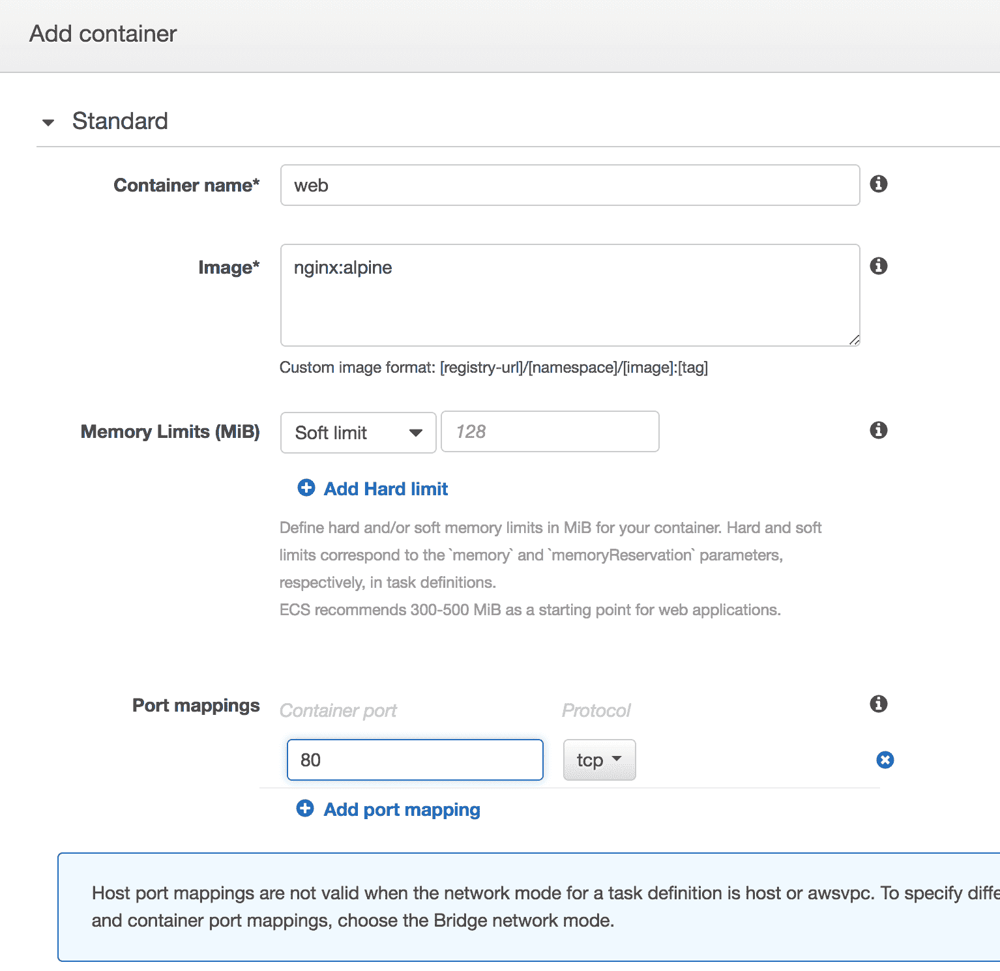

Adding a container to the ECS task definition

7.  然后单击添加。按钮。现在我们已经准备好在我们的宠物集群中实际运行这个任务描述中的一个任务。

# 在 ECS 中运行任务

选择`pets-task-def`任务定义，并在操作**下选择运行任务。在窗口中，执行以下步骤:**

 **1.  选择 FARGATE 作为发射类型。
2.  在群集 VPC 下拉列表下，选择您事先准备好的 VPC。
3.  在子网下拉列表中，选择 VPC 的一个子网。
4.  单击“安全组”选项下的“编辑”按钮，并选择您准备好的安全组。
5.  保留所有其他字段的默认值:

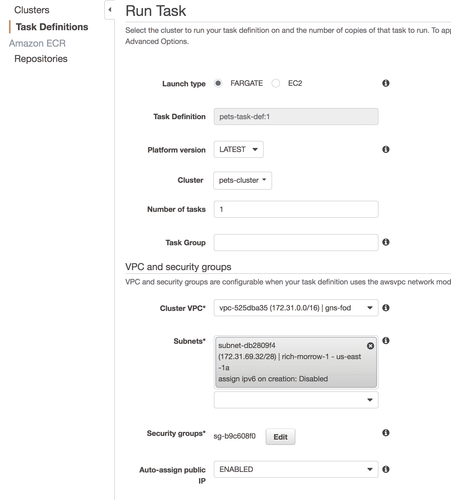

Running a task in our ECS cluster

6.  完成后，单击运行任务按钮。调配和运行此任务可能需要一分钟左右的时间。您可以在“任务”选项卡上的集群概述中看到该任务:

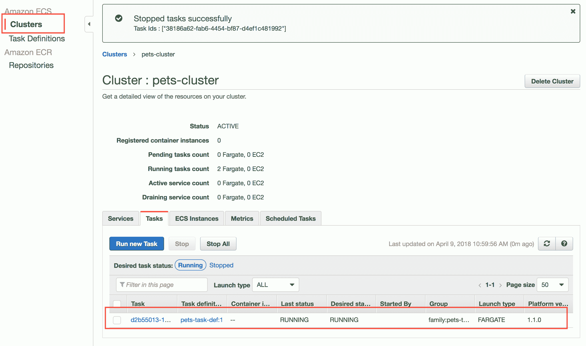

Our first task is running in the pets cluster

7.  单击任务(在任务列中)导航到任务详细信息页面。在那里你会找到这个任务的公共 IP 地址。复制 IP 地址，粘贴到新的浏览器标签，点击*进入*。Nginx 的欢迎页面应该显示如下:

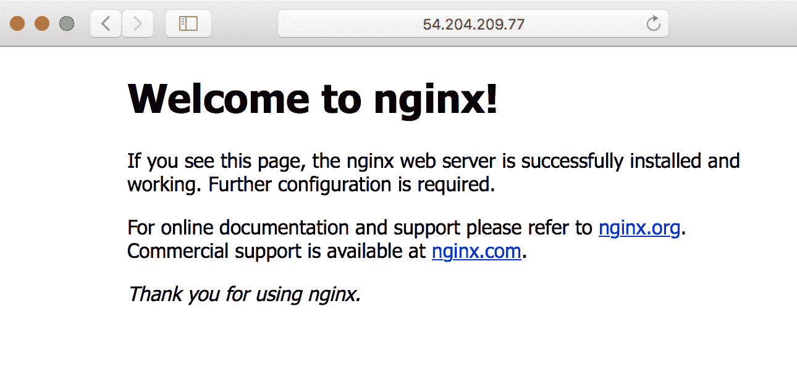

Testing the first task running in our ECS pets cluster

# 修改任务定义

现在，我们已经成功地在我们的 ECS 集群中运行了第一个任务，是时候修改任务定义以使用我们的 pets 应用的映像，而不是 Nginx 映像了。我们将在这个任务定义中使用映像`fundamentalsofdocker/ch14-web:1.0`，其源代码可以在我们的代码库中的文件夹`labs/ch14/ecs/web`中找到。

更改任务定义的步骤如下:

1.  选择`pets-task-def`任务定义，然后选择版本 1。
2.  将启用“创建新版本”按钮。单击它，在出现的页面中向下滚动到容器定义部分。在那里你应该看到我们的`web`容器。单击它并修改映像，而不是`nginx:alpine`添加值`fundamentalsofdocker/ch14-web:1.0`。
3.  单击更新，然后单击创建。这将创建我们的任务定义的新版本 2，称为`pets-task-def:2`。
4.  返回集群并停止当前任务。然后单击运行新任务。
5.  在对话框中，填写与运行第一个任务时相同的信息，但确保在任务定义下选择修订 2，即`pets-task-def:2`。
6.  单击运行任务，等待任务完成设置并运行。这可能需要一段时间，因为 ECS 需要从 Docker Hub 下载映像。任务准备就绪后，导航到其详细信息并找到分配给它的公共 IP 地址。

使用浏览器验证您是否可以访问我们的`web`组件。如果一切顺利，我们应该会看到下面的截图:


The pets web component is running in our ECS pets cluster

现在我们的`web`组件正在运行，但是我们还需要一个数据库来检索漂亮的猫映像。因此，我们需要创建任务定义的另一个版本，其中将包括我们的`db`组件。

# 将数据库组件添加到应用

让我们修改任务定义，并添加一个卷和将使用该容器的数据库容器:

1.  再次选择`pets-task-def`任务定义，然后选择版本 2。
2.  单击创建新版本按钮。首先，我们要添加一个卷定义。该体积将由`db`容器使用。
3.  向下滚动至体积部分，点击**添加体积**链接。命名卷`pets-data`并点击添加。
4.  在容器定义部分，单击添加容器按钮。定义容器名称为`db`，映像为`fundamentalsofdocker/ch08-db:1.0`。
5.  向下滚动到存储和记录部分，在挂载点**、**下，选择`pets-data`作为源卷，`/var/lib/postgresql/data`作为容器路径:

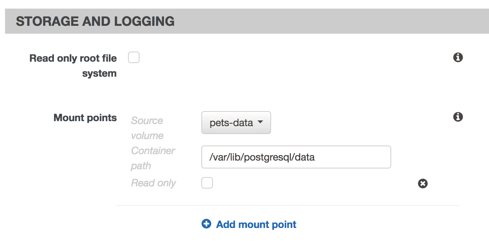

Mounting the volume pets-data to the db container

6.  单击添加以完成此对话框，然后单击创建以创建任务定义的修订版 3。本修订版 3 包含了我们的宠物应用的完整定义。让我们看看它是否有效，好吗？

7.  导航到集群详细信息，并确保停止上一个任务。
8.  然后单击运行任务，并输入与之前相同的值，但任务定义除外。
9.  在那里，一定要选择`pets-task-def:3`。

一旦任务被提供并运行，我们可以找到它的公共 IP 地址，然后在浏览器中导航到`http://<IP address>/pet`，其中`<IP address>`是任务的公共 IP:

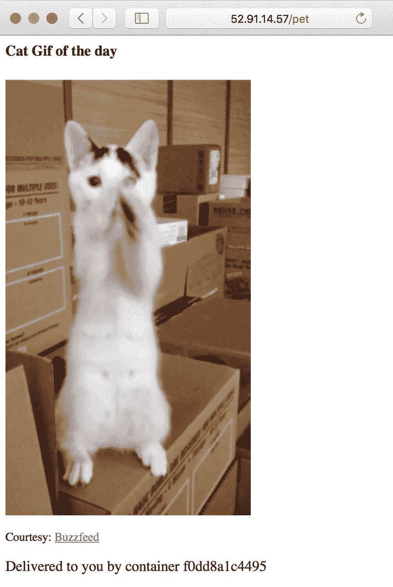

The pets application running in AWS ECS

总之，我们在 AWS 中创建了一个集群，并通过首先定义一个 ECS 任务定义，然后运行该任务定义中的一个任务，将我们的 pets 应用部署到其中。因为我们使用的是 Fargate 版本的 ECS，所以我们不必担心自己的基础设施，比如 EC2 实例。

ECS 使得在云中部署和运行容器化应用变得相对容易。当使用 Fargate 模板时，我们甚至不需要配置和管理基础设施，因为 AWS 会为我们做这些。虽然这对许多人来说可能很有吸引力，但这也是该产品最大的缺点之一。出于可以理解的商业利益，AWS 想尽一切办法将我们锁定在他们的生态系统中。一旦我们购买了 ECS，我们就不太可能改变云提供商，甚至不太可能仅仅使用不同的编排引擎，比如 Kubernetes。

# 在 AWS 上部署和使用 Docker EE

在这一部分，我们将安装 Docker **通用控制平面**(**UCP**)3.0 版本。UCP 是 Docker 企业产品的一部分，支持两个编排引擎，Docker Swarm 和 Kubernetes。UCP 可以安装在云中或内部。UCP 甚至有可能出现混合云。

要尝试这种方法，您需要 Docker EE 的有效许可证，或者您可以在 Docker Store 上申请免费测试许可证。

# 供应基础设施

使用 Ubuntu 16.04 服务器 AMI 在 AWS 中创建一个**自动缩放组**(**【ASG】**)。将 ASG 配置为包含三个大小为 t2.xlarge 的实例。结果如下:

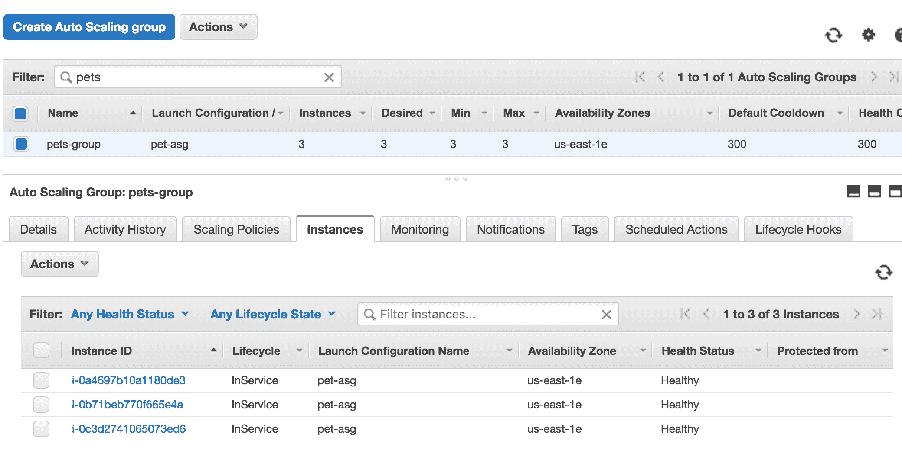

ASG on AWS ready for Docker EE

一旦创建了 ASG，在我们继续之前，我们需要稍微打开 SG(我们的 ASG 是其中的一部分)，这样我们就可以通过 SSH 从我们的笔记本电脑访问它，并且虚拟机也可以相互通信。导航到您的 SG 并添加两个新的入站规则，如下所示:

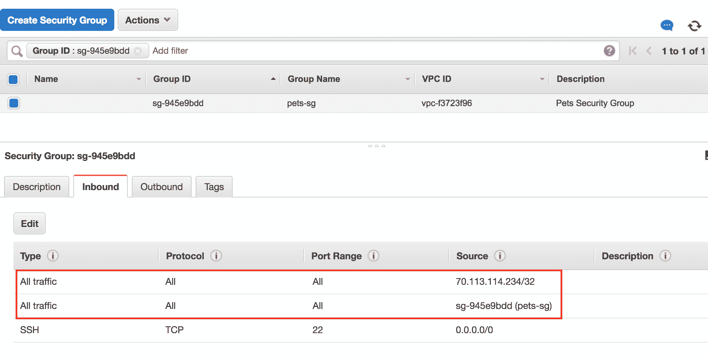

AWS Security Group settings

在前面的截图中:

*   第一条规则允许来自我的个人笔记本电脑(带有 IP 地址`70.113.114.234`)的任何流量访问 SG 中的任何资源。
*   第二个规则允许 SG 内部的任何流量。这些设置不应该在类似生产的环境中使用，因为它们过于宽松。但是对于这个演示环境，它们工作得很好。

# 安装 Docker

SSH 进入所有三个实例并安装 Docker。使用下载的密钥，SSH 进入第一台机器:

```
$ ssh -i pets.pem ubuntu@<IP address>
```

这里`<IP address>`是我们想要 SSH 进入的虚拟机的公共 IP 地址。

现在我们可以安装 Docker 了。详细说明参见[https://dockr.ly/2HiWfBc](https://dockr.ly/2HiWfBc)。我们在`labs/ch14/aws`文件夹中有一个名为`install-docker.sh`的脚本可以使用。首先，我们需要将`labs` GitHub 存储库克隆到虚拟机:

```
$ git clone https://github.com/fundamentalsofdocker/labs.git
$ cd labs/ch14/aws
```

然后运行脚本安装 Docker:

```
$ ./install-docker.sh
```

一旦脚本完成，我们就可以使用`sudo docker version`验证 Docker 确实安装了。对另外两个虚拟机重复上述代码。

The `sudo` is only necessary until the next SSH session is opened to this VM since we have added the user `ubuntu` to the group `docker`. Thus exist the current SSH session and connect again. This time `sudo` should not be needed in conjunction with `docker`.

# 正在安装 UCP Docker

我们需要设置一些环境变量，如下所示:

```
$ export UCP_IP=<IP address>
$ export UCP_FQDN=<FQDN>
$ export UCP_VERSION=3.0.0-beta2
```

这里`<IP address>`和`<FQDN>`是我们在 UCP 安装的 AWS EC2 实例的公共 IP 地址和公共 DNS 名称。

之后，我们可以使用以下命令下载 UCP 需要的所有映像:

```
$ docker run --rm docker/ucp:${UCP_VERSION} images --list \
 | xargs -L 1 docker pull
```

最后，我们可以安装 UCP:

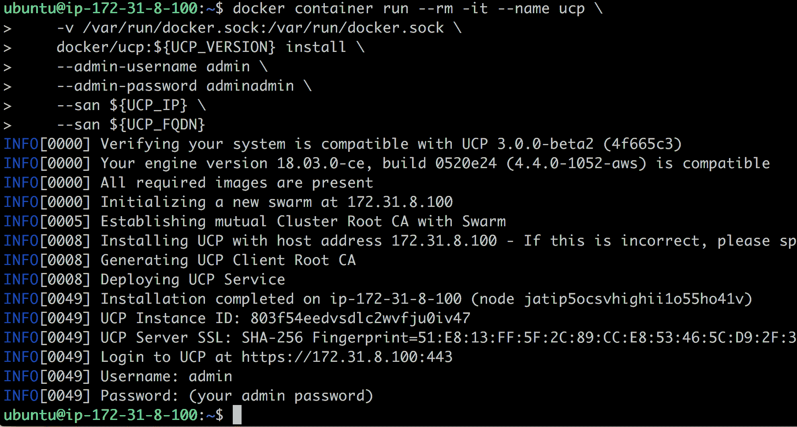

Installing UCP 3.0.0-beta2 on a VM in AWS

现在我们可以打开浏览器窗口，导航到`https://<IP address>`。使用您的用户名`admin`和密码`adminadmin`登录。当要求获得许可证时，请上传您的许可证密钥或按照链接获取试用许可证。

登录后，在左侧的共享资源部分下，选择节点，然后单击添加节点按钮:

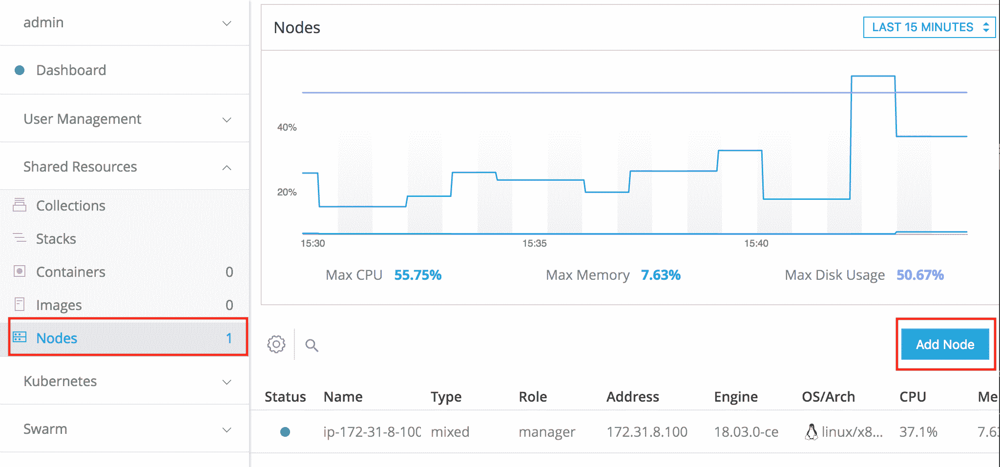

Adding a new node to UCP

在随后的“添加节点”对话框中，确保节点类型是 Linux，并且选择了节点角色“工作者”。然后复制对话框底部的`docker swarm join`命令。SSH 到您创建的另外两个虚拟机中，并运行此命令，使相应的节点作为工作节点加入 Docker Swarm:

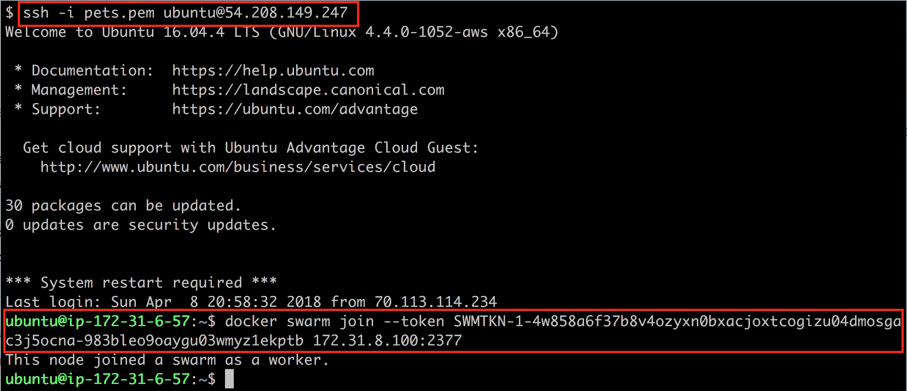

Joining a node as a worker to the UCP cluster

回到 UCP 的 web 用户界面，您应该看到我们现在已经准备好了三个节点，如下所示:


List of nodes in the UCP cluster

默认情况下，工作节点被配置为只能运行 Docker Swarm 工作负载。不过，这可以在节点详细信息中更改。在这种情况下，有三种设置是可能的——仅 Swarm、仅 Kubernetes 或混合工作负载。让我们从 Docker Swarm 作为编排引擎开始，部署我们的 pets 应用。

# UCP 集群的远程管理

为了能够从我们的笔记本电脑远程管理我们的 UCP 集群，我们需要从 UCP 创建并下载一个所谓的**客户端包**。继续执行以下步骤:

1.  在 UCP 网页界面的左侧管理**、**下，选择我的个人资料选项
2.  在随后的对话框中，选择新建客户端捆绑包选项，然后生成客户端捆绑包:

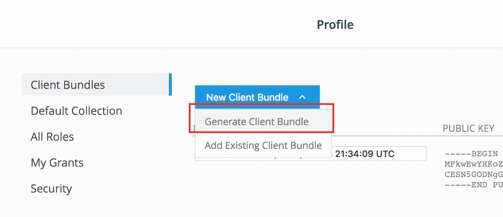

Generating and downloading a UCP client bundle

3.  在您的磁盘上找到下载的软件包并解压缩
4.  在新的终端窗口中，导航到该文件夹并获取`env.sh`文件:

```
$ source env.sh
```

您应该会得到类似如下的输出:

```
Cluster "ucp_34.232.53.86:6443_admin" set.
User "ucp_34.232.53.86:6443_admin" set.
Context "ucp_34.232.53.86:6443_admin" created.
```

现在，我们可以通过例如列出集群的所有节点来验证我们确实可以远程访问 UCP 集群:


Listing all the nodes of our remote UCP cluster

让我们尝试使用 Docker Swarm 作为编排引擎，将 pets 应用部署为一个栈。

# 部署到 DockerSwarm

在终端中，导航至`labs/ch14/ucp`文件夹，并使用文件`stack.yml`创建`pets`栈:


Deploying the pets stack into the UCP cluster

在 UCP 网络用户界面中，我们可以验证栈是否已创建:


The pets stack listing in the UCP web UI

为了测试应用，我们可以导航到主菜单 Swarm 下的服务。集群中运行的服务列表将显示如下:

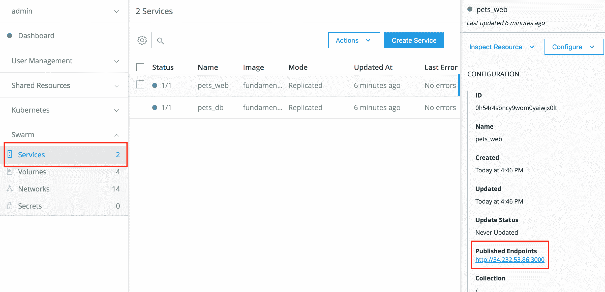

Details of the service web of the pets stack

在前面的截图中，我们看到了`pets`栈的两个服务`web`和`db`。如果我们点击`web`服务，其详细信息会显示在右侧。在那里，我们找到了一个条目，已发布的端点。点击链接，我们的`pets`应用将显示在浏览器中。

完成后，使用以下命令从控制台中移除栈:

```
$ docker stack rm pets
```

或者，您可以尝试从 UCP web UI 中移除该栈。

# 部署到 Kubernetes

从您用来远程访问 UCP 集群以使用 Docker Swarm 作为编排引擎将 pets 应用部署为栈的同一终端，我们现在可以尝试使用 Kubernetes 作为编排引擎将 pets 应用部署到 UCP 集群。

确保您仍在`labs/ch14/ucp`文件夹中。使用`kubectl`部署宠物应用。第一个测试我们可以用 Kubernetes 命令行界面获得集群的所有节点:


Getting all the nodes of the UCP cluster using the Kubernetes CLI

显然，我的环境配置正确，`kubectl`确实可以列出 UCP 集群中的所有节点。这意味着我现在可以使用文件`pets.yaml`中的定义部署 pets 应用:


Creating the pets application in the UCP cluster using the Kubernetes CLI

我们可以列出使用`kubectl get all`创建的对象。在浏览器中，我们可以导航到`http://<IP address>:<port>`来访问 pets 应用，其中`<IP address>`是一个 UCP 集群节点的公共 IP 地址，`<port>`是由 Kubernetes 服务`web`发布的端口。

我们在 AWS ASG 中创建了一个由三个虚拟机组成的集群，并在其上安装了 Docker 和 UCP 3.0。然后，我们将著名的 pets 应用部署到 UCP 集群中，一次使用 Docker Swarm 作为编排引擎，一次使用 Kubernetes。

Docker UCP 是一个与平台无关的容器平台，可在任何云、内部、裸机或虚拟化环境中提供安全的企业级软件供应链。它甚至提供了选择编排引擎的自由。用户可以在 Docker Swarm 和 Kubernetes 之间进行选择。甚至可以在同一个集群中的两个编排器中运行应用。

# Azure 容器产品一览

要在 Azure 中使用微软的容器相关产品，我们需要在 Azure 上有一个帐户。您可以创建试用帐户或使用现有帐户。在 https://azure.microsoft.com/en-us/free/获得您的试用帐户。

微软在 Azure 上提供不同的容器相关服务。最容易使用的可能是 **Azure 容器实例**，它向*承诺了在 Azure 中运行容器的最快和最简单的方法，而无需调配任何虚拟机，也无需采用更高级别的服务。*只有当您想要在托管环境中运行单个容器时，该服务才真正有用。设置相当容易。在 Azure 门户([portal.azure.com](http://portal.azure.com))中，首先创建一个新的资源组，然后创建一个 Azure 容器实例。您只需要填写一个简短的表单，其中包含容器名称、要使用的映像和要打开的端口等属性。该容器可在公共或私有 IP 地址上使用，如果崩溃，将自动重新启动。有一个不错的管理控制台可用，例如，监控资源消耗，如中央处理器和内存。

第二个选择是 **Azure 容器服务** ( **ACS** )，该服务*提供了一种简化虚拟机集群的创建、配置和管理的方法，这些虚拟机被预配置为运行容器化应用。* ACS 使用 Docker 映像，并在三个编排器之间提供选择:Kubernetes、Docker Swarm 或 DC/OS(由 Apache Mesos 提供动力)。微软声称他们的服务可以扩展到数万个容器。ACS 是免费的，一个只对计算资源收费。

让我们尝试创建一个托管的 Docker Swarm，它有一个管理器和一个工作节点，然后我们将把我们的 pets 演示应用部署到这个节点。首先我们需要安装 Azure CLI 2.0。我们可以使用 Docker 映像来实现这一点:

```
$ docker container run -it microsoft/azure-cli:latest
```

容器运行后，我们需要登录我们的帐户:

```
bash-4.3# az login
```

您将收到以下消息:

```
To sign in, use a web browser to open the page https://microsoft.com/devicelogin and enter the code <code> to authenticate.
```

按照说明通过浏览器登录。一旦您成功通过 Azure 帐户的认证，您就可以回到您的终端，并应该登录。

首先，我们创建一个名为`pets-rg`的新资源组:

Select the location that is closest to you. In my case, it is US East.

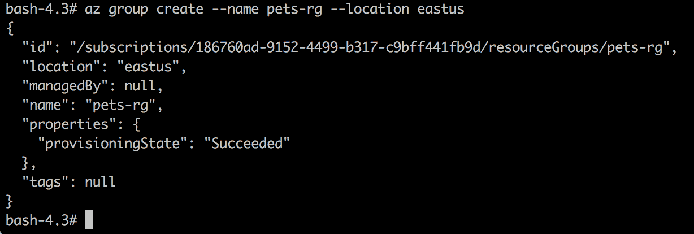

Creating a resource group in Azure

然后，我们使用 Docker Swarm 作为编排引擎，创建了一个新的 **Azure 容器服务**。这可能需要几分钟时间。结果如下:

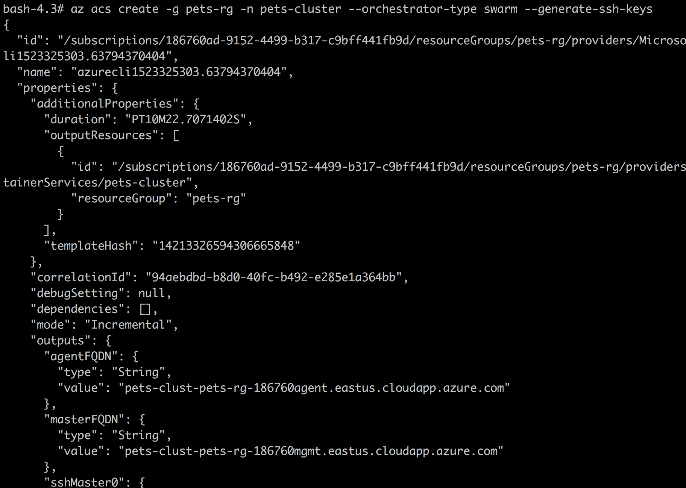

Creating an Azure Container Service using Docker Swarm (shortened)

一旦我们的 Docker Swarm 在 Azure 中创建完成，我们就可以发出以下命令来检索我们需要连接到 Swarm 的公共 IP 列表:


第一个条目是 Docker 代理池的 IP 地址，第二个条目来自 Docker Swarm 主服务器。有了这些信息，我们可以使用主机的 IP 地址创建一个到主机的 SSH 隧道。我们需要直接从我们的笔记本电脑中完成，而不是在 Azure 命令行界面容器中，因为后者没有安装 Docker 命令行界面。为了做到这一点，我们还需要将证书中的私钥从 Azure CLI 容器复制到我们的主机上。打开一个新的终端窗口，列出所有正在运行的容器，找到 Azure CLI 容器的`<container ID>`，然后运行以下命令复制密钥:

```
$ docker cp <container ID>:/root/.ssh/id_rsa ~/.ssh/fob
```

现在，在与上一个命令相同的终端中，使用以下命令创建隧道:

```
$ ssh -i ~/.ssh/fob -p 2200 -fNL 2375:localhost:2375 \
    azureuser@<IPAddress>
```

用你的群主的 IP 地址替换`<IPAddress>`。

我们将使用这个隧道来远程管理 Azure 上的 Docker Swarm。但是要做到这一点，我们还需要定义`DOCKER_HOST`环境变量:

```
$ export DOCKER_HOST=:2375
```

是的，这不是一个错误。我们只定义了端口，没有主机名(由于 SSH 隧道)。一旦我们完成了所有这些，我们就可以远程管理我们的 Docker Swarm 了。让我们首先运行`docker info`命令:

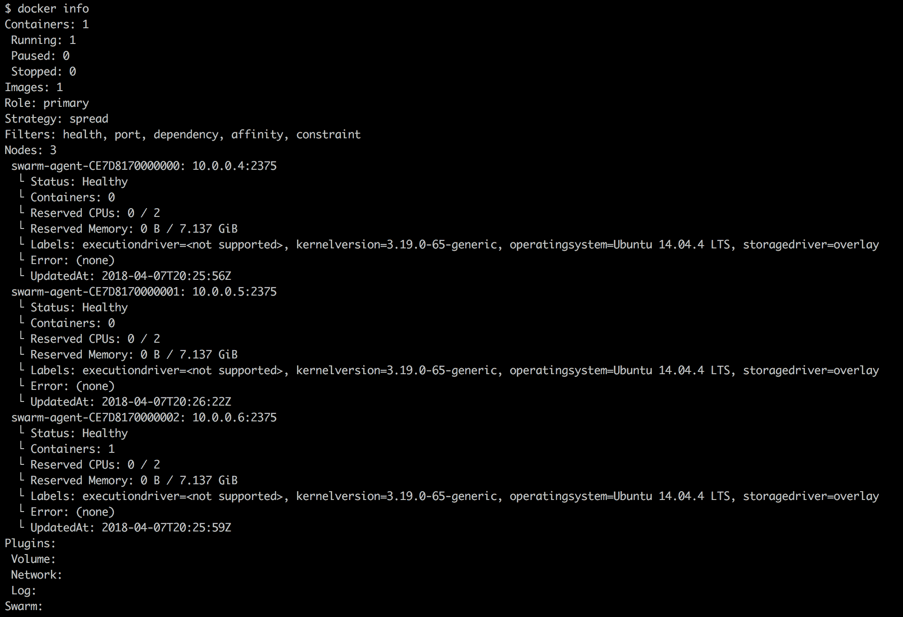

Docker info executed remotely on Docker Swarm in Azure (shortened)

我们看到我们有一个群，其中有三个工作节点准备接受工作负载。输出还告诉我们，Azure 正在使用传统的 Docker Swarm，而不是 SwarmKit。

让我们尝试在这个群体上部署我们的 pets 应用。在您的终端中，导航到`labs/ch14/azure`文件夹，按照文件`docker-compose.yml`中的描述部署应用:

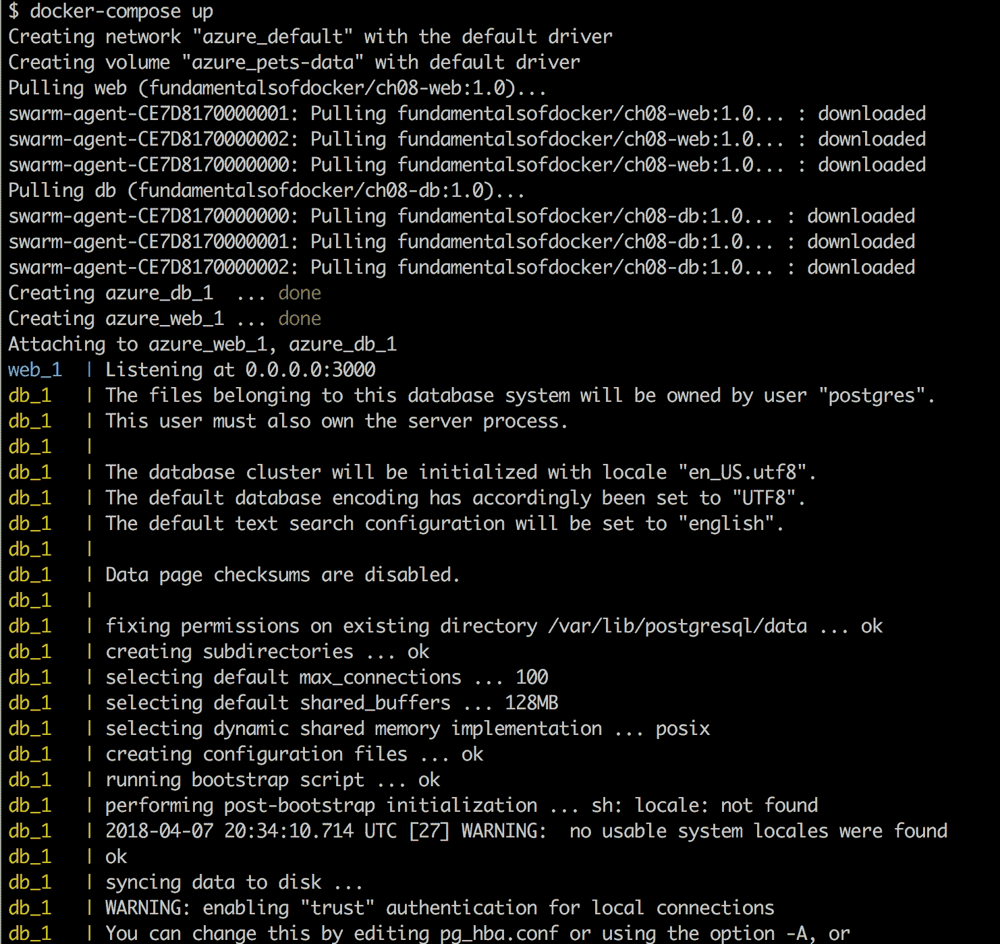

Running the pets application on Docker Swarm on Azure (shortened)

好了，现在让我们测试应用。为此，我们需要我们在本节前面检索的群代理池的公共 IP。在`<IP address>/pet `打开你的浏览器，你会看到 pets 应用:

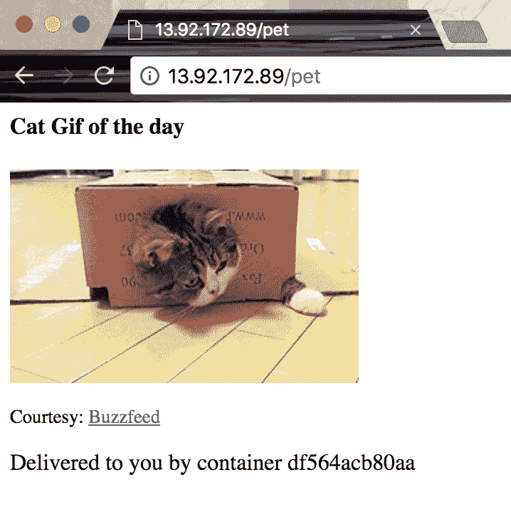

Pets application running on Docker Swarm in Azure

一旦我们在 Azure 上玩完 Docker Swarm，我们应该删除它，以免产生任何不必要的成本:

```
$ az group delete --name pets-rg --yes --no-wait
```

在本节中，我们已经展示了如何使用 Azure CLI 在 Azure 中配置 Docker Swarm。然后，我们成功地将我们的 pets 应用部署到该群中。

Azure 在容器工作负载方面有一些引人注目的产品，由于 Azure 主要提供开源编排引擎，如 Kubernetes、Docker Swarm、DC/OS 或 Rancher，因此锁定并不像在 AWS 上那样明显。从技术上讲，如果我们最初在 Azure 中运行我们的容器化应用，然后决定转移到另一个云提供商，我们仍然是移动的。成本应该是有限的。

# 对谷歌容器产品的简短浏览

谷歌是 Kubernetes 的发明者，迄今为止，也是其背后的驱动力。因此，人们会认为谷歌在托管 Kubernetes 方面有令人信服的产品。让我们来看一看。要继续，您需要在谷歌云上有一个现有的帐户，或者您可以在[https://console.cloud.google.com/freetrial](https://console.cloud.google.com/freetrial)这里创建一个测试帐户。继续执行以下步骤:

1.  在主菜单中，选择 Kubernetes 引擎。第一次这样做时，需要一些时间来初始化 Kubernetes 引擎。
2.  一旦准备好了，我们可以通过点击 CREATE CLUSTER 来创建一个集群。
3.  将集群命名为`pets-cluster`，并将“创建 Kubernetes 集群”表单中的所有其他设置保留为默认值，然后单击“创建”。

为我们调配群集也需要一些时间。一旦集群创建完成，我们就可以打开**云壳**。这应该类似于下面的截图:

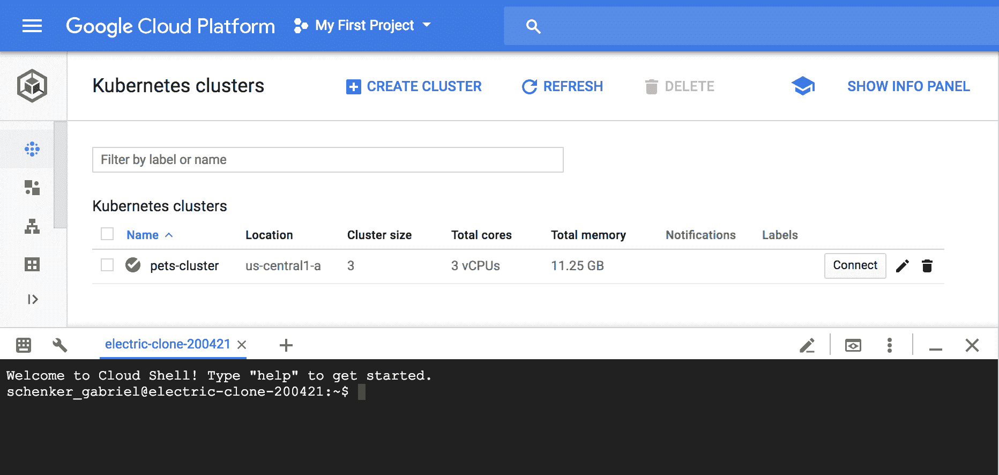

First Kubernetes cluster ready and Cloud Shell open in GCE

我们现在可以使用以下命令将我们的`labs` GitHub 存储库克隆到这个环境中:

```
$ git clone https://github.com/fundamentalsofdocker/labs
$ cd labs/ch14/gce
```

我们现在应该在当前文件夹中找到一个`pets.yaml`文件，我们可以用它来将 pets 应用部署到我们的 Kubernetes 集群中。看一下文件:

```
$ less pets.yaml
```

它的内容与我们在上一章中使用的文件几乎相同。这两个区别是:

*   我们使用类型为`LoadBalancer`(而不是`NodePort`)的服务来公开暴露组件`web`。
*   我们不为 PostgreSQL 数据库使用卷，因为在 GCE 上正确配置 StatefulSet 比在 Minikube 中要复杂一些。这样做的后果是，如果`db`吊舱崩溃，我们的宠物应用将不会保持该状态。如何在 GCE 上使用持久卷不在本书的讨论范围之内。

在继续之前，我们需要首先设置`gcloud`和`kubectl`凭证:

```
$ gcloud container clusters get-credentials pets-cluster \
 --zone us-central1-a
```

完成后，就该部署应用了:

```
$ kubectl create -f pets.yaml
```

一旦创建了对象，我们就可以观察`LoadBalancer`服务`web`，直到它被分配一个公共 IP 地址:

```
$ kubectl get svc/web --watch
```

这应该类似于下面的截图:


Retrieving the public IP address of the service web

然后我们可以使用这个 IP 地址，导航到`http://<IP address>:3000/pet`，我们应该会看到熟悉的猫形象。

要清理和删除所有资源，请运行以下脚本:

```
kubectl delete deploy/web
kubectl delete deploy/db
kubectl delete svc/web
kubectl delete svc/db
```

我们在 GCE 中创建了一个托管的 Kubernetes 集群。然后，我们使用通过 GCE 门户提供的 Cloud Shell 首先克隆我们的`labs` GitHub 存储库，然后使用`kubectl`工具将 pets 应用部署到 Kubernetes 集群中。

当研究托管的 Kubernetes 解决方案时，GCE 是一个引人注目的解决方案。这使得它非常容易启动，并且由于谷歌是 Kubernetes 背后的主要驱动力，我们可以放心，我们将始终能够利用 Kubernetes 的全部未绑定功能。

# 摘要

在本书的最后一章中，您学习了如何将容器化的应用部署到 AWS ECS 中，并快速了解了如何安装和使用 Docker 的 UCP，它是 AWS 上企业产品的一部分。然后，您可以一窥微软 Azure 和谷歌云引擎当前与容器相关的云产品是什么。在每一个上面，我们都成功地安装了我们的 pets 应用。

# 问题

要评估您的知识，请回答以下问题:

1.  给出在 AWS 上配置和运行 Docker UPC 所需任务的高级描述。
2.  列举几个理由，说明何时使用托管解决方案(如 Azure ACS 或 AWS ECS)以及何时使用(托管的)Docker Swarm 或基于 Kubernetes 的产品。

# 进一步阅读

以下文章为您提供了与我们在本章中讨论的主题相关的更多信息:

*   *在 https://dockr.ly/2vH5dpN 的 Linux 服务器*上部署 Docker 企业版
*   在[https://amzn.to/2Hh7pcM](https://amzn.to/2Hh7pcM)使用 Fargate 开始使用亚马逊 ECS
*   https://bit.ly/2JglX9d 蔚蓝容器服务公司
*   https://bit.ly/2I8MjJx 谷歌 Kubernetes 引擎**