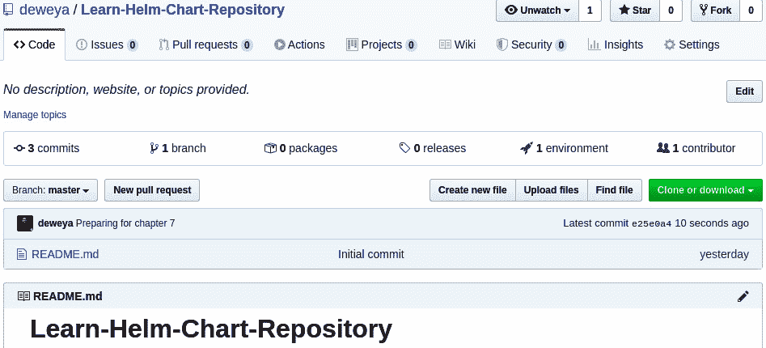
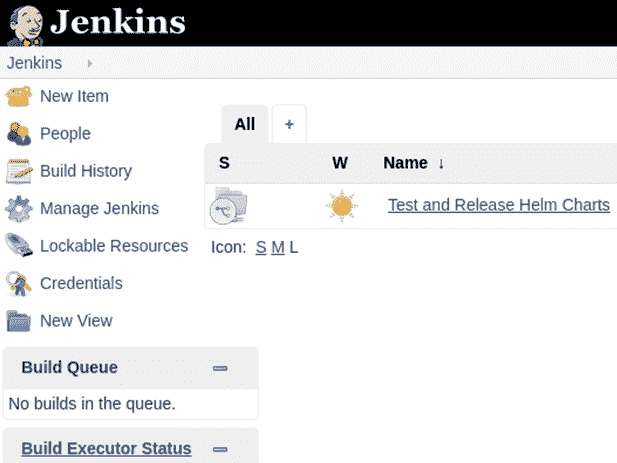
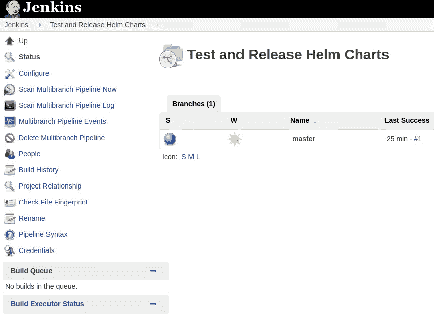
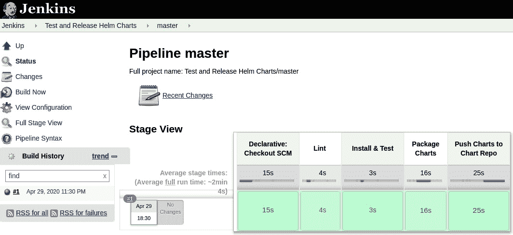
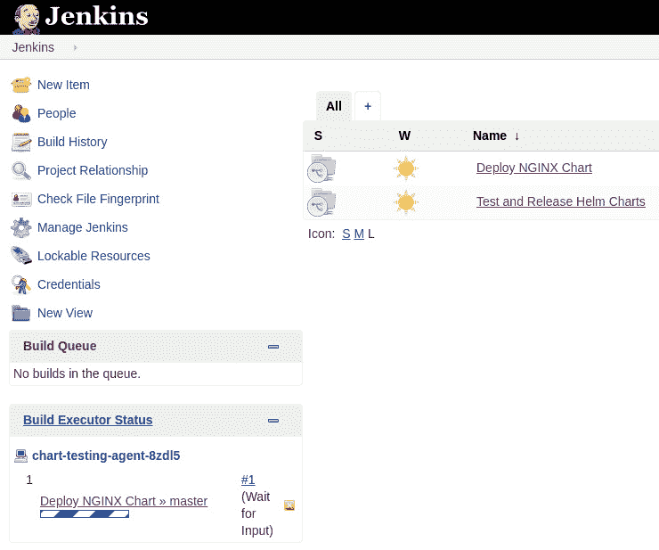
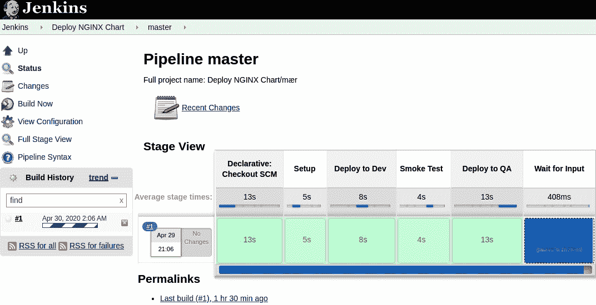
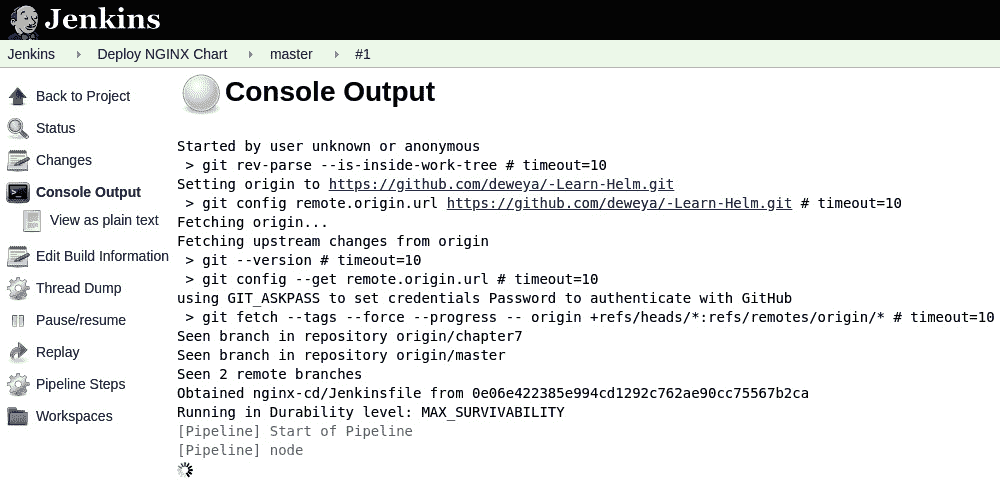
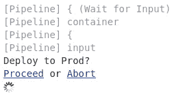

# 七、使用 CI/CD 和 GitOps 自动化 Helm 流程

在本书中，我们到目前为止已经讨论了两个高级流程。首先，我们探索了使用 Helm 作为最终用户，利用 Helm 作为包管理器来将不同复杂性的应用部署到 Kubernetes。其次，我们探索了作为图表开发人员开发和测试 Helm 图表，这包括将 Kubernetes 复杂性封装在 Helm 图表中，并在图表上执行测试，以确保所需的功能成功交付给最终用户。

这两个过程都涉及调用各种不同的 Helm CLI 命令。这些 Helm CLI 命令虽然在执行各自的任务时很有效，但需要从命令行手动调用。当管理多个不同的图表或应用时，手动调用可能会成为一个痛点，并且会使大型企业难以扩展。因此，我们应该探索在 Helm 已经提供的基础上提供额外自动化的替代选项。在本章中，我们将研究与**持续集成**和**持续交付** ( **CI** / **CD** )和`GitOps`相关的概念，它们是可以自动调用 Helm CLI 和其他命令的方法，以便针对 Git 存储库的内容执行自动化工作流。这些工作流可用于使用 Helm 自动部署应用，并在图表开发生命周期中构建、测试和打包 Helm 图表。

在本章中，我们将涵盖以下主题:

*   理解 CI/CD 和 GitOps
*   建立我们的环境
*   创建配置项管道以构建 Helm 图表
*   使用 Helm 创建光盘管道来部署应用
*   清理

# 技术要求

本章要求您在本地计算机上安装以下技术:

*   迷你库比
*   舵
*   库布特雷
*   饭桶

除了这些工具之外，您应该可以在 https://github.com/PacktPublishing/-Learn-Helm 找到包含与 GitHub 本章中使用的示例相关的资源的 Packt 存储库。本章将引用该存储库。

# 理解 CI/CD 和 GitOps

到目前为止，我们已经解决了 Helm 开发固有的许多关键概念——构建、测试和部署。然而，我们的探索仅限于手动配置和调用 Helm CLI。虽然这在开始使用 Helm 时没问题，但是当您希望将图表移动到类似生产的环境中时，您需要考虑几个问题，包括以下问题:

*   如何确保图表开发和部署的最佳实践得到实施？
*   合作者参与开发和部署过程会有什么影响？

这些要点适用于任何软件项目，而不仅仅是 Helm 图表开发。虽然到目前为止，我们已经介绍了许多最佳实践，但是在与新的合作者打交道时，他们可能对这些主题或执行这些关键步骤的规程没有相同的理解。通过使用自动化和可重复的流程，已经建立了 CI/CD 等概念来应对其中的一些挑战。

## 置信区间/置信区间

对自动化的软件开发过程的需求导致了 CI 的创建，该过程可以在每次软件变更发生时坚持。CI 不仅确保了最佳实践得到遵守，而且还有助于消除许多开发人员面临的共同挑战，正如“它在我的机器上工作”这句话所体现的那样我们之前讨论的的一个因素是使用**版本控制系统**，比如`git`，来存储源代码。通常，每个用户都有自己独立的源代码副本，这使得维护代码库变得很难管理，因为引入了额外的贡献者。

通过使用自动化工具来正确启用配置项，每当发生更改时，都会检索源代码并经历一组预定的步骤。对合适的自动化工具的需求导致了专门为此目的设计的软件的兴起。竞争情报工具的几个例子包括詹金斯、团队城市和竹子，以及各种基于软件即服务的解决方案。通过将任务的责任转移到第三方组件上，开发人员更有可能频繁提交代码，并且项目经理可以对其团队的技能和产品的健壮性充满信心。

这些工具中的一个关键特性是能够提供关于项目当前状态的及时通知。不是在软件开发周期的后期发现一个突破性的变更，而是通过 CI 的使用，一旦变更被合并，流程就被执行，并向相关方发送通知。通过利用快速通知，它为引入变更的用户提供了解决问题的机会，同时感兴趣的领域在考虑的前面，而不是稍后在交付过程中当他们可能被其他地方占用时。

当一个应用走向生产时，在整个软件交付生命周期中应用 CI 的许多概念的能力导致了 CD 的产生。光盘是一组定义好的步骤，通过发布过程(通常称为管道)来编写软件。配置项和光盘通常配对在一起，因为许多执行配置项的相同执行引擎也可以实现光盘。CD 在许多组织中获得了认可和普及，在这些组织中，为了使软件发布过程进入下一阶段，需要实施适当的变更控制并获得批准。由于围绕 CI/CD 的许多概念都是以可重复的方式自动化的，一旦团队确信他们有一个可靠的框架，他们就可以完全消除手动批准步骤的需要。

在没有任何人工干预的情况下实现完全自动化的构建、测试、部署和发布过程的过程被称为**连续部署**。虽然许多软件项目从未完全实现连续部署，但是通过仅仅实现 CI/CD 强调的概念，团队能够更快地产生真正的业务价值。在下一节中，我们将介绍 GitOps 作为一种机制来改进应用及其配置的管理。

## 使用 GitOps 将 CI/CD 提升到下一个级别

Kubernetes 是一个使用声明性配置的平台。就像用任何编程语言编写的应用一样，例如 Python、Golang 或 Java，通过 CI/CD 管道遍历应用，Kubernetes 清单可以实现许多相同的模式。清单还应该存储在源代码存储库中，例如 Git，并且可以经历相同类型的构建、测试和部署实践。在 Git 存储库中管理 Kubernetes 集群配置的生命周期，然后以自动化的方式应用这些资源，这种方式的流行导致了 GitOps 的概念。GitOps 于 2017 年由软件公司 WeaveWorks 首次推出，此后作为管理 Kubernetes 配置的一种方式，它的受欢迎程度不断提高。虽然 GitOps 在 Kubernetes 环境中最为人所知，但它的原理可以应用于任何云原生环境。

与 CI/CD 类似，开发了管理 GitOps 流程的工具。其中包括来自 Intuit 的 **ArgoCD 和来自 WeaveWorks** 的 **Flux，该组织负责创造术语 GitOps。您不需要使用专门为 GitOps 设计的工具，因为可以使用任何自动化工具，尤其是为管理 CI/CD 流程而设计的工具。传统的 CI/CD 工具和为 GitOps 设计的工具之间的主要区别在于 GitOps 工具能够持续观察 Kubernetes 集群的状态，并在当前状态与所需状态不匹配时应用所需的配置，如存储在 Git 中的清单中所定义的。这些工具利用了对 Kubernetes 本身至关重要的控制器模式。**

由于 Helm 图表最终呈现为 Kubernetes 资源，因此它们也可以用于参与 GitOps 流程，并且前面提到的许多 GitOps 工具都支持 Helm。在本章的剩余部分，我们将看到如何使用使用 CI/CD 和 GitOps 的 Helm 图表，利用 Jenkins 作为 CI 和 CD 的选择工具。

# 建立我们的环境

在本章中，我们将开发两个不同的管道来演示 Helm 周围的不同流程如何实现自动化。

采取以下步骤开始设置您的本地环境:

1.  首先，考虑到本章增加的内存需求，如果在 [*第 2 章*](02.html#_idTextAnchor098) *，准备一个 Kubernetes 和 Helm 环境*中没有用 4g 内存初始化，您应该删除您的`minikube`集群并用`4g`内存重新创建它。这可以通过运行以下命令来完成:

    ```
    $ minikube delete
    $ minikube start --memory=4g
    ```

2.  一旦 Minikube 启动，创建一个名为`chapter7` :

    ```
    $ kubectl create namespace chapter7
    ```

    的新命名空间

此外，您应该分叉 Packt 存储库，这将允许您根据这些练习中描述的步骤对存储库进行修改:

1.  Create a fork of the Packt repository by clicking the **Fork** button on the Git repo:

    

    图 7.1–选择分叉按钮来分叉 Packt 存储库

    您必须有一个 GitHub 帐户才能分叉一个存储库。创建新账户的过程在 [*第五章*](05.html#_idTextAnchor265)*建立你的第一个 Helm 图表*中有描述。

2.  创建 Packt 存储库的分叉后，通过运行以下命令将这个分叉克隆到您的本地机器上:

    ```
    $ git clone https://github.com/$GITHUB_USERNAME/-Learn-Helm.git Learn-Helm
    ```

除了创建 Packt 存储库的分叉之外，您可能还想从您的 Helm 存储库中移除`guestbook`图表，该图表是从您的 GitHub Pages 存储库中提供的，我们在 [*第 5 章*](05.html#_idTextAnchor265)*构建您的第一个 Helm 图表*中创建了该存储库。虽然严格来说没有必要，但本章中的示例将假定是全新的。

使用以下步骤从图表库中删除此图表:

1.  导航到您的 Helm 图表存储库的本地克隆。如您所知，我们为您的图表存储库推荐的名称是`Learn-Helm-Chart-Repository`，因此我们将在本章中使用该名称来指代您基于 GitHub Pages 的图表存储库:

    ```
    $ cd $LEARN_HELM_CHART_REPOSITORY_DIR
    $ ls
    guestbook-1.0.0.tgz   index.yaml   README.md
    ```

2.  从图表库中删除`guestbook-1.0.0.tgz`和`index.yaml`文件:

    ```
    $ rm guestbook-1.0.0.tgz index.yaml
    $ ls
    README.md
    ```

3.  将这些更改推送到您的远程存储库:

    ```
    $ git add --all
    $ git commit -m 'Preparing for chapter 7'
    $ git push origin master
    ```

4.  您应该能够在 GitHub 中确认您的图表和索引文件已被删除，只留下`README.md`文件:



图 7.2–您应该在图表存储库中看到的唯一文件是 README.md 文件

现在您已经启动了 Minikube，创建了 Packt 存储库的分叉，并从`Learn-Helm-Chart-Repository`中移除了留言簿图表，让我们开始学习如何创建 CI 管道来发布 Helm c harts。

# 创建 CI 管道以构建 Helm 图表

CI 的概念可以应用于构建、测试、打包并将 Helm 图表发布到图表存储库的图表开发人员的视角。在本节中，我们将描述使用端到端配置项管道来简化这个过程可能是什么样子，并向您介绍如何构建一个示例管道。第一步是设计示例 pi peline 所需的组件。

## 设计管道

在前面的章节中，开发 Helm 图表主要是一个手动过程。虽然 Helm 为在 Kubernetes 集群中创建`test`钩子提供了自动化，但是`helm lint`、`helm test`或`ct lint-and-install`命令的调用是在代码更改后手动执行的，以确保测试仍然通过。一旦林挺和测试在代码更改后继续通过，就可以通过运行`helm package`命令打包图表。如果图表是使用 GitHub Pages 存储库提供的(例如在 [*第 5 章*](05.html#_idTextAnchor265)*构建您的第一个 Helm 图表*中创建的)，则通过运行`helm repo index`创建`index.yaml`文件，并将`index.yaml`文件连同打包的图表一起推送到 GitHub 存储库。

虽然手动调用每个命令肯定是可行的，但是随着您开发更多的 Helm 图表或添加更多的贡献者，这个工作流会变得越来越难以维持。使用手动工作流，很容易允许对图表进行未经测试的更改，并且很难确保贡献者遵守测试和贡献指南。幸运的是，这些问题可以通过创建一个 CI 管道来避免，该管道可以自动化您的发布过程。

以下步骤概述了一个使用本书中讨论的命令和工具的配置项工作流示例。假设结果图表保存在 GitHub Pages 存储库中:

1.  图表开发人员在`git`单回购中对一个图表或一组图表进行代码更改。
2.  开发人员将变更推送到远程存储库。
3.  通过运行`ct lint`和`ct install`命令，已修改的图表会自动在 Kubernetes 命名空间中进行剪切和测试。
4.  如果林挺和测试成功，图表将自动与`helm package`命令打包。
5.  使用`helm repo index`命令自动生成`index.yaml`文件。
6.  打包的图表和更新后的`index.yaml`文件会自动推送到存储库。它们被推至`stable`或`staging`，这取决于作业所针对的分支。

在下一节中，我们将使用**詹金斯**执行该过程。让我们从了解詹金斯是什么和它是如何工作的开始。

## 了解詹金斯

Jenkins 是一个用于执行自动化任务和工作流的开源服务器。通常使用通过詹金斯的**管道创建 CI/CD 管道，作为代码**特征，写在一个名为`Jenkinsfile`的文件中，该文件定义了一个詹金斯管道。

詹金斯管道是使用常规**领域特定语言** ( **DSL** )编写的。Groovy 是一种类似于 Java 的语言，但与 Java 不同，它可以用作面向对象的脚本语言，有助于编写易于阅读的自动化代码。在本章中，我们将带您浏览已经为您准备好的两个现有`Jenkinsfile`文件。你不需要有任何从零开始编写`Jenkinsfile`文件的经验，因为深入了解詹金斯已经超出了本书的范围。话虽如此，到本章结束时，您应该能够将学到的概念应用到您选择的自动化工具中。虽然詹金斯是本章的特色，但它的概念可以应用于任何其他自动化工具。

当创建`Jenkinsfile`文件时，工作流的已定义步骤集将在 Jenkins 服务器本身上执行，或者在被委派运行作业的单独代理中执行。每当构建开始时，通过自动将 Jenkins 代理调度为单独的 Pods，可以将附加功能与 Kubernetes 集成，从而简化代理的创建和管理。代理完成后，可以将其配置为自动终止，以便下一个构建可以在全新、干净的 Pod 中运行。在本章中，我们将使用詹金斯代理运行示例管道。

詹金斯还通过提供扫描源代码管理存储库来寻找`Jenkinsfile`文件的能力，很好地适应了 GitOps 的概念。对于包含`Jenkinsfile`文件的每个分支，将自动配置一个新作业，该作业将从克隆所需分支的存储库开始。这使得测试新特性和修复变得很简单，因为新作业可以在它们对应的分支旁边自动创建。

对詹金斯有了基本的了解，现在让我们在 Minikube 环境中安装詹金斯。

安装詹金斯

与通常部署在 Kubernetes 上的许多应用一样，Jenkins 可以使用 Helm Hub 的许多不同社区 Helm 图表之一进行部署。在本章中，我们将使用来自**代码中心**软件开发公司的詹金斯 Helm 图表。添加`codecentric`图表库，开始安装以代码为中心的詹金斯 Helm 图表:

```
$ helm repo add codecentric https://codecentric.github.io/helm-charts
```

在预期的与 Kubernetes 相关的值中，例如配置资源限制和服务类型，`codecentric` Jenkins Helm 图表包含用于自动配置不同 Jenkins 组件的其他与 Jenkins 相关的值。

由于配置这些值需要对 Jenkins 有更深入的了解，这超出了本书的范围，因此为您提供了一个`values`文件，它将自动准备以下 Jenkins 配置:

*   添加未包含在基础映像中的相关 Jenkins 插件。
*   配置使用 GitHub 进行身份验证所需的凭据。
*   配置专门为测试和安装 Helm 图表而设计的 Jenkins 代理。
*   将 Jenkins 配置为基于`Jenkinsfile`文件的存在自动创建新作业。
*   跳过通常在新安装启动时出现的手动提示。
*   禁用身份验证以简化本章的 Jenkins 访问。

`values`文件还将配置以下与 Kubernetes 相关的详细信息:

*   针对 Jenkins 服务器设置资源限制。
*   将詹金斯服务类型设置为`NodePort.`
*   创建 Jenkins 和 Jenkins 代理在 Kubernetes 环境中运行作业和部署 Helm 图表所需的服务帐户和 RBAC 规则。
*   将詹金斯`PersistentVolumeClaim`尺寸设置为`2Gi.`

该值文件可在[上获得。浏览这些值的内容时，可能会注意到`fileContent`下定义的配置包含 Go 模板。这个值的开头可以在这里看到:](https://github.com/PacktPublishing/-Learn-Helm/blob/master/jenkins/values.yaml)


图 7.3–詹金斯 Helm 图表的`values.yaml`文件包含 Go 模板

当 Go 模板在`values.yaml`文件中通常无效时，以代码为中心的 Jenkins Helm 图表将`fileContent`配置提供给一个名为`tpl`的模板函数。模板端的简化视图如下:

```
{{- tpl .Values.fileContent }}
```

`tpl`命令将把`fileContent`值解析为围棋模板，允许它包含围棋模板，即使它是在`values.yaml`文件中定义的。

对于本章，在`fileContent`配置中定义的 Go 模板有助于确保詹金斯的安装方式符合本章的要求。也就是说，模板需要在安装过程中提供以下附加值:

*   `githubUsername`:GitHub 用户名
*   `githubPassword`:GitHub 密码
*   `githubForkUrl`:你的 Packt 存储库分叉的 URL，取自本章的*技术要求*部分
*   `githubPagesRepoUrl`:你的 GitHub Pages 掌舵库的 URL，创建于 [*第五章*](05.html#_idTextAnchor265)*构建你的第一张 Helm 图表*的末尾

请注意，这不是静态站点的网址，而是 GitHub 存储库本身的网址——例如，https://GitHub . com/$ GitHub _ USERNAME/Learn-Helm-Chart-repository . git

前面列表中描述的四个值可以使用`--set`标志提供，或者可以使用`--values`标志从附加的`values`文件提供。如果您选择创建一个单独的`values`文件，请确保您没有提交该文件并将其推送到源代码管理，因为它包含敏感信息。本章中的示例倾向于这四个值的`--set`标志。除了所描述的值之外，还应该使用`--values`标志提供 Packt 存储库中包含的`values.yaml`文件。

使用`helm install`命令安装您的`Jenkins`实例，使用以下示例作为参考:

```
$ helm install jenkins codecentric/jenkins \
  -n chapter7 --version 1.5.1 \
  --values Learn-Helm/jenkins/values.yaml \
  --set githubUsername=$GITHUB_USERNAME \
  --set githubPassword=$GITHUB_PASSWORD \
  --set githubForkUrl=https://github.com/$GITHUB_USERNAME/-Learn-Helm.git \
  --set githubPagesRepoUrl=https://github.com/$GITHUB_USERNAME/Learn-Helm-Chart-Repository.git
```

您可以通过在`chapter7`命名空间中的 Pods 上运行一个监视来监视安装:

```
$ kubectl get Pods -n chapter7 -w
```

请注意，在非常罕见的情况下，您的 Pod 可能会卡在`Init:0/1`阶段。如果外部依赖关系出现可用性问题，例如 Jenkins 插件站点及其镜像出现宕机，就会出现这种情况。如果出现这种情况，请尝试删除您的版本，并在几分钟后重新安装。

一旦你的詹金斯 Pod 在`READY`列下报告`1/1`，你的`Jenkins`实例就可以被访问了。复制并粘贴显示的安装后说明的以下内容，以显示詹金斯网址:

```
$ export NODE_PORT=$(kubectl get service --namespace chapter7 -o jsonpath='{.spec.ports[0].nodePort}' jenkins-master)
$ export NODE_IP=$(kubectl get nodes --namespace chapter7 -o jsonpath='{.items[0].status.addresses[0].address}')
echo "http://$NODE_IP:$NODE_PORT"
```

当您访问 Jenkins 时，您的首页应该类似于下面的截图:



图 7.4–运行 Helm 安装后的 Jenkins 主页

如果图表安装正确，你会注意到一个名为**测试和发布 Helm 图表表**的新任务被创建。在页面的左下角，您会注意到**构建执行器状态**面板，该面板用于提供当前正在运行的活动作业的概述。作业在创建时会第一次自动触发，这就是为什么当您登录到 Jenkins 实例时会看到它正在运行。

现在已经安装了 Jenkins，并且已经验证了它的前端，让我们浏览一下来自 Packt 存储库的示例`Jenkinsfile`文件，以了解 CI 管道是如何工作的。请注意，我们不会在本章中显示`Jenkinsfile`文件的全部内容，因为我们只想突出显示感兴趣的关键领域。文件的全部内容可以在[的 Packt 存储库中查看。](https://github.com/PacktPublishing/-Learn-Helm/blob/master/helm-charts/Jenkinsfile)

## 了解管道

触发`Test and Deploy Helm Charts`作业时发生的第一件事是创建一个新的詹金斯代理。通过利用`Learn-Helm/jenkins/values.yaml`中提供的值，詹金斯图表安装会自动配置一个名为`chart-testing-agent`的詹金斯代理。下一行指定该代理为该`Jenkinsfile`文件的代理:

```
agent { label 'chart-testing-agent' }
```

该代理由 Jenkins 图表值配置，使用 Helm 社区提供的图表测试映像运行。位于`quay.io/helmpack/chart-testing`的图表测试映像包含许多在 [*第 6 章*](06.html#_idTextAnchor292)*测试 Helm 图表表*中讨论过的工具。具体来说，此映像包含以下工具:

*   `helm`
*   `ct`
*   `yamllint`
*   `yamale`
*   `git`
*   `Kubectl`

由于此映像包含测试 Helm 图表所需的所有工具，因此可以将其用作执行 Helm 图表 CI 的主映像。

当一个 Jenkins 代理运行时，它会克隆您的 GitHub 分叉，由`githubForkUrl`值指定，使用`githubUsername`和`githubPassword`进行身份验证。这是由 Jenkins 隐式执行的，因此不需要在`Jenkinsfile`文件中指定代码来执行该操作。

在 Jenkins 代理克隆您的存储库之后，它开始执行在`Jenkinsfile`文件中定义的阶段。阶段是管道中的逻辑分组，可以帮助可视化高级步骤。将执行的第一个阶段是 lint 阶段，它包含以下命令:

```
sh 'ct lint'
```

前面命令中的`sh`部分是用于运行 bash shell 或脚本的命令，并调用`ct`工具的`lint`子命令。如您所记得的，此命令将所有针对主分支修改的图表上的`Chart.yaml`和`values.yaml`文件关联起来，我们在 [*第 6 章*](06.html#_idTextAnchor292)*测试 Helm 图表表*中介绍了这些文件。

如果林挺测试成功，管道将继续进入测试阶段，并运行以下命令:

```
sh 'ct install --upgrade'
```

这个命令看起来应该也很熟悉。它在主分支上安装每个修改过的图表版本，并执行定义的测试套件。它还确保从以前版本的任何升级都是成功的，这有助于防止倒退。

请注意，前面两个阶段可以通过运行单个`ct lint-and-install --upgrade`命令进行组合。这仍然会产生一个有效的管道，但是这个被分解成不同阶段的例子，允许更好地可视化所执行的动作。

如果测试阶段成功，管道将进入包图表阶段，执行以下命令:

```
sh 'helm package --dependency-update helm-charts/charts/*'
```

该阶段的命令将简单地打包包含在`helm-charts/charts`文件夹下的每个图表。它还将更新和下载每个声明的依赖项。

如果包装成功，管道进入最后阶段，称为`push charts to repo`。这是最复杂的阶段，所以我们将把它分成更小的步骤。第一步可以在这里看到:

```
// Clone GitHub Pages repository to a folder called 'chart-repo'
sh "git clone ${env.GITHUB_PAGES_REPO_URL} chart-repo"
// Determine if these charts should be pushed to 'stable' or 'staging' based on the branch
def repoType
if (env.BRANCH_NAME == 'master') {
  repoType = 'stable'
} else {
  repoType = 'staging'
}
// Create the corresponding 'stable' or 'staging' folder if it does not exist
def files = sh(script: 'ls chart-repo', returnStdout: true)
if (!files.contains(repoType)) {
  sh "mkdir chart-repo/${repoType}"
}
```

由于我们正在推进的 Helm 图表存储库是一个单独的 GitHub Pages 存储库，因此我们必须克隆该存储库，以便能够添加新图表并推进更改。一旦克隆了 GitHub Pages 存储库，就会设置一个名为`repoType`的变量，具体取决于 CI/CD 管道运行的分支。该变量用于确定前一阶段打包的图表是否应推送到`stable`或`staging`图表库中。

对于这个管道，`stable`意味着图表已经被测试、验证并合并到主分支中。`staging`表示该图正在开发中，尚未合并到主分支，也未正式发布。或者，当您切换到发布分支时，您可以在稳定存储库下发布图表，但是对于这个示例，我们将采用前一种方法，即假设每个合并到 master 中的都是新的发布。

`stable`和`staging`是作为两个独立的图表库；这可以通过在 GitHub Pages 存储库的顶层创建两个单独的目录来实现:

```
Learn-Helm-Repository/
  stable/
  staging/
```

然后，稳定文件夹和暂存文件夹包含它们自己的`index.yaml`文件，以将它们区分为单独的图表存储库。

为了方便起见，如果基于分支的管道执行依赖于它的存在，前面管道摘录的最后一个片段会自动创建`stable`或`staging`文件夹。

既然图表应该被推送到的存储库的类型已经确定，我们进入管道的下一个阶段，如下所示:

```
// Move charts from the packaged-charts folder to the corresponding 'stable' or 'staging' folder
sh "mv packaged-charts/*.tgz chart-repo/${repoType}"
// Generate the updated index.yaml
sh "helm repo index chart-repo/${repoType}"
// Update git config details
sh "git config --global user.email 'chartrepo-robot@example.com'"
sh "git config --global user.name 'chartrepo-robot'"
```

第一个命令将前一阶段的每个打包图表复制到`stable`或`staging`文件夹中。接下来，使用`helm repo index`命令更新`stable`或`staging` `index.yaml`文件，以反映更改或添加的图表。

需要记住的一点是如果我们使用不同的图表存储库解决方案，例如**ChartMuseum**(Helm 社区维护的图表存储库解决方案)，则不需要`helm repo index`命令，因为当 chart museum 收到新的打包 Helm 图表时，`index.yaml`文件会自动更新。对于不自动计算`index.yaml`文件的实现，比如 GitHub Pages，`helm repo index`命令是必要的，正如我们在这个管道中看到的。

前面代码片段的最后两个命令设置了`git` `username`和`email`，这两个命令是将内容推送到`git`存储库所必需的。在本例中，我们将用户名设置为`chartrepo-robot`，以表明 CI/CD 流程促进了`git`交互；我们将电子邮件设置为 作为示例值。您可能希望电子邮件代表负责维护图表存储库的组织。

最后一步是推动变革。此操作在最终的管道片段中捕获，如下所示:

```
// Add and commit the changes
sh 'git add --all'
sh "git commit -m 'pushing charts from branch ${env.BRANCH_NAME}'"
withCredentials([usernameColonPassword(credentialsId: 'github-auth', variable: 'USERPASS')]) {
    script {
    // Inject GitHub auth and push to the master branch, where the charts are being served
    def authRepo = env.GITHUB_PAGES_REPO_URL.replace('://', "://${USERPASS}@")
    sh "git push ${authRepo} master"
    }
}
```

首先使用`git add`和`git commit`命令添加和提交打包的图表。接下来，使用名为`github-auth`的凭证，通过`git push`命令执行对存储库的推送。该凭证是在安装期间根据`githubUsername`和`githubPassword`值创建的。`github-auth`凭证允许您安全地引用这些机密，而无需在管道代码中以明文打印它们。

请注意，Helm 社区已经发布了一个名为`Chart Releaser`([https://github.com/helm/chart-releaser](https://github.com/helm/chart-releaser))的工具，该工具可以替代使用`helm repo index`命令生成`index.yaml`文件并使用`git push`将其上传到 GitHub。`Chart Releaser`工具旨在通过管理 GitHub Pages 中包含的 Helm 图表来抽象一些额外的复杂性。

然而，在本章中，我们决定不使用这个工具来实现管道，因为`Chart Releaser`不支持 Helm 3(在编写本文时)。

既然我们已经提供了配置项管道的概述，让我们通过一个示例执行来运行。

## 运行管道

正如我们之前讨论的一样，这个管道的第一次运行实际上是在我们安装 Jenkins 时自动触发的。该作业是针对主分支运行的，可以通过单击詹金斯登录页面上的**测试和发布 Helm 图**链接来查看。您将看到一个成功的作业与主分支发生冲突:


图 7.5–管道的第一个管道

Jenkins 中的每个管道构建都有一个包含执行输出的相关日志。您可以通过选择左侧蓝色圆圈旁边的 **#1** 链接，然后在下一个屏幕上选择**控制台输出**来访问该版本的日志。此构建的日志显示，第一阶段`Lint`通过显示以下消息而成功:

```
All charts linted successfully
----------------------------------
No chart changes detected.
```

这是我们所期望的，因为从主分支的角度来看，没有图表被改变。在安装阶段也可以看到类似的输出:

```
All charts installed successfully
-----------------------------------
No chart changes detected.
```

因为 Lint 和 Install 两个阶段都没有错误地完成，所以管道继续到包图表阶段。在这里，您可以查看输出:

```
+ helm package --dependency-update helm-charts/charts/guestbook helm-charts/charts/nginx
Successfully packaged chart and saved it to: /home/jenkins/agent/workspace/t_and_Release_Helm_Charts_master/guestbook-1.0.0.tgz
Successfully packaged chart and saved it to: /home/jenkins/agent/workspace/t_and_Release_Helm_Charts_master/nginx-1.0.0.tgz
```

最后，管道以克隆您的 GitHub Pages 存储库结束，在其中创建一个`stable`文件夹，将打包的图表复制到`stable`文件夹，将更改提交到本地 GitHub Pages 存储库，并将更改推送到 GitHub。我们可以观察到，添加到我们存储库中的每个文件输出如下行:

```
+ git commit -m 'pushing charts from branch master'
[master 9769f5a] pushing charts from branch master
 3 files changed, 32 insertions(+)
 create mode 100644 stable/guestbook-1.0.0.tgz
 create mode 100644 stable/index.yaml
 create mode 100644 stable/nginx-1.0.0.tgz
```

您可能很想知道您的 GitHub Pages 存储库在自动推送后是什么样子。您的存储库应该如下所示，带有一个包含 Helm 图表的新`stable`文件夹:


图 7.6–配置项管道完成后存储库的状态

在`stable`文件夹中，您应该能够看到三个不同的文件、两个单独的图表和一个`index.yaml`文件:


图 7.7-`stable`文件夹的内容

这第一个管道构建成功地创建了第一组`stable`图表，但它没有演示如何在新图表被认为稳定并准备好供最终用户使用之前对其进行筛选和测试。为了演示这一点，我们需要从主分支中切下一个特征分支来修改一个或多个图表，将更改推送到特征分支，然后在 Jenkins 中开始新的构建。

首先，从主分支创建一个名为`chapter7`的新分支:

```
$ cd $PACKT_FORK_DIR
$ git checkout master
$ git checkout -b chapter7
```

在这个分支上，我们将简单地修改`ngnix`图表的版本来触发图表的林挺和测试。NGINX 是一个网络服务器和反向代理。它比我们在本书中使用的留言簿应用要轻量级得多，因此，出于这个原因，我们将在本例中使用 Packt 存储库中的`ngnix`图表，以避免詹金斯也在您的 Minikube 环境中运行时可能出现的任何资源限制。

在`helm-charts/charts/nginx/Chart.yaml`文件中，将图表版本从`1.0.0`更改为`1.0.1`:

```
version: 1.0.1
```

运行`git status`确认检测到变化:

```
$ git status
On branch chapter7
Changes not staged for commit:
  (use 'git add <file>...' to update what will be committed)
  (use 'git checkout -- <file>...' to discard changes in working directory)
        modified:   helm-charts/charts/nginx/Chart.yaml
no changes added to commit (use 'git add' and/or 'git commit -a')
```

注意`ngnix` `Chart.yaml`文件已经修改。添加文件，然后提交更改。最后，你可以继续把零钱推到你的叉子上:

```
$ git add helm-charts
$ git commit -m 'bumping NGINX chart version to demonstrate chart testing pipeline'
$ git push origin chapter7
```

在 Jenkins 内部，我们需要触发一个存储库扫描，这样 Jenkins 就可以针对这个分支检测并启动一个新的构建。导航至**测试和释放 Helm 图**页面。您可以通过点击顶部栏上的**测试和发布 Helm 图**标签轻松完成:



图 7.8–测试和发布 Helm 图页面

选择后，点击左侧菜单中的**立即扫描多分支管道**按钮。这允许詹金斯检测你的新分支并自动开始新的构建。扫描应在大约 10 秒内完成。刷新页面，页面上会出现新的`chapter7`分支，如下所示:


图 7.9–扫描新的`chapter7`分支后的测试和部署 Helm 图页面

`chapter7`作业将比主作业运行更长的时间，因为`chapter7`作业包含用图表测试工具测试的修改后的 Helm 图表。您可以通过导航到`chapter7`的控制台输出来观察该管道的运行情况。从**测试和发布 Helm 图**概览页面，选择 [*第 7 章*](#_idTextAnchor335) 分支，然后选择左下角的 **#1** 链接。最后，选择**控制台输出**链接。如果您在管道仍在运行时导航到此页面，您将实时收到日志更新。等待管道结束，此时应显示以下消息:

```
Finished: SUCCESS
```

在控制台输出日志的开头，请注意`ct lint`和`ct install`命令是如何针对`ngnix`图表运行的，因为这是唯一发生变化的图表:

```
Charts to be processed:
---------------------------------------------------------------
 nginx => (version: '1.0.1', path: 'helm-charts/charts/nginx')
```

每个命令的附加输出应该已经很熟悉了，因为它与第 6 章*测试 Helm 图*中描述的输出相同。

在您的 GitHub Pages 存储库中，您应该会在`staging`文件夹中看到新版本的`ngnix`图表，因为它不是针对主分支构建的:


图 7.10-`staging`文件夹的内容

要释放`nginx-1.0.1.tgz`图表，需要将`chapter7`分支合并到主分支中，这将导致该图表被推送到稳定的存储库中。在命令行上，将您的`chapter7`分支合并到主分支，并将其推送到`remote`存储库:

```
$ git checkout master
$ git merge chapter7
$ git push origin master
```

在 Jenkins 中，通过返回**测试和发布 Helm 图**页面并点击**主**作业，导航到主管道作业。您的屏幕应该如下所示:



图 7.11–测试和发布 Helm 图项目的主要工作

进入此页面后，点击左侧的**立即建造**链接。再次注意，在日志中，图表测试被跳过，因为图表测试工具将克隆与主分支进行了比较。因为内容是相同的，所以工具确定没有要做的测试。构建完成后，导航到您的 GitHub Pages 存储库，确认新的`nginx-1.0.1.tgz`图表位于`stable`存储库下:


图 7.12–添加新的`nginx`图表后存储库的状态

通过使用`helm repo add`在本地添加存储库，您可以验证这些图表是否已正确部署到 GitHub Pages `stable`存储库中。在 [*第五章*](05.html#_idTextAnchor265)*构建你的第一个 Helm 图表*中，你添加了 GitHub Pages 存储库的根位置。然而，我们修改了文件结构以包含`stable`和`staging`文件夹。如果仍在配置中，您可以通过运行以下命令删除此存储库:

```
$ helm repo remove learnhelm
```

可以用`stable`知识库的更新位置再次添加知识库:

```
$ helm repo add learnhelm $GITHUB_PAGES_SITE_URL/stable
```

请注意，`$GITHUB_PAGES_SITE_URL`的值引用的是 GitHub 服务的静态站点，而不是您实际的`git`存储库。您的 GitHub Pages 网站网址应该具有类似于[https://$ GitHub _ username . GitHub . io/Learn-Helm-Repository/stable](https://$GITHUB_USERNAME.github.io/Learn-Helm-Repository/stable)的格式。确切的链接可以在你的 GitHub 页面库的**设置**标签中找到。

添加`stable`存储库后，运行以下命令查看在两个主构建过程中构建和推送的每个图表:

```
$ helm search repo learnhelm --versions
```

您应该会看到三个结果，其中两个包含构建和推送的`nginx`图表的两个版本:


图 7.13–来自 `helm search repo`命令的结果

在本节中，我们讨论了如何通过 CI 管道管理 Helm 图表的生命周期。通过使用所提供的示例遵循自动化工作流，您可以在向最终用户发布图表之前轻松执行常规的林挺和测试。

虽然本节主要关注 Helm 图表的 CI，但是 CD 和 GitOps 也可以实现为将 Helm 图表部署到不同的环境。我们将在下一节探讨如何构建光盘管道。

# 创建光盘管道，使用 Helm 部署应用

光盘管道是一组可重复的步骤，可以以自动化的方式部署到一个或多个不同的环境中。在本节中，我们将创建一个光盘管道来部署我们在上一节中测试并推送到我们的 GitHub Pages 存储库中的`nginx`图表。GitOps 还将通过引用保存到`git`存储库中的`values`文件来加以利用。

让我们设计需要包含在这个管道中的高级步骤。

## 设计管道

在前几章中，使用 Helm 部署到 Kubernetes 环境是一个手动过程。然而，这种光盘管道设计用于部署到多个不同的环境中，同时抽象出 Helm 的用途。

以下步骤描述了我们将在本节中介绍的光盘工作流程:

1.  添加包含`nginx`图表版本的稳定 GitHub Pages 存储库。
2.  将`nginx`图部署到开发环境中。
3.  将`nginx`图表部署到**质量保证** ( **质量保证**)环境中。
4.  等待用户批准管道以继续生产部署。
5.  将`nginx`图表部署到生产环境中。

光盘工作流程包含在先前为配置项管道创建的文件的单独`Jenkinsfile`文件中。在我们创建`Jenkinsfile`文件之前，让我们更新 Minikube 和 Jenkins 环境，以便我们可以执行光盘过程。

## 更新环境

开发、质量保证和生产环境将由本地 Minikube 集群中的不同名称空间建模。虽然我们通常会阻止您允许非生产(开发和质量保证)和生产环境在同一个集群中共存，但我们将这三个环境放在一起，只是为了演示我们的示例光盘过程。

创建`dev`、`qa`和`prod`名称空间来表示这些环境中的每一个:

```
$ kubectl create ns dev
$ kubectl create ns qa
$ kubectl create ns prod
```

您还应该删除您在上一节中创建的`chapter7`分支。应该删除这个分支，因为当创建新的光盘管道时，Jenkins 将尝试对您的存储库的每个分支运行它。为了简单和避免资源限制，我们建议只推进主分支。

使用以下命令从存储库中删除`chapter7`分支:

```
$ git push -d origin chapter7
$ git branch -D chapter7
```

最后，您需要升级您的 Jenkins 实例来设置一个名为`GITHUB_PAGES_SITE_URL`的环境变量。这是您的图表存储库在 GitHub Pages 中的位置，它具有[https://$ GitHub _ USERNAME . GitHub . io/Learn-Helm-Chart-Repository/stable](https://$GITHUB_USERNAME.github.io/Learn-Helm-Chart-Repository/stable)格式。环境变量在光盘管道中被引用，以添加带有`helm repo add`的`stable` GitHub 页面图表存储库。要添加此变量，您可以重用以前使用`--reuse-values`标志应用的值，同时也可以使用`--set`指定一个名为`githubPagesSiteUrl`的附加值。

执行以下命令升级您的 Jenkins 实例:

```
$ helm upgrade jenkins codecentric/jenkins \
  -n chapter7 --version 1.5.1 \
  --reuse-values --set githubPagesSiteUrl=$GITHUB_PAGES_SITE_URL
```

此升级将导致您的詹金斯实例重新启动。您可以通过在`chapter7`命名空间的 Pod 上运行一个手表来等待詹金斯 Pod 准备就绪:

```
$ kubectl get Pods -n chapter7 -w
```

当詹金斯 Pod 指示`1/1`容器准备就绪时，它可用。

一旦 Jenkins 准备好了，使用上一节中的相同 URL 访问 Jenkins 实例。你应该再找一份工作，叫`Deploy NGINX Chart`，代表 CD 流水线:



图 7.14–升级 Jenkins 版本后的 Jenkins 首页

当 GITHUB_PAGES_SITE_URL 设置为时，在要创建的`values.yaml`文件中配置该作业(帮助改进本章的流程)。

请注意，与配置项管道一样，光盘管道也是自动启动的，因为它是第一次被检测到。在我们查看这个管道的日志之前，让我们检查一下组成光盘管道的过程。

## 了解管道

在这一节中，我们将仅仅回顾管道的关键区域，但是完整的光盘管道已经写好，位于[https://github . com/PacktPublishing/-Learn-Helm/blob/master/nginx-CD/Jenkinsfile](https://github.com/PacktPublishing/-Learn-Helm/blob/master/nginx-cd/Jenkinsfile)。

与之前的 CI 管道一样，为了测试和发布 Helm 图表，CD 管道从动态创建一个新的 Jenkins 代理作为运行图表测试映像的 Kubernetes Pod 开始:

```
agent { label 'chart-testing-agent' }
```

虽然我们没有在这个管道中使用`ct`工具，但是图表测试映像包含执行`nginx`部署所需的 Helm CLI，因此该映像足以满足这个示例 CD 管道。但是，也可以创建一个较小的映像来删除未使用的工具。

一旦创建了代理，Jenkins 会隐式克隆您的分叉，就像它之前在 CI 管道中所做的那样。

管道的第一个明确定义的阶段称为`Setup`，它将托管在 GitHub Pages 中的`stable`图表存储库添加到 Jenkins 代理上的本地 Helm 客户端:

```
sh "helm repo add learnhelm ${env.GITHUB_PAGES_SITE_URL}"
```

一旦添加了存储库，管道就可以开始将 NGINX 部署到不同的环境中。下一阶段称为`Deploy to Dev`，将 NGINX 图表部署到您的`dev`命名空间:

```
dir('nginx-cd') {
  sh "helm upgrade --install nginx-${env.BRANCH_NAME} learnhelm/nginx --values common-values.yaml --values dev/values.yaml -n dev --wait"
}
```

关于这个阶段，你可能注意到的第一个细节是`dir('nginx-cd')`结束。这是`Jenkinsfile`语法，用于设置包含在其中的命令的工作目录。我们将很快详细解释`nginx-cd`文件夹。

您还可以看到，该阶段使用提供的`--install`标志运行`helm upgrade`命令。`helm upgrade`通常针对已经存在的版本执行，如果试图针对不存在的版本执行，则会失败。然而，如果一个版本还不存在，则`--install`标志将安装图表。如果某个版本已经存在，则`helm upgrade`命令升级该版本。`--install`标志便于用于自动化过程，如本节中描述的光盘流水线，因为它可以防止您需要执行检查来确定版本的存在。

关于这个`helm upgrade`命令的另一个有趣的细节是它使用了两次`--values`标志——一次针对一个名为`common-values.yaml`的文件，一次针对一个名为`dev/values.yaml`的文件。这两个文件都位于`nginx-cd`文件夹中。文件夹中有以下内容:

```
nginx-cd/
  dev/
    values.yaml
  qa/
    values.yaml
  prod/
    values.yaml
  common-values.yaml
  Jenkinsfile
```

当将应用部署到不同的环境时，您可能需要稍微修改应用的配置，以允许它与环境中的其他服务集成。`dev`、`qa`和`prod`文件夹下的每个`values`文件都包含一个环境变量，该变量是在 NGINX 部署上设置的，具体取决于部署到的环境。例如，`dev/values.yaml`文件内容如下所示:

```
env:
 - name: ENVIRONMENT
   value: dev
```

类似地，`qa/values.yaml`文件内容如下所示:

```
env:
 - name: ENVIRONMENT
   value: qa
```

`prod/values.yaml`文件内容如下:

```
env:
 - name: ENVIRONMENT
   value: prod
```

虽然本例中部署的 NGINX 图表很简单，并不严格要求指定这些值，但是您会发现使用此处所示的方法在单独的`values`文件中分离特定于环境的配置对于复杂和现实世界的用例是有帮助的。然后，通过将相应的值文件传递给带有`--values ${env}/values.yaml`的`helm upgrade --install`命令，可以将其应用于安装，其中`${env}`代表`dev`、`qa`或`prod`。

顾名思义，`common-values.yaml`文件用于所有部署环境中通用的值。本例的`common-values.yaml`文件编写如下:

```
service:
 type: NodePort
```

该文件表示在图表安装过程中创建的每个 NGINX 服务都应该有一个`NodePort`类型。在 NGINX 图表的`values.yaml`文件中设置的所有其他默认值也适用于每个环境，因为它们没有在`common-values.yaml`文件或单个`values.yaml`环境文件中被覆盖。

需要注意的一点是，您的应用应该在每个部署环境中尽可能相同地部署。任何改变正在运行的 Pods 或容器的物理属性的值都应该在`common-values.yaml`文件中指定。这些配置包括但不限于以下内容:

*   副本计数
*   资源请求和限制
*   服务类型
*   映像名称
*   映像标签
*   `ImagePullPolicy`
*   音量增大

更改配置以与特定于环境的服务集成的值可以在单个环境`values`文件中修改。这些配置可能包括以下内容:

*   度量或监控服务的位置
*   数据库或后端服务的位置
*   应用/入口网址
*   通知服务

循环回到 CD 管道的`Deploy to Dev`阶段中使用的 Helm 命令，`--values common-values.yaml`和`--values dev/values.yaml`标志的组合合并了这两个`values`文件，以在`dev`中安装`nginx`图表。该命令还使用`-n dev`标志来指示部署应该在`dev`命名空间中执行。此外，`--wait`标志用于暂停`nginx`Pod ，直到报告为`ready`。

继续管道，部署到`dev`后的下一阶段是烟度测试。此阶段运行以下命令:

```
sh 'helm test nginx -n dev'
```

NGINX 图表包含一个测试钩，用于检查 NGINX Pod 的连接。如果`test`挂钩能够验证可以连接到 Pod，则测试返回成功。虽然`helm test`命令通常被保留用于图表测试，但它也可以作为在光盘过程中执行基本烟雾测试的一种好方法。冒烟测试是为确保应用的关键功能在部署后按设计工作而执行的测试。由于 NGINX 图表测试不会以任何方式干扰正在运行的应用或部署环境的其余部分，`helm test`命令是确保成功部署 NGINX 图表的合适方法。

烟雾测试后，示例光盘管道运行下一阶段，称为`Deploy to QA`。此阶段包含一个条件，用于评估管道正在执行的当前分支是否是主分支，如图所示:

```
when {
  expression {
    return env.BRANCH_NAME == 'master'
  }
}
```

该条件允许您使用功能分支来测试包含在`values.yaml`文件中的部署代码，而无需将其提升到更高的环境。这意味着只有包含在主分支中的 Helm 值应该是生产就绪的，尽管这不是您在 CD 管道中发布应用时可以采取的唯一策略。另一个常见的策略是允许在以`release/`前缀开头的发布分支上进行更高级别的升级。

在`Deploy to QA`阶段使用的掌舵命令显示如下:

```
dir('nginx-cd') {
    sh "helm upgrade --install nginx-${env.BRANCH_NAME} learnhelm/nginx --values common-values.yaml --values qa/values.yaml -n qa --wait"
}
```

鉴于您对`Deploy to Dev`阶段的了解以及公共值和环境特定值的分离，`Deploy to QA`的代码是可预测的。它引用质量保证特定值的`qa/values.yaml`文件，并传递`-n qa`标志以部署到`qa`名称空间。

部署到`qa`或类似的测试环境后，可以再次运行前面描述的冒烟测试，以确保`qa`部署的基本功能正常工作。在这个阶段，你也可以包括任何其他的自动化测试，这些测试是在你的应用部署到`prod`之前验证其功能所必需的。这些细节已从该示例管道中省略。

管道的下一阶段称为`Wait for Input`:

```
stage('Wait for Input') {
    when {
        expression {
            return env.BRANCH_NAME == 'master'
        }
    }
    steps {
        container('chart-testing') {
            input 'Deploy to Prod?'
        }
    }
}
```

该输入步骤暂停詹金斯管道，并提示用户一个`Deploy to Prod?`问题。在运行作业的控制台日志中，用户有两个选择— `Proceed`和`Abort`。虽然生产部署可以自动执行，无需这一手动步骤，但许多开发人员和公司更喜欢在`non-prod`和`prod`部署之间有一个人工通道。该`input`命令为用户提供了一个机会来决定在`qa`阶段之后是继续部署还是中止管道。

如果用户决定继续，则执行最后阶段，称为`Deploy to Prod`:

```
dir('nginx-cd') {
  sh "helm upgrade --install nginx-${env.BRANCH_NAME} learnhelm/nginx --values common-values.yaml --values prod/values.yaml -n prod --wait"
}
```

除了生产专用的`values`文件和定义为`helm upgrade --install`命令一部分的`prod`命名空间之外，该阶段几乎与`Deploy to Dev`和`Deploy to QA`阶段相同。

既然已经概述了示例光盘管道，让我们观察一下当您升级您的詹金斯实例时开始的管道运行。

## 运行管道

要查看此光盘管道的运行情况，请导航至`Deploy NGINX Chart`作业的主分支。在詹金斯首页，点击**部署 NGINX 图表**和**主**。您的屏幕应该如下所示:



图 7.15–部署 NGINX 图表光盘管道的主分支

导航至该页面后，点击 **#1** 链接，导航至控制台日志:



图 7.16–部署 NGINX 图表光盘管道的控制台输出页面

当您导航到日志时，您应该会看到一个提示，上面写着`Deploy to Prod?.`我们将很快解决这个问题。首先，让我们回顾一下日志的开头，回顾一下到目前为止管道的执行情况。

你能看到的第一个部署是`dev`部署:

```
+ helm upgrade --install nginx-master learnhelm/nginx --values common-values.yaml --values dev/values.yaml -n dev --wait
Release 'nginx-master' does not exist. Installing it now.
NAME: nginx-master
LAST DEPLOYED: Thu Apr 30 02:07:55 2020
NAMESPACE: dev
STATUS: deployed
REVISION: 1
NOTES:
1\. Get the application URL by running these commands:
  export NODE_PORT=$(kubectl get --namespace dev -o jsonpath='{.spec.ports[0].nodePort}' services nginx-master)
  export NODE_IP=$(kubectl get nodes --namespace dev -o jsonpath='{.items[0].status.addresses[0].address}')
  echo http://$NODE_IP:$NODE_PORT
```

然后，您应该会看到烟雾测试，该测试由`helm test`命令运行:

```
+ helm test nginx-master -n dev
Pod nginx-master-test-connection pending
Pod nginx-master-test-connection pending
Pod nginx-master-test-connection succeeded
NAME: nginx-master
LAST DEPLOYED: Thu Apr 30 02:07:55 2020
NAMESPACE: dev
STATUS: deployed
REVISION: 1
TEST SUITE:     nginx-master-test-connection
Last Started:   Thu Apr 30 02:08:03 2020
Last Completed: Thu Apr 30 02:08:05 2020
Phase:          Succeeded
```

烟雾测试后出现了`qa`部署:

```
+ helm upgrade --install nginx-master learnhelm/nginx --values common-values.yaml --values qa/values.yaml -n qa --wait
Release 'nginx-master' does not exist. Installing it now.
NAME: nginx-master
LAST DEPLOYED: Thu Apr 30 02:08:09 2020
NAMESPACE: qa
STATUS: deployed
REVISION: 1
```

这将我们带到输入阶段，这是我们第一次打开日志时看到的:



图 7.17–部署到产品之前的输入步骤

单击**继续**链接继续管道执行，因为单击**中止**将使管道失败并阻止生产部署的发生。然后，您将看到`prod`部署发生:

```
+ helm upgrade --install nginx-master learnhelm/nginx --values common-values.yaml --values prod/values.yaml -n prod --wait
Release 'nginx-master' does not exist. Installing it now.
NAME: nginx-master
LAST DEPLOYED: Thu Apr 30 03:46:22 2020
NAMESPACE: prod
STATUS: deployed
REVISION: 1
```

最后，如果生产部署成功，您将在管道的末尾看到以下消息:

```
[Pipeline] End of Pipeline
Finished: SUCCESS
```

您可以从命令行手动验证部署是否成功。运行`helm list`命令找到`nginx-master`版本:

```
$ helm list -n dev
$ helm list -n qa
$ helm list -n prod
```

每个命令应该列出每个名称空间中的`nginx`版本:

```
NAME 	            NAMESPACE	    REVISION  	
nginx-master	      dev      	    1
```

您也可以使用`kubectl`列出每个命名空间中的 Pods，并验证是否部署了 NGINX:

```
$ kubectl get Pods -n dev
$ kubectl get Pods -n qa
$ kubectl get Pods -n prod
```

每个命名空间的结果将类似于以下内容(`dev`还将有一个在冒烟测试阶段执行的完整测试 Pod):

```
NAME                    READY   STATUS    RESTARTS   AGE
nginx-fcb5d6b64-rmc2j   1/1     Running   0          46m
```

在本节中，我们讨论了如何在 CD 管道中使用 Helm 在 Kubernetes 中跨多个环境部署应用。该管道依赖于 GitOps 在源代码管理中存储配置(即`values.yaml`文件)的实践，并引用这些文件来正确配置 NGINX。了解了 Helm 如何在光盘环境中使用，你现在可以清理你的迷你库集群了。

# 清理

要清理本章练习的迷你库集群，请删除`chapter7`、`dev`、`qa`和`prod`名称空间:

```
$ kubectl delete ns chapter7
$ kubectl delete ns dev
$ kubectl delete ns qa
$ kubectl delete ns prod
```

您也可以关闭您的迷你库虚拟机:

```
$ minikube stop
```

# 总结

在 CI 和 CD 管道中调用 Helm CLI 是进一步抽象 Helm 提供的功能的有效方法。图表开发人员可以通过编写一个配置项管道来自动化端到端的图表开发过程，该管道将图表链接、测试、打包并发布到图表存储库中。最终用户可以编写一个光盘管道，使用 Helm 在多个不同的环境中部署图表，利用 GitOps 确保应用可以作为代码进行部署和配置。编写管道有助于开发人员和公司更快、更容易地扩展应用，方法是对流程进行抽象和自动化，否则这些流程可能会变得乏味并引入人为错误。

在下一章中，我们将介绍 Helm CLI 的另一个抽象选项——编写 Helm 操作符。

# 进一步阅读

要了解更多关于图表测试容器映像的信息，请访问[https://helm.sh/blog/chart-testing-intro/](https://helm.sh/blog/chart-testing-intro/)。

要了解更多关于 Jenkins 和 Jenkins 管道的信息，请查看 Jenkins 项目文档([https://jenkins.io/doc/](https://jenkins.io/doc/))、Jenkins 管道文档([https://jenkins.io/doc/book/pipeline/](https://jenkins.io/doc/book/pipeline/))和多分支管道插件文档([https://plugins.jenkins.io/workflow-multibranch/](https://plugins.jenkins.io/workflow-multibranch/))。

# 问题

1.  CI 和 CD 有什么区别？
2.  CI/CD 和 GitOps 有什么区别？
3.  创建和发布 Helm 图表的 CI/CD 管道中包含哪些高级步骤？
4.  CI 给图表开发者带来了哪些优势？
5.  部署 Helm 图表的光盘管道包括哪些高级步骤？
6.  光盘管道给图表的最终用户带来了哪些优势？
7.  如何将一个应用的配置维护为多个环境的代码？你能做些什么来减少跨`values`文件的样板文件？