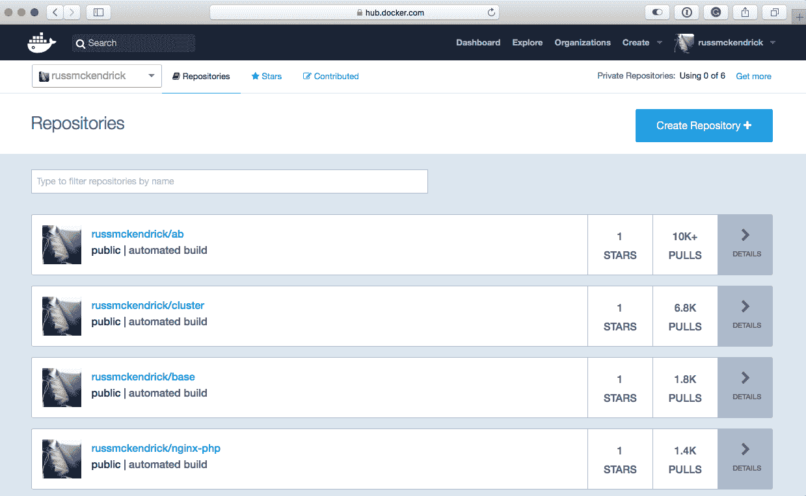
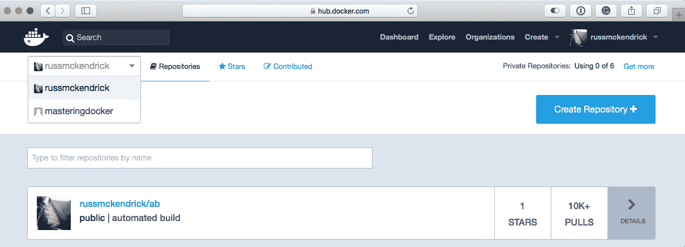
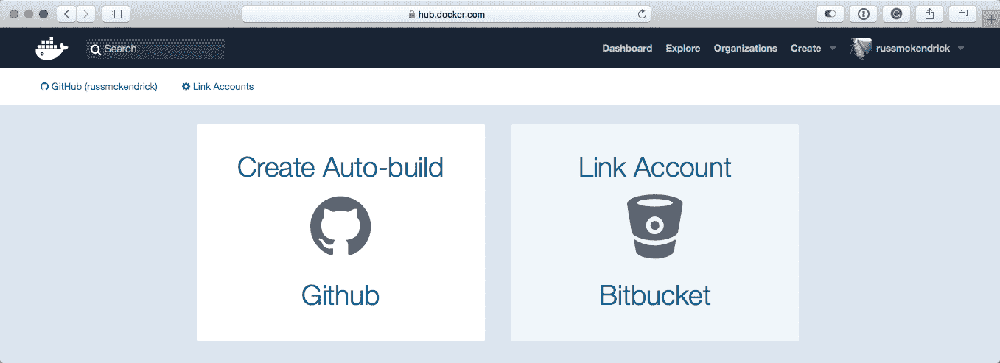
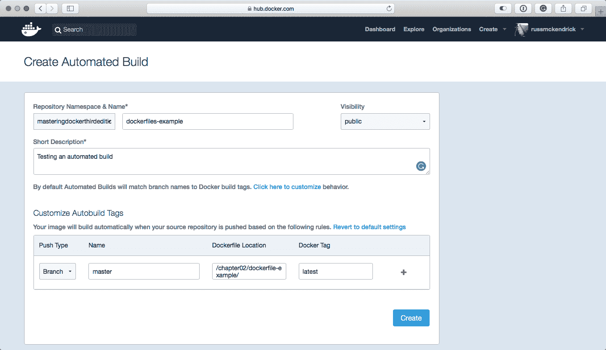
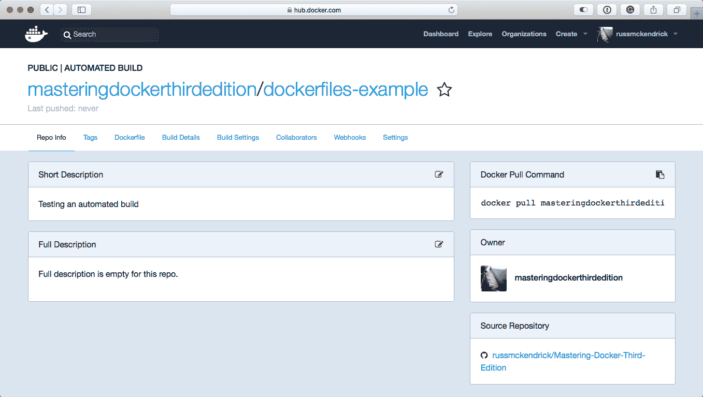
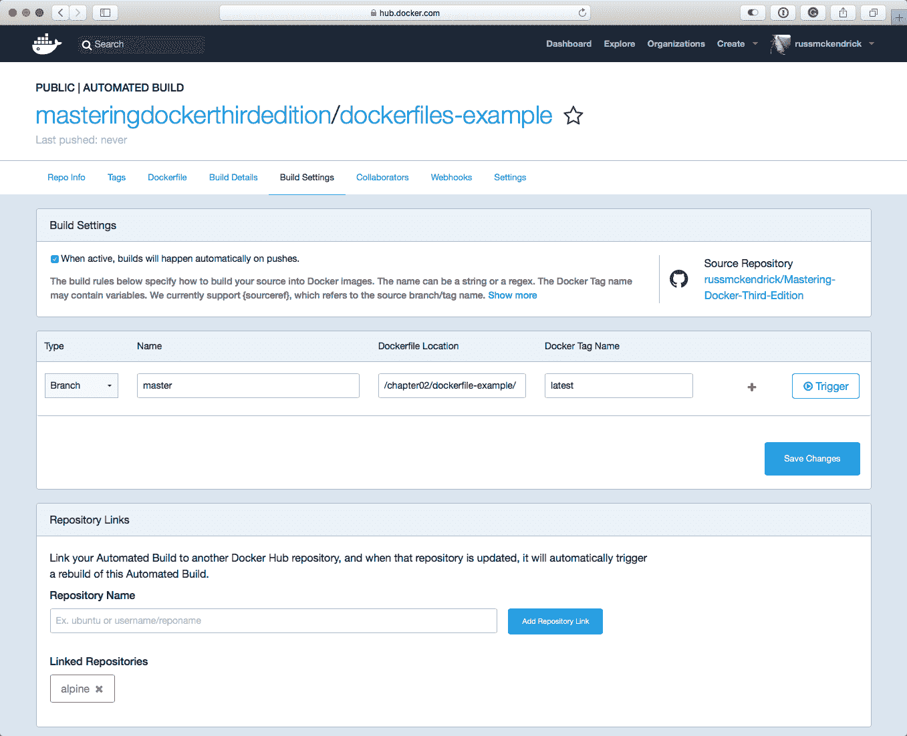
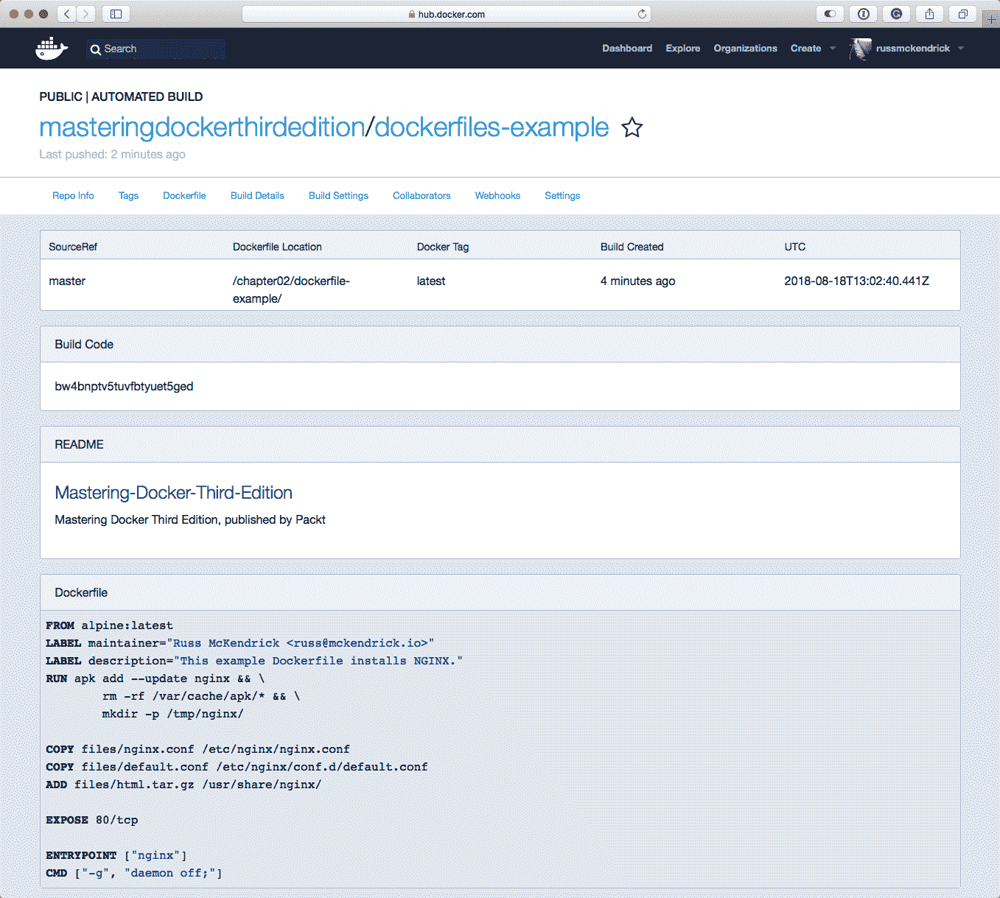
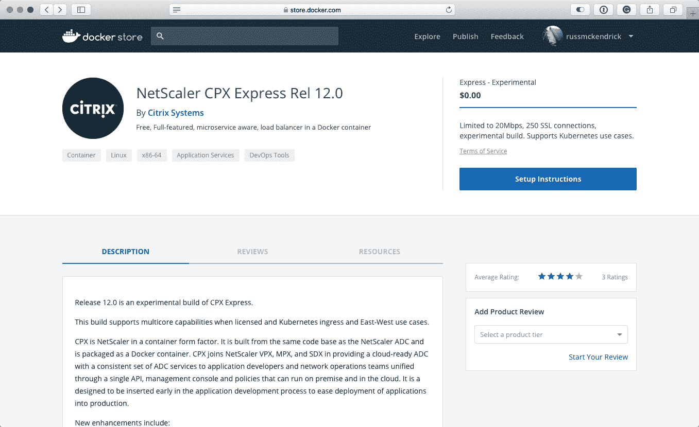
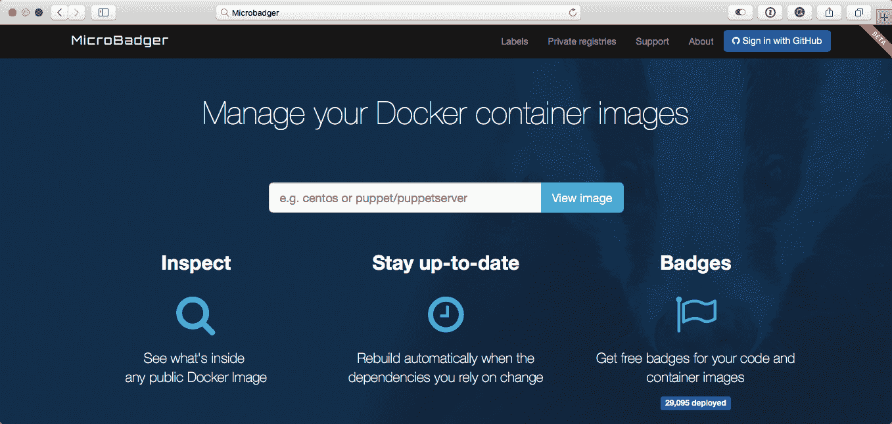

# 三、存储和分发映像

在本章中，我们将介绍几个服务，例如允许您存储映像的 Docker Hub，以及可以用来运行 Docker 容器的本地存储的 Docker Registry。我们将回顾这些服务之间的差异，以及何时和如何使用它们。

本章还将介绍如何使用 Webhooks 设置自动化构建，以及设置它们所需的所有部分。让我们快速浏览一下本章将涉及的主题:

*   Docker 集线器
*   Docker 商店
*   Docker 注册表
*   第三方注册中心
*   微博客

# 技术要求

在本章中，我们将使用我们的 Docker 安装来构建映像。和以前一样，虽然本章中的截图将来自我的首选操作系统 macOS，但我们将运行的命令将适用于前一章中介绍的所有三个操作系统。本章所用代码的完整副本可在以下网址找到:[https://github . com/PacktPublishing/Mastering-Docker-第三版/tree/master/chapter03](https://github.com/PacktPublishing/Mastering-Docker-Third-Edition/tree/master/chapter03) 。

查看以下视频，了解《行为准则》:

[http://bit.ly/2EBVJjJ](http://bit.ly/2EBVJjJ)

# Docker 集线器

虽然我们在前两章中已经介绍了 Docker Hub，但是除了使用`docker image pull`命令下载远程映像之外，我们并没有与它进行过多的交互。

在本节中，我们将重点介绍 Docker Hub，它既有一个免费的选项，您只能托管公共可访问的映像，也有一个订阅选项，允许您托管自己的私有映像。我们将重点关注 Docker Hub 的网络方面以及您可以在那里进行的管理。

主页可以在[https://hub.docker.com/](https://hub.docker.com/)找到，包含一个注册表单和右上角的登录选项。很有可能，如果你一直在涉猎 Docker，那么你已经有了一个 Docker ID。如果没有，请使用主页上的注册表单创建一个。如果您已经有了 Docker 的身份证，那么只需点击登录。

Docker Hub is free to use, and if you do not need to upload or manage your own images, you do not need an account to search for pull images.

# 仪表盘

登录 Docker Hub 后，您将进入以下登录页面。该页面被称为 Docker Hub 的**仪表盘**:



从这里，您可以访问 Docker Hub 的所有其他子页面。然而，在我们看这些部分之前，我们应该先谈谈仪表板。从这里，您可以查看您的所有映像，包括公共映像和私人映像。它们首先按星星的数量排序，然后按拉动的数量排序；这个顺序不能改变。

在接下来的部分中，我们将从页面顶部的深蓝色菜单开始，浏览您在仪表板上看到的所有内容。

# 探索

**探索**选项将带您进入官方 Docker 映像列表；就像你的**仪表盘**一样，它们是星星点点点然后拉的。从下面的屏幕中可以看到，每张官方图片都有超过 1000 万次的点击量:


这不是下载官方图片的首选 Docker Store 方法。Docker 更希望您现在使用 Docker Store，但是由于我们将在本章后面更详细地了解这一点，因此我们在此不再赘述。

# 组织

**组织**是您已经创建或添加的组织。组织允许你对一个多人合作的项目进行分层控制。组织有自己的设置，例如默认情况下是将存储库存储为公共存储库还是私有存储库，或者更改计划以允许不同数量的私有存储库，并将存储库与您或其他人拥有的存储库完全分开。


您还可以从 Docker 徽标正下方的**仪表板**访问或切换帐户或组织，登录时通常会看到您的用户名:



# 创造

我们将在后面的章节中详细介绍如何创建存储库和自动化构建，因此我不会在这里详细介绍，只是说 **Create** 菜单为您提供了三个选项:

*   **创建存储库**
*   **创建自动化构建**
*   **创建组织**

这些选项可以在下面的截图中看到:


# 配置文件和设置

顶部菜单中的最后一个选项是关于管理**我的个人资料**和**设置**:


“设置”页面允许您设置公共配置文件，包括以下选项:

*   更改您的密码
*   看你属于哪个组织
*   查看您订阅了哪些电子邮件更新
*   设置您希望接收的特定通知
*   设置哪些授权服务可以访问您的信息
*   查看链接账户(如您的 GitHub 或 Bitbucket 账户)
*   查看您的企业许可证、账单和全局设置

目前唯一的全局设置是在创建时将您的存储库默认为**公共**或**私有**之间进行选择。默认情况下，将它们创建为**公共**存储库:


“我的个人资料”菜单项会将您带到您的公共个人资料页面；我的可以在[https://hub.docker.com/u/russmckendrick/](https://hub.docker.com/u/russmckendrick/)找到。

# 其他菜单选项

在**仪表板**页面顶部的深蓝色条下面，还有两个我们尚未涉及的区域。第一个页面是**之星**页面，让你可以看到你自己主演了哪些资料库:


如果您遇到一些您更喜欢使用的存储库，并且想要访问它们以查看它们最近是否被更新，或者这些存储库是否发生了任何其他变化，这将非常有用。

第二个是新的设定，**贡献了**。点击此处将会显示一个部分，其中将会有一个你在你自己的**资料库**列表之外所做贡献的资料库列表。

# 创建自动化构建

在本节中，我们将研究自动化构建。自动构建是那些您可以链接到您的 GitHub 或 Bitbucket 帐户的构建，当您更新代码库中的代码时，您可以在 Docker Hub 上自动构建映像。我们将查看这样做所需的所有部分，到最后，您将能够自动化您的所有构建。

# 设置您的代码

创建自动化构建的第一步是设置您的 GitHub 或 Bitbucket 存储库。这是选择代码存储位置时的两个选项。对于我们的例子，我将使用 GitHub，但是 GitHub 和 Bitbucket 的设置是相同的。

事实上，我将使用这本书附带的存储库。由于存储库是公开可用的，您可以使用自己的 GitHub 帐户分叉它并跟随，正如我在下面的截图中所做的:


在[第 2 章](02.html)、*构建容器映像*中，我们处理了几个不同的 Docker 文件。我们将把这些用于我们的自动化构建。如果你还记得，我们安装了 nginx，并添加了一个简单的页面，上面有消息**你好，世界！这是由 Docker** 提供的，我们也有一个多阶段构建。

# 设置 Docker 中心

在 Docker Hub 中，我们将使用创建下拉菜单并选择创建自动构建。选择后，我们将进入一个屏幕，向您显示您链接到 GitHub 或 Bitbucket 的帐户:



从前面的截图中可以看到，我已经将我的 GitHub 帐户链接到了 Docker Hub 帐户。链接这两个工具的过程很简单，我所要做的就是按照屏幕上的说明，允许 Docker Hub 权限访问我的 GitHub 帐户。

将 Docker Hub 连接到 GitHub 时，有两个选项:

*   **公有和私有**:这是推荐选项。Docker Hub 将可以访问您的所有公共和私有存储库以及组织。Docker Hub 还能够在设置自动化构建时配置所需的网络钩子。
*   **受限访问**:这限制了 Docker Hubs 对公开可用的存储库和组织的访问。如果您使用此选项链接您的帐户，Docker Hub 将无法配置自动构建所需的 Webhooks。然后，您需要从您想要创建自动化构建的任何位置搜索并选择存储库。这将基本上创建一个 Webhook，它指示当在选定的代码存储库上完成提交时，将在 Docker Hub 上创建一个新的构建。


在前面的截图中，我选择了`Mastering-Docker-Third-Edition`并访问了自动构建的设置页面。从这里，我们可以选择映像附加到哪个 Docker Hub 配置文件，命名映像，将其从公共映像更改为私有映像，描述构建，并通过单击**进行自定义单击此处自定义**。我们可以让 Docker Hub 知道我们的 Docker 文件的位置，如下所示:



如果你跟着我，我输入了以下信息:

*   **存储库名称空间&名称:** `dockerfile-example`
*   **能见度:**公共
*   **简短描述:** `Testing an automated build`
*   **推送类型:**分支
*   **名称:**T0】
*   **Docker 配置位置:**t0]
*   **Docker 标签:**最新

点击**创建**，将进入类似下一张截图的画面:



现在我们已经定义了我们的构建，我们可以通过点击**构建设置**来添加一些额外的配置。当我们使用官方的 Alpine Linux 映像时，我们可以将它链接到我们自己的构建。为此，在**存储库链接**部分输入阿尔卑斯，然后点击**添加存储库链接**。每当新版本的官方 Alpine Linux 映像发布时，这将启动一个无人值守的构建。



因此，现在每当我们更新 GitHub 存储库，或者发布新的官方映像时，我们的映像都会自动重建并发布。由于这两种情况都不可能立即发生，所以单击触发器按钮来手动启动构建。您会注意到该按钮会短暂变绿，这表明已经在后台安排了构建。

一旦触发了你的构建，点击**构建细节**会弹出一个映像的所有构建列表，包括成功的和失败的。您应该会看到一个构建正在进行；单击它将显示构建的日志:



构建完成后，您应该能够通过运行以下命令移动到本地 Docker 安装，如果您一直在跟踪，请确保提取您自己的映像:

```
$ docker image pull masteringdockerthirdedition/dockerfiles-example
$ docker image ls
```

这些命令显示在下面的屏幕截图中:


您也可以使用以下命令运行 Docker Hub 创建的映像，再次确保使用您自己的映像(如果有):

```
$ docker container run -d -p8080:80 --name example masteringdockerthirdedition/dockerfiles-example
```

我还以完全相同的方式添加了多阶段构建。Docker Hub 对构建没有任何问题，您可以从以下日志中看到，这些日志从 Docker 构建环境的一点信息开始:

```
Building in Docker Cloud's infrastructure...
Cloning into '.'...

KernelVersion: 4.4.0-1060-aws
Components: [{u'Version': u'18.03.1-ee-1-tp5', u'Name': u'Engine', u'Details': {u'KernelVersion': u'4.4.0-1060-aws', u'Os': u'linux', u'BuildTime': u'2018-06-23T07:58:56.000000000+00:00', u'ApiVersion': u'1.37', u'MinAPIVersion': u'1.12', u'GitCommit': u'1b30665', u'Arch': u'amd64', u'Experimental': u'false', u'GoVersion': u'go1.10.2'}}]
Arch: amd64
BuildTime: 2018-06-23T07:58:56.000000000+00:00
ApiVersion: 1.37
Platform: {u'Name': u''}
Version: 18.03.1-ee-1-tp5
MinAPIVersion: 1.12
GitCommit: 1b30665
Os: linux
GoVersion: go1.10.2
```

然后，构建从编译我们的代码开始，如下所示:

```
Starting build of index.docker.io/masteringdockerthirdedition/multi-stage:latest...
Step 1/8 : FROM golang:latest as builder
 ---> d0e7a411e3da
Step 2/8 : WORKDIR /go-http-hello-world/
Removing intermediate container ea4bd2a1e92a
 ---> 0735d98776ef
Step 3/8 : RUN go get -d -v golang.org/x/net/html
 ---> Running in 5b180ef58abf
Fetching https://golang.org/x/net/html?go-get=1
Parsing meta tags from https://golang.org/x/net/html?go-get=1 (status code 200)
get "golang.org/x/net/html": found meta tag get.metaImport{Prefix:"golang.org/x/net", VCS:"git", RepoRoot:"https://go.googlesource.com/net"} at https://golang.org/x/net/html?go-get=1
get "golang.org/x/net/html": verifying non-authoritative meta tag
Fetching https://golang.org/x/net?go-get=1
Parsing meta tags from https://golang.org/x/net?go-get=1 (status code 200)
golang.org/x/net (download)
Removing intermediate container 5b180ef58abf
 ---> e2d566167ecd
Step 4/8 : ADD https://raw.githubusercontent.com/geetarista/go-http-hello-world/master/hello_world/hello_world.go ./hello_world.go
 ---> c5489fee49e0
Step 5/8 : RUN CGO_ENABLED=0 GOOS=linux go build -a -installsuffix cgo -o app .
 ---> Running in 0c5892f9db02
Removing intermediate container 0c5892f9db02
 ---> 94087063b79a
```

现在，我们的代码已经编译完毕，接下来将应用二进制文件复制到最终的映像中:

```
Step 6/8 : FROM scratch
 ---> 
Step 7/8 : COPY --from=builder /go-http-hello-world/app .
 ---> e16f25bc4201
Step 8/8 : CMD ["./app"]
 ---> Running in c93cfe262c15
Removing intermediate container c93cfe262c15
 ---> bf3498b1f51e

Successfully built bf3498b1f51e
Successfully tagged masteringdockerthirdedition/multi-stage:latest
Pushing index.docker.io/masteringdockerthirdedition/multi-stage:latest...
Done!
Build finished
```

您可以使用以下命令，使用映像来拉取和启动容器:

```
$ docker image pull masteringdockerthirdedition/multi-stage
$ docker image ls
$ docker container run -d -p 8000:80 --name go-hello-world masteringdockerthirdedition/multi-stage
$ curl http://localhost:8000/
```

从下面的截图中可以看到，该映像的行为方式与我们在本地创建它时完全相同:


如果您使用以下命令启动容器，则可以删除它们:

```
$ docker container stop example
$ docker container rm example
$ docker container stop go-hello-world
$ docker container rm go-hello-world
```

现在我们已经了解了自动化构建，我们可以讨论如何将映像推送到 Docker Hub。

# 宣传自己的形象

在[第 2 章](02.html)、*构建容器映像*中，我们讨论了在不使用 Dockerfile 的情况下创建映像。虽然这仍然不是一个好主意，应该只在您真正需要的时候使用，但是您可以将自己的映像推送到 Docker Hub。

When pushing images to Docker Hub in this way, ensure that you do not include any code, files, or environment variables you would not want to be publicly accessible.

为此，我们首先需要通过运行以下命令将本地 Docker 客户端链接到 Docker Hub:

```
$ docker login
```

然后系统会提示您输入您的 Docker 编号和密码:


此外，如果您正在使用 Docker for Mac 或 Docker for Windows，您现在将通过应用登录，并且应该能够从菜单访问 Docker Hub:


现在我们的客户被授权与 Docker Hub 交互，我们需要一个映像来构建。让我们来看看推送我们在[第 2 章](02.html)、*构建容器映像*中构建的抓图。首先，我们需要建立形象。为此，我使用以下命令:

```
$ docker build --tag masteringdockerthirdedition/scratch-example:latest .
```

如果您正在跟进，那么您应该用您自己的用户名或组织替换`masteringdockerthirdedition`:


一旦构建了映像，我们可以通过运行以下命令将其推送到 Docker Hub:

```
$ docker image push masteringdockerthirdedition/scratch-example:latest
```

以下屏幕截图显示了输出:


如您所见，因为我们在构建映像时定义了`masteringdockerthirdedition/scratch-example:latest`，Docker 自动将映像上传到该位置，这又为`Mastering Docker Third Edition`组织添加了一个新映像:


您将会注意到，在 Docker Hub 中，您对构建无能为力。这是因为该映像不是由 Docker Hub 构建的，因此，它并不真正了解构建该映像的过程。

# Docker 商店

大家可能还记得在[第 1 章](01.html)*Docker 概述*中，我们从 Docker 商店下载了 macOS 的 Docker 和 Windows 的 Docker。除了作为各种平台下载 **Docker CE** 和 **Docker EE** 的单一位置，它现在也是查找 **Docker 映像**和 **Docker 插件**的首选位置。


虽然您只能在 Docker Store 中找到官方和认证的映像，但可以选择使用 Docker Store 界面来搜索 Docker Hub。此外，您还可以下载 Docker Hub 中没有的映像，例如 Citrix NetScaler CPX 快速映像:



如果您注意到，该映像附有价格(快速版本为 0.00 美元)，这意味着您可以通过 Docker Store 购买商业软件，因为它内置了支付和许可功能。如果您是软件发行商，您可以通过 Docker Store 签署和分发您自己的软件。

当我们讨论 Docker 插件时，我们将在后面的章节中更详细地讨论 Docker 商店。

# Docker 注册表

在本节中，我们将研究 Docker 注册表。 **Docker Registry** 是一个开源应用，你可以在任何你喜欢的地方运行并存储你的 Docker 映像。我们将看看 Docker 注册表和 Docker Hub 之间的比较，以及如何在两者之间进行选择。在本节结束时，您将学习如何运行自己的 Docker 注册表，并查看它是否适合您。

# Docker 登记处概述

如前所述，Docker Registry 是一个开源应用，您可以利用它在您选择的平台上存储您的 Docker 映像。如果你愿意，这可以让你 100%保密，或者根据需要共享。

如果您想部署自己的注册表，而不必为 Docker Hub 的所有私有功能付费，Docker Registry 很有意义。接下来，让我们看看 Docker Hub 和 Docker Registry 之间的一些比较，以帮助您做出明智的决定，选择哪个平台来存储您的映像。

Docker 注册表具有以下功能:

*   托管和管理您自己的注册表，从中您可以将所有存储库作为私有、公共或两者的混合来服务
*   根据托管的映像数量或提供的请求数量，根据需要扩展注册表
*   一切都是基于命令行的

借助 Docker Hub，您将:

*   获得一个基于图形用户界面的界面，您可以使用它来管理您的映像
*   在云中设置一个可以处理公共和/或私有映像的位置
*   不必管理托管所有映像的服务器，让您高枕无忧

# 部署您自己的注册表

您可能已经猜到，Docker 注册表是作为 Docker Hub 的映像分发的，这使得部署它就像运行以下命令一样简单:

```
$ docker image pull registry:2
$ docker container run -d -p 5000:5000 --name registry registry:2
```

这些命令将为您提供最基本的 Docker 注册表安装。让我们快速了解一下如何将映像拖放到它上面。首先，我们需要一个映像，所以让我们抓住阿尔卑斯山的映像(再次):

```
$ docker image pull alpine
```

现在我们已经有了 Alpine Linux 映像的副本，我们需要将它推送到我们本地的 Docker 注册表中，该注册表可在`localhost:5000`获得。为此，我们需要用本地 Docker 注册表的 URL 标记 Alpine Linux 映像，并使用不同的映像名称:

```
$ docker image tag alpine localhost:5000/localalpine
```

现在我们已经标记了映像，我们可以通过运行以下命令将其推送到本地托管的 Docker 注册表中:

```
$ docker image push localhost:5000/localalpine
```

下面的屏幕截图显示了前面命令的输出:


尝试运行以下命令:

```
$ docker image ls
```

输出应该显示您有两幅相同的映像`IMAGE ID`:


在我们从本地 Docker 注册表中将映像拉回来之前，我们应该删除映像的两个本地副本。我们需要使用`REPOSITORY`名称来完成这个操作，而不是`IMAGE ID`，因为我们有来自两个位置的两个具有相同 ID 的映像，Docker 会抛出一个错误:

```
$ docker image rm alpine localhost:5000/localalpine
```

现在，原始映像和标记映像已被删除，我们可以通过运行以下命令从本地 Docker 注册表中提取映像:

```
$ docker image pull localhost:5000/localalpine
$ docker image ls
```

如您所见，我们现在有一个从 Docker 注册表中提取的映像副本，运行于`localhost:5000`:


您可以通过运行以下命令来停止和删除 Docker 注册表:

```
$ docker container stop registry
$ docker container rm -v registry
```

现在，在启动 Docker 注册表时，有很多选项和注意事项。可以想象，最重要的是围绕存储。

鉴于注册表的唯一目的是存储和分发映像，因此使用某种级别的持久操作系统存储非常重要。Docker 注册表目前支持以下存储选项:

*   文件系统:这正是它所说的；所有映像都存储在文件系统中您定义的路径上。默认为`/var/lib/registry`。
*   Azure:这使用微软 Azure Blob 存储。
*   GCS:这使用谷歌云存储。
*   S3:这使用亚马逊简单存储服务(亚马逊 S3)。
*   Swift:这个用的是 OpenStack Swift。

如您所见，除了文件系统之外，所有支持的存储引擎都是高可用性的分布式对象级存储。我们将在后面的章节中研究这些云服务。

# 可信注册表 Docker

商用 **Docker 企业版** ( **Docker EE** )附带的组件之一是 **Docker 可信注册中心** ( **DTR** )。可以把它看作是 Docker Hub 的一个版本，您可以在自己的基础架构中托管它。DTR 在免费 Docker 中心和 Docker 登记处提供的功能上增加了以下功能:

*   集成到您的认证服务中，如活动目录或 LDAP
*   在防火墙后自己的基础设施(或云)上部署
*   映像签名，确保您的映像可信
*   内置安全扫描
*   直接从 Docker 获得优先支持

# 第三方注册中心

提供映像注册服务的不仅仅是 Docker 像红帽这样的公司提供自己的注册中心，在那里你可以找到红帽容器目录，它托管着红帽所有产品的容器化版本，以及支持其 OpenShift 产品的容器。

JFrog 的 Artifactory 等服务提供了一个私有的 Docker 注册中心，作为其构建服务的一部分。还有其他注册即服务产品，如 CoreOS 的 Quay，现在归红帽所有，还有亚马逊网络服务和微软 Azure 的服务。当我们继续关注云中的 Docker 时，我们将了解这些服务。

# 微博客

**当你看着你的容器或映像四处运输时，微博客**是一个很好的工具。它将考虑特定 Docker 映像的每一层中正在发生的一切，并根据实际大小或占用的磁盘空间量向您输出它的权重。

当您导航到微博客网站[https://microbadger.com/](https://microbadger.com/):时，您将看到此页面



您可以搜索 Docker Hub 上的映像，让 Microbadger 向您提供关于该映像的信息，或者如果您希望提供一些样本集，或者希望查看一些更复杂的设置，您可以加载一个样本映像集。

在本例中，我们将搜索我们在本章前面推送的`masteringdockerthirdedition/dockerfiles-example`映像，并选择最新的标签。从下面的截图中可以看到，Docker Hub 会在您键入时自动搜索并实时返回结果。

默认情况下，它将始终加载最新的标签，但您也可以通过从**版本**下拉菜单中选择您想要的标签来更改您正在查看的标签。例如，如果您有一个分段标记，并且正在考虑将新映像推进到最新的标记中，但是想看看它对映像的大小有什么影响，这可能会很有用。

从下面的截图中可以看到，Microbadger 提供了映像包含多少层的信息:


通过显示每个层的大小和在映像构建过程中执行的 Dockerfile 命令，您可以看到在映像构建的哪个阶段添加了膨胀，这在缩小映像大小时非常有用。

另一个很棒的特性是，Microbadger 为您提供了在 Git 存储库或 Docker Hub 中嵌入映像基本统计数据的选项；例如，下面的屏幕显示了我自己的一个映像的 Docker Hub 页面:


如您所见，Microbadger 正在显示映像的整体大小，在本例中为 5.9MB，以及映像的总层数，即 7 层。微博客服务仍处于测试阶段，新功能一直在增加。我建议你留意一下。

# 摘要

在本章中，我们研究了几种使用 Docker Hub 手动和自动构建容器映像的方法。我们讨论了除了 Docker Hub 之外，您还可以使用的各种注册中心，例如 Docker Store 和 Red Hat 的容器目录。

我们还研究了部署我们自己的本地 Docker 注册表，并讨论了在部署存储时需要考虑的事项。最后，我们看了微博客，这是一种允许您显示远程托管的容器映像信息的服务。

在下一章中，我们将了解如何从命令行管理容器。

# 问题

1.  对或错:Docker Hub 是唯一可以下载 Docker 官方图片的来源。
2.  描述为什么要将自动构建链接到正式的 Docker Hub 映像。
3.  Docker Hub 支持多阶段构建吗？
4.  对还是错:在命令上登录 Docker 也会让你登录桌面应用？
5.  如何删除两个共享相同映像标识的映像？
6.  默认情况下，Docker 注册表在哪个端口上运行？

# 进一步阅读

有关 Docker 存储、可信注册表和注册表的更多信息，请访问:

*   Docker 商店出版商注册:[https://store.docker.com/publisher/signup/](https://store.docker.com/publisher/signup/)
*   Docker 可信注册表(DTR):[https://docs . docker . com/ee/DTR/](https://docs.docker.com/ee/dtr/)
*   Docker 注册文档:https://docs . docker . com/registry/

您可以在以下位置找到更多关于可用于 Docker 注册表的不同类型的基于云的存储的详细信息:

*   天蓝色斑点存储:[https://azure.microsoft.com/en-gb/services/storage/blobs/](https://azure.microsoft.com/en-gb/services/storage/blobs/)
*   谷歌云存储:[https://cloud.google.com/storage/](https://cloud.google.com/storage/)
*   亚马逊简单存储服务(亚马逊 S3):[https://aws.amazon.com/s3/](https://aws.amazon.com/s3/)
*   Swift:这个使用 OpenStack Swift:[https://wiki.openstack.org/wiki/Swift](https://wiki.openstack.org/wiki/Swift)

这里可以找到一些第三方注册服务:

*   红帽容器目录:[https://access.redhat.com/containers/](https://access.redhat.com/containers/)
*   open shift:[https://www.openshift.com/](https://www.openshift.com/)
*   JFrog 手工制作:[https://www.jfrog.com/artifactory/](https://www.jfrog.com/artifactory/)
*   Docker:[https://quay.io/](https://quay.io/)

最后，您可以在这里找到我的 Apache Bench 映像的 Docker Hub 和 Microbadger 的链接:

*   Apache Bench 映像(Docker 中心):[https://hub . docker . com/r/russmckendrick/ab/](https://hub.docker.com/r/russmckendrick/ab/)
*   阿帕奇长凳映像(微摄):[https://microbadger.com/img/russmckendrick/ab](https://microbadger.com/img/russmckendrick/ab)