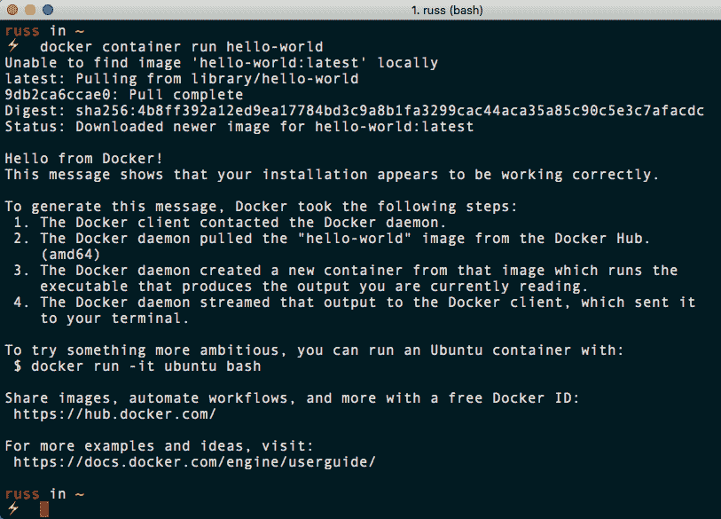
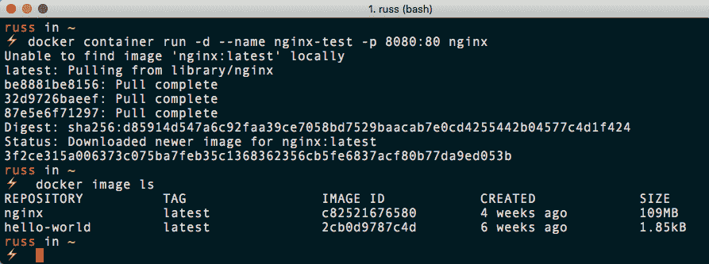
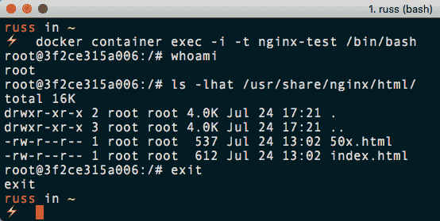
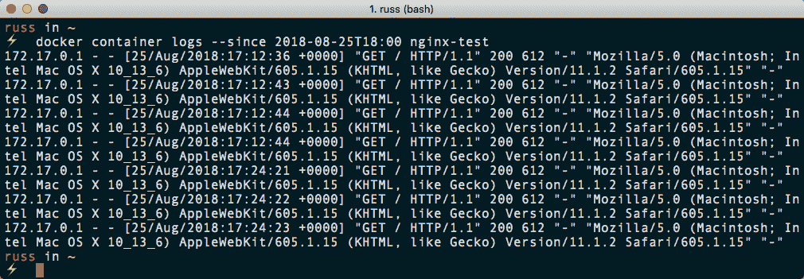
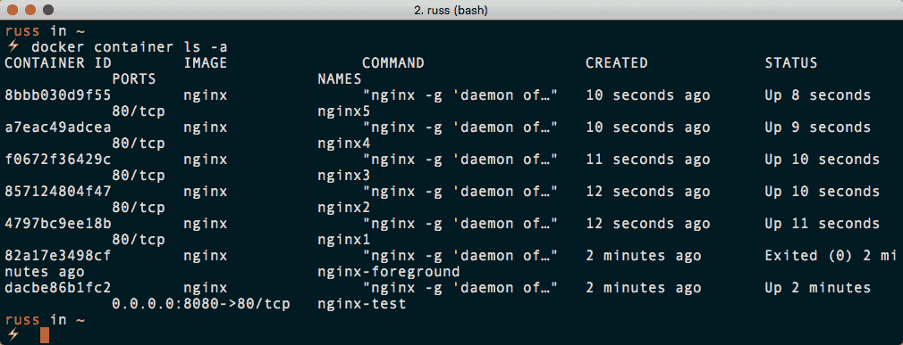
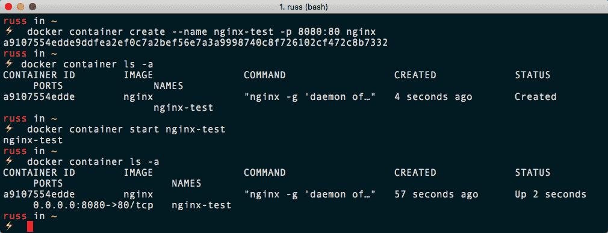
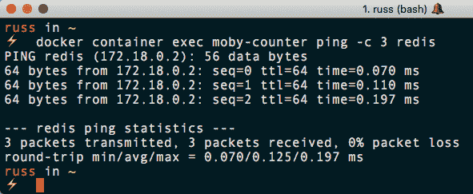
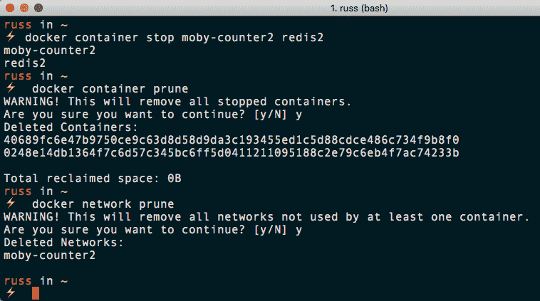

# 管理容器

到目前为止，我们一直专注于如何构建、存储和分发我们的 Docker 映像。现在，我们将了解如何启动容器，以及如何使用 Docker 命令行客户端来管理容器并与之交互。

在深入研究可用的命令之前，我们将通过深入了解更多细节来重温第一章中使用的命令。一旦我们熟悉了容器命令，我们将查看 Docker 网络和 Docker 卷。

我们将涵盖以下主题:

*   Docker 容器命令:
    *   基础知识
    *   与您的容器交互
    *   日志和流程信息
    *   资源限制
    *   容器状态和杂项命令
    *   移除容器
*   码头工人网络和卷

# 技术要求

在本章中，我们将继续使用本地 Docker 安装。和之前一样，本章中的截图将来自我的首选操作系统 macOS，但是我们将运行的 Docker 命令将在我们迄今为止安装了 Docker 的所有三个操作系统上工作；然而，一些支持命令可能只适用于 macOS 和基于 Linux 的操作系统，它们将是少之又少。

查看以下视频，了解《行为准则》:

[http://bit.ly/2yupP3n](http://bit.ly/2yupP3n)

# Docker 容器命令

在我们深入研究更复杂的 Docker 命令之前，让我们回顾一下前面几章中使用的命令，并深入了解更多细节。

# 基础知识

在[第 1 章](01.html)、*码头工人概述*中，我们使用以下命令启动了所有容器中最基本的容器`hello-world`容器:

```
$ docker container run hello-world
```

您可能还记得，该命令从 Docker 集线器中拉出一个 1.84 KB 的映像。您可以在[https://store.docker.com/img/hello-world/](https://store.docker.com/img/hello-world/)找到该映像的 Docker Store 页面，根据以下 Dockerfile，它运行一个名为`hello`的可执行文件:

```
FROM scratch
COPY hello /
CMD ["/hello"]
```

`hello`可执行文件将`Hello from Docker!`文本打印到终端，然后程序退出。从以下终端输出的完整消息文本中可以看到，`hello`二进制文件也让您确切知道刚刚发生了哪些步骤:



随着进程的退出，我们的容器也停止了；这可以通过运行以下命令看到:

```
$ docker container ls -a
```

该命令的输出如下所示:


您可能会注意到，在终端输出中，我首先运行了带有和不带有`-a`标志的`docker container ls`—这是`--all`的简写，因为在没有标志的情况下运行它不会显示任何退出的容器。

我们不必给我们的容器命名，因为它存在的时间还不够长，不足以让我们关心它叫什么。然而，Docker 会自动为容器命名，在我的例子中，你可以看到它被称为`pensive_hermann`。

在您使用 Docker 的过程中，您会注意到，如果您选择让它为您生成容器，它会为您的容器提供一些非常有趣的名称。虽然这有点跑题，但是生成名称的代码可以在`names-generator.go`中找到。就在源代码的末尾，它有如下`if`语句:

```
if name == "boring_wozniak" /* Steve Wozniak is not boring */ {
  goto begin
}
```

这意味着永远不会有一个叫做`boring_wozniak`的容器(也是非常正确的)。

Steve Wozniak is an inventor, electronics engineer, programmer, and entrepreneur who co-founded Apple Inc. with Steve Jobs. He is known as a pioneer of the personal computer revolution of the 70s and 80s, and is definitely not boring!

我们可以通过运行以下命令移除状态为`exited`的容器，确保您用自己的容器名称替换容器名称:

```
$ docker container rm pensive_hermann
```

同样，在[第 1 章](01.html)、 *Docker 概述*的结尾，我们使用官方 nginx 映像启动了一个容器，使用了以下命令:

```
$ docker container run -d --name nginx-test -p 8080:80 nginx
```

大家可能还记得，这个下载映像并运行它，将我们主机上的端口`8080`映射到容器上的端口`80`，并将其称为`nginx-test`:



如您所见，运行`docker image ls`向我们显示，我们现在已经下载并运行了两个映像。以下命令向我们展示了一个正在运行的容器:

```
$ docker container ls
```

以下终端输出显示，当我运行命令时，我的手机已经开机 5 分钟了:


从我们的`docker container run`命令中可以看到，我们引入了三个标志。其中之一是`-d`，这是`--detach`的简写。如果我们没有添加这个标志，那么我们的容器将在前台执行，这意味着我们的终端将被冻结，直到我们通过按下 *Ctrl* + *C* 向进程传递一个转义命令。

我们可以通过运行以下命令来启动第二个`nginx`容器，并在我们已经启动的容器旁边运行，从而看到这一点:

```
$ docker container run --name nginx-foreground -p 9090:80 nginx
```

一旦启动，打开浏览器，进入`http://localhost:9090/`。当您加载页面时，您会注意到您的页面访问被打印到屏幕上；在浏览器中点击刷新会显示更多点击，直到你在终端中按下 *Ctrl* + *C* 。


运行`docker container ls -a`显示您有两个容器，其中一个已经退出:


发生了什么？当我们移除分离标志时，Docker 将我们直接连接到容器内的 nginx 进程，这意味着我们可以看到该进程的`stdin`、`stdout`和`stderr`。当我们使用 *Ctrl* + *C* 时，我们实际上向 nginx 进程发送了一条指令来终止它。因为这是保持我们的容器运行的进程，一旦不再有运行的进程，容器就立即退出。

Standard input (`stdin`) is the handle that our process reads to get information from the end user. Standard output (`stdout`) is where the process writes normal information to. Standard error (`stderr`) is where the process writes error messages to.

当我们启动`nginx-foreground`容器时，您可能已经注意到的另一件事是，我们使用`--name`标志给了它一个不同的名称。

这是因为不能有两个同名的容器，因为 Docker 为您提供了使用`CONTAINER ID`或`NAME`值与容器交互的选项。这就是名字生成器功能存在的原因:给你不想给自己命名的容器分配一个随机的名字——也是为了确保我们永远不会称史蒂夫·沃兹尼亚克为无聊。

最后要提到的是，当我们启动`nginx-foreground`时，我们要求 Docker 将港口`9090`映射到集装箱上的港口`80`。这是因为我们不能将多个进程分配给主机上的一个端口，所以如果我们尝试启动与第一个端口相同的第二个容器，我们会收到一条错误消息:

```
docker: Error response from daemon: driver failed programming external connectivity on endpoint nginx-foreground (3f5b355607f24e03f09a60ee688645f223bafe4492f807459e4a2b83571f23f4): Bind for 0.0.0.0:8080 failed: port is already allocated.
```

此外，由于我们在前台运行容器，您可能会从 nginx 进程收到一个错误，因为它无法启动:

```
ERRO[0003] error getting events from daemon: net/http: request cancelled
```

但是，您可能还注意到，我们正在映射到容器上的端口 80—为什么那里没有错误？

嗯，正如[第 1 章](01.html)*Docker 概述*所解释的，集装箱本身就是孤立的资源，也就是说我们可以用港口 80 重映射推出任意多的集装箱，它们永远不会和其他集装箱发生冲突；只有当我们想从 Docker 主机路由到暴露的容器端口时，才会遇到问题。

让我们的 nginx 容器在下一节继续运行。

# 与您的容器交互

到目前为止，我们的容器只运行一个进程。Docker 为您提供了一些工具，使您能够分叉其他进程并与之交互。

# 附上

与运行容器交互的第一种方式是`attach`到运行过程。我们仍在运行我们的`nginx-test`容器，因此让我们通过运行以下命令来连接到它:

```
$ docker container attach nginx-test
```

打开浏览器，转到`http://localhost:8080/`会将 nginx 访问日志打印到屏幕上，就像我们启动`nginx-foreground`容器时一样。按下 *Ctrl* + *C* 将终止该过程，并使您的终端恢复正常；但是，和以前一样，我们会终止保持容器运行的进程:


我们可以通过运行以下命令来启动容器备份:

```
$ docker container start nginx-test
```

这将在分离状态下启动容器，这意味着它将再次在后台运行，因为这是容器最初启动的状态。前往`http://localhost:8080/`会再次显示 nginx 欢迎页面。

让我们重新连接到我们的流程，但这次有了一个额外的选项:

```
$ docker container attach --sig-proxy=false nginx-test 
```

点击几次容器的网址，然后按下 *Ctrl* + *C* 会将我们从 nginx 进程中分离出来，但这一次，它不会终止 nginx 进程，而是将我们返回到我们的终端，使容器处于分离状态，这可以通过运行`docker container ls`看到:


# 高级管理人员

如果您需要连接到您的容器正在运行的进程，那么`attach`命令是有用的，但是如果您需要一些更具交互性的东西呢？

可以使用`exec`命令；这在容器中产生了第二个进程，您可以与之交互。例如，要查看`/etc/debian_version`文件的内容，我们可以运行以下命令:

```
$ docker container exec nginx-test cat /etc/debian_version
```

这将产生第二个过程，在这种情况下是 cat 命令，它将`/etc/debian_version`的内容打印到`stdout`。然后，第二个进程将终止，让我们的容器保持在执行 exec 命令之前的状态:


通过运行以下命令，我们可以更进一步:

```
$ docker container exec -i -t nginx-test /bin/bash
```

这一次，我们分叉了一个 bash 进程，并使用`-i`和`-t`标志来保持对容器的开放控制台访问。`-i`标志是`--interactive`的简写，它指示 Docker 保持`stdin`打开，以便我们可以向进程发送命令。`-t`标志是`--tty`的缩写，为会话分配一个伪 TTY。

Early user terminals connected to computers were called teletypewriters. While these devices are no longer used today, the acronym TTY has continued to be used to described text-only consoles in modern computing.

这意味着您将能够像远程终端会话一样与容器交互，如 SSH:



虽然这非常有用，因为您可以像虚拟机一样与容器交互，但我不建议对容器进行任何更改，因为它们正在使用伪 TTY 运行。这些更改很可能不会持续，并且在移除容器时会丢失。我们将在[第 12 章](13.html)、*码头工人工作流程*中更详细地探讨这背后的思想。

# 日志和流程信息

到目前为止，我们已经附加到容器中的流程，或者容器本身，以查看信息。Docker 提供了一些命令，允许您查看关于容器的信息，而不必使用`attach`或`exec`命令。

# 日志

`logs`命令非常不言自明；它允许您与容器的`stdout`流进行交互，Docker 正在后台跟踪该流。例如，要查看我们的`nginx-test`容器最后写入`stdout`的条目，您只需要使用以下命令:

```
$ docker container logs --tail 5 nginx-test
```

该命令的输出如下所示:


要实时查看日志，我只需运行以下命令:

```
$ docker container logs -f nginx-test
```

`-f`标志是`--follow`的简写。比方说，我还可以通过运行以下命令来查看自某个时间以来记录的所有内容:

```
$ docker container logs --since 2018-08-25T18:00 nginx-test
```

该命令的输出如下所示:



您可能会注意到，在前面的输出中，访问日志中的时间戳是 17:12，在 18:00 之前。为什么会这样？

`logs`命令显示的是 Docker 记录的`stdout`的时间戳，而不是容器内的时间。当我运行以下命令时，您可以看到这一点:

```
$ date
$ docker container exec nginx-test date 
```

输出如下所示:


由于**英国夏令时** ( **BST** )在我的主机上生效，我的主机和集装箱之间有一个小时的时差。

幸运的是，为了避免混淆——或者根据你对它的看法增加混淆——你可以将`-t`添加到你的`logs`命令中:

```
$ docker container logs --since 2018-08-25T18:00 -t nginx-test
```

`-t`标志是`--timestamp`的简称；此选项预先设置 Docker 捕获输出的时间:


# 顶端

`top`命令相当简单；它列出了在您指定的容器中运行的进程，使用如下:

```
$ docker container top nginx-test
```

该命令的输出如下所示:


从下面的终端输出可以看出，我们有两个进程正在运行，这两个进程都是 nginx，这是意料之中的。

# 统计数据

`stats`命令提供指定容器的实时信息，或者，如果您没有通过`NAME`或`ID`容器，则提供所有运行容器的实时信息:

```
$ docker container stats nginx-test
```

从下面的终端输出可以看出，我们得到了指定集装箱的`CPU`、`RAM`、`NETWORK`、`DISK IO`和`PIDS`的信息:


我们也可以通过`-a`旗；这是`--all`的缩写，显示所有容器，运行与否。例如，尝试运行以下命令:

```
$ docker container stats -a
```

您应该会收到如下输出:


但是，从前面的输出中可以看到，如果容器没有运行，就没有任何资源被利用，所以除了为您提供有多少容器在运行以及资源在哪里被使用的可视化表示之外，它并没有真正增加任何价值。

还值得指出的是，`stats`命令显示的信息仅为实时；Docker 不会像`logs`命令那样记录资源利用率并使其可用。在后面的章节中，我们将着眼于更长期的存储资源利用率。

# 资源限制

我们运行的最后一个命令向我们展示了容器的资源利用率；默认情况下，启动时，如果需要，容器将被允许消耗主机上的所有可用资源。我们可以限制容器所能消耗的资源；让我们从更新`nginx-test`容器的资源配额开始。

通常，我们会在使用`run`命令启动容器时设置限制；例如，为了将 CPU 优先级减半并设置`128M`的内存限制，我们会使用以下命令:

```
$ docker container run -d --name nginx-test --cpu-shares 512 --memory 128M -p 8080:80 nginx
```

然而，我们并没有以任何资源限制来启动我们的`nginx-test`容器，这意味着我们需要更新我们已经运行的容器；为此，我们可以使用`update`命令。现在，您可能认为这应该只需要运行以下命令:

```
$ docker container update --cpu-shares 512 --memory 128M nginx-test
```

但实际上，运行前面的命令会产生一个错误:

```
Error response from daemon: Cannot update container 3f2ce315a006373c075ba7feb35c1368362356cb5fe6837acf80b77da9ed053b: Memory limit should be smaller than already set memoryswap limit, update the memoryswap at the same time
```

那么`memoryswap`目前设定的上限是多少呢？为了找出这个问题，我们可以使用`inspect`命令来显示我们运行的容器的所有配置数据；只需运行以下命令:

```
$ docker container inspect nginx-test
```

通过运行前面的命令可以看到，有很多配置数据。当我运行该命令时，返回了一个 199 行的 JSON 数组。让我们使用`grep`命令过滤掉包含单词`memory`的行:

```
$ docker container inspect nginx-test | grep -i memory
```

这将返回以下配置数据:

```
 "Memory": 0,
 "KernelMemory": 0, "MemoryReservation": 0,
 "MemorySwap": 0,
 "MemorySwappiness": null,
```

一切都设置为`0`，那么`128M`怎么可能比`0`小呢？

在资源配置的上下文中，`0`实际上是默认值，意味着没有限制——请注意每个数值后缺少`M`。这意味着我们的更新命令实际上应该如下所示:

```
$ docker container update --cpu-shares 512 --memory 128M --memory-swap 256M nginx-test
```

Paging is a memory management scheme in which the kernel stores and retrieves, or swaps, data from secondary storage for use in the main memory. This allows processes to exceed the size of physical memory available.

默认情况下，当您将`--memory`设置为运行命令的一部分时，Docker 会将`-- memory-swap`的大小设置为`--memory`的两倍。如果您现在运行`docker container stats nginx-test`，您应该会看到我们的限制已经到位:


此外，重新运行`docker container inspect nginx-test | grep -i memory`将显示如下变化:

```
 "Memory": 134217728,
 "KernelMemory": 0,
 "MemoryReservation": 0,
 "MemorySwap": 268435456,
 "MemorySwappiness": null,
```

The values when running `docker container inspect` are all shown in bytes rather megabytes (MB).

# 容器状态和杂项命令

在本节的最后一部分，我们将查看容器可能处于的各种状态，以及作为`docker container`命令的一部分，我们尚未覆盖的少数剩余命令。

运行`docker container ls -a`应显示类似于以下终端输出的内容:


如你所见，我们有两个容器；一个状态为`Up`，另一个状态为`Exited`。在我们继续之前，让我们再推出五个容器。要快速执行此操作，请运行以下命令:

```
$ for i in {1..5}; do docker container run -d --name nginx$(printf "$i") nginx; done
```

当运行`docker container ls -a`时，你应该看到你的五个新容器，命名为`nginx1`到`nginx5`:



# 暂停和取消暂停

我们来看看暂停`nginx1`。为此，只需运行以下命令:

```
$ docker container pause nginx1
```

运行`docker container ls`会显示容器状态为`Up`，但同时显示`Paused`:


请注意，我们不必使用`-a`标志来查看关于容器的信息，因为该过程尚未终止；取而代之的是，它已经被暂停使用`cgroups`冷冻机。有了`cgroups`冰柜，这个过程并不知道它已经暂停，这意味着它可以恢复。

您可能已经猜到，您可以使用`unpause`命令恢复暂停的容器，如下所示:

```
$ docker container unpause nginx1
```

如果需要冻结容器的状态，此命令非常有用；例如，可能您的一个容器出了故障，您需要稍后进行一些调查，但不希望它对其他正在运行的容器产生负面影响。

# 停止、启动、重启和终止

接下来，我们有`stop`、`start`、`restart`和`kill`命令。我们已经使用了`start`命令来恢复状态为`Exited`的容器。`stop`命令的工作方式与我们使用 *Ctrl* + *C* 从前台运行的容器中分离时完全相同。运行以下命令:

```
$ docker container stop nginx2
```

有了这个，一个请求被发送到进程，让它终止，称为`SIGTERM`。如果进程在宽限期内没有自行终止，则发送一个终止信号，称为`SIGKILL`。这将立即终止进程，不给它任何时间来完成任何导致延迟的事情；例如，将数据库查询的结果提交到磁盘。

因为这可能是不好的，Docker 通过使用`-t`标志为您提供了覆盖默认宽限期的选项，即`10`秒；这是`--time`的简称。例如，运行以下命令将在发送`SIGKILL`之前等待`60`秒，以防需要发送该命令来终止进程:

```
$ docker container stop -t 60 nginx3
```

`start`命令，正如我们已经看到的，将启动进程备份；然而，与`pause`和`unpause`命令不同，在这种情况下，该过程使用最初启动它的标志从头开始，而不是从它停止的地方开始:

```
$ docker container start nginx2 nginx3
```

`restart`命令是以下两个命令的组合；它停下来，然后启动你经过的`ID`或`NAME`集装箱。还有，和`stop`一样，你可以通过`-t`旗:

```
$ docker container restart -t 60 nginx4
```

最后，您还可以选择通过运行`kill`命令立即向容器发送`SIGKILL`命令:

```
$ docker container kill nginx5 
```

# 移除容器

让我们使用`docker container ls -a`命令检查正在运行的容器。当我运行该命令时，我可以看到我有两个状态为`Exited`的容器，其他所有容器都在运行:


要移除两个退出的容器，我可以简单地运行`prune`命令:

```
$ docker container prune
```

这样做时，会弹出一个警告，要求您确认是否真的确定，如下图所示:


您可以使用`rm`命令选择要移除的容器，这里显示了一个示例:

```
$ docker container rm nginx4
```

另一种选择是将`stop`和`rm`命令串在一起:

```
$ docker container stop nginx3 && docker container rm nginx3
```

然而，考虑到您现在可以使用`prune`命令，这可能太费力了，尤其是当您试图移除容器时，并且可能不太关心进程终止的优雅程度。

请随意使用您喜欢的任何方法移除容器的剩余部分。

# 杂项命令

在本节的最后一部分，我们将看几个在日常使用 Docker 时可能不会用到太多的命令。第一个是`create`。

`create`命令与`run`命令非常相似，只是它不启动容器，而是准备和配置一个:

```
$ docker container create --name nginx-test -p 8080:80 nginx
```

您可以通过运行`docker container ls -a`，然后用`docker container start nginx-test`启动容器来检查您创建的容器的状态，然后再次检查状态:



接下来我们要快速看的命令是`port`命令；这将显示端口以及容器的任何端口映射:

```
$ docker container port nginx-test
```

它应该返回以下内容:

```
80/tcp -> 0.0.0.0:8080
```

我们已经知道这一点，因为它是我们配置的。此外，端口列在`docker container ls`输出中。

我们要快速看的最后一个命令是`diff`命令。此命令打印一个列表，列出自容器启动以来添加的(`A`)或更改的(`C`)所有文件，因此基本上，列出了我们用来启动容器的原始映像和现在存在的文件之间在文件系统上的差异。

在运行该命令之前，让我们使用`exec`命令在`nginx-test`容器内创建一个空白文件:

```
$ docker container exec nginx-test touch /tmp/testing
```

现在我们在`/tmp`中有了一个名为`testing`的文件，我们可以使用以下内容查看原始映像和运行容器之间的差异:

```
$ docker container diff nginx-test
```

这将返回文件列表；从下面的列表中可以看到，我们的测试文件以及 nginx 启动时创建的文件都在那里:

```
C /run
A /run/nginx.pid
C /tmp
A /tmp/testing
C /var/cache/nginx
A /var/cache/nginx/client_temp A /var/cache/nginx/fastcgi_temp A /var/cache/nginx/proxy_temp
A /var/cache/nginx/scgi_temp
A /var/cache/nginx/uwsgi_temp
```

值得指出的是，一旦我们停止并移除容器，这些文件将会丢失。在本章的下一节中，我们将查看 Docker 卷，并了解如何保存数据。

同样，如果您要继续，您应该使用您选择的命令删除在本节中启动的任何运行容器。

# 码头工人网络和卷

在结束本章之前，我们将了解 Docker 网络和使用默认驱动程序的 Docker 卷的基础知识。让我们先来看看网络。

# 码头工人网络

到目前为止，我们一直在单一的平面共享网络上推出我们的容器。虽然我们还没有谈到它，这意味着我们已经推出的容器将能够相互通信，而不必使用任何主机
网络。

我们现在不详细讨论，而是通过一个例子来说明。我们将运行一个双容器应用；第一个容器将运行 Redis，第二个是我们的应用，它使用 Redis 容器来存储系统状态。

**Redis** is an in-memory data structure store that can be used as a database, cache, or message broker. It supports different levels of on-disk persistence.

在启动应用之前，让我们下载将要使用的容器映像，并创建网络:

```
$ docker image pull redis:alpine
$ docker image pull russmckendrick/moby-counter
$ docker network create moby-counter
```

您应该会看到类似以下终端输出的内容:


现在我们已经提取了映像并创建了网络，我们可以启动我们的容器，从 Redis 容器开始:

```
$ docker container run -d --name redis --network moby-counter redis:alpine
```

如您所见，我们使用`--network`标志来定义我们的容器在其中启动的网络。现在，Redis 容器已经启动，我们可以通过运行以下命令来启动应用容器:

```
$ docker container run -d --name moby-counter --network moby-counter -p 8080:80 russmckendrick/moby-counter
```

再次，我们将容器放入`moby-counter`网络；这次，我们将集装箱上的港口`8080`映射到港口`80`。请注意，我们不需要担心暴露 Redis 容器的任何端口。这是因为 Redis 映像附带了一些暴露默认端口的默认值，对我们来说就是`6379`。这可以通过运行`docker container ls`看出:


现在剩下的就是访问应用；为此，打开浏览器，进入`http://localhost:8080/`。迎接你的应该是一个几乎空白的页面，信息是**点击添加标识**:


单击页面上的任何位置都会添加 Docker 徽标，因此请单击离开:


到底发生了什么？从 moby-counter 容器提供服务的应用正在连接到`redis`容器，并使用该服务来存储您通过单击放置在屏幕上的每个徽标的屏幕坐标。

moby-counter 应用如何连接到`redis`容器？在`server.js`文件中，设置了以下默认值:

```
var port = opts.redis_port || process.env.USE_REDIS_PORT || 6379
var host = opts.redis_host || process.env.USE_REDIS_HOST || 'redis'
```

这意味着`moby-counter`应用正在寻找连接到端口`6379`上名为`redis`的主机。让我们尝试使用 exec 命令从`moby-counter`应用 ping`redis`容器，看看我们得到了什么:

```
$ docker container exec moby-counter ping -c 3 redis
```

您应该会看到类似于以下输出的内容:



可以看到，`moby-counter`容器将`redis`解析为`redis`容器的 IP 地址，也就是`172.18.0.2`。您可能认为应用的宿主文件包含一个`redis`容器的条目；让我们使用以下命令来看一看:

```
$ docker container exec moby-counter cat /etc/hosts
```

这将返回`/etc/hosts`的内容，在我的例子中，它看起来如下:

```
127.0.0.1 localhost
::1 localhost ip6-localhost ip6-loopback
fe00::0 ip6-localnet
ff00::0 ip6-mcastprefix
ff02::1 ip6-allnodes
ff02::2 ip6-allrouters
172.18.0.3 4e7931312ed2
```

除了末尾的条目，实际上是解析到本地容器主机名的 IP 地址，`4e7931312ed2`是容器的 ID；`redis`没有进入的迹象。接下来，让我们通过运行以下命令来检查`/etc/resolv.conf`:

```
$ docker container exec moby-counter cat /etc/resolv.conf
```

这返回了我们正在寻找的东西；如您所见，我们使用的是本地`nameserver`:

```
nameserver 127.0.0.11
options ndots:0
```

让我们使用以下命令对`redis`和`127.0.0.11`执行域名系统查找:

```
$ docker container exec moby-counter nslookup redis 127.0.0.11
```

这会返回`redis`容器的 IP 地址:

```
Server: 127.0.0.11
Address 1: 127.0.0.11

Name: redis
Address 1: 172.18.0.2 redis.moby-counter
```

让我们创建第二个网络并启动另一个应用容器:

```
$ docker network create moby-counter2
$ docker run -itd --name moby-counter2 --network moby-counter2 -p 9090:80 russmckendrick/moby-counter
```

现在我们已经启动并运行了第二个应用容器，让我们尝试从中 ping 通`redis`容器:

```
$ docker container exec moby-counter2 ping -c 3 redis
```

在我的例子中，我得到以下错误:


让我们检查一下`resolv.conf`文件，看看是否已经在使用同一个名称服务器，如下所示:

```
$ docker container exec moby-counter2 cat /etc/resolv.conf
```

从以下输出可以看出，名称服务器确实已经在使用中:

```
nameserver 127.0.0.11
options ndots:0
```

由于我们已经在一个不同的网络中启动了`moby-counter2`容器，而名为`redis`的容器正在运行，因此我们无法解析该容器的主机名，因此它返回了一个错误的地址错误:

```
$ docker container exec moby-counter2 nslookup redis 127.0.0.11
Server: 127.0.0.11
Address 1: 127.0.0.11

nslookup: can't resolve 'redis': Name does not resolve
```

让我们看看在我们的第二个网络中启动第二个 Redis 服务器；正如我们已经讨论过的，我们不能有两个同名的容器，所以让我们创造性地将其命名为`redis2`。

由于我们的应用被配置为连接到解析为`redis`的容器，这是否意味着我们将不得不对我们的应用容器进行更改？不，但是道克已经帮你搞定了。

虽然您不能有两个同名的容器，但正如我们已经发现的，我们的第二个网络与我们的第一个网络完全隔离运行，这意味着我们仍然可以使用`redis`的域名。为此，我们需要添加`-- network-alias`标志，如下所示:

```
$ docker container run -d --name redis2 --network moby-counter2 --network-alias redis redis:alpine
```

如您所见，我们已经将容器命名为`redis2`，但将`--network-alias`设置为`redis`；这意味着，当我们执行查找时，我们看到返回了正确的 IP 地址:

```
$ docker container exec moby-counter2 nslookup redis 127.0.0.1
Server: 127.0.0.1
Address 1: 127.0.0.1 localhost

Name: redis
Address 1: 172.19.0.3 redis2.moby-counter2
```

可以看到，`redis`其实是`redis2.moby-counter2`的别名，然后解析为`172.19.0.3`。

现在，我们应该让两个应用在本地 Docker 主机上各自的隔离网络中并排运行，可在`http://localhost:8080/`和`http://localhost:9090/`访问。运行`docker network ls`将显示 Docker 主机上配置的所有网络，包括默认网络:


通过运行以下`inspect`命令，您可以了解有关网络配置的更多信息:

```
$ docker network inspect moby-counter
```

运行前面的命令会返回以下 JSON 数组:

```
[
 {
 "Name": "moby-counter",
 "Id": "c8b38a10efbefd701c83203489459d9d5a1c78a79fa055c1c81c18dea3f1883c",
 "Created": "2018-08-26T11:51:09.7958001Z",
 "Scope": "local",
 "Driver": "bridge",
 "EnableIPv6": false,
 "IPAM": {
 "Driver": "default",
 "Options": {},
 "Config": [
 {
 "Subnet": "172.18.0.0/16",
 "Gateway": "172.18.0.1"
 }
 ]
 },
 "Internal": false,
 "Attachable": false,
 "Ingress": false,
 "ConfigFrom": {
 "Network": ""
 },
 "ConfigOnly": false,
 "Containers": {
 "4e7931312ed299ed9132f3553e0518db79b4c36c43d36e88306aed7f6f9749d8": {
 "Name": "moby-counter",
 "EndpointID": "dc83770ae0939c98416ee69d939b30a1da391b11d14012c8188be287baa9c325",
 "MacAddress": "02:42:ac:12:00:03",
 "IPv4Address": "172.18.0.3/16",
 "IPv6Address": ""
 },
 "d760bc59c3ac5f9ba8b7aa8e9f61fd21ce0b8982f3a85db888a5bcf103bedf6e": {
 "Name": "redis",
 "EndpointID": "5af2bfd1ce486e38a9c5cddf9e16878fdb91389cc122cfef62d5e575a91b89b9",
 "MacAddress": "02:42:ac:12:00:02",
 "IPv4Address": "172.18.0.2/16",
 "IPv6Address": ""
 }
 },
 "Options": {},
 "Labels": {}
 }
]
```

如您所见，它包含 IPAM 部分中使用的网络寻址信息，以及网络中运行的两个容器的详细信息。

**IP address management (IPAM)** is a means of planning, tracking, and managing IP addresses within the network. IPAM has both DNS and DHCP services, so each service is notified of changes in the other. For example, DHCP assigns an address to `container2`. The DNS service is then updated to return the IP address assigned by DHCP whenever a lookup is made against `container2`.

在进入下一部分之前，我们应该删除一个应用和相关网络。为此，请运行以下命令:

```
$ docker container stop moby-counter2 redis2
$ docker container prune
$ docker network prune
```

这将删除容器和网络，如下图所示:



如本节开头所述，这只是默认的网络驱动程序，这意味着我们的网络仅限于单个 Docker 主机上可用。在后面的章节中，我们将研究如何在多个主机甚至提供商之间扩展我们的 Docker 网络。

# 码头工人卷

如果您一直在关注上一节中的网络示例，您应该运行两个容器，如下图所示:


当你在浏览器中进入应用时(在`http://localhost:8080/`)，你可能会看到屏幕上已经有了 Docker 徽标。让我们停下来，然后移除 Redis 容器，看看会发生什么。为此，请运行以下命令:

```
$ docker container stop redis
$ docker container rm redis
```

如果您打开浏览器，您可能会注意到 Docker 图标已经淡出背景，屏幕中央有一个动画加载器。这基本上是为了表明应用正在等待重新建立到 Redis 容器的连接:


使用以下命令重新启动 Redis 容器:

```
$ docker container run -d --name redis --network moby-counter redis:alpine
```

这将恢复连接；但是，当您开始与应用交互时，您以前的图标会消失，留给您的将是一片空白。快速在屏幕上添加更多的徽标，这次以不同的模式放置，就像我在这里所做的那样:


一旦有了模式，让我们通过运行以下命令再次删除 Redis 容器:

```
$ docker container stop redis
$ docker container rm redis
```

正如我们在本章前面所讨论的，丢失容器中的数据是意料之中的。然而，当我们使用官方的 Redis 映像时，我们实际上并没有丢失任何数据。

我们使用的官方 Redis 映像的 Dockerfile 如下所示:

```
FROM alpine:3.8

RUN addgroup -S redis && adduser -S -G redis redis
RUN apk add --no-cache 'su-exec>=0.2'

ENV REDIS_VERSION 4.0.11
ENV REDIS_DOWNLOAD_URL http://download.redis.io/releases/redis-4.0.11.tar.gz
ENV REDIS_DOWNLOAD_SHA fc53e73ae7586bcdacb4b63875d1ff04f68c5474c1ddeda78f00e5ae2eed1bbb

RUN set -ex; \
 \
 apk add --no-cache --virtual .build-deps \
 coreutils \
 gcc \
 jemalloc-dev \
 linux-headers \
 make \
 musl-dev \
 ; \
 \
 wget -O redis.tar.gz "$REDIS_DOWNLOAD_URL"; \
 echo "$REDIS_DOWNLOAD_SHA *redis.tar.gz" | sha256sum -c -; \
 mkdir -p /usr/src/redis; \
 tar -xzf redis.tar.gz -C /usr/src/redis --strip-components=1; \
 rm redis.tar.gz; \
 \
 grep -q '^#define CONFIG_DEFAULT_PROTECTED_MODE 1$' /usr/src/redis/src/server.h; \
 sed -ri 's!^(#define CONFIG_DEFAULT_PROTECTED_MODE) 1$!\1 0!' /usr/src/redis/src/server.h; \
 grep -q '^#define CONFIG_DEFAULT_PROTECTED_MODE 0$' /usr/src/redis/src/server.h; \
 \
 make -C /usr/src/redis -j "$(nproc)"; \
 make -C /usr/src/redis install; \
 \
 rm -r /usr/src/redis; \
 \
 runDeps="$( \
 scanelf --needed --nobanner --format '%n#p' --recursive /usr/local \
 | tr ',' '\n' \
 | sort -u \
 | awk 'system("[ -e /usr/local/lib/" $1 " ]") == 0 { next } { print "so:" $1 }' \
 )"; \
 apk add --virtual .redis-rundeps $runDeps; \
 apk del .build-deps; \
 \
 redis-server --version

RUN mkdir /data && chown redis:redis /data
VOLUME /data
WORKDIR /data

COPY docker-entrypoint.sh /usr/local/bin/
ENTRYPOINT ["docker-entrypoint.sh"]

EXPOSE 6379
CMD ["redis-server"]
```

如果您注意到，在文件的末尾，有声明的`VOLUME`和`WORKDIR`指令；这意味着当我们的容器启动时，Docker 实际上创建了一个卷，然后从该卷中运行`redis-server`。

我们可以通过运行以下命令看到这一点:

```
$ docker volume ls
```

这应该至少显示两个卷，如下图所示:


可以看到，卷名一点都不太友好；事实上，它是卷的唯一 ID。那么，当我们启动我们的 Redis 容器时，如何使用这个卷呢？

我们从 Dockerfile 中知道该卷是在容器内的`/data`处挂载的，所以我们所要做的就是告诉 Docker 在运行时应该使用哪个卷以及应该挂载到哪里。

为此，请运行以下命令，确保用您自己的卷标识替换该卷标识:

```
$ docker container run -d --name redis -v c2e417eab8fa20944582e2de525ab87b749099043b8c487194b7b6415b537e6a:/data --network moby-counter redis:alpine 
```

如果您的应用页面在您启动 Redis 容器后仍然试图重新连接到 Redis 容器，那么您可能需要刷新浏览器；如果做不到这一点，通过运行`docker container restart moby-counter`重新启动应用容器，然后再次刷新浏览器应该可以工作。

您可以通过运行以下命令附加容器并在`/data`中列出文件来查看卷的内容:

```
$ docker container exec redis ls -lhat /data
```

这将返回如下内容:

```
total 12
drwxr-xr-x 1 root root 4.0K Aug 26 13:30 ..
drwxr-xr-x 2 redis redis 4.0K Aug 26 12:44 .
-rw-r--r-- 1 redis redis 392 Aug 26 12:44 dump.rdb
```

您也可以移除正在运行的容器并重新启动它，但这次使用的是第二个卷的 ID。从浏览器中的应用可以看出，您最初创建的两种不同模式是完整的。

最后，您可以用自己的音量来覆盖音量。要创建卷，我们需要使用`volume`命令:

```
$ docker volume create redis_data
```

一旦创建，我们将能够使用`redis_data`卷来存储我们的 Redis，方法是在移除 Redis 容器之后运行以下命令，该容器可能已经在运行:

```
$ docker container run -d --name redis -v redis_data:/data --network moby-counter redis:alpine
```

然后，我们可以根据需要重用该卷，下面的屏幕显示了正在创建的卷，该卷连接到一个容器，然后该容器被移除并最终重新连接到一个新容器:


像`network`命令一样，我们可以使用`inspect`命令查看更多关于卷的信息，如下所示:

```
$ docker volume inspect redis_data
```

前面的代码将产生如下输出:

```
[
 {
 "CreatedAt": "2018-08-26T13:39:33Z",
 "Driver": "local",
 "Labels": {},
 "Mountpoint": "/var/lib/docker/volumes/redis_data/_data",
 "Name": "redis_data",
 "Options": {},
 "Scope": "local"
 }
]
```

您可以看到，使用本地驱动程序时，一个卷没有太多内容；需要注意的一件有趣的事情是，数据存储在 Docker 主机上的路径是`/var/lib/docker/volumes/redis_data/_data`。如果您使用 Docker for Mac 或 Docker for Windows，则此路径将是您的 Docker 主机虚拟机，而不是您的本地计算机，这意味着您不能直接访问卷内的数据。

不过，别担心。我们将在后面的章节中研究 Docker 卷以及如何与数据交互。现在，我们应该收拾一下。首先，移除两个容器和网络:

```
$ docker container stop redis moby-counter $ docker container prune
$ docker network prune
```

然后，我们可以通过运行以下命令来删除卷:

```
$ docker volume prune
```

您应该会看到类似以下终端输出的内容:


我们现在又重新开始了，所以我们可以进入下一章。

# 摘要

在本章中，我们研究了如何使用 Docker 命令行客户端来管理单个容器，并在它们自己的隔离 Docker 网络中启动多容器应用。我们还讨论了如何使用 Docker 卷将数据保存在文件系统中。到目前为止，在本章和前几章中，我们已经详细介绍了我们将在以下章节中使用的大多数可用命令:

```
$ docker container [command]
$ docker network [command]
$ docker volume [command]
$ docker image [command]
```

现在我们已经介绍了在本地使用 Docker 的四个主要领域，我们可以开始研究如何使用 Docker Compose 创建更复杂的应用。

在下一章中，我们将了解另一个核心 Docker 工具，称为 Docker Compose。

# 问题

1.  要查看所有运行和停止的容器，必须在`docker container ls`后附加哪个标志？
2.  对或错:`-p 8080:80`标志将容器上的端口 80 映射到主机上的端口 8080。
3.  解释使用 *Ctrl* + *C* 退出已连接的容器与使用带有`--sig-proxy=false`的连接命令的区别。
4.  对或错:`exec`命令将您附加到运行过程中。
5.  当另一个网络中已经有一个使用相同 DNS 名称运行的容器时，您会使用哪个标志向容器添加别名，以便它响应 DNS 请求？
6.  您会使用哪个命令来查找 Docker 卷的详细信息？

# 进一步阅读

您可以在以下链接中找到更多关于我们在本章中讨论的一些主题的信息:

*   名称生成器代码:[https://github . com/Moby/Moby/blob/master/pkg/Names Generator/Names-Generator . go](https://github.com/moby/moby/blob/master/pkg/namesgenerator/names-generator.go)
*   cgroups 冰柜功能:[https://www . kernel . org/doc/Documentation/cgroup-v1/冰柜-子系统. txt](https://www.kernel.org/doc/Documentation/cgroup-v1/freezer-subsystem.txt)
*   理纱:[https://理纱. io/](https://redis.io/)