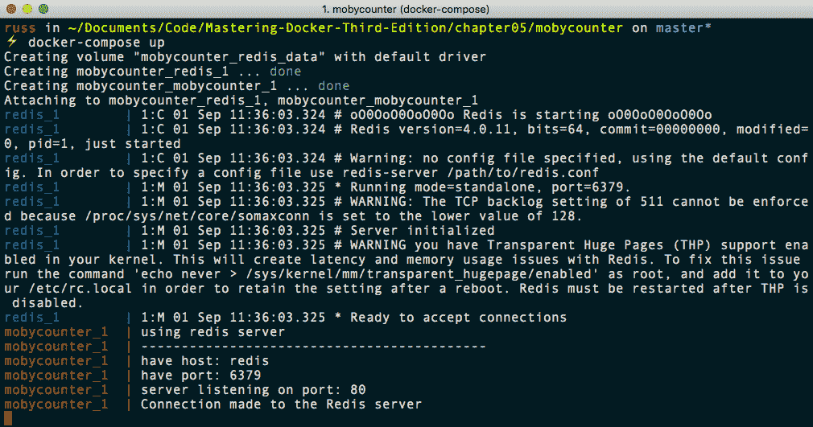
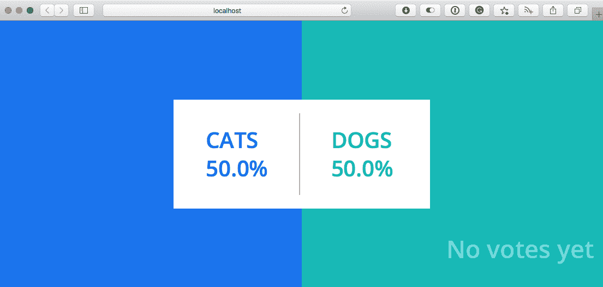
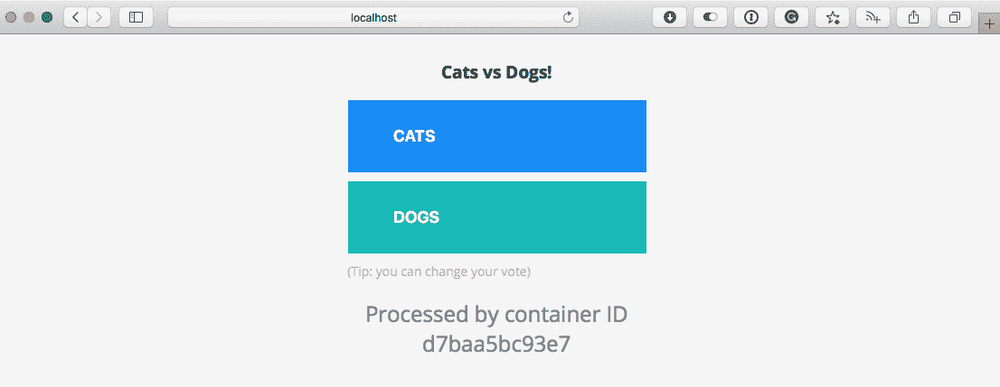
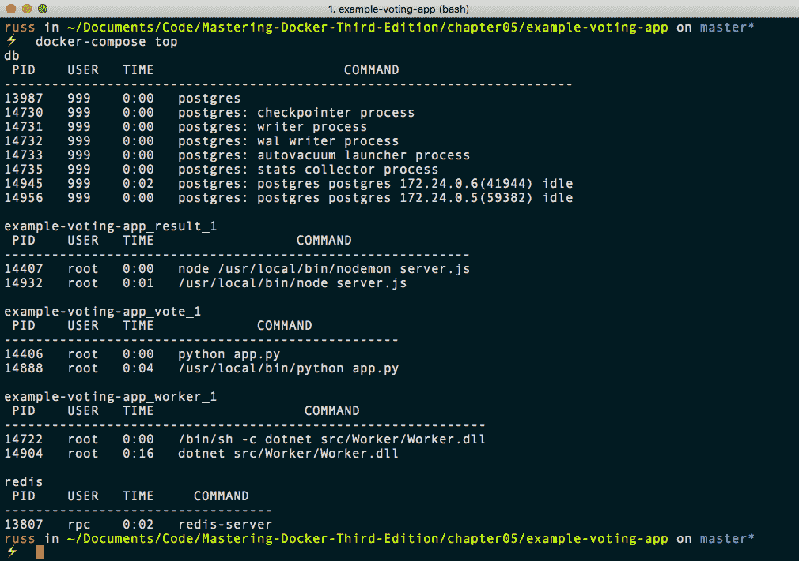
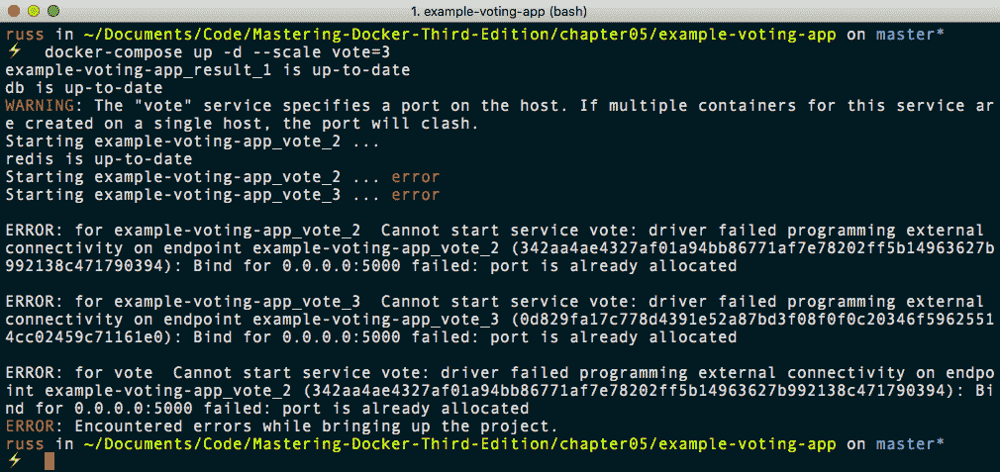
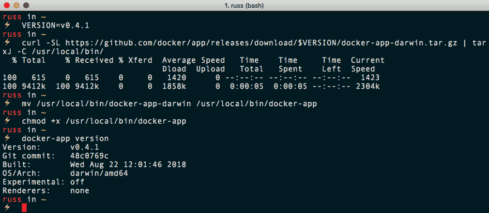
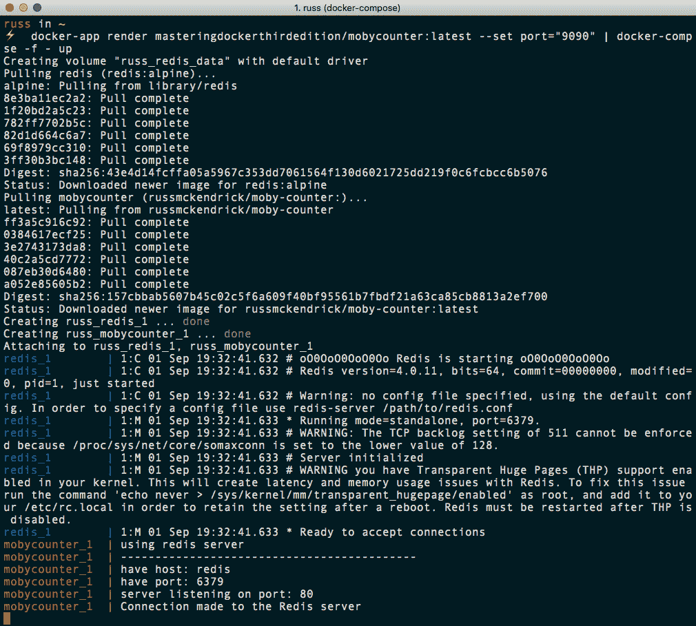

# 复合坞站

在本章中，我们将了解另一个名为 Docker Compose 的核心 Docker 工具，以及目前正在开发的 Docker 应用。我们将把这一章分成以下几节:

*   坞站组合简介
*   我们的第一个 Docker 编写应用
*   docker 由 YAML 文件组成
*   坞站合成命令
*   Docker 应用

# 技术要求

与前几章一样，我们将继续使用本地 Docker 安装。同样，本章的截图将来自我的首选操作系统，macOS。

和以前一样，我们将运行的 Docker 命令将在迄今为止安装了 Docker 的所有三个操作系统上运行。然而，一些支持命令可能只适用于 macOS 和基于 Linux 的操作系统，而且数量很少。

本章所用代码的完整副本可在以下网址找到:[https://github . com/PacktPublishing/Mastering-Docker-第三版/tree/master/chapter05](https://github.com/PacktPublishing/Mastering-Docker-Third-Edition/tree/master/chapter05) 。

查看以下视频，了解《行为准则》:

[http://bit.ly/2q7MJZU](http://bit.ly/2q7MJZU)

# 介绍Docker写作

在第 1 章*【Docker 概述】*中，我们讨论了 Docker 旨在解决的一些问题。我们解释了它如何通过将进程隔离到单个容器中来解决并行运行两个应用的挑战，这意味着您可以在同一台主机上运行同一个软件栈的两个完全不同的版本，比如 PHP 5.6 和 PHP 7，就像我们在[第 2 章](02.html) *构建容器映像*中所做的那样。

在[第 4 章](04.html) *【管理容器】*的结尾，我们启动了一个由多个容器组成的应用，而不是在单个容器中运行所需的软件栈。我们启动的示例应用莫比计数器是用 Node.js 编写的，它使用 Redis 作为后端来存储键值，在我们的例子中，键值是 Docker 徽标在屏幕上的位置。

这意味着我们必须启动两个容器，一个用于应用，一个用于 Redis。虽然这样做很简单，因为应用本身是非常基本的，但是手动启动单个容器有很多缺点。

例如，如果我希望同事部署相同的应用，我必须向他们传递以下命令:

```
$ docker image pull redis:alpine
$ docker image pull russmckendrick/moby-counter
$ docker network create moby-counter
$ docker container run -d --name redis --network moby-counter redis:alpine
$ docker container run -d --name moby-counter --network moby-counter -p 8080:80 russmckendrick/moby-counter
```

好吧，我可以摆脱前两个命令的丢失，因为如果映像还没有被拉出来，它们将在运行期间被拉出来，但是随着应用变得越来越复杂，我将不得不开始传递一组不断增长的命令和指令。

我还必须说明，它们必须考虑到命令需要执行的顺序。此外，我的笔记必须包括任何潜在问题的细节，以支持他们解决任何问题，这可能意味着我们发现自己现在处于一个“T0”工作就是 DevOps 问题的场景中，这是我们不惜一切代价都要避免的。

虽然 Docker 的责任应该结束于创建映像和使用这些映像启动容器，但他们认为这是一个场景，该技术旨在阻止我们发现自己。多亏了 Docker，人们不再需要担心他们启动应用的环境中的不一致性，因为它们现在可以以映像形式运输。

为此，早在 2014 年 7 月，Docker 收购了一家英国小型初创公司，该公司提供两种基于容器的产品，名为“果园实验室”。

这两款产品中的第一款是基于 Docker 的托管平台:可以将其视为 Docker Machine(我们将在后面的章节中讨论)和 Docker 本身的混合。通过单个命令`orchard`，您可以启动一台主机，然后将您的 Docker 命令代理到新启动的主机；例如，您可以使用以下命令:

```
$ orchard hosts create
$ orchard docker run -p 6379:6379 -d orchardup/redis
```

这些将在果园的平台上推出一个 Docker 主机，然后推出一个 Redis 容器。

第二个产品是一个名为 **Fig** 的开源项目。Fig 允许您使用一个`YAML`文件来定义您希望您的多容器应用如何被结构化。然后，它将获取`YAML`文件，并按照定义自动启动容器。这样做的好处是，因为这是一个 YAML 文件，所以开发人员可以很容易地在他们的代码库中将`fig.yml`文件与他们的 Dockerfiles 一起发送。

在这两种产品中，Docker 为 Fig 购买了果园实验室，不久后，果园服务停止，2015 年 2 月，Fig 成为 Docker Compose。

作为我们在[第 1 章](01.html)*【Docker 概述】*中安装 Docker for Mac、Docker for Windows 和 Docker on Linux 的一部分，我们安装了 Docker Compose，因此我们不再进一步讨论它的功能，而是尝试使用 Docker Compose 调出上一章末尾手动启动的双容器应用。

# 我们的第一个 Docker 编写应用

如前所述，Docker Compose 使用一个 YAML 文件，通常命名为`dockercompose.yml`，来定义您的多容器应用应该是什么样子。我们在[第 4 章](04.html) *【管理容器】*中启动的双容器应用的 Docker Compose 表示如下:

```
version: "3"

services:
 redis:
 image: redis:alpine
 volumes:
 - redis_data:/data
 restart: always
 mobycounter:
 depends_on:
 - redis
 image: russmckendrick/moby-counter
 ports:
 - "8080:80"
 restart: always

volumes:
 redis_data:
```

即使不处理文件中的每一行，也应该很容易理解正在发生的事情。要启动我们的应用，我们只需切换到包含您的`docker-compose.yml`文件的文件夹，并运行以下命令:

```
$ docker-compose up
```

从下面的终端输出可以看出，它启动时发生了很多事情:



如您所见，从前几行，Docker Compose 执行了以下操作:

*   它使用我们在`docker-compose.yml`文件末尾定义的默认驱动程序创建了一个名为`mobycounter_redis_data`的卷。
*   它使用默认网络驱动程序创建了一个名为`mobycounter_default`的网络——我们从未要求 Docker Compose 这样做。一会儿再谈这个。
*   它推出了两个容器，一个叫做`mobycounter_redis_1`，第二个叫做`mobycounter_mobycounter_1`。

您可能还发现了我们的多容器应用中的 Docker Compose 名称空间，它在所有内容前面都加上了`mobycounter`。它从我们的 Docker Compose 文件存储的文件夹中取了这个名字。

一旦启动，Docker Compose 就会附加到`mobycounter_redis_1`和`mobycounter_mobycounter_1`上，并将输出流式传输到我们的终端会话。在终端屏幕上，您可以看到`redis_1`和`mobycounter_1`开始相互交互。

使用`docker-compose up`运行 Docker 作曲时，会在前台运行。按下 *Ctrl* + *C* 将停止容器并返回到您的终端会话。

# Docker 合成 YAML 文件

在我们更多地考虑使用 Docker Compose 之前，我们应该更深入地了解`docker-compose.yml`文件，因为这些是 Docker Compose 的核心。

YAML is a recursive acronym that stands for **YAML Ain't Markup Language**. It is used by a lot of different applications for both configuration and also for defining data in a human-readable structured data format. The indentation you see in the examples is very important as it helps to define the structure of the data.

# 莫比计数器应用

我们用来启动多容器应用的`docker-compose.yml`文件被分成三个独立的部分。

第一部分简单地指定了我们使用的 Docker Compose 定义语言的版本；在我们的例子中，当我们运行 Docker 和 Docker Compose 的最新版本时，我们使用的是版本 3:

```
version: "3"
```

下一部分是我们定义容器的地方；这部分是服务部分。它采用以下格式:

```
services: --> container name: ----> container options --> container name: ----> container options
```

在我们的例子中，我们定义了两个容器。为了便于阅读，我把它们分开了:

```
services:
 redis:
 image: redis:alpine
 volumes:
 - redis_data:/data
 restart: always
 mobycounter:
 depends_on:
 - redis
 image: russmckendrick/moby-counter
 ports:
 - "8080:80"
 restart: always
```

定义服务的语法类似于使用`docker container run`命令启动容器。我说关闭，是因为尽管当你阅读定义时，它非常有意义，但只有仔细观察，你才会意识到 Docker Compose 语法和`docker container run`命令之间实际上有很大的不同。

例如，运行`docker container run`命令时，没有以下标志:

*   `image:`这告诉 Docker Compose 下载和使用哪个映像。在命令行上运行`docker container run`时，该选项不存在，因为您只能运行一个容器；正如我们在前面几章中看到的，映像总是在命令的末尾定义，而不需要传递标志。
*   `volume:`这相当于`--volume flag`，但它可以接受多个卷。它只使用在 Docker Compose YAML 文件中声明的卷；稍后会有更多的介绍。
*   `depends_on:`这永远不会作为`docker container run`调用工作，因为该命令仅针对单个容器。谈到 Docker Compose，`depends_on`用来帮助构建一些逻辑到你的容器被启动的顺序中。例如，只有当容器 A 已经成功启动时，才启动容器 B。
*   `ports:`这基本上是`--publish`标志，接受端口列表。

在运行`docker container run`时，我们使用的命令中唯一具有等效标志的部分是:

*   `restart:`这与使用`--restart`标志相同，接受相同的输入。

我们的 Docker Compose YAML 文件的最后一部分是我们申报卷的地方:

```
volume:
 redis_data:
```

# 投票应用示例

如前所述，莫比计数器应用的 Docker Compose 文件是一个非常简单的例子。让我们看一下一个更复杂的 Docker Compose 文件，看看我们如何引入构建容器和多个网络。

在这本书的存储库中，你会在`chapter05`目录中找到一个名为`example-voting-app`的文件夹。这是来自官方 Docker 示例存储库的投票应用的分叉。

如您所见，如果您打开`docker-compose.yml`文件，应用由五个容器、两个网络和一个卷组成。暂时忽略其他文件；我们将在以后的章节中研究其中的一些。让我们浏览一下`docker-compose.yml`文件，因为有很多事情正在发生:

```
version: "3"

services:
```

如您所见，它从定义版本开始，然后开始列出服务。我们的第一个容器叫做`vote`；它是一个 Python 应用，允许用户提交他们的投票。从下面的定义可以看出，我们实际上不是下载映像，而是通过使用`build`而不是`image`命令从头开始构建映像:

```
 vote:
 build: ./vote
 command: python app.py
 volumes:
 - ./vote:/app
 ports:
 - "5000:80"
 networks:
 - front-tier
 - back-tier
```

这里的构建指令告诉 Docker Compose 使用 Dockerfile 构建一个容器，该文件可以在`./vote`文件夹中找到。对于 Python 应用来说，Dockerfile 本身非常简单。

一旦容器启动，我们就将`./vote`文件夹从我们的主机安装到容器中，这是通过传递我们想要安装的文件夹的路径以及我们想要它安装在容器中的什么位置来实现的。

我们告诉容器在启动时运行`python app.py`。我们正在将主机上的端口`5000`映射到容器上的端口`80`，最后，我们进一步将两个网络连接到容器，一个称为`front-tier`，另一个称为`back-tier`。

`front-tier`网络将具有必须将端口映射到主机的容器；`back-tier`网络是为不需要暴露其端口的容器保留的，充当一个私有的、隔离的网络。

接下来，我们有另一个连接到`front-tier`网络的容器。此容器显示投票结果。`result`容器包含一个 Node.js 应用，该应用连接到 PostgreSQL 数据库，稍后我们将进入该数据库，并在`vote`容器中进行投票时实时显示结果。像`vote`容器一样，映像是使用`Dockerfile`在本地构建的，可以在`./result`文件夹中找到:

```
 result:
 build: ./result
 command: nodemon server.js
 volumes:
 - ./result:/app
 ports:
 - "5001:80"
 - "5858:5858"
 networks:
 - front-tier
 - back-tier
```

我们正在暴露端口`5001`，这是我们可以连接查看结果的地方。下一个也是最后一个应用容器叫做`worker`:

```
 worker:
 build:
 context: ./worker
 depends_on:
 - "redis"
 networks:
 - back-tier
```

工作容器运行一个. NET 应用，其唯一的工作是连接到 Redis，并通过将每个投票转移到一个名为`db`的容器上运行的 PostgreSQL 数据库中来注册。容器再次使用`Dockerfile`构建，但是这一次，我们使用上下文，而不是将路径传递到存储`Dockerfile`和应用的文件夹。这为 docker 构建设置了工作目录，还允许您定义附加选项，如标签和更改`Dockerfile`的名称。

由于该容器除了连接到`redis`和`db`容器之外什么也不做，所以它不需要暴露任何端口，因为它没有直接连接到它的东西；它也不需要与在`front-tier`网络上运行的任何一个容器通信，这意味着我们只需要添加`back-tier`网络。

因此，我们现在有了`vote`应用，它注册来自最终用户的投票，并将它们发送到`redis`容器，然后在那里投票由`worker`容器处理。`redis`容器的服务定义如下:

```
 redis:
 image: redis:alpine
 container_name: redis
 ports: ["6379"]
 networks:
 - back-tier
```

此容器使用官方 Redis 映像，并且不是从 Dockerfile 构建的；我们正在确保端口`6379`可用，但仅限于`back-tier`网络。我们还指定了容器的名称，通过使用`container_name`将其设置为`redis`。这是为了避免我们在代码中对 Docker Compose 生成的默认名称进行任何考虑，因为如果您还记得的话，Docker Compose 使用文件夹名称在它们自己的应用命名空间中启动容器。

下一个也是最后一个容器是我们已经提到过的名为`db`的 PostgreSQL 容器:

```
 db:
 image: postgres:9.4
 container_name: db
 volumes:
 - "db-data:/var/lib/postgresql/data"
 networks:
 - back-tier
```

如您所见，它看起来与`redis`容器非常相似，因为我们使用的是官方映像；但是，您可能会注意到我们没有公开端口，因为这是官方映像中的默认选项。我们还指定了容器的名称。

由于这是我们投票的存储位置，我们正在创建和装载一个卷，作为 PostgreSQL 数据库的永久存储:

```
volumes:
 db-data:
```

最后，这里是我们一直在谈论的两个网络:

```
networks:
 front-tier:
 back-tier:
```

运行`docker-compose up`给出了很多关于发射过程中发生的事情的反馈；第一次启动应用大约需要 5 分钟。如果您没有跟随并自己启动应用，接下来将是一个简短的启动版本。

You may get an error that states `npm ERR! request to https://registry.npmjs.org/nodemon failed, reason: Hostname/IP doesn't match certificate's altnames`. If you do, then run the following command `echo "104.16.16.35 registry.npmjs.org" >> /etc/hosts` as a user with privileges to write to `/etc/hosts`.

我们首先创建网络，并准备好容器使用的卷:

```
Creating network "example-voting-app_front-tier" with the default driver
Creating network "example-voting-app_back-tier" with the default driver
Creating volume "example-voting-app_db-data" with default driver
```

然后我们构建`vote`容器映像:

```
Building vote
Step 1/7 : FROM python:2.7-alpine
2.7-alpine: Pulling from library/python
8e3ba11ec2a2: Pull complete
ea489525e565: Pull complete
f0d8a8560df7: Pull complete
8971431029b9: Pull complete
Digest: sha256:c9f17d63ea49a186d899cb9856a5cc1c601783f2c9fa9b776b4582a49ceac548
Status: Downloaded newer image for python:2.7-alpine
 ---> 5082b69714da
Step 2/7 : WORKDIR /app
 ---> Running in 663db929990a
Removing intermediate container 663db929990a
 ---> 45fe48ea8e4c
Step 3/7 : ADD requirements.txt /app/requirements.txt
 ---> 2df3b3211688
Step 4/7 : RUN pip install -r requirements.txt
 ---> Running in 23ad90b81e6b
[lots of python build output here]
Step 5/7 : ADD . /app
 ---> cebab4f80850
Step 6/7 : EXPOSE 80
 ---> Running in b28d426e3516
Removing intermediate container b28d426e3516
 ---> bb951ea7dffc
Step 7/7 : CMD ["gunicorn", "app:app", "-b", "0.0.0.0:80", "--log-file", "-", "--access-logfile", "-", "--workers", "4", "--keep-alive", "0"]
 ---> Running in 2e97ca847f8a
Removing intermediate container 2e97ca847f8a
 ---> 638c74fab05e
Successfully built 638c74fab05e
Successfully tagged example-voting-app_vote:latest
WARNING: Image for service vote was built because it did not already exist. To rebuild this image you must use `docker-compose build` or `docker-compose up --build`.
```

一旦构建了这个`vote`映像，就构建了`worker`映像:

```
Building worker
Step 1/5 : FROM microsoft/dotnet:2.0.0-sdk
2.0.0-sdk: Pulling from microsoft/dotnet
3e17c6eae66c: Pull complete
74d44b20f851: Pull complete
a156217f3fa4: Pull complete
4a1ed13b6faa: Pull complete
18842ff6b0bf: Pull complete
e857bd06f538: Pull complete
b800e4c6f9e9: Pull complete
Digest: sha256:f4ea9cdf980bb9512523a3fb88e30f2b83cce4b0cddd2972bc36685461081e2f
Status: Downloaded newer image for microsoft/dotnet:2.0.0-sdk
 ---> fde8197d13f4
Step 2/5 : WORKDIR /code
 ---> Running in 1ca2374cff99
Removing intermediate container 1ca2374cff99
 ---> 37f9b05325f9
Step 3/5 : ADD src/Worker /code/src/Worker
 ---> 9d393c6bd48c
Step 4/5 : RUN dotnet restore -v minimal src/Worker && dotnet publish -c Release -o "./" "src/Worker/"
 ---> Running in ab9fe7820062
 Restoring packages for /code/src/Worker/Worker.csproj...
 [lots of .net build output here]
 Restore completed in 8.86 sec for /code/src/Worker/Worker.csproj.
Microsoft (R) Build Engine version 15.3.409.57025 for .NET Core
Copyright (C) Microsoft Corporation. All rights reserved.
 Worker -> /code/src/Worker/bin/Release/netcoreapp2.0/Worker.dll
 Worker -> /code/src/Worker/
Removing intermediate container ab9fe7820062
 ---> cf369fbb11dd
Step 5/5 : CMD dotnet src/Worker/Worker.dll
 ---> Running in 232416405e3a
Removing intermediate container 232416405e3a
 ---> d355a73a45c9
Successfully built d355a73a45c9
Successfully tagged example-voting-app_worker:latest
WARNING: Image for service worker was built because it did not already exist. To rebuild this image you must use `docker-compose build` or `docker-compose up --build`.
```

然后拉出`redis`映像:

```
Pulling redis (redis:alpine)...
alpine: Pulling from library/redis
8e3ba11ec2a2: Already exists
1f20bd2a5c23: Pull complete
782ff7702b5c: Pull complete
82d1d664c6a7: Pull complete
69f8979cc310: Pull complete
3ff30b3bc148: Pull complete
Digest: sha256:43e4d14fcffa05a5967c353dd7061564f130d6021725dd219f0c6fcbcc6b5076
Status: Downloaded newer image for redis:alpine
```

接下来是`db`容器的 PostgreSQL 映像:

```
Pulling db (postgres:9.4)...
9.4: Pulling from library/postgres
be8881be8156: Pull complete
01d7a10e8228: Pull complete
f8968e0fd5ca: Pull complete
69add08e7e51: Pull complete
954fe1f9e4e8: Pull complete
9ace39987bb3: Pull complete
9020931bcc5d: Pull complete
71f421dd7dcd: Pull complete
a909f41228ab: Pull complete
cb62befcd007: Pull complete
4fea257fde1a: Pull complete
f00651fb0fbf: Pull complete
0ace3ceac779: Pull complete
b64ee32577de: Pull complete
Digest: sha256:7430585790921d82a56c4cbe62fdf50f03e00b89d39cbf881afa1ef82eefd61c
Status: Downloaded newer image for postgres:9.4
```

现在是大的时候了；`result`形象的构建。Node.js 相当冗长，所以当执行`Dockerfile`的`npm`部分时，您会得到相当多的输出被打印到屏幕上；事实上，有超过 250 行输出:

```
Building result
Step 1/11 : FROM node:8.9-alpine
8.9-alpine: Pulling from library/node
605ce1bd3f31: Pull complete
79b85b1676b5: Pull complete
20865485d0c2: Pull complete
Digest: sha256:6bb963d58da845cf66a22bc5a48bb8c686f91d30240f0798feb0d61a2832fc46
Status: Downloaded newer image for node:8.9-alpine
 ---> 406f227b21f5
Step 2/11 : RUN mkdir -p /app
 ---> Running in 4af9c85c67ee
Removing intermediate container 4af9c85c67ee
 ---> f722dde47fcf
Step 3/11 : WORKDIR /app
 ---> Running in 8ad29a42f32f
Removing intermediate container 8ad29a42f32f
 ---> 32a05580f2ec
Step 4/11 : RUN npm install -g nodemon
[lots and lots of nodejs output]
Step 8/11 : COPY . /app
 ---> 725966c2314f
Step 9/11 : ENV PORT 80
 ---> Running in 6f402a073bf4
Removing intermediate container 6f402a073bf4
 ---> e3c426b5a6c8
Step 10/11 : EXPOSE 80
 ---> Running in 13db57b3c5ca
Removing intermediate container 13db57b3c5ca
 ---> 1305ea7102cf
Step 11/11 : CMD ["node", "server.js"]
 ---> Running in a27700087403
Removing intermediate container a27700087403
 ---> 679c16721a7f
Successfully built 679c16721a7f
Successfully tagged example-voting-app_result:latest
WARNING: Image for service result was built because it did not already exist. To rebuild this image you must use `docker-compose build` or `docker-compose up --build`.
```

应用的`result`部分可以在`http://localhost:5001`访问。默认情况下，没有投票，而且是对半分:



应用的`vote`部分可以在`http://localhost:5000`找到:



点击 **CATS** 或 **DOGS** 将进行投票；您应该能够在终端的 Docker Compose 输出中看到这个日志:


有一些错误，因为 Redis 表结构只在投票应用注册第一次投票时创建；一旦投票，将创建 Redis 表结构，工作容器将进行投票，并通过写入`db`容器进行处理。一旦投票完毕，`result`容器将实时更新:


在接下来的章节中，当我们考虑启动 Docker Swarm 栈和 Kubenetes 集群时，我们将再次考虑 Docker Compose YAML 文件。现在，让我们回到 Docker Compose，看看我们可以运行的一些命令。

# 坞站合成命令

这一章已经过半，我们唯一运行的 Docker Compose 命令是`docker-compose up`。如果您一直跟随并运行`docker container ls -a`，您将看到类似于以下终端屏幕的内容:


如你所见，我们有很多状态为`EXITED`的容器。这是因为当我们使用 *Ctrl* + *C* 返回我们的Docker时，Docker组合容器被停止。

选择一个 Docker Compose 应用，并切换到包含`docker-compose.yml`文件的文件夹，我们将处理更多的 Docker Compose 命令。我将使用**示例投票**应用。

# 向上和向下

第一个是`docker-compose up`，但是这一次，我们将增加一个标志。在您选择的应用文件夹中，运行以下命令:

```
$ docker-compose up -d
```

这将启动应用备份，这次是在分离模式下:


一旦您的终端的控制权返回，您应该能够使用以下命令检查容器是否正在运行:

```
$ docker-compose ps
```

从下面的终端输出可以看到，所有的容器都处于`Up`状态:


运行这些命令时，Docker Compose 将只知道您的`docker-compose.yml`文件的服务部分中定义的容器；所有其他容器都将被忽略，因为它们不属于我们的服务栈。

# 配置

运行以下命令将验证我们的`docker-compose.yml`文件:

```
$ docker-compose config
```

如果没有问题，它将打印你的 Docker 撰写 YAML 文件的渲染副本到屏幕；这就是 Docker Compose 将如何解释您的文件。如果您不想看到此输出，只想检查错误，则可以运行以下命令:

```
$ docker-compose config -q
```

这是`--quiet`的简写。如果有任何错误，这些错误是我们到目前为止所处理过的示例不应该有的，它们将显示如下:

```
ERROR: yaml.parser.ParserError: while parsing a block mapping in "./docker-compose.yml", line 1, column 1 expected <block end>, but found '<block mapping start>' in "./docker-compose.yml", line 27, column 3
```

# 拉动、构建和创建

接下来的两个命令将帮助您准备启动 Docker Compose 应用。以下命令将读取您的 Docker Compose YAML 文件，并提取它找到的任何映像:

```
$ docker-compose pull
```

以下命令将执行它在文件中找到的任何构建指令:

```
$ docker-compose build
```

当您第一次定义以 Docker Compose 为动力的应用并希望在不启动应用的情况下进行测试时，这些命令非常有用。如果最初用于构建映像的任何 Dockerfiles 有更新，也可以使用`docker-compose build`命令触发构建。

`pull`和`build`命令只生成/拉取我们应用所需的映像；他们不自己配置容器。为此，我们需要使用以下命令:

```
$ docker-compose create
```

这将创建但不会启动容器。与`docker container create`命令相同，在您启动它们之前，它们将处于退出状态。`create`命令有几个有用的标志可以传递:

*   `--force-recreate`:这将重新创建容器，即使没有必要，因为配置中没有任何内容发生变化
*   `--no-recreate`:如果容器已经存在，这不会重新创建容器；此标志不能与前面的标志一起使用
*   `--no-build`:这不会构建映像，即使需要构建的映像丢失了
*   `--build`:这将在创建容器之前构建映像

# 开始、停止、重新开始、暂停和取消暂停

以下命令的工作方式与 docker 容器完全相同，唯一的区别是它们会对所有容器产生影响:

```
$ docker-compose start
$ docker-compose stop
$ docker-compose restart
$ docker-compose pause
$ docker-compose unpause
```

可以通过传递名称来定位单个服务；例如，对于`db`服务的`pause`和`unpause`，我们将运行以下内容:

```
$ docker-compose pause db
$ docker-compose unpause db
```

# 顶部、日志和事件

接下来的三个命令都会给我们关于正在运行的容器和 Docker Compose 中发生的事情的反馈。

与 docker 容器对应的命令一样，下面的命令显示了在我们的 Docker Compose 启动的每个容器中运行的进程的信息:

```
$ docker-compose top
```

从下面的终端输出中可以看到，每个容器都被分成自己的部分:



如果您只想查看其中一个服务，那么在运行命令时只需传递它的名称:

```
$ docker-compose top db
```

下一个命令将`logs`从每个运行的容器流式传输到屏幕:

```
$ docker-compose logs
```

像`docker container`命令一样，你可以通过`-f`或`--follow`等标志来保持溪流流动，直到你按下 *Ctrl* + *C* 。此外，您还可以通过在命令末尾附加日志名称来流式传输单个服务的日志:


`events`命令再次像 docker 容器版本一样工作；它实时地流式传输事件，例如由我们已经讨论过的其他命令触发的事件。例如，运行以下命令:

```
$ docker-compose events
```

在第二个终端窗口中运行`docker-compose pause`给出以下输出:


这两个命令的运行方式与它们的 docker 容器相似。运行以下命令:

```
$ docker-compose exec worker ping -c 3 db
```

这将在已经运行的`worker`容器中启动一个新进程，并对`db`容器进行三次 ping 操作，如下所示:


如果您需要在应用中一次性运行容器化命令，那么`run`命令非常有用。例如，如果您使用包管理器(如 composer)来更新存储在卷上的项目的依赖项，您可以运行类似以下内容:

```
$ docker-compose run --volume data_volume:/app composer install
```

这将使用`install`命令运行`composer`容器，并将`data_volume`安装到容器内的`/app`上。

# 规模

`scale`命令会将您传递的服务传递给该命令，并将其缩放至您定义的数字；例如，要添加更多的工作容器，我只需要运行以下命令:

```
$ docker-compose scale worker=3
```

然而，这实际上给出了以下警告:

```
WARNING: The scale command is deprecated. Use the up command with the -scale flag instead.
```

我们现在应该使用以下命令:

```
$ docker-compose up -d --scale worker=3
```

当`scale`命令在 Docker Compose 的当前版本中时，它将从软件的未来版本中删除。

您会注意到，我选择了扩展工作容器的数量。这是有充分理由的，因为如果您尝试运行以下命令，您将会看到:

```
$ docker-compose up -d --scale vote=3
```

您会注意到，虽然 Docker Compose 创建了另外两个容器，但它们无法从以下错误开始:



这是因为我们不能让三个单独的容器都试图映射到同一个端口。对此有一个解决方法，我们将在后面的章节中详细讨论。

# 杀，rm，下来

我们最后要看的三个 Docker Compose 命令是删除/终止 Docker Compose 应用的命令。第一个命令通过立即停止正在运行的容器进程来停止我们正在运行的容器。这是`kill`命令:

```
$ docker-compose kill
```

运行时要小心，因为它不会等待容器优雅地停止，例如运行`docker-compose stop`时，这意味着使用`docker-compose kill`命令可能会导致数据丢失。

接下来是`rm`命令；这将移除任何状态为`exited`的容器:

```
$ docker-compose rm
```

最后，我们有`down`命令。你可能已经猜到了，这与运行`docker-compose up`的效果相反:

```
$ docker-compose down
```

这将移除运行`docker-compose up`时创建的容器和网络。如果要删除所有内容，可以通过运行以下命令来完成:

```
$ docker-compose down --rmi all --volumes
```

当您运行`docker-compose up`命令时，这将删除所有容器、网络、卷和映像(包括拉取的和构建的)；这包括可能在 Docker Compose 应用之外使用的映像。但是，如果映像正在使用中，将会出现错误，并且不会被删除:


从前面的输出中可以看到，有一个容器使用了`redis`映像，即莫比计数器应用，因此它没有被移除。但是，示例投票应用使用的所有其他映像都被删除，包括作为初始`docker-compose up`的一部分构建的映像和从 Docker Hub 下载的映像。

# Docker 应用

在开始本节之前，我应该发出以下警告:

*我们将要讨论的特征在很大程度上是一个实验性的特征。它正处于非常早期的开发阶段，不应该被认为仅仅是一个即将到来的特性的预览。*

正因为如此，我只介绍 macOS 版本的安装。然而，在我们安装它之前，让我们讨论一下 Docker 应用的确切含义。

虽然 Docker Compose 文件在与他人共享您的环境时非常有用，但您可能已经注意到，到目前为止，我们在本章中缺少了一个非常关键的元素，那就是以类似于分发 Docker 映像的方式实际分发 Docker Compose 文件的能力。

Docker 已经承认了这一点，目前正在开发一个名为 Docker App 的新功能，希望能填补这一空白。

**Docker App** 是一个独立的二进制文件，可以帮助你创建一个可以通过 Docker Hub 或 Docker 企业注册中心共享的应用包。

I would recommend checking the GitHub projects **R****eleases** page (you can find the link in the *Further reading* section) to make sure you are a using the latest version. If the version is later than 0.4.1, you will need to replace the version number in the following command.

要在 macOS 上安装 Docker App，您可以运行以下命令，首先设置要下载的版本:

```
$ VERSION=v0.4.1
```

现在您有了正确的版本，您可以下载它，并使用以下命令将其安装到位:

```
$ curl -SL https://github.com/docker/app/releases/download/$VERSION/docker-app-darwin.tar.gz | tar xJ -C /usr/local/bin/
$ mv /usr/local/bin/docker-app-darwin /usr/local/bin/docker-app
$ chmod +x /usr/local/bin/docker-app
```

一旦就位，您应该能够运行以下命令，在屏幕上打印关于二进制文件的一些基本信息:

```
$ docker-app version
```

对于那些没有跟随的人，可以在这里看到前面命令的完整输出:



我们将使用的`docker-compose.yml`文件有一个微小的变化。版本需要更新到`3.6`而不仅仅是`3`。不这样做将导致以下错误:

```
Error: unsupported Compose file version: 3
```

我们需要运行的命令也产生了前面的错误，如下所示:

```
$ docker-app init --single-file mobycounter
```

该命令获取我们的`docker-compose.yml`文件，并将其嵌入到`.dockerapp`文件中。最初，文件中会有相当多的注释，详细说明在进入下一步之前需要进行的更改。我在仓库中的`chapter5/mobycounter-app`文件夹中留下了一个未更改的文件版本，名为`mobycounter.dockerapp.original`。

`mobycounter.dockerapp`文件的编辑版本可以在这里找到:

```
version: latest
name: mobycounter
description: An example Docker App file which packages up the Moby Counter application
namespace: masteringdockerthirdedition
maintainers:
 - name: Russ McKendrick
 email: russ@mckendrick.io

---
version: "3.6"

services:
 redis:
 image: redis:alpine
 volumes:
 - redis_data:/data
 restart: always
 mobycounter:
 depends_on:
 - redis
 image: russmckendrick/moby-counter
 ports:
 - "${port}:80"
 restart: always

volumes:
 redis_data:

---

{ "port":"8080" }
```

如你所见，它分为三个部分；第一个包含关于应用的元数据，如下所示:

*   `Version`:这是将在 Docker Hub 上发布的应用的版本
*   `Name`:出现在 Docker Hub 上的应用的名称
*   `Description`:应用的简短描述
*   `Namespace`:这通常是您的 Docker Hub 用户名或您有权访问的组织
*   `Maintainers`:应用的维护者列表

第二部分包含我们的 Docker 编写文件。您可能会注意到一些选项已经被变量所取代。在我们的例子中，我已经将端口`8080`替换为`${port}`。`port`变量的默认值在最后一节中定义。

一旦`.dockerapp`文件完成，您可以运行以下命令将 Docker 应用保存为映像:

```
$ docker-app save
```

通过运行以下命令，您可以仅查看主机上活动的 Docker 应用:

```
$ docker-app ls
```

由于 Docker 应用大部分只是一堆包装在标准 Docker 映像中的元数据，您也可以通过运行以下内容来查看它:

```
$ docker image ls
```

如果您没有跟随这一部分，您可以在这里看到终端输出的结果:


运行以下命令给出了 Docker 应用的概述，就像您可以使用`docker image inspect`来了解映像是如何构建的一样:

```
$ docker-app inspect masteringdockerthirdedition/mobycounter.dockerapp:latest
```

从下面的终端输出可以看出，使用`docker-app inspect`而不是`docker image inspect`运行命令会给出更友好的输出:


现在我们已经完成了应用，我们需要将其推送到 Docker Hub。为此，只需运行以下命令:

```
$ docker-app push
```


这意味着我们的应用现在发布在 Docker Hub 上:


那么如何获得 Docker 应用呢？首先，我们需要移除局部映像。为此，请运行以下命令:

```
$ docker image rm masteringdockerthirdedition/mobycounter.dockerapp:latest
```

一旦离开，移动到不同的目录:

```
$ cd ~/
```

现在，让我们下载 Docker 应用，更改端口，并启动它:

```
$ docker-app render masteringdockerthirdedition/mobycounter:latest --set port="9090" | docker-compose -f - up
```

同样，对于那些没有跟随的人，可以在这里找到前面命令的终端输出:



如您所见，甚至无需手动下载 Docker 应用映像，我们就可以启动并运行我们的应用。前往`http://localhost:9090/`应该会出现邀请你点击添加 logos 的画面。

按照一个普通的前置 Docker 撰写应用，按下 *Ctrl* + *C* 返回你的终端。

您可以运行以下命令来交互和终止您的应用:

```
$ docker-app render masteringdockerthirdedition/mobycounter:latest --set port="9090" | docker-compose -f - ps $ docker-app render masteringdockerthirdedition/mobycounter:latest --set port="9090" | docker-compose -f - down --rmi all --volumes
```

Docker 应用中有更多的功能。然而，我们还没有准备好深入了解更多细节。我们将在 [第 8 章](08.html) *、Docker* *Swarm、*和[第 9 章](09.html) *、Docker 和 Kubernetes* 中返回 Docker App。

正如本节顶部提到的，该特性处于早期开发阶段，我们到目前为止讨论的命令和功能可能会在未来发生变化。但是，即使在这个早期阶段，我希望你能看到 Docker App 的优势，以及它是如何建立在 Docker Compose 奠定的坚实基础上的。

# 摘要

我希望你喜欢 Docker Compose 的这一章，我希望和我一样，你能看到它已经从一个非常有用的第三方工具发展成为 Docker 核心体验中极其重要的一部分。

Docker Compose 介绍了如何运行和管理容器的一些关键概念。我们将在[第 8 章](https://cdp.packtpub.com/mastering_docker___thirdedition/wp-admin/post.php?post=28&action=edit#post_31)*【Docker】**Swarm、*和[第 9 章](https://cdp.packtpub.com/mastering_docker___thirdedition/wp-admin/post.php?post=28&action=edit#post_32)*【Docker 和 Kubernetes】*中进一步阐述这些概念。

在下一章中，我们将远离基于 Linux 的容器，对 Windows 容器进行短暂的参观。

# 问题

1.  Docker 撰写文件使用哪种开源格式？
2.  在我们最初的莫比计数器 Docker Compose 文件中，哪一个标志的工作原理与其 Docker CLI 对应文件完全相同？
3.  对还是错:您只能在 Docker 撰写文件中使用 Docker Hub 中的映像？
4.  默认情况下，Docker Compose 如何决定要使用的命名空间？
5.  您在 docker-composite 中添加了哪个标志来启动后台的容器？
6.  对 Docker Compose 文件运行语法检查的最佳方式是什么？
7.  解释 Docker App 如何工作的基本原理。

# 进一步阅读

有关果园实验室的详细信息，请参见以下内容:

*   果园实验室网站:[https://www.orchardup.com/](https://www.orchardup.com/)
*   果园实验室加入 Docker:[https://blog . Docker . com/2014/07/欢迎果园无花果团队](https://blog.docker.com/2014/07/welcoming-the-orchard-and-fig-team)

有关 Docker 应用项目的更多信息，请参见以下内容:

*   GitHub 存储库:[http://github . com/docker/app/](http://github.com/docker/app/)
*   发行版页面--[https://github . com/dock/app/releases](https://github.com/docker/app/releases)

最后，这里还有一些我们已经讨论过的其他主题的链接:

*   YAML 项目主页:[http://www.yaml.org/](http://www.yaml.org/)
*   坞站示例存储库:https://github . com/dock samples/