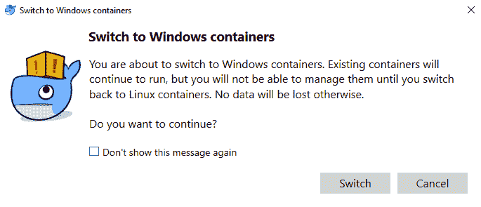
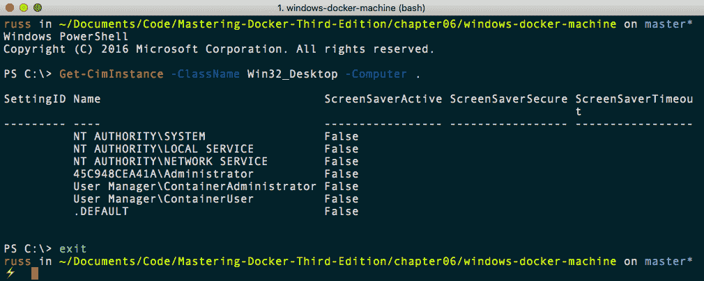
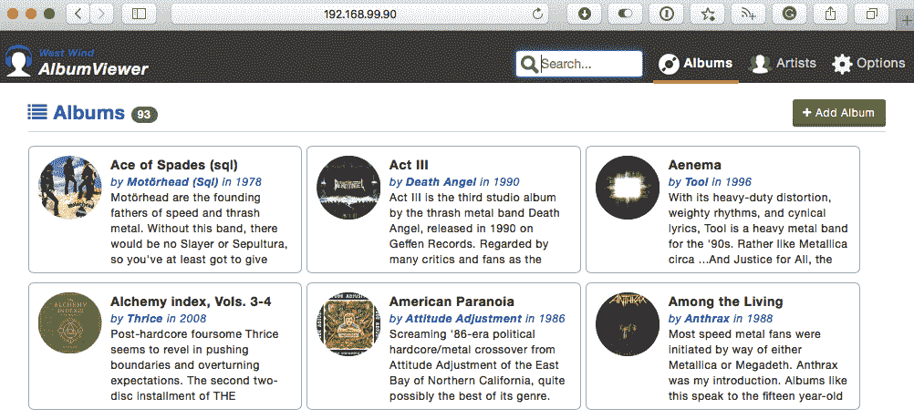

# 六、Windows 容器

在本章中，我们将讨论并了解 Windows 容器。微软已经将容器作为在新硬件上部署旧应用的一种方式。与 Linux 容器不同，Windows 容器仅在基于 Windows 的 Docker 主机上可用。

在本章中，我们将涵盖以下主题:

*   Windows 容器简介
*   为窗口容器设置 Docker 主机
*   运行 Windows 容器
*   窗口容器文件
*   Windows 容器和 Docker 编写

# 技术要求

根据前面的章节，我们将继续使用本地 Docker 安装。同样，本章中的截图将来自我首选的操作系统——macOS——是的，即使我们将运行 Windows 容器，您仍然可以使用您的 macOS 客户端。稍后会有更多。

到目前为止，我们将运行的 Docker 命令将在安装了 Docker 的所有三个操作系统上运行。然而，在本章中，我们将启动的容器将只在 Windows Docker 主机上工作。我们将在基于 macOS 和 Linux 的机器上使用 VirtualBox 和 host 来帮助启动和运行一个 Windows Docker 主机。

本章所用代码的完整副本可在[https://github . com/PacktPublishing/Mastering-Docker-第三版/tree/master/chapter06/](https://github.com/PacktPublishing/Mastering-Docker-Third-Edition/tree/master/chapter06/) 上找到。

查看以下视频，了解《行为准则》:

[http://bit.ly/2PfjuSR](http://bit.ly/2PfjuSR)

# Windows 容器简介

在过去的 20 年里，我几乎每天都在使用苹果电脑、Linux 电脑和笔记本电脑以及 Linux 服务器，再加上我运行微软视窗的唯一经验是我拥有的视窗 XP 和视窗 10 游戏电脑，以及我在工作中无法避免的奇怪的视窗服务器，视窗容器的出现是一个有趣的发展。

现在，我永远不会把自己归类为一个 Linux/UNIX 爱好者。然而，微软过去几年的行为甚至让我感到惊讶。早在 2014 年，在 Azure 的一次活动中，微软就宣称“微软 Linux”，此后就再也没有回头:

*   Linux 是微软 Azure 的一等公民
*   。NET Core 是跨平台的，这意味着您可以运行您的。基于 Linux 和 Windows 的. NET 应用
*   SQL Server 现已在 Linux 上可用
*   可以在 Windows 10 Professional 机器上运行 Linux shells，比如 Ubuntu
*   PowerShell 已经移植到了 Linux 上
*   它开发了跨平台的工具，如 Visual Studio Code，并开源了它们
*   它正以 75 亿美元收购 GitHub！！

很明显，过去的微软已经不复存在了，前首席执行官史蒂夫·鲍尔默(Steve Ballmer)曾因称开源社区和 Linux 社区为不适合在这里重复的东西而对它们进行了著名的抨击。

因此，2014 年 10 月，在微软公开宣布热爱 Linux 的几个月后，Docker 和微软合作推动基于 Windows 的操作系统(如 Windows 10 Professional 和 Windows Server 2016)采用容器的消息并没有让任何人感到惊讶。

那么什么是 Windows 容器呢？

嗯，从表面上看，它们与 Linux 容器没有什么不同。微软在 Windows 内核上的工作引入了与 Linux 相同的进程隔离。此外，像 Linux 容器一样，这种隔离扩展到沙盒文件系统甚至 Windows 注册表。

由于每个容器实际上都是一个全新的 Windows Core 或 Windows Nano，它们反过来又是经过裁剪的 Windows 服务器映像(想想 Alpine Linux，但对于 Windows 来说)，安装管理员可以在同一台主机上运行多个 Dockerized 应用，而不必担心任何自定义注册表更改或需求冲突并导致问题。

再加上 Docker 命令行客户端提供的易用性，管理员可以将他们的传统应用迁移到更现代的硬件和主机操作系统，而不必担心和管理运行旧的不受支持的 Windows 版本的多个虚拟机。

Windows 容器还提供了另一层隔离。当容器启动时，Hyper-V 隔离在最小的虚拟机管理程序中运行容器进程。这进一步将容器进程与主机隔离开来。但是，使用 Hyper-V 隔离运行的每个容器都需要少量的额外资源，同时这些容器的启动时间也会增加，因为需要先启动虚拟机管理程序，然后才能启动容器。

虽然 Hyper-V 隔离确实使用了微软的虚拟机管理程序，这可以在 Windows 服务器和桌面版本以及 Xbox One 系统软件中找到，但您不能使用标准的 Hyper-V 管理工具来管理 Hyper-V 隔离容器。你必须使用 Docker。

在微软不得不在 Windows 内核中启用容器的所有工作和努力之后，他们为什么选择 Docker 而不仅仅是创建他们的管理工具呢？

Docker 已经通过一套成熟的 API 和一个大型社区，成为管理容器的首选工具。此外，它是开源的，这意味着微软不仅可以将其应用于视窗系统，还可以为其发展做出贡献。

下图概述了 Docker 在 Windows 上的工作方式:


注意我说的是 Windows 上的 Docker，不是 Windows 的 Docker；它们是非常不同的产品。Windows 上的 Docker 是 Docker 引擎和客户端的原生版本，它与 Windows 内核交互以提供 Windows 容器。对于开发人员来说，在桌面上运行 Linux 和 Windows 容器是一种尽可能原生的体验。

# 为窗口容器设置 Docker 主机

正如您可能已经猜到的，您将需要访问运行 Docker 的 Windows 主机。如果您没有运行 Windows 10 Professional 机器，不要太担心——在 macOS 和 Linux 上，您可以通过多种方式实现这一点。在我们讨论这些之前，让我们来看看如何在 Windows 10 Professional 上使用 Docker 来运行 Windows 容器。

# Windows 10 专业版

**Windows 10 专业版**支持 Windows 容器开箱即用。但是，默认情况下，它被配置为运行 Linux 容器。要从运行 Linux 的容器切换到 Windows 容器，右键单击系统托盘中的 Docker 图标，然后选择**切换到 Windows 容器...**从菜单中:


这将显示以下提示:



点击**开关**按钮，几秒钟后，您将开始管理 Windows 容器。您可以通过打开提示并运行以下命令来看到这一点:

```
$ docker version
```

这可以从以下输出中看出:


Docker Engine 有一个`windows/amd64`的`OS/Arch`，而不是我们一直习惯看到的`linux/amd64`。所以这涵盖了视窗 10 专业版。但是像我这样更喜欢 macOS 和 Linux 的人呢？

# macOS 和 Linux

为了访问 macOS 和 Linux 机器上的 Windows 容器，我们将使用斯特凡·舍雷尔提供的优秀资源。在本书附带的存储库的`chapter06`文件夹中，有一个分叉版本的 Stefan 的 Windows–`docker-machine repo`，其中包含了在 macOS 上使用 Windows 容器启动和运行所需的所有文件。

在我们开始之前，您将需要以下工具——哈希公司的游民和甲骨文的 Virtualbox。您可以从以下网站下载:

*   [https://www.vagrantup.com/downloads.html](https://www.vagrantup.com/downloads.html)
*   [https://www.virtualbox.org/wiki/Downloads](https://www.virtualbox.org/wiki/Downloads)

下载安装后，打开终端，进入`chapter06/docker-machine`存储库文件夹，运行以下命令:

```
$ vagrant up --provider virtualbox 2016-box
```

这将下载一个 VirtualBox Windows Server 2016 核心评估映像，其中包含让您使用 Windows 容器启动和运行所需的一切。下载量刚刚超过 10 GB，因此请确保您有运行映像所需的带宽和磁盘空间。

游民将启动映像，在虚拟机上配置 Docker，并将本地 Docker 客户端与主机交互所需的证书文件复制到您的机器上。要切换到使用新启动的 Docker Windows 主机，只需运行以下命令:

```
$ eval $(docker-machine env 2016-box)
```

我们将在下一章中更详细地讨论 Docker Machine。但是，前面的命令所做的是重新配置您的本地 Docker 客户端来与 Docker Windows 主机对话。您可以通过运行以下命令看到这一点:

```
$ docker version
```

如果您没有跟进，您可以看到下面的预期输出:


正如你所看到的，我们现在连接到一个运行在`windows/amd64`上的 Docker 引擎。要切换回来，您可以重新启动终端会话或运行以下命令:

```
$ eval $(docker-machine env -unset)
```

完成 Docker Windows 主机后，您可以运行以下命令来停止它:

```
$ vagrant halt
```

或者，要完全删除它，请运行以下命令:

```
$ vagrant destroy
```

上述命令必须从`chapter06/docker-machine`存储库文件夹中运行。

# 运行 Windows 容器

正如本章第一部分已经暗示的那样，使用 Docker 命令行客户端启动 Windows 容器并与之交互与我们到目前为止运行的没有什么不同。让我们通过运行`hello-world`容器来测试这一点:

```
$ docker container run hello-world
```

就像之前一样，这会下载`hello-world`容器并返回一条消息:


这种情况下唯一的区别是，Docker 拉的不是 Linux 映像，而是基于`nanoserver-sac2016`映像的`windows-amd64`版本的映像。

现在，让我们看一下在前台运行一个容器，这次运行 PowerShell:

```
$ docker container run -it microsoft/windowsservercore powershell
```

一旦您的 shell 处于活动状态，运行以下命令将为您提供计算机名，即容器标识:

```
$ Get-CimInstance -ClassName Win32_Desktop -ComputerName . 
```

您可以在下面的终端输出中看到上面命令的完整输出:



运行`exit`退出 PowerShell 后，可以通过运行以下命令查看容器标识:

```
$ docker container ls -a
```

您可以在下面的屏幕中看到预期的输出:


现在，让我们来看看建立一个有所作为的形象。

# 窗口容器文件

Windows 容器映像使用与 Linux 容器相同格式的 Dockerfile 命令。以下 Dockerfile 将在容器上下载、安装和启用 IIS web 服务器:

```
# escape=`
FROM microsoft/nanoserver:sac2016

RUN powershell -NoProfile -Command `
    New-Item -Type Directory C:\install; `
    Invoke-WebRequest https://az880830.vo.msecnd.net/nanoserver-ga-2016/Microsoft-NanoServer-IIS-Package_base_10-0-14393-0.cab -OutFile C:\install\Microsoft-NanoServer-IIS-Package_base_10-0-14393-0.cab; `
    Invoke-WebRequest https://az880830.vo.msecnd.net/nanoserver-ga-2016/Microsoft-NanoServer-IIS-Package_English_10-0-14393-0.cab -OutFile C:\install\Microsoft-NanoServer-IIS-Package_English_10-0-14393-0.cab; `
    dism.exe /online /add-package /packagepath:c:\install\Microsoft-NanoServer-IIS-Package_base_10-0-14393-0.cab & `
    dism.exe /online /add-package /packagepath:c:\install\Microsoft-NanoServer-IIS-Package_English_10-0-14393-0.cab & `
    dism.exe /online /add-package /packagepath:c:\install\Microsoft-NanoServer-IIS-Package_base_10-0-14393-0.cab & ;`
    powershell -NoProfile -Command `
    Remove-Item -Recurse C:\install\ ; `
    Invoke-WebRequest https://dotnetbinaries.blob.core.windows.net/servicemonitor/2.0.1.3/ServiceMonitor.exe -OutFile C:\ServiceMonitor.exe; `
    Start-Service Was; `
    While ((Get-ItemProperty HKLM:\SYSTEM\CurrentControlSet\Services\WAS\Parameters\ -Name NanoSetup -ErrorAction Ignore) -ne $null) {Start-Sleep 1}

EXPOSE 80

ENTRYPOINT ["C:\\ServiceMonitor.exe", "w3svc"]
```

您可以使用以下命令构建映像:

```
$ docker image build --tag local:dockerfile-iis .
```

一旦建成，运行`docker image ls`应该会显示以下内容:


关于 Windows 容器映像，您会立即注意到的一件事是它们很大。随着服务器 2019 的发布，这方面的工作正在进行中。

使用以下命令运行容器将启动 IIS 映像:

```
$ docker container run -d --name dockerfile-iis -p 8080:80 local:dockerfile-iis
```

通过打开浏览器，您可以看到新启动的容器正在运行。但是，您将需要通过容器的 NAT IP 访问它，而不是前往`http://localhost` `:8080/`。如果您使用的是 Windows 10 Professional，您可以通过运行以下命令找到 NAT IP:

```
$ docker inspect --format="{{.NetworkSettings.Networks.nat.IPAddress}}" dockerfile-iis
```

这会给你一个 IP 地址，在最后简单的加上`8080/`；例如，`http://172.31.20.180:8080/`。

macOS 用户可以运行以下命令，使用我们启动的游民虚拟机的 IP 地址打开他们的浏览器:

```
$ open http://$(docker-machine ip 2016-box):8080/
```

无论您在哪个操作系统上启动了 IIS 容器，您都应该会看到下面的默认等待页面:


要停止并移除我们到目前为止启动的容器，请运行以下命令:

```
$ docker container stop dockerfile-iis
$ docker container prune
```

到目前为止，我相信您会同意这种体验与使用基于 Linux 的容器的 Docker 没有什么不同。

# Windows 容器和 Docker 编写

在本章的最后一节，我们将研究如何在我们的 Windows Docker 主机上使用 Docker Compose。正如您已经猜到的，与我们在上一章中运行的命令相比，没有太大变化。在存储库中的`chapter06`文件夹中，有一个来自 Docker 示例存储库的`dotnet-album-viewer`应用的分叉，因为它附带了一个`docker-compose.yml`文件。

Docker 编写文件如下所示:

```
version: '2.1'

services:
 db:
 image: microsoft/mssql-server-windows-express
 environment:
 sa_password: "DockerCon!!!"
 ACCEPT_EULA: "Y"
 healthcheck:
 test: [ "CMD", "sqlcmd", "-U", "sa", "-P", "DockerCon!!!", "-Q", "select 1" ]
 interval: 2s
 retries: 10

 app:
 image: dockersamples/dotnet-album-viewer
 build:
 context: .
 dockerfile: docker/app/Dockerfile
 environment:
 - "Data:useSqLite=false"
 - "Data:SqlServerConnectionString=Server=db;Database=AlbumViewer;User Id=sa;Password=DockerCon!!!;MultipleActiveResultSets=true;App=AlbumViewer"
 depends_on:
 db:
 condition: service_healthy
 ports:
 - "80:80"

networks:
 default:
 external:
 name: nat
```

如您所见，它使用的结构、标志和命令与我们之前看到的 Docker Compose 文件相同，唯一的区别是我们使用的是 Docker Hub 中为 Windows 容器设计的映像。

要构建所需的映像，只需运行以下命令:

```
$ docker-compose build
```

构建完成后，使用以下命令启动:

```
$ docker-compose up -d
```

如前所述，您可以使用此命令找出 Windows 上的 IP 地址:

```
$ docker inspect -f "{{ .NetworkSettings.Networks.nat.IPAddress }}" musicstore_web_1
```

要打开应用，您只需要将 Docker 主机的 IP 地址放在浏览器中。如果您正在使用 macOS 运行，请运行以下命令:

```
$ open http://$(docker-machine ip 2016-box)/
```

您应该会看到以下页面:



完成应用后，可以运行以下命令将其删除:

```
$ docker-compose down --rmi all --volumes
```

# 摘要

在这一章中，我们已经简单介绍了 Windows 容器。如您所见，由于微软采用 Docker 作为 Windows 容器的管理工具，这种体验对于任何使用 Docker 管理 Linux 容器的人来说都是熟悉的。

在下一章中，我们将更详细地了解 Docker Machine。

# 问题

1.  Windows 上的 Docker 引入了什么额外的隔离层？
2.  您会使用哪个命令来找出您的 Windows 容器的 NAT IP 地址？
3.  对还是错:Windows 上的 Docker 引入了一组额外的命令，您需要使用这些命令来管理您的 Windows 容器？

# 进一步阅读

您可以找到关于本章中提到的主题的更多信息，如下所示:

*   Docker 与微软合作公告:[https://blog . docker . com/2014/10/docker-Microsoft-partner-distributed-applications/](https://blog.docker.com/2014/10/docker-microsoft-partner-distributed-applications/)
*   Windows 服务器和 Docker–将 Docker 和容器带到 Windows 背后的内在因素:[https://www.youtube.com/watch?v=85nCF5S8Qok](https://www.youtube.com/watch?v=85nCF5S8Qok)
*   Stefan schrier on github:[https://github . com/stefaner/](https://github.com/stefanScherer/)
*   `dotnet-album-viewer`仓库:[https://github.com/dockersamples/dotnet-album-viewer](https://github.com/dockersamples/dotnet-album-viewer)