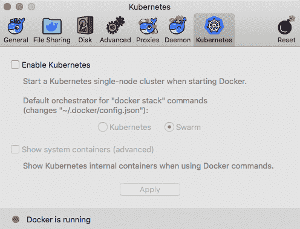
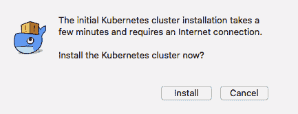
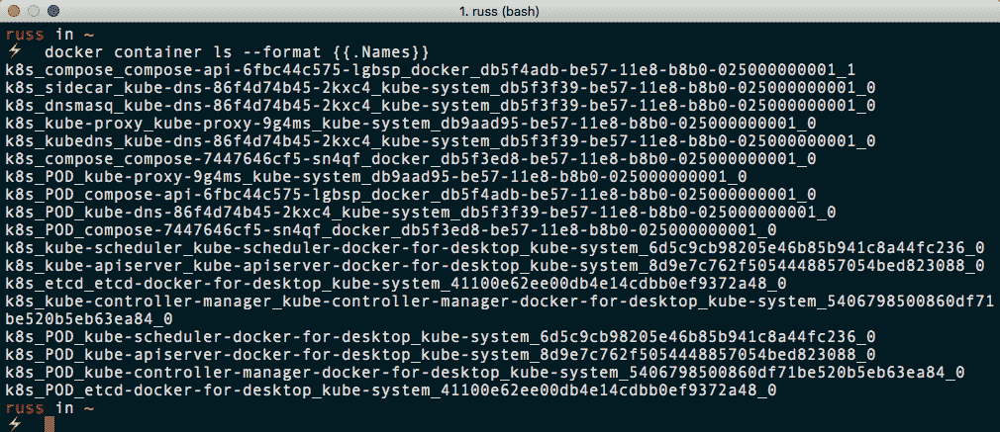
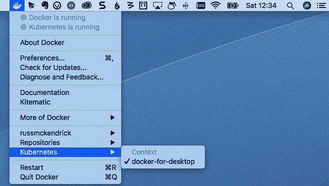
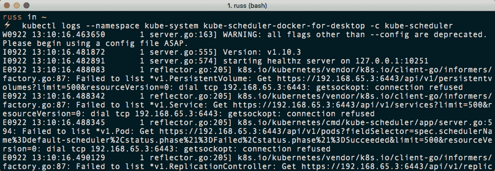
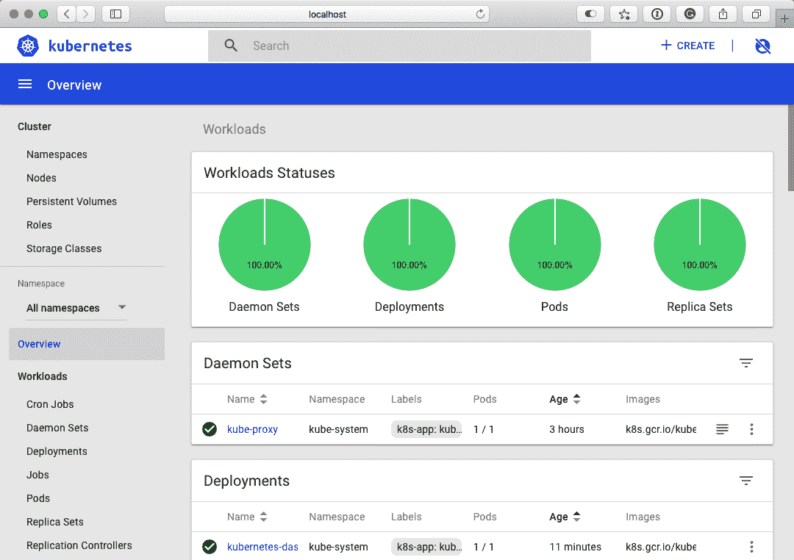
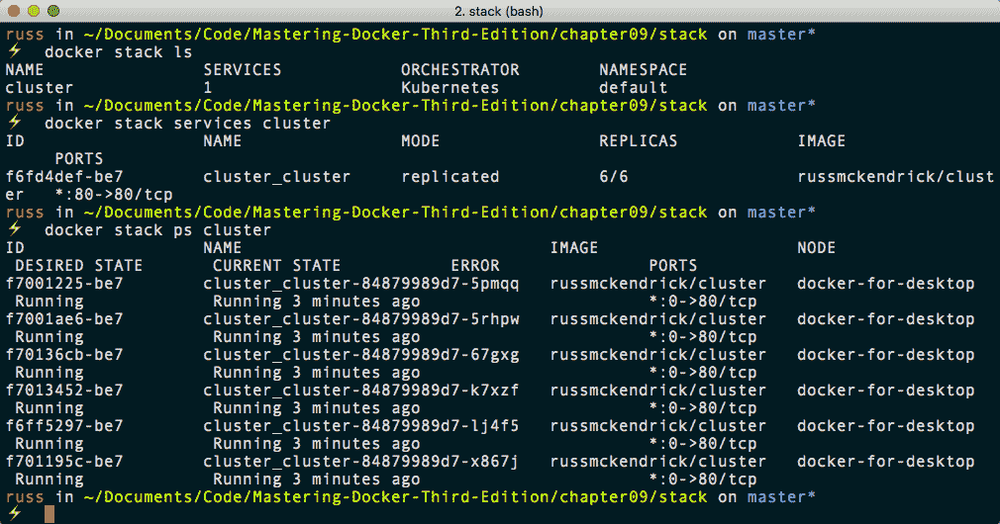
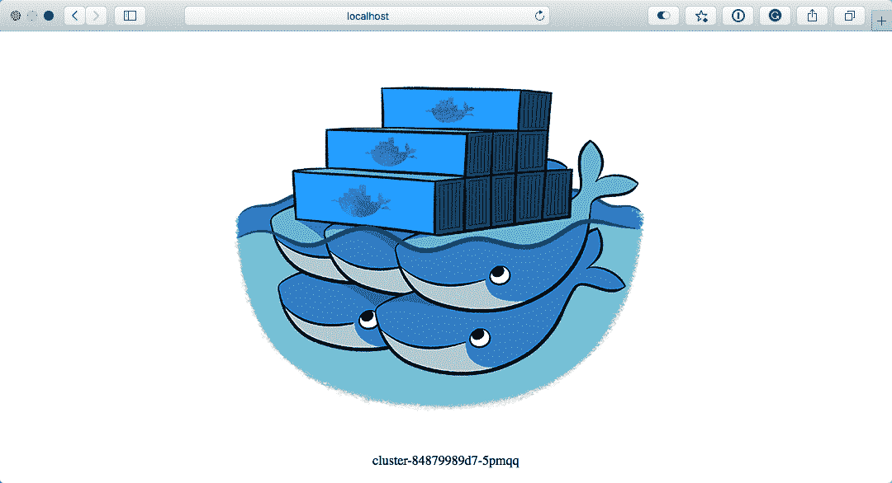

# Docker和库柏工人

在这一章中，我们将看一看 Kubernetes。像 Docker Swarm 一样，您可以使用 Kubernetes 来创建和管理运行基于容器的应用的集群。

本章将涵盖以下主题:

*   《Kubernetes的概论》
*   启用 Kubernetes
*   使用库比涅斯
*   库柏人和其他Docker工具

# 技术要求

Docker 中的 Kubernetes 仅受 Mac Docker 和 Windows 桌面客户端 Docker 的支持。和前几章一样，我将使用我喜欢的操作系统，也就是 macOS。和以前一样，一些支持命令可能只适用于 macOS，而且数量很少。

查看以下视频，了解《行动守则》:
[http://bit.ly/2q6xpwl](http://bit.ly/2q6xpwl)

# 《Kubernetes的概论》

如果您一直在考虑查看容器，那么您可能会在旅途中的某个时候遇到 Kubernetes，所以在我们在 Docker 桌面安装中启用它之前，让我们花点时间看看 Kubernetes 是从哪里来的。

**Kubernetes** (发音为 **koo-ber-net-eez** )源于希腊对舵手或船长的称呼。 **Kubernetes** (也称为 **K8s** )，一个起源于谷歌的开源项目，允许您自动部署、管理和扩展您的容器化应用。

# 谷歌容器简史

谷歌研究基于 Linux 容器的解决方案已经有相当长的时间了。它于 2006 年通过开发名为**控制组** ( **控制组**)的 Linux 内核特性迈出了第一步。这个特性在 2008 年 2.6.24 版本中被合并到 Linux 内核中。该功能允许您隔离资源，如中央处理器、内存、网络和磁盘输入/输出，或一个或多个进程。控制组仍然是 Linux 容器的核心要求，不仅 Docker 使用，其他容器工具也使用。

接下来，谷歌用一个名为 **lmctfy 的容器堆把脚趾伸进了容器水域，这个容器堆代表**让我为你装这个**。这是 T4 LXC T5 工具和图书馆收藏的替代品。这是他们自己内部工具的开源版本，他们用它来管理自己应用中的容器。**

谷歌下一次报道他们的容器使用情况是在 2014 年 5 月乔·贝达在 Gluecon 的一次演讲之后。在谈话中，贝达透露，谷歌内部几乎所有的东西都是基于容器的，他们每周推出大约 20 亿个容器。据称，这一数字不包括任何长时间运行的容器，这意味着容器只在短时间内有效。然而，经过一些快速的计算，这意味着谷歌平均每秒钟推出大约 3000 个容器！

在随后的谈话中，贝达提到谷歌正在使用一个调度程序，这样他们就不必每周手动管理 20 亿个容器，甚至不用担心它们在哪里推出，以及在较小程度上每个容器的可用性。

谷歌还发表了一篇名为《谷歌与博格的大规模集群管理》的论文。这篇文章不仅让谷歌之外的人知道了他们正在使用的调度程序的名字，博格，而且还详细介绍了他们在设计调度程序时所做的设计决策。

该报提到，除了他们的内部工具，谷歌还在运行面向客户的应用，如谷歌文档、谷歌邮件和谷歌搜索，这些应用在运行集群的容器中运行，由博格管理。

**博格人**是根据《T2》星际迷航:下一代电视节目中的外星种族博格人命名的。在电视节目中，博格人是一个控制论种族，他们的文明建立在一个被称为集体的蜂群思维之上。这不仅使他们能够分享同样的想法，而且通过一个子空间网络，确保集体的每个成员都从集体意识中得到指导和监督。我相信你会同意，博格比赛的特点与你希望你的容器集群运行的方式非常匹配。

博格在谷歌内部运行了几年，最终被一个更现代的名为 **Omega 的调度程序所取代。**正是在这个时候，谷歌宣布将把博格的一些核心功能作为一个新的开源项目进行复制。这个项目，内部称为**七**，由博格的几个核心贡献者参与。它的目标是创造一个更友好的博格版本，而不是与谷歌自己的内部程序和工作方式紧密相连。

**七个**，以*星际迷航:航海家*角色命名，九个中的七个，是一个脱离集体的博格人，最终将在第一次公开承诺时被命名为**Kubernetes**。

# Kubernetes斯概述

所以，现在我们知道了Kubernetes是如何形成的，我们可以更深入地了解Kubernetes是什么。该项目的大部分，准确地说是 88.5%是用 **Go** 编写的，这应该不足为奇，因为 Go 是一种编程语言，在 2011 年开源之前，它是在谷歌内部开发的。项目文件的其余部分由 Python 和 Shell 帮助脚本以及 HTML 文档组成。

典型的 Kubernetes 集群由承担主服务器或节点角色的服务器组成。您也可以运行同时承担这两种角色的独立安装。

主角色是魔法发生的地方，它是集群的大脑。它负责决定在何处启动吊舱，并负责监控集群本身以及集群内运行的吊舱的运行状况。看完这两个角色后，我们将讨论豆荚。

通常，部署到被赋予主机角色的主机的核心组件是:

*   `kube-apiserver`:这个组件公开了主要的 Kubernetes API。它是为水平扩展而设计的，这意味着您可以不断添加更多的实例，以使集群高度可用。
*   `etcd`:这是一个高度可用的一致键值存储。它用于存储集群的状态。
*   `kube-scheduler`:这个组件负责决定发射吊舱的位置。
*   `kube-controller-manager` **:** 该组件运行控制器。这些控制器在 Kubernetes 中有几个功能，例如监视节点、监视复制、管理端点以及生成服务帐户和令牌。
*   `cloud-controller-manager`:该组件承担各种控制器的管理，控制器与第三方云交互，启动和配置支持服务。

现在我们已经涵盖了管理组件，我们需要讨论它们管理的是什么。节点由以下组件组成:

*   `kubelet`:该代理运行在集群内的每个节点上，是管理人员与节点交互的手段。它还负责管理豆荚。
*   `kube-proxy`:该组件管理节点和吊舱的所有请求和流量的路由。
*   `container runtime`:这可能是 Docker RKT 或任何其他 OCI 兼容的运行时。

你可能已经注意到，到目前为止，我还没有怎么提到容器。这是因为 Kubernetes 实际上并不直接与您的容器交互；相反，它与一个吊舱通信。将 pod 视为一个完整的应用；有点像我们使用 Docker Compose 启动一个由多个容器组成的应用。

# 库柏人和Docker人

Kubernetes 最初被视为 Docker Swarm 的竞争技术，Docker 自己的集群技术。然而，在过去的几年里，Kubernetes 已经成为容器编排的事实标准。

所有主要的云提供商都提供 Kubernetes 即服务。我们有以下内容:

*   谷歌云:**谷歌库柏发动机** ( **GKE**
*   微软 Azure: **Azure Kubernetes 服务** ( **AKS** )
*   亚马逊网络服务:亚马逊**Kubernetes斯弹性容器服务** ( **EKS** )
*   IBM: IBM 云库服务
*   甲骨文云:Kubernetes的甲骨文容器引擎
*   digital ocean:digital ocean 上的立方结构

从表面上看，所有支持Kubernetes斯的主要玩家似乎都没那么重要。然而，考虑到我们现在知道了跨多个平台部署容器化应用的一致方式。传统上，这些平台是围墙花园，有非常不同的互动方式。

虽然 Docker 于 2017 年 10 月在 DockerCon Europe 发布的公告最初令人惊讶，但一旦尘埃落定，该公告就完全有意义了。为开发人员提供一个环境，让他们可以使用 Docker for Mac 和 Docker for Windows 在本地处理他们的应用，然后使用 Docker Enterprise Edition 部署和管理他们自己的 Kubernetes 集群，甚至使用前面提到的云服务之一，这与我们在[第 1 章](01.html) *、Docker 概述*中讨论的试图解决“在我的机器上工作”的问题相吻合。

现在让我们看看如何在 Docker 软件中启用支持，并坚持使用它。

# 启用 Kubernetes

Docker 使安装过程变得极其简单。要启用 Kubernetes 支持，您只需打开首选项并单击 Kubernetes 选项卡:



如您所见，有两个主要选项。勾选**启用 Kubernetes** 框，然后选择 **Kubernetes** 作为默认编排器。暂时不要打开**展示系统容器**；启用服务后，我们会更详细地了解这一点。点击**应用**会弹出如下信息:



点击**安装**按钮将下载在 Docker 安装中启用 Kubernetes 支持所需的容器:


如第一个对话框中所述，Docker 下载、配置和启动集群需要一段时间。完成后，您应该会看到 Kubernetes 旁边的绿点正在运行:


打开终端并运行以下命令:

```
$ docker container ls -a
```

这应该向你表明，没有什么不寻常的运行。运行以下命令:

```
$ docker image ls
```

这将向您显示与 Kubernetes 相关的映像列表:

*   `docker/kube-compose-controller`
*   `docker/kube-compose-api-server`
*   `k8s.gcr.io/kube-proxy-amd64`
*   `k8s.gcr.io/kube-scheduler-amd64`
*   `k8s.gcr.io/kube-apiserver-amd64`
*   `k8s.gcr.io/kube-controller-manager-amd64`
*   `k8s.gcr.io/etcd-amd64`
*   `k8s.gcr.io/k8s-dns-dnsmasq-nanny-amd64`
*   `k8s.gcr.io/k8s-dns-sidecar-amd64`
*   `k8s.gcr.io/k8s-dns-kube-dns-amd64`
*   `k8s.gcr.io/pause-amd64`

这些图片来源于 Docker 和官方的 Kubernetes 图片，这些图片可以从谷歌容器注册处获得。

正如您可能已经猜到的，勾选**显示系统容器(高级)**框，然后运行以下命令，将向您显示在本地 Docker 安装上启用 Kubernetes 服务的所有正在运行的容器的列表:

```
$ docker container ls -a
```

由于运行前面的命令时会有很多输出，下面的屏幕截图只显示了容器的名称。为此，我运行了以下命令:

```
$ docker container ls --format {{.Names}}
```

运行该命令给了我以下信息:



有 18 个运行的容器，这就是为什么你可以选择隐藏它们。如您所见，几乎涵盖了我们在上一节中讨论的所有组件以及一些附加组件，它们提供了与 Docker 的集成。我建议取消勾选**显示系统容器框**，因为我们不需要每次查看正在运行的容器时都看到 18 个容器的列表。

此时需要注意的另一件事是，Kubernetes 菜单项现在包含了内容。该菜单可用于在 Kubernetes 集群之间切换。由于目前只有一个集群处于活动状态，因此只列出了一个集群:



现在我们已经启动并运行了本地 Kubernetes 集群，我们可以开始使用它了。

# 使用库比涅斯

现在我们已经在 Docker 桌面安装上启动并运行了 Kubernetes 集群，我们可以开始与它交互了。首先，我们将查看安装在 Docker 桌面组件`kubectl`旁边的命令行。

如前所述，`kubectl`安装在旁边。以下命令将显示有关客户端及其所连接的群集的一些信息:

```
$ kubectl version
```


接下来，我们可以运行以下命令来查看`kubectl`是否可以看到我们的节点:

```
$ kubectl get nodes
```


现在我们已经让客户端与我们的节点进行交互，我们可以通过运行以下命令来查看默认情况下在 Kubernetes 中配置的`namespaces`:

```
$ kubectl get namespaces
```

然后我们可以使用以下命令查看命名空间内的`pods`:

```
$ kubectl get --namespace kube-system pods
```


Kubernetes 中的名称空间是隔离集群内资源的一种很好的方式。从终端输出可以看出，我们的集群中有四个名称空间。有`default`命名空间，通常是空的。主要的 Kubernetes 服务有两个名称空间:`docker`和`kube-system`。这些包含了组成我们集群的单元，最终的名称空间`kube-public`和默认的名称空间一样，是空的。

在推出我们自己的 pod 之前，让我们先快速了解一下如何与我们正在运行的 pod 进行交互，从如何找到更多关于 pod 的信息开始:

```
$ kubectl describe --namespace kube-system pods kube-scheduler-docker-for-desktop 
```

前面的命令将打印出`kube-scheduler-docker-for-desktop`吊舱的详细信息。您可能会注意到，我们必须使用`--namespace`标志来传递名称空间。如果我们没有，那么`kubectl`将默认为默认名称空间，其中没有名为`kube-scheduler-docker-for-desktop`的 pod 运行。

命令的完整输出如下所示:

```
Name: kube-scheduler-docker-for-desktop
Namespace: kube-system
Node: docker-for-desktop/192.168.65.3
Start Time: Sat, 22 Sep 2018 14:10:14 +0100
Labels: component=kube-scheduler
 tier=control-plane
Annotations: kubernetes.io/config.hash=6d5c9cb98205e46b85b941c8a44fc236
 kubernetes.io/config.mirror=6d5c9cb98205e46b85b941c8a44fc236
 kubernetes.io/config.seen=2018-09-22T11:07:47.025395325Z
 kubernetes.io/config.source=file
 scheduler.alpha.kubernetes.io/critical-pod=
Status: Running
IP: 192.168.65.3
Containers:
 kube-scheduler:
 Container ID: docker://7616b003b3c94ca6e7fd1bc3ec63f41fcb4b7ce845ef7a1fb8af1a2447e45859
 Image: k8s.gcr.io/kube-scheduler-amd64:v1.10.3
 Image ID: docker-pullable://k8s.gcr.io/kube-scheduler-amd64@sha256:4770e1f1eef2229138e45a2b813c927e971da9c40256a7e2321ccf825af56916
 Port: <none>
 Host Port: <none>
 Command:
 kube-scheduler
 --kubeconfig=/etc/kubernetes/scheduler.conf
 --address=127.0.0.1
 --leader-elect=true
 State: Running
 Started: Sat, 22 Sep 2018 14:10:16 +0100
 Ready: True
 Restart Count: 0
 Requests:
 cpu: 100m
 Liveness: http-get http://127.0.0.1:10251/healthz delay=15s timeout=15s period=10s #success=1 #failure=8
 Environment: <none>
 Mounts:
 /etc/kubernetes/scheduler.conf from kubeconfig (ro)
Conditions:
 Type Status
 Initialized True
 Ready True
 PodScheduled True
Volumes:
 kubeconfig:
 Type: HostPath (bare host directory volume)
 Path: /etc/kubernetes/scheduler.conf
 HostPathType: FileOrCreate
QoS Class: Burstable
Node-Selectors: <none>
Tolerations: :NoExecute
Events: <none>
```

如您所见，有很多关于 pod 的信息，包括容器列表；我们只有一个叫`kube-scheduler`的。我们可以看到容器标识、使用的映像、启动容器时使用的标志，以及 Kubernetes 调度程序用来启动和维护 pod 的数据。

现在我们知道了一个容器名，我们可以开始与它交互了。例如，运行以下命令将打印一个容器的日志:

```
$ kubectl logs --namespace kube-system kube-scheduler-docker-for-desktop -c kube-scheduler 
```



运行以下命令将获取容器中每个容器的`logs`:

```
$ kubectl logs --namespace kube-system kube-scheduler-docker-for-desktop
```

像 Docker 一样，您也可以在您的荚和容器上执行命令。例如，以下命令将运行`uname -a`命令:

Please ensure you add the space after the `--` in the following two commands. Failing to do so will result in errors.

```
$ kubectl exec --namespace kube-system kube-scheduler-docker-for-desktop -c kube-scheduler -- uname -a
$ kubectl exec --namespace kube-system kube-scheduler-docker-for-desktop -- uname -a
```

同样，我们可以选择在命名容器上运行命令，或者在 pod 内的所有容器上运行命令:


让我们通过安装和登录基于网络的仪表板来了解更多关于 Kubernetes 集群的信息。虽然默认情况下 Docker 不提供这个功能，但是使用 Kubernetes 项目提供的定义文件安装它很简单。我们只需要运行以下命令:

```
$ kubectl create -f https://raw.githubusercontent.com/kubernetes/dashboard/master/src/deploy/recommended/kubernetes-dashboard.yaml
```


创建服务和部署后，启动需要几分钟时间。您可以通过运行以下命令来检查状态:

```
$ kubectl get deployments --namespace kube-system
$ kubectl get services --namespace kube-system
```

一旦您的输出如下所示，您的仪表板就应该安装完毕并准备好了:


现在我们已经运行了仪表板，我们将找到访问它的方法。我们可以使用`kubectl`中内置的代理服务来做到这一点。只需运行以下命令来启动它:

```
$ kubectl proxy
```


这将启动代理并打开您的浏览器，转到`http://127.0.0.1:8001/version/`将向您显示关于您的集群的一些信息:


然而，这是我们想要看到的仪表板。可在`http://localhost:8001/api/v1/namespaces/kube-system/services/https:kubernetes-dashboard:/proxy/`进入。

当您第一次在浏览器中打开网址时，会出现一个登录屏幕。当我们通过代理访问仪表板时，我们只需按下**跳过**按钮:

****

登录后，您将能够看到集群上的大量信息:



现在我们已经启动并运行了我们的集群，我们现在可以看看启动几个示例应用。

# 库柏人和其他Docker工具

当我们启用 Kubernetes 时，我们选择 Kubernetes 作为 Docker 栈命令的默认编排器。在前一章中，Docker `stack`命令将在 Docker Swarm 中启动我们的 Docker Compose 文件。我们使用的 Docker 编写如下所示:

```
version: "3"
services:
 cluster:
 image: russmckendrick/cluster
 ports:
 - "80:80"
 deploy:
 replicas: 6
 restart_policy:
 condition: on-failure
 placement:
 constraints:
 - node.role == worker
```

在 Kubernetes 上启动应用之前，我们需要稍作调整并删除位置，这使得我们的文件看起来如下所示:

```
version: "3"
services:
 cluster:
 image: russmckendrick/cluster
 ports:
 - "80:80"
 deploy:
 replicas: 6
 restart_policy:
 condition: on-failure
```

文件编辑完成后，运行以下命令将启动`stack`:

```
$ docker stack deploy --compose-file=docker-compose.yml cluster
```


如您所见，Docker 会等到栈可用后再返回您的提示。我们还可以运行我们在 Docker Swarm 上启动栈时用来查看栈信息的命令:

```
$ docker stack ls
$ docker stack services cluster
$ docker stack ps cluster
```



我们也可以使用`kubectl`看到细节:

```
$ kubectl get deployments
$ kubectl get services
```


您可能已经注意到，这次我们不需要提供名称空间。这是因为我们的栈是在默认命名空间中启动的。此外，列出服务时，还会为集群栈列出集群 IP 和负载平衡器。查看负载均衡器，可以看到外部 IP 为`localhost`，端口为`80`。

在我们的浏览器中打开 [http://localhost/](http://localhost/) 显示应用:



如果您仍然打开仪表板，您可以浏览您的栈，甚至打开一个终端到一个容器:


您可以通过运行以下命令来删除`stack`:

```
$ docker stack rm cluster
```

最后一件事——你可能在想，太好了，我可以在 Kubernetes 集群的任何地方运行我的 Docker Compose 文件。严格来说这不是真的。如前所述，当我们第一次启用 Kubernetes 时，推出了一些仅 Docker 组件。这些是为了确保 Docker 尽可能紧密地集成在一起。但是，由于这些组件不会存在于非 Docker 管理的集群中，因此您将无法使用`docker stack`命令。

尽管如此，一切都没有失去。作为 Kubernetes 项目的一部分，提供了一个名为 **Kompose** 的工具，它可以获取一个 Docker Compose 文件，并将其动态转换为 Kubernetes 定义文件。

要在 macOS 上安装 Kompose，请运行以下命令:

```
$ curl -L https://github.com/kubernetes/kompose/releases/download/v1.16.0/kompose-darwin-amd64 -o /usr/local/bin/kompose
$ chmod +x /usr/local/bin/kompose
```

Windows 10 用户可以使用巧克力安装二进制文件:

**Chocolatey** is a command-line based package manager that can be used to install various software packages on your Windows-based machine, similar to how you can use `yum` or `apt-get` on Linux machines or `brew` on macOS.

```
$ choco install kubernetes-kompose
```

最后，Linux 用户可以运行以下命令:

```
$ curl -L https://github.com/kubernetes/kompose/releases/download/v1.16.0/kompose-linux-amd64 -o /usr/local/bin/kompose
$ chmod +x /usr/local/bin/kompose
```

安装后，您可以通过运行以下命令来启动 Docker 编写文件:

```
$ kompose up
```

您将获得如下输出:


正如输出所建议的，运行以下命令将为您提供关于我们刚刚启动的服务和 pod 的详细信息:

```
$ kubectl get deployment,svc,pods,pvc
```


您可以通过运行以下命令来删除服务和 pods:

```
$ kompose down
```


虽然您可以使用`kompose up`和`kompose down`，但我建议您生成 Kubernetes 定义文件，并根据需要进行调整。为此，只需运行以下命令:

```
$ kompose convert
```

这将生成 pod 和服务文件:


您将能够看到 Docker 编写文件和生成的两个文件之间的巨大差异。`cluster-pod.yaml`文件如下所示:

```
apiVersion: v1
kind: Pod
metadata:
 creationTimestamp: null
 labels:
 io.kompose.service: cluster
 name: cluster
spec:
 containers:
 - image: russmckendrick/cluster
 name: cluster
 ports:
 - containerPort: 80
 resources: {}
 restartPolicy: OnFailure
status: {}
```

`cluster-service.yaml`文件如下所示:

```
apiVersion: v1
kind: Service
metadata:
 annotations:
 kompose.cmd: kompose convert
 kompose.version: 1.16.0 (0c01309)
 creationTimestamp: null
 labels:
 io.kompose.service: cluster
 name: cluster
spec:
 ports:
 - name: "80"
 port: 80
 targetPort: 80
 selector:
 io.kompose.service: cluster
status:
 loadBalancer: {}
```

然后，您可以通过运行以下命令来启动这些文件:

```
$ kubectl create -f cluster-pod.yaml
$ kubectl create -f cluster-service.yaml
$ kubectl get deployment,svc,pods,pvc
```


要删除集群 pod 和服务，我们只需要运行以下命令:

```
$ kubectl delete service/cluster pod/cluster
```

虽然 Kubernetes 将在接下来的章节中出现，但您可能希望在 Docker 桌面安装中禁用 Kubernetes 集成，因为它在空闲时确实会增加一些开销。为此，只需取消勾选**启用 Kubernetes** 。当您单击**应用**时，Docker 将停止运行 Kubernetes 所需的所有容器；但是，它不会删除映像，因此当您重新启用它时，不会花费太长时间。

# 摘要

在本章中，我们从 Docker 桌面软件的角度来看 Kubernetes。Kubernetes 的内容比我们在本章中介绍的要多得多，所以请不要以为这就是全部。在讨论了 Kubernetes 的起源之后，我们看了如何使用 Mac 的 Docker 或 Windows 的 Docker 在本地机器上启用它。

然后，我们讨论了`kubectl`的一些基本用法，然后看看如何运行我们可以使用`docker stack`命令来启动我们的应用，就像我们对 Docker Swarm 所做的那样。

在这一章的最后，我们讨论了 Kompose，它是 Kubernetes 项目下的一个工具。它可以帮助您转换 Docker Compose 文件，以便与 Kubernetes 一起使用，让您在将应用迁移到纯 Kubernetes 上有一个好的开端。

在下一章中，我们将看一下公共云上的 Docker，例如亚马逊网络服务，并简要回顾一下 Kubernetes。

# 问题

*   对或错:当**显示系统容器(高级)**未锁定时，您无法看到用于启动 Kubernetes 的映像。
*   四个名称空间中的哪一个承载了用于运行 Kubernetes 并在 Docker 中启用支持的容器？
*   您会运行哪个命令来了解容器在 pod 中运行的详细信息？
*   您会使用哪个命令来启动 Kubernetes 定义 YAML 文件？
*   通常，命令`kubectl`代理在您的本地机器上打开哪个端口？
*   Google 容器编排平台的原名是什么？

# 进一步阅读

本章开头提到的一些谷歌工具、演示文稿和白皮书可以在以下网址找到:

*   小组:[http://man7.org/linux/man-pages/man7/cgroups.7.html](http://man7.org/linux/man-pages/man7/cgroups.7.html)
*   lmctfy:[https://github . com/Google/lmctfy/](https://github.com/google/lmctfy/)
*   Scale 上的容器，Joe Beda 的幻灯片来自 GluCon:[https://pdf . semanticscholar . org/presentation/4df 0/b2bcd 39 b 7757867 B1 EAD 3009 a 628 e 07 D8 b 57 . pdf](https://pdfs.semanticscholar.org/presentation/4df0/b2bcd39b7757867b1ead3009a628e07d8b57.pdf)
*   谷歌与博格的大规模集群管理:[https://ai.google/research/pubs/pub43438](https://ai.google/research/pubs/pub43438)
*   lxc-[https://linuxcontainer . org/](https://linuxcontainers.org/)

您可以在以下网址找到本章中提到的云服务的详细信息:

*   Google kubricks engine(gke):[https://cloud . Google . com/kubricks engine/](https://cloud.google.com/kubernetes-engine/)
*   蓝色立方服务(AK):[https://azure . Microsoft . com/en-GB/services/立方服务/](https://azure.microsoft.com/en-gb/services/kubernetes-service/)
*   Amazon 弹性容器服务(Amazon eks):[https://AWS . Amazon . com/eks/](https://aws.amazon.com/eks/)
*   IBM 云 Kubernetes 服务:[https://www.ibm.com/cloud/container-service](https://www.ibm.com/cloud/container-service)
*   Oracle container engine for Kuwait:https://cloud . Oracle . com/containers/kubricks engine
*   数码海洋上的立方:[https://www . digital ocean . com/products/ku brites/](https://www.digitalocean.com/products/kubernetes/)

您可以在以下网址找到 Docker 关于 Kubernetes 支持的公告:

*   Kubernetes for Docker Enterprise 公告:[https://blog . Docker . com/2017/10/Docker-Enterprise-edition-kubernetes/](https://blog.docker.com/2017/10/docker-enterprise-edition-kubernetes/)
*   Kubernetes 做稳定发布:[https://blog . docker . com/2018/07/kubernetes-is-now-in-docker-desktop-stable-channel/](https://blog.docker.com/2018/07/kubernetes-is-now-available-in-docker-desktop-stable-channel/)

最后，可在以下网址找到 Kompose 的主页:

*   komp ci-[http://komp ci . io/](http://kompose.io/)