# 在公共云中运行 Docker

到目前为止，我们一直在使用数字海洋在基于云的基础设施上推出容器。在本章中，我们将研究如何使用 Docker 提供的工具在亚马逊网络服务和微软 Azure 中启动 Docker Swarm 集群。然后我们将看看亚马逊网络服务、微软 Azure 和谷歌云提供的容器解决方案。

本章将涵盖以下主题:

*   Docker云
*   亚马逊 ECS 和 AWS Fargate
*   微软 Azure 应用服务
*   微软 Azure、谷歌云和亚马逊网络服务中的 Kubernetes

# 技术要求

在本章中，我们将使用各种云提供商，因此，如果您要跟进，您将需要每个提供商的活动帐户。同样，本章的截图将来自我的首选操作系统，macOS。如前所述，除非另有说明，否则我们将运行的命令应该可以在我们目前针对的所有三个操作系统上运行。

我们还将查看云提供商提供的一些命令行工具，以帮助管理他们的服务——不过，本章并不作为这些工具的详细操作指南，更多详细的使用指南将在本章的*进一步阅读*部分提供文档链接。

查看以下视频，了解《行动守则》:
[http://bit.ly/2Se544n](http://bit.ly/2Se544n)

# Docker云

在我们开始研究其他服务之前，我认为快速讨论 Docker Cloud 是很好的，因为仍然有很多对曾经由 Docker 提供的云管理服务的引用。

Docker 云由几个 Docker 服务组成。其中包括 SaaS 提供的构建和托管映像的服务，这是提供应用、节点和 Docker Swarm 集群管理的另一项服务。2018 年 5 月 21 日，所有提供远程节点管理的服务都关闭了。

Docker 建议使用此服务管理其节点的 Docker Cloud 用户应将这些工作负载迁移到 Docker **社区版** ( **CE** )或 Docker **企业版** ( **EE** )并迁移到自己硬件的云中。Docker 还推荐了 Azure 容器服务和谷歌 Kubernetes 引擎。

因此，出于这个原因，我们不会像在以前版本的*掌握 Docker* 中那样，在本章中讨论任何 Docker 托管的服务。

然而，考虑到我们已经讨论过的内容，下一部分可能会有点混乱。虽然 Docker 已经停止了所有托管云管理服务，但它仍然提供工具来帮助您管理两个主要公共云提供商中的 Docker Swarm 集群。

# 云上Docker

在本节中，我们将看看 Docker 提供的两种模板化云产品。它们都推出了 Docker Swarm 集群，这些集群与目标平台有着深度的集成，并且在构建时也考虑了 Docker 的最佳实践。让我们先看看亚马逊网络服务模板。

# AWS 的 Docker 社区版

面向 AWS 的 Docker 社区版(从现在开始，我们将称之为面向 AWS 的 Docker)是 Docker 创建的亚马逊云信息模板，旨在通过应用 Docker 最佳实践和建议，在 AWS 中轻松启动 Docker Swarm 模式集群。

**CloudFormation** is a service that's offered by Amazon that allows you to define how you would like your infrastructure to look in a template file that can then be shared or brought under version control.

我们需要做的第一件事——也是我们在为 AWS 启动 Docker 之前需要配置的唯一一件事——是确保我们在将要启动集群的地区为我们的帐户分配了 SSH 密钥。为此，请在[https://console.aws.amazon.com/](https://console.aws.amazon.com/)登录到 AWS 控制台，或者您所在组织的自定义登录页面(如果您使用的话)。登录后，进入页面左上角的服务菜单，找到 **EC2** 服务。

为了确保您在您想要的地区，您可以使用位于您的用户名和支持菜单之间右上角的地区切换器。进入右侧区域后，点击**键对**，在左侧菜单的**网络&安全**下可以找到。一旦进入**键对**页面，您应该会看到当前键对的列表。如果您没有列出或无法访问它们，您可以单击**创建密钥对**或**导入密钥对**，并按照屏幕提示进行操作。

AWS 的Docker可以在 https://store.docker.com/editions/community/docker-ce-aws 的Docker商店找到。AWS 有两种 Docker 选择:稳定版和边缘版。

Edge 版本包含 Docker 即将推出的版本的实验特性；正因为如此，我们将考虑为 AWS(稳定)推出 Docker。为此，只需点击按钮，您将直接进入 AWS 控制台中的云信息，Docker 模板已经加载。

您可以通过转到[https://editions-us-east-1 . S3 . Amazon AWS . com/AWS/stable/docker . tmpl](https://editions-us-east-1.s3.amazonaws.com/aws/stable/Docker.tmpl)查看原始模板，该模板目前由 3100 行代码组成，或者您可以在 CloudFormation designer 中可视化该模板。从下面的可视化中可以看出，启动集群有很多事情要做:


这种方法的好处是你不必担心这些复杂的事情。Docker 已经覆盖了您，并承担了所有担心如何将上述基础架构和服务从您身边推出的工作。

启动集群的第一步已经为您安排好了。您只需在**选择模板**页面点击**下一步**:

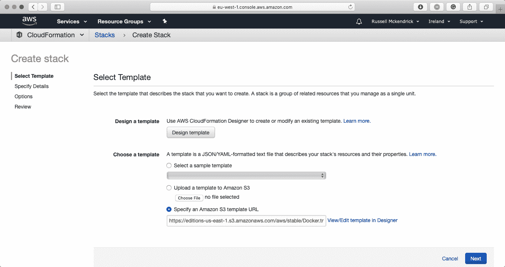

接下来，我们必须指定一些关于集群的细节。除了 SSH 密钥，我们将保留所有内容的默认值:

*   **栈名** : `Docker`
*   **蜂群管理器数量** : `3`
*   **群工作节点数** : `5`
*   **使用哪个 SSH 密钥**:(从列表中选择您的密钥)
*   **启用日常资源清理**:否
*   **使用 CloudWatch 进行容器日志记录**:是
*   **为云商店**创建 EFS 先决条件:否
*   **群管理器实例类型** : t2.micro
*   **管理器临时存储卷大小** : 20
*   **管理器临时存储卷类型**:标准
*   **代理工作者实例类型** : t2 .微
*   **工作人员临时存储卷大小** : 20
*   **工作人员临时存储卷类型**:标准
*   **启用 EBS I/O 优化？**否
*   **加密 EFS 对象？**假

一旦你检查完一切都是**确定**，点击**下一步**按钮。下一步，我们可以让一切保持原样，点击**下一步**按钮进入评论页面。在查看页面上，您应该会发现一个链接，其中提供了估计成本:


如您所见，我的集群的每月估计价格为 113.46 美元。

I have had varying success with the Estimate cost link—it may not appear each time you launch the template—if it doesn't and you have answered the questions as per the preceding list, then your costs will be similar to that of mine.

在启动集群之前，您需要做的最后一件事是勾选表示**的框，我承认 AWS 云信息可能会创建 IAM 资源**，然后单击**创建**按钮。可以想象，启动集群需要一段时间；您可以通过在 AWS 控制台中选择您的云信息栈并选择**事件**选项卡来检查启动状态:

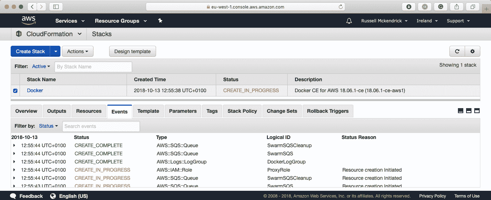

大约 15 分钟后，您应该会看到状态从 **CREATE_IN_PROGRESS** 变为 **CREATE_COMPLETE** 。当你看到这个，点击**输出**标签，你会看到一个网址和链接列表:

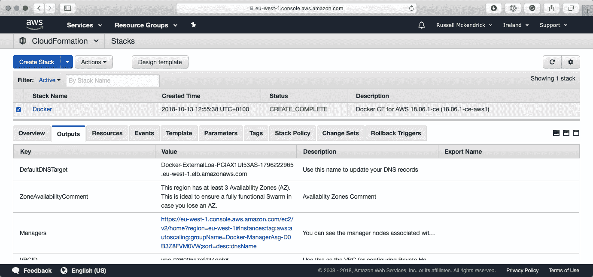

要登录到我们的 Swarm 集群，请单击 manager 旁边的链接，该链接将被带到 EC2 实例列表，这些实例是我们的 manager 节点。选择其中一个实例，然后记下它的公共 DNS 地址。在终端，SSH 到节点，使用 docker 作为用户名。例如，我运行了以下命令来登录并获取所有节点的列表:

```
$ ssh docker@ec2-34-245-167-38.eu-west-1.compute.amazonaws.com
$ docker node ls
```

If you downloaded your SSH key from the AWS Console when you added a key, you should update the preceding command to include the path to your download key, for example, `ssh -i /path/to/private.key docker@ec2-34-245-167-38.eu-west-1.compute.amazonaws.com`.

下面的屏幕截图显示了登录并获取所有节点列表的上述命令:

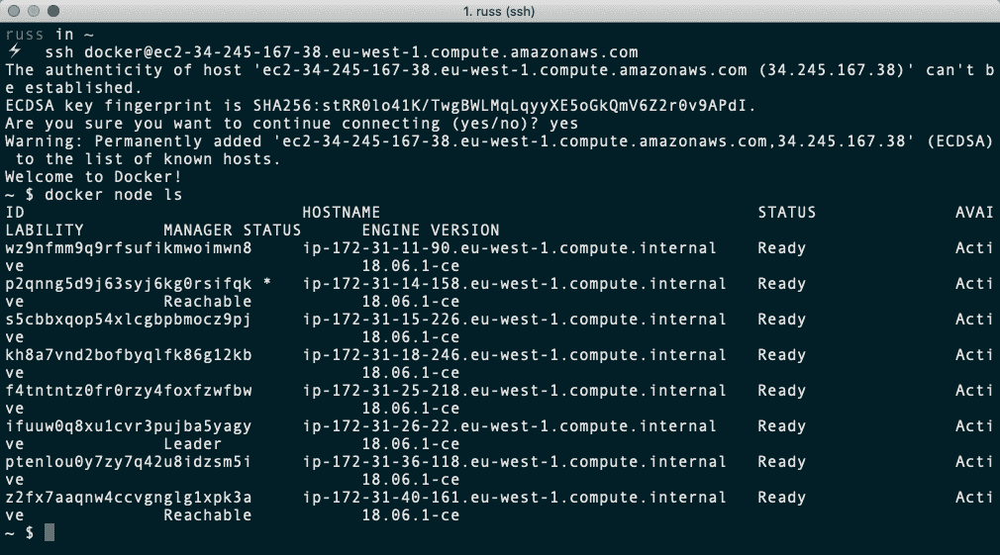

从这里，您可以像对待其他 Docker Swarm 集群一样对待它。例如，我们可以通过运行以下命令来启动和扩展集群服务:

```
$ docker service create --name cluster --constraint "node.role == worker" -p 80:80/tcp russmckendrick/cluster
$ docker service scale cluster=6
$ docker service ls
$ docker service inspect --pretty cluster
```

现在您的服务已经启动，您可以在云信息页面的**输出**选项卡中的**缺省缺省缺省缺省缺省缺省缺省缺省缺省缺省缺省缺省缺省缺省缺省缺省缺省缺省缺省缺省缺省缺省缺省缺省缺省缺省缺省缺省缺省缺省缺省。这是一个亚马逊弹性负载平衡器，我们所有的节点都位于它的后面。**

例如，我的**默认为**是`Docker-ExternalLoa-PCIAX1UI53AS-1796222965.eu-west-1.elb.amazonaws.com`。将它放入我的浏览器中，显示了集群应用:


完成集群后，返回 AWS 控制台中的云信息页面，选择您的栈，然后从**操作**下拉菜单中选择**删除栈**。这将从亚马逊网络服务集群中删除您的 Docker 的所有痕迹，并阻止您获得任何意外的费用。

Please make sure that you check that there have not been any problems with the deletion of the stack—if this process encounters any problems, any resources that have been left behind will be charged for.

# 蓝色Docker社区版

接下来，我们有 Azure 的 Docker 社区版，我将把它称为 Azure 的 Docker。这使用 **Azure 资源管理器** ( **ARM** )模板来定义我们的 Docker Swarm 集群。使用 ARMViz 工具，我们可以可视化集群的外观:


如您所见，它将启动虚拟机、连接了公共 IP 地址的负载平衡器和存储。在我们启动集群之前，我们需要找到一些关于我们的 Azure 帐户的信息:

*   广告服务原则标识
*   广告服务原则密钥

为了生成所需的信息，我们将使用一个在容器内部运行的助手脚本。要运行该脚本，您需要对有效的 Azure 订阅具有管理员访问权限。要运行脚本，只需运行以下命令:

```
$ docker run -ti docker4x/create-sp-azure sp-name
```

这会给你一个网址，[https://microsoft.com/devicelogin](https://microsoft.com/devicelogin)，还有一个要输入的代码。转到网址并输入代码:


这将使您在命令行上登录到您的帐户，并询问您想要使用哪个订阅。帮助器脚本的完整输出可以在下面的截图中找到:

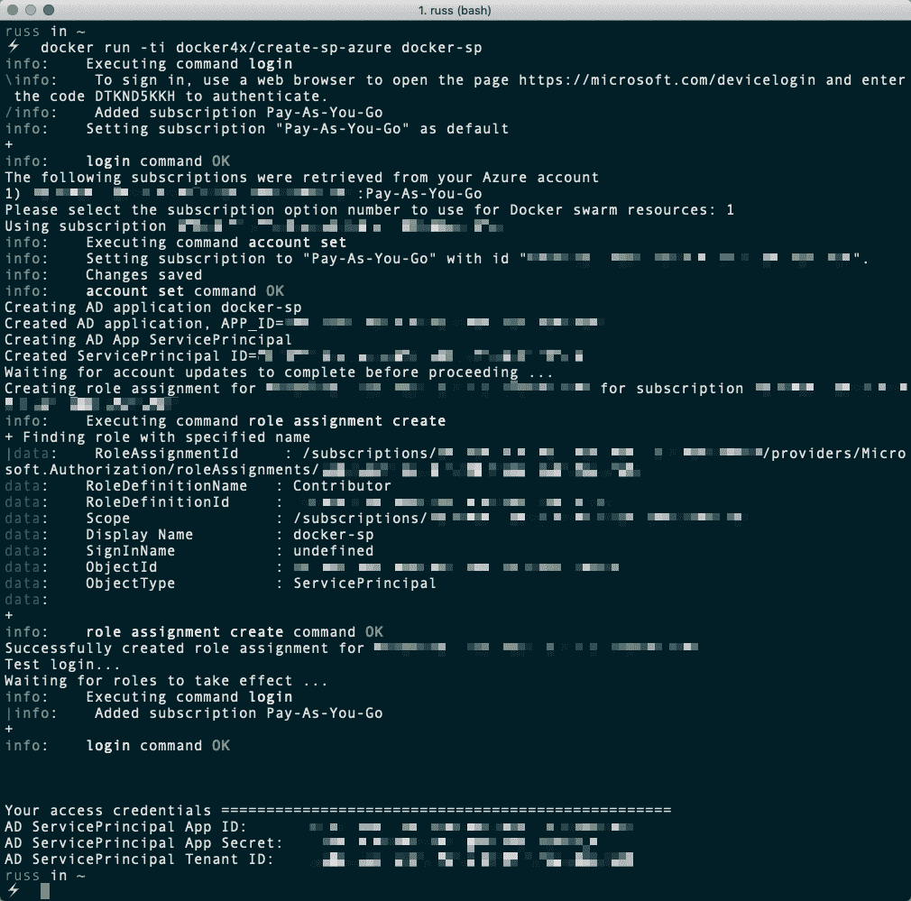

输出的最后是你需要的信息，所以请记下来。

At the time of writing this book, there is a known issue of using the **Docker for Azure (Stable)** button on the Docker Community Edition for Azure page in the Docker Store. For now, we need to use an older version of the template. You can do this by using the following link: [https://portal.azure.com/#create/Microsoft.Template/uri/https%3A%2F%2Fdownload.docker.com%2Fazure%2Fstable%2F18.03.0%2FDocker.tmpl](https://portal.azure.com/#create/Microsoft.Template/uri/https%3A%2F%2Fdownload.docker.com%2Fazure%2Fstable%2F18.03.0%2FDocker.tmpl).

这将打开 Azure 门户，并向您显示一个屏幕，您需要在其中输入几个信息:

*   **订阅**:从下拉列表中选择您想要使用的订阅
*   **资源组**:选择您想要使用的资源组或创建一个新的资源组
*   **位置**:选择您想要启动 Docker Swarm 集群的位置
*   **广告服务原理 App ID** :这是我们刚刚运行的助手脚本生成的
*   **广告服务原理 App 秘籍**:这是我们刚刚运行的助手脚本生成的
*   **启用扩展日志**:是
*   **启用系统清理**:否
*   **Linux SSH 公钥**:在这里输入本地 SSH 密钥的公共部分
*   **Linux 工作人员计数** : 2
*   **Linux 工作虚拟机大小**:标准 _D2_v2
*   **经理人数** : 1
*   **管理器虚拟机大小**:标准 _D2_v2
*   **Swarm 名称**:dock warm

同意条款和条件，然后点击页面底部的**购买**按钮。单击菜单顶部通知区域中的“正在部署”链接查看启动进度后，您应该会看到如下内容:

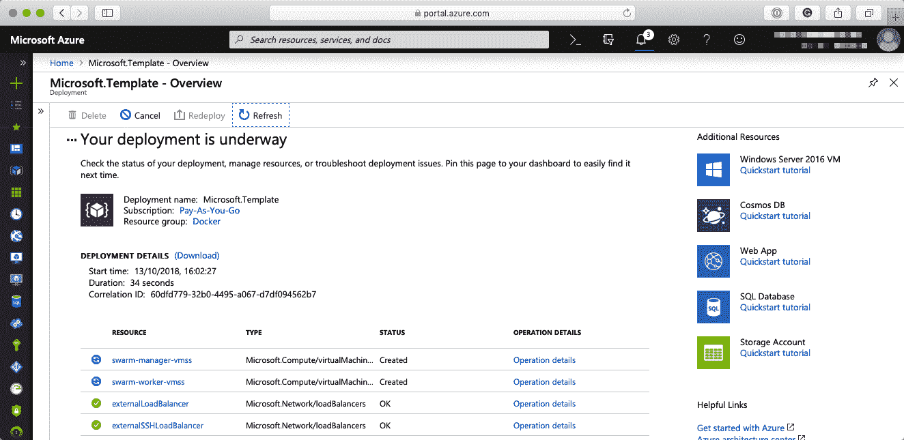

完成后，您将看到在您选择或创建的资源组下列出了几个服务。其中之一将是`dockerswarm-externalSSHLoadBalancer-public-ip`。深入到资源中，您将获得一个 IP 地址，您可以使用它将 SSH 连接到您的群管理器中。为此，请运行以下命令:

```
$ ssh docker@52.232.99.223 -p 50000
$ docker node ls
```

请注意，我们使用的是端口 5000，而不是标准端口 22。您应该会看到如下内容:


登录到管理器节点后，我们可以使用以下命令启动应用:

```
$ docker service create --name cluster --constraint "node.role == worker" -p 80:80/tcp russmckendrick/cluster
$ docker service scale cluster=6
$ docker service ls
$ docker service inspect --pretty cluster
```

一旦启动，转到`dockerswarm-externalLoadBalancer-public-ip`—这将显示应用。完成集群后，我建议删除资源组，而不是尝试删除单个资源:

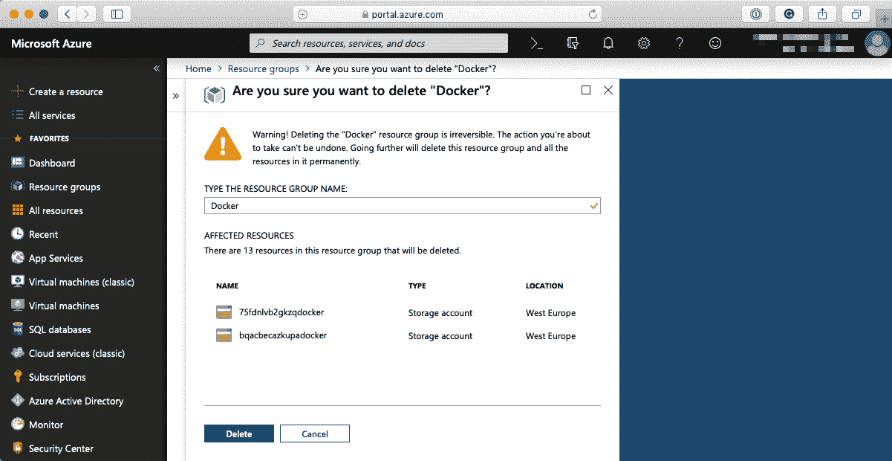

Remember, you will be charged for the resources while they are active, even if you are not using them.

就像亚马逊网络服务集群一样，请确保资源被完全移除，否则您可能会收到意想不到的账单。

# 云摘要的摘要器

正如您所看到的，通过使用 Docker 提供的模板，在 Azure 和亚马逊网络服务中启动 Swarm 集群是非常简单的。虽然这些模板很棒，但如果您刚开始使用，它们从 Docker 获得的支持很少。我建议，如果您正在寻找一种简单的方法来启动在公共云中运行生产工作负载的容器，您可以看看我们接下来将讨论的一些解决方案。

# 亚马逊 ECS 和 AWS Fargate

亚马逊网络服务提供了几种不同的容器解决方案。我们将在这一部分看到的是亚马逊**弹性容器服务** ( **ECS** )的一部分，被称为 AWS Fargate。

传统上，亚马逊 ECS 会启动 EC2 实例。一旦启动，Amazon ECS 代理将与容器运行时一起部署，这样您就可以使用 AWS 控制台和命令行工具来管理您的容器。AWS Fargate 消除了启动 EC2 实例的需要，允许您简单地启动容器，而不必担心管理集群或承担 EC2 实例的费用。

我们将稍微作弊，并通过**亚马逊 ECS 第一次运行过程。**您可以访问以下网址:[https://console.aws.amazon.com/ecs/home#/firstRun.](https://console.aws.amazon.com/ecs/home#/firstRun)这将带我们完成在法盖特集群中启动容器所需的四个步骤。

亚马逊 ECS 使用以下组件:

*   容器定义
*   任务内容
*   服务
*   串

启动我们的 AWS Fargate 托管容器的第一步是实际配置前两个组件，即容器和任务定义。

容器定义是定义容器基本配置的地方。可以将此想象为在命令行上添加使用 Docker 客户端启动容器时使用的标志，例如，命名容器、定义要使用的映像、设置网络等。

对于我们的示例，有三个预定义的选项和一个自定义选项。单击自定义选项中的配置按钮，并输入以下信息:

*   **容器名称**:T0
*   **映像** : `russmckendrick/cluster:latest`
*   **内存限制(MiB)** :保留默认值
*   **端口映射**:输入`80`并保持选择`tcp`

然后，点击**更新**按钮。对于任务定义，点击**编辑**按钮并输入以下内容:

*   **任务定义名称** : `cluster-task`
*   **网络模式**:应该是`awsvpc`；您不能更改此选项
*   **任务执行角色**:休假为`ecsTaskExecutionRole`
*   **兼容性**:这应该默认为 FARGATE，您不应该编辑它
*   **任务内存**和**任务中央处理器**:保留两者的默认选项

更新后，点击**保存**按钮。现在，您可以点击页面底部的“下一步”按钮。这将把我们带到第二步，也就是定义服务的地方。

服务运行任务，而任务又有一个与之关联的容器。默认服务没问题，点击**下一步**按钮进入启动流程的第三步。第一步是在哪里创建集群。同样，默认值也没问题，所以点击**下一步**按钮进入查看页面。

这是您在启动任何服务之前再次检查任务、服务和集群定义的最后机会。如果你对一切都满意，那么点击**创建**按钮。从这里，您将进入一个页面，您可以在其中查看构成我们的 AWS Fargate 集群的各种 AWS 服务的状态:

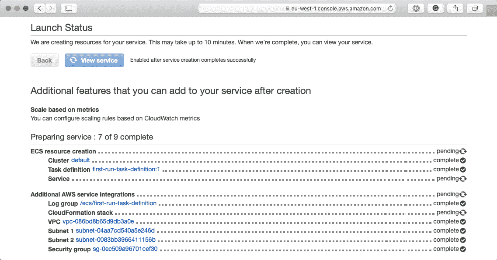

一旦一切从**待定**变为 **co** **完成**，您将能够点击**查看服务**按钮进入服务概述页面:

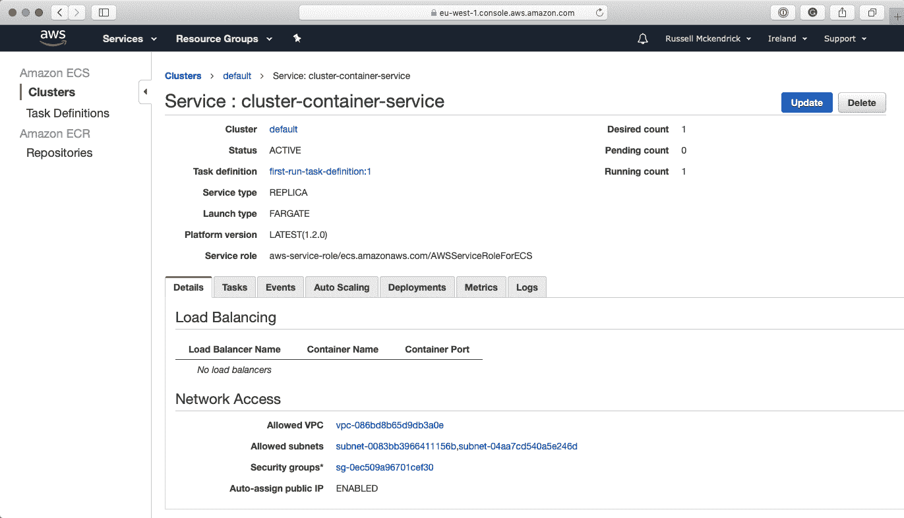

现在，我们只需要知道我们的容器的公共 IP 地址。要找到这个，点击**任务**选项卡，然后选择运行任务的唯一标识。在页面的网络部分，您应该能够找到任务的私有和公共 IP 地址。在浏览器中输入公共 IP 应该会显示现在熟悉的集群应用:


您会注意到显示的容器名称是容器的主机名，并且包括内部 IP 地址。您也可以通过单击日志选项卡来查看容器中的日志:

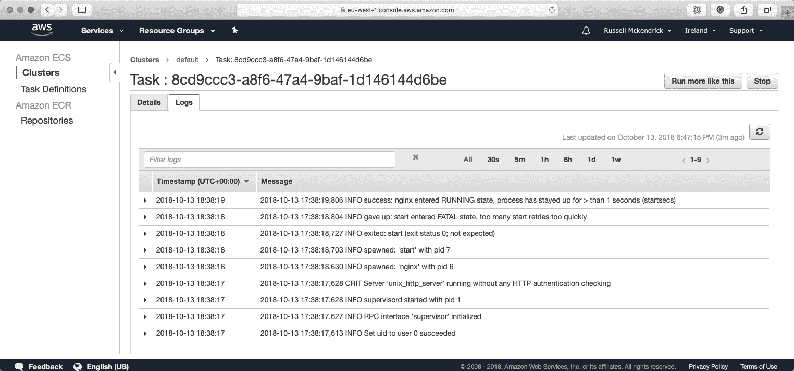

那么，这要花多少钱？能够运行一个月的容器大约需要 14 美元，也就是每小时 0.019 美元。

这种成本计算意味着，如果您要全天候运行大量任务，那么 Fargate 可能不是运行容器的最具成本效益的方式。相反，您可能希望使用亚马逊 ECS EC2 选项，在这里您可以将更多容器打包到您的资源中，或者使用亚马逊 EKS 服务，我们将在本章的后面部分讨论该服务。然而，对于快速启动一个容器然后终止它，Fargate 是很棒的——启动容器的障碍很小，支持资源的数量也很少。

完成 Fargate 容器后，应该删除集群。这将删除与群集关联的所有服务。一旦集群被移除，进入**任务定义**页面，并在需要时取消注册。

接下来，我们将看看 Azure 应用服务。

# 微软 Azure 应用服务

**微软 Azure App Services** 是一个完全托管的平台，允许您部署您的应用，并让 Azure 担心管理他们运行的平台。启动应用服务时，有几个选项可用。您可以运行用。. NET。NET Core、Ruby、Node.js、PHP、Python 和 Ruby，或者您可以直接从容器映像注册表启动映像。

在这个快速演练中，我们将从 Docker Hub 启动集群映像。为此，请登录位于[https://portal.azure.com/](https://portal.azure.com/)的 Azure 门户网站，并从左侧菜单中选择应用服务。

在加载页面，点击**+添加**按钮。您可以从这里选择几个选项:


我们将推出一个网络应用，所以点击该应用的磁贴。一旦图块展开，点击**创建**按钮。

在打开的页面上，有几个选项。请按如下方式填写:

*   **应用名称**:为应用选择一个唯一的名称。
*   **订阅**:选择有效的订阅。
*   **资源组**:保持创建新选项处于选中状态。
*   **OS** :留为 Linux。
*   **发布**:选择坞站映像。
*   **App Service 计划/位置**:默认选择最贵的计划，点击这里会进入一个页面，可以新建一个计划。为此，单击**新建**，命名您的计划并选择位置，然后最终选择定价层。根据我们的需要，**开发** / **测试**计划就可以了。选择后，点击**应用**。
*   **配置容器:**点击此处将进入容器选项。在这里，您有几个选项:单容器、Docker 编写或 Kubernetes。目前，我们将推出一个单一的容器。点击**Docker中心**选项，进入`russmckendrick/cluster:latest`。一旦输入，您将能够点击**应用**按钮。

填写完所有信息后，您可以点击**创建**启动网络应用服务。一旦启动，您应该能够通过 Azure 提供的网址访问该服务，例如，我的网址是`https://masteringdocker.azurewebsites.net/`。打开浏览器将显示集群应用:


如您所见，这一次，我们有了容器标识，而不是像在 AWS Fargate 上启动容器时那样的完整主机名。这种规格的容器将花费我们大约每小时 0.05 美元，或每月 36.50 美元。要移除容器，只需移除资源组。

# 微软 Azure、谷歌云和亚马逊网络服务中的 Kubernetes

我们要看的最后一件事是在三个主要的公共云中启动 Kubernetes 集群有多容易。在前一章中，我们使用 Docker Desktop 应用的内置功能在本地启动了 Kubernetes 集群。首先，我们将从微软 Azure 开始，看看在公共云上使用 Kubernetes 的最快方法。

# 蓝色Kubernetes服务

**Azure Kubernetes 服务** ( **AKS** )是一个启动和配置都极其简单的服务。我将在我的本地机器上使用 Azure 命令行工具；您还可以通过使用 Azure 门户中内置的 Azure Cloud Shell 来使用命令行工具。

我们需要做的第一件事是创建一个资源组来启动我们的 AKS 集群。要创建一个名为`MasteringDockerAKS`的，运行以下命令:

```
$ az group create --name MasteringDockerAKS --location eastus
```

现在我们有了资源组，我们可以通过运行以下命令来启动一个双节点 Kubernetes 集群:

```
$ az aks create --resource-group MasteringDockerAKS \
 --name MasteringDockerAKSCluster \
 --node-count 2 \
 --enable-addons monitoring \
 --generate-ssh-keys
```

启动群集需要几分钟时间。一旦启动，我们将需要复制配置，这样我们就可以使用我们本地的`kubectl`副本与集群进行交互。为此，请运行以下命令:

```
$ az aks get-credentials \
    --resource-group MasteringDockerAKS \
    --name MasteringDockerAKSCluster
```

这将配置你的本地副本`kubectl`与你刚刚启动的 AKS 集群对话。现在，您应该会看到集群列在 Kubernetes 下的 Docker 菜单中:

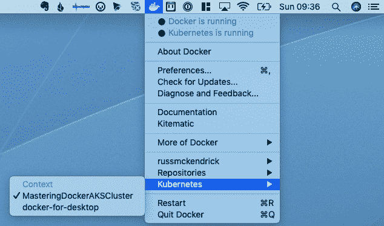

运行以下命令将向您显示您的`kubectl`客户端正在对话的服务器版本以及关于节点的详细信息:

```
$ kubectl version
$ kubectl get nodes
```

您可以在下面的屏幕截图中看到前面命令的输出:


现在我们已经启动并运行了集群，我们需要启动一些东西。幸运的是，Weave 有一个优秀的开源微服务演示，它推出了一个销售袜子的演示商店。要启动演示，我们只需要运行以下命令:

```
$ kubectl create namespace sock-shop
$ kubectl apply -n sock-shop -f "https://github.com/microservices-demo/microservices-demo/blob/master/deploy/kubernetes/complete-demo.yaml?raw=true"
```

演示启动大约需要五分钟。您可以通过运行以下命令来检查`pods`的状态:

```
$ kubectl -n sock-shop get pods
```

一旦一切正常运行，您应该会看到如下输出:


现在我们的应用已经启动，我们需要一种方法来访问它。通过运行以下命令检查服务:

```
$ kubectl -n sock-shop get services
```

这向我们展示了有一种服务叫做`front-end`。我们将创建一个负载平衡器并将其附加到此服务。为此，请运行以下命令:

```
$ kubectl -n sock-shop expose deployment front-end --type=LoadBalancer --name=front-end-lb
```

您可以通过运行以下命令来检查负载平衡器的状态:

```
$ kubectl -n sock-shop get services front-end-lb
$ kubectl -n sock-shop describe services front-end-lb
```

一旦启动，您应该会看到如下内容:


从前面的输出可以看出，对于我的商店，IP 地址是`104.211.63.146`，端口是`8079`。在浏览器中打开`http://104.211.63.146:8079/`后，我看到了以下页面:


单击完商店后，可以通过运行以下命令将其删除:

```
$ kubectl delete namespace sock-shop
```

要删除 AKS 群集和资源组，请运行以下命令:

```
$ az group delete --name MasteringDockerAKS --yes --no-wait
```

请记住检查所有内容是否已按预期从 Azure 门户中删除，以避免任何意外费用。最后，您可以通过运行以下命令从本地`kubectl`配置中删除该配置:

```
$ kubectl config delete-cluster MasteringDockerAKSCluster
$ kubectl config delete-context MasteringDockerAKSCluster
```

接下来，我们将考虑在谷歌云中推出一个类似的集群。

# 谷歌库比厄引擎

**谷歌 Kubernetes 引擎**，你可能已经猜到了，非常紧密地集成到了谷歌的云平台中。让我们直接进入并启动一个集群，而不是深入更多细节。我假设您已经有了一个谷歌云帐户，一个启用了计费的项目，最后安装并配置了谷歌云软件开发工具包来与您的项目交互。

要启动群集，只需运行以下命令:

```
$ gcloud container clusters create masteringdockergke --num-nodes=2
```

一旦集群启动，您的`kubectl`配置将自动更新，并将为新启动的集群设置上下文。您可以通过运行以下命令来查看节点信息:

```
$ kubectl version
$ kubectl get nodes
```


现在我们已经启动并运行了集群，让我们通过重复上次使用的命令来启动演示商店:

```
$ kubectl create namespace sock-shop
$ kubectl apply -n sock-shop -f "https://github.com/microservices-demo/microservices-demo/blob/master/deploy/kubernetes/complete-demo.yaml?raw=true"
$ kubectl -n sock-shop get pods
$ kubectl -n sock-shop get services
$ kubectl -n sock-shop expose deployment front-end --type=LoadBalancer --name=front-end-lb
$ kubectl -n sock-shop get services front-end-lb
```

同样，一旦创建了`front-end-lb`服务，您应该能够找到要使用的外部 IP 地址端口:


将这些输入浏览器将打开商店:


要删除群集，只需运行以下命令:

```
$ kubectl delete namespace sock-shop
$ gcloud container clusters delete masteringdockergke
```

这也将从`kubectl`中移除上下文和集群。

# 亚马逊弹性容器服务

我们要看的最后一项 Kubernetes 服务是针对 Kubernetes 的**亚马逊弹性容器服务**，简称**亚马逊 EKS** 。这是我们覆盖的三项服务中最近推出的服务。事实上，你可以说亚马逊参加 Kubernetes 派对很晚。

不幸的是，亚马逊的命令行工具不如我们在微软 Azure 和谷歌云上使用的工具友好。正因为如此，我将使用一个名为`eksctl`的工具，它是由 Weave 编写的，正是创建我们一直在使用的演示商店的人。您可以在本章末尾的*进一步阅读*部分找到关于`eksctl`和亚马逊命令行工具的详细信息。

要启动我们的亚马逊 EKS 集群，我们需要运行以下命令:

```
$ eksctl create cluster
```

启动集群需要几分钟时间，但在整个过程中，您会在命令行上收到反馈。此外，由于`eksctl`正在使用云信息，您也可以在 AWS 控制台中查看其进度。完成后，您应该会看到如下输出:


作为启动的一部分，`eksctl`将配置您的本地`kubectl`上下文，这意味着您可以运行以下内容:

```
$ kubectl version
$ kubectl get nodes
```


现在，我们已经启动并运行了集群，我们可以启动演示商店了，就像之前一样:

```
$ kubectl create namespace sock-shop
$ kubectl apply -n sock-shop -f "https://github.com/microservices-demo/microservices-demo/blob/master/deploy/kubernetes/complete-demo.yaml?raw=true"
$ kubectl -n sock-shop get pods
$ kubectl -n sock-shop get services
$ kubectl -n sock-shop expose deployment front-end --type=LoadBalancer --name=front-end-lb
$ kubectl -n sock-shop get services front-end-lb
```

您可能会注意到，运行最后一个命令时列出的外部 IP 看起来有些奇怪:


这是因为它是一个域名而不是一个 IP 地址。要查找完整的网址，您可以运行以下命令:

```
$ kubectl -n sock-shop describe services front-end-lb
```

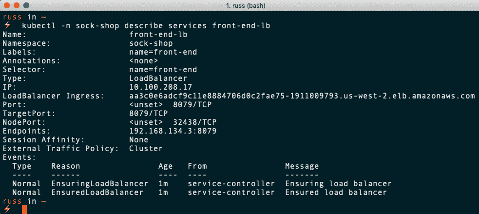

您可能已经猜到，输入网址并移植到浏览器中会显示演示商店:

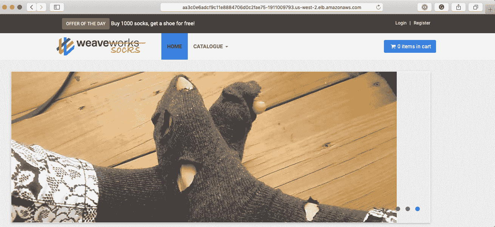

要删除群集，请运行以下命令:

```
$ kubectl delete namespace sock-shop
$ eksctl get cluster
```

这将返回正在运行的集群的名称。一旦获得名称，运行以下命令，确保引用您自己的集群:

```
$ eksctl delete cluster --name=beautiful-hideout-1539511992
```

您的终端输出应该如下所示:


# 立方结构摘要

我们对微软 Azure、谷歌云和亚马逊网络服务中的 Kubernetes 的简要介绍到此结束。我们在这里讨论了几个有趣的问题。首先，我们通过几个简单的步骤，使用命令行启动并管理了我们的集群，尽管我们不得不为亚马逊 EKS 使用第三方工具。

第二点也是最重要的一点是，一旦我们使用`kubectl`访问了集群，在所有三个平台上的体验都完全相同。在任何时候，我们都不必访问云提供商的基于网络的控制面板来调整或检查设置。一切都是用同样的命令完成的；部署相同的代码和服务时，我们没有考虑云提供商提供的任何单独服务。

我们甚至可以使用 Docker 在本地运行演示存储，使用完全相同的命令。只需启动 Kubernetes 集群，确保选择了本地 Docker 上下文，然后运行以下命令:

```
$ kubectl create namespace sock-shop
$ kubectl apply -n sock-shop -f "https://github.com/microservices-demo/microservices-demo/blob/master/deploy/kubernetes/complete-demo.yaml?raw=true"
$ kubectl -n sock-shop get pods
$ kubectl -n sock-shop get services
$ kubectl -n sock-shop expose deployment front-end --type=LoadBalancer --name=front-end-lb
$ kubectl -n sock-shop get services front-end-lb
```

从下面的输出可以看出，*负载均衡*的 IP，在本例中是`localhost`。打开浏览器进入`http://localhost:8079`会带你去商店:


您可以通过运行以下命令来删除该存储:

```
$ kubectl delete namespace sock-shop
```

如果没有大量的工作和配置，或者通过基于订阅的闭源服务，这种跨多个提供商甚至本地机器的一致性水平以前是无法实现的。

# 摘要

在本章中，我们已经了解了如何使用 Docker 自己提供的工具将 Docker Swarm 集群部署到云提供商中。我们还研究了公共云提供的两种服务，以从核心 Docker 工具集中运行容器。

最后，我们研究了在各种云中启动 Kubernetes 集群，并在所有云中运行相同的演示应用。从我们运行的任何命令中可以清楚地看到，所有三个公共云都使用不同版本的 Docker 作为容器引擎。虽然这可能会在你读到这篇文章时发生变化，但从理论上讲，它们可能会切换到另一个引擎，影响很小。

在下一章中，我们将回到 Docker 工作上来，看看 Portainer，一个用于管理 Docker 安装的基于 web 的界面。

# 问题

1.  对或错:AWS 的 Docker 和 Azure 的 Docker 会启动 Kubernetes 集群，供您启动容器。
2.  如果使用亚马逊 Fargate，有哪些亚马逊服务是你不用直接管理的？
3.  我们需要在 Azure 中启动什么类型的应用？
4.  一旦启动，我们需要运行什么命令来为袜子商店创建命名空间？
5.  如何找到负载平衡器的全部细节？

# 进一步阅读

您可以在以下链接中找到 Docker 云服务关闭的详细信息:

*   Docker 云迁移通知和常见问题解答:[https://success.docker.com/article/cloud-migration](https://success.docker.com/article/cloud-migration)
*   卡住了！Docker 云关机！:[https://blog.cloud66.com/stuck-docker-cloud-shutdown/](https://blog.cloud66.com/stuck-docker-cloud-shutdown/)

有关 Docker for AWS 和 Docker for Azure 使用的模板服务的更多详细信息，可在以下链接中找到:

*   AWS 云组:[https://AWS . Amazon . com/cloudtraining/](https://aws.amazon.com/cloudformation/)
*   天青 ARM 模板:[https://azure.microsoft.com/en-gb/resources/templates/](https://docs.microsoft.com/en-gb/azure/azure-resource-manager/resource-group-overview)
*   ARM 模板可视化工具:[http://armviz.io/](http://armviz.io/)

我们用来启动容器的云服务可以在以下链接中找到:

*   亚马逊 ECS:[https://aws.amazon.com/ecs/](https://aws.amazon.com/ecs/)
*   AWS fargate:[https://AWS . Amazon . com/fargate/](https://aws.amazon.com/fargate/)
*   蔚蓝网络应用:[https://azure.microsoft.com/en-gb/services/app-service/web/](https://azure.microsoft.com/en-gb/services/app-service/web/)

这三项 Kubernetes 服务可以在以下链接中找到:

*   屡教不改的服务:[https://azure . Microsoft . com/en-GB/services/kublets-service/](https://azure.microsoft.com/en-gb/services/kubernetes-service/)
*   谷歌 Kubernetes 引擎:[https://cloud.google.com/kubernetes-engine/](https://cloud.google.com/kubernetes-engine/)
*   亚马逊 Kubernetes 弹性容器服务:[https://aws.amazon.com/eks/](https://aws.amazon.com/eks/)

本章中使用的各种命令行工具的快速入门可在以下链接中找到:

*   蔚蓝色:https://docs.microsoft.com/en-us/cli/azure/?view = azure-CLI-最新
*   谷歌云 SDK:[https://cloud.google.com/sdk/](https://cloud.google.com/sdk/)
*   AWS 命令行界面:[https://aws.amazon.com/cli/](https://aws.amazon.com/cli/)
*   eksctl-适用于 Amazon EKS 的 CLI:[https://eksctl . io/](https://eksctl.io/)

最后，有关演示商店的更多详细信息，请访问以下链接:

*   Sock 商店:https://micro services-demo . github . io