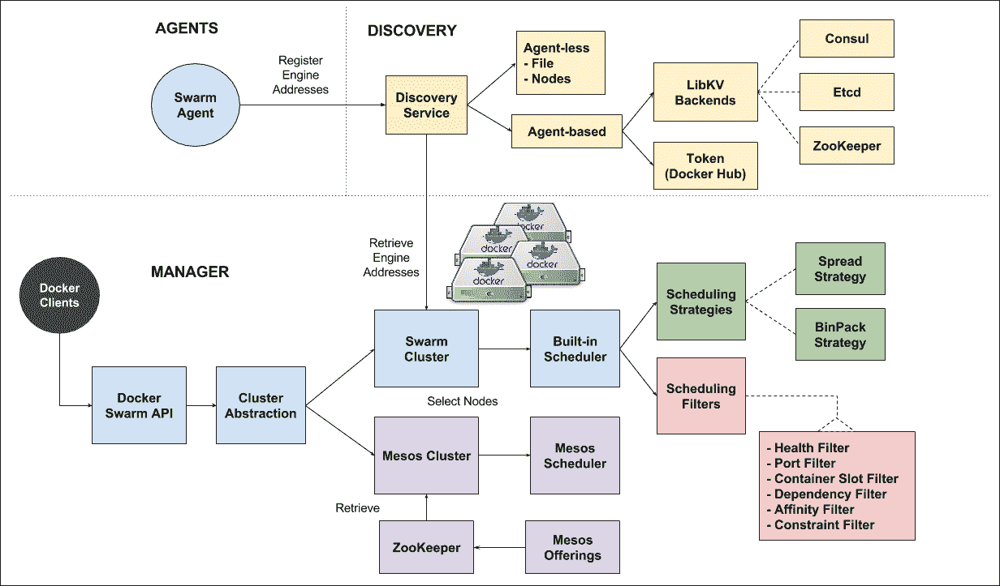
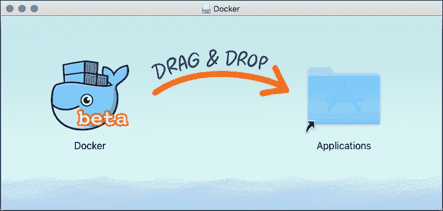
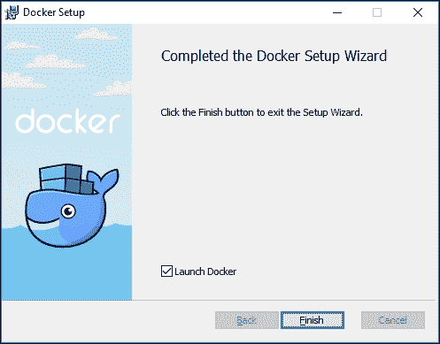

# 一、欢迎来到 DockerSwarm

众所周知，Docker 是当今最具吸引力的开源技术之一。原因很容易理解，Docker 让所有人都可以使用容器技术，并且它附带了一个可拆卸的内置电池，受到充满活力的社区的祝福。

在早期，用户在被这个易于使用的工具迷住后开始使用 Docker，这使他们能够解决许多挑战:拉、打包、隔离，并使应用几乎没有负担地跨系统移植。


*简化的 Docker 生态系统*

你可能会注意到这里有一群鲸鱼在和其他鲸鱼嬉戏。然而，自从容器出现以来，人们一直在寻找工具来高效地编排大量容器。Docker 团队通过在 2015 年发布 Docker Swarm(以下简称 Swarm，Docker 生态系统的一部分)以及 Docker Machine 和 Docker Compose 解决了这一需求。上图显示了简化的 Docker 生态系统，它由 Docker Machine 提供一台新的 Docker 就绪机器组成，然后一组机器将组成一个 Docker Swarm 集群。稍后，我们将能够使用 Docker Compose 向集群部署容器，就像它是一个普通的 Docker 引擎一样。

2014 年初，作为一个名为*束*的通信协议项目，Docker 开始计划在本地制作一个集群管理系统。后来，它被实现为一个守护进程，用 Docker API 控制异构分布式系统。该项目已被重命名为`libswarm`，`Swarmd`是它的守护进程。保持允许任何 Docker 客户端连接到 Docker Engines 池的相同概念，项目的第三代被重新设计为使用相同的 Docker 远程 API 集，并于 2014 年 11 月更名为“Swarm”。基本上，Swarm 最重要的部分是它的远程 APIs 维护人员努力工作，以保持他们与 Docker Engine 的每个版本 100%兼容。我们将第一代 Swarm 称为“Swarm v1”。

2016 年 2 月，核心团队发现集中式服务的扩展限制后，Swarm 再次内部重新设计为`swarm.v2`。这一次，考虑了分散的集群设计。2016 年 6 月，toolkit 作为任何规模的分布式服务的编排工具包发布。Docker 宣布，在 2016 年 DockerCon 上，SwarmKit 被合并到 Docker Engine 中。我们将这个版本的 Swarm 称为“Swarm v2”或“Swarm 模式”。

正如我们将在后面看到的，这三个火枪手(Docker Swarm、Docker Machine 和 Docker Compose)在一起时运行得最好，它们彼此无缝地交织在一起，以至于几乎不可能将它们视为单件。

然而，尽管这台机器和 Compose 的目标很直接，也很容易使用和理解，Swarm 是一个工具，它本身确实值得一本书。

使用 Docker Machine，您可以在多个云平台上调配虚拟机和物理机，以及裸机来运行 Docker 容器。使用 Docker Compose，您可以通过用 YAML 简单而强大的语法描述行为来定义 Docker 文件，并通过“组合”这些文件来启动应用。Swarm 是一个强大的聚类工具，需要进行更深入的研究。

在本章中，我们将了解以下主题:

*   什么是容器编排
*   Docker Swarm 基础和架构
*   与其他开源编排器的区别
*   “旧”Swarm，v1
*   “新”群体，群体模式

# 聚类工具和容器管理器

集群工具是一种软件，允许操作员与单个端点对话，并命令和编排一组资源，在我们的例子中是容器。不是在集群上手动分配工作负载(容器)，而是使用集群工具来自动化这个任务和许多其他任务。正是聚类工具将决定*在哪里*启动作业(容器)*如何*存储它们，*何时*最终重新启动它们，等等。操作员只需配置一些行为，决定集群拓扑和大小，调整设置，以及启用或禁用高级功能。Docker Swarm 是容器聚类工具的一个例子。

除了集群工具，还有容器管理器平台可供选择。它们不提供容器托管，但与一个或多个现有系统交互；这类软件通常提供良好的 web 界面、监控工具和其他可视化或更高级别的功能。容器管理器平台的例子有 Rancher 或 Tutum(2015 年被 Docker Inc .收购)。

# 群体目标

Docker 本身将 Swarm 描述为:

> *Docker Swarm 是 Docker 的原生聚类。它将一个 Docker 主机池转变为一个虚拟的 Docker 主机。*

Swarm 是一个工具，它给你一种错觉，让你可以管理一个由多个 Docker 主机组成的单个巨大的 Docker 主机，就像它们是一个主机一样，只有一个命令入口点。它允许您使用常规的 docker 工具，使用 Docker 本机或 python-docker 客户端，甚至使用 Docker 远程 API，在这些主机上编排和操作一定数量的容器。

这就是生产环境中最小的 Swarm 集群的样子:


# 为什么使用 Swarm

对容器使用集群解决方案有很多原因。随着应用的增长，您将面临新的强制性要求，例如可扩展性、可管理性和高可用性。

有很多可用的工具；选择 Docker Swarm 给了我们一些立竿见影的优势:

*   **原生集群** : Swarm 是 Docker 中的原生，由 Docker 团队和社区制作。它的最初创建者是 Andrea Luzzardi 和 Victor Vieux，他们是 Docker 引擎远程 API 本身的早期实现者。Swarm 集成了机器、合成和生态系统中的其他工具，没有额外的要求。
*   **生产等级** : Swarm v1 于 2015 年 11 月宣布成熟，准备投入生产使用。该团队已经证明了 Swarm 可以扩展到控制多达 1000 个节点的引擎。Swarm v2 允许形成具有数千个节点的集群，因为它使用分散的发现。
*   **开箱即用** : Swarm 不需要你重新设计你的应用来适应另一个编排工具。您可以在不做任何更改的情况下使用 Docker 映像和配置，并进行大规模部署。
*   **易于设置和使用** : Swarm 易于操作。自 Docker 1.12 以来，只需向 Machine 命令添加一些标志或使用 Docker 命令，就可以实现有效的部署。发现服务被集成到 Swarm Mode 中，使其快速安装:不需要设置外部 Consul、Etcd 或 Zookeeper 集群。
*   **活跃社区** : Swarm 是一个充满活力的项目，社区非常活跃，正在大力开发中。
*   **在 Hub** 上可用:你不需要安装 Swarm，它作为 Docker 镜像(Swarm v1)准备好了，所以你只需要从 Hub 中拉出并运行它，或者集成到 Docker Engine 中。而群模式已经集成到 Docker 1.12+中。仅此而已。

# 真实世界用例示例

Docker Swarm 是几个项目的选择，例如:

*   Rackspace Carina 构建在 Docker Swarm 之上:Rackspace 提供托管容器环境，内部基于 Docker Swarm
*   Zenly 正在谷歌云平台和裸机服务器上使用 Swarm
*   ADP 使用 Docker 和 Swarm 为其遗留部署提供速度
*   集群可以使用亚马逊 AWS 和微软 Azure 模板直接部署在其公共云上

## 宠物对牛模型

在创建和利用基础设施时，有两种相反的方法:宠物和牛。

在*宠物*模型中，管理员部署服务器或虚拟机，或者，在我们的例子中，部署容器并处理它们。她或他登录，安装软件，配置软件，并确保一切正常。因此，这是她或他的宠物。

相比之下，管理员并不真正关心他的基础设施组件的命运，当他们认为它们是*牛*的时候。她或他不会登录到每个单元或手动处理它，而是使用批量方法，部署、配置和管理都是通过自动化工具完成的。如果一个服务器或容器死了，它会自动复活，或者生成另一个来替换失效的。结果，操作员正在处理牛。

在本书中，我们将使用第一章中的宠物模型向读者介绍一些基本概念。但是我们以后会遵循牛的模式，那时将是做严肃事情的时候。

# 群体特征

Swarm 的主要目的已经确定，但是它是如何实现目标的呢？以下是它的主要特点:

*   Swarm v1 支持 1.6.0 或更高版本的 Docker Engine。自 1.12 版本以来，Swarm v2 已经内置于 Docker 引擎中。
*   Swarm 每个版本的 API 都将与同一个版本系列上的 Docker APIs 兼容。向后一个版本保持 API 兼容性。
*   在 Swarm v1 中，使用领导库为多个 Swarm 主机实现了领导选举机制(仅在部署带有发现服务的 Swarm 时受支持，如 Etcd、Consul 或 Zookeeper)。
*   在 Swarm v2 中，已经使用分散机制构建了领导者选举。Swarm v2 不再需要一组专用的发现服务，因为它集成了 Etcd，一种 Raft 共识算法的实现(参见[第 2 章](02.html "Chapter 2. Discover the Discovery Services")、*发现发现服务*)。
*   在 Swarm v1 术语中，领导者 Swarm 主节点称为主节点，其他节点称为副本节点。在 Swarm v2 中，有一个主节点和工作节点的概念。而引导节点由集群使用 Raft 自动管理。
*   基本和高级计划选项。调度器是一种算法，它决定容器必须物理放置在哪些主机上。Swarm 附带了一组内置的调度程序。
*   让操作员对调度做出决策的约束和密切关系；例如，人们希望保持数据库容器在地理位置上靠近，并建议调度程序这样做。约束和亲缘关系使用 Docker Swarm 标签。
*   在 Swarm v2 中，集群内负载平衡是通过内置的 DNS 循环来实现的，而它通过路由网状机制来支持外部负载平衡，该机制是通过 IPVS 实现的。
*   高可用性和故障转移机制意味着您可以创建一个具有多个主机的 Swarm 所以如果他们倒下了，会有其他主人准备好控制。默认情况下，当我们形成至少 3 个节点的集群时，Swarm v2 是可用的。所有节点都可以是主节点。另外，Swarm v2 包含健康指标信息。

# 类似项目

我们有不止一个 Docker Swarm 来聚集容器。为了完整起见，在完全进入 Swarm 之前，我们将简要回顾一下最广为人知的开源替代方案。

## 立方结构

**Kubernetes**([http://Kubernetes . io](http://kubernetes.io))又名 **k8s** ，目标与 Docker Swarm 相同；它是一个容器集群管理器。最初在谷歌实验室作为 Borg 项目启动，后来开源并于 2015 年作为稳定版本发布，支持**谷歌云平台**、 **CoreOS** 、 **Azure** 、**vs sphere**。

到目前为止，Kubernetes 在 Docker 中运行容器，Docker 是由一个名为 Kubelet 的服务通过 API 命令的，kube let 是一个注册和管理 Pods 的服务。在架构上，Kubernetes 从逻辑上来说，不是将集群划分为裸容器，而是划分为 Pods。Pod 是最小的可部署单元，在物理上是由一个或多个容器组成的应用的表示，这些容器通常是并置的，共享存储和网络等资源(用户可以使用 Compose 在 Docker 中模拟 Pod，并从 Docker 1.12 开始创建 Docker **DABs** ( **分布式应用捆绑包**)。

Kubernetes 包括一些预期的基本集群功能，如标签、健康检查器、Pods 注册表、可配置的调度程序，以及大使或负载平衡器等服务。

实际上，Kubernetes 用户利用 Kubernetes 客户端与 Kubernetes 主节点接口，后者是集群控制单元，命令 Kubernetes 节点做一些工作，称为奴才。奴才运行 Pods，所有东西都被 Etcd 粘在一起。

在一个 Kubernetes 节点上，你会发现一个正在运行的 Docker Engine，它运行一个 kube-api 容器，以及一个名为`kubelet.service`的系统服务。

有许多 kubectl 命令非常直观，例如

*   `kubectl cluster-info`、`kubectl get pods`和`kubectl get nodes`检索有关集群及其运行状况的信息
*   `kubectl create -f cassandra.yaml`和任何衍生的 Pod 命令，用于创建、管理和销毁 Pod
*   `kubectl scale rc cassandra --replicas=2`扩展 Pods 和应用
*   `kubectl label pods cassandra env=prod`配置 Pod 标签

这只是 Kubernetes 的高级全景。Kubernetes 和 Docker Swarm 之间的主要区别是:

*   Swarm 有一个更简单易懂的架构。Kubernetes 需要更多的专注，只是为了把握它的基本面。但是学习总是好的！
*   再来说说架构:Kubernetes 基于 Pods，Swarm 基于容器，DABs。
*   你需要安装 Kubernetes。通过在 GCE 上部署，使用 CoreOS，或者在 OpenStack 之上，您必须处理好它。您必须部署和配置一个 Kubernetes 集群，这需要一些额外的努力。Swarm 集成到 Docker 中，不需要额外的安装。
*   Kubernetes 有一个复制控制器的附加概念，这是一种确保某些模板描述的所有 Pods 在给定时间运行的技术。
*   Kubernetes 和 Swarm 都使用 Etcd。但在 Kubernetes 中，它被视为外部设施服务，而在 Swarm 中，它被集成并在管理器节点上运行。

Kubernetes 和 Swarm 之间的性能比较可能采取圣战的形式，我们想减去这种做法。有一些基准显示 Swarm 启动容器的速度，还有一些基准显示 Kubernetes 运行其工作负载的速度。我们认为，必须始终取得基准结果。也就是说，Kubernetes 和 Swarm 都适合运行大型、快速和可扩展的容器集群。

## 韩国舰队

**舰队**([https://github.com/coreos/fleet](https://github.com/coreos/fleet))是容器乐队的另一个可能选择。它来自 CoreOS 容器产品家族(包括 CoreOS、Rocket 和 Fronf)，与 Swarm、Kubernetes 和 Mesos 的基本不同之处在于它是作为系统的扩展而构建的。机群通过调度器在集群节点间分配资源和任务。因此，它的目标不仅仅是提供一个纯容器集群化，而是成为一个分布式的更通用的精化系统。例如，在 Fleet 的顶部运行 Kubernetes 是可能的。

机群由负责调度作业、其他管理操作的引擎和运行在每台主机上的代理组成，这些代理物理执行分配给它们的作业，并不断向引擎报告状态。Etcd 是一种发现服务，可以让一切都粘在一起。

您可以通过舰队集群的主命令`fleetctl`与列表、启动和停止容器和服务选项进行交互。

综上所述，舰队不同于 DockerSwarm:

*   它是分配任务的更高层次的抽象，而不仅仅是一个容器编排器。
*   可以把 Fleet 看作是集群的分布式初始化系统。Systemd 代表一台主机，Fleet 代表一组主机。
*   Fleet 专门将一堆 CoreOS 节点聚集在一起
*   您可以在 Fleet 之上运行 Kubernetes，以利用 Fleet 的弹性和高可用性功能
*   没有已知的稳定和健壮的方法来自动集成 Fleet 和 Swarm v1。
*   目前，fleet 没有被测试为运行具有超过 100 个节点和 1000 个容器的集群([https://github . com/coreos/Fleet/blob/master/Documentation/Fleet-scaling . MD](https://github.com/coreos/fleet/blob/master/Documentation/fleet-scaling.md))，而我们能够运行具有 2300 个节点和更高的 4500 个节点的 Fleet。

## 阿帕奇月

无论您是否可以将 Fleet 视为集群的分布式初始化系统，您都可以将 Mesos([https://mesos.apache.org/](https://mesos.apache.org/))视为一个*分布式内核*。使用 Mesos，您可以将所有节点资源当作一个资源来使用，并且在本书的范围内，在它们上面运行容器集群。

Mesos 最初于 2009 年在伯克利大学启动，是一个成熟的项目，已经成功用于生产，例如通过推特。

它甚至比 Fleet 更通用，是多平台的(您可以在 Linux、OS X 或 Windows 节点上运行它)，并且能够运行异构作业。除了纯大数据作业(Hadoop 或 Spark)和其他作业(包括持续集成、实时处理、网络应用、数据存储等)之外，您通常可以在 Mesos 上运行容器集群。

一个 Mesos 集群由一个主、从和框架组成。如您所料，主服务器在从服务器上分配资源和任务，负责系统通信并运行发现服务(ZooKeeper)。但是什么是框架呢？框架就是应用。一个框架由一个调度器和一个执行器组成，第一个分配任务，第二个执行任务。

出于我们的兴趣，容器通常通过一个名为 Marathon([https://meso sphere . github . io/Marathon/docs/native-docker . html](https://mesosphere.github.io/marathon/docs/native-docker.html))的框架在 Mesos 上运行。

Mesos 和 Docker Swarm 之间的比较在这里没有意义，因为它们可能非常互补地运行，也就是说 Docker Swarm v1 可以在 Mesos 上运行，Swarm 源代码的一部分只是专门用于此。相反，Swarm Mode 和 SwarmKit 非常类似于 Mesos，因为它们将任务中的作业抽象出来，并将其分组到服务中，以在集群上分配负载。我们将在[第 3 章](03.html "Chapter 3. Meeting Docker Swarm Mode")、*会议 DockerSwarm 模式*中讨论更好的群工具包特性。

## Kubernetes 对舰队对介子

Kubernetes、Fleet 和 Mesos 试图解决类似的问题；它们为您的资源提供了一个抽象层，并允许您连接到集群管理器。然后你可以启动工作和任务，你选择的项目会把它整理出来。这种差异可以从提供的现成功能以及您可以在多大程度上定制资源和作业的分配和扩展精度中看出。三者中，Kubernetes 更自动化，Mesos 更可定制，所以从某个角度来看，功能强大(当然，如果你需要所有这些功能的话)。

Kubernetes 和 Fleet 抽象并默认了许多需要为 Mesos 配置的细节，例如调度器。在 Mesos 上，你可以使用马拉松或 Chronos 调度程序，甚至可以自己编写。如果你不要求、不想甚至不能深入挖掘这些技术细节，你可以选择 Kubernetes 斯或舰队。这取决于您的实际和/或预测工作量。

## 群体对抗所有人

那么，你应该采用什么解决方案呢？像往常一样，你有一个问题，开源足够慷慨，可以提供许多技术，这些技术经常可以相互交叉，帮助你成功地达到一个目标。问题是如何以及选择什么来解决你的问题。Kubernetes、Fleet 和 Mesos 都是强大而有趣的项目，Docker Swarm 也是如此。

假设理解这四个人是多么自动和简单，Swarm 就是赢家。这并不总是一个优势，但在本书中，我们将展示 Docker Swarm 如何帮助您让真实的事情发挥作用，请记住，在 DockerCon 主题演讲之一中，Docker 的首席技术官兼创始人所罗门·海克斯(Solomon Hykes)建议 *Swarm 将是一个层，可以为许多编排和调度框架*提供一个公共接口。

# Swarm v1 架构

本节讨论 Docker Swarm 的概述体系结构。Swarm 的内部结构如图 3 所示。



*Docker Swarm v1 的内部结构*

从**管理器**部分开始，您将在图的左侧看到一个标有 *Docker Swarm API* 的块。如前所述，Swarm 公开了一组类似于 Docker 的远程 API，允许您使用任何 Docker 客户端连接到 Swarm。然而，Swarm API 与标准的 Docker 远程 API 略有不同，因为 Swarm API 也包含与集群相关的信息。例如，对 Docker Engine 运行`docker info`会给你单个 Engine 的信息，但是当我们对 Swarm 集群调用`docker info`时，我们也会得到集群中节点的数量以及每个节点的信息和健康状况。

Docker Swarm API 旁边的块是*集群抽象*。它是一个抽象层，允许不同类型的集群实现为 Swarm 的后端，并共享同一套 Docker 远程 API。目前我们有两个集群后端，内置的 Swarm 集群实现和 Mesos 集群实现。 *Swarm Cluster* 和*内置调度器*块代表内置 Swarm Cluster 实现，而 *Mesos Cluster* 表示的块是 Mesos 集群实现。

Swarm 后端的*内置调度器*带有多个*调度策略*。两个策略是*扩散*和 *BinPack* ，后面章节会解释。如果你熟悉 Swarm，你会注意到这里缺少了 Random 策略。随机策略被排除在解释之外，因为它仅用于测试目的。

除了调度策略，Swarm 还使用了一组*调度过滤器*来帮助筛选出未满足条件的节点。目前过滤器有六种，分别是*健康*、*端口*、*容器槽*、*依赖*、*亲和*、*约束*。当一个人按照这个顺序调度新创建的容器时，它们被应用于过滤器。

在**代理**部分，有 Swarm 代理试图将它们的引擎地址注册到发现服务中。

最后，集中的部分 **DISCOVERY** 是在 AGENTS 和 MANAGER 之间协调引擎的地址。基于代理的发现服务目前使用 LibKV，它将发现功能委托给您的键值存储选择、咨询、Etcd 或 ZooKeeper。相比之下，我们也可以只使用 Docker Swarm 管理器，而不使用任何键值存储。这种模式称为无代理发现*、*，它们是文件和节点(在命令行上指定地址)。

我们将在本章后面使用无代理模型来创建一个最小的本地 Swarm 集群。我们将在[第 2 章](02.html "Chapter 2. Discover the Discovery Services")、*中遇到其他发现服务，在[第 3 章](03.html "Chapter 3. Meeting Docker Swarm Mode")、*中遇到发现服务*和群模式架构*。

## 术语

在继续其他部分之前，我们回顾一些与 Docker 相关的术语，以回忆 Docker 概念并介绍 Swarm 关键字。

*   Docker 引擎是一个运行在主机上的 Docker 守护程序。有时在书中我们会称它为引擎。我们通常通过系统或其他启动服务调用`docker daemon`来启动发动机。
*   **Docker Compose** 是一个在 YAML 描述多容器服务必须如何架构的工具。
*   **Docker 栈**是创建多容器应用(由 Compose 描述)而不是单个容器的映像的二进制结果。
*   一个 **Docker 守护程序**是一个可以与 Docker 引擎互换的术语。
*   一个 **Docker 客户端**是打包在同一个 Docker 可执行文件中的客户端程序。例如，当我们做`docker run`时，我们使用的是 Docker 客户端。
*   **Docker 网络**是一个软件定义的网络，它将同一网络中的一组容器链接在一起。默认情况下，我们将使用 Docker Engine 附带的 libnetwork([https://github.com/docker/libnetwork](https://github.com/docker/libnetwork))实现。但是您可以选择使用插件部署您选择的第三方网络驱动程序。
*   **Docker Machine** 是一个用来创建能够运行名为**Machine***的 Docker 引擎的主机的工具。*
*   Swarm v1 中的 **Swarm 节点是一台预装 Docker 引擎的机器，旁边运行着 Swarm 代理程序。群节点将自己注册到发现服务中。**
*   Swarm v1 中的 **Swarm master 是一台运行 Swarm 管理程序的机器。群主机从其发现服务中读取群节点的地址。**
*   一个**发现服务**是一个由 Docker 提供的基于令牌的服务或者一个自托管的服务。对于自我托管的应用，您可以运行 HashiCorp Consul、CoreOS Etcd 或 Apache ZooKeeper 作为键值存储来充当发现服务。
*   **领袖选举**是群主做的一个寻找主节点的机制。其他主节点将处于副本角色，直到主节点关闭，然后领导者选举过程将再次开始。正如我们将看到的，Swarm masters 的数量应该是一个奇数。
*   **SwarmKit** 是 Docker 为了抽象编排而发布的新套件。理论上，它应该能够运行任何类型的服务*，但在实践中，到目前为止，它只编排容器和容器组。*
**   **Swarm 模式**是自 Docker 1.12 以来推出的新 Swarm，它将 SwarmKit 集成到 Docker 引擎中。*   **Swarm Master(处于 Swarm 模式)**是管理集群的节点:它调度服务，保持集群配置(节点、角色和标签)，并确保有一个集群领导者。*   **Swarm Worker(在 Swarm 模式下)**是运行任务的节点，例如，托管容器。*   **服务**是工作负载的抽象。例如，我们可以将一个服务“nginx”复制 10 次，这意味着您将有 10 个任务(10 个 nginx 容器)分布在集群上，并由 Swarm 本身进行负载平衡*   **任务**是蜂群的工作单位。任务是一个容器。*

 *# 开始使用 Swarm

我们现在将继续安装两个小型 Swarm v1 和 v2 概念验证集群，第一个在本地，第二个在数字海洋。为了执行食谱，检查配料清单，确保你拥有一切，然后开始。

要遵循该示例，您需要:

*   要么是 Windows、Mac OS X，要么是 Linux 桌面
*   一个 Bash 或 Bash 兼容的外壳。在 Windows 上，您可以使用 Cygwin 或 Git Bash。
*   为本地示例安装的 VirtualBox 的最新版本
*   至少 4GB 内存，用于 4 个 VirtualBox 实例，每个实例 1G 内存，用于本地示例
*   Docker 客户端，至少 1.6.0 版适用于 Swarm v1，1.12 版适用于 Swarm v2
*   Docker Machine 的最新版本，目前是 0.8.1

## MAC 的 Docker

Docker 在 2016 年初宣布了 Mac 版 Docker 和 Windows 版 Docker 的桌面版。它比 Docker 工具箱更好，因为它包含了您期望的 Docker CLI 工具，但不再使用 boot2docker 和 VirtualBox(它使用 unikernels 代替，我们将在[第 11 章](11.html "Chapter 11. What is next?")、*下一步是什么？*)并且它完全集成到操作系统中(支持 Hyper-V 的 Mac OS X Sierra 或 Windows 10)。

可以从[https://www . Docker . com/products/overview #/install _ the _ platform](https://www.docker.com/products/overview#/install_the_platform)下载 Docker 桌面，轻松安装。



如果你正在使用苹果操作系统 x，只需将 Docker 测试版图标拖放到你的应用文件夹中。输入你的测试版注册码，如果有的话，就完成了。


在 OS X，系统托盘中会有 Docker whale，您可以打开它并配置您的设置。Docker 主机将在您的桌面上本地运行。


## 窗户 Docker

在窗口 Docker 的情况下，它需要启用 Hyper-V 的 Windows 10。基本上，Hyper-V 附带 Windows 10 专业版或更高版本。双击安装程序后，您将看到第一个屏幕，显示许可协议，看起来类似于下面的截图。安装程序将要求您提供一个与 Mac 的 Docker 相似的密钥。


如果安装过程顺利，您将看到完成屏幕已准备好，可以启动窗口 Docker，如图所示:



在启动时，Docker 会将自己初始化为 Hyper-V。一旦这个过程完成，您就可以打开 PowerShell 并开始使用 Docker。


如果出现问题，您可以从托盘图标的菜单中打开日志窗口，并使用 Hyper-V 管理器进行检查。


## 准备好使用 Linux

我们将在本书中广泛使用机器，所以请确保您已经通过 Docker for Mac 或 Windows 或 Docker 工具箱安装了它。如果你在桌面上使用 Linux，用你的软件包系统(apt 或 rpm)安装 Docker 客户端。您还必须下载裸机二进制文件，只需卷曲它并为它分配执行权限；遵循[https://docs.docker.com/machine/install-machine/](https://docs.docker.com/machine/install-machine/)的指示。目前稳定的版本是 0.8.1。

```
$ curl -L 
https://github.com/docker/machine/releases/download/v0.8.1/docker-
machine-uname -s-uname -m > /usr/local/bin/docker-machine
$ chmod +x /usr/local/bin/docker-machine`

```

## 检查 Docker 机器是否可用-所有系统

您可以通过命令行中的以下命令来检查机器是否可以使用:

```
$ docker-machine --version
docker-machine version 0.8.1, build 41b3b25

```

如果您有问题，请控制系统路径或为您的架构下载正确的二进制文件。

# 蜂群，昨天

对于第一个例子，我们将在本地运行 Swarm v1 集群的最简单的配置，以了解“旧”Swarm 是如何工作的(并且仍然工作)。这个微小的集群将具有以下特征:

*   它由四个 1CPU 节点组成，每个节点 1GB 内存，由四个 CPU 和 4GB 内存组成
*   每个节点都将在 VirtualBox 上运行
*   每个节点都在本地 VirtualBox 网络上相互连接
*   不涉及发现服务:将使用静态`nodes://`机制
*   没有配置安全性，换句话说，TLS 被禁用

我们的集群看起来类似于下图。四个发动机将通过网状端口`3376`相互连接。事实上，除了 Docker 引擎之外，它们中的每一个都将运行 Docker 容器，在主机上公开端口`3376` (Swarm)，并将其重定向到自身。我们，操作员，将能够通过将环境变量`DOCKER_HOST`设置为`IP:3376`来连接到(任何)主机。如果你一步一步地遵循这个例子，一切都会变得更加清晰。


首先，我们必须用 Docker Machine 创建四个 Docker 主机。Docker Machine 通过一个命令自动执行这些步骤，而不是手动创建一个 Linux 虚拟机，生成和上传证书，通过 SSH 登录到它，以及安装和配置 Docker 守护程序。

机器将执行以下步骤:

1.  从 boot2docker 映像启动 VirtualBox 虚拟机。
2.  在 VirtualBox 内部网络上为虚拟机分配一个 IP。
3.  上传和配置证书和密钥。
4.  在此虚拟机上安装 Docker 守护程序。
5.  配置 Docker 守护程序并将其公开，以便可以远程访问。

因此，我们将有一个运行 Docker 的虚拟机，并准备好被访问以运行容器。

## boot 2 时钟

**bootwocker**采用 Tiny Core Linux 构建，是一个轻量级的发行版，专门为运行 Docker 容器而设计。它完全在内存上运行，启动时间非常快，从启动到控制台大约需要五秒钟。启动引擎时，Boot2Docker 默认在安全端口 2376 启动 Docker 引擎。

Boot2Docker 绝不适合生产工作负载。它仅用于开发和测试目的。我们将从使用 boot2docker 开始，然后在后面的章节中继续进行生产。在撰写本文时，Boot2Docker 支持 Docker 1.12.3，使用 Linux 内核 4.4。它附带 AUFS 4 作为 Docker 引擎的默认存储驱动程序。

## 用 Docker Machine 创建 4 个集群节点

如果我们执行:

```
$ docker-machine ls

```

在我们列出可用机器的新安装中，我们看到没有正在运行的机器。

所以，让我们从创建一个开始，用这个命令:

```
$ docker-machine create --driver virtualbox node0

```

该命令特别要求使用 VirtualBox 驱动程序(-d，简称)并命名机器节点 0。Docker Machines 可以在几十个不同的公共和私有提供商上调配机器，例如 AWS、DigitalOcean、Azure、OpenStack，并且有很多选择。目前，我们采用标准设置。一段时间后，第一个群集节点将准备就绪。

此时，发出以下命令来控制该主机(以便远程获得访问权限):

```
$ docker-machine env node0

```

这将打印一些外壳变量。只需复制最后一行，带有 eval 的行，粘贴它并发出 enter。配置了这些变量后，您不再操作本地守护程序(如果有)，而是`node0`的 Docker 守护程序。


如果你再次查看机器列表，你会在映像名称旁边看到一个`*`，表示这是当前正在使用的机器。或者，您可以键入以下命令来打印当前活动的机器:

```
$ docker-machine active

```


守护程序在此机器上运行，具有一些标准设置(例如在端口`tcp/2376`上启用 TLS)。您可以通过登录到节点并验证正在运行的进程来确保:

```
$ docker-machine ssh node0 ps aux | grep docker
1320 root  /usr/local/bin/docker daemon -D -g /var/lib/docker -H 
    unix:// -H tcp://0.0.0.0:2376 --label provider=virtualbox --
    tlsverify --tlscacert=/var/lib/boot2docker/ca.pem -- 
    tlscert=/var/lib/boot2docker/server.pem -- 
    tlskey=/var/lib/boot2docker/server-key.pem -s aufs

```

因此，您可以立即启动这个 Docker 守护程序，例如，启动容器并检查 Docker 状态:


完美！现在，我们以完全相同的方式为其他三个主机提供资源，分别命名为`node1`、`node2`和`node3`:

```
$ docker-machine create --driver virtualbox node1
$ docker-machine create --driver virtualbox node2
$ docker-machine create --driver virtualbox node3

```

当它们完成时，您将有四个可用的 Docker 主机。用 Docker 机器检查。


我们现在准备启动 Swarm 集群。但是，在此之前，为了使第一个示例尽可能简单，我们将禁用运行引擎的 TLS。我们的计划是:在端口`2375`上运行 Docker 守护进程，不需要 TLS。

让我们做一点排序，详细解释所有的端口组合。

<colgroup><col> <col></colgroup> 
| **不安全** | **固定** |
| 发动机:2375 | 发动机:2376 |
| 蜂群:3375 | 蜂群:3376 |
|  | Swarm v2 使用 2377 在节点间进行节点发现 |

端口`2377`用于 Swarm v2 节点发现集群中的其他节点。

## 配置 Docker 主机

为了了解 TLS 配置在哪里，我们将通过关闭所有 Docker 主机的 TLS 来做一些练习。在这里关闭它也是为了激励读者通过自己调用来学习`swarm manage`命令是如何工作的。

我们有四个主机在端口`tcp/2376`上运行 Docker，并带有 TLS，因为 Docker 机器默认创建它们。我们必须重新配置它们，将守护端口更改为`tls/2375`并删除 TLS。因此，我们使用以下命令登录到它们中的每一个:

```
$ docker-machine ssh node0

```

然后，我们获得根权限:

```
$ sudo su -

```

并配置`boot2docker`，通过修改文件`/var/lib/boot2docker/profile`:

```
# cp /var/lib/boot2docker/profile /var/lib/boot2docker/profile-bak
# vi /var/lib/boot2docker/profile

```

我们删除带有 CACERT、SERVERKEY 和 SERVERCERT 的行，并将守护程序端口配置为`tcp/2375`和`DOCKER_TLS`到`no`。实际上，这将是我们的配置:


从 SSH 会话注销后，重新启动机器:

```
$ docker-machine restart node0

```

Docker 现在在港口`tcp/2375`上运行，没有安全保障。您可以使用以下命令检查这一点:

```
$ docker-machine ssh node0 ps aux | grep docker
 1127 root  /usr/local/bin/docker daemon -D -g /var/lib/docker -H 
     unix:// -H tcp://0.0.0.0:2375 --label provider=virtualbox -s aufs

```

最后，在您的本地桌面计算机上，取消设置`DOCKER_TLS_VERIFY`并重新导出`DOCKER_HOST`，以便在没有 TLS 的情况下使用监听`tcp/2375`的守护程序:

```
$ unset DOCKER_TLS_VERIFY
$ export DOCKER_HOST="tcp://192.168.99.103:2375" 

```

我们必须为第一个 Swarm 中的四个节点重复这些步骤。

## 启动 DockerSwarm

要开始使用 Swarm v1(毫不奇怪)，您必须从 Docker 集线器中拉出`swarm`映像。打开四个终端，在第一个终端、源节点 0 ( `docker-machine env node0`)和第二个终端`node1`中为每台机器的环境变量添加源，并将`env`变量复制并粘贴到外壳中，以此类推，在完成上述更改标准端口和禁用 TLS 的步骤后，在每台终端上执行以下操作:

```
$ docker pull swarm

```


对于第一个例子，我们将不使用发现服务，而是使用最简单的机制，例如`nodes://`。借助`nodes://`，人工连接 Swarm 集群节点，形成一个节点网格。操作员只需定义一个节点 IP 列表和守护程序端口，用逗号分隔，如图所示:

```
nodes://192.168.99.101:2375,192.168.99.102:2375,192.168.99.103:2375,192.168.99.107:2375

```

要使用 swarm，只需运行带有一些参数的 Swarm 容器。要在线显示帮助，请键入:

```
$ docker run swarm --help

```


如您所见，Swarm 基本上有四个命令:

*   **创建**用于创建具有发现服务的集群，例如`token://`
*   **列表**显示集群节点列表
*   **管理**允许您操作群集群
*   **Join** 结合发现服务，用于将新节点加入现有集群

现在，我们将使用`manage`命令。这是带有大部分选项的命令(可以通过发出`docker run swarm manage --help`来调查)。我们现在仅限于连接节点。以下是每个节点上的策略:

1.  通过 swarm 容器公开 Swarm 服务。
2.  在`daemon` ( `-d`)模式下运行该容器。
3.  将标准 Swarm 端口`tcp/3376`转发到内部(容器上)端口`tcp/2375`。
4.  指定集群的主机列表部分，用`nodes://` -每个主机必须是一对`IP:port`，其中端口是 Docker 引擎端口(`tcp/2375`)。

因此，在连接到每台机器的每个终端中，执行以下操作:

```
$ docker run \
-d \
-p 3376:2375 \
swarm manage \ 
 nodes://192.168.99.101:2375,192.168.99.102:2375,
    192.168.99.103:2375,192.168.99.107:2375

```

### 类型

使用`nodes://`机制时，您可以使用类似 Ansible 的主机范围模式，因此请压缩三个连续 IP 的语法，如节点:`//192.168.99.101:2375,192.168.99.102:2375,192.168.99.103:2375` In nodes: `//192.168.99.[101:103]:2375`

现在，作为下一步，我们将在开始使用运行容器之前连接到它并检查它的信息。为了方便，打开一个新的终端。我们现在不再连接到其中一个节点上的 Docker 引擎，而是连接到 Docker Swarm。所以我们将连接到`tcp/3376`而不再连接到`tcp/2375`。为了详细展示我们正在做的事情，让我们从寻找`node0`变量开始:

```
$ docker-machine env node0

```

如您所知，复制并粘贴评估行，并使用以下命令检查导出了哪些 shell 变量:

```
$ export | grep DOCKER_

```

我们现在需要做以下工作:

1.  将`DOCKER_HOST`改为连接到 Swarm 端口`tcp/3376`，而不是发动机`tcp/2375`
2.  禁用`DOCKER_TLS_VERIFY`。
3.  Disable `DOCKER_CERT_PATH`.

    

您应该有一个类似这样的配置:


如果我们现在在`3376`连接到 Docker 群，并显示一些信息，我们会看到我们正在运行 swarm:


恭喜你！你刚刚用 Swarm 启动了你的第一个 Docker 集群。我们可以看到，除了四个群之外，我们的集群上仍然没有运行容器，但是服务器版本是 swarm/1.2.3，调度策略是分散的，最重要的是，我们的群中有四个健康的节点(每个 swarm 节点的详细信息如下)。

此外，您还可以获得一些关于此 Swarm 集群的调度程序行为的额外信息:

```
Strategy: spread
Filters: health, port, containerslots, dependency, affinity, 
    constraint

```

分散调度策略意味着 Swarm 将尝试在利用率较低的主机上放置容器，并且在创建容器时列出的过滤器可用，因此您可以决定手动建议一些选项。例如，您可能希望让您的 Galera 集群容器在地理上靠近但在不同的主机上。

但是，这个蜂群有多大？您可以在输出的最后看到:


这意味着在这个小小的 Swarm 上，您拥有这些资源的全部可用性:四个 CPU 和 4GB 内存。这正是我们所期望的，通过合并 4 个 VirtualBox 主机的计算资源，每个主机有一个 CPU 和 1GB 的内存。

# 测试你的蜂群

现在我们有了 Swarm 集群，是时候开始使用它了。我们将展示传播策略算法将决定将容器放置到负载较低的主机上。在这个例子中，这非常简单，因为我们从四个空节点开始。因此，我们连接到 Swarm，Swarm 会在主机上放置容器。我们启动一个 nginx 容器，将其端口 tcp/80 映射到主机(机器)端口`tcp/80`。

```
$ docker run -d -p 80:80 nginx
2c049db55f9b093d19d575704c28ff57c4a7a1fb1937bd1c20a40cb538d7b75c

```

在这个例子中，我们看到 Swarm 调度器决定将这个容器放在`node1`上:


因为我们必须将一个端口`tcp/80`绑定到任何主机，所以我们只有四次机会，四个不同主机上的四个容器。让我们创建新的 nginx 容器，看看会发生什么:

```
$ docker run -d -p 80:80 nginx
577b06d592196c34ebff76072642135266f773010402ad3c1c724a0908a6997f
$ docker run -d -p 80:80 nginx
9fabe94b05f59d01dd1b6b417f48155fc2aab66d278a722855d3facc5fd7f831
$ docker run -d -p 80:80 nginx
38b44d8df70f4375eb6b76a37096f207986f325cc7a4577109ed59a771e6a66d

```

现在，我们在 4 台 Swarm 主机上放置了 4 个 nginx 容器:


现在我们尝试创建一个新的 nginx:

```
$ docker run -d -p 80:80 nginx
docker: Error response from daemon: Unable to find a node that 
    satisfies the following conditions
[port 80 (Bridge mode)].
See 'docker run --help'.

```

发生的事情只是 Swarm 找不到合适的主机来放置新的容器，因为在所有主机上，端口`tcp/80`都被占用了。在运行了这 4 个 nginx 容器，加上 4 个 swarm 容器(用于基础设施管理)之后，正如我们所料，我们在这个 Swarm 集群上有 8 个正在运行的容器:


这就是 Swarm v1 的工作方式(并且仍然在工作)。

# 蜂群，今天

在本节中，我们将使用 Docker Engine 1.12 或更高版本中内置的新 Swarm 模式来设置一个小集群。

在 16 日的会议上，在重大的公告中，有两个引起了人们对容器编排的极大关注:

*   引擎和群之间的集成，称为 Docker 群模式。
*   SwarmKit

实际上，从 1.12 版本开始的 Docker 守护程序增加了运行所谓的 Swarm 模式的可能性。Docker 客户端增加了新的命令行界面命令，如`node`、`service`、`stack`、`deploy`，当然还有`swarm`。

我们将从[第 3 章](03.html "Chapter 3. Meeting Docker Swarm Mode")、*会见 Docker Swarm Mode* 开始更详细地介绍 Swarm Mode 和 SwarmKit，但是现在我们已经用 Swarm v1 完成了示例，我们将让读者体验 Swarm v2 如何比 v1 具有简单得多的用户体验。使用 Swarm v2 的唯一要求是拥有至少 1.12-rc1 版本的守护程序版本。但是使用 Docker Machine 0.8.0-rc1+，您可以通过通常的过程来配置满足这一要求的 Docker 主机。

Docker 还在 DockerCon 2016 上宣布了 AWS 的 Docker 和 Azure 的 Docker。不仅仅是 AWS 和 Azure，实际上我们也是 DigitalOcean 的粉丝，所以我们创建了一个新的工具来包装 DigitalOcean 命令行界面，以帮助以新的大规模方式调配 Docker 集群。该工具名为`belt`，现在可从[http://github.com/chanwit/belt](http://github.com/chanwit/belt)获得。您可以使用以下命令拉动皮带:

`go get github.com/chanwit/belt`

或者从项目的**发布**标签下载二进制。

首先，我们将准备一个模板文件，用于在 DigitalOcean 上进行资源调配。你的`.belt.yaml`会是这样的:

```
$ cat .belt.yaml
---
digitalocean:
 region: sgp1
 image: 18153887
 ssh_user: root
 ssh_key_fingerprint: 816630

```

请注意，我的图片号`18153887`是包含 Docker 1.12 的快照。DigitalOcean 通常会在每次发布后提供最新的 Docker 映像。为了使您能够控制您的集群，SSH 密钥需要在那里。对于`ssh_key_fingerprint`字段，您可以输入指纹和钥匙号。

别忘了设置你的`DIGITALOCEAN_ACCESS_TOKEN`环境变量。此外，Belt 识别相同的 Docker 机器外壳变量集。如果你熟悉 Docker Machine，你会知道如何设置它们。要刷新，这些是我们在上一节中介绍的 shell 变量:

*   `export DOCKER_TLS_VERIFY="1"`
*   `export DOCKER_HOST="tcp://<IP ADDRESS>:2376"`
*   `export DOCKER_CERT_PATH="/Users/user/.docker/machine/machines/machine"`
*   `export DOCKER_MACHINE_NAME="machine"`

现在，让我们看看如何使用腰带:

```
$ export DIGITALOCEAN_ACCESS_TOKEN=1b207 .. snip .. b6581c

```

现在，我们创建了一个由四个节点组成的群，每个节点有 512 兆内存:

```
$ belt create 512mb node[1:4]
ID              Name    Public IPv4     Memory  VCPUs   Disk
18511682        node1                   512     1       20 
18511683        node4                   512     1       20 
18511684        node3                   512     1       20 
18511681        node2                   512     1       20 

```

可以看到，我们可以指定一组语法相似的节点 node[1:4]。该命令在数字海洋上创建了四个节点。请等待大约 55 秒钟，以便调配所有节点。然后您可以列出它们:

```
$ belt ls
ID              Name    Public IPv4       Status  Tags
18511681        node2   128.199.105.119   active
18511682        node1   188.166.183.86    active
18511683        node4   188.166.183.103   active
18511684        node3   188.166.183.157   active

```

他们现在的状态已经从“新”变成了“活跃”。所有的 IP 地址都被分配了。现在一切都很好。

我们现在可以启动 Swarm 了。

在此之前，确保我们运行的是 Docker 1.12。我们在`node1`上检查这个。

```
$ belt active node1
node1
$ belt docker version
Client:
 Version:      1.12.0-rc2
 API version:  1.24
 Go version:   go1.6.2
 Git commit:   906eacd
 Built:        Fri Jun 17 21:02:41 2016
 OS/Arch:      linux/amd64
 Experimental: true
Server:
 Version:      1.12.0-rc2
 API version:  1.24
 Go version:   go1.6.2
 Git commit:   906eacd
 Built:        Fri Jun 17 21:02:41 2016
 OS/Arch:      linux/amd64
 Experimental: true

```

`belt docker`命令只是一个瘦包装器命令，它通过 SSH 将整个命令行发送到您的 Docker 主机。所以这个工具不会碍事，你的 Docker 引擎总是在控制之中。

现在我们将使用群模式初始化第一个节点。

```
$ belt docker swarm init
Swarm initialized: current node (c0llmsc5t1tsbtcblrx6ji1ty) is now 
    a manager.

```

然后，我们将其他三个节点加入到这个新形成的集群中。加入一个大型集群是一项乏味的任务。我们将让`belt`为我们执行以下操作，而不是遍历每个节点并手动执行 docker swarm join:

```
$ belt swarm join node1 node[2:4]
node3: This node joined a Swarm as a worker.
node2: This node joined a Swarm as a worker.
node4: This node joined a Swarm as a worker.

```

### 类型

当然，您可以运行:`belt --host node2 docker swarm join <node1's IP>:2377`将节点 2 手动加入集群。

你会看到这个集群:

```
$ belt docker node ls
ID          NAME   MEMBERSHIP  STATUS  AVAILABILITY  MANAGER STATUS
4m5479vud9qc6qs7wuy3krr4u    node2  Accepted    Ready   Active
4mkw7ccwep8pez1jfeok6su2o    node4  Accepted    Ready   Active
a395rnht2p754w1beh74bf7fl    node3  Accepted    Ready   Active
c0llmsc5t1tsbtcblrx6ji1ty *  node1  Accepted    Ready   Active        Leader

```

恭喜你！您刚刚在数字海洋上安装了 Swarm 集群。

我们现在为`nginx`创建一项服务。该命令创建一个 Nginx 服务，在端口 80 发布两个容器实例。

```
$ belt docker service create --name nginx --replicas 2 -p 80:80 
    nginx
d5qmntf1tvvztw9r9bhx1hokd

```

开始了。

```
$ belt docker service ls
ID            NAME   REPLICAS  IMAGE  COMMAND
d5qmntf1tvvz  nginx  2/2       nginx

```

现在让我们将其扩展到 4 个节点。

```
$ belt docker service scale nginx=4
nginx scaled to 4
$ belt docker service ls
ID            NAME   REPLICAS  IMAGE  COMMAND
d5qmntf1tvvz  nginx  4/4       nginx

```

类似于 Docker Swarm，现在可以使用`belt ip`查看节点运行的位置。您可以使用任何 IP 地址来浏览 NGINX 服务。它在每个节点上都可用。

```
$ belt ip node2
128.199.105.119

```

这就是集群模式从 Docker 1.12 开始的样子。

# 总结

在这一章中，我们遇到了 Docker Swarm，定义了它的目标、特性和架构。我们还回顾了 Swarm 的其他一些可能的开源替代品，以及它们与 Swarm 的关系。最后，我们通过在 Virtualbox 和 Digital Ocean 上创建一个由四个主机组成的简单本地集群来安装并开始使用 Swarm。

使用 Swarm 对容器进行集群化将是整本书的主要主题，但是在我们开始在生产中使用 Swarm 之前，我们将了解一些理论，首先是发现服务，[第 2 章](02.html "Chapter 2. Discover the Discovery Services")、*发现发现服务*的主题。*