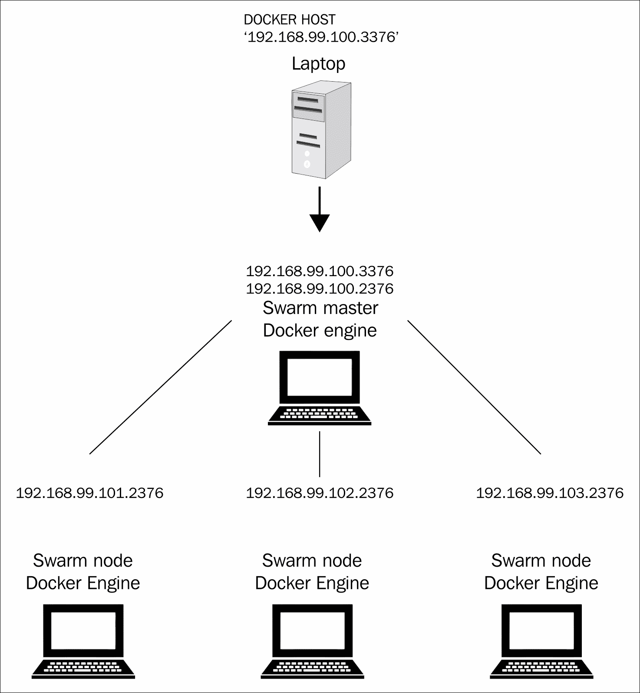
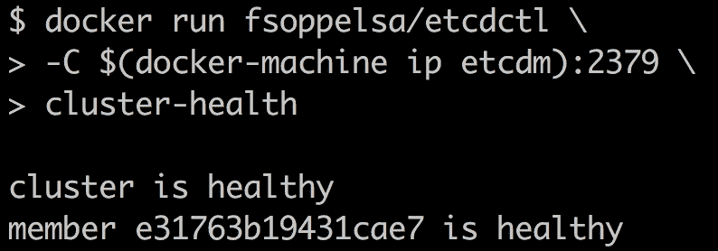

# 第二章。发现发现服务

在[第 1 章](01.html "Chapter 1. Welcome to Docker Swarm")、*欢迎来到码头工人群*中，我们使用`nodes://`机制创建了一个简单但运行良好的本地码头工人群集群。这个系统不太实用，除了学习 Swarm 基础。

事实上，它只是一个平面模型，不考虑任何真正的主从架构，更不用说高级服务，如节点发现和自动配置、弹性、领导者选举和故障转移(高可用性)。实际上，它不适合生产环境。

除`nodes://`外，Swarm v1 官方支持四大发现服务；然而，其中一个，Token，是一个微不足道的非生产性的。基本上，使用 Swarm v1，您需要手动集成一个发现服务，而使用 Swarm Mode(来自 Docker 1.12)，一个发现服务 Etcd 已经集成。在本章中，我们将讲述:

*   发现服务
*   测试级发现服务:令牌
*   筏理论和 Etcd
*   动物园管理员和领事

在深入探讨这些服务之前，让我们讨论一下什么是发现服务？

# 发现服务

假设您在静态配置上运行一个 Swarm 集群，类似于[第 1 章](01.html "Chapter 1. Welcome to Docker Swarm")、*欢迎来到 Docker Swarm* 中的集群，网络是扁平的，每个容器都被分配了一个特定的任务，例如一个 MySQL 数据库。很容易找到 MySQL 容器，因为您为它分配了一个定义好的 IP 地址，或者您运行了一些 DNS 服务器。很容易通知这个单个容器是否工作，并且众所周知它不会改变它的端口(`tcp/3336`)。此外，我们的 MySQL 容器没有必要用它的 IP 和端口来宣布它作为数据库容器的可用性:我们当然已经知道了。

这是宠物模型，由系统管理员手动模拟。然而，由于我们是更先进的操作者，我们想驾驶一只牛来代替。

因此，假设您正在运行一个由数百个节点组成的 Swarm，该 Swarm 托管几个运行一定数量服务(web 服务器、数据库、键值存储、缓存和队列)的应用。这些应用运行在大量的容器上，这些容器可能会动态地更改它们的 IP 地址，这可能是因为您重新启动它们，创建新的副本，或者一些高可用性机制为您启动新的副本。

你如何找到代理你的 Acme 应用的 MySQL 服务？如何确保您的负载平衡器知道您的 100 个 Nginx 前端的地址，以便它们的功能不会中断？如果某项服务已被不同的配置取代，您如何通知？

*您使用发现服务。*

所谓的发现服务是一种具有许多特性的机制。您可以从不同的服务中进行选择，这些服务或多或少具有相似的品质，有它们的优点和缺点，但是基本上所有的发现服务都以分布式系统为目标，因此它们必须分布在所有集群节点上，具有可伸缩性和容错性。发现服务的主要目标是帮助服务找到并相互交谈。为了做到这一点，他们需要通过宣布自己来保存(注册)与每个服务所在位置相关的信息，并且他们通常通过充当键值存储来这样做。发现服务在 Docker 兴起之前就已经存在，但是随着容器和容器编排的出现，这个问题变得更加困难。

再次总结，通过发现服务:

*   您可以在基础架构中找到单个服务
*   您可以通知服务配置更改
*   服务记录其可用性
*   更多

通常，发现服务是作为键值存储来提供的。Docker Swarm v1 正式支持以下发现服务。但是，您可以使用`libkv`抽象界面集成自己的，您可以集成自己的，如下图所示:

[https://github.com/docker/docker/tree/master/pkg/discovery](https://github.com/docker/docker/tree/master/pkg/discovery)。

*   代币
*   consult 0 . 5 . 1+
*   Etcd 2.0+
*   ZooKeeper 3.4.5+

然而，Etcd 库已经作为其内置的发现服务集成到 Swarm 模式中。

# 令牌

Docker Swarm v1 包括一个开箱即用的发现服务，称为 Token。令牌被集成到 Docker 集线器中；因此，它要求所有的 Swarm 节点都连接到互联网，并且能够到达 Docker Hub。这是 Token 的主要限制，但是，您很快就会看到，Token 将允许我们在处理集群时进行一些练习。

简而言之，token 要求您生成一个名为 Token 的 UUID。有了这个 UUID，你可以创建一个管理器，扮演一个主人，并加入集群的奴隶。

## 用令牌重新构建第 1 章的例子

如果我们想保持它的实用性，现在是时候看一个例子了。我们将使用 token 重新构建[第 1 章](01.html "Chapter 1. Welcome to Docker Swarm")*的示例，欢迎来到 Docker Swarm* 。新奇的是，集群不再是平面的，而是由 1 个主节点和 3 个从节点组成，默认情况下，每个节点都启用了安全性。

主节点将是暴露 Swarm 端口`3376`的节点。我们将专门连接到它，以便能够驱动整个集群。



我们可以使用以下命令创建 4 个节点:

```
$ for i in `seq 0 3`; do docker-machine create -d virtualbox 
    node$i; 
    done

```

现在，我们有四台机器运行最新版本的引擎，并启用了顶级域名系统。这意味着，正如你所记得的，引擎正在暴露端口`2376`而不是`2375`。


我们现在将从主节点开始创建集群。拾取其中一个节点，例如`node0`，并获取其变量:

```
$ eval $(docker-machine env node0)

```

我们现在生成集群令牌和唯一标识。为此，我们使用`swarm create`命令:

```
$ docker run swarm create
3b905f46fef903800d51513d51acbbbe

```


结果，swarm 容器输出令牌，我们将在这个例子中使用的协议将被调用，如图所示:`token://3b905f46fef903800d51513d51acbbbe`

请注意这个令牌标识，例如将其分配给一个外壳变量:

```
$ TOKEN=3b905f46fef903800d51513d51acbbbe

```

我们现在创建一个主文件，并试图至少满足一些基本的标准安全要求，怎么样，我们将启用 TLS 加密。我们稍后会看到，`swarm`命令接受 TLS 选项作为参数。但是我们如何将密钥和证书传递给容器呢？为此，我们将使用 Docker Machine 生成并放置在主机上的`/var/lib/boot2docker`中的证书。

实际上，我们将一个卷从 Docker 主机装载到 Docker 主机上的容器中。由于环境变量，所有这些都是远程控制的。

已经获得了`node0`变量，我们使用以下命令启动 Swarm 主程序:

```
$ docker run -ti -v /var/lib/boot2docker:/certs -p 3376:3376 swarm 
    manage -H 0.0.0.0:3376 -tls --tlscacert=/certs/ca.pem --
    tlscert=/certs/server.pem --tlskey=/certs/server-key.pem 
    token://$TOKEN

```

首先，我们以交互模式运行容器来观察群体输出。然后，我们将节点`/var/lib/boot2docker`目录装载到群容器内的`/certs`目录。我们将`3376` Swarm 安全端口从节点 0 重定向到 Swarm 容器。我们在管理模式下通过将`swarm`命令绑定到`0.0.0.0:3376`来执行该命令。然后我们指定一些证书选项和文件路径，最后用我们的令牌描述正在使用的发现服务是 token。


运行这个节点后，让我们打开另一个终端，将一个节点加入这个 Swarm。让我们从获取`node1`变量开始。现在，我们需要 swarm 使用`join`命令，以便加入其主人为`node0`的集群:

```
$ docker run -d swarm join --addr=192.168.99.101:2376 
    token://$TOKEN

```

这里我们指定地址`192.168.99.101`的主机(本身)加入集群。


如果我们跳回第一个终端，我们会看到主节点已经注意到一个节点加入了集群。因此，此时我们有一个由一个主节点和一个从节点组成的 Swarm 集群。


既然我们现在理解了这个机制，我们可以停止终端中的`docker`命令，并使用`-d`选项重新运行它们。因此，要在守护模式下运行容器:

**大师**:

```
$ docker run -t-d -v /var/lib/boot2docker:/certs -p 3376:3376 swarm 
    manage -H 0.0.0.0:3376 -tls --tlscacert=/certs/ca.pem --
    tlscert=/certs/server.pem --tlskey=/certs/server-key.pem 
    token://$TOKEN

```

**节点**:

```
$ docker run -d swarm join --addr=192.168.99.101:2376  
    token://$TOKEN

```

我们现在将继续将另外两个节点加入集群，获取它们的变量，并重复上一个命令，如图所示:

```
$ eval $(docker-machine env node2)
$ docker run -d swarm join --addr=192.168.99.102:2376 
    token://$TOKEN
$ eval $(docker-machine env node3)
$ docker run -d swarm join --addr=192.168.99.103:2376 
    token://$TOKEN

```

例如，如果我们打开第三个终端，获取`node0`变量，并专门连接到端口`3376` (Swarm)而不是`2376` (Docker Engine)，我们可以看到一些来自`docker info`命令的花哨输出。例如，一个群集中有三个节点:


因此，我们创建了一个集群，其中有一个主节点、三个从节点，并且启用了 TLS 并准备接受容器。

我们可以确保从主节点并列出集群中的节点。我们现在将使用`swarm list`命令:

```
$ docker run swarm list token://$TOKEN

```


## 令牌限制

令牌尚未被弃用，但可能很快就会被弃用。标准要求 Swarm 中的每个节点都应该有互联网连接，这不是很方便。此外，对 Docker Hub 的访问使得这种技术依赖于 Hub 的可用性。实际上，它将集线器作为单点故障。然而，使用 token，我们能够更好地理解幕后的情况，我们遇到了 Swarm v1 命令:`create`、`manage`、`join`和`list`。

现在是时候进一步了解真正的发现服务和共识算法了，这是容错系统的一个基本原则。

# 木筏

共识是分布式系统中的一种算法，它迫使系统中的代理在一致的价值观上达成一致，并选出一个领导者。

一些著名的共识算法是 Paxos 和 Raft。Paxos 和 Raft 提供了类似的性能，但 Raft 不太复杂，更容易理解，因此在分布式商店实现中变得非常受欢迎。

作为共识算法，Consul 和 Etcd 实现 Raft，而 ZooKeeper 实现 Paxos。实现 Raft 的 CoreOS Etcd Go 库作为一个依赖项包含在 SwarmKit 和 Swarm Mode 中(在`vendor/`中)，因此在本书中我们将更加关注它。

筏在《奥加罗，驱逐》一文中有详细描述，在[https://ramcloud.stanford.edu/raft.pdf](https://ramcloud.stanford.edu/raft.pdf)有售。在接下来的部分中，我们将总结它的基本概念。

## 筏理论

Raft 在设计时考虑到了简单性，与 Paxos 相比，它真正实现了这一目标(甚至有学术出版物对此进行了论证)。就我们的目的而言，Raft 和 Paxos 的主要区别在于，在 Raft 中，消息和日志仅由集群领导者发送给其对等方，这使得算法更易于理解和实现。我们将在理论部分使用的示例库是 CoreOS Etcd 提供的 Go 库，可在[https://github.com/coreos/etcd/tree/master/raft](https://github.com/coreos/etcd/tree/master/raft)获得。

Raft 集群由节点组成，这些节点必须以一致的方式维护复制的状态机，无论如何:新节点可以加入，旧节点可能崩溃或变得不可用，但这个状态机必须保持同步。

为了实现这一故障感知目标，Raft 集群通常由奇数个节点组成，例如三个或五个，以避免大脑分裂。当剩下的节点分裂成无法就领导人选举达成一致的群体时，就会出现分裂。如果有奇数个节点，他们最终可以以多数同意一个领导者。如果是偶数，选举可以以 50%-50%的结果结束，这是不应该发生的。

回到 raft，Raft 集群在`raft.go`中被定义为一个类型 Raft 结构，并且包括诸如领导者 UUID、当前术语、指向日志的指针以及用于检查法定人数和选举状态的实用程序等信息。让我们通过分解集群组件 Node 的定义来逐步说明所有这些概念。节点被定义为`node.go`中的一个接口，在这个库中被规范地实现为`type node struct`。

```
type Node interface {
 Tick()
 Campaign(ctx context.Context) error
 Propose(ctx context.Context, data []byte) error
 ProposeConfChange(ctx context.Context, cc pb.ConfChange) error
 Step(ctx context.Context, msg pb.Message) error
 Ready() <-chan Ready
 Advance()
 ApplyConfChange(cc pb.ConfChange) *pb.ConfState
 Status() Status
 ReportUnreachable(id uint64)
 ReportSnapshot(id uint64, status SnapshotStatus)
 Stop()
}

```

每个节点保持一个任意长度的刻度(增加`Tick()`，表示时间或纪元的术语或周期，这是当前运行的时刻。在每个术语中，节点可以处于以下状态类型之一:

*   领导者
*   候选人
*   属下

在正常情况下，只有一个领导者，所有其他节点都是追随者。领导者为了让我们尊重它的权威，会定期向它的追随者发送心跳信息。当追随者注意到心跳消息不再到达时，他们明白领导者不再可用，因此他们增加自己的价值并成为候选人，然后试图通过运行`Campaign()`成为领导者。他们从投票给自己开始，试图达到法定人数。当一个节点实现了这一点，一个新的领导者就当选了。

`Propose()`是一种建议将数据追加到日志中的方法。日志是 Raft 中用于同步集群状态的数据结构，也是 Etcd 中的另一个重要概念。它保存在一个稳定的存储(内存)中，当日志变大时，它能够压缩日志以节省空间(快照)。领导者确保日志始终处于一致状态，并且只有在确定该信息已经通过其大多数追随者复制时，才会提交新数据以附加到其日志(主日志)中，因此达成了一致。有一种`Step()`方法，将状态机推进到下一步。

`ProposeConfChange()`是允许我们在运行时更改集群配置的方法。它被证明在任何情况下都是安全的，这要归功于它的两阶段机制，该机制确保了每一个可能的多数都同意这一变化。`ApplyConfChange()`将此更改应用于当前节点。

然后就是`Ready()`。在节点接口中，该函数返回一个只读通道，该通道返回准备读取、保存到存储和提交的消息的封装规范。通常，在调用就绪并应用其条目后，客户端必须调用`Advance()`，以通知就绪已取得进展。实际上，`Ready()`和`Advance()`是 Raft 通过避免日志、日志内容和状态同步中的不一致来保持高一致性的方法的一部分。

这就是 Raft 实现在 CoreOS 的 Etcd 中的样子。

## 筏在实践中

如果你想举手练习 Raft，一个好主意是使用来自 Etcd 的`raftexample`，开始一个三人集群。

由于 Docker 撰写 YAML 文件是自描述的，下面的示例是准备运行的撰写文件:

```
version: '2'
services:
 raftexample1:
 image: fsoppelsa/raftexample
 command: --id 1 --cluster 
          http://127.0.0.1:9021,http://127.0.0.1:9022,
          http://127.0.0.1:9023 --port 9121
 ports:
 - "9021:9021"
 - "9121:9121"
 raftexample2:
 image: fsoppelsa/raftexample
 command: --id 2 --cluster    
          http://127.0.0.1:9021,http://127.0.0.1:9022,
          http://127.0.0.1:9023 --port 9122
 ports:
 - "9022:9022"
 - "9122:9122"
 raftexample3:
 image: fsoppelsa/raftexample
 command: --id 3 --cluster 
          http://127.0.0.1:9021,http://127.0.0.1:9022,
          http://127.0.0.1:9023 --port 9123
 ports:
 - "9023:9023"
 - "9123:9123"

```

该模板创建了三个 Raft 服务(`raftexample1`、`raftexample2`和`raftexample3`)。每一个都运行一个 raftexample 的实例，通过用`--port`公开 API，并用`--cluster`使用静态集群配置。

您可以通过以下方式在 Docker 主机上启动:

```
docker-compose -f raftexample.yaml up

```

现在你可以玩了，例如通过杀死领导者，观察新的选举，通过 API 为其中一个容器设置一些值，移除容器，更新值，重新启动容器，检索这个值，并注意它被正确升级。

与 API 的交互可以通过 curl 完成，如[https://github . com/coreos/etcd/tree/master/contrib/raft example](https://github.com/coreos/etcd/tree/master/contrib/raftexample)所述:

```
curl -L http://127.0.0.1:9121/testkey -XPUT -d value
curl -L http://127.0.0.1:9121/testkey

```

我们把这个练习留给更热情的读者。

### 类型

当您试图采用 Raft 实现时，选择 Etcd 的 Raft 库以获得最高性能，选择 Consul(来自 Serf 库)以实现易用且更容易的实现。

# Etcd

Etcd 是一个高度可用、分布式和一致的键值存储，用于共享配置和服务发现。使用 Etcd 的一些著名项目有 FlighKit、Kubernetes 和 Fleet。

Etcd 可以在网络分裂的情况下优雅地管理主机选举，并且可以容忍节点故障，包括主机。应用，在我们的例子中是 Docker 容器和 Swarm 节点，可以读写数据到 Etcd 的键值存储中，例如服务的位置。

## 用 Etcd 重新构建第 1 章的例子

我们再次创建了一个具有一个管理器和三个节点的示例，这次是通过说明 Etcd。

这一次，我们需要一个真正的发现服务。我们可以通过在 Docker 内部运行 Etcd 服务器来模拟一个非 HA 系统。我们创建了一个由四个主机组成的集群，名称如下:

*   `etcd-m`将是 Swarm 主机，也将托管 Etcd 服务器
*   `etcd-1`:第一个 Swarm 节点
*   `etcd-2`:第二个 Swarm 节点
*   `etcd-3`:第三个 Swarm 节点

操作员通过连接到`etcd-m:3376`，将像往常一样在三个节点上操作 Swarm。

让我们从用机器创建主机开始:

```
for i in m `seq 1 3`; do docker-machine create -d virtualbox etcd-$i; 
done

```

现在我们将在 `etcd-m`上运行 Etcd 主程序。我们使用来自 CoreOS 的`quay.io/coreos/etcd`官方图片，遵循可在[获得的文档。](https://github.com/coreos/etcd/blob/master/Documentation/op-guide/clustering.md)

首先，在终端中，我们获取`etcd-m`外壳变量:

```
term0$ eval $(docker-machine env etcd-m)

```

然后，我们在单主机模式下运行 Etcd 主机(也就是说，没有容错能力，等等):

```
docker run -d -p 2379:2379 -p 2380:2380 -p 4001:4001 \
--name etcd quay.io/coreos/etcd \
-name etcd-m -initial-advertise-peer-urls http://$(docker-machine 
    ip etcd-m):2380 \
-listen-peer-urls http://0.0.0.0:2380 \
-listen-client-urls http://0.0.0.0:2379,http://0.0.0.0:4001 \
-advertise-client-urls http://$(docker-machine ip etcd-m):2379 \
-initial-cluster-token etcd-cluster-1 \
-initial-cluster etcd-m=http://$(docker-machine ip etcd-m):2380
-initial-cluster-state new

```

我们在这里要做的是在守护进程(`-d`)模式下启动 Etcd 映像，并公开端口`2379` (Etcd 客户端通信)、`2380` (Etcd 服务器通信)、`4001`()，并指定以下 Etcd 选项:

*   `name`:节点的名称，在这种情况下我们选择 etcd-m，作为托管这个容器的节点的名称
*   `initial-advertise-peer-urls`在这个静态配置中是地址:集群的端口
*   `listen-peer-urls`
*   `listen-client-urls`
*   `advertise-client-urls`
*   `initial-cluster-token`
*   `initial-cluster`
*   `initial-cluster-state`

我们可以使用`etcdctl cluster-health`命令行实用程序来确保这个单节点 Etcd 集群是健康的:

```
term0$ docker run fsoppelsa/etcdctl -C $(dm ip etcd-m):2379 
    cluster-health

```



这表明 Etcd 至少已经启动并运行，因此我们可以使用它来设置 Swarm v1 集群。

我们在同一台`etcd-m`主机上创建了 Swarm 管理器:

```
term0$ docker run -d -p 3376:3376 swarm manage \
-H tcp://0.0.0.0:3376 \`
etcd://$(docker-machine ip etcd-m)/swarm

```

这暴露了从主机到容器的通常的`3376`端口，但是这一次使用发现服务的`etcd://` URL 启动管理器。

我们现在加入节点，`etcd-1`、`etcd-2`和`etcd-3`。

像往常一样，我们可以为每个终端提供一台机器:

```
term1$ eval $(docker-machine env etcd-1)
term1$ docker run -d swarm join --advertise \
$(docker-machine ip etcd-1):2379 \
etcd://$(docker-machine ip etcd-m):2379
term2$ eval $(docker-machine env etcd-2)
term1$ docker run -d swarm join --advertise \
$(docker-machine ip etcd-2):2379 \
etcd://$(docker-machine ip etcd-m):2379
term3$ eval $(docker-machine env etcd-3)
term3$ docker run -d swarm join --advertise \
$(docker-machine ip etcd-3):2379 \
etcd://$(docker-machine ip etcd-m):2379

```

通过加入`-advertise`，我们命令本地节点加入 Swarm 集群，使用在`etcd-m`上运行和公开的 Etcd 服务。

我们现在转到`etcd-m`并通过调用 Etcd 发现服务来查看我们集群的节点:


我们已经按照预期将三台主机加入到集群中。

# 动物园管理员

ZooKeeper 是另一个广泛使用的高性能分布式应用协调服务。Apache ZooKeeper 最初是 Hadoop 的一个子项目，但现在是一个顶级项目。这是一个高度一致、可扩展和可靠的键值存储，可用作 Docker Swarm v1 集群的发现服务。如前所述，ZooKeeper 使用的是 Paxos，而不是 Raft。

与 Etcd 类似，当 ZooKeeper 形成一个具有仲裁的节点集群时，它有一个领导者，其余的节点是追随者。在内部，动物园管理员使用自己的 ZAB，动物园管理员广播协议，以保持一致性和完整性。

# 领事

我们将在这里看到的最后一个发现服务是 Consul，这是一个用于发现和配置服务的工具。它提供了一个允许客户端注册和发现服务的应用编程接口。与 Etcd 和 ZooKeeper 类似，Consul 是一个带有 REST API 的键值存储。它可以执行健康检查以确定服务可用性，并通过 Sef 库使用 Raft 共识算法。当然，与 Etcd 和 Zookeeper 类似，Consul 可以通过领袖选举形成高可用性的法定人数。其会员管理系统基于`memberlist`，一个高效的 Gossip 协议实现。

## 用 Consul 重新设计第 1 章的例子

我们现在将创建另一个 Swarm v1，但在本节中，我们将在云提供商 DigitalOcean 上创建机器。为此，您需要一个访问令牌。但是如果你没有 DigitalOcean 账号，可以用`--driver virtualbox`替换`--driver digitalocean`，在本地运行这个例子。

让我们从创建领事大师开始:

```
$ docker-machine create --driver digitalocean consul-m
$ eval $(docker-machine env consul-m)

```

我们从这里开始第一个特工。虽然我们称它为代理，但实际上我们将在服务器模式下运行它。我们使用服务器模式(`-server`)并使其成为引导节点(`-bootstrap`)。有了这些选项，执政官将不执行领导者选择，因为它将强迫自己成为领导者。

```
$ docker run -d --name=consul --net=host \
consul agent \
-client=$(docker-machine ip consul-m) \
-bind=$(docker-machine ip consul-m) \
-server -bootstrap

```

在高可用性达到法定人数的情况下，第二个和第三个必须从`-botstrap-expect 3`开始，以允许它们形成高可用性集群。

现在，我们可以使用`curl` 命令来测试我们的领事仲裁是否成功启动。

```
$ curl -X GET http://$(docker-machine ip consul-m):8500/v1/kv/

```

如果它没有显示任何错误，那么领事工作正常。

接下来，我们将在数字海洋上再创建三个节点。

```
$ for i in `seq 1 3`; do docker-machine create -d digitalocean 
    consul-$i; 
    done

```

让我们开始掌握并使用 Consul 作为发现机制:

```
$ eval $(docker-machine env consul-m)
$ docker run -d -p 3376:3376 swarm manage \
-H tcp://0.0.0.0:3376 \
consul://$(docker-machine ip consul-m):8500/swarm
$ eval $(docker-machine env consul-1)
$ docker run -d swarm join \
 --advertise $(docker-machine ip consul-1):2376 \
 consul://$(docker-machine ip consul-m):8500/swarm
$ eval $(docker-machine env consul-2)
$ docker run -d swarm join \
 --advertise $(docker-machine ip consul-2):2376 \
 consul://$(docker-machine ip consul-m):8500/swarm
$ eval $(docker-machine env consul-3)
$ docker run -d swarm join \
 --advertise $(docker-machine ip consul-3):2376 \
 consul://$(docker-machine ip consul-m):8500/swarm

```

以下是我们在运行`swarm list`命令时得到的结果:所有节点都加入了 Swarm，因此示例正在运行。

```
$ docker run swarm list consul://$(docker-machine ip consul-m):8500/swarm                                       time="2016-07-01T21:45:18Z" level=info msg="Initializing discovery without TLS"
104.131.101.173:2376
104.131.63.75:2376
104.236.56.53:2376

```

# 走向分散的发现服务

Swarm v1 架构的局限性在于它使用了一个集中式的外部发现服务。这种方法使每个代理都可以与外部发现服务进行对话，发现服务服务器的负载可能会呈指数级增长。从我们的实验来看，对于一个 500 节点的集群，我们建议形成一个高可用性发现服务，至少有三台中高规格的机器，比如 8 个内核和 8 GB 内存。

为了正确地解决这个问题，SwarmKit 和 Swarm Mode 使用的发现服务在设计时考虑了分散化。Swarm 模式在所有节点上使用相同的发现服务代码库 Etcd，没有单点故障。

# 总结

在本章中，我们熟悉了共识和发现服务的概念。我们知道它们在编排集群中扮演着重要的角色，因为它们提供诸如容错和安全配置等服务。在查看两个具体的 Raft 发现服务实现 Etcd 和 Consul 之前，我们详细分析了一个共识算法，例如 Raft，将事情付诸实践并使用它们重新构建基本示例。在下一章中，我们将开始探索使用嵌入式 Etcd 库的 SwarmKit 和 Swarm。