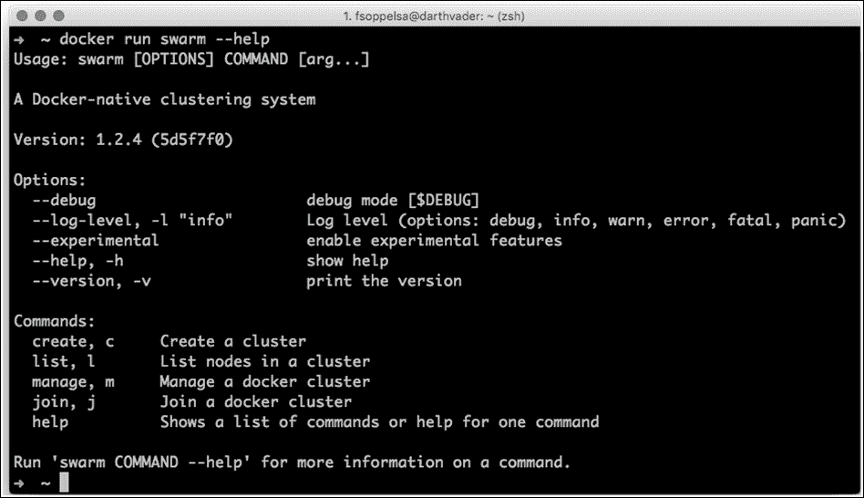
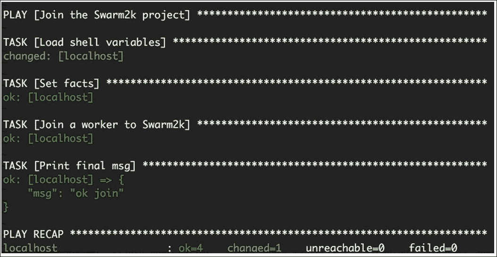
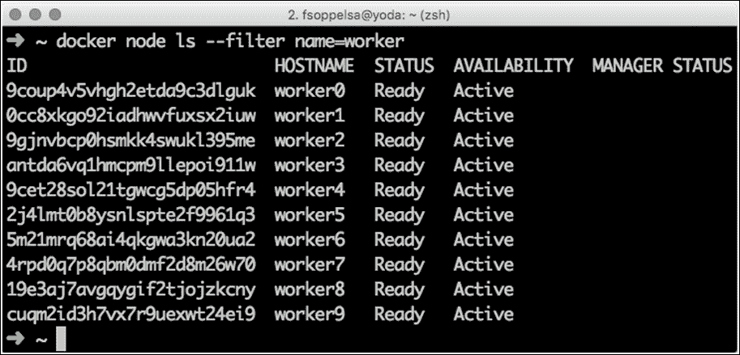
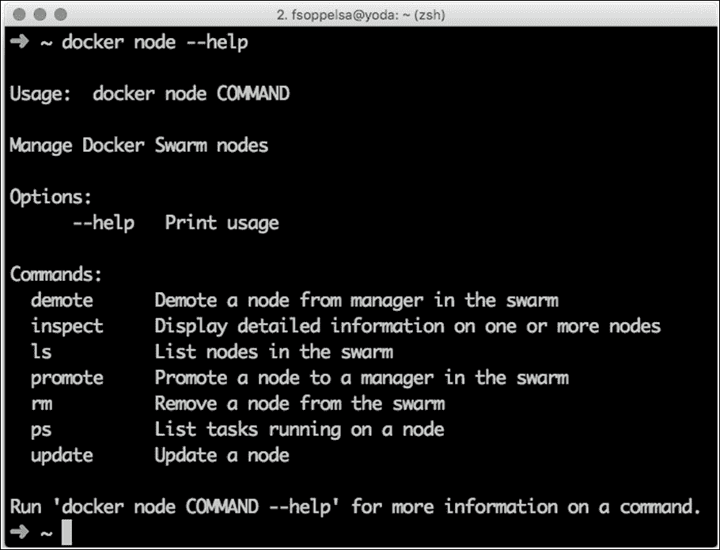
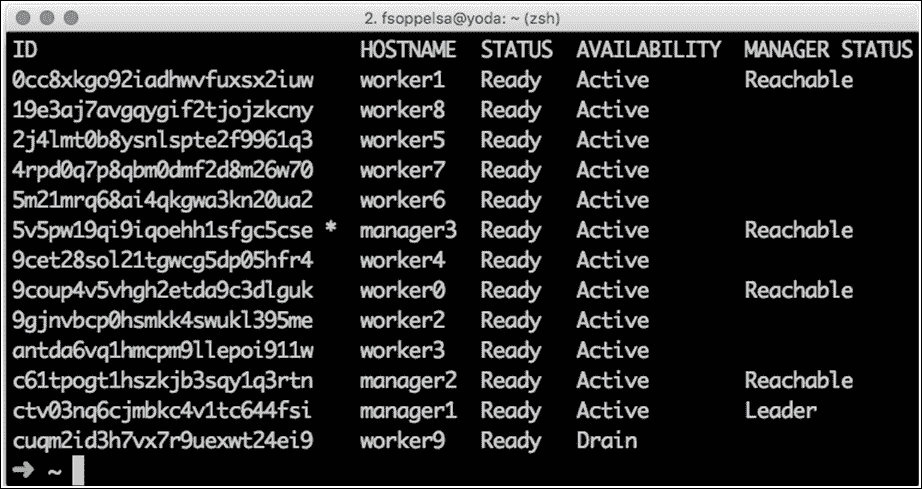
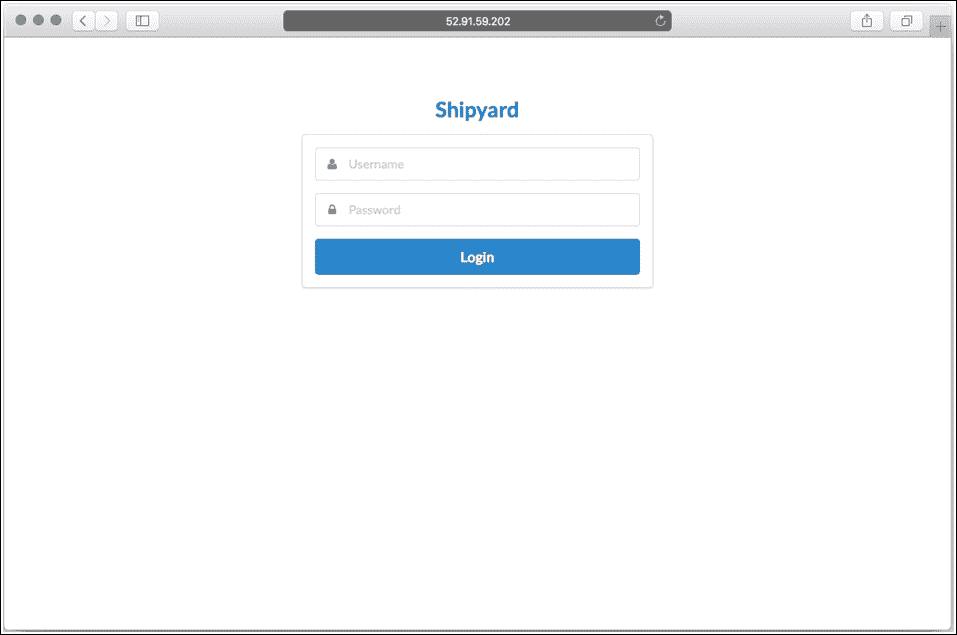
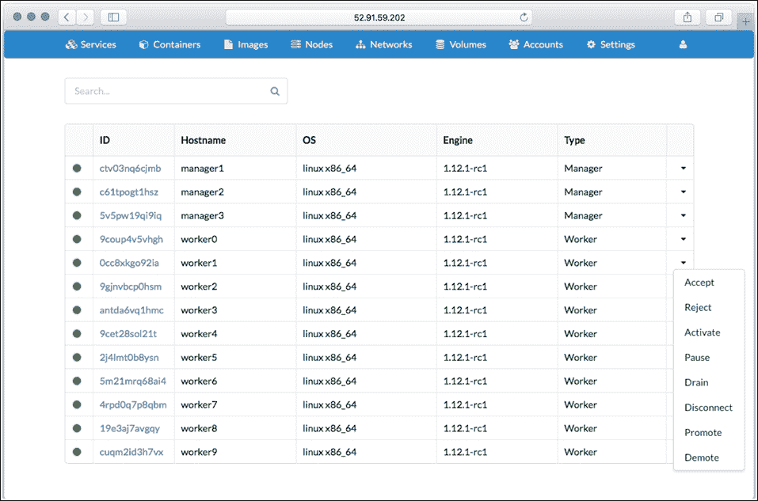
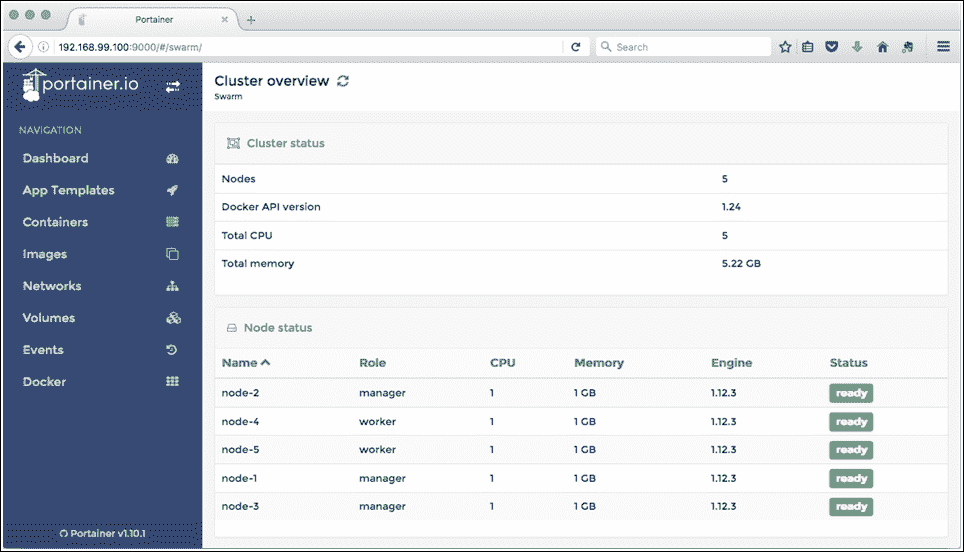

# 第五章。管理集群集群

我们现在将看到如何管理一个正在运行的 Swarm 集群。我们将详细讨论诸如集群大小的缩放(添加和移除节点)、更新集群和节点信息等主题；处理节点状态(升级和降级)、故障排除和图形界面。

在本章中，我们将了解以下主题:

*   独立码头工人群
*   码头工人群体模式
*   集群管理
*   群体健康
*   Swarm 的图形界面

# 码头工人群体独立

在独立模式下，集群操作需要直接在容器内完成`swarm`。

在本章中，我们不打算详细介绍每个选项。Swarm v1 将很快被弃用，因为它已经被 Swarm Mode 宣布过时。



管理 Docker Swarm 独立集群的命令如下:

*   创建(`c`):正如我们在[第 1 章](01.html "Chapter 1. Welcome to Docker Swarm")、*中看到的，欢迎来到 Docker Swarm* 这是我们如何生成 UUID 令牌，以防令牌机制被使用。通常，在生产中，人们使用 Consul 或 Etcd，因此该命令与生产无关。
*   List ( `l`):显示基于通过 consult 或 Etcd 迭代的集群节点列表，即 consult 或 Etcd 必须作为参数传递。
*   Join ( `j`):将运行群容器的节点加入集群。这里，我们需要在命令行传递一个发现机制。
*   管理(`m`):这是独立模式的核心。管理集群涉及更改集群属性，如过滤器、调度程序、外部证书颁发机构网址和超时。我们将在[第 6 章](06.html "Chapter 6. Deploy Real Applications on Swarm")、*在 Swarm* 上部署真实应用程序时，更多地讨论这些选项在 Swarm 模式中的应用。

# 码头工人群体模式

在本节中，我们将继续探索管理集群的群模式命令。

## 手动添加节点

您可以选择创建新的 Swarm 节点，这样 Docker 主机，无论您喜欢哪种方式。

如果使用 Docker Machine，它将很快达到极限。在列出机器时，您必须非常耐心，并等待几秒钟，让机器整体获取并打印信息。

手动添加节点的一种方法是将 Machine 与通用驱动程序一起使用；因此，将主机配置(操作系统安装、网络和安全组配置等)委托给其他东西(如 Ansible)，然后利用 Machine 以适当的方式安装 Docker。这是如何做到的:

1.  手动配置云环境(安全组、网络等)。)
2.  用第三方工具配置 Ubuntu 主机。
3.  在这些主机上运行带有通用驱动程序的机器，唯一的目标是正确安装 Docker。
4.  使用第 2 部分中的工具管理主机，甚至管理其他主机。

如果您使用 Machine 的通用驱动程序，它将选择最新稳定的 Docker 二进制文件。在写这本书的时候，为了使用 Docker 1.12，我们有时会克服这一点，给 Machine 一个选项，用`--engine-install-url`选项获得 Docker 的最新不稳定版本:

```
docker-machine create -d DRIVER --engine-install-url 
    https://test.docker.com mymachine

```

在读这本书的瞬间，对于一个制作 Swarm(模式)，1.12 会比较稳定；因此，这个技巧将不再必要，除非您需要使用一些最新的 Docker 功能。

## 管理者

在计划蜂群时，必须记住一些关于管理人员数量的考虑，正如我们在[第 4 章](04.html "Chapter 4. Creating a Production-Grade Swarm")、*中看到的创建生产级蜂群*。HA 理论建议管理者的数量必须是奇数且等于或大于 3。授予高可用性中的法定人数意味着大多数节点都同意主导操作的节点部分。

如果有两个经理，一个下去了又回来，有可能两个都被认为是领导。这导致集群组织中的逻辑崩溃，称为裂脑。

管理者越多，对失败的抵抗力就越高。请看下表。

<colgroup><col> <col> <col></colgroup> 
| **经理人数** | **法定人数(多数)** | **最大可能故障** |
| three | Two | one |
| five | three | Two |
| seven | four | three |
| nine | five | four |

此外，在群集模式下，自动创建一个**入口**覆盖网络，并将其作为入口流量与节点相关联。其目的是与容器一起使用:


您将希望您的容器与内部覆盖(VxLAN 网状)网络相关联，以便相互通信，而不是使用公共或其他外部网络。因此，Swarm 为您创建了这个，它已经准备好使用了。

## 工人人数

您可以添加任意数量的员工。这是蜂群的弹性部分。有 5 个、15 个、200 个、2300 个或 4700 个运行工人完全没问题。这是最容易处理的部分；您可以在任何时间、任何规模上无负担地添加和删除员工。

## 脚本节点添加

如果您不打算总共添加 100 个节点，添加节点的最简单方法是使用基本脚本。

执行`docker swarm init`时，只需复制粘贴打印为输出的行即可。


然后，用一个循环创建一群工人:

```
#!/bin/bash
for i in `seq 0 9`; do
docker-machine create -d amazonec2 --engine-install-url 
    https://test.docker.com --amazonec2-instance-type "t2.large" swarm-
    worker-$i
done

```

之后，只需要遍历机器列表，`ssh`进入机器列表，`join`进入节点:

```
#!/bin/bash
SWARMWORKER="swarm-worker-"
for machine in `docker-machine ls --format {{.Name}} | grep 
    $SWARMWORKER`;
do
docker-machine ssh $machine sudo docker swarm join --token SWMTKN-
    1-5c3mlb7rqytm0nk795th0z0eocmcmt7i743ybsffad5e04yvxt-
    9m54q8xx8m1wa1g68im8srcme \
 172.31.10.250:2377
done

```

这个脚本在机器中运行，对于每个机器，名字以 s `warm-worker-`开始，它将`ssh`进入节点，并加入到现有的 Swarm 和领导者管理器中，领导者管理器是`172.31.10.250`。

### 注

详情见[https://github.com/swarm2k/swarm2k/tree/master/amazonec2](https://github.com/swarm2k/swarm2k/tree/master/amazonec2)或下载一个衬垫。

## 皮带

皮带是大规模供应 Docker 引擎的另一种变体。它基本上是一个固若金汤的 SSH 包装器，它要求您在`go`之前准备特定于提供商的图像以及供应模板。在本节中，我们将学习如何做到这一点。

你可以通过从 Github 获取它的源代码来自己编译 Belt。

```
# Set $GOPATH here
go get https://github.com/chanwit/belt

```

目前，Belt 仅支持数字海洋驱动程序。我们可以在`config.yml`中准备我们的模板进行供应。

```
digitalocean:
 image: "docker-1.12-rc4"
 region: nyc3
 ssh_key_fingerprint: "your SSH ID"
 ssh_user: root

```

然后，我们可以用几个命令创建数百个节点。

首先，我们创建三个管理主机，每个 16 GB，分别是`mg0`、`mg1`和`mg2`。

```
$ belt create 16gb mg[0:2]
 NAME      IPv4         MEMORY  REGION         IMAGE           STATUS
mg2   104.236.231.136  16384   nyc3    Ubuntu docker-1.12-rc4  active
 mg1   45.55.136.207    16384   nyc3    Ubuntu docker-1.12-rc4  active
mg0   45.55.145.205    16384   nyc3    Ubuntu docker-1.12-rc4  active

```

然后我们可以使用`status`命令等待所有节点激活:

```
$ belt status --wait active=3
STATUS  #NODES  NAMES
active      3   mg2, mg1, mg0

```

我们将对 10 个工作节点再次执行此操作:

```
$ belt create 512mb node[1:10]
$ belt status --wait active=13

```

```
STATUS  #NODES  NAMES
active      3   node10, node9, node8, node7

```

## 使用 Ansible

或者，您可以使用 Ansible(正如我喜欢的那样，它变得非常流行)来使事情更具可重复性。我们已经创建了一些可移植的模块来直接与机器和群体(模式)一起工作；它还兼容 Docker 1.12([https://github.com/fsoppelsa/ansible-swarm](https://github.com/fsoppelsa/ansible-swarm))。他们需要 Ansible 2.2+，这是 Ansible 与二进制模块兼容的第一个版本。

您需要编译模块(用`go`编写)，然后将它们传递给`ansible-playbook -M`参数。

```
git clone https://github.com/fsoppelsa/ansible-swarm
cd ansible-swarm/library
go build docker-machine.go
 go build docker_swarm.go
cd ..

```

剧本中有一些示例剧本。Ansible 的 plays 语法非常容易理解，甚至详细解释都是多余的。

我用这个剧本加入了 10 个工人到 **Swarm2k** 实验:

```
    ---    
 name: Join the Swarm2k project
 hosts: localhost
 connection: local
 gather_facts: False
#mg0 104.236.18.183
#mg1 104.236.78.154
#mg2 104.236.87.10
 tasks:
name: Load shell variables
 shell: >
 eval $(docker-machine env "{{ machine_name }}")
 echo $DOCKER_TLS_VERIFY &&
 echo $DOCKER_HOST &&
 echo $DOCKER_CERT_PATH &&
 echo $DOCKER_MACHINE_NAME
 register: worker
name: Set facts
 set_fact:
 whost: "{{ worker.stdout_lines[0] }}"
 wcert: "{{ worker.stdout_lines[1] }}"
name: Join a worker to Swarm2k
 docker_swarm:
 role: "worker"
 operation: "join"
 join_url: ["tcp://104.236.78.154:2377"]
 secret: "d0cker_swarm_2k"
 docker_url: "{{ whost }}"
 tls_path: "{{ wcert }}"
 register: swarm_result
name: Print final msg
 debug: msg="{{ swarm_result.msg }}"

```

基本上，它在从机器加载一些主机事实后调用`docker_swarm`模块:

*   操作完成`join`
*   新节点的作用是`worker`
*   新节点加入`tcp://104.236.78.154:2377`，加入时是领导经理。这个参数采用一组管理器，例如[ `tcp://104.236.78.154:2377`、`104.236.18.183:2377`、`tcp://104.236.87.10:2377` ]
*   它传递密码`(secret)`
*   它规定了一些基本的发动机连接事实，模块将使用`tlspath`的证书连接到`dockerurl`。

在库中编译`docker_swarm.go`后，将工人加入群就像:

```
#!/bin/bash
SWARMWORKER="swarm-worker-"
for machine in `docker-machine ls --format {{.Name}} | grep 
    $SWARMWORKER`;
do
ansible-playbook -M library --extra-vars "{machine_name: $machine}" 
    playbook.yaml
done

```



# 集群管理

为了更好地说明集群操作，让我们看一个由三个经理和十个工人组成的例子。第一个基本操作是列出节点，用`docker node ls`命令:


您可以通过调用节点的主机名( **manager1** )或其标识(**CTV 03 NQ 6 cjmbkc 4v 1tc 644 FSI**)来引用节点。该 list 语句中的其他列描述了集群节点的属性。

*   **状态**是关于节点的物理可达性。如果节点是向上的，则它是就绪的，否则它是向下的。
*   **可用性**是节点可用性。节点状态可以是活动(参与群集操作)、暂停(处于待机、挂起、不接受任务)或耗尽(等待从其任务中撤出)。
*   **MANAGER STATUS** is the current status of manager. If a node is not the manager, this field will be empty. If a node is manager, this field can either be Reachable (one of the managers present to guarantee high availability) or Leader (the host leading all operations).

    

## 节点操作

`docker node`命令有几个可能的选项。



如您所见，您拥有节点管理的所有可能命令，但是`create`。我们经常被问到`node`命令什么时候会增加一个创建选项，但是仍然没有答案。

到目前为止，创建新节点是手动操作，也是集群操作员的责任。

## 降级晋升

员工节点可以升级(将其转换为经理)，而经理节点可以降级(将其转换为员工)。

在管理大量经理和员工(奇数，大于或等于三)时，请始终记住该表以保证高可用性。

使用以下语法将`promote worker0`和`worker1`发送给经理:

```
docker node promote worker0
docker node promote worker1

```

窗帘后面没有什么神奇的东西。只是，Swarm 试图通过即时指令来改变节点角色。



降级是一样的(docker 节点降级 **worker1** )。但是要注意避免不小心降级正在工作的节点，否则会被锁定。

最后，如果您试图降职领导经理会发生什么？在这种情况下，Raft 算法将开始选举，并从活跃的经理中选择新的领导者。

## 标记节点

您可能已经注意到，在前面的截图中，**工作 9** 在**耗尽**可用性。这意味着该节点正在撤离其任务(如果有)，这些任务将在集群中的其他地方重新安排。

您可以使用`docker node update`命令通过更新节点状态来更改节点可用性:


可用性选项可以是`active`、`pause`或`drain`。在这里，我们刚刚将**工人 9** 恢复到活动状态。

*   `active`状态表示节点正在运行并准备接受任务
*   `pause` 状态表示节点正在运行，但不接受任务
*   `drain`状态意味着该节点正在运行并且不接受任务，但是它当前正在耗尽它的任务，这些任务正在其他地方被重新调度

另一个强大的更新论点是关于标签。分别有`--label-add`和`--label-rm`允许我们给 Swarm 节点添加标签。

Docker Swarm 标签不会影响引擎标签。启动 Docker 引擎时可以指定标签(`dockerd [...] --label "staging" --label "dev" [...]`)。但是 Swarm 无权编辑或更改它们。我们在这里看到的标签只影响 Swarm 行为。

标签对于节点分类很有用。当您启动服务时，您可以使用标签过滤并决定容器的物理位置。例如，如果您想要将一堆带固态硬盘的节点专用于托管 MySQL，您实际上可以:

```
docker node update --label-add type=ssd --label-add type=mysql 
    worker1
docker node update --label-add type=ssd --label-add type=mysql 
    worker2
docker node update --label-add type=ssd --label-add type=mysql 
    worker3

```

稍后，当您将使用复制因子启动一个服务时，比如说三个，您将确保它将在 worker1、worker2 和 worker3 上准确地启动 MySQL 容器，如果您通过`node.type`进行过滤的话:

```
docker service create --replicas 3 --constraint 'node.type == 
    mysql' --name mysql-service mysql:5.5.

```

## 移除节点

切除淋巴结是一项精细的手术。这不仅仅是将一个节点排除在 Swarm 之外，还关系到它的角色和它正在运行的任务。

### 清除工人

如果一个工作进程的状态为“关闭”(例如，因为它实际上已关闭)，那么它当前没有运行任何东西，因此可以安全地删除它:

```
docker node rm worker9

```

相反，如果工作进程处于“就绪”状态，则前一个命令将引发错误，拒绝删除它。节点可用性(活动、暂停或耗尽)实际上并不重要，因为此时或恢复时，它仍可能在运行任务。

因此，在这种情况下，操作员必须手动排空节点。这意味着强制其释放将被重新安排并转移给其他员工的任务:

```
docker node update --availability drain worker9

```

一旦耗尽，节点可以关闭，然后在其状态为关闭时删除。

### 删除经理

不能删除经理。在删除管理器节点之前，必须将其适当降级为 worker，最终清空，然后关闭:

```
docker node demote manager3
docker node update --availability drain manager3
# Node shutdown
docker node rm manager3

```

当必须删除一个管理器时，应该将另一个工作节点标识为新的管理器，并在以后进行提升，以便保持奇数个管理器。

### 类型

**用**移除:`docker node rm --force`

无论如何，`--force`标志都会删除一个节点。必须非常小心地使用该选项，并且在出现停滞节点时，这通常是最后的手段。

# 蜂群健康

群健康本质上取决于集群中节点的可用性和管理器的可靠性(奇数，可用，向上)。

节点可以用通常的:

```
docker node ls

```

这可以使用`--filter`选项过滤输出。例如:

```
docker node ls --filter name=manager # prints nodes named *manager*
docker node ls --filter "type=mysql" # prints nodes with a label 
    type tagged "mysql"

```

要获取特定节点的详细信息，请使用 inspect，如下所示:

```
docker inspect worker1

```

此外，过滤选项可用于从输出 JSON 中提取特定数据:

```
docker node inspect --format '{{ .Description.Resources }}' worker2
{1000000000 1044140032}

```

输出内核数量(一个)和分配的内存数量(`1044140032`字节，或 995M)。

# 备份集群配置

管理者的重要数据存储在`/var/lib/docker/swarm`中。这里我们有:

*   `certificates/`中的证书
*   `raft/`中带有 Etcd 日志和快照的 Raft 状态
*   `worker/`中的任务数据库
*   其他不太重要的信息，如当前管理器状态、当前连接套接字等。

最好定期备份这些数据，以防需要恢复。

Raft 日志使用的空间取决于集群上产生的任务数量以及它们的状态变化频率。对于 200，000 个容器，Raft 日志每三个小时可以增长到 1GB 左右的磁盘空间。每个任务的日志条目大约占 5 KB。因此，Raft 日志目录`/var/lib/docker/swarm/raft`的日志循环策略应该或多或少地进行校准，这取决于可用的磁盘空间。

# 灾难恢复

如果某个管理器上的群目录内容丢失或损坏，需要使用`docker node remove nodeID`命令立即将该管理器从集群中移除(如果暂时卡住，则使用`--force`)。

集群管理员不应该启动管理器，也不应该使用过期的集群目录将其加入集群。使用过期的群目录加入集群会使集群处于不一致的状态，因为在此过程中，所有管理人员都会尝试同步错误的数据。

关闭目录损坏的管理器后，需要删除`/var/lib/docker/swarm/raft/wal`和`/var/lib/docker/swarm/raft/snap`目录。只有在此步骤之后，管理器才能安全地重新加入集群。

# 【Swarm 的图形界面

在撰写本文的时候，Swarm 模式是如此年轻，以至于现有的 Docker 图形用户界面支持尚未到来或正在进行中。

## 船厂

**船厂**([https://shipyard-project.com/](https://shipyard-project.com/))对 Swarm (v1)操作有很好的支持，现在更新为使用 Swarm 模式。在撰写本文时(2016 年 8 月)，在 Github 上有一个 1.12 分支，这使得它可行。

在这本书出版的时候，可能已经有一个稳定的版本可以用于自动化部署。你可以看看[https://shipyard-project.com/docs/deploy/automated/](https://shipyard-project.com/docs/deploy/automated/)的说明。

这类似于在 SSH 中进入 leader manager 主机并运行一个 liner，例如:

```
curl -sSL https://shipyard-project.com/deploy | bash -s

```

如果我们仍然需要安装一个特定的非稳定分支，可以从 Github 下载到 leader manager 主机，然后安装 Docker Compose。

```
curl -L 
    https://github.com/docker/compose/releases/download/1.8.0/docker-
    compose-`uname -s`-`uname -m` > /usr/local/bin/docker-compose && 
    chmod +x /usr/local/bin/docker-compose

```

最后从`compose`开始:

```
docker-compose up -d < docker-compose.yml

```

该命令将调出许多容器，最终，默认情况下，这些容器会暴露端口`8080`，这样您就可以连接到端口`8080`的公共管理器 IP 以进入造船厂用户界面。



从下面的截图中可以看到，Docker Swarm 特性已经在 UI 中得到支持(有**服务**、**节点**等等)。)，以及操作，如**提升**、 **D **表情**** 等，这些我们在本章中概述的操作，每个节点都有。



## 搬运工

支持群组模式的另一个用户界面，也是我们的首选，是**Portainer**([https://github.com/portainer/portainer/](https://github.com/portainer/portainer/))。

部署它就像在领导者管理器上启动一个容器一样简单:

```
docker run -d -p 9000:9000 -v /var/run/:/var/run 
    portainer/portainer

```



用户界面有预期的选项，包括快速启动容器的模板列表，如 MySQL 或私有注册表，Portainer 支持 Swarm 服务，启动时有`-s`选项。

在撰写本文时，Portainer 即将推出 UI 身份验证功能，这是迈向基于角色的完全访问控制的第一步，预计将于 2017 年初推出。稍后，RBAC 将扩展到支持微软活动目录作为目录源。此外，到 2016 年底，Portainer 还将支持多集群(或多主机)管理。2017 年初增加的其他功能是 Docker Compose (YAML)支持和私有注册表管理。

# 总结

在本章中，我们将介绍典型的 Swarm 管理程序和选项。在展示了如何将管理人员和工作人员添加到集群之后，我们详细解释了如何更新集群和节点属性，如何检查 Swarm 运行状况，并且我们遇到了作为 ui 的船厂和 Portainer。在此之后，我们专注于基础设施，现在是时候使用我们的群集了。在下一章中，我们将通过创建真正的服务和任务来打开钥匙，启动一些真正的应用程序。