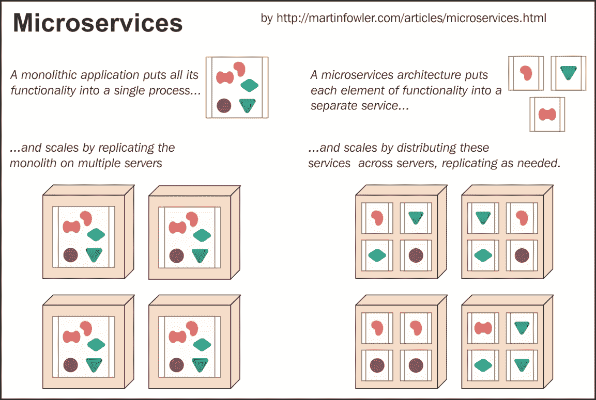
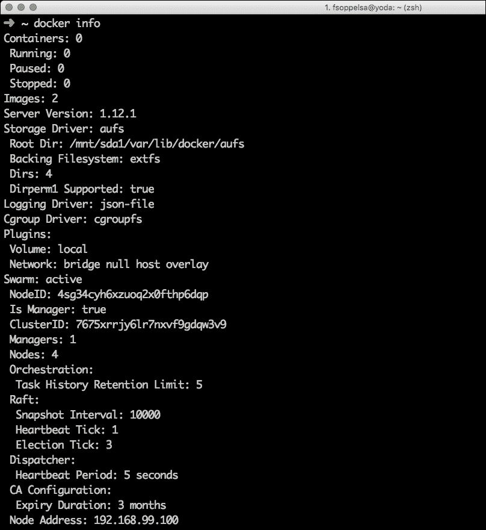
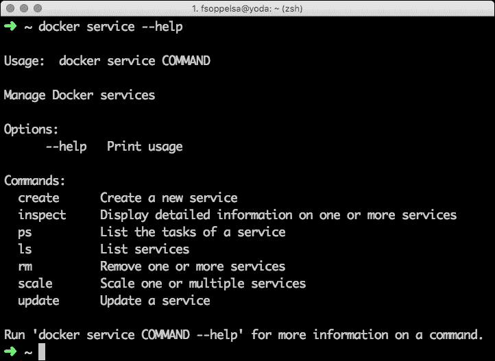
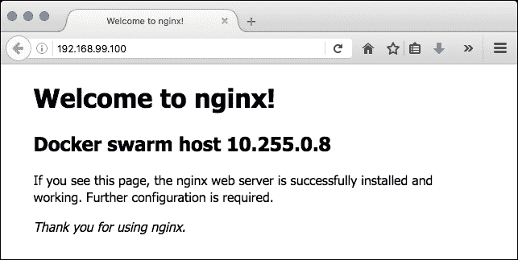
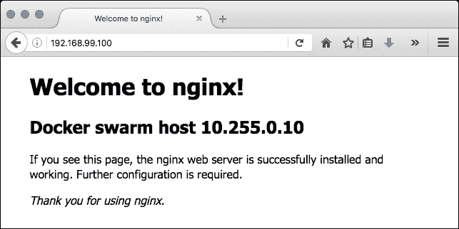
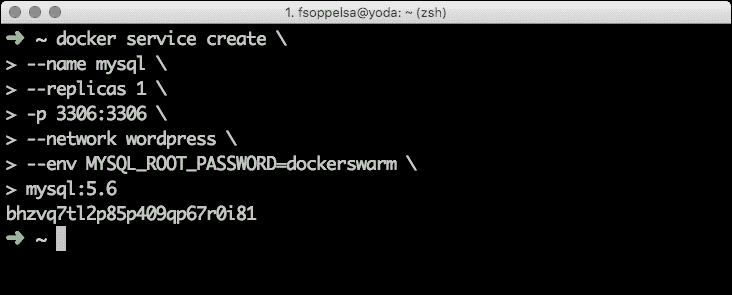
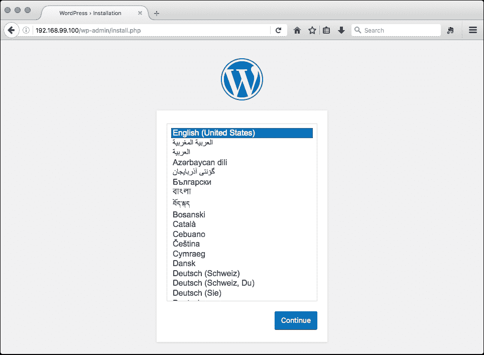
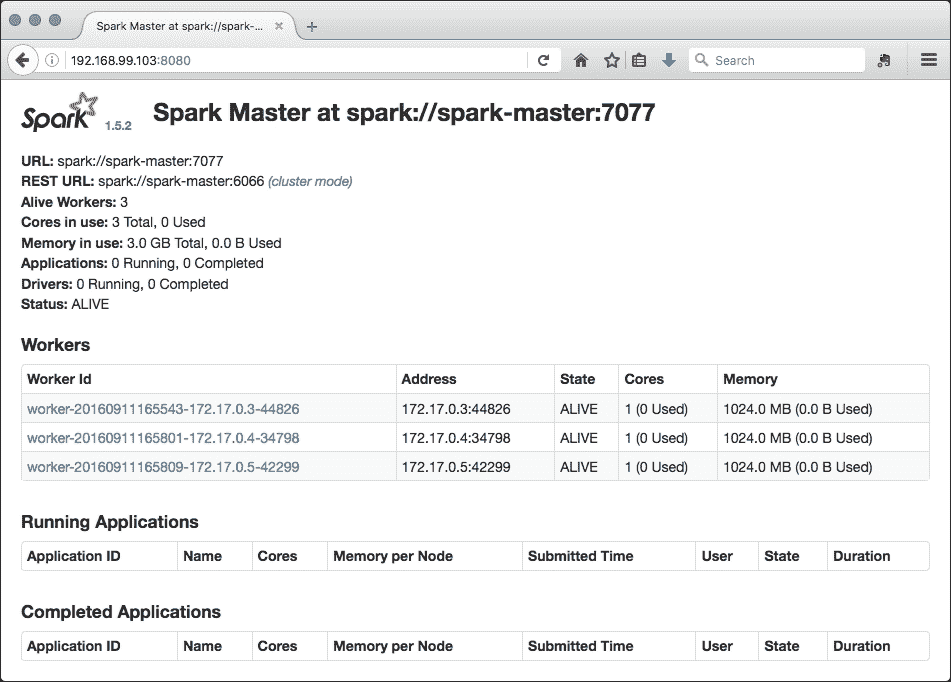

# 第六章。在 Swarm 上部署真实应用程序

有了 Swarm 基础设施，我们可以部署各种类型的负载。我们将在这一章和下一章研究应用程序堆栈。在本章中，我们将:

*   发现 Swarm 的服务和任务
*   部署 Nginx 容器
*   部署一个完整的 WordPress
*   部署小规模的 Apache Spark 架构。

# 微服务

IT 行业一直热衷于分离和重用其创造的东西，无论是源代码还是应用程序。在架构级别建模应用程序也不例外。模块化早期被称为**面向服务的架构** ( **SOA** )，并被基于 XML 的开源协议所粘合。然而，随着容器的出现，现在每个人都在谈论微服务。

微服务是小型且独立的自治模块，它们协同工作来实现架构目标。

微服务架构最膨胀的例子是网络应用程序栈，例如 WordPress，其中网络服务器可能是一个服务，其他的是数据库、缓存引擎和包含应用程序本身的服务。通过 Docker 容器对微服务进行建模可以立即完成，这就是该行业目前的发展方式。



使用微服务有许多优点，它们如下:

*   **可重用性**:你只要拉取你想要的服务(nginx，MySQL)的图片，以防你定制它们
*   **异构性**:你链接包含不同技术的现有模块。如果，在未来的某个时候，你决定从 MySQL 切换到 MariaDB，你就关掉 MySQL，插入 MariaDB
*   **关注小**:拆下的模块很容易单独排除故障
*   **扩展**:您可以轻松地将 web 服务器扩展到 10 个前端，将缓存服务器扩展到 3 个，并在 5 个节点上构建数据库副本，并且有一天可以根据应用程序负载和需求进行扩展或缩减
*   **恢复力**:如果你有三个 memcached 服务器，其中一个失败了，你可以有一些机制来尝试恢复它，或者忘记它，然后立即启动另一个

# 部署复制的 nginx

我们从一个简单的示例开始，了解如何在 Swarm 上使用服务:部署和扩展 Nginx。

## 一个最小的群体

为了使这一章自给自足，并对作为独立章节阅读的开发人员有用。让我们在本地快速创建一个最小的群模式架构，由一名经理和三名工作人员组成:

1.  我们催生了四个 Docker 主机:

    ```
     for i in seq 3; do docker-machine create -d virtualbox 
          node- $i; done

    ```

2.  然后我们控制`node-1`，我们选择它作为我们的静态管理器，并在 Swarm 上初始化它:

    ```
    eval $(docker-machine env node-1)
    docker swarm init --advertise-addr 192.168.99.100

    ```

3.  Docker 为我们生成了一个令牌，以加入我们的三名员工。因此，我们只需复制粘贴该输出，迭代其他三个工作人员，将他们连接到节点:

    ```
    for i in 2 3 4; do
    docker-machine ssh node-$i sudo docker swarm join \
    --token SWMTKN-1-
          4d13l0cf5ipq7e4x5ax2akalds8j1zm6lye8knnb0ba9wftymn-
          9odd9z4gfu4d09z2iu0r2361v \
    192.168.99.100:2377

    ```

集群模式架构总是通过 Docker 机器外壳环境变量连接到`node-1`，该环境变量由先前的`eval`命令填充。我们需要检查包括领导者管理器在内的所有节点是否都处于活动状态并成功加入了 Swarm:


现在，我们可以使用`docker info`命令检查这个 Swarm 集群的状态:



这里重要的信息是 Swarm 是活跃的，然后一些 Raft 细节随之而来。

## 码头工人服务

Docker 1.12 中引入的一个新命令是`docker service`，这就是我们现在要看到的。服务是您在 Docker Swarm 模式下操作应用程序的主要方式；这就是您将如何创建、销毁、扩展和滚动更新服务。

服务由任务组成。nginx 服务由 nginx 容器任务组成。服务机制加速(通常)工作节点上的任务。因此，当您创建一个服务时，您必须在它的选项中强制指定一个服务名称和作为服务基础的容器。

。



创建服务的语法非常直接:您只需使用`docker service create`命令，指定选项，如公开的端口，并选择要使用的容器。我们在这里执行

```
docker service create -p 80:80 --name swarm-nginx --replicas 3
    fsoppelsa/swarm-nginx

```


该命令启动 nginx，将容器的端口`80`暴露给主机的端口`80`，这样就可以从外部到达它们，并指定一个三的复制因子。

副本因素是您在 Swarm 上缩放容器的方式。如果您指定三个，Swarm 将在三个节点上创建三个 nginx 任务(容器)，并通过在其他可用主机上重新调度 nginx(如果可能的话)来尝试保留这个数量，以防其中一个或多个容器死亡。

如果给出“否”`--replicas`选项，那么默认的复制因子是`1`。

一段时间后，Swarm 需要将映像从集线器或本地的任何注册表拉至主机，并创建适当的容器(并公开端口)；我们看到我们的基础架构中有三个 nginx，命令如下:

```
docker service ls

```


这些任务实际上安排在三个节点上，如使用以下命令所示:

```
 docker service ps swarm-nginx 

```


这里使用的`fsoppelsa/swarm-nginx`容器是`richarvey/nginx-php-fpm`的一个微不足道的修改，它是由 PHP 赋能的 nginx 映像。我们使用 PHP 在 Nginx 欢迎页面上输出当前服务器的地址，通过添加一个 PHP 命令来显示负载平衡机制。

```
<h2>Docker swarm host <?php echo $_SERVER['SERVER_ADDR']; ?></h2>

```


现在，如果您将浏览器指向管理器 IP 并多次重新加载，您将看到负载平衡器有时会将您重定向到不同的容器。

将加载的第一页类似于下面的截图:



下面的屏幕截图显示了加载的另一个页面，负载平衡器选择了不同的节点 10.255.0.9:


以下截图是负载平衡器重定向到节点 10.255.0.10 时加载的另一个页面:



# 覆盖网络

如果您想将运行在不同主机上的容器连接到您的 Swarm 基础架构，而不仅仅是复制，那么您必须使用网络。例如，您需要将 web 服务器连接到数据库容器，以便它们可以通信。

在群体模式中，这个问题的答案是使用覆盖网络。它们用 Docker 的 libnetwork 和 libkv 实现。这些网络是建立在另一个网络(在标准设置中是物理主机网络)之上的 VxLAN 网络。

VxLAN 是 VLAN 协议的扩展，旨在提高其可扩展性。连接到 Docker VxLAN 网络的不同主机上的容器可以像在同一台主机上一样进行通信。

Docker Swarm 模式包括一个路由网状表，默认情况下，该表支持多主机网络，称为**入口**。

## 集成负载平衡

Swarm Mode 1.12 上的负载平衡是如何工作的？路由以两种不同的方式工作。首先，它通过虚拟 IP 服务暴露的端口工作。对端口的任何请求都分布在承载服务任务的主机中。其次，该服务被赋予一个虚拟 IP 地址，该地址只能在 Docker 网络内部路由。当向这个贵宾地址发出请求时，它们被分发到底层容器。这个虚拟 IP 注册在包含在 Docker Swarm 中的 DNS 服务器内。当对服务名进行 DNS 查询时(例如 nslookup mysql)，将返回虚拟 IP。

# 连接服务:WordPress 示例

启动一堆复制和负载平衡容器的可能性已经是一个好的开始，但是由不同的互连容器组成的更复杂的应用程序堆栈呢？

在这种情况下，您可以通过按名称调用容器来链接它们。正如我们刚刚看到的，内部 Swarm DNS 服务器将保证可靠的名称解析机制。如果实例化一个名为`nginx`的服务，您可以将其引用为`nginx`，其他服务将解析为`nginx`虚拟 IP(负载平衡)，从而访问分布式容器。

为了用一个例子来证明这一点，我们现在要在 Swarm 上部署更经典的东西:WordPress。您可以将 WordPress 作为一个容器运行，事实上 Docker Hub 上有一个现成的映像，但是它需要一个外部数据库(在本例中是 MySQL)来存储它的数据。

因此，作为开始，我们将在 Swarm 上创建一个新的专用覆盖网络，称为 WordPress，并在其上运行一个 MySQL 容器作为 Swarm 服务，三个负载平衡的 WordPress 容器(网络容器)也作为 Swarm 服务。MySQL 会暴露端口 3306，而 WordPress 会暴露端口`80`。

让我们从定义我们的覆盖网络开始。当连接到 Swarm 管理器时，我们发出以下命令:

```
docker network create --driver overlay wordpress

```


那么，幕后发生了什么？该命令使用 libnetwork 创建一个覆盖网络，当 Swarm 节点收到需要它的计划任务时，该覆盖网络在 Swarm 节点上变得可用。如果您连接到`node-2`并列出网络，它将始终存在。

我们现在使用以下命令创建一个 MySQL 服务，该服务仅由一个容器(没有 MySQL 本地副本，也没有 Galera 或其他复制机制)组成:

```
docker service create \
--name mysql \
--replicas 1 \
-p 3306:3306 \
--network wordpress \
--env MYSQL_ROOT_PASSWORD=dockerswarm \
mysql:5.6

```

我们希望从集线器中拉出 MySQL 5.6，调用服务(稍后可通过指向其 VIP 的解析名称访问)`mysql`，为清晰起见将副本设置为一个，公开端口`3306`，指定专用网络 WordPress 和根密码，在我们的例子中是`dockerswarm`:



有必要在几秒钟后从集线器中拉出 MySQL 映像，我们可以检查并看到，在我们的情况下，一个`mysql`容器被下载并放置在`node-1`上(实际上，如果没有不同的指定，大师们可以运行容器)，贵宾是 WordPress 网络上的`10.255.0.2`。我们可以通过以下命令获得这些信息:

```
docker service inspect mysql -f "{{ .Endpoint.VirtualIPs }}"

```


我们现在有一个正在运行的 MySQL，我们只需要启动它并将其连接到 WordPress。

## 群体调度策略

恰好我们启动了一个服务，Swarm 安排容器在`node-1`上运行。Swarm 模式(截至目前，在编写 Docker 1.12 和 1.13-dev 时)只有一种可能的策略:传播。Spread 计算每个主机上的容器数量，并尝试将新创建的容器放置在负载较轻的主机(即容器较少的主机)上。尽管这一天只有一种传播策略可用，但 Swarm 提供了一些选项，允许我们以良好的精度过滤任务将在其上启动的主机。

这些选项被称为**约束**，当用`--constraint`实例化服务时，可以作为可选参数传递。

我们现在想启动 WordPress。我们决定在三个工人上而不是在主节点上强制执行三个容器，所以我们指定了一个约束。

约束是`--constraint` `node.KEY == VALUE`或`--constraint` `node.KEY != VALUE`的形式，有几种变体。操作员可以按节点 id、角色和主机名进行筛选。更有趣的是，正如我们在[第 5 章](04.html "Chapter 4. Creating a Production-Grade Swarm")、*管理集群*中看到的，可以通过`docker node update --label-add`命令将其添加到节点属性中来指定自定义标签。

<colgroup><col> <col> <col></colgroup> 
| **键** | **表示** | **例** |
| `node.id` | 节点的标识 | `node.id == 3tqtddj8wfyd1dl92o1l1bniq` |
| `node.role` | 节点角色(经理、工作人员) | `node.role != manager` |
| `node.hostname` | 节点主机名 | `node.hostname == node-1` |
| `node.labels` | 标签 | `node.labels.type == database` |

## 现在，文字出版社

这里我们要对所有工人开始`wordpress`，所以我们说约束是`node.role != manager`(或者`node.role == worker`)。同样，我们调用服务，只需`wordpress,`将副本因子设置为`3`，暴露端口`80,`并对 WordPress 说 mysql 位于主机 MySQL 上(这在 Swarm 内部解决，指向 MySQL VIP):

```
docker service create \
--constraint 'node.role != manager' \
--name wordpress \
--replicas 3 \
-p 80:80 \
--network wordpress \
--env WORDPRESS_DB_HOST=mysql \
--env WORDPRESS_DB_USER=root \
--env WORDPRESS_DB_PASSWORD=dockerswarm \
wordpress

```


一段时间后，我们需要下载 WordPress 图像给工人，这样我们就可以检查是否一切正常。


我们现在连接到端口`80`上的一个主机，我们受到 WordPress 安装程序的欢迎。



在浏览器中执行几个步骤(如选择管理员用户名和密码)后，WordPress 就准备好了:


# 坞员复合与 Swarm 模式

许多开发人员喜欢使用 Compose 来建模他们的应用程序，例如类似于 WordPress 的应用程序。我们也这样做，并认为这是描述和管理 Docker 上的微服务的一种极好的方式。然而，在撰写本书时，在 Compose 中还没有对 Docker Swarm 模式的支持，所有容器都被安排在当前节点上。为了跨集群部署应用程序，我们需要使用栈的新捆绑特性。

在撰写本文时，堆栈仅在实验中可用，但我们在这里展示它们只是为了让您体验在 Docker 上部署微服务在(不远的)将来会是什么样子。

# 引入 Docker 堆栈

对于 Docker 来说，堆栈将是打包由多个容器制作的应用程序的标准方式。考虑一下超级膨胀的 WordPress 例子:你至少需要一个网络服务器和一个数据库。

开发人员通常通过创建 YAML 来用 Compose 描述这些应用程序，如图所示:

```
version: '2'
services:
  db:
    image: mysql:5.6
    volumes:
      - "./.data/db:/var/lib/mysql"
    restart: always
    environment:
      MYSQL_ROOT_PASSWORD: dockerswarm
      MYSQL_DATABASE: wordpress
      MYSQL_USER: wordpress
      MYSQL_PASSWORD: wordpress
  wordpress:
    depends_on:
      - db
    image: wordpress:latest
    links:
      - db
    ports:
      - "8000:80"
    restart: always
    environment:
      WORDPRESS_DB_HOST: db:3306
      WORDPRESS_DB_PASSWORD: wordpress

```

然后，他们使用如下命令启动该应用程序:

```
docker-compose --rm -d --file docker-compose.yml up.

```

在这里，`mysql`和`wordpress`容器作为守护程序在开发人员连接的主机上被调度、拉取和启动。从 Docker 1.12 开始(1.12 中的实验)，将有可能将`mysql + wordpress`打包在单个文件包中，称为**分布式应用捆绑包** ( **DAB** )。

## 分布式应用程序包

所以，代替`docker-compose up`命令，你将运行:

```
docker-compose --file docker-compose.yml bundle -o wordpress.dab

```

该命令将输出另一个 JSON，称为`wordpress.dab`，这将是部署 Swarm 上 Compose 描述为 Swarm 服务的服务的起点。

本例中`wordpress.dab`的内容类似于:

```
{
 "Services": {
 "db": {
 "Env": [
 "MYSQL_ROOT_PASSWORD=dockerswarm",
 "MYSQL_PASSWORD=wordpress",
 "MYSQL_USER=wordpress",
 "MYSQL_DATABASE=wordpress"
 ],
 "Image": 
          "mysql@sha256:e9b0bc4b8f18429479b74b07f4
          d515f2ac14da77c146201a885c5d7619028f4d",
 "Networks": [
 "default"
 ]
 },
 "wordpress": {
 "Env": [
 "WORDPRESS_DB_HOST=db:3306",
 "WORDPRESS_DB_PASSWORD=wordpress"
 ],
 "Image": 
          "wordpress@sha256:10f68e4f1f13655b15a5d0415
          3fe0a454ea5e14bcb38b0695f0b9e3e920a1c97",
 "Networks": [
 "default"
 ],
 "Ports": [
 {
 "Port": 80,
 "Protocol": "tcp"
 }
 ]
 }
 },
 "Version": "0.1"

```

## 码头工人部署

从生成的`wordpress.dab`文件开始，当连接到 Swarm 管理器时，开发人员可以用 deploy 命令启动堆栈:

```
docker deploy --file wordpress.dab wordpress1

```

现在，您将拥有两个名为`wordpress1_wordpress`和`wordpress1_db`的服务，按照惯例遵循 Compose 的语法传统。


这是一个非常原始的演示。作为一个实验性的特性，Compose 中的支持特性仍未完全定义，但我们预计它将在未来发生变化(甚至根本改变)，以满足开发人员、Swarm 和 Compose 的需求。

# 另一款应用:Apache Spark

既然我们已经获得了一些使用服务的实践，我们就更上一层楼。我们将在 Swarm 上部署 Apache Spark。Spark 是来自 Apache 基金会的开源集群计算框架，主要用于数据处理。

火花可以(但不限于)用于事物，例如:

*   大数据分析(星火核心)
*   快速且可扩展的数据结构控制台(火花 SQL)
*   流分析(火花流)
*   图形处理(火花图形)

这里我们将主要关注 Swarm 的基础设施部分。如果你想详细学习如何编程或使用 Spark，请阅读 Packt 关于 Spark 的精选书籍。我们建议从*开始，用 Spark 2.0 -第三版*进行快速数据处理。

Spark 是 Hadoop 的一个简洁明了的替代方案，它是 Hadoop 复杂性和规模的一个更加敏捷和高效的替代品。

Spark 的理论拓扑是直接的，可以将 Swarm 模式应用于一个或多个领导集群操作的经理和一定数量的正在执行真实任务的工人。

至于管理器，Spark 可以使用自己的称为独立管理器的管理器(我们将在这里介绍)，或者使用 Hadoop YARN，甚至利用 Mesos 的特性。

然后，Spark 可以将存储委派给内部 HDFS (Hadoop 分布式文件系统)或外部存储服务，如亚马逊 S3、OpenStack Swift 或 Cassandra。Spark 使用存储来获取数据以进行详细说明，然后保存详细说明的结果。

## 为什么码头工人会有火花

我们将向您展示如何在 Docker Swarm 集群上启动 Spark 集群，作为用虚拟机启动 Spark 的替代方案。本章中定义的示例可以从容器中获得许多好处:

*   启动容器要快得多
*   在宠物模型中缩放容器更直接
*   您可以获得 Spark 映像，而无需创建虚拟机、编写自定义脚本、改编 Ansible 行动手册。只是`docker pull`
*   您可以使用 Docker Networking 功能创建一个专用的覆盖网络，而不会在物理上影响或调用网络团队

## 不带蜂群的独立火花

让我们开始定义一个用经典 Docker 工具构建的小型 Apache Spark 集群，这些工具基本上是 Docker 主机上的 Docker 命令。在了解全局之前，我们需要开始熟悉 Swarm 的概念和领域术语。

在本章中，我们将使用`google_container`图像，特别是 Swarm 1 . 5 . 2 版本。2.0 版本中包含了许多改进，但这些图像被证明非常稳定和可靠。因此，我们可以从从谷歌存储库中为主数据库和工作数据库提取它们开始:

```
docker pull gcr.io/google_containers/spark-master
docker pull gcr.io/google_containers/spark-worker

```

Spark 可以运行在 shate、Mesos 或 Hadoop 之上。在下面的例子和章节中，我们将使用它的独立模式，因为它是最简单的，不需要额外的先决条件。在独立的 Spark 集群模式下，Spark 根据内核分配资源。默认情况下，应用程序将获取集群中的所有核心，因此我们将限制工作人员专用的资源。

我们的架构将非常简单:一个主节点负责管理集群，三个工作节点运行 Spark 作业。为了我们的目的，大师必须发布端口`8080`(为了方便起见，我们将使用网络用户界面)，我们将称之为火花大师。默认情况下，工作容器试图连接到网址`spark://spark-master:7077`，因此除了将它们链接到主容器之外，不需要进一步定制。

因此，让我们将它传递给实用部分，并用以下代码初始化一个 Spark 主文件:

```
docker run -d \
-p 8080:8080 \
--name spark-master \
-h spark-master \
gcr.io/google_containers/spark-master

```

这在守护程序模式(`-d`)下运行，它是来自`gcr.io/google_containers/spark-master`映像的容器，将名称(`--name` ) spark-master 分配给容器，并将其主机名(`-h`)配置给 spark-master。

我们现在可以在端口`8080,`将浏览器连接到 Docker 主机，以验证 Spark 是否启动并运行。


它仍然没有活着的工人，我们现在要去产卵。在记录火花主容器的标识之前，我们用以下命令启动工人:

```
docker run -d \
--link 7ff683727bbf \
-m 256 \
-p 8081:8081 \
--name worker-1 \
gcr.io/google_containers/spark-worker

```

这将在守护模式下启动一个容器，将其链接到主容器，将使用中的内存限制在最大 256M，将端口 8081 暴露给 web (worker)管理，并将其分配给容器名称`worker-1`。同样，我们开始另外两个工人:

```
docker run -d --link d3409a18fdc0 -m 256 -p 8082:8082 -m 256m -- 
    name worker-2 gcr.io/google_containers/spark-worker
docker run -d --link d3409a18fdc0 -m 256 -p 8083:8083 -m 256m --
    name worker-3 gcr.io/google_containers/spark-worker

```

我们可以检查主机是否一切正常:



## 蜂群上的独立火花

到目前为止，我们已经讨论了不太重要的部分。我们现在将把已经讨论过的概念转移到 Swarm 架构中，所以我们将把 Spark 主机和工人实例化为 Swarm 服务，而不是单个容器。我们将创建一个副本因子为 1 的架构，副本因子为 3 的架构。

### 火花拓扑

在这个例子中，我们将创建一个由一个主节点和三个工作节点组成的 Spark 集群。

### 储存

我们将在[第 7 章](07.html "Chapter 7. Scaling Up Your Platform")、S *升级您的平台*中定义一个真正的存储并开始一些真正的 Spark 任务。

### 先决条件

我们首先为 Spark 创建一个新的专用覆盖网络:

```
docker network create --driver overlay spark

```

然后，我们在节点上设置一些标签，以便以后进行过滤。我们希望在 Swarm 管理器(`node-1`)上托管 Spark 主节点，在 Swarm 工作器(节点-2、3 和 4)上托管 Spark 工作器:

```
docker node update --label-add type=sparkmaster node-1
docker node update --label-add type=sparkworker node-2
docker node update --label-add type=sparkworker node-3
docker node update --label-add type=sparkworker node-4

```

### 类型

我们在这里添加了“sparkworker”类型的标签，以达到极致的清晰度。只有两种变体，实际上可以编写相同的约束:

**-约束“node . labels . type = = sparkworker”**

或者:

**-约束“node.labels.type！= sparkmaster'**

## 在蜂群上启动火花

我们现在将在 Swarm 中定义我们的 Spark 服务，类似于我们在前面部分中为 Wordpress 所做的，但是这一次我们将通过以最大的精度定义从哪里启动 Spark 主服务器和 Spark 工作人员来推动调度策略。

我们从主文档开始，如图所示:

```
docker service create \
--container-label spark-master \
--network spark \
--constraint 'node.labels.type==sparkmaster' \
--publish 8080:8080 \
--publish 7077:7077 \
--publish 6066:6066 \
--name spark-master \
--replicas 1 \
--limit-memory 1024 \
gcr.io/google_containers/spark-master

```

Spark 主机公开端口`8080`(网络用户界面)，为了示例清晰起见，这里我们还公开了 Spark 工作人员用来连接主机和端口 6066(Spark API 端口)的端口`7077`。此外，我们将内存限制在 1G，内存有限。一旦 Spark 主服务器启动，我们就可以创建托管工作人员的服务，sparkworker:

```
docker service create \
--constraint 'node.labels.type==sparkworker' \
--network spark \
--name spark-worker \
--publish 8081:8081 \
--replicas 3 \
--limit-memory 256 \
gcr.io/google_containers/spark-worker

```

同样，我们公开了端口`8081`(工人网络用户界面)，但它是可选的。这里，所有的火花容器都被安排在火花工作节点上，正如我们前面定义的那样。将图像拖到主机上需要一些时间。因此，我们拥有最少的 Spark 基础架构:


Spark 集群已经启动并运行，即使有一点需要补充:


尽管我们将每个工作人员的内存限制为 256 兆字节，但在用户界面中，我们仍然可以看到 Spark 读取了 1024 兆字节。这是因为 Spark 内部默认配置。如果我们连接到其中一个工作人员正在运行的任何主机，并用`docker stats a7a2b5bb3024`命令检查其统计数据，我们会看到容器实际上是有限的:


# 总结

在本章中，我们开始研究应用程序堆栈，并在 Swarm 上部署真实的东西。我们在定义 Swarm 服务方面做了一些实践，并推出了一个 nginx 集群，以及一个专用覆盖网络上的负载平衡 WordPress。然后，我们转向更真实的东西:Apache Spark。我们通过定义自己的调度策略，在 Swarm 上小规模部署了 Spark。我们将在[第 7 章](07.html "Chapter 7. Scaling Up Your Platform")，S *升级您的平台*中，扩展 Swarm 并将其扩展到更大的规模，提供更多真正的存储和网络选项。