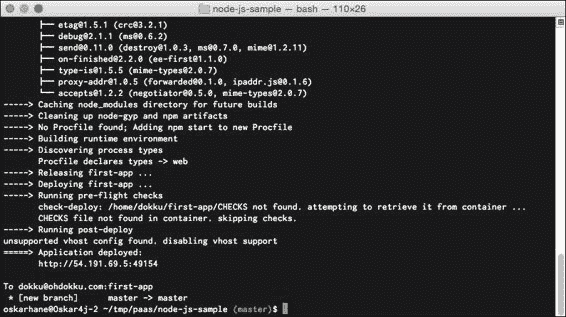
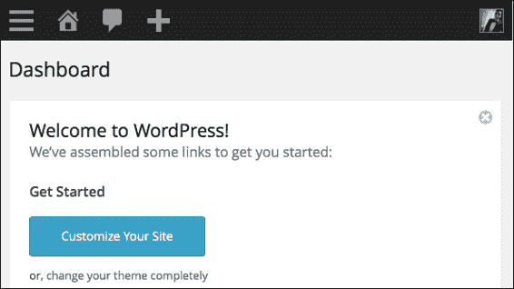

# 第七章。在我们的平台即服务上部署

在前面的章节中，我们通过结合诸如 Crane 和 nginx-proxy 之类的工具，从以一种非常实际的方式建立我们的 PaaS 发展到了一种“被黑在一起的自动化”方式。仍然缺少一部分——如何部署您的代码。

在本章中，我们将讨论以下主题:

*   我们当前设置的问题
*   可用的工具/服务
*   dokku—迷你英雄库
*   用 Dokku 设置一个 WordPress 应用程序

# 我们当前设置的问题

我们当前的设置由三个容器组成:一个 WordPress 容器，一个 MySQL 容器和一个数据量容器，与 Crane 捆绑在一起。

我们当前使用`VOLUME`容器作为文件存储的设置的主要问题是，我们需要一种进入卷中编辑文件的方法。到目前为止，进入它的唯一方法是将它安装在另一个容器上。

另一个问题是我们没有版本控制我们的源代码。我们刚刚下载了 WordPress 和一些插件，并把它留在那里。如果我们更新 WordPress 或者做一些其他的改变呢？我们当然希望在版本控制之下。

如果我们想保持应用程序架构不变，有两种选择:

*   创建一个新的容器，装载我们的数据卷容器，安装它，并通过 SSH 访问它
*   在我们的 WordPress 容器中安装并打开对 SSH 的访问

安装 SSH 后，我们可以从远程机器访问容器外壳，因此，我们可以安装 Git 来对文件进行版本控制。通过这种方式，我们可以在需要时将新代码连接并推入数据量容器。

连接 SSH 时，可以直接进入容器，无需连接 Docker hosts shell。

如果您可以连接到 Docker 主机，从那里，如果您打开一个新的 shell 进入您的数据卷容器，第三个选项将是 SSH 进入您的 Docker 主机，然后使用`docker exec –it container_name /bin/sh`访问容器。

虽然这确实有效，但也有更简单的方法。

# 可用的工具/服务

当我们看到今天可用的托管 PaaS 提供商时，我们会想到其中的两个—OpenShift 和 Heroku。许多开发者喜欢 Heroku，因为它易于使用。他们的哲学给出了一个为什么的提示:

> *“开发者生产率:*
> 
> *开发人员生产力是我们的战斗口号，是我们所做一切的核心。为什么需要三个步骤？零步骤就可以了，为什么还要采取任何行动？”*

开发人员通常希望将时间花在代码上，而不是管理服务器、部署等等。


在 Heroku 上，您可以获得一个远程 Git 存储库，您可以将代码推入其中。您的应用程序的语言和依赖项由特殊文件标识，具体取决于您使用的语言。环境变量用于配置，您可以通过在源代码中包含的名为 **Procfile** 的特殊文件中指定命令来指示 Heroku 执行什么。

每当您将代码推送到远程 Heroku Git 存储库中时，应用程序就会重建，您可以立即在线使用它。如果您有特殊的构建需求，Heroku 允许您创建自己的构建包，您可以在其中指定要做的事情。

基本上，如果你想在 Heroku 上建立一个 WordPress 博客，你需要经过以下步骤:

1.  本地下载最新版本的 WordPress。
2.  创建一个 Procfile 并定义要执行的内容(在这种情况下是一个运行 PHP 和 Apache2 的构建包)。
3.  创建一个`composer.json`文件，指定 PHP 是依赖项。
4.  对 WordPress 配置文件进行一些更改。
5.  创建 Heroku 应用程序，添加附加组件(如数据库)，并在 Heroku 上定义环境变量。
6.  将您的本地代码推送到 Heroku。

当您对代码进行更改时，您只需将 Git 推送到 Heroku 来部署新代码。您不能直接在 Heroku 的服务器上编辑代码，也不能安装主题或插件(您必须在本地完成并推送新代码)。


如果你选择像 OpenShift 这样的提供商，你将对你的 PaaS 有更多的控制，你可以用 SSH 连接到它，也可以存储应用程序下载的静态文件。

我们正在寻找这样的东西；只是我们想托管自己的平台，让 Docker 容器在后台使用。

# doku–坞站式微型英雄库

Dokku 可以在[https://github.com/progrium/dokku](https://github.com/progrium/dokku)找到。这是一个由作者描述如下的项目:

> *“Docker 在大约 100 行 Bash 中为迷你英雄库提供动力。”*

就功能而言，Dokku 执行部署的方式与 Heroku 相同。让我们安装 Dokku 并看看它能为我们的 PaaS 做些什么。

## 安装

Dokku 需要运行 Ubuntu 14.04，我们从创建一个运行它的新 EC2 实例开始。

下面是我们看到的截图:


当我们创建了一个实例并使其启动和运行时，我们可以从安装 Docker 本身开始:

```
sudo apt-get install docker.io

```

完成后，我们继续安装 Dokku。

推荐的引导 bash 安装对我不起作用，所以我克隆了 repo:

```
cd /tmp
git clone https://github.com/progrium/dokku.git
cd dokku
sudo make install
dokku version

```

### 注

您可以在[http://progrium.viewdocs.io/dokku/installation](http://progrium.viewdocs.io/dokku/installation)的官方安装页面上了解安装过程。

安装过程需要一段时间，但应该会成功。

根据前面链接的文档，我们应该编辑`/home/dokku/VHOST`文件来保存我们计划使用的域名的内容。我们现在跳过这个，因为它包括设置一些域名系统记录。当我们将该文件留空时，我们将以`http://ip:port`的形式到达我们的 PaaS。稍后我们将回到这一步。

现在剩下的唯一步骤是在我们的本地机器上创建一个`ssh`密钥对，并将公共部分添加到服务器用户 Dokku 的`authorized_keys`文件中，这样我们就可以以非常安全的方式与 Git 连接，而无需使用密码。

在您的本地机器上，使用以下命令:

```
cd ~/.ssh
ssh-keygen –t rsa
#I named my key pair id_rsa
cat id_rsa.pub
#copy the output so you have it in your clipboard

```

在服务器上，使用以下命令:

```
#As your ubuntu user
#Replace <publickey> with the key you just copied
#<remoteuser> can be replaced with anything, like "remoteuser".
echo "<publickey>" | sudo sshcommand acl-add dokku <remoteuser>

```

如果你将你的`ssh-key`命名为`id_rsa`以外的东西，你将不得不编辑你的本地`.ssh/config`文件来使它工作。

现在 Dokku 配置完成了，我们应该可以开始使用它了。

## 创建 Dokku 示例应用程序

是时候我们设置一个演示应用程序了，这样你就可以学习这个过程了。在这种情况下，让我们以 Heroku 的`Node.js`示例应用为例。

我们从克隆 Heroku 的`node-js-sample` GitHub 存储库开始，获取应用程序的内容。以下任务都应该在你的本地机器上完成，当我进入**server.com**时，你应该输入你的服务器的网址或 IP 地址。如果您使用域，请确保您已经为其设置了域名系统记录，或者在本地`/etc/hosts`文件中输入了记录:

```
#Clone the repo
git clone git@github.com:heroku/node-js-sample.git
cd node-js-sample
#Add a Dokku git remote
git remote add dokku dokku@server.com:first-app

#Push to Dokku
git push dokku master

```

当我们推送至 Dokku 中一个不存在的分支或应用名称时，Dokku 会创建一个新的应用并进行部署。推送完成后，您应该会在输出的底部看到类似这样的内容:

```
=====> Application deployed:
 http://54.191.69.5:49154

```

当然，IP 地址和端口对你来说不会一样。

显示输出，如下所示:



在你的网络浏览器中进入`ip:port`找到你自己的页面，说**你好世界**。我们刚刚在 Dokku 上部署了第一个应用程序！

要修改和重新部署站点，我们可以在`node-js-sample`项目中的`public/ folder`内创建一个名为`index.html`的文件。此节点应用程序将始终在公共文件夹中查找文件。如果找不到请求的文件，应用程序将返回到打印**你好世界**。因此，如果我们创建一个文件并请求它，节点服务器会将它提供给我们。

将其粘贴为`index.html`文件的内容:

```
<!DOCTYPE html>
<html lang="en">
  <head>
    <meta charset="utf-8">
    <title>Hello</title>
  </head>
  <body>
    <h1>First edit!</h1>
  </body>
</html>
```

这是一个简单的网页。

让我们继续创建文件并推送，如下代码所示:

```
nano public/index.html
#paste the HTML
#save the file

#commit your changes
git add public/index.html
git commit –m "Added first HTML page."

#push to dokku
git push dokku master

```

### 注

从输出中注意到，每次部署时端口都会改变，因为会创建一个新容器，而旧容器会关闭。

稍后，当我们添加一个要部署的域名时，URL 当然是相同的。Nginx 配置文件在部署时更新。将你的浏览器指向新的`ip:port`，你会看到一个巨大的标题写着**先编辑！**。

每当你做编辑时，只需推送它们。多库会处理剩下的。

## 多库是如何工作的

正如我之前描述的 Heroku 的基本步骤，在 Dokku 上部署时，你可能会认出这些步骤，这也是 Dokku 的目标。他们希望像我们这样的人对部署过程感到满意。

Dokku 可以看作是以下工具之间的粘合剂:Docker、Buildstep、ssh-command、pluginhook、ssh、git 和 nginx。源代码只有大约 100 行长，它附带了几个插件，总共包含大约 500 行代码。这就是 Dokku 的力量——任何人都可以编写插件来扩展 Dokku 的功能。

我们还没有安装任何插件，像我们这样干净的安装只能做一些基本的事情，比如部署、查看应用程序的日志、删除应用程序以及在应用程序的容器中运行命令。还有相当多的外挂；它们都列在[http://progrium.viewdocs.io/dokku/plugins](http://progrium.viewdocs.io/dokku/plugins)上。

### 接收过程

如果我们查看主 Dokku 文件(在项目根中命名为`dokku`，我们注意到每当`receive`动作被触发时(当我们推送到主分支时发生)，我们会看到以下代码:

```
case "$1" in
  receive)
    APP="$2"; IMAGE="dokku/$APP"
    echo "-----> Cleaning up ..."
    dokku cleanup
    echo "-----> Building $APP ..."
    cat | dokku build $APP
    echo "-----> Releasing $APP ..."
    dokku release $APP
    echo "-----> Deploying $APP ..."
    dokku deploy $APP
    echo "=====> Application deployed:"
         dokku urls $APP | sed "s/^/       /"
    echo
    ;;
```

通过这个输出，我们可以识别什么时候我们已经推给了主人。

如果我们在调用`deploy`时遵循插件链，我们最终会得到一个名为`post-deploy`的插件钩子。一个名为`nginx-vhosts`的标准插件被触发，这又调用了该插件中名为`nginx:build-config`的函数。

前面文件中的代码片段如下所示:

```
case "$1" in
  nginx:build-config)
    APP="$2"; DOKKU_APP_LISTEN_PORT="$3"; DOKKU_APP_LISTEN_IP="${4}"
    VHOST_PATH="$DOKKU_ROOT/$APP/VHOST"
    WILDCARD_SSL="$DOKKU_ROOT/tls"
    SSL="$DOKKU_ROOT/$APP/tls"

    if [[ -z "$DOKKU_APP_LISTEN_PORT" ]] && [[ -f "$DOKKU_ROOT/$APP/PORT" ]]; then
      DOKKU_APP_LISTEN_PORT=$(< "$DOKKU_ROOT/$APP/PORT")
    fi
    if [[ -z "$DOKKU_APP_LISTEN_IP" ]] && [[ -f "$DOKKU_ROOT/$APP/IP" ]]; then
      DOKKU_APP_LISTEN_IP=$(< "$DOKKU_ROOT/$APP/IP")
    fi

    [[ -f "$DOKKU_ROOT/$APP/ENV" ]] && source $DOKKU_ROOT/$APP/ENV

    if [[ ! -n "$NO_VHOST" ]] && [[ -f "$DOKKU_ROOT/$APP/VHOST" ]]; then
      ...
      NGINX_CONF="$PLUGIN_PATH/nginx-vhosts/templates/nginx.conf"
      SCHEME="http"
      ...
      APP_NGINX_TEMPLATE="$DOKKU_ROOT/$APP/nginx.conf.template"
      if [[ -f $APP_NGINX_TEMPLATE ]]; then
        echo "-----> Overriding default nginx.conf with detected nginx.conf.template"
        NGINX_CONF=$APP_NGINX_TEMPLATE
      fi

      xargs -i echo "-----> Configuring {}..." < $VHOST_PATH
      # Include SSL_VHOSTS so we can redirect http to https on that hostname as well
      NOSSL_SERVER_NAME=$(echo $NONSSL_VHOSTS $SSL_VHOSTS| tr '\n' ' ')

      if [[ -n "$DOKKU_APP_LISTEN_PORT" ]] && [[ -n "$DOKKU_APP_LISTEN_IP" ]]; then
        echo "-----> Creating $SCHEME nginx.conf"
        echo "upstream $APP { server $DOKKU_APP_LISTEN_IP:$DOKKU_APP_LISTEN_PORT; }" > $DOKKU_ROOT/$APP/nginx.conf
        eval "cat <<< \"$(< $NGINX_CONF)\" >> $DOKKU_ROOT/$APP/nginx.conf"

        echo "-----> Running nginx-pre-reload"
        pluginhook nginx-pre-reload $APP $DOKKU_APP_LISTEN_PORT $DOKKU_APP_LISTEN_IP

        echo "       Reloading nginx"
        restart_nginx
      fi
    else
      if [[ -f "$DOKKU_ROOT/$APP/VHOST" ]]; then
        echo "-----> VHOST support disabled, deleting $APP/VHOST"
        rm "$DOKKU_ROOT/$APP/VHOST"
      fi
      if [[ -f "$DOKKU_ROOT/$APP/nginx.conf" ]]; then
        echo "-----> VHOST support disabled, deleting nginx.conf"
        rm "$DOKKU_ROOT/$APP/nginx.conf"

        echo "-----> VHOST support disabled, reloading nginx after nginx.conf deletion"
        restart_nginx
      fi
    fi
    ;;
```

如果我们查看这段代码，我们可以看到它在`$DOKKU_ROOT/$APP/VHOST`文件中寻找一个域名，如果找到了，设置一些配置变量，并将它们插入到`templates/nginx.conf`文件的副本中。

该文件包含以下内容:

```
server {
  listen      [::]:80;
  listen      80;
  server_name $NOSSL_SERVER_NAME;
  location    / {
    proxy_pass  http://$APP;
    proxy_http_version 1.1;
    proxy_set_header Upgrade \$http_upgrade;
    proxy_set_header Connection "upgrade";
    proxy_set_header Host \$http_host;
    proxy_set_header X-Forwarded-Proto \$scheme;
    proxy_set_header X-Forwarded-For \$remote_addr;
    proxy_set_header X-Forwarded-Port \$server_port;
    proxy_set_header X-Request-Start \$msec;
  }
  include $DOKKU_ROOT/$APP/nginx.conf.d/*.conf;
}
```

这看起来很像我们在上一章中创建的 nginx 配置，对吗？多库的部署后部分基本上是杰森·怀尔德的`nginx-proxy`。他们实现了同样的结果，但是他们以非常不同的方式到达那里。

## doku 插件

Heroku 中的插件在 Dokku 中被称为插件。由于不能直接从 Dokku 指定`docker` `run`命令参数，需要插件连接容器，添加数据量容器。

下面是一些我们很快会用到的可用 Dokku 插件的列表。

### doku 域插件

Dokku 域插件可以让你在一个应用中指定多个域。默认情况下，一个应用只能对应一个网址:

```
dokku domains:set myawesomeapp.com www.myawesomeapp.com

```

URL:https://github . com/wmluke/doku 域插件

### doku 坞站选项

有了这个插件，当`docker run`命令被执行时，你可以将任何选项传递给Docker 守护进程。它可以用来挂载卷、链接容器等等:

```
dokku docker-options:add myapp "-v /host/path:/container/path"
dokku docker-options:add myapp "-link container_name:alias"
```

URL:[https://github . com/Dyson/doku 坞站选项](https://github.com/dyson/dokku-docker-options)

### 多库的音量插件

这里有一个插件，可以让你在服务容器上装载卷。它还具有转储(导出)和恢复数据的命令:

```
dokku volume:add foo /path/in/container
dokku volume:dump foo /path/in/container > foo.tar.gz

```

URL:https://github . com/ohardy/doku 卷

### doku 链接

你可以用这个插件链接容器:

```
dokku link:create <app> NAME [ALIAS]
dokku link:delete <app> NAME [ALIAS]

```

URL:https://github . com/WLAN/doku 链接

### MariaDB 插件 for dokku

这个插件允许你创建和使用 MariaDB 容器。MariaDB 可以作为 MySQL 的替代品，通常速度更快:

```
dokku mariadb:create <app>
dokku mariadb:link <app> <db>
dokku mariadb:dumpraw <app>

```

URL:https://github . com/klo adut/doku-MD 插件

MySQL 外挂程式:[https://github . com/hughfletcher/doku MySQL 外挂程式](https://github.com/hughfletcher/dokku-mysql-plugin)

# 用 Dokku 设置一个 WordPress 应用

现在我们已经和 Dokku 玩了一段时间，探索它是如何工作的，以及有什么插件可用，是时候建立一个 WordPress 网站了。毕竟，这就是我们最初探索它的原因。

这就是我们要做的:

1.  创建一个新的本地 Git 存储库，并在上面下载 WordPress。
2.  安装 MariaDB 插件，创建一个数据库，并将其链接到我们的应用程序。
3.  配置 WordPress 连接到我们的链接数据库。

在您的本地计算机上，下载并解压缩最新版本的 WordPress，并创建一个新的 Git 存储库。创建一个`composer.json`文件，告诉 Dokku 这是我们正在创建的一个 PHP 应用。

### 注

你可以阅读更多关于如何在你在[https://devcenter.heroku.com/articles/buildpacks](https://devcenter.heroku.com/articles/buildpacks)创建的什么类型的应用上提示 Dokku(是的，Dokku 使用 Heroku buildpacks)并寻找检测功能。Dokku 使用名为 Buildstep 的库，使用 Docker 和 Buildpacks 构建应用程序。

让我们开始吧。

我在我的域名[ohdokku.com](http://ohdokku.com)上使用了一个服务器，用于这个应用:

```
#Download Wordpress
curl -O https://wordpress.org/latest.zip
unzip latest.zip
mv wordpress wp1
cd wp1

#Create a new Git repo
git init
git add .
git commit –m "Initial commit."

#Create a composer.json file to tell Dokku we are using php
echo '{}' > composer.json
git add .
git commit -am "Add composer.json for PHP app detection."

#Add a remote so we can push to Dokku
git remote add dokku dokku@ohdokku.com:wp1

```

在服务器上，我们必须安装 MariaDB 或 MySQL 插件:

```
cd /var/lib/dokku/plugins
sudo git clone --recursive https://github.com/Kloadut/dokku-md-plugin mariadb
cd mariadb/dockerfiles/
git checkout master
cd ../../
sudo dokku plugins-install

```

回到客户端(您也可以在服务器上做到这一点，但是这种类型的 PaaS 的关键是能够在客户端上做所有这些重复的事情)。

结果如下:


如您所见，create 命令的输出将显示我们的数据库凭据。

现在数据库已经建立，我们可以第一次推送我们的应用程序:

```
git push dokku master

```

您应该注意到，Dokku 检测到您正在推送一个 PHP 应用程序。由于我们在`composer.json`文件中没有指定任何内容，一个缺省的 PHP 和 Apache2 包将会启动。

创建一个名为 wp1_db 的 MariaDB 数据库:

```
ssh dokku@ohdokku.com mariadb:create wp1_db
ssh dokku@ohdokku.com mariadb:link wp1 wp1_db

```

如果我们在浏览器中进入`ip:port`，一个已知的页面欢迎我们 WordPress 安装页面。当我们点击**继续**按钮时，我们看到在我们创建`wp-config.php`文件之前我们不能继续。

我们刚刚创建了 MariaDB 容器和 WP 容器之间的链接，但是我们还没有在代码中创建链接。WordPress 不知道如何连接到数据库。

我们首先将`wp-config-sample.php`文件重命名为`wp-config.php`，并在编辑器中打开该文件:

```
// ** MySQL settings - You can get this info from your web host ** //
/** The name of the database for Wordpress */
define('DB_NAME', getenv('DB_NAME'));

/** MySQL database username */
define('DB_USER', 'root');

/** MySQL database password */
define('DB_PASSWORD', getenv('DB_PASSWORD'));

/** MySQL hostname */
define('DB_HOST', getenv('DB_HOST').":".getenv('DB_PORT'));
```

编辑您刚才看到的凭据，让 WordPress 查找我们链接的 MariaDB 给我们的环境变量:

```
git add –A .
git commit –m "Add wp-config.php and add credentials."
git push dokku master

```

等到你得到一个新的`ip:port`，我们的应用被部署到这里，然后在你的网络浏览器中输入信息。

现在你应该可以安装 WordPress 了。

输出如下:



## 启动多个应用

要用 Dokku 启动多个应用，只需重复简单过程，如下所示:

1.  创建一个带有 WordPress 的本地 Git 存储库，并创建一个远程 Git 存储库。
2.  Create and link a database with the MariaDB plugin.

    编辑您的`wp-config.php`文件。

3.  推进部署。

从 Git 命令添加`remote`时，您在应用程序上设置的名称:

```
git remote add dokku dokku@ohdokku.com:wp1

```

该命令将创建 WordPress 网站的网址([wp1.ohdokku.com](http://wp1.ohdokku.com))。你可以设置一个完整的自定义域名，比如:`git remote add dokku dokku@ohdokku.com:wp1.oskarhane.com`如果我把[wp1.oskarhane.com](http://wp1.oskarhane.com)指向我的服务器，它就会工作。

## 给 Dokku 添加一个域

我一直在等待设置 Dokku 的域名，因为这涉及到登录域名系统提供商并设置域名系统记录以将域名指向我们的服务器。我们设置域名系统记录将我们的域名指向我们服务器的 IP 地址，这样通过在网络浏览器的地址栏中输入我们的域名就可以访问我们的服务器。

我通常使用亚马逊路由 53 来处理域名的域名系统，因为它们非常稳定且易于使用。流量低的网站一个月要花一美元左右。任何域名系统提供商的设置都是相同的。你必须添加两条记录，一条用于`yourdomain.com`，一条用于`*.yourdomain.com`。

我们要输入的记录是 A 记录，也就是说我们把域名指向一个特定的 IPv4 地址。**生存时间** ( **TTL** )值现在并不重要，但它意味着 TTL，并告诉所有其他获得该域请求的域名系统服务器他们可以缓存当前值多长时间。

输出如下:


你当然应该把 IP 改成你服务器拥有的公共 IP 。为通配符子域设置 A 记录时，只需在顶部的输入栏中输入 *** 。

要查看您的 DNS 提供商是否可以解析您的域名，请在终端中执行`ping yourdomain.com`。你会看到解析的知识产权就在那里。如果您刚刚购买了该域，您应该可以立即看到结果，但是如果您已经使用该域一段时间，旧的 TTL 值可能会稍微延迟效果。

如果要等待 DNS 记录的设置(这在开发过程中很常见)，可以通过编辑`/etc/hosts`文件在电脑上设置本地记录，如下命令片段所示:

```
sudo nano /etc/hosts

#Add this line to the file
54.191.69.5 ohdokku.com
#Save and exit

```

这里需要记住的一点是不能为通配符子域输入记录。如果你计划在子域上开发多个应用，你必须为每个子域输入一条记录。此外，完成后不要忘记删除这些记录；当你忘记你有你使用的域名的记录时，它会变得非常混乱(和有趣)。

在 Dokku 服务器上，创建一个名为`/home/dokku/VHOST`的文件，并在其中输入`yourdomain.com`。

从现在开始创建的所有应用程序都将是该域的子域，除非您给应用程序提供完整的域名。

## 关于多库的更多说明

就像 Heroku 一样，Dokku 让开发者很容易部署和推送代码。如果你直接从你的 Dokku 应用程序下载一个 WordPress 插件，当你重启 Dokku 应用程序时，它就会消失。建议保留一个易于启动的本地副本，或者一个开发、测试和暂存服务器，您可以从中下载新插件并将其推送到您的 Dokku 应用程序，以确保它们是持久的。

### 类型

当使用这种基础设施时，图像和视频应该通过插件上传到像亚马逊这样的地方。

您还必须让您的 WordPress 站点从外部电子邮件提供商(如 Mandrill)发送电子邮件。像 WP Mail SMTP 这样的插件可以为你解决这个问题。

在 Dokku 上部署 WordPress 应用时，我们还有一些手动步骤(例如下载 WordPress 和编辑`wp-config.php`)要做，但是创建自定义 Buildstep 来移除手动部分的任务超出了本书的范围。

另一个选择是让 Composer 用`composer.json`文件来处理 WordPress 的安装，但是 WordPress 并不正式支持这个，它需要一些黑客攻击，所以就交给你了。

### 注

如果你想了解更多关于作曲家的知识，你可以去提供的链接[http://wpackagist.org](http://wpackagist.org)。

# 总结

在本章中，我们通过向流程中添加部署来创建自己的 PaaS。到本章为止，我们所研究的都是关于组织集装箱和引导进入的交通，以便游客可以到达正确的集装箱。

有了多库，我们就不用担心这个了；我们只需要关心我们的代码。一旦我们推送代码，Dokku 就会接管并做正确的事情。Dokku 使它看起来非常简单，这就是为什么，我从手动创建和链接容器以及配置反向代理开始，这样您就可以理解 Dokku 的工作了。

下一章把我们带到了流血的边缘:现在正在开发什么可以让 Docker 的私有 PaaS 更进一步？