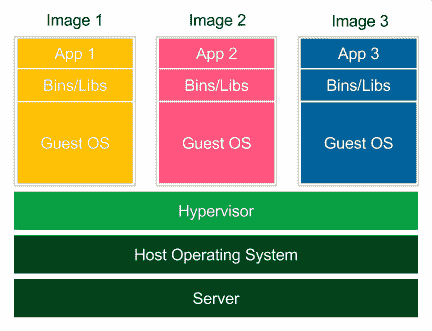
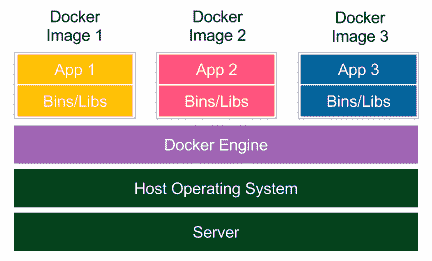
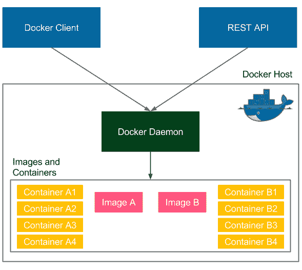
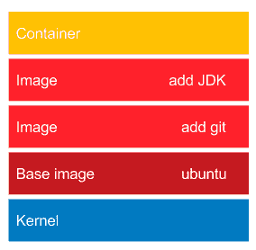
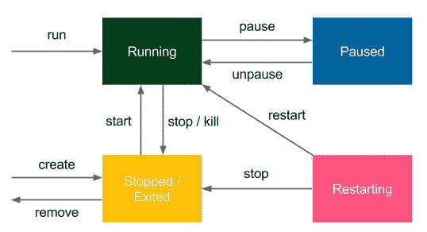
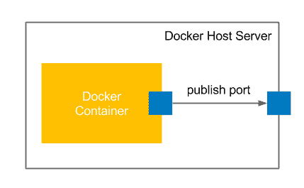
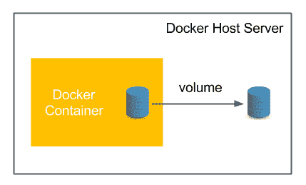

# 二、Docker介绍

我们将通过介绍 Docker 来讨论现代持续交付流程应该是什么样子，Docker 是改变了 IT 行业和服务器使用方式的技术。

本章包括以下几点:

*   引入虚拟化和容器化的概念
*   为不同的本地和服务器环境安装 Docker
*   解释 Docker 工具包的体系结构
*   用 Dockerfile 构建 Docker 映像并提交更改
*   作为 Docker 容器运行应用
*   配置 Docker 网络和端口转发
*   引入 Docker 卷作为共享存储

# 什么是 Docker？

Docker 是一个开源项目，旨在使用软件容器帮助应用部署。这段引文来自 Docker 官方页面:

"Docker containers wrap a piece of software in a complete filesystem that contains everything needed to run: code, runtime, system tools, system libraries - anything that can be installed on a server. This guarantees that the software will always run the same, regardless of its environment."

因此，Docker 以类似于虚拟化的方式，允许将应用打包成可以在任何地方运行的映像。

# 容器化与虚拟化

没有 Docker，使用硬件虚拟化(通常称为虚拟机)可以实现隔离和其他好处。最受欢迎的解决方案是 VirtualBox、VMware 和 Parallels。虚拟机模拟计算机体系结构，并提供物理计算机的功能。如果每个应用都作为单独的虚拟机映像交付和运行，我们就可以实现应用的完全隔离。下图展示了虚拟化的概念:



每个应用都作为一个独立的映像启动，包含所有依赖项和一个客户操作系统。映像由虚拟机管理程序运行，虚拟机管理程序模拟物理计算机体系结构。这种部署方法得到了许多工具(如游民)的广泛支持，并专用于开发和测试环境。然而，虚拟化有三个明显的缺点:

*   **低性能**:虚拟机模拟整个计算机架构来运行来宾操作系统，因此每个操作都有相当大的开销。
*   **高资源消耗**:仿真需要大量的资源，必须针对每个应用分别进行。这就是为什么在标准的台式计算机上，只有少数应用可以同时运行。
*   **大映像大小**:每个应用都是用完整的操作系统交付的，所以在服务器上部署意味着发送和存储大量数据。

容器化的概念提出了一种不同的解决方案:



每个应用都与其依赖项一起交付，但是没有操作系统。应用直接与主机操作系统接口，因此没有额外的客户操作系统层。它带来了更好的性能，并且不会浪费资源。此外，装运的 Docker 映像明显更小。

请注意，在容器化的情况下，隔离发生在主机操作系统的进程级别。然而，这并不意味着容器共享它们的依赖关系。它们中的每一个都有自己正确版本的库，如果其中任何一个被更新，它对其他的没有影响。为了实现这一点，Docker Engine 为容器创建了一组 Linux 名称空间和控制组。这就是为什么 Docker 安全性基于 Linux 内核进程隔离。这种解决方案虽然足够成熟，但可能被认为比虚拟机提供的基于操作系统的完全隔离稍不安全。

# 对Docker的需求

Docker 容器化解决了传统软件交付中的许多问题。让我们仔细看看。

# 环境

安装和运行软件很复杂。您需要决定操作系统、资源、库、服务、权限、其他软件以及应用所依赖的一切。然后，你需要知道如何安装它。更重要的是，可能会有一些冲突的依赖关系。那你会怎么做？如果您的软件需要升级一个库，而另一个库不需要，该怎么办？在一些公司，这样的问题是通过拥有应用的**类**来解决的，并且每个类都由一个专用的服务器来服务，例如，一个用于 Java 7 的 web 服务的服务器，另一个用于 Java 8 的批处理作业的服务器，等等。然而，这种解决方案在资源方面并不均衡，需要大量的 IT 运营团队来负责所有的生产和测试服务器。

环境复杂性的另一个问题是，它通常需要专家来运行应用。技术水平较低的人可能很难设置 MySQL、ODBC 或任何其他稍微复杂的工具。对于不作为特定于操作系统的二进制文件交付但需要源代码编译或任何其他特定于环境的配置的应用来说，尤其如此。

# 隔离

保持工作空间整洁。一个应用可以改变另一个应用的行为。想象一下会发生什么。应用共享一个文件系统，因此，如果应用 A 向错误的目录写入一些内容，应用 B 将读取不正确的数据。它们共享资源，所以如果应用 A 出现内存泄漏，它不仅可以冻结自身，还可以冻结应用 B，它们共享网络接口，所以如果应用 A 和 B 都使用端口`8080`，其中一个就会崩溃。隔离也涉及到安全方面。运行有问题的应用或恶意软件会对其他应用造成损害。这就是为什么将每个应用保存在单独的沙箱中是一种安全得多的方法，这限制了对应用本身的损害影响范围。

# 组织应用

服务器通常看起来很乱，运行着大量无人知晓的应用。您将如何检查服务器上运行的应用以及它们各自使用的依赖关系？它们可能依赖于库、其他应用或工具。没有详尽的文档，我们所能做的就是查看正在运行的进程并开始猜测。Docker 通过将每个应用作为一个可以列出、搜索和监控的独立容器来组织事情。

# 轻便

<q>写一次，跑哪儿，</q>一边说着口号一边宣传 Java 的最早版本。事实上，Java 很好地解决了可移植性问题；但是，我仍然可以想到一些失败的情况，例如，不兼容的本机依赖关系或旧版本的 Java 运行时。而且，并不是所有的软件都是用 Java 编写的。

Docker 将可移植性的概念提升了一个层次；如果 Docker 版本兼容，则无论编程语言、操作系统或环境配置如何，随附的软件都可以正常工作。因此，Docker 可以用口号<q>来表达，运送整个环境，而不仅仅是代码。</q>

# 小猫和牛

传统软件部署和基于 Docker 的部署之间的区别经常用小猫和牛的类比来表达。每个人都喜欢小猫。小猫很独特。每个都有自己的名字，需要特殊对待。小猫受到情感的对待。他们死的时候我们会哭。相反，牛的存在只是为了满足我们的需求。甚至形式牛也是独一无二的，因为它只是一群被一起对待的动物。没有命名，没有独特性。当然，它们是唯一的(就像每个服务器都是唯一的一样)，但这无关紧要。
这就是为什么 Docker 背后的想法最直接的解释是<q>像对待牛一样对待你的服务器，而不是宠物。</q>

# 替代容器化技术

Docker不是市场上唯一可用的容器化系统。实际上，Docker 的最初版本是基于开源的**LXC**(**Linux Containers**)系统，这是一个容器的替代平台。其他已知的解决方案有 FreeBSD 监狱、OpenVZ 和 Solaris 容器。然而，Docker 超越了所有其他系统，因为它的简单性、良好的营销和创业方法。它可以在大多数操作系统下工作，允许你在不到 15 分钟的时间里做一些有用的事情，有很多简单易用的功能、好的教程、一个很棒的社区，并且可能是信息技术行业最好的标志。

# Docker安装

Docker 的安装过程快速简单。目前，大多数 Linux 操作系统都支持它，并且它们中的许多都提供了专用的二进制文件。本机应用也很好地支持 Mac 和 Windows。然而，重要的是要理解 Docker 在内部是基于 Linux 内核及其细节的，这就是为什么在 Mac 和 Windows 的情况下，它使用虚拟机(xhyve 用于 Mac，Hyper-V 用于 Windows)来运行 Docker Engine 环境。

# Docker的先决条件

Docker 要求对每个操作系统都是特定的。

MAC:

*   2010 年或更高版本，英特尔硬件支持**内存管理单元** ( **MMU** )虚拟化
*   macOS 10.10.3 约塞米蒂或更新版本
*   至少 4GB 内存
*   没有安装 4.3.30 版之前的 VirtualBox

**窗口**:

*   64 位 Windows 10 Pro
*   Hyper-V 软件包已启用

Linux:

*   64 位架构
*   Linux 内核 3.10 或更高版本

如果您的机器不符合要求，那么解决方案是使用安装了 Ubuntu 操作系统的 VirtualBox。这种变通方法虽然听起来很复杂，但并不一定是最糟糕的方法，尤其是考虑到在苹果和视窗系统中，Docker Engine 环境已经虚拟化了。此外，Ubuntu 是使用 Docker 最受支持的系统之一。

All examples in this book have been tested on the Ubuntu 16.04 operating system.

# 在本地计算机上安装

Docker的安装过程是直截了当的，并在其官方网页上有很好的描述。

# Ubuntu Docker

[https://docs . docker . com/engine/installation/Linux/ubuntulinux/](https://docs.docker.com/engine/installation/linux/ubuntulinux/)包含如何在 Ubuntu 机器上安装 Docker 的指南。

在 Ubuntu 16.04 中，我执行了以下命令:

```
$ sudo apt-get update
$ sudo apt-key adv --keyserver hkp://p80.pool.sks-keyservers.net:80 --recv-keys 9DC858229FC7DD38854AE2D88D81803C0EBFCD88
$ sudo apt-add-repository 'deb [arch=amd64] https://download.docker.com/linux/ubuntu xenial main stable'
$ sudo apt-get update
$ sudo apt-get install -y docker-ce
```

所有操作完成后，应安装 Docker。然而，目前唯一被允许使用 Docker 命令的用户是`root`。这意味着`sudo`关键字必须在每个 Docker 命令之前。

我们可以通过将其他用户添加到`docker`组来启用 Docker:

```
$ sudo usermod -aG docker <username>
```

成功注销后，一切都设置好了。然而，对于最新的命令，我们需要采取一些预防措施，不要将 Docker 权限授予不需要的用户，从而在 Docker 引擎中创建一个漏洞。这在服务器上安装的情况下尤其重要。

# Linux Docker

[https://docs.docker.com/engine/installation/linux/](https://docs.docker.com/engine/installation/linux/)包含大多数 Linux 发行版的安装指南。

# Mac Docker

[https://docs.docker.com/docker-for-mac/](https://docs.docker.com/docker-for-mac/)包含如何在 Mac 机器上安装 Docker 的分步指南。它与 Docker 组件集合一起交付:

*   带有 Docker 引擎的虚拟机
*   Docker 机器(用于在虚拟机上创建 Docker 主机的工具)
*   复合Docker
*   Docker 客户端和服务器
*   一个图形用户界面应用

The Docker Machine tool helps in installing and managing Docker Engine on Mac, Windows, on company networks, in data centers, and on cloud providers such as AWS or Digital Ocean.

# Windows

[https://docs.docker.com/docker-for-windows/](https://docs.docker.com/docker-for-windows/)包含如何在 Windows 机器上安装 Docker 的分步指南。它与类似于 Mac 的 Docker 组件集合一起交付。

The installation guides for all supported operating systems and cloud platforms can be found on the official Docker page, [https://docs.docker.com/engine/installation/](https://docs.docker.com/engine/installation/).

# 测试 Docker 安装

无论您选择了哪种安装(苹果、视窗、Ubuntu、Linux 或其他)，Docker 都应该已经设置好并准备好了。最好的测试方法是运行`docker info`命令。输出消息应该类似于下面的消息:

```
$ docker info
Containers: 0
 Running: 0
 Paused: 0
 Stopped: 0
 Images: 0
...
```

# 在服务器上安装

为了通过网络使用 Docker，可以利用云平台提供商，也可以在专用服务器上手动安装 Docker。

在第一种情况下，Docker 配置因平台而异，但在专门的教程中总是有很好的描述。大多数云平台都支持通过用户友好的网络界面创建 Docker 主机，或者描述要在其服务器上执行的确切命令。

第二种情况(手动安装 Docker)需要一些评论。

# 专用服务器

在服务器上手动安装 Docker 与本地安装没有太大区别。

需要两个额外的步骤，包括设置 Docker 守护程序监听网络套接字和设置安全证书。

让我们从第一步开始。默认情况下，由于安全原因，Docker 通过只允许本地通信的非联网 Unix 套接字运行。有必要在选定的网络接口插座上添加监听功能，以便外部客户端可以连接。[https://docs.docker.com/engine/admin/](https://docs.docker.com/engine/admin/)详细描述了每个 Linux 发行版所需的所有配置步骤。

在 Ubuntu 的情况下，Docker 守护进程是由 systemd 配置的，所以为了改变它是如何启动的配置，我们需要修改`/lib/systemd/system/docker.service`文件中的一行:

```
ExecStart=/usr/bin/dockerd -H <server_ip>:2375
```

通过更改这一行，我们可以通过指定的 IP 地址访问 Docker 守护程序。系统配置的所有细节可以在[https://docs.docker.com/engine/admin/systemd/](https://docs.docker.com/engine/admin/systemd/)找到。

服务器配置的第二步涉及 Docker 安全证书。这使得只有通过证书验证的客户端才能访问服务器。Docker 证书配置的全面描述可在[https://docs.docker.com/engine/security/https/](https://docs.docker.com/engine/security/https/)找到。这一步不是严格要求的；但是，除非您的 Docker 守护程序服务器在防火墙网络内部，否则它是必不可少的。

If your Docker daemon is run inside the corporate network, you have to configure the HTTP proxy. The detailed description can be found at [https://docs.docker.com/engine/admin/systemd/](https://docs.docker.com/engine/admin/systemd/).

# 运行 Docker hello world >

Docker 环境已经设置就绪，因此我们可以开始第一个示例。

在控制台中输入以下命令:

```
$ docker run hello-world
Unable to find image 'hello-world:latest' locally
latest: Pulling from library/hello-world
78445dd45222: Pull complete
Digest: sha256:c5515758d4c5e1e838e9cd307f6c6a0d620b5e07e6f927b07d05f6d12a1ac8d7
Status: Downloaded newer image for hello-world:latest

Hello from Docker!
This message shows that your installation appears to be working correctly.
...
```

恭喜，您刚刚运行了第一个 Docker 容器。希望你已经感受到 Docker 有多简单。让我们一步一步地看看引擎盖下发生了什么:

1.  您使用`run`命令运行了 Docker 客户端。
2.  Docker 客户端联系了 Docker 守护进程，请求从名为`hello-world`的映像创建一个容器。
3.  Docker 守护程序检查它是否包含本地的`hello-world`映像，并且由于它不包含，所以从远程 Docker Hub 注册表请求`hello-world`映像。
4.  Docker Hub 注册表包含`hello-world`映像，因此它被拉入 Docker 守护程序。
5.  Docker 守护程序从`hello-world`映像创建了一个新的容器，该容器启动了产生输出的可执行文件。
6.  Docker 守护程序将此输出流式传输到 Docker 客户端。
7.  Docker 客户端将其发送到您的终端。

预计流量如下图所示:


让我们看看本节中说明的每个 Docker 组件。

# Docker组件

官方 Docker 页面这样写道:

"Docker Engine is a client-server application that creates and manages Docker objects, such as images and containers."

让我们弄清楚这意味着什么。

# Docker 客户端和服务器

让我们看一个展示 Docker 引擎架构的图表:



Docker 引擎由三个组件组成:

*   **后台运行的 Docker 守护进程**(服务器)
*   **Docker客户端**作为命令工具运行
*   **REST API**

安装 Docker 引擎意味着安装所有组件，以便 Docker 守护程序始终作为服务在我们的计算机上运行。在`hello-world`示例中，我们使用 Docker 客户端与 Docker 守护程序进行交互；然而，我们可以使用 REST API 做完全相同的事情。同样，在 hello-world 示例中，我们连接到本地 Docker 守护程序；但是，我们可以使用同一个客户端与运行在远程机器上的 Docker 守护程序进行交互。

To run the Docker container on a remote machine, you can use the `-H` option:  `docker -H <server_ip>:2375 run hello-world`

# Docker映像和容器

映像是 Docker 世界中的无状态构建块。您可以将映像想象成运行应用所需的所有文件的集合，以及如何运行它的方法。映像是无状态的，因此您可以通过网络发送它，将它存储在注册表中，命名它，对它进行版本化，并将其保存为文件。映像是分层的，这意味着您可以在另一个映像的基础上构建一个映像。

容器是映像的运行实例。如果我们想拥有同一个应用的许多实例，我们可以从同一个映像创建许多容器。因为容器是有状态的，所以我们可以与它们交互，并更改它们的状态。

让我们看看容器和映像层结构的例子:



在底部，总是有基本映像。在大多数情况下，它代表一个操作系统，我们在现有基础映像的基础上构建映像。从技术上来说，创建自己的基本映像是可能的，但是这是很少需要的。

在我们的示例中，`ubuntu`基础映像提供了 Ubuntu 操作系统的所有功能。`add git`图片增加了 Git 工具包。然后，有一个添加了 JDK 环境的映像。最后，在顶部，有一个由`add JDK`映像创建的容器。例如，这样的容器能够从 GitHub 存储库中下载一个 Java 项目，并将其编译成一个 JAR 文件。因此，我们可以使用这个容器来编译和运行 Java 项目，而无需在我们的操作系统上安装任何工具。

需要注意的是，分层是节省带宽和存储的非常聪明的机制。假设我们有一个同样基于`ubuntu`的应用:


这次我们将使用 Python 解释器。安装`add python`镜像的时候，Docker 守护程序会注意到`ubuntu`镜像已经安装好了，只需要添加`python`层就可以了，非常小。所以`ubuntu`映像是一个被重用的依赖。如果我们希望在网络中部署我们的映像，也是如此。当我们部署 Git 和 JDK 应用时，我们需要发送整个`ubuntu`映像。然而，在随后部署`python`应用时，我们只需要发送小的`add python`层。

# Docker申请

许多应用都是以 Docker 映像的形式提供的，可以从互联网上下载。如果我们知道映像的名称，那么用我们在 hello world 示例中使用的相同方式运行它就足够了。我们如何在 Docker Hub 上找到所需的应用映像？

让我们以 MongoDB 为例。如果我们想在 Docker Hub 上找到它，我们有两个选择:

*   搜索Docker集线器浏览页面(https://hub . docker . com/explore/)
*   使用`docker search`命令

在第二种情况下，我们可以执行以下操作:

```
$ docker search mongo
NAME DESCRIPTION STARS OFFICIAL AUTOMATED
mongo MongoDB document databases provide high av... 2821 [OK] 
mongo-express Web-based MongoDB admin interface, written... 106 [OK] 
mvertes/alpine-mongo light MongoDB container 39 [OK]
mongoclient/mongoclient Official docker image for Mongoclient, fea... 19 [OK]
...
```

有很多有趣的选择。我们如何选择最好的形象？通常，最吸引人的是没有任何前缀的那个，因为这意味着它是一个正式的 Docker Hub 映像，因此应该是稳定和维护的。带有前缀的图片是非官方的，通常作为开源项目维护。在我们的例子中，最好的选择似乎是`mongo`，所以为了运行 MongoDB 服务器，我们可以运行以下命令:

```
$ docker run mongo
Unable to find image 'mongo:latest' locally
latest: Pulling from library/mongo
5040bd298390: Pull complete
ef697e8d464e: Pull complete
67d7bf010c40: Pull complete
bb0b4f23ca2d: Pull complete
8efff42d23e5: Pull complete
11dec5aa0089: Pull complete
e76feb0ad656: Pull complete
5e1dcc6263a9: Pull complete
2855a823db09: Pull complete
Digest: sha256:aff0c497cff4f116583b99b21775a8844a17bcf5c69f7f3f6028013bf0d6c00c
Status: Downloaded newer image for mongo:latest
2017-01-28T14:33:59.383+0000 I CONTROL [initandlisten] MongoDB starting : pid=1 port=27017 dbpath=/data/db 64-bit host=0f05d9df0dc2
...
```

仅此而已，MongoDB 已经开始了。将应用作为 Docker 容器运行就这么简单，因为我们不需要考虑任何依赖关系；它们都与映像一起交付。

On the Docker Hub service, you can find a lot of applications; they store more than 100,000 different images.

# 建筑映像

Docker 可以被视为运行应用的有用工具；然而，真正的力量在于构建自己的 Docker 映像，将程序与环境包装在一起。在本节中，我们将看到如何使用两种不同的方法来实现这一点，Docker `commit`命令和 Dockerfile 自动构建。

# Docker 提交

让我们从一个例子开始，用 Git 和 JDK 工具包准备一个映像。我们将使用 Ubuntu 16.04 作为基础映像。没有必要去创造它；Docker Hub 注册表中提供了大多数基本映像:

1.  从`ubuntu:16.04`运行一个容器，并将其连接到其命令行:

```
 $ docker run -i -t ubuntu:16.04 /bin/bash
```

我们已经提取了`ubuntu:16.04`映像并将其作为一个容器运行，然后以交互方式调用`/bin/bash`命令(`-i`标志)。你应该看看容器的Docker。由于容器是有状态的和可写的，我们可以在它的终端做任何我们想做的事情。

2.  安装 Git 工具包:

```
 root@dee2cb192c6c:/# apt-get update
 root@dee2cb192c6c:/# apt-get install -y git
```

3.  检查是否安装了 Git 工具包:

```
 root@dee2cb192c6c:/# which git
 /usr/bin/git
```

4.  退出容器:

```
 root@dee2cb192c6c:/# exit
```

5.  通过与`ubuntu`映像进行比较，检查容器中发生了什么变化:

```
 $ docker diff dee2cb192c6c
```

该命令应该打印容器中所有已更改文件的列表。

6.  将容器提交给映像:

```
 $ docker commit dee2cb192c6c ubuntu_with_git
```

我们刚刚创建了第一个 Docker 映像。让我们列出 Docker 主机的所有映像，看看映像是否存在:

```
$ docker images
REPOSITORY       TAG      IMAGE ID      CREATED            SIZE
ubuntu_with_git  latest   f3d674114fe2  About a minute ago 259.7 MB
ubuntu           16.04    f49eec89601e  7 days ago         129.5 MB
mongo            latest   0dffc7177b06  10 days ago        402 MB
hello-world      latest   48b5124b2768  2 weeks ago        1.84 kB
```

不出所料，我们看到了`hello-world`、`mongo`(之前安装过)、`ubuntu`(从 Docker Hub 中提取的基础映像)和新构建的`ubuntu_with_git`。顺便说一下，我们可以观察每个映像的大小，它对应于我们在映像上安装的内容。

现在，如果我们从该映像创建一个容器，它将安装 Git 工具:

```
$ docker run -i -t ubuntu_with_git /bin/bash
root@3b0d1ff457d4:/# which git
/usr/bin/git
root@3b0d1ff457d4:/# exit
```

使用完全相同的方法，我们可以在`ubuntu_with_git`映像上构建`ubuntu_with_git_and_jdk`:

```
$ docker run -i -t ubuntu_with_git /bin/bash
root@6ee6401ed8b8:/# apt-get install -y openjdk-8-jdk
root@6ee6401ed8b8:/# exit
$ docker commit 6ee6401ed8b8 ubuntu_with_git_and_jdk
```

# Dockerfile

使用提交命令手动创建每个 Docker 映像可能会很费力，尤其是在构建自动化和持续交付过程的情况下。幸运的是，有一种内置语言来指定构建 Docker 映像应该执行的所有指令。

让我们从一个类似于 Git 和 JDK 的例子开始。这一次，我们将准备`ubuntu_with_python`映像。

1.  创建一个名为`Dockerfile`的新目录和文件，内容如下:

```
 FROM ubuntu:16.04
 RUN apt-get update && \
 apt-get install -y python
```

2.  运行命令创建`ubuntu_with_python`映像:

```
 $ docker build -t ubuntu_with_python .
```

3.  检查映像是否已创建:

```
$ docker images
REPOSITORY              TAG     IMAGE ID       CREATED            SIZE
ubuntu_with_python      latest  d6e85f39f5b7  About a minute ago 202.6 MB
ubuntu_with_git_and_jdk latest  8464dc10abbb  3 minutes ago      610.9 MB
ubuntu_with_git         latest  f3d674114fe2  9 minutes ago      259.7 MB
ubuntu                  16.04   f49eec89601e  7 days ago         129.5 MB
mongo                   latest  0dffc7177b06   10 days ago        402 MB
hello-world             latest  48b5124b2768   2 weeks ago        1.84 kB
```

我们现在可以从映像中创建一个容器，并检查 Python 解释器是否以与我们在执行`docker commit`命令后完全相同的方式存在。请注意`ubuntu`映像只列出一次，尽管它是`ubuntu_with_git`和`ubuntu_with_python`的基础映像。

在本例中，我们使用了前两条 Dockerfile 指令:

*   `FROM`定义将在其上构建新映像的映像
*   `RUN`指定要在容器内运行的命令

所有Docker文件说明可在官方Docker页面[https://docs.docker.com/engine/reference/builder/](https://docs.docker.com/engine/reference/builder/)找到。最广泛使用的说明如下:

*   `MAINTAINER`定义关于作者的元信息
*   `COPY`将文件或目录复制到映像的文件系统中
*   `ENTRYPOINT`定义哪个应用应该在可执行容器中运行

A complete guide of all Dockerfile instructions can be found on the official Docker page at [https://docs.docker.com/engine/reference/builder/](https://docs.docker.com/engine/reference/builder/).

# 完整的 Docker 应用

我们已经有了所有必要的信息来构建一个完整的 Docker 映像。例如，我们将一步一步地准备一个简单的 Python hello world 程序。无论我们使用什么环境或编程语言，相同的步骤总是存在的。

# 写申请

创建一个新目录，并在该目录中创建一个包含以下内容的`hello.py`文件:

```
print "Hello World from Python!"
```

关闭文件。这是我们应用的源代码。

# 准备环境

我们的环境将在 Dockerfile 中表达。我们需要说明来定义:

*   应该使用什么基础映像
*   (可选)谁是维护者
*   如何安装 Python 解释器
*   如何在映像中包含`hello.py`
*   如何启动应用

在同一个目录中，创建 Dockerfile:

```
FROM ubuntu:16.04
MAINTAINER Rafal Leszko
RUN apt-get update && \
    apt-get install -y python
COPY hello.py .
ENTRYPOINT ["python", "hello.py"]
```

# 建立形象

现在，我们可以像以前一样构建映像:

```
$ docker build -t hello_world_python .
```

# 运行应用

我们通过运行容器来运行应用:

```
$ docker run hello_world_python
```

你应该从 Python 中看到友好的 Hello World！消息。这个例子中最有趣的是，我们能够运行用 Python 编写的应用，而无需在我们的主机系统中安装 Python 解释器。这是可能的，因为打包为映像的应用内部有所有需要的环境。

An image with the Python interpreter already exists in the Docker Hub service, so in the real-life scenario, it would be enough to use it.

# 环境变量

我们已经运行了第一个自制的 Docker 应用。但是，如果应用的执行应该取决于某些条件呢？

例如，在生产服务器的情况下，我们希望将`Hello`打印到日志，而不是控制台，或者我们可能希望在测试阶段和生产阶段有不同的依赖服务。一种解决办法是为每个案件准备一份单独的案卷；不过，还有一个更好的办法，环境变量。

我们把 hello world 应用改成打印`Hello World from` `<name_passed_as_environment_variable> !`。为此，我们需要执行以下步骤:

1.  更改 Python 脚本以使用环境变量:

```
        import os
        print "Hello World from %s !" % os.environ['NAME']
```

2.  构建映像:

```
 $ docker build -t hello_world_python_name .
```

3.  运行容器传递环境变量:

```
 $ docker run -e NAME=Rafal hello_world_python_name
 Hello World from Rafal !
```

4.  或者，我们可以在 Dockerfile 中定义环境变量值，例如:

```
        ENV NAME Rafal
```

5.  然后，我们可以在不指定`-e`选项的情况下运行容器。

```
 $ docker build -t hello_world_python_name_default .
 $ docker run hello_world_python_name_default
 Hello World from Rafal !
```

当我们需要根据 Docker 容器的用途使用不同版本的 Docker 容器时，环境变量尤其有用，例如，为生产和测试服务器提供单独的概要文件。

If the environment variable is defined both in Dockerfile and as a flag, then the command flag takes precedence.

# Docker容器状态

到目前为止，我们运行的每个应用都应该做一些工作并停止。例如，我们已经打印`Hello from Docker!`并退出。但是，有些应用应该连续运行，例如服务。要在后台运行一个容器，我们可以使用`-d` ( `--detach`)选项。我们用`ubuntu`图来试试吧:

```
$ docker run -d -t ubuntu:16.04
```

这个命令启动了 Ubuntu 容器，但是没有将控制台连接到它。我们可以看到它正在使用以下命令运行:

```
$ docker ps
CONTAINER ID IMAGE        COMMAND     STATUS PORTS NAMES
95f29bfbaadc ubuntu:16.04 "/bin/bash" Up 5 seconds kickass_stonebraker
```

该命令打印所有处于运行状态的容器。我们已经退出的旧容器呢？我们可以通过打印所有容器来找到它们:

```
$ docker ps -a
CONTAINER ID IMAGE        COMMAND        STATUS PORTS  NAMES
95f29bfbaadc ubuntu:16.04 "/bin/bash"    Up 33 seconds kickass_stonebraker
34080d914613 hello_world_python_name_default "python hello.py" Exited lonely_newton
7ba49e8ee677 hello_world_python_name "python hello.py" Exited mad_turing
dd5eb1ed81c3 hello_world_python "python hello.py" Exited thirsty_bardeen
6ee6401ed8b8 ubuntu_with_git "/bin/bash" Exited        grave_nobel
3b0d1ff457d4 ubuntu_with_git "/bin/bash" Exited        desperate_williams
dee2cb192c6c ubuntu:16.04 "/bin/bash"    Exited        small_dubinsky
0f05d9df0dc2 mongo        "/entrypoint.sh mongo" Exited trusting_easley
47ba1c0ba90e hello-world  "/hello"       Exited        tender_bell
```

请注意，所有旧容器都处于退出状态。还有两种状态我们还没有观察到:暂停和重启。

下图显示了所有状态及其之间的转换:



暂停 Docker 容器非常罕见，从技术上讲，这是通过使用 SIGSTOP 信号冻结进程来实现的。当容器运行时，重启是一种临时状态，使用`--restart`选项定义重启策略(Docker 守护程序能够在出现故障时自动重启容器)。

该图还显示了用于将 Docker 容器状态从一种更改为另一种的 Docker 命令。
例如，我们可以停止运行 Ubuntu 容器:

```
$ docker stop 95f29bfbaadc

$ docker ps
CONTAINER ID IMAGE COMMAND CREATED STATUS PORTS NAMES
```

We always used the `docker run` command to create and start the container; however, it's possible to just create the container without starting it.

# Docker网络

如今，大多数应用不是孤立运行的，而是需要通过网络与其他系统通信。如果我们想在 Docker 容器中运行网站、web 服务、数据库或缓存服务器，那么我们至少需要了解 Docker 网络的基础知识。

# 运行服务

让我们从一个简单的例子开始，直接从 Docker Hub 运行一个 Tomcat 服务器:

```
$ docker run -d tomcat
```

Tomcat 是一个 web 应用服务器，其用户界面可以通过端口`8080`访问。因此，如果我们在机器上安装了 Tomcat，我们可以在`http://localhost:8080`浏览它。

然而，在我们的例子中，Tomcat 在 Docker 容器中运行。我们以与第一个`Hello World`例子相同的方式开始。我们可以看到它正在运行:

```
$ docker ps
CONTAINER ID IMAGE  COMMAND           STATUS            PORTS    NAMES
d51ad8634fac tomcat "catalina.sh run" Up About a minute 8080/tcp jovial_kare
```

由于它是作为守护进程运行的(带有`-d`选项)，我们不会立即在控制台中看到日志。但是，我们可以通过执行以下代码来访问它:

```
$ docker logs d51ad8634fac
```

如果没有错误，我们应该会看到很多日志，总结 Tomcat 已经启动，可以通过端口`8080`访问。我们可以试着去`http://localhost:8080`，但是我们无法连接。原因是 Tomcat 已经在容器内部启动，我们正试图从外部到达它。换句话说，只有当我们将命令连接到容器中的控制台并在那里检查它时，我们才能到达它。如何让运行中的 Tomcat 可以从外部访问？

我们需要用`-p` ( `--publish`)标志启动指定端口映射的容器:

```
-p, --publish <host_port>:<container_port>
```

因此，让我们首先停止正在运行的容器，并开始一个新的容器:

```
$ docker stop d51ad8634fac
$ docker run -d -p 8080:8080 tomcat
```

等待几秒钟后，Tomcat 一定已经启动，我们应该可以打开它的页面，`http://localhost:8080`。



在大多数常见的 Docker 用例中，这样一个简单的端口映射命令就足够了。我们能够将(微)服务部署为 Docker 容器，并公开它们的端口来实现通信。然而，让我们更深入地了解一下引擎盖下发生的事情。

Docker allows publishing to the specified host network interface with `-p <ip>:<host_port>:<container_port>`.

# 容器网络

我们已经连接到容器内运行的应用。事实上，连接是双向的，因为如果你还记得我们之前的例子，我们从内部执行`apt-get install`命令，包是从互联网上下载的。这怎么可能？

如果查看机器上的网络接口，可以看到其中一个接口叫做`docker0`:

```
$ ifconfig docker0
docker0 Link encap:Ethernet HWaddr 02:42:db:d0:47:db 
 inet addr:172.17.0.1 Bcast:0.0.0.0 Mask:255.255.0.0
...
```

`docker0`接口由 Docker 守护程序创建，以便与 Docker 容器连接。现在，我们可以看到在 Docker 容器中使用`docker inspect`命令创建了哪些接口:

```
$ docker inspect 03d1e6dc4d9e
```

它以 JSON 格式打印所有关于容器配置的信息。其中，我们可以找到与网络设置相关的部分:

```
"NetworkSettings": {
     "Bridge": "",
     "Ports": {
          "8080/tcp": [
               {
                    "HostIp": "0.0.0.0",
                    "HostPort": "8080"
               }
          ]
          },
     "Gateway": "172.17.0.1",
     "IPAddress": "172.17.0.2",
     "IPPrefixLen": 16,
}
```

In order to filter the `docker inspect` response, we can use the `--format` option, for example, `docker inspect --format '{{ .NetworkSettings.IPAddress }}' <container_id>`.

我们可以观察到 Docker 容器有 IP 地址`172.17.0.2`，它用 IP 地址`172.17.0.1`与 Docker 主机通信。这意味着在我们前面的例子中，我们可以使用地址`http://172.17.0.2:8080`访问 Tomcat 服务器，即使没有端口转发。然而，在大多数情况下，我们在服务器机器上运行 Docker 容器，并希望将其公开在外部，因此我们需要使用`-p`选项。

请注意，默认情况下，容器受到主机防火墙系统的保护，不会打开来自外部系统的任何路由。我们可以通过玩`--network`标志并按如下方式设置来改变这个默认行为:

*   `bridge`(默认):通过默认 Docker 桥进行网络连接
*   `none`:无网络
*   `container`:与另一个(指定的)容器连接的网络
*   `host`:主机网络(无防火墙)

不同的网络可以通过`docker network`命令列出和管理:

```
$ docker network ls
NETWORK ID   NAME   DRIVER SCOPE
b3326cb44121 bridge bridge local 
84136027df04 host   host   local 
80c26af0351c none   null   local
```

如果我们指定`none`为网络，那么我们将无法连接到容器，反之亦然；容器没有通往外部世界的网络。`host`选项使容器网络接口与主机相同。它们共享相同的 IP 地址，因此在容器上启动的所有内容在外部都是可见的。最常用的选项是默认选项(`bridge`)，因为它允许我们明确定义应该发布哪些端口。它既安全又可访问。

# 暴露容器港口

我们几次提到容器暴露了端口。事实上，如果我们深入研究 GitHub([https://github.com/docker-library/tomcat](https://github.com/docker-library/tomcat))上的 Tomcat 映像，我们可以注意到 Dockerfile 中的以下一行:

```
EXPOSE 8080
```

这个 Dockerfile 指令表示应该从容器中公开端口 8080。但是，正如我们已经看到的，这并不意味着端口会自动发布。EXPOSE 指令只通知用户应该发布哪些端口。

# 自动端口分配

让我们尝试在不停止第一个容器的情况下运行第二个 Tomcat 容器:

```
$ docker run -d -p 8080:8080 tomcat
0835c95538aeca79e0305b5f19a5f96cb00c5d1c50bed87584cfca8ec790f241
docker: Error response from daemon: driver failed programming external connectivity on endpoint distracted_heyrovsky (1b1cee9896ed99b9b804e4c944a3d9544adf72f1ef3f9c9f37bc985e9c30f452): Bind for 0.0.0.0:8080 failed: port is already allocated.
```

此错误可能很常见。在这种情况下，我们必须自行处理端口的唯一性，或者让 Docker 使用以下版本的`publish`命令自动分配端口:

*   `-p <container_port>`:将容器端口发布到未使用的主机端口
*   `-P` ( `--publish-all`):将容器暴露的所有端口发布到未使用的主机端口；

```
$ docker run -d -P tomcat
 078e9d12a1c8724f8aa27510a6390473c1789aa49e7f8b14ddfaaa328c8f737b

$ docker port 078e9d12a1c8
8080/tcp -> 0.0.0.0:32772
```

我们可以看到第二个 Tomcat 已经发布到端口`32772`，所以可以在`http://localhost:32772`浏览。

# 使用 Docker 卷

假设您希望将数据库作为一个容器运行。您可以启动这样的容器并输入数据。存放在哪里？当您停止或移除容器时会发生什么？您可以启动新的，但数据库将再次为空。除非是你的测试环境，否则你不会想到这样的场景。

Docker 卷是安装在容器内部的 Docker 主机的目录。它允许容器像写入自己的文件系统一样写入主机的文件系统。该机制如下图所示:



Docker 卷支持容器数据的持久化和共享。卷也清楚地将处理与数据分开。

让我们从一个例子开始，用`-v <host_path>:<container_path>`选项指定音量并连接到容器:

```
$ docker run -i -t -v ~/docker_ubuntu:/host_directory ubuntu:16.04 /bin/bash
```

现在，我们可以在容器的`host_directory`中创建一个空文件:

```
root@01bf73826624:/# touch host_directory/file.txt
```

让我们检查该文件是否是在 Docker 主机的文件系统中创建的:

```
root@01bf73826624:/# exit
exit

$ ls ~/docker_ubuntu/
file.txt
```

我们可以看到文件系统是共享的，因此数据是永久保存的。我们现在可以停止容器并运行一个新的容器来查看我们的文件是否还在:

```
$ docker stop 01bf73826624

$ docker run -i -t -v ~/docker_ubuntu:/host_directory ubuntu:16.04 /bin/bash
root@a9e0df194f1f:/# ls host_directory/
file.txt

root@a9e0df194f1f:/# exit
```

不使用`-v`标志指定卷，可以在 Dockerfile 中指定卷作为指令，例如:

```
VOLUME /host_directory
```

在这种情况下，如果我们在没有`-v`标志的情况下运行 docker 容器，那么容器的`/host_directory`将被映射到主机的默认卷目录`/var/lib/docker/vfs/`。如果您将应用作为映像交付，并且您知道它由于某种原因需要永久存储(例如，存储应用日志)，这是一个很好的解决方案。

If the volume is defined both in Dockerfile and as a flag, then the command flag takes precedence.

Docker 卷可能要复杂得多，尤其是在数据库的情况下。然而，Docker 卷中更复杂的用例超出了本书的范围。

A very common approach to data management with Docker is to introduce an additional layer in the form of data volume containers. A data volume container is a Docker container whose only purpose is to declare the volume. Then, other containers can use it (with the `--volumes-from <container>` option) instead of declaring the volume directly. Read more at [https://docs.docker.com/engine/tutorials/dockervolumes/#creating-and-mounting-a-data-volume-container](https://docs.docker.com/engine/tutorials/dockervolumes/#creating-and-mounting-a-data-volume-container).

# 在 Docker 中使用名称

到目前为止，当我们对容器进行操作时，我们总是使用自动生成的名称。这种方法有一些优点，比如名字是唯一的(没有命名冲突)和自动的(不需要做任何事情)。然而，在许多情况下，最好为容器或映像提供一个真实的用户友好的名称。

# 命名容器

命名容器有两个很好的理由:便利性和自动化的可能性:

*   方便，因为对容器进行按名称寻址的操作比检查哈希或自动生成的名称更简单
*   自动化，因为有时我们希望依赖于容器的特定命名

例如，我们希望拥有相互依赖的容器，并且希望一个容器链接到另一个容器。因此，我们需要知道他们的名字。

要命名容器，我们使用`--name`参数:

```
$ docker run -d --name tomcat tomcat
```

我们可以(通过`docker ps`)检查容器是否有一个有意义的名称。此外，因此，可以使用容器的名称执行任何操作，例如:

```
$ docker logs tomcat
```

请注意，当容器被命名时，它不会失去其身份。我们仍然可以像以前一样，通过它的自动生成的散列标识来寻址容器。

The container always has both ID and name. It can be addressed by any of them and both of them are unique.

# 标记映像

映像可以被标记。我们已经在创建自己的映像时做到了这一点，例如，在构建`hello-world_python`映像的情况下:

```
$ docker build -t hello-world_python .
```

`-t`标志描述映像的标签。如果我们不使用它，那么映像将在没有任何标签的情况下构建，因此，为了运行容器，我们必须通过它的标识(散列)来寻址它。

映像可以有多个标签，它们应该遵循命名约定:

```
<registry_address>/<image_name>:<version>
```

标签由以下部分组成:

*   `registry_address`:注册表或别名的 IP 和端口
*   `image_name`:构建的映像名称，例如`ubuntu`
*   `version`:任何形式的映像版本，例如 16.04，20170310

我们将在[第 5 章](05.html)、*自动化验收测试*中介绍Docker注册管理机构。如果映像保存在正式的 Docker Hub 注册表中，那么我们可以跳过注册表地址。这就是为什么我们运行了没有任何前缀的`tomcat`映像。最后一个版本总是被标记为最新的，也可以跳过，所以我们运行了没有任何后缀的`tomcat`映像。

Images usually have multiple tags, for example, all four tags are the same image: `ubuntu:16.04`, `ubuntu:xenial-20170119`, `ubuntu:xenial`, and `ubuntu:latest.`

# Docker清除

在本章中，我们创建了许多容器和映像。然而，这只是你在现实生活场景中看到的一小部分。即使容器目前没有运行，它们也需要存储在 Docker 主机上。这可能会很快导致超出存储空间并停止机器。我们如何解决这个问题？

# 清理容器

首先，让我们看看存储在我们机器上的容器。要打印所有容器(无论其状态如何)，我们可以使用`docker ps -a`命令:

```
$ docker ps -a
CONTAINER ID IMAGE  COMMAND           STATUS  PORTS  NAMES
95c2d6c4424e tomcat "catalina.sh run" Up 5 minutes 8080/tcp tomcat
a9e0df194f1f ubuntu:16.04 "/bin/bash" Exited         jolly_archimedes
01bf73826624 ubuntu:16.04 "/bin/bash" Exited         suspicious_feynman
078e9d12a1c8 tomcat "catalina.sh run" Up 14 minutes 0.0.0.0:32772->8080/tcp nauseous_fermi
0835c95538ae tomcat "catalina.sh run" Created        distracted_heyrovsky
03d1e6dc4d9e tomcat "catalina.sh run" Up 50 minutes 0.0.0.0:8080->8080/tcp drunk_ritchie
d51ad8634fac tomcat "catalina.sh run" Exited         jovial_kare
95f29bfbaadc ubuntu:16.04 "/bin/bash" Exited         kickass_stonebraker
34080d914613 hello_world_python_name_default "python hello.py" Exited lonely_newton
7ba49e8ee677 hello_world_python_name "python hello.py" Exited mad_turing
dd5eb1ed81c3 hello_world_python "python hello.py" Exited thirsty_bardeen
6ee6401ed8b8 ubuntu_with_git "/bin/bash" Exited      grave_nobel
3b0d1ff457d4 ubuntu_with_git "/bin/bash" Exited      desperate_williams
dee2cb192c6c ubuntu:16.04 "/bin/bash" Exited         small_dubinsky
0f05d9df0dc2 mongo  "/entrypoint.sh mongo" Exited    trusting_easley
47ba1c0ba90e hello-world "/hello"     Exited         tender_bell
```

为了删除停止的容器，我们可以使用`docker rm`命令(如果容器正在运行，我们需要先停止它):

```
$ docker rm 47ba1c0ba90e
```

如果我们想删除所有停止的容器，我们可以使用以下命令:

```
$ docker rm $(docker ps --no-trunc -aq)
```

`-aq`选项指定只传递所有容器的标识(无附加数据)。此外，`--no-trunc`要求 Docker 不要截断输出。

我们也可以采用不同的方法，当容器停止使用`--rm`标志时，要求容器自行移除，例如:

```
$ docker run --rm hello-world
```

在大多数现实场景中，我们不使用停止的容器，它们只用于调试目的。

# 清理映像

映像和容器一样重要。它们会占用大量空间，尤其是在持续交付过程中，当每个构建都以新的 Docker 映像结束时。这可能会很快导致设备上没有剩余空间的错误。要检查 Docker 容器中的所有映像，我们可以使用`docker images`命令:

```
$ docker images
REPOSITORY TAG                         IMAGE ID     CREATED     SIZE
hello_world_python_name_default latest 9a056ca92841 2 hours ago 202.6 MB
hello_world_python_name latest         72c8c50ffa89 2 hours ago 202.6 MB
hello_world_python latest              3e1fa5c29b44 2 hours ago 202.6 MB
ubuntu_with_python latest              d6e85f39f5b7 2 hours ago 202.6 MB
ubuntu_with_git_and_jdk latest         8464dc10abbb 2 hours ago 610.9 MB
ubuntu_with_git latest                 f3d674114fe2 3 hours ago 259.7 MB
tomcat latest                          c822d296d232 2 days ago  355.3 MB
ubuntu 16.04                           f49eec89601e 7 days ago  129.5 MB
mongo latest                           0dffc7177b06 11 days ago 402 MB
hello-world latest                     48b5124b2768 2 weeks ago 1.84 kB
```

要删除映像，我们可以调用以下命令:

```
$ docker rmi 48b5124b2768
```

对于映像，自动清理过程稍微复杂一些。映像没有状态，所以我们不能要求它们在不使用时移除自己。常见的策略是设置 Cron 清理作业，删除所有旧的和未使用的映像。我们可以使用以下命令来实现这一点:

```
$ docker rmi $(docker images -q)
```

为了防止移除带有标签的映像(例如，不移除所有最新的映像)，使用`dangling`参数是非常常见的:

```
$ docker rmi $(docker images -f "dangling=true" -q)
```

If we have containers that use volumes, then, in addition to images and containers, it's worth to think about cleaning up volumes. The easiest way to do this is to use the `docker volume ls -qf dangling=true | xargs -r docker volume rm` command.

# Docker 命令概述

所有 Docker 命令都可以通过执行以下`help`命令找到:

```
$ docker help
```

要查看任何特定 Docker 命令的所有选项，我们可以使用`docker help <command>`，例如:

```
$ docker help run
```

在 Docker 官方页面[https://docs . Docker . com/engine/reference/command line/Docker/](https://docs.docker.com/engine/reference/commandline/docker/)上也有对所有 Docker 命令非常好的解释。真的值得一读或者至少略读。

在本章中，我们已经介绍了最有用的命令及其选项。作为一个快速提醒，让我们浏览一下它们:

| **命令** | **解释** |
| `docker build` | 从 Dockerfile 构建映像 |
| `docker commit` | 从容器创建映像 |
| `docker diff` | 显示容器中的更改 |
| `docker images` | 列出映像 |
| `docker info` | 显示Docker信息 |
| `docker inspect` | 显示 Docker 映像/容器的配置 |
| `docker logs` | 显示容器的日志 |
| `docker network` | 管理网络 |
| `docker port` | 显示容器的所有暴露端口 |
| `docker ps` | 列出容器 |
| `docker rm` | 移除容器 |
| `docker rmi` | 移除映像 |
| `docker run` | 从映像运行容器 |
| `docker search` | 搜索Docker中心中的Docker映像 |
| `docker start/stop/pause/unpause` | 管理容器的状态 |

# 练习

这一章我们已经讲了很多材料。为了让大家记住，我们推荐两个练习。

1.  将`CouchDB`作为 Docker 容器运行，并发布其端口:

You can use the `docker search` command to find the `CouchDB` image.

2.  创建一个 Docker 映像，REST 服务回复`Hello World!`到`localhost:8080/hello`。使用您喜欢的任何语言和框架:

The easiest way to create a REST service is to use Python with the Flask framework, [http://flask.pocoo.org/](http://flask.pocoo.org/). Note that a lot of web frameworks start the application on the localhost interface only by default. In order to publish a port, it's necessary to start it on all interfaces (`app.run(host='0.0.0.0')` in the case of a Flask framework).

# 摘要

在本章中，我们已经介绍了足以构建映像和作为容器运行应用的 Docker 基础知识。本章的要点如下:

*   容器化技术利用 Linux 内核特性解决了隔离和环境依赖性的问题。这是基于过程分离机制，因此没有观察到真正的性能下降。
*   Docker 可以安装在大多数系统上，但只在 Linux 上受本机支持。
*   Docker 允许从互联网上可用的映像运行应用，并构建自己的映像。
*   映像是一个包含所有依赖项的应用。
*   Docker 提供了两种构建映像的方法:Dockerfile 或提交容器。在大多数情况下，使用第一个选项。
*   Docker 容器可以通过发布它们公开的端口在网络上进行通信。
*   Docker 容器可以使用卷共享持久存储。
*   为了方便起见，应命名 Docker 容器，并标记 Docker 映像。在 Docker 的世界里，有一个特定的如何标记映像的约定。
*   为了节省服务器空间，避免*设备上没有剩余空间*错误，应不时清理 Docker 映像和容器。

在下一章中，我们将介绍Jenkins配置以及Jenkins与 Docker 一起使用的方式。