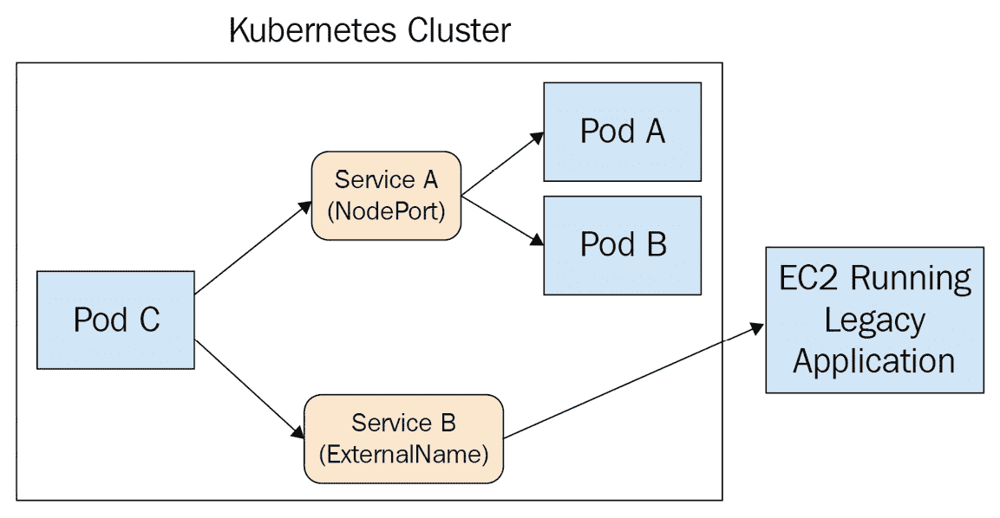
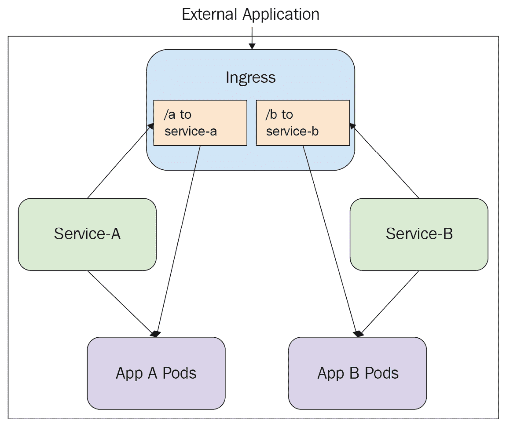

# *第五章*:服务与入口——与外界沟通

本章全面讨论了 Kubernetes 提供的允许应用程序相互通信以及与集群外资源通信的方法。您将了解 Kubernetes 服务资源及其所有可能的类型——集群 IP、节点端口、负载平衡器和外部名称——以及如何实现它们。最后，您将学习如何使用 Kubernetes 入口。

在本章中，我们将涵盖以下主题:

*   了解服务和集群域名系统
*   实现集群 IP
*   使用节点端口
*   设置负载平衡器服务
*   创建外部名称服务
*   配置入口

# 技术要求

为了运行本章中详细介绍的命令，您将需要一台支持`kubectl`命令行工具的计算机以及一个工作正常的 Kubernetes 集群。查看 [*第 1 章*](01.html#_idTextAnchor016)*与库本内特斯*通讯，查看几种快速与库本内特斯一起起床跑步的方法，以及如何安装`kubectl`工具的说明。

本章使用的代码可以在本书的 GitHub 资源库中找到[https://GitHub . com/PacktPublishing/Cloud-Native-with-Kubernetes/tree/master/chapter 5](https://github.com/PacktPublishing/Cloud-Native-with-Kubernetes/tree/master/Chapter5)。

# 了解服务和集群域名系统

在最后几章中，我们已经讨论了如何使用资源在 Kubernetes 上有效地运行应用程序，这些资源包括 Pods、Deployments 和 StatefulSets。然而，许多应用程序，如网络服务器，需要能够接受来自容器外部的网络请求。这些请求可能来自其他应用程序，也可能来自访问公共互联网的设备。

Kubernetes 提供了几种类型的资源来处理各种场景，允许集群内外的资源访问 Pods、Deployments 等上运行的应用程序。

这些分为两种主要的资源类型，服务和入口:

*   **服务**有几个子类型——集群 IP、节点端口和负载均衡器——通常用于提供从集群内部或外部对单个应用程序的简单访问。
*   **入口**是一个更高级的资源，它创建了一个控制器，负责基于路径名和主机名的路由到集群内运行的各种资源。入口通过使用规则将流量转发到服务来工作。您需要使用服务来使用入口。

在我们开始使用第一种类型的服务资源之前，让我们回顾一下 Kubernetes 如何在集群中处理 DNS。

## 集群 DNS

让我们从讨论 Kubernetes 中的哪些资源默认获得自己的 DNS 名称开始。Kubernetes 中的域名仅限于 Pods 和 Services。Pod DNS 名称包含几个构造为子域的部分。

在库本内斯运行的 Pod 的典型**完全限定域名** ( **FQDN** )如下所示:

```
my-hostname.my-subdomain.my-namespace.svc.my-cluster-domain.example
```

让我们将其分解，从最右侧开始:

*   `my-cluster-domain.example`对应于集群应用编程接口本身配置的域名。根据用于设置群集的工具及其运行环境，这可以是外部域名或内部域名。
*   `svc`是一个即使在 Pod 域名中也会出现的部分——所以我们可以假设它会出现在那里。然而，正如您将很快看到的，您通常不会通过它们的域名系统访问 Pods 或服务。
*   `my-namespace`很不言自明。域名的这一部分将是您的 Pod 运行的任何名称空间。
*   `my-subdomain`对应于 Pod 规范中的`subdomain`字段。该字段完全是可选的。
*   最后，`my-hostname`将被设置为 Pod 元数据中 Pod 的名称。

这个域名系统名称允许集群中的其他资源访问特定的 Pod。这本身通常不是很有帮助，尤其是如果您使用的部署和状态集通常有多个 Pods。这就是服务进来的地方。

让我们看一下服务的域名记录:

```
my-svc.my-namespace.svc.cluster-domain.example
```

如您所见，它与 Pod DNS 名称非常相似，不同之处在于我们的命名空间左侧只有一个值——即服务名称(同样，与 Pod 一样，这是基于元数据名称生成的)。

如何处理这些域名的一个结果是，在一个名称空间中，您可以通过服务(或 Pod)名称和子域来访问服务或 Pod。

例如，以我们以前的服务域名为例。在`my-namespace`命名空间内，只需通过域名`my-svc`就可以访问该服务。从`my-namespace`命名空间之外的，您可以通过`my-svc.my-namespace`访问该服务。

既然我们已经了解了集群内域名系统是如何工作的，我们可以讨论如何将它转换为服务代理。

## 服务代理类型

尽可能简单地解释，服务提供了一个抽象，将请求转发给一个或多个运行应用程序的 Pods。

当创建一个服务时，我们定义一个选择器，告诉服务将请求转发到哪个 Pods。通过`kube-proxy`组件中的功能，当请求到达一个服务时，它们将被转发到与该服务的选择器相匹配的各个 Pods。

您可以在 Kubernetes 中使用三种可能的代理模式:

*   **用户空间代理模式**:自 Kubernetes 版本以来最老的代理模式。这种代理模式将以循环方式将请求转发给匹配的吊舱。
*   **Iptables 代理模式**:1.1 起可用，1.2 起默认。这提供了比用户空间模式更低的开销，并且可以使用循环或随机选择。
*   **IPVS proxy mode**: The newest option, available since 1.8\. This proxy mode allows other load balancing options (not just Round Robin):

    a.一系列

    b.最少连接(最少数量的开放连接)

    c.源哈希

    d.目标哈希

    e.最短预期延迟

    f.从不排队

对于不熟悉的人来说，与此列表相关的是对什么是循环负载平衡的讨论。

循环负载平衡包括根据每个网络请求从头到尾循环遍历服务端点的潜在列表。下图显示了该流程的简化视图，它与服务背后的 Kubernetes Pods 相关:


图 5.1–Pods 的服务负载平衡

如您所见，服务交替向哪个 Pod 发送请求。第一个请求进入 A 舱，第二个进入 B 舱，第三个进入 C 舱，然后循环。现在我们知道了服务实际上是如何处理请求的，让我们回顾一下服务的主要类型，从集群 IP 开始。

# 实施集群 IP

集群 IP 是暴露在集群内部 IP 上的一种简单类型的服务。从群集外部无法访问此类型的服务。让我们看一下我们服务的 YAML 文件:

群集 ip 服务，yaml

```
apiVersion: v1
kind: Service
metadata:
  name: my-svc
Spec:
  type: ClusterIP
  selector:
    app: web-application
    environment: staging
  ports:
    - name: http
      protocol: TCP
      port: 80
      targetPort: 8080
```

与其他 Kubernetes 资源一样，我们的元数据块也有我们的`name`值。您可以从我们关于域名系统的讨论中回忆起，这个`name`值是您如何从集群中的其他地方访问您的服务。因此，集群 IP 对于只需要由集群中的其他 Pods 访问的服务来说是一个很好的选择。

接下来，我们有我们的`Spec`，它由三个主要部分组成:

*   首先，我们有我们的`type`，对应于我们服务的类型。由于默认类型是`ClusterIP`，如果您想要集群 IP 服务，您实际上不需要指定类型。
*   接下来，我们有我们的`selector`。我们的`selector`由键值对组成，这些键值对必须与所讨论的 Pods 的元数据中的标签相匹配。在这种情况下，我们的服务将寻找带有`app=web-application`和`environment=staging`的 Pods 来转发流量。
*   最后，我们有了我们的块，在那里我们可以将我们服务上的端口映射到我们 Pods 上的`targetPort`号。在这种情况下，我们服务上的端口`80`(HTTP 端口)将映射到我们应用程序吊舱上的端口`8080`。我们的服务可以打开多个端口，但打开多个端口时需要填写`name`字段。

接下来，让我们深入回顾一下`protocol`选项，因为这些选项对我们讨论服务端口很重要。

## 协议

在我们的先前集群 IP 服务的情况下，我们选择`TCP`作为我们的协议。Kubernetes 目前(从 1.19 版本开始)支持多种协议:

*   **TCP**
*   UDP
*   **HTTP**
*   **代理**
*   **SCTP**

这是一个可能会出现新功能的领域，尤其是涉及 HTTP (L7)服务的领域。目前，跨环境或云提供商并不完全支持所有这些协议。

重要说明

更多信息，可以查看 Kubernetes 主文档([https://Kubernetes . io/docs/concepts/services-networking/service/](https://kubernetes.io/docs/concepts/services-networking/service/))了解 Service 协议的当前状态。

现在，我们已经讨论了带有集群 IP 的服务 YAMLs 的细节，我们可以进入下一种类型的服务——节点端口。

# 使用节点端口

节点端口是一种面向外部的服务类型，这意味着它实际上可以从集群外部访问。创建节点端口服务时，节点端口将自动创建并路由到同名的集群 IP 服务，因此您仍然可以从集群内部访问该服务。当负载平衡器服务不可行或不可能时，这使得节点端口成为外部访问应用程序的好选择。

节点端口听起来很像它的样子——这种类型的服务在集群中的每个节点上都打开一个端口，在这个端口上可以访问服务。默认情况下，该端口将位于`30000` - `32767`之间的范围内，并将在服务创建时自动链接。

以下是我们的 YAML 节点端口服务的外观:

nodeport 服务. yaml

```
apiVersion: v1
kind: Service
metadata:
  name: my-svc
Spec:
  type: NodePort
  selector:
    app: web-application
  ports:
    - name: http
      protocol: TCP
      port: 80
      targetPort: 8080
```

正如您所知，与集群 IP 服务的唯一区别是服务类型，但是，需要注意的是，我们在`ports`部分的目标端口`80`仅在访问自动创建的集群 IP 版本的服务时使用。从集群外部，我们需要查看生成的端口链接是什么，以访问我们的节点 IP 上的服务。

为此，我们可以使用以下命令创建我们的服务:

```
kubectl apply -f svc.yaml 
```

然后运行以下命令:

```
kubectl describe service my-svc
```

前面命令的结果将是以下输出:

```
Name:                   my-svc
Namespace:              default
Labels:                 app=web-application
Annotations:            <none>
Selector:               app=web-application
Type:                   NodePort
IP:                     10.32.0.8
Port:                   <unset> 8080/TCP
TargetPort:             8080/TCP
NodePort:               <unset> 31598/TCP
Endpoints:              10.200.1.3:8080,10.200.1.5:8080
Session Affinity:       None
Events:                 <none>
```

从这个输出中，我们看到`NodePort`线，我们为这个服务分配的端口是`31598`。因此，可以在`[NODE_IP]:[ASSIGNED_PORT]`的任何节点上访问该服务。

或者，我们可以手动为服务分配一个节点端口。手动分配的节点端口的 YAML 如下:

manual-nodeport-service.yaml

```
apiVersion: v1
kind: Service
metadata:
  name: my-svc
Spec:
  type: NodePort
  selector:
    app: web-application
  ports:
    - name: http
      protocol: TCP
      port: 80
      targetPort: 8080
      nodePort: 31233
```

如您所见，我们在`30000` - `32767`范围内选择了`nodePort`，在本例中为`31233`。要了解该节点端口服务如何跨节点工作，请查看下图:


图 5.2–节点端口服务

正如您所看到的，尽管该服务在集群中的每个节点(节点 A、节点 B 和节点 C)都可以访问，但网络请求仍然在所有节点(节点 A、节点 B 和节点 C)的 Pod 之间进行负载平衡，而不仅仅是被访问的节点。这是确保可以从任何节点访问应用程序的有效方法。然而，当使用云服务时，您已经有了一系列在服务器之间传播请求的工具。下一种类型的服务，负载平衡器，让我们在 Kubernetes 的上下文中使用这些工具。

# 设置负载平衡器服务

负载平衡器是 Kubernetes 中的一种特殊服务类型，它根据集群的运行位置来配置负载平衡器。例如，在 AWS 中，Kubernetes 将提供一个弹性负载平衡器。

重要说明

有关负载平衡器服务和配置的完整列表，请访问[https://Kubernetes . io/docs/concepts/Services-networking/service/# load balancer](https://kubernetes.io/docs/concepts/services-networking/service/#loadbalancer)查看 Kubernetes Services 的文档。

与`ClusterIP`或节点端口不同，我们可以以特定于云的方式修改负载平衡器服务的功能。通常，这是使用服务 YAML 文件中的注释块来完成的——正如我们之前讨论的，它只是一组键和值。为了了解如何为 AWS 做到这一点，让我们回顾一下负载平衡器服务的规范:

load balancer service . YAML-负载平衡器服务

```
apiVersion: v1
kind: Service
metadata:
  name: my-svc
  annotations:
    service.beta.kubernetes.io/aws-load-balancer-ssl-cert: arn:aws.. 
spec:
  type: LoadBalancer
  selector:
    app: web-application
  ports:
    - name: http
      protocol: TCP
      port: 80
      targetPort: 8080
```

虽然我们可以在没有任何注释的情况下创建一个负载平衡器，但是支持的特定于 AWS 的注释为我们提供了指定我们希望将哪个 TLS 证书(通过亚马逊证书管理器中的 ARN)附加到负载平衡器的能力(如前面的 YAML 代码所示)。AWS 注释还允许为负载平衡器等配置日志。

在撰写本书时，以下是 AWS 云提供商支持的一些关键注释:

*   `service.beta.kubernetes.io/aws-load-balancer-ssl-cert`
*   `service.beta.kubernetes.io/aws-load-balancer-proxy-protocol`
*   `service.beta.kubernetes.io/aws-load-balancer-ssl-ports`

    重要说明

    所有提供商的注释和解释的完整列表可以在官方库本内斯文档的**云提供商**页面上找到，网址为[。](https://kubernetes.io/docs/tasks/administer-cluster/running-cloud-controller/)

最后，关于负载平衡器服务，我们已经介绍了您最可能使用的服务类型。但是，对于服务本身在 Kubernetes 之外运行的特殊情况，我们可以使用另一种服务类型:ExternalName。

# 创建外部名称服务

ExternalName 类型的服务可以用来代理实际上没有在您的集群上运行的应用程序，同时仍然保持服务作为一个可以随时更新的抽象层。

让我们设定场景:您有一个遗留的生产应用程序运行在 Azure 上，您希望从集群中访问它。您可以在`myoldapp.mydomain.com`访问该遗留应用程序。但是，您的团队目前正在容器化这个应用程序，并在 Kubernetes 上运行它，并且这个新版本目前正在您的集群上的`dev`命名空间环境中工作。

您可以始终在您的生产(`prod`)和开发(`dev`)名称空间中指向名为`my-svc`的服务，而不是要求您的其他应用程序根据环境与不同的地方进行对话。

在`dev`中，这个服务可以是一个`ClusterIP`服务，引导你在 Pods 上新的容器化应用。下面的 YAML 展示了正在开发的容器化服务应该如何工作:

cluster IP-for-external-service . YAML

```
apiVersion: v1
kind: Service
metadata:
  name: my-svc
  namespace: dev
Spec:
  type: ClusterIP
  selector:
    app: newly-containerized-app
  ports:
    - name: http
      protocol: TCP
      port: 80
      targetPort: 8080
```

在`prod`命名空间中，该服务将改为`ExternalName`服务:

externalname 服务. yaml

```
apiVersion: v1
kind: Service
metadata:
  name: my-svc
  namespace: prod
spec:
  type: ExternalName
  externalName: myoldapp.mydomain.com
```

因为我们的`ExternalName`服务实际上并没有将请求转发给 Pods，所以我们不需要选择器。相反，我们指定一个`ExternalName`，这是我们希望服务指向的域名。

下面的图显示了`ExternalName`服务如何在这种模式下使用:



图 5.3–外部名称服务配置

在上图中，我们的 **EC2 运行遗留应用程序**是一个 AWS 虚拟机，位于集群外部。我们的**外部名称**类型的**服务 B** 会将请求路由到虚拟机。这样，我们的 **Pod C** (或集群中的任何其他 Pod)只需通过 ExternalName 服务的 Kubernetes 域名就可以访问我们的外部遗留应用程序。

借助`ExternalName`，我们已经完成了对所有 Kubernetes 服务类型的审查。让我们继续讨论一种更复杂的公开应用程序的方法 Kubernetes Ingress 资源。

# 配置入口

正如本章开头提到的，入口提供了一种将请求路由到集群的粒度机制。入口不会取代服务，而是通过基于路径的路由等功能来增强服务。为什么有这个必要？原因很多，包括成本。有 10 条路径到达`ClusterIP`服务的入口比为每条路径创建一个新的负载平衡器服务要便宜得多，而且它使事情变得简单易懂。

Ingresses 不像 Kubernetes 中的其他服务那样工作。仅仅创建入口本身是没有用的。您需要两个附加组件:

*   入口控制器:您可以从许多实现中进行选择，构建在诸如 Nginx 或 HAProxy 之类的工具上。
*   预期路由的集群 IP 或节点端口服务。

首先，让我们讨论如何配置入口控制器。

## 入口控制器

通常，集群将不会配置任何预先存在的入口控制器。您需要选择一个并将其部署到集群中。`ingress-nginx`可能是最受欢迎的选择，但还有其他几个选择——完整列表见[https://kubernetes . io/docs/concepts/services-networking/ingress-controller/](https://kubernetes.io/docs/concepts/services-networking/ingress-controllers/)。

让我们学习如何部署入口控制器——为了本书的目的，我们将坚持使用由 Kubernetes 社区`ingress-nginx`创建的 Nginx 入口控制器。

控制器之间的安装可能不同，但对于`ingress-nginx`来说，主要有两个部分。首先，要部署主控制器本身，请运行以下命令，该命令可能会根据目标环境和最新的 Nginx Ingress 版本而变化:

```
kubectl apply -f https://raw.githubusercontent.com/kubernetes/ingress-nginx/controller-v0.41.2/deploy/static/provider/cloud/deploy.yaml
```

其次，我们可能需要根据运行的环境来配置我们的入口。对于运行在 AWS 上的集群，我们可以将入口点配置为使用我们在 AWS 中创建的弹性负载平衡器。

重要说明

要查看所有特定于环境的设置说明，请参见位于[https://kubernetes.github.io/ingress-nginx/deploy/](https://kubernetes.github.io/ingress-nginx/deploy/)的`ingress-nginx`文档。

Nginx 入口控制器是一组 Pods，每当创建新的入口资源(自定义 Kubernetes 资源)时，它将自动更新 Nginx 配置。除了入口控制器之外，我们还需要一种将请求路由到入口控制器的方法——称为入口点。

### 入口点

默认的`nginx-ingress`安装还将创建一个单一的服务，向 Nginx 层提供请求，此时入口规则接管。根据您如何配置入口，这可以是负载平衡器或节点端口服务。在云环境中，您可能会使用云负载平衡器服务作为集群入口的入口点。

### 入口规则和 YAML

现在我们已经启动并运行了入口控制器，我们可以开始配置入口规则了。

让我们从一个简单的例子开始。我们有两个服务`service-a`和`service-b`，我们希望通过入口在不同的路径上公开它们。一旦您的入口控制器和任何相关的弹性负载平衡器被创建(假设我们在 AWS 上运行)，让我们首先通过以下步骤创建我们的服务:

1.  First, let's look at how to create Service A in YAML. Let's call the file `service-a.yaml`:

    服务 a.yaml

    ```
    apiVersion: v1
    kind: Service
    metadata:
      name: service-a
    Spec:
      type: ClusterIP
      selector:
        app: application-a
      ports:
        - name: http
          protocol: TCP
          port: 80
          targetPort: 8080
    ```

2.  您可以通过运行以下命令来创建我们的服务 A:

    ```
    kubectl apply -f service-a.yaml
    ```

3.  接下来，让我们创建我们的服务 B，其 YAML 代码看起来非常相似:

    ```
    apiVersion: v1
    kind: Service
    metadata:
      name: service-b
    Spec:
      type: ClusterIP
      selector:
        app: application-b
      ports:
        - name: http
          protocol: TCP
          port: 80
          targetPort: 8000
    ```

4.  通过运行以下命令创建我们的服务 B:

    ```
    kubectl apply -f service-b.yaml
    ```

5.  最后，我们可以为每个路径创建带有规则的入口。这是我们入口的 YAML 代码，它将根据基于路径的路由规则在必要时分割请求:

入口，yaml

```
apiVersion: networking.k8s.io/v1
kind: Ingress
metadata:
  name: my-first-ingress
  annotations:
    nginx.ingress.kubernetes.io/rewrite-target: /
spec:
  rules:
  - host: my.application.com
    http:
      paths:
      - path: /a
        backend:
          serviceName: service-a
          servicePort: 80
      - path: /b
        backend:
          serviceName: service-b
          servicePort: 80
```

在前面的 YAML 中，入口有一个单数`host`值，它对应于通过入口的流量的主机请求头。然后，我们有两条路径，`/a`和`/b`，这就引出了我们之前创建的两条`ClusterIP`服务。为了以图形格式显示这种配置，让我们看一下下图:



图 5.4-永久输入示例

如您所见，我们简单的基于路径的规则导致网络请求被直接路由到适当的 Pods。这是因为`nginx-ingress`使用服务选择器获取 Pod IPs 列表，但不直接使用服务与 Pod 通信。相反，随着新的 Pod IPs 上线，Nginx(在这种情况下)配置会自动更新。

实际上并不需要`host`值。如果您忽略它，任何通过入口的流量，无论主机头是什么(除非它匹配指定主机的不同规则)，都将根据该规则进行路由。下面的 YAML 展示了这一点:

入口-无主机. yaml

```
apiVersion: networking.k8s.io/v1
kind: Ingress
metadata:
  name: my-first-ingress
  annotations:
    nginx.ingress.kubernetes.io/rewrite-target: /
spec:
  rules:
   - http:
      paths:
      - path: /a
        backend:
          serviceName: service-a
          servicePort: 80
      - path: /b
        backend:
          serviceName: service-b
          servicePort: 80
```

即使没有主机头值，这个先前的入口定义也会将流量流向基于路径的路由规则。

类似地，可以根据主机报头将流量分成多个独立的分支路径，如下所示:

入口分支. yaml

```
apiVersion: networking.k8s.io/v1
kind: Ingress
metadata:
  name: multiple-branches-ingress
spec:
  rules:
  - host: my.application.com
    http:
      paths:
      - backend:
          serviceName: service-a
          servicePort: 80
  - host: my.otherapplication.com
    http:
      paths:
      - backend:
          serviceName: service-b
          servicePort: 80
```

最后，在许多情况下，您还可以使用顶级域名来保护您的入口，尽管该功能因每个入口控制器而异。对于 Nginx，这可以通过使用 Kubernetes 秘密来完成。我们将在下一章讨论这个功能，但是现在，检查一下入口端的配置:

入口安全. yaml

```
apiVersion: networking.k8s.io/v1
kind: Ingress
metadata:
  name: secured-ingress
spec:
  tls:
  - hosts:
    - my.application.com
    secretName: my-tls-secret
  rules:
    - host: my.application.com
      http:
        paths:
        - path: /
          backend:
            serviceName: service-a
            servicePort: 8080
```

该配置将在默认命名空间中寻找名为`my-tls-secret`的库本内特秘密，以附加到 TLS 的入口。

我们关于入口的讨论到此结束。许多入口功能可以特定于您决定使用的入口控制器，因此请查看您选择的实现的文档。

# 总结

在这一章中，我们回顾了 Kubernetes 提供的各种方法，以便向外界公开运行在集群上的应用程序。主要的方法是服务和入口。在服务中，您可以使用集群 IP 服务进行集群内路由，使用节点端口通过节点上的端口直接访问服务。负载平衡器服务允许您使用现有的云负载平衡系统，外部名称服务允许您将请求从集群路由到外部资源。

最后，入口提供了一个强大的工具，可以通过路径在集群中路由请求。要实现入口，您需要在集群上安装第三方或开源入口控制器。

在下一章中，我们将讨论如何使用两种资源类型将配置信息注入到运行在 Kubernetes 上的应用程序中:ConfigMap 和 Secret。

# 问题

1.  对于仅在集群内部访问的应用程序，您会使用哪种类型的服务？
2.  如何判断节点端口服务在哪个端口上处于活动状态？
3.  为什么入口比纯粹的服务更具成本效益？
4.  除了支持传统应用程序，外部名称服务在云平台上还有什么用处？

# 进一步阅读

*   关于云提供商的信息，来自 Kubernetes 文档:[https://Kubernetes . io/docs/tasks/administrator-cluster/running-cloud-controller/](https://kubernetes.io/docs/tasks/administer-cluster/running-cloud-controller/)