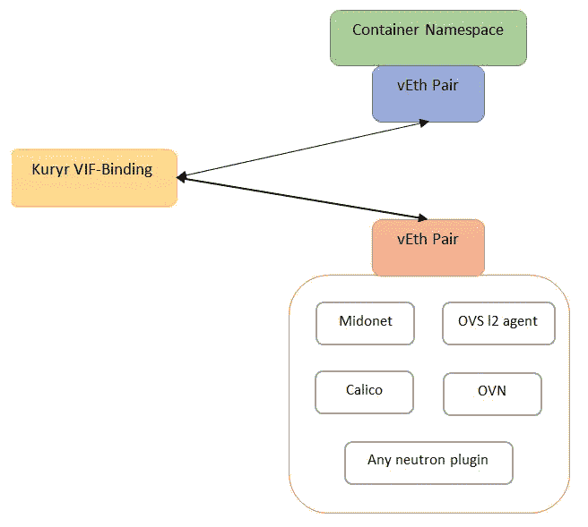

# 七、Kuryr–用于OpenStack网络的容器插件

在这一章中，我们将学习 Kuryr，一个用于容器网络的 OpenStack 项目。本章将涵盖以下主题:

*   介绍Kuryr
*   Kuryr 体系结构
*   安装Kuryr
*   走过

# 介绍Kuryr

Kuryr 以捷克语命名，意为信使。它是一个 Docker 网络插件，使用 OpenStack 中子为 Docker 容器提供网络服务。它将容器网络抽象映射到 OpenStack 中子 API。这提供了以无缝管理体验将虚拟机、容器和裸机服务器连接到同一虚拟网络的能力，并为这三者提供了一致的网络连接。Kuryr 可以使用 Python 包部署，也可以使用 Kolla 部署容器。它为使用中子作为提供者的容器提供了以下特性:

*   安全组
*   子网池
*   SNAT/挪威电信，浮动 IP
*   端口安全(ARP 欺骗)
*   服务质量
*   配额管理
*   中子可插拔 IPAM
*   通过中子实现集成良好的 COE 负载平衡
*   用于容器的 FWaaS

# Kuryr 体系结构

在接下来的部分中，我们将研究 Kuryr 架构。

# 将 Docker libnetwork 映射到中子 API

下图显示了将 Docker libnetwork 网络模型映射到中子 API 的 Kuryr 架构。Kuryr 绘制了**libnetwork**API 并在中子中创建了适当的资源，这解释了为什么**中子 API** 也可以用于容器联网:


# 提供通用的 VIF 绑定基础设施

Kuryr 为各种端口类型提供了通用的 VIF 绑定机制，这些端口类型将从 Docker 命名空间接收，并将根据其类型附加到网络解决方案基础架构，例如， **Linux 桥端口**、**Open vsswitch 端口**、 **Midonet 端口**、**、**等等。下图说明了这一点:



# 提供中子插件的容器化图像

Kuryr 的目标是提供与 Kolla 集成的各种中子插件的容器化图像。

# 嵌套虚拟机和Magnum用例

Kuryr 在容器联网方面解决了 Magnum 项目用例，并作为 Magnum 或任何其他需要通过中子 API 利用容器联网的 OpenStack 项目的统一接口。在这方面，Kuryr 利用支持 VM 嵌套容器用例的中子插件，并增强中子 API 来支持这些用例(例如，OVN)。

# 安装Kuryr

在本节中，我们将看到如何安装 Kuryr。先决条件如下:

*   重点
*   中子
*   数据库管理系统，如 MySQL 或 MariaDB(用于中子和 KeyStation)
*   您选择的供应商的中子剂
*   如果你的供应商需要中子剂，请咨询拉比
*   Docker 1.9+

以下步骤在 Docker 容器中运行 Kuryr:

1.  拉上游 Kuryr libnetwork Docker 图像:

```
        $ docker pull kuryr/libnetwork:latest  
```

2.  准备 Docker 找到 Kuryr 驱动程序:

```
        $ sudo mkdir -p /usr/lib/docker/plugins/kuryr
       $ sudo curl -o /usr/lib/docker/plugins/kuryr/kuryr.spec \ 
                     https://raw.githubusercontent.com/openstack/kuryr-
        libnetwork/master/etc/kuryr.spec
        $ sudo service docker restart  
```

3.  启动库里尔容器:

```
        $ docker run --name kuryr-libnetwork \
        --net=host \
        --cap-add=NET_ADMIN \
        -e SERVICE_USER=admin \;
        -e SERVICE_PROJECT_NAME=admin \
        -e SERVICE_PASSWORD=admin \
        -e SERVICE_DOMAIN_NAME=Default \
        -e USER_DOMAIN_NAME=Default \
        -e IDENTITY_URL=http://127.0.0.1:35357/v3 \
        -v /var/log/kuryr:/var/log/kuryr \
        -v /var/run/openvswitch:/var/run/openvswitch \
                  kuryr/libnetwork  
```

这里:

*   `SERVICE_USER`、`SERVICE_PROJECT_NAME`、`SERVICE_PASSWORD`、`SERVICE_DOMAIN_NAME`和`USER_DOMAIN_NAME`是 OpenStack 凭证
*   `IDENTITY_URL`是 OpenStack KeyStone v3 端点的 URL
*   创建一个卷，以便日志在主机上可用
*   `NET_ADMIN`给出能力是为了在主机命名空间上执行网络操作，例如`ovs-vsctl`

# 走过

Kuryr 存在于运行容器并提供 libnetwork 远程网络驱动程序所需的 API 的每个主机中。

以下是为创建中子提供的容器网络而执行的步骤:

1.  用户向 libnetwork 发送请求，以创建一个网络驱动程序说明符为 Kuryr 的 Docker 网络。以下示例创建一个名为 bar 的 Docker 网络:

```
        $ sudo docker network create --driver=kuryr --ipam-driver=kuryr --
        subnet 10.0.0.0/16 --gateway 10.0.0.1 --ip-range 10.0.0.0/24 bar  
```

2.  libnetwork 对 Kuryr 插件进行 API 调用来创建网络
3.  Kuryr 将调用转发给中子，中子用 Kuryr 提供的输入数据创建网络
4.  收到中子的响应后，它准备输出并将其发送到 libnetwork
5.  libnetwork 将响应存储到其密钥/值数据存储后端
6.  然后，用户可以使用之前创建的网络启动容器:

```
        $ sudo docker run --net=bar -itd --name=nginx-container nginx
```

# 摘要

在这一章中，我们了解了 Kuryr。我们了解了 Kuryr 是什么，它的架构和安装过程。我们还研究了当用户使用 Kuryr 作为网络驱动程序创建 Docker 网络时的整体工作流程。

下一章将重点介绍 Murano 项目。我们将学习 Murano 及其架构，并完成动手练习。