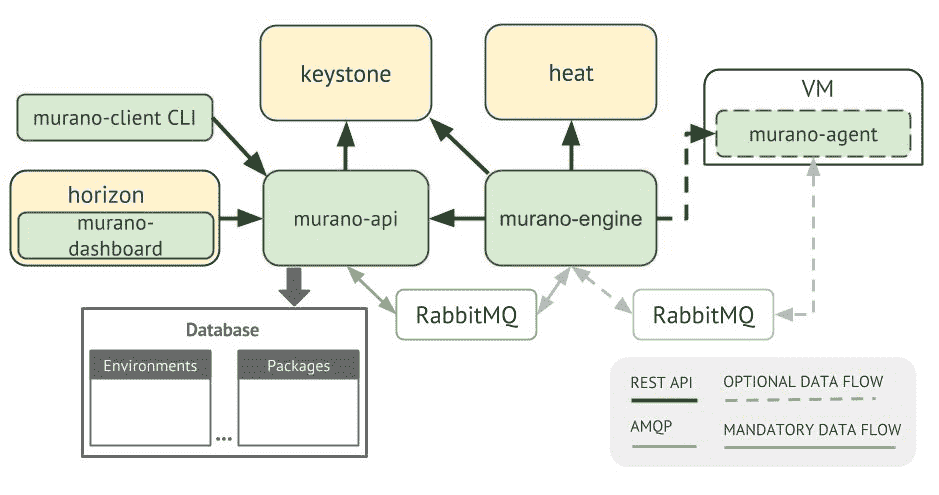
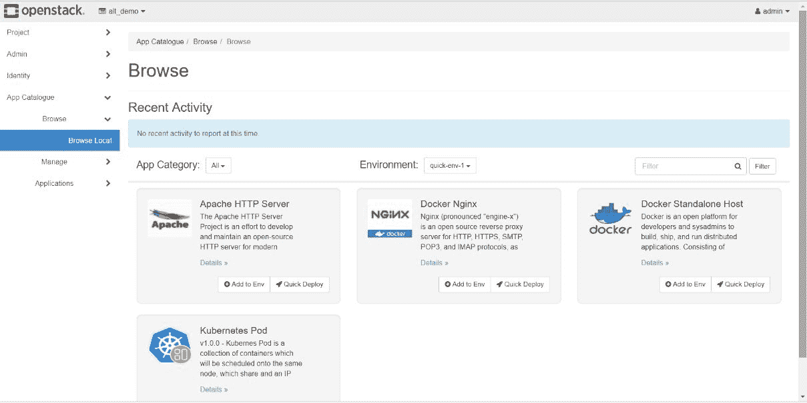
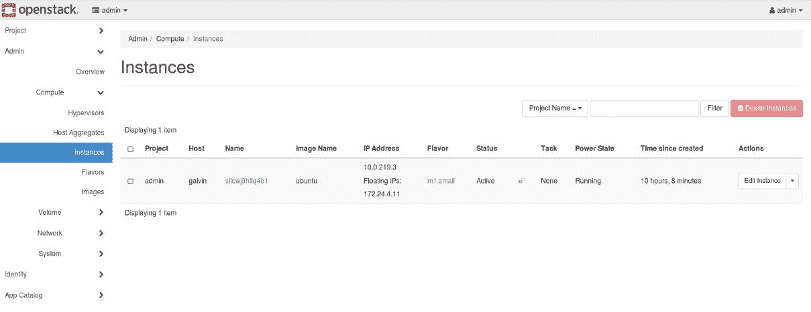

# 穆拉诺 OpenStack 上的容器化应用部署

本章将解释 OpenStack 项目 Murano，它是 OpenStack 的应用程序目录，使应用程序开发人员和云管理员能够在可浏览的分类目录中发布各种云就绪应用程序。Murano 只需点击一下鼠标，就可以大大简化 OpenStack 基础设施上的应用程序部署。在本章中，我们将讨论以下主题:

*   村野介绍
*   穆拉诺概念
*   主要特征
*   Murano 组件
*   走过
*   Murano DevStack 安装
*   部署容器化应用程序

# 村野介绍

Murano 是 OpenStack 应用程序目录服务，它提供了各种云就绪的应用程序，可以轻松地部署在 OpenStack 上，抽象出背后的所有复杂性。它简化了 OpenStack IaaS 之上各种应用程序的打包和部署。它是外部应用程序和 OpenStack 的集成点，支持应用程序的完整生命周期管理。Murano 应用程序可以在 Docker 容器或 Kubernetes Pod 中运行。

Murano 是面向终端用户的强大解决方案，他们希望在 OpenStack 之上进行应用程序部署，而不想担心部署的复杂性。

以下是 Murano 提供的功能列表:

*   提供生产就绪应用程序和动态用户界面
*   支持运行容器化应用程序
*   支持在 Windows 和 Linux 系统上配置应用程序
*   用巴比康保护数据
*   支持使用**热编排模板** ( **热**)运行应用程序包
*   部署多区域应用程序
*   允许在应用程序中将煤渣卷附加到虚拟机，并在眩光中存储包
*   将类似的包打包在一个包中，例如基于容器的应用程序
*   为计费目的提供与环境和应用程序相关的统计数据

# 穆拉诺概念

在本节中，我们将讨论村野中使用的不同概念。

# 环境

穆拉诺的环境代表一组应用程序，由单个租户管理。在一个环境中，没有两个租户可以共享应用程序。同样，一个环境中的应用程序独立于其他环境。环境中逻辑相关的多个应用程序可以一起形成更复杂的应用程序。

# 包裹

Murano 中的包是一个 ZIP 存档，其中包含所有安装脚本、类定义、动态 UI 表单、图像列表和应用程序部署说明。该包由 Murano 导入，用于部署应用程序。各种包可以上传到 Murano，用于不同的应用。

# 会议

Murano 允许来自不同位置的多个用户修改环境。为了允许多个用户同时修改，Murano 使用存储所有用户的本地修改的会话。当任何应用程序添加到环境中时，会创建一个会话，并且在部署开始后，该会话将变得无效。一个会话不能在多个用户之间共享。

# 环境模板

一组应用程序可以形成一个复杂的应用程序。为了定义这样的应用，Murano 使用了**环境模板**的概念。模板中的每个应用程序都由一个租户管理。可以通过将其转换到环境中来部署该模板。

# 部署

部署用于表示安装应用程序的过程。它存储任何应用程序部署中的环境状态、事件和错误等信息。

# 捆

Murano 中的一个包代表了一组类似的应用程序。捆绑包中的应用程序不需要紧密相关。它们是根据用途分类的。

例如，创建一个由 MySQL 或 Oracle 应用程序组成的数据库应用程序包。可以在 Murano 中直接导入一个包，Murano 将依次导入包中的所有应用程序。

# 种类

应用程序可以根据其类型分为不同的类别，例如应用程序服务器、大数据和数据库。

# 主要特征

Murano 具有许多高级功能，使其成为 OpenStack 上应用程序管理的强大解决方案。在本节中，我们将讨论 Murano 中的一些高级功能。

# 生产就绪应用程序

Murano 有各种云就绪应用程序，可以在虚拟机或裸机上轻松配置。这不需要任何安装、基础设施管理等方面的知识，使得部署复杂的应用程序对 OpenStack 用户来说是一项简单的任务。用户可以选择在 Docker 主机或 Kubernetes Pod 上运行他们的应用程序。

# 应用程序目录界面

Murano 为最终用户提供了一个用户界面，方便他们浏览可用的应用程序。用户只需按一下按钮就可以部署任何复杂的应用程序。用户界面是动态的，在某种意义上说，它在提供应用程序时为用户输入提供表单。它还允许应用程序标记，提供每个应用程序的信息，显示最近的活动，等等。

# 分配工作负载

Murano 允许用户在提供任何应用程序时选择地区。这样，您的应用程序可以跨区域分布，以实现可伸缩性和高可用性，同时进行任何灾难恢复。

# 应用开发

**Murano 编程语言** ( **MuranoPL** )可用于定义应用程序。它使用 YAML 和 YAQL 作为应用程序定义。它还有一些核心库，定义了几个应用程序中使用的公共函数。MuranoPL 还支持垃圾收集，这意味着它会释放应用程序的所有资源。

# 穆拉诺仓库

Murano 支持从不同的来源安装软件包，如文件、网址和存储库。Murano 可以从自定义存储库中导入应用程序包。它下载所有相关的包和映像(如果从应用程序部署的存储库中定义的话)。

Refer to [https://docs.openstack.org/murano/latest/admin/appdev-guide/muranopackages/repository.html](https://docs.openstack.org/murano/latest/admin/appdev-guide/muranopackages/repository.html) for setting up a custom repository.

# 煤渣体积

Murano 支持将煤渣卷附加到应用程序中的虚拟机，也支持从煤渣卷引导这些虚拟机。出于存储目的，一个应用程序可以连接多个卷。

Refer to [https://docs.openstack.org/murano/latest/admin/appdev-guide/cinder_volume_supporting.html](https://docs.openstack.org/murano/latest/admin/appdev-guide/cinder_volume_supporting.html) for the detailed step of using Cinder volumes with Murano.

# 巴比肯支持

Barbican 是支持密码和证书等敏感数据的 OpenStack 项目。穆拉诺通过将您的数据存储在巴比肯来确保数据安全。您需要安装巴比肯，并将 Murano 配置为使用巴比肯作为后端存储解决方案。

# 热包装

Murano 支持从 Heat 模板编写应用程序包。您可以向 Murano 添加任何 Heat 模板作为新的部署包。Murano 支持从 Heat 模板自动和手动编写应用程序包。

Refer to [https://docs.openstack.org/murano/latest/admin/appdev-guide/hot_packages.html](https://docs.openstack.org/murano/latest/admin/appdev-guide/hot_packages.html) for details on using Heat templates with Murano.

# Murano 组件

*穆拉诺仪表盘*部分的图说明了穆拉诺的架构。Murano 的架构与其他 OpenStack 组件类似。它还以应用编程接口服务和引擎为主要组件。还有其他组件，如`murano-agent`、Murano 仪表盘和 python 客户端，即`murano-pythonclient`。让我们详细看看每个组件。

# 穆拉诺原料药

Murano API ( `murano-api`)是一个 WSGI 服务器，服务于用户的 API 请求。穆拉诺应用编程接口对每种资源类型都有不同的控制器。每个控制器处理对特定资源的请求。他们验证权限请求，验证请求中提供的数据，并使用输入数据为资源创建数据库对象。该请求被转发到`murano-engine`服务。一旦收到来自`murano-engine`的响应，`murano-api`服务将响应返回给用户。

# 穆拉诺发动机

Murano 引擎(`murano-engine`)是大部分编排发生的服务。它对开放堆栈编排服务 Heat 进行一系列调用，以创建应用程序部署所需的基础设施资源，如虚拟机和卷。它还会在虚拟机内部启动一个名为`murano-agent`的代理来安装外部应用程序。

# 穆拉诺特工

Murano 代理(`murano-agent`)是在部署的虚拟机内部运行的服务。它在虚拟机上进行软件配置和安装。虚拟机映像使用该代理构建。

# 穆拉诺仪表盘

Murano 仪表盘为用户提供了网络用户界面，方便用户浏览 Murano 中的应用程序。它支持 It 用户基于角色的访问控制:



# 走过

在这一节中，我们将详细介绍 Murano 是如何部署应用程序的。Murano 与多个 OpenStack 服务交互，获取应用程序部署所需的资源。

在穆拉诺部署应用程序的请求流程如下:

1.  当从 KeyStone 收到身份验证令牌时，用户通过命令行界面或地平线向`murano-api`服务发送一个 REST API 调用，用于部署环境
2.  `murano-api`服务接收该请求，并将验证令牌和访问权限的请求发送给 KeyStone
3.  KeyStone 验证令牌，并发送带有角色和权限的更新的身份验证头
4.  `murano-api`服务检查会话是否有效。如果会话无效或已经部署，请求将失败，状态为`403` HTTP
5.  执行检查以检查该环境以前是否被删除。如果没有删除，将在任务表中创建一个条目来存储此操作的信息
6.  `murano-api`服务通过 RPC 异步调用向`murano-engine`服务发送请求，该调用带有包含类类型、应用程序细节和用户数据(如果有)的 JSON 对象
7.  `murano-engine`服务从消息队列中挑选请求
8.  它创建了一个 KeyStone 信任，将用于应用程序
9.  它下载所需的包，并验证所需的类是否可用和可访问
10.  `murano-engine`服务然后创建发送给它的模型中定义的所有类
11.  然后调用每个应用程序的部署方法。在此阶段，`murano-engine`与 Heat 交互，创建网络、虚拟机和应用程序运行所需的其他资源
12.  实例运行后，运行用户数据脚本在虚拟机上安装并运行`murano-agent`
13.  `murano-agent`服务执行软件配置和安装步骤

14.  安装完成后，`murano-engine`向 API 服务发送关于完成的响应
15.  `murano-api`服务然后将环境标记为部署在数据库中

# Murano DevStack 安装

我们现在将看到如何使用 DevStack 安装 Murano 的开发设置。

1.  如果需要，为开发堆栈创建根目录:

```
        $ sudo mkdir -p /opt/stack
        $ sudo chown $USER /opt/stack  
```

2.  克隆开发堆栈存储库:

```
        $ git clone https://git.openstack.org/openstack-dev/devstack 
        /opt/stack/devstack

```

3.  现在创建一个最小的`local.conf`来运行开发堆栈设置:

```
        $ cat > /opt/stack/devstack/local.conf << END
        [[local|localrc]]
        HOST_IP=$(ip addr | grep 'state UP' -A2 | tail -n1 | awk '{print
        $2}' | cut -f1  -d'/')
        DATABASE_PASSWORD=password
        RABBIT_PASSWORD=password
        SERVICE_TOKEN=password
        SERVICE_PASSWORD=password
        ADMIN_PASSWORD=password
        enable_plugin murano git://git.openstack.org/openstack/murano
        END 
```

4.  现在运行 DevStack:

```
        $ cd /opt/stack/devstack
        $ ./stack.sh  
```

现在应该安装 Murano 了。要验证安装，请运行以下命令:

```
$ sudo systemctl status devstack@murano-*
 devstack@murano-engine.service - Devstack devstack@murano-
engine.service
 Loaded: loaded (/etc/systemd/system/devstack@murano-
engine.service; enabled; vendor preset: enabled)
 Active: active (running) since Thu 2017-11-02 04:32:28 EDT; 2 
weeks 5 days ago
 Main PID: 30790 (murano-engine)
 CGroup: /system.slice/system-devstack.slice/devstack@murano-
engine.service
 ├─30790 /usr/bin/python /usr/local/bin/murano-engine --
config-file /etc/murano/murano.conf
 ├─31016 /usr/bin/python /usr/local/bin/murano-engine --
config-file /etc/murano/murano.conf
 ├─31017 /usr/bin/python /usr/local/bin/murano-engine --
config-file /etc/murano/murano.conf
 ├─31018 /usr/bin/python /usr/local/bin/murano-engine --
config-file /etc/murano/murano.conf
 └─31019 /usr/bin/python /usr/local/bin/murano-engine --
config-file /etc/murano/murano.conf
 devstack@murano-api.service - Devstack devstack@murano-api.service
 Loaded: loaded (/etc/systemd/system/devstack@murano-api.service; 
enabled; vendor preset: enabled)
 Active: active (running) since Thu 2017-11-02 04:32:26 EDT; 2 
weeks 5 days ago
 Main PID: 30031 (uwsgi)
 Status: "uWSGI is ready"
 CGroup: /system.slice/system-devstack.slice/devstack@murano-
api.service
 ├─30031 /usr/local/bin/uwsgi --ini /etc/murano/murano-api-
uwsgi.ini
 ├─30034 /usr/local/bin/uwsgi --ini /etc/murano/murano-api-
uwsgi.ini
 └─30035 /usr/local/bin/uwsgi --ini /etc/murano/murano-api-
uwsgi.ini
```

您可以看到`murano-api`和`murano-engine`服务都已启动并运行。

# 部署容器化应用程序

在前一节中，您学习了如何使用 DevStack 安装 Murano。现在我们将看到如何使用 Murano 在 OpenStack 上安装应用程序。由于 Murano 提供了易于浏览的动态用户界面，我们将使用 Horizon 中的应用程序目录选项卡来运行我们的应用程序。

在这个例子中，我们将在 Docker 中安装一个 NGINX 容器化的应用程序。我们需要以下软件包来运行此应用程序:

*   Docker 接口库:这个库定义了构建 Docker 应用程序的框架。它提供了由 Docker 支持的所有应用程序和托管服务所使用的数据结构和公共接口。
*   这是一个常规的 Docker 主机应用程序。所有容器应用程序都在一个专用的虚拟机运行映像中运行，该映像由 Docker 和`murano-agent`构建。
*   Kubernetes Pod:这个应用程序为使用 Kubernetes 运行容器化应用程序提供了一个基础设施。Kubernetes 安装在 OpenStack 虚拟机上。这对于 Docker 独立主机应用程序是可选的。
*   Nginx 应用程序:Nginx 是一个网络服务器应用程序，将使用 Docker 独立主机或 Kubernetes Pod 应用程序运行。

All the container applications for Murano can be found at [https://github.com/openstack/k8s-docker-suite-app-murano](https://github.com/openstack/k8s-docker-suite-app-murano).

现在让我们开始使用 Murano 仪表板来运行我们的容器应用程序。通过输入您的凭据登录您的地平线仪表板:

1.  从[https://github.com/openstack/k8s-docker-suite-app-murano](https://github.com/openstack/k8s-docker-suite-app-murano)下载软件包
2.  为前面列出的每个应用程序创建一个`.zip`档案
3.  现在导航到仪表板上的应用程序目录|管理|包
4.  点击导入包

选择文件作为包源，并浏览以上传应用程序的 ZIP 文件。用每个应用程序的必要详细信息填写用户界面表单，然后单击“单击”完成包的上传。您现在可以通过导航到应用程序目录|浏览|浏览本地来浏览可用的应用程序。您将看到这样的页面:



5.  按照[https://github . com/open stack/k8s-docker-suite-app-murano/tree/master/DockerStandaloneHost/elements](https://github.com/openstack/k8s-docker-suite-app-murano/tree/master/DockerStandaloneHost/elements)提供的步骤构建虚拟机映像
6.  标记村野要使用的图像。导航到应用程序目录|管理|标记图像，单击标记图像，并完全按照以下屏幕截图中提供的内容填写详细信息:


7.  通过单击快速部署来部署应用程序

您可以在下面的截图中看到，我们有两个容器主机选项可供选择:Kubernetes Pod 和 Docker 独立主机。我们将选择后者作为选项:


8.  填写要为运行我们的应用程序而创建的虚拟机的详细信息，如下所示:


9.  单击创建为我们的部署创建环境

您将被自动重定向到应用程序目录|应用程序|环境中新创建的环境。

10.  单击部署环境开始安装您的应用程序和所需的必要基础架构。

您将看到以下屏幕截图，显示它已开始创建 Docker 将在其上运行的虚拟机:


成功完成上述部署后，您将能够看到将创建一个新的虚拟机，如下图所示，并且您的 Nginx 应用程序在虚拟机内部的 Docker 容器中运行:



您可以登录虚拟机并访问 Nginx 应用程序。我们现在已经成功地在 OpenStack 上安装了一个容器化的 Nginx 应用程序。

# 摘要

在本章中，您详细了解了 Murano，它是 OpenStack 的应用程序目录服务。我们研究了穆拉诺的不同概念。然后，你还了解了 Murano 的组件和架构。本章还详细概述了用户请求使用 Murano 部署应用程序的工作流程。然后我们看到了如何使用 DevStack 安装 Murano 的开发设置，并且我们做了一个使用 Murano 仪表板创建环境、向其中添加应用程序以及部署环境的实践。

在下一章中，您将了解 Kolla，它为 OpenStack 服务的部署提供了生产就绪容器和工具。