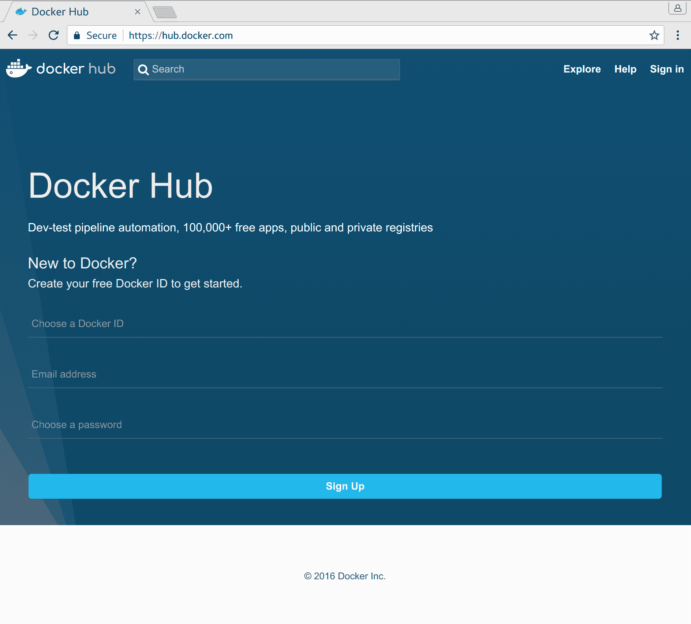
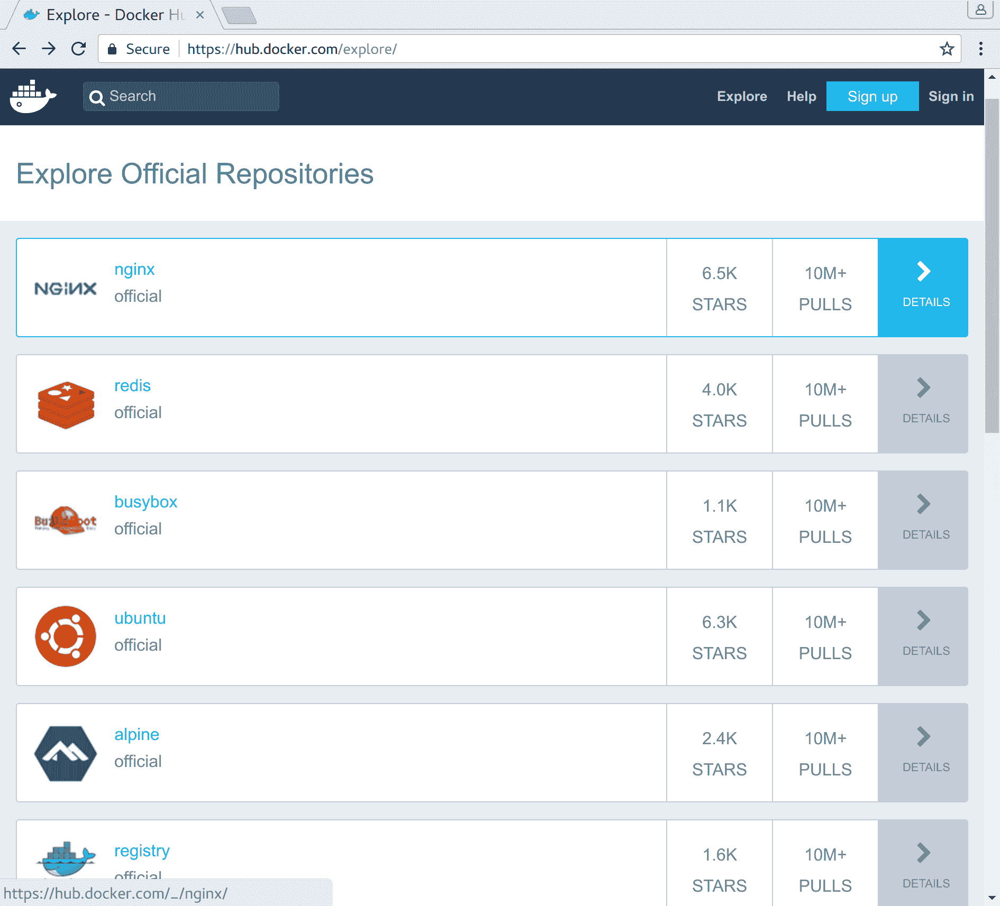
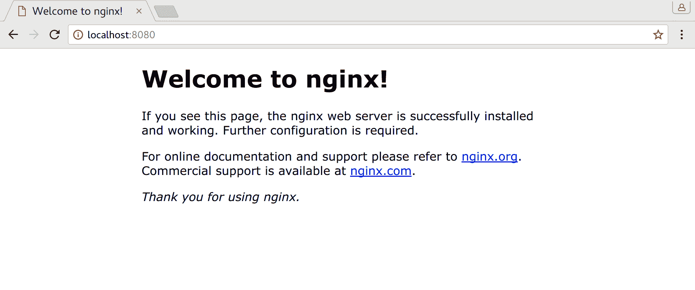
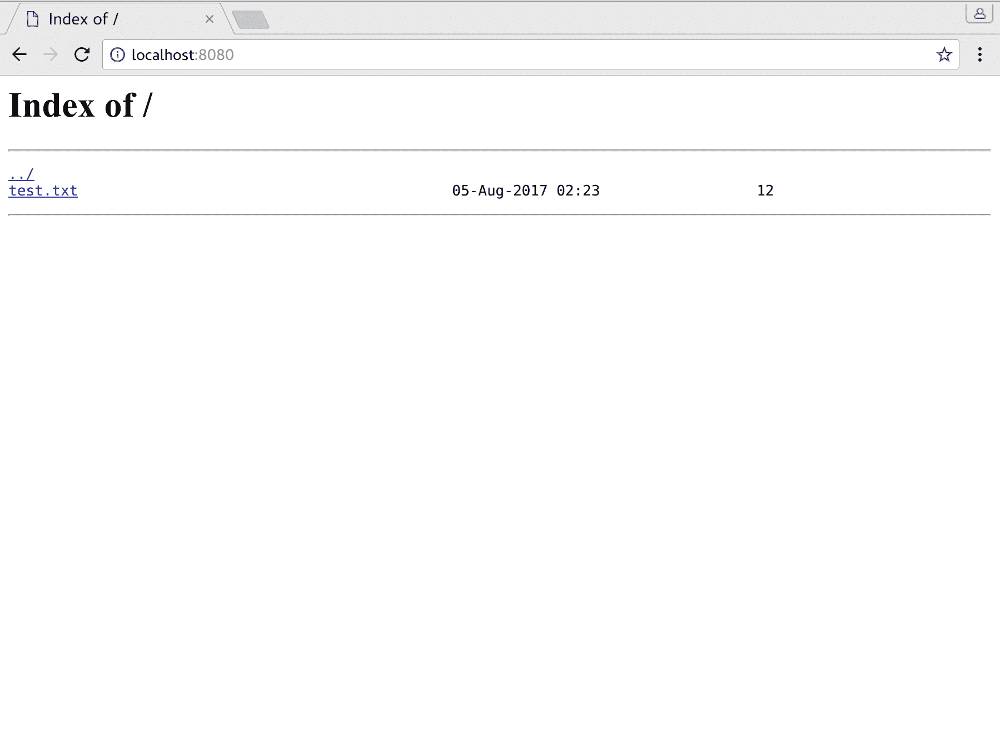
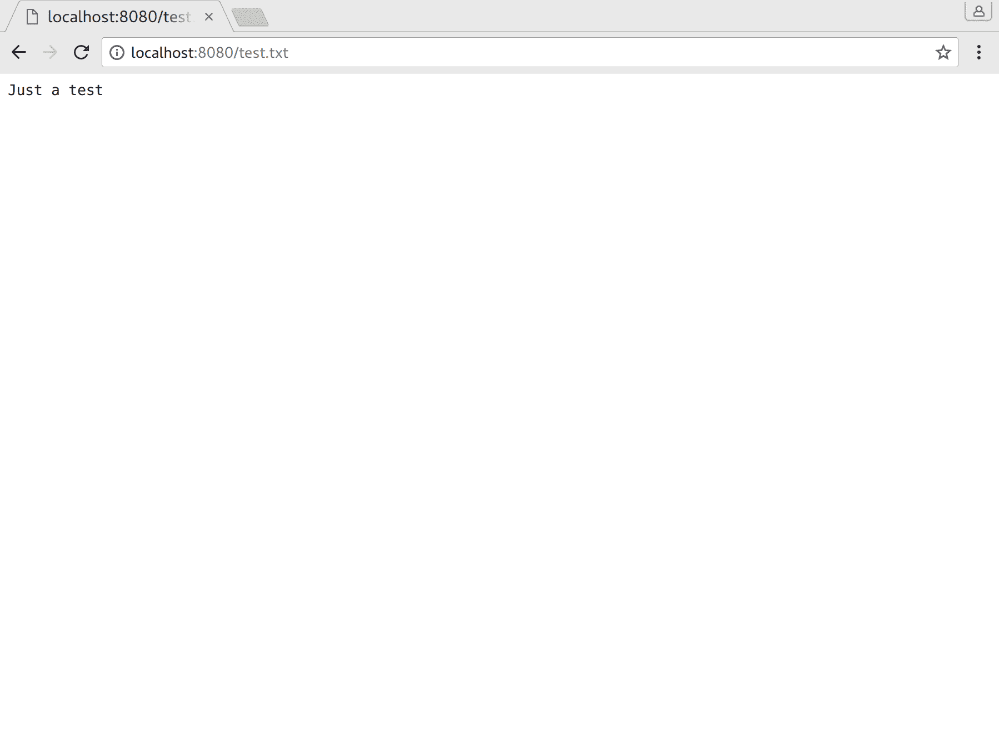
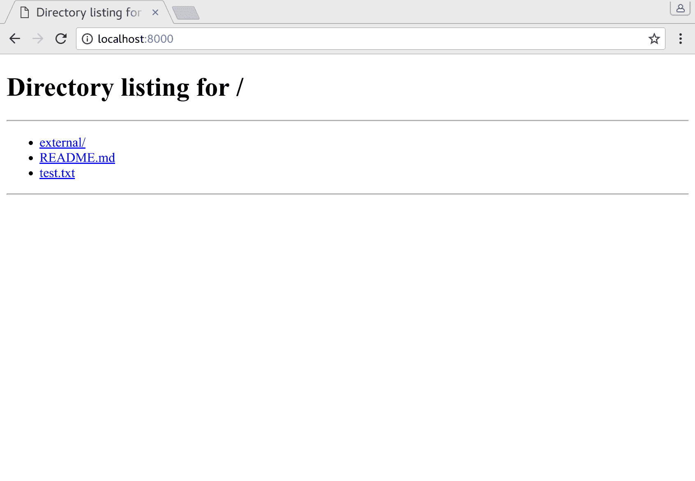
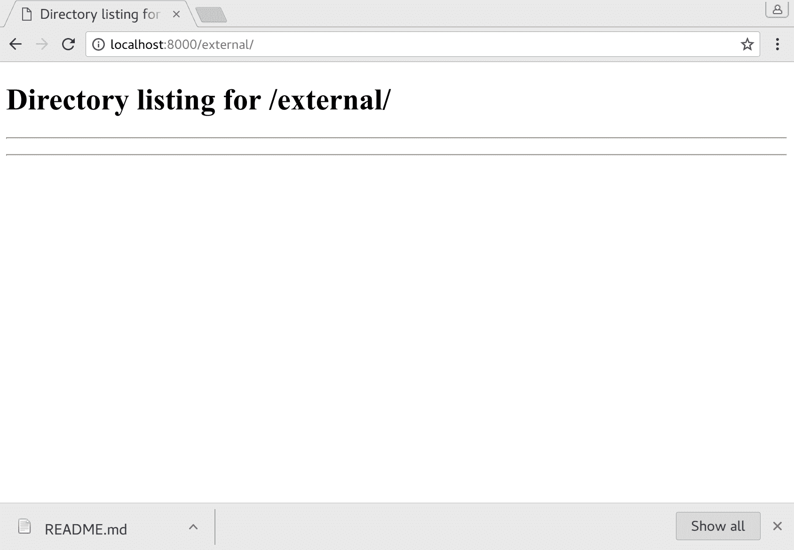
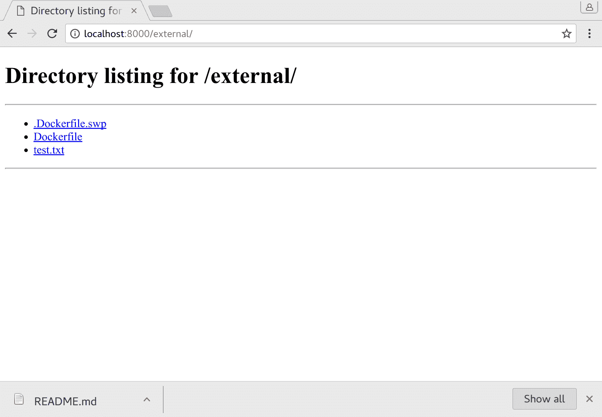

# 二、开始干活

在前一章中，我们研究了什么是容器，它们在您的基础架构中可以扮演什么角色，以及为什么 Docker 在服务部署中处于领先地位。既然我们知道了 Docker 是什么和不是什么，我们就可以从基础开始了。在本章中，我们将涵盖以下主题:

*   安装 Docker
*   扩展容器
*   建造集装箱
*   调试容器

# 安装 Docker

Docker 的安装因操作系统而异，但对于大多数系统，在[https://docs.docker.com/engine/installation/](https://docs.docker.com/engine/installation/)有详细的说明。Docker 一般有两个级别:**社区版** ( **CE** )和**企业版** ( **EE** )。虽然略有不同，但对于我们将在本书中研究的几乎所有内容，社区版都是功能完善的，并且在各方面都足够了。一旦达到需要更高级功能的规模级别，例如安全扫描、LDAP 和技术支持，企业版可能就有意义了。不出所料，企业版不是免费的，你可以看看[https://www.docker.com/pricing](https://www.docker.com/pricing)看看这些版本有什么不同。

对于我们的例子和本书中任何特定于操作系统的命令，从这里开始，我们将使用 Ubuntu 的**长期支持** ( **LTS** )版本，Ubuntu 是目前最受欢迎的 Linux 发行版。LTS 产品的最新版本是 16.04，这将是我们的 CLI 交互和示例的基础，但是当您阅读本书时，18.04 可能也已经可用了。请记住，在安装部分之外，大多数代码和示例都是非常可移植的，并且通常应该在其他平台上运行，因此即使需要更改，它们也应该是最小的。也就是说，在非 Linux 平台上开发 Docker 服务可能不那么精细或稳定，因为 Docker 通常用于在 Linux 机器上部署基于 Linux 的服务，尽管在某种程度上支持其他利基案例。自从微软试图推行自己的容器策略以来，他们一直在用 Docker for Windows 在这个领域取得重大进展，所以请密切关注他们的进展，因为它可能会成为一个相当称职的开发平台。

Some manual networking examples in later chapters may not work fully in macOS due to the different implementation of this subsystem for that platform. For those, using a virtual machine with Ubuntu LTS is advised if you want to follow along.

因此，使用我们干净的 Ubuntu 16.04 LTS 机器、虚拟机或兼容的操作系统，让我们安装 Docker。虽然 Docker 包已经在发行版中的`apt`存储库中可用，但我强烈反对以这种方式安装，因为这些版本通常要老得多。虽然这对于大多数软件来说不是问题，但是对于像 Docker 这样快速移动的项目来说，在支持最新特性方面，它会让您处于明显的劣势。为此，我们将从 Docker 自己的 apt 存储库中安装 Docker:

Warning! There are couple of other ways to install Docker using many of the following tools, but unless absolutely necessary, installation with the `sudo curl -sSL https://somesite.com/ | sh` pattern or anything similar to it is a very dangerous thing to do as you are rooting your own box for a website without checking what the script does. This execution pattern also leaves minimal evidence of what was done behind. Additionally mid-stream exception can corrupt the download but still execute, partially causing damage, and you are only relying on **Transport Layer Security** (**TLS**), for which hundreds of organizations across the world can create fake certificates. In other words, if you care about your machine, you should never, ever try to install software in this way unless, of course, the software vendor is clueless about security and they force you to do this, in which case, you are at their mercy.

```
$ # Install the pre-requisites
$ sudo apt install -y apt-transport-https \
                      curl

$ # Add Docker's signing key into our apt configuration to ensure they are the only ones that can send us updates. This key should match the one that the apt repository is using so check the online installation instruction if you see "NO_PUBKEY <key_id>" errors.
$ apt-key adv --keyserver hkp://p80.pool.sks-keyservers.net:80 \
              --recv-keys 58118E89F3A912897C070ADBF76221572C52609D

$ # Add the repository location to apt. Your URL may be different depending on if Xenial is your distribution.
$ echo "deb https://apt.dockerproject.org/repo ubuntu-xenial main" | sudo tee -a /etc/apt/sources.list.d/docker.list

$ # Update the apt listings and install Docker
$ sudo apt update
$ sudo apt install docker-engine
```

By default, Docker will require `sudo` (or `root`) prefixed to all of your commands to run including ones in this book that don't have it explicitly mentioned. Generally, for development machines, this is a big pain to deal with so I might mention, but *strongly* discourage, that you can also add your current user to the `docker` group so that you do not need to prefix every Docker command with `sudo`:

1.  用`usermod`将用户添加到组中(例如`$ sudo usermod -aG docker $USER`)。

2.  完全注销并重新登录(仅在会话开始时评估组)。

请记住，这是一个巨大的安全漏洞，可以让本地用户轻而易举地升级到 root 权限，因此在任何情况下，都不要在任何位于互联网上的服务器上这样做。

如果前面的所有命令都如预期的那样工作，您将能够看到是否安装了 Docker:

```
$ docker --version
Docker version 17.05.0-ce, build 89658be
```

安装 Docker 而不运行任何东西是非常无用的，所以让我们看看我们是否能得到一个可以在本地运行的映像。我们在这里的选择是要么从头开始制作我们自己的形象，要么使用已经制作好的东西。考虑到 Docker 之所以达到如此高的采用率，一个很大的原因是它可以通过 Docker Hub([https://hub.docker.com/](https://hub.docker.com/))轻松共享映像，而我们刚刚起步，我们将延迟一点创建自己的映像来探索这个网站，一个发布和下载 Docker 映像的集中场所。



在这个非描述性且平淡无奇的页面背后，存储着成千上万的 Docker 映像，由于我们现在对发布映像不感兴趣，我们只需点击页面右上角的 Explore 按钮即可查看有哪些映像可用:



如您所见，这列出了撰写本文时最受欢迎的映像，但您也可以通过左上角的搜索框查找特定的映像。就目前而言，如前所述，我们不会在这里花费太多时间，但您知道如何从 Docker Hub 运行映像将是有价值的，因此我们将尝试拉取并运行其中一个映像，向您展示它是如何完成的。

目前这里可用的顶级容器似乎是 NGINX，所以我们将尝试在 Docker 环境中运行它。如果你之前没有使用过 NGINX，那它是一款高性能的 web 服务器，被互联网上大量的网站使用。在这个阶段，我们只想体验一下运行这些容器的感觉，所以让我们看看是如何做到的:

```
$ # Pull the image from the server to our local repository
$ docker pull nginx
Using default tag: latest
latest: Pulling from library/nginx
94ed0c431eb5: Pull complete
9406c100a1c3: Pull complete
aa74daafd50c: Pull complete
Digest: sha256:788fa27763db6d69ad3444e8ba72f947df9e7e163bad7c1f5614f8fd27a311c3
Status: Downloaded newer image for nginx:latest
```

`pull`命令拉出组成该映像的所有图层。在这种情况下，NGINX 映像基于三个堆叠的层，并且有一个散列`788fa277..27a311c3`，并且由于我们没有指定我们想要的特定版本，所以我们得到了默认标签，即`latest`。通过这个命令，我们已经从 Docker Hub 中检索到了 NGINX 映像，这样我们就可以在本地运行它了。如果我们想使用不同的标签或者从不同的服务器拉取，这个命令会得到类似于`docker pull <hostname_or_ip>:<port>/<tag_name>`的更具表现力的形式，但是我们将在后面的章节中介绍这些高级用法。

映像现在位于我们本地的 Docker 存储中(通常在`/var/lib/docker`中)，我们可以尝试运行它。NGINX 有大量的可能选项，您可以在[https://hub.docker.com/_/nginx/](https://hub.docker.com/_/nginx/)进一步详细研究，但我们现在只对映像的开始感兴趣:

```
$ docker run nginx
```

你可能注意到什么都没有发生，但是不要担心，因为这是预料之中的。可悲的是，这个命令本身是不够的，因为 NGINX 将在前台运行，根本无法通过套接字访问，所以我们需要覆盖一些标志和开关，以使它真正有用。因此，让我们按下 *Ctrl* + *C* 关闭容器，然后再试一次，这次添加一些必要的标志:

```
$ docker run -d \
             -p 8080:80 \
             nginx
dd1fd1b62d9cf556d96edc3ae7549f469e972267191ba725b0ad6081dda31e74
```

`-d`标志在后台运行集装箱(分离模式)，这样我们的码头就不会被 NGINX 占用，而`-p 8080:80`标志将我们的本地港口`8080`映射到集装箱港口`80`。容器通常有它们公开的特定端口，在这种情况下，它是`80`，但是如果没有映射，我们将无法访问它。该命令返回的输出是一个唯一的标识符(容器标识)，可用于在启动该特定容器后跟踪和控制它。希望您现在可以看到 Docker 的端口白名单方法如何增加额外的安全级别，因为只有您明确允许监听的内容才被允许。

你现在可以打开你的浏览器到`http://localhost:8080`，你会看到一个类似这样的页面:



但是我们究竟是如何知道港口`80`需要被倾听的呢？事实上，我们将在一秒钟内讨论这个问题，但是首先，因为我们在分离模式下启动了这个容器，所以它仍然会在后台运行，我们应该确保我们也停止它。要查看我们运行了哪些容器，让我们用`docker ps`检查我们的 Docker 容器状态:

```
$ docker ps
CONTAINER ID IMAGE COMMAND CREATED STATUS PORTS NAMES
dd1fd1b62d9c nginx "nginx -g 'daemon ..." 13 minutes ago Up 13 minutes 0.0.0.0:8080->80/tcp dazzling_swanson
```

我们在这里看到的是，我们的 NGINX 容器仍然在运行，它已经将 localhost 接口端口`8080`(包括外部可访问的端口)映射到容器的端口`80`，并且我们已经运行了`13`分钟。如果我们有更多的容器，它们都会在这里列出，所以这个命令对于使用 Docker 容器非常有用，并且通常用于调试和容器管理。

既然我们想关闭这个容器，我们现在就要这样做。要关闭容器，我们需要知道容器标识，它既是`docker run`返回的值，也是`docker ps`第一列显示的值(`dd1fd1b62d9c`)。请随意使用 ID 的短版本或长版本，但为了简洁起见，我们将使用前者:

```
$ docker stop dd1fd1b62d9c
dd1fd1b62d9c
```

这将优雅地尝试停止容器，并将使用的资源返回给操作系统，并在特定超时后，强行终止它。如果容器真的卡住了，并且我们知道，我们可以用`kill`替换`stop`来硬终止进程，但是这很少需要，因为如果进程没有响应，`stop`通常会做同样的事情。我们现在将确保我们的容器不见了:

```
$ docker ps
CONTAINER ID IMAGE COMMAND CREATED STATUS PORTS NAMES
```

是的，事情看起来和我们预期的一样，但是要注意，虽然停止的容器不可见，但是默认情况下它们不会从文件系统中完全删除:

```
$ docker ps -a
CONTAINER ID IMAGE COMMAND CREATED STATUS PORTS NAMES
dd1fd1b62d9c nginx "nginx -g 'daemon ..." 24 minutes ago Exited (137) 2 minutes ago dazzling_swanson
```

`-a`标志用于显示所有的容器状态，而不仅仅是运行的状态，可以看到系统仍然知道我们的旧容器。我们甚至可以用`docker start`恢复！

```
$ docker start dd1fd1b62d9c
dd1fd1b62d9c

$ docker ps
CONTAINER ID IMAGE COMMAND CREATED STATUS PORTS NAMES
dd1fd1b62d9c nginx "nginx -g 'daemon ..." 28 minutes ago Up About a minute 0.0.0.0:8080->80/tcp dazzling_swanson
```

要真正永久删除我们的容器，我们需要使用`docker rm`显式删除它，如这里所示，或者使用`--rm`开关运行`docker run`命令(我们将在接下来的几页中介绍这一点):

```
$ docker stop dd1fd1b62d9c
dd1fd1b62d9c

$ docker rm dd1fd1b62d9c
dd1fd1b62d9c

$ docker ps -a
CONTAINER ID IMAGE COMMAND CREATED STATUS PORTS NAMES
```

成功！

现在让我们回到前面的问题，即我们如何知道容器需要将端口 80 映射到它？我们有几个选项可以找到这些信息，最简单的是启动容器并检入`docker ps`来查看哪些端口是未绑定的:

```
$ docker run -d \
             --rm \
             nginx
f64b35fc42c33f4af2648bf4f1dce316b095b30d31edf703e099b93470ab725a

$ docker ps
CONTAINER ID IMAGE COMMAND CREATED STATUS PORTS NAMES
f64b35fc42c3 nginx "nginx -g 'daemon ..." 4 seconds ago Up 3 seconds 80/tcp awesome_bell
```

这里我们和`docker run`一起使用的新标志是`--rm`，我们刚才提到过，它告诉 Docker 守护程序在容器停止后完全移除容器，这样我们就不用自己手动了。

If you already have a container that you want to check the mapped ports on, you can use `docker port <container_id>` command but we are omitting it here since it cannot be used on images, but just containers.

虽然这是查看需要哪些端口的最快方法，但是除了读取其 Dockerfile 和文档之外，检查映像的一般方法是通过`docker inspect`:

```
$ # Inspect NGINX image info and after you match our query, return also next two lines
$ docker inspect nginx | grep -A2 "ExposedPorts"
"ExposedPorts": {
 "80/tcp": {}
},
```

另外，`docker inspect`可以显示各种其他有趣的信息，例如:

*   映像的标识
*   标签名
*   映像创建日期
*   核心环境变量
*   容器在启动时运行的命令
*   容器的大小
*   映像图层标识
*   指定的体积

随意在任何容器或映像上运行 inspect 命令，看看你能在那里找到什么宝石。大多数情况下，这个输出主要用于调试，但是在缺少映像文档的情况下，它可能是一个宝贵的工具，可以让您在最少的时间内运行。

# 调试容器

通常，在处理容器的一般工作中，您可能必须弄清楚正在运行的容器发生了什么，但是`docker ps`还不足以为您提供解决问题所需的所有信息。对于这些情况，首先要使用的命令是`docker logs`。该命令显示容器发出的任何输出，包括`stdout`和`stderr`流。对于以下日志，我从之前启动了相同的 NGINX 容器，并在`localhost`上访问了它的托管页面:

```
$ docker run -d \
             -p 8080:80 \
             nginx
06ebb46f64817329d360bb897bda824f932b9bcf380ed871709c2033af069118

$ # Access the page http://localhost:8080 with your browser

$ docker logs 06ebb46f
172.17.0.1 - - [02/Aug/2017:01:39:51 +0000] "GET / HTTP/1.1" 200 612 "-" "Mozilla/5.0 (Windows NT 6.3; rv:36.0) Gecko/20100101 Firefox/36.01" "-"
2017/08/02 01:39:51 [error] 6#6: *1 open() "/usr/share/nginx/html/favicon.ico" failed (2: No such file or directory), client: 172.17.0.1, server: localhost, request: "GET /favicon.ico HTTP/1.1", host: "localhost:8080"
172.17.0.1 - - [02/Aug/2017:01:39:51 +0000] "GET /favicon.ico HTTP/1.1" 404 169 "-" "Mozilla/5.0 (Windows NT 6.3; rv:36.0) Gecko/20100101 Firefox/36.01" "-"
172.17.0.1 - - [02/Aug/2017:01:39:52 +0000] "GET / HTTP/1.1" 200 612 "-" "Mozilla/5.0 (Windows NT 6.3; rv:36.0) Gecko/20100101 Firefox/36.01" "-"
```

您可以在这里看到，NGINX 记录了所有的访问和相关的响应代码，这些代码对于调试 web 服务器来说是非常宝贵的。一般来说，输出可能从非常有用到垃圾不等，这取决于运行服务的是什么，但它通常是开始搜索的好地方。如果您想在写入日志时跟踪日志，也可以添加`-f`标志，这在日志很大并且您试图从您正在寻找的特定事物中过滤噪音时非常有用。

# 看到容器看到的东西

当日志不足以解决问题时，要使用的命令是`docker exec`，以便在运行的容器上执行一个命令，该命令可以包括对完整外壳的访问:

```
$ docker run -d \
             -p 8080:80 \
             nginx
06ebb46f64817329d360bb897bda824f932b9bcf380ed871709c2033af069118

$ docker exec 06ebb46f ls -la /etc/nginx/conf.d/
total 12
drwxr-xr-x 2 root root 4096 Jul 26 07:33 .
drwxr-xr-x 3 root root 4096 Jul 26 07:33 ..
-rw-r--r-- 1 root root 1093 Jul 11 13:06 default.conf
```

在这种情况下，我们使用`docker exec`在容器中运行`ls`命令，但这并不是一个真正强大的调试工具。如果我们试着把那个完整的壳放进容器里，然后那样检查它，会怎么样？

```
$ docker exec -it \
              06ebb46f /bin/bash
root@06ebb46f6481:/# ls -la /etc/nginx/conf.d/
total 12
drwxr-xr-x 2 root root 4096 Jul 26 07:33 .
drwxr-xr-x 3 root root 4096 Jul 26 07:33 ..
-rw-r--r-- 1 root root 1093 Jul 11 13:06 default.conf
root@06ebb46f6481:/# exit
exit

$ # Back to host shell
```

这一次，我们使用了`-it`，这是`-i`和`-t`标志的简写，这两个标志结合起来设置了完整外壳访问所需的交互式终端，然后我们使用`/bin/bash`在容器内运行 Bash。容器内的外壳在这里是一个非常有用的工具，但是在安装的工具方面，我们受容器本身的支配，因为许多映像从映像中删除了任何不必要的包——在这种情况下，NGINX 容器没有`ps`，这是一个非常有价值的工具，用于查找问题的原因。由于容器通常是独立的一次性组件，有时向容器中添加调试工具以找出导致问题的原因可能会很好(尽管我们将在后面的章节中介绍一种更好的方法，让`pid`名称空间加入进来):

```
$ docker exec -it 06ebb46f /bin/bash

root@06ebb46f6481:/# ps  # No ps on system
bash: ps: command not found

root@06ebb46f6481:/# apt-get update -q
Hit:1 http://security.debian.org stretch/updates InRelease
Get:3 http://nginx.org/packages/mainline/debian stretch InRelease [2854 B]
Ign:2 http://cdn-fastly.deb.debian.org/debian stretch InRelease
Hit:4 http://cdn-fastly.deb.debian.org/debian stretch-updates InRelease
Hit:5 http://cdn-fastly.deb.debian.org/debian stretch Release
Fetched 2854 B in 0s (2860 B/s)
Reading package lists...

root@06ebb46f6481:/# apt-get install -y procps
<snip>
The following NEW packages will be installed:
libgpm2 libncurses5 libprocps6 procps psmisc
0 upgraded, 5 newly installed, 0 to remove and 0 not upgraded.
Need to get 558 kB of archives.
After this operation, 1785 kB of additional disk space will be used.
<snip>

root@06ebb46f6481:/# ps
PID TTY TIME CMD
31 ? 00:00:00 bash
595 ? 00:00:00 ps

root@06ebb46f6481:/#
```

如您所见，从容器的上游分发向容器添加任何调试工具都很容易，但是请注意，一旦您发现您的问题，您应该启动一个新的容器并移除旧的容器来清理剩余的垃圾，因为它正在浪费空间，并且新的容器将从没有添加您新安装的调试工具的映像开始(在我们的案例中为`procps`)。

另一件要记住的事情是，有时，映像会阻止安装额外的包，所以对于这些情况，我们需要等到后面的章节，看看我们如何使用名称空间在这种受约束的设置中工作。

Sometimes, the container is locked into a limited user shell, and because of it, you will be unable to access or modify other parts of the system of the container. In such configurations, you can add the `-u 0` flag to run the `docker exec` command as `root` (`user 0`). You can also specify any other username or user ID instead, but generally if you need a secondary user to work with on a container, `root` is what you want.

# 我们的第一份档案

现在我们已经知道了一些关于如何绕过容器的知识，这是一个尝试创建我们自己的容器的好地方。要开始构建一个容器，我们首先需要知道的是 Docker 在构建映像时寻找的默认文件名是`Dockerfile`。虽然您可以为这个主配置文件使用不同的名称，但这是非常不鼓励的，尽管在一些罕见的情况下，您可能无法避免它-例如，如果您需要一个测试套件映像和主映像构建文件在同一个文件夹中。现在，我们将假设您只有一个构建配置，考虑到这一点，我们来看看这些基本的`Dockerfile`之一是什么样子。在文件系统的某个地方创建一个测试文件夹，并将其放入名为`Dockerfile`的文件中:

```
FROM ubuntu:latest

RUN apt-get update -q && \
 apt-get install -qy iputils-ping

CMD ["ping", "google.com"]
```

让我们逐行检查这个文件。首先，我们有`FROM ubuntu:latest`线在里面。这一行表示我们希望使用最新的 Ubuntu Docker 映像作为我们的基础，我们将在此基础上构建自己的服务。该映像将自动从 Docker Hub 中提取，但是如果我们愿意，该映像也可以来自自定义存储库、您自己的本地映像，并且可以基于任何其他映像，只要它为您的服务提供了良好的基础(即 NGINX、Apline Linux、Jenkins 等)。

下一行非常重要，因为基本的 Ubuntu 映像几乎没有现成的东西，所以我们需要通过包管理器`apt`安装提供 ping 实用程序(`iputils-ping`)的包，就像我们在命令行上使用`RUN`指令安装 Docker 一样。然而，在我们安装它之前，我们还需要确保我们的更新索引是最新的，为此我们使用`apt-get update`。一会儿，我们将详细介绍为什么我们使用`&&`来链接`update`和`install`命令，但是现在，我们将神奇地忽略它，这样我们就不会过多地破坏我们的示例。

`CMD`指令指示 Docker，默认情况下，每当容器启动时，Docker 将运行`"ping" "google.com"`，而无需进一步的参数。该指令用于启动容器内的服务，它将容器的生命周期与该过程联系起来，因此如果我们的`ping`失败，我们的容器终止，反之亦然。您的 Dockerfile 中只能有一行`CMD`，所以要特别小心使用它的目的。

现在我们已经配置了整个容器，让我们构建它:

```
$ # Build using Dockerfile from current directory and tag our resulting image as "test_container"
$ docker build -t test_container . 
Sending build context to Docker daemon 1.716MB
Step 1/3 : FROM ubuntu:latest
---> 14f60031763d
Step 2/3 : RUN apt-get update -q && apt-get install -qy iputils-ping
---> Running in ad1ea6a6d4fc
Get:1 http://security.ubuntu.com/ubuntu xenial-security InRelease [102 kB]
<snip>
The following NEW packages will be installed:
iputils-ping libffi6 libgmp10 libgnutls-openssl27 libgnutls30 libhogweed4
libidn11 libnettle6 libp11-kit0 libtasn1-6
0 upgraded, 10 newly installed, 0 to remove and 8 not upgraded.
Need to get 1304 kB of archives.
<snip>
Setting up iputils-ping (3:20121221-5ubuntu2) ...
Processing triggers for libc-bin (2.23-0ubuntu9) ...
---> eab9729248d9
Removing intermediate container ad1ea6a6d4fc
Step 3/3 : CMD ping google.com
---> Running in 44fbc308e790
---> a719d8db1c35
Removing intermediate container 44fbc308e790
Successfully built a719d8db1c35
Successfully tagged test_container:latest
```

正如对它的评论所暗示的，我们在这里对`docker build -t test_container .`所做的是，我们在当前目录中构建了容器(使用默认的 Dockerfile 配置名称)，并用名称`test_container`标记它。由于我们没有在`test_container`的末尾指定版本，Docker 给我们分配了一个名为`latest`的版本，从输出的末尾我们可以看到。如果我们仔细检查输出，我们还可以看到对基础映像的每个更改都会创建一个新的层，然后该层的标识被用作下一个指令的输入，每个层都会在映像上创建自己的文件系统差异。例如，如果我们再次运行构建，Docker 足够聪明，知道没有任何变化，它将再次使用这些层的缓存版本。将最终容器标识(`a719d8db1c35`)与上一次运行的容器标识进行比较:

```
$ docker build -t test_container . 
Sending build context to Docker daemon 1.716MB
Step 1/3 : FROM ubuntu:latest
---> 14f60031763d
Step 2/3 : RUN apt-get update -q && apt-get install -qy iputils-ping
---> Using cache
---> eab9729248d9
Step 3/3 : CMD ping google.com
---> Using cache
---> a719d8db1c35
Successfully built a719d8db1c35
Successfully tagged test_container:latest
```

如果在 Dockerfile 的指令中检测到任何更改，Docker 将重建该层和任何后续层，以确保一致性。这个功能和选择性的“缓存破坏”也将在后面介绍，它在管理您的存储库和映像大小方面有着非常重要的作用。

构建好容器后，让我们看看它是否真的工作(要退出循环，请按 *Ctrl* + *C* ):

```
$ # Run the image tagged "test_container"
$ docker run test_container 
PING google.com (216.58.216.78) 56(84) bytes of data.
64 bytes from ord30s21-in-f14.1e100.net (216.58.216.78): icmp_seq=1 ttl=52 time=45.9 ms
64 bytes from ord30s21-in-f14.1e100.net (216.58.216.78): icmp_seq=2 ttl=52 time=41.9 ms
64 bytes from ord30s21-in-f14.1e100.net (216.58.216.78): icmp_seq=3 ttl=52 time=249 ms
^C
--- google.com ping statistics ---
3 packets transmitted, 3 received, 0% packet loss, time 2002ms
rtt min/avg/max/mdev = 41.963/112.460/249.470/96.894 ms
```

又成功了！你写了你的第一个运行的 Docker 容器！

# 破坏缓存

在我们刚刚写的容器中，我们稍微浏览了一下`RUN apt-get update -q && apt-get install -qy iputils-ping`行，因为它需要在这里进行更深入的讨论。在大多数 Linux 发行版中，包一直在版本中循环，但是这些索引的列表告诉我们在哪里可以找到它们，这些索引在创建时会被烘焙到原始的 Docker 映像中(在本例中为`ubuntu:latest`)。在我们可以安装软件包之前，在大多数情况下，我们的索引文件已经过时太久了(如果它们还没有被完全删除)，所以我们需要更新它们。将这条`&&`连接线分成两条独立的线将适用于第一栋建筑:

```
RUN apt-get update -q
RUN apt-get install -qy iputils-ping
```

但是当您稍后向第二行添加另一个包时会发生什么，如下行所示？

```
RUN apt-get install -qy curl iputils-ping
```

在这种情况下，Docker 不是很聪明，会认为`update`行没有变化，不会再次运行更新命令，因此它将使用来自更新层缓存的状态，然后继续下一个试图安装`curl`的更新(因为该更新自上次构建以来确实发生了变化)，如果在存储库中轮换了足够多的版本，这很可能会失败，因为索引将再次过时。为了防止这种情况发生，我们将`update`和`install`命令与`&&`连接起来，这样它们就被视为一个指令并创建一个层，在这种情况下，更改这两个连接命令中的任何一个的任何部分都将破坏缓存并正确运行`update`。可悲的是，随着您越来越多地使用可扩展的 Docker 组件，使用类似这样的奇怪技巧来管理缓存并进行选择性的缓存破坏将成为您工作的一大部分。

# 更实用的容器

这可能是我们开始偏离其他 Docker 材料的地方，这些材料实际上假设只有这些基本知识，剩下的工作是小菜一碟，而实际上完全不是这样。这不是火箭科学，但这些简单的例子确实不足以让我们到达我们需要的地方，所以我们将使用一个基于我们以前与 NGINX 的工作的实际例子，并创建一个容器，使用这个网络服务器映像来提供和服务我们将烘焙到映像中的内容。

This example and all the other ones in this book are also available on GitHub at [https://github.com/sgnn7/deploying_with_docker](https://github.com/sgnn7/deploying_with_docker). You can use either `git` or their web interface to follow along with the examples, but all examples of code that we will use will be directly included in the book too.

要开始创建我们的 web 服务器，我们需要创建一个目录来存放我们的所有文件:

```
$ mkdir ~/advanced_nginx
$ cd ~/advanced_nginx
```

我们需要创建的第一个文件是我们的虚拟文本文件，我们将尝试在映像中提供:

```
$ echo "Just a test file" > test.txt
```

我们需要的下一个文件是所需的 NGINX 配置。将以下文本放入名为`nginx_main_site.conf`的文件中:

```
    server {
      listen 80;
      server_name _;
      root /srv/www/html;

      # Deny access to any files prefixed with '.'
      location ~/\. {
        deny all;
      }

      # Serve up the root path at <host>/
      location / {
        index index.html;
        autoindex on;
      }
    }
```

如果你从未使用过 NGINX，让我们来看看这个文件是做什么的。在第一个块中，我们正在创建一个`server`，它在端口`80`上监听，该端口根植于映像上的`/srv/www/html`。第二个块，虽然不是严格需要的，并且需要为更大的网站进行更改，但对于任何在 NGINX 上工作的人来说，应该是肌肉记忆，因为它阻止下载隐藏文件，如`.htaccess`、`.htpasswd`，以及许多其他不应该公开的文件。最后一个块只是确保从`root`读取任何以`/`开始的路径，如果没有提供索引文件，它将使用`index.html`。如果没有这样的文件可用，并且我们在一个目录中，`autoindex`确保它可以向您显示一个人类可读的目录列表。

While this NGINX configuration is functional, there are many things that it is not including (SSL configuration, logging, error files, file lookup matching, and so on), but that is mostly because this is a book is trying to focus on Docker itself and not NGINX. If you would like to learn more about how to fully and properly configure NGINX, you can visit [https://nginx.org/en/docs/](https://nginx.org/en/docs/) for more information.

写好配置后，我们现在可以创建 Docker 文件，它将获取我们的测试文件、配置文件和 NGINX 映像，并将其全部转换为 Docker 映像，该映像运行 web 服务器并提供我们的测试文件:

```
FROM nginx:latest

# Make sure we are fully up to date
RUN apt-get update -q && \
 apt-get dist-upgrade -y

# Remove the default configuration
RUN rm /etc/nginx/conf.d/default.conf

# Create our website's directory and make sure
# that the webserver process can read it
RUN mkdir -p /srv/www/html && \
 chown nginx:nginx /srv/www/html

# Put our custom server configuration in
COPY nginx_main_site.conf /etc/nginx/conf.d/

# Copy our test file in the location that is
# being served up
COPY test.txt /srv/www/html/
```

这个 Dockerfile 可能看起来与第一个有很大不同，所以我们将花一些时间深入研究我们在这里做的事情。

# 用 FROM 扩展另一个容器

与我们上一个容器类似，我们的`FROM nginx:latest`行确保我们使用的是最新版本的基础映像，但是在这里，我们将使用 NGINX 作为我们的基础，而不是 Ubuntu。`latest`确保我们获得的映像具有最新的功能，并且通常也有补丁，但将来会有轻微的损坏和应用编程接口不兼容的风险。

在编写 Docker 容器时，您通常必须根据您的情况和稳定性要求做出这些权衡决定，但是 NGINX API 多年来一直非常稳定，因此在这种特定情况下，我们不需要命名标签提供的稳定性。如果我们想要这些标记版本中的一个，那么`latest`将会改变为我们想要的在 Docker Hub 上提供的版本，我们可以在[https://hub.docker.com/_/nginx/](https://hub.docker.com/_/nginx/)找到它，所以类似`FROM nginx:1.13`的东西也会非常好。

# 确保包含最新的修补程序

我们接下来的步骤`apt-get upgrade`和`apt-get dist-upgrade`在目前的 Docker 世界中有点争议，但我认为它们是一个很好的补充，我会解释为什么。在常规的`deb`基于包的 Linux 发行版(即 Debian、Ubuntu 等)上，这两个命令确保您的系统与您的系统版本的当前发布的包完全一致。这意味着任何不是最新版本的包都将被升级，任何过时的包都将被更新的包替换。由于 Docker 的一般准则是容器或多或少是一次性的，因此以这种方式更新您的容器似乎有些不受欢迎，但也不是没有缺点。

由于 Docker Hub 上的大多数 Docker 映像仅在基础源文件或 Dockerfile 本身发生更改时才构建，因此这些映像中有许多具有较旧的和/或未修补的系统库，因此当服务将它们用作动态库时，它可能容易受到此后已修复的任何错误的影响。为了确保我们不会在安全强化方面落后，我们确保在做任何其他事情之前更新系统。虽然由于系统应用编程接口可能发生变化而导致服务中断的风险很小，并且由于应用了额外的更改而导致映像大小增加，但在我看来，这种权衡还不足以让服务不受保护，但请随意使用您的最佳判断。

# 应用我们定制的 NGINX 配置

我们在系统更新(`RUN rm /etc/nginx/conf.d/default.conf`)后的指令是从容器中删除默认的 web 服务器配置。您可以通过我们上一篇技巧文章中的链接找到更多关于 NGINX 配置的信息，但就目前而言，可以说默认情况下，所有单独的站点配置文件都存储在`/etc/nginx/conf.d`中，NGINX Docker 映像开箱即用，附带一个名为`default.conf`的简单示例文件，我们绝对不想使用它。

虽然我们可以覆盖提到的文件，但我们会被名称`default`卡住，这不是很好的描述，所以对于我们的配置，我们将删除这个文件，并添加一个更好的文件名。

接下来，我们需要确保我们将提供文件的文件夹是可用的，并且可以被 web 服务器进程读取。使用`mkdir -p`的第一个命令创建了所有相关的目录，但是由于 NGINX 不是以 root 身份运行，我们需要知道进程将会以什么用户的身份读取我们想要提供的文件，否则我们的服务器将无法显示任何内容。通过在`/etc/nginx/nginx.conf`处显示映像中包含的系统范围 NGINX 配置的前几行，我们可以找到作为默认用户的原始配置:

```
$ # Print top 2 lines of main config file in NGINX image
$ docker run --rm \
             nginx /bin/head -2 /etc/nginx/nginx.conf

user nginx;
```

完美！好了，现在需要能够读取这个目录的用户是`nginx`，我们将用`chown nginx:nginx /srv/www/html`来改变我们目标文件夹的所有者，但是我们在试图找出这个的时候刚刚使用的新样式的`run` Docker 命令是怎么回事呢？如果在指定映像名称后包含一个命令，而不是映像中的`CMD`指令，Docker 会用这个新命令替换它。在前面的命令中，我们正在运行`/bin/head`可执行文件，传递参数告诉它我们只需要`/etc/nginx/nginx.conf`文件的前两行。由于该命令一完成就退出，容器停止并被完全移除，因为我们使用了`--rm`标志。

随着默认配置的消失和目录的创建，我们现在可以用`COPY nginx_main_site.conf /etc/nginx/conf.d/`将 NGINX 的主要配置复制到位。`COPY`参数做了非常明显的事情，将文件从当前构建目录复制到指定位置的映像中。

Be very careful with how you end the `COPY` directive argument, as leaving the slash off will put the source into a file at the destination even if the destination is a directory. To ensure that this doesn't happen, always end your target directory paths with a slash.

添加我们希望托管的主`test.txt`文件是最后一部分，它遵循与其他`COPY`指令相同的思路，但是我们将确保将这个文件放在我们的 NGINX 配置引用的文件夹中。由于我们为此端点打开了`autoindex`标志，因此不需要采取额外的步骤，因为文件夹本身是可浏览的。

# 构建和运行

现在我们已经检查了整个构建配置，我们可以创建自己的映像，看看我们刚刚制作了什么:

```
$ docker build -t web_server . 
Sending build context to Docker daemon 17.41kB
Step 1/6 : FROM nginx:latest
 ---> b8efb18f159b
Step 2/6 : RUN apt-get update -q && apt-get dist-upgrade -yq
 ---> Running in 5cd9ae3712da
Get:1 http://nginx.org/packages/mainline/debian stretch InRelease [2854 B]
Get:2 http://security.debian.org stretch/updates InRelease [62.9 kB]
Get:3 http://nginx.org/packages/mainline/debian stretch/nginx amd64 Packages [11.1 kB]
Get:5 http://security.debian.org stretch/updates/main amd64 Packages [156 kB]
Ign:4 http://cdn-fastly.deb.debian.org/debian stretch InRelease
Get:6 http://cdn-fastly.deb.debian.org/debian stretch-updates InRelease [88.5 kB]
Get:7 http://cdn-fastly.deb.debian.org/debian stretch Release [118 kB]
Get:8 http://cdn-fastly.deb.debian.org/debian stretch Release.gpg [2373 B]
Get:9 http://cdn-fastly.deb.debian.org/debian stretch/main amd64 Packages [9497 kB]
Fetched 9939 kB in 40s (246 kB/s)
Reading package lists...
Reading package lists...
Building dependency tree...
Reading state information...
Calculating upgrade...
0 upgraded, 0 newly installed, 0 to remove and 0 not upgraded.
 ---> 4bbd446af380
Removing intermediate container 5cd9ae3712da
Step 3/6 : RUN rm /etc/nginx/conf.d/default.conf
 ---> Running in 39ad3da8979a
 ---> 7678bc9abdf2
Removing intermediate container 39ad3da8979a
Step 4/6 : RUN mkdir -p /srv/www/html && chown nginx:nginx /srv/www/html
 ---> Running in e6e50483e207
 ---> 5565de1d2ec8
Removing intermediate container e6e50483e207
Step 5/6 : COPY nginx_main_site.conf /etc/nginx/conf.d/
 ---> 624833d750f9
Removing intermediate container a2591854ff1a
Step 6/6 : COPY test.txt /srv/www/html/
 ---> 59668a8f45dd
Removing intermediate container f96dccae7b5b
Successfully built 59668a8f45dd
Successfully tagged web_server:latest
```

看起来容器构建很好；让我们运行它:

```
$ docker run -d \
             -p 8080:80 \
             --rm \
             web_server 
bc457d0c2fb0b5706b4ca51b37ca2c7b8cdecefa2e5ba95123aee4458e472377

$ docker ps
CONTAINER ID IMAGE COMMAND CREATED STATUS PORTS NAMES
bc457d0c2fb0 web_server "nginx -g 'daemon ..." 30 seconds ago Up 29 seconds 0.0.0.0:8080->80/tcp goofy_barti
```

到目前为止，一切都很好，似乎一切都很好。现在我们将在`http://localhost:8080`用浏览器访问容器。



正如我们所希望的那样，我们的服务器正在工作并向我们显示`/srv/www/html`的内容，但是让我们点击`test.txt`以确保它也在工作:



太好了，看起来我们的计划成功了，我们已经创建了一个高性能的静态网站托管服务器容器！当然，我们还可以添加许多其他东西，但是我们扩展示例映像以做一些有用的事情的主要目标是成功的！

# 从头开始服务

我们的最后一个例子相当全面，但它遗漏了一些我们也应该知道的重要 Docker 命令，所以我们将使用另一个例子，尽管以一种稍微不太优化的方式返工网络服务器解决方案，来展示它们的用途并解释它们的作用。在这个过程中，我们将更深入一点，看看我们是否可以自己制作尽可能多的服务部分。

我们将从创建一个干净的目录和创建我们之前使用的相同测试文件开始这个例子:

```
$ mkdir ~/python_webserver
$ cd ~/python_webserver

$ echo "Just a test file" > test.txt
```

现在，我们将通过在`Dockerfile`中放入以下内容来创建我们更复杂的基于 Python 的 web 服务器容器:

```
FROM python:3

# Add some labels for cache busting and annotating
LABEL version="1.0"
LABEL org.sgnn7.name="python-webserver"

# Set a variable that we will keep reusing to prevent typos
ENV SRV_PATH=/srv/www/html

# Make sure we are fully up to date
RUN apt-get update -q && \
 apt-get dist-upgrade -y

# Let Docker know that the exposed port we will use is 8000
EXPOSE 8000

# Create our website's directory, then create a limited user
# and group
RUN mkdir -p $SRV_PATH && \
 groupadd -r -g 350 pythonsrv && \
 useradd -r -m -u 350 -g 350 pythonsrv

# Define ./external as an externally-mounted directory
VOLUME $SRV_PATH/external

# To serve things up with Python, we need to be in that
# same directory
WORKDIR $SRV_PATH

# Copy our test file
COPY test.txt $SRV_PATH/

# Add a URL-hosted content into the image
ADD https://raw.githubusercontent.com/moby/moby/master/README.md \
 $SRV_PATH/

# Make sure that we can read all of these files as a
# limited user
RUN chown -R pythonsrv:pythonsrv $SRV_PATH

# From here on out, use the limited user
USER pythonsrv

# Run the simple http python server to serve up the content
CMD [ "python3", "-m", "http.server" ]
```

Using Python's built-in web server is highly discouraged in almost all cases, as it is neither scalable nor configurable in any significant way, but it serves as a good example of a service that could be hosted through Docker and is available on almost all systems with Python. Do not use this in real production services unless you really know what you are doing.

除了关于在生产中使用 python 的 web 服务器模块的注释之外，这仍然是一个很好的例子，说明了我们没有涉及的所有其他主要 Dockerfile 指令，现在您将了解如何使用。

# 标签

我们这里的第一个新指令是`LABEL`:

```
LABEL version="1.0"
LABEL org.sgnn7.name="python-webserver"
```

`LABEL <key>=<value>`或`LABEL <key> <value>`用于添加关于正在构建的映像的元数据，稍后可以通过`docker ps`和`docker images`使用类似`docker images --filter "<key>=<value>"`的东西对其进行检查和过滤。在`reverse-dns`符号中，密钥一般都是小写的，但是你可以在这里使用你想要的任何东西，并且`version`应该出现在每个映像上，所以我们使用顶级版本密钥名称。然而，这里的版本不仅在那里，这样我们就可以过滤映像，而且如果我们改变它，也会破坏 Docker 的缓存。如果没有这种类型的缓存破坏，或者在构建期间通过手动设置标志(`docker build --no-cache`)，Docker 将一直重用缓存，直到最近更改的指令或文件，因此您的容器很可能会停留在冻结的包配置中。这种情况可能是也可能不是您想要的，但是万一您有自动化的构建工具，添加一个`version`层，每当您更改它时，它都可以破坏缓存，这使得容器非常容易更新。

# 使用 ENV 设置环境变量

`ENV`与其他一些命令不同，应该是不言自明的:它设置了`Dockerfile`和容器中的环境变量。由于我们需要在我们的`Dockerfile`中不断地重新输入`/srv/www/html`，为了防止错别字和确保对最终服务器目录目标的简单更改，我们设置了`SRV_PATH`变量，稍后我们将继续使用`$SRV_PATH`。一般来说，对于 Docker 容器，容器的几乎所有配置都是通过环境变量来完成的，所以希望在后面的章节中看到更多这个指令。

Even though we don't use it in this example, you need to watch out when using environment variables in the `CMD` directive directly as it does not get expanded but runs directly. You can ensure that your variable gets expanded in `CMD` by using it as part of a shell command structure similar to this: `CMD [ "sh", "-c", "echo", "$SRV_PATH" ]`.

# 暴露端口

我们这里的下一个新指令是`EXPOSE 8000`。还记得我们如何使用`docker info`来找出 NGINX 容器使用的端口吗？该指令在元数据中填充了该信息，并被 Docker 编排工具用来将输入端口映射到容器上正确的输入端口。由于默认情况下 Python 的 HTTP 服务器在端口`8000`上启动服务，所以我们使用`EXPOSE`来通知 Docker，无论谁使用这个容器，都应该确保他们将这个端口映射到主机上。您也可以在这里用这个指令列出多个端口，但是因为我们的服务只使用一个，所以我们现在不需要使用它。

# 有限用户的容器安全分层

在我们的`Dockerfile`中，下面这段新奇的代码可能有点复杂，但我们将一起来看看:

```
RUN mkdir -p $SRV_PATH && \
 groupadd -r -g 350 pythonsrv && \
 useradd -r -m -u 350 -g 350 pythonsrv
```

这是我们需要在多个级别上扩展的内容，但您需要知道的第一件事是，默认情况下，Dockerfile 指令作为`root`执行，如果在以后的任何时候您没有指定不同的`USER`，您的服务将使用`root`凭据运行，从安全角度来看，这是一个巨大的漏洞，我们试图通过仅作为有限用户运行我们的服务来弥补。但是，如果没有定义用户和组，我们就无法将上下文从`root`中切换出来，因此我们首先创建一个`pythonsrv`组，然后通过创建附加到所述组的`pythonsrv`用户来跟进。`-r`标志将用户和组标记为系统级实体，对于不会直接登录的组和用户来说是一种很好的做法。

说到用户和组，如果您将一个卷从主机装载到以受限用户身份运行的 Docker 容器中，如果主机和容器在用户和组 id(分别为`uid`和`gid`)上不完全一致，您就不能从卷中读取或写入文件。为了避免这种情况，我们使用了一个稳定的`350`的 UID 和 GID，这个 UID 和 GID 很容易记住，并且通常不在大多数主机系统的常规 UID/GID 表中。这个数字大多是任意的，但是只要它在您的主机操作系统的服务范围内，并且不与主机上的用户或组冲突，它应该是可以的。

最后一个还没有覆盖的标志是`-m`，它所做的是为用户创建主目录框架文件。大多数情况下，您不需要这个，但是如果任何后续操作试图使用`$HOME`(例如`npm`或大量其他服务)，将没有这样的目录，除非您指定这个标志，并且您的构建将失败，所以我们通过为`pythonsrv`用户创建`$HOME`来确保我们不会达到这个条件。

为了解决这个问题，我们将所有这些`RUN`命令链接在一起，以确保我们使用尽可能少的层。每一层都会创建额外的元数据，并增加映像的大小，因此就像 Docker 最佳实践文档状态一样，我们试图通过将这些命令堆叠在一起来减少它们。虽然这不是在所有情况下都要做的最好的事情，因为调试这种类型的配置非常困难，但它通常会显著地调整容器的大小。

# 容器外部的卷和数据

但是，如果我们想要添加容器外部的文件，即使容器死亡，这些文件也可能需要保持不变，该怎么办呢？这就是`VOLUME`指令发挥作用的地方。有了`VOLUME` s，任何时候你启动容器，这个路径实际上是假设是从容器外部挂载的，如果没有提供，会自动为你创建并附加一个。

在这里，我们将我们的`/srv/www/html/external`路径分配给这个未命名的卷，但是我们将为后面的章节保留关于卷的大部分详细讨论。

# 设置工作目录

由于 Python HTTP 服务器只能服务于它运行所在的当前目录中的文件，如果不明确正确配置，我们的容器将显示`/`目录之外的文件。为了解决这个问题，我们将`WORKDIR $SRV_ROOT`包含到`Dockerfile`中，它将我们的工作目录更改为包含我们想要提供的文件的目录。关于这个命令需要注意的一点是，您可以根据需要多次重用它，并且它适用于 Dockerfile 中的任何后续命令(例如`RUN`或`CMD`)。

# 从互联网添加文件

尝试向容器中添加非本地托管的文件和/或由于许可您无法将它们包含在`Dockerfile`所在的存储库中的文件会怎么样？为此，有`ADD`指令。该命令从提供的 URI 下载文件，并将其放入容器中。如果文件是本地压缩归档文件，如`.tgz`或`.zip`文件，并且目标路径以斜杠结束，它将扩展到该目录，这与`COPY`相比是一个非常有用的选项。在我们正在编写的示例中，我们将从 GitHub 中获取一个半随机文件，并将其放入目录中，包括以下内容:

```
ADD https://raw.githubusercontent.com/moby/moby/master/README.md \
 $SRV_PATH/
```

# 更改当前用户

我们已经解释了为什么我们需要作为受限用户运行我们的服务，以及我们是如何为其创建用户的，但是现在是将上下文永久切换到`pythonsrv`的时候了。使用`USER pythonsrv`，任何进一步的命令将作为`pythonsrv`用户执行，包括容器的`CMD`可执行命令，这正是我们想要的。就像`WORKDIR`一样，这个指令可以在一个`Dockerfile`中多次使用，但是对于我们的目的来说，没有必要像非`root`那样做其余的配置。一般来说，在`Dockerfile`中保持该层语句尽可能高是一个好的做法，因为它不太可能改变，也不太可能破坏缓存。但是，对于这个例子，我们不能将它移动得更高，因为我们之前的命令使用了`chown`，这需要`root`权限。

# 把它们放在一起

我们快完成了！我们需要做的最后一件事是在容器启动时启动 Python 内置的 HTTP 服务器模块:

```
CMD [ "python3", "-m", "http.server" ]
```

一切就绪后，我们可以构建并启动我们的新容器:

```
$ docker build -t python_server . 
Sending build context to Docker daemon 16.9kB
Step 1/14 : FROM python:3
 ---> 968120d8cbe8
<snip>
Step 14/14 : CMD python3 -m http.server
 ---> Running in 55262476f342
 ---> 38fab9dca6cd
Removing intermediate container 55262476f342
Successfully built 38fab9dca6cd
Successfully tagged python_server:latest

$ docker run -d \
             -p 8000:8000 \
             --rm \
             python_server 
d19e9bf7fe70793d7fce49f3bd268917015167c51bd35d7a476feaac629c32b8
```

我们可以交叉手指，通过访问`http://localhost:8000`来检查我们构建了什么:



有效！点击`test.txt`会显示正确的`Just a test`字符串和`README.md`，我们从 GitHub 下载中获取的字符串和【】在点击时都很好。有了所有的功能，`external/`目录中有什么？



如果卷是空的，那么我们这里的目录也是空的也就不足为奇了。不如我们看看是否可以将主机上的一些文件装入这个目录:

```
$ # Kill our old container that is still running
$ docker kill d19e9bf7
d19e9bf7

$ # Run our image but mount our current folder to container's
$ # /srv/www/html/external folder
$ docker run -d \
             -p 8000:8000 \
             --rm \
             -v $(pwd):/srv/www/html/external \
             python_server 
9756b456074f167d698326aa4cbe5245648e5487be51b37b00fee36067464b0e
```

在这里，我们用我们的`-v`旗帜将当前目录(`$(pwd)`)挂载到我们的`/srv/www/html/external`目标。那么`http://localhost:8000/external`现在长什么样呢？我们的文件可见吗？



我们确实这样做了——我们的服务完全按照我们的期望运作！从头开始写的真正的服务！

有了有效的服务，我们现在应该能够通过扩展我们的容器来继续我们进入 Docker 的旅程。

# 摘要

在本章中，我们涵盖了从基本的 Docker 容器到扩展现有容器的所有内容，一直到从头开始创建我们自己的服务。在这一过程中，我们讲述了最重要的 Docker 和 Dockerfile 命令以及如何使用它们，更重要的是，*在哪里*和*为什么要*使用它们。虽然这不是这个主题最深入的内容，但这正是我们需要的深度，以便在下一章开始扩展容器。