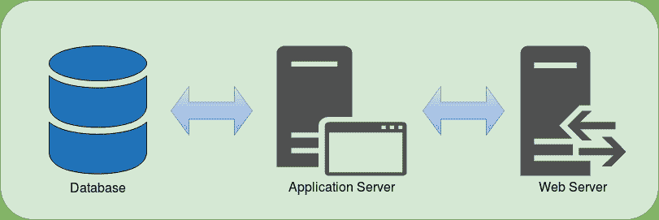
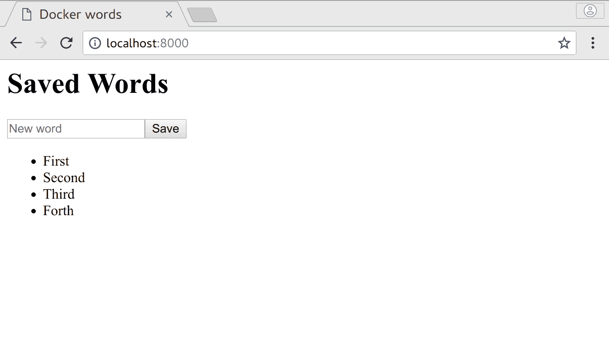
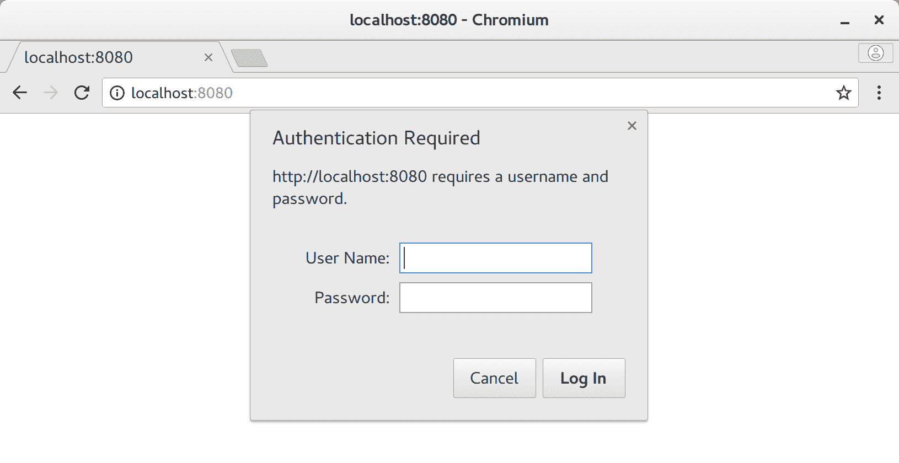
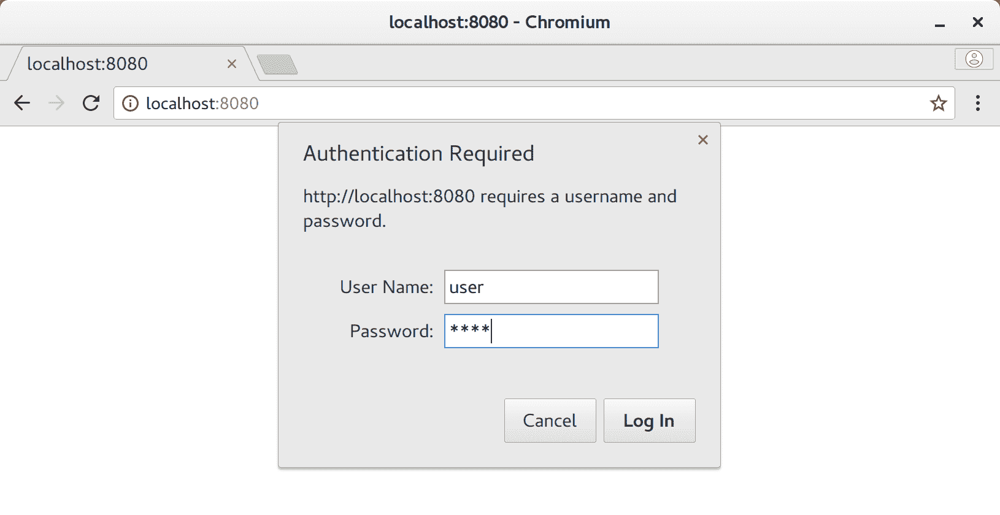
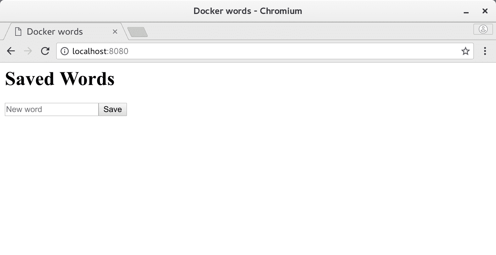
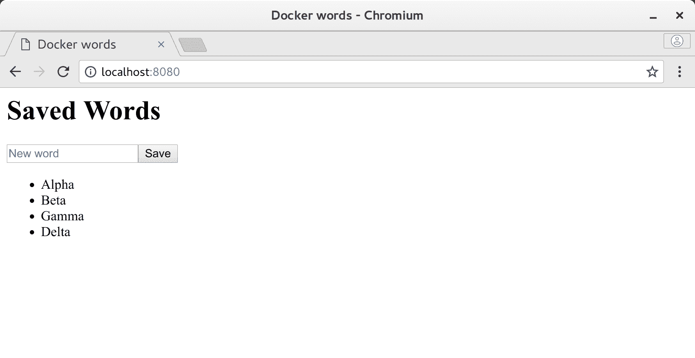

# 三、服务解构

本章将介绍如何从上一章中获取知识，并使用它来创建和构建一个数据库和一个应用服务器容器，因为现实世界的服务通常是以这种方式组成的。一旦我们把它们都建立起来，我们就会看到需要什么，以便把它们组合成一个更有用的服务，甚至覆盖更多的 Docker。

在本章中，我们将涵盖以下主题:

*   快速回顾 Docker 命令
*   用
    写一个真正的服务
    *   网络服务器服务
    *   应用服务
    *   数据库
*   引入卷
*   凭据传递的安全注意事项

# 快速回顾

在开始之前，让我们回顾一下前面在两个列表的单个部分中介绍的 Docker 和 Dockerfile 命令，您可以在以后用作参考。

# Docker 命令

以下是我们为 Docker 介绍的所有命令，还添加了一些其他命令，如果您经常构建容器，您可能会用到这些命令:

For more in-depth information about parameters required for each, or to see commands that we have not covered yet, type `docker help` in the Terminal or the command by itself into the Terminal. You can also visit [https://docs.docker.com/](https://docs.docker.com/) and explore the documentation if the information provided by the CLI output is not good enough, and it may contain more recent data.

```
docker attach - Attach the shell's input/output/error stream to the container
docker build - Build a Docker image based on a provided Dockerfile
docker cp - Copy files between container and host
docker exec - Execute a command in a running container
docker images - List image available to your installation of docker
docker info - Display information about the system
docker inspect - Display information about Docker layers, containers, images, etc
docker kill - Forcefully terminate a container 
docker logs - Display logs from a container since it last started
docker pause - Pause all processes within a container
docker ps - List information about containers and their resource usage
docker pull - Pull an image from a remote repository into the local registry
docker push - Push an image from the local registry into a remote repository
docker rm - Remove a container
docker rmi - Remove an image from the local repository
docker run - Start a new container and run it
docker search - Search DockerHub for images
docker start - Start a stopped container
docker stop - Stop a running container nicely (wait for container to shut down)
docker tag - Create a tag for an image
docker top - Show running processes of a container
docker unpause - Resume all processes in a paused container
docker version - Show the Docker version
```

Recently, Docker commands have begun to be isolated into their own docker CLI sections like `docker container`, to separate them from other cluster management commands. To use this newer syntax, just prepend any command with the container (that is, `docker stop` turns into `docker container stop`). You can feel free to use either version, though keep an eye out as you can probably expect the older style to be deprecated at some point even though the new style is overly verbose for most Docker usage.

# Dockerfile 命令

下面的列表是一个类似的列表，但是这次，我们涵盖了您可以在 Dockerfile 中使用的命令，并且我们按照类似于您在 Dockerfile 中工作时使用的顺序对其进行了排列:

`FROM <image_name>[:<tag>]`:将当前映像基于`<image_name>`
`LABEL <key>=<value> [<key>=value>...]`:将元数据添加到映像
`EXPOSE <port>`:指示应该将哪个端口映射到容器
`WORKDIR <path>`:为以下命令设置当前目录
`RUN <command> [ && <command>... ]`:执行一个或多个 shell 命令
`ENV <name>=<value>`:将环境变量设置为特定值
`VOLUME <path>`:指示<路径>应该是外部挂载的卷
`COPY <src> <dest>`:复制本地文件， 一组文件，或一个文件夹放入容器
`ADD <src> <dest>`:与`COPY`相同，但可以处理 URIs 和本地档案
`USER <user | uid>`:将运行时上下文设置为`<user>`或`<uid>`，用于此命令之后的命令
`CMD ["<path>", "<arg1>", ...]`:定义容器启动时要运行的命令

Since almost all containers you would want to build can be constructed with this set, this list is not the whole superset of Docker commands, and a few of them have been intentionally left out. If you get curious about things such as `ENTRYPOINT`, `ARG`, `HEALTHCHECK`, or others, you can check out the complete documentation at [https://docs.docker.com/engine/reference/builder/](https://docs.docker.com/engine/reference/builder/).

# 编写真正的服务

到目前为止，我们已经花时间制作了帮助我们建立 Docker 技能的假或模拟容器服务，但是我们还没有机会开发类似于真实世界服务的东西。一般来说，大多数在那里使用的更简单的服务看起来类似于这个高级图中所示的内容:



# 概述

这里我们将详细讨论每项服务。

**网络服务器**:

我们刚刚看到的图片中最右边的部分是一个网络服务器。Web 服务器充当高速 HTTP 请求处理程序，通常在此上下文中使用，如下所示:

*   集群内资源的反向代理端点、**虚拟私有云**(**【VPC】**)和/或**虚拟专用网** ( **VPN** )
*   强化网关守护设备，以限制资源访问和/或防止滥用
*   分析收集点
*   负载平衡器
*   静态内容交付服务器
*   降低应用服务器逻辑利用率
*   SSL 终端端点
*   远程数据缓存
*   数据二极管(允许数据输入或输出，但不能两者都有)
*   本地或联合帐户 AAA 处理程序

如果对安全性的需求极低，服务是内部的，并且处理能力很强，那么我们想象中的服务的这一部分并不总是严格要求的，但是在几乎所有不存在这些条件的其他情况下，添加 web 服务器实际上是强制性的。网络服务器的一个很好的类比是你的家庭路由器。虽然您并不一定非要使用互联网，但专用路由器可以更好地共享您的网络，并充当您和互联网之间的专用安全设备。虽然我们在上一章花了很多时间使用 NGINX，但是也可以使用许多其他的(Apache、微软 IIS、lighttpd 等等)，并且通常在功能上是可以互换的，但是要注意明显不同的配置设置。

**应用服务器**:

那么，如果 web 服务器为我们做了所有这些，那么应用服务器做了什么呢？应用服务器实际上是您的主要服务逻辑，通常包含在一些网络可访问的端点或消耗队列的守护进程中。这件作品可以如下使用:

*   主网站框架
*   数据操作应用编程接口逻辑
*   某种数据转换层
*   数据聚合框架

应用服务器和网络服务器的主要区别在于，网络服务器通常对静态数据进行操作，并在流程中做出严格的决策，而应用服务器几乎以非线性方式进行所有动态数据处理。属于这一类别的东西通常是框架，如 Node.js、Ruby on Rails、JBoss、Tornado 和其他用于运行可以处理请求的特定编程语言应用的框架。尽量不要认为这里需要一个大框架，因为即使是正确的 Bash 脚本或 C 文件也可以完成这项工作，并且仍然可以作为应用服务器。

我们尽可能将大部分工作交给网络服务器而不是应用服务器的原因是，由于框架开销，应用服务器通常非常慢，因此不适合做简单、小型和重复的任务，而网络服务器可以不费吹灰之力完成这些任务。作为参考，一个普通的专用 web 服务器在提供静态页面方面比一个成熟的应用服务器要高效一个数量级，并且，根据推论，比大多数应用服务器要快得多。如前所述，您可能可以独立处理应用服务器上的低负载，或者使用一些中等调优的负载，但任何高于这一水平的负载都值得使用专用的反向代理。

**数据库**:一旦我们把这个逻辑和静态文件处理下来，可悲的是，如果没有实际的数据来转换和传递，它们大多是无用的。与任何使用数据的软件一样，这是通过备份数据库来完成的。因为我们希望能够扩展系统的任何部分并隔离离散的组件，所以数据库有自己的部分。然而，在容器出现之前的世界里，我们依赖于大型的、单一的数据库，这些数据库为我们提供了**原子性**、**一致性**、**隔离**、**和持久性** ( **ACID** )属性，并且它们做得很好。然而，在容器世界中，我们绝对不需要这种类型的架构，因为它既没有可分割的数据库那么有弹性，也没有可水平扩展的数据库那么能集群化。

但是，使用这些新型数据库，您通常无法获得与旧式数据库相同的数据处理方式，这是一个重要的区别。大多数容器友好型数据库而不是 ACID 的结果是**基本可用**、**软状态**、**最终一致性** ( **BASE)** 、**T9】，这基本上意味着数据最终将是正确的，但是在最初发送的更新和最终状态之间，数据可能处于中间值的各种状态。**

# 我们要建造什么

我们想做一个能够作为一个好例子但又不太复杂的服务，来展示一个真实的服务例子可能是什么样子。对于这个用例，我们将创建一个容器分组，它可以在基本的 HTTP 身份验证后面做两件事:

*   将登录页上的表单中输入的字符串保存到数据库中。
*   当我们登陆主页时，显示到目前为止保存的所有字符串列表。

在这里，我们将尝试覆盖尽可能多的东西，同时也构建一个容器支持的 web 服务的一般现实原型。请记住，有了可用的工具，即使让服务变得如此简单也不是很容易，因此我们将尝试尽可能降低复杂性，尽管我们的内容的难度从这里开始增加。

# 实施

由于我们已经讨论了一般服务架构中需要的三个主要部分，我们将把我们的项目分成相同的独立部分，包括 web 服务器、应用服务器和数据库容器，我们将在这里概述构建它们所需的步骤。如前所述，如果您不想重新键入这些示例中的代码，您可以使用 Git 在[https://github.com/sgnn7/deploying_with_docker](https://github.com/sgnn7/deploying_with_docker)从 GitHub 轻松签出所有代码。

# 网络服务器

我们可以在这里选择任何 web 服务器软件，但是因为我们已经在早期使用过 NGINX，所以我们尝试重用这个组件的一些部分是有意义的——这实际上就是容器架构的全部！web 服务器组件将提供一些基本的身份验证、缓存数据，并充当其背后的应用服务器的反向代理。我们之前工作的基本设置可以在这里使用，但是我们将对它进行一些修改，这样它就可以充当代理，然后使用基于我们将在`Dockerfile`中创建的凭证文件的身份验证，而不是直接提供文件。让我们创建一个名为`web_server`的新文件夹，并将这些文件添加到其中:

`nginx_main_site.conf`:

```
server {
  listen  80;
  server_name    _;

  root /srv/www/html;

  location ~/\. {
    deny all;
  }

  location / {
    auth_basic           "Authentication required";
    auth_basic_user_file /srv/www/html/.htpasswd;

    proxy_pass           http://172.17.0.1:8000;
  }
}
```

关于这种配置，这里有三个有趣的部分。第一个是包含`auth_basic_`命令，该命令在该配置提供的所有端点上启用 HTTP 基本身份验证。第二，如果你对新的带`.`前缀的凭证文件足够注意的话，那就是自从我们添加了`.htpasswd`之后，我们现在需要拒绝获取所有以`.`开头的文件。第三个也是最后一个有趣的地方是`proxy_pass`的使用，它允许服务器将所有经过身份验证的流量路由到后端应用服务器。为什么我们使用`http://172.17.0.1:8000`作为目的地开始打开众所周知的 Docker 网络的潘多拉盒子，所以我们将解释为什么我们稍后使用它，因为如果我们现在覆盖它，我们将破坏我们的服务构建。

Warning! In most cases, using basic authentication is a practical joke of security without HTTPS as we use it here since anyone on the network can sniff out your credentials in plaintext with the simplest of tools. In your services, at the very least, mandate the HTTPS protocol is you use basic auth or rely on stronger forms of credentials-passing before deploying services to anything with direct Internet access.

我们现在可以在同一个目录中添加新的`Dockerfile`，如下所示:

```
FROM nginx:latest
# Make sure we are fully up to date
RUN apt-get update -q && \
 apt-get dist-upgrade -y && \
 apt-get install openssl && \
 apt-get clean && \
 apt-get autoclean

# Setup any variables we need
ENV SRV_PATH /srv/www/html

# Get a variable defined for our password
ARG PASSWORD=test

# Remove default configuration
RUN rm /etc/nginx/conf.d/default.conf

# Change ownership of copied files
RUN mkdir -p $SRV_PATH && \
 chown nginx:nginx $SRV_PATH

# Setup authentication file
RUN printf "user:$(openssl passwd -1 $PASSWORD)\n" >> $SRV_PATH/.htpasswd

# Add our own configuration in
COPY nginx_main_site.conf /etc/nginx/conf.d/
```

正如你所看到的，我们已经在前一章的原始工作中做了一些改变。首先应该突出的是书写`RUN apt-get`行的新方法，我们已经在这里简单注释了:

```
RUN apt-get update -q && \         # Update our repository information
 apt-get dist-upgrade -y && \   # Upgrade any packages we already have
 apt-get install openssl && \   # Install dependency (openssl)
 apt-get clean && \             # Remove cached package files
 apt-get autoclean              # Remove any packages that are no longer needed on the system
```

与以前的映像不同，在这里，我们安装`openssl`包，因为我们将需要它来创建 NGINX 加密的密码进行身份验证，但是`clean`和`autoclean`行在这里，以确保我们删除系统上的任何缓存`apt`包并删除孤立的包，给我们一个更小的映像，这是我们应该始终努力的事情。就像以前一样，我们很早就以类似的方式组合了所有的行，因此前一层和当前层之间的文件系统差异将只是所需的更改，而不是其他，这使得它成为一个非常紧凑的更改。在编写自己的映像时，如果你发现自己需要更多的脂肪修剪，可以删除更多的东西(例如删除文档文件、`/var`目录、不必要的可选包等)，但这两个应该是在大多数情况下使用的，因为它们操作简单，并且在基于 Debian 的系统上运行良好。

# 证明

如果没有适当的身份验证，我们的服务器对任何访问它的人都是开放的，因此我们添加了一个用户名/密码组合来充当我们服务的看门人:

```
ARG PASSWORD=test
...
RUN printf "user:$(openssl passwd -1 $PASSWORD)\n" >> $SRV_PATH/.htpasswd
```

`ARG`充当`ENV`指令的构建时替代品，并允许将密码作为构建参数传递给`--build-arg <arg>`。如果构建没有提供一个，它应该默认为等号后面的参数，在这种情况下这是一个非常不安全的`test`。我们将在`Dockerfile`中使用这个稍微低一点的变量来为我们的用户创建带有特定密码的`.htpasswd`文件。

第二行使用我们之前安装的`openssl`来获取这个构建参数，并以 NGINX 和大多数其他网络服务器都能理解的格式创建带有加密凭证的`.htpasswd`文件(`<username>:<hashed_password>`)。

Warning! Keep in mind that the  `-1` algorithm is less secure than the **Salted SHA** (SSHA) method of creating `.htpasswd` passwords, but to create them in this way would have involved more complicated commands that would have distracted from our main purpose here, but you can visit [https://nginx.org/en/docs/http/ngx_http_auth_basic_module.html#auth_basic_user_file](https://nginx.org/en/docs/http/ngx_http_auth_basic_module.html#auth_basic_user_file) for more details. Also be aware that you should never use online password generators as they can (and often do) steal your entered information.

如果您以前没有使用过 Bash 子 shell，则`$(openssl ...)`在一个单独的 shell 中运行，并且在计算其余部分之前，输出被替换为字符串变量，因此`>>`追加操作将只看到`username:`之后的加密密码，而与`openssl`无关。从这些事情中应该可以看出，如果我们不提供任何构建参数，容器将只有一个用户名`user`，密码设置为`test`。

Warning! This type of credential passing to the image is used here as an example and is very nonsecure since anyone can run `docker history` and see what this variable was set to or start the image and echo the `PASSWORD` variable. In general, preferred ways of passing this type of sensitive data are through environment variables when you launch the container, mounting the credentials file as a volume onto the container, using `docker secret`, or an external credentials sharing service. We may cover some of these in later chapters, but for now, you should just keep in mind not to use this particular way of passing credentials in production due to security concerns.

随着`web_server`部分完成，我们可以进入下一部分:数据库。

# 数据库

虽然 SQL 数据库在分割和集群能力方面取得了长足的进步，并且通常提供了良好的性能，但是许多集群友好的解决方案都是基于 NoSQL 的，并且在大多数情况下使用键/值存储；此外，与生态系统中根深蒂固的 SQL 玩家相比，他们的地位逐年上升。为了以最快的速度和最少的工作量获得成功，我们将在这里选择 MongoDB，这对于开始工作来说是轻而易举的事情，并且因为它是 NoSQL，我们也不需要设置任何类型的模式，大大减少了我们对复杂配置的需求！

Warning! The default setup for MongoDB is very easy to do, but it does not enable any security by default, so anyone with network access to that container can read and write data to any database. In a private cloud, this might be somewhat acceptable, but in any other situation, it is not something that should be done, so keep in mind that if you plan on deploying MongoDB and make sure it is set up at least with some sort of isolation and/or authentication.

我们这里的整个数据库设置将非常简单，如果我们不需要通过包更新来强化它，我们甚至不会有一个定制的:

```
FROM mongo:3

# Make sure we are fully up to date
RUN apt-get update -q && \
 apt-get dist-upgrade -y && \
 apt-get clean && \
 apt-get autoclean
```

当我们运行它时，我们唯一应该考虑的是确保来自容器(`/var/lib/mongodb`)的数据库存储卷从主机装载到容器中，以便在容器停止时我们保留它，但是一旦我们开始启动容器组，我们就可以担心这一点。

# 应用服务器

对于这个组件，我们将选择一个框架，它包含启动和运行服务所需的最少量的样板文件，大多数人今天会说它是带有 Express 的 Node.js。由于 Node.js 是基于 JavaScript 的，而 JavaScript 最初是基于类似 Java 的语法，大多数从事 HTML 工作的人应该能够弄清楚应用代码在做什么，但是在我们到达那里之前，我们需要定义我们的 Node 包和我们的依赖项，所以在与`web_server`相同的级别上创建一个新的`application_server`目录，并将以下内容添加到名为`package.json`的文件中:

```
{
  "name": "application-server",
  "version": "0.0.1",
  "scripts": {
    "start": "node index.js"
  },
  "dependencies": {
    "express": "^4.15.4"
  }
}
```

这里没有什么真正神奇的东西；我们只是使用一个 Node 包定义文件来声明我们需要 Express 作为依赖项，并且我们的`npm start`命令应该运行`node index.js`。

让我们现在也制作我们的 Dockerfile:

```
FROM node:8

# Make sure we are fully up to date
RUN apt-get update -q && \
 apt-get dist-upgrade -y && \
 apt-get clean && \
 apt-get autoclean

# Container port that should get exposed
EXPOSE 8000

# Setup any variables we need
ENV SRV_PATH /usr/local/share/word_test

# Make our directory
RUN mkdir -p $SRV_PATH && \
 chown node:node $SRV_PATH

WORKDIR $SRV_PATH

USER node

COPY . $SRV_PATH/

RUN npm install

CMD ["npm", "start"]
```

其中许多东西在这里应该非常熟悉，尤其是熟悉 Node 的人。我们从`node:8`映像开始，添加我们的应用代码，安装我们在`package.json`(带有`npm install`)中定义的依赖项，然后最终确保应用在从`docker` CLI 运行时启动。

这里的顺序对于避免缓存损坏和确保适当的权限非常重要。我们将我们预计不会有太大变化的事物(`USER`、`WORKDIR`、`EXPOSE`、`mkdir`和`chown`)放在`COPY`之上，因为它们相对于应用代码来说变化的可能性要小得多，并且因为它们大多是可互换的，所以我们按照我们认为未来最不可能变化的升序排列它们，以防止重建图层和浪费计算能力。

Here is also a Node.js-specific image optimization trick: since `npm install` is usually the most time and CPU intensive part of dealing with code changes to a Node application, you can even further optimize this Dockerfile by copying only `package.json`, running `npm install`, and then copying the rest of the files to the container. Creating the container in this manner will only do the pricey `npm install` if `package.json` changes and will generally improve build times by a large margin, but this was excluded from this example in order to not derail our main conversation with framework-specific optimizations.

到目前为止，我们还没有真正定义任何应用代码，所以让我们看看它是什么样子。首先，我们需要一个 HTML 视图作为我们的登录页面，我们可以使用`pug`(以前也称为`jade`)模板快速地将一个视图组合在一起。创建一个`views/`文件夹，并将其放入位于该文件夹中名为`index.pug`的文件中:

```
html
  head
    title Docker words
  body
    h1 Saved Words

    form(method='POST' action='/new')
        input.form-control(type='text', placeholder='New word' name='word')
        button(type='submit') Save

    ul
        for word in words
            li= word
```

除了它是一个简单的 HTML 页面，我们会在这个页面上显示渲染过程中传递到它的`words`数组中的所有项目，如果放入一个新的单词，就会有一个表单作为`POST`请求提交给`/new`端点。

# 主要应用逻辑

没有简单的方法，但是我们的主要应用逻辑文件`index.js`不会像其他配置文件那样简单:

```
'use strict'

// Load our dependencies
const bodyParser = require('body-parser')
const express = require('express');
const mongo = require('mongodb')

// Setup database and server constants
const DB_NAME = 'word_database';
const DB_HOST = process.env.DB_HOST || 'localhost:27017';
const COLLECTION_NAME = 'words';
const SERVER_PORT = 8000;

// Create our app, database clients, and the word list array
const app = express();
const client = mongo.MongoClient();
const dbUri = `mongodb://${DB_HOST}/${DB_NAME}`;
const words = [];

// Setup our templating engine and form data parser
app.set('view engine', 'pug')
app.use(bodyParser.urlencoded({ extended: false }))

// Load all words that are in the database
function loadWordsFromDatabase() {
    return client.connect(dbUri).then((db) => {
        return db.collection(COLLECTION_NAME).find({}).toArray();
    })
    .then((docs) => {
        words.push.apply(words, docs.map(doc => doc.word));
        return words;
    });
}

// Our main landing page handler
app.get('/', (req, res) => {
    res.render('index', { words: words });
});

// Handler for POSTing a new word
app.post('/new', (req, res) => {
    const word = req.body.word;

    console.info(`Got word: ${word}`);
    if (word) {
        client.connect(dbUri).then((db) => {
            db.collection(COLLECTION_NAME).insertOne({ word }, () => {
                db.close();
                words.push(word);
            });
        });
    }

    res.redirect('/');
});

// Start everything by loading words and then starting the server 
loadWordsFromDatabase().then((words) => {
    console.info(`Data loaded from database (${words.length} words)`);
    app.listen(SERVER_PORT, () => {
        console.info("Server started on port %d...", SERVER_PORT);
    });
});
```

这个文件一开始可能看起来让人望而生畏，但这可能是您可以从头开始制作的最小的 API 服务，它也是功能齐全的。

If you would like to learn more about either Node, Express, or the MongoDB driver, you can visit [https://nodejs.org/en/](https://nodejs.org/en/), [https://expressjs.com/](https://expressjs.com/), and [https://github.com/mongodb/node-mongodb-native](https://github.com/mongodb/node-mongodb-native). If you don't feel like typing, you can also copy and paste this file from [https://github.com/sgnn7/deploying_with_docker/](https://github.com/sgnn7/deploying_with_docker/).

该应用的基本操作如下:

*   从`MongoDB`数据库加载任何现有单词
*   在一个变量中保存一份该列表的副本，这样我们只需要从数据库中获取东西一次
*   打开一个端口`8000`并监听请求
*   如果我们在`/`上收到一个`GET`请求，返回渲染的`index.html`模板并用单词列表数组填充它
*   如果我们收到一个`POST`到`/new`:
    *   将该值保存在数据库中
    *   更新我们的单词列表
    *   送我们回`/`

然而，这里有一部分需要特别注意:

```
const DB_HOST = process.env.DB_HOST || 'localhost:27017';
```

还记得我们之前提到的大部分映像配置应该通过环境变量来完成吗？这正是我们在这里所做的！如果设置了一个环境变量`DB_HOST`(正如我们在作为容器运行时期望的那样)，我们将使用它作为主机名，但是如果没有提供(正如我们在本地运行时期望的那样)，它将假设数据库在标准 MongoDB 端口上本地运行。这提供了可配置为容器的灵活性，并且能够由 Docker 之外的开发人员在本地进行测试。

有了主逻辑文件，我们的服务现在应该以类似的文件系统布局来安排，如下所示:

```
$ tree ./
./
├── Dockerfile
├── index.js
├── package.json
└── views
    └── index.pug

1 directory, 4 files
```

由于这确实是三个部分中唯一容易测试的部分，让我们在本地安装 MongoDB，看看该服务能做什么。您可以访问[https://docs.mongodb.com/manual/installation/](https://docs.mongodb.com/manual/installation/)了解如何在其他平台上安装它，但是我已经包括了在 Ubuntu 16.04 上手动安装的以下步骤:

```
$ # Install MongoDB
$ sudo apt-key adv --keyserver hkp://keyserver.ubuntu.com:80 --recv 0C49F3730359A14518585931BC711F9BA15703C6
$ echo "deb [ arch=amd64,arm64 ] http://repo.mongodb.org/apt/ubuntu xenial/mongodb-org/3.4 multiverse" | sudo tee /etc/apt/sources.list.d/mongodb-org-3.4.list

$ sudo apt-get update 
$ sudo apt-get install -y mongodb-org
$ sudo systemctl start mongodb

$ # Install our service dependencies
$ npm install
application-server@0.0.1 /home/sg/checkout/deploying_with_docker/chapter_3/prototype_service/application_server
<snip>
npm WARN application-server@0.0.1 No license field.

$ # Run the service</strong>
**$ npm start**
**> application-server@0.0.1 start /home/sg/checkout/deploying_with_docker/chapter_3/prototype_service/application_server**
**> node index.js**

**Data loaded from database (10 words)**
**Server started on port 8000...**
```

好像起作用了:我们去`http://localhost:8000`查看浏览器吧！


让我们说几句话，看看会发生什么:



到目前为止，一切顺利！最后的测试是重新启动服务，并确保我们看到相同的列表。按下 *Ctrl* + *C* 退出我们的节点进程并运行`npm start`。你应该会再次看到相同的列表，这意味着它正在按预期工作！

# 一起经营

所以，我们有我们的`web_server`、`application_server`和`database`容器都想通了。在继续下一步之前，让我们验证您是否拥有与这些文件匹配的所有文件:

```
$ tree .
.
├── application_server
│   ├── Dockerfile
│   ├── index.js
│   ├── package.json
│   └── views
│       └── index.pug
├── database
│   └── Dockerfile
└── web_server
 ├── Dockerfile
 └── nginx_main_site.conf

4 directories, 7 files
```

我们的下一步是构建所有容器:

```
 $ # Build the app server image
 $ cd application_server
 $ docker build -t application_server .
 Sending build context to Docker daemon 34.3kB
 Step 1/10 : FROM node:8
 <snip>
 Successfully built f04778cb3778
 Successfully tagged application_server:latest

 $ # Build the database image
 $ cd ../database
 $ docker build -t database .
 Sending build context to Docker daemon 2.048kB
 Step 1/2 : FROM mongo:3
 <snip>
 Successfully built 7c0f9399a152
 Successfully tagged database:latest

 $ # Build the web server image
 $ cd ../web_server
 $ docker build -t web_server .
 Sending build context to Docker daemon 3.584kB
 Step 1/8 : FROM nginx:latest
 <snip>
 Successfully built 738c17ddeca8
 Successfully tagged web_server:latest
```

This sequential building is great for showing what needs to be done in each step, but always think about automation and how manual processes can be improved. In this particular case, this whole block of statements and execution could have also been done from the parent directory with this single line: `for dir in *; do cd $dir; docker build -t $dir .; cd ..; done`

# 发射

有了这三个相关的容器，我们现在可以启动它们了。需要注意的是，它们是按顺序启动的，因为我们的应用一启动就试图从数据库中读取数据，如果应用不在那里，我们不希望 web 服务器启动，所以我们将按以下顺序启动它们:`database -> application_server -> web_server`:

```
$ docker run --rm \
             -d \
             -p 27000:27017 \
             database
3baec5d1ceb6ec277a87c46bcf32f3600084ca47e0edf26209ca94c974694009

$ docker run --rm \
             -d \
             -e DB_HOST=172.17.0.1:27000 \
             -p 8000:8000 \
             application_server
dad98a02ab6fff63a2f4096f4e285f350f084b844ddb5d10ea3c8f5b7d1cb24b

$ docker run --rm \
             -d \
             -p 8080:80 \
             web_server
3ba3d1c2a25f26273592a9446fc6ee2a876904d0773aea295a06ed3d664eca5d

$ # Verify that all containers are running
$ docker ps --format "table {{.Image}}\t{{.Status}}\t{{.ID}}\t{{.Ports}}"
IMAGE                STATUS              CONTAINER ID        PORTS
web_server           Up 11 seconds       3ba3d1c2a25f        0.0.0.0:8080->80/tcp
application_server   Up 26 seconds       dad98a02ab6f        0.0.0.0:8000->8000/tcp
database             Up 45 seconds       3baec5d1ceb6        0.0.0.0:27000->27017/tcp
```

这里需要注意几点:

*   我们有意将本地端口`27000`映射到数据库`27017`，这样就不会与主机上已经运行的 MongoDB 数据库发生冲突。
*   我们将神奇的`172.17.0.1` IP 作为主机，将`27000`端口传递给我们的应用服务器作为数据库主机。
*   我们在端口`8080`而不是`80`启动了网络服务器，以确保我们不需要根权限*。

If you do not see three containers running, check the logs with `docker logs <container id>`. The most likely culprit will probably be the mismatch between the IP/port on a container and the destination, so just fix and restart the container that is failing until you have all three running. If you have a lot of problems, do not hesitate to start the containers in the non-daemon mode by removing the `-d` flag from the commands we used. * - On *nix systems, ports below `1024` are called registered or privileged ports that govern many important aspects of communications for a system. To prevent malicious use of these system ports, root-level access is required on almost all such platforms. Since we don't really care which port we will be using for this testing, we will avoid this issue altogether by selecting port 8080.

该设置中的信息流大致如下:

```
Browser <=> localhost:8080 <=> web_server:80 <=> 172.17.0.1:8000 (Docker "localhost") <=> app_server <=> 172.17.0.1:27000 (Docker "localhost") <=> database:27017
```

# 测试

我们已经运行了所有的部分，所以让我们在`http://localhost:8080`试一试！



不错；我们的认证成功了！让我们输入我们的超级机密凭证(用户:`user`，密码:`test`)。



一旦我们登录，我们应该能够看到我们的应用服务器接管请求的处理，并给我们表单来输入我们想要保存的单词:



正如我们所希望的那样，一旦我们进行了身份验证，应用服务器就会处理请求！输入几个字，看看会发生什么:



恭喜你！你已经完成了你的第一次容器服务！

# 我们实施的限制和问题

我们应该花一分钟来考虑一下，如果你要在一个真实的系统中使用它，我们服务的哪些部分可能需要改进，以及什么是最理想/最实用的缓解措施。由于使用容器和云的关键部分是评估更大架构的优缺点，所以在开发新系统或更改现有系统时，您应该始终尝试这样做。

粗略地看一下，这些是可以改进的显而易见的事情，影响是什么，可能的缓解措施是什么:

*   数据库没有身份验证
    *   **级**:安全，冲击力很高
    *   **缓解**:私有云或使用认证
*   数据库数据存储在 Docker 容器中(如果容器丢失，数据也会丢失)
    *   **级**:稳定性，临界冲击
    *   **缓解**:装载的卷和/或分片和集群

*   硬核端点
    *   **级** : Ops，非常高的冲击力
    *   **缓解**:服务发现(我们将在后面的章节中介绍)
*   应用服务器假设它是唯一一个改变单词列表的服务器
    *   **级**:缩放，非常高的冲击力
    *   **缓解**:刷新每次页面加载的数据
*   应用服务器需要容器启动时的数据库
    *   **级**:缩放/操作，中等冲击力
    *   **缓解**:延迟加载，直到页面被点击和/或显示数据库不可用的消息
*   Web 服务器身份验证被烘焙到映像中
    *   **级**:安全，临界影响
    *   **缓解**:运行时添加凭证
*   网络服务器认证是通过 HTTP
    *   **级**:安全，冲击力很高
    *   **缓解**:使用 HTTPS 和/或 OAuth

# 解决关键问题

由于我们还处于 Docker 旅程的早期阶段，我们现在将只讨论一些最关键问题的变通方法，如下所示:

*   数据库数据存储在 Docker 容器中(如果容器丢失，数据也会丢失)。
*   Web 服务器身份验证被烘焙到映像中。

# 使用本地卷

第一个问题是一个非常严重的问题，因为我们所有的数据目前都绑定在我们的容器上，所以如果数据库应用停止，您必须重新启动同一个容器才能取回数据。在这种情况下，如果容器运行时带有`--rm`标志，并且停止或终止，所有与之相关的数据都会消失，这肯定不是我们想要的。虽然针对这个问题的大规模解决方案是针对我们的级别使用分片、集群和/或持久卷来完成的，但是我们只需将数据卷装载到我们希望将数据直接保存到容器中的位置就可以了。如果容器发生任何情况，这应该会将数据保留在主机文件系统上，如果需要，可以进一步备份或移动到其他地方。

如果我们的卷是存储在 Docker 内部的命名卷，当我们启动它时，将目录装入(有时称为映射)到容器中的过程实际上相对容易做到:

```
$ docker run --rm -d -v local_storage:/data/db -p 27000:27017 database
```

这将在 Docker 的本地存储中创建一个名为`local_storage`的命名卷，该卷将无缝地安装在容器中的`/data/db`上(MongoDB 映像在 Docker Hub 的映像中存储其数据的地方)。如果容器死亡或发生任何意外，您可以将此卷装入不同的容器并保留数据。

`-v` , `--volume` , and using a named volume are not the only ways to create volumes for Docker containers. We will cover the reasons why we use this syntax as opposed to other options (that is, `--mount`) in more detail in [Chapter 5](5.html), *Keeping the Data Persistent,* which specifically deals with volumes.

让我们来看看实际情况(这可能需要在您的主机上安装一个 MongoDB 客户端 CLI):

```
$ # Start our container
$ docker run --rm \
             -d \
             -v local_storage:/data/db \
             -p 27000:27017 \
             database
16c72859da1b6f5fbe75aa735b539303c5c14442d8b64b733eca257dc31a2722

$ # Insert a test record in test_db/coll1 as { "item": "value" }
$ mongo localhost:27000
MongoDB shell version: 2.6.10
connecting to: localhost:27000/test

> use test_db
switched to db test_db
 > db.createCollection("coll1")
{ "ok" : 1 }
 > db.coll1.insert({"item": "value"})
WriteResult({ "nInserted" : 1 })
 > exit
bye

$ # Stop the container. The --rm flag will remove it.
$ docker stop 16c72859
16c72859

$ # See what volumes we have
$ docker volume ls
DRIVER              VOLUME NAME
local               local_storage

$ # Run a new container with the volume we saved data onto
$ docker run --rm \
             -d \
             -v local_storage:/data/db \
             -p 27000:27017 \
             database
a5ef005ab9426614d044cc224258fe3f8d63228dd71dee65c188f1a10594b356

$ # Check if we have our records saved
$ mongo localhost:27000
MongoDB shell version: 2.6.10
connecting to: localhost:27000/test

> use test_db
switched to db test_db
 > db.coll1.find()
{ "_id" : ObjectId("599cc7010a367b3ad1668078"), "item" : "value" }
 > exit

$ # Cleanup
$ docker stop a5ef005a
a5ef005a
```

如您所见，我们的记录通过原始容器的销毁得以保留，这正是我们想要的！我们将在后面的章节中介绍如何以其他方式处理卷，但这应该足以让我们在我们的小服务中处理这个关键问题。

# 运行时生成凭据

与数据库问题不同，这个特殊的问题并不容易处理，主要是因为从安全角度来看，凭据是一个很难处理的问题。如果包含一个构建参数或一个预定义的环境变量，任何能够访问该映像的人都可以读取它。此外，如果您在容器创建期间通过环境变量传递凭据，任何具有 docker CLI 访问权限的人都可以读取它，因此您最多只能将带有凭据的卷装载到容器中。

There are a few other ways of passing credentials securely, though they are a bit outside of the scope of this exercise such as env variables that contain hashed passwords, using a broker secrets-sharing service, using cloud-specific roles mechanisms (that is, AWS, IAM Role, `user-data`), and a few others, but the important part for this section is to understand which things you should try not to do when handling authentication data.

为了解决这个问题，我们将在主机上本地生成自己的凭据文件，并在启动时将其装载到容器中。用您想要的用户名替换`user123`，用字母数字密码替换`password123`:

```
$ printf "user123:$(openssl passwd -1 password123)\n" >> ~/test_htpasswd

$ # Start the web_server with our password as the credentials source
$ docker run --rm \
             -v $HOME/test_htpasswd:/srv/www/html/.htpasswd \
             -p 8080:80 web_server
1b96c35269dadb1ac98ea711eec4ea670ad7878a933745678f4385d57e96224a
```

有了这个小小的改变，你的 web 服务器现在将被新的用户名和新的密码保护起来，这个配置也不会被能够运行 docker 命令的人使用。您可以访问 [http://127.0.0.1:8080](http://127.0.0.1:8080) 查看新的用户名和密码是唯一有效的凭据。

# 介绍 Docker 网络

在前面，我们已经稍微浏览了一下我们在`web_server`代码中对 IP `172.17.0.1`的使用，这是一个在其他材料中没有很好覆盖的东西，但是如果你想对 Docker 有一个坚实的理解，这是一个*非常*重要的事情。当 Docker 服务在机器上启动时，许多联网`iptables`规则被添加到您的机器上，以便允许容器通过转发连接到世界，反之亦然。实际上，您的机器成为所有容器启动的互联网路由器。除此之外，每个新容器都被分配了一个虚拟地址(很可能在`172.17.0.2` +)并且它所做的任何通信通常对其他容器都是不可见的，除非创建了一个软件定义的网络，所以在同一台机器上连接多个容器实际上是一项非常棘手的任务，需要手动完成，而不需要名为**服务发现**的 Docker 基础设施中的助手软件。

由于我们现在不想要这个服务发现的开销(我们将在后面更深入地讨论)，并且我们不能使用`localhost` / `127.0.0.1` / `::1`，这根本不会起作用，我们需要给它 Docker 虚拟路由器 IP(几乎总是`172.17.0.1`)，以便它会找到我们的实际机器，其他容器端口已经绑定在那里。

Please note that large parts of this next section do not work on macOS nor Windows machines due to the way their networking stack is implemented for Docker. For those systems, I would suggest that you use an Ubuntu virtual machine to follow along.

如果您想验证这一点，我们可以在 Docker 的内部和外部使用一些命令，以便真正看到正在发生的事情:

```
$ # Host's iptables. If you have running containers, DOCKER chain wouldn't be empty.
$ sudo iptables -L
<snip>
Chain FORWARD (policy DROP)
target     prot opt source               destination 
DOCKER-ISOLATION  all  --  anywhere             anywhere 
ACCEPT     all  --  anywhere             anywhere             ctstate RELATED,ESTABLISHED
DOCKER     all  --  anywhere             anywhere
ACCEPT     all  --  anywhere             anywhere
ACCEPT     all  --  anywhere             anywhere
<snip>
Chain DOCKER (1 references)
target     prot opt source               destination 

Chain DOCKER-ISOLATION (1 references)
target     prot opt source               destination 
RETURN     all  --  anywhere             anywhere 
<snip>

$ # Host's network addresses is 172.17.0.1
$ ip addr
<snip>
5: docker0: <BROADCAST,MULTICAST,UP,LOWER_UP> mtu 1500 qdisc noqueue state UP group default 
 link/ether 02:42:3c:3a:77:c1 brd ff:ff:ff:ff:ff:ff
 inet 172.17.0.1/16 scope global docker0
 valid_lft forever preferred_lft forever
 inet6 fe80::42:3cff:fe3a:77c1/64 scope link 
 valid_lft forever preferred_lft forever
<snip>

$ # Get container's network addresses
$ docker run --rm \
             -it \
             web_server /bin/bash
 root@08b6521702ef:/# # Install pre-requisite (iproute2) package
root@08b6521702ef:/# apt-get update && apt-get install -y iproute2
<snip>
 root@08b6521702ef:/# # Check the container internal address (172.17.0.2)
root@08b6521702ef:/# ip addr
1: lo: <LOOPBACK,UP,LOWER_UP> mtu 65536 qdisc noqueue state UNKNOWN group default qlen 1000
 link/loopback 00:00:00:00:00:00 brd 00:00:00:00:00:00
 inet 127.0.0.1/8 scope host lo
 valid_lft forever preferred_lft forever
722: eth0@if723: <BROADCAST,MULTICAST,UP,LOWER_UP> mtu 1500 qdisc noqueue state UP group default 
 link/ether 02:42:ac:11:00:02 brd ff:ff:ff:ff:ff:ff link-netnsid 0
 inet 172.17.0.2/16 scope global eth0
 valid_lft forever preferred_lft forever
 root@08b6521702ef:/# # Verify that our main route is through our host at 172.17.0.1
root@08b6521702ef:/# ip route
default via 172.17.0.1 dev eth0
172.17.0.0/16 dev eth0 proto kernel scope link src 172.17.0.2
 root@08b6521702ef:/# exit
```

正如你所看到的，这个系统有点奇怪，但它运行得很好。一般来说，当构建更大的系统时，服务发现实际上是强制性的，因此您不必担心这一领域中如此低级的细节。

# 摘要

在这一章中，我们介绍了如何构建多个容器，以构成一个由 web 服务器、应用服务器和数据库组成的基本服务，同时启动多个容器，并通过网络将它们联系在一起。我们还研究了连接服务时最常见的问题以及这些基本构件的常见缺陷。还提供了一些关于未来主题的提示(卷、服务发现、凭据传递等)，但我们将在后面的章节中深入讨论这些内容。在下一章中，我们将把我们的小服务变成一个具有水平扩展组件的健壮服务。