# 四、缩放容器

在本章中，我们将获取我们的服务，并尝试使用同一个容器的多个实例来横向扩展它。我们将在本章中讨论以下主题:

*   编排选项及其优缺点
*   服务发现
*   国家和解
*   部署自己的 Docker Swarm 集群
*   将前一章中的文字服务部署到该集群中

# 服务发现

在进一步深入之前，我们确实需要深入了解概念性的 Docker 容器连接，这在某些方面与在非容器化世界中使用服务器构建高可用性服务非常相似，这并不奇怪。正因为如此，深入讨论这个主题不仅会扩展您对 Docker 网络的理解，而且还有助于构建弹性服务。

# Docker 网络概述

在前一章中，我们介绍了一点 Docker 网络布局，因此我们将在这里介绍要点:

*   默认情况下，Docker 容器运行在主机上的隔离虚拟网络上
*   每个容器在网络中都有自己的网络地址
*   默认情况下，容器的`localhost`是*而不是*主机的`localhost`
*   为了手动连接容器，人工工作的开销很大
*   容器之间的手动网络连接本质上是脆弱的

在设置本地服务器网络的并行世界中，Docker 连接的基本体验非常类似于用静态 IP 连接整个网络。虽然这种方法并不难操作，但维护起来极其困难和费力，这就是为什么我们需要比这更好的东西。

# 深度服务发现

由于我们不想处理这种脆弱的保留和维护硬编码 IP 地址的系统，我们需要找到一种方法，以便我们的连接是灵活的，并且在目标服务死亡或创建新服务时不需要客户端进行调整。如果同一个服务的每个连接在同一个服务的所有实例之间是相等平衡的，那也是很好的。理想情况下，我们的服务如下所示:

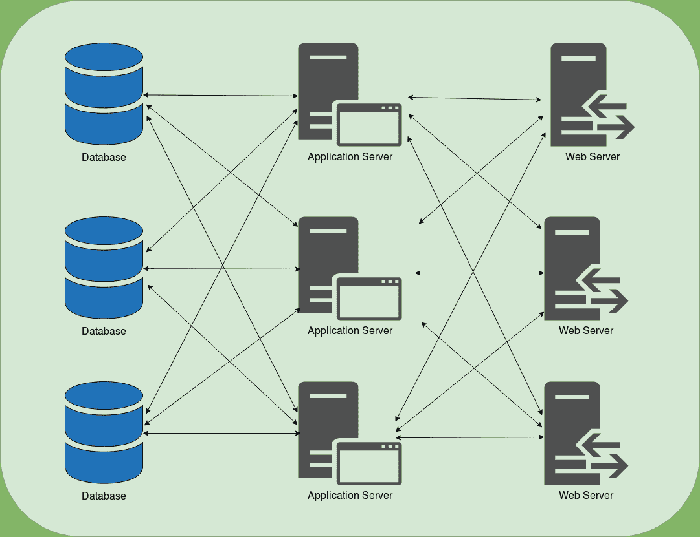

对于互联网的这种确切的使用情况，创建域名系统是为了使客户端能够找到服务器，即使 IP 地址或网络在世界任何地方发生变化。另一个好处是，我们有更容易记住的目标地址(域名，如[https://google.com](https://google.com)而不是`https://123.45.67.89`等)，并且能够将处理分配给我们想要的任意多的处理服务。

如果您没有深入研究过域名系统，主要原则可以归纳为以下几个基本步骤:

1.  用户(或应用)想要连接到服务器(即[google.com](http://www.google.com))。
2.  本地机器要么使用自己缓存的域名系统答案，要么进入域名系统并搜索该名称。
3.  本地机器返回它应该用作目标的 IP 地址(`123.45.67.89`)。
4.  本地机器连接到该 IP 地址。

The DNS system is much more complicated than the single sentences mentioned here. While DNS is a really good thing to know about in any server-oriented tech position, here, it was sufficient just to know that the input to the DNS system is a hostname and the output is the real target (IP). If you would like to know more about how the DNS system actually works, I recommend that you visit [https://en.wikipedia.org/wiki/Domain_Name_System](https://en.wikipedia.org/wiki/Domain_Name_System) at your leisure.

如果我们强制已经在几乎所有客户端中实现的 DNS 处理作为自动发现服务的方式，我们可以使自己成为我们一直在寻找的服务发现机制！如果我们让它足够聪明，它可以告诉我们运行的容器在哪里，在同一个容器的所有实例之间进行负载平衡，并为我们提供一个静态名称作为我们的目标。正如人们可能期望的那样，几乎所有的容器服务发现系统都具有这种确切的功能模式；如果它是作为客户端发现模式、服务器端发现模式或某种混合系统来完成的，那么它通常会有所不同。

# 客户端发现模式

这种类型的模式并不经常使用，但它几乎涉及到使用服务感知客户端来发现其他服务并在它们之间进行负载平衡。这样做的好处是，客户端可以就连接到哪里以及以何种方式进行智能决策，但缺点是，这种决策分散到每个服务上，很难维护，但它不依赖于单个真实来源(单个服务注册中心)，如果失败，它可能会关闭整个集群。

架构通常看起来类似于这样:

**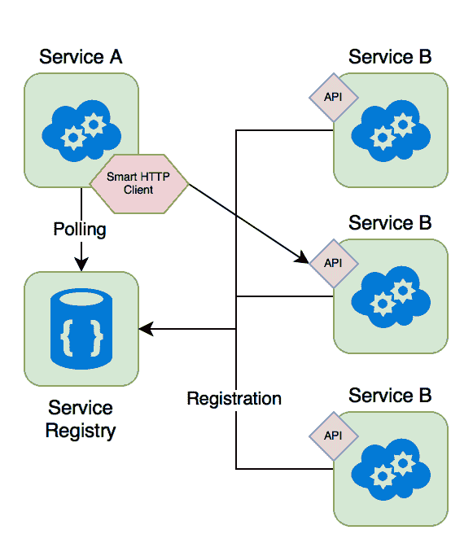** 

# 服务器端发现模式

更常见的服务发现模式是集中式服务器端发现模式，其中使用 DNS 系统将客户端定向到容器。在这种查找服务的特殊方式中，容器从保存系统状态的服务注册表中注册和注销自己。这种状态反过来又用于填充域名系统条目，然后客户端联系这些条目来查找它试图连接的目标。虽然这个系统通常非常稳定和灵活，但它有时会遇到一些非常棘手的问题，这些问题通常会阻碍其他地方的域名系统，例如域名系统缓存，它使用过时的 IP 地址，直到**生存时间** ( **TTL** )到期，或者当应用本身缓存域名系统条目而不考虑更新时(NGINX 和 Java 应用以此而臭名昭著)。

**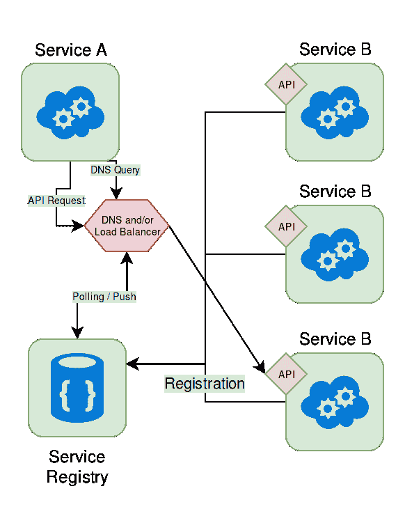** 

# 混合系统

这个分组包括了我们还没有涉及到的所有其他组合，但是它涵盖了使用工具 HAProxy 的最大部署类别，我们将在后面详细介绍。它基本上是将主机上的一个特定端口(即`<host>:10101`)连接到集群中其他地方的负载平衡目标。

从客户的角度来看，他们连接到一个单一和稳定的位置，然后 HAProxy 将其无缝地隧道传输到正确的目标。

**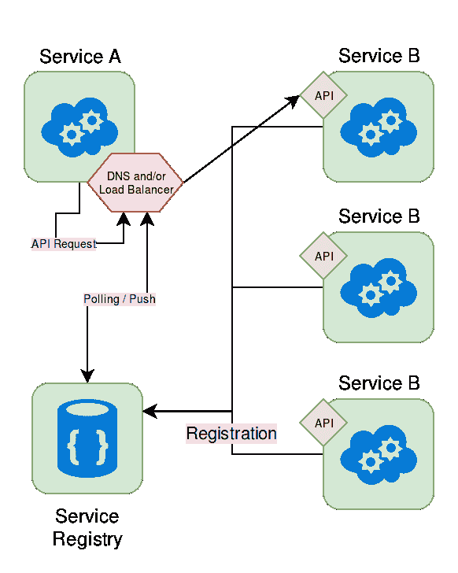** 

这个设置支持方法的拉和推刷新，并且非常有弹性，但是我们将在后面的章节中深入探讨这种类型的设置。

# 选择(不)可用选项

有了所有这些类型的服务发现，我们应该能够处理我们想要的任何容器扩展，但是我们需要记住一些非常重要的事情:几乎所有的服务发现工具都与用于部署和管理容器的系统紧密绑定(也称为容器编排)，因为对容器端点的更新通常只是编排系统实现的细节。因此，服务发现系统通常不像人们希望的那样可移植，所以这个基础设施的选择通常由您的编排工具决定(除了一些例外)。

# 容器编排

正如我们之前所暗示的，服务发现是以任何方式部署基于容器的系统的关键部分。如果没有这样的东西，您还不如使用裸机服务器，因为使用容器获得的大部分优势已经丧失。为了拥有一个有效的服务发现系统，您必须使用某种容器编排平台，幸运的是(或者可能不幸运？)，容器编排的选项已经以几乎惊人的速度萌芽！然而，总的来说，在我写这本书的时候(在我看来)，流行的和稳定的选择主要归结为以下几点:

*   DockerSwarm
*   KubernetesKubernetesKubernetesKubernetesKubernetesKubernetesKubernetesKubernetesKubernetesKubernetes
*   阿帕奇 Mesos/马拉松
*   基于云的产品(亚马逊 ECS、谷歌容器引擎、Azure 容器服务等)

每一个都有自己的词汇表和基础结构部分连接的方式，因此在我们进一步讨论之前，我们需要了解与编排服务相关的词汇表，这些词汇表在所有这些服务之间大多是可重用的:

*   **节点**:Docker 引擎的一个实例。通常仅在谈论集群连接的实例时使用。
*   **服务**:由同一 Docker 映像的一个或多个运行实例组成的功能分组。
*   **任务**:正在运行的服务的特定且唯一的实例。这通常是一个单独运行的 Docker 容器。
*   **缩放**:为服务运行指定的任务数。这通常决定了一个服务可以支持多少吞吐量。
*   **管理节点**:负责集群管理和编排职责的节点。
*   **工作节点**:指定为任务运行器的节点。

# 国家和解

除了我们刚刚学习的字典，我们还需要了解几乎所有编排框架的底层算法，即状态协调，它值得在这里有自己的小部分。它的基本原理是一个非常简单的三步过程，如下所示:

*   用户设置每个服务或服务消失的期望计数。
*   流程编排框架了解将当前状态更改为所需状态(增量评估)需要什么。
*   执行将集群带到该状态所需的任何操作(称为状态协调)。

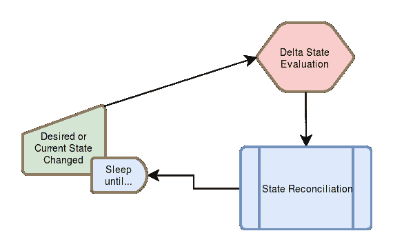

例如，如果我们当前在集群中有一个服务的五个正在运行的任务，并且将期望的状态更改为只有三个任务，我们的管理/编排系统将会看到区别是`-2`，从而选择两个随机任务并无缝地杀死它们。相反，如果我们有三个任务正在运行，而我们想要五个任务，管理/编排系统将看到期望的增量是`+2`，因此它将为它选择两个有可用资源的位置，并启动两个新任务。对两种状态转换的简短解释也应该有助于阐明这一过程:

```
Initial State: Service #1 (3 tasks), Service #2 (2 tasks)
Desired State: Service #1 (1 task),  Service #2 (4 tasks)

Reconciliation:
 - Kill 2 random Service #1 tasks
 - Start 2 Service #2 tasks on available nodes

New Initial State: Service #1 (1 tasks), Service #2 (4 tasks)

New Desired State: Service #1 (2 tasks), Service #2 (0 tasks)

Reconciliation:
 - Start 1 tasks of Service #1 on available node
 - Kill all 4 running tasks of Service #2

Final State: Service #1 (2 tasks), Service #2 (0 tasks)
```

使用这个非常简单但强大的逻辑，我们可以动态地扩展和缩减我们的服务，而不用担心中间阶段(在一定程度上)。在内部，保持和维护状态是一项非常困难的任务，以至于大多数编排框架都使用一个特殊的、高速的键值存储组件来为它们完成这项任务(即`etcd`、`ZooKeeper`和`Consul`)。

由于我们的系统只关心我们的当前状态在哪里以及它需要在哪里，所以该算法还可以作为构建弹性的系统，作为一个死节点，或者容器将减少应用的当前任务计数，并将自动触发状态转换回期望的计数。只要服务大部分是无状态的，并且您有运行新服务的资源，这些集群几乎可以抵御任何类型的故障，现在您有望看到几个简单的概念是如何结合在一起创建这样一个健壮的基础架构的。

随着我们对管理和编排框架基础知识的新理解，我们现在将简要了解我们的每一个可用选项(Docker Swarm、Kubernetes、Marathon)，并看看它们之间的比较。

# DockerSwarm

开箱即用，Docker 包含一个编排框架和一个管理平台，在架构上非常类似于刚才介绍的 Docker Swarm。Swarm 提供了一种非常快速和简单的方法，可以以最少的启动时间将扩展与您的平台集成在一起，并且考虑到它已经是 Docker 本身的一部分，您真的不需要太多其他东西就可以在集群环境中部署一组简单的服务。一个额外的好处是，它包含一个相当可靠的服务发现框架，具有多主机联网能力，并使用 TLS 进行节点间的通信。

Multi-host networking capability is the ability of a system to create a virtual network across multiple physical machines that are transparent from the point of view of the container. Using one of these, your containers can communicate with each other as if they were on the same physical network, simplifying the connectivity logic and reducing operational costs. We will look into this aspect of clustering in depth a bit later.

Docker Swarm 的集群配置可以是一个简单的 YAML 文件，但缺点是在编写本文时，图形用户界面工具有些缺乏，尽管 Portainer([https://Portainer . io](https://portainer.io))和船厂([https://shipyard-project.com](https://shipyard-project.com))变得相当不错，所以这可能不会成为太长时间的问题。此外，缺少一些大规模的操作工具，而且似乎 Swarm 的特性通常都在不断发展，因此处于不断变化的状态，所以如果您需要在小到大的规模上快速启动和运行一些东西，我个人的建议是使用这种类型的编排。随着该产品越来越成熟(由于 Docker Inc .在这背后投入了大量开发资源)，它可能会有显著的改进，我预计它将在许多方面与 Kubernetes 的功能相匹配，因此请密切关注其功能新闻。

# KubernetesKubernetesKubernetesKubernetesKubernetesKubernetesKubernetesKubernetesKubernetesKubernetes

Kubernetes 是谷歌的云平台和编排引擎，目前提供的功能比 Swarm 多一点。Kubernetes 的设置要困难得多，因为您需要:一个主节点、一个节点(根据我们早期的字典是工作节点)和 pods(一个或多个容器的分组)。Pods 总是在同一个位置，同一个计划，所以处理它们的依赖关系稍微容易一点，但是你不会得到同样的隔离。这里需要记住的有趣的事情是，pod 中的所有容器共享相同的 IP 地址/端口，共享卷，并且通常位于相同的隔离组中。将 pod 想象成一个运行许多服务的小虚拟机几乎比许多并行运行的容器要好。

Kubernetes 最近获得了大量的社区支持，可能是使用中部署最多的集群编排和管理系统，尽管公平地说，找到确切的数字很困难，其中大多数部署在私有云中。考虑到谷歌已经使用这个系统有一段时间了，而且规模如此之大，它有一个相当可靠的记录，我可能会推荐它用于中大型规模。如果您不介意设置一切的开销，我认为更小的规模也是可以接受的，但是在这个领域，Docker Swarm 非常容易使用，因此使用 Kubernetes 来实现它通常是不切实际的。

At the time of writing this book, both Mesos and Docker EE have included capabilities to support Kubernetes so if you would want to bet on an orchestration engine, this would probably be it.

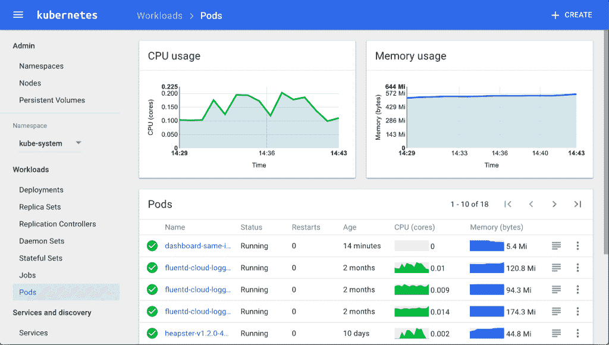

# 阿帕奇 Mesos/马拉松

当你真的需要升级到 Twitter 和 Airbnb 的级别时，你可能需要比 Swarm 或 Kubernetes 更强大的东西，这也是 Mesos 和 Marathon 发挥作用的地方。Apache Mesos 实际上并没有考虑 Docker，而是作为一个通用的集群管理工具，为在其上运行的应用提供一致的资源管理。您可以相对轻松地从脚本、实际应用和多个平台(如 HDFS 和 Hadoop)运行任何东西。如今，对于这个平台上基于容器的编排和调度，马拉松是这里的常规目标。

As mentioned a little bit earlier, Kubernetes support has been now available again for Mesos after being in a broken state for a while so the suggestion of Marathon may change by the time you read this text.

马拉松作为一个应用运行(在这个词的非常宽松的意义上)在作为容器编排平台的 Mesos 之上，并提供各种各样的细节，例如一个伟大的 UI(尽管 Kubernetes 也有一个)、度量、约束、持久的卷(在撰写本文时是实验性的)和许多其他东西。作为一个平台，Mesos 和 Marathon 可能是处理数万节点范围内集群的最强大的组合，但是要将一切拼凑起来，除非您使用预打包的 DC/操作系统解决方案([https://dcos.io/](https://dcos.io/))，在我的经验中，与其他两个相比，启动和运行真的非常棘手。如果你需要覆盖中等至最大范围的秤，并增加灵活性，以便在其上运行其他平台(如 Chronos)，目前，我强烈推荐这种组合。

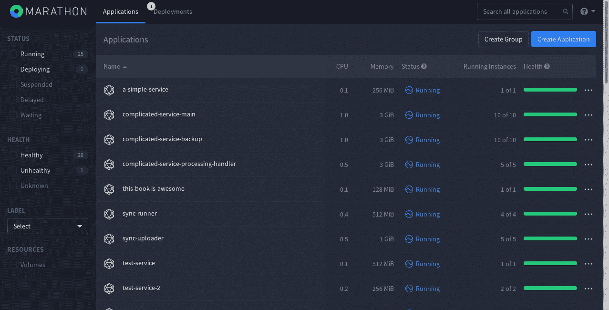

# 基于云的产品

如果所有这些看起来都太麻烦，并且你不介意每个月为此支付高额溢价，那么所有大型云提供商都有某种基于容器的服务。由于这些在功能和特性集方面有很大的不同，所以在发布时，在这方面被放在这个页面上的任何东西都可能已经过时，我们对自己部署服务更感兴趣，所以如果您选择以下路线，我将为您留下相应产品的链接，这些产品将包含最新信息:

*   **亚马逊 ECS**:[https://aws.amazon.com/ecs/](https://aws.amazon.com/ecs/)
*   **谷歌容器引擎**:[https://cloud.google.com/container-engine/](https://cloud.google.com/container-engine/)T4】
*   **微软 Azure** ( **Azure 容器服务**):[https://Azure . Microsoft . com/en-us/services/Container-Service/](https://azure.microsoft.com/en-us/services/container-service/)
*   **甲骨文容器云服务**:[https://cloud.oracle.com/container](https://cloud.oracle.com/container)
*   **Docker 风云**:[https://cloud.docker.com/](https://cloud.docker.com/)
*   可能还有很多我错过的

就我个人而言，由于易用性和经过测试的环境，我建议将这种方法用于中小型部署。如果您的需求超过了这些规模，那么在具有相同云服务提供商的**虚拟私有云** ( **VPCs** )上的可扩展虚拟机组上实施您的服务通常是可行的方法之一，因为您可以按照您的需求扩展的确切方式定制您的基础架构，尽管前期 DevOps 成本不小，因此请做出相应的决定。几乎所有云产品都需要记住的一个好的经验法则是，通过已经提供的简单工具，您可以获得更快的部署，同时抵消成本增加(通常是隐藏的)和缺乏灵活性/可定制性的影响。

# 实现编排

随着我们对编排和管理产品的新了解，是时候亲自尝试一下了。在我们的下一个练习中，我们将首先尝试使用 Docker Swarm 创建一个本地集群并玩一会儿，然后我们将尝试将上一章中的服务部署到它上面。

# 设置 Docker 集群

由于设置 Docker Swarm 集群的所有功能已经包含在 Docker 安装中，这实际上是一件非常容易的事情。让我们看看我们有哪些可用的命令:

```
$ docker swarm
<snip>
Commands:
 init        Initialize a swarm
 join        Join a swarm as a node and/or manager
 join-token  Manage join tokens
 leave       Leave the swarm
 unlock      Unlock swarm
 unlock-key  Manage the unlock key
 update      Update the swarm
```

这里需要注意几件事——有些比其他更明显:

*   你用`docker swarm init`创造一个群体
*   你用`docker swarm join`加入一个集群，机器可以是一个工作节点，一个管理节点，或者两者都有
*   使用令牌(需要匹配的唯一字符串)管理身份验证
*   如果管理器节点发生意外，例如重启或电源重启，并且您已经设置了群的自动锁定，则需要解锁密钥来解锁 TLS 密钥

到目前为止，一切都很好，所以让我们看看我们是否可以建立一个群，让我们的机器既充当经理又充当工人，看看这是如何工作的。

# 初始化 Docker 集群

要创建我们的群，我们首先需要实例化它:

```
$ docker swarm init 
Swarm initialized: current node (osb7tritzhtlux1o9unlu2vd0) is now a manager.

To add a worker to this swarm, run the following command:

 docker swarm join \
 --token SWMTKN-1-4atg39hw64uagiqk3i6s3zlv5mforrzj0kk1aeae22tpsat2jj-2zn0ak0ldxo58d1q7347t4rd5 \
 192.168.4.128:2377

To add a manager to this swarm, run 'docker swarm join-token manager' and follow the instructions.

$ # Make sure that our node is operational
$ docker node ls
ID                           HOSTNAME  STATUS  AVAILABILITY  MANAGER STATUS
osb7tritzhtlux1o9unlu2vd0 *  feather2  Ready   Active        Leader
```

我们已经使用该命令创建了一个群，并且我们被自动注册为管理节点。如果您看一下输出，添加工作节点的命令只是`docker swarm join --token <token> <ip>`，但是我们现在对单节点部署感兴趣，所以我们不需要担心。假设我们的管理器节点也是一个工作节点，我们可以直接使用它，在它上面抛出一些服务。

# 部署服务

我们最初需要的大多数命令都可以通过`docker services`命令访问:

```
$ docker service
<snip>
Commands:
 create      Create a new service
 inspect     Display detailed information on one or more services
 logs        Fetch the logs of a service or task
 ls          List services
 ps          List the tasks of one or more services
 rm          Remove one or more services
 scale       Scale one or multiple replicated services
 update      Update a service
```

As you might be suspecting, given how similar these commands are to some of the ones for managing containers, once you move to an orchestration platform as opposed to fiddling with containers directly, the ideal management of your services would be done through the orchestration itself. I would probably expand this and go as far as to say that if you are working with containers too much while having an orchestration platform, you did not set something up or you did not set it up correctly.

我们现在将尝试在我们的 Swarm 上运行某种服务，但是由于我们只是在探索所有这些是如何工作的，我们可以使用来自[第 2 章](2.html)、*卷起袖子*的非常精简(并且非常不安全)的 Python web 服务器版本。创建一个新文件夹，并将其添加到新的`Dockerfile`中:

```
FROM python:3

ENV SRV_PATH=/srv/www/html

EXPOSE 8000

RUN mkdir -p $SRV_PATH && \
 groupadd -r -g 350 pythonsrv && \
 useradd -r -m -u 350 -g 350 pythonsrv && \
 echo "Test file content" > $SRV_PATH/test.txt && \
 chown -R pythonsrv:pythonsrv $SRV_PATH

WORKDIR $SRV_PATH

CMD [ "python3", "-m", "http.server" ]
```

让我们构建它，以便在定义我们的服务时，我们的本地注册中心有一个映像可供提取:

```
$ docker build -t simple_server .
```

映像就绪后，让我们将其部署到群中:

```
$ docker service create --detach=true \
 --name simple-server \
 -p 8000:8000 \
 simple_server 
image simple_server could not be accessed on a registry to record
its digest. Each node will access simple_server independently,
possibly leading to different nodes running different
versions of the image.

z0z90wgylcpf11xxbm8knks9m

$ docker service ls
ID           NAME          MODE       REPLICAS IMAGE         PORTS
z0z90wgylcpf simple-server replicated 1/1      simple_server *:8000->8000/tcp
```

The warning shown is actually very important: our service is only available on our local machine's Docker registry when we built it, so using a Swarm service that is spread between multiple nodes will have issues since other machines will not be able to load the same image. For this reason, having the image registry available from a single source to all of the nodes is mandatory for cluster deployments. We will cover this issue in more detail as we progress through this and following chapters.

如果我们查看`http://127.0.0.1:8000`，我们可以看到我们的服务正在运行！让我们看看这个:

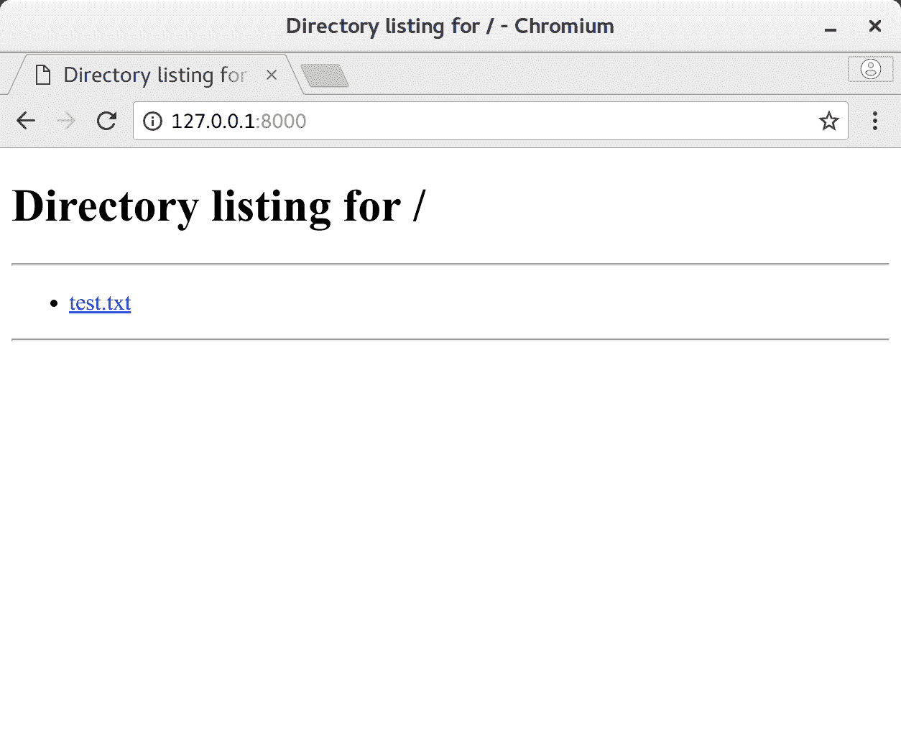

如果我们将此服务扩展到三个实例，我们可以看到我们的编排工具是如何处理状态转换的:

```
$ docker service scale simple-server=3 
image simple_server could not be accessed on a registry to record
its digest. Each node will access simple_server independently,
possibly leading to different nodes running different
versions of the image.

simple-server scaled to 3

$ docker service ls
ID           NAME          MODE       REPLICAS IMAGE         PORTS
z0z90wgylcpf simple-server replicated 2/3      simple_server *:8000->8000/tcp

$ # After waiting a bit, let's see if we have 3 instances now
$ docker service ls
ID           NAME          MODE       REPLICAS IMAGE         PORTS
z0z90wgylcpf simple-server replicated 3/3      simple_server *:8000->8000/tcp

$ # You can even use regular container commands to see it
$ docker ps --format 'table {{.ID}}  {{.Image}}  {{.Ports}}'
CONTAINER ID  IMAGE  PORTS
0c9fdf88634f  simple_server:latest  8000/tcp
98d158f82132  simple_server:latest  8000/tcp
9242a969632f  simple_server:latest  8000/tcp
```

您可以看到这是如何调整容器实例以适应我们指定的参数的。如果我们现在在现实生活中会发生的事情中加入一些东西——容器死亡:

```
$ docker ps --format 'table {{.ID}}  {{.Image}}  {{.Ports}}'
CONTAINER ID  IMAGE  PORTS
0c9fdf88634f  simple_server:latest  8000/tcp
98d158f82132  simple_server:latest  8000/tcp
9242a969632f  simple_server:latest  8000/tcp

$ docker kill 0c9fdf88634f
0c9fdf88634f

$ # We should only now have 2 containers
$ docker ps --format 'table {{.ID}}  {{.Image}}  {{.Ports}}'
CONTAINER ID  IMAGE  PORTS
98d158f82132  simple_server:latest  8000/tcp
9242a969632f  simple_server:latest  8000/tcp

$ # Wait a few seconds and try again
$ docker ps --format 'table {{.ID}}  {{.Image}}  {{.Ports}}'
CONTAINER ID  IMAGE  PORTS
d98622eaabe5  simple_server:latest  8000/tcp
98d158f82132  simple_server:latest  8000/tcp
9242a969632f  simple_server:latest  8000/tcp

$ docker service ls
ID           NAME          MODE       REPLICAS IMAGE         PORTS
z0z90wgylcpf simple-server replicated 3/3      simple_server *:8000->8000/tcp
```

如您所见，群集会像什么都没发生一样反弹，这就是容器化如此强大的原因:我们不仅可以在许多机器之间分散处理任务并灵活地扩展吞吐量，而且对于相同的服务，我们真的不太在乎一些(希望很小)百分比的服务是否死亡，因为框架将使它对客户端完全无缝。借助 Docker Swarm 的内置服务发现，负载平衡器会将连接转移到任何正在运行/可用的容器，因此任何试图连接到我们服务器的人都不会看到太大的不同。

# 清理

就像我们已经完成的任何服务一样，我们需要确保清理到目前为止已经用完的所有资源。在 Swarm 的情况下，我们可能应该删除我们的服务并销毁我们的集群，直到我们再次需要它。您可以使用`docker service rm`和`docker swarm leave`来完成这两件事:

```
$ docker service ls
ID           NAME          MODE       REPLICAS IMAGE         PORTS
z0z90wgylcpf simple-server replicated 3/3      simple_server *:8000->8000/tcp

$ docker service rm simple-server
simple-server

$ docker service ls
ID           NAME          MODE       REPLICAS IMAGE         PORTS

$ docker swarm leave --force
Node left the swarm.
```

The reason why we had to use the `--force` flag here is due to the fact that we are a manager node and we are the last one in the cluster, so by default, Docker will prevent this action without it. In a multi-node setup, you will not generally need this flag.

有了这个动作，我们现在回到了我们开始的地方，并准备好用真正的服务来做到这一点。

# 使用 Swarm 来编排我们的文字服务

在前一章中，我们构建了一个简单的服务，可以用来添加和列出表单中输入的单词。但是如果你还记得的话，我们大量使用了一些实现细节来将服务连接在一起，如果不是彻底的黑客攻击，也是非常脆弱的。借助我们新发现的服务发现知识和对 Docker Swarm 编排的理解，我们可以尝试让旧代码为真正的集群部署做好准备，并摆脱我们之前脆弱的设置。

# 应用服务器

将旧的应用服务器文件夹从[第 3 章](3.html)、*服务分解、*复制到一个新的文件夹中，我们将更改我们的主处理程序代码(`index.js`)，因为我们必须适应这样一个事实，即我们将不再是唯一一个读写数据库的实例。

As always, all code can also be found at [https://github.com/sgnn7/deploying_with_docker](https://github.com/sgnn7/deploying_with_docker). This particular implementation can be found in `chapter_4/clustered_application`. Warning! As you start thinking about similar containers running in parallel, you have to start being extra careful about data changes that can and will occur outside of the container's realm of control. For this reason, keeping or caching the state in any form in a running container is usually a recipe for disaster and data inconsistencies. To avoid this issue, in general, you should try to make sure that you re-read the information from your upstream sources (that is, the database) before doing any transformation or passing of the data like we do here.

# index.js

该文件与上一章中的文件基本相同，但我们将进行一些更改以消除缓存:

```
'use strict'

const bodyParser = require('body-parser')
const express = require('express');
const mongo = require('mongodb')

const DB_NAME = 'word_database';
const DB_HOST = process.env.DB_HOST || 'localhost:27017';
const COLLECTION_NAME = 'words';
const SERVER_PORT = 8000;

const app = express();
const client = mongo.MongoClient();
const dbUri = `mongodb://${DB_HOST}/${DB_NAME}`;

app.set('view engine', 'pug')
app.use(bodyParser.urlencoded({ extended: false }))

function loadWordsFromDatabase() {
    return client.connect(dbUri).then((db) => {
        return db.collection(COLLECTION_NAME).find({}).toArray();
    })
    .then((docs) => {
        return docs.map(doc => doc.word);
    });
}

app.get('/', (req, res) => {
    console.info("Loading data from database...");
    loadWordsFromDatabase().then(words => {
        console.info("Data loaded, showing the result...");
        res.render('index', { words: words });
    });
});

app.post('/new', (req, res) => {
    const word = req.body.word;

    console.info(`Got word: ${word}`);
    if (word) {
        client.connect(dbUri).then((db) => {
            db.collection(COLLECTION_NAME).insertOne({ word }, () => {
                db.close();
            });
        });
    }

    res.redirect('/');
});

app.listen(SERVER_PORT, () => {
    console.info("Server started on port %d...", SERVER_PORT);
});
```

如果可能已经注意到，许多事情是相似的，但也有根本性的变化:

*   我们不会预加载 start 上的单词，因为列表可能会在服务初始化和用户请求数据时发生变化。
*   我们在每个`GET`请求上加载保存的单词，以确保我们总是得到新的数据。
*   当我们保存这个词时，我们只是把它插入数据库，而不是保存在应用中，因为我们会在`GET`上获得新的数据重新显示。

使用这种方法，任何应用实例对数据库中的数据所做的任何更改都会立即反映在所有应用实例中。此外，如果数据库管理员更改了任何数据，我们也会在应用中看到这些更改。由于我们的服务还为数据库主机使用了一个环境变量，因此我们不需要将其更改为支持服务发现。

Caution! Be aware that because we read the database on each `GET` request, our changes to support clustering are not free and come with an increase in database queries, which can become a real bottleneck when the networking, cache invalidation, or disk transfers become overly saturated by these requests. Additionally, since we read the database before we display the data, slowdowns in the backend processing of our database `find()` will be user-visible, possibly causing undesired user experience, so keep these things in mind as you develop container-friendly services.

# 网络服务器

由于 NGINX 配置处理的一个怪癖/特性，我们的网络服务器更改会有点棘手，如果您进行基于 Java 的 DNS 解析，这可能也会影响您。本质上，NGINX 缓存 DNS 条目是如此之难，以至于一旦它读取了配置文件，除非指定了一些额外的标志(`resolver`)，否则该配置中的任何新 DNS 解析实际上都不会发生。随着 Docker 服务不断变化和重新定位，这是一个必须解决的严重问题，以便在 Swarm 上正常运行。这里，你有几个选择:

*   与 NGINX 并行运行一个 DNS 转发器(如`dnsmasq`)，并将其用作解析器。这需要在同一个容器中运行`dnsmasq`和 NGINX。
*   使用系统中相同的解析器填充 NGINX 配置容器，例如`envsubst`:这要求所有容器都在同一个用户定义的网络中。
*   对 DNS 解析器 IP 进行硬编码(`127.0.0.11`):这也要求所有容器都在同一个用户定义的网络中。

为了鲁棒性，我们将使用第二个选项，因此将前一章的 web 服务器复制到一个新文件夹中，并将其重命名为`nginx_main_site.conf.template`。然后，我们将向其中添加一个解析器配置，并为我们的代理主机端点添加一个变量`$APP_NAME`:

```
server {
  listen         8080;
  server_name    _;  

  resolver $DNS_RESOLVERS;

  root /srv/www/html;

  location ~/\. {
    deny all;
  }

  location / { 
    auth_basic           "Authentication required";
    auth_basic_user_file /srv/www/html/.htpasswd;

    proxy_pass           http://$APP_NAME:8000;
  }
}
```

由于 NGINX 不处理配置文件中的环境变量替换，我们将围绕它编写一个包装脚本。添加一个名为`start_nginx.sh`的新文件，并在其中包含以下内容，该文件接受主机的解析器并生成新的 main_site 配置:

```
#!/bin/bash -e

export DNS_RESOLVERS=$(cat /etc/resolv.conf | grep 'nameserver' | awk '{ print $2 }' | xargs echo)

cat /etc/nginx/conf.d/nginx_main_site.conf.template | envsubst '$DNS_RESOLVERS $APP_NAME' > /etc/nginx/conf.d/nginx_main_site.conf

nginx -g 'daemon off;'
```

为了运行这个，我们最终需要确保我们用这个脚本而不是内置的脚本启动 NGINX，所以我们也需要修改我们的`Dockerfile`。

打开我们的 Dockerfile，并确保它具有以下内容:

```
FROM nginx:latest

RUN apt-get update -q && \
    apt-get dist-upgrade -y && \
    apt-get install openssl && \
    apt-get clean && \
    apt-get autoclean

EXPOSE 8080

ENV SRV_PATH /srv/www/html

ARG PASSWORD=test

RUN rm /etc/nginx/conf.d/default.conf

COPY start_nginx.sh /usr/local/bin/

RUN mkdir -p $SRV_PATH && \
    chown nginx:nginx $SRV_PATH && \
    printf "user:$(openssl passwd -crypt $PASSWORD)\n" >> $SRV_PATH/.htpasswd && \
    chmod +x /usr/local/bin/start_nginx.sh

COPY nginx_main_site.conf.template /etc/nginx/conf.d/

CMD ["/usr/local/bin/start_nginx.sh"]
```

这里，主要的变化是启动脚本`CMD`覆盖并将配置转换为模板，剩下的几乎不做任何改变。

# 数据库ˌ资料库

与其他两个容器不同，我们将数据库放在一个容器中，这是由于以下因素的组合:

*   MongoDB 可以通过垂直扩展轻松扩展到高 GB/低 TB 数据集大小。
*   没有对卷的深入了解，数据库极难扩展(下一章将介绍)。
*   数据库的分片和副本集通常足够复杂，以至于整本书都只能写这个主题。

我们可能会在后面的章节中讨论这个主题，但是在这里，它会使我们偏离我们学习如何部署服务的总体目标，因此我们将只拥有我们在前面章节中使用的单个数据库实例。

# 全部部署

正如我们对简单的 web 服务器所做的那样，我们将从创建另一个 Swarm 集群开始:

```
$ docker swarm init
Swarm initialized: current node (1y1h7rgpxbsfqryvrxa04rvcp) is now a manager.

To add a worker to this swarm, run the following command:

 docker swarm join \
 --token SWMTKN-1-36flmf9vnika6x5mbxx7vf9kldqaw6bq8lxtkeyaj4r5s461ln-aiqlw49iufv3s6po4z2fytos1 \
 192.168.4.128:2377
```

然后，我们需要为服务发现主机名解析创建覆盖网络。除了创建一个我们将向其添加所有服务的隔离网络之外，您不需要了解太多:

```
$ docker network create --driver overlay service_network
44cyg4vsitbx81p208vslp0rx
```

最后，我们将构建和启动我们的容器:

```
$ cd ../database
$ docker build . -t local_database
$ docker service create -d --replicas 1 \
 --name local-database \
 --network service_network \
 --mount type=volume,source=database_volume,destination=/data/db \
                           local_database
<snip>
pilssv8du68rg0oztm6gdsqse

$ cd ../application_server
$ docker build -t application_server .
$ docker service create -d -e DB_HOST=local-database \
 --replicas 3 \
 --network service_network \
 --name application-server \
 application_server
<snip>
pue2ant1lg2u8ejocbsovsxy3

$ cd ../web_server
$ docker build -t web_server .
$ docker service create -d --name web-server \
 --network service_network \
 --replicas 3 \
 -e APP_NAME=application-server \
 -p 8080:8080 \
 web_server
<snip>
swi95q7z38i2wepmdzoiuudv7

$ # Sanity checks
$ docker service ls
ID           NAME               MODE       REPLICAS IMAGE                PORTS
pilssv8du68r local-database     replicated 1/1      local_database 
pue2ant1lg2u application-server replicated 3/3      application_server
swi95q7z38i2 web-server         replicated 3/3      web_server            *:8080->8080/tcp

$ docker ps --format 'table {{.ID}}  {{.Image}}\t  {{.Ports}}'
CONTAINER ID  IMAGE                         PORTS
8cdbec233de7  application_server:latest     8000/tcp
372c0b3195cd  application_server:latest     8000/tcp
6be2d6e9ce77  web_server:latest             80/tcp, 8080/tcp
7aca0c1564f0  web_server:latest             80/tcp, 8080/tcp
3d621c697ed0  web_server:latest             80/tcp, 8080/tcp
d3dad64c4837  application_server:latest     8000/tcp
aab4b2e62952  local_database:latest         27017/tcp 
```

If you are having trouble with getting these services up and running, you can check the logs with `docker service logs <service_name>` in order to figure out what went wrong. You can also use `docker logs <container_id>` if a specific container is having trouble.

有了这些，我们现在可以检查我们的代码是否在`http://127.0.0.1:8080`(用户名:`user`，密码:`test`)工作:

**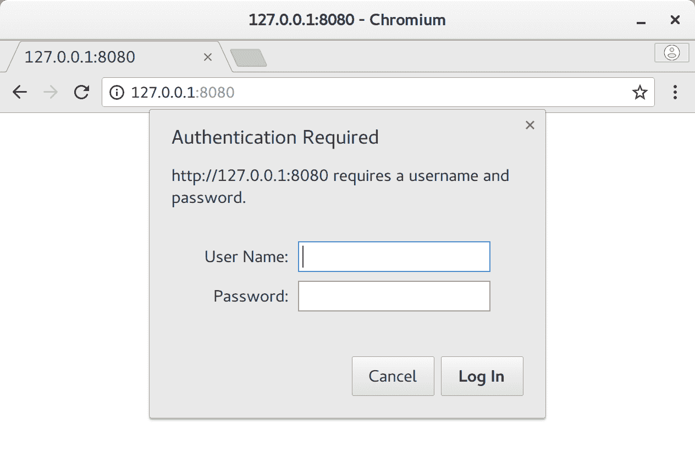** 

看起来它起作用了！输入凭据后，我们应该被重定向到主应用页面:

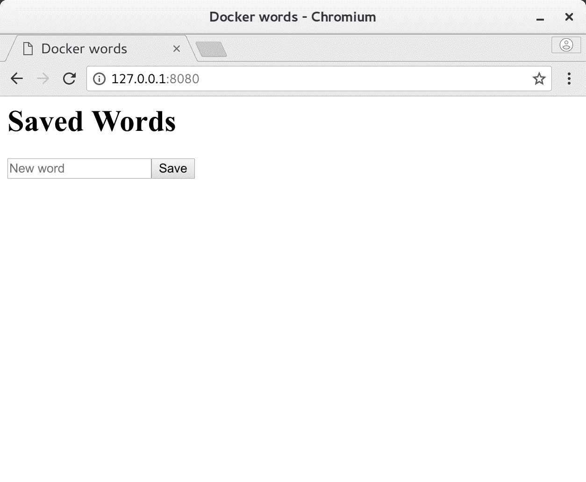

如果我们输入一些单词，数据库会工作吗？

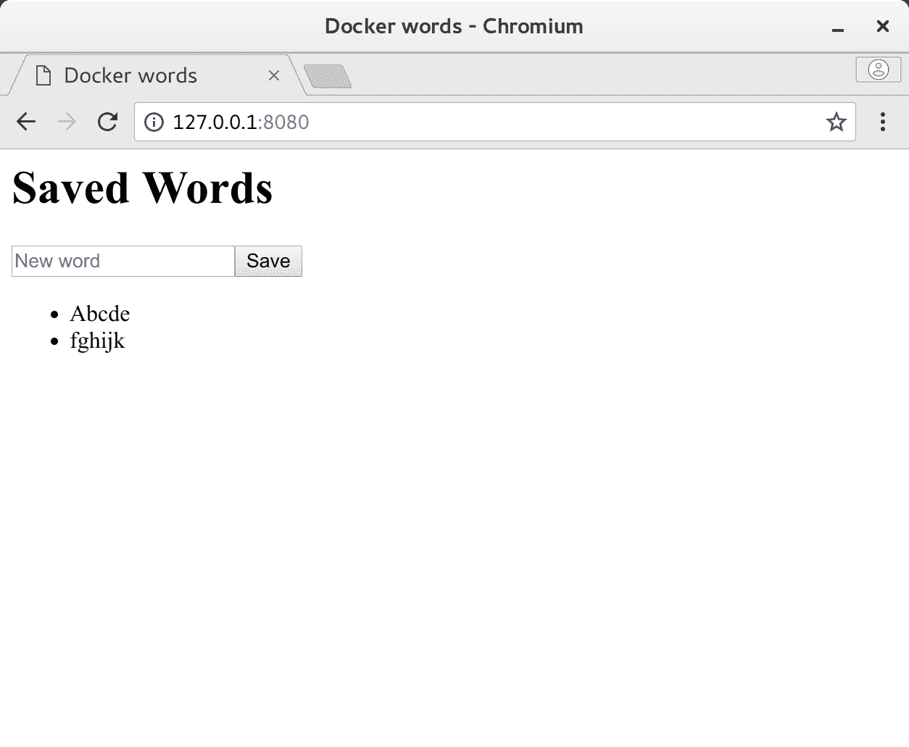

确实如此！我们真的创建了一个 1 节点群支持的服务，它是可扩展的，而且负载均衡！

# Docker 栈

正如前面几段中非常明显的那样，手动设置这些服务似乎有点麻烦，所以这里我们介绍一个新的工具，它可以帮助我们更容易地做到这一点:Docker Stack。这个工具使用一个 YAML 文件来轻松、重复地部署所有服务。

首先，我们将在尝试使用 Docker 栈配置之前清理我们的旧练习:

```
$ docker service ls -q | xargs docker service rm
pilssv8du68r
pue2ant1lg2u
swi95q7z38i2

$ docker network rm service_network
service_network
```

现在我们可以编写我们的 YAML 配置文件了，您可以很容易地注意到 CLI 与该配置文件的相似之处:

You can find more information about all the available options usable in Docker stack YAML files by visiting [https://docs.docker.com/docker-cloud/apps/stack-yaml-reference/](https://docs.docker.com/docker-cloud/apps/stack-yaml-reference/). Generally, anything you can set with the CLI commands, you can do the same with the YAML configuration.

```
version: "3"
services:
 local-database:
 image: local_database
 networks:
 - service_network
 deploy:
 replicas: 1
 restart_policy:
 condition: on-failure
 volumes:
 - database_volume:/data/db 
 application-server:
 image: application_server
 networks:
 - service_network
 depends_on:
 - local-database
 environment:
 - DB_HOST=local-database
 deploy:
 replicas: 3
 restart_policy:
 condition: on-failure 
 web-server:
 image: web_server
 networks:
 - service_network
 ports:
 - 8080:8080
 depends_on:
 - application-server
 environment:
 - APP_NAME=application-server
 deploy:
 replicas: 3
 restart_policy:
 condition: on-failure

networks:
 service_network:

volumes:
 database_volume:
```

开始我们的栈怎么样？那也很容易！栈的命令几乎与`docker services`相同:

```
$ docker stack deploy --compose-file swarm_application.yml swarm_test
Creating network swarm_test_service_network
Creating service swarm_test_local-database
Creating service swarm_test_application-server
Creating service swarm_test_web-server

$ # Sanity checks
$ docker stack ls
NAME        SERVICES
swarm_test  3

$ docker stack services swarm_test
ID           NAME                          MODE       REPLICAS            IMAGE                PORTS
n5qnthc6031k swarm_test_application-server replicated 3/3                 application_server 
v9ho17uniwc4 swarm_test_web-server         replicated 3/3                 web_server           *:8080->8080/tcp
vu06jxakqn6o swarm_test_local-database     replicated 1/1                 local_database

$ docker ps --format 'table {{.ID}}  {{.Image}}\t  {{.Ports}}'
CONTAINER ID  IMAGE                         PORTS
afb936897b0d  application_server:latest     8000/tcp
d9c6bab2453a  web_server:latest             80/tcp, 8080/tcp
5e6591ee608b  web_server:latest             80/tcp, 8080/tcp
c8a8dc620023  web_server:latest             80/tcp, 8080/tcp
5db03c196fda  application_server:latest     8000/tcp
d2bf613ecae0  application_server:latest     8000/tcp
369c86b73ae1  local_database:latest         27017/tcp
```

如果你在浏览器中再次转到`http://127.0.0.1:8080`，你会看到我们的 app 和以前一样工作！我们已经成功地用 Docker Swarm 集群上的一个文件部署了整个集群的映像！

# 打扫

我们不是那种留下无用服务的人，所以我们将移除栈并停止我们的 Swarm 集群，为下一章做准备:

```
$ docker stack rm swarm_test
Removing service swarm_test_application-server
Removing service swarm_test_web-server
Removing service swarm_test_local-database
Removing network swarm_test_service_network

$ docker swarm leave --force
Node left the swarm.
```

我们不需要清理网络或运行容器，因为一旦我们的栈消失，它们就会被 Docker 自动移除。完成这一部分后，我们现在可以进入下一章，重新开始。

# 摘要

在这一章中，我们讲述了许多事情，例如:什么是服务发现以及我们为什么需要它，容器编排基础和状态协调原则，以及编排领域的一些主要参与者。有了这些知识，我们继续使用 Docker Swarm 实现单节点完整集群，以展示如何完成类似的工作，在接近尾声时，我们使用 Docker stack 一起管理服务组，希望向您展示如何将这一切从理论转化为实践。

在下一章中，我们将开始探索 Docker 卷和数据持久性的复杂世界，所以请继续关注我们。