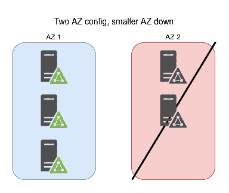
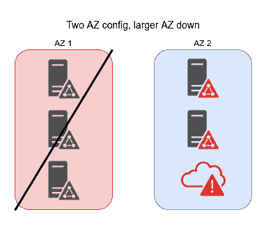
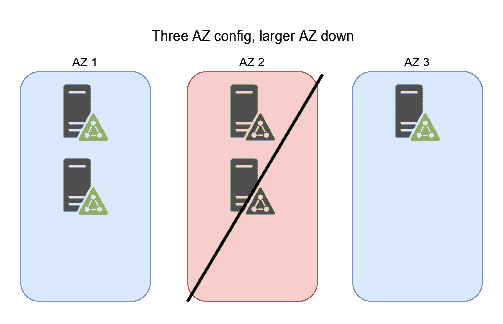
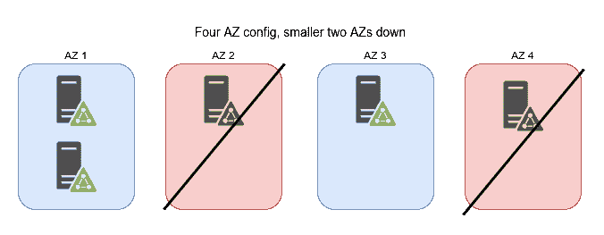
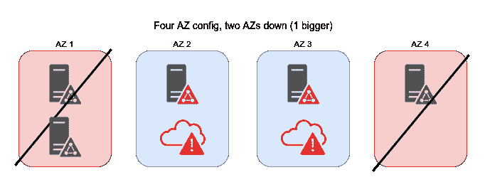
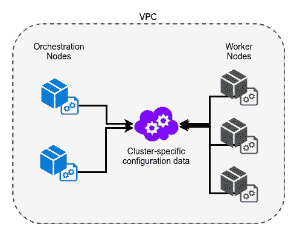
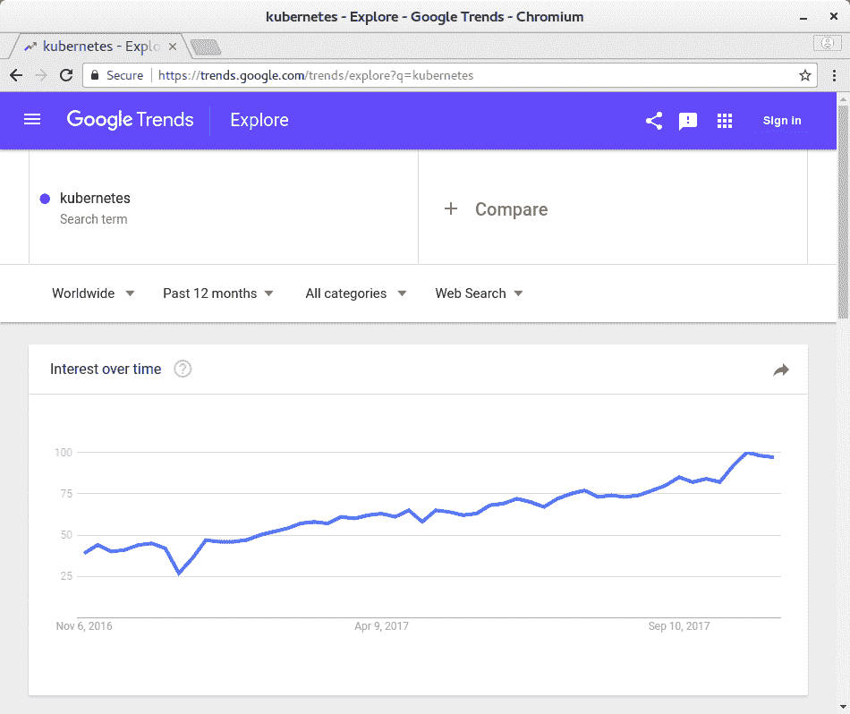
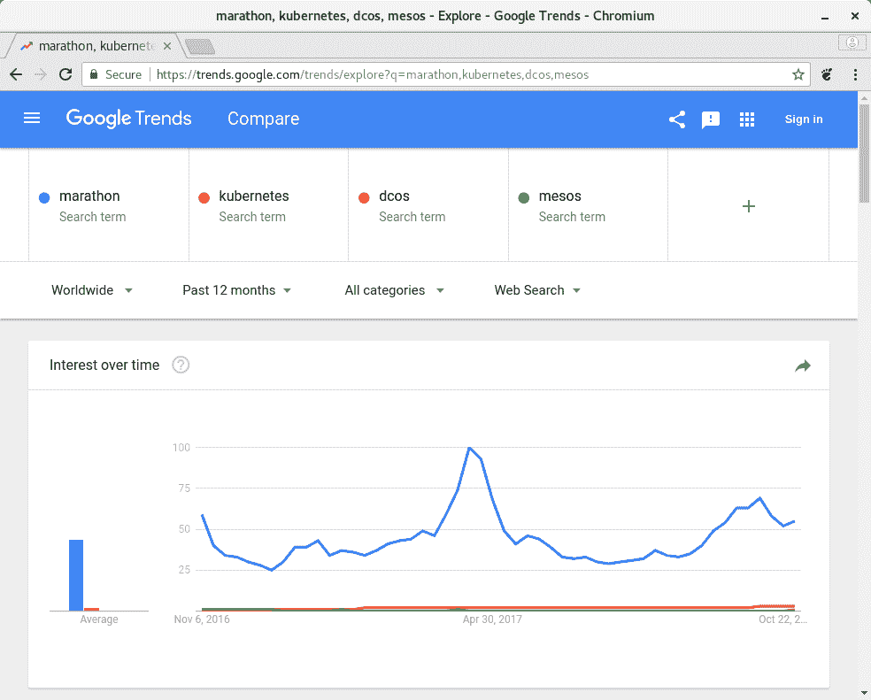

# 九、探索最大规模的部署

在前面的章节中，我们介绍了部署 Docker 容器的许多不同方面，但是如果我们要将我们的示例转化为一个能够承受每秒数百万次请求吞吐量的全球服务，那么仍然需要解决一些问题，这一章是专门为详细介绍最重要的问题而编写的。由于这里所涵盖的主题的实现将涉及足够的材料来成为自己的书，并且基础设施将根据多种因素而大相径庭，所以这里的文本将主要是理论方面的，但是我们在本章之前的文本中获得的对服务的理解应该足够好，可以为您提供如何以最少的痛苦继续进行的想法。

就其核心而言，我们将涵盖的主题围绕选择正确的技术，然后遵循三个基本思想:

*   自动化一切！
*   真的，全部自动化！
*   是的，自动化你每隔几周做的那些一次性的事情

这可能是一个笑话，但是希望现在应该很清楚，所有这些工作的要点之一(除了隔离)是从您的系统中移除任何与保持服务运行相关的人工交互，以便您和您的团队能够专注于实际开发服务，而不是在部署上浪费时间。

# 维护定额

在我们前面的示例中，我们主要使用单节点管理器，但是如果您想要恢复能力，您必须确保有最少的故障点会使您的整个基础架构瘫痪，并且单个编排管理节点对于生产服务来说是绝对不够的，无论您是否使用 Swarm、Kubernetes、Marathon 或其他工具作为编排工具。从最佳实践的角度来看，您希望集群中至少有三个或更多管理节点分布在三个或更多云的**可用性区域** ( **【阿兹】**)或等效分组中，以真正确保规模稳定性，因为数据中心宕机已经发生，并给没有缓解这类情况的公司带来严重问题。

虽然在大多数编排平台中，您可以有任意数量的备份管理节点(或者在某些情况下备份键值存储)，但您将始终必须平衡弹性和速度，因为随着节点的增多，处理系统中较大部分故障的能力也会提高，但是对该系统的更改(例如添加和删除节点)必须达到更多的点，所有这些点都必须一致，从而使处理数据的速度变慢。在大多数需要这种 3+可用性区域拓扑的情况下，我们需要深入了解 quorums 的细节——我们之前简单介绍过的概念，它是所有**高可用性** ( **HA** )系统的主干。

基本意义上的 Quorums 是大多数管理节点的分组，它们可以共同决定是否允许对集群进行更新。如果由于一半或更多管理节点不可用而导致仲裁丢失，将停止对群集的所有更改，以防止您的群集基础架构有效地拆分群集。为了在这方面正确划分您的网络拓扑进行扩展，您必须确保至少有三个节点和/或可用性区域，因为如果单个故障少于该数量，法定多数将会丢失。更进一步，您通常还需要奇数个节点和可用性区域，因为偶数个节点和可用性区域并不能为维护法定人数提供太多额外的保护，稍后我们将看到这一点。

首先，假设您有五个管理节点。要保持这个数量的法定人数，您必须有三个或更多的可用节点，但是如果您只有两个可用区域，您能做的最好的分割是 *3-2* ，如果连接断开或带有两个管理节点的 **AZ** 关闭，这将很好地工作，但是如果带有三个节点的 **AZ** 关闭，则无法建立法定人数，因为两个节点少于总节点数的一半。

 

现在让我们看看我们可以通过三个可用性区域获得什么样的弹性。具有五个管理节点的这种分组的最佳布局是 *2-2-1* ，如果您仔细查看当任何一个区域关闭时会发生什么，您会发现法定人数始终保持不变，因为我们将有 *3 (2+1)* 或 *4 (2+2)* 节点仍然可以从集群的其余部分获得，从而确保我们的服务运行没有问题:

当然，展示偶数对有效性有什么样的影响也是好的，因为我们提到它们可能有点麻烦。有了四个 az，我们可以进行的最佳分割将是跨它们的 *2-1-1-1* ，使用这些数字，如果两个区域都只包含一个节点，我们只能容忍两个区域不可用。在这种设置下，两个不可用的区域将有 50%的机会包含其中有两个节点的区域，这样不可用的节点总数将超过 3 个，因此群集将完全离线:

如果您有更多的可用性区域和管理器，管理节点跨集群的更高数量的 AZs 的这种分布会变得更加稳定，但是对于我们这里的简单示例，如果我们有五个管理节点和五个可用性区域( *1-1-1-1-1* 布局)，我们可以看到这种效果。通过这种拆分，由于法定要求至少三个节点，如果五个区域中的任何两个不可用，我们仍将完全运行，从而使您的故障容限比 3-AZ 拓扑提高 100%；但是您可以假设，可能完全不同的地理区域之间的通信会给任何更新增加大量延迟。

希望有了这些例子，现在应该很清楚，当您试图保持集群的弹性并且能够维持仲裁时，您会使用什么样的考虑和计算。虽然工具可能因编排工具而异(即`etcd`节点与 Zookeeper 节点)，但几乎所有工具的原理都保持相对一致，因此这一部分应该是相对可移植的。

# 节点自动化

当我们用 Packer 制作**亚马逊机器映像** ( **AMIs** )时，我们已经看到了我们可以用预烘焙的实例映像做什么样的事情，但是只有当整个基础架构都由它们组成时，它们的真正力量才能得到充分利用。如果您的编排管理节点和工作节点有自己的系统映像，并且有几个启动脚本也通过 init 系统(例如，`systemd`启动服务)嵌入，您可以让使用这些映像启动的实例在引导期间以它们的预定义角色自动加入您的集群。将这进一步扩展到概念层面，如果我们将所有有状态配置提取到映像配置中，并将所有动态配置提取到所有节点(如 EC2 `user-data`或 HashiCorp Vault)都可以访问的单独服务中，那么除了初始部署和映像构建之外，您的集群几乎可以完全自我配置。

通过拥有这种强大的自动加入功能，您可以消除与扩展或缩减集群相关的大部分手动工作，因为除了启动虚拟机实例之外，不需要与它进行交互。下图描述了该体系结构的一个相当简单的示例，其中编排节点和工作节点拥有各自的映像，并在启动时使用 **VPC** 内部的共享配置数据提供程序进行自我配置:

CAUTION! To prevent serious security breaches make sure to separate and isolate any sensitive information to be accessible only by the desired systems in this configuration service layout. As we mentioned in one of the early chapters, following security best practices by using need-to-know practices will ensure that a compromise of a single point (most likely a worker node) will not be able to spread easily to the rest of your cluster. As a simple example here, this would include making sure that management secrets are not readable by worker nodes or their network.

# 反应式自动缩放

随着自动化自我配置的实现，我们可以通过自动启动实例来看得更大。如果您还记得前面章节中的自动扩展组，那么在大多数云产品中甚至可以实现自动化。通过使用启动配置和预配置的映像，就像我们刚才讨论的那些一样，使用这种设置添加或删除节点就像拨打所需的节点设置一样简单。自动缩放组将增加或减少工作实例数量，并且因为映像是自配置的，所以这将是您需要的全部输入。有了这样一个简单的输入，您就可以通过许多不同的方式极其轻松地对基础架构进行扩展更改。

这里需要考虑的是，在自动化方面更进一步的是，对于一些云提供商，您可以根据他们的指标，甚至类似于`cron`的时间表，在您的自动伸缩组中触发这些动作。原则上，如果您增加了集群上的负载，您可以触发节点数量的增加，相反，如果集群或单个节点上的负载低于预定义的值，您可以激活服务消耗并关闭一部分节点，以根据需要扩展系统。对于周期性但可预测的需求变化(更多信息请参见[https://en.wikipedia.org/wiki/Internet_Rush_Hour](https://en.wikipedia.org/wiki/Internet_Rush_Hour)，我们提到的计划的缩放比例变化可以确保您有足够的资源来处理预期的需求。

# 预测自动缩放

如果您手动上下拨节点计数并按计划或度量触发器自动扩展，您仍然会遇到一些问题，因为服务需要花费一些时间才能联机、自我配置并开始传播到网络中的各种负载平衡器，所以您仍然需要在您希望它们运行的确切时间启动服务。有了这种类型的架构，很可能你的用户会发现你没有足够的容量，然后你的系统做出反应来补偿。如果你真的在努力从你的服务中获得最好的用户体验，有时你可能还需要在你的自动伸缩触发器上再增加一层，它可以在你的服务真正需要资源之前预测何时需要更多的资源，这被恰当地称为**预测伸缩**。

从极其广泛的角度来看，要将这个预测层添加到您的基础架构中，您需要做的是将在过去`x`段时间内收集的部分指标汇集到一个**机器学习** ( **ML** )工具中，例如 TensorFlow([https://www.tensorflow.org/](https://www.tensorflow.org/))并生成一个训练集，该训练集能够使您正在使用的工具能够确定地预测您是否需要更多节点。通过使用这种方法，您的服务甚至可以在需要扩展之前进行扩展。)而且比简单的基于时间表的方法聪明得多。诸如此类的系统很难正确地集成到您的管道中，但是如果您正在以疯狂的吞吐量在全球范围内工作，而简单的反应式自动扩展却功亏一篑，这可能是一条值得探索的道路。

Training set in machine learning means just a set of training data (in our case it would be a chunk of our long-term metrics) that you can use to teach a neural network about how to correctly predict the demand that you will need. Like many of the topics in recent chapters, there are actual books written on this material (machine learning) that would eclipse the content of this one by volume many times over and would provide only marginal utility for you here. If you would like to learn more about machine learning in detail, this Wikipedia page has a good primer on it at [https://en.wikipedia.org/wiki/Machine_learning](https://en.wikipedia.org/wiki/Machine_learning) and you can give TensorFlow a whirl at [https://www.tensorflow.org/get_started/get_started](https://www.tensorflow.org/get_started/get_started).

最后，如果您设法一起实现这些技术中的一些或全部，那么您将几乎不需要对集群进行任何干预来处理任何方向的扩展。作为能够睡得很香的额外奖励，您还将节省资源，因为您将能够将处理资源与服务的实际使用紧密匹配，使您、您的预算和您的用户都感到满意。

# 监视

您在服务交付中依赖的任何服务都应该有一个理想的方法来通知您它是否出现了问题，我在这里不是指用户反馈。如今，大多数服务开发都在以令人难以置信的速度进行，而监控是像备份这样的事情之一，大多数开发人员在灾难性的事情发生之前都不会考虑，所以我们应该稍微介绍一下。真正应该决定你如何处理这个话题的大问题是，你的用户是否能处理你在没有监控的情况下看不到的停机时间。

大多数微小的服务在一些中断的情况下可能是正常的，但是对于其他所有事情，这将是最少的几封来自用户的愤怒的电子邮件，最坏的情况是您的公司失去了您的大部分用户，因此非常鼓励在所有规模上进行监控。

诚然，监控可能被认为是您的基础架构中需要实施的无聊部分之一，但有一种方法可以洞察您的云一直在做什么，这是管理众多不同系统和服务的一个绝对必要的部分。通过将监控添加到您的**关键性能指标** ( **关键性能指标**)中，您可以确保您的系统总体上按预期运行，并且通过将触发器添加到您的关键监控目标中，您可以即时收到任何可能影响您的用户的活动的警报。对基础架构进行这些类型的洞察既有助于减少用户流失，又能推动更好的业务决策。

在我们研究示例的过程中，您可能已经想出了要监控的内容，但以下是一些常见的内容，它们总是会作为最有用的内容出现:

*   **节点内存利用率**:如果您注意到您的节点没有使用所有分配的内存，您可以移动到较小的节点，反之亦然。如果您使用内存受限的 Docker 容器，这通常会变得不太有用，但这仍然是一个很好的度量标准，因为您希望确保在节点上永远不会达到系统级最大内存利用率，否则您的容器将以慢得多的交换运行。
*   **节点 CPU 利用率**:从这个指标可以看出您的服务密度是太低还是太高，或者服务需求是否出现峰值。
*   **节点意外终止**:这是一个很好的跟踪，以确保您的配置项/光盘管道不会创建坏映像，您的配置服务处于在线状态，以及许多其他可能会降低您的服务的问题。
*   **服务意外终止**:找出服务意外终止的原因对于消除任何系统中的 bug 至关重要。看到这个值的增加或减少可以很好地指示代码库的质量，尽管它们也可以指示许多其他问题，包括您的基础架构内部和外部的问题。
*   **消息队列大小**:我们之前已经详细介绍过了，但是不断膨胀的队列大小表明您的基础架构无法像数据生成时那样快速处理数据，所以这个指标总是很好的。
*   **连接吞吐量**:准确知道您正在处理的数据量可以很好地指示服务负载。将此与其他收集的统计数据进行比较，还可以告诉您您看到的问题是由内部还是外部引起的。
*   **服务延迟**:没有故障不代表服务不可用。通过跟踪延迟，您可以详细了解哪些方面可以改进，哪些方面没有达到您的预期。
*   **内核恐慌**:罕见但极其致命的内核恐慌可能会对您部署的服务产生真正的破坏性影响。尽管监控这些非常棘手，但是跟踪内核恐慌会提醒您是否有底层内核或硬件问题需要您开始解决。

这显然不是一个详尽的列表，但它涵盖了一些更有用的列表。当您开发您的基础设施时，您会发现在任何地方添加监控都可以更好地解决问题，并发现您的服务的可伸缩性缺陷。因此，一旦您将监控添加到您的基础架构中，不要害怕将其尽可能多地插入到您的系统中。最终，通过监控获得整个基础架构的可见性和透明度，您可以做出更明智的决策并构建更好的服务，这正是我们想要的。

# 评估下一代技术

我个人感觉到，大多数关于容器的文档和学习材料(以及大多数其他技术主题)都忽略了对新兴技术的正确评估和风险评估。尽管选择一款存在根本缺陷的音乐播放器的风险微乎其微，但选择一款存在根本缺陷的云技术可能会让你陷入数年的痛苦和发展之中，否则你就不需要这些。随着云领域中工具创建和开发的速度以极快的速度增长，良好的评估技术可能是您技能工具箱中想要的东西，因为从长远来看，它们可以节省您的精力、时间和金钱。预感很棒，但是拥有一个可靠的、可重复的、确定性的技术评估方法更有可能带来长期的成功。

Please note that while the advice given here has had a pretty good track record for me and other people I have talked to over my career, you can never fully predict the course that a disparate landscape of technologies will take, especially when most tech start-ups can close their doors at a moment's notice (i.e. ClusterHQ). So keep in mind that these are all just points of interest and not a magical list that will make the most common problems with choosing technologies disappear.

# 技术需求

这应该是一个非常明显的问题，但是需要写下来。如果你需要一个由你不想在内部开发的工具提供的特性，你将没有太多的选择，只能随遇而安，抱最好的希望。幸运的是，在大多数云技术和支持它们的工具模块中，通常至少有两个相互竞争的选项在争夺相同的用户，所以事情并不像今天看起来那么可怕，尽管仅仅一年前，这个领域几乎所有的东西都有一个低于`1.0`的版本号。当您评估竞争工具如何满足您的需求时，也请记住，并非每个工具都面向相同的目的，即使它们解决了相同的问题。如果我们以当前的 Kubernetes 和 Marathon 为例，尽管它们都可以用来解决相同的服务部署问题，但是 Kubernetes 主要是为了这个单一的目的，但是 Marathon 也可以用来作为一个额外的功能进行调度和集群管理，所以在众所周知的意义上，我们实际上是在比较苹果和橙子。

概括地说，您的服务基础设施需求将驱动您的工具需求，因此您不会经常最终处理您最喜欢的编程语言，拥有简单的集成点，或者使用健全的工具代码库，但是集成一个将为您节省数百或数千工时的工具是不可轻视的事情。有时，通过改变系统架构的各个部分来完全避开技术需求以避免增加系统的复杂性是可能的，但根据我的个人经验，这几乎从来都不容易做到，因此您的里程可能会有所不同。

# 流行

这可能是需要考虑的最有争议的维度，也是处理新技术时需要注意的最重要的维度之一。虽然流行并不等同于技术优点是绝对正确的，但可以假设:

*   更多使用特定工具的人将能够提供更好的集成帮助。
*   问题的解决方案会更容易找到。
*   如果代码库是开源的，项目将更有可能添加修复和特性。

换句话说，对于一个未经验证或有望在未来几年内被放弃的工具，你能承担数周/数月/数年的集成工作风险吗？如果你是一家拥有大量预算的大型商店，这可能不是问题，但在大多数情况下，你将没有机会尝试集成不同的竞争技术，看看哪一种是最好的。虽然有时使用新工具的机会是合理的，但在大多数情况下，由于云系统的复杂性和寿命，失败的成本非常高，因此通常建议采取务实的方法，但您的个人需求可能会有所不同，因此请做出相应的选择。

要评估项目的这一方面，可以使用各种工具，但最简单和最容易的是 GitHub 项目 forks/star(对于 OSS 项目)、Google Trends([https://trends.google.com](https://trends.google.com))预测，以及使用过所述技术的人的一般社交媒体反馈。通过观察这些值的变化和转移，可以以相对较高的精度进行长期可行性的推断，并与现有工具的比较相结合，也可以很好地描述项目的总体趋势。向上流动的项目通常表明了优越的技术基础，但在某些情况下，这是由拒绝现有工具或大的营销推动所激发的，所以在评估工具时不要总是认为流行的选项更好。

****

在前面的截图中，您可以看到随着时间的推移，人们对 Kubernetes 的兴趣明显增加，这在一定程度上反映了社区对该编排工具的采用和接受。如果我们自己实现这项技术，我们可以合理地确定，在一段时间内，我们将使用一种更容易使用和获得支持的工具。

当将 Kubernetes 与 Marathon 进行比较并使用相同的技术时，事情会变得非常混乱，因为 Marathon 也是一种非常常见的长跑活动，因此结果会与不相关的谷歌查询混淆。在下面的截图中，我们将结果与其他几个与云相关的关键词进行了对比，您可以看到我们的数据有问题:

然而，看看他们的 GitHub 页面的右上角和叉/星，我们可以看到他们是如何比较的( **3，483** 星和 **810** 叉与 **28，444** 星和 **10，167** 叉):

将前面的 GitHub 页面与下面的页面进行比较:

然而，在这个特殊的例子中，很难看到长期趋势，我们已经提到这两个工具不能解决相同类型的问题，除此之外，这两个工具的设置复杂性有很大的不同，因此正确的评估非常困难。

在进入下一个维度之前，我们应该提到的一件非常重要的事情是:对于不成熟的工具，一个常见的并且强烈推荐的风险缓解(这个场景比你想象的更有可能)是，如果你自己的开发人员有能力并且被允许在相关的上游项目上工作，那么他们可以被用来修复 bug 和添加特性。如果一个工具非常适合您的基础架构，并且您可以将开发资源抛在它的后面，那么只要您能够让它以您满意的方式为您工作，它是否受欢迎就不会有太大的不同。

As a reference data point, countless times during the development of cloud implementations, the teams that I worked on have found bugs and issues in upstream projects that we fixed rather quickly and in the process also helped all the other users of that software instead of potentially waiting days or weeks for the upstream developers to make time to fix them. I would highly encourage this type of approach to contributing back being applied to your workplace if possible since it helps the whole project's community and indirectly prevents loss of project momentum due to unfixed bugs.

# 团队的技术能力

新的工具通常有一个很好的初始想法，但是由于糟糕的执行或架构，它很快就会变成不可维护且容易出错的意大利面代码。如果设计和实现保持高标准，您可以更好地保证不会出现意外的损坏，或者至少 bug 可以更容易找到和修复。核心项目开发人员的能力在这方面起着巨大的作用，并且由于大多数较新的工具都是开源的，所以在这方面看一看代码库通常会很有帮助。

几乎不可能为评估跨越各种技术和系统的项目制定确切的指导方针，但对于关键应用中使用的工具，有一些危险信号应被视为未来潜在问题的警告信号:

*   **缺乏测试**:没有测试，代码工作的保证几乎被消除，您希望进行更改的开发人员在实现新功能时足够小心，并且他们没有破坏当前的功能。在我的一生中，我只见过少数几个开发人员能够像测试工具一样关注所有的边缘案例，但是我不会屏息以待，因为您正在研究的项目中就有一个。
*   **聪明的代码**:一个项目时不时会有一个或多个开发人员，他们更关心的是展示自己的技能，而不是他们正在处理的项目的可维护性，他们几乎总是会把他们接触到的文件变成只有他们才能处理的代码，导致未来添加功能或修复 bug 时出现问题。几乎总是这种类型的改变是单向的，在足够长的一段时间后，它通常会以项目的死亡告终(在我的经验中，这种情况经常发生)。
*   **大量关键 bug 长时间开放**:对于任何项目来说，总有一天会遇到必须尽快修复的关键 bug，通过查看修复需要多长时间的趋势，可以看出团队是否有能力快速修复一个问题，或者是否关注更广泛的社区。虽然更多的是一种主观的度量，但随着服务的概要或安全状况的增加，它变得极其重要。

只要你对代码库的质量有正确的认识，你也可以使用任何其他的度量来评估，比如:旧的和未合并的拉取请求，任意关闭的 bug 报告，等等。有了这些知识，您可以正确地评估候选工具的未来，以及您的基础设施如何随之发展。

# 摘要

就这样，我们已经到了书的结尾！在这一章中，我们介绍了您将需要的各种东西，通过积极的自动化，将东西分成多个可用性区域，并为您的基础架构添加监控，使您的小型服务全球化。由于云技术还相对年轻，我们更重要的是包括了一些关于如何尽可能客观地评估新兴工具的技巧，以确保您的项目在工具生态系统变化的情况下最有可能成功，这些变化在可预见的未来将是常见的。通过假设事情在未来会发生变化，并拥有处理这些变化的工具，我们可以准备好接受任何扔给我们的东西。