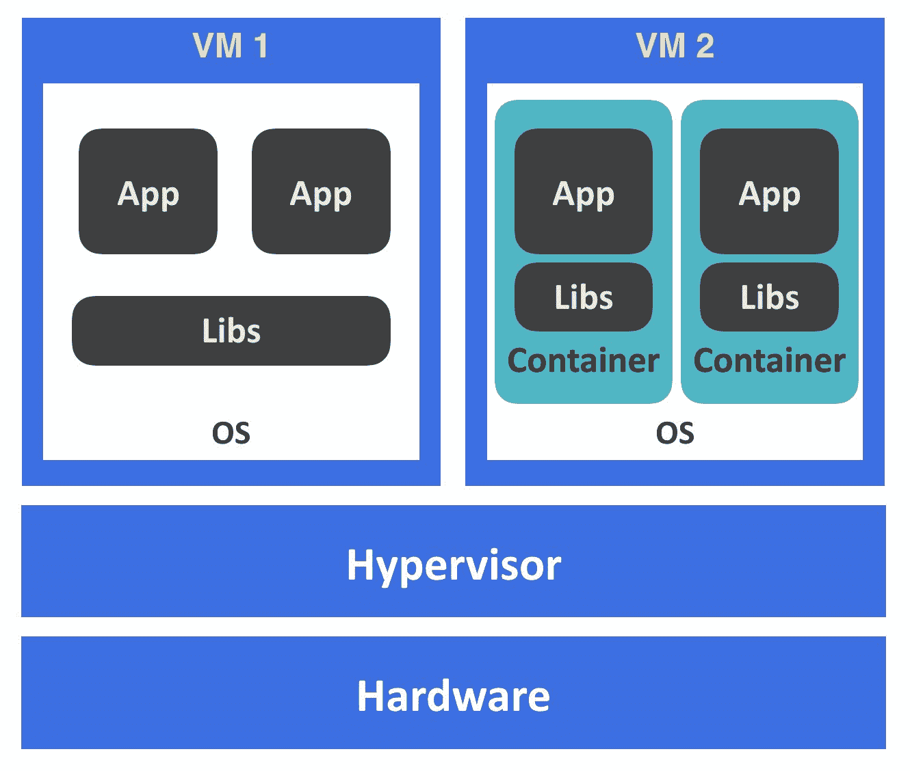
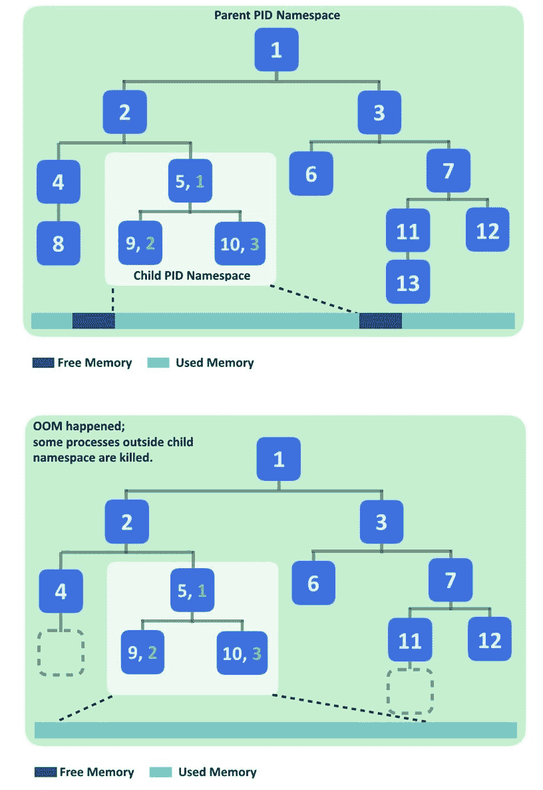
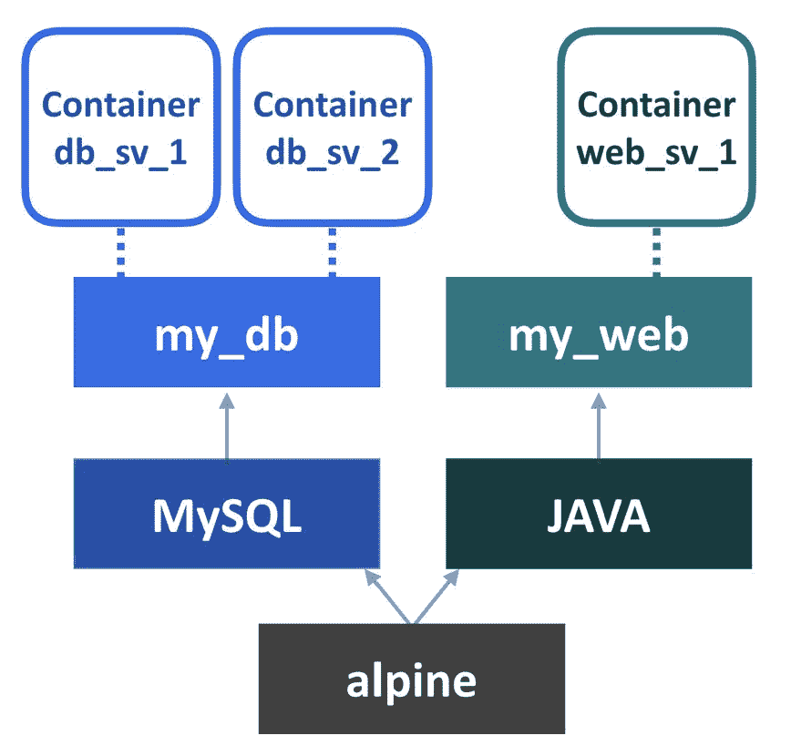
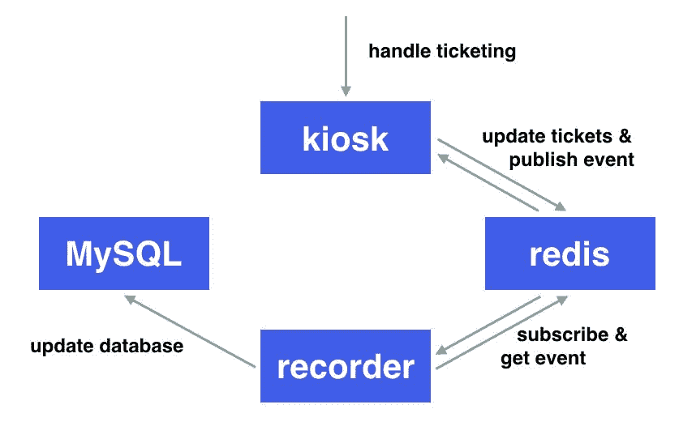

# 二、容器和 DevOps

我们已经熟悉了许多帮助我们在应用交付的不同阶段自动化任务和管理配置的 DevOps 工具，但是随着应用变得更加微观和多样化，挑战仍然存在。在本章中，我们将在我们的工具带上添加另一把瑞士军刀，即 Container。在此过程中，我们将寻求获得以下技能:

*   容器概念和基础
*   运行 Docker 应用
*   使用`Dockerfile`构建 Docker 应用
*   用 Docker 编写编排多个容器

# 理解容器

容器的关键特征是隔离。在这一节中，我们将详细说明容器是如何实现它的，以及为什么它在软件开发生命周期中很重要，以帮助建立对这个强大工具的正确理解。

# 资源隔离

当应用启动时，它会消耗 CPU 时间，占用内存空间，链接到其依赖的库，并可能写入磁盘、传输数据包和访问其他设备。它使用的所有东西都是一种资源，由同一台主机上的所有程序共享。容器的思想是将资源和程序隔离到单独的盒子中。

您可能听说过准虚拟化、**虚拟机** ( **虚拟机**)、BSD 监狱和 Solaris 容器等术语，它们也可以隔离主机的资源。然而，由于它们的设计不同，它们从根本上是不同的，但提供了类似的隔离概念。例如，虚拟机的实施是为了使用虚拟机管理程序虚拟化硬件层。如果要在虚拟机上运行应用，必须先安装完整的操作系统。换句话说，资源在同一虚拟机管理程序上的客户操作系统之间是隔离的。相比之下，容器是建立在 Linux 原语之上的，这意味着它只能在具有这些功能的操作系统中运行。BSD 监狱和 Solaris 容器在其他操作系统上也以类似的方式工作。下图说明了容器和虚拟机的隔离关系。容器在操作系统层隔离应用，而基于虚拟机的隔离由操作系统实现。



# Linux 容器概念

容器包含几个构建块，其中最重要的两个是**名称空间**和**组** ( **控制组**)。这两个都是 Linux 内核特性。名称空间提供了某些系统资源的逻辑分区，如挂载点(`mnt`)、进程标识(`PID`)、网络(net)等。为了解释隔离的概念，让我们看一些关于`pid`名字空间的简单例子。以下示例均来自 Ubuntu 16.04.2 和 util-linux 2.27.1。

当我们键入`ps axf`时，我们会看到一长串正在运行的进程:

```
$ ps axf
 PID TTY      STAT   TIME COMMAND
    2 ?        S      0:00 [kthreadd]
    3 ?        S      0:42  \_ [ksoftirqd/0]
    5 ?        S<     0:00  \_ [kworker/0:0H]
    7 ?        S      8:14  \_ [rcu_sched]
    8 ?        S      0:00  \_ [rcu_bh]
```

`ps` is a utility to report current processes on the system. `ps axf` is to list all processes in forest.

现在让我们用`unshare`输入一个新的`pid`命名空间，它能够将一个流程资源部分地分离到一个新的命名空间，并再次检查流程:

```
$ sudo unshare --fork --pid --mount-proc=/proc /bin/sh
$ ps axf
 PID TTY      STAT   TIME COMMAND
    1 pts/0    S      0:00 /bin/sh
    2 pts/0    R+     0:00 ps axf
```

您会发现新命名空间中 shell 进程的`pid`变成了`1`，所有其他进程都消失了。也就是说，你已经创建了一个`pid`容器。让我们切换到名称空间之外的另一个会话，并再次列出进程:

```
$ ps axf // from another terminal
 PID TTY   COMMAND
  ...
  25744 pts/0 \_ unshare --fork --pid --mount-proc=/proc    
  /bin/sh
 25745 pts/0    \_ /bin/sh
  3305  ?     /sbin/rpcbind -f -w
  6894  ?     /usr/sbin/ntpd -p /var/run/ntpd.pid -g -u  
  113:116
    ...
```

您仍然可以在新的名称空间中看到其他进程和您的 shell 进程。

借助`pid`命名空间隔离，不同命名空间中的进程无法相互看到。尽管如此，如果一个进程消耗了大量的系统资源，例如内存，它可能会导致系统内存不足，变得不稳定。换句话说，如果我们不对一个孤立的进程施加资源使用限制，它仍然可能会中断其他进程，甚至使整个系统崩溃。

下图说明了`PID`命名空间以及**内存不足的** ( **OOM** )事件如何影响子命名空间之外的其他进程。气泡是系统中的过程，数字是它们的 PID。子命名空间中的进程有自己的 PID。最初，系统中仍有可用内存。后来，子命名空间中的进程耗尽了系统中的全部内存。然后内核启动 OOM 杀手来释放内存，受害者可能是子命名空间之外的进程:



有鉴于此，这里使用`cgroups`来限制资源使用。像名称空间一样，它可以对不同类型的系统资源设置约束。让我们继续从我们的`pid`命名空间开始，用`yes > /dev/null`强调 CPU，用`top`监控它:

```
$ yes > /dev/null & top
$ PID USER  PR  NI    VIRT   RES   SHR S  %CPU %MEM    
TIME+ COMMAND
 3 root  20   0    6012   656   584 R 100.0  0.0  
  0:15.15 yes
 1 root  20   0    4508   708   632 S   0.0  0.0                   
  0:00.00 sh
 4 root  20   0   40388  3664  3204 R   0.0  0.1  
  0:00.00 top
```

我们的 CPU 负载达到了预期的 100%。现在让我们用中央处理器组来限制它。Cgroups 被组织为`/sys/fs/cgroup/`下的目录(首先切换到主机会话):

```
$ ls /sys/fs/cgroup
blkio        cpuset   memory            perf_event
cpu          devices  net_cls           pids
cpuacct      freezer  net_cls,net_prio  systemd
cpu,cpuacct  hugetlb  net_prio 
```

每个目录代表它们控制的资源。创建一个 cgroup 并使用它控制流程非常容易:只需在任意名称的资源类型下创建一个目录，并将您想要控制的流程 id 追加到`tasks`中。这里我们想限制`yes`进程的 CPU 使用，所以在`cpu`下创建一个新目录，找出`yes`进程的 PID:

```
$ ps x | grep yes
11809 pts/2    R     12:37 yes

$ mkdir /sys/fs/cgroup/cpu/box && \
 echo 11809 > /sys/fs/cgroup/cpu/box/tasks
```

我们刚刚将`yes`添加到新创建的 CPU 组`box`中，但是策略仍然未设置，进程仍然不受限制地运行。通过将所需的数字写入相应的文件来设置限制，并再次检查 CPU 使用情况:

```
$ echo 50000 > /sys/fs/cgroup/cpu/box/cpu.cfs_quota_us
$ PID USER  PR  NI    VIRT   RES   SHR S  %CPU %MEM    
 TIME+ COMMAND
    3 root  20   0    6012   656   584 R  50.2  0.0     
    0:32.05 yes
    1 root  20   0    4508  1700  1608 S   0.0  0.0  
    0:00.00 sh
    4 root  20   0   40388  3664  3204 R   0.0  0.1  
    0:00.00 top
```

中央处理器的使用大幅减少，这意味着我们的中央处理器节流工作。

这两个例子阐明了 Linux 容器如何隔离系统资源。通过在应用中设置更多的限制，我们肯定可以构建一个完全隔离的盒子，包括文件系统和网络，而无需在其中封装操作系统。

# 容器运输

为了部署应用，经常使用配置管理工具。诚然，在应用栈变得复杂和多样化之前，它的模块化和基于代码的配置设计可以很好地工作。维护大型配置清单库很复杂。当我们想要改变一个包时，我们将不得不处理系统和应用包之间纠缠和脆弱的依赖关系。一些应用在升级一个不相关的包后无意中崩溃并不少见。此外，升级配置管理工具本身也是一项具有挑战性的任务。

为了克服这个难题，引入了带有预烘焙虚拟机映像的不可变部署。也就是说，每当我们对系统或应用包有任何更新时，我们将根据更改构建完整的虚拟机映像，并相应地部署它。它解决了一定程度的包问题，因为我们现在能够为不能共享相同环境的应用定制运行时。然而，使用虚拟机映像进行不可变部署的成本很高。从另一个角度来看，为了隔离应用而不是资源不足而配置虚拟机会导致资源利用率低下，更不用说引导、分发和运行膨胀的虚拟机映像的开销了。如果我们想通过将虚拟机共享给多个应用来消除这种低效，我们很快就会意识到我们将会遇到进一步的麻烦，即资源管理。

容器，在这里，是一个拼图块，贴合部署需求。容器的清单可以在 VCS 内管理，并构建成 blob 映像；毫无疑问，映像也可以不变地部署。这使开发人员能够从实际资源中抽象出来，基础设施工程师可以从他们的依赖地狱中逃脱。此外，由于我们只需要打包应用本身及其相关库，因此它的映像大小会比虚拟机小得多。因此，分发容器映像比虚拟机更经济。此外，我们已经知道，在容器中运行一个进程基本上等同于在它的 Linux 主机上运行它，因此几乎不会产生开销。总而言之，容器是轻量级的、独立的、不可变的。这也为区分应用和基础架构之间的责任提供了清晰的边界。

# 容器入门

有很多成熟的容器引擎，比如 Docker([https://www.docker.com](https://www.docker.com))和 rkt([https://coreos.com/rkt](https://coreos.com/rkt))已经实现了用于生产用途的特性，所以你不需要从头开始构建一个。此外，**容器开放倡议**([https://www.opencontainers.org](https://www.opencontainers.org))一个由容器行业领袖组成的组织，已经制定了一些容器规范。这些标准的任何实现，无论底层平台如何，都应该具有与 OCI 旨在提供的相似的属性，具有跨各种操作系统的无缝容器体验。在本书中，我们将使用 Docker(社区版)容器引擎来构建我们的容器化应用。

# 为 Ubuntu 安装 Docker

Docker 需要 64 位版本的 Yakkety 16.10、Xenial 16.04LTS 和 Trusty 14.04LTS，可以用`apt-get install docker.io`安装 Docker，但通常比 Docker 官方库更新慢。以下是 Docker([https://docs . Docker . com/engine/installation/Linux/Docker-ce/Ubuntu/# install-Docker-ce](https://docs.docker.com/engine/installation/linux/docker-ce/ubuntu/#install-docker-ce))的安装步骤:

1.  确保你有允许`apt`存储库的包；如果没有，获取它们:

```
$ sudo apt-get install apt-transport-https ca-certificates curl software-properties-common 
```

2.  添加 Docker 的`gpg`键并验证其指纹是否匹配`9DC8 5822 9FC7 DD38 854A E2D8 8D81 803C 0EBF CD88`:

```
$ curl -fsSL https://download.docker.com/linux/ubuntu/gpg | sudo apt-key add -
$ sudo apt-key fingerprint 0EBFCD88 
```

3.  设置`amd64`拱门的仓库:

```
$ sudo add-apt-repository "deb [arch=amd64] https://download.docker.com/linux/ubuntu $(lsb_release -cs) stable" 
```

4.  更新包索引并安装 Docker CE:

```
 $ sudo apt-get update 
 $ sudo apt-get install docker-ce
```

# 为 CentOS 安装 Docker

运行 Docker 需要 CentOS 7 64 位。同样，您可以通过`sudo yum install docker`从 CentOS 的存储库中获取 Docker 包。同样，Docker 官方指南([https://docs . Docker . com/engine/installation/Linux/Docker-ce/centos/# install-use-the-repository](https://docs.docker.com/engine/installation/linux/docker-ce/centos/#install-using-the-repository))的安装步骤如下:

1.  安装实用程序，使`yum`能够使用额外的存储库:

```
    $ sudo yum install -y yum-utils  
```

2.  设置 Docker 的存储库:

```
$ sudo yum-config-manager --add-repo https://download.docker.com/linux/centos/docker-ce.repo 
```

3.  更新存储库并验证指纹是否匹配:

`060A 61C5 1B55 8A7F 742B 77AA C52F EB6B 621E 9F35`:

```
    $ sudo yum makecache fast   
```

4.  安装 Docker CE 并启动它:

```
$ sudo yum install docker-ce
$ sudo systemctl start docker 
```

# 为 macOS 安装 Docker

Docker 用虚拟机管理程序框架包装了一个微型 Linux moby，在 macOS 上构建一个原生应用，这意味着我们不需要第三方虚拟化工具在 Mac 上开发 Docker。要从虚拟机管理程序框架中获益，您必须将您的 macOS 升级到 10.10.3 或更高版本。

下载 Docker 软件包并安装它:

[https://download . docker . com/MAC/stable/docker . dmg](https://download.docker.com/mac/stable/Docker.dmg)

Likewise, Docker for Windows requires no third-party tools. Check here for the installation guide: [https://docs.docker.com/docker-for-windows/install](https://docs.docker.com/docker-for-windows/install)

现在你在 Docker。尝试创建并运行您的第一个 Docker 容器；如果您在 Linux 上，请使用`sudo`运行它:

```
$ docker run alpine ls
bin dev etc home lib media mnt proc root run sbin srv sys tmp usr var
```

你会看到你在一个`root`目录下，而不是你当前的目录下。让我们再次检查流程列表:

```
$ docker run alpine ps aux
PID   USER     TIME   COMMAND
1 root       0:00 ps aux
```

正如所料，它是孤立的。你们都准备好使用容器了。

Alpine is a Linux distribution. Since it's really small in size, many people use it as their base image to build their application container.

# 容器生命周期

使用容器不如我们习惯使用的工具直观。在这一节中，我们将从最基本的思想到我们能够从容器中获益的程度来讨论 Docker 用法。

# Docker 基础知识

当`docker run alpine ls`被执行时，Docker 在幕后做的是:

1.  在本地找到映像`alpine`。如果没有找到，Docker 将尝试查找并将其从公共 Docker 注册表中拉入本地映像存储。
2.  提取映像并相应地创建一个容器。
3.  使用命令执行映像中定义的入口点，这些命令是映像名称后面的参数。在这个例子中，是`ls`。默认情况下，基于 Linux 的 Docker 上的入口点是`/bin/sh -c`。
4.  当入口点进程退出时，容器随后退出。

映像是一个不可变的代码、库、配置和运行应用所需的一切的捆绑包。容器是映像的一个实例，它实际上会在运行时执行。您可以使用`docker inspect IMAGE`和`docker inspect CONTAINER`命令来查看差异。

有时当我们需要进入一个容器检查映像或更新里面的东西时，我们会使用选项`-i`和`-t` ( `--interactive`和`--tty`)。此外，选项`-d` ( `--detach`)使您能够以分离模式运行容器。如果你想和一个分离的容器交互，`exec`和`attach`命令可以帮我们一个忙。`exec`命令允许我们在一个运行容器中运行一个进程，`attach`按照它的字面意思工作。下面的示例演示了如何使用它们:

```
$ docker run alpine /bin/sh -c "while :;do echo  
  'meow~';sleep 1;done"
meow~
meow~
...
```

你的终端现在应该被`meow~`淹没了。切换到另一个终端，运行`docker ps`，一个获取容器状态的命令，找出喵喵叫容器的名称和标识。这里的名称和标识都是由 Docker 生成的，您可以使用它们中的任何一个来访问容器。为了方便起见，可以在`create`或`run`上用`--name`旗来命名:

```
$ docker ps
CONTAINER ID    IMAGE    (omitted)     NAMES
d51972e5fc8c    alpine      ...        zen_kalam

$ docker exec -it d51972e5fc8c /bin/sh
/ # ps
PID   USER     TIME   COMMAND
  1 root       0:00 /bin/sh -c while :;do echo  
  'meow~';sleep 1;done
  27 root       0:00 /bin/sh
  34 root       0:00 sleep 1
  35 root       0:00 ps
  / # kill -s 2 1
  $ // container terminated
```

一旦我们进入容器并检查其过程，我们将看到两个壳:一个是喵喵叫，另一个是我们所在的地方。在容器内用`kill -s 2 1`杀死它，我们会看到整个容器在进入点退出时停止。最后，我们用`docker ps -a`列出停止的容器，用`docker rm CONTAINER_NAME`或`docker rm CONTAINER_ID`清理干净。从 Docker 1.13 开始，引入了`docker system prune`命令，帮助我们轻松清理停止的容器和占用的资源。

# 图层、映像、容器和体积

我们知道一个形象是不可改变的；容器是短暂的，我们知道如何将映像作为容器运行。尽管如此，包装一张图片还是少了一步。

映像是由一个或多个层组成的只读栈，层是文件系统中文件和目录的集合。为了提高磁盘大小的利用率，图层不会只锁定到一个映像，而是在映像之间共享；这意味着 Docker 只需在本地存储一个基本映像的副本，而不管有多少映像是从它导出的。您可以使用`docker history [image]`命令来理解映像是如何构建的。例如，如果您键入`docker history alpine`，阿尔卑斯 Linux 映像中只有一层。

每当创建容器时，它都会在基础映像的顶部添加一个可写层。Docker 在层上采用**写时复制** ( **COW** )策略。也就是说，容器读取存储目标文件的基础映像的层，如果文件被修改，则将文件复制到它自己的可写层。这种方法防止了由同一映像创建的容器相互干扰。`docker diff [CONTAINER]`命令显示了容器和它的基本映像在文件系统状态方面的区别。例如，如果基础映像中的`/etc/hosts`被修改，Docker 会将文件复制到可写层，并且它也将是`docker diff`输出中唯一的一个文件。

下图说明了 Docker 映像的层次结构:



需要注意的是，可写层中的数据会随其容器一起被删除。要持久化数据，可以使用`docker commit [CONTAINER]`命令将容器层提交为新映像，或将数据卷装入容器。

数据卷允许容器的读写绕过 Docker 的文件系统，它可以在主机的目录或其他存储上，如 Ceph 或 GlusterFS。因此，针对该卷的任何磁盘输入/输出都可以以本机速度运行，具体取决于底层存储。因为数据在容器外部是持久的，所以它可以被多个容器重用和共享。通过在`docker run`或`docker create`指定`-v` ( `--volume`)标志来安装卷。以下示例在容器中的`/chest`下装入一个卷，并在那里留下一个文件。之后，我们使用`docker inspect`来定位数据量:

```
$ docker run --name demo -v /chest alpine touch /chest/coins
$ docker inspect demo
...
"Mounts": [
 {
    "Type": "volume",
     "Name":(hash-digits),
     "Source":"/var/lib/docker/volumes/(hash- 
      digits)/_data",
      "Destination": "/chest",
      "Driver": "local",
      "Mode": "",
       ...
$ ls /var/lib/docker/volumes/(hash-digits)/_data
      coins
```

The default `tty` path of moby Linux provided by Docker CE on macOS is under:
`~/Library/Containers/com.docker.docker/Data/com.docker.driver.amd64-linux/tty`.
You can attach to it with `screen`.

数据量的一个用例是在容器之间共享数据。为此，我们首先创建一个容器并在其上装入卷，然后装入一个或多个容器并用`--volumes-from`标志引用该卷。以下示例创建了一个包含数据卷`/share-vol`的容器。容器 A 可以放一个文件进去，容器 B 也可以读取:

```
$ docker create --name box -v /share-vol alpine nop
c53e3e498ab05b19a12d554fad4545310e6de6950240cf7a28f42780f382c649
$ docker run --name A --volumes-from box alpine touch /share-vol/wine
$ docker run --name B --volumes-from box alpine ls /share-vol
wine
```

此外，数据卷可以装载在给定的主机路径下，当然，其中的数据是持久的:

```
$ docker run --name hi -v $(pwd)/host/dir:/data alpine touch /data/hi
$ docker rm hi
$ ls $(pwd)/host/dir
hi
```

# 分发映像

注册表是一种存储、管理和分发映像的服务。公共服务，如 Docker Hub([https://hub.docker.com](https://hub.docker.com))和 Quay ( [https://quay.io](https://quay.io) )汇聚了各种流行工具的预建图片，如 Ubuntu 和 Nginx，以及其他开发者的定制图片。我们多次使用的 Alpine Linux 实际上是从 Docker Hub([https://hub.docker.com/_/alpine](https://hub.docker.com/_/alpine))拉出来的。当然，你可以将你的工具上传到这些服务中，并与所有人分享。

If you need a private registry, but for some reason you don't want to subscribe to paid plans of registry service providers, you can always set up one on your own with registry ([https://hub.docker.com/_/registry](https://hub.docker.com/_/registry)).

在提供容器之前，Docker 将尝试在映像名称中指示的规则中定位指定的映像。一个映像名称由三个部分组成`[registry/]name[:tag]`，通过以下规则解析:

*   如果省略了`registry`字段，则在 Docker Hub 上搜索该名称
*   如果`registry`字段是注册服务器，搜索其名称
*   名称中可以有多个斜杠
*   如果省略，标签默认为`latest`

例如，像`gcr.io/google-containers/guestbook:v3`这样的映像名称指示 Docker 从`gcr.io`下载`google-containers/guestbook`的`v3`。同样，如果您想要将映像推送到注册表，请以同样的方式标记您的映像并推它。要列出您当前在本地磁盘中拥有的映像，请使用`docker images`，并用`docker rmi [IMAGE]`删除一个映像。以下示例显示了如何在不同的注册表之间工作:从 Docker Hub 下载一个`nginx`映像，将其标记到私有注册表路径，并相应地推送。请注意，虽然默认标签是`latest`，但您必须显式标记和推送它。

```
$ docker pull nginx
Using default tag: latest
latest: Pulling from library/nginx
ff3d52d8f55f: Pull complete
...
Status: Downloaded newer image for nginx:latest

$ docker tag nginx localhost:5000/comps/prod/nginx:1.14
$ docker push localhost:5000/comps/prod/nginx:1.14
The push refers to a repository [localhost:5000/comps/prod/nginx]
...
8781ec54ba04: Pushed
1.14: digest: sha256:(64-digits-hash) size: 948
$ docker tag nginx localhost:5000/comps/prod/nginx
$ docker push localhost:5000/comps/prod/nginx
The push refers to a repository [localhost:5000/comps/prod/nginx]
...
8781ec54ba04: Layer already exists
latest: digest: sha256:(64-digits-hash) size: 948
```

如果您要推送映像，大多数注册表服务都会要求进行身份验证。`docker login`就是为此而设计的。有时，即使映像路径有效，您也可能会在尝试拉取映像时收到`image not found error`。很有可能您未经保存映像的注册表授权。要解决此问题，请先登录:

```
$ docker pull localhost:5000/comps/prod/nginx
Pulling repository localhost:5000/comps/prod/nginx
Error: image comps/prod/nginx:latest not found
$ docker login -u letme -p in localhost:5000
Login Succeeded
$ docker pull localhost:5000/comps/prod/nginx
Pulling repository localhost:5000/comps/prod/nginx
...
latest: digest: sha256:(64-digits-hash) size: 948
```

除了通过注册表服务分发映像之外，还有一些选项可以将映像转储为 TAR 存档，并将其导入本地存储库:

*   `docker commit [CONTAINER]`:将容器层的更改提交到新映像中
*   `docker save --output [filename] IMAGE1 IMAGE2 ...`:将一个或多个映像保存到 TAR 档案中
*   `docker load -i [filename]`:将`tarball`映像加载到本地存储库中
*   `docker export --output [filename] [CONTAINER]`:将容器的文件系统导出为 TAR 档案
*   `docker import --output [filename] IMAGE1 IMAGE2`:导入文件系统`tarball`

带有`save`和`export`的`commit`命令看起来基本相同。主要区别在于，保存的映像会保留层间的文件，即使这些文件最终会被删除；另一方面，导出的映像将所有中间层压缩成一个最终层。另一个区别是，保存的映像保留了元数据，如图层历史，但这些在导出的映像中不可用。因此，导出的映像通常尺寸较小。

下图描述了容器和映像之间的状态关系。箭头上的标题是 Docker 的相应子命令:


# 连接容器

Docker 提供了三种网络来管理容器内和主机之间的通信，即`bridge`、`host`和`none`。

```
$ docker network ls
NETWORK ID          NAME                DRIVER              SCOPE
1224183f2080        bridge              bridge              local
801dec6d5e30        host                host                local
f938cd2d644d        none                null                local
```

默认情况下，每个容器在创建时都连接到桥网络。在这种模式下，每个容器都被分配了一个虚拟接口和一个私有 IP 地址，通过该接口的流量被桥接到主机的`docker0`接口。此外，同一网桥网络中的其他容器可以通过它们的 IP 地址相互连接。让我们运行一个通过端口`5000`发送短消息的容器，并观察其配置。`--expose`旗向容器以外的世界开放指定的港口:

```
$ docker run --name greeter -d --expose 5000 alpine \
/bin/sh -c "echo Welcome stranger! | nc -lp 5000"
2069cbdf37210461bc42c2c40d96e56bd99e075c7fb92326af1ec47e64d6b344 $ docker exec greeter ifconfig
eth0      Link encap:Ethernet  HWaddr 02:42:AC:11:00:02
inet addr:172.17.0.2  Bcast:0.0.0.0  Mask:255.255.0.0
...
```

这里容器`greeter`分配了 IP `172.17.0.2`。现在运行另一个使用此 IP 地址连接到它的容器:

```
$ docker run alpine telnet 172.17.0.2 5000
Welcome stranger!
Connection closed by foreign host
```

The `docker network inspect bridge` command gives configuration details, such as subnet segments and the gateway information.

除此之外，您可以将一些容器分组到一个用户定义的桥接网络中。这也是在单个主机上连接多个容器的推荐方式。用户定义的桥接网络与默认的略有不同，主要区别在于您可以从其他容器访问一个容器，并使用其名称而不是 IP 地址。创建网络由`docker network create [NW-NAME]`完成，在创建时通过标记`--network [NW-NAME]`将容器附加到网络上。容器的网络名称默认为它的名称，但也可以给它另一个带有`--network-alias`标志的别名:

```
$ docker network create room
b0cdd64d375b203b24b5142da41701ad9ab168b53ad6559e6705d6f82564baea
$ docker run -d --network room \
--network-alias dad --name sleeper alpine sleep 60
b5290bcca85b830935a1d0252ca1bf05d03438ddd226751eea922c72aba66417
$ docker run --network room alpine ping -c 1 sleeper
PING sleeper (172.18.0.2): 56 data bytes
...
$ docker run --network room alpine ping -c 1 dad
PING dad (172.18.0.2): 56 data bytes
...
```

主机网络按照其名称字面意思工作；每个连接的容器共享主机的网络，但同时也失去了隔离属性。无网络是一个完全分离的盒子。无论是入口还是出口，流量都被隔离在内部，因为没有网络接口连接到容器。在这里，我们将一个在端口`5000`上监听的容器附加到主机网络，并在本地与之通信:

```
$ docker run -d --expose 5000 --network host alpine \
/bin/sh -c "echo im a container | nc -lp 5000"
ca73774caba1401b91b4b1ca04d7d5363b6c281a05a32828e293b84795d85b54
$ telnet localhost 5000
im a container
Connection closed by foreign host
```

If you are using Docker CE for macOS, the host means the moby Linux on top of the hypervisor framework.

主机和三种网络模式之间的交互如下图所示。主机和网桥网络中的容器连接有适当的网络接口，并与同一个网络以及外部世界中的容器进行通信，但是 none 网络远离主机接口。


除了共享主机网络，创建容器时的标志`-p(--publish) [host]:[container]`还允许您将主机端口映射到容器。这个标志意味着`-expose`，因为在任何情况下你都需要打开一个容器的港口。以下命令在端口`80`启动一个简单的 HTTP 服务器。你也可以用浏览器查看。

```
$ docker run -p 80:5000 alpine /bin/sh -c \
"while :; do echo -e 'HTTP/1.1 200 OK\n\ngood day'|nc -lp 5000; done"

$ curl localhost
good day
```

# 使用 Dockerfile

组装映像时，无论是通过 Docker 提交还是导出，以托管方式优化结果都是一项挑战，更不用说与 CI/CD 管道集成了。另一方面，`Dockerfile`以 as-a-code 的形式表示构建任务，这大大降低了我们构建任务的复杂度。在本节中，我们将描述如何将 Docker 命令映射到`Dockerfile`中，并进一步优化它。

# 写你的第一个文档

一个`Dockerfile`由一系列文本指令组成，引导 Docker 守护进程形成 Docker 镜像。一般来说，一个`Dockerfile`是并且必须是以指令`FROM`开始的，并且遵循零个或多个指令。例如，我们可能有一个由以下一行构建的映像:

```
docker commit $(   \
docker start $(  \
docker create alpine /bin/sh -c    \
"echo My custom build > /etc/motd" \
 ))
```

大致相当于以下`Dockerfile`:

```
./Dockerfile:
---
FROM alpine
RUN echo "My custom build" > /etc/motd
---
```

显然，用`Dockerfile`来构建更简洁明了。

`docker build [OPTIONS] [CONTEXT]`命令是唯一一个与建筑任务相关的命令。上下文可以是本地路径、网址或`stdin`；表示`Dockerfile`的位置。一旦构建被触发，`Dockerfile`连同上下文下的所有内容将被预先发送给 Docker 守护程序，然后守护程序将开始依次执行`Dockerfile`中的指令。每次执行指令都会产生一个新的缓存层，随后的指令会在级联中的新缓存层执行。由于上下文将被发送到某个不能保证是本地路径的地方，所以最好将`Dockerfile`、代码、必要的文件和一个`.dockerignore`文件放在一个空文件夹中，以确保生成的映像只包含所需的文件。

`.dockerignore`文件是一个列表，指示在构建期间同一目录下的哪些文件可以被忽略，它通常看起来像以下文件:

```
./.dockerignore:
---
# ignore .dockerignore, .git
.dockerignore 
.git
# exclude all *.tmp files and vim swp file recursively
**/*.tmp
**/[._]*.s[a-w][a-z]
...
---
```

一般情况下，`docker build`会尝试在`context`下找到一个名为`Dockerfile`的文件开始一个构建；但有时出于某种原因，我们可能喜欢给它取另一个名字。`-f` ( `--file`)旗就是为了这个目的。另外，另一个有用的标志`-t` ( `--tag`)能够在构建映像后给出一个或多个存储库标签的映像。假设我们要在`./deploy`下构建一个名为`builder.dck`的`Dockerfile`，并用当前日期和最新标签进行标注，命令将是:

```
$ docker build -f deploy/builder.dck  \
-t my-reg.com/prod/teabreak:$(date +"%g%m%d") \
-t my-reg.com/prod/teabreak:latest .
```

# dockerfile 语法

一个`Dockerfile`的构建模块是十几个或者更多的指令；大部分都是`docker run/create`旗帜功能的对应物。这里我们列出了最重要的:

*   `FROM <IMAGE>[:TAG|[@DIGEST]`:这是告诉 Docker 守护进程当前`Dockerfile`基于哪个镜像。这也是唯一一个必须在`Dockerfile`中的指令，这意味着你可以有一个只包含一行的`Dockerfile`。像所有其他与映像相关的命令一样，如果未指定，标签默认为最新的。
*   `RUN`:

```
RUN <commands>
RUN ["executable", "params", "more params"]
```

`RUN`指令在当前缓存层运行一行命令，并提交结果。这两种形式之间的主要差异在于命令是如何执行的。第一个叫做**壳形式**，它实际上是以`/bin/sh -c <commands>`的形式执行命令；另一种形式叫做**执行形式**，直接用`exec`处理命令。

使用 shell 形式类似于编写 shell 脚本，因此通过 shell 操作符连接多个命令，行延续、条件测试或变量替换都是完全有效的。但是请记住，命令不是由`bash`处理的，而是由`sh`处理的。

exec 形式被解析为 JSON 数组，这意味着您必须用双引号将文本换行并转义保留字符。此外，由于命令不被任何 shell 处理，数组中的 shell 变量将不会被计算。另一方面，如果 shell 不存在于基本映像中，您仍然可以使用 exec 形式来调用可执行文件。

*   `CMD`:

```
CMD ["executable", "params", "more params"]
CMD ["param1","param2"]
CMD command param1 param2 ...:
```

`CMD`设置构建映像的默认命令；它不会在构建期间运行命令。如果在 Docker 运行时提供参数，这里的`CMD`配置将被覆盖。`CMD`的语法规则和`RUN`几乎一样；第一种形式是 exec 形式，第三种形式是 shell 形式，也是前置的`/bin/sh -c`。还有一个指令`ENTRYPOINT`和`CMD`交互；当容器启动时，三种形式的`CMD`实际上是`ENTRYPOINT`的前置。一个`Dockerfile`中可以有很多`CMD`指令，但只有最后一个才会生效。

*   `ENTRYPOINT`:

```
ENTRYPOINT ["executable", "param1", "param2"] ENTRYPOINT command param1 param2
```

这两种形式分别是 exec 形式和 shell 形式，语法规则与`RUN`相同。入口点是映像的默认可执行文件。也就是说，当一个容器旋转时，它运行由`ENTRYPOINT`配置的可执行文件。当`ENTRYPOINT`与`CMD`和`docker run`的论点结合在一起时，用不同的形式写作会导致非常多样的行为。以下是它们组合的组织规则:

```
     /bin/sh -c entry_cmd entry_params ...     
```

```
      entry_cmd entry_params run_arguments
```

```
  entry_cmd entry_parms CMD_exec CMD_parms
  entry_cmd entry_parms CMD_parms
  entry_cmd entry_parms /bin/sh -c CMD_cmd 
  CMD_parms   
```

*   `ENV`:

```
ENV key value
ENV key1=value1 key2=value2 ... 
```

`ENV`指令为后续指令和构建映像设置环境变量。第一种形式在第一个空格后设置字符串的键，包括特殊字符。第二种形式允许我们在一行中设置多个变量，用空格隔开。如果值中有空格，请用双引号引起来或转义空格字符。此外，用`ENV`定义的键也对同一文档中的变量生效。参见以下例子观察`ENV`的行为:

```
    FROM alpine
    ENV key wD # aw
    ENV k2=v2 k3=v\ 3 \
        k4="v 4"
    ENV k_${k2}=$k3 k5=\"K\=da\"

    RUN echo key=$key ;\
       echo k2=$k2 k3=$k3 k4=$k4 ;\
       echo k_\${k2}=k_${k2}=$k3 k5=$k5

```

Docker 构建期间的输出将是:

```
    ...
    ---> Running in 738709ef01ad
    key=wD # aw
    k2=v2 k3=v 3 k4=v 4
    k_${k2}=k_v2=v 3 k5="K=da"
    ...
```

*   `LABEL key1=value1 key2=value2 ...`:`LABEL`的用法类似于`ENV`，但标签只存储在映像的元数据部分，由其他主机程序而不是容器中的程序使用。它反对以下形式的`maintainer`指令:

```
LABEL maintainer=johndoe@example.com
```

如果一个命令有`-f(--filter)`标志，我们可以用标签过滤对象。例如，`docker images --filter label=maintainer=johndoe@example.com`查询出前面维护者标注的映像。

*   `EXPOSE <port> [<port> ...]`:该指令与`docker run/create`处的`--expose`标志相同，显示由结果映像创建的容器的端口。
*   `USER <name|uid>[:<group|gid>]`:指令`USER`切换用户运行后续指令。但是，如果用户不在映像中，它将无法正常工作。否则，在使用`USER`指令之前，您必须运行`adduser`。
*   `WORKDIR <path>`:该指令将工作目录设置为某个路径。如果路径不存在，将自动创建该路径。它的工作原理类似于`Dockerfile`中的`cd`，因为它采用相对路径和绝对路径，并且可以多次使用。如果绝对路径后跟相对路径，结果将是相对于前一路径的:

```
    WORKDIR /usr
    WORKDIR src
    WORKDIR app
    RUN pwd
    ---> Running in 73aff3ae46ac
    /usr/src/app
    ---> 4a415e366388

```

另外，用`ENV`设置的环境变量在路径上生效。

*   `COPY:`

```
COPY <src-in-context> ... <dest-in-container> COPY ["<src-in-context>",... "<dest-in-container>"]
```

该指令将源复制到构建容器中的文件或目录。源可以是文件或目录，也可以是目标。源必须在上下文路径内，因为只有上下文路径下的文件才会被发送到 Docker 守护程序。此外，`COPY`利用`.dockerignore`过滤将要复制到构建容器中的文件。第二种形式用于路径包含空格的用例。

*   `ADD`:

```
ADD <src > ... <dest >
ADD ["<src>",... "<dest >"]
```

`ADD`在功能上与`COPY`非常相似:将文件移动到映像中。除了复制文件，`<src>`还可以是网址或压缩文件。如果`<src>`是网址，`ADD`会下载并复制到图片中。如果`<src>`被推断为压缩文件，将被提取到`<dest>`路径中。

*   `VOLUME`:

```
VOLUME mount_point_1 mount_point_2 VOLUME ["mount point 1", "mount point 2"]
```

`VOLUME`指令在给定的挂载点创建数据卷。一旦在构建期间声明了它，后续指令中数据量的任何变化都不会持续。此外，由于可移植性问题，在`Dockerfile`或`docker build`中装载主机目录是不可行的:不能保证指定的路径会存在于主机中。两种语法形式的效果是一样的；它们只是在语法分析上有所不同；第二种形式是 JSON 数组，所以像`"\"`这样的字符应该转义。

*   `ONBUILD [Other directives]` : `ONBUILD`允许您将一些指令推迟到衍生映像的后期构建。例如，我们可能有以下两个 Dockerfiles:

```
    --- baseimg ---
    FROM alpine
    RUN apk add --no-update git make
    WORKDIR /usr/src/app
    ONBUILD COPY . /usr/src/app/
    ONBUILD RUN git submodule init && \
              git submodule update && \
              make
    --- appimg ---
    FROM baseimg
    EXPOSE 80
    CMD ["/usr/src/app/entry"]
```

该指令将在`docker build`上按照以下顺序进行评估:

```
    $ docker build -t baseimg -f baseimg .
    ---
    FROM alpine
    RUN apk add --no-update git make
    WORKDIR /usr/src/app
    ---
    $ docker build -t appimg -f appimg .
    ---
    COPY . /usr/src/app/
    RUN git submodule init   && \
        git submodule update && \
        make
    EXPOSE 80
    CMD ["/usr/src/app/entry"] 
```

# 组织文档

虽然写一个`Dockerfile`和写一个建筑脚本是一样的，但是我们应该考虑更多的因素来构建高效、安全和稳定的映像。此外，`Dockerfile`本身也是一个文档，保持其可读性可以简化管理工作。

假设我们有一个由应用代码、数据库和缓存组成的应用栈，我们可能会从一个`Dockerfile`开始，如下所示:

```
---
FROM ubuntu
ADD . /app
RUN apt-get update 
RUN apt-get upgrade -y
RUN apt-get install -y redis-server python python-pip mysql-server
ADD db/my.cnf /etc/mysql/my.cnf
ADD db/redis.conf /etc/redis/redis.conf
RUN pip install -r /app/requirements.txt
RUN cd /app ; python setup.py
CMD /app/start-all-service.sh
```

第一个建议是制作一个专用于一件事的容器。所以，我们将在开始的这个`Dockerfile`中删除`mysql`和`redis`的安装和配置。接下来，代码用`ADD`移动到容器中，这意味着我们很可能将整个代码库移动到容器中。通常有许多文件与应用没有直接关系，包括 VCS 文件、配置项服务器配置，甚至构建缓存，我们可能不愿意将它们打包到映像中。因此，也建议使用`.dockerignore`来过滤掉那些文件。顺便说一下，由于`ADD`指令，我们可以做的不仅仅是将文件添加到构建容器中。一般情况下首选使用`COPY`，除非确实有必要不这样做。现在我们的`Dockerfile`更简单了，如下代码所示:

```
FROM ubuntu
COPY . /app
RUN apt-get update 
RUN apt-get upgrade -y
RUN apt-get install -y python python-pip
RUN pip install -r /app/requirements.txt
RUN cd /app ; python setup.py
CMD python app.py
```

在构建映像时，Docker 引擎将尽可能地重用缓存层，这显著减少了构建时间。在我们的`Dockerfile`中，只要我们的存储库中有任何更新，我们就必须经历整个更新和依赖项安装过程。为了从构建缓存中获益，我们将根据经验法则对指令进行重新排序:首先运行频率较低的指令。

此外，正如我们之前所描述的，对容器文件系统的任何更改都会产生一个新的映像层。即使我们删除了结果层中的某些文件，这些文件仍然占用映像大小，因为它们仍然保留在中间层。因此，我们的下一步是通过简单地压缩多个`RUN`指令来最小化映像层。此外，为了保持`Dockerfile`的可读性，我们倾向于使用行延续字符“`\`”来格式化压缩的`RUN`。

除了使用 Docker 的构建机制之外，我们还想编写一个可维护的`Dockerfile`，使其更加清晰、可预测和稳定。以下是一些建议:

*   用`WORKDIR`代替内联`cd`，用绝对路径代替`WORKDIR`
*   显式公开所需的端口
*   为基础映像指定标签
*   使用 exec 表单启动应用

前三个建议非常简单，旨在消除歧义。最后一个是关于应用是如何终止的。当来自 Docker 守护程序的停止请求被发送到正在运行的容器时，主进程(PID 1)将接收到停止信号(`SIGTERM`)。如果进程在一定时间后没有停止，Docker 守护程序将发送另一个信号(`SIGKILL`)来杀死容器。这里的 exec 形式和 shell 形式不同。在 shell 形式中，PID 1 进程是“`/bin/sh -c`”，而不是应用。此外，不同的外壳不会以相同的方式处理信号。有些将停止信号转发给子进程，有些则不转发。Alpine Linux 的外壳不转发它们。因此，为了正确地停止和清理我们的应用，鼓励使用`exec`表单。结合这些原则，我们有以下`Dockerfile`:

```
FROM ubuntu:16.04
RUN apt-get update && apt-get upgrade -y  \
&& apt-get install -y python python-pip
ENTRYPOINT ["python"]
CMD ["entry.py"]
EXPOSE 5000
WORKDIR /app
COPY requirements.txt .
RUN pip install -r requirements.txt
COPY . /app 
```

还有其他一些方法可以让`Dockerfile`变得更好，包括从一个专用的更小的基础映像开始，比如基于 Alpine 的映像，而不是通用的发行版，使用`root`以外的用户进行安全保护，并删除他们加入的`RUN`中不必要的文件。

# 多容器编排

随着我们将越来越多的应用打包到隔离的盒子中，我们很快就会意识到我们需要一个能够帮助我们同时处理许多容器的工具。在这一节中，我们将从简单地旋转一个容器到在一个乐队中编排容器向前推进一步。

# 堆积容器

现代系统通常构建为由分布在网络上的多个组件组成的栈，例如应用服务器、缓存、数据库、消息队列等。同时，组件本身也是一个包含许多子组件的独立系统。此外，微服务的趋势给系统之间的这种纠缠关系带来了额外的复杂性。从这个事实来看，即使容器技术在部署任务方面给了我们一定程度的缓解，启动一个系统仍然是困难的。

假设我们有一个名为 kiosk 的简单应用，它连接到一个 Redis 来管理我们当前有多少张票。一旦门票售出，它就会通过 Redis 渠道发布活动。记录器订阅 Redis 通道，并在收到任何事件时将时间戳日志写入 MySQL 数据库。

对于**信息亭**和**记录器**，您可以在这里找到代码和文件:[https://github . com/DevOps-wit-Kubernetes/examples/tree/master/chapter 2](https://github.com/DevOps-with-Kubernetes/examples/tree/master/chapter2)。架构如下:



我们知道如何分别启动这些容器，并将它们相互连接。基于我们之前讨论的内容，我们将首先创建一个桥接网络，并在内部运行容器:

```

$ docker network create kiosk
$ docker run -d -p 5000:5000 \
    -e REDIS_HOST=lcredis --network=kiosk kiosk-example 
$ docker run -d --network-alias lcredis --network=kiosk redis
$ docker run -d -e REDIS_HOST=lcredis -e MYSQL_HOST=lmysql \
-e MYSQL_ROOT_PASSWORD=$MYPS -e MYSQL_USER=root \
--network=kiosk recorder-example
$ docker run -d --network-alias lmysql -e MYSQL_ROOT_PASSWORD=$MYPS \ 
 --network=kiosk mysql:5.7 
```

目前一切顺利。但是，如果下次我们想再次启动同一个栈，我们的应用很可能在数据库之前启动，如果任何传入的连接请求对数据库进行任何更改，它们可能会失败。换句话说，我们必须考虑启动脚本中的启动顺序。此外，脚本也不适用于诸如如何处理随机组件崩溃、如何管理变量、如何扩展某些组件等问题。

# Docker 合成概述

Docker Compose 正是使我们能够轻松运行多个容器的工具，它是 Docker CE 发行版中的内置工具。它所做的只是读取`docker-compose.yml`(或`.yaml`)来运行定义的容器。一个`docker-compose`文件是一个基于 YAML 的模板，它通常看起来像这样:

```
version: '3'
services:
 hello-world:
 image: hello-world
```

启动很简单:将模板保存到`docker-compose.yml`中，使用`docker-compose up`命令启动；

```
$ docker-compose up
Creating network "cwd_default" with the default driver
Creating cwd_hello-world_1
Attaching to cwd_hello-world_1
hello-world_1  |
hello-world_1  | Hello from Docker!
hello-world_1  | This message shows that your installation appears to be working correctly.
...
cwd_hello-world_1 exited with code 0

```

让我们看看`up`命令后面`docker-compose`做了什么。

Docker Compose 基本上是多个容器的 Docker 函数的混合体。比如`docker build`对应的是`docker-compose build`；前一个构建了一个 Docker 映像，因此后一个构建了在`docker-compose.yml`中列出的 Docker 映像。但是有一点需要指出的是:`docker-compose run`司令部不是`docker run`的通讯员；它正在运行`docker-compose.yml`中配置的特定容器。其实最接近`docker run`的命令是`docker-compose up`。

`docker-compose.yml`文件由卷、网络和服务的配置组成。此外，应该有一个版本定义来指示使用的是`docker-compose`格式的哪个版本。对模板结构有了这样的理解，前面的`hello-world`例子做了什么就很清楚了；它创建了一个名为`hello-world`的服务，它是由形象`hello-world:latest`创建的。

由于没有定义网络，`docker-compose`将使用默认驱动程序创建一个新网络，并将服务连接到同一个网络，如示例输出的第 1 行到第 3 行所示。

此外，容器的网络名称将是服务的名称。您可能会注意到控制台中显示的名称与`docker-compose.yml`中的原始名称略有不同。这是因为 Docker Compose 试图避免容器之间的名称冲突。因此，Docker Compose 使用它生成的名称运行容器，并使用服务名创建一个网络别名。在本例中，“`hello-world`”和“`cwd_hello-world_1`”都可以解析为同一网络中的其他容器。

# 组合容器

由于 Docker Compose 和 Docker 在很多方面都是一样的，所以理解如何用例子写一个`docker-compose.yml`比从`docker-compose`语法开始更有效率。这里让我们回到前面的`kiosk-example`，从一个`version`定义和四个`services`开始:

```
version: '3'
services:
 kiosk-example:
 recorder-example:
 lcredis:
 lmysql:
```

`kiosk-example`的`docker run`参数非常简单，包括一个发布端口和一个环境变量。在 Docker Compose 端，我们相应地填充源映像、发布端口和环境变量。因为 Docker Compose 能够处理`docker build`，如果在本地找不到这些映像，它会构建映像。我们很可能希望利用它来进一步减少映像管理工作:

```
kiosk-example:
 image: kiosk-example
 build: ./kiosk
 ports:
  - "5000:5000"
  environment:
    REDIS_HOST: lcredis
```

以同样的方式转换`recorder-example`和`redis`的 Docker 运行，我们有一个像这样的模板:

```
version: '3'
services:
  kiosk-example:
    image: kiosk-example
    build: ./kiosk
    ports:
    - "5000:5000"
    environment:
      REDIS_HOST: lcredis
  recorder-example:
    image: recorder-example
    build: ./recorder
    environment:
      REDIS_HOST: lcredis
      MYSQL_HOST: lmysql
      MYSQL_USER: root
      MYSQL_ROOT_PASSWORD: mysqlpass
  lcredis:
    image: redis
    ports:
    - "6379"
```

对于 MySQL 部分，它需要一个数据卷来保存其数据和配置。因此，除了`lmysql`部分之外，我们还在`services`级别添加了`volumes`和一个空地图`mysql-vol`来声明一个数据量:

```
 lmysql:
 image: mysql:5.7
   environment:
     MYSQL_ROOT_PASSWORD: mysqlpass
   volumes:
   - mysql-vol:/var/lib/mysql
   ports:
   - "3306"
  ---
volumes:
  mysql-vol:
```

结合前面的所有配置，我们得到了最终的模板，如下所示:

```
docker-compose.yml
---
version: '3'
services:
 kiosk-example:
    image: kiosk-example
    build: ./kiosk
    ports:
    - "5000:5000"
    environment:
      REDIS_HOST: lcredis
 recorder-example:
    image: recorder-example
    build: ./recorder
    environment:
      REDIS_HOST: lcredis
      MYSQL_HOST: lmysql
      MYSQL_USER: root
      MYSQL_ROOT_PASSWORD: mysqlpass
 lcredis:
 image: redis
    ports:
    - "6379"
 lmysql:
    image: mysql:5.7
    environment:
      MYSQL_ROOT_PASSWORD: mysqlpass
    volumes:
    - mysql-vol:/var/lib/mysql
    ports:
    - "3306"
volumes:
 mysql-vol: 
```

该文件放在项目的根文件夹中。这里显示了相应的文件树:

```
├── docker-compose.yml
├── kiosk
│   ├── Dockerfile
│   ├── app.py
│   └── requirements.txt
└── recorder
 ├── Dockerfile
 ├── process.py
 └── requirements.txt  
```

最后，运行`docker-compose up`检查是否一切正常。我们可以通过发送`GET /tickets`请求来检查我们的信息亭是否已经打开。

为 Docker Compose 编写一个模板也不过如此。我们现在能够轻松地在栈中运行应用。

# 摘要

从 Linux 容器到 Docker 工具栈的非常原始的元素开始，我们经历了容器化应用的每个方面，包括打包和运行 Docker 容器，为基于代码的不可变部署编写`Dockerfile`，以及使用 Docker Compose 操作多容器。然而，我们在本章中获得的能力只允许我们在同一个主机中运行和连接容器，这限制了构建更大应用的可能性。因此，在下一章中，我们将与 Kubernetes 见面，释放容器超越规模限制的力量。